# Linux运维全套培训课程：P3：虚拟机网络配置、远程连接与Linux岗位介绍 🖥️

在本节课中，我们将学习如何配置虚拟机的网络以实现远程连接，并深入了解Linux系统的应用领域及相关工作岗位，为后续的学习和职业规划打下基础。

## 系统启动与登录 🔌

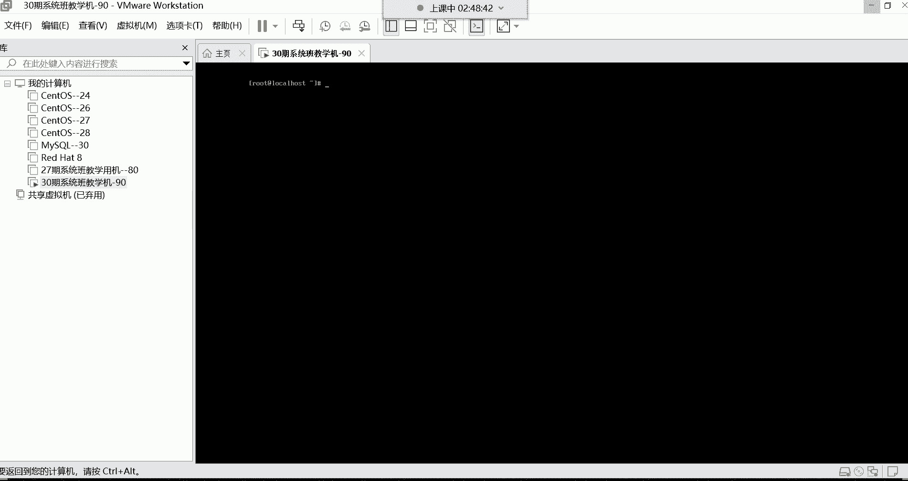

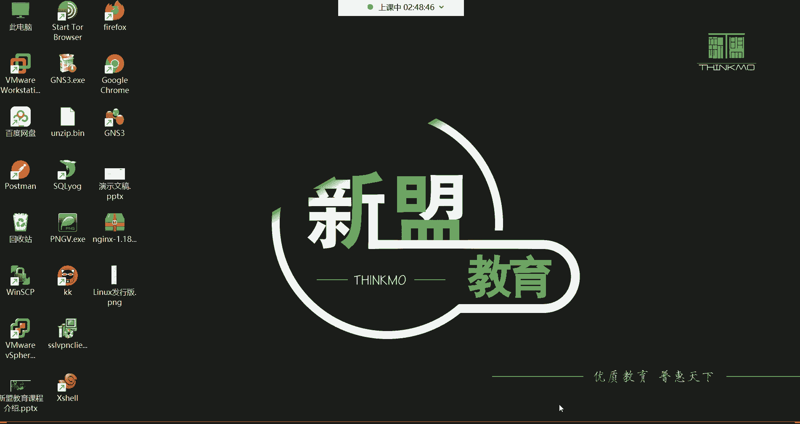

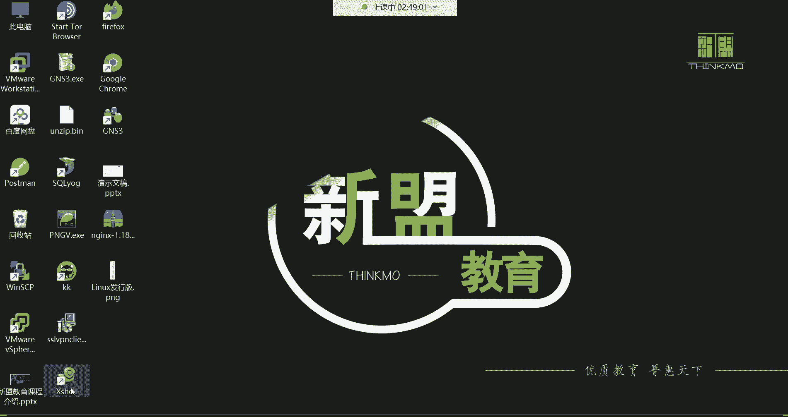

上一节我们完成了Linux系统的安装。系统安装好后，我们需要重启它。在虚拟机界面选择“重启”选项，让系统重新启动。

重启后，我们会看到一个命令行登录界面，提示“localhost login:”。由于我们安装的是最小化系统（无图形界面），因此需要通过命令行登录。在提示符后输入用户名 **`root`** 并按回车。接着输入root用户的密码（输入时屏幕不会显示字符，这是出于安全考虑），输入完毕后再次按回车即可登录系统。

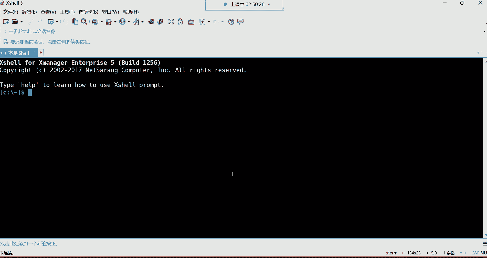

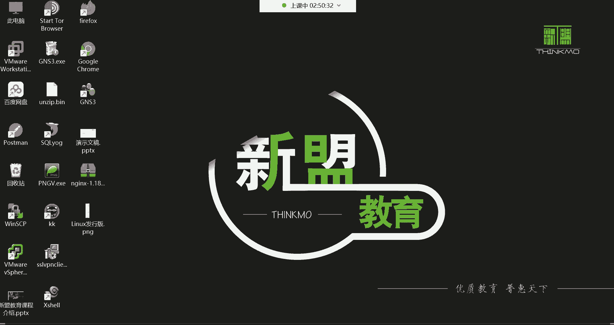

登录成功后，命令行提示符会发生变化，例如变为 `[root@localhost ~]#`，这表示我们已经以root用户身份成功登录到系统中。

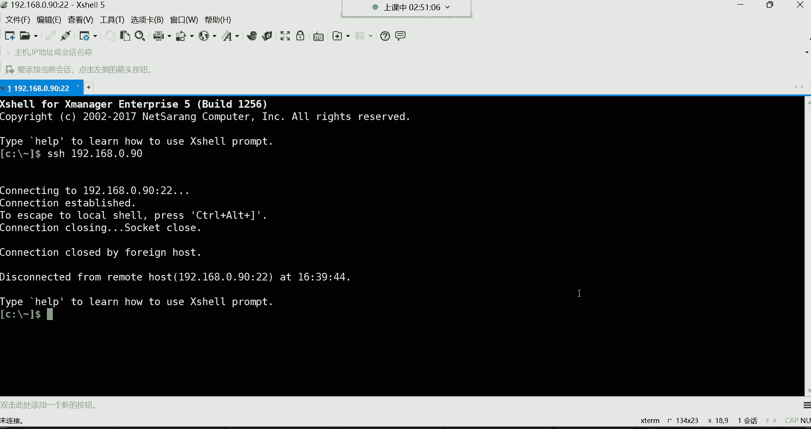

## 配置虚拟机网络 🌐

成功登录后，我们发现由于DNS配置有误，系统网络可能存在问题。对于初学者，直接编辑复杂的网络配置文件（如 `/etc/sysconfig/network-scripts/` 下的文件）较为困难。因此，我们需要通过更直观的方式来配置网络，以确保虚拟机能够被远程连接。

我们将使用远程连接工具（如Xshell）来管理虚拟机，这更符合企业实际运维场景。但在连接之前，必须正确配置虚拟机的网络设置。

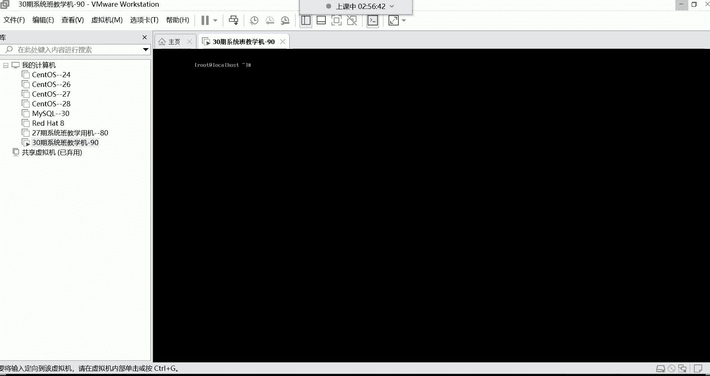

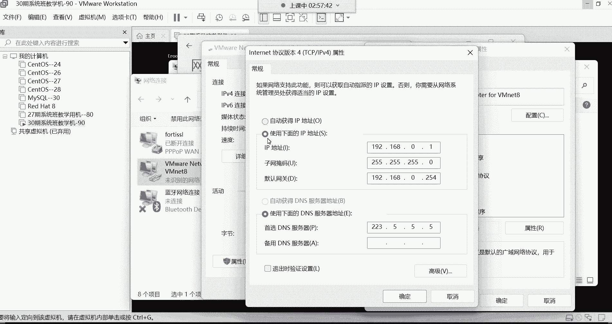

以下是配置虚拟机网络的关键步骤，分为虚拟机软件设置和主机网卡设置两部分。

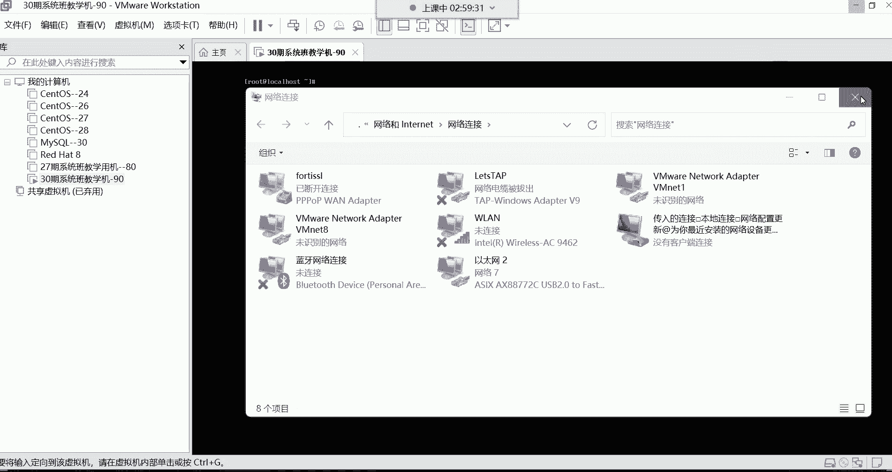

### 1. 配置VMware虚拟网络编辑器

首先，我们需要在VMware软件中设置虚拟网络。

1.  打开VMware，点击顶部菜单栏的“编辑”，选择“虚拟网络编辑器”。
2.  在弹出的窗口中，选中“VMnet8（NAT模式）”。
3.  取消勾选“使用本地DHCP服务将IP地址分配给虚拟机”选项。这一步非常重要，可以防止IP地址自动变化，导致我们无法用固定IP连接。
4.  设置子网IP。例如，将其设置为 **`192.168.0.0`**。
5.  设置子网掩码为 **`255.255.255.0`**。
6.  点击“NAT设置”按钮，将网关IP设置为 **`192.168.0.254`**。
7.  依次点击“确定”和“应用”使设置生效。

### 2. 配置主机VMnet8网卡

接下来，我们需要在Windows主机上配置对应的虚拟网卡。

1.  打开Windows系统的“网络和Internet设置”，进入“更改适配器选项”。
2.  找到名为“VMware Network Adapter VMnet8”的虚拟网卡，右键选择“属性”。
3.  双击“Internet协议版本4 (TCP/IPv4)”。
4.  选择“使用下面的IP地址”，并填写以下信息：
    *   IP地址：**`192.168.0.1`**
    *   子网掩码：**`255.255.255.0`**
    *   默认网关：**`192.168.0.254`**
    *   首选DNS服务器：**`223.5.5.5`** （或 `114.114.114.114`）
5.  点击“确定”保存配置。

完成以上两步后，虚拟机和主机就处于同一个网段（`192.168.0.0/24`），并且网关一致，从而能够相互通信。

## 使用远程连接工具登录 🔑

网络配置妥当后，我们就可以使用远程连接工具登录虚拟机了。这里以Xshell为例。

1.  打开Xshell软件。
2.  点击“新建会话”，在协议中选择“SSH”。
3.  在主机栏中输入虚拟机的IP地址，例如 **`192.168.0.90`**。
4.  点击“连接”。首次连接时会弹出“SSH安全警告”，询问是否接受主机密钥，选择“接受并保存”。
5.  在登录界面中输入用户名 **`root`** 和密码，即可成功登录到虚拟机的命令行界面。

现在，所有对Linux系统的操作都可以在这个远程终端中进行了。这是一个常用的快捷键：**`Ctrl + L`** 可以快速清屏，让终端界面更整洁。

## Linux应用领域与岗位介绍 💼

系统安装和网络配置是学习的基础。接下来，我们了解一下Linux广阔的应用前景和相关的职业岗位，这有助于明确学习目标。

### Linux的广泛应用

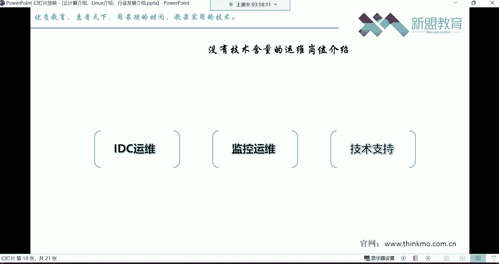

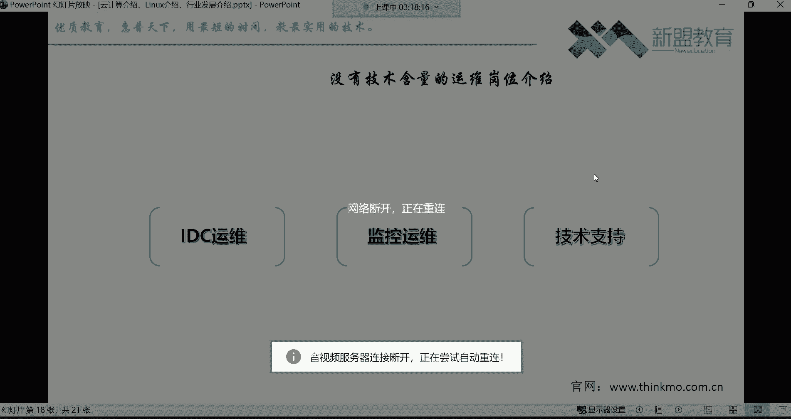

Linux系统已经渗透到我们生活和生产的方方面面：
*   **基础服务**：金融、政务、交通、医疗、通信等行业的后台服务器。
*   **前沿技术**：云计算、大数据、人工智能领域的核心平台。
*   **超级计算**：全球500强超级计算机中，绝大多数都运行Linux系统。我国的“神威·太湖之光”和“天河二号”也使用基于Linux的麒麟系统。
*   **互联网服务**：我们日常使用的微信、淘宝、外卖、打车、在线支付等App，其服务端几乎都运行在Linux服务器上。
*   **移动设备**：Android手机系统的底层正是Linux。

### 推荐的技术岗位

学习Linux运维后，可以朝以下几个有发展的技术岗位努力：
1.  **运维工程师**：入门首选岗位，负责服务器和业务的日常维护。
2.  **容器/K8s运维工程师**：专注于容器化和云原生技术。
3.  **云平台运维工程师**：维护公有云或私有云平台。
4.  **DBA（数据库管理员）**：负责数据库的安装、配置、优化和备份。
5.  **自动化运维/运维开发工程师**：通过编写脚本或工具提升运维效率。
6.  **运维架构师**：负责设计整体系统架构，通常需要开发经验。

这些岗位的薪资起步一般在8000元以上，平均可达万元左右。

### 需谨慎选择的岗位

对于寻求技术成长的同学，以下岗位需要谨慎考虑，它们通常技术含量低、多为外包、发展受限：
*   **IDC运维**：主要在机房进行巡检、填写报告，工作单调，与Linux技术关系不大。
*   **监控运维**：负责盯守监控系统，发送告警信息，技术提升空间小。
*   **技术支持**：类似客服，处理用户工单，将技术问题转交后端工程师。

## 运维行业的优势与学习建议 📚

与其他IT岗位相比，运维岗位有其独特优势：
*   **入门门槛低**：零基础即可开始学习，对学历要求相对宽松（大专即可）。
*   **职业寿命长**：经验越丰富越有价值，没有明显的“35岁危机”。
*   **岗位需求大**：任何公司都需要运维人员保障业务稳定。

为了取得好的学习效果，请遵循以下建议：
*   **上课以听和理解为主**，不要急于同步操作，以免跟不上节奏。课后利用录屏、笔记和课件进行练习和复习。
*   **前期遇到问题**，及时在课程群中向答疑老师提问。
*   **后期遇到问题**，先尝试自己思考、搜索（百度/谷歌）解决，培养排错能力。
*   **同学间互帮互助**。在帮助他人解决问题的过程中，也能加深自己对知识的理解。

坚持是成功的关键。学习过程中难免会有倦怠期，唯有持之以恒，才能在这个行业站稳脚跟，获得理想的回报。

## 总结 🎯

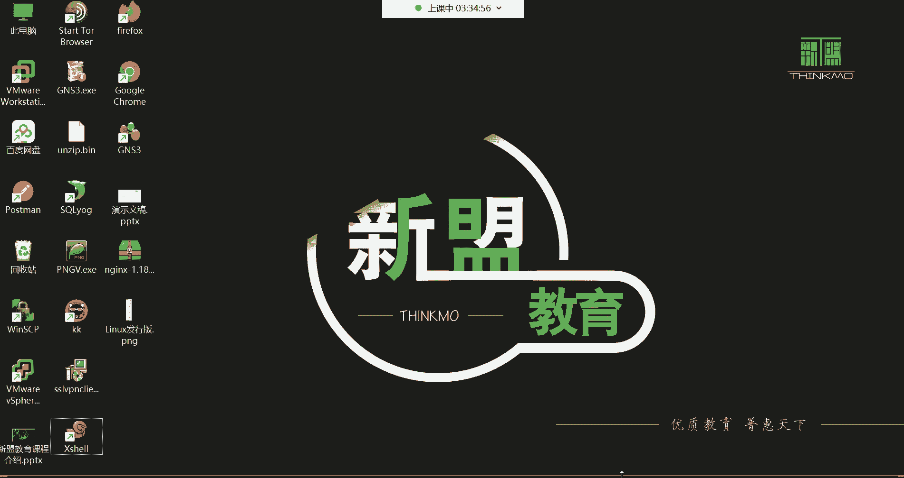

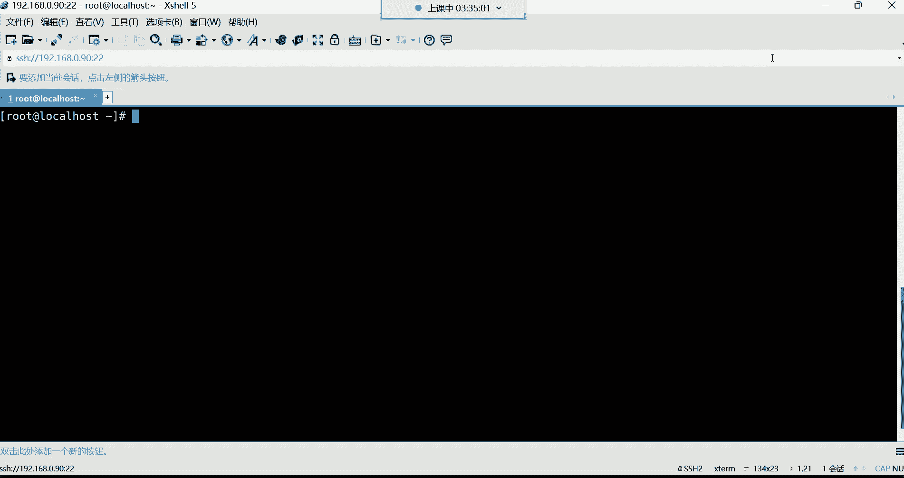

本节课中我们一起学习了三个核心内容：
1.  **系统登录**：掌握了在无图形界面下通过命令行登录Linux系统的方法。
2.  **网络配置与远程连接**：详细讲解了如何配置VMware虚拟网络和主机网卡，以实现通过Xshell等工具远程稳定连接和管理Linux虚拟机。这是企业运维中最常用的操作方式。
3.  **行业认知**：了解了Linux系统广泛的应用领域，明确了运维工程师等技术岗位的发展路径和前景，并获得了高效学习的实用建议。

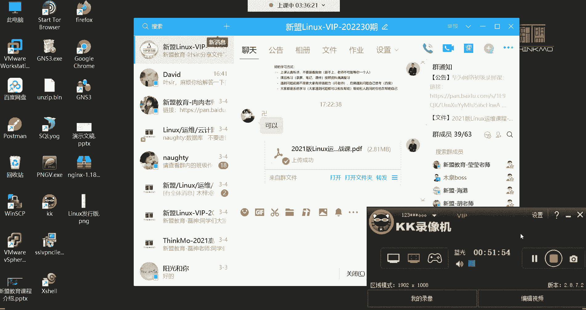

这些知识和认知将为后续深入学习Linux命令和系统管理奠定坚实的基础。