# Linux运维入门：P40：常用特殊符号补充 📝


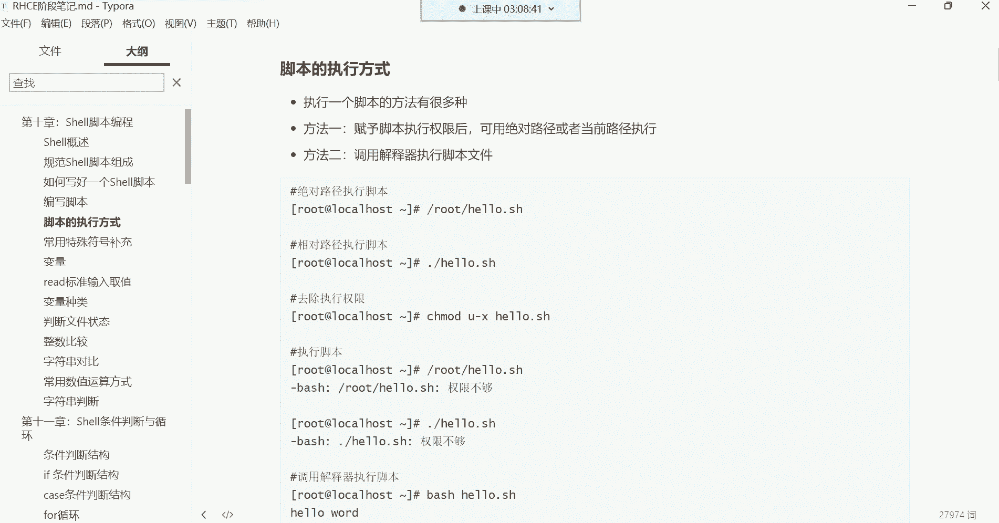

在本节课中，我们将学习Shell脚本中几种常用的特殊符号及其功能。这些符号对于编写和理解脚本至关重要，它们能帮助我们处理文本、进行计算以及动态地获取命令结果。

## 脚本执行方式 🚀

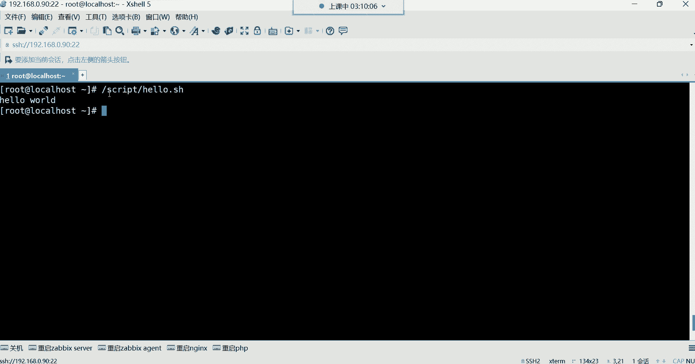

上一节我们介绍了如何编写Shell脚本，本节中我们来看看如何执行一个写好的脚本。脚本的执行主要有两种方式。

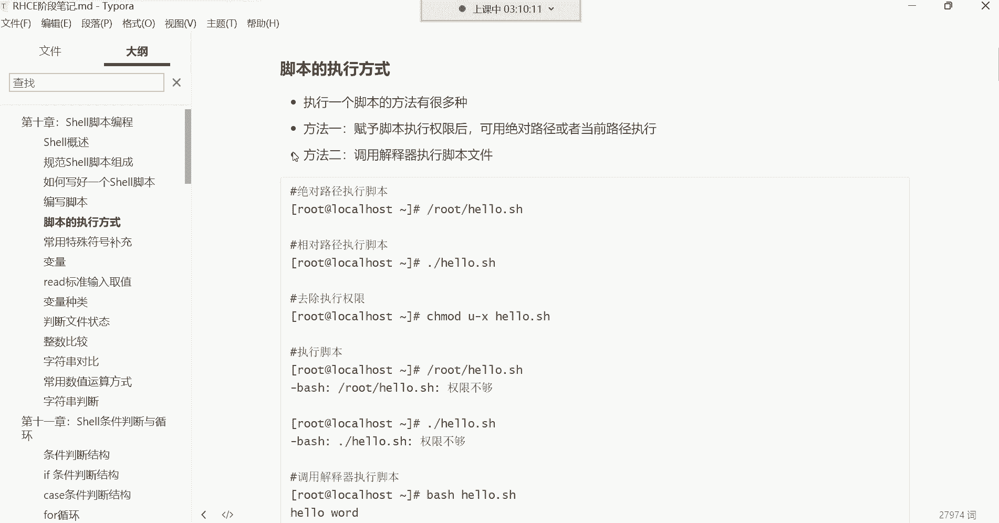

### 赋予执行权限并执行

这是最常用的方法。首先需要给脚本文件赋予执行权限，然后通过指定其路径来运行。

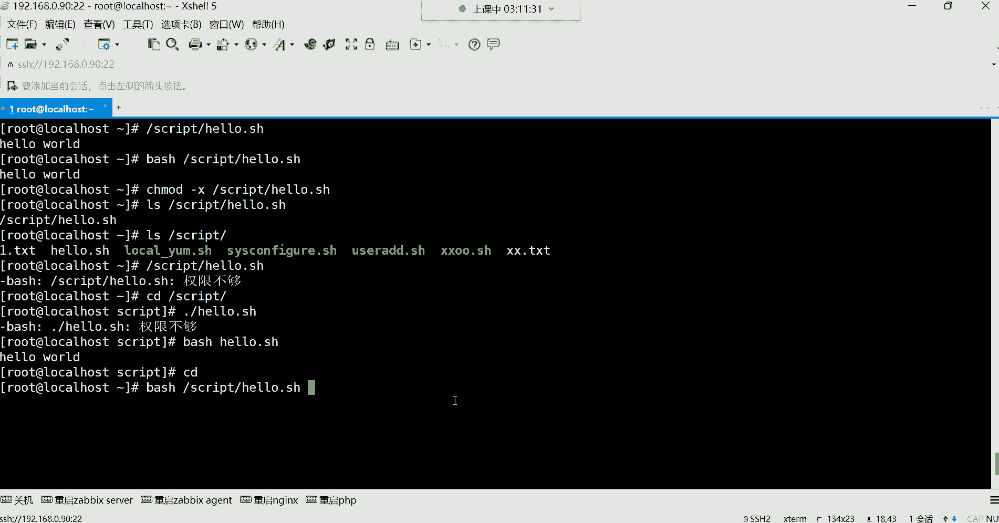

以下是具体步骤：
1.  使用 `chmod +x` 命令为脚本添加执行权限。
2.  使用**绝对路径**（从根目录`/`开始的完整路径）或**相对路径**（相对于当前目录的路径）来执行脚本。

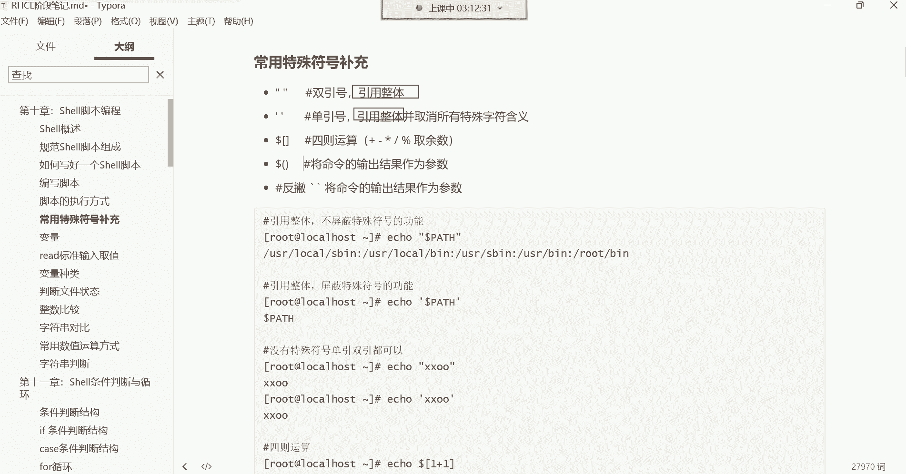

**注意**：使用相对路径执行时，必须在脚本名前加上 `./`（点杠），以告诉系统在当前目录下寻找该文件。如果不加，系统会将其视为一条命令去`PATH`环境变量中查找，从而导致“命令未找到”的错误。

**代码示例**：
```bash
# 赋予脚本执行权限
chmod +x /script/hello.sh

# 使用绝对路径执行
/script/hello.sh

# 进入脚本所在目录，使用相对路径执行（必须加 ./）
cd /script
./hello.sh
```

### 调用解释器执行

这种方法不要求脚本文件本身具有执行权限，而是直接调用Shell解释器（如`bash`）来运行脚本。

以下是具体方法：
1.  使用 `bash` 命令，后面跟上脚本的路径。
2.  同样支持绝对路径和相对路径。

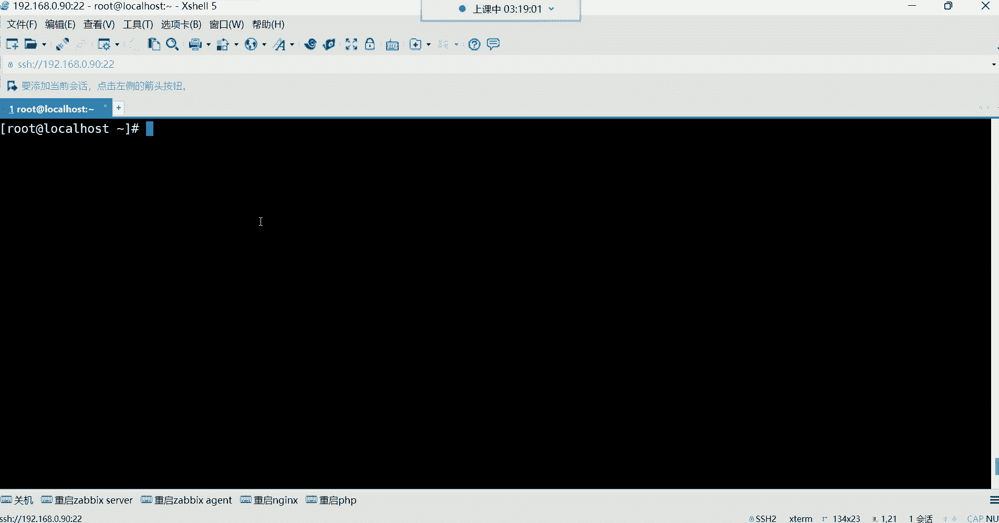

**代码示例**：
```bash
# 即使脚本没有执行权限，也可以执行
bash /script/hello.sh

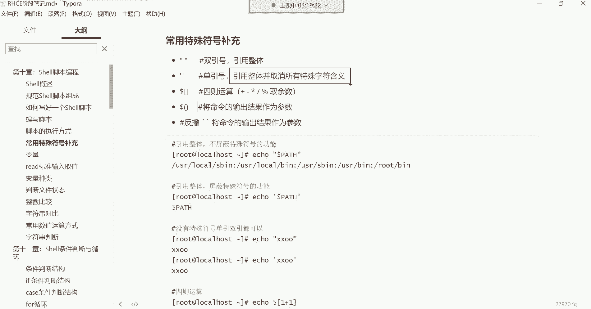


# 或者使用相对路径
cd /script
bash hello.sh
```

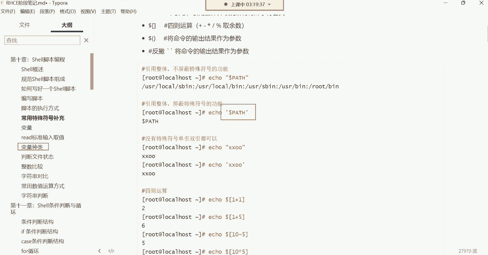

**总结**：两种执行方式都能达到目的。第一种（赋予权限后执行）更为常见和直观；第二种（调用解释器）则在某些不想改变文件权限的场景下有用。

## 引号的作用：引用整体 🔤

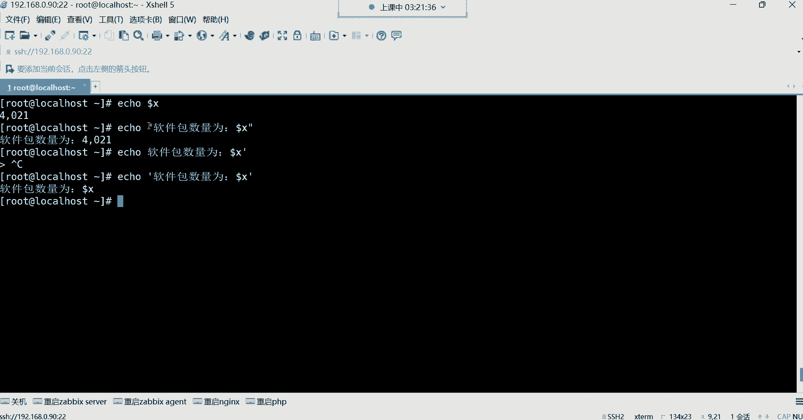

在Shell中，引号的主要功能是**引用整体**。这意味着被引号包围的内容会被视为一个单一的字符串，其中的空格、特殊字符都将失去分隔作用。

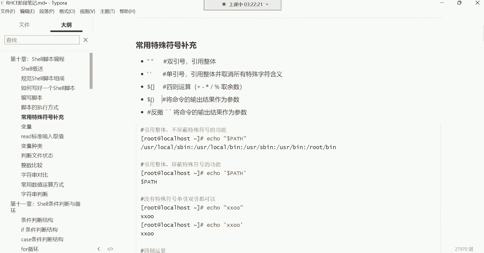

### 双引号与单引号

双引号(`"`)和单引号(`'`)都能实现引用整体的功能，但它们有一个关键区别。

以下是核心区别：
*   **双引号**：会解释其中的**特殊符号**（如变量前缀`$`、命令替换符`` ` `` 或 `$()` 等），让它们发挥原有功能。
*   **单引号**：会**取消**其中所有特殊符号的特殊含义，将其原样输出。

**代码示例**：
```bash
# 定义一个变量
package_count=10

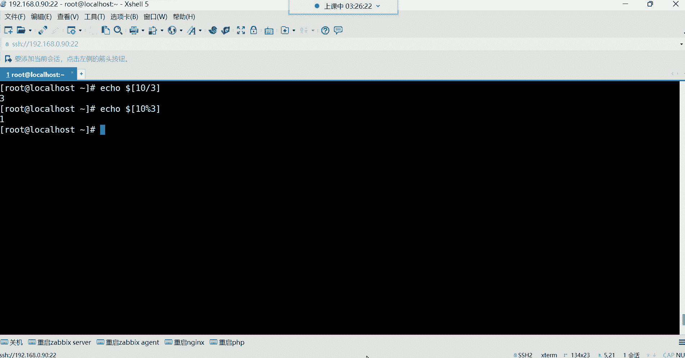

# 双引号：$ 符号被解释，输出了变量的值
echo "软件包数量为：$package_count"
# 输出：软件包数量为：10

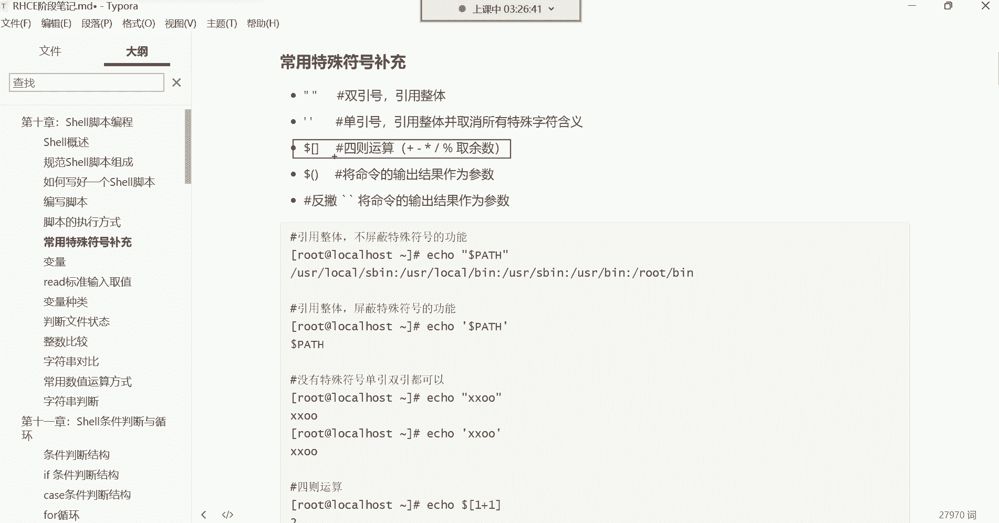

# 单引号：$ 符号被当作普通字符，原样输出
echo '软件包数量为：$package_count'
# 输出：软件包数量为：$package_count
```

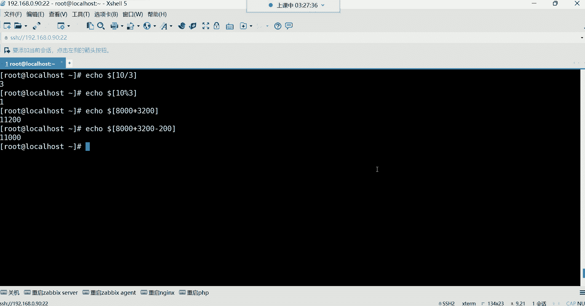

**应用场景**：创建包含空格的文件名时，必须使用引号将其引为整体，否则空格会被系统理解为参数分隔符。

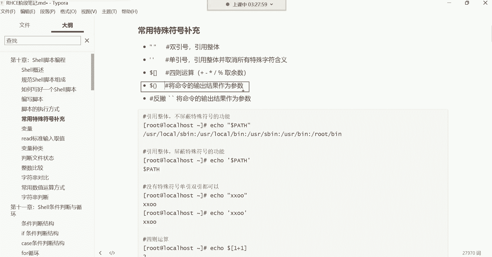

**代码示例**：
```bash
# 错误：创建了两个文件，一个叫 `A`，一个叫 `B`
touch A B

# 正确：创建了一个名为 `A B` 的文件
touch "A B"
# 或
touch 'A B'
```

**注意**：如果文件名开头或结尾有空格，在删除时也需要用引号将其引为整体，否则可能无法正确删除。

## 四则运算 ➕➖✖️➗

在Shell脚本中，我们经常需要进行数学计算。可以使用 `$(( ))` 结构来进行四则运算。

**公式**：`$(( 算术表达式 ))`

以下是支持的运算符：
*   `+`：加法
*   `-`：减法
*   `*`：乘法
*   `/`：除法（取整）
*   `%`：取模（取余数）

**代码示例**：
```bash
# 加法
echo $((1 + 1))   # 输出：2

# 减法
echo $((5 - 3))   # 输出：2

# 乘法
echo $((2 * 3))   # 输出：6

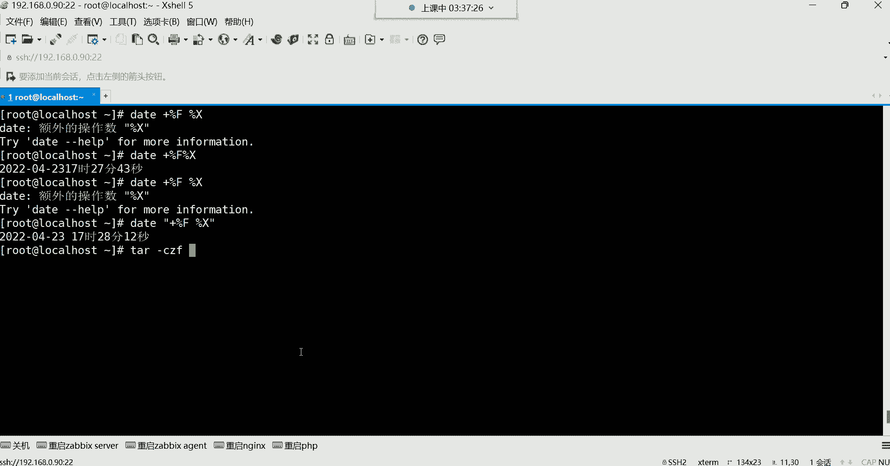

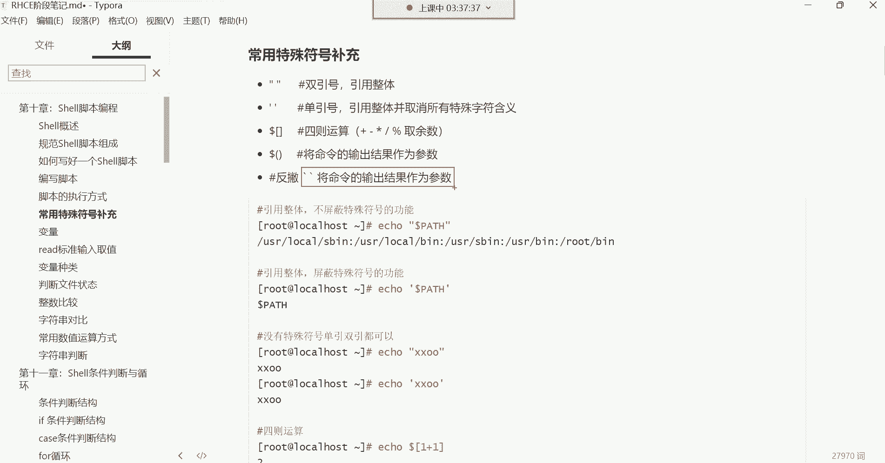

# 除法 (取整)
echo $((10 / 3))  # 输出：3

# 取模 (取余数)
echo $((10 % 3))  # 输出：1
```

## 反引号与$()：命令替换 🔄

这是一个非常强大的功能，它允许我们将**一条命令的输出结果**，作为另一条命令的**参数**。这被称为命令替换。

有两种语法可以实现命令替换，它们的功能完全相同：
1.  反引号：`` `command` ``
2.  `$()`：`$(command)`

**注意**：现代脚本更推荐使用 `$()`，因为它更清晰，且嵌套使用时不易出错。

**代码示例**：创建一个文件名包含当前日期时间的备份文件。
```bash
# 使用反引号
touch backup_`date +%F`.tar.gz

# 使用 $() （推荐）
touch backup_$(date +%F).tar.gz
# 假设今天是2023-10-27，则创建文件：backup_2023-10-27.tar.gz
```

**复杂示例**：在备份时，动态生成包含精确时间的文件名，避免覆盖之前的备份。
```bash
# 生成形如 log_backup_2023-10-27_14-30-15.tar.gz 的文件名
tar -czf "log_backup_$(date +%F_%H-%M-%S).tar.gz" /var/log/*.log
```
**解释**：`$(date +%F_%H-%M-%S)` 会先执行 `date` 命令，生成类似 `2023-10-27_14-30-15` 的字符串，然后这个字符串被作为 `tar` 命令文件名的一部分。

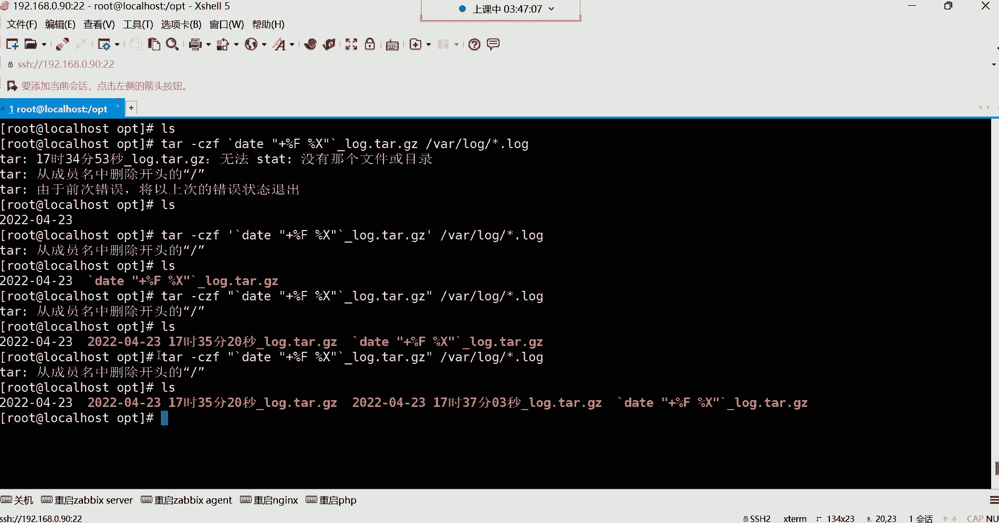

---

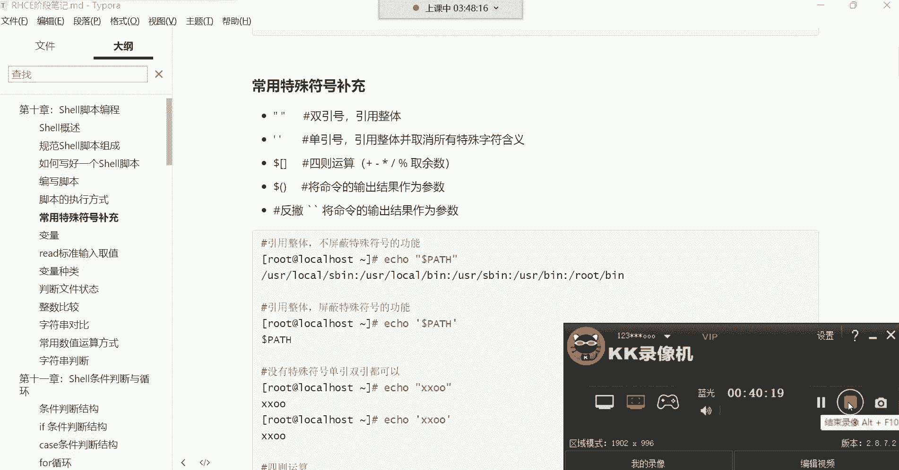

本节课中我们一起学习了Shell脚本的几种核心特殊符号和用法。我们掌握了两种执行脚本的方式，理解了双引号和单引号在“引用整体”上的相同点与关键区别，学会了使用`$(( ))`进行基本的数学运算，并重点掌握了通过反引号或`$()`进行命令替换的强大技巧。这些是构建复杂、自动化Shell脚本的基石，请务必理解和熟练运用。