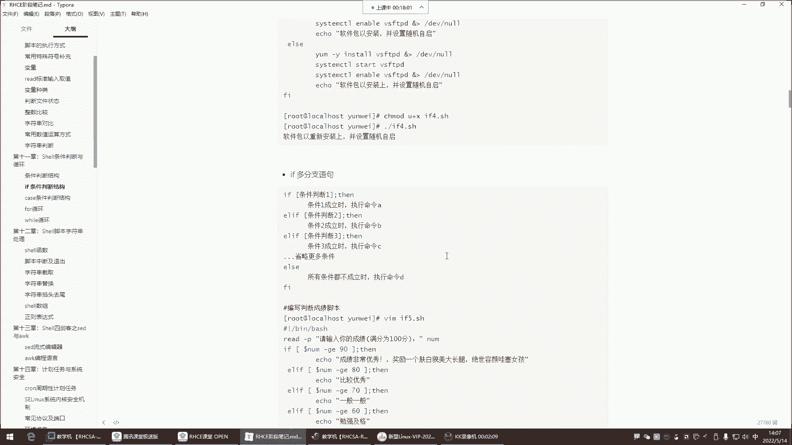
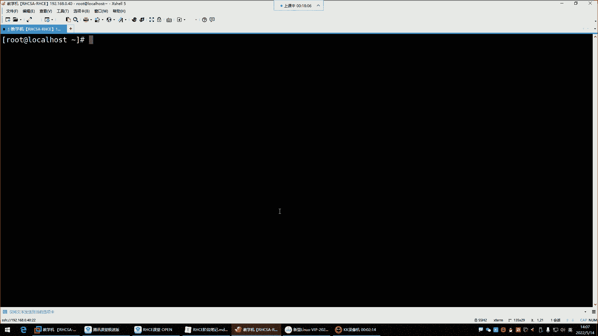
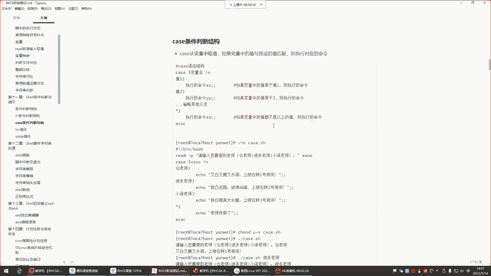
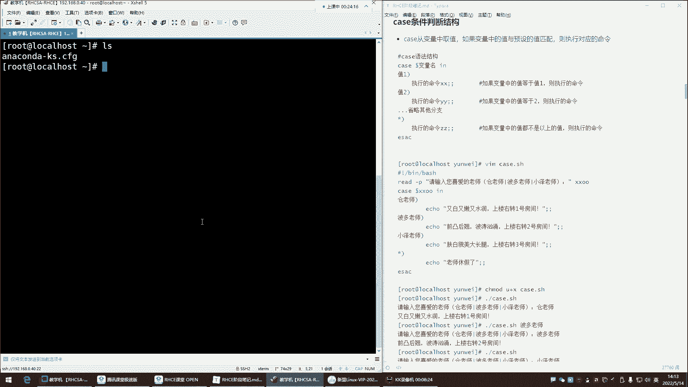
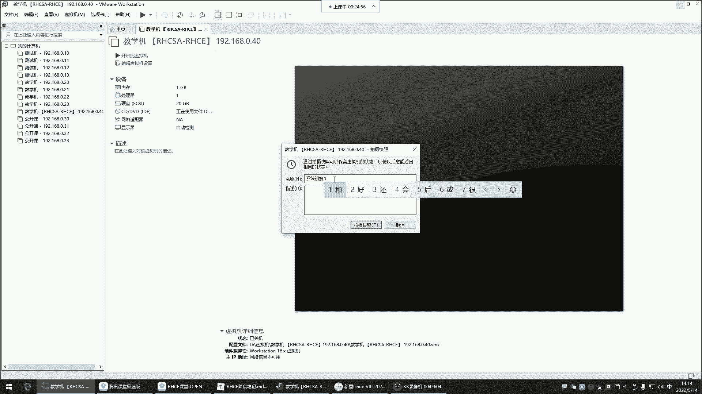
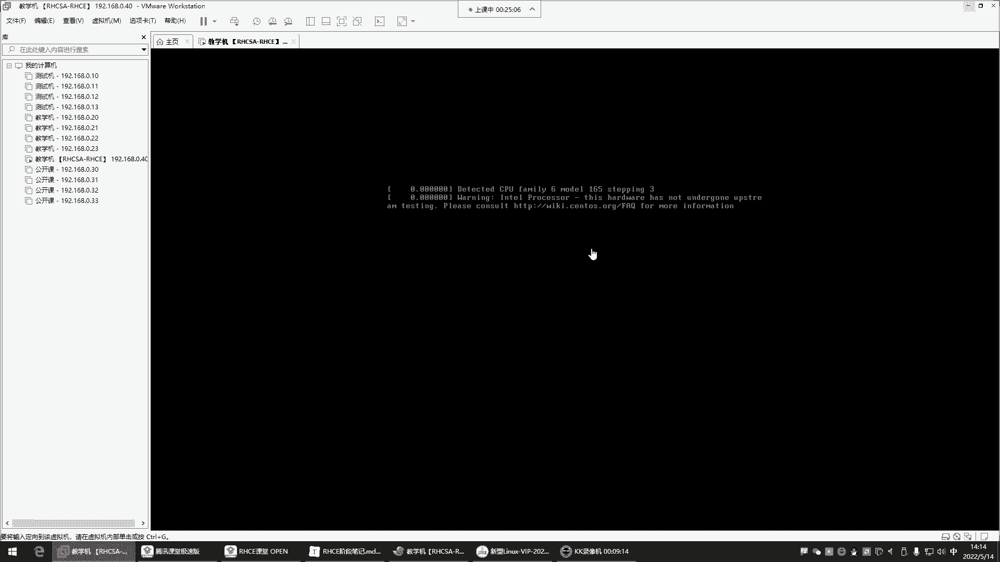
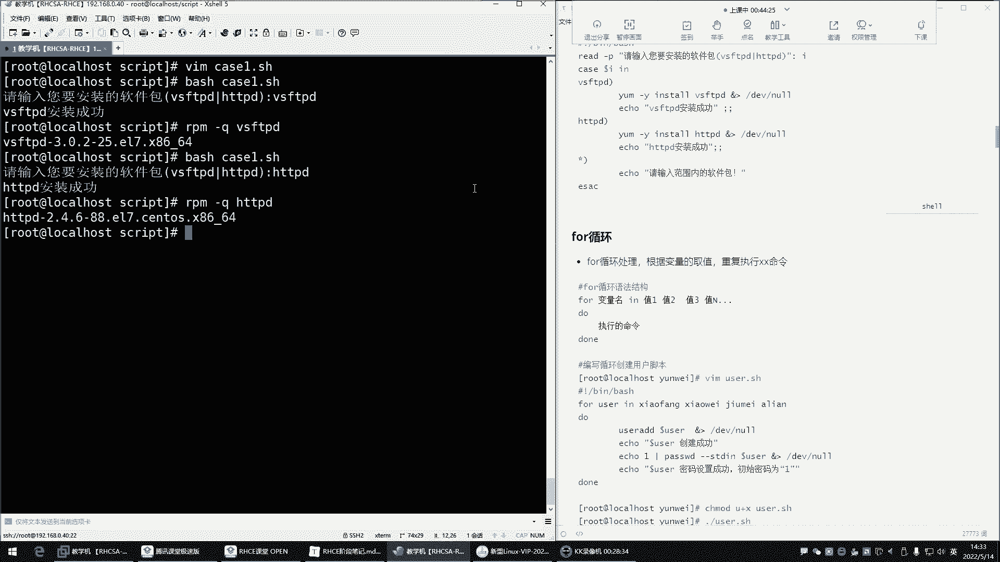
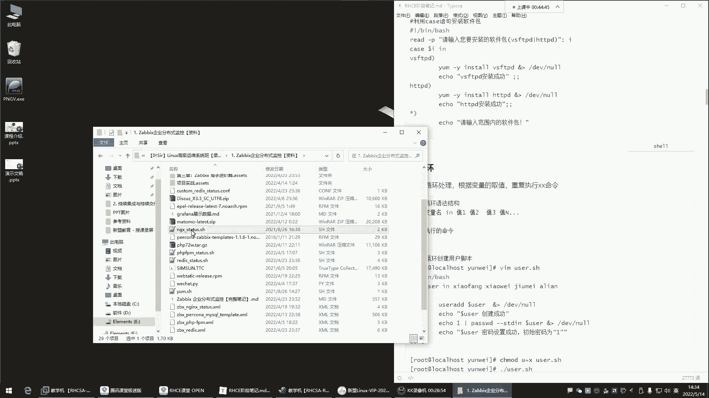
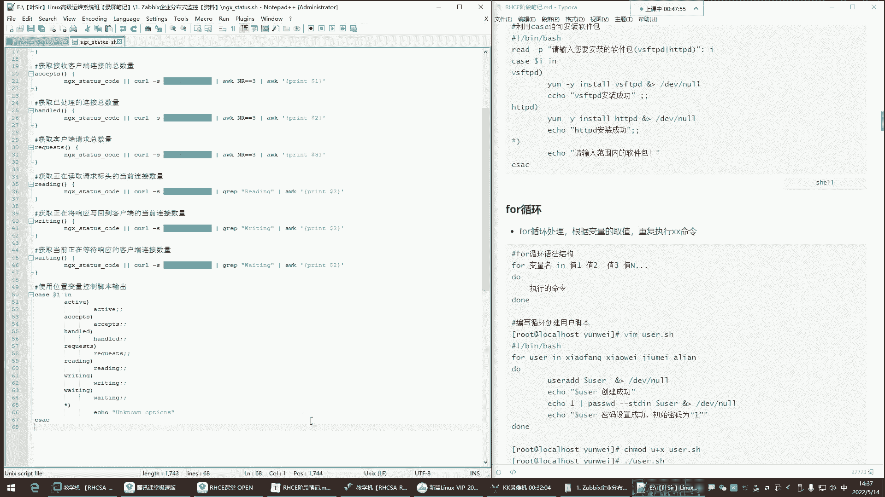

Linux运维全套培训课程：P43：红帽RHCE-7.case条件判断、for循环





在本节课中，我们将要学习Shell脚本中的`case`条件判断语句和`for`循环语句。`case`语句提供了一种更简洁的方式来进行多条件匹配，而`for`循环则是自动化重复任务的有力工具。我们将通过实例演示它们的语法和应用场景，确保初学者能够理解和掌握。



---

### **case条件判断**

上一节我们介绍了`if`条件判断，本节中我们来看看`case`条件判断。`case`语句的功能与`if`类似，都是根据条件执行不同的命令，但它的语法更简洁，特别适用于对单一变量进行多种可能值的匹配判断。

**case语句的基本语法结构如下：**
```bash
case 变量名 in
    值1)
        命令序列1
        ;;
    值2)
        命令序列2
        ;;
    *)
        默认命令序列
        ;;
esac
```
它的工作原理是：从变量中取值，然后依次与预定义的值（如`值1`、`值2`）进行匹配。一旦匹配成功，就执行对应的命令序列，然后结束整个`case`判断（匹配即停止）。如果所有预设值都不匹配，则执行`*)`后面的默认命令序列。




以下是`case`语句的一个典型应用示例，它根据用户输入执行不同操作：
```bash
#!/bin/bash
read -p “请输入你喜欢的老师名字：” teacher
case $teacher in
    “苍老师”)
        echo “苍老师特点：又白又嫩又水润。上楼右转一号房间。”
        ;;
    “波多老师”)
        echo “波多老师特点：前凸后翘，波涛汹涌。上楼右转二号房间。”
        ;;
    “小泽老师”)
        echo “小泽老师特点：肤白貌美大长腿。上楼右转三号房间。”
        ;;
    *)
        echo “该老师今天休息，没上班。”
        ;;
esac
```
执行这个脚本时，用户输入的值会被存入变量`teacher`。`case`语句会检查`$teacher`的值，如果匹配“苍老师”，则输出对应的描述；如果匹配“波多老师”或“小泽老师”，则输出各自的描述；如果输入了任何未预设的名字，则执行`*)`分支，输出默认信息。





**需要注意的语法细节：**
*   每个分支的命令序列必须以双分号`;;`结束，这表示该分支的结束。
*   最后的`esac`是`case`的反写，标志着整个`case`语句的结束。
*   匹配是**大小写敏感**的。

---

### **for循环**

掌握了条件判断后，我们来看看如何让计算机帮我们自动重复执行任务，这就需要用到循环。`for`循环是Shell脚本中最常用的循环结构之一，它特别适合用于遍历一个已知的列表。

**for循环的基本语法结构如下：**
```bash
for 变量名 in 值列表
do
    命令序列
done
```
它的执行过程是：变量会依次获取“值列表”中的每一个值，每获取一个值，就执行一次`do`和`done`之间的命令序列，直到列表中的所有值都被遍历完毕。

以下是`for`循环的几个核心应用示例：

**示例1：遍历数字序列**
```bash
#!/bin/bash
for i in 1 2 3 4 5
do
    echo “数字是：$i”
done
```
这个脚本会依次输出数字1到5。

**示例2：遍历字符串列表**
```bash
#!/bin/bash
for person in 小明 小红 小刚
do
    echo “你好，$person！”
done
```
这个脚本会依次向列表中的每个人问好。

**示例3：结合命令生成列表**
```bash
#!/bin/bash
for file in $(ls /tmp/*.log)
do
    echo “正在处理文件：$file”
    # 这里可以添加处理文件的命令，例如备份或删除
    # cp $file /backup/
done
```
这个脚本会找出`/tmp`目录下所有以`.log`结尾的文件，并依次打印出每个文件名。`$(ls /tmp/*.log)`命令的执行结果（即文件列表）会成为`for`循环遍历的“值列表”。

**示例4：使用数字区间**
```bash
#!/bin/bash
for num in {1..5}
do
    echo “区间数字：$num”
done
```
`{1..5}`是一个大括号扩展，它会自动生成从1到5的数字序列，非常方便。

**示例5：类C语言风格的for循环**
```bash
#!/bin/bash
for ((i=1; i<=5; i++))
do
    echo “类C风格计数：$i”
done
```
这种写法与C、Java等编程语言中的`for`循环类似，更适用于基于计数器进行循环的场景。

---





### **总结**

本节课中我们一起学习了Shell脚本中两个非常重要的结构：`case`条件判断和`for`循环。
*   **`case`语句**：提供了一种清晰、简洁的方式来编写多分支选择逻辑，特别适合匹配固定的字符串或模式。
*   **`for`循环**：是自动化重复任务的基础，它可以遍历各种列表（数字、字符串、文件等），极大地提高了脚本的处理能力。



理解并熟练运用这两种结构，是编写高效、自动化Shell脚本的关键一步。在接下来的课程中，我们将学习更多的循环和控制结构，使你的脚本更加强大。