# Linux运维基础：P44：case条件判断与for循环

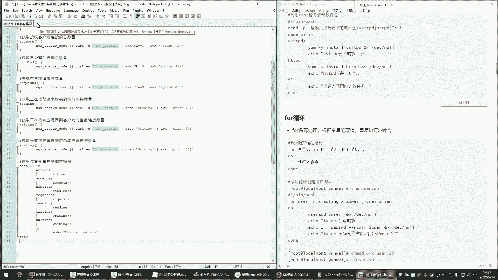


在本节课中，我们将学习Shell脚本编程中的两个重要结构：`case`条件判断和`for`循环。通过学习，你将能够理解它们的基本语法和典型应用场景，例如使用`for`循环批量创建用户或测试服务器连通性。

## case条件判断

上一节我们介绍了基础的`if`条件判断，本节中我们来看看另一种判断结构——`case`语句。`case`语句用于根据变量的不同取值，执行不同的命令序列。

它的基本语法结构如下：
```bash
case 变量 in
模式1)
    命令序列1
    ;;
模式2)
    命令序列2
    ;;
*)
    默认命令序列
    ;;
esac
```
当执行脚本时，需要给这个变量一个值。`case`语句会根据该值匹配对应的模式，如果匹配成功，就执行该模式下的命令；如果所有模式都不匹配，则执行默认（用`*`表示）的命令序列。因此，`case`语句本质上是一个多分支的条件判断工具。

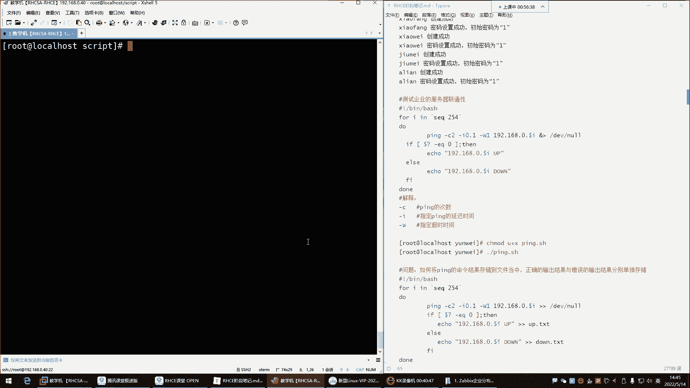

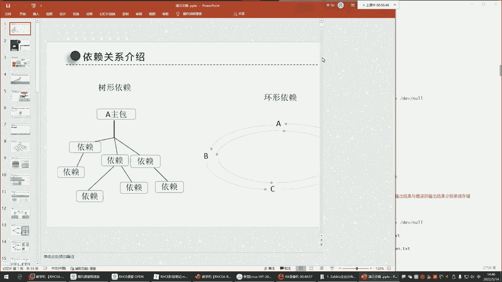


## for循环

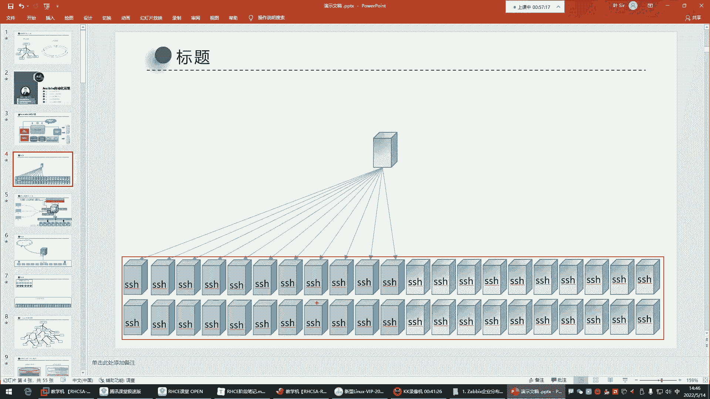

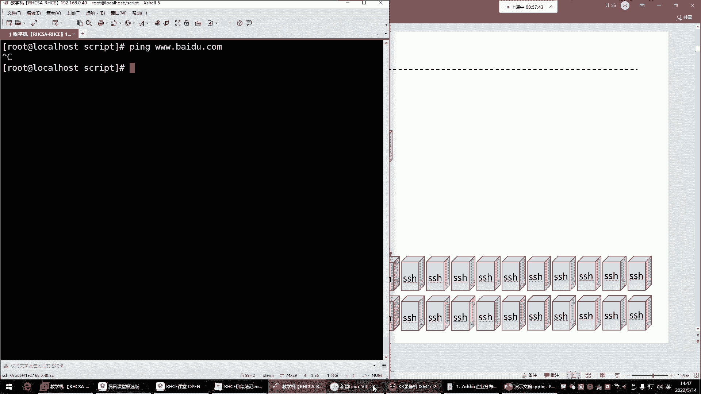

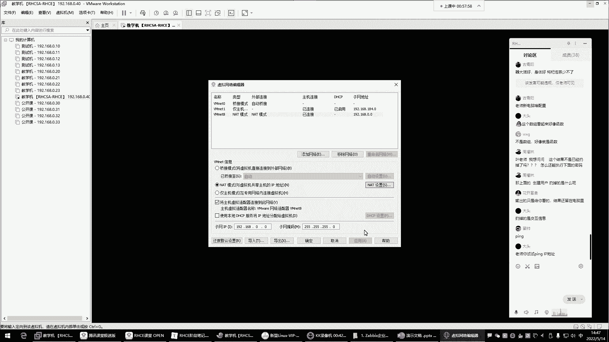

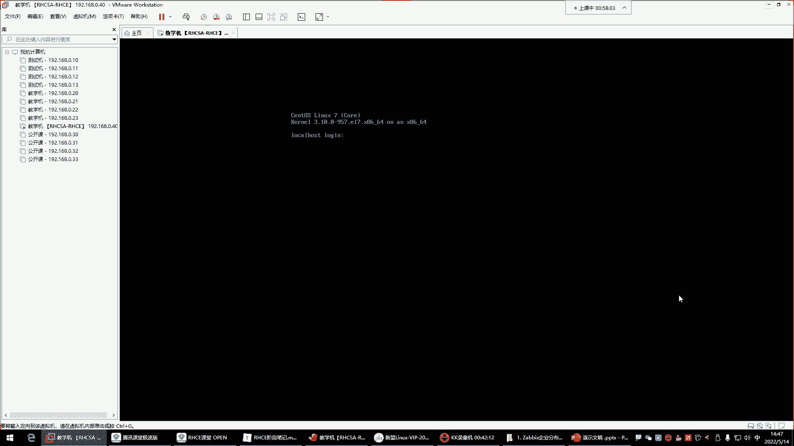

理解了`case`判断后，我们进入循环结构的学习。`for`循环的核心作用是**循环处理**，即根据变量取值，重复执行某些命令。

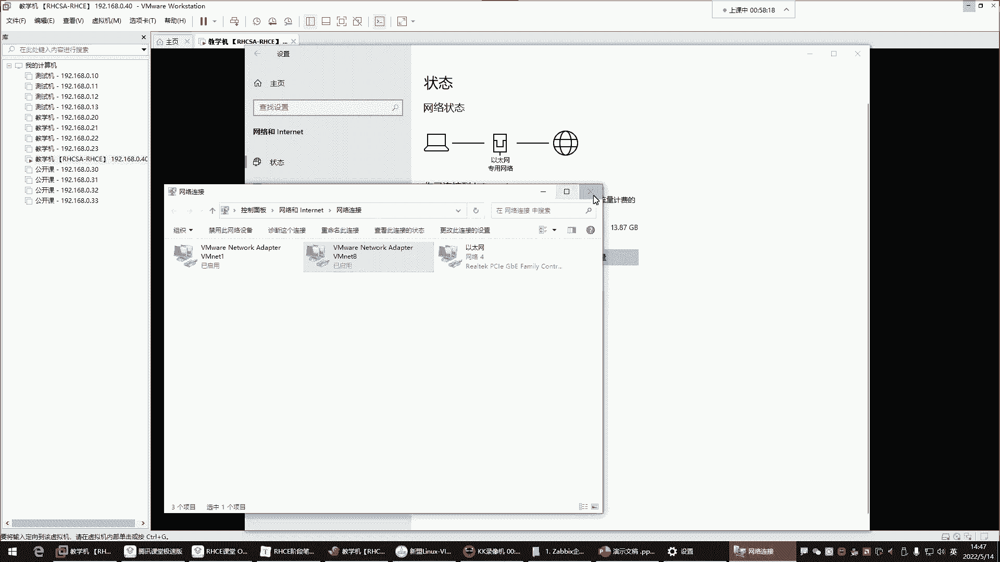

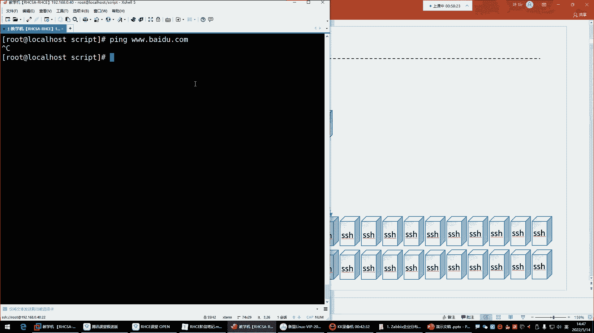

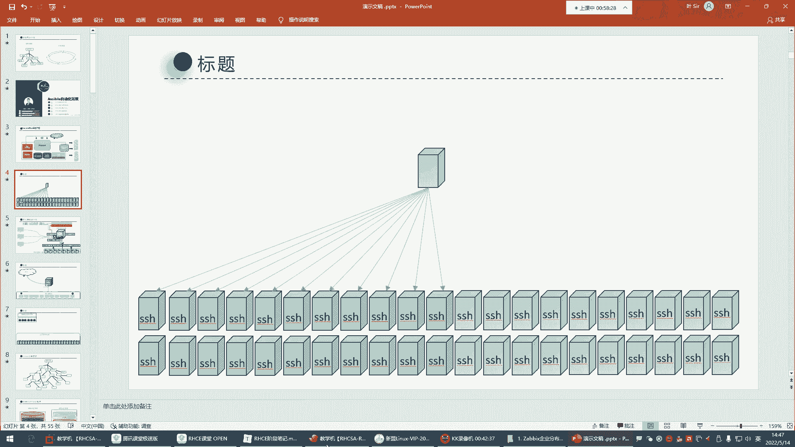

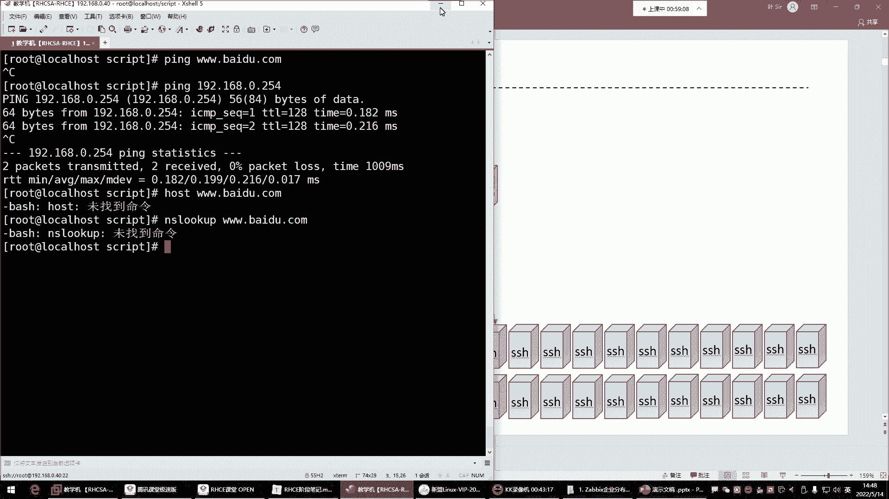

以下是`for`循环的基本语法：
```bash
for 变量名 in 值列表
do
    命令序列
done
```
循环会对`in`关键字后面的“值列表”中的每一个值进行迭代。每次迭代，都会将列表中的一个值赋给“变量名”，然后执行`do`和`done`之间的命令序列。当列表中的所有值都被处理完毕后，循环结束。

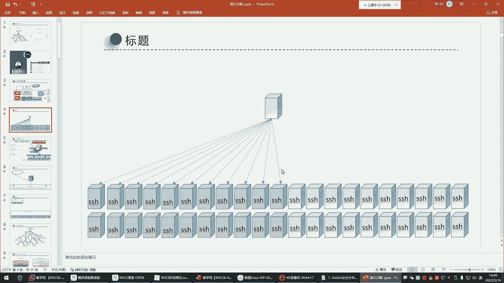


### 示例：批量创建用户

为了直观理解，我们来看一个使用`for`循环批量创建用户的脚本示例。

以下是脚本的核心思路：
1.  定义一个包含多个用户名的值列表。
2.  使用`for`循环遍历这个列表。
3.  在循环体内，使用`useradd`命令创建用户，并用`passwd`命令为其设置密码。

```bash
#!/bin/bash
for user in xiaofang xiaowei jiumei alian
do
    useradd $user &> /dev/null
    echo “用户 $user 创建成功”
    echo “1” | passwd --stdin $user &> /dev/null
    echo “用户 $user 的密码设置成功”
done
```
**脚本执行过程解析：**
*   第一次循环，变量`user`的值为`xiaofang`，脚本会执行创建用户`xiaofang`并设置密码的命令。
*   本次循环结束后，脚本回到`in`后面查看下一个值`xiaowei`，并开始第二次循环。
*   如此重复，直到列表中的所有用户名都被处理完，整个循环结束，脚本退出。
*   命令后的`&> /dev/null`作用是将命令的输出信息（无论成功或报错）重定向到“黑洞”设备，即丢弃这些输出，使屏幕显示更整洁。

### 示例：测试服务器连通性

在企业运维中，经常需要检查一批服务器的网络状态。`for`循环可以自动化完成这个繁琐的任务。

**需求场景：** 作为服务器维护人员，需要快速找出网络中宕机的机器。

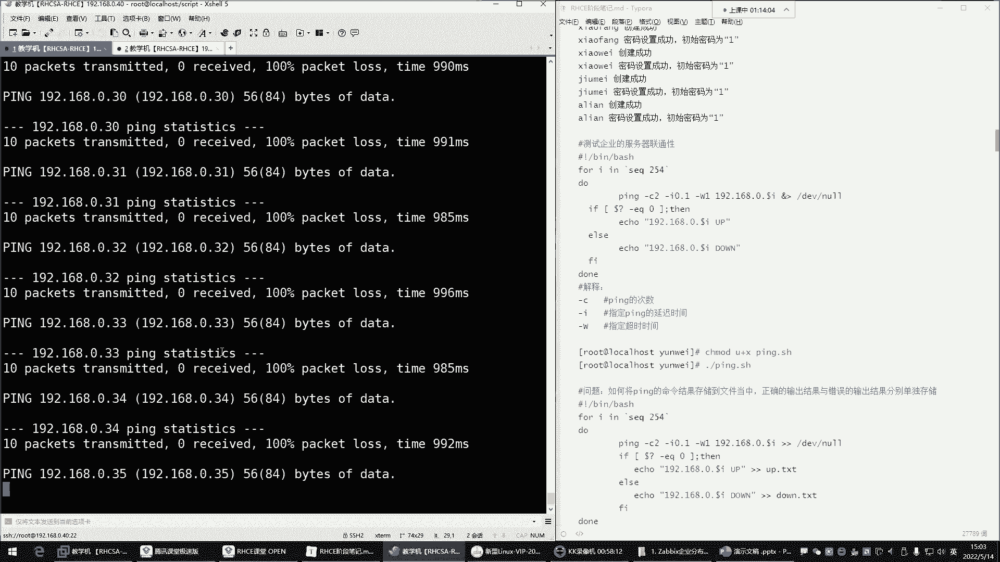

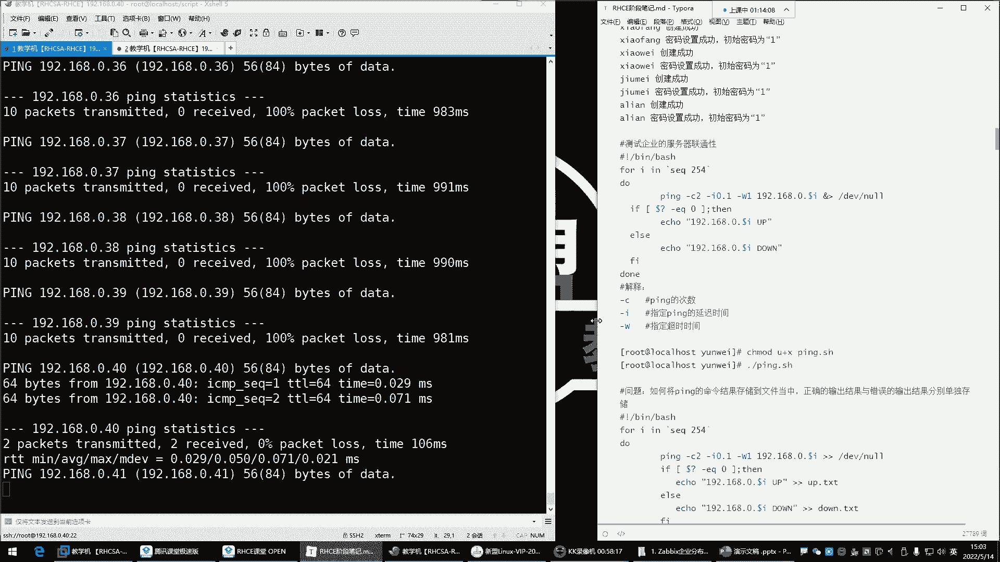

**传统方法的弊端：** 手动对每个IP地址执行`ping`命令效率极低。

**解决方案：** 编写`for`循环脚本，自动`ping`一个网段内的所有IP。

初始脚本可能如下：
```bash
#!/bin/bash
for ip in 192.168.0.{1..254}
do
    ping $ip
done
```
但直接运行上述脚本会遇到问题：`ping`命令如果不加参数，会一直运行直到手动中断，导致脚本卡住。

**优化脚本：** 我们需要控制`ping`命令的行为，使其快速完成。
```bash
#!/bin/bash
for ip in 192.168.0.{1..254}
do
    # -c1: 只ping1次；-i0.1: 间隔0.1秒；-W1: 超时1秒
    ping -c1 -i0.1 -W1 $ip &> /dev/null
    if [ $? -eq 0 ]; then
        echo “$ip is up.”
    else
        echo “$ip is down.”
    fi
done
```
**脚本优化点说明：**
1.  `ping -c1 -i0.1 -W1 $ip`：这条命令限定了`ping`的次数、间隔和超时时间，使其快速返回结果。
2.  `&> /dev/null`：丢弃`ping`命令本身的输出。
3.  `if [ $? -eq 0 ]`：`$?`是一个特殊变量，代表上一条命令（即`ping`）的退出状态。退出状态为`0`通常表示命令成功执行（即主机可达）。这里用`-eq`（等于）进行整数比较判断。
4.  根据`ping`的结果，使用`echo`输出清晰的主机状态信息。

**进阶优化：** 当需要测试的IP很多时，屏幕输出会非常杂乱。我们可以将结果分类保存到文件中，并将脚本放在后台运行。
```bash
#!/bin/bash
for ip in 192.168.0.{1..254}
do
    ping -c1 -i0.1 -W1 $ip &> /dev/null
    if [ $? -eq 0 ]; then
        echo “$ip” >> /opt/net_up.txt
    else
        echo “$ip” >> /opt/net_down.txt
    fi
done &
```
**说明：**
*   `>>`：将输出以追加的方式写入文件，而不是覆盖。
*   `&`：在命令末尾添加`&`符号，可以将整个脚本放到后台执行，这样就不会占用当前的终端窗口。
*   执行后，可以通过查看`/opt/net_up.txt`和`/opt/net_down.txt`文件来获取所有主机的状态列表。

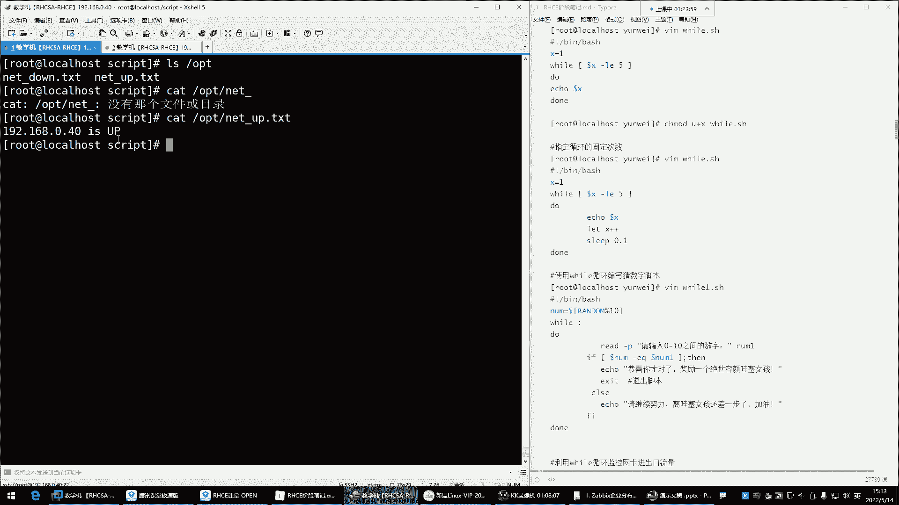

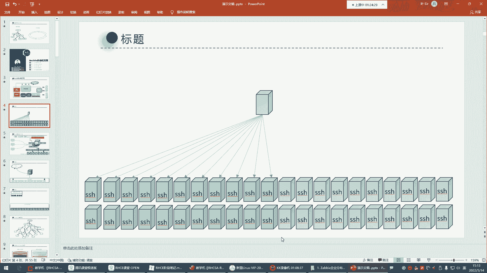

**补充知识：** 生成数字序列的两种方法
*   `{1..254}`：这是大括号扩展，直接生成从1到254的数字序列。
*   `` `seq 1 254` ``或`$(seq 1 254)`：使用`seq`命令生成序列。`seq 100 254`则可以生成从100到254的序列。

## 总结

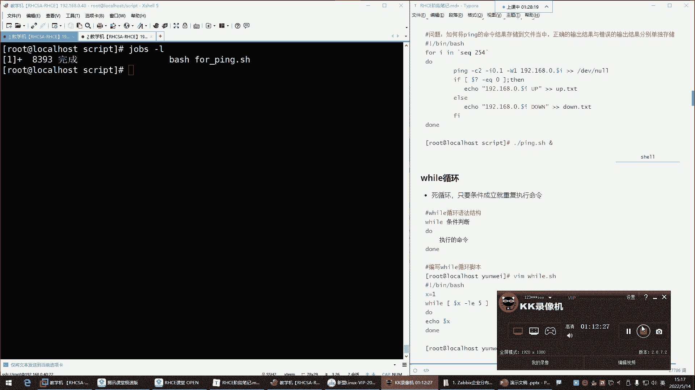

本节课中我们一起学习了Shell脚本中`case`条件判断和`for`循环的使用。
*   `case`语句适用于多分支的条件匹配，结构清晰。
*   `for`循环是自动化重复任务的神器，我们通过“批量创建用户”和“测试服务器连通性”两个案例，详细剖析了其工作原理、脚本编写思路以及常见的优化技巧（如控制命令输出、判断执行结果、后台运行等）。掌握这些基础结构，是迈向高效运维自动化的重要一步。