# Linux运维基础：P46：shell函数、脚本中断及退出、字符串处理

在本节课中，我们将学习Shell脚本中的几个重要概念：如何使用`while`循环进行持续监控，如何定义和使用函数来简化脚本，以及如何控制脚本的执行流程（中断与退出）。最后，我们还会简单了解字符串处理的基本操作。这些知识将帮助你编写更高效、更易读的Shell脚本。

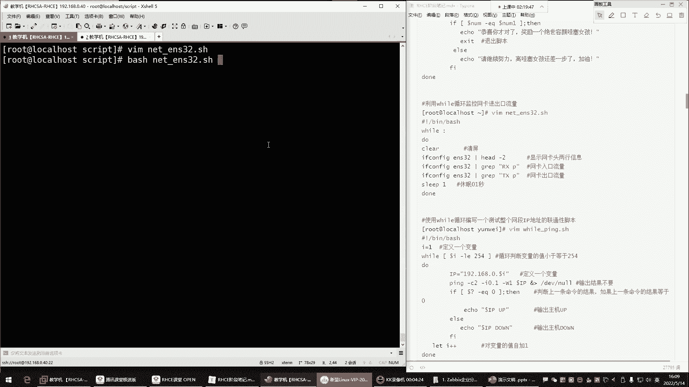

## 🔄 使用while循环进行持续监控

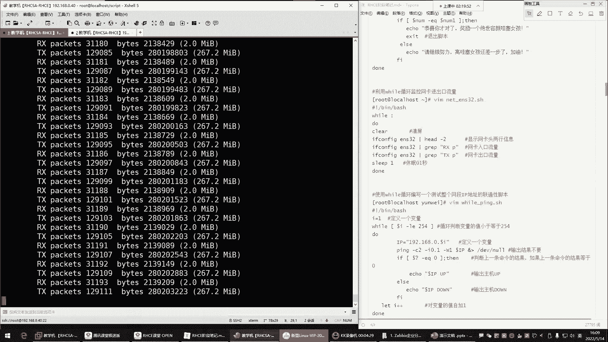

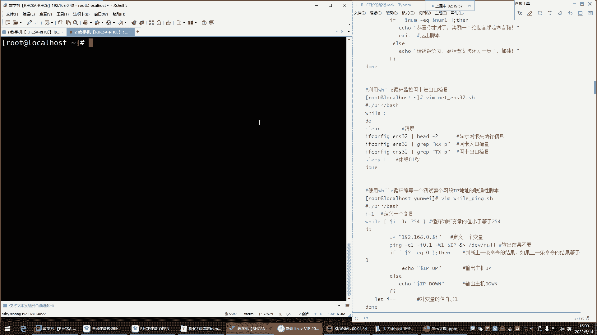

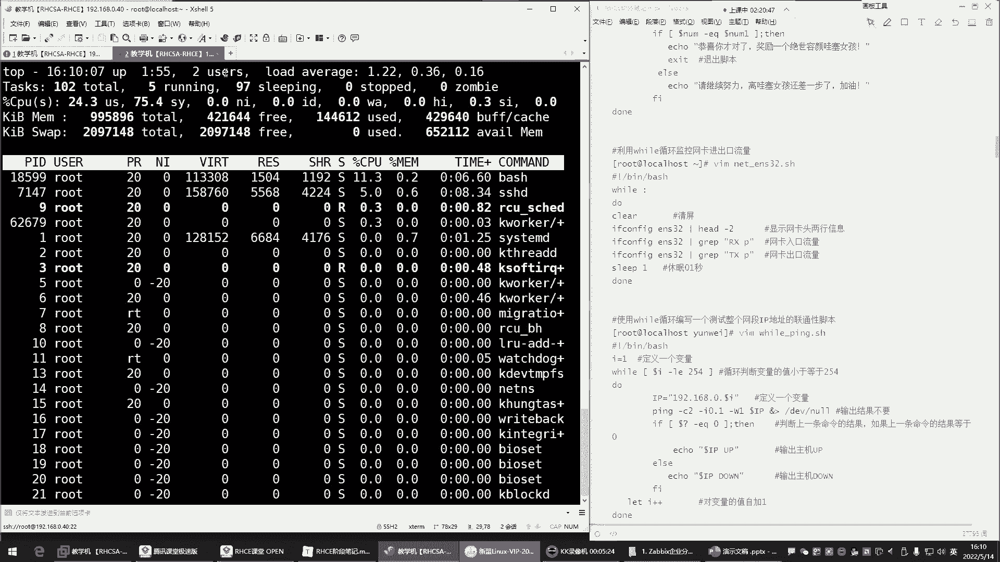

上一节我们介绍了`for`循环，本节中我们来看看`while`循环。`while`循环非常适合需要持续执行的任务，例如监控系统资源。

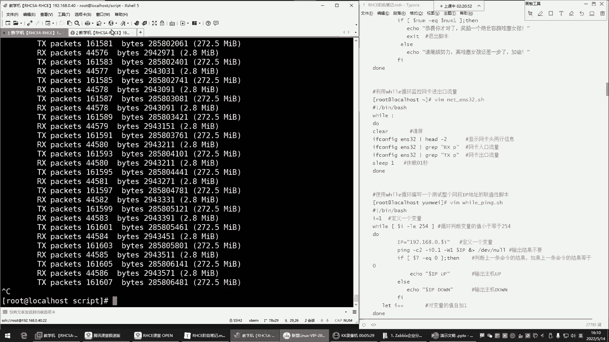

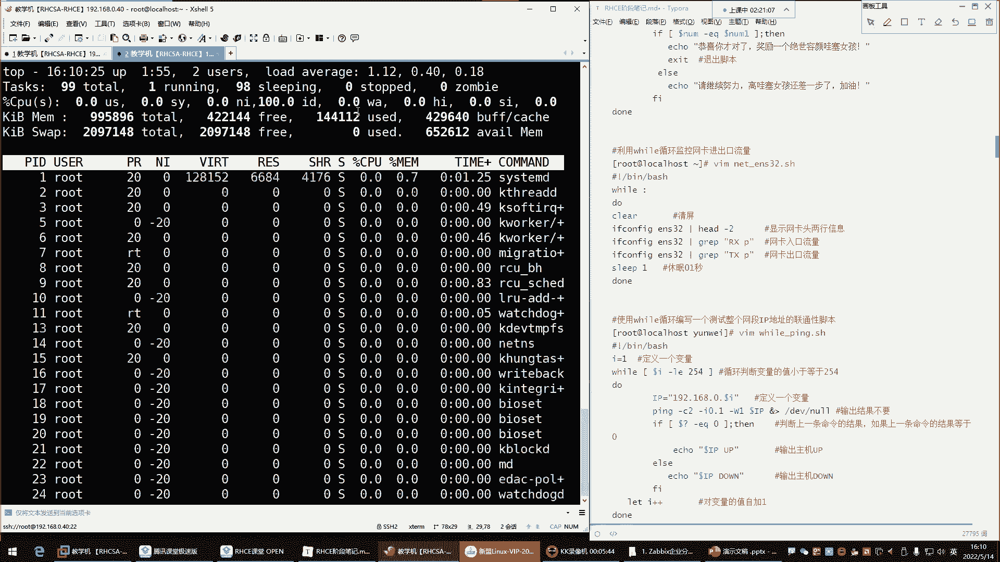

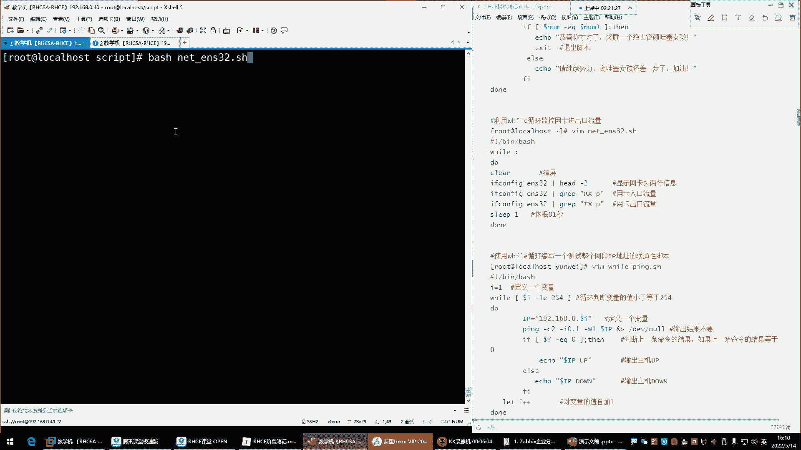

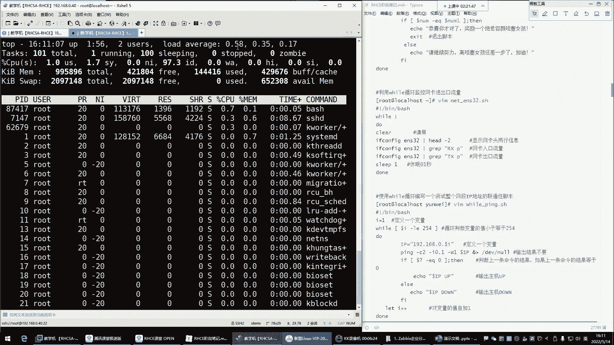

`while`循环的基本语法如下，其中`:`或`true`都可以用来创建一个无限循环（死循环）：
```bash
while :
do
    # 要执行的命令
done
```
或者
```bash
while true
do
    # 要执行的命令
done
```

例如，我们可以编写一个脚本来持续监控网卡的流量。以下是获取网卡`ens32`入口（RX）和出口（TX）流量的命令：
```bash
ifconfig ens32 | grep "RX packets"
ifconfig ens32 | grep "TX packets"
```

然而，直接将这些命令放入`while`循环会疯狂消耗CPU资源。为了降低CPU使用率，我们可以在循环中加入`sleep`命令，让脚本每次循环后“休息”一下。同时，使用`clear`命令清屏可以让输出更清晰。

以下是优化后的监控脚本示例：
```bash
#!/bin/bash
while :
do
    clear
    echo "入口流量:"
    ifconfig ens32 | grep "RX packets"
    echo "出口流量:"
    ifconfig ens32 | grep "TX packets"
    sleep 0.2
done
```
这个脚本会每隔0.2秒清屏并刷新显示网卡流量信息，既实现了持续监控，又避免了对CPU的过度消耗。

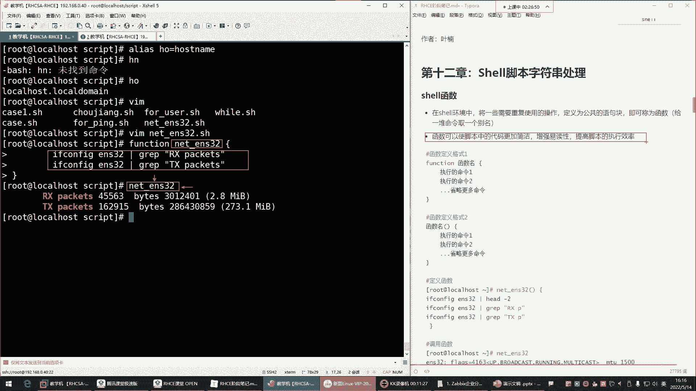

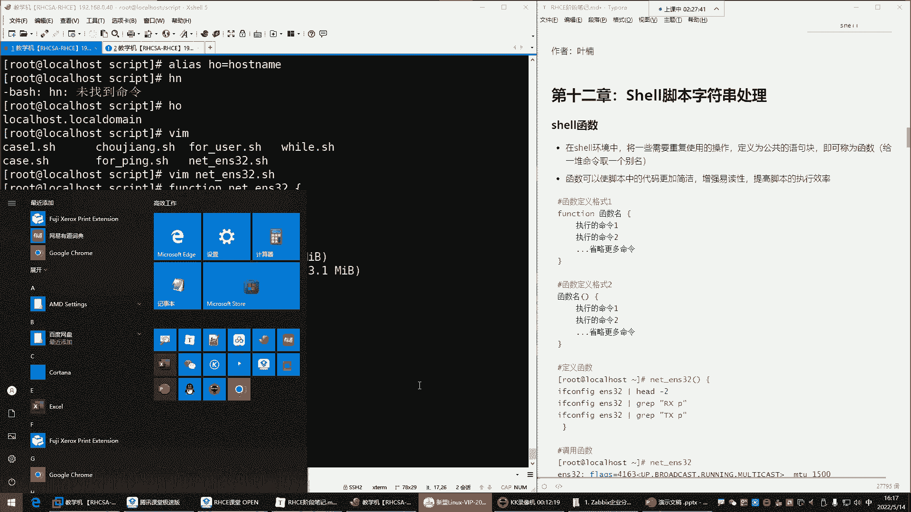

## 📦 脚本中的函数

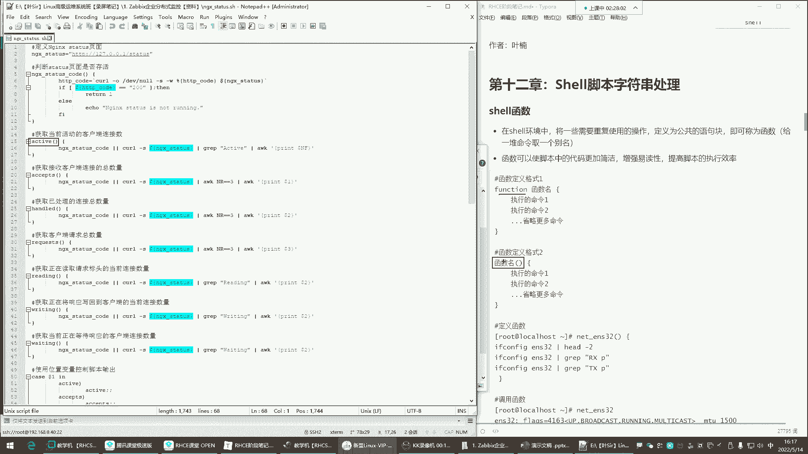

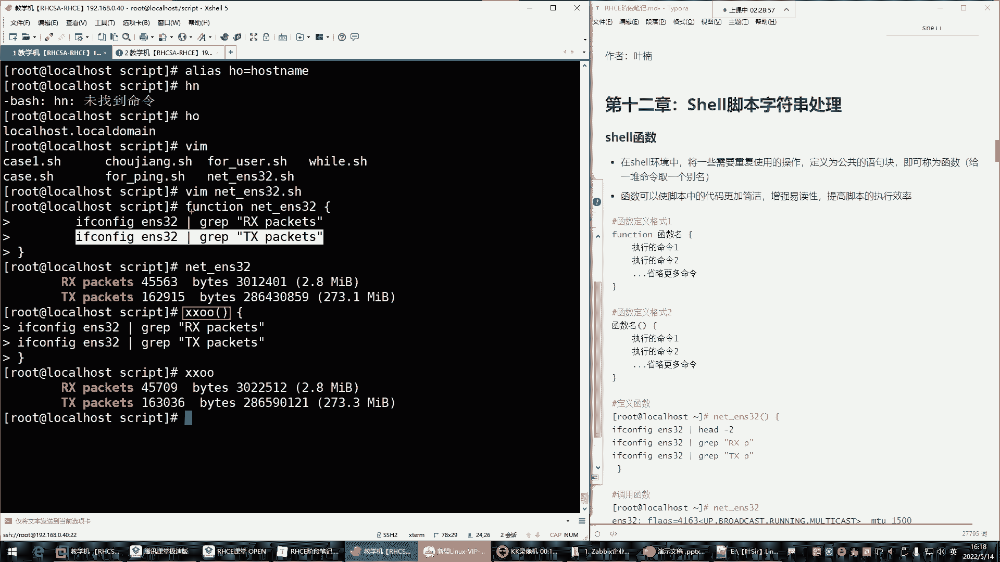

函数可以将一系列需要重复使用的命令封装起来，使脚本结构更清晰、代码更简洁，提高脚本的易读性和执行效率。你可以把它理解为给一堆命令取一个别名。

Shell中定义函数有两种常用格式。

第一种是使用`function`关键字：
```bash
function 函数名 {
    命令1
    命令2
    # ... 更多命令
}
```

第二种是更简洁的格式（推荐）：
```bash
函数名() {
    命令1
    命令2
    # ... 更多命令
}
```

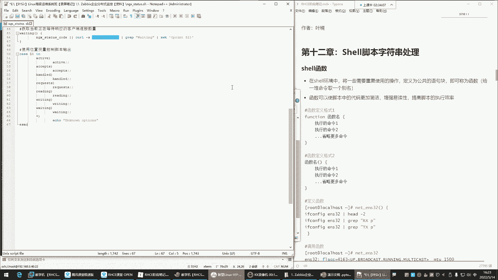

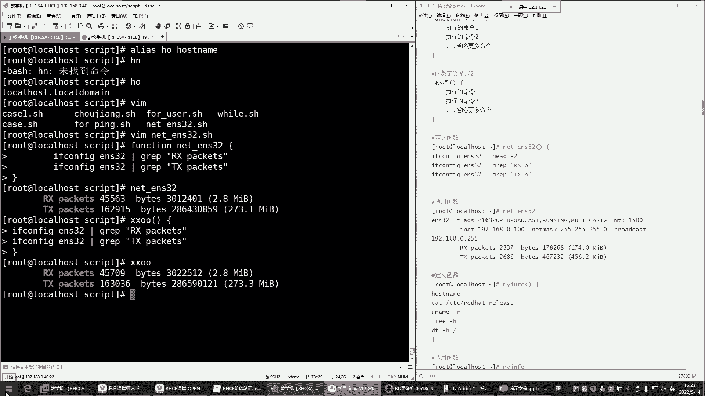

定义函数后，在脚本中需要执行这些命令的地方，只需调用函数名即可。

以下是一个简单的函数定义与调用示例。这个函数用于查看系统的基本信息：
```bash
#!/bin/bash
# 定义一个名为sys_info的函数
sys_info() {
    hostname
    cat /etc/redhat-release
    free -h
    df -h /
}

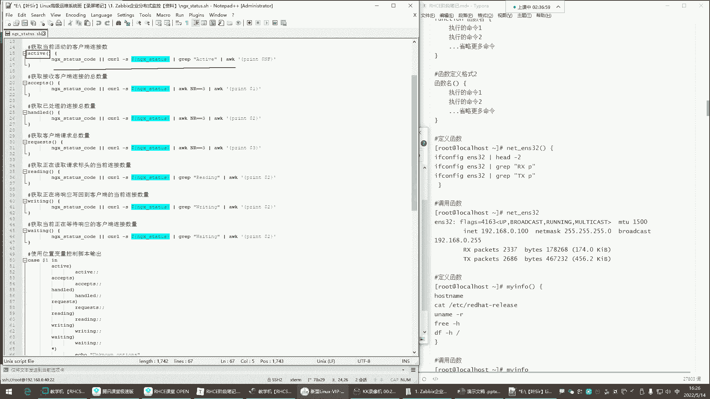

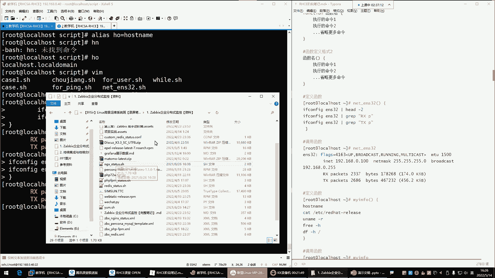

# 在脚本中调用函数
sys_info
```
执行这个脚本，就会依次运行函数内的所有命令。在复杂的脚本中，函数可以被多次调用，甚至可以在一个函数内部调用另一个函数，极大地减少了代码冗余。

## ⏹️ 脚本的中断与退出

在脚本执行过程中，我们有时需要根据条件提前结束循环，甚至退出整个脚本。Shell提供了`continue`、`break`和`exit`命令来控制执行流程。

为了理解它们的区别，我们创建一个简单的测试脚本：
```bash
#!/bin/bash
for i in {1..5}
do
    if [ $i -eq 3 ]; then
        # 尝试分别替换为 continue, break, exit
        continue
    fi
    echo "循环第 $i 次"
done
echo "循环外的命令"
```

以下是三个控制命令的作用：

*   **`continue`**：结束**本次**循环，跳过循环体内剩余的命令，直接进入下一次循环。
*   **`break`**：结束**整个**循环，跳出循环体，继续执行循环之后的命令。
*   **`exit`**：立即**退出整个脚本**，循环后的命令也不会执行。

例如，在我们之前“猜数字”的脚本中，当用户猜对时，就应该使用`exit`命令直接退出脚本，而不是让脚本继续运行。

## 🔤 字符串处理基础

在处理命令输出或进行条件判断时，经常需要从字符串中提取特定部分。Shell提供了一些基本的字符串截取和操作功能。

首先，我们可以获取字符串的长度：
```bash
phone="13800138000"
echo ${#phone}  # 输出：11，表示字符串有11个字符
```

其次，可以进行字符串截取，语法是`${变量名:起始位置:长度}`。**注意：起始位置从0开始计数**。
```bash
phone="13800138000"
echo ${phone:0:3}   # 输出：138，从第0位开始，截取3位
echo ${phone:3:4}   # 输出：0013，从第3位开始，截取4位
```
虽然字符串处理在自动化运维脚本中很有用，但对于初学者，可以先了解基本概念，在后续实践中逐步深入。

---

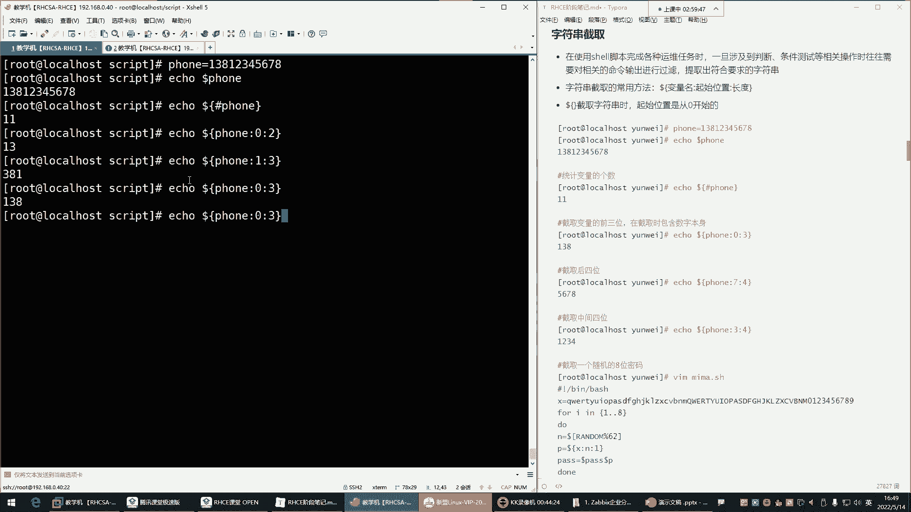

本节课中我们一起学习了Shell脚本的进阶知识。我们掌握了如何使用`while`循环进行持续性的系统监控任务，并学会了通过`sleep`命令来优化资源消耗。我们理解了函数的定义与调用，它能让我们的脚本像搭积木一样模块化，更加简洁清晰。我们还学会了使用`continue`、`break`和`exit`来控制脚本的执行流程，让脚本变得更“聪明”。最后，我们简单接触了字符串的基本处理方法。结合之前所学的变量、条件判断和循环，你现在已经具备了编写功能丰富的Shell脚本的基础能力。