# Linux运维全套培训课程：P48：Shell数组、正则表达式 📚

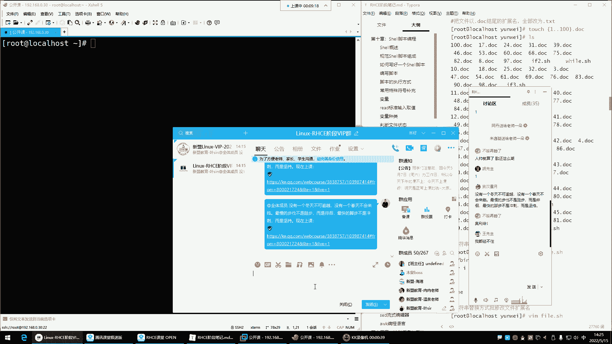

## 概述
在本节课中，我们将学习Shell脚本中的两个重要概念：数组和正则表达式。数组是变量的高级形式，允许在一个变量名中存储多个值。正则表达式则是一套用于文本匹配和过滤的强大工具，通过一系列特殊符号来表达复杂的匹配规则。掌握这两项技能，将极大地提升你编写脚本和处理文本数据的能力。

---

## Shell数组

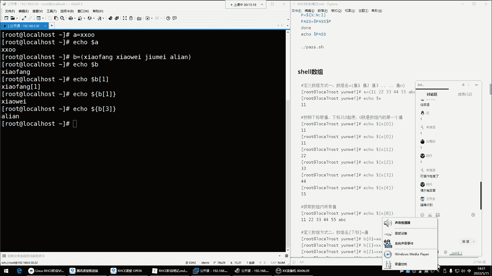

上一节我们介绍了变量的基本用法，本节中我们来看看Shell数组。数组可以理解为一种特殊的变量，它允许你在一个变量名下存储多个值，而不是像普通变量那样只能存储一个值。

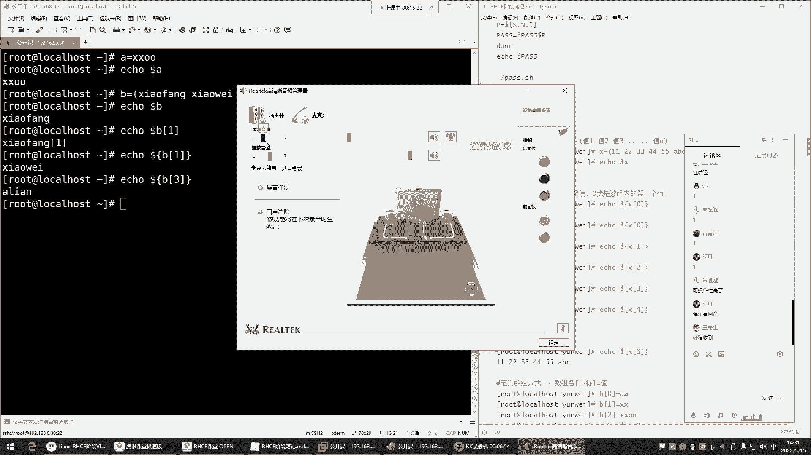

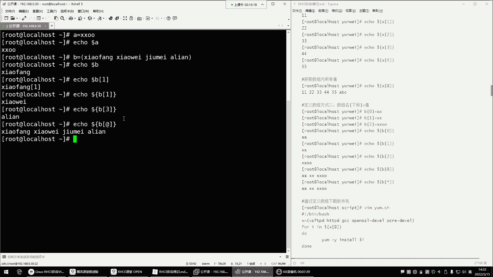

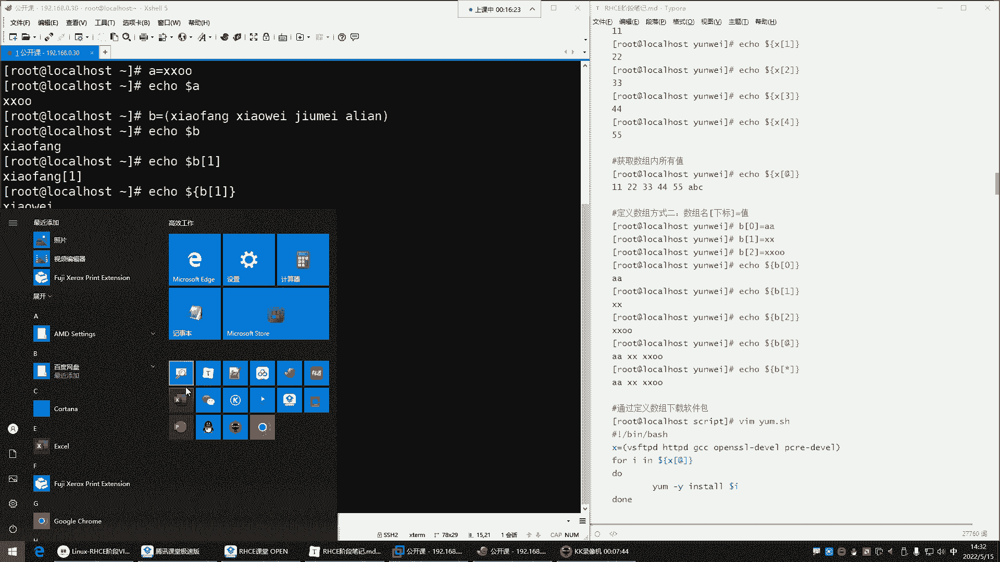


### 数组的定义与取值
定义数组的语法与定义变量类似，但需要用小括号 `()` 将多个值括起来，值之间用空格分隔。

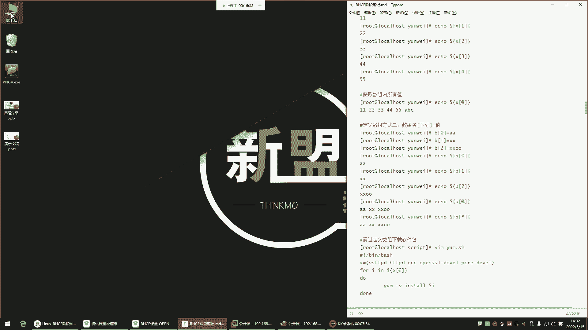

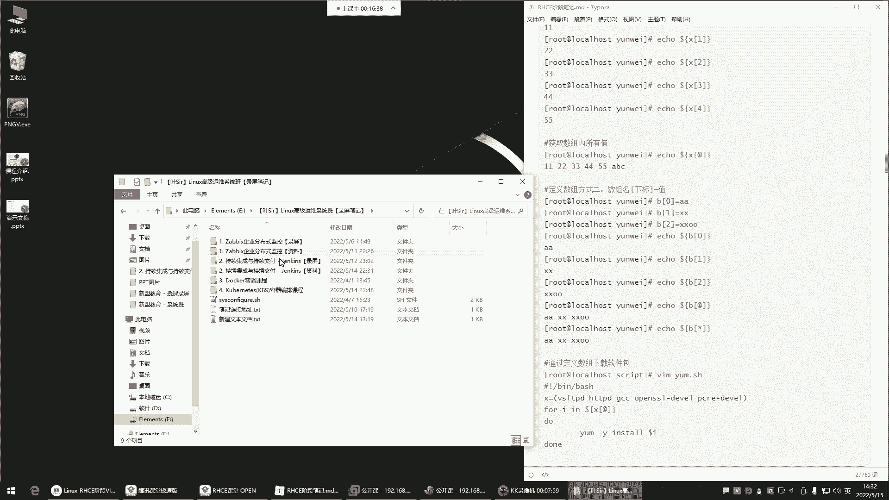

**代码示例：定义数组**
```bash
B=(小方 小V 九妹 阿联)
```

定义好数组后，如何取出其中的值呢？数组中的每个值都有一个对应的“下标”，下标从0开始计数。即第一个值的下标是0，第二个值的下标是1，以此类推。

**代码示例：按下标取值**
```bash
echo ${B[0]}  # 输出：小方
echo ${B[1]}  # 输出：小V
echo ${B[3]}  # 输出：阿联
```
**注意**：取值时必须使用 `${数组名[下标]}` 的格式，大括号 `{}` 是必需的。

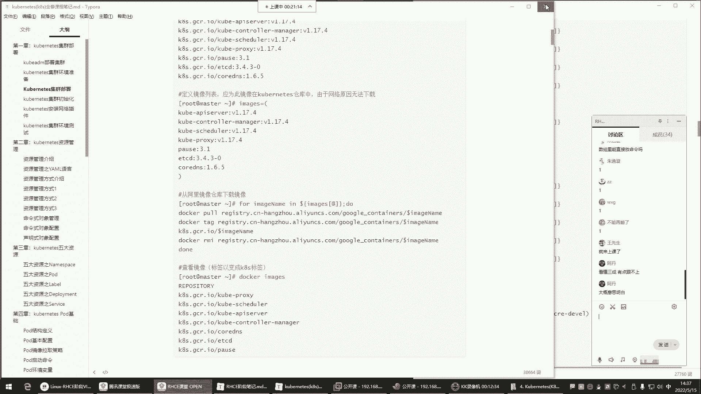

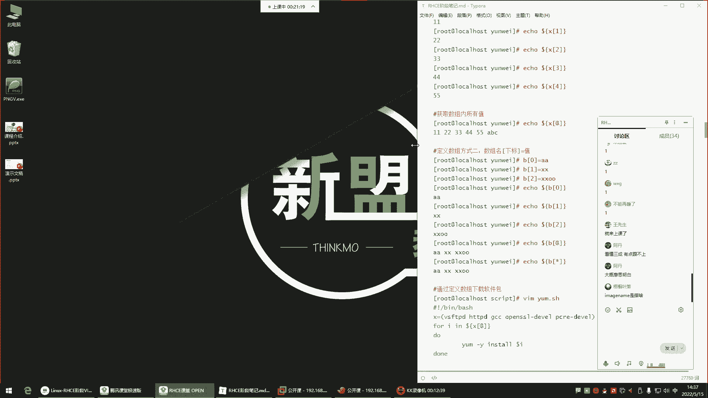

如果你想取出数组中的所有值，可以使用 `@` 或 `*` 符号。

**代码示例：取所有值**
```bash
echo ${B[@]}  # 输出数组中的所有值
```

### 数组的实用场景
数组常与循环结合使用，用于批量处理任务。例如，你需要安装多个软件包，可以将包名存入数组，然后用 `for` 循环依次执行安装命令。

以下是数组的一个典型应用示例：


**代码示例：使用数组批量安装软件**
```bash
#!/bin/bash
# 定义一个包含多个软件包名的数组
softwares=(gcc vsftpd httpd)

# 使用for循环遍历数组并安装每个软件包
for pkg in ${softwares[@]}
do
    yum -y install $pkg
done
```
这个脚本会依次安装 `gcc`、`vsftpd` 和 `httpd` 这三个软件包。

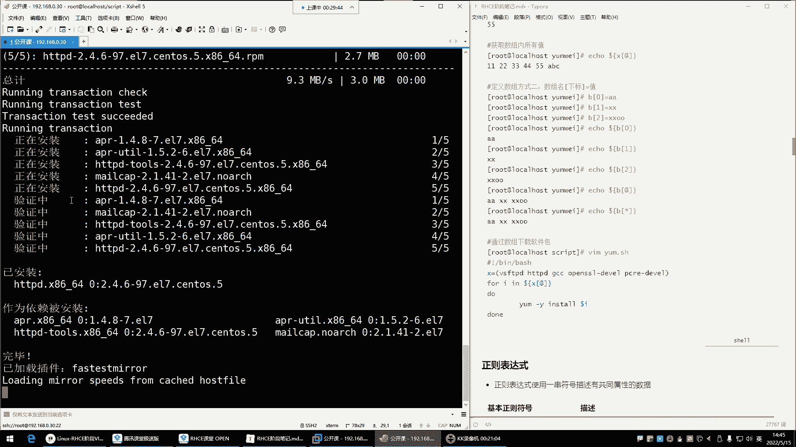

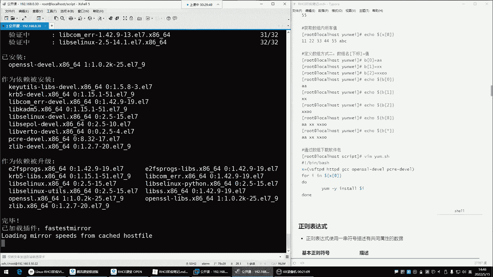

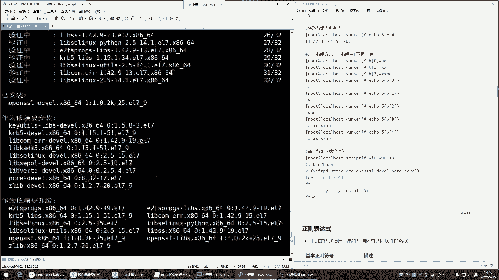

### 向数组中添加元素
如果数组已经定义，你还可以向其中追加新的元素。

**代码示例：向数组追加元素**
```bash
B[4]="波多"  # 向数组B的下标4位置（即第5个元素）添加值
echo ${B[@]} # 查看所有值，会发现“波多”已被添加
```

---

## 正则表达式 🔍

上一节我们学习了如何用数组组织数据，本节中我们来看看如何用正则表达式来匹配和过滤文本数据。正则表达式使用一系列特殊符号来描述字符串的匹配模式，它在文本搜索、替换和数据提取中非常有用。

### 常用正则表达式符号
以下是几个最基础且常用的正则表达式符号及其功能：

1.  **`^` (尖角号)**：匹配行首。
    *   **示例**：`grep "^root" /etc/passwd` 只匹配以 `root` 开头的行。

2.  **`$` (美元符)**：匹配行尾。
    *   **示例**：`grep "bash$" /etc/passwd` 匹配以 `bash` 结尾的行，即找出所有使用bash shell的用户。

3.  **`.` (点号)**：匹配任意单个字符（除换行符）。
    *   **示例**：`grep "r..t" /etc/passwd` 可以匹配像 `root`、`rapt` 这样的字符串。

4.  **`*` (星号)**：匹配前一个字符出现0次或多次。
    *   **示例**：`grep "ro*t" /etc/passwd` 可以匹配 `rt`、`rot`、`root`、`rooot` 等。

5.  **`[]` (中括号)**：匹配括号内的任意单个字符。
    *   **示例**：`grep "[Rr]oot" file.txt` 匹配 `Root` 或 `root`。
    *   **取反**：`[^]` 匹配不在括号内的任意单个字符。例如 `grep "[^0-9]" file.txt` 匹配包含非数字的行。

6.  **`\b` (单词边界)**：匹配单词的边界（开头或结尾）。
    *   **示例**：`grep "\bthe\b" file.txt` 精确匹配单词 `the`，而不会匹配 `there`、`other` 等。

### 扩展正则表达式
以上是“基本正则表达式”。还有功能更强的“扩展正则表达式”，需要使用 `grep -E` 或 `egrep` 命令来启用。

1.  **`+` (加号)**：匹配前一个字符出现1次或多次。
    *   **示例**：`egrep "ro+t" file.txt` 匹配 `rot`、`root` 等，但不匹配 `rt`。

2.  **`?` (问号)**：匹配前一个字符出现0次或1次。
    *   **示例**：`egrep "colou?r" file.txt` 可以匹配 `color` 和 `colour`。

3.  **`|` (竖线)**：表示“或”关系。
    *   **示例**：`egrep "(root|test)" /etc/passwd` 匹配包含 `root` 或 `test` 的行。

4.  **`()` (小括号)**：将模式分组为一个整体，常用于与 `|` 结合或后续引用。
    *   **示例**：`egrep "(abc)+" file.txt` 匹配 `abc`、`abcabc` 等。

### 正则表达式应用实例
正则表达式最常见的用途是结合 `grep`、`sed`、`awk` 等命令进行文本过滤。

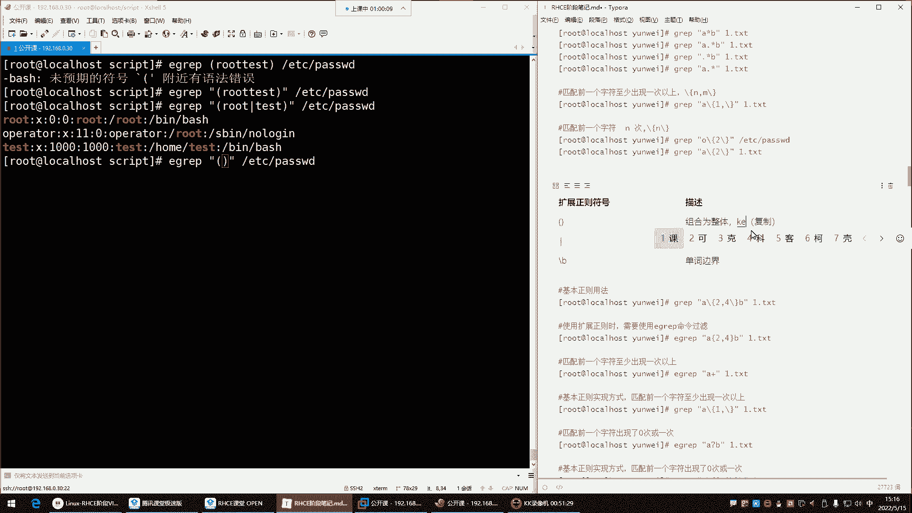

以下是使用正则表达式过滤系统服务文件的例子：

**代码示例：使用正则过滤文本**
```bash
# 查找包含数字80的行
grep "80" /etc/services

# 查找以`ftp`开头的行
grep "^ftp" /etc/services

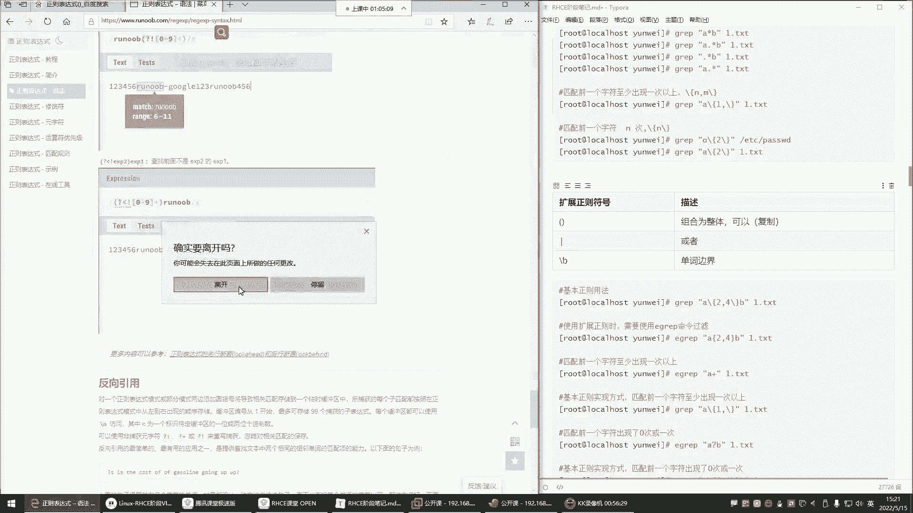

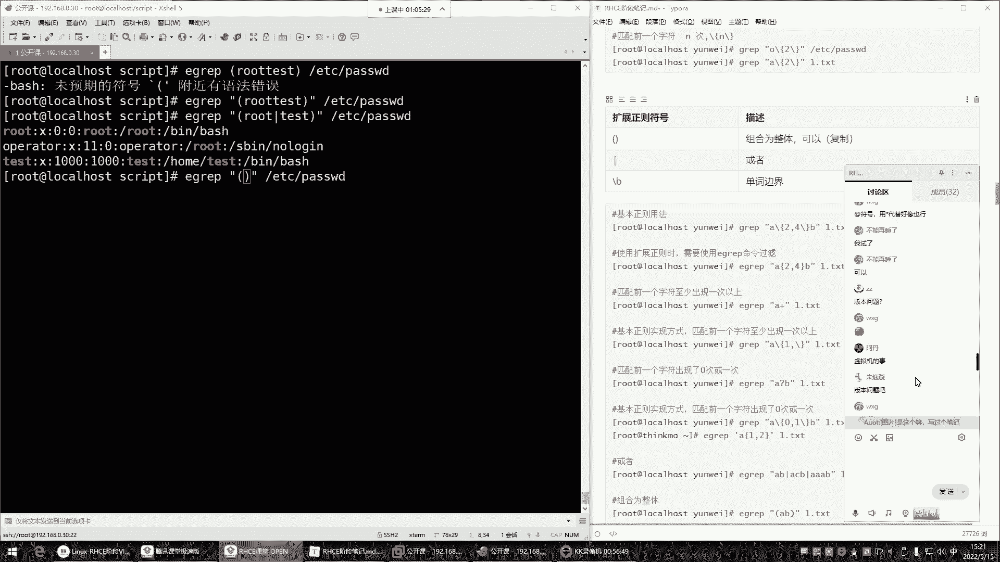

# 使用扩展正则，查找包含`www`或`ftp`的行
egrep "(www|ftp)" /etc/services
```

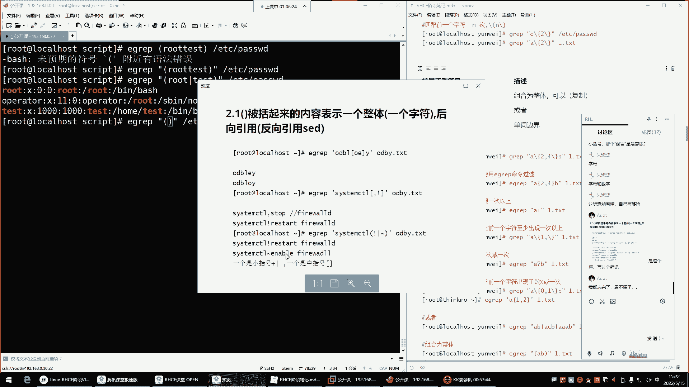

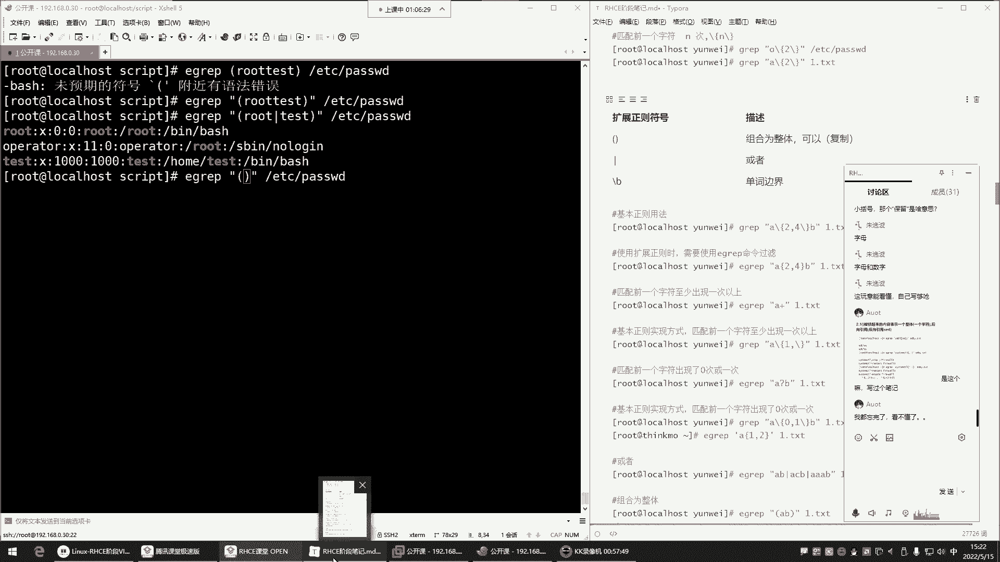

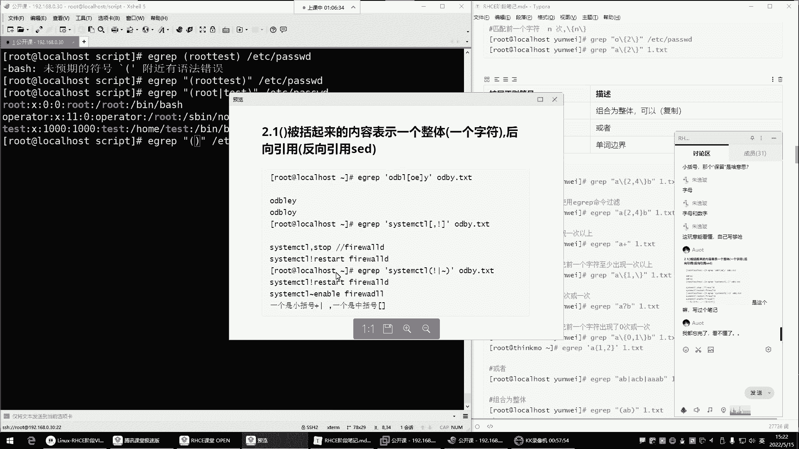

---

## 总结
本节课我们一起学习了Shell脚本中的数组和正则表达式。
*   **数组**：是一种可以存储多个值的变量，通过下标访问元素，常与循环结合用于批量操作。
*   **正则表达式**：是一套用于描述文本模式的符号系统，通过 `^`、`$`、`.`、`*`、`[]` 等符号，可以高效地进行文本搜索、匹配和过滤。

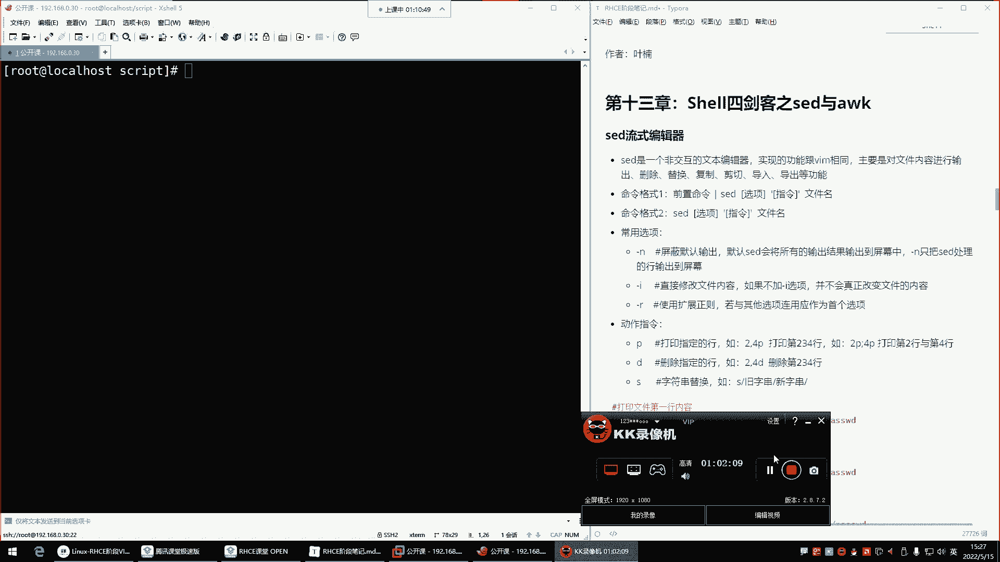

理解数组能让你更好地组织数据，而掌握正则表达式的基础符号（尤其是 `^`、`$`、`[]`、`|` 和 `()`）将为你日后处理日志、配置文件等文本任务打下坚实的基础。对于运维工作来说，能够看懂并运用这些核心的正则符号通常就足够了。