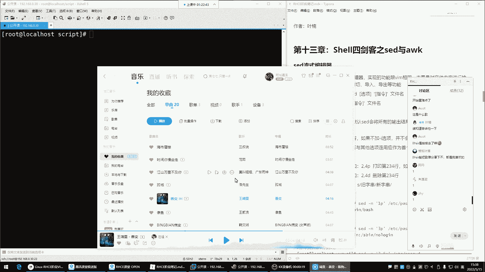
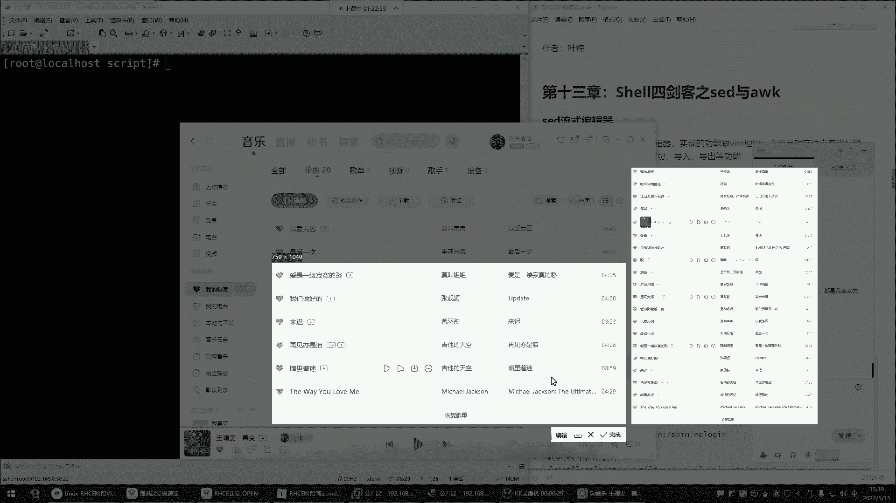
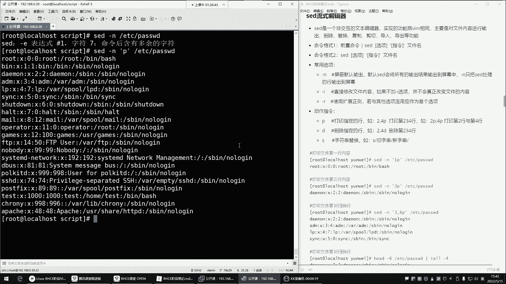
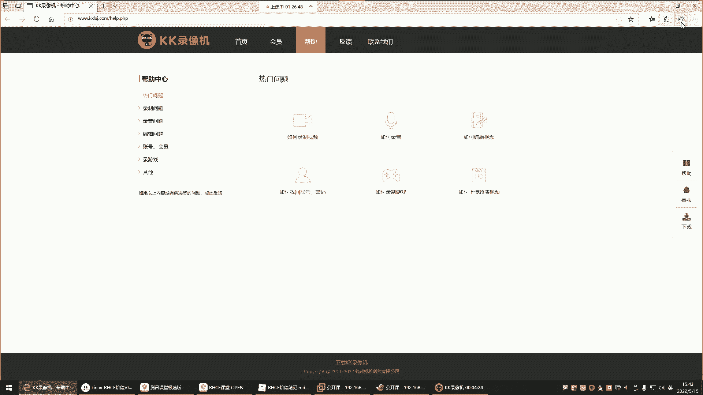
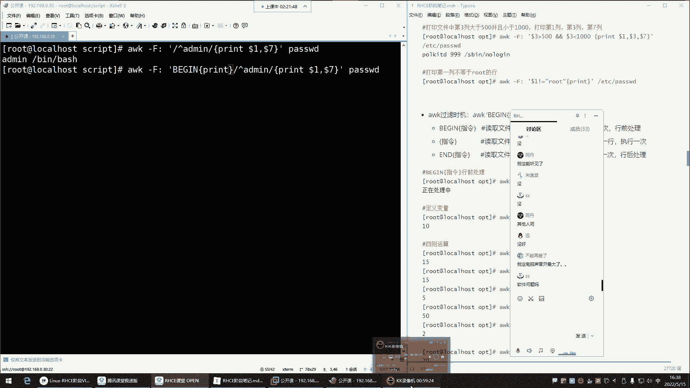

# Linux运维全套培训课程：P49：Shell四剑客之Sed编辑器 🛠️







在本节课中，我们将要学习Shell四剑客中的Sed编辑器。Sed是一个强大的流式文本编辑器，它允许我们在命令行中非交互式地编辑文件内容，实现增删改查等操作，是自动化脚本中的重要工具。





## Sed简介

上一节我们介绍了Shell脚本的基础，本节中我们来看看Sed编辑器。Sed的专业名称是流式编辑器。通俗来讲，它是Vim编辑器的另一种非交互式实现方式。因为Vim是交互式编辑器，无法直接集成到脚本中自动执行。而Sed可以在不打开文件的情况下，通过命令行指令直接修改文件内容，主要功能就是对文件进行增删改查。

## Sed命令格式与选项

Sed命令主要有两种使用格式。第一种是将前置命令的结果通过管道传递给Sed处理。第二种是Sed直接对文件进行操作。我们主要学习第二种格式。

以下是Sed命令的基本结构：
```bash
sed [选项] ‘指令’ 文件名
```

常用的选项有：
*   **-n**：屏蔽默认输出。Sed默认会输出所有处理过的行，使用`-n`后，只输出经过`指令`处理的行。
*   **-i**：直接修改源文件。如果不加此选项，所有操作都只是预览，不会真正改变文件内容。
*   **-r**：支持扩展正则表达式，使模式匹配更强大。

## Sed基本操作：打印（p）

我们首先学习如何使用Sed查看文件内容，这通过打印指令`p`实现。

默认情况下，`sed ‘p’ 文件名`会将每一行内容重复输出两次。为了只显示我们想要的行，需要结合`-n`选项。

例如，查看`/etc/passwd`文件：
```bash
sed -n ‘p’ /etc/passwd
```
这条命令会打印文件的所有行，效果类似于`cat`，但它是Sed处理后的输出。

**指定行打印：**
*   打印第3行：`sed -n ‘3p’ /etc/passwd`
*   打印第2到第4行：`sed -n ‘2,4p’ /etc/passwd`
*   打印第6行和第10行：`sed -n ‘6p;10p’ /etc/passwd`

**使用正则表达式过滤打印：**
Sed也支持用正则表达式匹配特定内容的行并打印。
```bash
sed -n ‘/root/p’ /etc/passwd
```
这条命令会打印所有包含“root”字符串的行。

## Sed基本操作：删除（d）

接下来我们学习删除操作。删除指令是`d`。**重要提示**：如果要对源文件进行实际删除，必须加上`-i`选项，否则仅为演练。

**删除指定行：**
1.  **先预览**：在删除前，最好先确认要删除的行。
    ```bash
    sed -n ‘5p’ demo.txt
    ```
2.  **再操作**：确认无误后，使用`-i`选项执行删除。
    ```bash
    sed -i ‘5d’ demo.txt
    ```
    这条命令会直接删除`demo.txt`文件的第5行。

**删除连续行：**
删除第5到第7行：
```bash
sed -i ‘5,7d’ demo.txt
```

**结合正则表达式删除：**
删除所有包含“test”的行：
```bash
sed -i ‘/test/d’ demo.txt
```

## Sed核心操作：替换（s）

替换是Sed最常用的功能之一，指令是`s`。其基本语法为：
```bash
sed ‘s/旧字符串/新字符串/修饰符’ 文件名
```

**基本替换：**
将文件中的“old”替换为“new”：
```bash
sed -n ‘s/old/new/p’ demo.txt
```
这里`-n`和`p`是为了预览替换效果，文件并未被修改。

**实际修改文件：**
要真正修改源文件，需加上`-i`选项。
```bash
sed -i ‘s/old/new/’ demo.txt
```

**全局替换：**
默认情况下，Sed只替换每行中第一个匹配的字符串。要替换行中所有匹配项，需要添加全局修饰符`g`。
```bash
sed -i ‘s/old/new/g’ demo.txt
```

**使用正则表达式替换：**
*   将所有数字替换为“#”：
    ```bash
    sed -i ‘s/[0-9]/#/g’ demo.txt
    ```
*   将所有英文字母（大小写）替换为“*”：
    ```bash
    sed -i ‘s/[a-zA-Z]/*/g’ demo.txt
    ```

## 结合管道使用Sed

Sed也可以接收来自其他命令的管道输入进行处理，虽然这种用法相对较少，但非常灵活。

例如，先使用`grep`过滤出包含“error”的行，再使用Sed将这些行中的“FAILED”替换为“SUCCESS”：
```bash
grep “error” logfile.txt | sed ‘s/FAILED/SUCCESS/g’
```

## 课程总结

本节课中我们一起学习了Shell四剑客之一的Sed编辑器。
*   **Sed是什么**：一个非交互式的流式文本编辑器，用于在脚本中自动化编辑文件。
*   **核心选项**：`-n`（屏蔽默认输出）、`-i`（直接修改文件）、`-r`（扩展正则）。
*   **基本操作**：
    *   **打印（p）**：查看文件特定行或匹配内容。
    *   **删除（d）**：删除文件的指定行。
    *   **替换（s）**：对文件内容进行查找和替换，支持全局替换`g`。
*   **使用逻辑**：在对文件进行破坏性操作（如删除、替换）前，可先不加`-i`选项进行预览，确认无误后再使用`-i`选项实际修改。




通过掌握Sed，你可以在不打开编辑器的情况下，高效、精准地批量处理文本文件，这是Linux运维和脚本编写中不可或缺的技能。