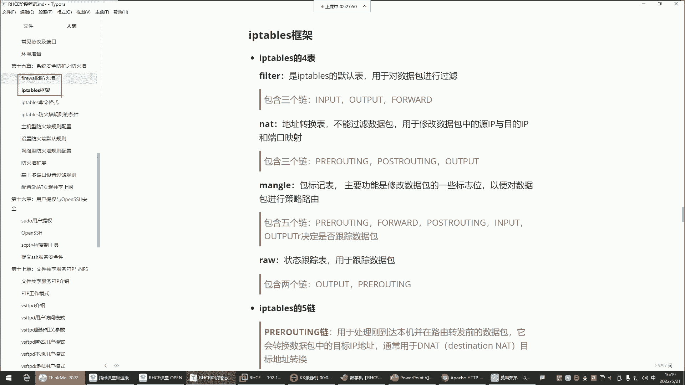
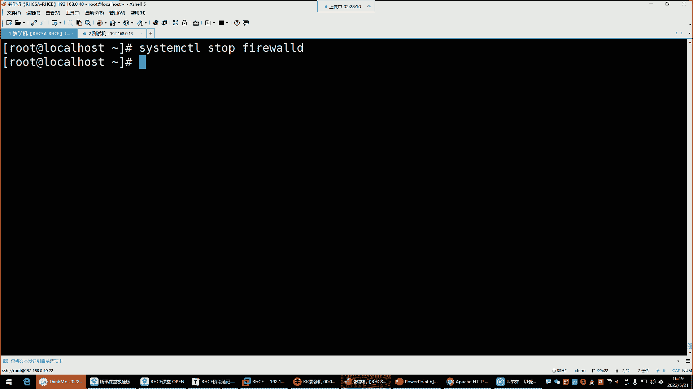
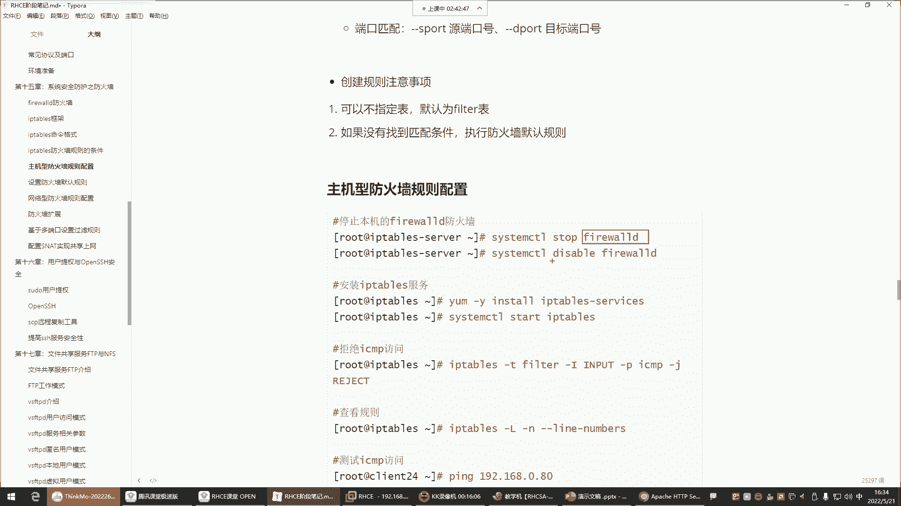
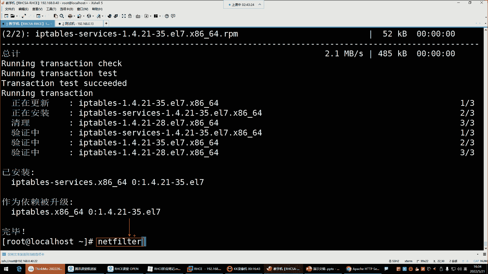
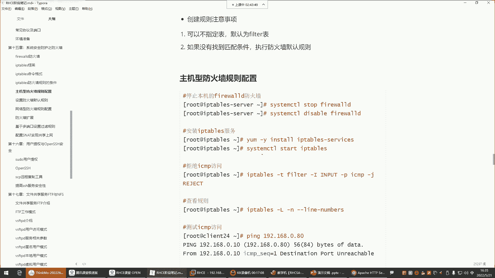
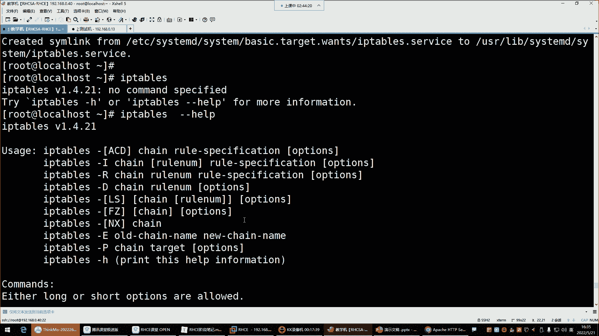
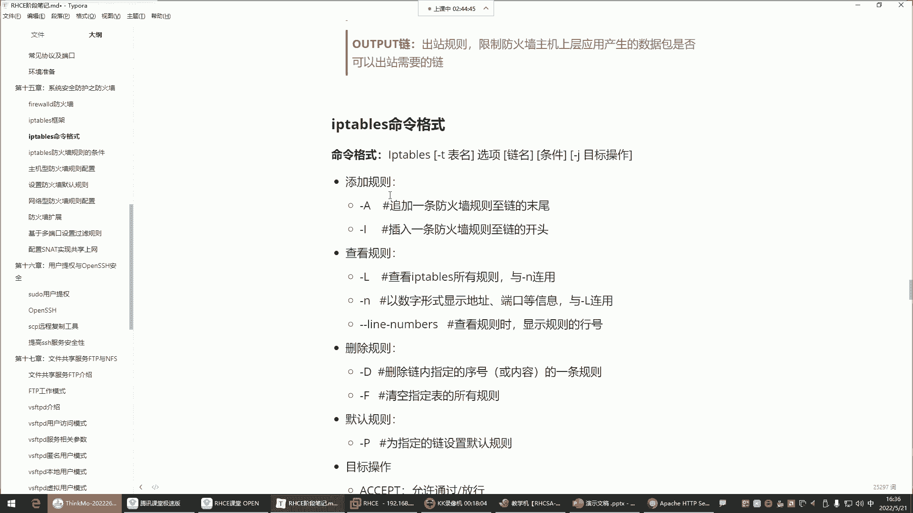
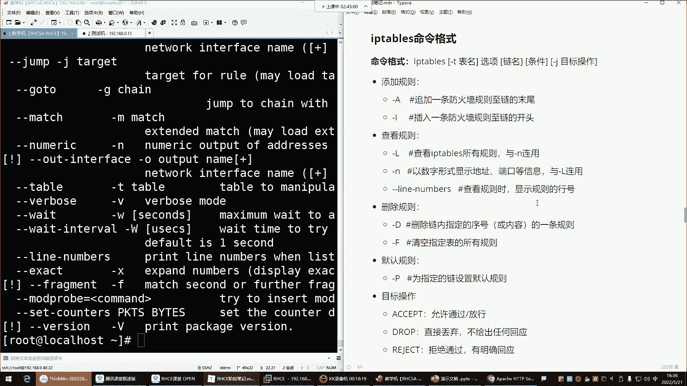

# Linux运维入门：P53：红帽RHCE-17.iptables防火墙四表五链 🔥



在本节课中，我们将要学习iptables防火墙的核心概念——四表五链。理解这些概念是掌握iptables配置规则的基础。我们会用简单直白的方式，帮助你理清表、链、规则之间的关系。



## 概述

iptables是Linux系统中一个强大的防火墙管理工具，它通过操作内核中的netfilter模块来实现数据包过滤、地址转换等功能。与之前学习的firewalld不同，iptables采用“表”和“链”的结构来组织规则。本节课我们将重点解析iptables的四个表和五个链，并明确它们各自的作用。

## 四表与五链的关系

上一节我们介绍了iptables是管理netfilter内核模块的工具。本节中我们来看看iptables的核心组织架构。

iptables不采用“区域”的概念，而是使用“表”和“链”。它们的关系是：**表**中存放着多个**链**，而**链**则是我们配置具体**规则**的地方。每种表都有其特定的功能。

以下是iptables的四个核心表：

1.  **filter表**：这是iptables的默认表，核心功能是**对数据包进行过滤**。它就像地铁站的安检口，负责检查所有进出的“乘客”（数据包）是否安全。我们主要学习的规则都配置在这个表里。
2.  **nat表**：此表用于**网络地址转换**，主要修改数据包中的源IP地址、目的IP地址或端口号。例如，让内网电脑访问外网（SNAT），或将外部请求转发到内部服务器（DNAT）。
3.  **mangle表**：此表功能特殊，用于**修改数据包的一些标志位**，以便进行策略路由等高级操作。由于其应用场景较少，初学者可以暂时不深入。
4.  **raw表**：此表用于**数据包的状态跟踪**。在企业环境中，全程跟踪数据包会消耗大量系统资源，因此很少使用。

**一个重要的规律是：一个表的功能决定了其内部所有链的功能。** 例如，filter表是做数据包过滤的，那么它里面的链就都是用来过滤数据包的；nat表是做地址转换的，它里面的链就都是用来做地址转换的。

## 详解五链及其应用场景

了解了四个表之后，我们来看看五个链分别部署在哪些表中，以及它们各自负责处理哪个方向的数据流。

以下是iptables的五个链及其作用：

*   **INPUT链**：**入站链**。处理**目的地是本机**的数据包。例如，客户端访问本机的Web服务，数据包就会经过INPUT链的规则检查。**主机型防火墙主要配置此链**。
*   **OUTPUT链**：**出站链**。处理**由本机产生并向外发送**的数据包。例如，本机Web服务给客户端返回页面。此链一般很少配置规则，就像地铁站只检查进站，不检查出站一样。
*   **FORWARD链**：**转发链**。处理**经过本机路由转发**的数据包。例如，本机作为网关或防火墙，需要将客户端的请求转发给内部的后端服务器。**网络型防火墙主要配置此链**。
*   **PREROUTING链**：**路由前链**。在数据包进入路由决策**之前**进行处理。通常用于**目的地址转换**。
*   **POSTROUTING链**：**路由后链**。在数据包离开路由决策**之后**进行处理。通常用于**源地址转换**。

INPUT、OUTPUT、FORWARD链主要位于**filter表**，负责过滤。
PREROUTING、POSTROUTING链主要位于**nat表**，负责地址转换。

对于初学者和大多数运维场景，我们学习的重点是 **filter表的INPUT链（保护本机）和FORWARD链（保护内部网络）**，以及**nat表的部分功能**。其他表和链了解即可。

## 基础命令与操作

理解了架构，我们来看看如何操作iptables。首先需要确保系统使用的是iptables而非firewalld，因为两者都基于netfilter，同时启用会产生冲突。

以下是切换到iptables并查看规则的步骤：

1.  停止并禁用firewalld服务：
    ```bash
    systemctl stop firewalld
    systemctl disable firewalld
    ```
2.  安装iptables服务（如果尚未安装）：
    ```bash
    yum install -y iptables-services
    ```
3.  启动并设置iptables开机自启：
    ```bash
    systemctl start iptables
    systemctl enable iptables
    ```
4.  查看现有规则（默认查看filter表）：
    ```bash
    iptables -L -n
    ```
    *   `-L`：列出规则。
    *   `-n`：以数字形式显示IP和端口，不进行域名反解，速度更快。
5.  查看指定表（如nat表）的规则：
    ```bash
    iptables -t nat -L -n
    ```
    *   `-t`：指定要操作的表名。



iptables的命令格式相对复杂，其通用格式可以概括为：
`iptables -t <表名> <命令> <链名> <规则参数> <动作>`
在后续课程中，我们将详细学习如何添加、删除和修改规则。



## 总结





本节课中我们一起学习了iptables防火墙的“四表五链”核心架构。
*   **四表**（filter, nat, mangle, raw）定义了功能模块，其中**filter（过滤）** 和**nat（地址转换）** 最为常用。
*   **五链**（INPUT, OUTPUT, FORWARD, PREROUTING, POSTROUTING）定义了数据包流通的路径节点。
*   我们明确了**主机防火墙**配置**INPUT链**，**网络防火墙**配置**FORWARD链**的学习重点。
*   最后，我们学会了如何启用iptables服务并查看基本的规则列表。





理解表与链的关系，是后续灵活配置任何防火墙规则的基础。下一节，我们将开始学习如何在具体的链上配置允许或拒绝的规则。