# Linux运维全套培训课程：P57：FTP服务排错指南 🔧

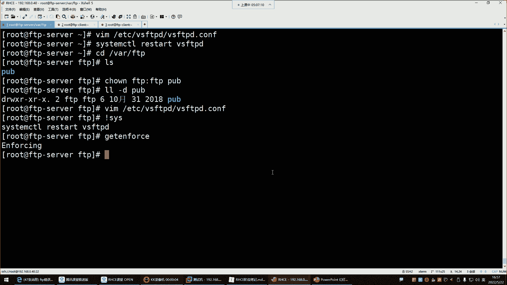

在本节课中，我们将学习如何排查FTP服务中常见的权限问题，特别是由SELinux安全模块引起的访问限制。我们将通过一个具体的案例，分析问题原因并找到解决方案，帮助你理解FTP服务配置的核心要点。

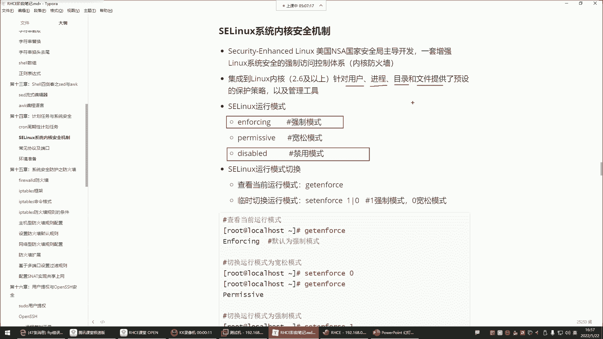

---

上一节我们介绍了FTP服务的基本配置，本节中我们来看看一个典型的FTP访问失败案例。


正如之前所讲，SELinux在企业环境中常被禁用。在强制模式下，它会严格管理所有用户、进程、目录和文件的访问。

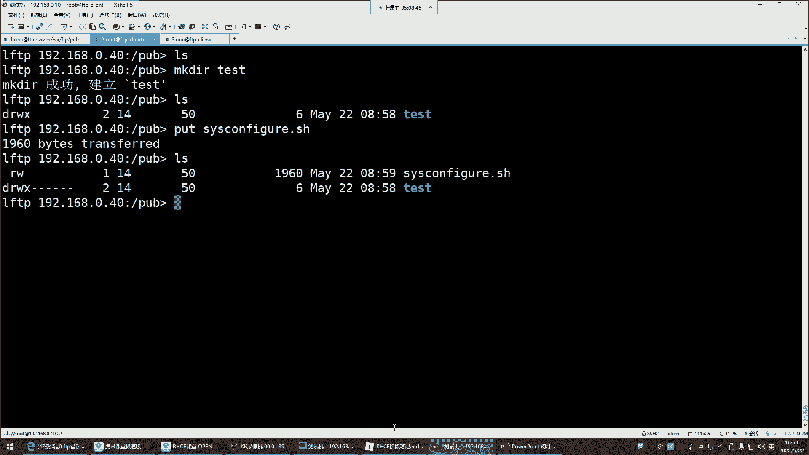


当前系统SELinux处于**enforcing**（强制）模式。在此模式下，即使你为文件和目录设置了正确的传统权限，SELinux策略也可能阻止操作，例如创建文件。

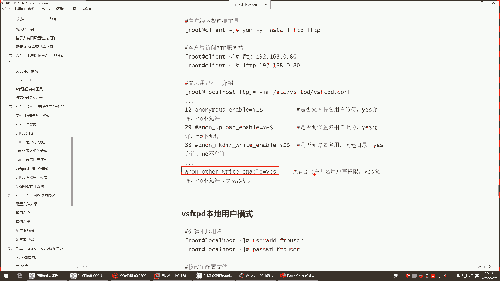

以下是查看和临时关闭SELinux的命令：
```bash
# 查看SELinux状态
getenforce

# 临时将SELinux设置为宽容模式（重启后失效）
setenforce 0
```
将SELinux模式改为宽容模式后，之前失败的FTP文件创建操作即可成功。这说明配置本身无误，问题出在SELinux策略上。因此，在FTP服务排错时，除了检查配置文件，还需关注防火墙和SELinux状态。

---

解决了SELinux的阻挡后，我们来看看如何为FTP用户配置具体的操作权限。

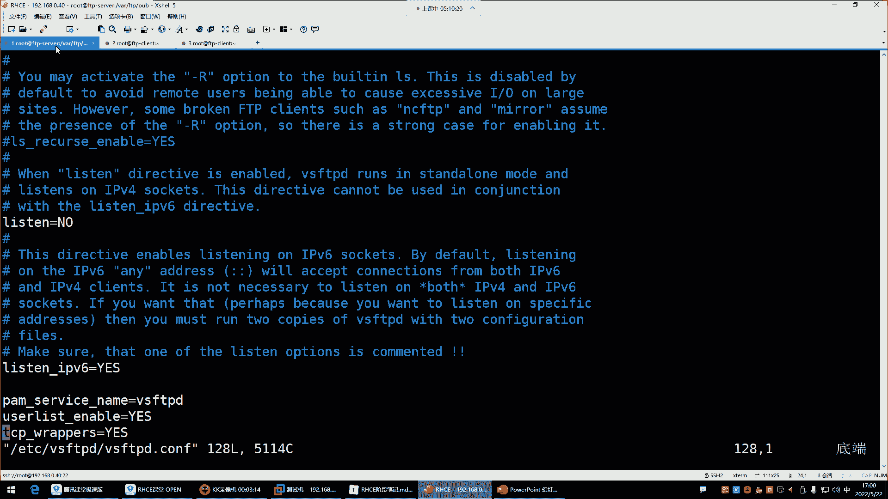

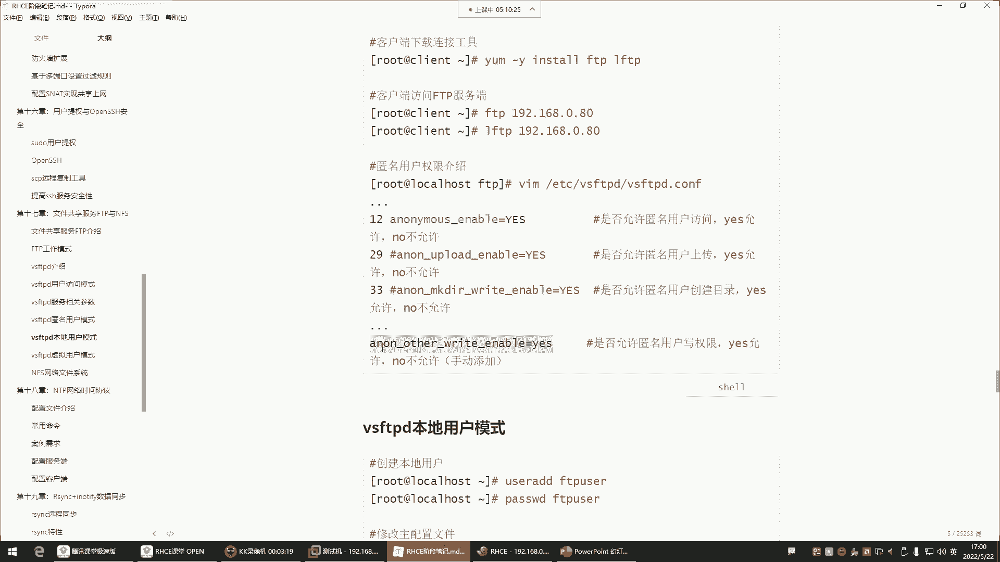


以下是FTP匿名用户相关的权限参数，需要在其配置文件中手动开启：
*   **anon_upload_enable=YES**：开启上传权限。
*   **anon_mkdir_write_enable=YES**：开启创建目录的权限。
*   **anon_other_write_enable=YES**：开启其他写入权限，如删除、重命名。

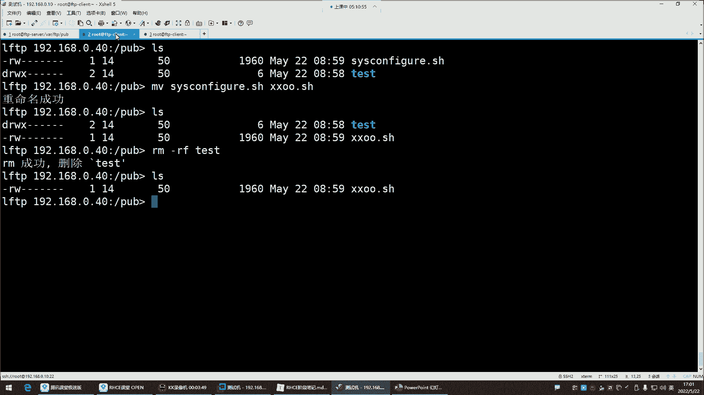

默认配置通常不包含`anon_other_write_enable`参数。若未开启，用户将无法执行删除或重命名操作。


当尝试删除或重命名文件时，系统会提示“权限不足”。要解决此问题，需编辑FTP主配置文件（通常是`/etc/vsftpd/vsftpd.conf`）。

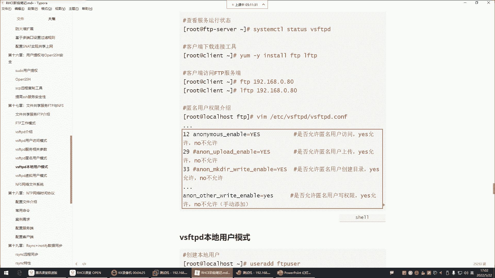


在配置文件末尾添加以下参数：
```bash
anon_other_write_enable=YES
```

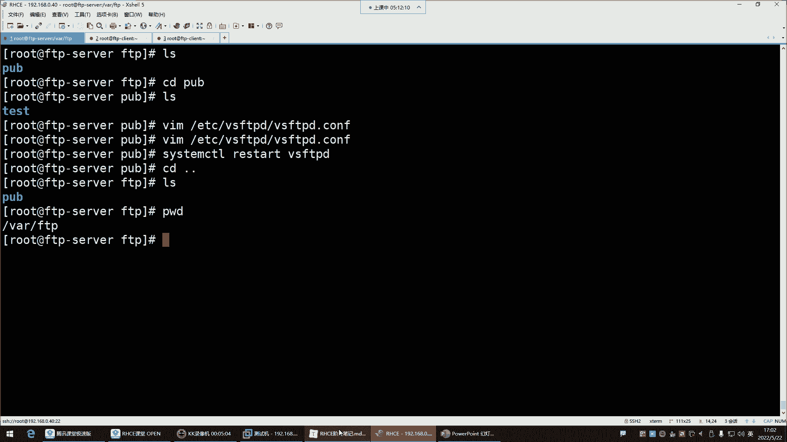


保存并退出编辑器后，重启FTP服务使配置生效：
```bash
systemctl restart vsftpd
```
重启服务后，用户即可成功执行重命名和删除文件等操作。

---

经过以上操作，我们对FTP服务器的权限管理有了更清晰的认识。现在，让我们进行总结并探讨企业环境中的最佳实践。

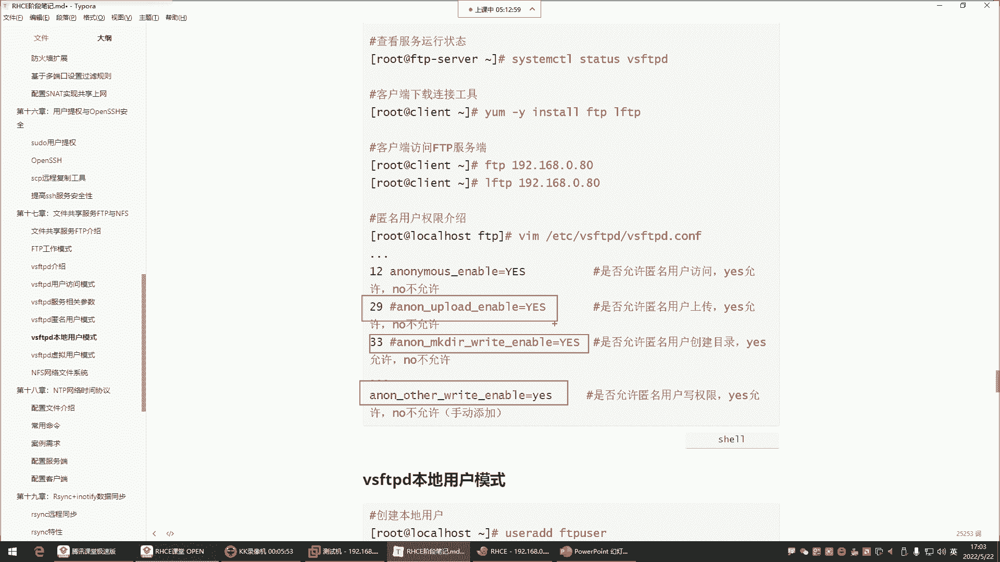


**FTP服务总结：**
1.  **访问模式**：默认启用匿名用户访问模式，实际使用系统内置的`ftp`用户身份进行访问。
2.  **默认权限**：匿名用户默认拥有查看和下载文件的权限。
3.  **扩展权限**：如需上传、创建、删除或重命名文件，必须在配置文件中显式启用相应参数。
4.  **目录安全**：通常不会直接开放FTP服务的根共享目录（如`/var/ftp/pub`）的写权限。最佳实践是在该目录下创建子目录（如`/var/ftp/pub/data`）用于存放共享数据，并仅对该子目录进行权限配置。

以上讲解的权限配置均针对**匿名用户**。


**企业级权限配置建议：**
在企业环境中，出于安全考虑，通常不会给予匿名用户过大的权限。类比百度网盘，你只希望他人从你这里下载文件，而不希望他们随意上传、修改或删除你的文件。

因此，对于FTP匿名用户，建议仅保留其默认的下载权限。应将配置文件中所有为匿名用户开启的写权限参数（如`anon_upload_enable`， `anon_mkdir_write_enable`， `anon_other_write_enable`）注释掉。


注释掉相关参数并重启服务后，匿名用户将无法再进行上传、创建、删除或重命名操作，但下载功能不受影响。

有时下载失败可能是由于共享文件本身的Linux文件权限不足所致。例如，文件所有者未给“其他用户”分配读（r）权限。


确保共享文件至少具备让其他用户可读的权限。可以使用以下命令修改：
```bash
chmod o+r 文件名
```
正常情况下，管理员放置的共享文件只需具备可读权限，匿名用户即可顺利下载，无需设置为`777`这样的宽松权限。


本节课所讨论的模式均为FTP的**匿名用户模式**。理解并妥善配置该模式下的权限，是保障FTP服务安全、稳定运行的关键。

---

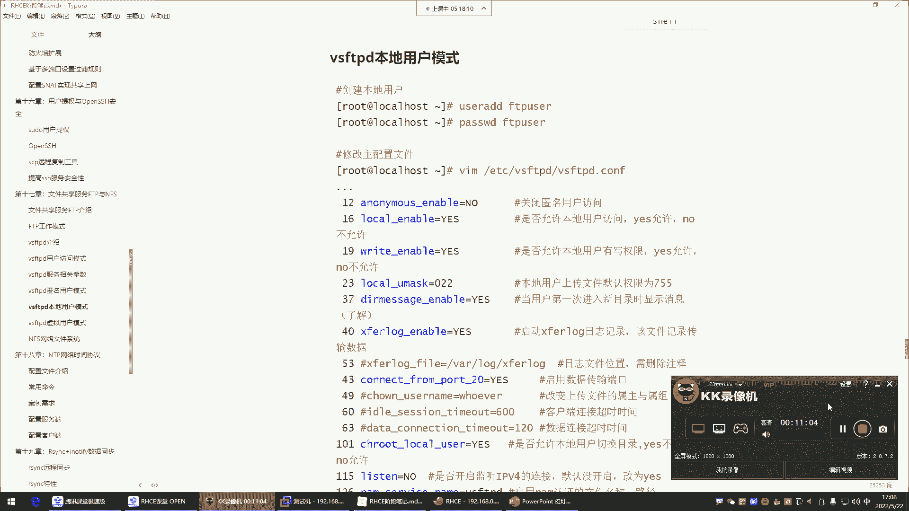

本节课中我们一起学习了FTP服务的排错流程。核心要点包括：检查SELinux状态、在配置文件中按需启用匿名用户的操作权限，以及根据企业安全原则限制匿名用户的权限范围。掌握这些知识，你将能有效解决FTP服务部署中的常见问题。