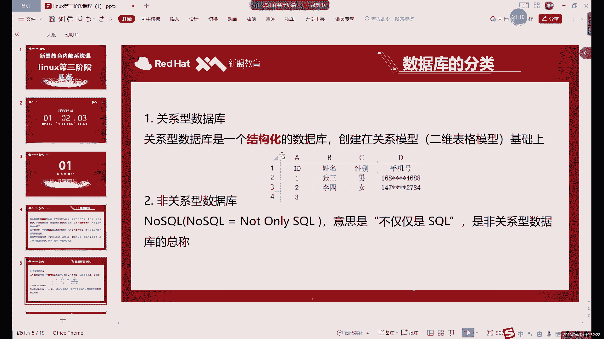
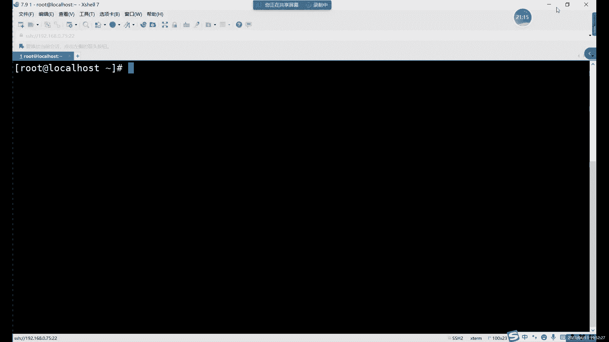
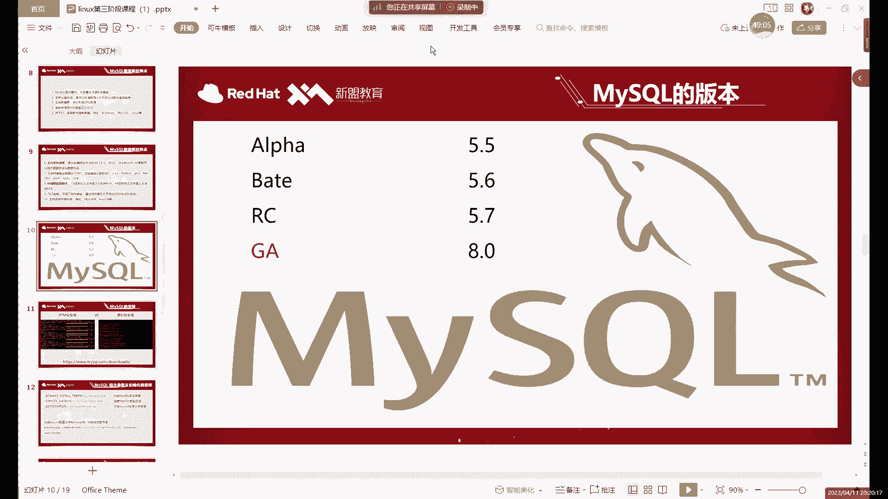
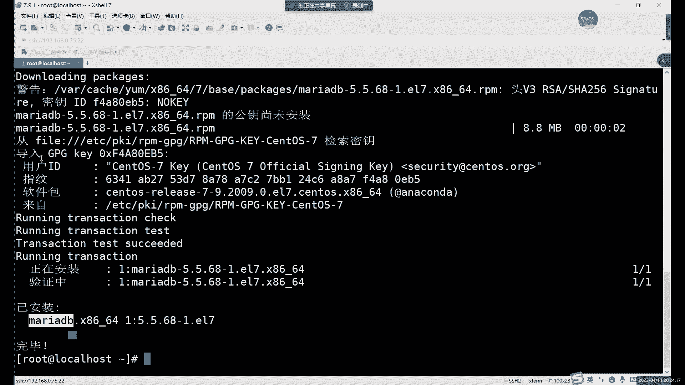
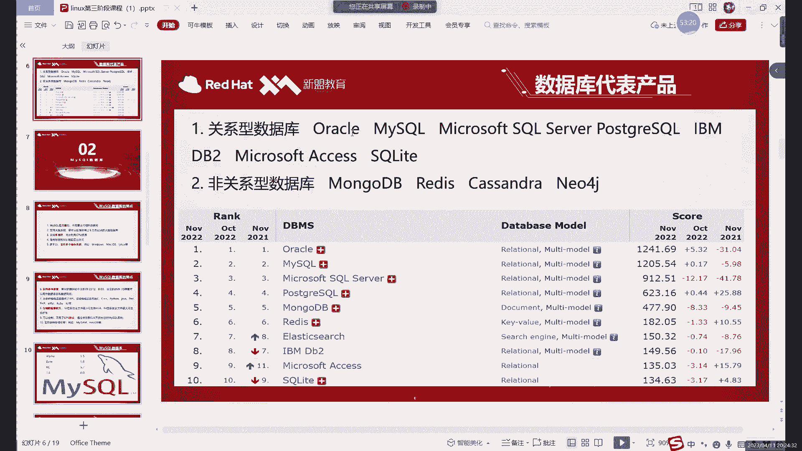

# Linux运维全套培训课程：P64：中级运维-1.MySQL介绍及安装-上

## 概述

在本节课中，我们将开始学习Linux运维第三阶段的内容。这一阶段我们将从基础运维转向具体服务的部署与管理。本节课作为第三阶段的第一课，我们将重点介绍数据库的基本概念，特别是关系型数据库MySQL，并了解其安装前的准备工作。

---

## 数据库基础介绍

上一节我们概述了本阶段的学习内容，本节中我们来看看数据库是什么。

数据库从名字上看，就是一个存放数据的仓库。它的定义很简单，就是用来存放数据的。数据库的存储空间通常很大，可以存放百万条、千万条甚至更多的数据。理论上，其存储能力受限于磁盘空间的大小，如果磁盘无限大，就可以无限增加数据。

然而，数据库并非随意地将数据堆放在磁盘上。在数据库诞生之前，数据通常直接存放在文件系统中。这种方式虽然也能存储数据，但在管理大量数据时，尤其是在查询数据时，效率非常低下。因为文件系统需要遍历磁盘中的每一个文件来匹配查询条件，这个过程非常缓慢。

数据库的优势就在于管理大量数据。它通过一定的规则来存放数据，使得数据的查询、搜索、删除等操作变得非常高效。在数据量不是特别巨大的情况下，数据库的查询速度可以达到10毫秒甚至更快。

数据库存放数据有一定的规则，这些规则具体体现在后边我们将要学习的SQL语句、字段定义和数据库创建方式中。大家首先需要知道，数据库存放数据不是随意的，而是有规则的，因此其数据查询效率远高于文件系统。

---

## 数据库的分类

了解了数据库的基本概念后，本节中我们来看看数据库有哪些主要类型。

目前市面上的数据库主要分为两种类型：关系型数据库和非关系型数据库。它们并非所有方面都一样，就像操作系统有Linux、Windows、Mac一样，数据库也有不同的种类。

### 关系型数据库

关系型数据库是一种结构化的数据库。“结构”指的是类似于Excel表格的二维模型，由行和列组成。在数据库中，每一列我们通常称为“字段”，而从第二行开始的每一行数据，我们称为“记录”或“数据”。

关系型数据库的特点是每行每列都有固定的格式和规则。例如，可以规定某一列只能插入数字，另一列只能插入姓名（字符），性别列只能插入“男”或“女”，手机号列只能插入11位数字等。这些规则构成了数据库的结构。

此外，一个数据库中可以创建多个表格，这些表格之间可以通过某些共同的字段（如员工ID、姓名）建立联系，方便进行联合查询和数据管理。MySQL就是一个典型的关系型数据库。

### 非关系型数据库

非关系型数据库，顾名思义，与关系型数据库相反。它并非完全没有规则，但其存放数据的方式更多是“键值对”的形式。

一个典型的非关系型数据库例子是Redis，它也是我们第三阶段课程会涉及的内容。Redis存储数据类似于 `A=3`，`B=4` 这样的形式，没有固定的表格结构，存储数据相对更自由。非关系型数据库更多地被应用在缓存领域，很多都运行在内存中，作为关系型数据库的辅助，帮助更好地处理数据。

本节课我们主要关注关系型数据库。非关系型数据库的具体内容我们会在后续课程中详细讲解。

---

## MySQL数据库详解

上一节我们介绍了数据库的分类，本节中我们具体来看看本课程的重点——MySQL数据库。

关系型数据库有很多种，最常用的包括Oracle和MySQL。目前这两者属于同一家公司，可以简单理解为Oracle是付费版，MySQL是免费版。中小型公司更倾向于使用免费的MySQL，而大型企业或机构（如银行、政府）则可能选择有专属售后支持的Oracle。两者在性能上差异不大。

在Linux系统中，更常见的是安装Oracle或MySQL。Windows系统则通常安装SQL Server。

### MySQL的特点

MySQL作为Linux下最常用的数据库之一，拥有以下特点：
*   **开源免费**：我们通常使用的是社区版，开源且免费，并能支持大型系统。
*   **支持多线程**：可以充分利用多核CPU资源，同时处理多个任务。
*   **使用SQL语言**：用于管理数据库的命令集称为SQL语言。我们第三阶段前半部分主要学习的就是SQL语言。它与前两个阶段学习的Linux系统命令不同。
*   **跨平台**：支持Windows、Mac、Linux等多种操作系统。
*   **支持多种编程语言和字符集**：默认字符集可能不支持中文，常需要改为`UTF-8`编码来避免乱码问题。
*   **存储引擎**：这是MySQL的核心组件，类似于它的大脑，决定了数据的存储和访问方式。后续会有专门课程介绍。

### MySQL的版本

目前MySQL的主流版本是5.7和8.0。其中，5.7版本在市场上占比最高，最为常用；8.0版本也逐渐被更多公司采用。更早的版本（如5.5、5.6）虽已结束官方维护周期，但仍有部分公司在使用。不同版本间的命令大部分相同，只有细微差别。

版本号中，带有`GA`标识的为稳定正式版，之前的版本可视为测试版。

---

## MySQL安装准备

在了解了MySQL的基本信息后，本节我们开始为安装MySQL做准备。

安装Linux服务软件，大家在前两个阶段应该已经学过一些方法，比如使用`yum`安装或者`rpm`包安装。

### 安装方式选择

在CentOS等Linux系统中，安装软件主要有以下几种方式：
1.  **源码包安装**：最通用的方式，所有Linux系统都支持，但步骤较为复杂。
2.  **RPM包安装**：针对特定Linux发行版（如CentOS/Red Hat）的预编译软件包，后缀为`.rpm`。
3.  **Yum安装**：本质上是自动解决依赖关系并下载安装RPM包的一种方式，非常方便。

**需要注意的是**：并非所有软件都能直接用`yum install`安装。这取决于你配置的Yum仓库中是否有该软件包。如果仓库中没有，命令就会报错。例如，直接运行`yum install mysql`，系统可能会安装一个非常旧的、仓库中自带的`MariaDB`数据库（它是MySQL的一个分支，命令兼容，但并非原版MySQL），而不是我们想要的最新版MySQL。

因此，为了安装指定版本的MySQL，我们通常需要去官网下载对应的RPM安装包，然后进行安装。本节课所需的MySQL 5.7安装包已提供在网盘资料中。

### 安装包说明

提供的安装包名为类似 `mysql-community-server-5.7.xx-1.el7.x86_64.rpm` 的文件。其中：
*   `community` 代表社区（免费）版。
*   `el7` 代表适用于CentOS 7/Red Hat 7系统。
*   大家可以从课程资料中下载此包，以便跟随后续步骤进行安装。

---

## 总结

本节课中，我们一起学习了以下内容：
1.  **数据库基础**：了解了数据库是高效管理数据的仓库，其核心优势在于有规则的存储和高速查询。
2.  **数据库分类**：认识了关系型数据库（如MySQL，结构化存储，用表格和SQL管理）和非关系型数据库（如Redis，键值对存储，常用于缓存）的主要区别。
3.  **MySQL详解**：介绍了MySQL作为开源免费、跨平台的关系型数据库的特点、版本选择（主流为5.7和8.0）以及其核心组件（如存储引擎）。
4.  **安装准备**：明确了在Linux下安装软件的不同方式，并指出为了安装特定版本的MySQL，我们需要使用下载的RPM安装包，而不是依赖系统默认仓库。

下节课，我们将利用准备好的安装包，开始实际安装和配置MySQL数据库。