# Linux运维全套培训课程：P67：中级运维-4.SQL语句，数据类型，约束-上 🗃️


在本节课中，我们将要学习MySQL数据库的基础操作，重点介绍SQL语句的主要类型、数据定义语言（DDL）以及数据操作语言（DML）的基本命令。我们将通过创建数据库、表格以及插入数据等实际操作，帮助初学者理解SQL的核心概念。

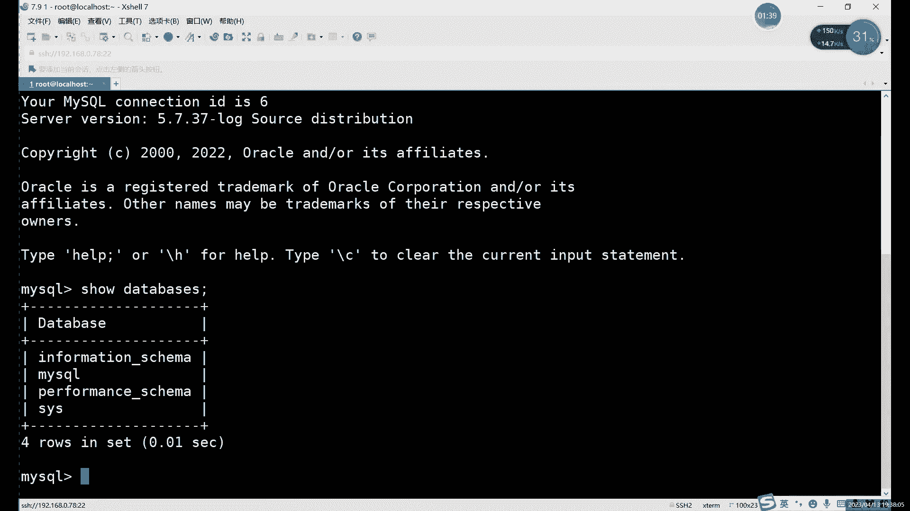

---

## SQL语句的主要类型 📋


上一节我们介绍了MySQL的安装与启动问题，本节中我们来看看SQL语句的主要类型。SQL语句根据其功能和管理对象的不同，一般分为四种类型。

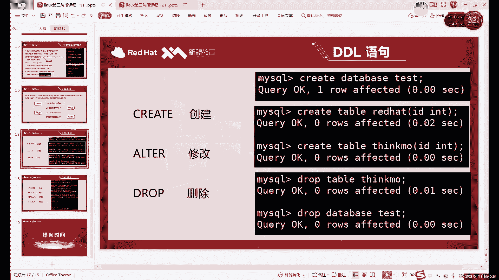

以下是四种主要的SQL语句类型及其管理对象：
*   **DDL (数据定义语言)**：用于定义和管理数据库、表格的结构，例如创建、修改、删除数据库或表格。
*   **DML (数据操作语言)**：用于操作表格中的数据，即我们常说的“增删改查”。
*   **DCL (数据控制语言)**：用于管理数据库的访问权限和安全。
*   **TCL (事务控制语言)**：用于管理数据库中的事务，例如提交或回滚操作。

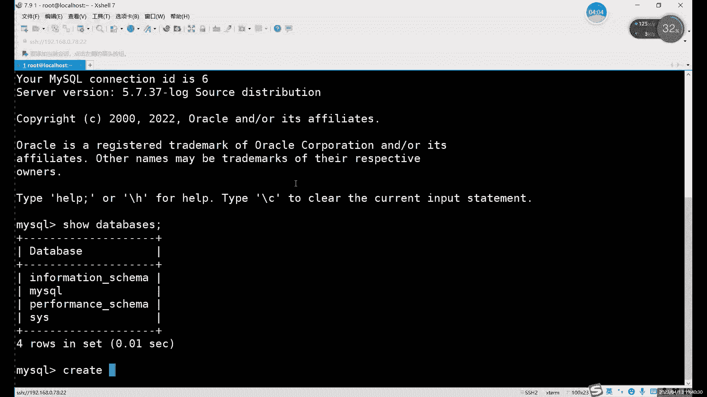

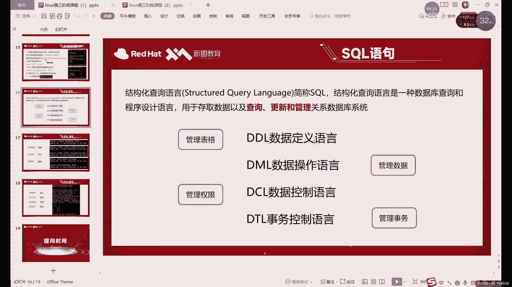

本节课，我们将重点学习前两种：DDL和DML。

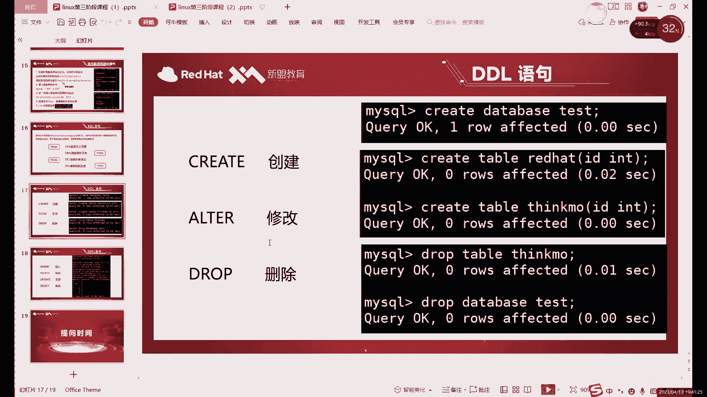

---

## DDL：数据定义语言 🏗️

数据定义语言（DDL）主要负责定义数据的结构，即创建和修改存放数据的“容器”，如数据库和表格。它决定了数据应按照何种规则存放。

DDL主要包括三个命令：
*   **CREATE**：用于创建新的数据库或表格。
*   **ALTER**：用于修改现有的数据库或表格结构。
*   **DROP**：用于删除数据库或表格。

### 创建数据库与表格

首先，我们需要创建一个自己的数据库，并切换到其中进行操作。在MySQL中，必须指定具体的数据库才能进行数据操作。

```sql
-- 创建一个名为 `test_db` 的数据库
CREATE DATABASE test_db;

-- 切换到 `test_db` 数据库
USE test_db;
```

进入数据库后，我们可以创建表格。创建表格时需要定义表格的“列”（字段），并为每一列指定数据类型和长度。

```sql
-- 创建一个名为 `db_info` 的表格，包含三列
CREATE TABLE db_info (
    id INT,                    -- 第一列：id，整数类型
    db_name VARCHAR(18),       -- 第二列：db_name，可变长度字符，最多18个字符
    is_system CHAR(3)          -- 第三列：is_system，固定长度字符，固定为3个字符
);
```

**代码解释**：
*   `INT` 表示整数类型。
*   `VARCHAR(18)` 表示可变长度字符串，最大长度为18个字符（可以是18个英文字母或18个汉字）。
*   `CHAR(3)` 表示固定长度字符串，长度固定为3个字符，不足部分会用空格填充。
*   括号内的数字代表长度限制，对于字符类型是硬性限制，插入数据时若超出长度则会报错。

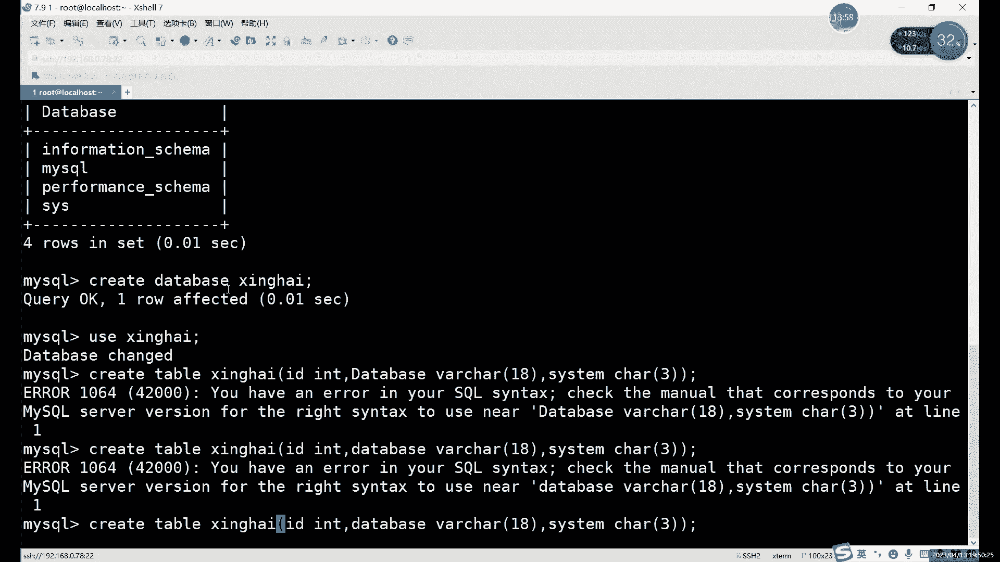


### 修改表格结构

`ALTER` 命令功能强大，可以修改表格的几乎所有方面，包括表格名、字段名、数据类型以及后续会讲到的约束。

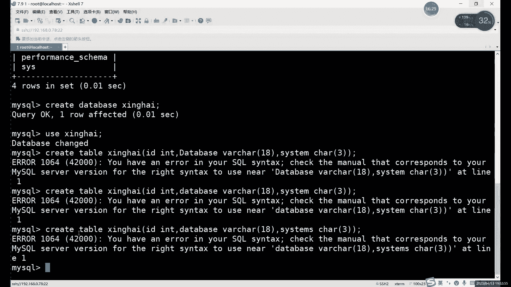

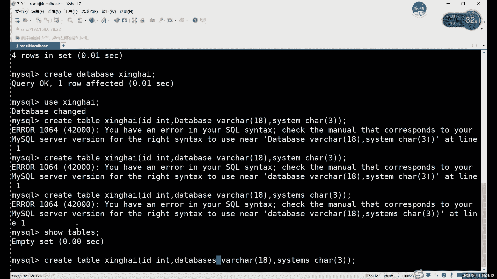

以下是一个修改表格名称的示例：

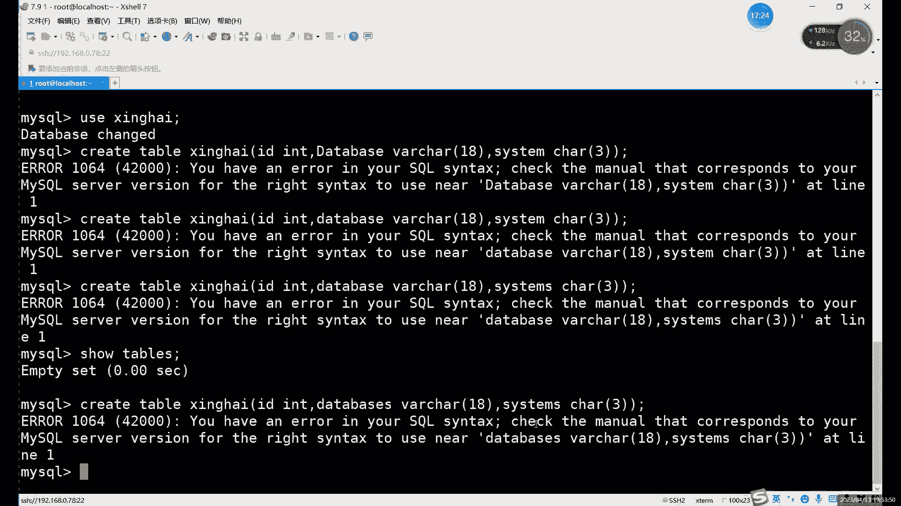

```sql
-- 将表格 `db_info` 改名为 `database_info`
ALTER TABLE db_info RENAME TO database_info;
```

`ALTER` 命令还有其他子命令（如 `MODIFY`, `CHANGE` 等）用于修改字段，我们将在学习约束后详细讲解。

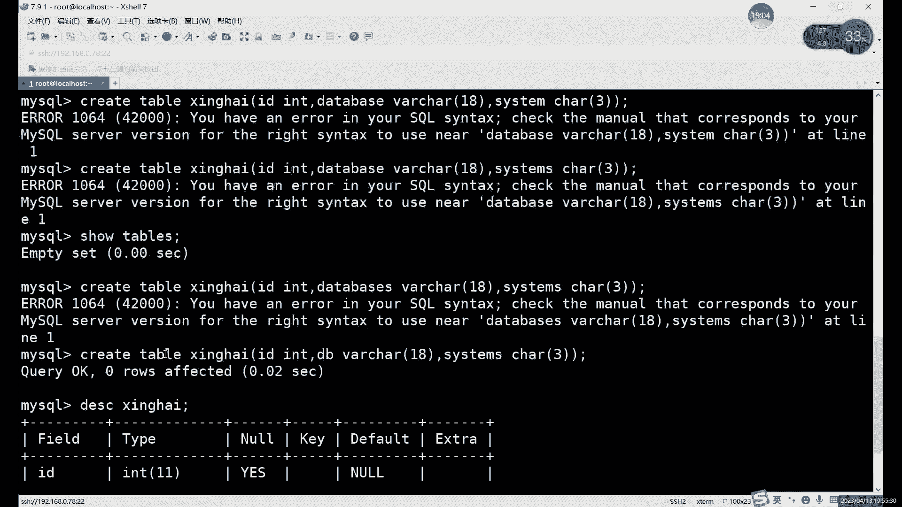

### 删除数据库或表格

`DROP` 命令用于删除数据库或表格，这是一个需要谨慎使用的命令。

```sql
-- 删除名为 `database_info` 的表格
DROP TABLE database_info;

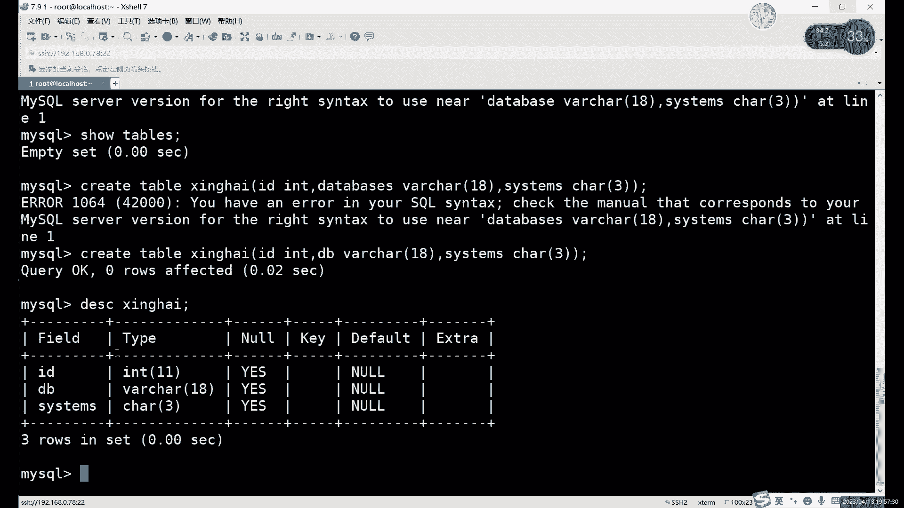

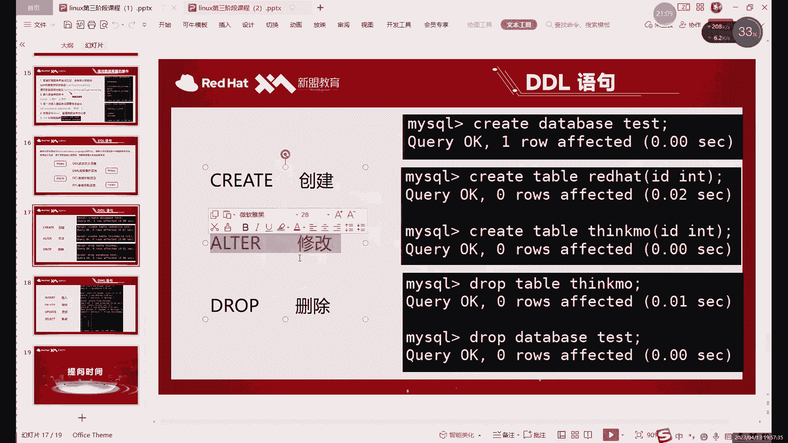

-- 删除名为 `test_db` 的数据库
DROP DATABASE test_db;
```

**请注意**：`DROP DATABASE` 是真正的“删库”命令，操作前务必确认。

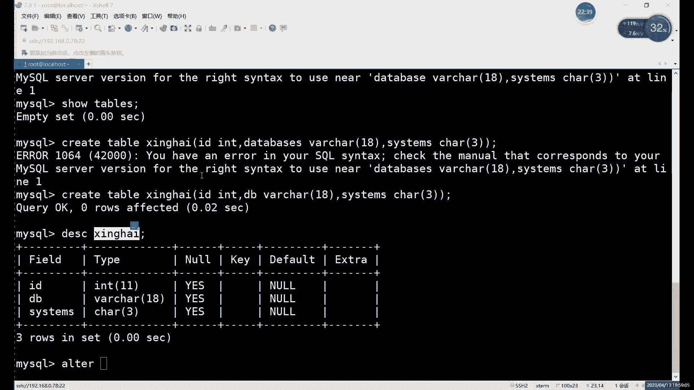

---

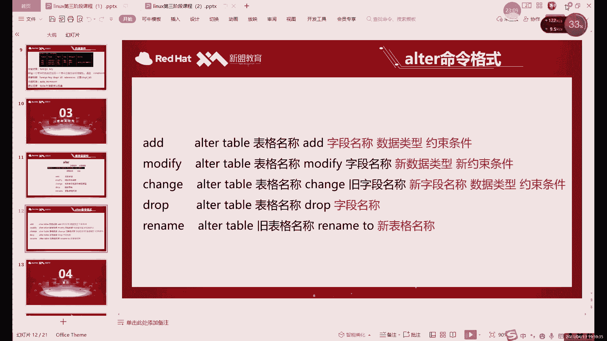

## DML：数据操作语言 📝

数据操作语言（DML）用于对表格中的具体数据进行“增删改查”（CRUD）操作，是SQL中最常用的部分。

DML主要包括四个命令：
*   **INSERT**：向表格中插入新数据。
*   **DELETE**：从表格中删除数据。
*   **UPDATE**：更新表格中已有的数据。
*   **SELECT**：从表格中查询数据。

### 插入数据 (INSERT)

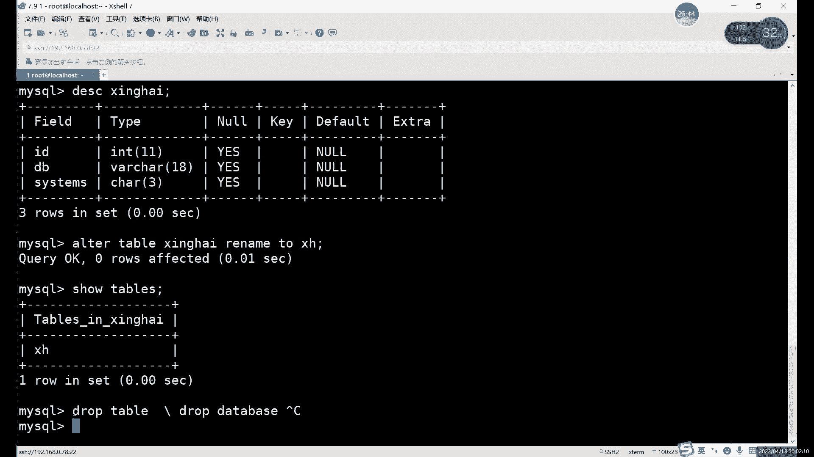

`INSERT` 命令用于向表格中添加数据。插入时必须遵守表格定义的数据类型和长度约束。

**插入完整一行数据**：

```sql
-- 向 `database_info` 表格插入一行完整数据
INSERT INTO database_info VALUES (1, 'information_schema', 'yes');
```


**同时插入多行数据**：

```sql
-- 向 `database_info` 表格插入多行数据
INSERT INTO database_info VALUES
(2, 'mysql', 'yes'),
(3, 'performance_schema', 'yes'),
(4, 'test_db', 'no');
```

**插入部分列的数据**：如果只想为部分列插入数据，必须在表名后明确指定列名。

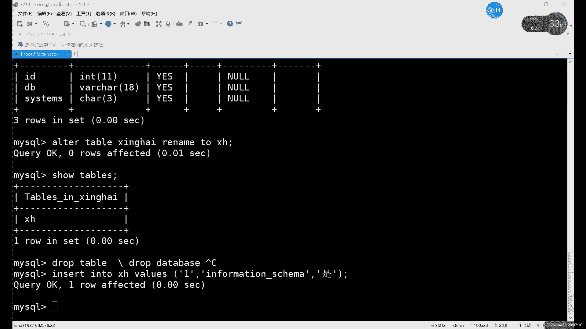

```sql
-- 仅向 `id` 和 `db_name` 列插入数据，`is_system` 列留空
INSERT INTO database_info (id, db_name) VALUES (5, 'new_db');
```
未指定值的列将显示为 `NULL`，表示空值。

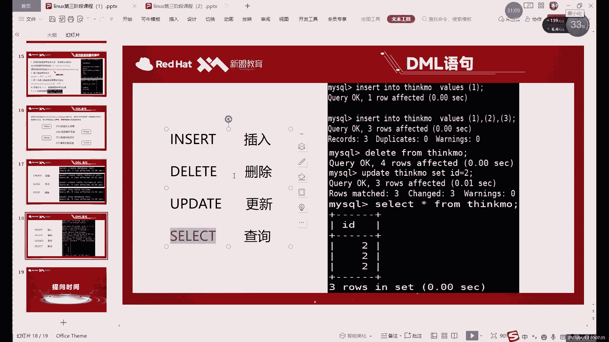

### 查询数据 (SELECT)

`SELECT` 命令用于从表格中查询数据，是SQL中最复杂也最强大的命令。

**查询表格中所有数据**：

```sql
-- 查看 `database_info` 表格中的所有数据
SELECT * FROM database_info;
```
`*` 是通配符，代表所有列。

### 删除数据 (DELETE)

`DELETE` 命令用于删除表格中的行（数据），**它只删除数据，不删除表格本身**。

```sql
-- 从 `database_info` 表格中删除数据（使用时需谨慎，通常应配合WHERE子句指定条件）
DELETE FROM database_info;
```
**注意**：上面的命令会删除表中所有数据，但表格结构依然存在。在实际使用中，务必结合 `WHERE` 条件来指定要删除的具体行。

---

## 总结 📚

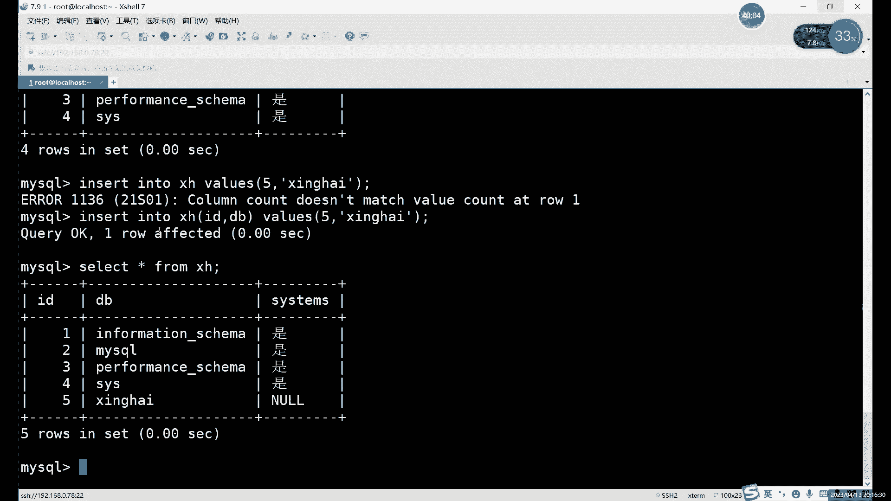

本节课中我们一起学习了SQL语句的两大基础类型：
1.  **数据定义语言 (DDL)**：我们学会了使用 `CREATE`、`ALTER`、`DROP` 命令来创建、修改和删除数据库与表格，定义了数据的存储结构。
2.  **数据操作语言 (DML)**：我们学会了使用 `INSERT`、`SELECT`、`DELETE` 命令向表格中插入、查询和删除数据，开始了对数据本身的操作。

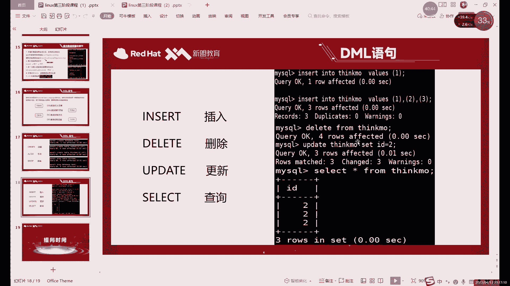

理解DDL和DML的区别是掌握SQL的关键：DDL定义结构，DML操作内容。下一节课，我们将继续学习DML中的 `UPDATE` 命令，并深入探讨MySQL的数据类型和约束条件，这些规则能进一步保证我们数据的有效性和准确性。