# Linux运维全套培训课程：P68：中级运维-5.SQL语句，数据类型，约束-中

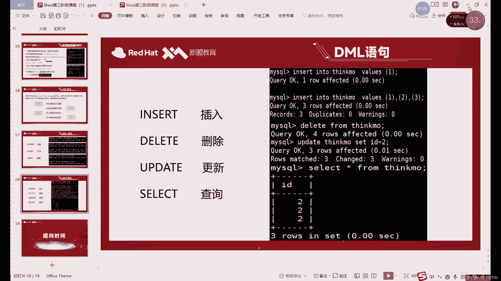


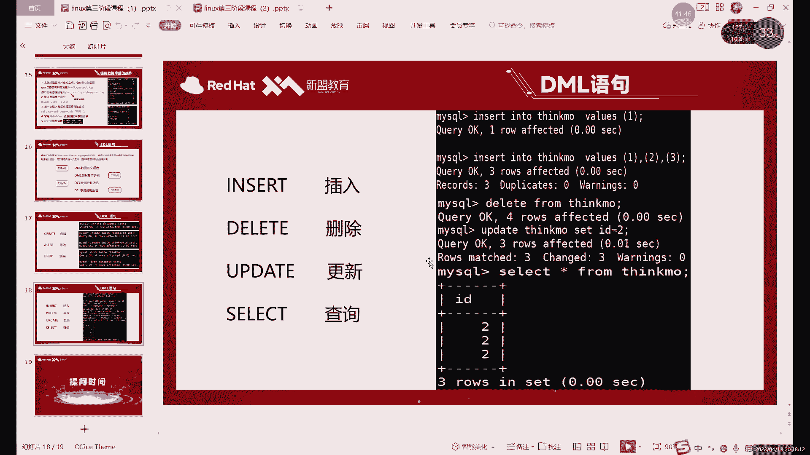

## 📚 概述
在本节课中，我们将深入学习SQL的数据操作语言（DML），包括`DELETE`、`UPDATE`命令的详细用法，并介绍数据控制语言（DCL）中的权限管理。最后，我们将开始探讨MySQL中的数据类型，特别是数值类型（整数和浮点数）的特点与限制。

---

## 🗑️ DELETE命令：删除数据
上一节我们介绍了`INSERT`命令用于添加数据，本节中我们来看看如何删除数据。`DELETE`命令用于从数据库表中删除记录。

### 删除所有数据
`DELETE FROM`命令后直接跟表名，会删除该表中的所有数据。这是一个危险的操作，需谨慎使用。

```sql
DELETE FROM 表名;
```

### 删除指定数据
通常我们不会删除所有数据，而是根据条件删除特定的行。这需要借助`WHERE`子句来指定删除的条件。

`WHERE`子句的作用是限制操作的范围，它不仅用于`DELETE`，也用于`UPDATE`和`SELECT`命令。

以下是删除指定数据的语法：
```sql
DELETE FROM 表名 WHERE 条件;
```


### 如何指定条件
条件通常基于表中某一列的值。为了精确删除某一行，最好使用具有唯一性的列作为条件，例如主键ID。

*   **删除ID为5的行：**
    ```sql
    DELETE FROM example WHERE id = 5;
    ```
*   **使用多个条件确保唯一性：**
    如果单列条件可能匹配多行，可以组合多个条件。
    ```sql
    DELETE FROM example WHERE id = 5 AND db = ‘星海’;
    ```

**核心概念：**
*   `DELETE`命令只能以**行**为单位进行删除，无法删除单个单元格。
*   设计表时，通常设置一个具有**唯一值**的列（如自增ID、身份证号），以便精确操作数据。
*   `WHERE`子句是安全操作的关键，不加`WHERE`会操作整个表。

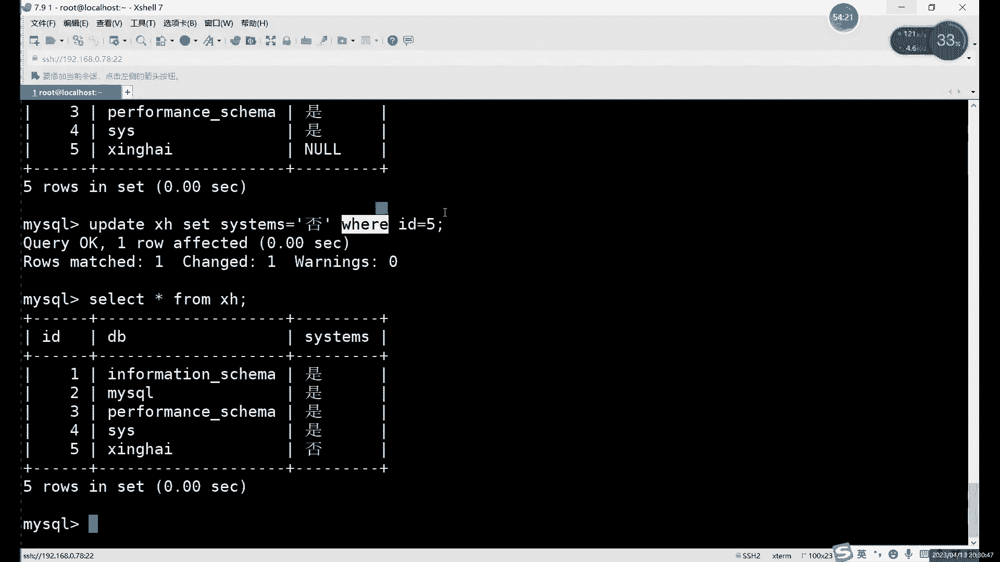

操作完成后，可以使用`SELECT * FROM 表名;`来确认数据已被删除。若误删，可以使用`INSERT`命令重新插入数据。


---

## ✏️ UPDATE命令：更新数据
接下来我们学习如何修改已有的数据。`UPDATE`命令用于更新表中的记录。


`UPDATE`命令的用法与`DELETE`有相似之处，但它不需要`FROM`关键字。

### 更新所有数据
直接使用`UPDATE`加`SET`会更新表中**所有行**的指定列。

```sql
UPDATE 表名 SET 列名 = 新值;
```
例如，将所有行的`sensitive`字段改为`‘no’`：
```sql
UPDATE example SET sensitive = ‘no’;
```

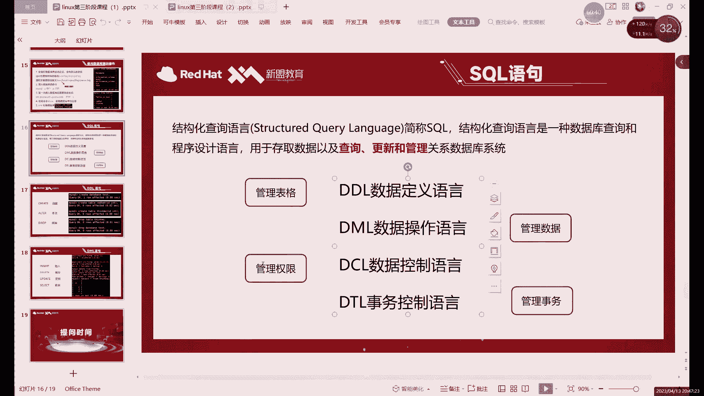


### 更新指定数据
同样，为了安全性和准确性，我们必须使用`WHERE`子句来限定更新的范围。


```sql
UPDATE 表名 SET 列名 = 新值 WHERE 条件;
```
例如，将ID为5的行的`sensitive`字段更新为`‘no’`：
```sql
UPDATE example SET sensitive = ‘no’ WHERE id = 5;
```

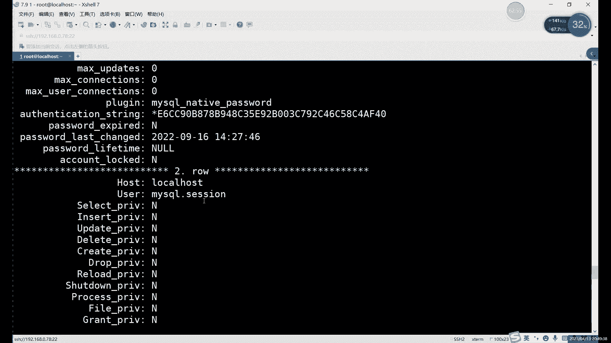


**重要提醒：** 在执行`UPDATE`和`DELETE`操作时，**务必加上`WHERE`条件**，除非你确实需要更新或删除全部数据，否则极易造成数据误操作。


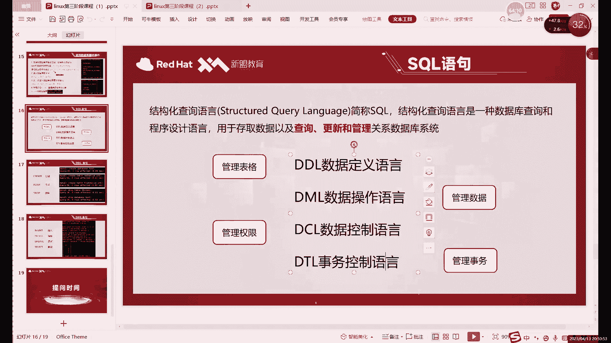

---

## 🔍 SELECT命令简介
数据操作语言的最后一部分是查询。`SELECT`命令用于从数据库中查询数据，其功能非常强大，用法也最为灵活。


最基本的`SELECT`语法是查询表中所有列的所有行：
```sql
SELECT * FROM 表名;
```
这里的`*`是通配符，代表所有列。

### 查询指定列
我们可以指定只查看某些列，只需将`*`替换为列名，多个列名用逗号分隔。

*   **查看单列（如ID）：**
    ```sql
    SELECT id FROM example;
    ```
*   **查看多列（如db和sensitive）：**
    ```sql
    SELECT db, sensitive FROM example;
    ```

`SELECT`语句通常由三部分组成：
1.  `SELECT` 后跟要查询的列。
2.  `FROM` 后跟要查询的表。
3.  `WHERE` 后跟查询条件（可选，但极其常用）。

关于`WHERE`子句在查询中的复杂应用，我们将在下一节课详细展开。


---

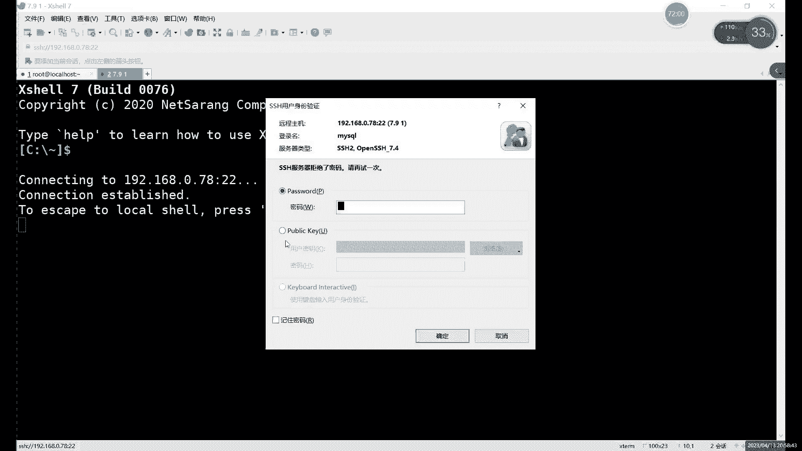

## 🛡️ 数据控制语言（DCL）：权限管理
除了操作数据，SQL还能管理数据库的访问权限。数据控制语言（DCL）主要用于控制用户对数据库的访问和操作权限。

### GRANT命令：授予权限
`GRANT`命令用于给用户授予权限。


基本语法结构如下：
```sql
GRANT 权限 ON 数据库.表 TO ‘用户名’@‘主机’ IDENTIFIED BY ‘密码’;
```

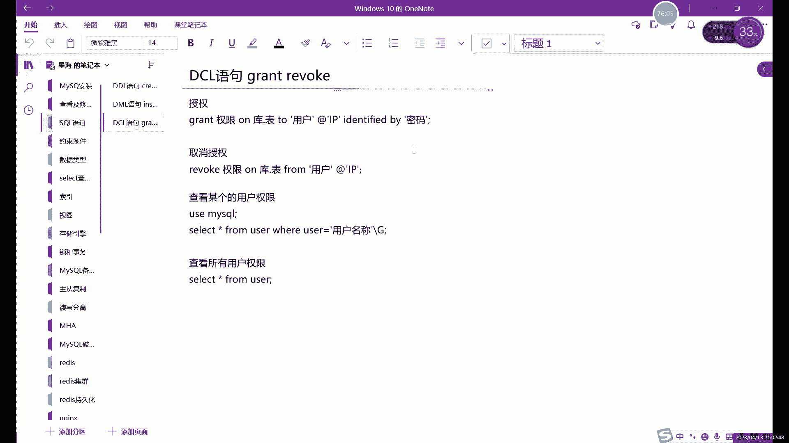

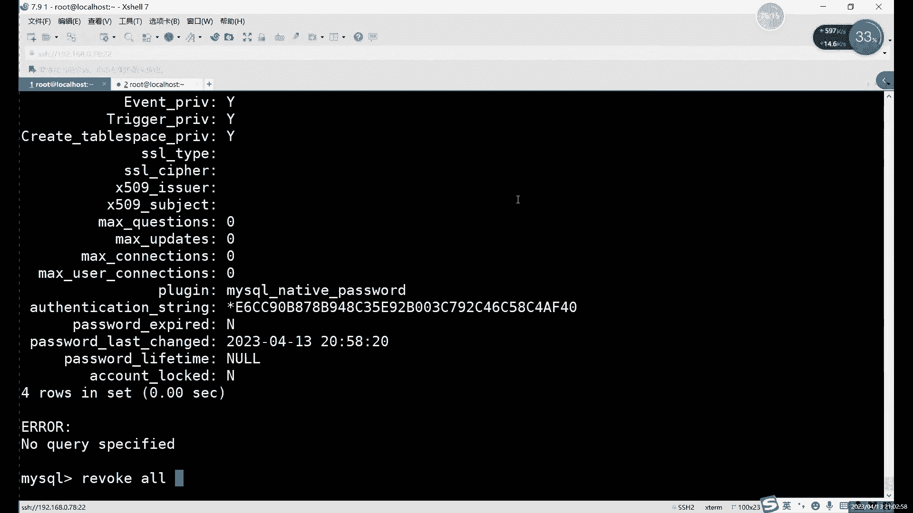

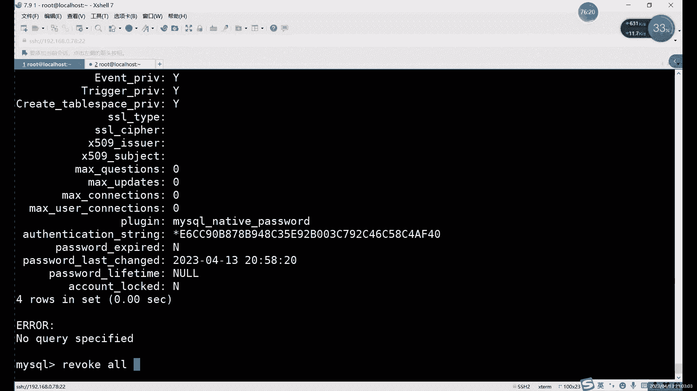

**参数解释：**
*   **权限：** 如`ALL`（所有权限）、`SELECT`、`INSERT`、`UPDATE`等。
*   **数据库.表：** 指定权限的作用范围。`*.*`代表所有数据库的所有表。
*   **用户名@主机：** 指定用户和允许其登录的主机。`‘localhost’`代表本地，`‘%’`代表任何主机。
*   **IDENTIFIED BY ‘密码’：** 设置或修改该用户的登录密码。如果用户不存在，此命令会创建该用户。

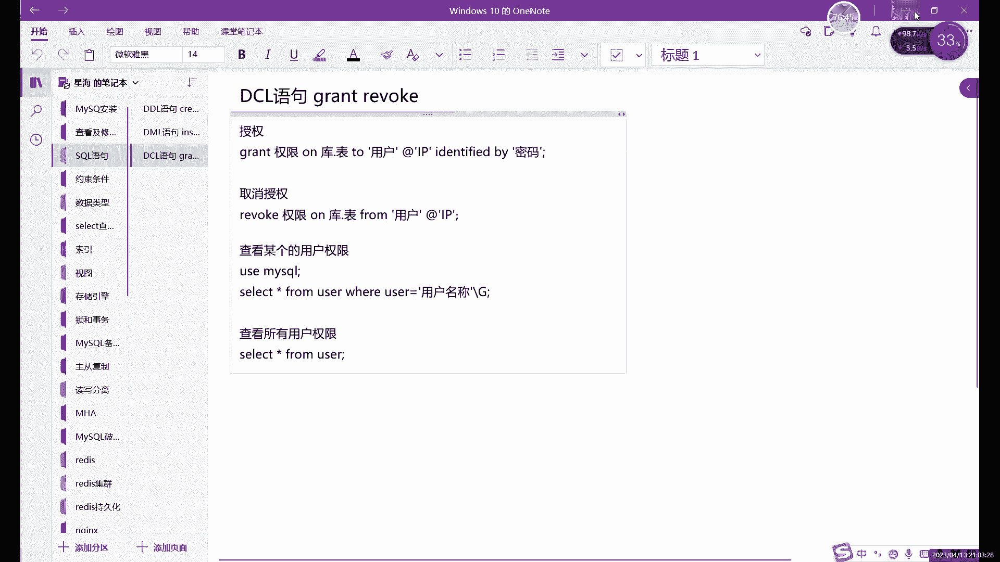

**示例：授予本地用户`mysql`对所有数据库的所有操作权限**
```sql
GRANT ALL ON *.* TO ‘mysql’@‘localhost’ IDENTIFIED BY ‘your_password’;
```
授权后，该用户几乎拥有与`root`相似的最高权限，但通常不具备给其他用户授权的权限（`GRANT`权限）。

### REVOKE命令：撤销权限
如果需要收回已授予的权限，可以使用`REVOKE`命令。


基本语法结构如下：
```sql
REVOKE 权限 ON 数据库.表 FROM ‘用户名’@‘主机’;
```
**示例：撤销用户`mysql`的所有权限**
```sql
REVOKE ALL ON *.* FROM ‘mysql’@‘localhost’;
```
执行后，该用户在`mysql.user`表中的权限标记会变为`‘N’`，其访问和操作将受到限制。

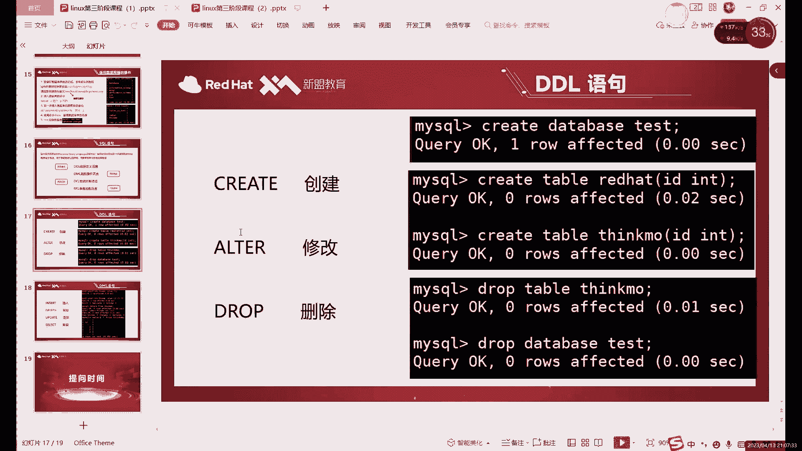


**权限管理核心：** 通过`mysql`数据库中的`user`、`db`等表进行控制，可以精细到每个用户对每个数据库、每张表的操作权限。

---

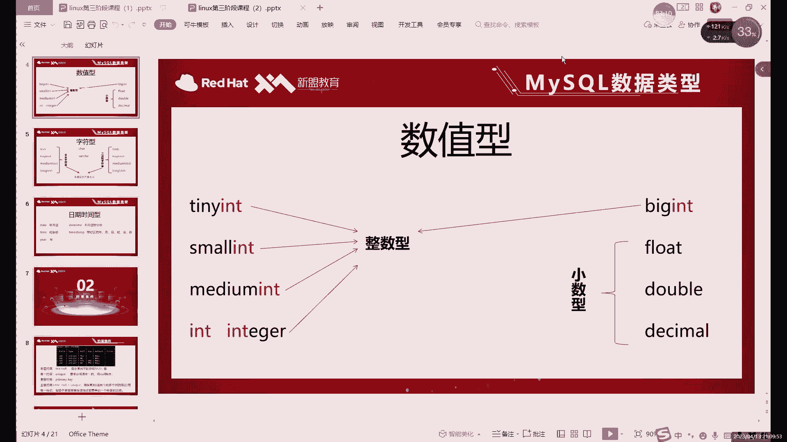

## 🔢 数据类型：数值类型
在深入了解修改表结构的`ALTER`命令前，我们必须先理解MySQL的数据类型和约束。本节我们先学习数值类型。

使用`DESC 表名;`命令可以查看表的结构，其中`Type`列显示了每列的数据类型。

### 整数类型
整数类型用于存储没有小数部分的数字。MySQL提供了多种整数类型，主要区别在于它们的存储范围和所占空间。

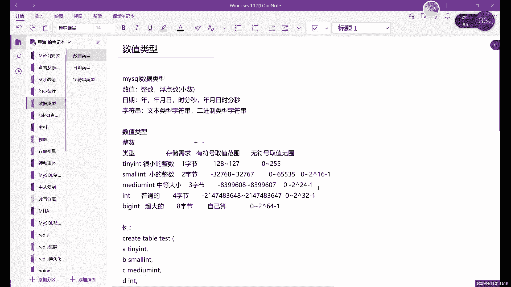


以下是主要的整数类型及其范围：

| 类型 | 存储空间 | 有符号范围 | 无符号范围 | 说明 |
| :--- | :--- | :--- | :--- | :--- |
| `TINYINT` | 1字节 | -128 ~ 127 | 0 ~ 255 | 非常小的整数 |
| `SMALLINT` | 2字节 | -32768 ~ 32767 | 0 ~ 65535 | 小整数 |
| `MEDIUMINT` | 3字节 | -8388608 ~ 8388607 | 0 ~ 16777215 | 中等整数 |
| **`INT`** | **4字节** | **-2147483648 ~ 2147483647** | **0 ~ 4294967295** | **标准整数，最常用** |
| `BIGINT` | 8字节 | ±9.22×10¹⁸ | 0 ~ 1.84×10¹⁹ | 大整数 |

**定义整数类型时的宽度：**
在定义整数列时，可以指定一个显示宽度，例如`INT(11)`。但请注意：
*   这个宽度**只是显示宽度**，用于在客户端工具中提示可能显示的字符数。
*   它**不影响**该整数类型实际能存储的数值范围。`INT(2)`的列依然可以存储`100`。
*   实际存储范围由数据类型本身（如`INT`）决定，这是**硬性限制**。

### 浮点数类型
浮点数类型用于存储带有小数的数字，也称为实数。


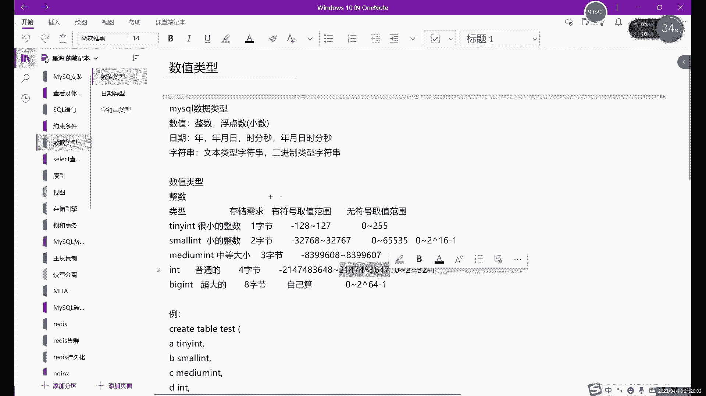

主要有两种类型：
*   `FLOAT`： 单精度浮点数，精度大约为6-7位有效数字。
*   `DOUBLE`： 双精度浮点数，精度大约为15位有效数字。

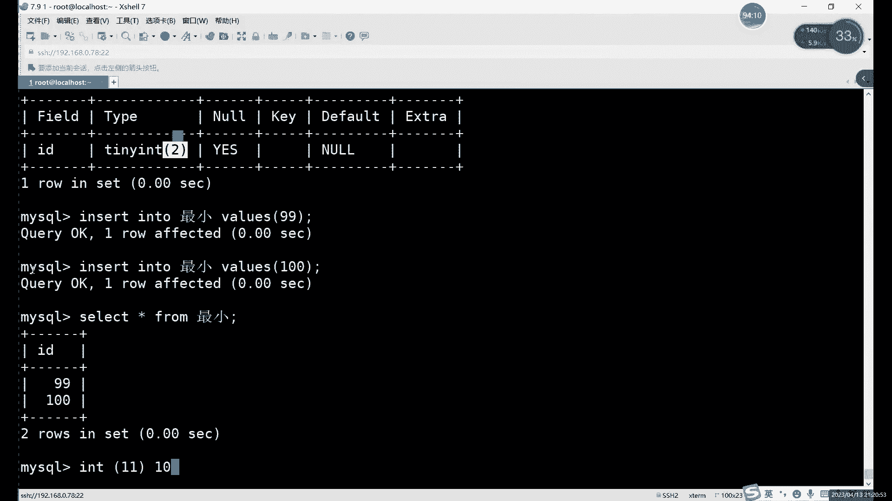

定义浮点数时可以指定精度：
```sql
列名 FLOAT(M, D)
列名 DOUBLE(M, D)
```
*   **`M`**： 总位数（整数位+小数位）。
*   **`D`**： 小数点后的位数（小数位）。


**示例：**
```sql
-- 创建一个表，包含不同精度的浮点数列
CREATE TABLE test_float (
    a FLOAT(5, 2), -- 总位数为5，其中小数位占2位。例如：123.45
    b FLOAT, -- 使用默认精度
    c DOUBLE(10, 4) -- 总位数为10，其中小数位占4位
);
```
**注意：** 浮点数在进行计算时可能存在微小的精度误差。

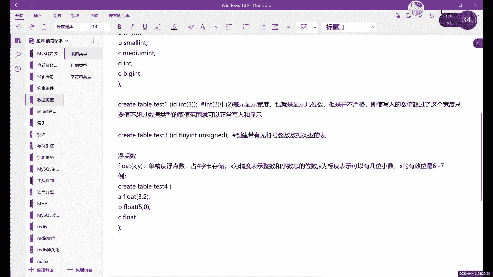

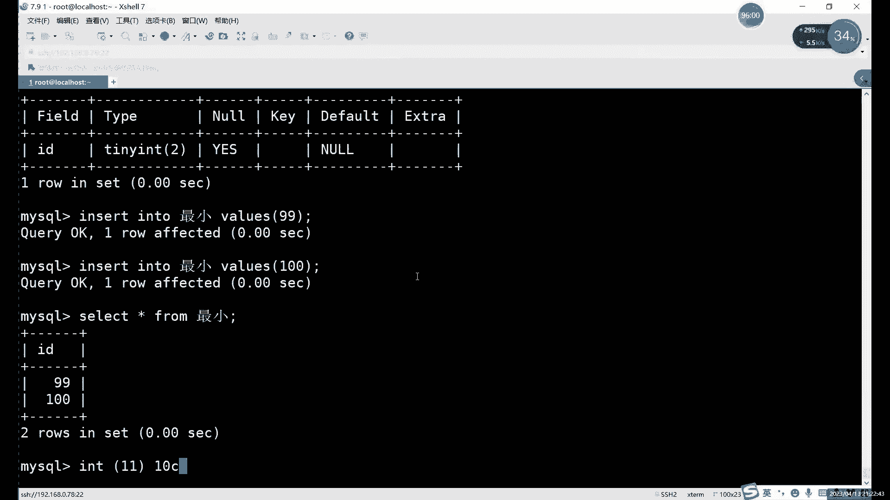

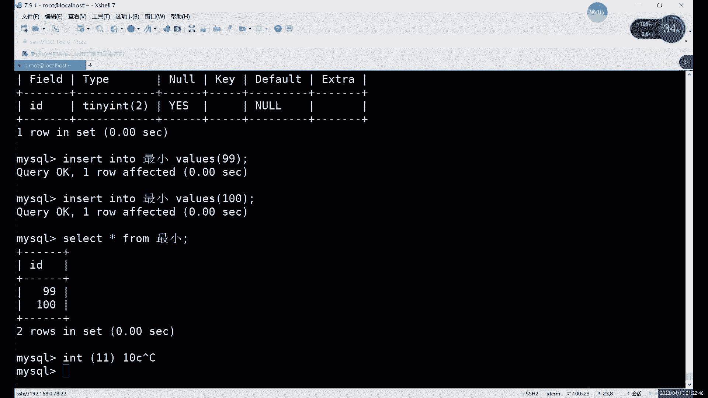

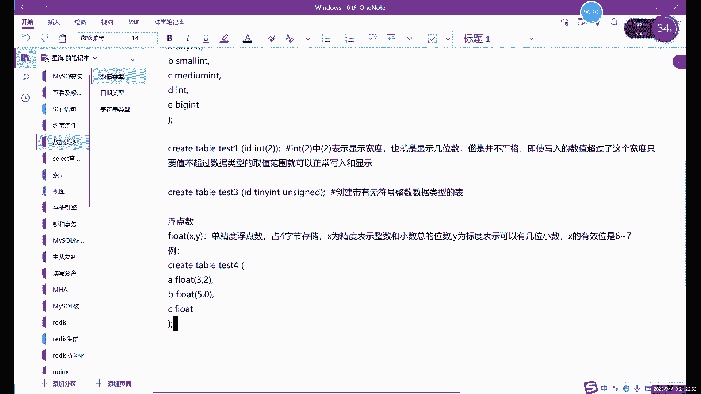

---

## 📝 总结
本节课中我们一起学习了：
1.  **`DELETE`命令**：用于删除数据，必须配合`WHERE`子句安全使用。
2.  **`UPDATE`命令**：用于更新数据，同样依赖`WHERE`子句定位要修改的行。
3.  **`SELECT`命令基础**：用于查询数据，介绍了选择特定列的方法。
4.  **数据控制语言（DCL）**： 使用`GRANT`和`REVOKE`命令管理用户权限，控制数据库访问安全。
5.  **数值数据类型**：
    *   **整数类型**： 如`TINYINT`、`INT`等，区别在于存储范围。定义时的宽度参数仅具提示作用。
    *   **浮点数类型**： 如`FLOAT`、`DOUBLE`，用于存储小数，可以指定总位数和小数位数。

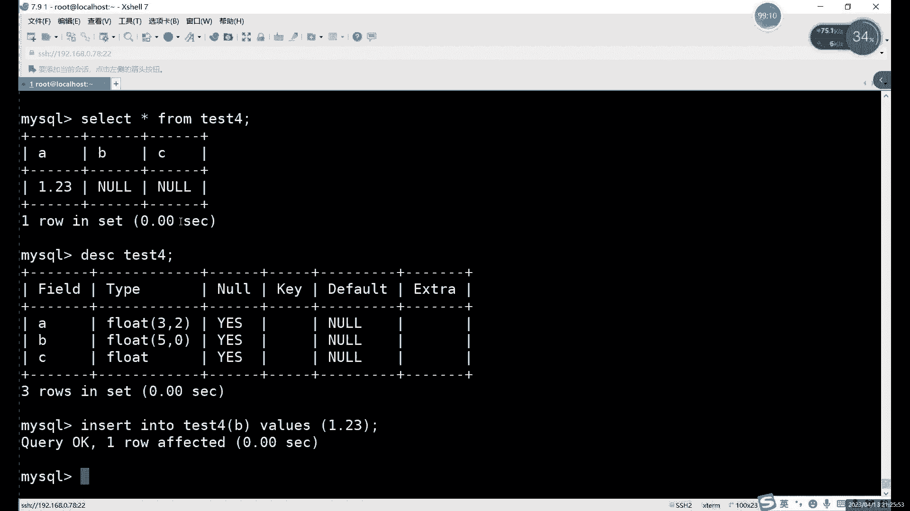


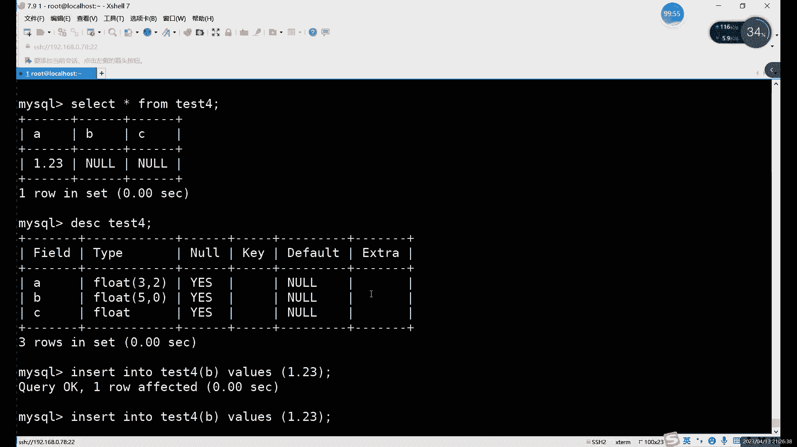

理解这些数据操作命令和基本数据类型，是进行有效数据库管理和更复杂查询的基础。下一节课，我们将继续学习`SELECT`查询的进阶技巧以及其他数据类型。