# Linux运维全套培训课程：P69：中级运维-6.SQL语句，数据类型，约束-下 📚

## 概述
在本节课中，我们将继续深入学习SQL的数据类型，特别是字符型和日期时间型，并开始探讨SQL中非常重要的概念——约束。我们将通过具体的例子来理解这些数据类型的特点和约束的作用，为后续的数据库操作打下坚实基础。

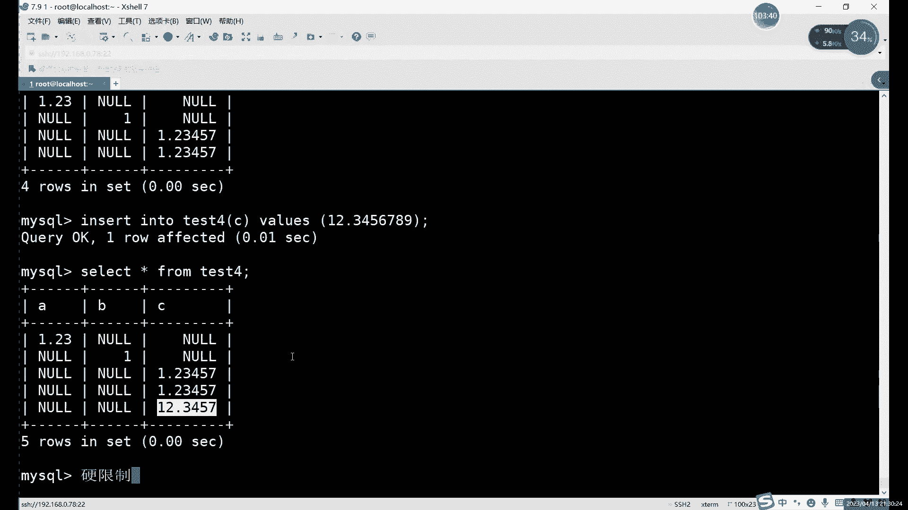

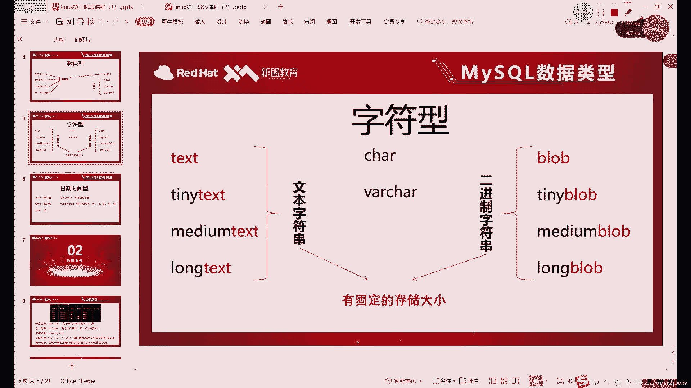

---

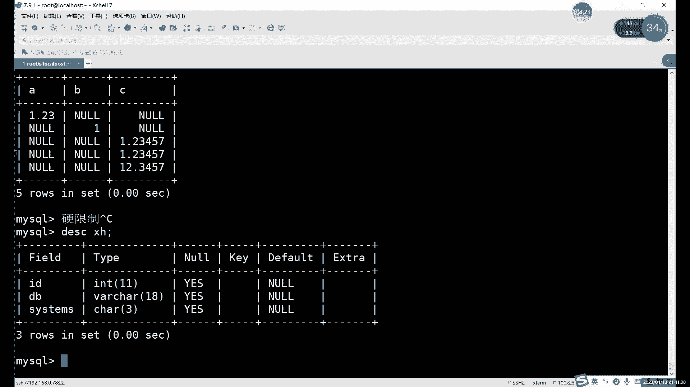

## 字符型数据详解 🆎

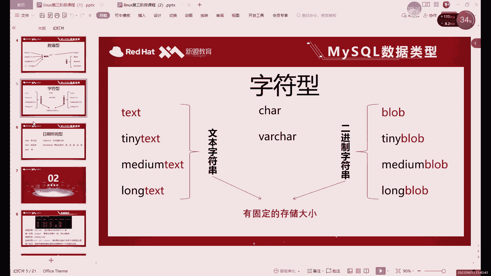

上一节我们介绍了数值型数据，本节中我们来看看字符型数据。字符型数据与数值型的主要区别在于“硬限制”，即插入数据的长度必须严格遵守定义时指定的范围，否则会报错。

字符型主要分为三种：`CHAR`、`VARCHAR`和文本类型（如`TEXT`）。

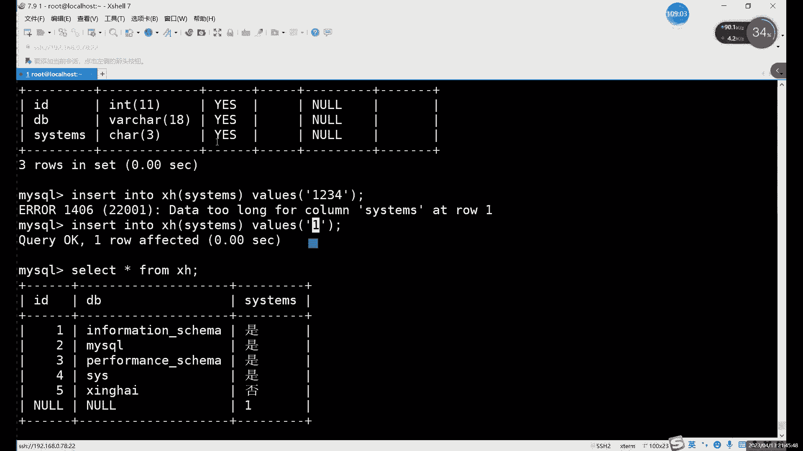

### CHAR 与 VARCHAR
以下是`CHAR`和`VARCHAR`的核心特点对比：

*   **`CHAR(M)`**：固定长度字符串。`M`表示字符数，范围是0-255。如果插入的数据长度小于`M`，会用空格在右侧填充到指定长度。这可能会浪费一些存储空间。
    *   **公式/代码**：`CHAR(3)` 定义了一个固定长度为3的字符串字段。
*   **`VARCHAR(M)`**：可变长度字符串。`M`表示最大字符数，范围是0-65535。它只存储实际的数据，并用额外的1-2个字节记录数据的实际长度，因此更节省空间。
    *   **公式/代码**：`VARCHAR(100)` 定义了一个最大长度为100的可变字符串字段。

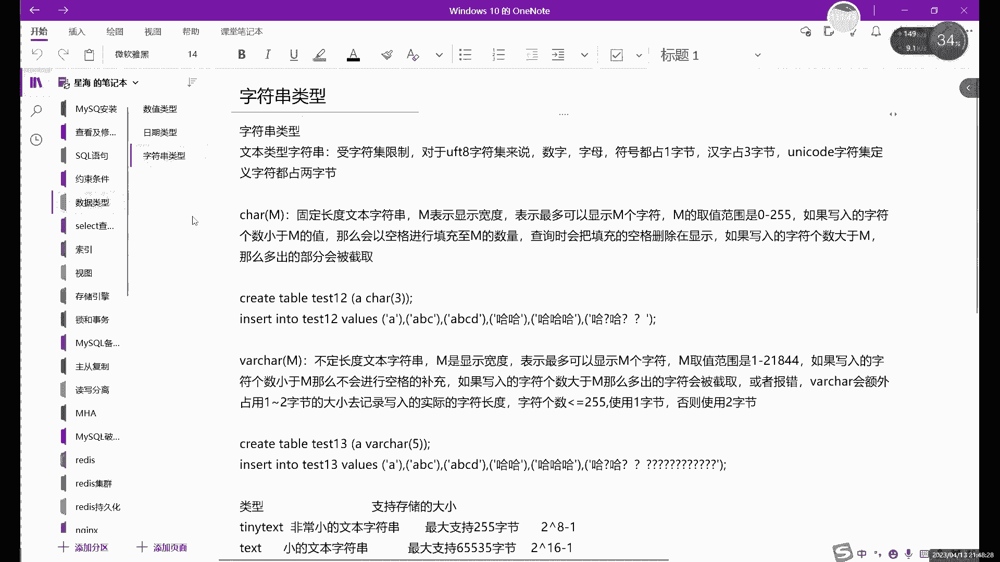


**核心概念**：`CHAR`是“定长”的，`VARCHAR`是“变长”的。对于长度变化不大的数据（如性别`CHAR(1)`），使用`CHAR`效率更高；对于长度不确定的数据（如姓名、地址），使用`VARCHAR`更能节省存储空间。

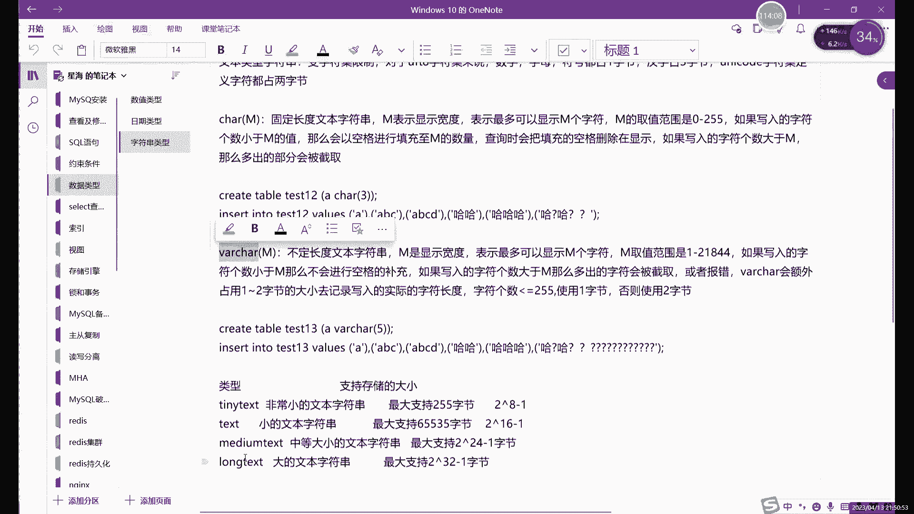

### 大文本类型
当需要存储超过65535个字符的大量文本时，就需要使用文本类型：

*   `TINYTEXT`: 最大 255 字节
*   `TEXT`: 最大 65,535 字节
*   `MEDIUMTEXT`: 最大 16,777,215 字节
*   `LONGTEXT`: 最大 4,294,967,295 字节

**选择建议**：在满足需求的前提下，优先使用`VARCHAR`。只有当数据量确实超过`VARCHAR`的上限时，才考虑使用`TEXT`系列类型。

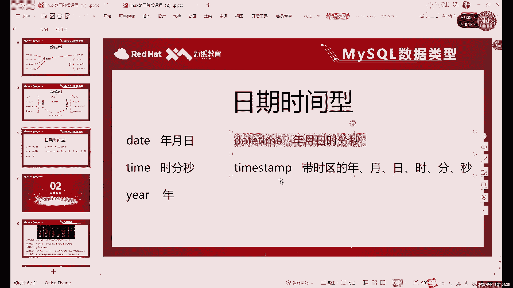

### 二进制字符串
除了文本字符，MySQL还支持二进制字符串类型（如`BLOB`），用于存储图片、音频等二进制数据。其容量范围与对应的文本类型（`TEXT`）一致。

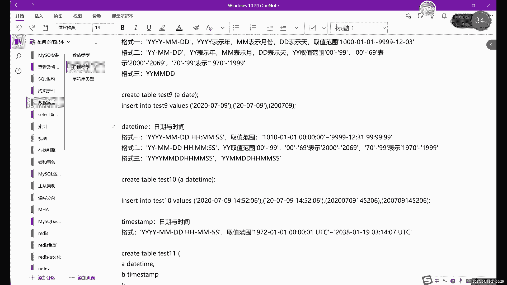

**重要提醒**：插入字符型数据时，**必须使用引号**（单引号或双引号）将值括起来。

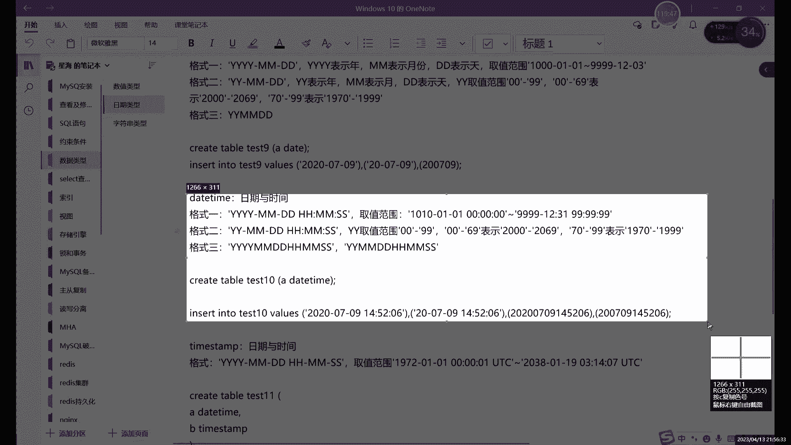

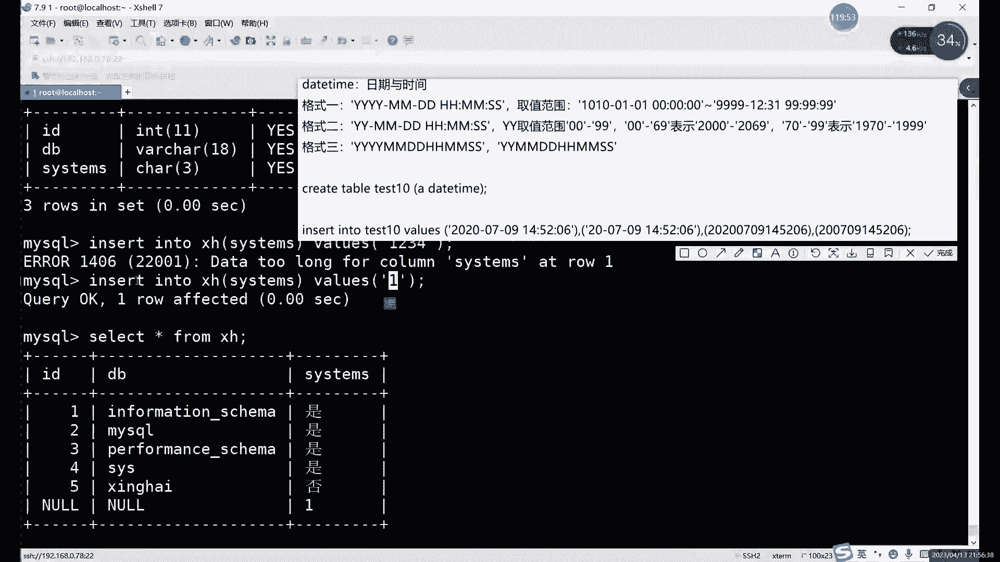

---

## 日期时间型数据 📅

接下来，我们学习日期时间型数据。这类数据本质上是带有特殊格式的数值，用于记录年、月、日、时、分、秒等信息。

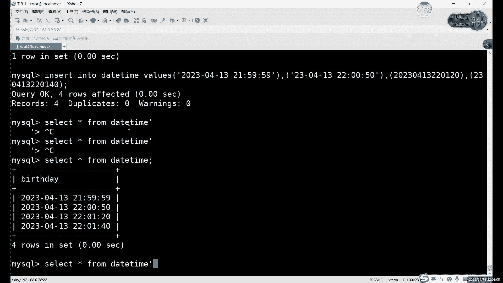

最常用的类型是`DATETIME`，它包含完整的日期和时间信息。其插入格式比较灵活，以下是一些有效的格式示例：

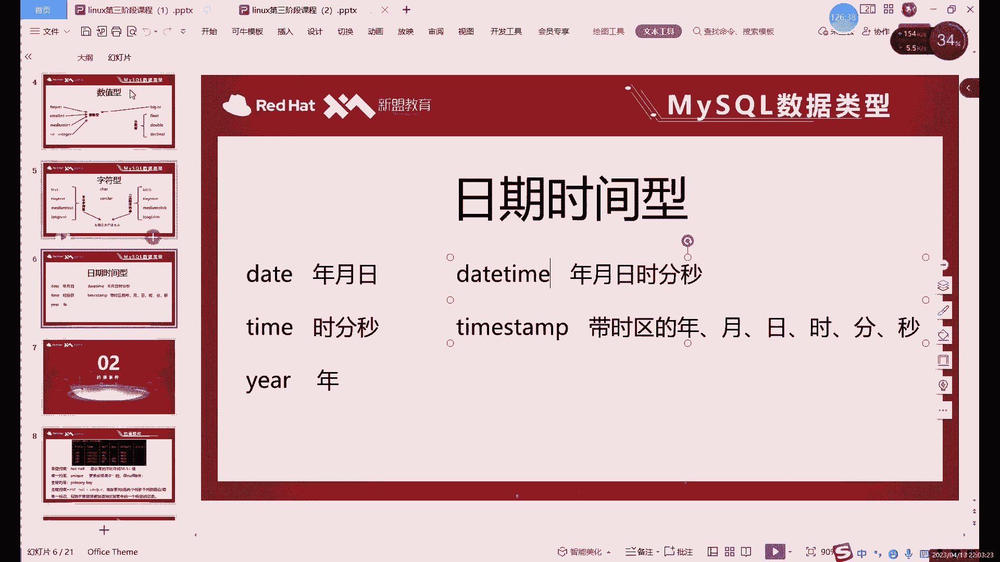

```sql
-- 标准格式
INSERT INTO table_name (date_column) VALUES ('2023-10-27 14:30:00');
-- 数字格式（不加引号）
INSERT INTO table_name (date_column) VALUES (20231027143000);
-- 紧凑格式
INSERT INTO table_name (date_column) VALUES ('231027143000');
```

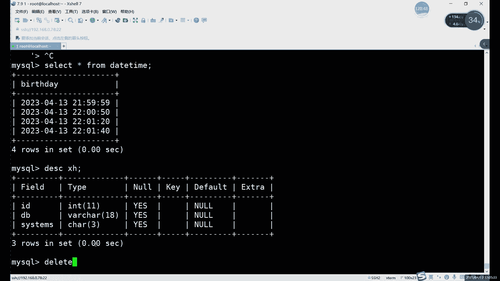

**核心概念**：`DATETIME`类型在显示时会统一为标准格式，无论插入时采用上述哪种写法，查询出来的结果都是一致的：`2023-10-27 14:30:00`。

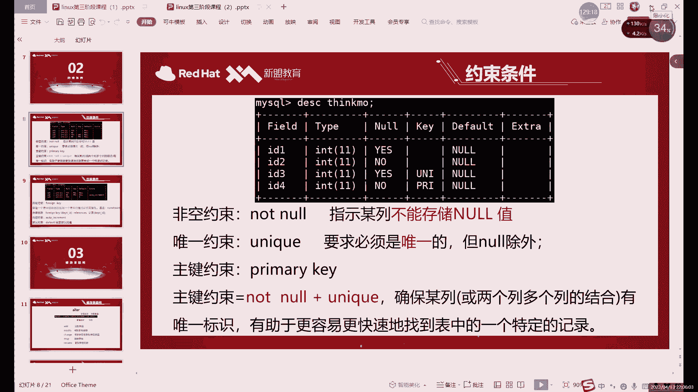

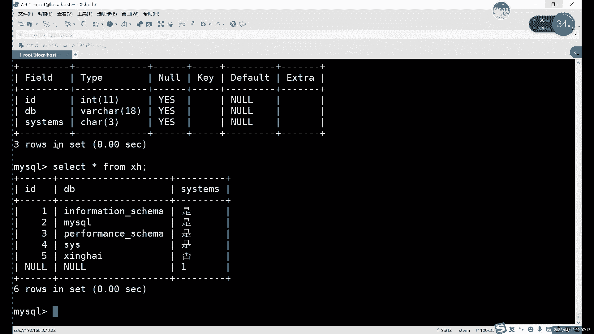

其他日期时间类型还包括`DATE`（仅日期）、`TIME`（仅时间）和`TIMESTAMP`（时间戳，包含时区信息），用法与`DATETIME`类似。

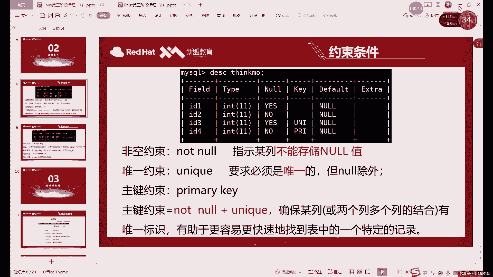

---

## SQL约束入门 🔒

在了解了各种数据类型后，我们来看看如何为数据添加“规则”，这就是约束。约束用于限制表中数据的规则，保证数据的准确性和可靠性。本节我们先介绍前三种基础约束。

### 1. 非空约束 (NOT NULL)
非空约束强制某列不能接受`NULL`值（即空值）。这可以防止因遗漏而插入不完整的数据。

```sql
CREATE TABLE users (
    id INT NOT NULL, -- id列不允许为空
    name VARCHAR(50)
);
```
如果尝试向`id`列插入`NULL`值或插入语句中不包含`id`值，操作将会失败。

### 2. 唯一约束 (UNIQUE)
唯一约束确保某列中的所有值都是互不相同的。但请注意，`NULL`值在唯一约束中不被视为一个“值”，因此可以出现多个`NULL`。

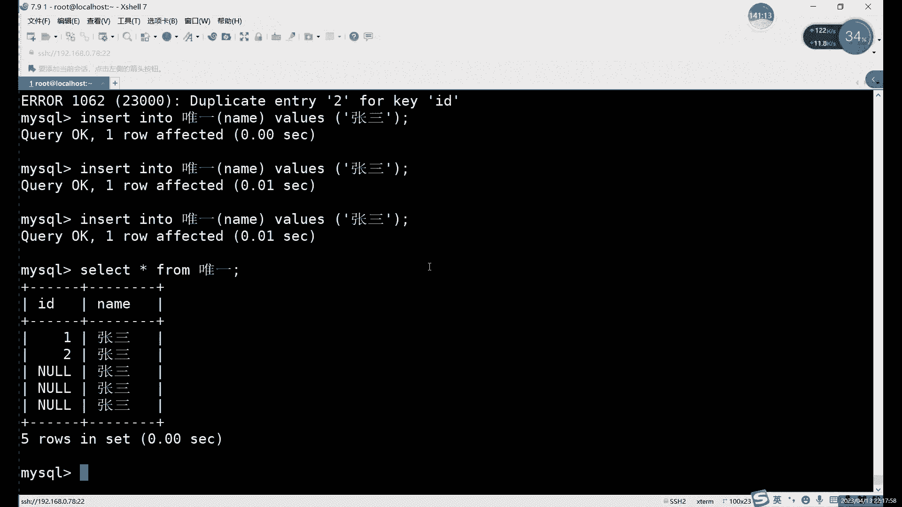

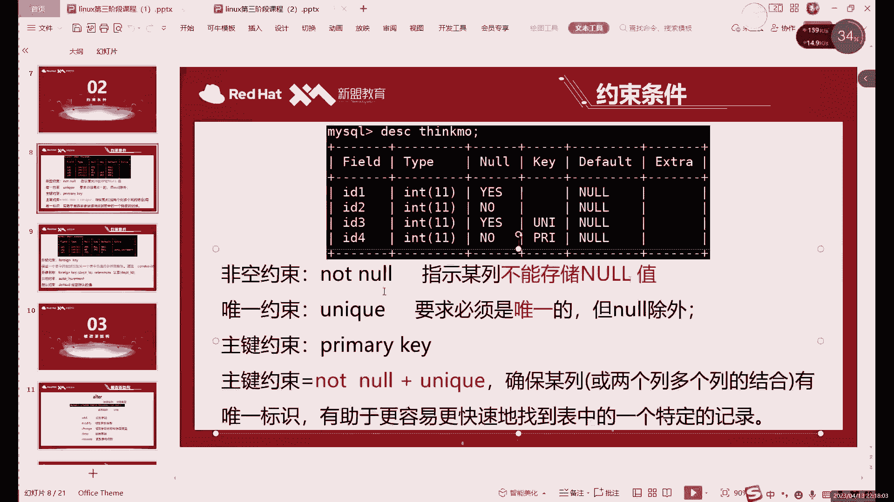

```sql
CREATE TABLE products (
    product_code INT UNIQUE, -- 产品编码必须唯一
    product_name VARCHAR(100)
);
```
如果尝试插入重复的`product_code`（`NULL`除外），操作将会失败。

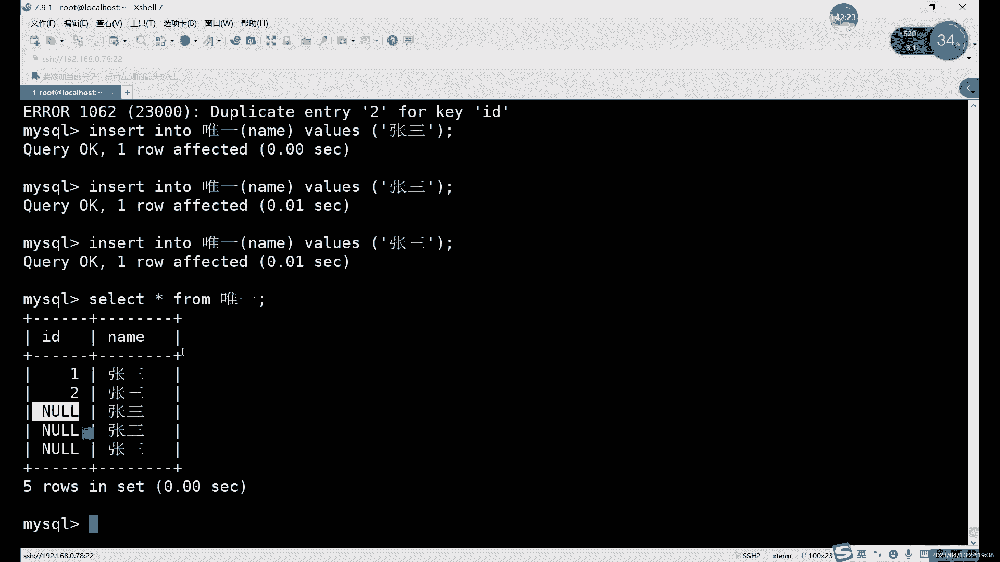

### 3. 主键约束 (PRIMARY KEY)
主键约束是非空约束和唯一约束的结合。它要求该列的值**唯一且非空**。每个表都应该有一个主键，以便唯一地标识表中的每一行记录。


```sql
CREATE TABLE employees (
    employee_id INT PRIMARY KEY, -- 员工ID是主键
    name VARCHAR(50)
);
```
主键是进行数据更新、删除和高效查询的理想条件字段。

**核心概念演进**：`非空(NOT NULL) + 唯一(UNIQUE) = 主键(PRIMARY KEY)`。主键是表中每一行数据的唯一标识符。

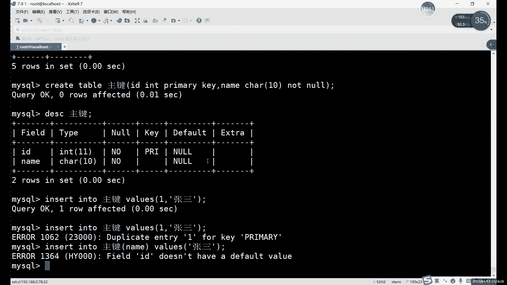

---

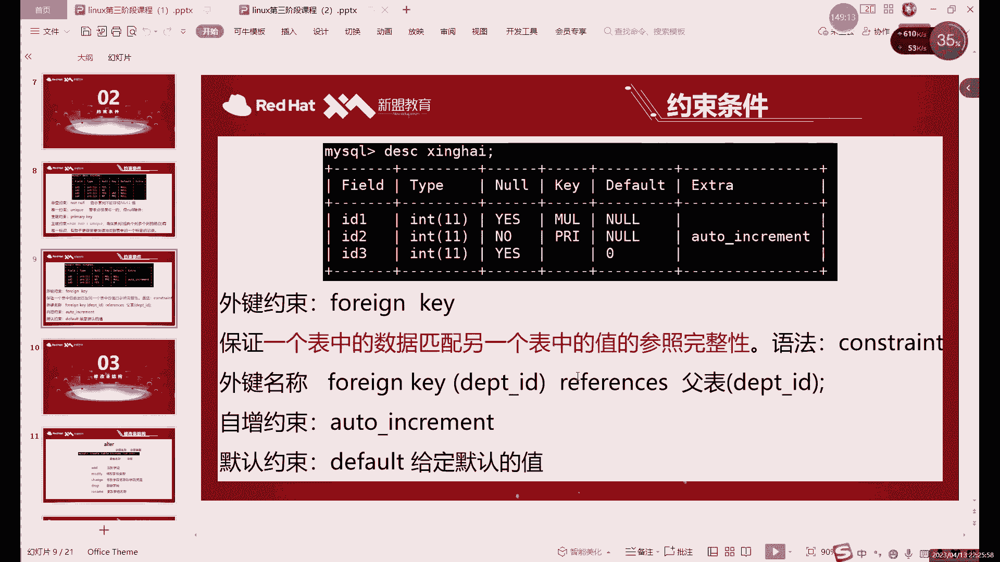

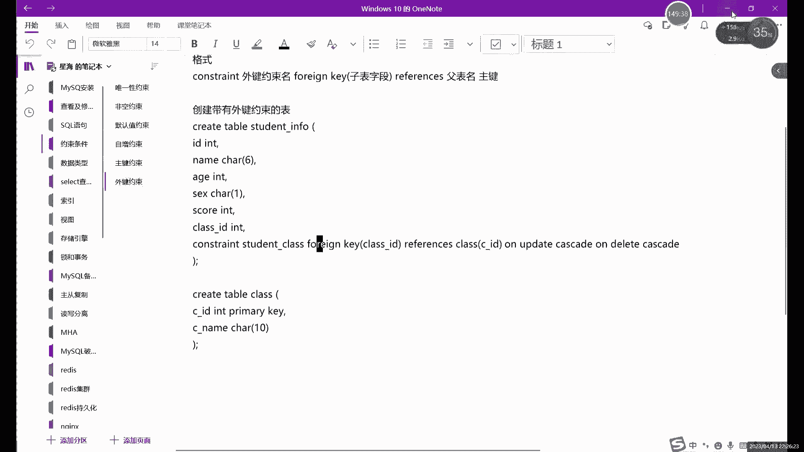

## 下节预告
本节课我们学习了字符型、日期时间型数据以及三种基础约束。下节课我们将继续学习另外三种重要的约束：**外键约束(FOREIGN KEY)**、**默认值约束(DEFAULT)** 和**自动增长约束(AUTO_INCREMENT)**。外键用于关联两个表的数据，默认值用于设置字段的初始值，而自动增长则能为我们自动生成唯一的ID。

---

## 总结
本节课中我们一起学习了：
1.  **字符型数据**：重点是`CHAR`（定长）和`VARCHAR`（变长）的区别与选择，以及插入时必须加引号的规则。
2.  **日期时间型数据**：以`DATETIME`为例，了解了其灵活的输入格式和统一的显示格式。
3.  **SQL约束**：掌握了`NOT NULL`（保证数据完整）、`UNIQUE`（防止数据重复）和`PRIMARY KEY`（唯一标识记录）这三种基础约束的作用和用法。

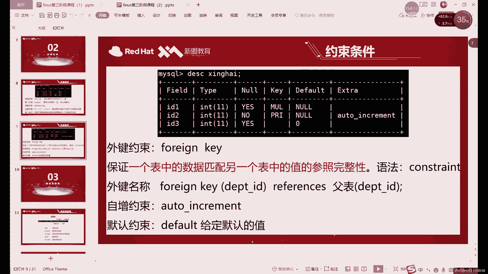

理解并合理运用数据类型和约束，是设计出结构良好、数据可靠的数据库表的关键。