# Linux运维入门：P6：命令行编辑技巧与学习方法

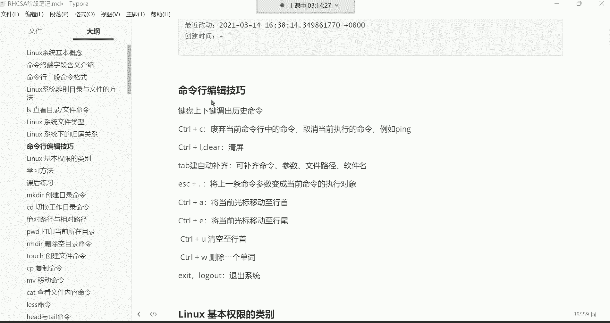

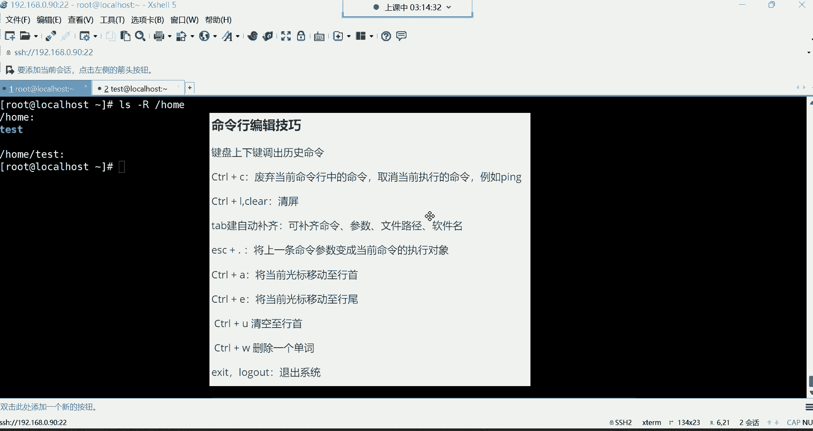

在本节课中，我们将学习Linux命令行中的高效编辑技巧，并探讨一些有效的学习方法，帮助你提升操作效率和学习效果。

## 命令行编辑技巧

上一节我们介绍了`ls`命令的基本用法，本节中我们来看看如何更高效地在命令行中操作。掌握这些技巧可以显著提升你的工作效率。

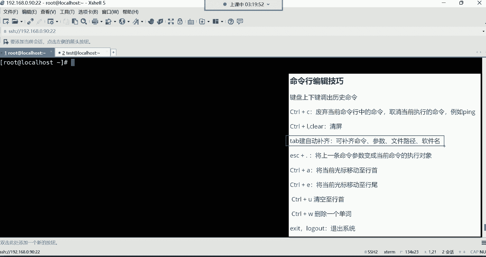

### 历史命令调取

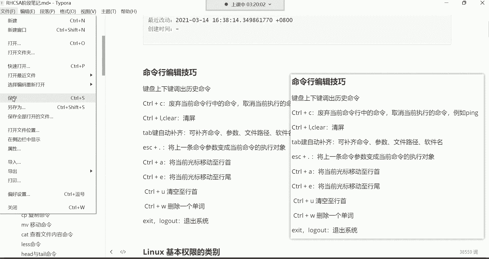

使用键盘的**上下方向键**可以调出之前执行过的命令。系统默认会记录最近1000条命令历史。通常，我们只会上翻最近的两三条命令进行重复执行或修改。如果需要查看更早的命令，直接重新输入可能比一直上翻更快捷。

### 命令控制与取消

**Ctrl + C** 是一个非常重要的快捷键，它有两个核心功能：
1.  废弃当前在命令行中已输入但**尚未执行**的命令。
2.  强制终止当前**正在执行**的命令（例如一个长时间运行的`ping`命令）。

**Ctrl + L** 或输入 `clear` 命令可以快速清空当前终端屏幕，让界面变得整洁。

### 路径与命令自动补齐

**Tab键** 是命令行中最实用的工具之一，它可以自动补齐命令、文件路径或软件包名。

其使用规则如下：
*   按一次**Tab**：如果只有一个可能的匹配项，系统会自动补齐。
*   按两次**Tab**：如果有多个可能的匹配项，系统会列出所有选项供你选择。

例如，想进入一个很长的路径 `/etc/sysconfig/network-scripts/`，你只需要输入前几个字母然后按Tab键即可：
```bash
cd /etc/sys<Tab>con<Tab>/net<Tab>-sc<Tab>
```
Tab键主要用于补齐复杂的文件路径和冗长的软件包名称。

### 快速编辑与参数复用

**Esc + . (点)** 可以快速将上一条命令的最后一个参数粘贴到当前光标位置。例如，执行完 `ls -l /etc/passwd` 后，输入 `cat` 然后按 `Esc + .`，就会自动变成 `cat /etc/passwd`。

**Ctrl + A** 将光标快速移动到**行首**。
**Ctrl + E** 将光标快速移动到**行尾**。

**Ctrl + U** 删除从光标位置到**行首**的所有内容。
**Ctrl + W** 删除光标前的一个**单词**（以空格为分隔）。

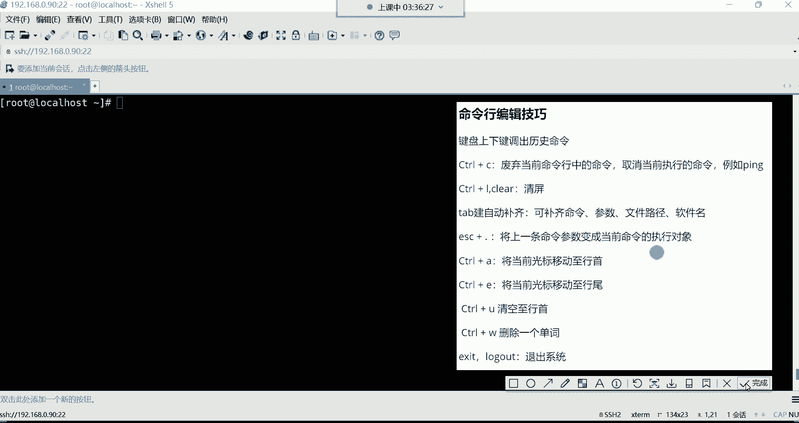

### 退出系统

退出当前登录会话，可以使用以下任一命令：
*   `exit`
*   `logout`

---

## 核心学习内容回顾

本节课我们重点学习了以下内容，你需要重点掌握：
1.  **命令终端字段含义**：理解命令行提示符每一部分的含义。
2.  **`ls`命令及常用选项**：如 `-l`（长格式）、`-a`（显示隐藏文件）、`-h`（人性化显示文件大小）。
3.  **命令行编辑技巧**：
    *   **必须掌握**：上下键、`Ctrl+C`、`Ctrl+L`、`Tab`键、`Esc+.`、`exit`。
    *   **了解即可**：`Ctrl+A/E/U/W`。

对于文件类型、归属关系、权限等概念，目前仅作了解，后续会有专门章节深入讲解。

---

## 高效学习方法建议

学习过程中遇到问题是常态，培养正确的学习习惯至关重要。

### 遇到问题怎么办？

1.  **初期（小白阶段）**：积极提问。我们设有专门的答疑老师和社群，遇到问题可以直接在群内@老师。
2.  **中后期（入门后）**：培养独立解决问题的能力。尝试按以下步骤进行：
    *   **清晰描述问题**：将错误信息、操作步骤、预期结果和实际结果整理清楚。
    *   **善用搜索引擎**：将描述好的问题在百度、谷歌等平台搜索。**“会提问”是运维人员的重要能力**。
    *   **查阅技术社区**：如CSDN、博客园等，参考他人的经验文章。
    *   **仍无法解决**：再向老师或社区求助。

### 学习态度与策略

*   **主动学习，不要被动接受**：在掌握课堂内容的基础上，主动探索命令的更多选项和用法。
*   **专注与坚持**：整个系统学习周期约为五个半月。在此期间，请尽可能集中精力，减少无效社交，把这视为一次提升自我的“闭关修炼”。
*   **不要死磕一点**：学习是螺旋上升的过程。如果当前阶段某个问题无法理解，可以先记录下来，继续往后学习。往往在学到后续知识时，前面的疑问会豁然开朗。即“低头拉车，也要抬头看路”。

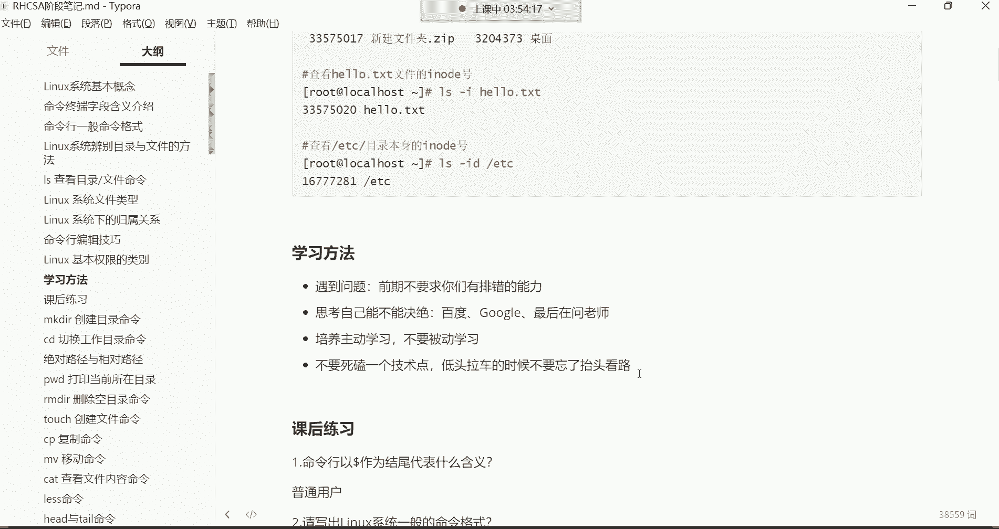

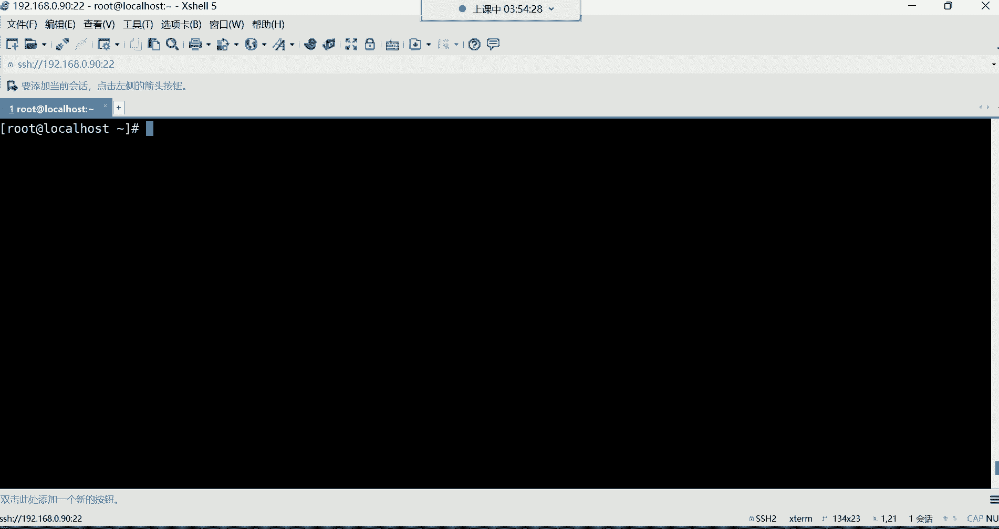

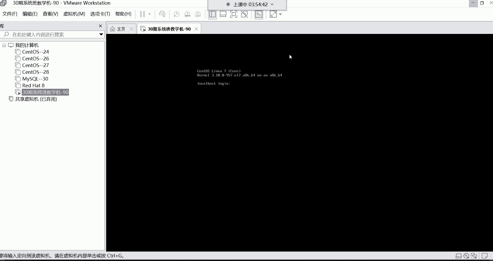

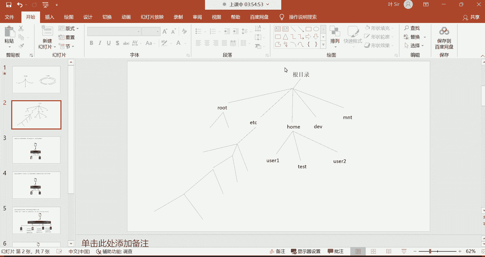

### 学习资料使用


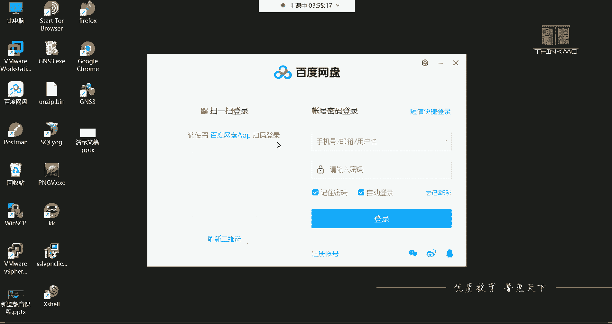


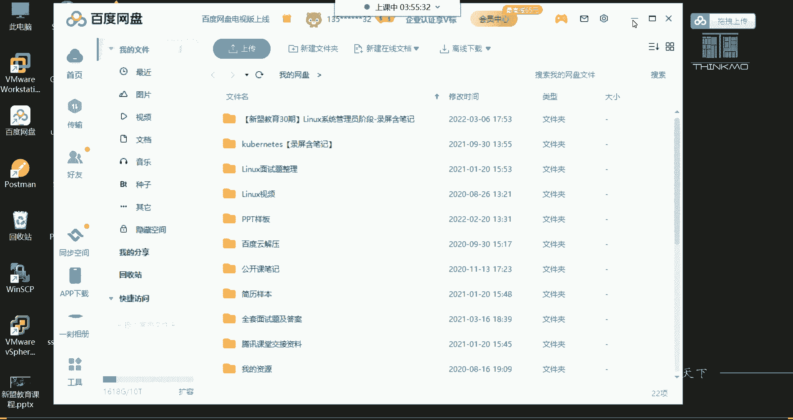

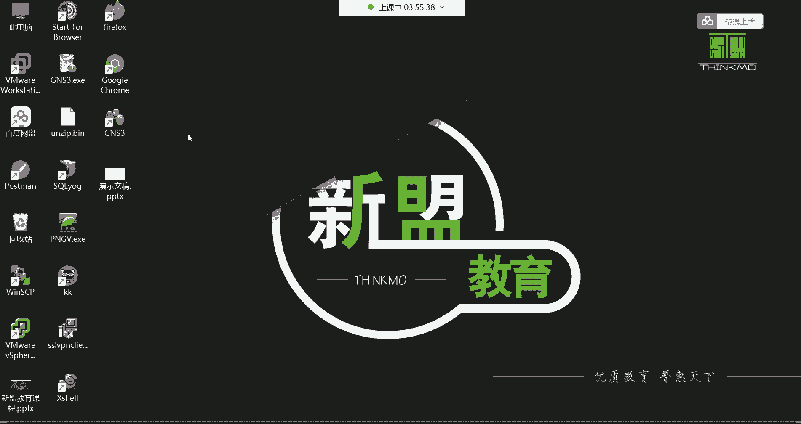

*   **课堂笔记与录屏**：老师会提供Markdown源码和PDF版本的笔记，以及课程录屏。PDF版笔记方便在手机端随时复习。
*   **笔记软件**：推荐使用 `Typora` 等Markdown编辑器打开和修改笔记源码。软件下载链接可在课程群公告中找到。
*   **扩展学习**：如果学有余力且基础扎实，可以咨询老师获取后续阶段（如MySQL）的学习资料，进行前瞻性学习。

---

## 课后操作

1.  在虚拟机中练习本节课所有命令行编辑技巧，直至熟练。
2.  使用 `exit` 或 `logout` 命令退出系统，再重新登录。
3.  下载并安装笔记软件，打开老师提供的课堂笔记进行复习和标注。

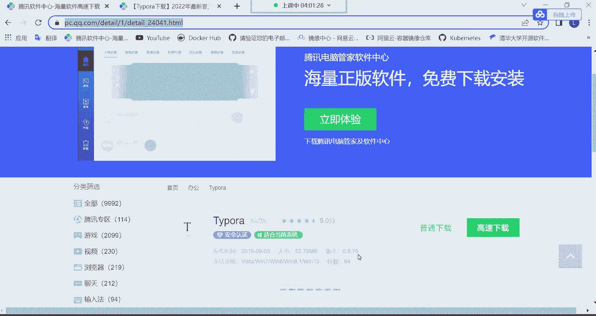

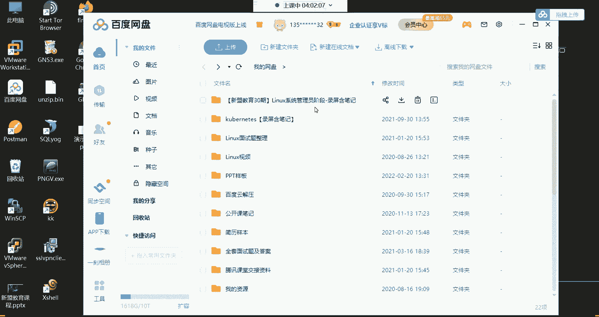


本节课中，我们一起学习了提升命令行操作效率的多种编辑技巧，并探讨了培养良好学习习惯的方法。记住，高效的工具和正确的学习方法是你运维之路上的两大助力。坚持练习，保持好奇，下一节课我们将开始学习更多实用的Linux命令。