# MySQL数据库教程：P70：约束、ALTER命令、索引、SELECT查询（上）


## 概述

在本节课中，我们将继续深入学习MySQL数据库的约束条件，并开始接触用于修改表结构的ALTER命令。我们将详细讲解外键约束、自增约束和默认约束，理解它们的作用与创建方法，为后续学习数据查询打下坚实基础。

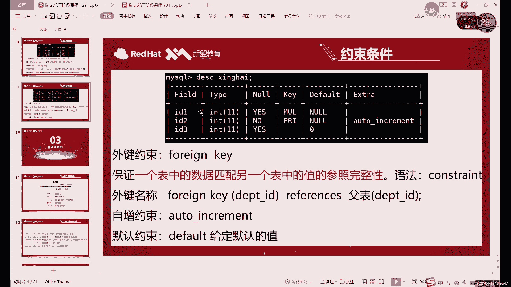

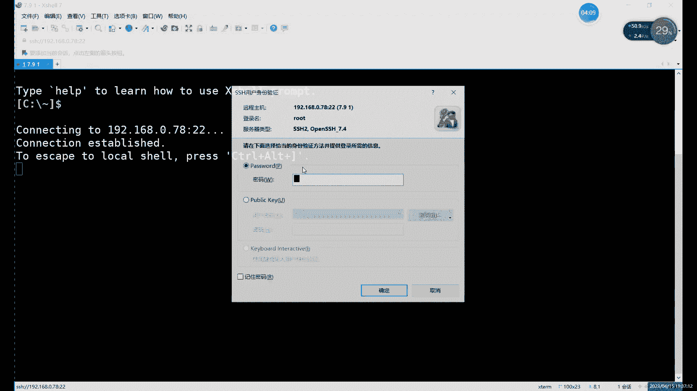

---

## 回顾与引入：外键约束

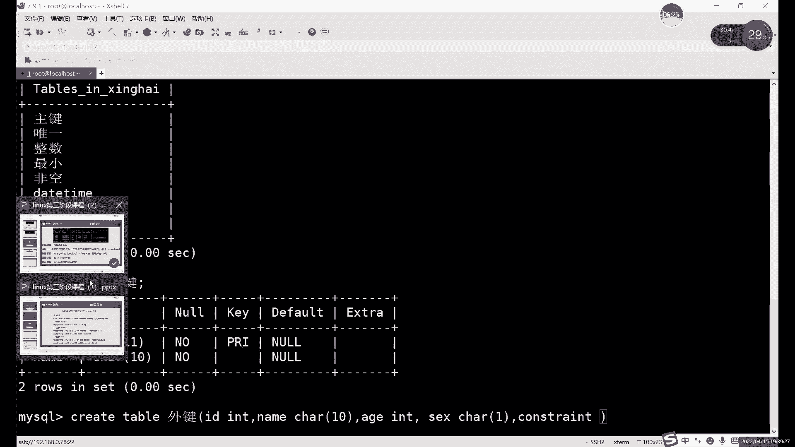

上一节我们介绍了非空约束、唯一性约束和主键约束。本节中，我们来看看外键约束。

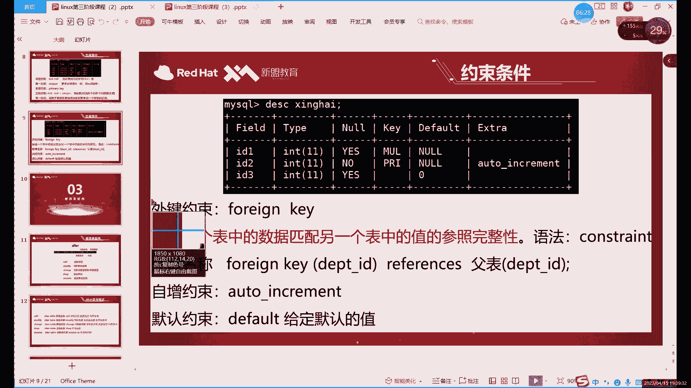

外键的主要作用是实现两个不同表格之间的数据同步。例如，如果两个表格中有一列数据（如ID号或姓名）含义完全相同，我们就可以通过外键将这两列关联起来。

外键约束是针对某一列设置的，而非整个表格。它类似于一个“软链接”：主键列的数据一旦更新或删除，与之关联的外键列数据也会同步更改。但外键列本身不能主动修改或删除数据，只能添加数据，并且添加的数据必须与主键列保持同步。

以下是创建外键约束的格式，它需要在定义完所有列之后单独编写：

```sql
CONSTRAINT <外键名称> FOREIGN KEY (<本表字段名>) REFERENCES <主表名称>(<主表字段名>)
```

创建外键时，通常还会附加同步更新和删除的规则：

```sql
ON UPDATE CASCADE
ON DELETE CASCADE
```

**核心概念与注意事项：**
*   **主键与外键**：主键表是独立的，外键表是附属的。**主键影响外键，外键无法影响主键**。
*   **数据类型一致**：关联的主键列和外键列必须具有相同的数据类型。
*   **操作限制**：外键列不能主动更新或删除，只能插入数据。同步仅发生在主键的更新(`UPDATE`)和删除(`DELETE`)操作上，插入(`INSERT`)操作互不影响。

---

## 自增约束

接下来，我们学习自增约束。自增约束的作用是自动填充数字，通常用于ID、序号等需要按顺序排列的列。

自增约束只能应用于数值类型的列。设置后，在插入数据时，如果没有为该列指定值，数据库会自动为其生成一个按顺序增长的数字（默认从1开始，每次增加1）。

创建带有自增约束的列时，**必须同时为该列设置主键(`PRIMARY KEY`)或唯一(`UNIQUE`)约束**，这是为了保证自动生成的数字不会重复。

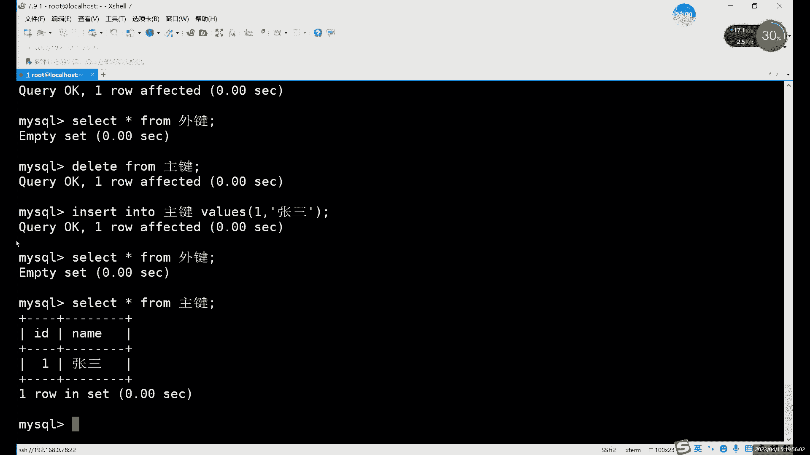

以下是创建自增列的示例：

```sql
CREATE TABLE 自增表 (
    id INT AUTO_INCREMENT PRIMARY KEY,
    name VARCHAR(20)
);
```


插入数据时，可以忽略自增列：

```sql
INSERT INTO 自增表 (name) VALUES ('张三');
-- id 会被自动填充为 1
INSERT INTO 自增表 (name) VALUES ('李四');
-- id 会被自动填充为 2
```

自增的初始值和增量可以通过系统变量修改，但实践中很少需要调整。

---

## 默认约束

最后，我们来看默认约束。默认约束的作用也是自动填充，但它填充的是一个固定的值，可以是数字、字符等任何数据类型。

当插入数据没有为设置了默认约束的列指定值时，该列会自动填入预设的默认值。这常用于那些有普遍取值（如性别默认‘男’、状态默认‘启用’）的列。

创建表时设置默认约束的语法如下：

```sql
CREATE TABLE 默认表 (
    id INT,
    name VARCHAR(20),
    gender VARCHAR(10) DEFAULT ‘男‘
);
```

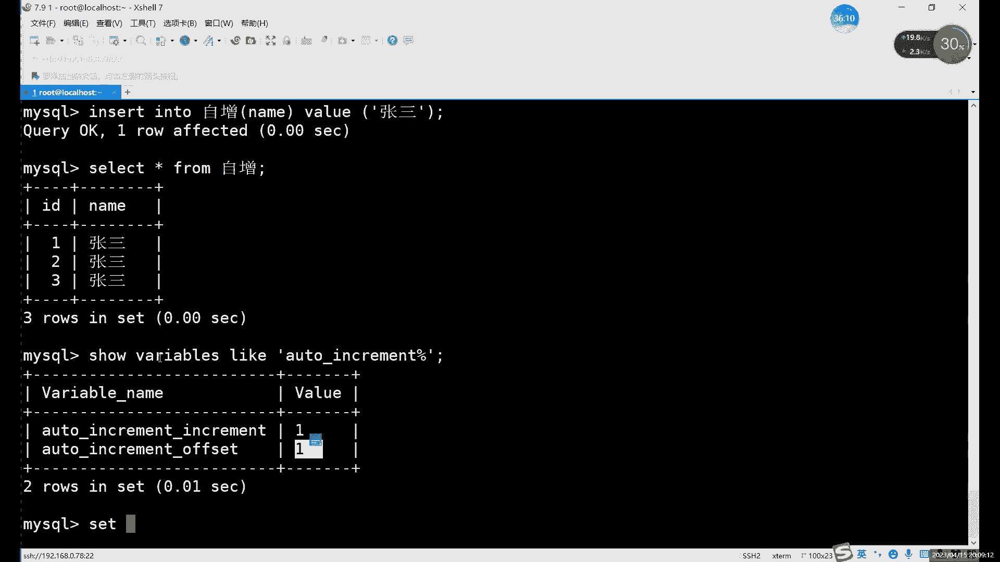

插入数据时，如果不填写`gender`列，它将自动填充为‘男’：

```sql
INSERT INTO 默认表 (id, name) VALUES (1, ‘张三‘);
-- gender 列自动填充为 ‘男‘
```

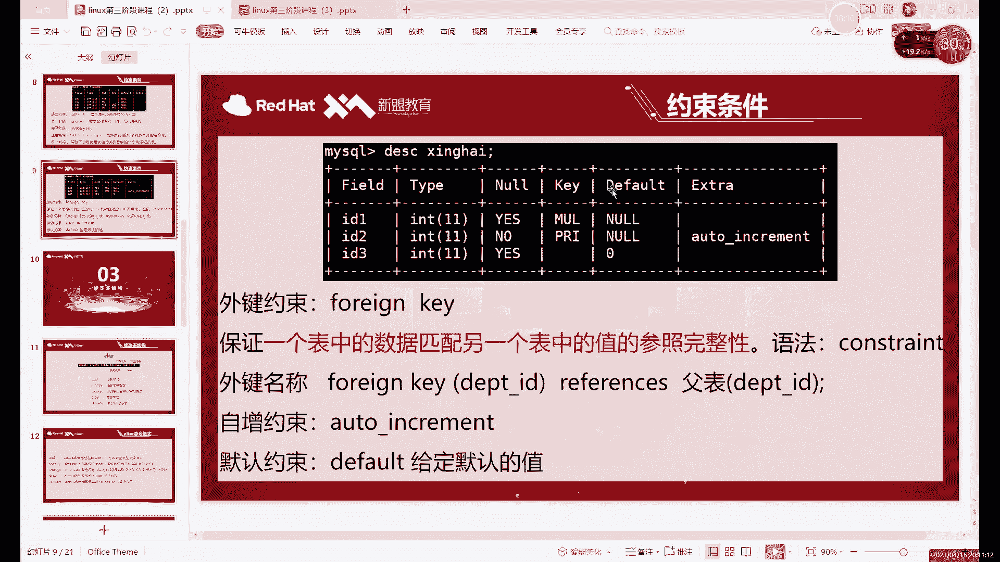

如果需要不同的值，在插入时显式指定即可，默认值仅在未指定时生效。

**自增与默认约束的异同：**
*   **相同点**：两者都具有自动填充数据的功能。
*   **不同点**：
    *   **自增(`AUTO_INCREMENT`)**：填充按顺序增长的数字，通常用于ID。
    *   **默认(`DEFAULT`)**：填充一个固定的、不变的值，可用于各种类型的列。

---

## 约束条件总结与选用原则

本节课我们一起学习了六种主要的约束条件。以下是它们的核心要点和选用原则：

1.  **非空约束(`NOT NULL`)**：要求列不能存储`NULL`值。几乎所有列都可以根据业务需求决定是否设置。
2.  **唯一约束(`UNIQUE`)**：要求列中的所有值互不相同。**切忌滥用**，仅用于确定不会重复的数据（如身份证号、邮箱，但通常不是姓名）。
3.  **主键约束(`PRIMARY KEY`)**：相当于`NOT NULL` + `UNIQUE`，用于唯一标识表中的每一行。一张表只能有一个主键。
4.  **外键约束(`FOREIGN KEY`)**：用于关联两个表，保证数据的一致性（参照完整性）。需要注意数据类型一致以及操作上的限制。
5.  **自增约束(`AUTO_INCREMENT`)**：自动生成唯一的、递增的数值。**条件最苛刻**，通常只用于作为主键的ID列。
6.  **默认约束(`DEFAULT`)**：为列指定一个默认值。适用于该列有普遍、常见取值的情况。

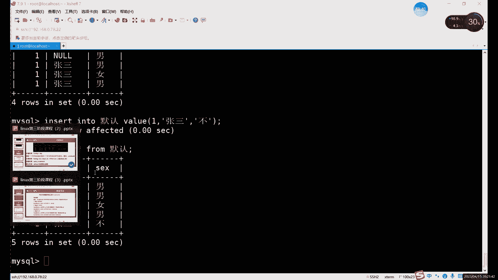

**约束选用核心原则**：根据字段的实际业务含义和需求来设置约束，不合理的约束（如为“姓名”设置唯一约束）会在插入或更新数据时导致错误，影响系统运行。

---

## 引入ALTER命令

在掌握了所有约束条件后，我们终于可以补全数据定义语言(`DDL`)中关于修改的部分——`ALTER`命令。

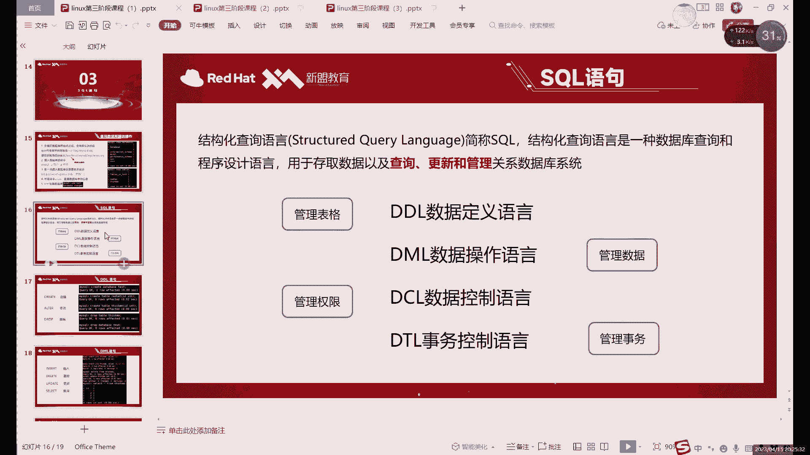

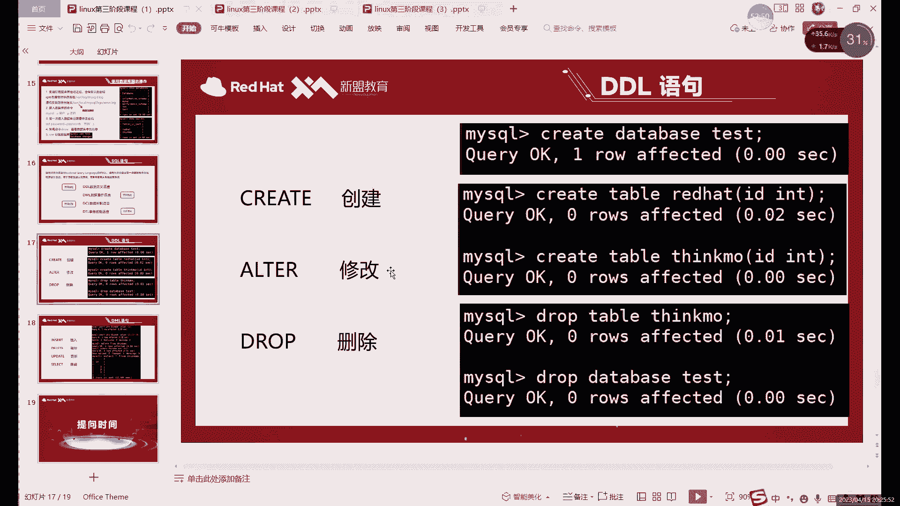

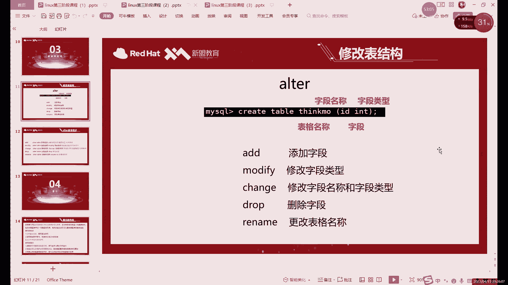

之前我们只用`ALTER`命令修改过表名。实际上，`ALTER TABLE`命令功能强大，可以用于添加、删除或修改表中的列，以及添加或删除各种约束。正是因为之前修改表结构的知识不完整，我们才需要通过不断创建新表来演示不同的约束。

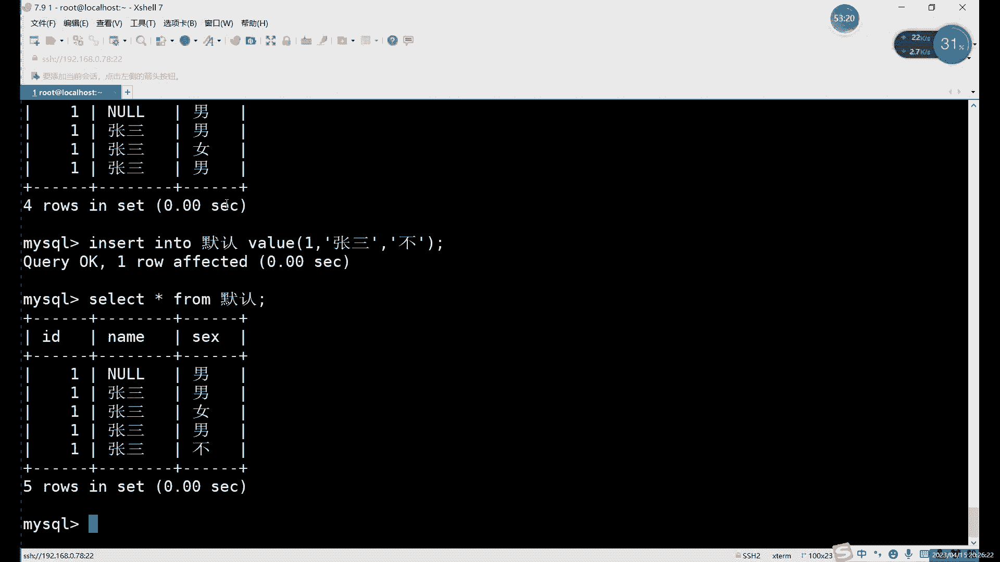

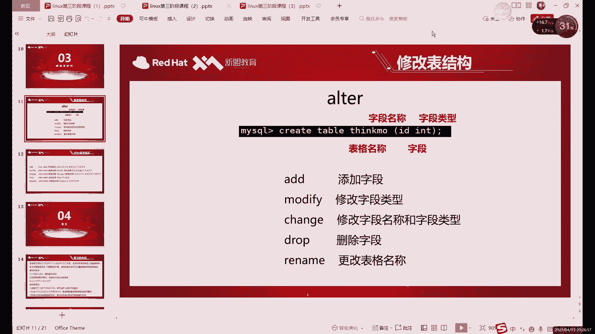

下一节，我们将正式深入学习`ALTER`命令的各种用法，学习如何灵活地修改已有的表结构。