# MySQL运维教程：P71：中级运维-8.约束，ALTER命令，索引，SELECT查询-中


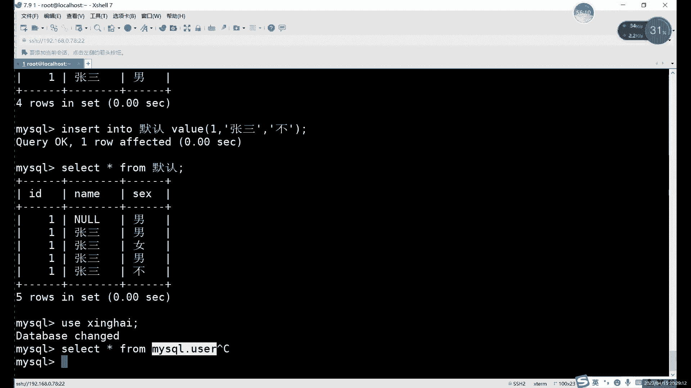

## 概述 📋

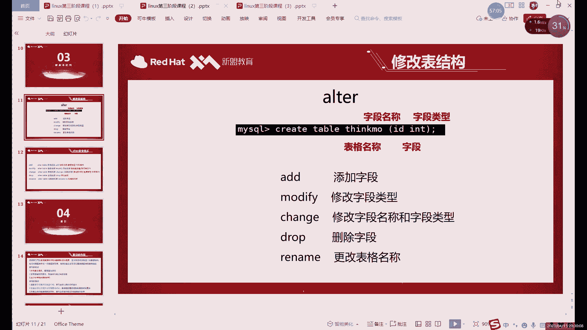

在本节课中，我们将深入学习MySQL数据库管理中的两个核心概念：**ALTER命令**和**索引**。我们将了解如何使用ALTER命令修改已存在的表结构，并探讨索引的工作原理及其对数据库查询性能的巨大影响。这些知识对于进行高效的数据库运维至关重要。

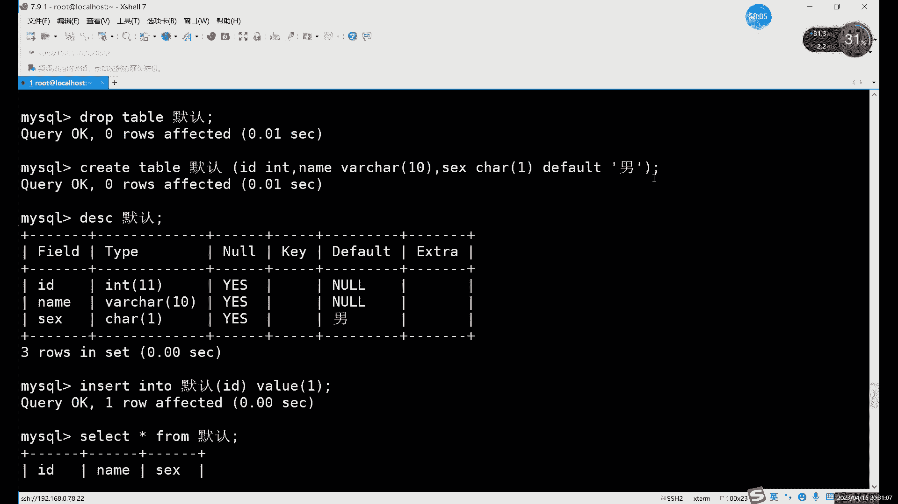

---

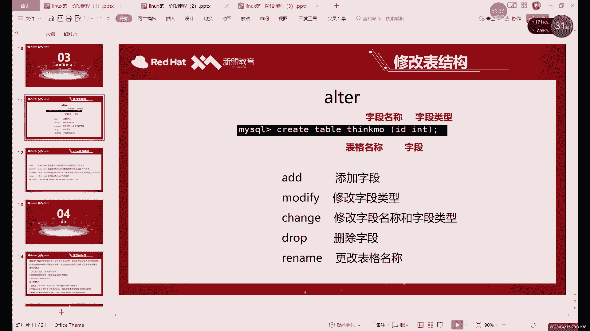

## 数据库与表的命名规则 🔤

上一节我们介绍了约束，本节我们来看看如何修改表结构。首先需要理解数据库和表的命名规则。

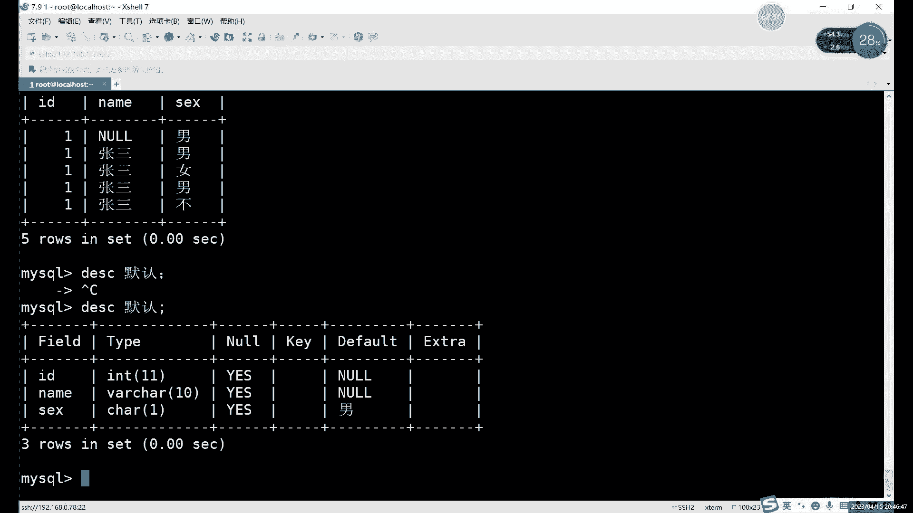

每一个表格的完整名称是`库名.表名`。例如，`mysql.user`表示`mysql`数据库中的`user`表。进行跨库查询时，必须使用这种完整名称。

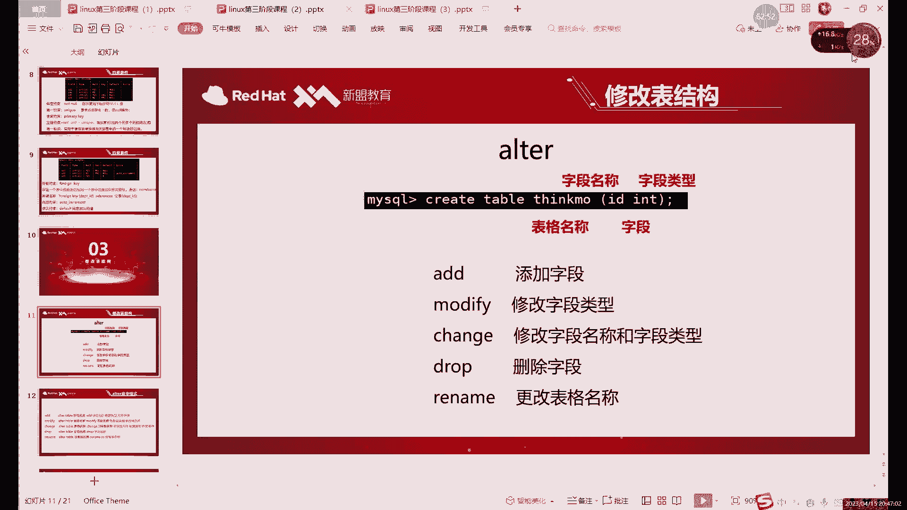

因此，数据库名称不建议修改。因为一旦修改库名，所有表都需要随之更改其完整名称，这个过程非常复杂且容易出错。ALTER命令通常不用于修改数据库名称。

---

## ALTER命令详解 🛠️

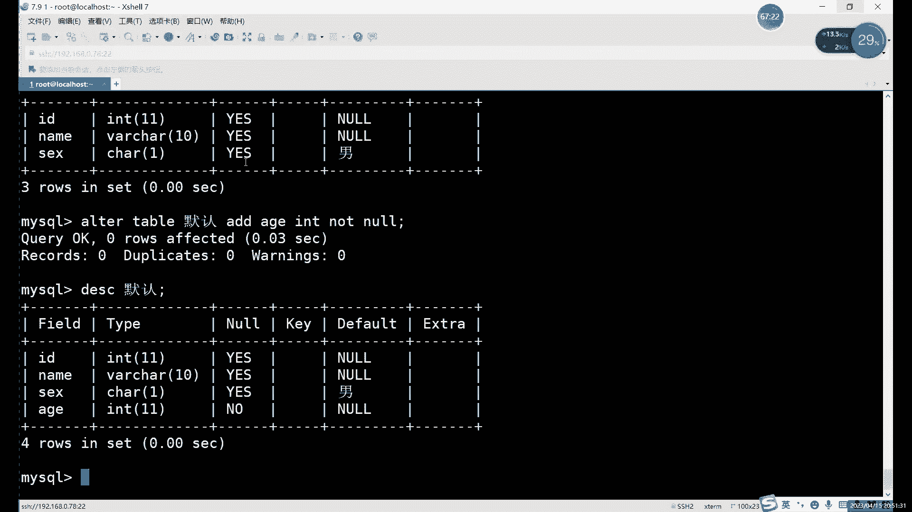

ALTER命令专门用于修改表的结构，而不是表中的数据。其基本语法是`ALTER TABLE 表名`，后面需要跟上具体的操作选项。

以下是ALTER命令的主要选项：
*   **ADD**: 添加新的字段（列）。
*   **MODIFY**: 修改现有字段的数据类型或约束。
*   **CHANGE**: 修改现有字段的名称、数据类型或约束。
*   **DROP**: 删除现有的字段。
*   **RENAME TO**: 修改表的名称。

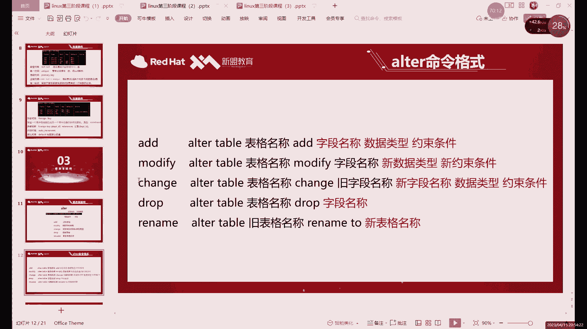

### 1. 添加字段 (ADD)

使用ADD选项可以为已存在的表添加新的列。

**语法示例：**
```sql
ALTER TABLE 表名 ADD 新字段名 数据类型 [约束];
```
例如，为`students`表添加一个`age`（年龄）字段，并设置为非空（NOT NULL）：
```sql
ALTER TABLE students ADD age INT NOT NULL;
```
默认情况下，新字段会添加在表的最后一列。如果需要指定位置，可以使用`AFTER`或`BEFORE`关键字：
```sql
ALTER TABLE students ADD birthday DATE AFTER name; -- 添加在name字段之后
ALTER TABLE students ADD student_id INT BEFORE id; -- 添加在id字段之前
```

### 2. 修改字段 (MODIFY 与 CHANGE)

MODIFY和CHANGE都用于修改现有字段，但功能略有不同。

*   **MODIFY**: 只能修改字段的数据类型或约束，不能修改字段名。
    **语法示例：**
    ```sql
    ALTER TABLE 表名 MODIFY 字段名 新数据类型 [新约束];
    ```
    例如，将`name`字段的字符集改为UTF-8：
    ```sql
    ALTER TABLE students MODIFY name VARCHAR(100) CHARACTER SET utf8;
    ```

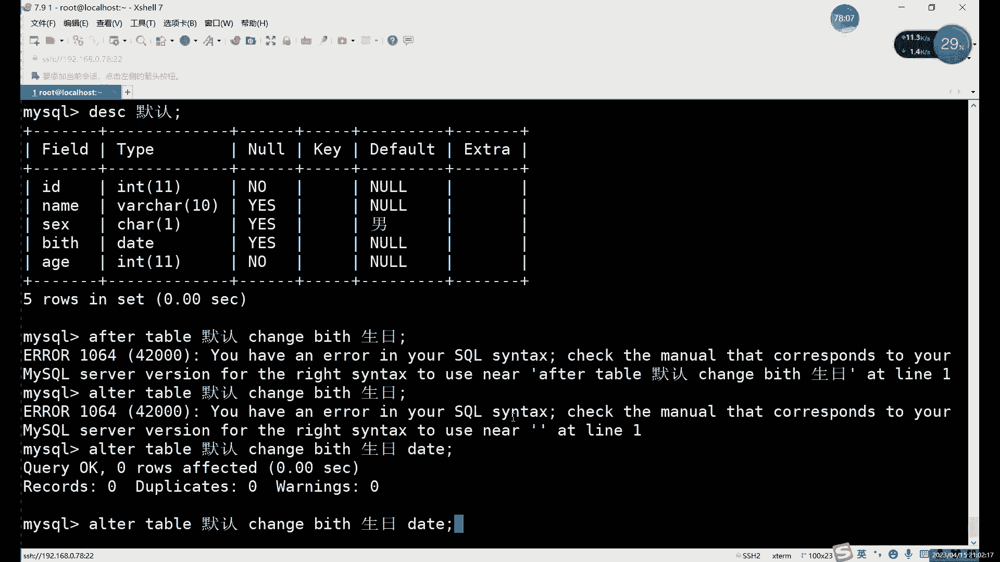

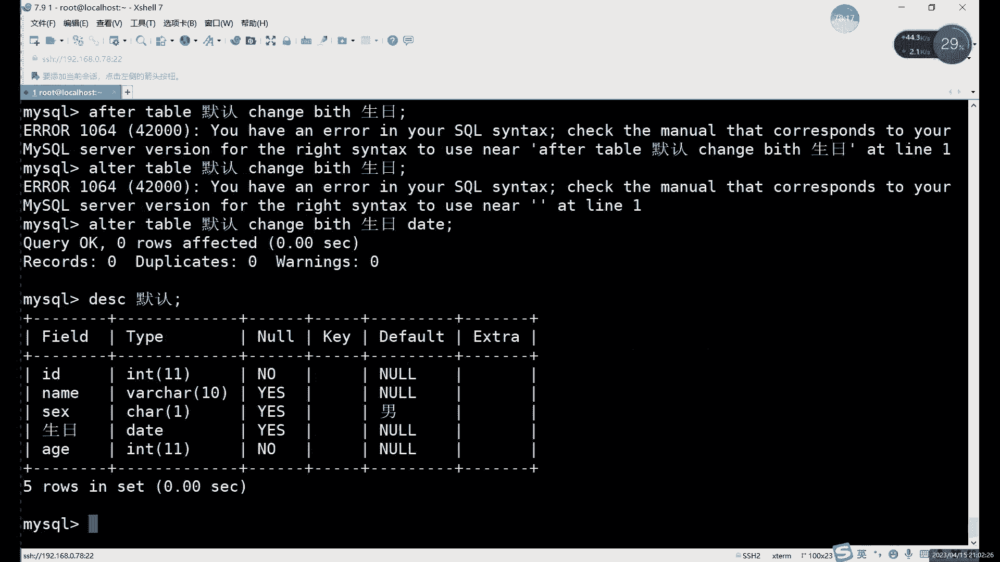

*   **CHANGE**: 可以修改字段的名称、数据类型和约束。
    **语法示例：**
    ```sql
    ALTER TABLE 表名 CHANGE 旧字段名 新字段名 新数据类型 [新约束];
    ```
    例如，将`age`字段改名为`student_age`，并修改数据类型：
    ```sql
    ALTER TABLE students CHANGE age student_age TINYINT UNSIGNED;
    ```
    **注意**：使用CHANGE时，即使只想改名字，也必须重新指定数据类型和约束，通常将原有的设置抄写一遍即可。

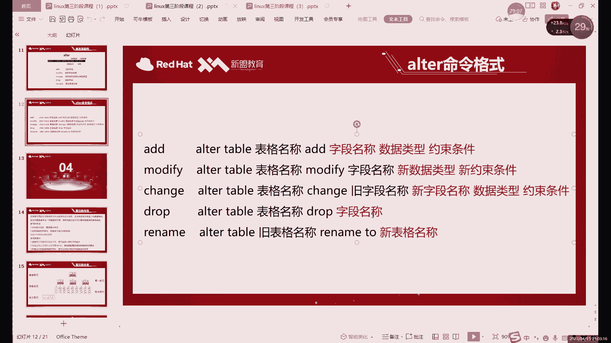


### 3. 删除字段 (DROP) 与 重命名表 (RENAME TO)

*   **删除字段**：使用DROP选项可以删除表中不需要的列。
    **语法示例：**
    ```sql
    ALTER TABLE 表名 DROP 字段名;
    ```
    例如，删除`birthday`字段：
    ```sql
    ALTER TABLE students DROP birthday;
    ```

*   **重命名表**：使用RENAME TO可以修改表的名称。
    **语法示例：**
    ```sql
    ALTER TABLE 旧表名 RENAME TO 新表名;
    ```
    例如，将`students`表改名为`user_info`：
    ```sql
    ALTER TABLE students RENAME TO user_info;
    ```

---

## 索引：数据库的“目录” 📖

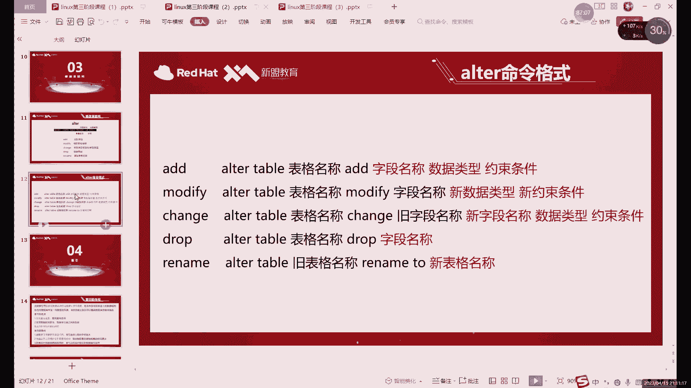

在理解了如何修改表结构后，我们来看一个提升数据库性能的核心机制——索引。

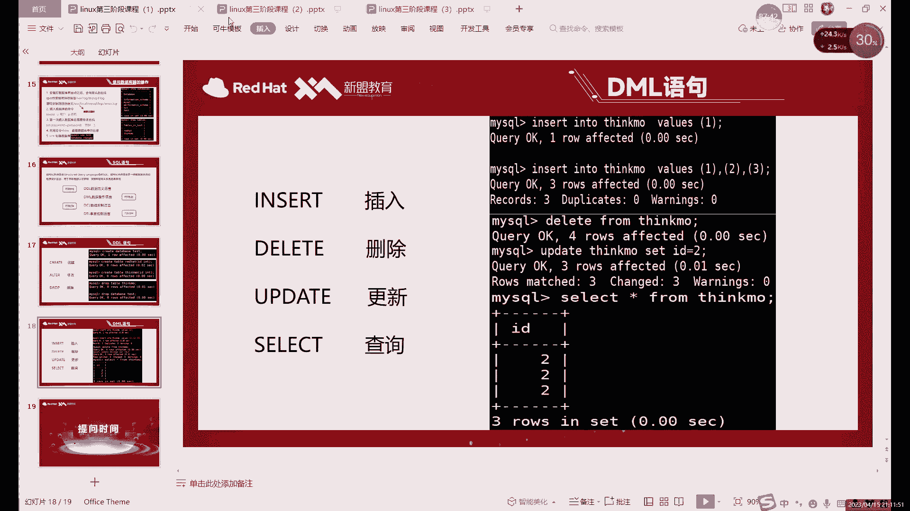

索引类似于书籍的目录。如果没有目录，查找内容需要逐页翻阅，速度很慢。数据库索引的作用就是为表中的数据建立一套高效的查找结构，从而极大提升查询（SELECT）、更新（UPDATE）和删除（DELETE）操作中**WHERE条件筛选**的速度。

### 索引与约束的关系

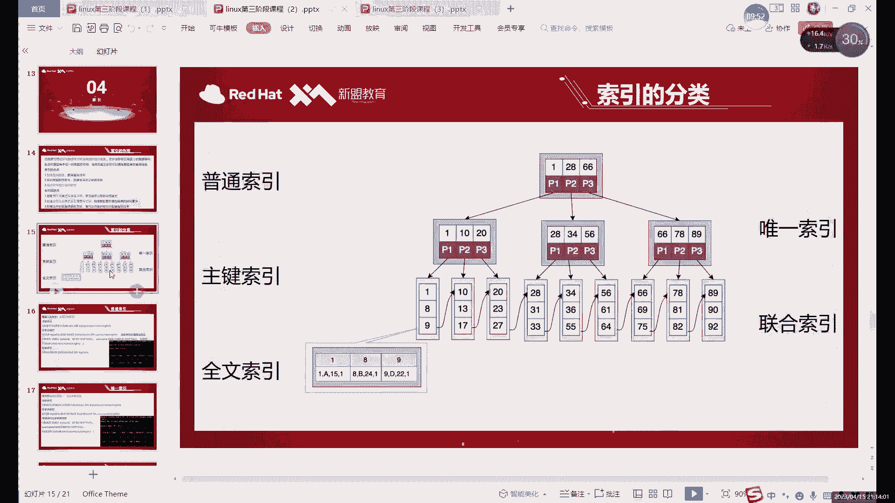

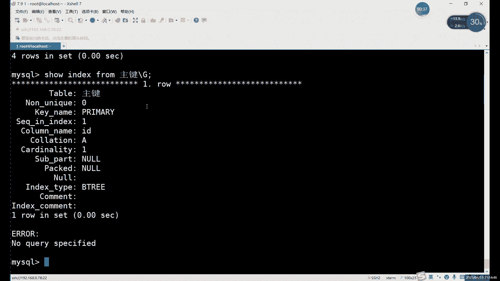

某些类型的约束在创建时会自动建立索引：
*   **主键约束 (PRIMARY KEY)**: 自动创建主键索引，性能最优。
*   **唯一约束 (UNIQUE)**: 自动创建唯一索引。
*   **外键约束 (FOREIGN KEY)**: 自动创建普通索引。

索引和约束是两种概念：**约束用于限制数据的合法性**（如是否重复、是否为空），**索引用于加速数据的查找**。上述三种约束因为其“唯一性”的特点，非常适合作为快速查找的键，因此MySQL会为它们自动创建索引。

### 查看索引与查询执行计划

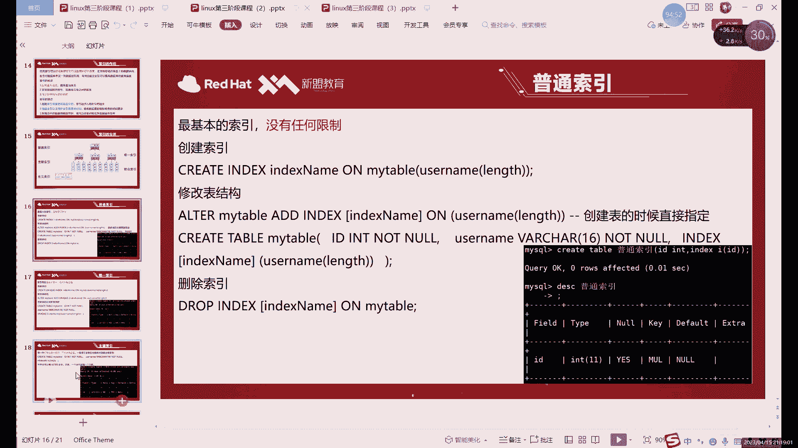

*   **查看索引**：使用`SHOW INDEX FROM 表名;`命令可以查看表的所有索引信息。
*   **分析查询性能**：使用`EXPLAIN`命令可以查看一条SELECT语句的执行计划，判断是否使用了索引。
    **语法示例：**
    ```sql
    EXPLAIN SELECT * FROM students WHERE id = 1;
    ```
    在结果中，关注`type`列：
    *   `ALL`: 表示进行了全表扫描，没有使用索引，效率最低。
    *   `const`: 表示通过主键或唯一索引进行查询，效率最高。

### 创建普通索引

对于那些不适合设置为主键或唯一约束，但又经常用于查询条件的字段，可以为其创建普通索引来提升查询速度。

创建索引有两种常用方法：

1.  **使用 CREATE INDEX 语句**
    **语法示例：**
    ```sql
    CREATE INDEX 索引名 ON 表名 (字段名);
    ```
    例如，为`students`表的`name`字段创建一个名为`idx_name`的索引：
    ```sql
    CREATE INDEX idx_name ON students (name);
    ```

2.  **使用 ALTER TABLE 语句**
    **语法示例：**
    ```sql
    ALTER TABLE 表名 ADD INDEX 索引名 (字段名);
    ```
    例如，同样为`name`字段添加索引：
    ```sql
    ALTER TABLE students ADD INDEX idx_name (name);
    ```

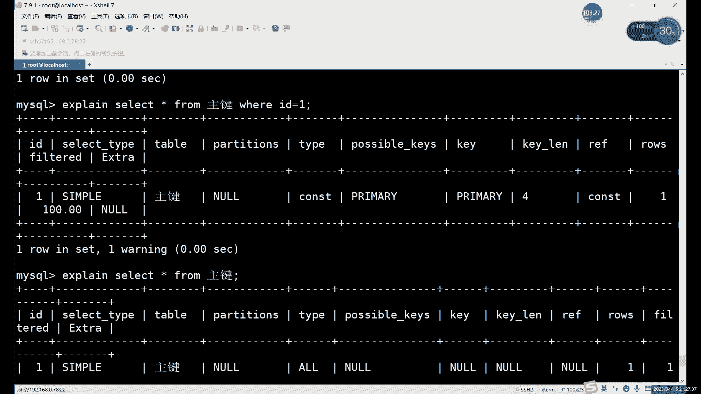

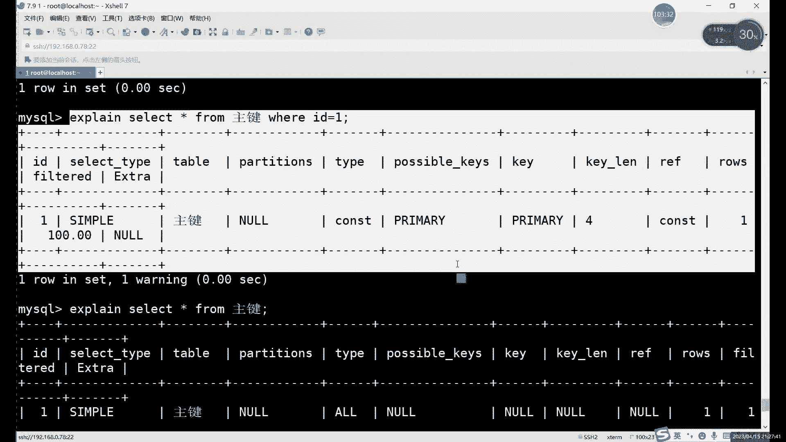

**注意**：索引并非越多越好。索引会占用额外的磁盘空间，并且在插入、更新数据时需要维护索引，会降低写入速度。因此，应该只为最频繁用于查询条件的字段创建索引。

---

## 总结 🎯

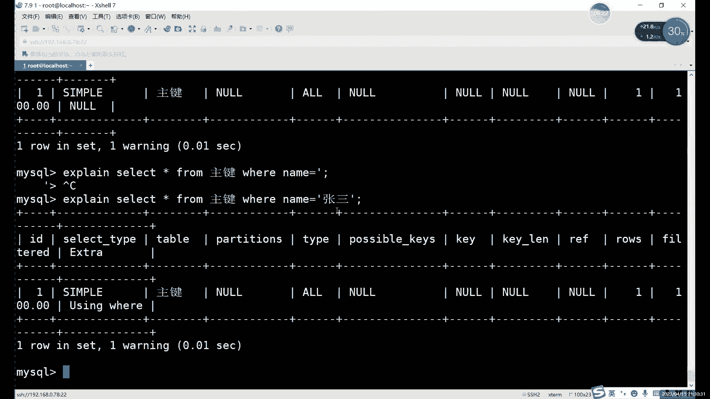


本节课我们一起学习了MySQL中两个重要的高级主题：
1.  **ALTER命令**：我们掌握了如何使用`ADD`、`MODIFY`、`CHANGE`、`DROP`和`RENAME TO`等选项来灵活地修改表结构，包括添加/删除字段、修改字段属性以及重命名表。
2.  **索引**：我们理解了索引类似于目录，能极大提升数据库查询效率。知道了主键、唯一、外键约束会自动创建索引，并学会了如何为普通字段创建索引（`CREATE INDEX`或`ALTER TABLE ... ADD INDEX`），以及如何使用`EXPLAIN`命令分析查询是否利用了索引。

合理使用ALTER命令维护表结构，并为关键查询字段建立索引，是保证数据库长期高效、稳定运行的关键技能。