# Linux运维全套培训课程：P73：中级运维-10.SELECT单表查询，嵌套查询-上 🗃️


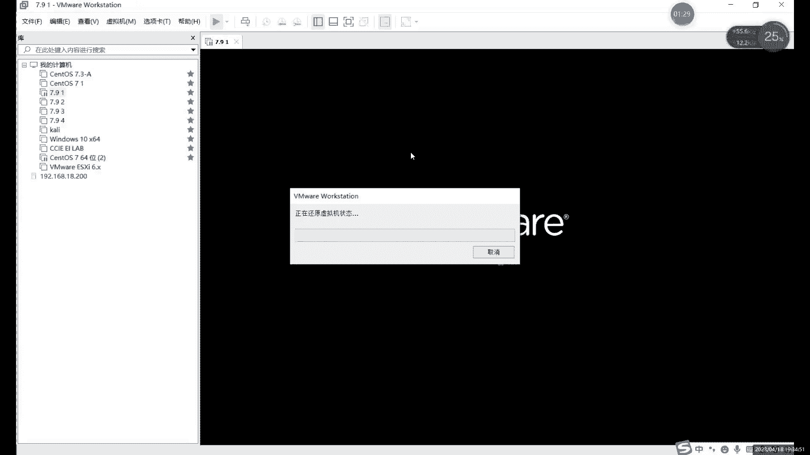


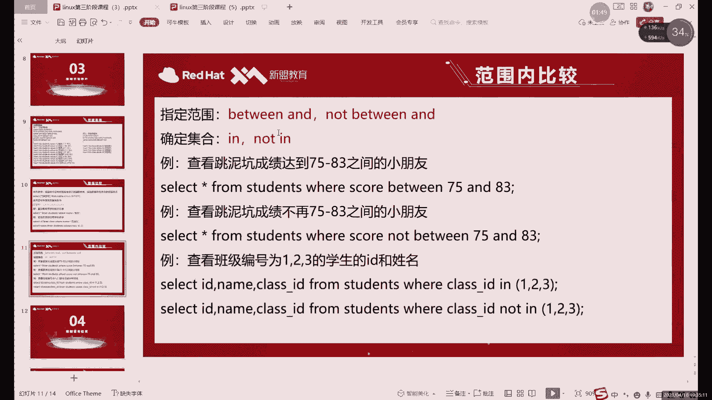

在本节课中，我们将继续深入学习SELECT查询语句，重点探讨集合查询、模糊查询、空值判断以及多重条件查询等核心概念。这些知识将帮助你更精确地从数据库中筛选所需数据。

## 集合查询：IN 与 NOT IN 🔢

上一节我们介绍了使用 `BETWEEN AND` 进行范围查询。本节中我们来看看另一种筛选方式——集合查询。

集合查询使用 `IN` 关键字，其含义是“包含于”。它与范围查询 `BETWEEN AND` 的主要区别在于：范围查询指定一个连续区间（如60到80），而集合查询则指定一个离散的、明确的值列表。

以下是集合查询的基本语法：
```sql
SELECT * FROM 表名 WHERE 字段名 IN (值1, 值2, 值3, ...);
```
例如，查询成绩为60、75或80的学生：
```sql
SELECT * FROM students WHERE score IN (60, 75, 80);
```
集合查询同样支持字符型数据，这是 `BETWEEN AND` 难以做到的。例如，查询指定姓名的学生：
```sql
SELECT * FROM students WHERE name IN (‘张三‘, ‘李四‘);
```
**注意**：查询字符值时，必须使用引号（单引号或双引号均可）将值括起来。

与大多数条件一样，集合查询也可以取反，使用 `NOT IN` 表示“不包含于”。例如，查询性别不是‘F‘（女）的学生，即所有男学生：
```sql
SELECT * FROM students WHERE gender NOT IN (‘F‘);
```

## 模糊查询：LIKE 与通配符 🔍

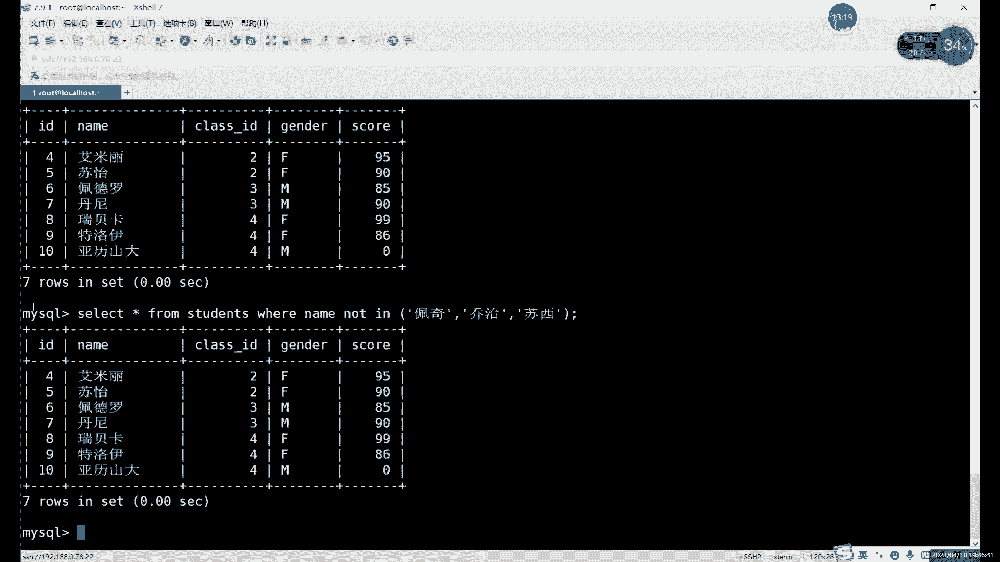

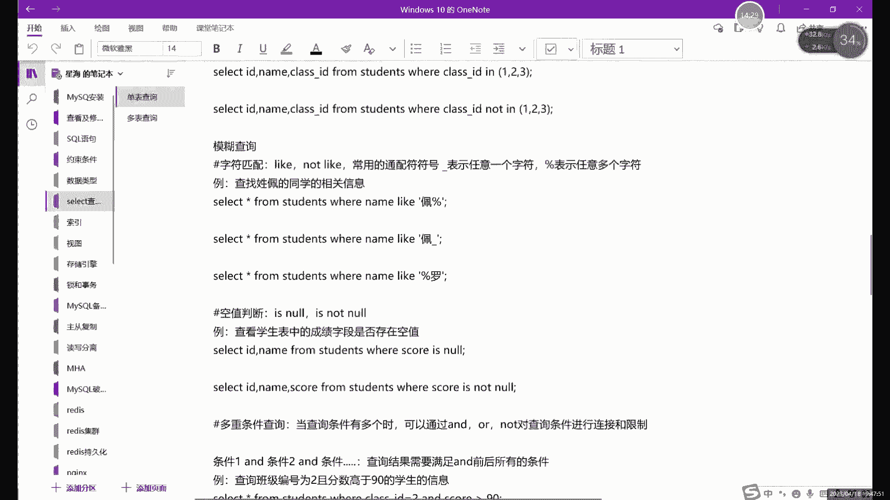

当我们无法确定数据的完整内容，只想根据部分特征进行查找时，就需要用到模糊查询。

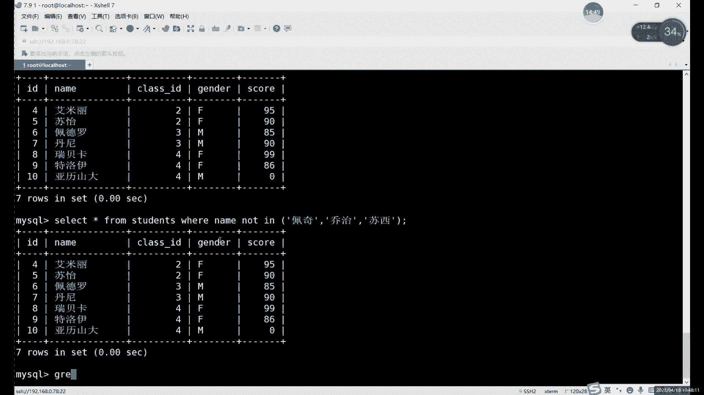

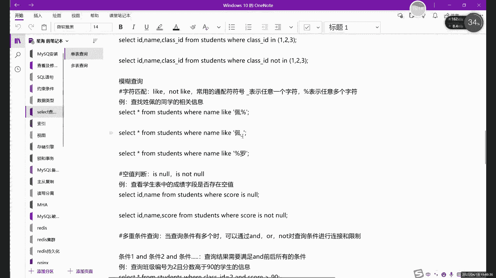

模糊查询使用 `LIKE` 关键字，并配合两个通配符：
*   **百分号 `%`**：代表零个、一个或多个任意字符。
*   **下划线 `_`**：代表一个（且仅一个）任意字符。

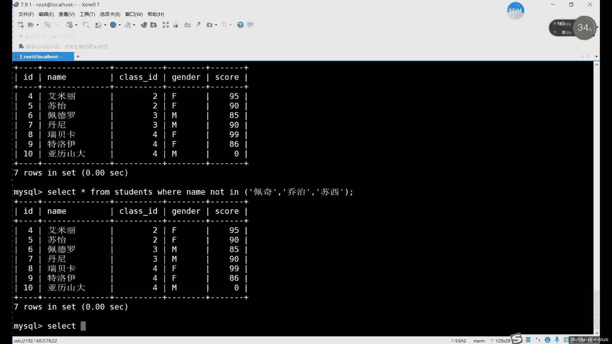

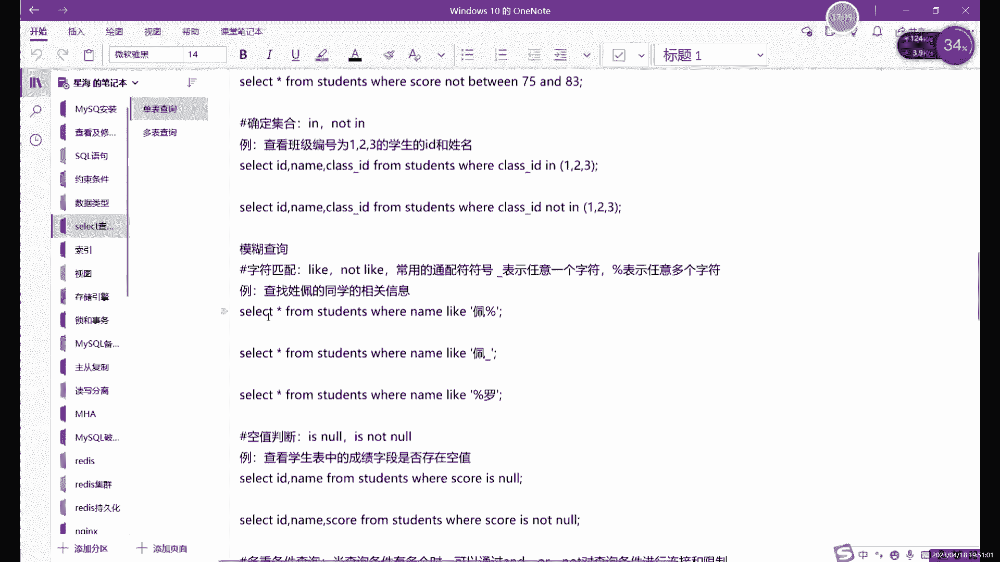

以下是模糊查询的常见用法：
```sql
-- 查找所有姓“张”的学生（“张”字开头，后面任意字符）
SELECT * FROM students WHERE name LIKE ‘张%‘;

-- 查找姓名中第二个字是“三”的学生（一个任意字符 + “三” + 后面任意字符）
SELECT * FROM students WHERE name LIKE ‘_三%‘;

-- 查找成绩以“8”开头，长度为两位数的学生（如80, 81, 89等）
SELECT * FROM students WHERE score LIKE ‘8_‘;
```
**重要提示**：进行模糊查询时，即使查询数值型字段，`LIKE` 后面的模式也必须用引号括起来，因为它被视为字符串模式。

模糊查询同样支持取反，使用 `NOT LIKE`。例如，查找所有成绩不以“8”开头的学生：
```sql
SELECT * FROM students WHERE score NOT LIKE ‘8%‘;
```
`LIKE` 不仅用于 `SELECT`，在查看系统设置（如 `SHOW` 命令）时也很有用，可以帮助我们快速定位包含特定关键词的配置项。

## 空值判断：IS NULL 与 IS NOT NULL ⚫️

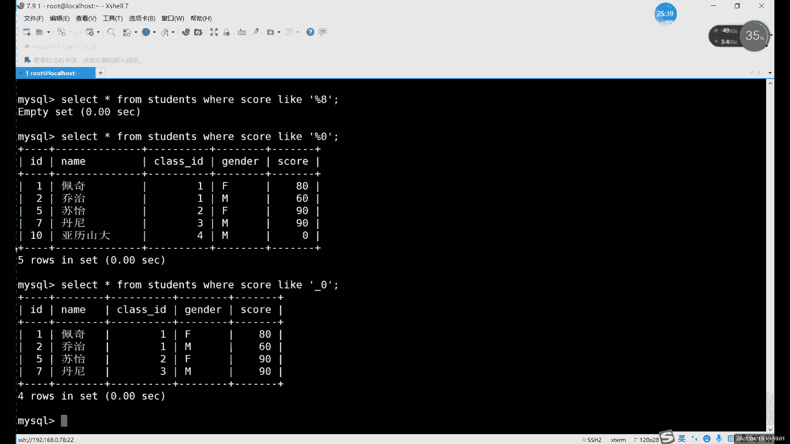

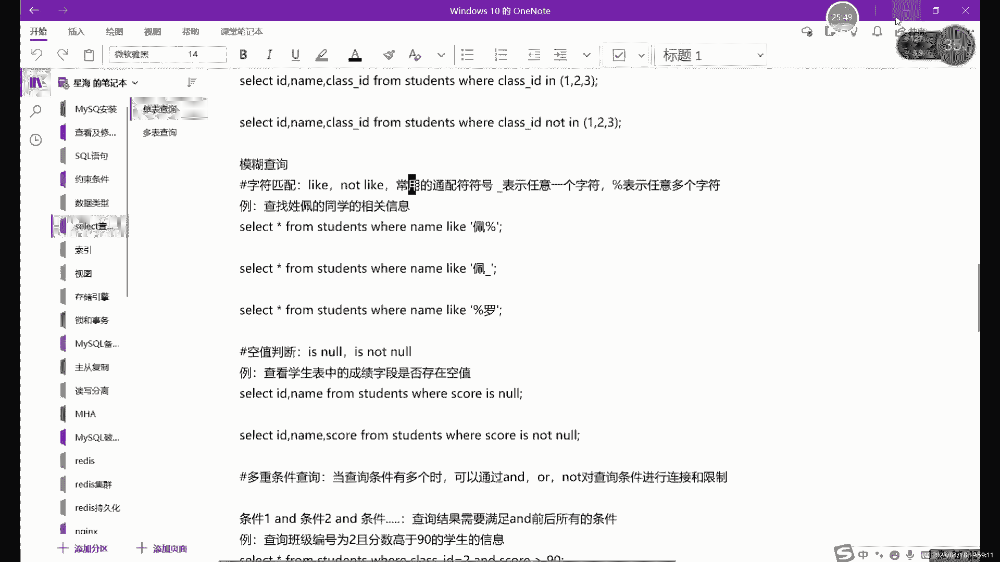

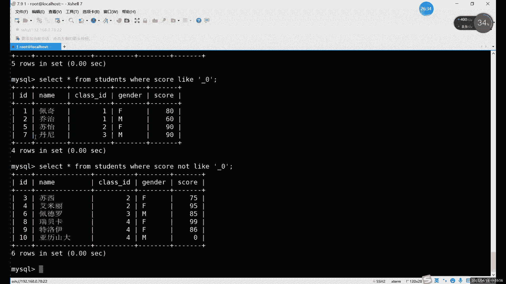

在数据库中，空值（NULL）表示该字段没有存储任何数据，它与数值0或空字符串‘ ‘ 是不同的概念。查找和处理空值是数据维护中的常见操作。

判断空值使用 `IS NULL`，判断非空值使用 `IS NOT NULL`。


以下是空值判断的语法：
```sql
-- 查找“成绩”字段为空的学生（例如未参加考试）
SELECT * FROM students WHERE score IS NULL;

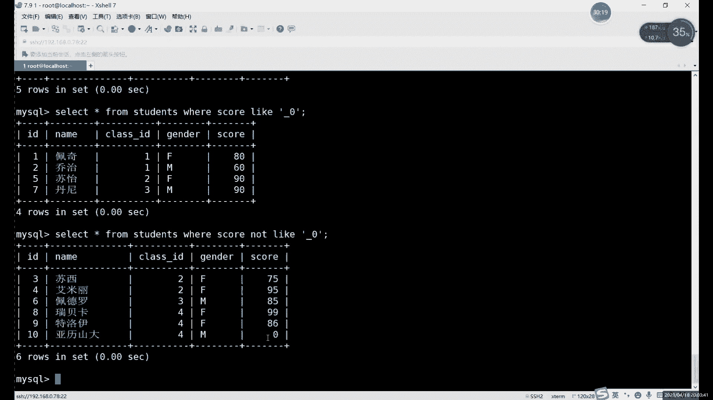

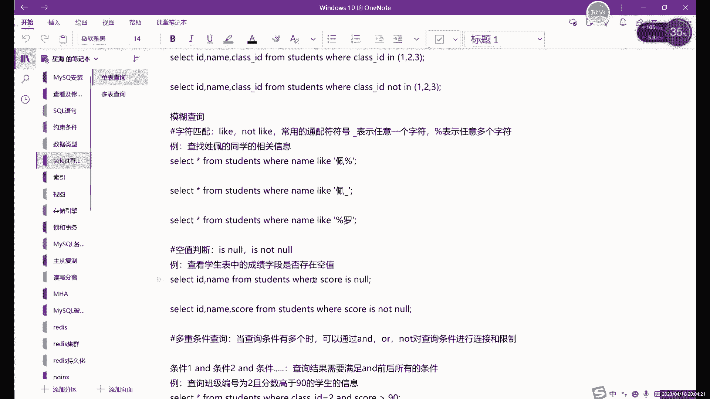

-- 查找“成绩”字段不为空的学生（即已录入成绩）
SELECT * FROM students WHERE score IS NOT NULL;
```
**请注意**：判断空值不能使用等号（`=`），必须使用 `IS NULL` 或 `IS NOT NULL`。

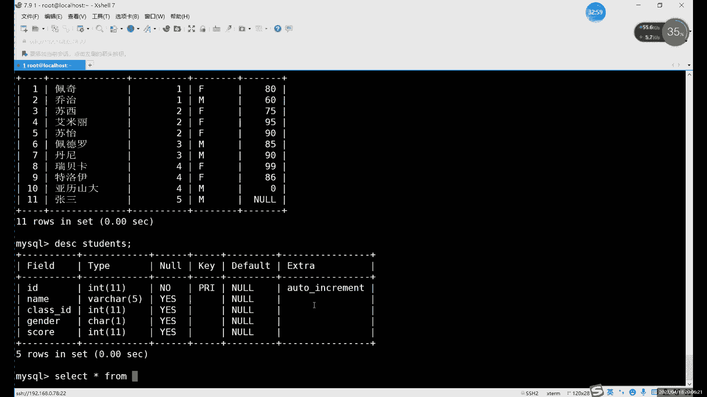

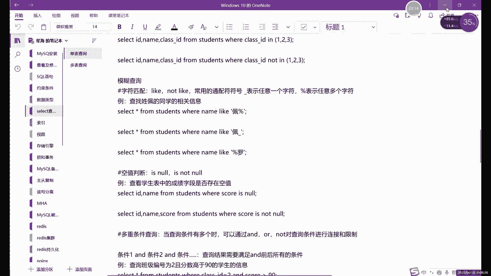

## 多重条件查询：AND 与 OR 🔗

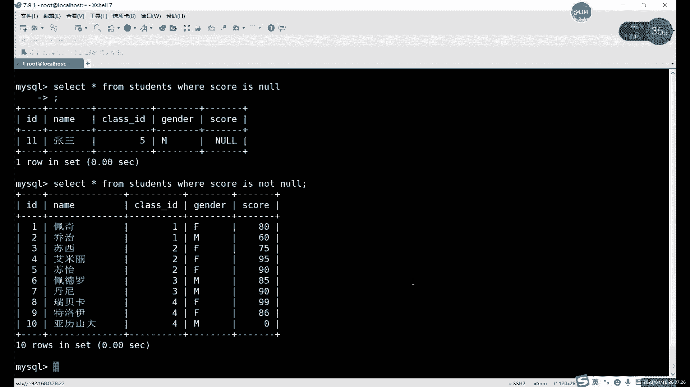

前面的查询大多只针对一个字段设置条件。在实际应用中，我们经常需要同时满足多个条件（例如“一班且成绩大于80”），或者满足多个条件之一（例如“一班或成绩大于80”）。这时就需要用到逻辑运算符 `AND`（与）和 `OR`（或）。

*   **`AND`**：连接多个条件，要求**所有**条件同时满足。相当于取各条件的“交集”，结果通常更精确、数量更少。
*   **`OR`**：连接多个条件，要求**至少一个**条件满足。相当于取各条件的“并集”，结果通常更广泛、数量更多。

以下是多重条件查询的示例：
```sql
-- 使用 AND：查找一班的、并且成绩大于80的学生（必须同时满足两个条件）
SELECT * FROM students WHERE class_id = 1 AND score > 80;

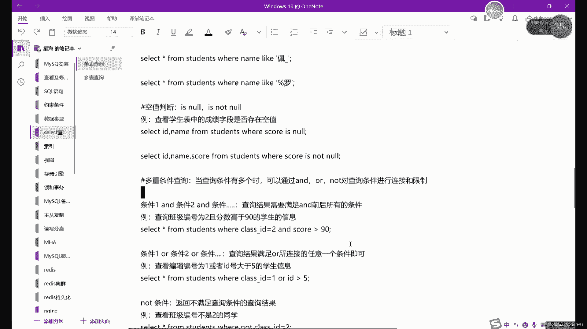

-- 使用 OR：查找一班的学生，或者成绩大于80的学生（满足任一条件即可）
SELECT * FROM students WHERE class_id = 1 OR score > 80;
```
你可以组合多个 `AND` 和 `OR` 来构建复杂的查询逻辑。当混合使用时，需要注意运算符的优先级（`AND` 通常优先于 `OR`），可以使用括号 `()` 来明确指定执行顺序。

---

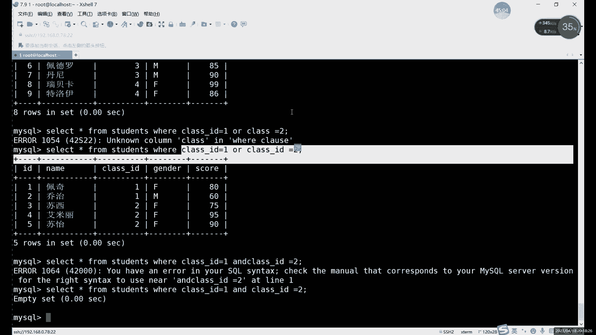

本节课中我们一起学习了SELECT查询的进阶用法。我们掌握了如何使用 `IN` 进行离散值的集合查询；如何使用 `LIKE` 配合通配符进行模糊匹配；如何用 `IS NULL` 来查找空值记录；以及如何通过 `AND` 和 `OR` 逻辑运算符连接多个查询条件，实现更复杂的数据筛选。这些技能是进行高效、精准数据检索的基础。