# MySQL运维教程：P79：中级运维-16.事务，锁，备份-上 🔒


在本节课中，我们将要学习MySQL中两个非常重要的高级概念：**事务**和**锁**。它们是保证数据库数据一致性、完整性和并发操作安全性的核心机制。我们将从基础概念入手，通过简单的比喻和实际操作，帮助你理解它们的作用与使用方法。

## 事务：数据库的“安全快照” 📸

上一节我们介绍了数据控制语言，本节中我们来看看SQL语句的最后一种类型：**事务控制语言**。它控制的不是数据本身，而是对数据进行操作的“过程”。

### 什么是事务？

事务可以理解为一组被绑定在一起、作为一个整体来执行的SQL语句。它最主要的控制对象是**数据操作语言**，即`INSERT`、`UPDATE`、`DELETE`这三个会修改数据的命令。

**事务的核心作用**是提供“回滚”机制。在没有事务的情况下，执行一条修改命令（如`DELETE`）会立刻生效并写入数据库文件。而开启事务后，这些修改命令会先被记录在“事务日志”中，并不会立刻永久修改数据库。你可以检查执行结果，如果正确则**提交**更改，如果错误则可以**回滚**，让数据恢复到命令执行前的状态。

这个过程非常类似于虚拟机中的**快照**功能：
*   执行事务前，相当于给当前数据库状态拍一个快照。
*   执行一系列修改命令。
*   如果结果正确，提交（`COMMIT`）事务，相当于确认更改并保存为新状态。
*   如果结果错误，回滚（`ROLLBACK`）事务，相当于丢弃所有更改，恢复到之前拍下的快照状态。

### 事务的基本命令

事务主要涉及三个命令：
*   `BEGIN;` 或 `START TRANSACTION;` - 显式开启一个新事务。
*   `COMMIT;` - 提交事务，使所有修改永久生效。
*   `ROLLBACK;` - 回滚事务，撤销该事务内的所有修改。

### 自动提交与手动控制

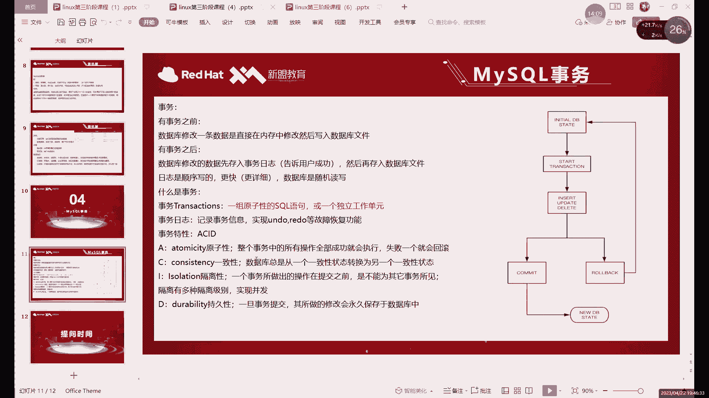

默认情况下，MySQL是**自动提交**模式。每一条SQL语句都被视为一个独立的事务，执行后立即自动提交。这使我们之前无法体验手动回滚。

要使用事务的手动控制功能，首先需要关闭自动提交：

```sql
SET autocommit = 0; -- 关闭自动提交
```

关闭后，执行的修改命令不会立即生效，必须显式使用 `COMMIT` 或 `ROLLBACK` 来结束事务。

### 事务操作演示

以下是事务的一个完整操作流程：

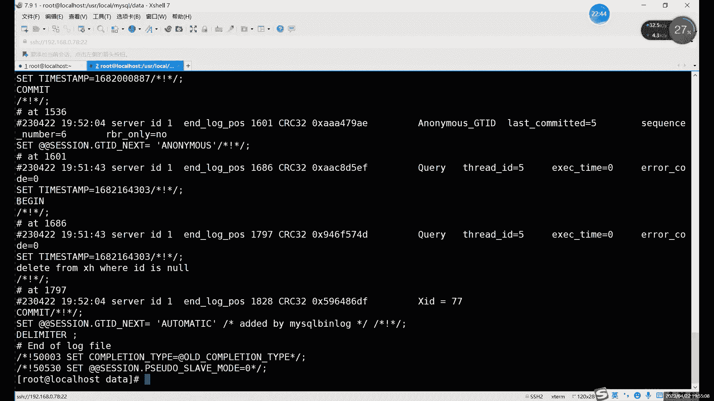

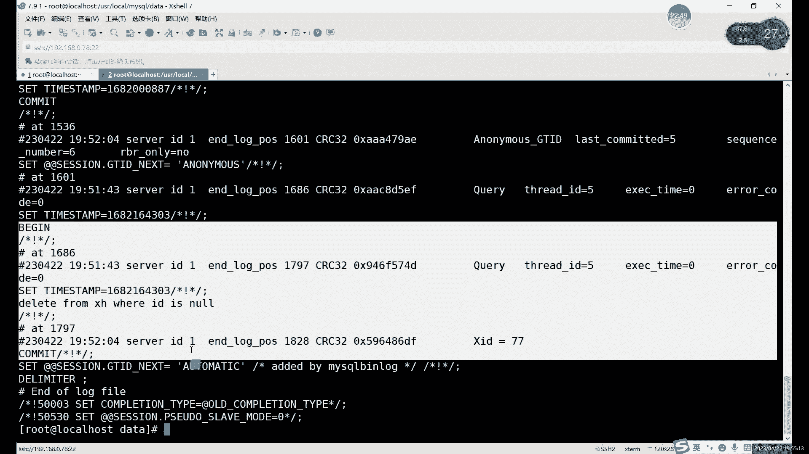

1.  **开启事务并执行操作**
    ```sql
    BEGIN; -- 开启事务
    DELETE FROM xh WHERE id IS NULL; -- 执行删除操作
    SELECT * FROM xh; -- 查看数据，此时在*本事务内*看到数据已删除
    ```

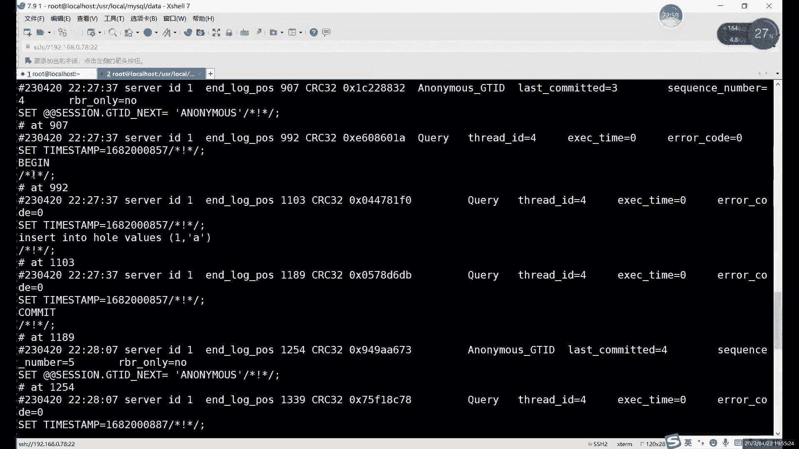

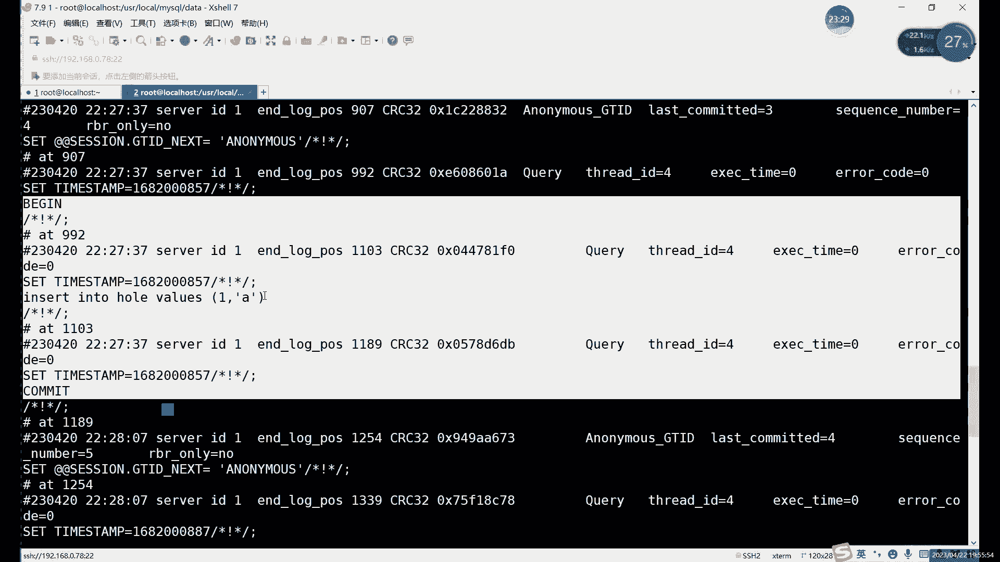

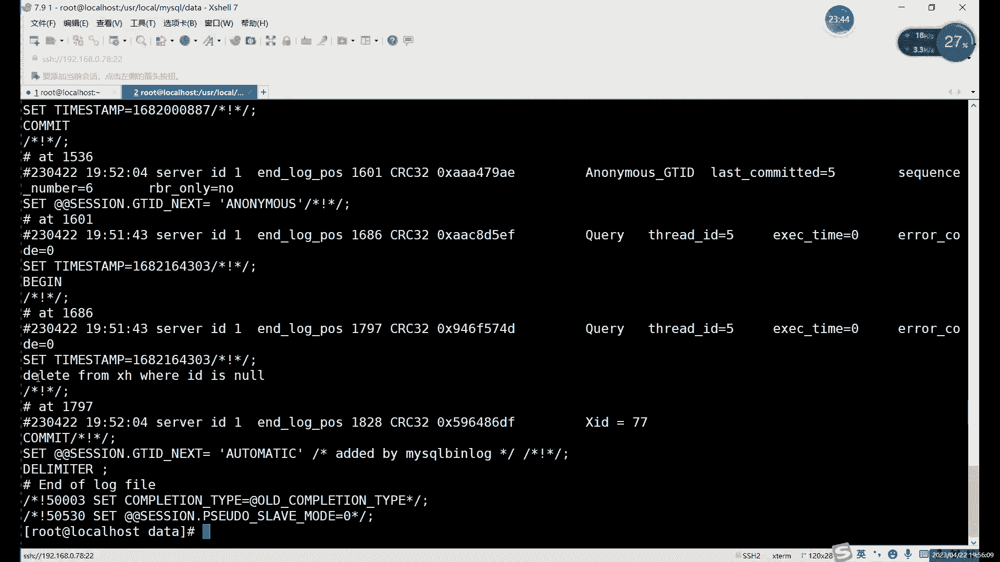

2.  **情况一：发现错误，回滚事务**
    ```sql
    ROLLBACK; -- 回滚事务
    SELECT * FROM xh; -- 再次查看，数据恢复如初
    ```

3.  **情况二：确认无误，提交事务**
    ```sql
    COMMIT; -- 提交事务
    SELECT * FROM xh; -- 数据被永久删除
    ```

**重要特性**：在事务提交之前，该事务内所做的修改，**在其他数据库连接（会话）中是看不到的**。这保证了事务的隔离性。

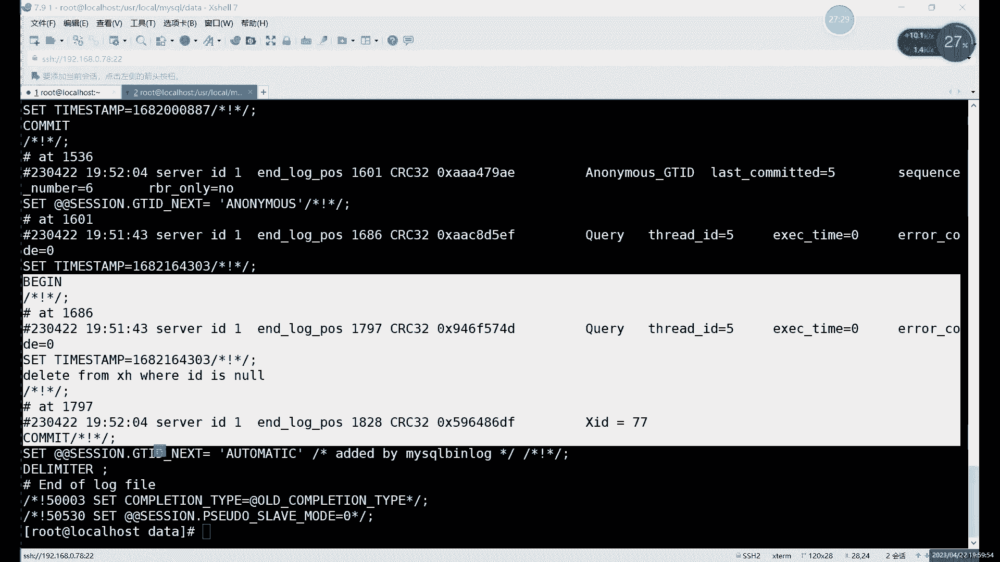

### 查看事务信息

可以通过系统表查看当前运行的事务信息：

```sql
SELECT * FROM information_schema.INNODB_TRX; -- 查看当前运行的事务
```

## 锁：数据的“并发访问管理器” 🚦

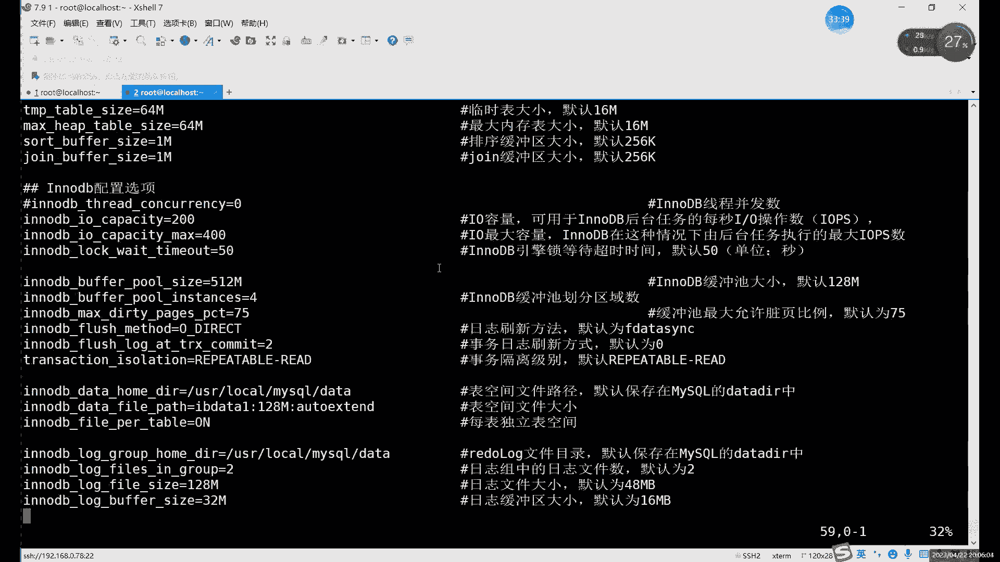

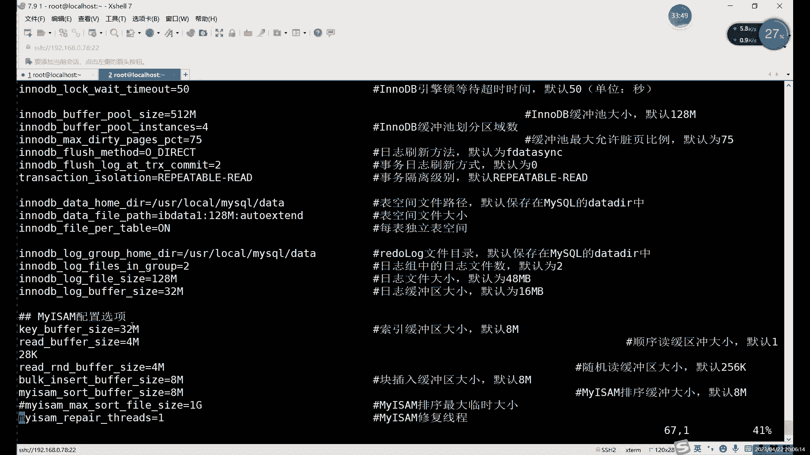

上一节我们介绍了事务如何保证单个操作序列的安全，本节中我们来看看当多个事务同时操作时，MySQL如何协调以避免冲突，这就是**锁**的机制。

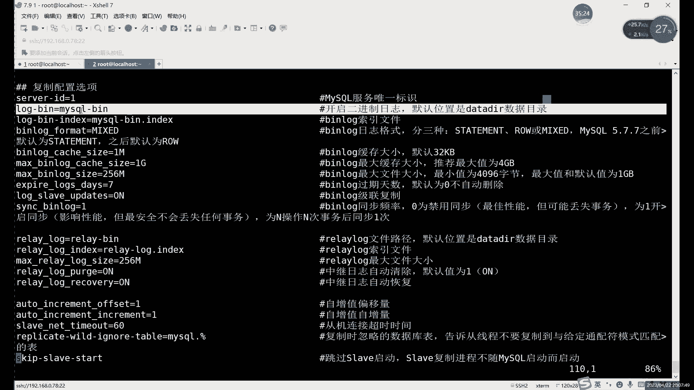

锁主要用于解决并发访问下的数据一致性问题。当多个事务同时读写同一份数据时，如果没有锁，可能会产生脏读、不可重复读等问题。

### 读锁与写锁

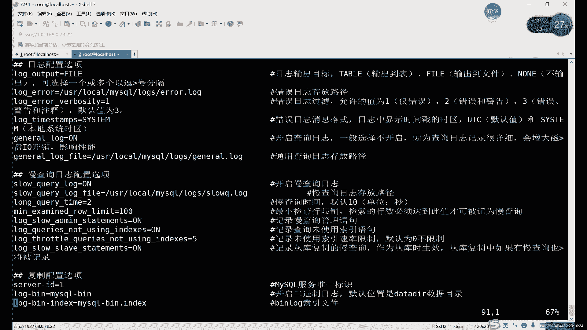

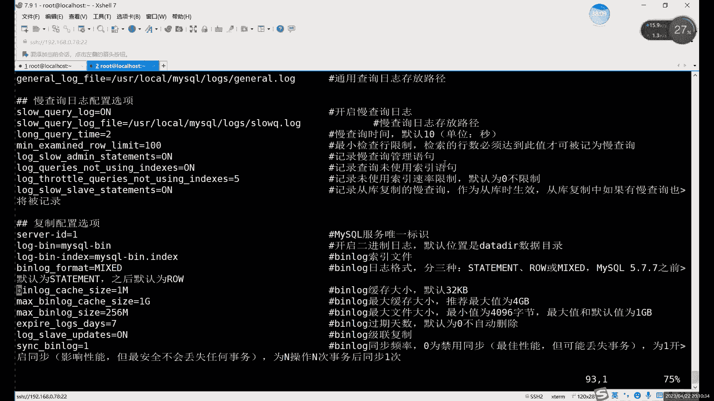

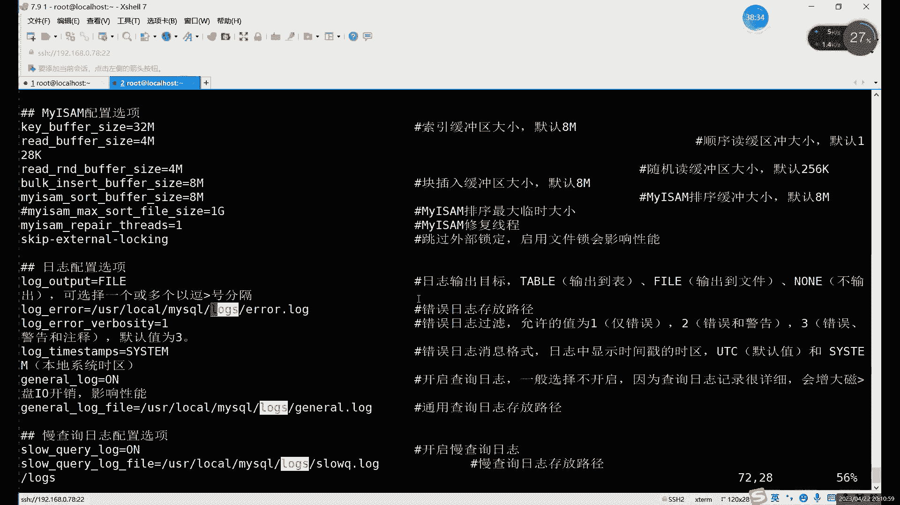

最常见的锁类型是**读锁**和**写锁**。

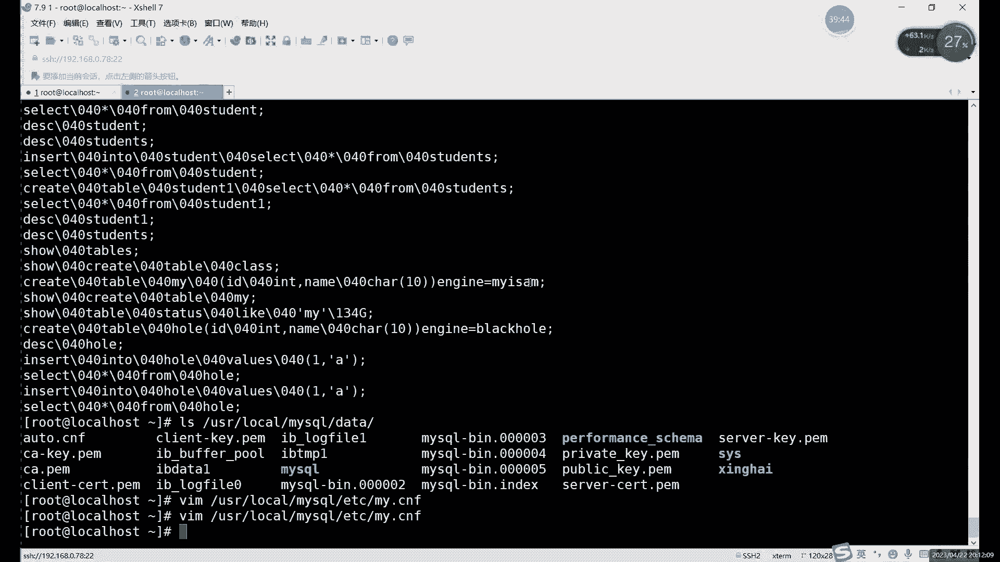

*   **读锁（共享锁）**：多个事务可以同时对一个数据加读锁。加了读锁后，所有事务都只能读取数据，不能修改。读锁之间是兼容的。
    *   **公式表示**：`事务A(读锁) + 事务B(读锁) => 允许`

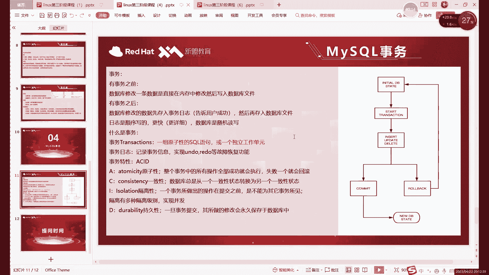

*   **写锁（排他锁）**：一个事务对数据加了写锁后，其他事务既不能读取也不能修改该数据，直到写锁被释放。写锁是排他的。
    *   **公式表示**：`事务A(写锁) + 事务B(任何操作) => 阻塞B` 或 `事务B(任何操作) + 事务A(写锁) => 阻塞A`

### 锁的应用场景

锁通常由数据库管理系统自动管理。例如：
*   当一个事务要修改某行数据时，MySQL会自动为其加上写锁。
*   其他事务如果尝试修改或读取这行数据（取决于隔离级别），可能会被阻塞，直到第一个事务提交或回滚，释放锁。

你可以通过以下命令查看当前的锁信息：

```sql
SHOW ENGINE INNODB STATUS; -- 查看InnoDB引擎状态，包含锁信息
-- 或者查询性能模式库
SELECT * FROM performance_schema.data_locks; -- (MySQL 8.0+)
```

**核心原则**：锁机制在保证数据安全的同时，会降低并发性能。因此，事务应尽可能简短，并及时提交或回滚，以尽快释放锁。

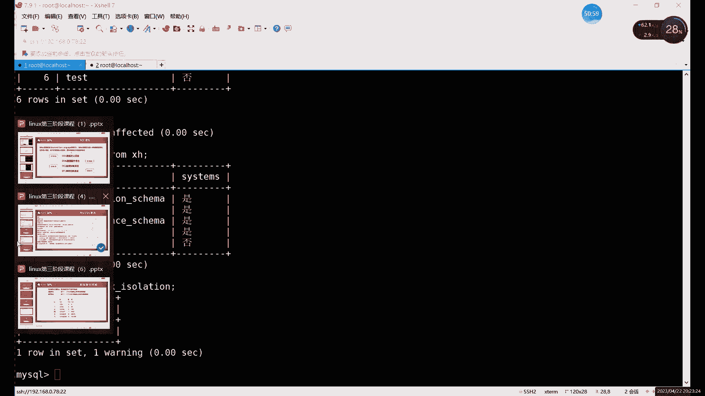

## 总结

本节课中我们一起学习了MySQL中事务和锁的核心概念。

*   **事务**是一个保证数据操作原子性、一致性、隔离性和持久性的机制。通过 `BEGIN`、`COMMIT`、`ROLLBACK` 命令，我们可以将一系列操作打包，要么全部成功，要么全部失败，并利用“回滚”功能应对操作失误。
*   **锁**是数据库管理并发访问的机制。主要分为共享的**读锁**和排他的**写锁**，它们确保了多个事务同时工作时，数据的读写不会产生混乱。

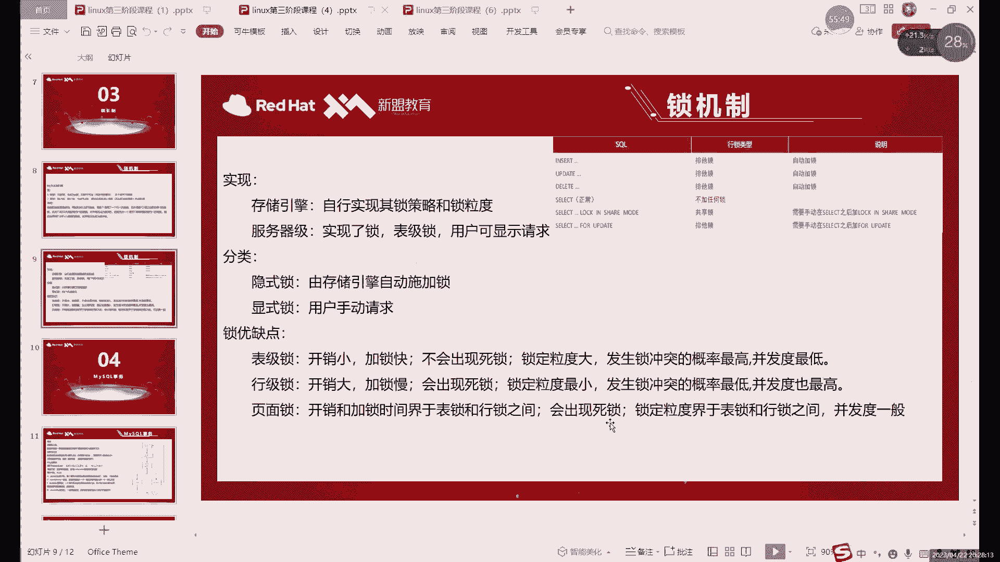

理解事务和锁是掌握数据库运维和高效、安全进行数据操作的关键。下一节，我们将继续探讨与事务和锁紧密相关的**备份**策略。