# Linux运维全套培训课程：P80：中级运维-17.事务，锁，备份-中 🔒


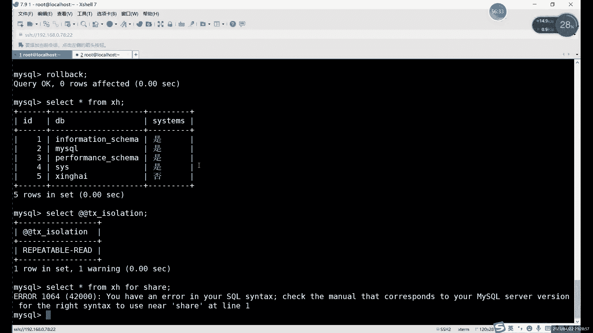


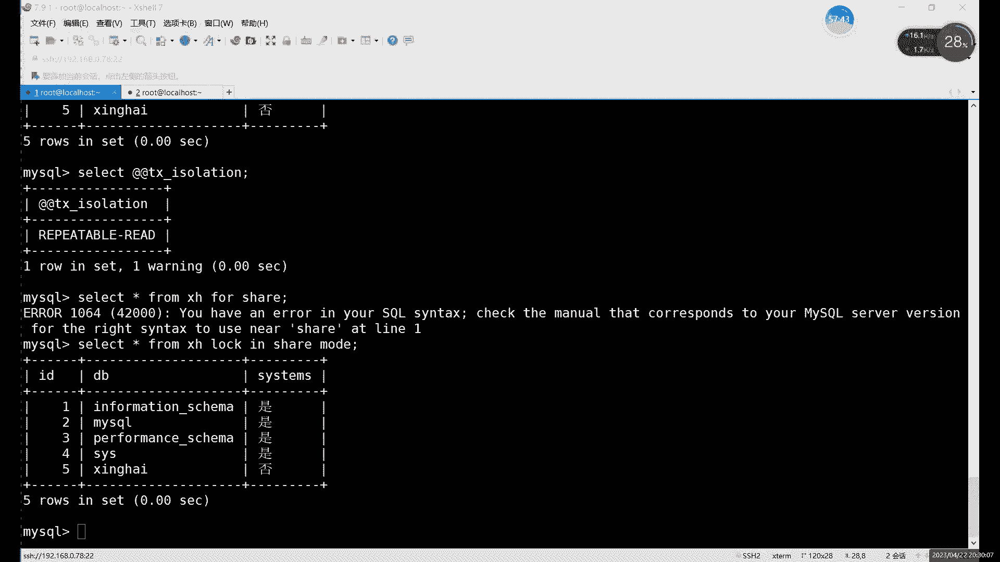

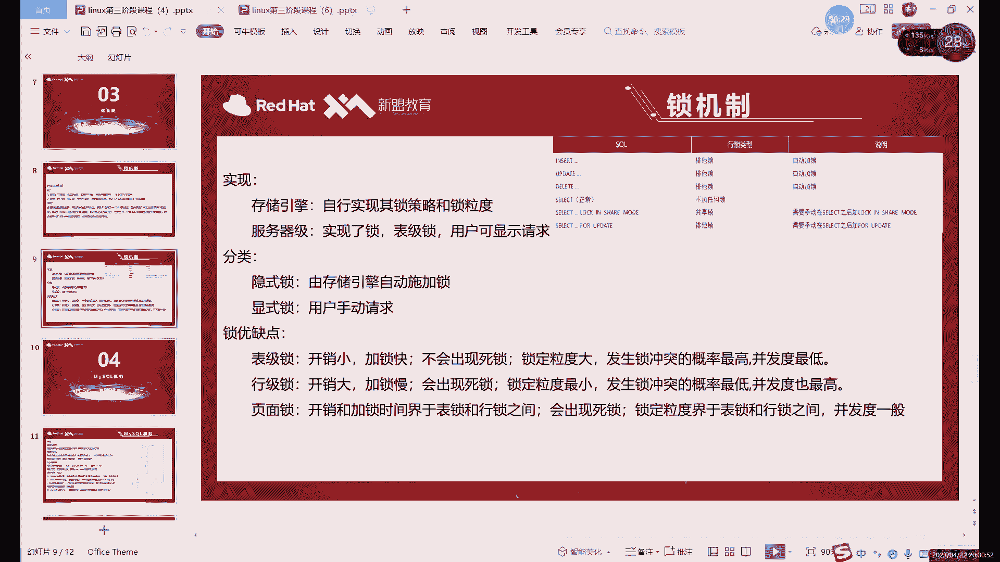

在本节课中，我们将要学习MySQL中的锁机制以及数据库备份的基础知识。我们将了解锁的类型、作用以及如何创建锁，并探讨不同备份策略的原理与区别。

## 锁的创建与类型

上一节我们介绍了事务的基本概念，本节中我们来看看如何通过锁来管理并发访问。

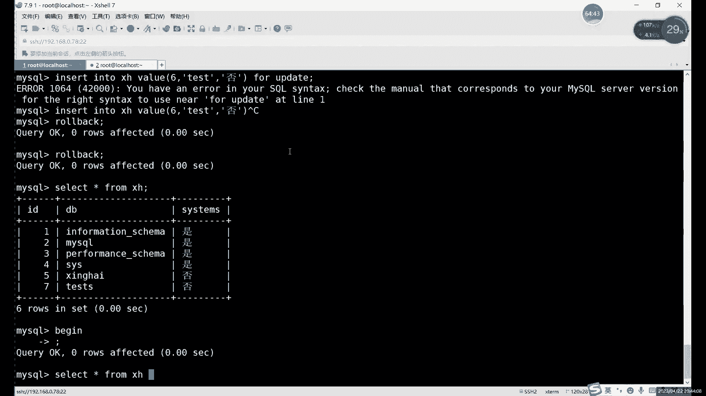

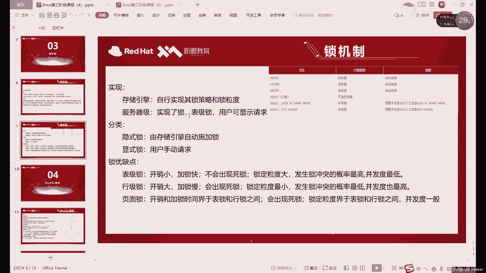

锁可以通过`SELECT`语句创建。例如，创建一个共享锁的语法如下：
```sql
SELECT * FROM table_name LOCK IN SHARE MODE;
```
这就是共享锁。

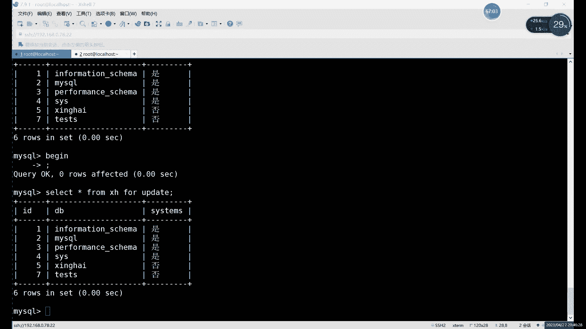

`LOCK IN SHARE MODE`用于创建共享锁。共享锁在查询操作上限制不大，因为多个终端可以同时查询被锁定的数据。

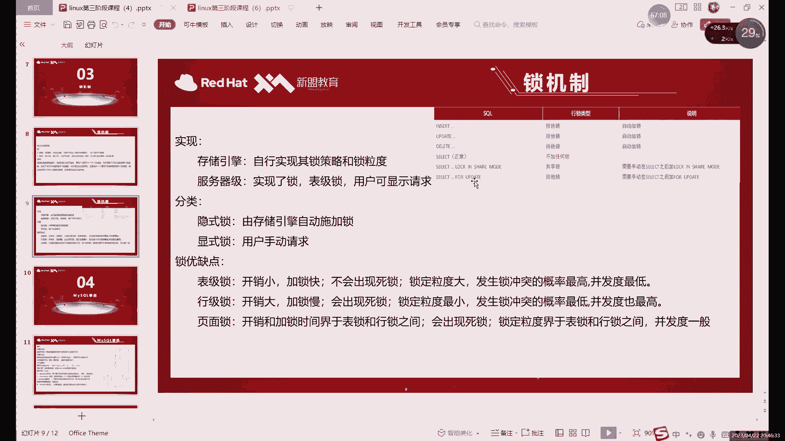

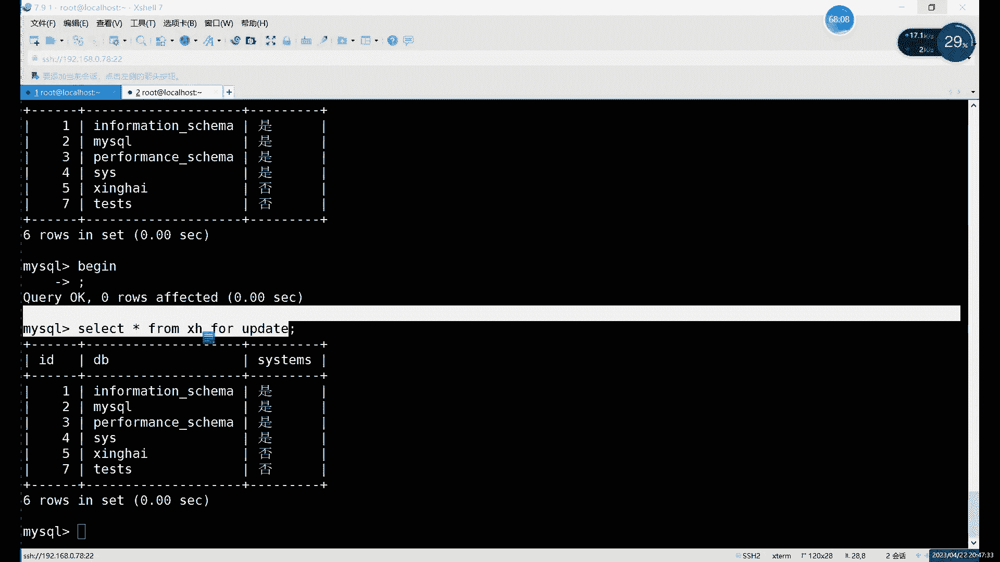

有限制的是排他锁。排他锁是独占的，它会阻塞其他事务。当一个终端在执行一个持有排他锁的事务时，会拒绝其他所有终端的操作。

例如，我们可以用`INSERT`命令来演示写锁（排他锁）。首先设置一个写锁：
```sql
LOCK TABLE xh WRITE;
```
这个命令相当于用写锁锁上`xh`表。锁上之后，开启一个事务并插入数据：
```sql
BEGIN;
INSERT INTO xh VALUES (123456, 'Dt');
```
此时，如果切换到另一个终端尝试对`xh`表进行插入操作，该操作会被阻塞。

对于`SELECT`语句，锁有两种类型。正常的`SELECT`不会加锁。需要加锁的`SELECT`有两种：共享锁和排他锁。共享锁允许多个查询同时进行。排他锁则不允许。我们可以使用`FOR UPDATE`子句来添加排他锁：
```sql
SELECT * FROM xh FOR UPDATE;
```
这就是排他锁。排他锁意味着当前事务独占了该数据表。

共享锁的语法是`LOCK IN SHARE MODE`。`SELECT`命令默认允许多个命令一起使用。但加了锁之后就不允许了。

锁机制本身不需要操作太多。因为`INSERT`、`UPDATE`、`DELETE`这三个命令都会自动施加排他锁。但要注意，锁机制想要触发，首先必须开启事务。如果使用自动提交，事务会立即关闭，锁就不会生效。

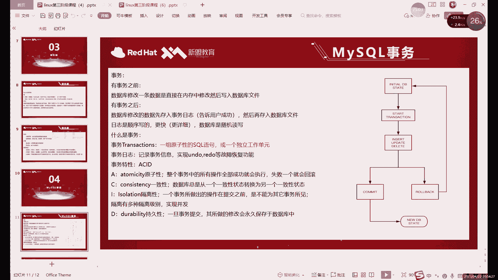

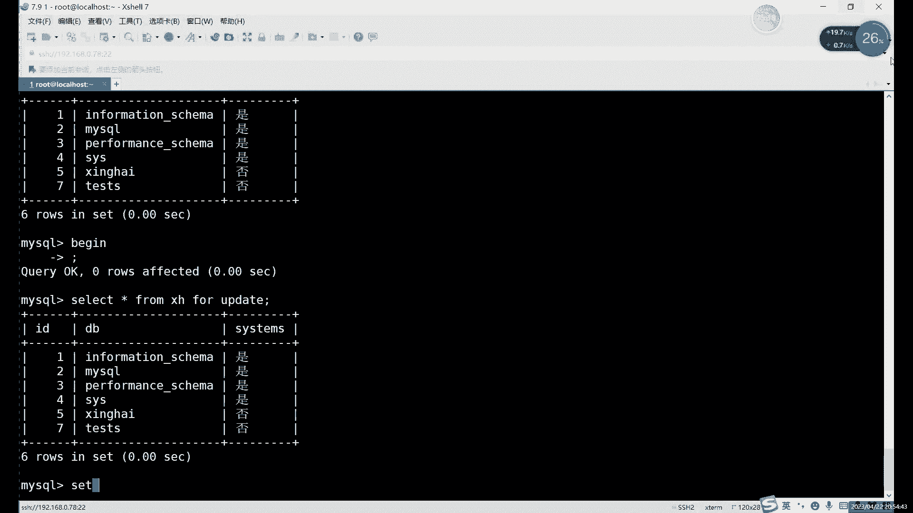

锁分为手动锁（显式锁）和存储引擎自动施加的锁。除了增删改查，在备份数据时也可以上锁，以保证备份时间点的数据一致性。

## 锁的分类与特性

刚才我们演示了读锁（共享锁）和写锁（排他锁）。锁有多种分类方式。

以下是按锁定粒度分类的几种锁：
*   **表级锁**：开销最小，加锁最快。但容易出现锁冲突。
*   **行级锁**：开销介于表锁和页锁之间。InnoDB存储引擎支持表锁、行锁和页锁，默认使用行级锁。行级锁在多个事务访问同一表的不同行时，可以同时进行读操作。写操作则需要加排他锁。
*   **页面锁**：开销和加锁时间介于表锁和行锁之间。

锁本质上是一种与事务配合的保护机制。必须开启事务，否则大部分锁不会生效。在没有事务的情况下，所有操作都自动提交，按顺序执行，不会产生冲突。只有在多个终端同时开启事务并尝试修改相同数据时，锁才变得必要。

## 数据库备份概述

接下来，我们将进入备份部分。备份的重要性不言而喻。无论是系统文件、服务配置文件还是数据库，都需要定期备份。

像修改MySQL配置文件（如设置`autocommit=0`使其永久生效）前，也应该先备份。`SET autocommit=0`命令的效果是临时的。


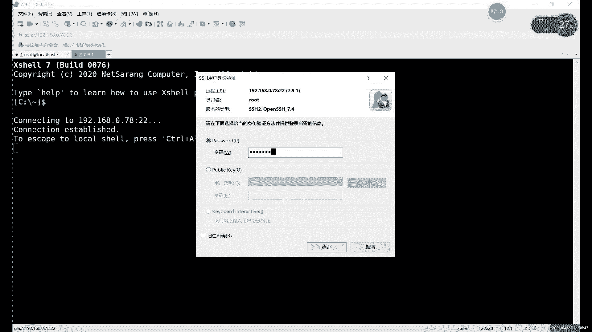

死锁指的是两个或多个进程在执行时，因争夺资源而造成的一种互相等待的现象。例如，两个事务都需要对方占用的资源，就会相互等待，形成死锁。

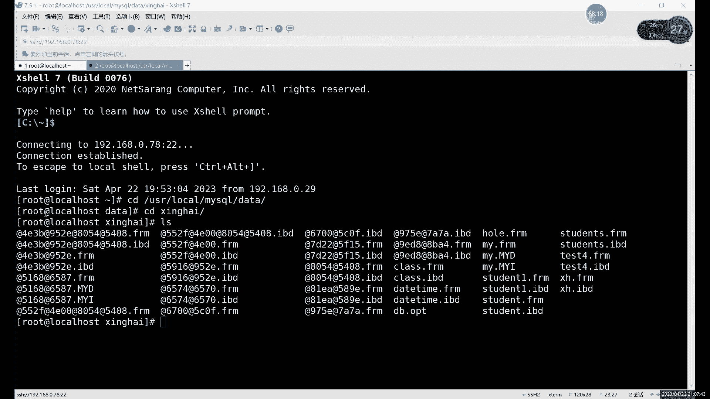

## 备份策略分类

数据库备份的方法很多。首先来了解备份策略，即备份数据的方式。

备份策略通常按备份数据量分类，主要有以下三种：

以下是完全备份、增量备份与差异备份的对比：
*   **完全备份**：备份指定目标下的所有数据。每次备份都备份全部数据。优点是数据完整；缺点是随着数据增长，备份耗时变长，占用存储空间大。
*   **增量备份**：基于上一次备份（无论是完全备份还是增量备份）后，只备份新增的数据。优点是备份数据量小，速度快；缺点是恢复时需要按顺序应用多个备份文件。
*   **差异备份**：基于上一次完全备份后，备份所有新的数据。备份数据量介于完全备份和增量备份之间。


总体上，增量备份在数据库备份中用得最多。它第一次需要完全备份，之后每次只备份增量数据，在备份效率和恢复可行性之间取得了平衡。

备份还可以按数据库状态分类：
*   **冷备份**：在数据库关闭状态下进行备份。不能进行读写操作。优点是速度快；缺点是服务需要中断。
*   **热备份**：在数据库运行状态下进行备份。不影响正常的读写操作。
*   **温备份**：在数据库运行状态下进行备份，但只能进行读操作，不能进行写操作。

备份还可以按备份方式分类：
*   **物理备份**：直接复制数据库的物理文件（如数据文件、结构文件）。备份速度快，但备份文件较大。
*   **逻辑备份**：将数据库的结构和数据转化为SQL语句（主要是`CREATE`和`INSERT`语句）进行备份。备份文件较小，便于迁移和选择性恢复，但备份和恢复速度可能较慢。

对于MySQL，常用的组合是：第一次进行完全备份，之后进行增量备份。在备份方式上，物理备份和逻辑备份都可以根据场景选用。

## 物理备份（冷备份）演示

下面我们先演示全量备份下的冷备份加物理备份。

首先关闭数据库。物理备份即直接备份文件，可以使用`cp`或`tar`命令。

创建一个备份目录，然后拷贝整个数据库或特定数据库的文件。例如，备份`xh`数据库：
```bash
cp -rp /usr/local/mysql/data/xh /backup/
```
也可以备份整个`data`目录。备份后，如果需要可以再用`tar`命令打包。

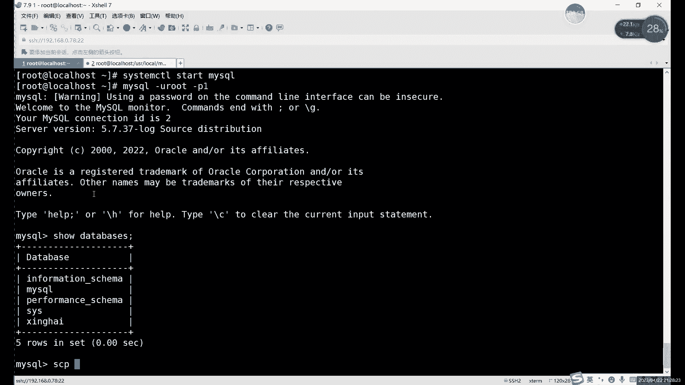

模拟故障，删除原数据库目录：
```bash
rm -rf /usr/local/mysql/data/xh
```
恢复时，将备份的文件拷贝回原位置：
```bash
cp -rp /backup/xh /usr/local/mysql/data/
```
然后启动数据库，数据即可恢复。物理备份就是文件拷贝过程。`tar`命令打包备份时，恢复前最好先解压到临时目录检查文件完整性。`scp`命令可用于网络传输备份文件，但对网络速度有要求。

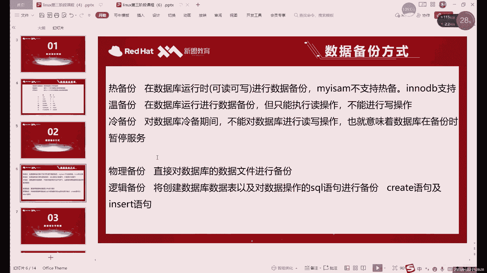

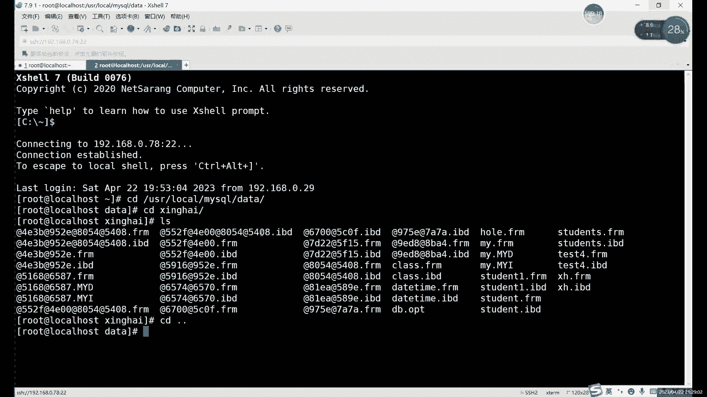

## 逻辑备份概述

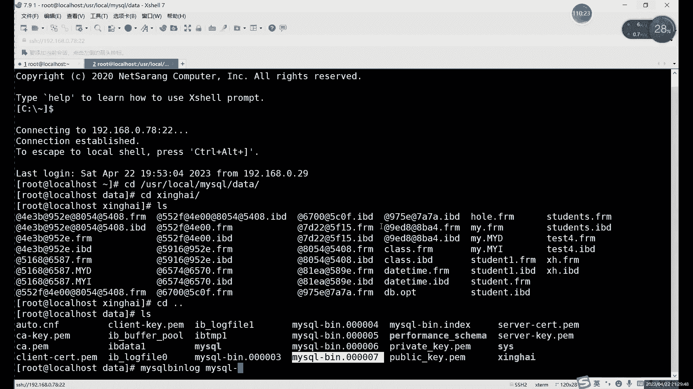

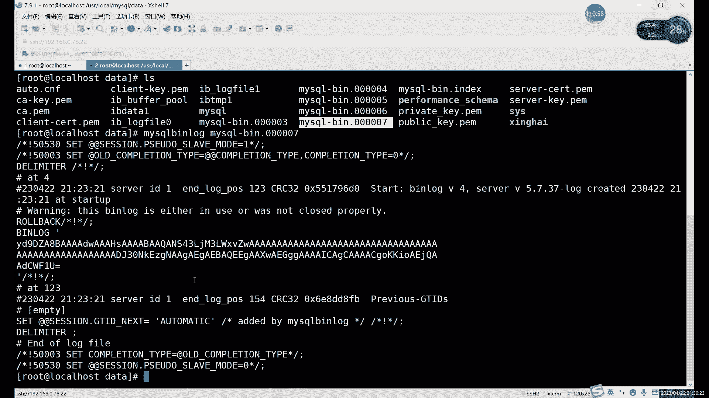

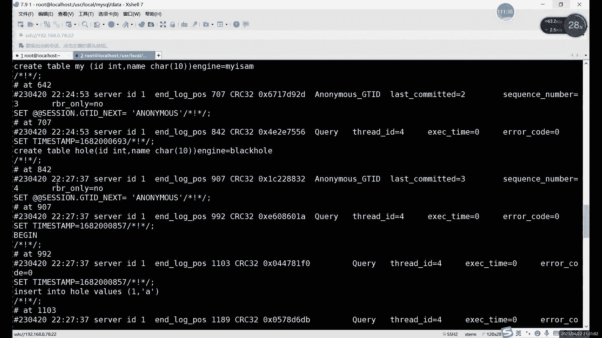

接下来看逻辑备份。逻辑备份通常采用热备份方式，即不关闭数据库。

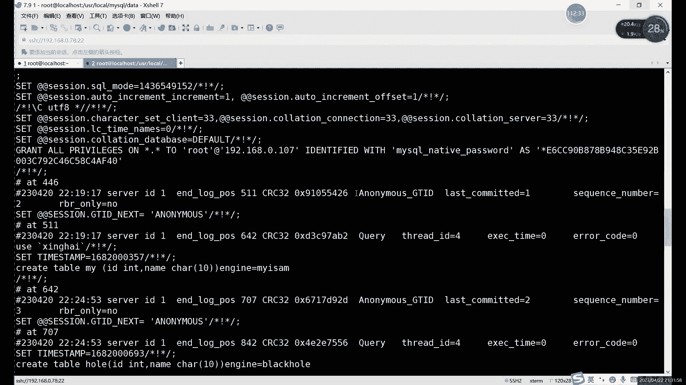

逻辑备份导出的是SQL语句，类似于二进制日志中的`CREATE`和`INSERT`语句（但它是最终状态的快照，不记录中间过程如`UPDATE`或`DELETE`）。它通过查看表结构反推出`CREATE`语句，查看表数据反推出`INSERT`语句，并保存到文件中。

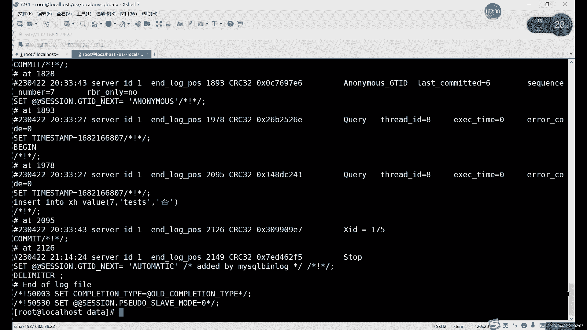

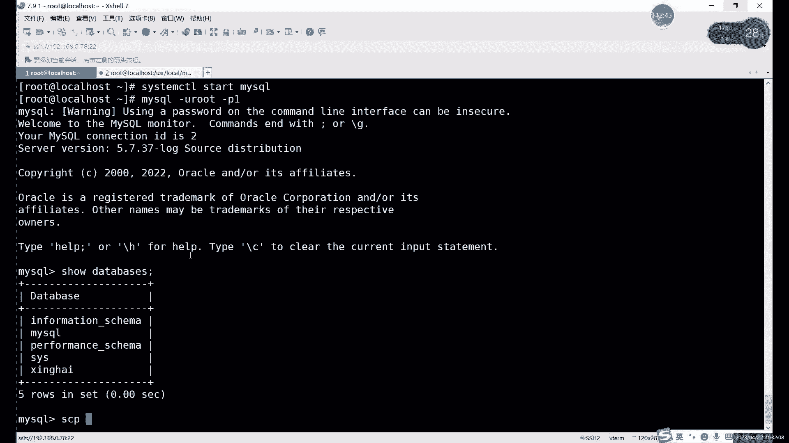

逻辑备份的文件较小，便于迁移和在不同数据库版本间恢复，也支持选择性恢复数据。我们将在下一部分演示逻辑备份的具体用法。

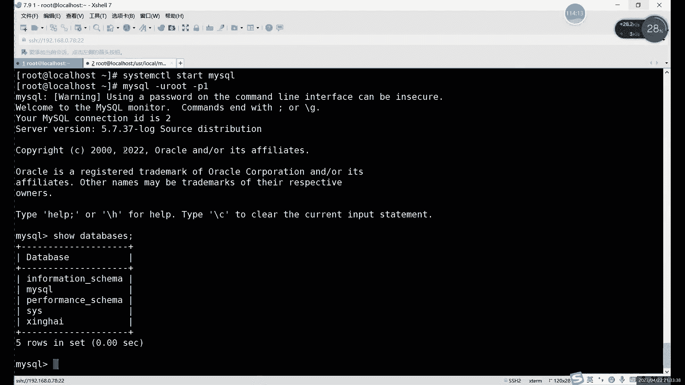

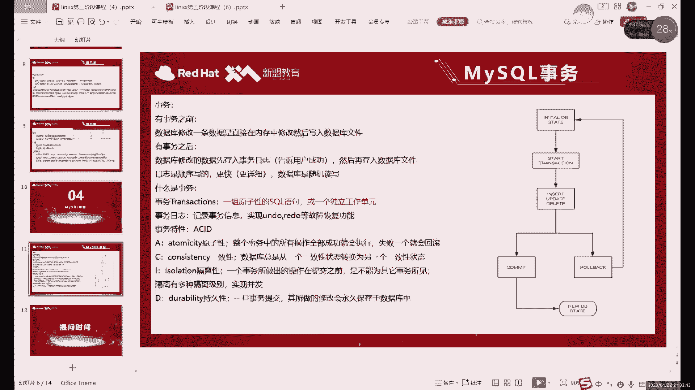

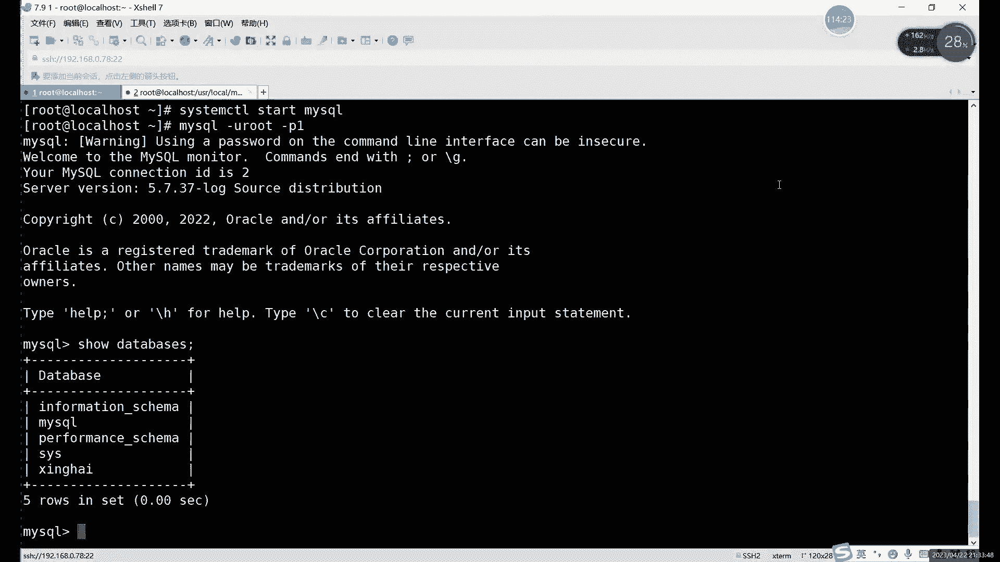

本节课中我们一起学习了MySQL的锁机制，包括共享锁和排他锁的创建与作用，以及锁的分类。接着，我们探讨了数据库备份的极端重要性，并详细分析了完全备份、增量备份和差异备份三种策略，以及冷、热、温备份和物理、逻辑备份等不同维度的分类。最后，我们演示了物理备份（冷备份）的操作过程，并对逻辑备份进行了原理性介绍。