# Linux运维全套培训课程：P81：中级运维-18.事务，锁，备份-下 🔧

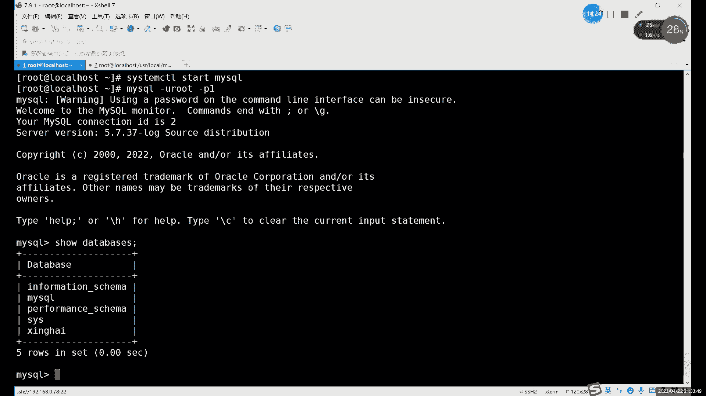

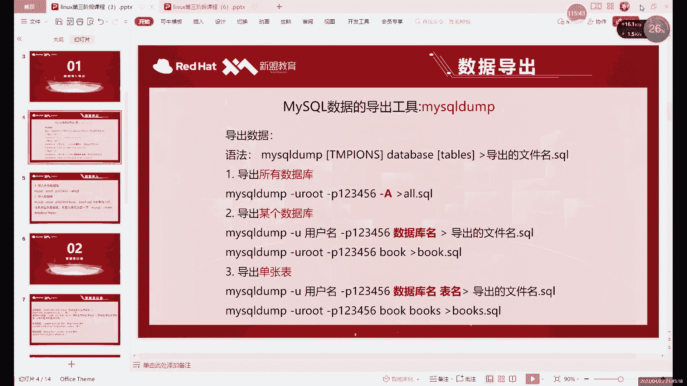

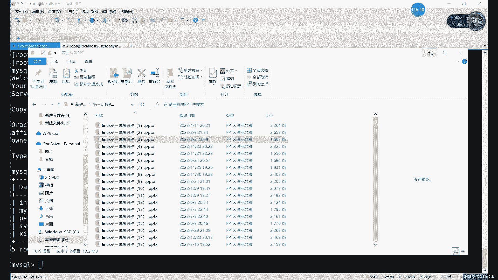

在本节课中，我们将继续学习MySQL的备份与恢复，重点介绍逻辑备份的详细操作、备份文件的构成以及如何利用备份文件进行数据恢复。我们将通过具体的命令和示例，帮助初学者掌握逻辑备份的核心流程。

---

## 逻辑备份与 `mysqldump` 命令

上一节我们介绍了物理备份，本节中我们来看看逻辑备份。逻辑备份主要使用 `mysqldump` 命令，它是MySQL数据库自带的导入导出工具，主要用于数据的导出操作。

`mysqldump` 命令的导出过程类似于数据的备份，而导入过程则类似于数据的恢复。

### 备份所有数据库

以下是使用 `mysqldump` 备份所有数据库的基本用法。

**命令格式：**
```bash
mysqldump -u root -p密码 --all-databases > 备份文件名.sql
```
或者使用简写：
```bash
mysqldump -u root -p密码 -A > 备份文件名.sql
```
*   `-A` 或 `--all-databases` 选项表示备份所有数据库。
*   `>` 是重定向符号，将命令输出的内容保存到指定的文件中。

执行该命令后，会生成一个包含所有数据库结构和数据的SQL文件。

### 备份文件内容解析

生成的备份文件主要由SQL命令构成，核心目的是为了后续的恢复。

备份文件主要包含以下两类命令：
1.  **`CREATE` 命令**：用于创建数据库和表结构。
2.  **`INSERT` 命令**：用于向表中插入数据。

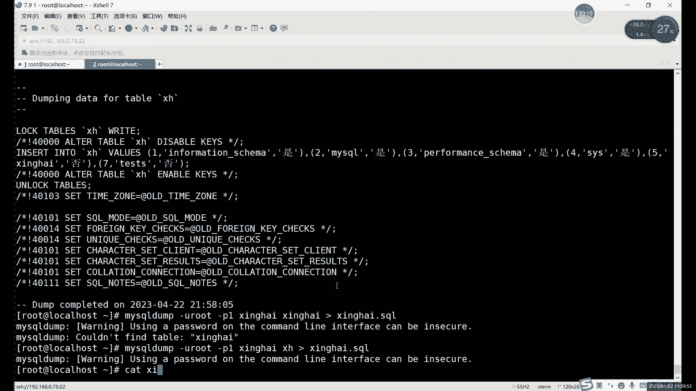

此外，文件中还会包含 `DROP` 命令。在恢复每个表之前，会先执行 `DROP TABLE IF EXISTS` 语句。这是为了确保在目标数据库已存在同名表时，能够先删除旧表再创建新表，从而避免因表已存在而导致的恢复错误。

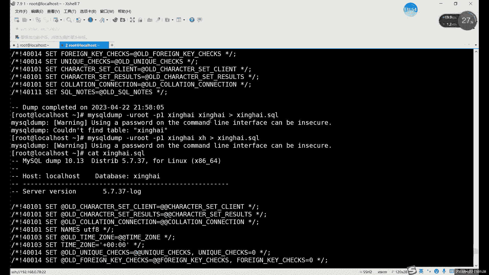

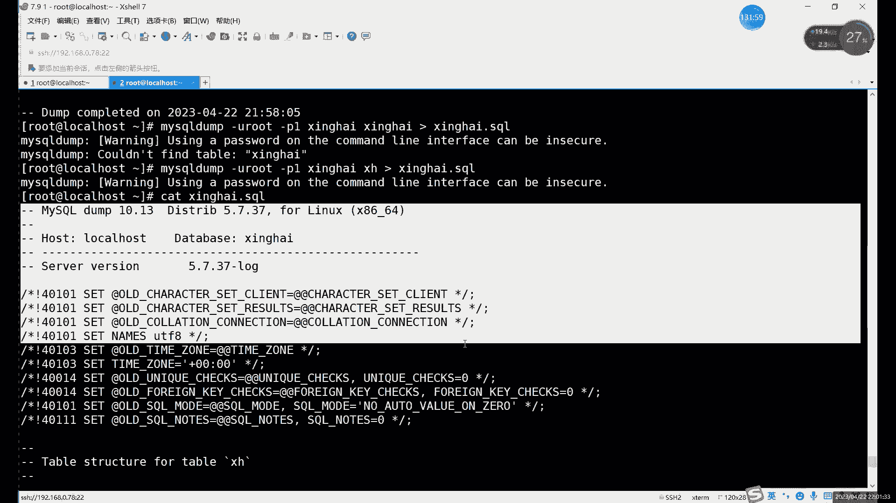

恢复的原理就是按顺序执行备份文件中的这些SQL语句。

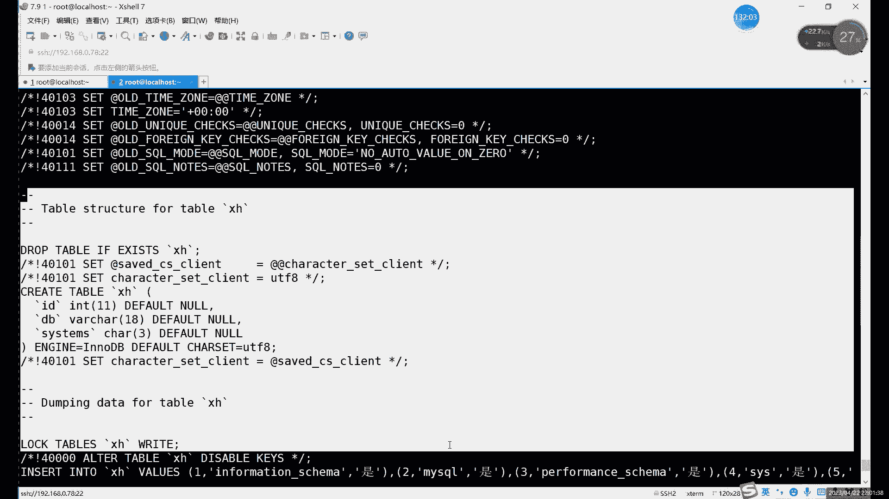

---

## 灵活的备份选项

`mysqldump` 命令非常灵活，不仅可以备份整个服务器，还可以针对不同范围进行备份。

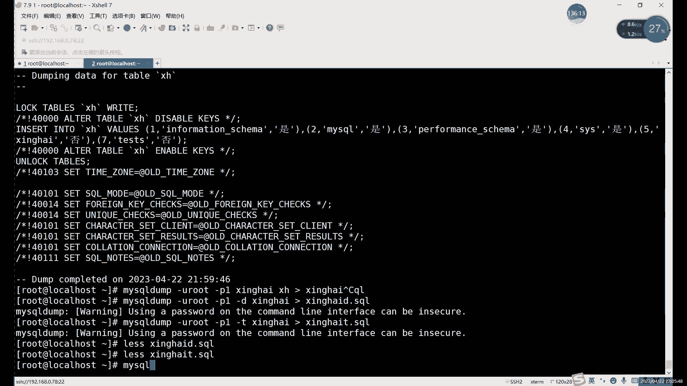

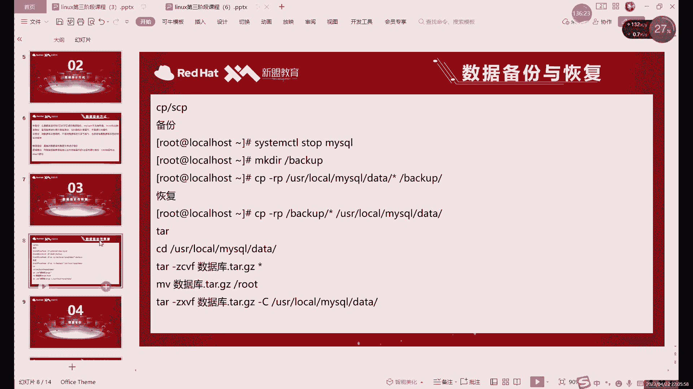

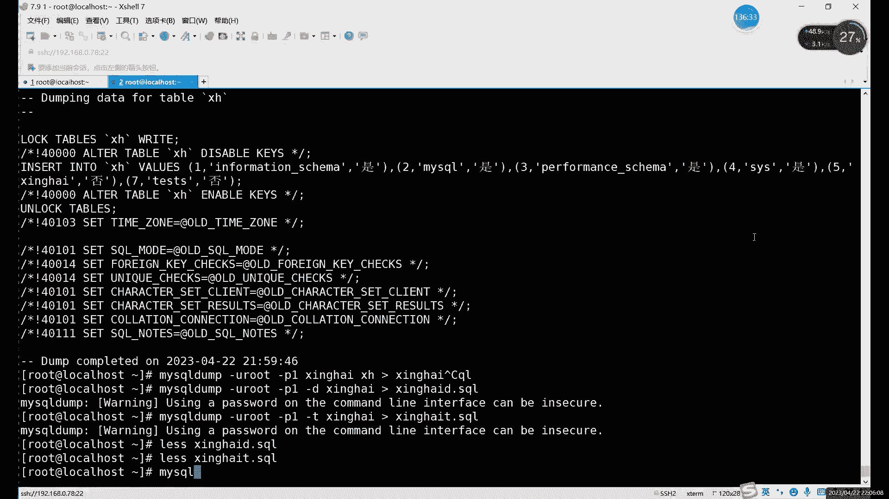

### 备份单个数据库

如果只想备份某一个特定的数据库，可以使用以下命令。

**命令格式：**
```bash
mysqldump -u root -p密码 数据库名 > 备份文件名.sql
```

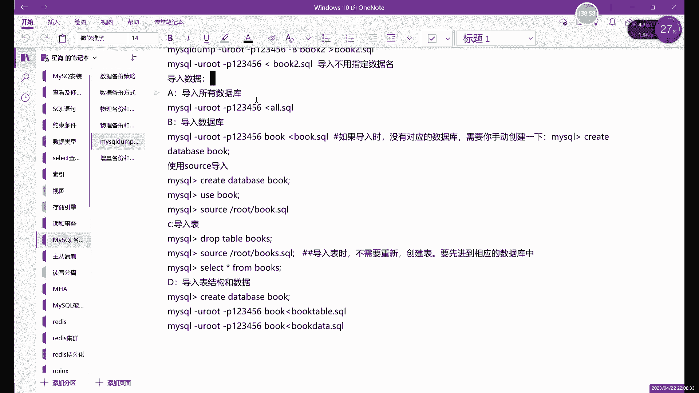

### 备份单张数据表

还可以进一步只备份某个数据库中的特定表。

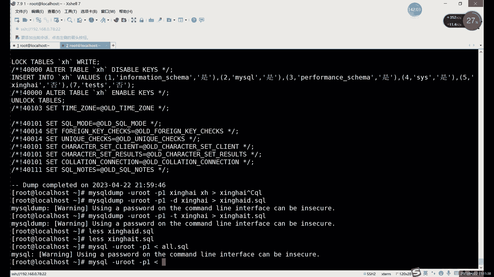

**命令格式：**
```bash
mysqldump -u root -p密码 数据库名 表名 > 备份文件名.sql
```
*注意：数据库名和表名之间用空格分隔，而不是点号。*


### 单独备份结构或数据

有时，我们可能只需要数据库的结构（表框架），或者只需要数据。

以下是分别导出结构和数据的命令：
*   **仅备份结构（不包含数据）：**
    ```bash
    mysqldump -u root -p密码 -d 数据库名 > 结构备份文件.sql
    ```
*   **仅备份数据（不包含结构）：**
    ```bash
    mysqldump -u root -p密码 -t 数据库名 > 数据备份文件.sql
    ```
*   `-d` 选项代表只导出结构（`CREATE`语句）。
*   `-t` 选项代表只导出数据（`INSERT`语句）。

---

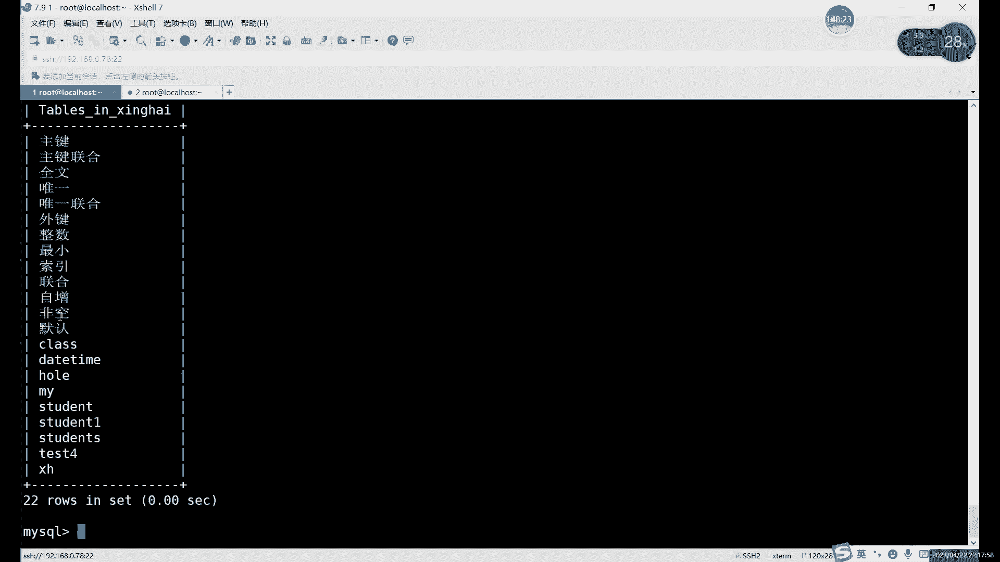

## 逻辑备份的恢复操作

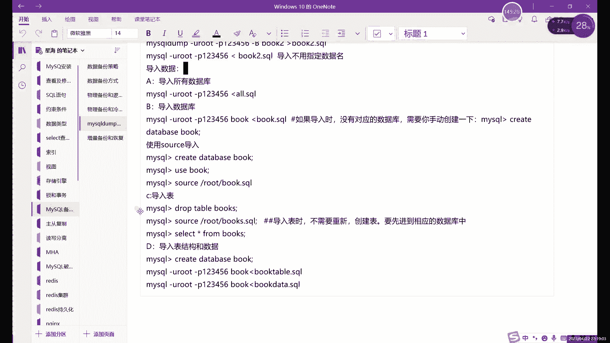

备份完成后，当需要恢复数据时，就需要使用导入操作。逻辑备份的恢复本质上是将备份文件中的SQL语句在数据库中重新执行一遍。

### 使用 `mysql` 命令恢复

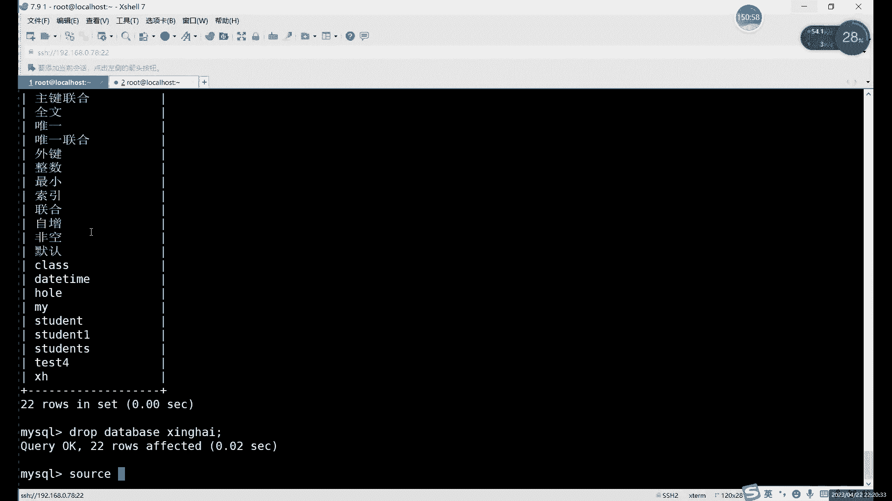

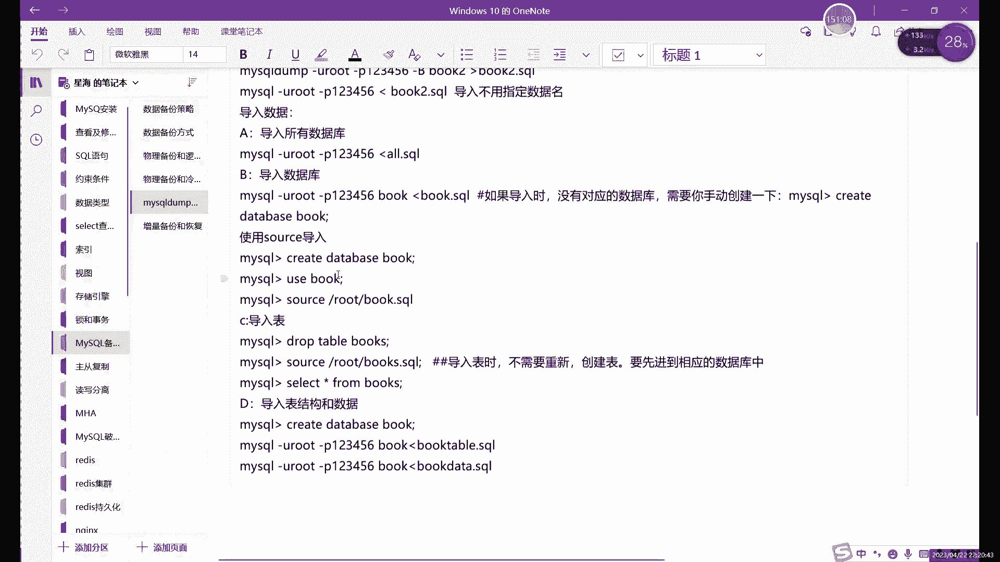

在操作系统命令行中，可以使用 `mysql` 客户端命令来执行备份文件，完成恢复。

**恢复整个备份文件（例如包含所有数据库的备份）：**
```bash
mysql -u root -p密码 < 备份文件名.sql
```
*   `<` 是重定向符号，表示将文件内容导入到 `mysql` 命令中执行。

**恢复单个数据库的备份：**
```bash
mysql -u root -p密码 数据库名 < 备份文件名.sql
```
*重要提示*：使用此命令恢复单个数据库前，**必须确保该数据库已经存在**。如果数据库已被删除，需要先创建空数据库。
```sql
CREATE DATABASE 数据库名;
```

### 使用 `source` 命令恢复

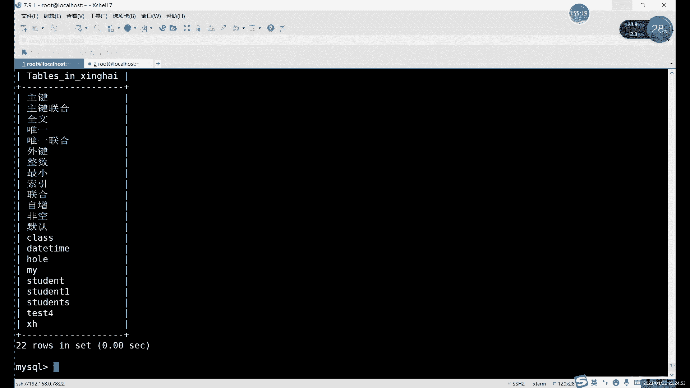

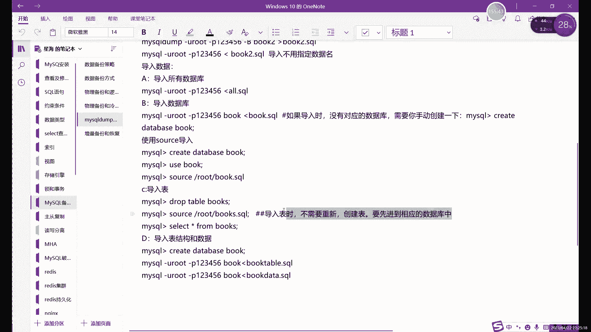

在MySQL数据库命令行内部，可以使用 `source` 命令来恢复数据。

**操作步骤：**
1.  登录MySQL。
    ```bash
    mysql -u root -p
    ```
2.  切换到目标数据库（如果备份是单个库）。
    ```sql
    USE 数据库名;
    ```
3.  执行 `source` 命令，指定备份文件的**绝对路径**。
    ```sql
    SOURCE /完整路径/备份文件名.sql;
```

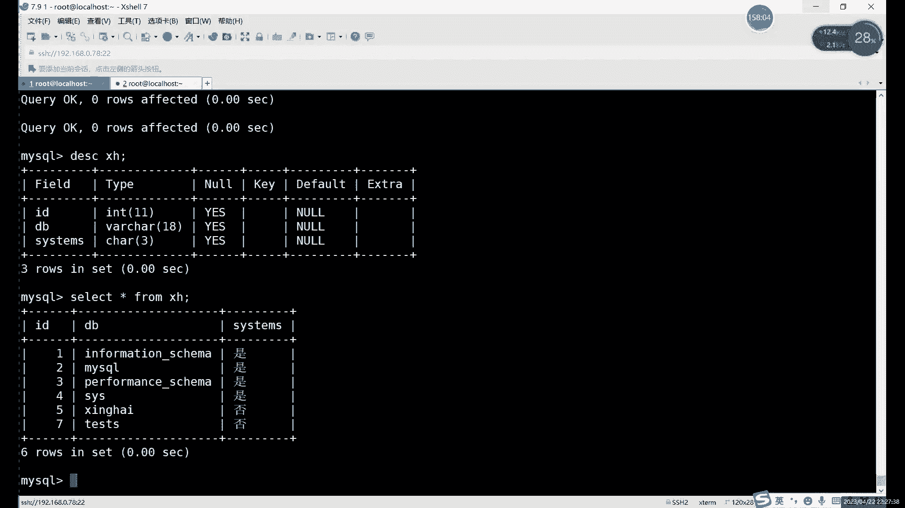

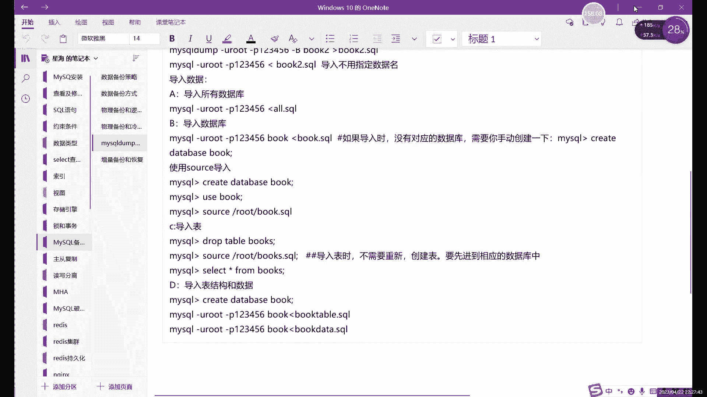

**注意事项：**
*   恢复单库备份时，必须先进入（`USE`）该数据库。
*   `source` 命令需要文件的全路径。

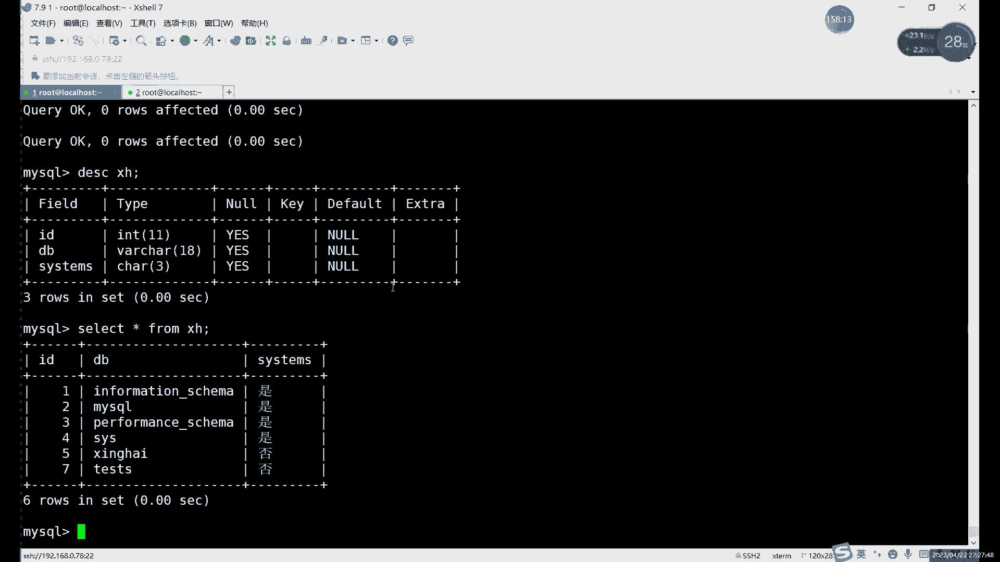


---

## 逻辑备份的特点与注意事项

本节中我们介绍了逻辑备份的完整流程，最后总结一下其关键特点：

1.  **必须热备份**：逻辑备份（`mysqldump`）和恢复（`mysql` / `source`）操作都需要连接并访问数据库，因此要求MySQL服务处于运行状态，无法进行冷备份。
2.  **备份文件可读**：生成的 `.sql` 文件是文本格式，可以直接查看和编辑（但谨慎操作，错误的修改可能导致恢复失败）。
3.  **恢复的原子性**：默认情况下，执行恢复SQL文件时，如果中间某条语句出错，整个过程会停止。因此保证备份文件的正确性很重要。
4.  **增量备份的预备知识**：标准的 `mysqldump` 进行的是全量备份。MySQL的增量备份通常需要借助二进制日志（binlog）来实现，这将是下节课的重点内容。

---

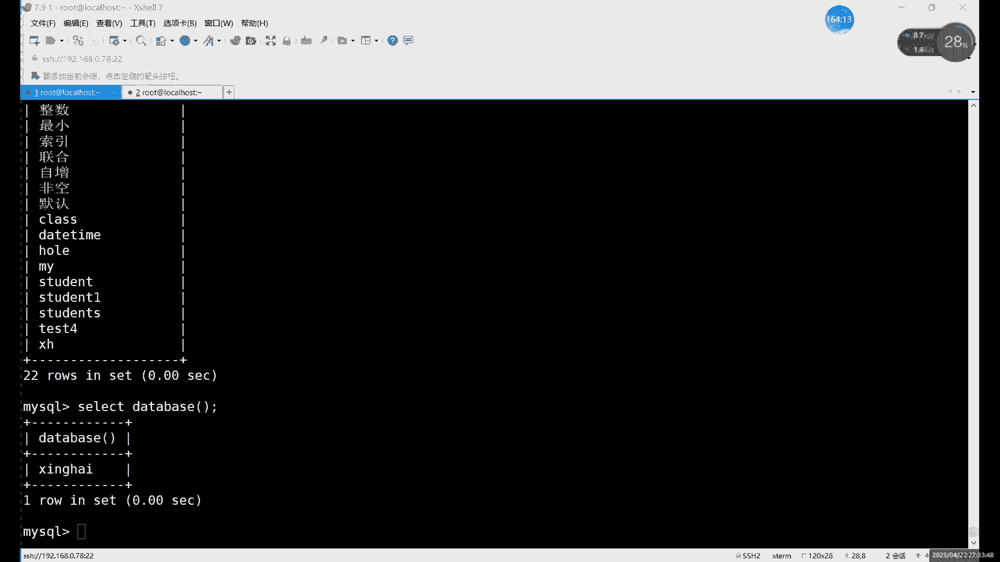


本节课中我们一起学习了MySQL逻辑备份与恢复的核心方法。我们掌握了使用 `mysqldump` 进行不同粒度备份的命令，了解了备份文件的内容构成，并实践了通过 `mysql` 和 `source` 两种方式进行数据恢复。请牢记恢复单个数据库前需确保其存在的注意事项。这些技能是数据库运维中数据安全保障的基础操作。