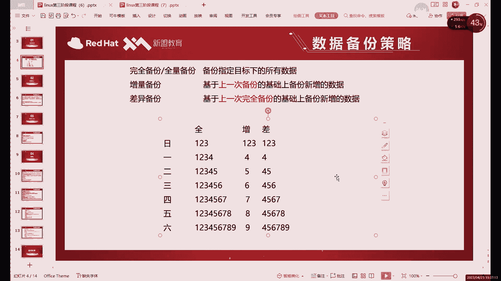
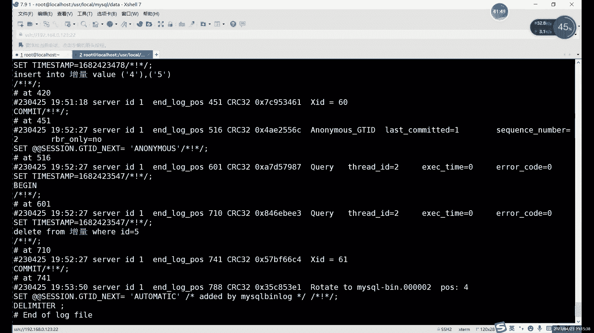
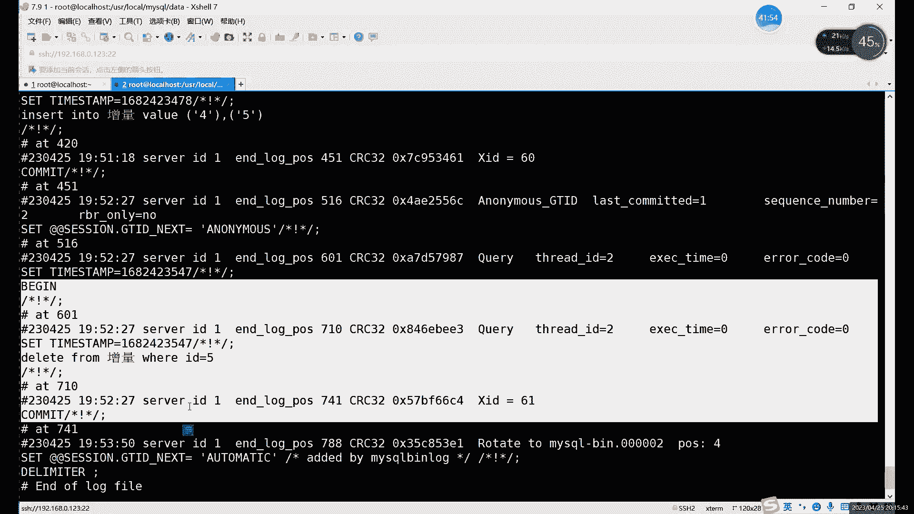
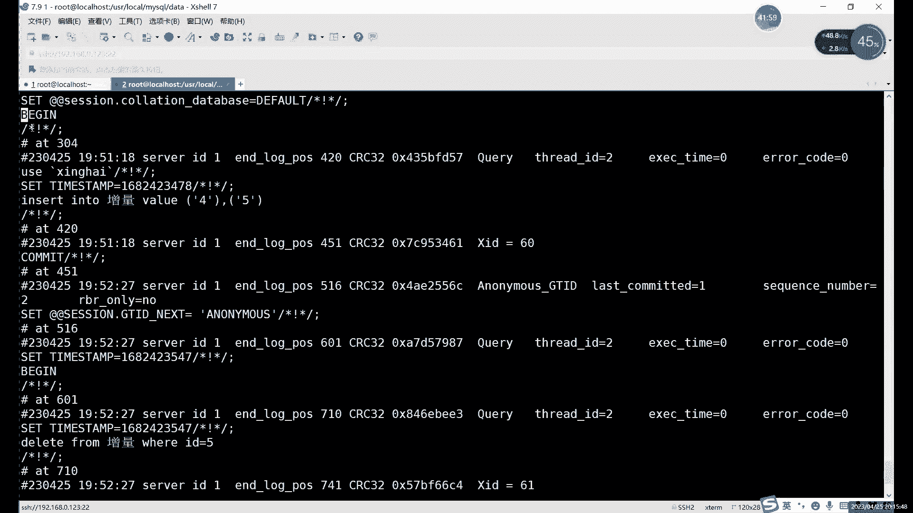
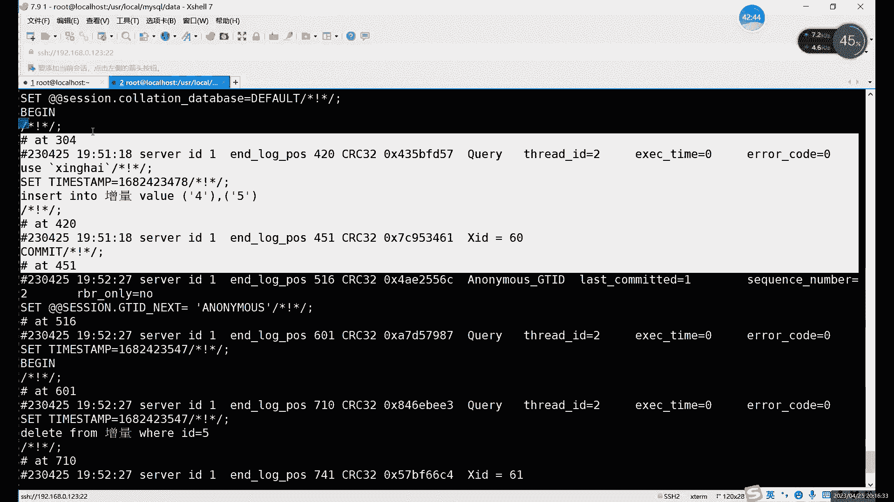
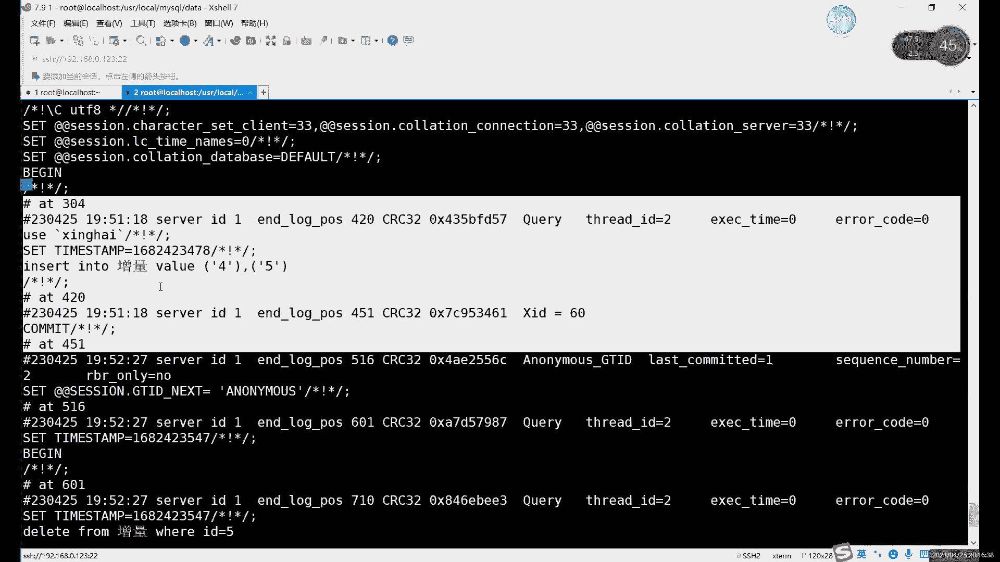
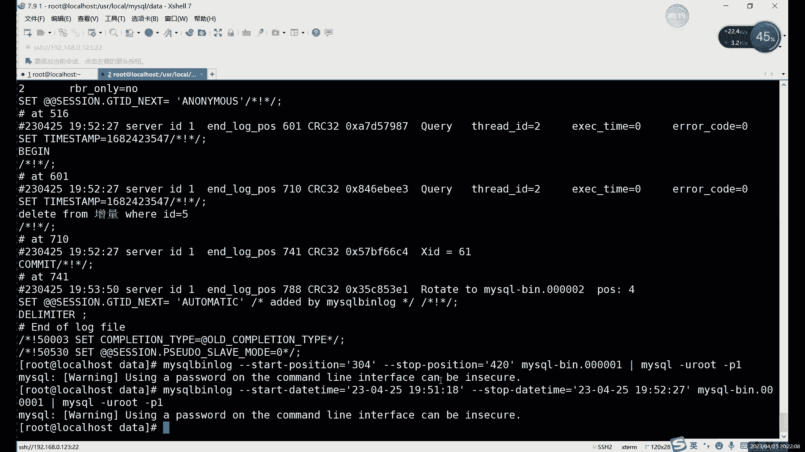

# Linux运维：P82：中级运维-19.增量备份，主从复制-上


在本节课中，我们将要学习MySQL数据库的增量备份与恢复。增量备份是一种高效的备份策略，它只备份自上次备份以来发生变化的数据，从而大大减少了备份所需的时间和存储空间。我们将从增量备份的原理讲起，并详细演示如何配置、执行增量备份以及进行数据恢复。



## 什么是增量备份？📈

上一节我们介绍了全量备份和逻辑备份，本节中我们来看看增量备份。增量备份指的是只备份自上次备份（无论是全量还是增量）以来发生变化的数据。与全量备份相比，它的备份数据量最小。

**核心公式**：`增量备份数据 = 上次备份后新增/修改/删除的数据`

随着时间推移，如果每天进行全量备份，备份数据会越来越多，占用大量存储空间。而增量备份每次只处理变化的部分，效率更高。通常，我们会先进行一次全量备份作为基准，之后定期进行增量备份。

## 增量备份的实现原理：二进制日志

MySQL本身没有直接的增量备份工具。实现增量备份的关键在于**二进制日志**。二进制日志会记录所有对数据库数据进行修改的操作（如`INSERT`、`UPDATE`、`DELETE`），但不记录查询操作（如`SELECT`）。

因此，增量备份本质上就是备份和利用这些二进制日志文件。恢复时，先恢复全量备份，再按顺序“重放”二进制日志中的操作，即可将数据库恢复到特定时间点。

以下是启用二进制日志的配置示例（在`my.cnf`中）：
```ini
[mysqld]
log-bin=mysql-bin  # 启用二进制日志，日志文件将以mysql-bin为前缀
```

## 实战：执行增量备份与恢复

接下来，我们通过一个简单的例子，演示增量备份的完整流程。

### 第一步：准备工作与环境清理

首先，确保二进制日志已开启。为了方便演示，我们可以清理旧的日志并从一个干净的日志开始。

1.  进入MySQL命令行，执行以下命令清空所有现有二进制日志并新建一个：
    ```sql
    RESET MASTER;
    ```
2.  创建一个用于演示的简单表格并插入初始数据：
    ```sql
    CREATE TABLE 增量 (id INT);
    INSERT INTO 增量 VALUES (1), (2), (3);
    ```

### 第二步：进行首次全量备份

在进行任何增量备份之前，必须先有一个全量备份作为基础。我们使用`mysqldump`命令备份这个表格。

```bash
mysqldump -u root -p 数据库名 增量 > 增量_全量备份.sql
```

### 第三步：模拟数据变化并备份二进制日志

全量备份后，我们对数据进行一些修改。

1.  插入新数据并删除一条数据：
    ```sql
    INSERT INTO 增量 VALUES (4), (5);
    DELETE FROM 增量 WHERE id = 5;
    ```
2.  此时，这些操作已被记录到当前的二进制日志文件（例如`mysql-bin.000001`）中。执行以下命令“刷新”日志，将当前日志归档，并开始使用新的日志文件：
    ```sql
    FLUSH LOGS;
    ```
3.  现在，`mysql-bin.000001`文件包含了我们刚才的所有修改操作。这个文件就是我们的**增量备份文件**。我们可以将其复制到安全的位置：
    ```bash
    cp /var/lib/mysql/mysql-bin.000001 /备份路径/增量备份_1.binlog
    ```

### 第四步：模拟故障并恢复数据

现在，假设表格被意外删除，我们需要进行恢复。

1.  **（可选但推荐）关闭二进制日志**：在恢复期间，为了避免恢复操作本身被记录到新日志中，造成日志膨胀，可以先临时关闭二进制日志。
    ```sql
    SET sql_log_bin = 0; -- 在MySQL命令行中临时关闭
    ```
2.  **恢复全量备份**：
    ```bash
    mysql -u root -p 数据库名 < 增量_全量备份.sql
    ```
    或者进入MySQL命令行使用：
    ```sql
    SOURCE 增量_全量备份.sql;
    ```
    此时，表格恢复到只有数据1、2、3的状态。
3.  **恢复增量备份**：我们需要将二进制日志文件“翻译”成SQL语句并执行。使用`mysqlbinlog`工具。
    ```bash
    mysqlbinlog /备份路径/增量备份_1.binlog | mysql -u root -p
    ```
4.  恢复完成后，可以重新开启二进制日志：
    ```sql
    SET sql_log_bin = 1;
    ```
5.  检查数据，可以发现数据1、2、3、4已全部恢复，而数据5的删除操作也已被执行。

## 高级技巧：选择性恢复

有时我们可能只需要恢复二进制日志中的部分操作，而不是整个文件。这可以通过指定位置或时间点来实现。







首先，查看二进制日志内容以确定位置：
```bash
mysqlbinlog --base64-output=DECODE-ROWS -v /备份路径/增量备份_1.binlog
```
在输出中，找到`# at 304`和`# at 420`这样的位置标记，以及`end_log_pos`和对应的时间戳。





-   **按位置恢复**（更精确）：
    ```bash
    mysqlbinlog --start-position=304 --stop-position=420 /备份路径/增量备份_1.binlog | mysql -u root -p
    ```
-   **按时间恢复**：
    ```bash
    mysqlbinlog --start-datetime="2023-10-27 10:18:00" --stop-datetime="2023-10-27 10:18:27" /备份路径/增量备份_1.binlog | mysql -u root -p
    ```

## 总结

本节课中我们一起学习了MySQL增量备份的核心知识。我们了解到增量备份通过**二进制日志**实现，它只备份变化的数据，非常高效。关键步骤包括：**启用二进制日志** -> **进行首次全量备份** -> **定期备份二进制日志文件**。恢复时，遵循**先全量，后增量**的顺序，并可以按需进行**选择性恢复**。



记住，在恢复操作前**临时关闭二进制日志**是一个好习惯，可以避免日志文件不必要的增长。增量备份是构建可靠数据库备份策略的重要组成部分，也为下一节要学习的“主从复制”打下了坚实的基础。