# Linux运维全套培训课程：P83：中级运维-20.增量备份，主从复制-中 🔧

在本节课中，我们将深入学习MySQL增量备份的恢复方法，并开始探讨MySQL主从复制的核心原理与配置前提。我们将通过具体的命令和步骤，帮助你理解如何精确恢复数据，以及如何为搭建主从同步环境做好准备。

## 增量备份的恢复方法 📂

上一节我们介绍了如何进行增量备份。本节中，我们来看看如何从二进制日志中恢复数据。恢复的核心命令是 `mysqlbinlog`，它允许我们根据时间点或日志文件中的位置来执行恢复。


### 基于时间点的恢复

使用 `--start-datetime` 和 `--stop-datetime` 参数可以指定恢复某个时间段内执行过的SQL命令。

```bash
mysqlbinlog --start-datetime="2023-10-27 10:00:00" --stop-datetime="2023-10-27 11:00:00" mysql-bin.000002 | mysql -u root -p
```

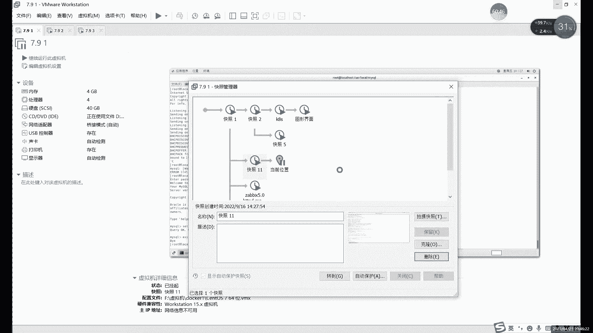

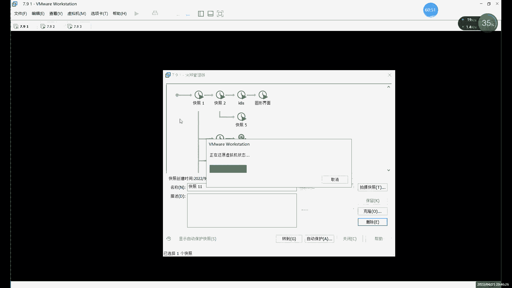

执行上述命令后，数据库会恢复在指定时间段内记录在日志 `mysql-bin.000002` 中的所有操作。

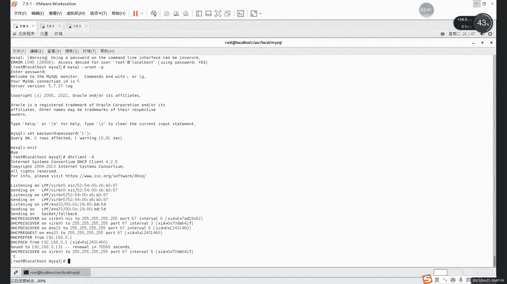

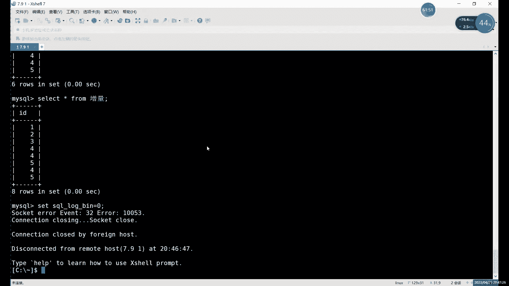

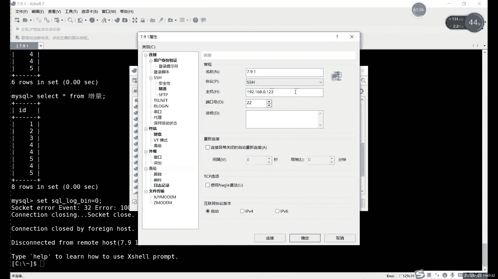

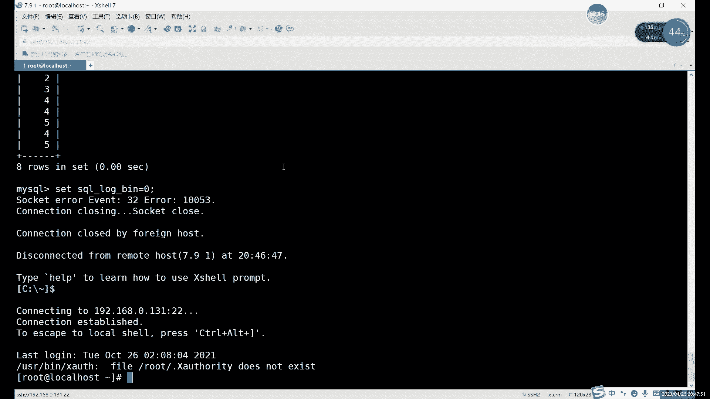

### 基于位置的恢复（更精确）

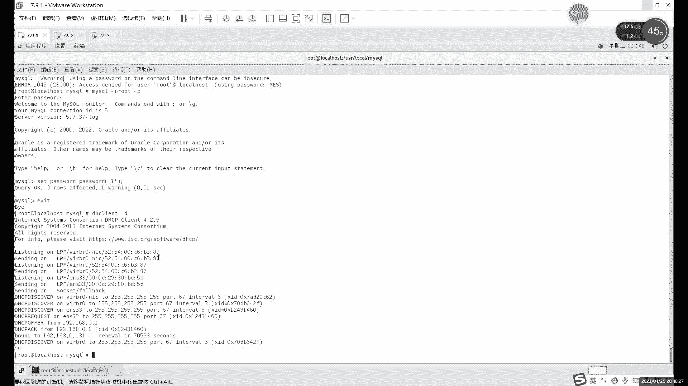

时间点恢复可能不精确，特别是当一秒内执行了多条命令时。更可靠的方法是使用 `--start-position` 和 `--stop-position` 参数，通过日志文件中的具体位置来恢复。

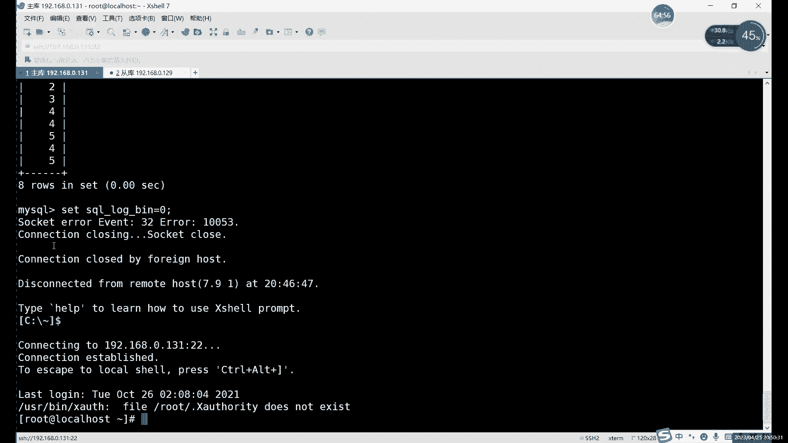

```bash
mysqlbinlog --start-position=4 --stop-position=900 mysql-bin.000002 | mysql -u root -p
```

以下是关于位置参数使用的几点说明：
*   **可以只写一个参数**：如果只写 `--start-position`，则恢复从该位置到日志文件结束的所有操作。如果只写 `--stop-position`，则恢复从日志开始到该位置的所有操作。
*   **多个日志文件需按顺序恢复**：如果你有多个二进制日志文件需要恢复，必须按照日志生成的先后顺序依次执行恢复命令。
*   **恢复后务必重新开启日志记录**：数据恢复完成后，记得执行 `SET SQL_LOG_BIN=1;` 重新开启二进制日志记录，否则后续的数据库操作将不会被记录。

### 增量备份恢复策略

在实际运维中，恢复策略取决于故障类型：
*   **服务器故障或数据大量丢失**：应先恢复最近的全量备份，然后按照时间顺序，逐个恢复全量备份之后的所有增量备份。
*   **误操作少量数据**：可以不用复杂的恢复流程。直接分析二进制日志，找到误操作前的正确数据所对应的SQL命令，复制出来手动执行即可。

### 备份周期建议

不建议长期只做增量备份。通常的运维策略是每周或每两周做一次全量备份，期间每天做增量备份。这样一旦需要恢复，最多只需要处理几个增量备份文件，效率更高，风险更低。

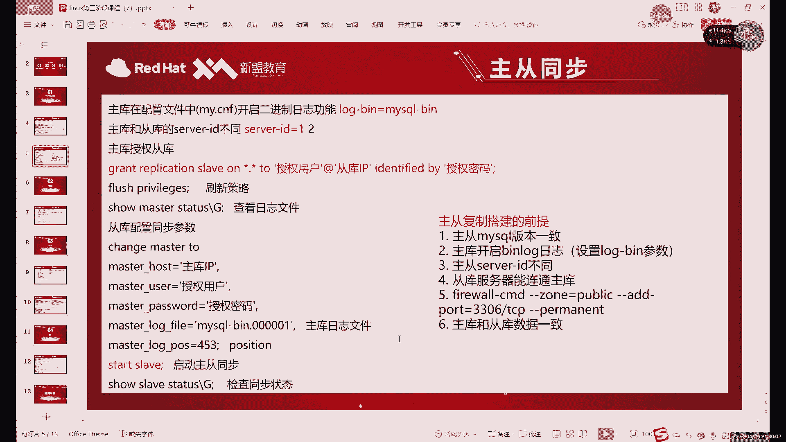

---

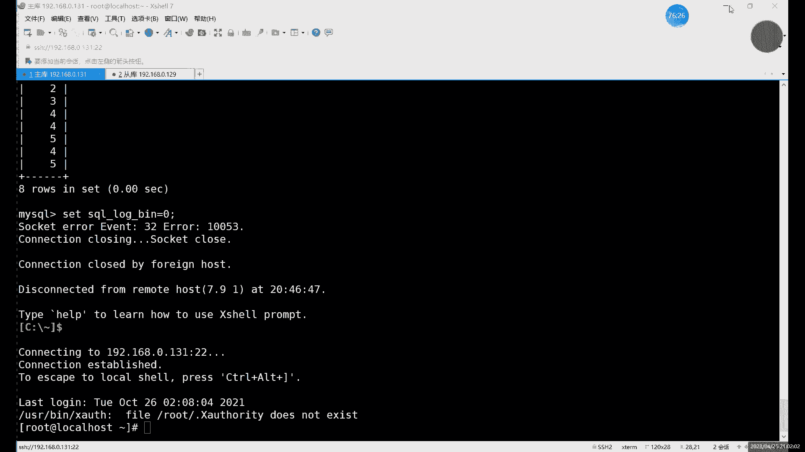

## MySQL主从复制原理与前提 🧩

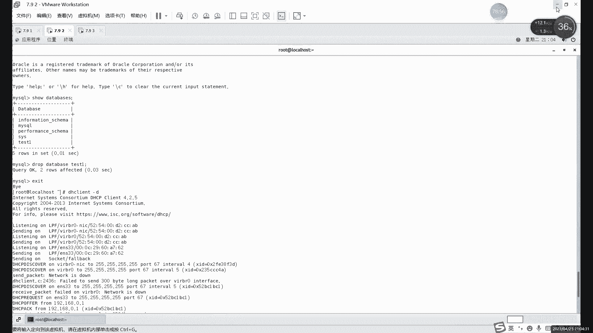

接下来，我们将开始学习MySQL主从复制。主从复制是提高数据库可用性和读写分离能力的关键技术。在动手配置之前，理解其原理和满足所有前提条件至关重要。

### 主从复制核心原理

一句话概括：**MySQL主从复制基于二进制日志（Binary Log）实现**。

详细过程可以分为三步：
1.  **主库（Master）记录日志**：主库将自己执行的每一条“写”操作（增、删、改）记录到其二进制日志文件中。
2.  **从库（Slave）获取日志**：从库通过一个特殊的I/O线程连接到主库，读取主库的二进制日志内容，并将其写入到自己的中继日志（Relay Log）中。
3.  **从库执行日志**：从库的另一个SQL线程读取中继日志中的事件，并在本地数据库执行这些SQL命令，从而使从库的数据与主库保持一致。

这个过程的核心组件是 **Replication**（复制）机制。

### 配置主从复制的前提条件

成功配置主从复制，必须满足以下六个条件，任何一项不满足都可能导致失败：

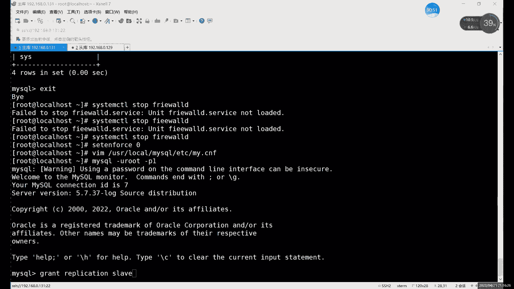

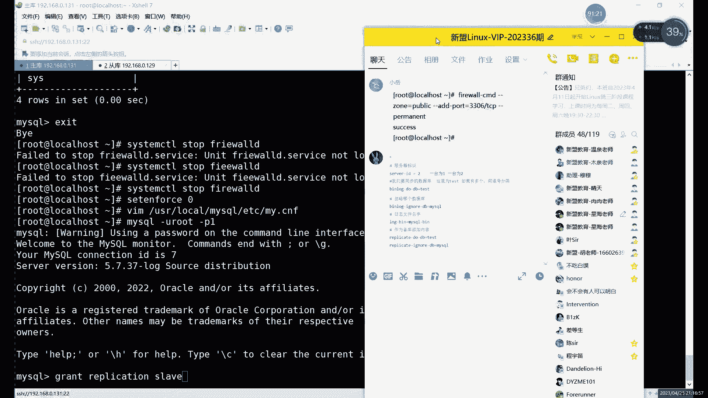

1.  **MySQL版本一致**：主库和从库的MySQL大版本号必须相同。
2.  **初始数据一致**：在开启主从复制前，主库和从库的数据（特别是业务数据库）必须保持一致。这是最常见的失败原因。
3.  **主库开启二进制日志**：主库必须启用二进制日志功能，从库可以不开启。
4.  **配置唯一的Server ID**：主从库配置文件中的 `server-id` 值必须不同，且在同一集群内唯一。
5.  **配置主库访问授权**：主库需要创建一个用户，并授予从库 `REPLICATION SLAVE` 权限，允许从库连接并读取日志。
6.  **确保网络连通**：从库需要能通过网络连接到主库的3306端口。需检查防火墙设置，要么关闭防火墙，要么放行3306端口。

### 准备工作演示

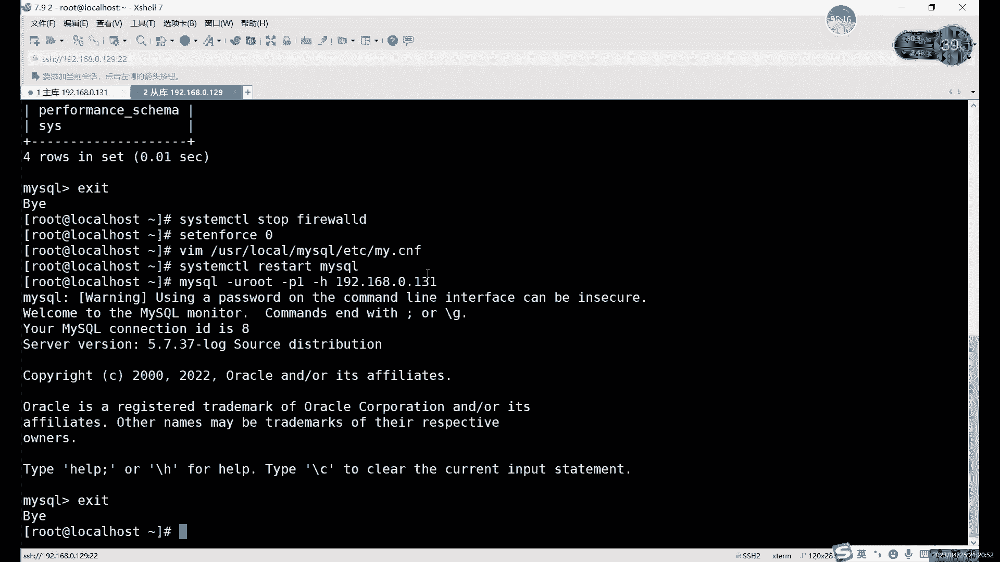

我们将以两台服务器为例（IP: 192.168.0.131 作为主库，192.168.0.129 作为从库）进行准备工作。

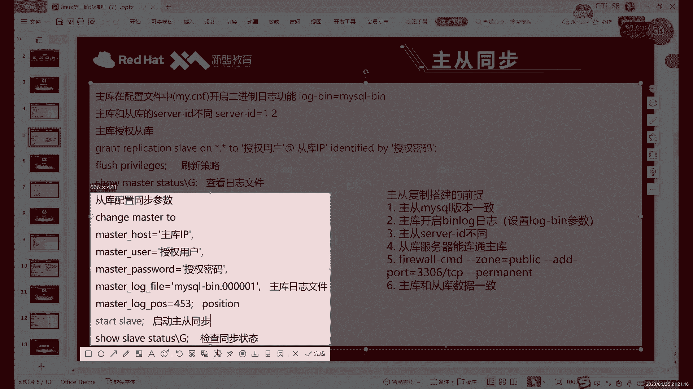

**1. 确保数据一致**
本例中，我们通过恢复虚拟机快照，使两台服务器都回到刚安装好MySQL的初始状态。

**2. 配置Server ID**
编辑主库和从库的MySQL配置文件（如 `/etc/my.cnf`），确保 `server-id` 不同，并重启MySQL服务。
```ini
# 主库配置
server-id=131
# 从库配置
server-id=129
```

**3. 主库授权**
在主库上执行授权命令，创建一个用于复制的用户。
```sql
GRANT REPLICATION SLAVE ON *.* TO 'repl_user'@'192.168.0.129' IDENTIFIED BY 'YourPassword123!';
FLUSH PRIVILEGES;
```
可以使用 `ALL PRIVILEGES` 代替 `REPLICATION SLAVE`，但前者权限过大。

**4. 检查并记录主库状态**
在主库上执行以下命令，记录返回的 `File` 和 `Position` 值，后续在从库配置时会用到。
```sql
SHOW MASTER STATUS;
```
返回结果示例：
```
+------------------+----------+--------------+------------------+-------------------+
| File             | Position | Binlog_Do_DB | Binlog_Ignore_DB | Executed_Gtid_Set |
+------------------+----------+--------------+------------------+-------------------+
| mysql-bin.000002 |      693 |              |                  |                   |
+------------------+----------+--------------+------------------+-------------------+
```

**5. 从库连接主库测试**
在从库上使用刚创建的用户尝试连接主库，验证网络和授权是否成功。
```bash
mysql -h 192.168.0.131 -u repl_user -p
```

---

## 总结 📝

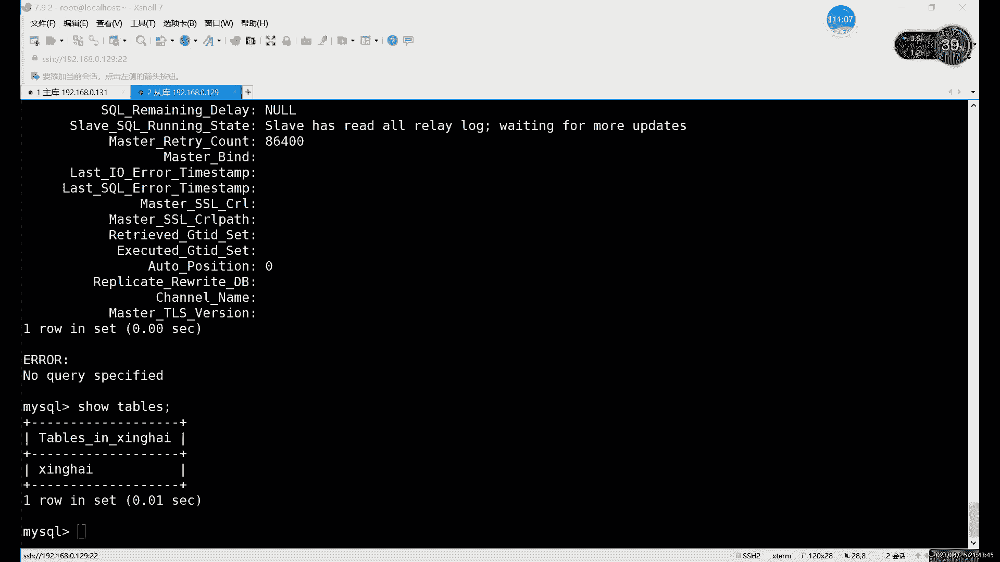

本节课中我们一起学习了两个重要部分：
1.  **增量备份的恢复**：掌握了使用 `mysqlbinlog` 工具基于时间和位置进行数据恢复的方法，了解了不同场景下的恢复策略和备份周期规划。
2.  **主从复制入门**：深入理解了MySQL主从复制的三步核心原理，并详细列出了配置前必须满足的六个前提条件，为下一节实际搭建主从复制环境打下了坚实的理论基础。

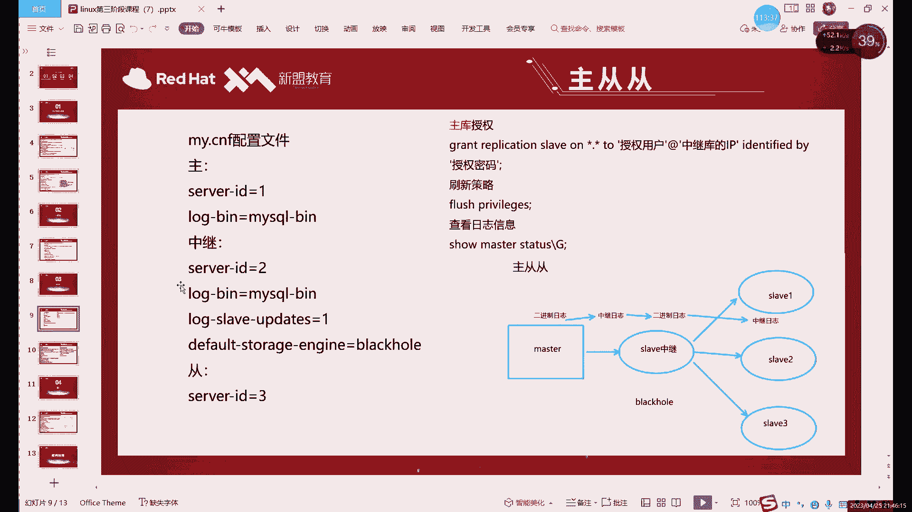

记住，主从复制的关键在于**二进制日志**和**主从库数据的一致性**。确保前提条件全部满足，是成功配置的第一步。下节课，我们将基于这些前提，完成主从复制的具体配置和验证。