# Linux运维全套培训课程：P84：中级运维-21. 增量备份，主从复制-下 🚀

在本节课中，我们将深入探讨MySQL主从复制架构的优化方案，特别是针对“一主多从”场景下主库压力过大的问题。我们将学习如何通过引入“中继库”并使用“黑洞”存储引擎来有效分担主库的读写负载，确保整个复制架构的稳定性和性能。

上一节我们介绍了主从复制的基本原理和配置方法，本节中我们来看看如何优化“一主多从”架构。

## 一主多从架构的压力问题与解决方案 🔄

在标准的“一主多从”架构中，所有从库都直接连接主库。当主库每次提交数据修改时，都需要向每一个从库发送同步消息。从库越多，主库需要建立的同步进程就越多，网络I/O和资源消耗就越大。这会导致主库的读写压力剧增，从而增加服务器宕机的风险。

服务器宕机最常见的原因之一就是硬件资源（如CPU、内存、硬盘I/O）使用率过高。因此，我们的核心优化思路是：**不让主库的压力太大**。

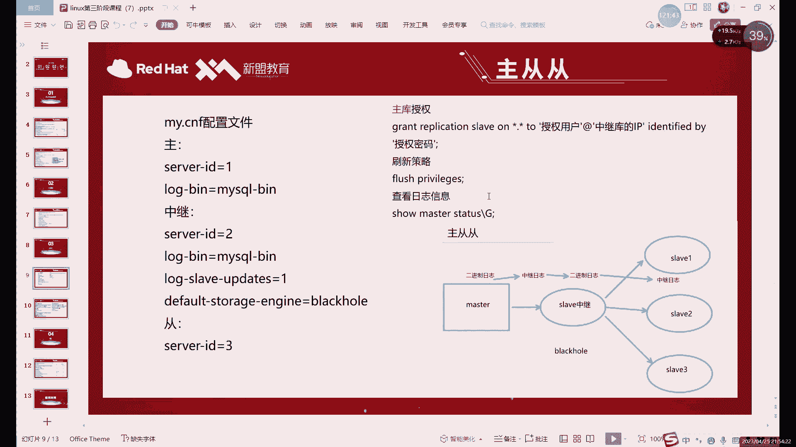

为了解决这个问题，我们可以在主库和多个从库之间引入一个“中继库”。它的作用就像一个数据中转站或接力棒。

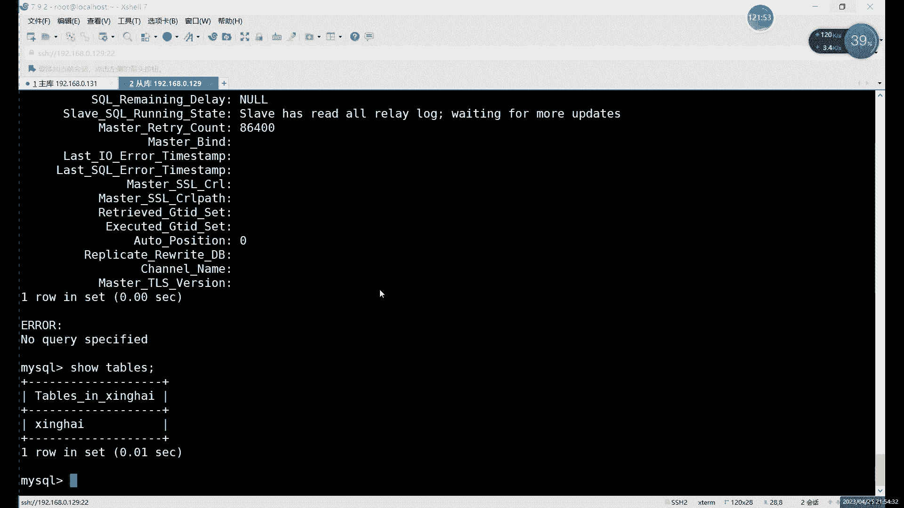

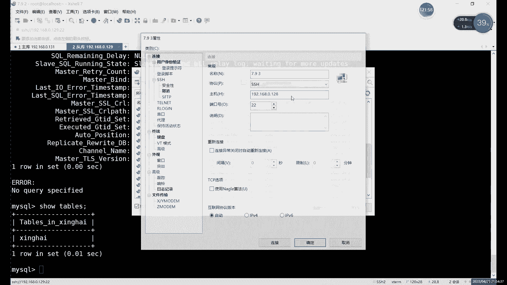

*   **优化前**：`主库` -> `从库1`， `主库` -> `从库2`， `主库` -> `从库3`
*   **优化后**：`主库` -> `中继库` -> `从库1`， `中继库` -> `从库2`， `中继库` -> `从库3`

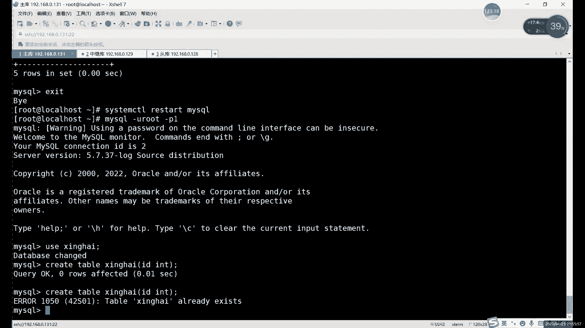

对于主库而言，它只需要面对一个“从库”（即中继库），读写压力大大减轻。中继库则负责将数据分发给后端的多个从库。

## 中继库的核心：黑洞存储引擎 ⚫

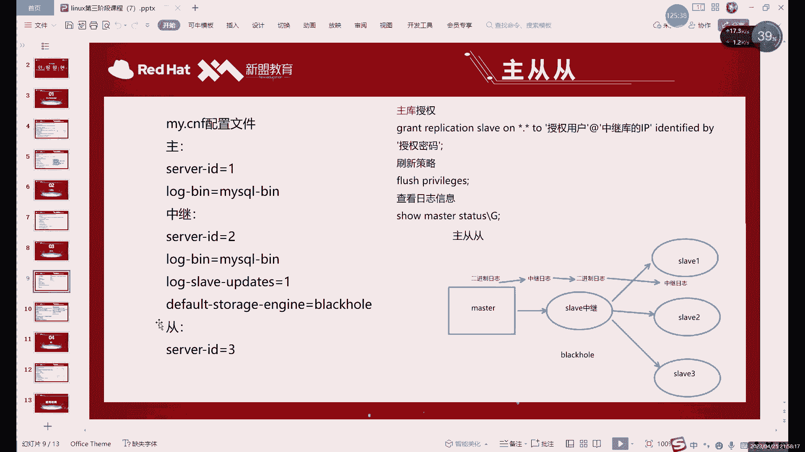

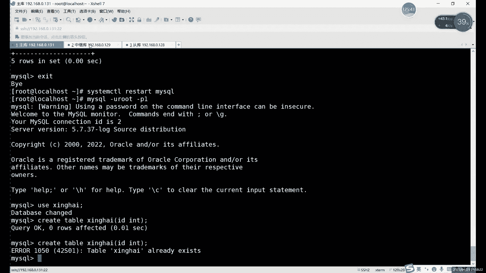

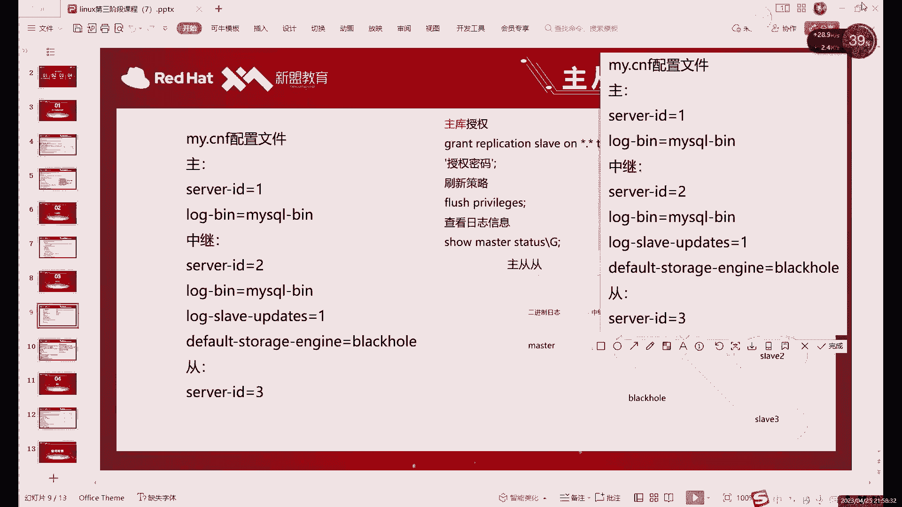

中继库承担了数据分发的任务，但它本身不应该成为新的性能瓶颈。如果我们把中继库也配置成一个普通的、存储数据的数据库，那么它同样会面临“一主多从”的压力问题。

因此，中继库的关键在于使用 **`BLACKHOLE`（黑洞）** 存储引擎。

以下是黑洞引擎的特点：
*   **不存储任何数据**：任何写入黑洞引擎表的数据都会被丢弃，不会写入磁盘。
*   **会记录二进制日志**：虽然数据不存储，但执行过的SQL命令会正常记录到二进制日志中。
*   **作用**：当中继库使用黑洞引擎时，它只负责接收主库的二进制日志，并原样转发给自己的二进制日志，自身不进行实际的数据写入操作。这极大地减少了磁盘I/O和CPU开销，使中继库能够高效、低负载地工作。

**代码示例：创建黑洞引擎表**
```sql
CREATE TABLE relay_table (id INT) ENGINE = BLACKHOLE;
```

**重要原则**：配置为主从结构的从库端（包括这里的中继库），**绝对不要**直接写入数据。因为从库写入的数据不会被同步到主库，反而可能被同步到下游的其他从库，导致严重的数据不一致。

## 配置带中继库的主从复制架构 ⚙️

接下来，我们具体讲解如何配置“主 -> 中继 -> 从”的架构。你需要准备三台服务器：主库、中继库、从库。

### 1. 修改配置文件

首先，我们需要修改MySQL的配置文件（通常是`/etc/my.cnf`或`/etc/mysql/my.cnf`），并重启服务。

以下是各节点需要修改的核心参数：

**主库配置**
只需确保开启二进制日志，并设置唯一的`server-id`。
```ini
[mysqld]
server-id = 1
log-bin = mysql-bin
```

**中继库配置**
这是配置的关键，需要启用多项功能。
```ini
[mysqld]
server-id = 2
log-bin = mysql-bin                # 必须开启二进制日志，供下游从库读取
log-slave-updates = ON             # 允许将从主库接收的更新写入自己的二进制日志
relay-log = relay-log-bin          # 定义中继日志的名称
default-storage-engine = BLACKHOLE # 将默认存储引擎设置为黑洞
```
*   `log-slave-updates`：这个参数至关重要，它允许中继库将从中继日志中重放的事件记录到自己的二进制日志中，从而实现数据的接力传递。

**从库配置**
只需设置一个唯一的`server-id`，确保不与主库、中继库冲突。
```ini
[mysqld]
server-id = 3
```

修改完成后，重启三台服务器的MySQL服务。

### 2. 建立主库到中继库的复制

这一步和配置普通主从复制完全一致。
1.  在主库上创建用于复制的用户并授权。
2.  在中继库上，使用`CHANGE MASTER TO`命令指向主库，指定主库的IP、端口、用户、密码、二进制日志文件名和位置。
3.  在中继库上启动复制进程（`START SLAVE`），并使用`SHOW SLAVE STATUS\G`检查`Slave_IO_Running`和`Slave_SQL_Running`是否为`Yes`。

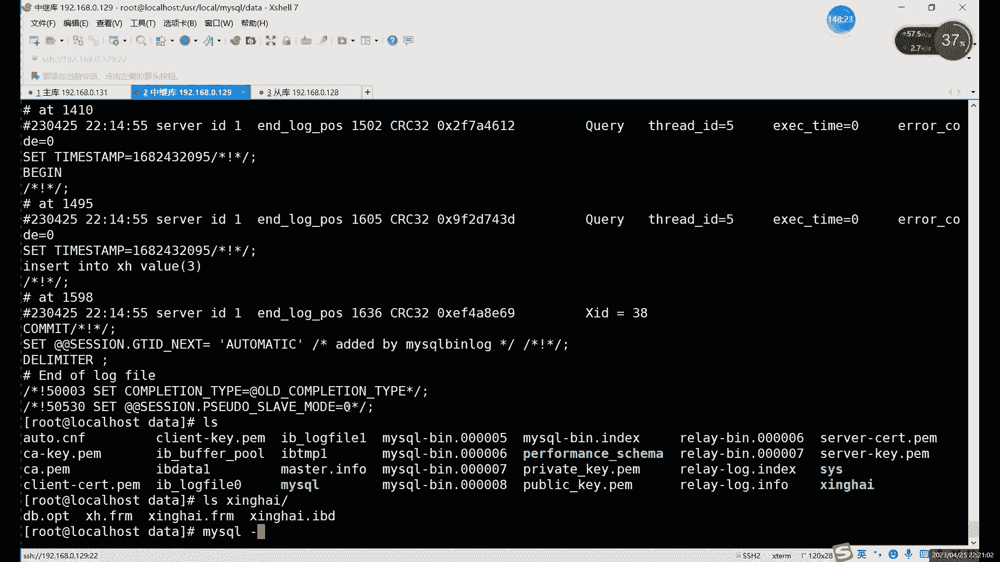

### 3. 建立中继库到从库的复制

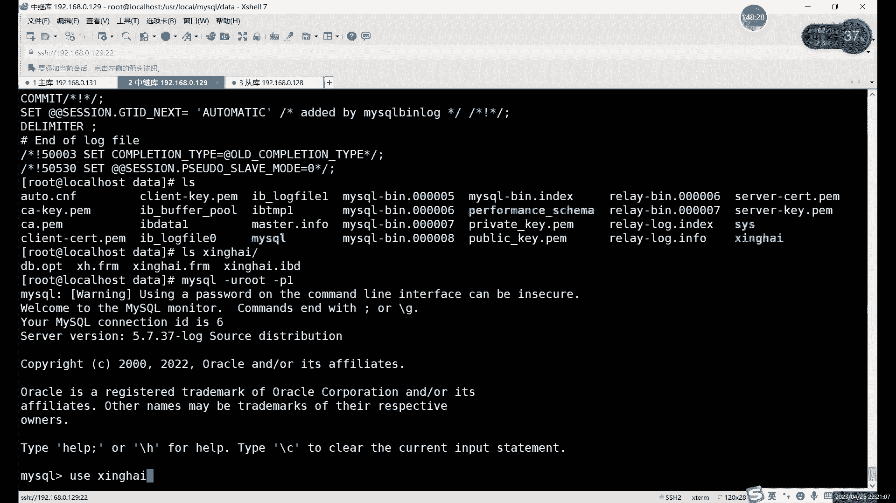

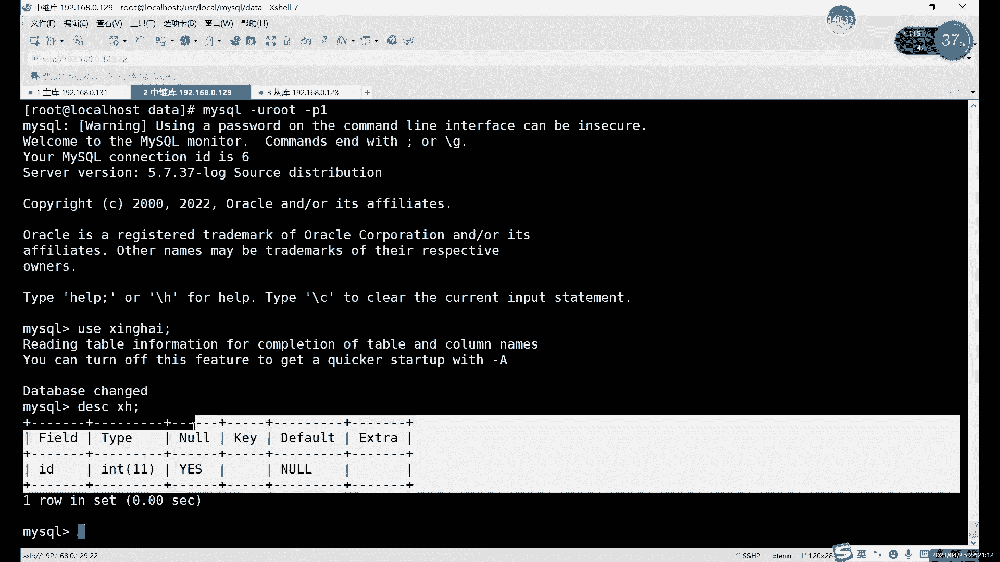

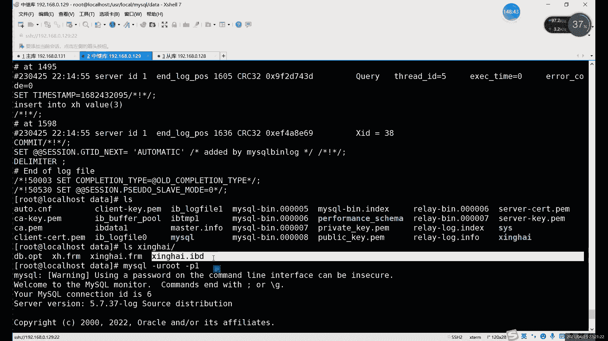

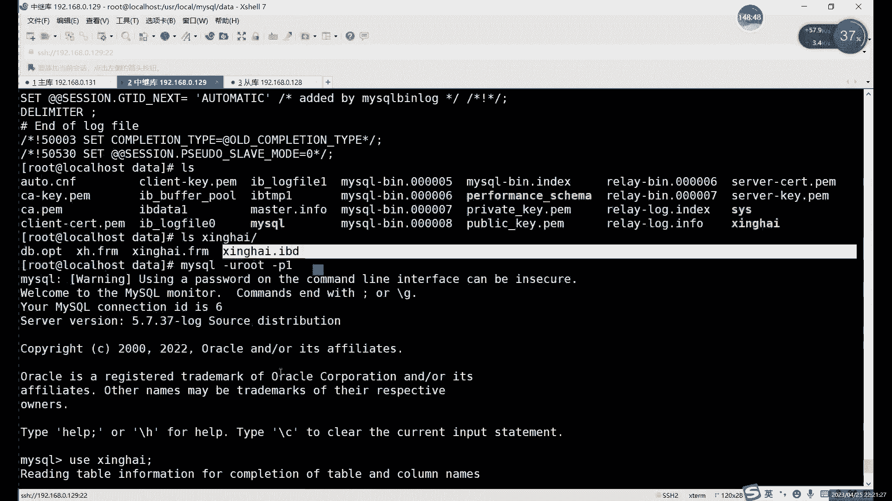

现在，我们将从库配置为中继库的从库。
1.  **在中继库上授权**：为中继库创建一个复制用户，允许从库来连接并同步数据。可以使用简化命令：
    ```sql
    GRANT ALL PRIVILEGES ON *.* TO 'repl'@'%' IDENTIFIED BY 'password' WITH GRANT OPTION;
    FLUSH PRIVILEGES;
    ```
    （生产环境建议指定具体IP并只授予`REPLICATION SLAVE`权限）。
2.  **在从库上配置主从**：
    *   查看中继库当前的二进制日志状态：`SHOW MASTER STATUS;`
    *   记录下`File`（如`mysql-bin.000008`）和`Position`（如`1215`）。
    *   在从库上执行`CHANGE MASTER TO`命令，指向中继库的IP和刚才记录的日志信息。
    ```sql
    CHANGE MASTER TO
    MASTER_HOST='中继库IP',
    MASTER_USER='repl',
    MASTER_PASSWORD='password',
    MASTER_LOG_FILE='mysql-bin.000008',
    MASTER_LOG_POS=1215;
    ```
3.  **启动从库复制**：在从库上执行`START SLAVE;`，并用`SHOW SLAVE STATUS\G`检查状态。

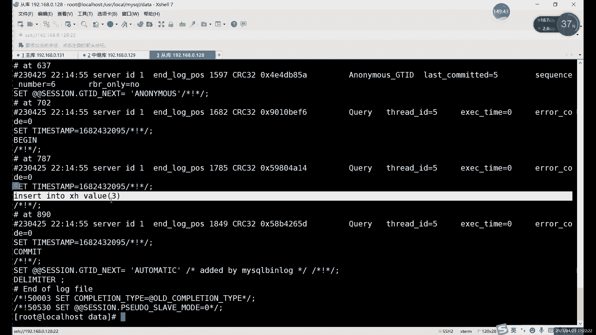

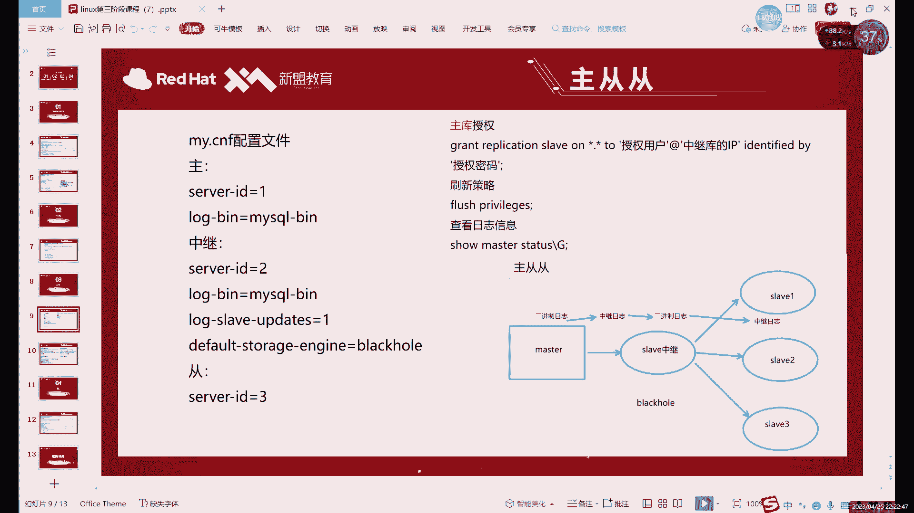

### 4. 验证与测试

配置完成后，可以进行测试：
1.  在主库的某个表中插入数据。
2.  在中继库上查询该表，由于使用了黑洞引擎，**不会有数据**，但其中继日志和二进制日志中已经记录了该操作。
3.  在从库上查询该表，**应该能看到主库插入的数据**。

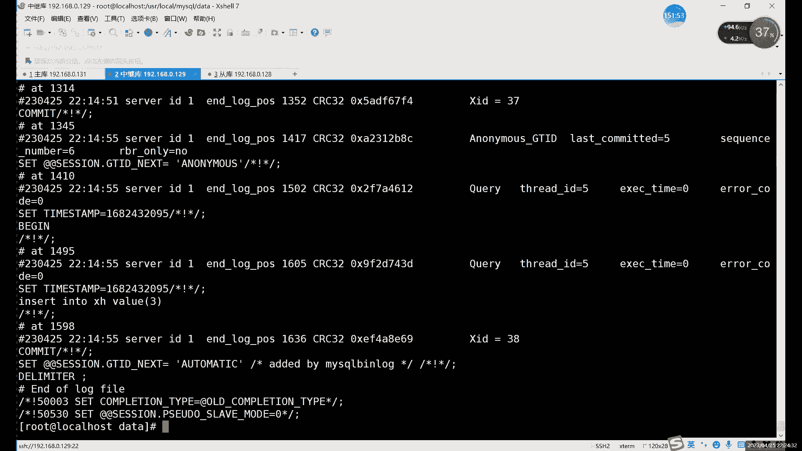

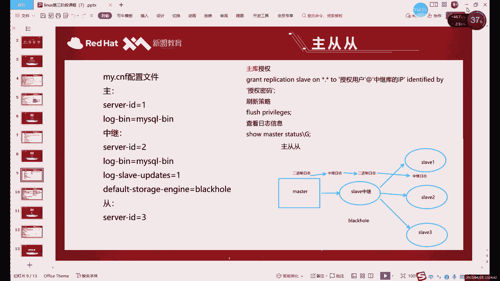

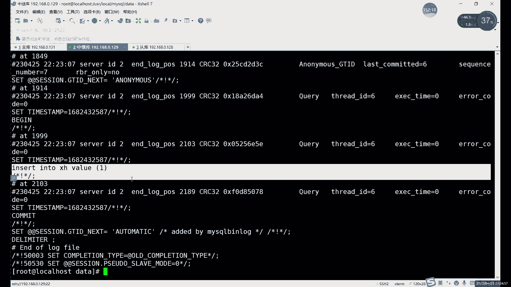

这证明了数据流是：`主库（写数据）` -> `主库二进制日志` -> `中继库中继日志` -> `中继库二进制日志` -> `从库中继日志` -> `从库应用数据`。

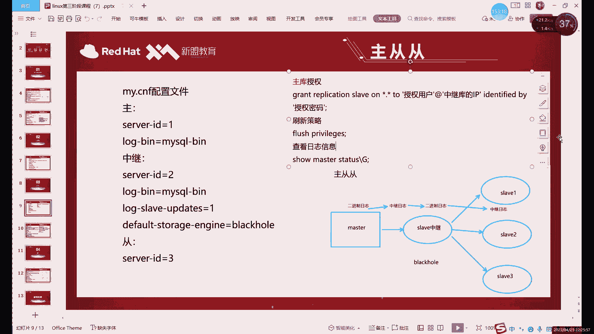

## 拓展：双主复制架构简介 🤝

除了主从复制，还有一种“双主复制”架构。即两个数据库互为主从，任何一方写入的数据都会同步到对方。

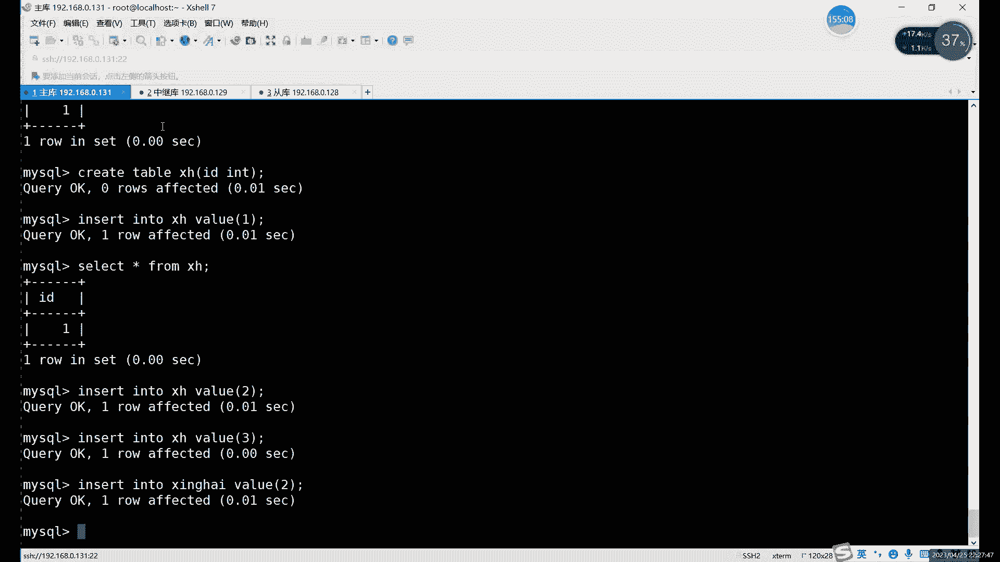

**配置思路**：其实就是将两个单向的主从复制对接起来。在A库上配置B库为它的从库，同时在B库上配置A库为它的从库。

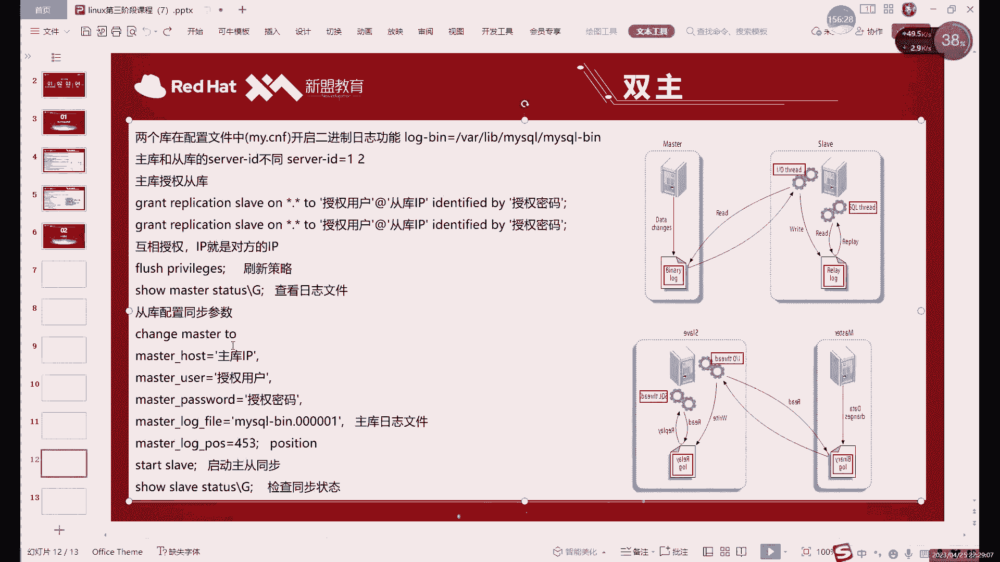

**优点**：两个节点都可以提供读写服务，理论上能提升写能力。
**缺点**：
1.  **数据冲突风险**：如果两个主节点同时修改同一行数据，可能引发冲突。
2.  **逻辑复杂**：需要应用程序精心设计，避免双写冲突。
3.  **性能压力**：双方都需要承担读写和同步的压力。

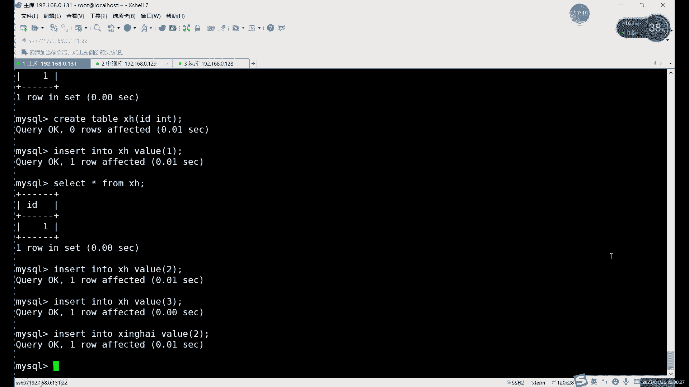

因此，在实际生产环境中，“主从复制”（配合读写分离）比“双主复制”更为常见和稳定。双主通常用于特定的高可用场景，需要更周密的规划和冲突解决机制。

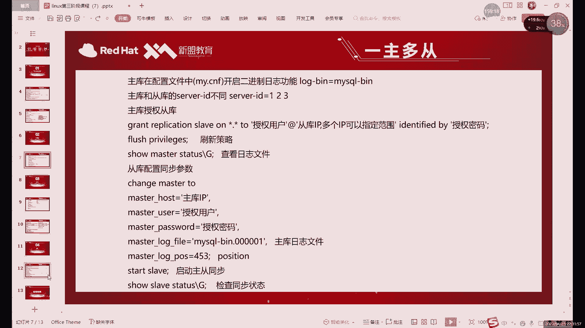

## 总结 📚

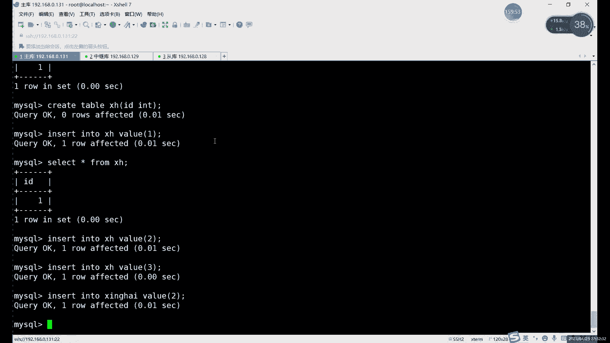

本节课中我们一起学习了MySQL主从复制的高级应用与优化。

我们首先分析了传统“一主多从”架构可能给主库带来的巨大压力。为了解决这个问题，我们引入了**中继库**的概念，并在中继库上使用了**黑洞存储引擎**。黑洞引擎不存储实际数据，只传递二进制日志，从而以极低的资源消耗承担了数据中转的任务，有效保护了主库。

我们详细演练了配置“主->中继->从”架构的完整步骤，包括各节点的配置文件修改、主从关系的建立与验证。最后，我们简要介绍了“双主复制”架构的概念、优缺点，让大家对MySQL的复制模式有了更全面的了解。

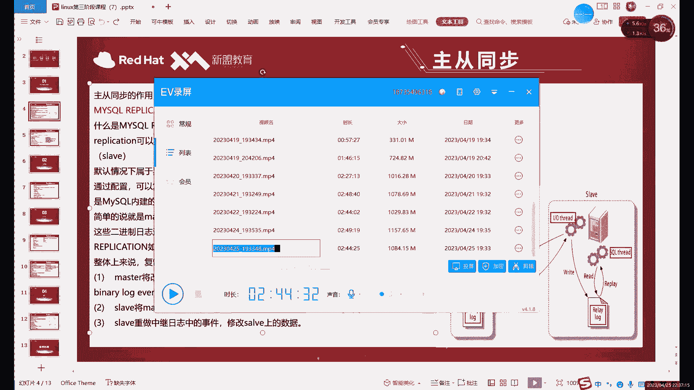

通过本课的学习，你应该能够根据业务需求，设计并搭建出更健壮、可扩展的数据库复制架构。