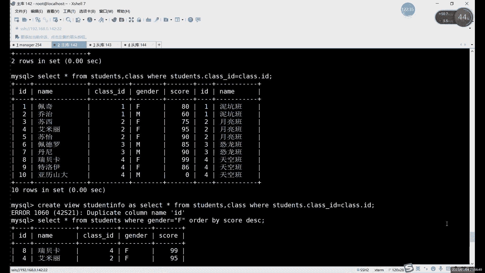
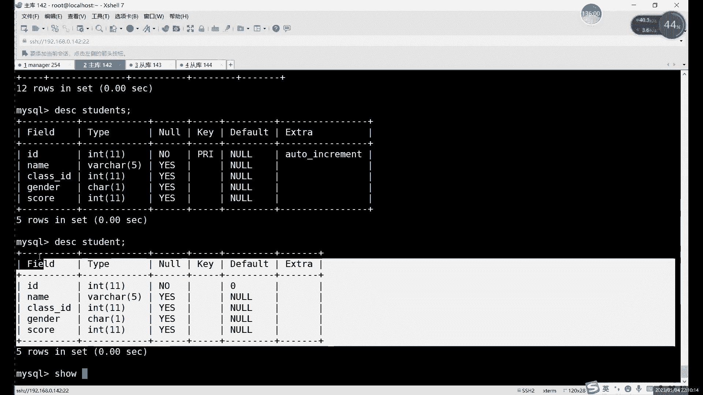
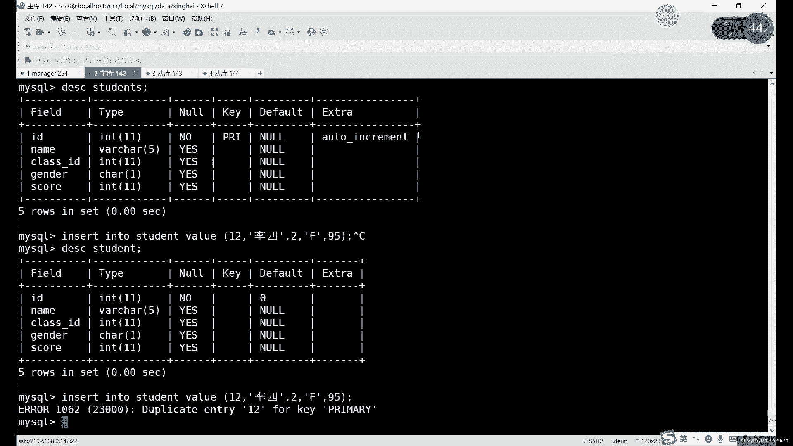
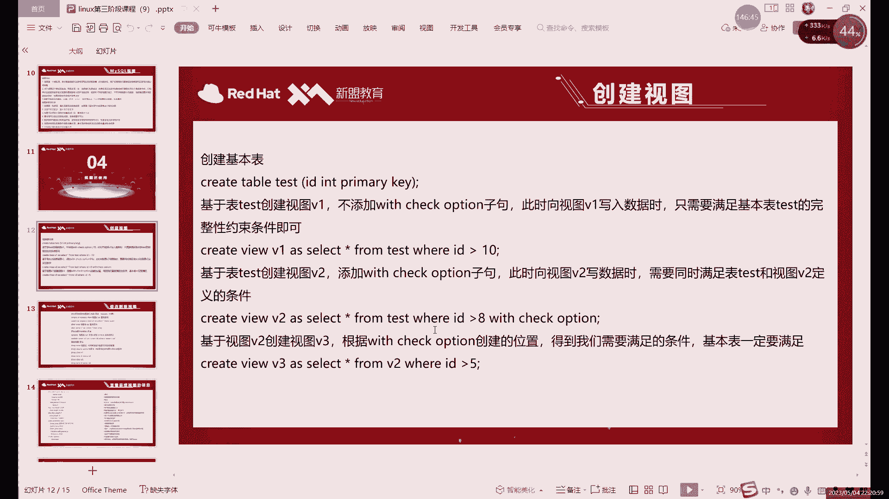
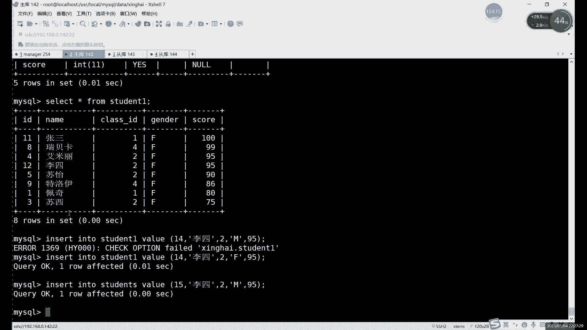
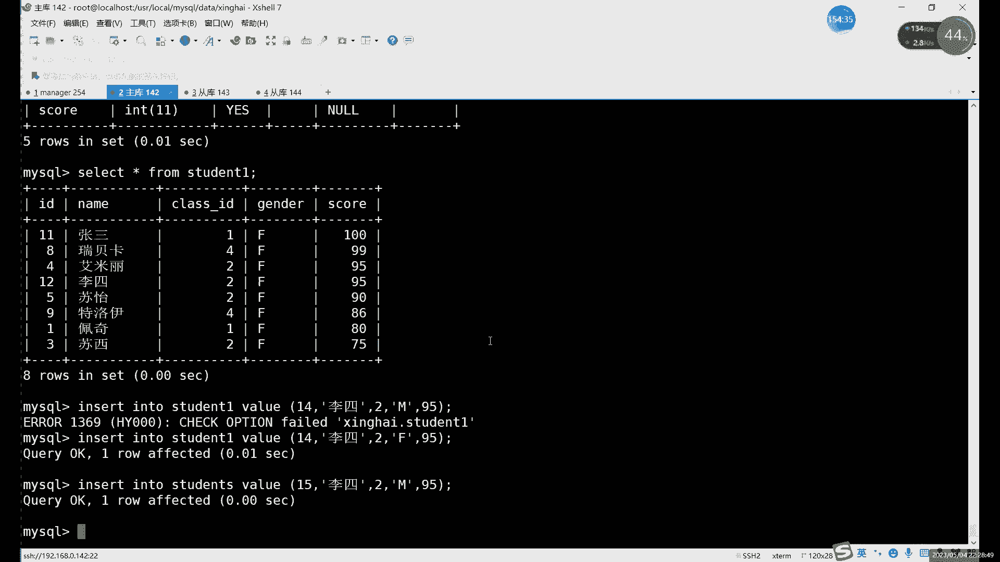
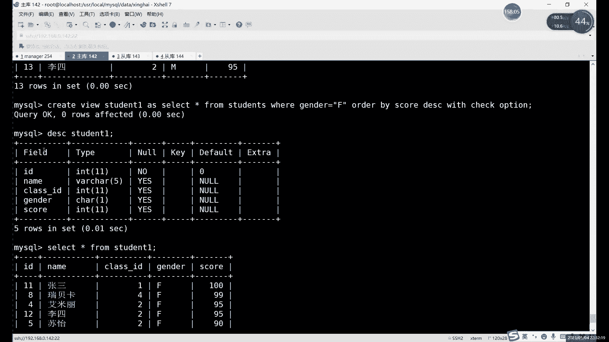
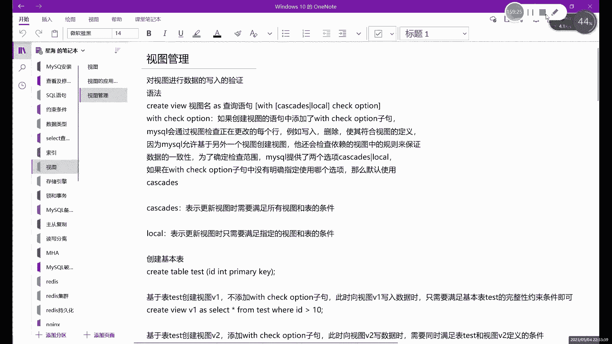

# MySQL数据库管理：第27章：视图详解（下）📚

在本节课中，我们将深入学习MySQL视图的更多高级特性和实际应用。我们将探讨视图与普通表的区别、视图的增删改查操作如何影响基础表，以及如何使用`WITH CHECK OPTION`来为视图添加数据插入约束。

---

上一节我们介绍了视图的基本概念和创建方法，本节中我们来看看视图与普通数据表的具体区别，以及如何更精细地控制视图的行为。




## 视图与表的区别🔍


视图是一张**虚拟表**，它不直接存储数据，而是存储一个`SELECT`查询语句。当查询视图时，数据库会执行这个存储的语句来动态生成结果。

以下是视图与普通表的主要区别：

*   **数据存储**：视图不存放实际数据，只保存定义它的`SELECT`语句。真正存储数据的是其引用的**基础表**。
*   **结构复杂性**：视图可以整合多张表的数据，形成一个逻辑上的新表。而一张基础表只能存储自身结构定义的数据。
*   **约束与索引**：视图**无法继承**基础表的主键、唯一索引等复杂约束。它只反映查询语句的结果结构。
*   **磁盘占用**：视图会占用少量磁盘空间来存储其定义语句，但远比存储实际数据的表要小。
*   **依赖性**：对视图的创建、修改或删除操作，**不会影响**其基础表。但是，基础表数据的任何变化（增、删、改）都会**实时反映**在视图的查询结果中。
*   **操作的同步性**：对视图进行增删改查操作，实际上会**同步作用到**其基础表上。因为视图本身没有数据，这些操作最终是在修改基础表。

**代码示例：创建多表关联的视图**
```sql
CREATE VIEW student_info AS
SELECT s.id, s.name, c.name AS class_name
FROM students s
JOIN class c ON s.class_id = c.c_id;
```
这个视图`student_info`将`students`表和`class`表连接起来，展示了学生及其班级名称的信息。

## 如何识别视图🕵️



在MySQL中，视图在`SHOW TABLES`命令的结果列表中看起来和普通表一样。要准确区分一个对象是表还是视图，需要使用以下命令：

**代码示例：查看对象详细信息**
```sql
SHOW TABLE STATUS LIKE ‘student_view‘;
```
执行此命令后，如果`Comment`字段显示为`VIEW`，则该对象是视图；如果是普通表，则会显示存储引擎（如InnoDB）等信息。


## 视图的数据操作与约束⚙️

由于视图是虚拟的，对其的数据操作有特殊规则。


### 基础表约束的遵守
对视图进行插入(`INSERT`)、更新(`UPDATE`)操作时，必须遵守其基础表上定义的约束（如主键约束、唯一性约束），否则操作会失败。

**代码示例：违反主键约束的插入**
```sql
-- 假设id是主键且已存在id=12的记录
INSERT INTO student_view VALUES (12, ‘张三‘, 1, ‘F‘, 90);
-- 此操作将失败，报错：Duplicate entry ‘12‘ for key ‘PRIMARY‘
```





### 使用 WITH CHECK OPTION
在创建视图时，可以使用`WITH CHECK OPTION`子句。这会在视图本身的查询条件之上，额外增加一层**数据修改约束**。任何通过该视图插入或更新的数据，都必须满足视图定义中的`WHERE`条件。


**代码示例：创建带检查选项的视图**
```sql
CREATE VIEW student_female AS
SELECT * FROM students WHERE gender = ‘F‘
WITH CHECK OPTION;
```
现在，如果尝试通过`student_female`视图插入一条性别为`‘M‘`的记录，操作将会失败。

**代码示例：尝试插入不符合视图条件的数据**
```sql
INSERT INTO student_female VALUES (14, ‘李四‘, 1, ‘M‘, 85);
-- 此操作将失败，报错：CHECK OPTION failed ‘database_name.student_female‘
```
**注意**：`WITH CHECK OPTION`只约束通过**该视图**进行的操作。直接向基础表`students`插入性别为`‘M‘`的数据仍然是允许的。



`WITH CHECK OPTION`还有更细分的两个选项：
*   `WITH CASCADED CHECK OPTION`（默认）：检查所有底层视图和基础表的条件。
*   `WITH LOCAL CHECK OPTION`：只检查当前视图和基础表的条件。




## 视图的嵌套与展望🔮

视图本身也可以作为查询源，基于视图再创建新的视图，这被称为**视图嵌套**。这为构建复杂的逻辑数据层提供了灵活性。我们将在后续内容中对此进行更深入的探讨。


---





本节课中我们一起学习了MySQL视图的核心特性。我们明确了视图作为“虚拟表”与真实表的本质区别，掌握了识别视图的方法，并深入理解了通过视图操作数据时所需遵守的规则，特别是`WITH CHECK OPTION`这一重要约束机制的使用。理解这些内容，能帮助你在数据库设计中更安全、高效地运用视图来简化查询和管理数据。