# Linux运维全套培训课程：P96：Docker-1.docker容器概念介绍 🐳

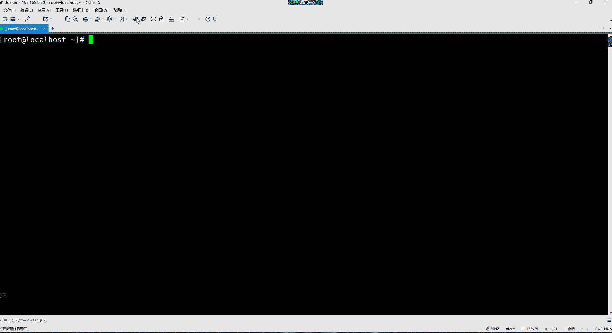

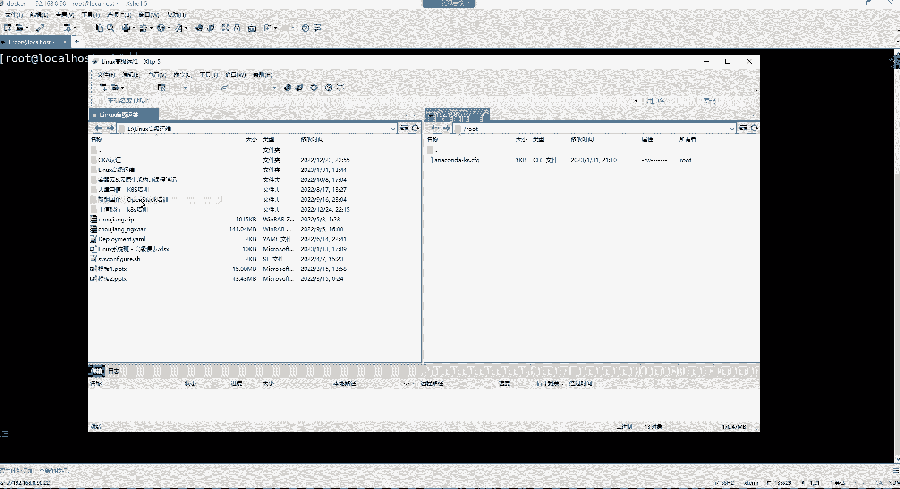

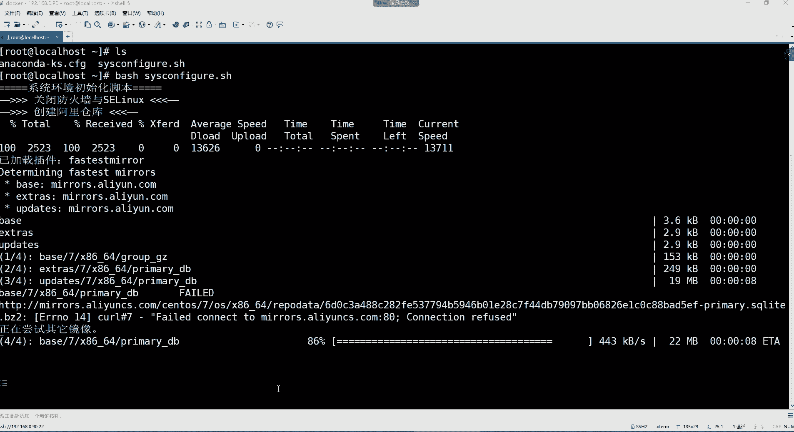

在本节课中，我们将要学习Docker容器的核心概念。我们将从什么是容器开始，探讨它解决了什么问题，以及它与传统部署和虚拟化技术的区别，最后介绍Docker的基本组成和工作原理。

## 什么是容器？📦

容器，顾名思义，就是用来容纳东西的。在计算机技术领域，容器是一种轻量级的虚拟化技术，它可以将应用程序及其所有依赖项（如库、配置文件、环境变量等）打包在一起，形成一个独立的、可移植的运行单元。

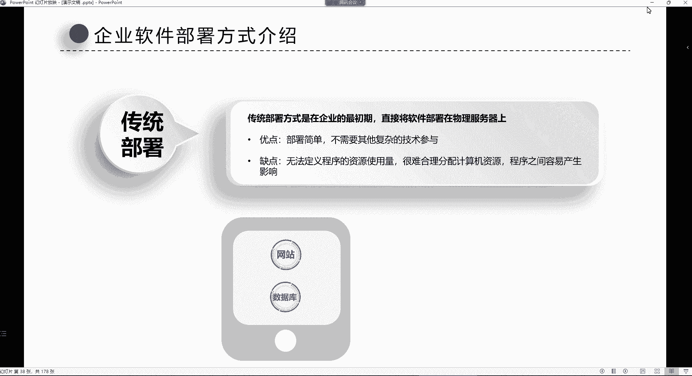

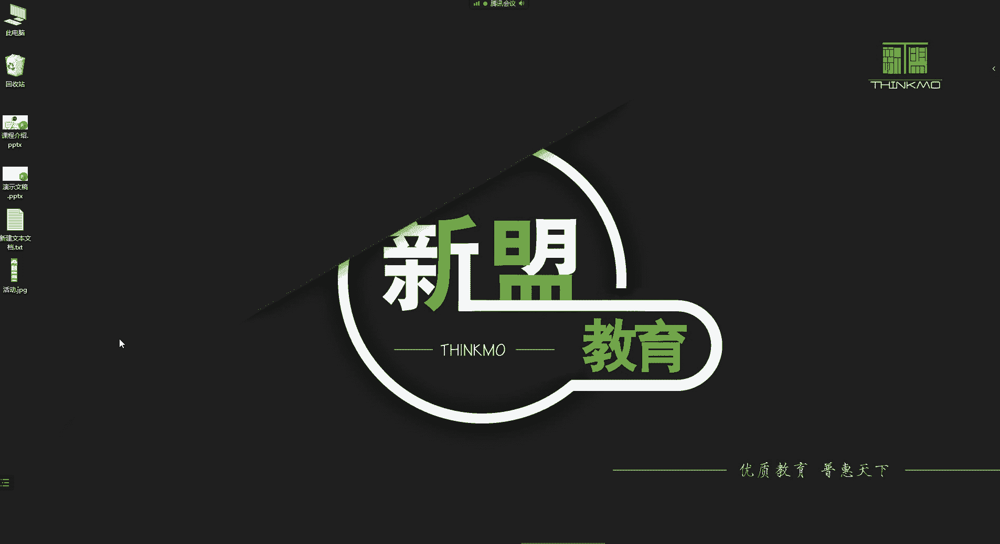

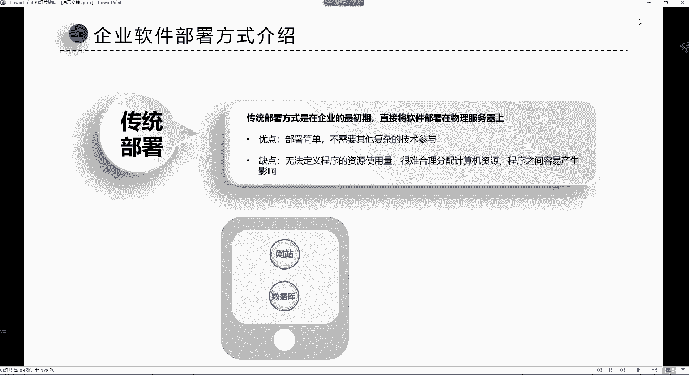

## 容器解决了什么问题？🔧


要理解容器的价值，我们需要先了解企业软件部署方式的演进。

### 传统部署方式

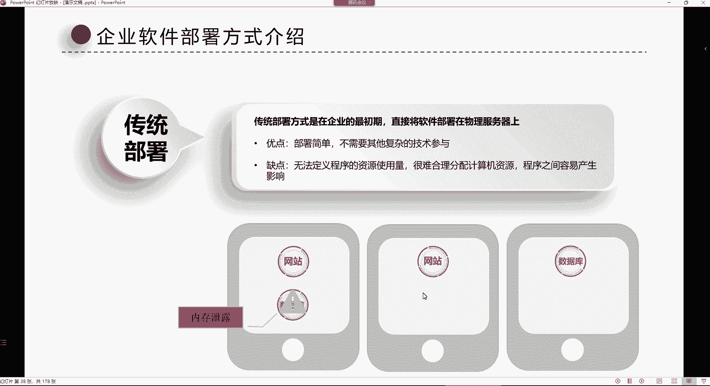

传统方式是将软件直接部署在物理服务器上。这种方式部署简单，但存在严重缺陷：**无法限制单个程序对系统资源（如CPU、内存）的使用量**。如果一个程序（如数据库）发生内存泄漏，它可能会耗尽服务器所有内存，导致其他所有程序崩溃。


### 虚拟化部署方式

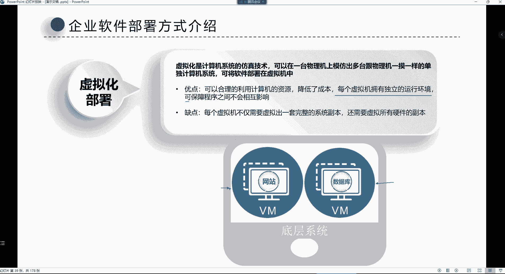

虚拟化技术（如VMware、VirtualBox）通过在一台物理服务器上创建多个虚拟机来解决隔离问题。每个虚拟机都拥有独立的操作系统和虚拟硬件，程序运行在虚拟机中，实现了相互隔离。

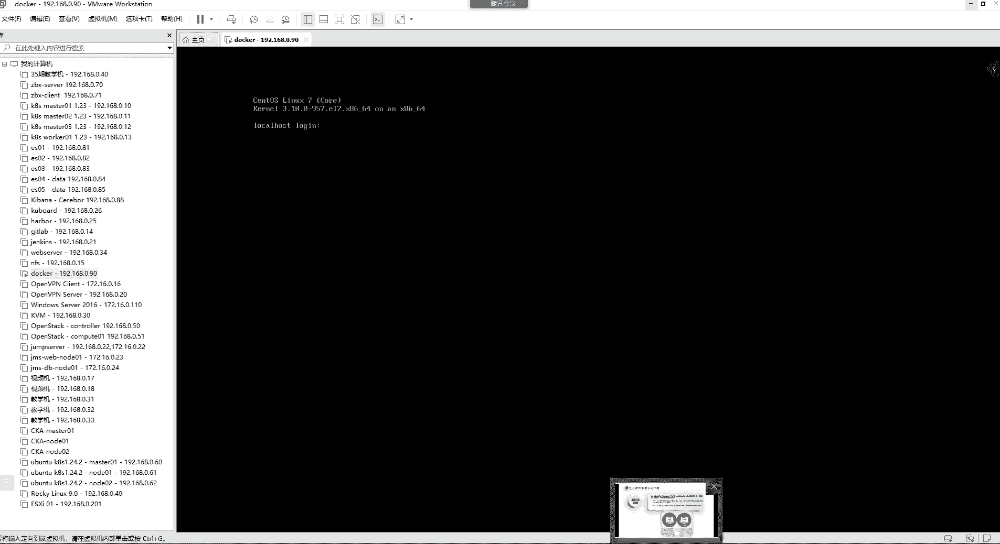


**优点**：程序之间互不影响。
**缺点**：每个虚拟机都需要虚拟一套完整的操作系统和硬件，**资源消耗大，启动速度慢**。

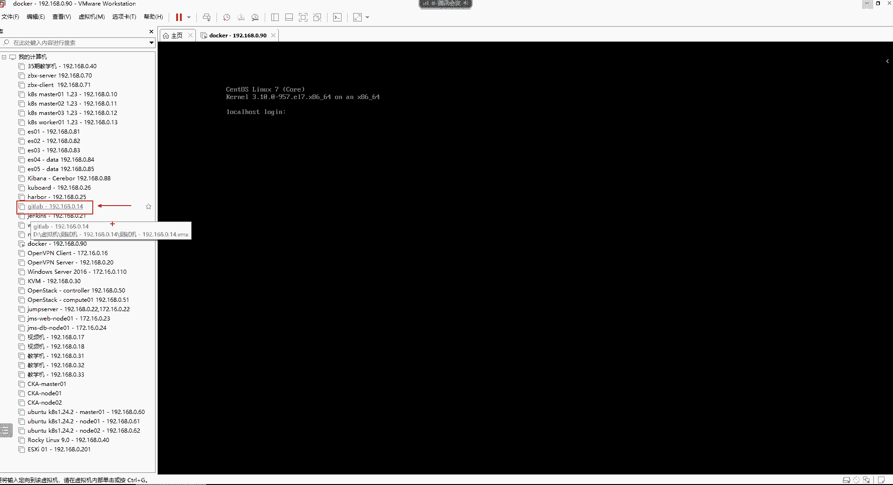

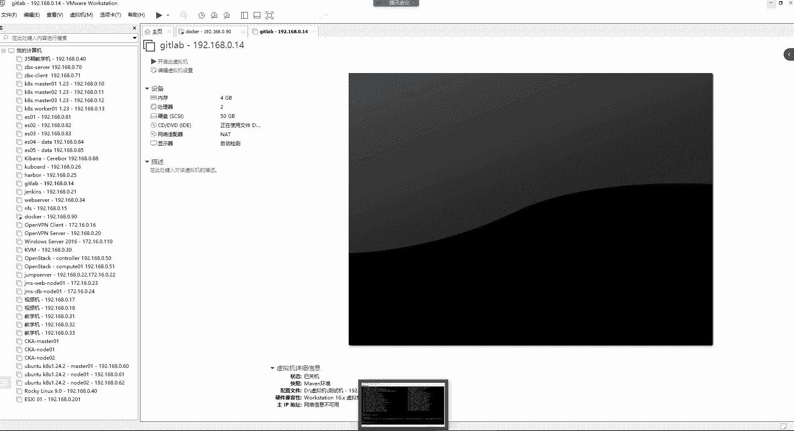

### 容器化部署方式

容器技术应运而生，它结合了前两者的优点。

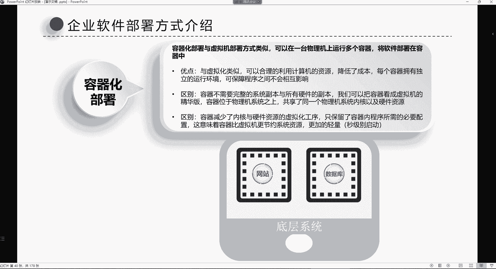


*   **与虚拟机类似**：容器之间相互隔离，一个容器内的程序故障不会影响其他容器。
*   **与传统部署类似**：容器直接运行在宿主机的操作系统内核上，**无需虚拟完整的操作系统和硬件**，因此更加轻量。

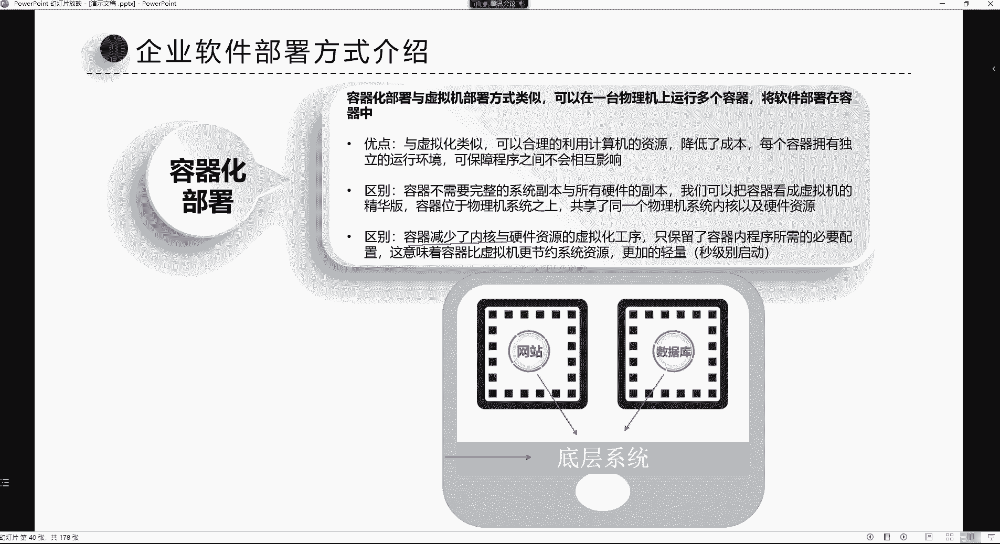

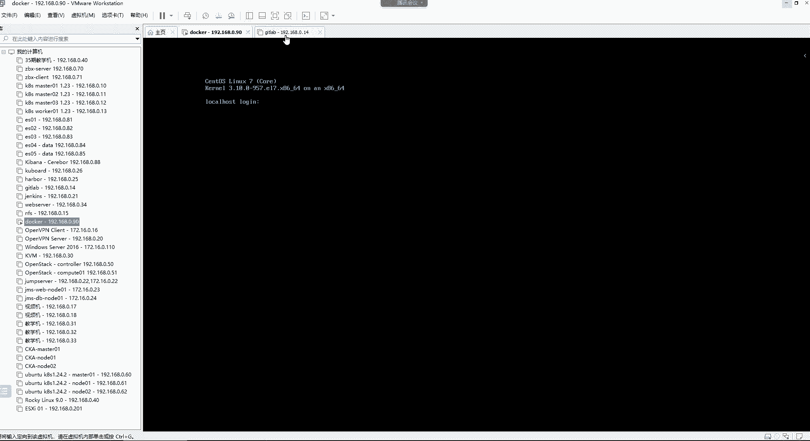

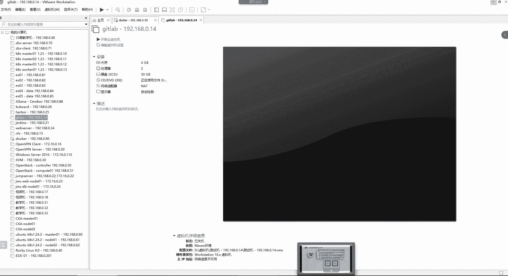

**核心优势对比**：
*   **启动速度**：启动容器就像启动一个进程（秒级），而启动虚拟机则需要分钟级。
*   **资源消耗**：容器共享宿主机内核，极大减少了额外的资源开销。
*   **隔离性**：容器提供了进程级别的隔离，但隔离强度弱于拥有独立内核的虚拟机。

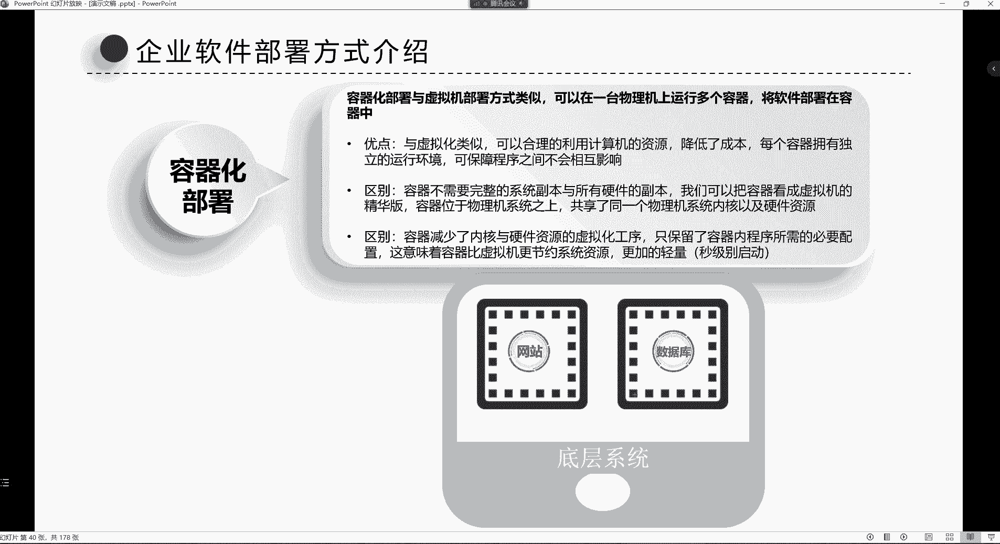

## 容器的核心价值：环境一致性 🚢

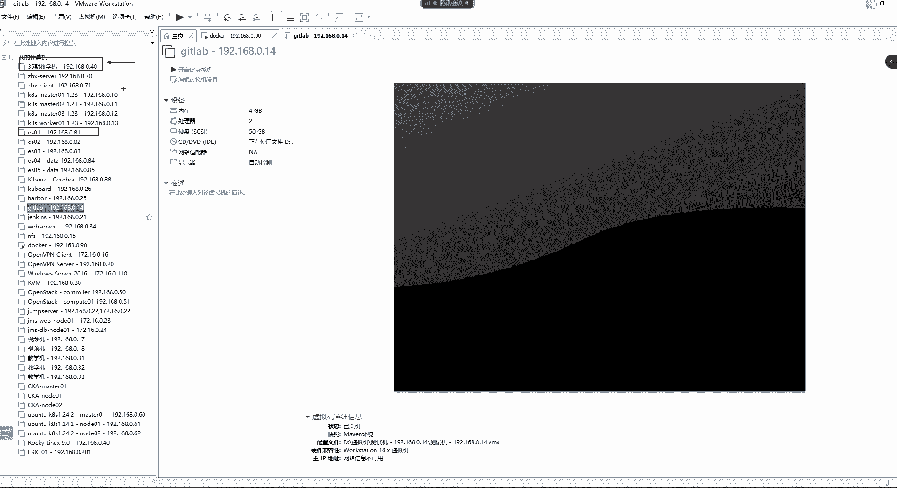

容器最重要的价值之一是解决了软件开发中“**环境不一致**”的难题。

在软件从开发、测试到上线的流程中，每个环节的环境（操作系统、依赖库版本等）可能不同。这常常导致程序在开发环境运行正常，到了测试或生产环境却“水土不服”。运维人员因此常常成为“背锅侠”。

容器通过将**应用程序代码、运行环境、系统依赖**全部打包进一个镜像文件，完美解决了这个问题。

**流程示例**：
1.  开发人员在Ubuntu系统上用JDK8开发了一个Java应用，并将其打包成一个容器镜像。
2.  测试人员拿到这个镜像，在他的CentOS测试服务器上运行。**尽管宿主机系统不同，但容器内的应用依然使用打包好的Ubuntu环境和JDK8，运行不受影响**。
3.  运维人员在生产环境的Red Hat服务器上运行同一个镜像，应用同样能无缝运行。

这实现了 **“一次封装，随处运行”** 的理念，与Java的“一次编译，到处运行”异曲同工。

## Docker是什么？🐋

Docker是基于Go语言开发的开源项目，是**一套完整的容器管理系统**。我们可以把Docker看作一个操控容器的工具。

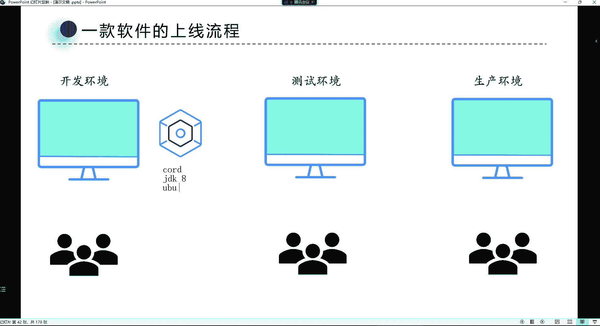


Linux内核本身支持容器功能，但用户无法直接使用。Docker提供了一套简单的命令和接口，让我们能够轻松地创建、管理和运行容器。

**Docker的logo寓意**：鲸鱼（Docker）拖着许多集装箱（容器）。这形象地表达了Docker的理念：**隔离**（每个集装箱货物独立）与**高效**（集装箱可堆叠，节约空间）。

## Docker的三大核心概念 ⚙️

Docker的架构主要围绕三个核心概念：镜像、容器和仓库。

### 1. 镜像 (Image)
镜像是创建容器的**模板**，是一个只读的静态文件。你可以把它理解为一个软件的“安装包”，里面包含了应用程序运行所需的代码、库、环境变量和配置文件等所有内容。

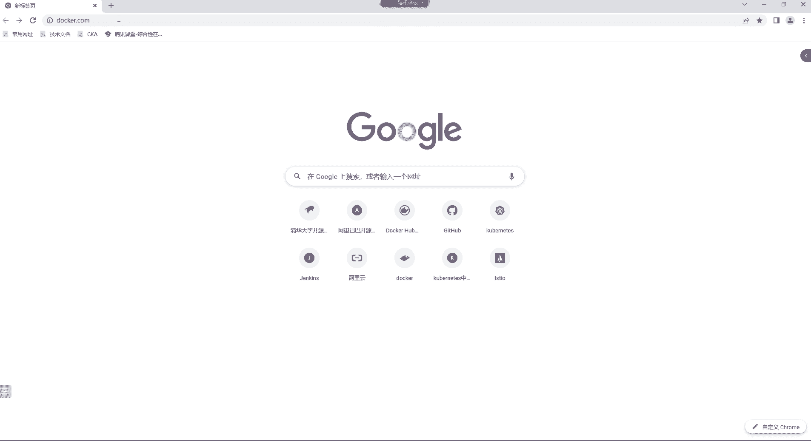

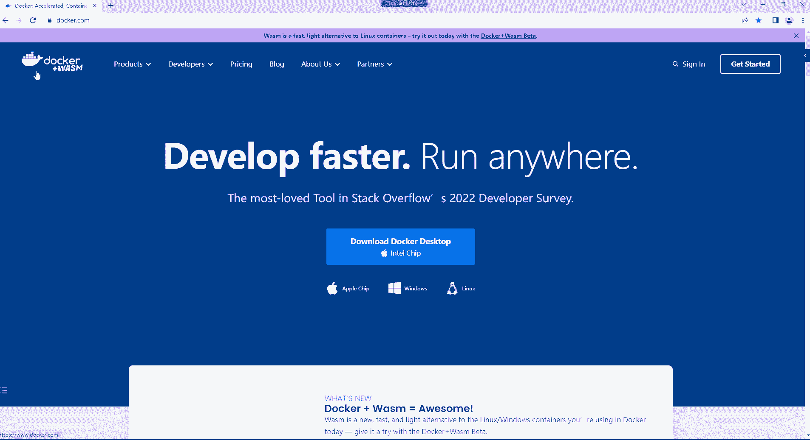

**公式表示**：`镜像 = 应用程序 + 依赖环境 + 系统库`

### 2. 容器 (Container)
容器是镜像的**运行实例**。当镜像被运行时，它就变成了一个容器。容器是程序的载体，是隔离的、可运行的应用环境。

**代码类比**：`容器 = 运行中的镜像进程`

### 3. 仓库 (Repository)
仓库是集中存放镜像的地方，类似于代码仓库（Git）或软件应用商店。

*   **公开仓库**：如官方的Docker Hub (`hub.docker.com`)，所有人都可以下载镜像。
*   **私有仓库**：企业自行搭建，用于存放内部镜像，如Harbor。

## Docker工作流程 🔄

以下是使用Docker部署一个应用的标准流程：

1.  **安装Docker**：在宿主机上安装Docker引擎。
2.  **拉取镜像**：从仓库（如Docker Hub）下载所需的软件镜像到本地。
    ```bash
    docker pull nginx
    ```
3.  **创建并运行容器**：基于镜像启动一个容器，应用程序便开始运行。
    ```bash
    docker run -d --name my-nginx nginx
    ```


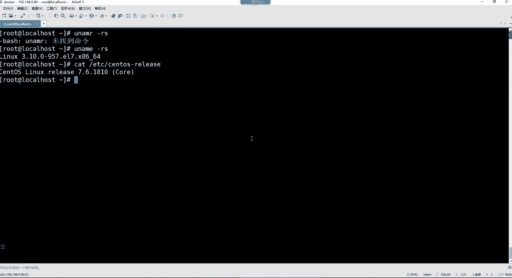

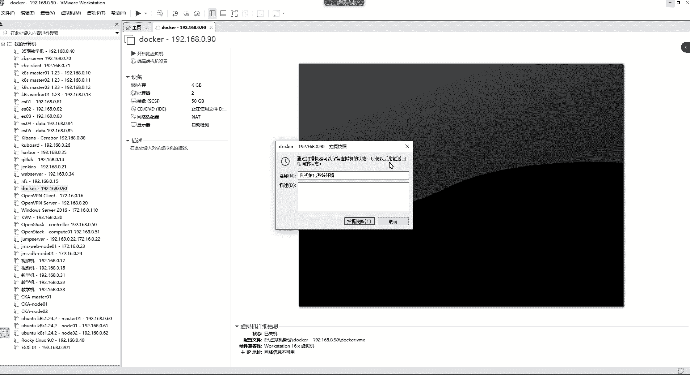

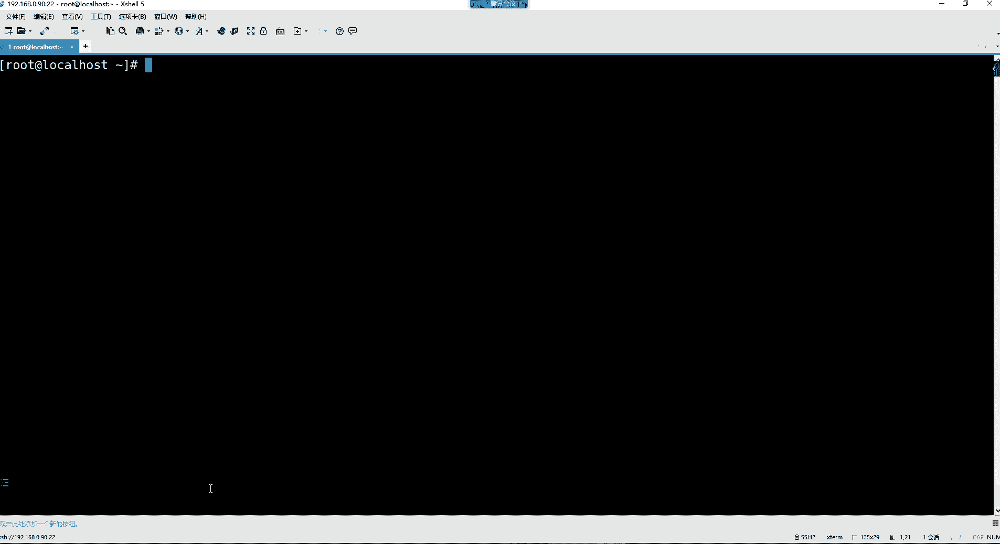

这个过程可以概括为：**从仓库拉取镜像，用镜像创建容器**。

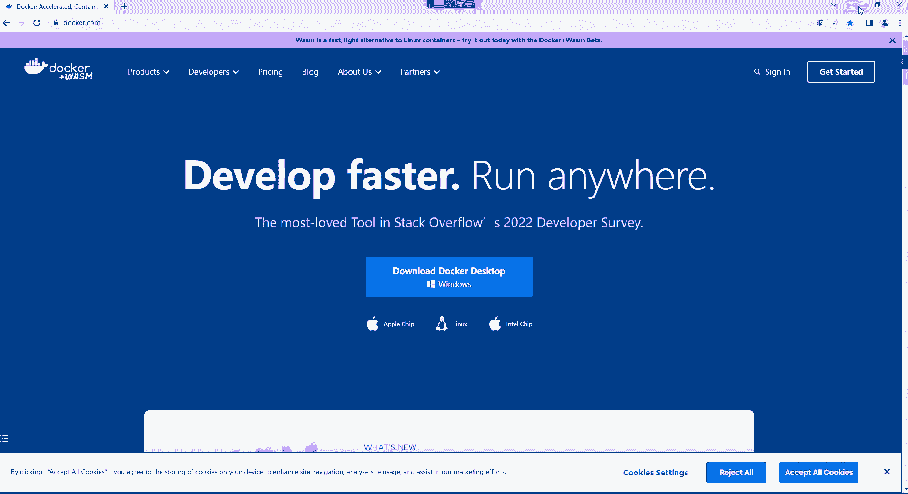

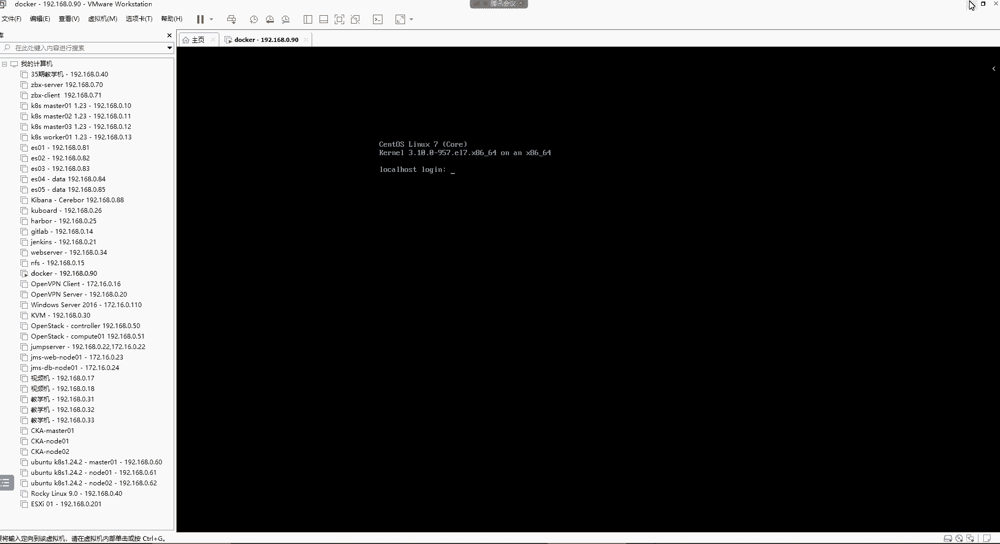

---


本节课中我们一起学习了Docker容器的基本概念。我们了解了容器作为一种轻量级虚拟化技术，如何通过隔离和环境打包来解决传统部署和虚拟化的痛点，并最终认识了Docker的核心组件（镜像、容器、仓库）及其简单的工作流程。理解这些概念是后续深入学习Docker操作和实践的基础。