# Linux运维全套培训课程：P99：Docker-4.docker容器数据卷 📦


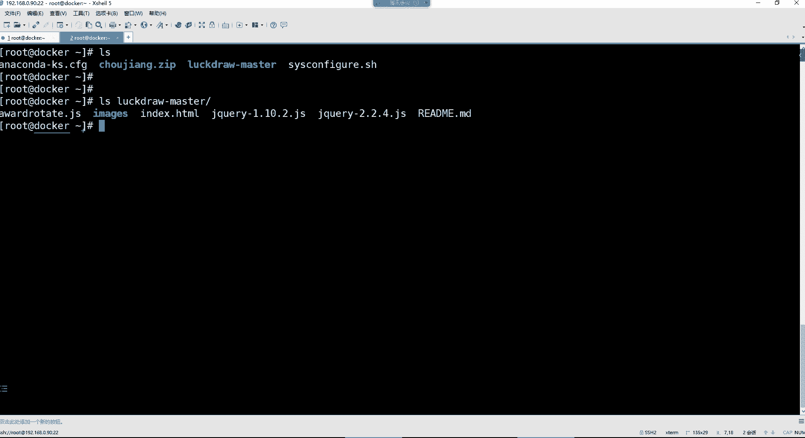


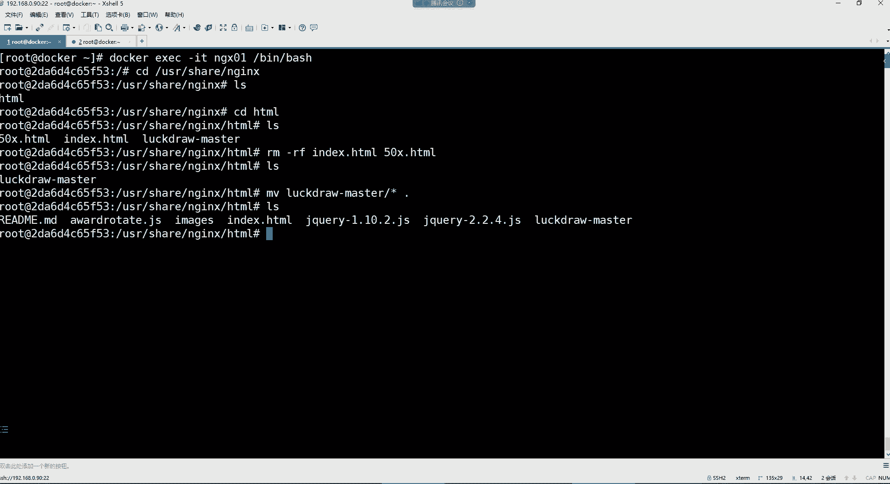

在本节课中，我们将要学习Docker容器数据卷的核心概念与使用方法。数据卷是解决容器数据持久化、容器间数据共享以及宿主机与容器间文件同步的关键技术。


## 概述


上一节我们介绍了Docker容器的基本操作命令。本节中我们来看看如何通过数据卷解决容器数据管理的几个核心问题。


## 容器数据管理的问题

在深入数据卷之前，我们首先需要理解传统容器数据管理存在的局限性。以下是几个典型问题：

*   **容器与宿主机间文件交换不便**：虽然可以使用 `docker cp` 命令在宿主机和容器间拷贝文件，但这种方式效率低下，无法实现实时同步。
*   **容器间无法直接共享数据**：默认情况下，容器之间是相互隔离的，无法直接交换文件。
*   **容器删除导致数据丢失**：容器本身是临时性的，一旦容器被删除，其内部产生的所有数据也会随之丢失。


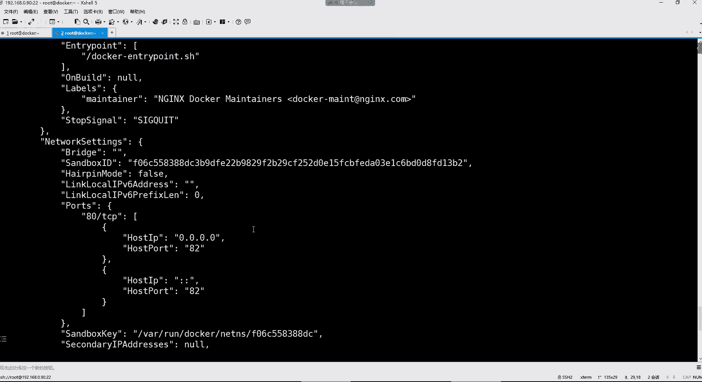

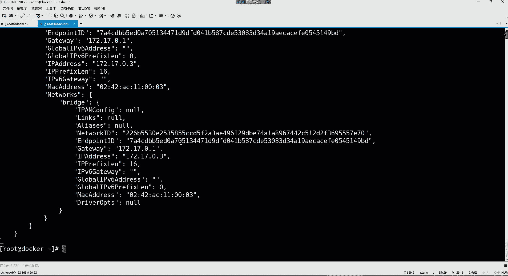


## 数据卷的概念与优势

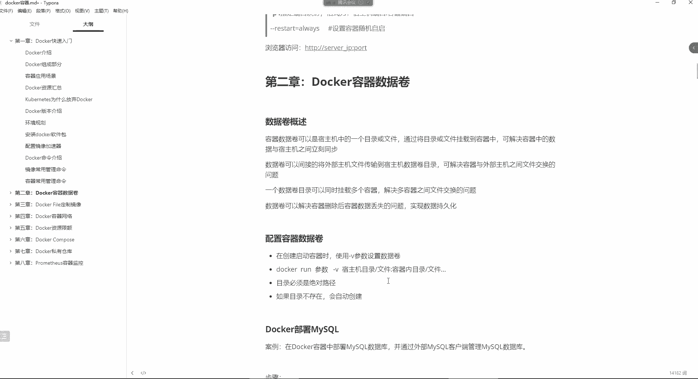

数据卷是宿主机上的一个目录或文件，它可以被挂载到一个或多个容器中。其核心优势在于：

*   **数据持久化**：即使容器被删除，数据卷中的数据依然保留在宿主机上。
*   **实时同步**：宿主机数据卷中的更改会立刻反映到所有挂载它的容器中，反之亦然。
*   **便捷共享**：一个数据卷可以同时挂载给多个容器，从而实现容器间的数据共享。

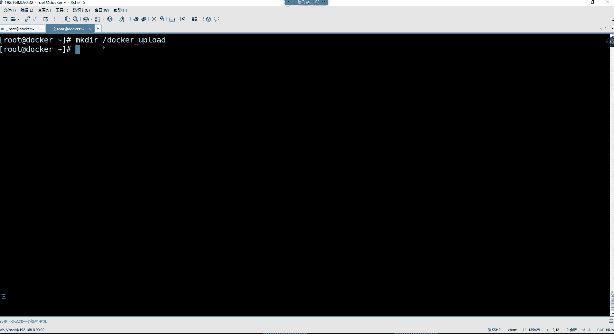


数据卷的挂载命令格式如下：
```bash
docker run -v <宿主机目录>:<容器目录> ...
```
如果指定的目录不存在，Docker会自动创建它。


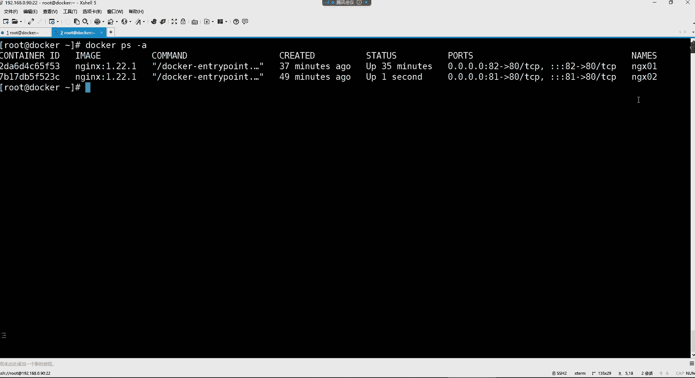

## 数据卷实战：部署MySQL

接下来，我们通过部署一个MySQL容器来演示数据卷的实际应用。我们的目标是将MySQL的配置文件、数据目录和日志目录持久化到宿主机。

首先，在宿主机上创建用于持久化的目录：
```bash
mkdir /docker_mysql
```

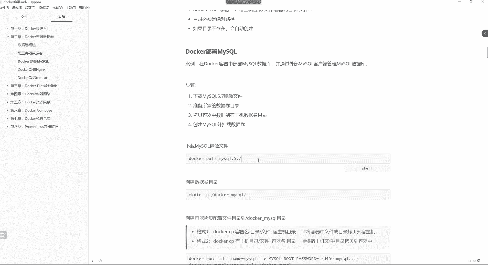

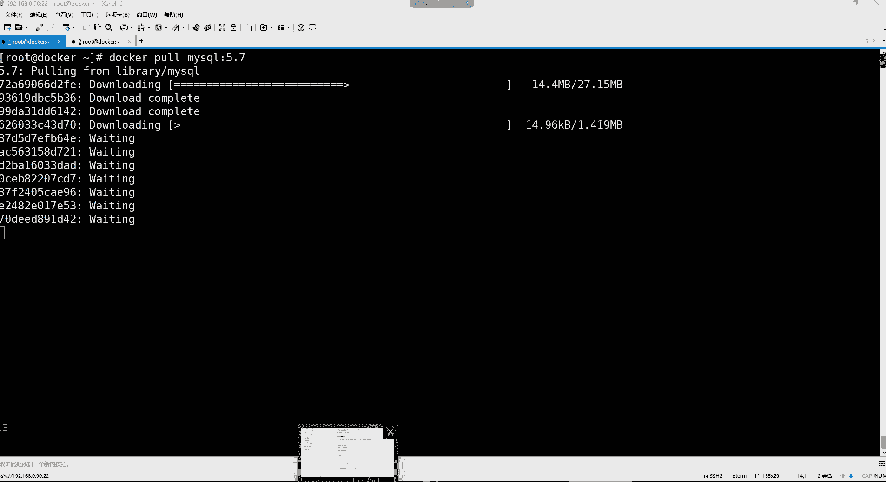


然后，我们需要将MySQL容器内的重要数据先拷贝到宿主机目录，以避免首次挂载时容器内数据被空目录覆盖。


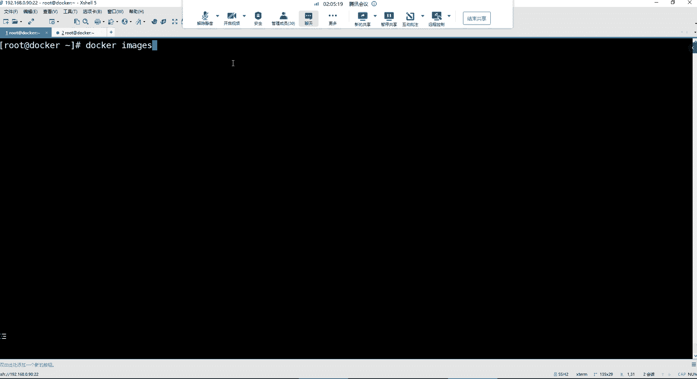


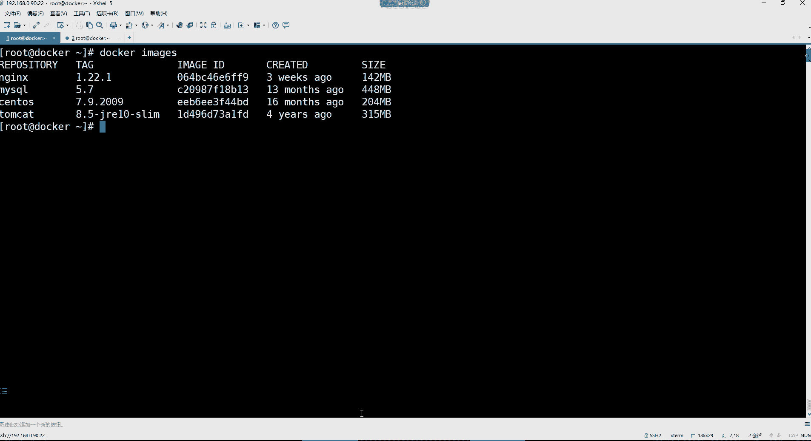

1.  **启动一个临时MySQL容器**（用于查看和拷贝数据）：
    ```bash
    docker run -d --name temp_mysql -e MYSQL_ROOT_PASSWORD=123456 mysql:5.7
    ```

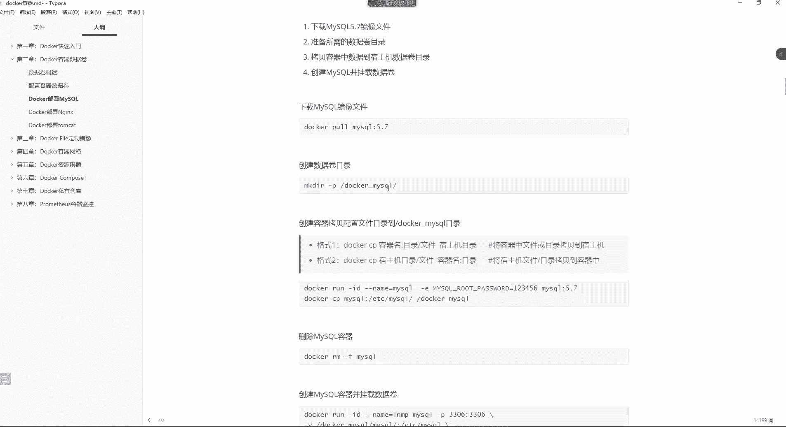


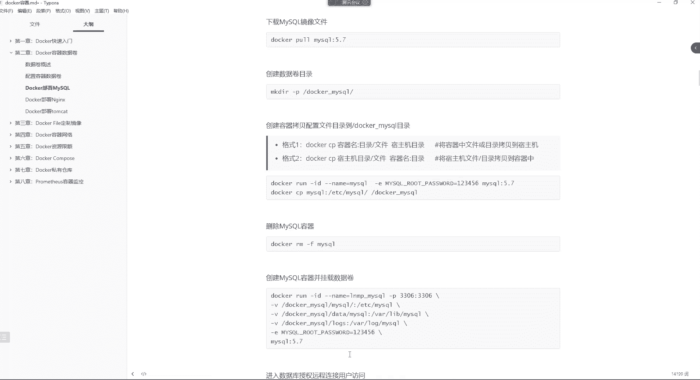

2.  **拷贝配置文件**：
    ```bash
    docker cp temp_mysql:/etc/mysql /docker_mysql/
    ```
    拷贝后，需要处理配置文件中的软链接问题，确保主配置文件可用。

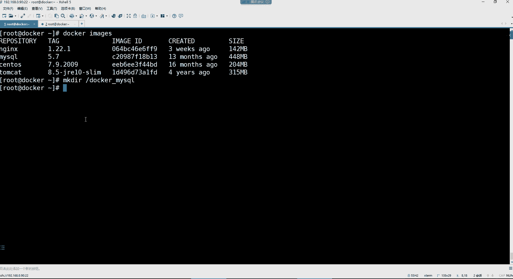

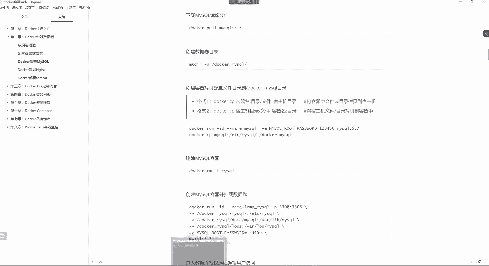

3.  **删除临时容器并创建正式容器**：
    ```bash
    docker rm -f temp_mysql
    docker run -d --name mysql \
      -v /docker_mysql/mysql:/etc/mysql \
      -v /docker_mysql/data:/var/lib/mysql \
      -v /docker_mysql/logs:/var/log/mysql \
      -e MYSQL_ROOT_PASSWORD=123456 \
      -p 3306:3306 \
      mysql:5.7
    ```
    通过 `-v` 参数，我们将三个目录分别挂载到了容器中。现在，任何在宿主机 `/docker_mysql/` 下对配置、数据或日志的修改，都会实时同步到MySQL容器内。


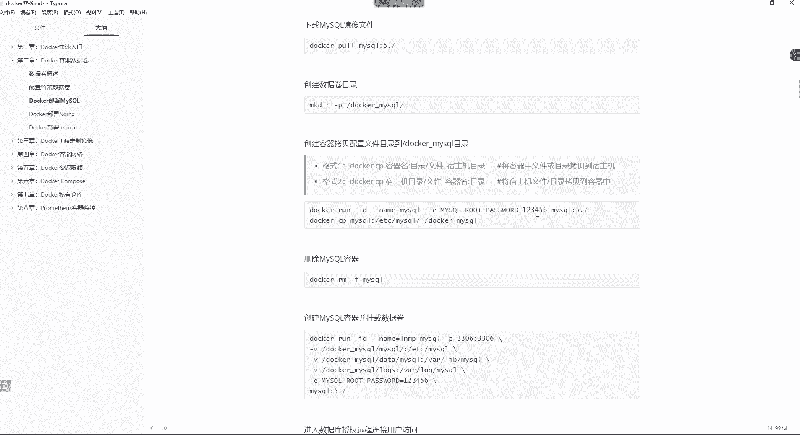

## 其他数据卷相关命令

除了在创建容器时挂载，还有一些命令用于管理容器和数据：

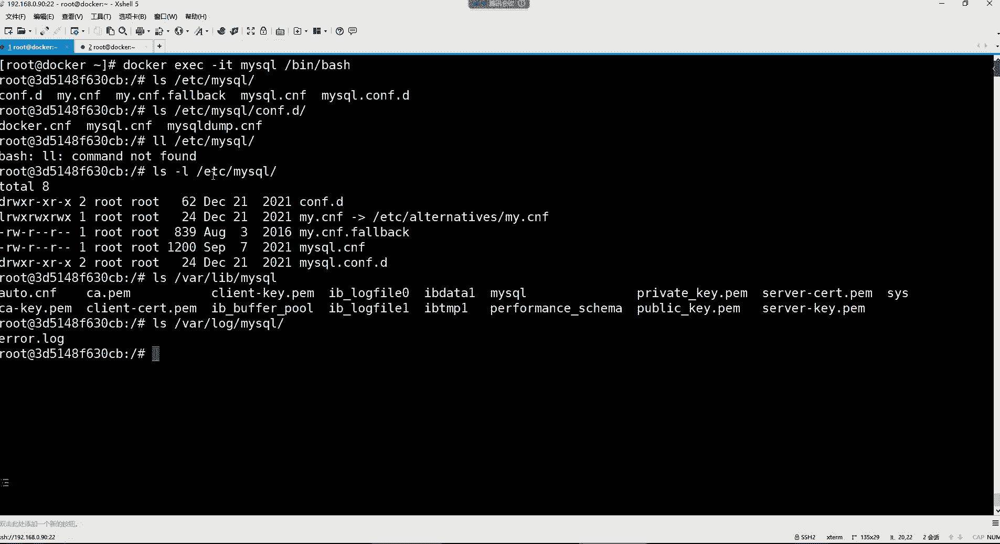

*   **`docker cp`**：在容器和宿主机间拷贝文件（非实时同步）。
    ```bash
    # 宿主机 -> 容器
    docker cp /宿主机文件 容器名:/容器路径
    # 容器 -> 宿主机
    docker cp 容器名:/容器文件 /宿主机路径
    ```
*   **`docker kill`**：强制停止一个运行中的容器。
    ```bash
    docker kill 容器名
    ```
*   **`docker inspect`**：查看容器的详细信息（元数据），包括网络配置、挂载卷、IP地址等。
    ```bash
    docker inspect 容器名
    ```
    元数据（Metadata）是指描述数据的数据。例如，对于一本书，它的作者、出版社、目录等信息就是这本书的元数据。对于容器，其ID、创建时间、网络设置、挂载卷信息等都属于容器的元数据。


## 总结

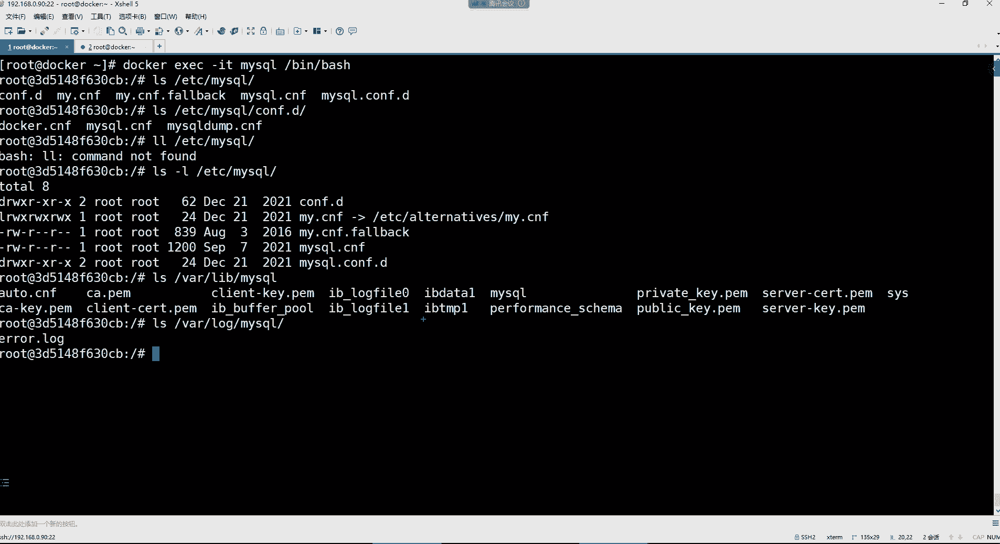

本节课中我们一起学习了Docker数据卷的核心知识。我们了解了容器数据管理的痛点，认识了数据卷在实现**数据持久化**、**实时同步**和**容器间共享**方面的强大功能，并通过部署MySQL的实战案例掌握了使用 `-v` 参数挂载数据卷的方法。此外，我们还回顾了 `docker cp`、`docker kill` 和 `docker inspect` 等辅助命令。合理使用数据卷，是构建稳定、可维护的Docker化应用的基础。