# Linux运维全套培训课程：P9：软链接与硬连接、获取命令帮助、系统运行级别、关机与重启 🔗


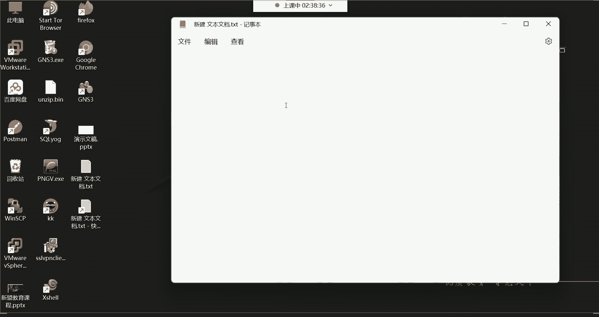


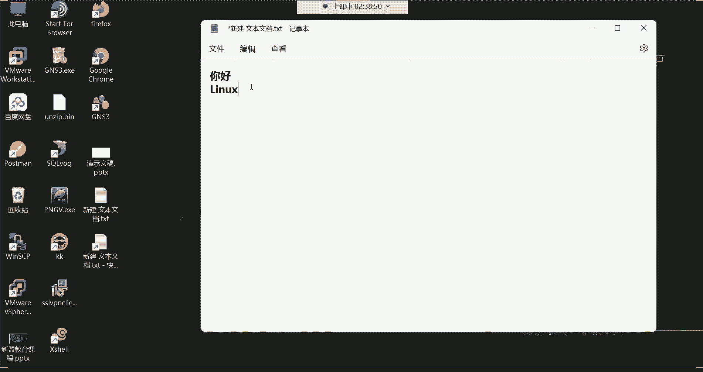


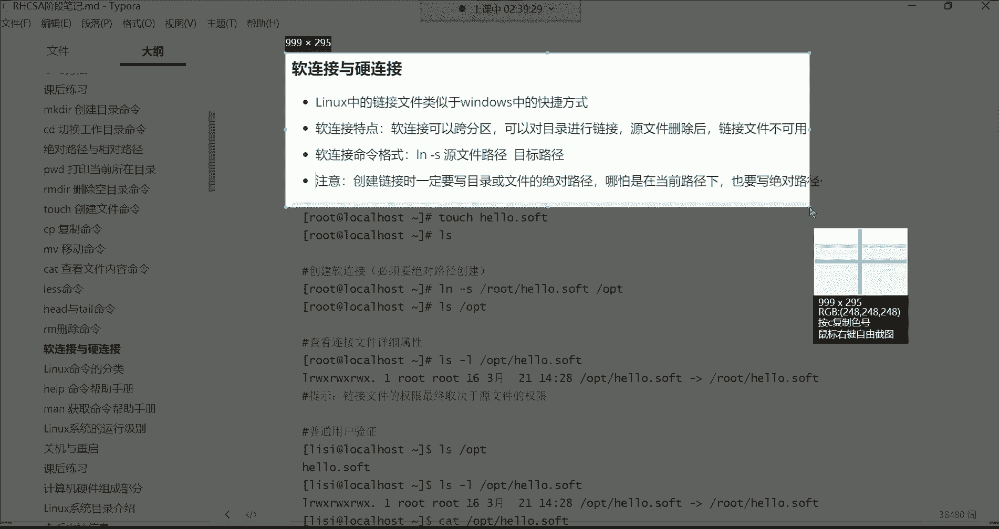

在本节课中，我们将要学习Linux系统中的几个重要概念：软链接与硬连接的区别与创建、如何获取命令的帮助信息、系统的不同运行级别以及如何进行关机与重启操作。这些知识是理解Linux文件系统和日常管理的基础。


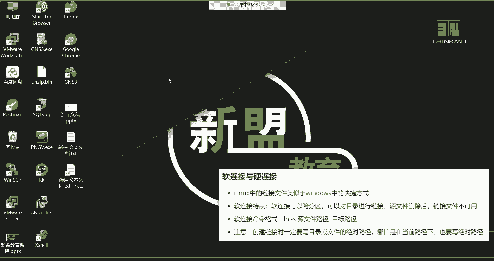

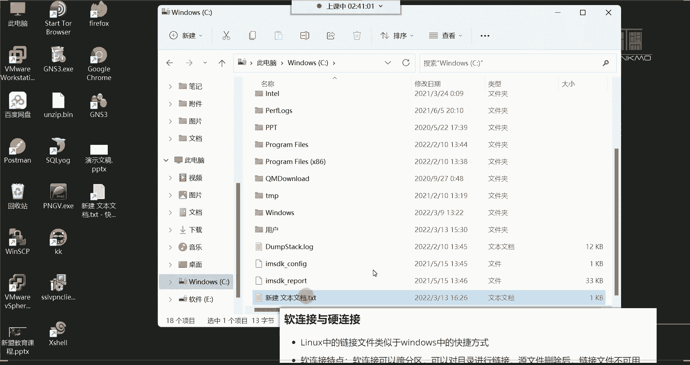


## 软链接与硬连接


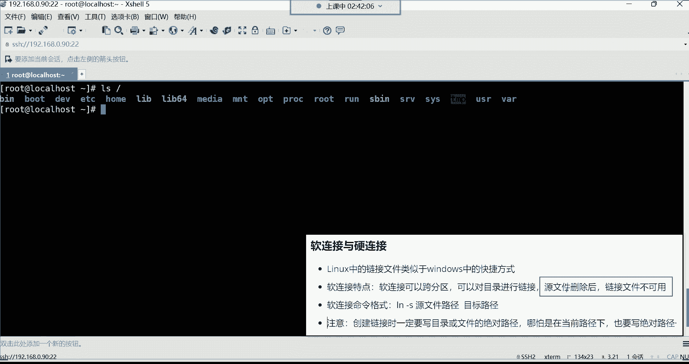

上一节我们介绍了文件和目录的基本操作，本节中我们来看看Linux中特殊的文件类型——链接文件。链接文件类似于Windows系统中的快捷方式，但Linux中分为软链接和硬连接两种，它们有显著的区别。


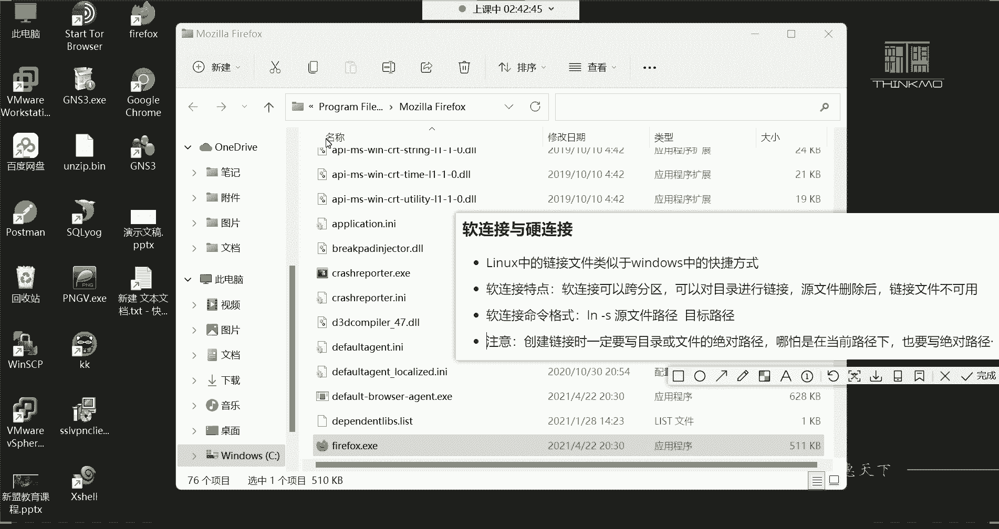


### 软链接

软链接（Symbolic Link）类似于Windows的快捷方式。其特点如下：
*   **可以跨分区**：源文件和链接文件可以位于不同的磁盘分区。
*   **可以对目录创建链接**：可以为目录创建软链接。
*   **依赖源文件**：如果删除源文件，软链接将失效（变为“坏链接”）。

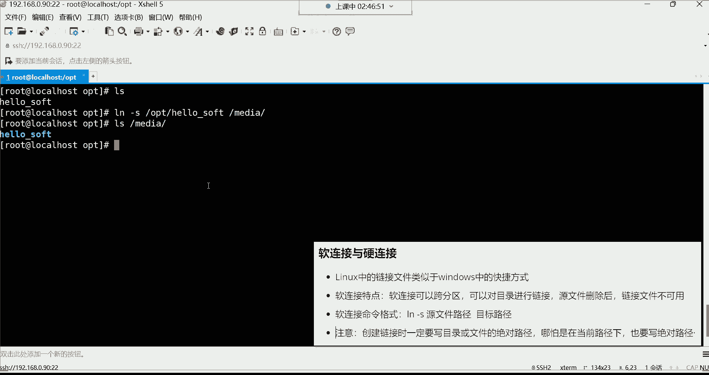


创建软链接的命令格式是：
```bash
ln -s <源文件绝对路径> <链接文件路径>
```
**注意**：创建时必须使用源文件的绝对路径，否则链接可能失效。

以下是软链接的验证步骤：
1.  创建源文件：`touch /opt/hello_soft`
2.  创建软链接：`ln -s /opt/hello_soft /media/`
3.  验证同步：向任一文件写入内容，另一个文件会同步更新。
4.  验证依赖性：删除源文件后，软链接文件会闪烁提示不可用。

### 硬连接


硬连接（Hard Link）与软链接完全不同，可以理解为给文件创建了一个“同步的副本”。其特点如下：
*   **不能跨分区**：源文件和硬连接必须在同一磁盘分区。
*   **不能对目录创建**：只能对文件创建硬连接。
*   **不依赖源文件**：删除源文件，硬连接文件仍然可用，内容不变。

创建硬连接的命令格式是（不加 `-s` 选项）：
```bash
ln <源文件路径> <硬连接文件路径>
```

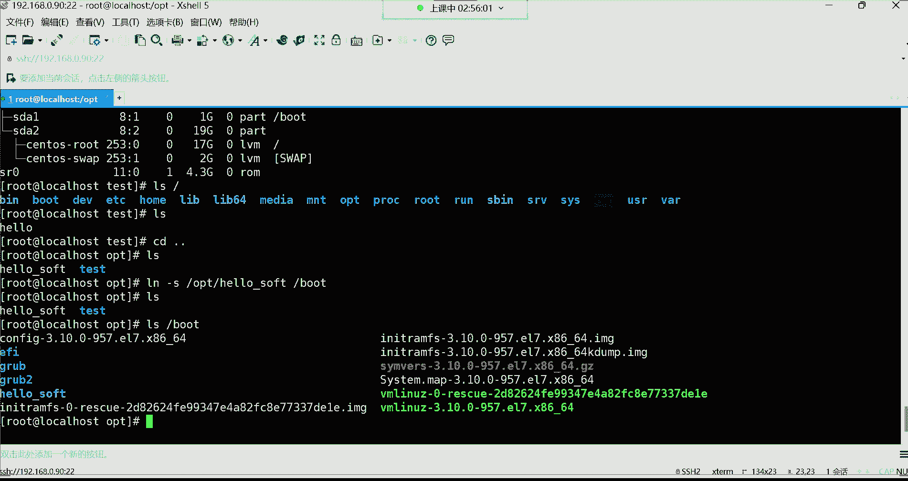

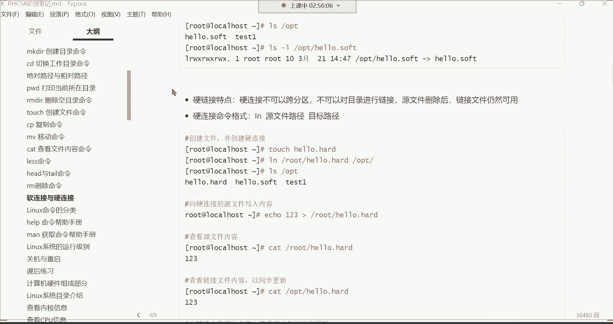


以下是硬连接的验证步骤：
1.  创建源文件：`touch /opt/hello_hard`
2.  创建硬连接：`ln /opt/hello_hard /media/`
3.  验证同步：向任一文件写入内容，另一个文件会同步更新。
4.  验证独立性：删除源文件后，硬连接文件仍然可以正常访问和操作。

**核心区别总结**：软链接是一个指向源文件的指针，而硬连接是共享同一存储数据块（inode）的多个文件名。删除源文件对软链接是致命的，但对硬连接无影响。

## 获取命令帮助

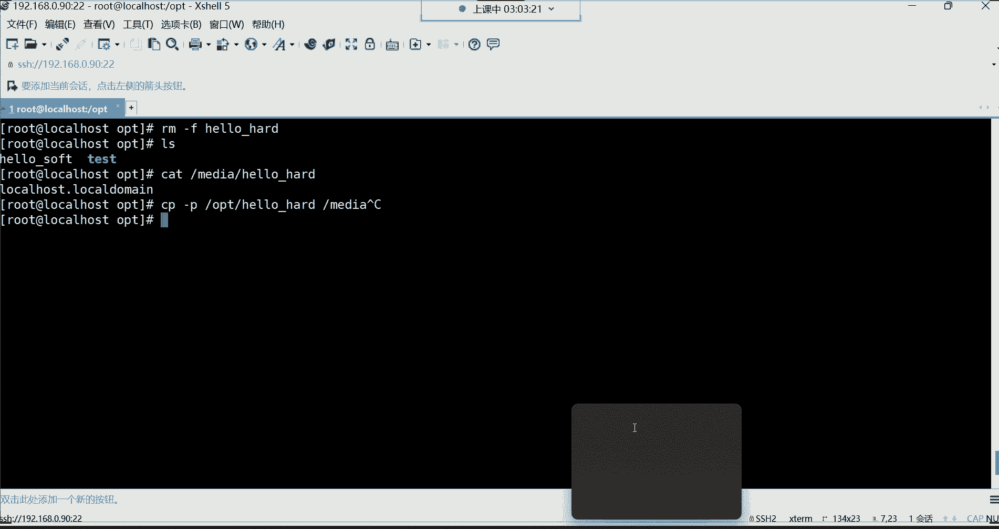

在Linux中，当你忘记某个命令的具体用法时，可以通过系统自带的帮助手册来查询。

最常用的方法是使用 `--help` 选项。例如，查看 `ls` 命令的帮助：
```bash
ls --help
```
这会列出命令的格式、选项及其简要说明。

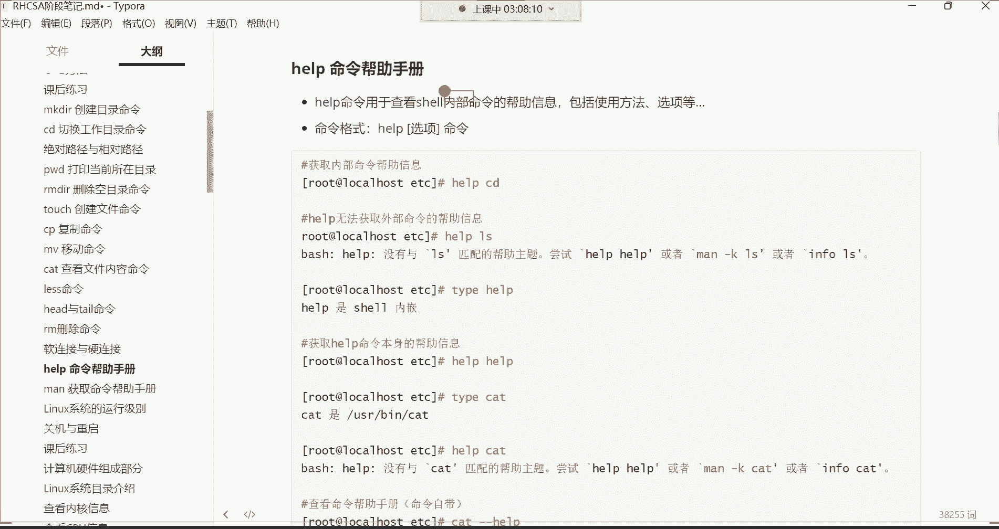

另一个更详细的帮助命令是 `man`（manual的缩写）：
```bash
man ls
```
`man` 命令提供的信息通常更全面，包括描述、选项详解，有时还有例子。在 `man` 页面中，可以使用与 `less` 命令相同的快捷键进行浏览（如空格翻页，`q` 退出）。

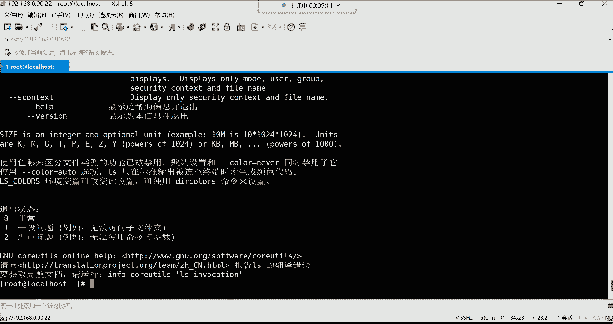

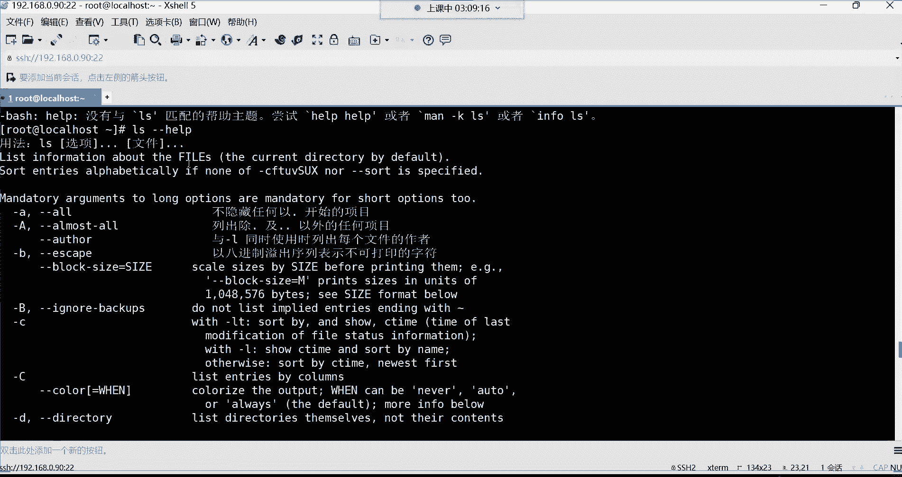

对于初学者，如果英文帮助理解有困难，完全可以通过互联网搜索（如“ls命令常用选项”）来获取更符合中文习惯的教程和解释。


## 系统运行级别


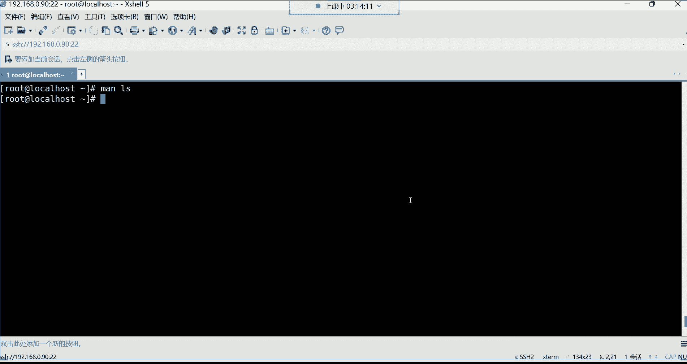


Linux系统有不同的运行级别（Runlevel），它定义了系统启动后运行哪些服务。共有7个运行级别（0-6）：


*   **0**：关机。
*   **1**：单用户模式。仅允许root用户登录，用于系统维护。
*   **2**：多用户模式（无NFS网络文件共享）。
*   **3**：完全的多用户模式（命令行界面），这是服务器最常用的标准级别。
*   **4**：未使用。
*   **5**：图形界面模式。带GUI的系统标准级别。
*   **6**：重启。

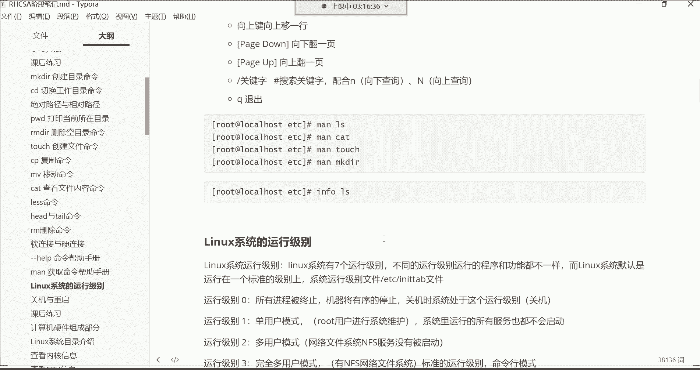


可以使用 `runlevel` 命令查看当前和上一个运行级别。使用 `init` 命令可以切换运行级别，例如切换到单用户模式：
```bash
init 1
```
**注意**：切换到级别1或6（重启）可能导致当前会话断开。


要查看系统默认启动的运行级别，可以执行：
```bash
systemctl get-default
```
通常，不带图形界面的服务器默认为级别3，带图形界面的桌面系统默认为级别5。


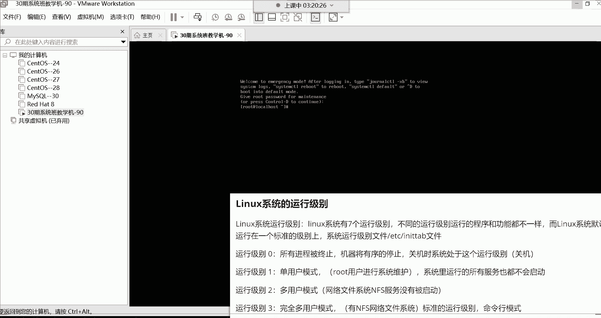


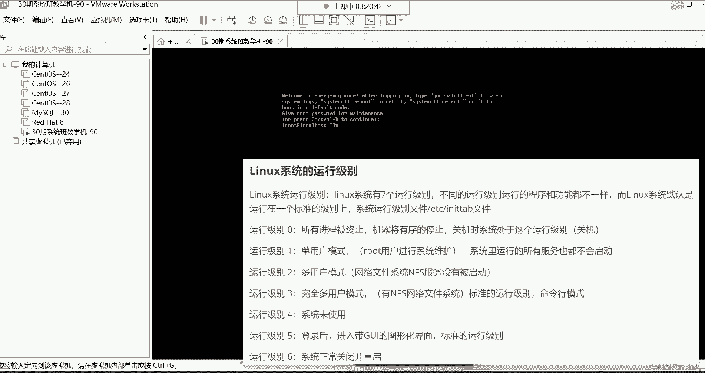

## 关机与重启


在命令行下管理系统的开关机是运维人员的必备技能。


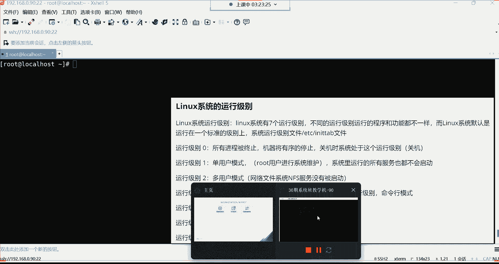


常用的关机命令是：
```bash
poweroff
```
或
```bash
shutdown -h now
```


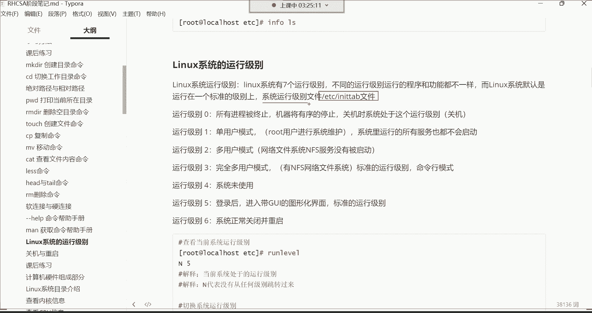

常用的重启命令是：
```bash
reboot
```
或
```bash
shutdown -r now
```

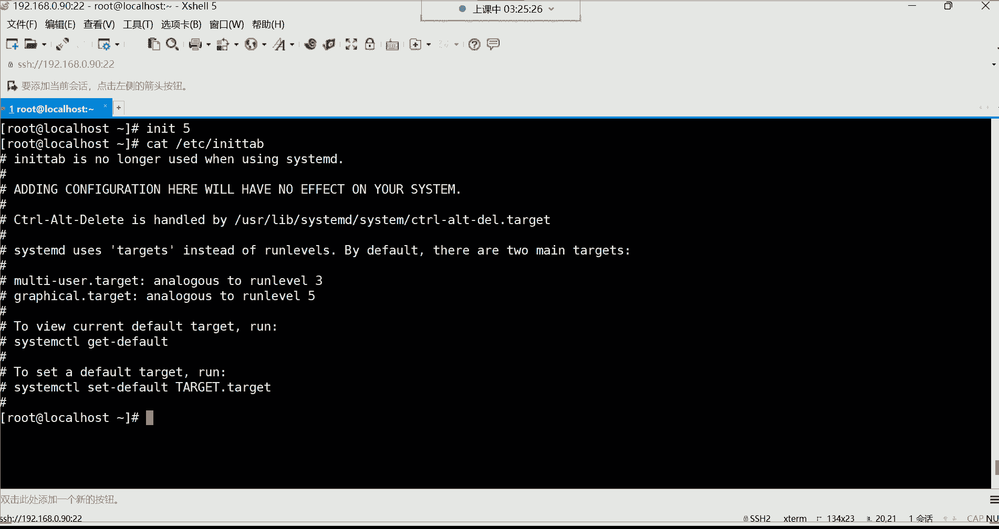


`shutdown` 命令功能更强，可以计划关机，例如 `shutdown -h +10` 表示10分钟后关机。

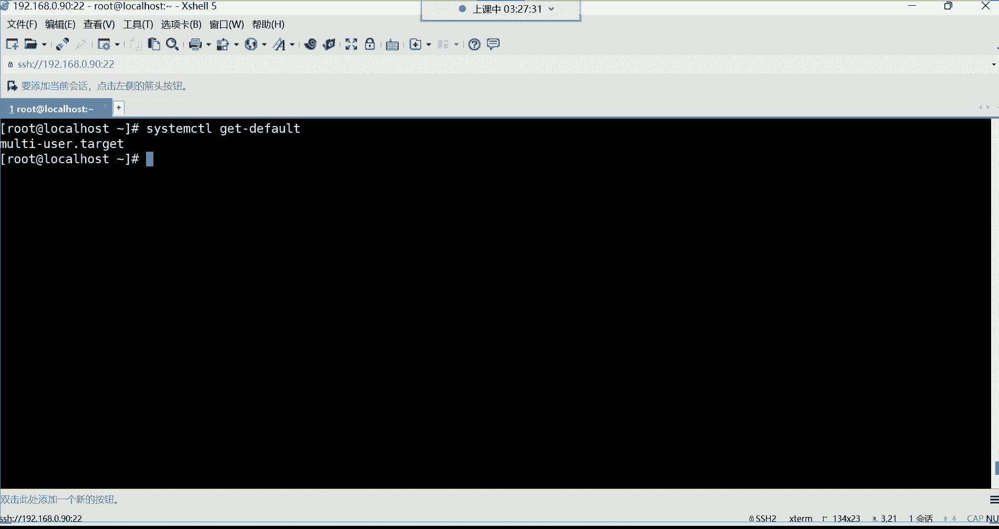

---


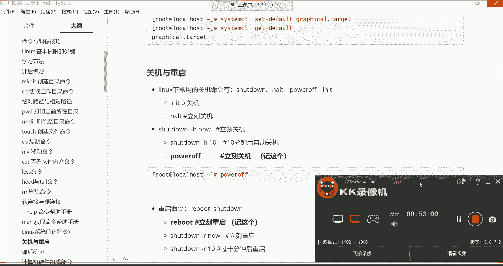

本节课中我们一起学习了Linux中软硬链接的原理与操作、查询命令帮助的方法、系统运行级别的概念以及关机重启的命令。其中，软硬链接的区别和创建是重点实践内容，而帮助查询和运行级别则是重要的背景知识。请务必通过动手练习来巩固对软硬链接的理解。