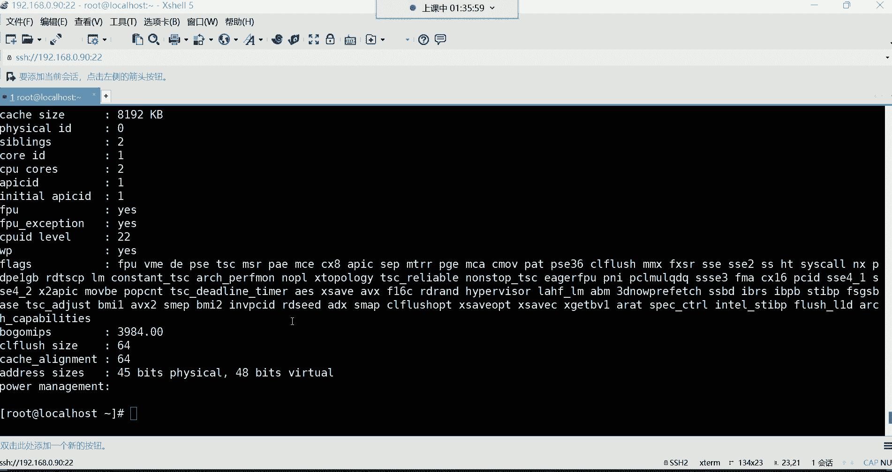
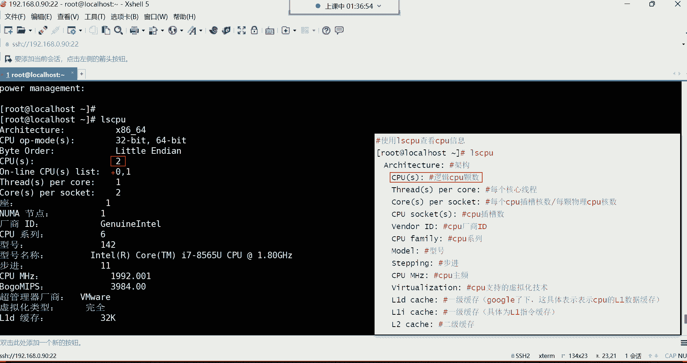
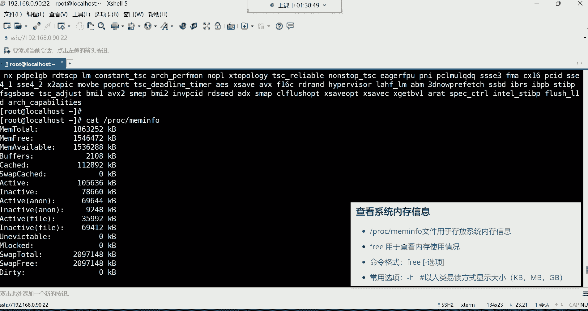
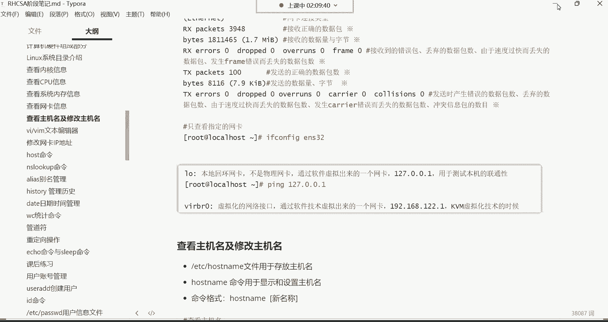

# 0基础小白怎么入门Linux运维？看这套，Linux运维全套培训课程，保姆级教学视频 - P11：红帽RHCSA-11.查看内核、CPU、内存、网卡、主机名信息、修改主机名 - 小方脸不方- - BV138411B7p5

我们继续哈，我们接下来呢来给大家讲讲查看系统里的，比如说一些硬件的资源啊，那看这些资源的话呢，我们先看第一个叫做内核的信息，那我们用的都是LINUX的内核，然后那怎么看内核的相关的版本信息啊。

用这条命令我们来看一下这条命令，要查看内核的相关信息，这里面呢包括版本名字呢都可以看。

这条命令叫U内幕，直接敲your name回车，看到了吗，那这条命令呢你如果这些敲的话呢，它是直接把这个内核的名字呢，给我们显示出来了，注意只显示这个内核名了，但是你发现这显示内核名不行啊，为什么呢。

因为你显示内核名，我想看它的版本怎么办呢，啊版本的话要加选项干哈杠R，但是如果我们加加了这个R以后，你发现这个确实是显示版本信息了啊，你看我们当前用的是3。10。0的版本是吧。

然后后面呢是一个补丁次数啊，打了多少次补丁，Ok，但是呢我想看他一个完整的，比如说名字再结合版本怎么办呢，啊那这时候看到有个杠S，就这样哈，杠S杠杠S其实默认就是什么呢，默认就是杠S只显示名字。

所以这两个选项结合到一起rs就可以了，告诉你这个内核是LINUX的内核，版本是3。10。0的一个版本，然后适合安装在红帽的六七上边啊，适合的CPU架构是X86614位的一个CPUCPU。

这如何查看内核的版本，这是比较简单的，然后内核的官网啊，这个前面我们第一天讲就给大家讲的是，现在最新的内核是五点几的啊，是五点几的内核啊，但是三点几的就可以是后期到企业里面，如果有需求的话呢。

呃到时候再升级再说啊。

这看看内核的版本好。

那下面呢看CPU信息，看CPU信息呢通常是有两种方法啊。

我们一个一个来讲啊，来看第一种，第二种方法呢是在这个PROC，下边有一个文件，这个文件呢叫做我们找一找哈，叫CP，有一个文件叫CPUINFK，到了吗，这个文件里面存的就是CPU的相关信息啊，可以打开的。

然后后期还有一个叫做memory info啊，那是内存的信息，我们一会儿再说好吧，这儿呢啊这是后期在查看内存的时候，这里面有一个memory info啊，这内存信息文件，这是CPU信息文件啊。

然后我们打开，当然这个信息文件，你想想他既然是文件里的内容非常多，PROC下边PROC下边的CPU CPU info啊，打开打开之后呢，你说这个信息都有哪些啊，啊这里面显示的信息呢。

我们啊从从这儿开始哈，然后给大家解释一下。

你看这里边我是有非常多的中文解释的是吧，我就说头几行就可以了哈啊我一直说到哪儿呢，嗯缓存就算了吧。

啊我们可以来给大家说说啊，这个哈process process呢后边是个零，是不是啊，你看这个代表是系统中逻辑处理盒的编号啊，然后对于单核处理器则可认为是其CPU编号。

然后对多核处理器可以认为是叫物理盒，或者说使用超线程虚拟技术的一个逻辑，和你发现这有些听不太懂啊，是不是听不太懂啊，这有点不说人话的意思，其实就是你这个CPU的棵数，注意哈，就CPU的棵数。

就你这个系统里面多少颗CPU，如果是一棵这个位置就显示零，如果是两颗CPU，注意我说的是棵数，不是合数哈，CPU分科，然后每颗CPU里边分多少个核啊，这核就是所谓的叫计算单元啊。

如果说你的电脑里面只有一颗CPU的话，那这个位置就显示零，如果你电脑里面有两颗CPU的话，那这个位置就显示一，如果有三颗CPU，那这个位置就显示二啊，是这么回事嗯，所以它是叫做棵树哈，棵树。

然后那下边呢像什么CPU的制造厂商啊，英特尔的看到了吧，然后像CPU的一些相关的产品的系列代号啊，这个你就不用管了，什么代号之类的不用管，因为我们是虚拟出来的。

我们这个CPU是跟我们的真机CPU是一样的对，所以如果你想看虚拟机的CPU，你还不如直接看你真机的CPU了，你比如说我们呃win加R把这个任务，把这个资源管理器给它调取出来。

敲这条命令在你的这个CMD里面，注意在那CMD里面敲这个命令，敲这个命令呢，可以帮我们把我当前的物理的硬件信息呢，给它调取出来。

在这个里边可以看我们当前的CPU的信息。

看了吗，这个CPU信息，你发现就是虚拟机里面这个信息一模一样的，你们看吧，是不是英特尔酷睿的，看到了吗，酷英英特尔酷睿的CPU，然后呢是I7的8565U的，然后赫兹呢是1。80HZ的一模一样，看到了吗。

为什么呢，因为我们这个CPU是通过虚拟化技术，按照你的真机的型号去帮你虚拟出来的，所以说你看这个信息呢没有太大的帮助，在企业里边呢。

你看这个文件呢啊其实你对于服务器的时候，你买这个CPU的时候基本上大题。

你心里应该清楚你的CPU的一个型号，如果真想看的话呢。

也可以这样看，有一条命令你要听命令叫IOSCPU啊。

这条命令可以看CPU信息，你直接敲，直接敲LSCPU回车，那这时候呢也可也可以帮我们显示一些，这个跟CPU相关的信息，比如我们CPU的架构看了吗，然后CPU的位数支持32位。

也支持64位，然后啊当然这个信息呢我们只给大家说一些。

就是我们所关注的哈，使用这条命令。

没有麒麟，你不买，非得买麒麟的时候吗，啊还有这个啊，这些CPUS代表CP的科数啊，其实看这看，当然这不是CPU可数，这CPU核数，这个叫CPU的核数哦，不我们当初在安装这个虚级的时候。

我记得我给它分配的是两核两个核哈。

它可不是科数，因为我们这只有一颗CPU，啊叫做核心数量核数。

这是CPU合作，然后下边的话呢就是像什么CPU插槽啊，你看像这种还有什么CPU的插槽，这个大家就不用管了哈，这个都是按照你的物理机去什么去分配的啊，但是如果要是像企业服务器的话呢，呃他那个插槽就一般啊。

非常多，像我们这种个人的电脑，一般就只有一个插槽，还有像什么CPU厂商呃，型号厂商这些呢都是参考着你的真机的CPU的，所以这里边就对于我们来讲没有太大的帮助啊，包括什么缓存之类的，一级缓存，二级缓存。

三级缓存这些呢啊都是你的真机的CPU的型号。

所以对于这种东西你就在买物理硬件的时候，你直接看你的这个CPU的那个手册就可以了，你买个CPU一般呢它会有专门的CPU手册，哎，所以你比如说你你想看我这个CPU多少核的，多少个核心。

然后呢呃多大赫兹的等等等等，这个你自己看就可以了哈，所以对于这种东西啊也可以看也可以看啊。

但我觉得没有太大的意义哈，所以这这这个呢大家简单知道一下就行，对于CPU信息你改不了。

内存信息你也改不了，那我们想看内存信息呢也是两条命令。

第一个呢是直接看他的文件，啊看文件呢也是在这个POC下面，在PROC下边有一个叫memory info，打开这个文件以后呢，那这里面是跟内存相关的文件啊，只看前两行就可以了哈，总内存剩余内存。

他这里边的信息呢，你看我这给他准备的还是非常全的哈，非常全的。

我们在看内存的时候，这个也是硬件设备的，都是你你们公司物理服务器上面。

提前都是花钱买好的这种东西，所以你们后期就没有必要去看的信息了，你我们所关注的是什么，就是我这个内存条是多大的内存的，然后现在还可以上，还可以使用多少内存，这是我们平时最关注的，为什么呢。

这玩意儿就像我们平时用这个windows一样，我们在用windows这个电脑的时候，其实我们关心什么呀，就是关心我这个电脑的内存是总共是多大的，以及我现在还可以使用多少内存。

这是我们最关心的，没错吧，所以没事，你会发现大家会去看什么东西呢，哎会从这个任务管理器里面会看我的内存信息，我们在内存，我们我们在这个任务管理器里面，我们最关注的其实就是你看我的内存啊。

现在还可以使用的空间是多大，是不是啊，然后在性能里面可以看具体的信息，这里边我们当前可以看到什么呢，内存信息哈哈，呃内存使用中的内存是6。2个G，然后下边呃这些信息的话呢，啊还可以使用1。6个G。

其实我们比较关注的就是其实就是你用多少，还可以剩余多少啊，这就是我们比较关注的哈，这其他方法就并没有什么所谓，这个我们可关注的了哈，那态度就没有了。

所以大家看的话呢可以看头两行就可以了，总内存剩余内存。

别的没有太多可关注的，然后还有一条命令，命令的话呢，这个命令叫free啊，这个命令我们后期会频繁的去使用它，这条命令在服务器当中是看内存的资源的。

然后这条命令有一个长的选项，就杠H我们这敲一下哈，free回车啊，现在是显示我们当前系统的MEM就是memory，就是内存的意思，咋不上16级呢，我也想上16级啊。

但是我这个电脑这个后边这个盖子是怎么说呢，拆不开拆不开哈，一体机，这叫一体机，然后这是看内存，但是看内存的时候，默认的你发现看的并不是很清晰是吧，所以这时候加一个杠H就可以了。

以K兆G的方式给我们显示啊，常用选项杠H，人以人类一读的方式显示它的大小，然后命令是free，后面跟个杠H就可以了，这查看系统内存的使用情况，然后这个看内存使用情况的话。

我们关注的来给大家说一说，这条命令执行完了之后。

我们所关注的信息呢。

还是就是总内存跟剩余内存，所以说呢我们看这个memory这一行看嗯，好来在这儿看这行信息啊，这行信息的话呢，每一列代表什么意思呢，MEM代表是内存信息，然后swap代表是交换分区。

交换分区一会儿给大家讲一讲哈，我先说这个内存信息啊，看第一列啊，这可以，这应该是第二列了哈，这个第二列代表的看后面这个看这个看第二列，第二列呢它代表是我的物理内存的总量。

就是你这个系统里面总共的内存大小是多大，然后我们当初在创建虚拟机的时候，我们是给他分配了是两个G内存，是不是，然后跑到这里面就是变成1。8个G了，因为系统在计算内存的时候。

它不是按照1024这个单位去计算的，他是按照1000为单位去计算的，所以我们在分配的时候，可能说我们给虚拟机分配的是1024，其实就是两个G的内存，是吧啊，222个G的内存，但是呢你发现最终呢。

我们这个看到的效果是变成1。8个G了，因为他这个信息跟我们的计算方法跟，计算计算计算方法是不一样的哈，所以后期大家在买内存条的时候也一样，你比如我当初我买我买内存条的时候，我明明说我买128个G的内存。

那后期呢你插到服务器里面，你发现它怎么少了点，并不是128个G呢，因为计算机计算的单位跟你买的时候，它是不一样的啊，会少那么一丢丢啊，但这个呢也很正常，嗯然后，呃今天这是学啥是吧，今天是讲这个对哈。

计算机的一些硬件的基础，以及系统里的一些资源的信息，查看这些东西得学啊，前期我看看服务器资源，这都是基础阶段需要掌握的内容，然后下边呢我们再来看这个第三列啊，第三列呢这叫以使用的内存的总量。

就是我当前这台机器使用了多少内存，然后这个福瑞呢，这是我们所关注的，这是什么，这是叫空闲的内存总量，就是还剩余的内存呗，还剩余1。5个G啊，这边像这个姓啊，Buff开始像这些。

就没有必要太去深入去研究它了，像什么共享内存，还有什么这个块设备，就是那个硬件设备与普通文件，占用的什么缓存数量，这个的话那就没有必要去深入去研究它了，因为这种东西占也占不了多少。

所以一般呢都是系统呢它自动分配的，我们所需要关注的其实就这个位置，还我还可以用多少，就跟我们平时用windows其实是一个道理，windows我们平时谁会去关注什么这个缓存，这个那个的也不会关注吧。

只会关注我还可以使用的内存空间是多少，因为在企业服务器里面，服务器不缺内存，服务器的内存的话一般都是轻少则32G，64g，128G都是这样去什么呢，去给服务器去配内存的。

没有说像我们个人家用电脑八个G内存，16G内存没有哈哈，基本上都是32G起步，所以服务器不缺内存啊，你只需要关注我这个服务器，还剩余多少内存就可以了，然后如果发现服务器内存不够用了，加内存条。

那服务器里面内存条多了去了，服务器里面是呃，不像我们个人的这种家用电脑啊，说只有呃最多两个那两个内存条的插槽是吧，不是服务器的内存条，是轻则十几个一台服务器哈不哈，有的服务器是十几个插槽的啊。

内存可以让你无限去扩容，所以对于这个服务器内存条，你在买的时候，你可以说我就专门买那种8G内存条，然后呢晚上去插，你可以插20多个啊，这可以插20多个插槽，啊，行，这是对于内存，所以大家看内存的时候。

通过这条命令就看什么呢，看总内存就看这三列就可以了哈，看这三列总内存已使用内存，剩余内存就可以了，好然后下面给大家讲讲这个swap swap呢，这叫什么呢，这叫交换空间，这个交换空间它作用就是什么呢。

那当物理内存不足的时候，我们可以使用这个磁盘的空间充当内存使用，然后我这时候又涉及到，我前面给大家讲解的一个概念，在计算机硬件里面最快的是CPU是吧，然后其次是内存，最慢的是硬盘。

所以说但是呢呃由此可见CPU可能是最贵的，然后其次是内存是吧，最便宜的就是硬盘了啊，因为它这个性能在哪摆着呢，所以有的企业呢在最初期，他为了节约服务器的成本，他怎么干呢。

啊它可以通过这种swap的这种技术去干嘛呀，去拿我的磁盘空间，因为磁盘便宜啊，哎他可以拿磁盘空间去模拟内存充当内存，去使用这种东西，你怎么去理解呢，就是比如说你给这个一台自行车，套了一个摩托车的外壳。

能理解我说的意思吗，就是给自行车套了一个摩托车的外壳，但是你说你虽然说外壳让别人一看啊，这是一台摩托车，但是真正它里边，它具体的结构还是自行车的结构，它跟摩托车没有办法比。

那反而还影响了这个自行车的性能，没错吧，变沉了，所以说这个swap这个概念就是什么呢，拿磁盘去充当内存使用，会严重影响服务器的性能，但是它确实可以缓解内存不足的压力，没有任何问题的啊。

可以缓解内存不足的压力，但是呢降低了服务器的性能，所以现在的企业几乎是不会去这么去搞了，不会去拿磁盘空间去冲到内存去使用，所以一般在企业里边呢，我们都会给它关掉，把丝袜把这个功能给它关掉，怎么关掉呢。

这样关哈，叫福瑞杠A回车啊，不是啊，我看一下是福瑞杠杠什么来着，我记得是杠A哈，啊这样哈，不是free guy，是这是有一条命令叫swap s w a p，然后off off，然后杠A回车。

这条命令叫关闭swap的功能啊。

但是他叫临时关闭，我们补充一条命令哈，好好久没有用这条命令了，然后补充一个对默认是开启的哈，然后呢关闭，叫关闭swap功能，但是呢这叫临时关闭，临时关闭哈。

临时关闭，这时候你再敲这条命令的时候，跟前面就不太一样了，哈哈你再敲福瑞杠H，你发现诶swap跟前面显示的不太一样，看前面显示这是swap是有两个G的空间的，默认开启系统是给它分配两个G的空间的。

知道吧，所以呢你给它关掉关掉哈，关掉以后它就变成零了啊，就不会拿磁盘空间去充当内存，去使用了能力了吧，呃然后这叫临时关闭是吧，呃后期呢临时关闭就马上升，像它马上就变成零了，那后期如果你想永久关闭的话。

那我还得学习那个叫VIM这个文本编辑器啊，通过VM呢修改它的相关的配置文件才可以，但是没关系啊，先知道临时关闭啊，通过这条命令就可以了。

好吧，我也给你们记录到这个笔记上边啊，保存一下，OK临时关闭马上生效，永久关闭呢，这个马上生效，就是当你服务器如果关机，下次重启它又失效了，它又默认就开启了，又开启了哈，那开启怎么办，开启的话。

你再敲一条命令给他临时关掉，哈哈后期学习永久修改的时候，在给它永久关掉，然后下面呢我们再来给大家说，这个叫查看网卡的信息。

看网卡信息呢网卡有相关的配置文件。

呃它的配置文件我们前面已经讲过很多遍了哈，在哪呢，前面一个最长的路径在etc c config，Network guns script，然后呢这里边有一个文件叫if c f g啊。

这就if config的意思，然后杠1NS32，这个文件就是我们的网卡的配置文件，然后我们的IP地址什么信息，就在这个文件里面放着呢，然后呢，我们这个可以使用cat命令，去看这个文件里的那种。

if cf g e s32啊，回车打开这个文件以后呢，咱们解释解释这个文件里的配置。

都代表什么意思哈，然后只说重要的哈，对于这个文件来讲不重要的。

没有必要去研究它，我们说说这个第一行啊，第一行type代表是类型的意思，什么类型呢，就你这个网卡的类型，网卡的类型后面如果是呃internet就代表是以太网啊，你为啥你的是ENS33是吧。

可能因为系统的原因吧，你的系统可能跟我们跟咱们这个系统，版本不太一样吧，呃不同的系统的版本略微是有有所差别，但没关系哈，呃甭管叫什么名字，这都无所谓，一般的物理服务器上面网卡名叫叫什么，叫ETH开头的。

然后后面呢什么零，或者说ETHEETH2，以此类推，以此类推啊，这是物理服务器的网卡名字不能改，改不了哈，你改完以后系统他不认识这个文件了，能理解吧，没有必要改改它干嘛呀，这玩意就一个名而已嘛。

你没有必要去改它呀，你为什么要改它呀，就一个网卡的名字而已，最终你用的又不是他的名字，你用的是它能够帮我去访问互联网就可以了，啊类型是internet，就是以太网类型，这以太网类型其实说白了。

就是我们可以去连接公网的这种类型网卡，然后那下边呢看哈，注意我给你们后边标记了这种重点符号的，这种哈，大家去关注它，比如说获取IP地址的方式，那获取IP地址的方式叫NONE是吧。

这个NONE呢代表的是叫做固定IP，我获取IP地址的方式叫固定的方式，那还有一种叫做DCP啊，如果这个位置你发现你的是DDHCP的话，那就证明你的这个系统IP地址不是你自己去，什么呢。

呃就每次它会发生变化，为什么呢，这第2CP叫做动态分配IP啊，系统就是它会自动给你分配一个IP地址，每次都会发生变化啊，这种是DCP的方式，然后还有一种方式叫做，sticky啊，这种方式。

sticky这种方式呢也是这种固定的IP啊，跟NVE呢这两种方式是一模一样的啊，反正呢只要不是这种DCP就可以哈，因为DCP每次IP地址发生变化呢，你还得怎么说，你不知道这IP地址是多少，你连连不上去。

然后下边呢再关注这个name，下边啊在这name呢，这一行代表是你的物理网卡的设备名称，物理网卡，就你那个硬件的网卡名字叫ENS32，这就一个名而已哈，对应的文件名是一样的，然后还有一个注意。

这是物理网卡名字，下面这个网卡的名字，物理网卡网卡它它有所区别，但是你不用去管它都叫同一个名，都叫同一个名哈，都是ENS32，然后呢下边这个on boot这个就非常重要了。

on boot一定要等于yes，只有等于yes，你这个机器在开机或者说重启的时候，这个网卡你才可以使用，如果是等于N的，如果是等于NO的话，你的网卡就证明没有开启，知道吧，没有开启你就用不了。

所以这个位置呢一定是要让它等于这种yes，开启状态，然后下面这个呢啊我们一直从这儿开始哈，从这开始，这都是非常重要的信息了嗯，IPADDR这是什么呢，网卡的IP地址IP地址哈，这是我们前面配过哈。

192。168等于0。90IP，然后子网掩码，子网掩码呢这个我们在配的时候是三个二五，一个0255。255。25。0是吧，然后这个换算以后呢，就可以是二十四二十四位的掩码。

这个需要这需要你去看看网络的内容，如果你不懂IP的话，呃，你得先看看那个网络内容哈，我前面不是给你们发过网络的课吗，到时候自己去看一看哈，IP地址最起码得整明白的，然后还有这个网关。

网关我们指向的是192。16，8。0。254，这是我们自己配的，这代表是网关，其实也就是路由的意思，然后DSDS223，然后三个五至阿里的DNS服务器，然后这个四个八是谷歌的DNS服务器地址。

到时候可以帮我们去访问互联网做域名解析的，然后在这个配置文件里面呢，你看还有一个什么DS2是吧，这个后期我们可以再准备一个备用的，DS服务器地址，这个备用的话呢，就是当你的比如说前面那个地址不能用了。

无法帮你做域名解析了，你访问不了互联网了，那到时候那备用的就生效了，是这么回事，好那这个就是网卡的IP地址，然后所需要关注的是什么，其实我们平时所需要关注的一呢，就是这个获取IP地址的方式。

那一定是这种固定的方式，然后呢，就是我这个网卡是否是启动的一个状态啊，on bot等于等于is，然后下边就是IP地址，子网掩码网关，还有你的这个什么呢，还有你的DNS。

这些地址就是我们这是我们后期关注的啊，如果想改的时候，也可以去直接改这个文件啊，现在我们并没有学怎么去改是吧，所以先知道一下哈，这网卡的配置文件。

然后看网卡还可以使用命令去看，比如我想看我的网卡的IP地址，你可以这样ECONFIG这条命令啊。

If configure，这条命令用于显示和设置网卡的IP地址，然后你的电脑安部的后面就没有了啊。

on boot后边就没有了是吧啊，从这往下没有是吧，从这往下没有呢，你是不是没有IP地址啊，没有IP perfect，Get away，这些都没有，是不是没有没有关系啊，没有自己可以添加进去。

可以往里面添加啊，但是你我我们现在并没有学习这个叫VIM，这个文本编辑器，是不是，所以那你可能是在安装系统的时候，注意你在安装系统的时候，你可能就没有给这个机器配IP，而我们这个为什么会出现这种情况。

如果你是按照我们的方式安装的系统，我是在安装系统的时候，我就给他配一配好了IP地址了，所有的配置都已经都已经，什么在前面的准备工作都配好了，所以你的配置IP的配置，你安装系统的方式。

可能不是按照我的方式去安装的，然后这里面还有一个网卡的u u id，这个UID是怎么说呢，UUID是网卡的一个唯一的标识，唯一的标识就是一个唯一的编号，这个呢就是像人的身份证号一样吧。

来识别这个网卡的一种方式，呃不自启动暗部的是yes吗，不是是NO，如果不自启动就是NO，然后if config啊，if嗯不是不是Mac地址哈啊。

然后if configure的话呢，我们来敲一遍哈，你可以直接敲这条命令回车。

if config回车，if config a有没有这条命令，唉哟没有，这条命令，难受了，哎呦没有这条命令，没有没有这条命令，这我们现在没有学习软件包管理啊，这样啊来啊，没有学习软件包管理。

敲敲命令叫YM杠y install来night TOS，刚好这样啊，没关系啊，如果如果没有这条命令，对VM也没有，是不是来这条命令哈，先敲一遍，知道吧，要么杠y in store给你们发过去啊。

直接敲回车，这是我们后边会讲是属于安装一个软件包，那个软件包会给我们提供这个命令，VM也没有是吧，后期再装吧，等用的时候再装吧，然后暂时呢我们还用不到它，没网的情况下没用，没网情下装不了哈，看了吗。

是这个下面显示已安装啊，已安装之后呢，我们再敲这个命令叫ECONFIG，回车好，这条命令就有了呃。

有有了之后呢，咱们解释一下这条命令哈。

这个信息非常多是吧嗯，我们，等一下啊，一直到这儿。

首先呢这条命令会显示，我们当前的机器有多少块网卡啊，就是把所有的网卡都后面显示出来了啊，然后接下来呢，怎么回事啊，我看一下他，他这个，啊，是这样子的，是呃我们在做练嗯，我们在做练习的时候。

前面有一道题哈，有一道题哪道题呢，是删除这道题，如果你们把这道题做了之后呢，你发现你们安装就安装不上，是不是注意啊，是因为我们清空了这个仓库路径了，所以说你们会出现这种情况啊，那怎么办怎么办。

我们前面在学习软件包，我们啊我们前面在学习RM命令的时候，我们是不是给大家讲过一个快照啊，是不是啊，用你的快照恢复一下，如果你们做过练习的话，删除过这个那个路径下的文件的话，就恢复一下快照吧，好吧。

因为你把那个路径下的文件给删了，把这个路径下的文件是给删了的哈，对快照恢复一下就可以了。

然后就可以去安装这个包，这快照还是非常有用的，是不是啊好，然后接下来呢咱们说说这个，他你看这是网卡的名字，一个叫ENS32，一个叫LO这两个网卡名，然后呢对于这个，里边这些信息呢啊这个就非常的细致了哈。

你看一下啊，Flag，你看flag等于叫4163，这个叫什么，这叫网卡的一个标志，这个不是什么重要的内容哈，那up这个位置呢代表什么呢，代表是我这个网卡，现在处于一个叫做活跃的状态，叫活跃的状态。

那后面这三个参数分别对应的是什么呢，你这个网卡支持广播，然后网线也接入了，而且也支持主播，然后包括MTU代表你网卡的最大的传输单元，但是他是以字节为单位哈，最大可以一次传输1500个字节啊。

一次可以传输，当然哈啊1500个字节的数据包啊，这是传输单元，然后这个英特尔这个代表是你网卡的IP地址啊，然后类型是IPV4类型的地址，然后net mask是我的眼码是三个2551个零，看到了吗。

然后代表啊这个后边代表是广播地址，然后还有这个IPV6的地址在这儿哈，这是IPV6的地址，你看int6嘛，代表是IPV6，然后这个，I p p6，现在先不用去管它了哈，然后我们主要给大家讲讲这啊。

这个是我们的Mac地址，这是Mac地址哈，这个网卡的Mac地址怎么说呢，网卡的唯一的一个全球的唯一的地址，然后这个RS跟TX开头的这些参数啊，这个我们比较关注了，那我们先说这个rs开头的这一行。

这叫什么呢，我们把这个拿过来哈。

查看网卡信息。

看看这个rs呃，当然有两个rs开头是吧，我们先说第一个，第一行rs开头的，然后呢第一行代表是接收正确的数据包，其实这叫网卡的入口流量，就叫做网卡的入口流量，就是你的网卡接收了多少数据包。

然后我产生了多少流量，好了吗，21。8兆的流量，那叫入网卡的入口流量，然后这个呢TXP开头的，这个呢叫网卡的出口流量，在这儿呢你就发送了正确的数据包流量，看一个是入RSP开头的。

叫RTXP开头的叫出叫出口流量，但都属于正确的流量哈，都是正确的流量，然后这个这个RSE开头的呢，这个RSE开头的跟TX1开头的这种哈，当然我说这前面三个首字母哈，看到吗，三个首字母哈。

啊其实就是你看这个E其实后边不是error吗，error不是错误的意思吗，是不是啊，他这里面除了error以后还有什么dB over非常多是吧，你看你就可以这样怎么说，我们说以最笨的方法去看看。

因为这样比较好区分一些比较好区分，你知RSE开头的，那在这里边你看的话就是代表什么意思呢，这个其实E就是对应的error，叫做接收的错误的数据包，就是你这个入口，你看反正代表都是入口流量。

但我这个入口流量，比如说我接收到错误的数据包多少个啊，你看这DP，这这这个DP呢它代表是被丢弃的数据包，还有over，你看over呢，它代表是什么，由于速度过快而丢失的数据包，速度太快了，没接住啊。

丢了哈哈，然后发生错误而丢失的数据包，那这些信息呢，你发现你看，这都是跟我这个入口流量相关的是吧，只不过你看RSP开头的，就代表都是正确的数据包，然后呢RXE开头的代表都是错误的数据包。

然后这TT就代表出了嗯，那出口流量啊，这就是我出去的正确的数据包流量，而下面呢都是错误的相关的，比如说我这个发出去的错误的数据包，然后呢被丢弃的数据包，由于速度过快或者产生一些错误的等等等。

那这个是怎么说呢，到时候你可以看一看，如果都是零，就代表是一切正常，如果是零代表一切正常哈，然后对应的信息呢我都在这里面给大家写上了，但这种情况下几乎很少见哈啊非常少见啊，这是我们对于这个ENS。

对于这条命令执行完了之后啊，我们可以获取的这些信息啊，当然这些信息呢大家关注的有哪些呢，你这个网卡叫什么名字，我这个网卡的IP地址，然后别的话呢其实用的还真并不是很多，剩下就看一看这个入口流量。

有没有产生一些错误数据包，出口流量有没有产生错误的数据包，然后再看看什么呢，我这个网卡的进出口流量啊，别的也没有，什么太多可关注的，然后下面这个LOLO呢给大家讲讲，LO叫做回环地址。

它叫回环网卡，这个网卡是假的啊，这边也写了。

由于我们是最小安装哈，我们只能看到一个LO，如果我们是安装了带图形化的界面的，那种方式的系统，还有一个叫VIRBR0啊，这个叫虚拟网球啊，像这种LO跟那个VRB20先出LO，LO叫本地的回环网卡。

什么叫本地回环网卡呀，首先它不是我们的物理网卡啊，它是通过一种技术啊虚拟出来的，L就是local的意思，local就本地的回环网卡啊，然后他干嘛用的呢，首先它的IP地址永远都是这个地址，叫127。0。

0。1，然后它是用于它可以用来测试本机的连通性啊，对look up look up，然后这个L是local哈，这个L是local啊，后边的是logo up，然后呢他这个地址就是你可以这样嗯啊对。

就是本机的那个回环的接口，没错，就是那个回环接口哈，如果你没搞过路由的话呢，你可以再那样去理解，回环接口永远代表本机IP值，永远是127。0。0。1，然后你可以这样有一条命令叫拼拼的话呢。

是可以测试网络连通性的，你可以这样拼拼谁呢，127。0。0。1能拼通啊，发送64个字节，然后呢可以看到啊，接收了64字节，看到了吗，这网卡给你接收了，你发给这个地址64个字节。

然后呢他就给你接收了64个字节啊，包括有没有time out啊，time嘛，有没有一些延迟，那像这种东西呢，就是永远都是1270，但我们平时用不到它哈，几乎用不到，很少用它，知道下就行哈，用的特别少啊。

也查看网卡，我们一般也不会查看L我们看谁呢，我们一般得看自己的这个物理网卡，很少会看这个回放网卡没什么用，用处不是很大哈，不是很大，然后呢还有这个VRB20，这个如果没有的话就算了哈。

嗯后期在讲虚拟化的时候，会讲讲这个VRB20啊，今天就不涉及了哈，不设计了啊。

那以上呢就是什么呢，就是看网卡信息，然后怎么看啊，其实最常用的就是求这条命令，然后还有一条命令叫这样哈。

还有一条命令，那这条名叫IPA回车也可以看网卡，只不过你发现这样看网卡只看只显示什么呢，它显示信息没有什么入口流量跟出口流量，看到了吗，IPA也是一样，就是IPADDR的意思。

它全名叫I就IP IP ADD IP address，所以你可以给它简写成IPA，你也可以给它简写成ipa IP as，那就是其实它的全写就是IP address IP a也可以，你IP as也可以。

其实效果是一模一样的能力了吧，它是一个缩写，是一个缩写哈，就是我看我的IP地址，那你看呃呃这个address不是地址的意思吗，是不是，然后呢，你前面补个IP，就是意思就是我要看我的IP地址全写。

就是这样简写就是IP1哈，能理解这意思了吧，所以有的时候我会比较习惯性，我就看我就IPA就以我就这样看，我只看我的IP地址，别的我不看，如果你如果想看我的什么入口流量，出口流量。

你发现这条命令并没有给你显示，因为它只显示IPIPV4的，IPV6的，没错吧，别的就并没有给你显示吧。

呃然后呃这是看网卡是吧啊，接下来还要看主机名啊，查看主机名这条命令，有两种方式，第一种呢是有一个文件etc下载host name。

这个文件就存放主机名的，我们打开这件cat eat c下载host name回车看，这是我们的主题名，全名叫做local host，local动漫全名哈。

然后呢我们这个命令行里面是不是显示local host呀，这不是我们当前的主机名吗，其实这个主机名对应的就是这个文件里的名字，这个文件里面存的就是我们当前的主机名。

只不过它它在显示的时候点前面的名字不显示，不是点后面的不显示哈，只显示点前面的啊，当然全名是叫这个名字，然后还有一条命令叫host name，这可以直接干嘛呀，哎也可以看主页面。

是通过命令行的方式去查看这种事，直接看文件都可以看主页名，那主页面可以改的，可以改，那你host name你翻上来后面跟上一个，比如说呃叫什么呢，比如那叫test test回车，这就改了。

这就把主页名给改了哈，就这条命令可以看出一名，你后面跟一个名字，就帮你把这名字给他改了，但是你说这个名字改了之后，他没有生效啊是吧，先退出X的退出，然后再登录一下，好清个屏，你发现这个名字就变成太子了。

没错吧啊测试的意思诶，你看这样改就生效了是吧，哎你再改，你说后四内蒙再给它改成什么叉叉叉，叉叉叉叉都可以哈，比如说叫student，然后你再X的退出再登录好啦，你看又生效了，是不是。

然后你再看那个文件哎，你直接敲命令吧哈，你host name回车，你的主机名就变成student了是吧，然后你再看那个文件，看etc下的host name回车啊，cat etc host name好。

OK然后你看哈，那你看这个文件的时候，你发现为什么这个名字没有变呢，但是我们这样看的时候，发现名字已经发生变化了是吧，而且我当前的这个命令终端也变成student了，但是为什么这个位置配置文件里。

并没有发生改变呢，因为这条命令在改名的时候叫临时修改。

注意哈，这叫临时修改，你看host name后面跟上一个主机名，那临时修改就是立刻生效，但是服务器重启之后呢就失效了，就是临时的好处，马上生效，下次重启就失效了，能理解吧。

OK然后这这这这这这太荒唐了哈，这个那如果说我想让它永久生效怎么办呢，而在命令行里面也可以通过这种方式，命令行永久修改手机名。

咱们来看一下哈，永久修改，讲host name，然后control，然后set杠host的内容后面跟着新的主题名，比如我要让他叫test回车，然后你再退出，然后再重新登录，注意每次改为主页名。

你想让它生效，就得重新登录一下好，那你看我当前主机名变成test了是吧，那这时候你再看它的配置文件，Etc host name，你发现诶这时候永久生效的，注意啊，你怎么才能验证它永久生效呢。

就是配置文件真，如果配置文件也跟着发生改变了，他才是真正的永久生效，能理解吧，然后呢这个命令行永久修改主机名啊，立刻生效，不需要重启系统，你只需要退出，重新登录一下就可以，不需要对这个机器进行关机。

然后再开机啊，是这意思，不需要重新启动啊，这是永久修改主界面，比较简单是吧，Test。

然后其他的呢也这查看信息，是我们在基础阶段嗯，大体知道怎么去查看系统内核，CPU内存网卡以及主机名啊，这个呢差不多就暂时先够用了啊，后期我们再随着不断学习再去学习，看看别的信息。

然后还有系统一些常用的目录结构啊，这些呢大家把那些就是我给你标注的，需要记住的，你给他记住就可以了啊，硬件组成作为了解就可以嗯，休息一下，对我们休息一下，然后一会儿回来给大家讲讲，这个VIM文本编辑器。

