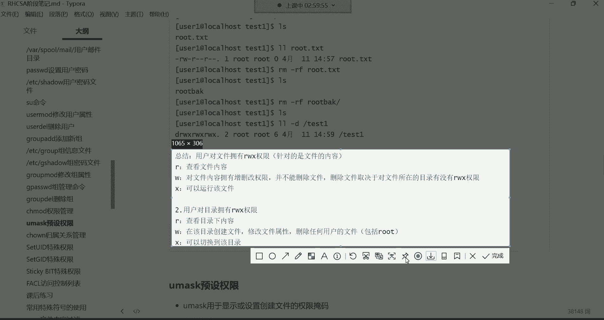
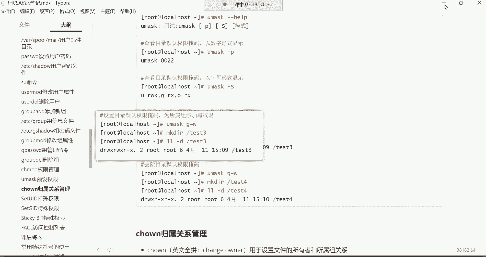

# 0基础小白怎么入门Linux运维？看这套，Linux运维全套培训课程，保姆级教学视频 - P18：红帽RHCSA-18.chmod权限管理 - 小方脸不方- - BV138411B7p5

得开始讲课了嗯，我们这个休息的时间有些长了哈，就超过2分钟了，咱们继续哈，都回来了吗，回来的话赶紧给我刷波一，我们得继续了，对平时这个注意点，身体，咱们讲讲这个什么，接下来该讲权限了，讲完权限以后呢。

大家就会对前面的这个我们讲的用户管理，以及这个组的相关概念呢，就会有一个更加怎么说呢，更加深的一个体会啊，或者说更加理解我们前面讲的那些操作了，权限啊，为什么要为什么要讲这个权限呢。

就是为了控制我们前面在系统里面创建的，那些用户，对于我们系统里的那些文件可以做哪些操作，而这个权限呢，也就是严格把控着咱们系统里面的，众多的文件的啊，规定这个文件到底你能不能读。

能不能对这个文件进行一个增删改查，其实这就是权限啊，因为这个系统的特点就是一切皆文件，就是学习这个怎么去控制，用户对于文件的相关的管理，好，那我们先来说一说这个，先给大家讲讲这个归属关系哈。

归属关系前面我们已经简单介绍过，那这个时候呢我们再再去复习一下，归属关系里面有三类，注意哈，有三类一，那所有者所有组跟其他人，这个U呢就是优势，就是用户的意思，代表是所有者，G呢就是group组的意思。

O就是other，其他的意思，就是分别是用首字母UGO来表示所有者，所有组跟其他人的，而这个所有者是代表什么呢，是代表一个文件或目录的拥有者，一般谁创建的。

比如说我这个用root在系统里面建了一个文件，那个文件就属于root的，那么这样哈我们进到哪个目录呢，咱们进到这个，那么CD到OPT，然后呢把这个目录给他清空一下，星清空所有，清空当前目录所有哈哈哈。

然后呢我们建个文件touch，我们建一个hello，点TT好，建好了，建好之后呢，咱们来看一下这个文件，这个文件的属性，大家来看一下哈，这一部分代表是权限哈，然后呢最左侧代表是文件的类型。

这个我们在第一天就给大家讲过。

可能有的同学已经忘了文件的类型，文件类型是不是分为这个文件目录，还有链接文件等等等等啊。

然后呢，小横杠开头的代表这个东西就是一个文件，所以我们现在来看这个文件的属性的时候，这个小横杠代表它的类型是文件类型的，因为文件有多种类型吗，有这个视频类型的，有音频类型的，图片类型的。

动图类型的等等等等，而它就是一个普通的文本文件，然后这一步呢是权限，然后呢这个root代表是这个文件的所有者，所有者就root创建的，一般就是属于root，然后搜索组就是属于root的基本组。

默认情况下哈，好这是我们对这个归属关系啊，这个所有者所属组呢给大家做了一个介绍，但是呢还有什么呢，还有什么呢，就是那个等一下哈，对就是这个其他人。

什么叫其他人呢，我们系统里面是不是有很多用户啊，咱们看etc下的pass wd的文件，是不是有非常多的用户啊，那我告诉你在这个文件里边的那么多的用户，咱们就拿这个U46来说啊。

什么U46U47这些用户来讲哈，这些用户这些用户就属于对于这个文件的关系，就是其他人的关系，因为什么呢，因为这些用户它既不是文件的拥有者，因为文件的拥有者是root，是文，这个文件是root创建的。

而这些用户呢也并不是，这个文件的组内的成员，因为对于root这个组，我们并没有往里面添加过成员，所以这里面也没有成员，那什么叫其他人呢，other嗯，什么叫其他人呢，就是它既不是所有者。

也不属于我这个文件的组内的成员，这个就被归类到其他人了啊，这就是三类归属关系，其实就是控制这个文件的所有者，还有所属组，还有其他人，这三类用户对这个文件件可以具备哪些权限好，那这个权限这个RW杠。

R杠杠什么代表什么意思呢，这个权限呢就是我现在要给大家讲解的。

叫做基本权限了啊，然后咱们把这个图呢给他拿截截个图过来。

这叫基本权限，这个基本权限呢我们得拿这个文件来说，基本权限呢分为什么呢，分为这个，读写跟执行，在这呢我们叫权限的类别里面分为读写，还有执行横杠代表没有权限，那这个怎么看呢，注意哈。

任何的文件或者说是目录，它的权限位总共是分为九个字段，注意哈，这是九个字段，然后这九个字段是每三个字段，每一组来我给大家划清，划清一个界限，每三个字段为一组，看到了吗，这三个字段这三个字符哈。

每三个字符为一组，然后呢这最左侧这三个字符我先框起来，每三个字符为一组啊，这中间这三个字符好框好了啊，最右边这三个字符，在这儿，来看哈，总共是九个字符，每三个字符为一组，然后它最左侧的这个黄色的框。

里边的这三个字符代表是文件的所有者，对于这个文件的权限都有哪些，中间这个绿色的框里边的那三个字符，是代表这个文件的所属组，对于这个文件的权限都有哪些，然后在这个橙色的框里边的这个代表是谁呢。

是我系统里面的众多的其他用户，什么U41啊等等等等，U42，以此类推，这些其他用户对这个文件的权限，是一个什么样的权限啊，这是总共九个字符是吧，然后现在呢大家能够清楚地看出来。

所有者的权限是在做最左侧这三个字符，然后所有组的权限是在中间这三个字符，其他人的权限是在最右侧这三个字符，那我们现在怎么解读呢，我先给大家讲讲这个权限哈，权限的顺序，权限的顺序呢。

如果这个文件的所有者对于这个文件来讲，它具备的权限是什么权限呢，如果是一个读写执行的权限，那它的顺序应该是量子叫RWX，如果所属组对这个文件的权限，也是具备读写执行的话，那它的权限应该是什么呢。

也是RWXRWX啊，这个往上一点，也是RWX好，那如果是其他人呢，其他人它的权限呢其实也是一样啊，也是RWX，一个意思哈RW这叫全新的顺序，咱们现在就解读，那所有者对这个文件的权限到底是什么权限。

来看一下，首先给大家讲R在这哈，R代表是读取，读取，就是说可以查看这个文件里的内容好，那现在root root哈，作为这个文件的所有者，他首先是具备一个R这个选项的，应该能看清是吧。

那这R在这呢哈R选项，就他可以查看这个文件里的内容，那W呢在这代表是写这个写的话呢，它是具备什么操作呢，叫增删改的操作啊，我们统称为写，就是如果一旦具备这个W写权限，那root它是不是也具备啊。

你看因为它这里面有个w root，对于这个文件是可以进行什么操作呢，比如说我往文件里面增加内容，我往这个文件里面修改啊，我修改里面原有的内容，或者说我删除文件里的内容都可以啊。

这种是具备一个增删改的操作，好，但是呢第三个字符你发现它是一个小横杠，这个小横杠代表是什么意思呢，这个小横杠代表的是没有权限，没有权限哈，那现在问题来了，他没有什么权限。

所以接下来呢我们就会涉及到叫全新的顺序，这个全新的顺序它永远都是RWX，就如果说一个用户，比如root，他对这个文件如果真的是具备读写执行权限，它顺序永远是R在最左侧，W在中间，X在最右侧。

在这三个字符里面哈，这是它的一个顺序，但是呢你看现在root它的这个什么呢，它的这个第三个权限位，第三个字符是小横杠，表示的，那我问一下大家，这第三个小横杠，注意啊，这第三个字符是小横杠。

那代表小横代表没有哪个权限呢，就代表没有这个权限，没有这个X权限，知道吧，如果有的话，就直接是X，如果没有的话，就是小横杠就证明他没有这个执行权限，那它就无法运行这个文件啊，这是所有者的权限的解读。

然后所有组的权限，那我们再说这个所属组，那这时候应该就不难理解了，你看哈中间这三个字符R杠杠R呢，就证明如果说这个root组里面有成员，我们后期是不是可以把用户加入到组里面，哪条命令呢。

前面讲的那个叫g pass w杠A是不是杠A，然后呢用户名，比如说U几UC1给它加入到这个root组里面可以，那以后这个UC1是不是就属于root组了呀，那以后这个root组里面是不是就有个成员了呀。

有个谁呢，有一个U41，假设哈，假设这里面就有了一个U41了，好有了UC1以后呢，那这个组对这个文件的权限是什么权限，UCE就会继承这个组的权限，那这个组对这个文件什么权限呢，就说在这个组里的成员。

是可以查看这个文件里的内容的，但是后边两个权限没有用杠表示的，那就是没有什么呢，没有读，那没有这个写跟执行权限不是哈，那组不是超级组哈，这组没有办法代表超级用户的身份，能理解吧，他们没什么关系哈啊。

然后这个位置呢就是小横杠在哪个权限位，就证明它没有哪个权限，OK那组里的成员没有写跟执行的权限了，然后下边这个啊最右侧这个其他人的权限，其他人也是二杠杠，就是其他人呢也是只读啊，没有写跟执行的权限。

那这就是针对于这个一个文件，他的三类用户啊，所有者所属组跟其他人，他们的一个具体的权限的一个什么一个类别啊，就是RWS分别代表什么含义，以及我们怎么去辨别这三类用户的权限，这就是什么呢，这就是叫U。

这三类用户的权限啊，所有者所有组跟其他人的权限好，OK好，这个位置呢我们说完以后呢，接下来咱们得验证啊，我们得怎么验证呢，咱们去单独创建一个目录吗，别拿我们别拿这个OPT来演示了。

我们看根目录下面有没有能，我们自己建一个MDR，我们再跟下创建一个test的测试目录，然后我们进到这个test里面去，进来之后呢，咱们在这里建个文件，touch一个，Hello，好，这就是一个文件哈。

Hello，这个文件建好以后呢，咱们接下来说说我要改它的权限怎么改啊，但是呢对于这个文件来讲，我们把这个组呢我们换一个组，让这个文件属于另外一个组，这样我们建一个运维组，group i的。

建一个运维运维，正常来讲呢是叫，啊OP ok然后算了吧，我觉得还是拼音吧啊不然你们无法理解，是不是啊，就运维吧，这样能看得懂，是不是啊，这样能看懂OP啊，这个OOPS可能不是很懂，是不是啊，运维嗯。

运维组，然后接下来呢咱们不是有很多用户吗，我们建几个用户哈，我们UI咱们我们前面有很多用户，但是呢我觉得那些用户们可以给它删掉了，删掉哈。

啊operation就是这个运其实OPS是全名叫operation，然后我们简称就叫简，简称叫运维哈，D啊这个开发呢是DV啊，叫development啊，简呃这代表是开发的意思，好的。

咱咱们把这些都给它删掉，我们杠R什么U41，还有U44，还有U45，还有U46啊，U46不能删啊，U47啊，能删上啊，就组呢组没闪，user8都删掉了哈，这个我们再看home呦，是没有没有删掉。

我看一下并不属于UC6，所以不会删除，并不属于UC6，所以不会删除哦，home下啊，不属于它是吧，那咱们直接这样上吗，RM杠2F啊，把home下的US2删掉，还有优色六删掉，US7删掉。

因为用户已经不存在了，你看你id u s o u32也也存在，那就U42删掉，删掉了哈，再删掉U46啊，UUS6不存在了，U47啊也不存在了，OK看一下根目录没有USR的加啊，没有，OK删干净了哈。

咱们建几个用户哈，我们然后拿着用户来给大家演示啊，我们USI的建一个什么呢，建一个汤姆吧啊，这个用户呢也会频繁，会频繁出现在我们这个练习的哼，练习的环境当中，tom用户好。

那我们这个组的话呢再建一个组group i的啊，咱们有运为主了，那我现在记pass wd杠A，我现在要把这个tom用户加入到运维组里边，O好，那现在这个组里面是不是有一个用户了呀。

我们看etc group这个文件的时候嗯，运维组里边多了一个汤姆这个成员好，那接下来咱们干嘛呢，咱们对于这个hello这个文件来讲，我们改一下它的这个什么呢，所属组这个组呢我不让它属于root组。

给它改成那个运维组，怎么改呢。

有一条命令咱们提前给他讲了吧，叫做称之owner。

提前给他讲了吧哈。

称之O呢，这条命令呢是改归属关系的，就是我希望这个文件它的所有者是谁，所有组是谁，可以通过它去改啊，就是用于设置文件的所有者，和所有组织之间的关系，那命令格式呢有三种，第一种称之owner啊。

可以结合一个选项选项杠大R递归，我们一会再说，先不用去管这个选项，称之O呢，后边呢跟上所有者英文的冒号所属组，再跟文档，这叫同时修改文件的所属组啊，所有者和所有者的身份，就拿这个就拿这个文件来说。

我希望这个root这个文件啊，就这个hello，这个文件不是root的吗是吧，我可以这样称之O呢，我希望它的所有者是汤姆英文的冒号，所属组也属于汤姆的初始组，后面跟上hell。

这时候你再看这个hello的文件，你发现它的所有者和所有组就全都变成汤姆了，是不是哈哈OK啊，这是改了归属关系，因为改完归属关系以后，权限就直接注意啊，这汤姆的权限就是所有者的权限了，能理解吧。

所有者权原先这个所有者是root，那root呢继承的权限是最左侧这三个权限位嗯，称之owner，然后你第二种格式呢是这样的，我只改所有者，你看称之owner，我只改所有者哈，那就这样称之O呢。

我希望所有者是root，然后呢，所以说组我不想改了，那这时候就直接跟文件名回车，那时候你再看这个hello，这个文件，你发现诶啊所有者被我们改成root了，但所属组并没有变，是不是啊，哎没错啊。

就是只改所有者的身份，他的风格就是指定所有者是谁就行了，后面跟文件名啊，不会像前面那样繁琐，还得英文的冒号，后面跟搜索组不用，但如果我只想改所属组呢，那这时候呢就英文的冒号所入组。

但是没有前面那个所有者，你比如说我现在这样称之owner啊，我现在要把这个文件的所有组改成root的组，那这个时候呢或者说改成TTT的组，可不可以都可以哈啊，然后这时候呢我们后边跟上文件名回车。

这时你再看这个文件的话，这个文件就属于test组了，能列吧，所以改所属组，只改组的话，就英文的冒号，后边跟上组名，那咱们再给它改成汤姆，把这个组改成tom的组，这个哈tom跟上文件名回车好。

这时我们再来看这个文件，OK好，那这时候就是什么呢，这时候就是怎么改变一个文件的所有者，以及所属组啊，三种命令格式，然后杠大而叫递归，这个递归的话呢，如果你是针对一个目录的话，如果针对一个目录。

它会把这个目录下面所有的文件，以及它的子目录都是什么呢，从头到尾给你改变啊，这个就一般用应用的比较少一些啊，知道一下就行，好那接下来呢我们继续给大家讲这个权限，这个文件现在我们已经给他规划好了。

怎么规划好了呢，文件的所有者是root，然后呢所属组是汤姆，然后汤姆这个组里面有一个成员，这个成员这成员啊不不sorry哈，我改错了啊，不应该改成汤姆，我应该改成什么呢，我应该改成运维组哈，运维组唉。

这样就这样就对了哈，这样对了，那这个组呢属于运维组，然后在组里面有个成员，这个成员是谁呢，是tom，没错吧，哎这时候就对了哈，好那接下来呢我们就可以来说一说，我现在想对这个文件的所有者的权限。

所有手指的权限以及其他人的权限，进行一个修改，怎么改，那这时候啊change mode这个命令可以改，change mode命令格式呢有些复杂了哈，得先指定归属关系啊。

比如现在这个所有者呢没有那个X权限，没有那个执行权限，那我现在想给它加一个执行，那就称之mod，你得指定归属关系哈，归属关系哪里啊，就这呢就这三类，就是你指定一下到底要改谁的权限UG，那我要改所有者的。

那就是UU就是所有者好，我要归属关系指定好了，那接下来呢，那我要对这个所有者的权限进行怎么操作呀，所以接下来呢就操作加减等于号啊，我们先说这个加减哈，加是添加权限，减是去除权限，这个比较好理解是吧。

我要给这个所有者加一个什么权限呢，我要给它加一个执行权限，因为它因为它的执行权限位置是小横杠，它无法执行，所以这时候你给他加一个X，那我就U加S那这是什么呢，指定了归属关系是是谁呢，是这个U啊，所有者。

然后操作符呢我是用加号来指定的，我要给它添加一个权限，那什么权限呢，哎我要给它加一个X的直行权限，最后指定文件名就可以了，叫U加S文件名，Hello，回车，这时候我们再来看这个hello，这个文件。

你看是不是在所有者的这个权限位上面，就变成RWX的呀，主要是什么呢，主要就是个横杠，它现在变成X了，变成执行权限了，一旦变成执行权限，那这时候你可以怎么执行呢，点代表当前斜杠代表当前路径，注意哈。

点代表当前路径吧，斜杠代表当前路径下，我要执行这个文件回车，但是这个这个文件里面什么都没有是吧，没关系，咱们打开这个文件，打开文件以后呢，我们往里面写一句话，echo一个hello root。

然后呢保存退出，注意啊，我现在是把命令写到文件里面了，没关系，后面我们在讲是有脚本的时候，我们再说这种操作，我是把echo这条命令echo是不是输出啊，你echo什么都给你输出什么啊。

那我就把echo放到文件里面了，然后由于这个文件现在具备一个X的执行权限，那你就可以干嘛呀，点杠再把当前路径我执行这个文件回车，他就帮你去执行这个文件里的命令了，这波操作现在看不懂也没关系哈。

我们就是为了演示这个执行权限，看到了吗，有了执行权限，你就可以运行这个文件好，那这个时候我再把执行权限给它去除，称之mod所有者减号代表去除，去除什么原因呢，X去除执行权限，指定文件名回车。

这时候你如果在点杠当前路径，执行这个文件回车，你发现提示你权限不够了，你看了吗，哎这时候就告诉你权限不够了，为什么呢，因为你没有那个执行权限，我把那个执行权限给它去掉了，看到了吗。

他这个执行权限位又变成一个小横杠，就是执行不了了，能列吧啊，这是我们所说的这个执行权限，然后还有这个什么，还有这个W写权限，写圈就决定说你能不能打开这个文件吗，文件里面写内容，我。

我我们刚刚之所以能够把这句话，写到这个文件里面，是因为我们具备这个W权限，能理解吗，具备W选项，所以你现在如果把这个W全给它去除的话，怎么称之mod，就U减W去除它的这个写入的权限的话。

那这个时候你看哈我们去除了是吧，然后我们再VIM打开这个文件，这时候我再往里面写一句话，这句话你看我EO一个hello linux，这时候我再保存退出，你看我快，我用快捷的操作去保存退出的。

这时候你看它提示我说什么read only，这是一个只读文件，你想保存退出，就是你对这个文件的权限是只读的，你只有一个那个R权限能理解吧，只有一个R权限，所以你是不具备这个写权限的。

但由于你是root啊，其实也不能说你是root吧，就如果你真的是想保存的话，你可以尝试一下，用叹号强制执行保存退出，所以这时候咱们就得WQ叹号强制保存退出，这样才可以，就是因为这个没有写权限了，看了吗。

没有写权限了，被你去除了，但是呢由于我们当前用的是这个root账号，root账号呢对于这个权限来讲其实也无所谓，你不让我写，我也能写，你不让我读，我也能读，能理解吧，趁着mod啊。

U减R看到没有读权限了，这时候是吧，三个权限位都变成小横杠了吧是吧，那就证明三个权限现在都没有了，那这时候你看他能不能打开这个文件，仍然可以打开，仍然可以看是不是没有任何问题，所以权限对root来讲呢。

它起不到任何的控制作用啊，所以拿root去对这个权限做实验，也其实没有太大的意义，拿谁呢，哎只要不是root，拿谁都行，咱们现在换一个汤姆，我给汤姆设个密码，让他登录系统嗯，汤姆密码一一好。

然后汤姆呢登录系统，tom密码一，汤姆呢是不是属于这个文件的组里的成员呢，没错吧，是不是属于这个运维组里的成员呢，好呢，汤姆他会继承这个什么呢，这个组对这个文件的权限呢，什么权限呢。

R杠杠中间这三个权限位只读完了汤姆，他进到这个test目录，他可以看这个文件里的内容，看到了吗，他可以正常查看这个文件里的内容，但是如果他想干嘛呢，比如说我想打开这个文件，我想往里边写点东西。

你看他可不可以哈，我echo一个，hello汤姆，然后呢，我WQ叹号保存退出，是不是系统直接提示说这是一个只读文件，你得加叹号啊，没错吧，不行吧不行，那怎么办，那咱们也试试，我WQ叹号的时候。

我看看他到底能不能让我保存退出呢，回车你看系统直接提示说什么，说你根本无法打开并写入这个文件，为什么呀，因为你的权限就是一个R的只读权限，只只能读取，那你说root也只能读取。

为什么root他加了叹号以后，他能强制保存退出啊是吧，为什么呢，因为root是老流氓，你比不了权限，对他来讲控制不了，能理解吧，但是你作为一个普通用户来讲呢，权限说白了就是给你准备的哈。

哈就是给你们这些普通用户准备的啊，所以权限呢嗯所以他们是要严格遵守哈，这就是资本家，是不是啊，没错呵呵，资本家他们强制保存退出是不管用的哈，不管用，知道一下哈，好了，就尽量别拿root去验证了。

因为你验证的时候，你发现诶这怎么不好使是吧，所以这时候他怎么办，他只能Q叹号吧，Q叹号不保存退出，是不是啊，哎不保存，那这就是内容没有写进去，看到了吗，仍然是圆形的两行内容，OK啊，这就是所属组啊。

搜索组，你们现在知道这个组的应用场景了吗，我先问一下大家哈，就是我们前面为什么要要通过这个什么group ADD，去建一个组，比如我建一个运维组是吧，然后我为什么要通过这个g pass wd杠A。

我要往这个组里面添加成员，为什么呢，其实就是干嘛呀，就比如说我现在在公司里边，这公司里面有很多部门，很多部门的话呢，你比如说就是有这个运维，有开发，有测试这三个部门，运维开发跟测试这三个部门。

那这三个部门的话呢，你比如说他们在这个服务器里边啊，都有自己的一些资料啊，或者说文件的话，那一般呢你比如我开发部门的员工，那是不是我得让他针对我开发部门的一些，相关的文件可以具备一定的权限呢，没错吧。

那怎么办呢，那我就把我自己部门的员工给它加入到什么呢，加入到我这个开发组里边啊，简称开发组好，这个这就是一个组啊，加入到开发组，加入到组里面以后呢，然后呢，比如说我希望我的组里的成员。

对哪个文件有具备权限，我就直接把这个所属组改成我的开发组，不就行了吗，注意把，比如我希望我的这三个成员，对于这个文件可以具备什么，什么读写执行的权限，那这时候我是不是就直接把这个组给他，改成我的开发组。

然后把这个权限改成什么呢，改成读写执行就可以了，所以现在你比如我就希望我的这个汤姆，汤姆这个用户对于这个文件可以具备读写执行，但是别人不行，其他人是不行的，那这时候我就这样陈之不能指定呃，G加什么呢。

WX然后指定文件名回车，这时你再看这个文件的话，你发现这个所属组的权限就变成RWX了，那这个时候所属组的权限一旦变成RWX了啊，那这时候主要是谁，就具备W这个这个完全权限了，tom汤姆，汤姆，这个用户。

现在对这个文件就具备一个读写执行的权限，而没有载我这个组里的成员，就是你系统里边的其他的那些用户，那些账号他们是都不会具备这个权限的，他们具备的权限是在这呢，在这呢其他人。

啊所以很多同学在组这个位置不是很好理解，说我们为什么要去创建这个组是吧，其实这个组就是把同类的用户加入到了什么呢，加入到同一个组里边，你比如我这个部门里面还有员工，我再建一个用户就side的啊。

建一个张三，给他设个密码，啊张三呢也是我运维部门的，我也希望张三对这个文件拥有一个，什么样的权限呢，用一个读写执行的权限，那怎么办，嗯现在应该怎么办呢，我希望张三也可以对这个文件，具备一个读写执行权限。

但张三他现在的身份是其他人的身份，注意哈，张三现在既不是文件的拥有者，我也没有给他加到这个组里边，他的身份就是在这儿呢，其他人的权限，其他人只读，所以这是你最好的方法，就是什么呢，就是。

把张三给它加入到我这个运维组里面，那以后张三对这个文件的权限看，就是你的那个组，就是他的所属组，那个文件的所属组，对这个文件的权限，它CD到这个test目录，看到了吗，张三以后它的权限就是这个权限。

RWX完全权限，但是别人是不行的啊，现在只有汤姆跟张三对，这个文件可以具备这样的权限，别人是不行的，也就是说，如果这个文件是你们运维部门的，相关的文件的话，那这时候你就希望你自己部门的员工。

可以针对这个文件做一些读写执行的操作，别人不可以的话，那这时候你就干嘛呀，在服务器里面建一个组，这个组就是你自己部门的，然后你可以把你自己部门的成员，都加入到这个组里边，然后呢在干嘛呀。

再把这个组的权限一设置好，那你所有部门的成员注意哈，你所有部门的成员都会继承这个组的权限，没错，所以这就是为什么会有这个组对可读可写，可执行了，现在就是那这时候你看张三现在想看这个文件，可是我可以看。

想往文件里面写点东西，另起一行，我echo一个，Hello，张三保存退出，你看没有任何提示吧，看到了吧是吧，是不是直接写进去了，想执行回车，是不是啊，唉你看这又张三现在可以做这些事情啊，但是别人可以吗。

tom也可以哈，tom他俩都可以，tom现在打开这个文件，IO一个hello，汤姆保存退出诶，没有任何问题吧，你看是不是写进去了最后一行汤姆，然后呢执行没有任何问题吧，是不是，EQ的命令执行。

就给你输出文件里的这四行内容了，然后接下来呢那你再建一个账号，比如我现在建一个US的，我见一个老王，建一个老王，给老王设个密码，好老王登录系统，他是谁，他就是其他人，他跟那个文件没什么关系。

你看老王登录系统，老王他进到这个test目录，他想对这个文件操作的话，比如看可不可以呢可以，但是他想打开文件可不可以呢可以，但是想写东西那就不可以了，比如IO一个hello，老王保存退出的时候。

WQ你看说这是一个只读文件，为什么呀，是你WQ叹号也不行啊，无法写入，所以你只能Q叹号不保存退出啊，为什么呢，是因为老王的权限他要在那儿摆着呢，他的权限是这其他人知道吧，老王是其他人呢。

因为老王他可不是文件的所有者，所有者是root吧，是不是啊，而且我没有把老王加入到这个运维这个组里面，所以它也不属于我这个组里的成员，所以他的权限就被归类到了其他人了，就在这儿呢。

就只读别的权利都没有了得了吧，那如果我现在我想权限把控更加严格一些，其他人我连看都不让看的话，那咱们就这样，那直接在root这边设置权限，趁着mod就其他人就O什么呀，O减R其他人现在不是有有毒权限吗。

好那我现在把这个其他人的权限，其他人的选项，而且是其他人那个读权限，我给他什么呢，我给他通过减号给它去除掉，那O减R指定文件名回车，那时候你再来看这个文件的话，你看其他人的选项，现在就杠杠杠是吧。

没有任何权限了，那这时候老王作为其他人，再想看这个文件的内容的话，你发现看都看不了了，没错吧，唉这就是怎么说呢，我自己部门的文件，我现在希望什么呢，我现在希望只有我自己部门的员工，可以具备一定的权限。

而别人连看都不让看，那你就可以这样玩啊，当然所有者去除啊，去除所有者哈，因为所有者他想干嘛就干嘛，现在能够理解这个权限了是吧，啊那后面呢，什么后面什么后面呢，RWX什么后面的就是这个权限吗。

现在无非就是你想给谁添加权限，给谁去除权限呢，那你现在你了解的权限都有哪些了，其实就这三种啊，读写执行不是有三组吗，是有三组，第一组所有者的，在这第一组所有者，第二组呢所属组是吧，第三组其他人哈哈。

你们是想，你们是想问我这个其他人的权限怎么设置吗，是吗，啊其他人的权限怎么设置是吧，一样了，这个，其他人的权限设置，就是跟前面这种没有太大区别了，那就趁着mod看，就是O呗。

那其他人不就是用O来表示的吗，所以你换个O就可以了，比如我想我想给其他人加一个权限，给他加一个读权限，我让他可以读，那叫O加R，这这样就可以了，嗯啊给它加一个R权限，这时候你再看这个文件的话。

他的权限是不是，其他人这个位置就有一个什么呢，就一个R权限了呀，啊可以读了，但是没有写，没有执行是吧，那我也希望他可以写，那你就趁着mod，那就O加W回车再看啊，再看，那他现在就多了一个W权限了。

那多了W权限以后呢，老王现在再打开这个文件的话，他就可以写了，现在就可以写了哈，那现在我们echo一个hello，老王保存退出A没有任何问题了，看到了吗，写进去了吧，来写去了，但他想执行点杠啊。

点杠你发现他执行不了，说权限不够是吧，为什么呢，因为压根儿我也没有给他执行权限呢，我给他读写权限，但是我没有给他执行，是不是没有给他执行权限，所以它无法执行，如果你也希望他可以执行。

那就称之mod叫O加X，就是你再看这个文件的话呢，你发现它就具备这个读写执行的权限了啊，这样就可以了，那这时候老王就可以这样点杠执行这个文件了，看到了吗，这也没有任何问题了吧，OK以上就是怎么去给那个。

所有者所有组跟其他人去设置这个权限。

所以你发现我们学完权限以后，咱们前面讲的这个用户管理就能够什么呢，很好地结合起来去学习了，是不是啊，我们从这个创建用户，以及呢我们再去创建这个组，在这儿创建组，然后呢再往组里面去添加成员。

然后再结合权限，这时候呢应该这个思路就出来了，我们建用户呢是干嘛呢啊这时候仔细听哈，我们创建用户为了什么呢，是为了把这个账号发给你们公司的员工啊，让他们可以使用这个账号登录系统，好。

那我们创建组又是为了什么呢，啊，是把相同类型的账号给它加入到相同的组里面，比如说这个账号是运维部门的账号是吧，那运维部门可能会有很多人，那我们就可以把这个所有运维部门的账号。

加入到同一个组里边以后干嘛呀，对于组的权限的一个把控啊，然后呢就是不是通过这条命令把这个成员啊，或者把这个账号加到组里边呢，加入到足以后呢，那学习了权限以后，在学习了这个归属关系以后。

我们就可以针对于某些文件啊，我把它的归属关系给它改一改啊，主要是改的那个组哈，把他那个文件的所属组给它改成什么呢，改成我们这个相关的那个组就可以了啊，比如我的部门的组，然后呢。

这时候呢再对我这个部门的组的权限，进行一个相应的授权，那以后这些账号他就会继承这个组，对这个文件的权限，这就是其实这些东西都是相互关联的，你们有没有发现，就是对于用户管理组管理权限管理啊。

相互关联的，那这时候呢你再去理解，你说我们为什么要学习前面的组管理啊，为什么要学习这个什么这个往组里面添加成员，建这个账号等等等等，干什么用是吧，其实这时候思路应该清晰了，没错吧。

这时候应该就不难理解了，主要是OK好了，这是这个权限，然后下面还有一个等于号没有讲是吧，等于号要重新定义权限啊，重新定义权限呢，这个就是他用法呢比较粗暴一些，怎么粗暴呢。

你看我们就拿这个hello这个文件来说，它怎么粗暴哈，我现在就希望这个文件的所有者，就是U所有者哈，它的权限是什么呢，它的权限是读写执行，我希望所属组嗯，它的权限是读写权限。

然后我希望其他人他的权限是什么呢，没有任何权限，那这个权限我想一条命令去设置，怎么设置呢，冲啊这个重新定义哈，这叫比较省事儿，怎么比较省事儿呢，就这样，趁着mod u等于RWS逗号隔开，注意哈。

逗号隔开在指定G组的权限，等于RW逗号再隔开O等于什么呢，杠杠杠回车，你看哈，现在啊这个文件的权限就是我们所期望的那个，那那那个权限了哈啊，就是所有者读写执行所属组呢读写是吧，其他人呢没有任何权限。

这里面呢我们又涉及到了一个什么呢，就是这个逗号，这个逗号的话呢可以同时给这三类用户去授权，用逗号隔开就可以了啊，逗号分隔啊，然后等号呢就重新定义这个重新定义它的特点，就是他不去关心原先的权限是什么。

它不关心原先的权限是什么，而且你也不需要去指定什么加号跟减号了，就是我就希望你是什么呢，读写执行的权限我就指定就可以了，所以这叫重新定义了哈啊这个好用是吧嗯对，所以说你想怎么定义就怎么定义O。

那把运维组的啊root就没没有办法管理了吗，呃就是你只要给他相应的权限，它就能够继承那个权限，也不能说没有办法管理了，就是它权限就是具备读写执行，你不能说root不能管理，因为你欺负你，因为你让别人改。

别人可以具备写权限，那人家就可以写，但是如果后期你说，我不希望它具备这个写权限了，那没关系啊，他们你再把权限给它去除就可以了，但是这种东西，你即便给它加上什么读写执行权限，你像汤姆哈。

他咱们就再给大家演示一下，它不能改哈，它不能改自己权限，你不是汤姆，可不可以使用这条命令去干嘛呀，比如改我自己的这个组的权限可不可以呢，比如说我这样啊，G等于RWX对这个hello这件这不行的哈啊。

这不允许的操作，而且这条命令他用不了是吧，这条命令不是说他用不了，是这条命令只有所有者才可以用，只有所有者，而所有者又是root，不是tom，但如果你说我tom，我自己建个文件。

我改自己的权限可不可以给他可以，但是这个文件不是他建的，他不是所有者，所以这他使用不了那条称之mod这条命令哈，啊这个你要搞清楚，但是如果你希望别人具备这个写权限，你已经给人家了，那没办法，OK好了。

然后下面还有一个这个数字的表示法，这个权限数字表示法呢给大家讲一讲哈，数字表示法，这个数字表示法呢也比较简单。

就是我们可以通过一些数字去干嘛，去设置这个权限，我们来看一下这个数字表示法里边呃，其中呢有这个，还有二还有这个一，还有这个零啊，这四个数字，那首先呢这个读如果你想用数字设置的话。

就是四写对应的是2X执行对应的是一，没有权限对应的是零，那这个时候我想干嘛呢，我想对于这个文件来讲，我想把所有者的权限这样设置哈，所有者我希望这个就是所有者U是一个读写，读写所组呢只读啊。

或者说也是读写，其他人呢是只读其他人是只读权限，那这时候我们如果换成数字怎么设置呢，非常简单啊，就是十以内的加减法，注意十以内的加减法，嗯对啊，他就是入道的小弟，哈哈你看啊，我现在希望所有者是读写。

那你就干嘛呀，读读是四是吧，写是二，那就是4+2，就是4+2哈，所有者你怎么说呢，他的权就是4+2就可以了，在这就4+2=6啊，那所有组呢，所以说组我希望他是读写，那也是4+2=6好。

那其他人呢我希望它只读，那就是四，所以这个权限最终就是什么呢，就是叫做最终的权限就是664啊，第一个六是所有者的权限，第二个六是所有组的权限，第三个四是其他人的权限，所以我现在可以通过这三个数字去设置。

这三类用户的这样的权限了啊，就这样就称之mod是664664哈，指定hello，这个文件，你再看这个文件好，所有者读写，看到了吗，所属组读写，其他人只读唉哟这个好像有些复杂了啊，这个不好用了是吧。

对这个不好用，这个复杂了，主要是得需要嗯，怎么说呢，得需要考验你这个十以内的加减法，你的这个运算能力，所以这个呢一般看情况哈，看情况，如果你觉得哎哟这个不是很好去记忆是吧，那就算了哈，那就算了。

我这小学数学我算的也不是特别好，那就不要去通过这种方法去设置了，你就通过记记那个字母就行了，能理解吧，记字母，这就是我们所说的这个，这个什么呢，就是这个权限号数字表示法嗯，一般不用数字是吧，看情况。

反正有数字啊，有数字，然后大家在设置的时候，你一定要记录一下，你用数字设置的时候，你不能什么呢，不能少一位哈，你比如说我现在想给其他人的权限加一个W，而这个所有者跟搜索组我都不想改变了。

你比如说我就这样称之mod，我就直接指定其他人的权限可以吗，你没法指，你说我用我就用一个数字可以吗，比如说几下六，他没有报错，但是你看文件权限的时候，你发现确实其他人的权限变成读写了，变成读写了哈。

就你加了一个W了，但是你发现前面权限变成零了，是不是啊，为什么呀，因为前面权限如果你不指定默认注意啊，默认给你补零两个零，知道吧，然后边这个六是属于第三个位置的，他前面给你补俩零，而零代表是没有权限。

所以最终的效果就是，所有者搜索组权限变成零了，而其他人呢变成六了啊，是量子哈，所以一般数字如果一旦用数字设置的话，三个数字一个都不能少，即便说你我所有者的权限，或者说所属组我都不想改变。

那这个数字也一定要写上去才行，啊，能理解吧，发的什么呀，我看一眼啊，入职运维要掌握技术，啊入职因为要掌握技术是吧，没错哈哈哈没错，你这话说你这确实是总结的非常到位哈，啊其他啊，其他结构看到了。

你当然你入职运维，你可能要掌握技术啊，你不掌握技术，你怎么去干呢是吧，你想挣这份钱是吧啊，哪些操作是属于执行权限XX啊，哪些操作就你想运行这个文件的话，当然哈就是这种东西呢。

一般我们后期在学习是有脚本的时候，文件里面得是命令，这个文文件里面，你把命令写到文件里面，给他一个执行权限，它就自动干嘛帮你执行这个文件里的命令了啊，后期学习是有脚本的时候，啊你光能想到打开是执行。

不是打开，是这个RR是能让你打开这个文件的，你能够看啊，W是能够改文件里的内容，或者往往或者说往文件里面增加内容，X是能不能运行它啊，是这个含义。

好了，那这个数字比二八我们也也说清楚了，是不是啊，那下边给大家做个小总结啊，我这个笔记里面有总结哈，有总结这个总结大家一定要什么呢，一定要给它理解透了哈，我们我们今天这个争取把权限讲完好吧。

争取把权限讲完，这个总结呢是一个什么总结呢，是文件的权限总结，注意哈，我再给大家强调一遍，这个权限是文件的权限总结，并不是目录的权限，因为文件的权限跟目录的权限它不一样，知道吧。

所以你先看文件的权限总结，当用户对文件拥有RWX权限的时候，它是针对的是文件的内容，注意哈，这些权限都是针对于文件的内容的，不是文件本身，你看一个用户对文件具备R，那它可以查看文件的什么呢。

叫内容作为W，它可以对文件的内容拥有增删改的这种权限，并不能删除文件。

你就假设我们现在呃，这个我给其他人给他设置个权限，这样我们称之mod就O等于RWX看这个文件，那现在其他人是不具备读写执行了呀，那现在老王就是其他人，老王一看我对这个文件的权限啊，已经是一个完全权限了。

能读能写，能执行，那他能删这个文件吗，RM跟rf hello，能不能删呢，我告诉你不能删，不能删，为什么不能删呢，新闻很多人就纠结了，我不是具备这个，他不是具备这个W吗，W不是增删改吗，但是你要记住。

它的增删改是针对文件里边的内容，它可以增删改，它打开它对文件的内容，你比如我文件里面写东西，可以EQ一个hello叉叉OO吗，嗯这可以没有任何问题，我再删，我把汤姆这个给它删掉啊，保存退出，你看哎。

但对于文件的内容哈，没有任何问题，但如果你想让他删删这个文件，那你可甭想删不了。

为什么呢，你要想删除文件，取决于说你得看这个文件的所在目录。

有没有相应的权限，也就是说你想删这个文件，你得看看这个文件的目录的权限，这个文件在哪呢，这个文件是在根下的test目录里边的，在这个目录，所以你得看他的目录的权限L了，L杠D直接跟上台词目录能理解吧。

他能不能删除这个文件，得看他对目录的权限，它对目录的权限是什么权限呢，而X因为它也不是目录的所有者，所有者是root，它也不属于root的组里的成员，那他只能是被归类到了其他人了。

而其他人的权限不就在这吗，目录也一样，其他人的权限在这儿，那它就只有一个什么呢，R跟X好，那对目录来讲，这个RX或者说RWX，这权限跟文件的含义一样吗。

它不一样啊，这对于目录的权限，咱们给大家验证一下，把这两个总结啊，我们一做对比。

咱们就拿这个目录来说，现在呢比如老王他想删除这个文件，它不能删，因为他对目录没有权限，是不是好，那这时候我们在验证这个什么呢，这个R对目录来注意，用户对目录如果拥有RWS选项。

第一个R是可以查看目录下的内容的，那如果现在看看老王退出这个目录，我把这个目录的权限给它改一改，称之mod干嘛呢，我O减R对根下的test目录，这时候我们来看这个目录，看目录本身啊，加杠D选项，注意啊。

杠D看目录本身，那这时候呢你看我们看那个test目录的时候，你看哈老王的权限是不是没有什么了呢，没有那个R读权限了，没有了吧，好那这时候老王再想打开这个目录，ALOS更新了test，你发现哎呦。

打不开了，你看到了吗，是不是打不开这个test目录了，为什么呢，因为它没有这个R权限了，没有R没有R他就没有办法查看目录下的内容，还有这个X，X是决定你能不能切换到这个目录里面的，而对于文件来讲呢。

是你能不能执行这个文件是吧，他跟文件的权限不一样的，你看老王他现在想切换到这个test目录，这也没有任何问题，他进来了，看到了吗，是不是切换下来了呀，为什么能切换呢，是因为它有这个X权限，X。

是能不能决定，你能不能切换到一个目录里面去的，但如果现在他退出这个目录啊，sorry哈啊对，CD我们这样我们称之目的啊，O，X对test目录，我把它的执行权限也给它去，除，杠D哈杠D。

啊这这里边有一个什么呢，啊这个什么情况好，港D跟下的test，大家看一下啊，现在老王是不是连X权限都没有了呀，那他现在如果再想切的话，cad到test目录，你发现切也切不进去了，切也切不进去了哈。

为什么切不进去了呢，为什么呀，为什么呀，是因为它没有X权限啊，没有这个X权限，但如果你一旦给他一个X，它就能切进去来看一下啊，非常神奇啊，我们O加O加一个X对太子目录，那这时候呢一旦有了这个X选项了。

看到了吗，是不是多了一个X，这时候老王就能够CD到这个test目录了，但是他看不了，为什么看不了呢，因为他没有那个读权限，哎你发现这东西很奇怪，我可以让你进来，但是呢你看不到里面的东西，这有点意思。

是不是，所以对目录来讲，权限是不是这样给就不合理啊，如果你希望它能够进去，你是不是就应该再给他一个R权限，可以查看目录下的内容，是不是，不然这跟带套没啥区别是吧，没有体验感啊，哈哈哈哈哈啊哈。

那这个我们就给他一个什么呢哈给他一个，当然啊我说一个嗯哼哼我没有其他意思啊，没有其他意思啊，这个没有其他意思啊，那这时我们再来什么呢啊再来看是吧，是不是就RX啊，对不对，那这时候呢我们在什么呢。

在这个这样哈，咱这班里边应该没有女，没有女学生是吧，我看有有有没有女孩子，哈哈这个有有有有女孩子是吗，哈哈哈哈哈哈啊，完了是吧，没关系没关系，那接下来呢我们再这样哈，再再这样。

我们这个他在打开这个目录是吧，再打开这个test目录啊，不用直接在里面了是吧，LS那就可以看了是吧，哼哼哼啊，没关系啊，现在这个女孩子呢也非常的奔放，那就有对啊，现在的女孩子呢也也也很奔放啊。

毕竟我们说这个都是什么社会了是吧，都是这个开放社会了，那你看现在这个你给他一个R权限，它是不是就可以读了，对大家都是成年人了是吧对都是成年人，什么都懂哈，对什么都懂哈啊哈现在年轻人比你懂得多。

所以呢你你也不要害羞哈，不要害羞，这就是我们所说的这个什么呢，嗯每次看录播都挺难受是吧，怎么难受啊，哼哼单身是吧，难受吗，起反应了是吧，起反应了吧，这哈哈哈，啊要去厕所是吧，哈哈哈好这个。

这就是我们的什么呢，叫，精神的粮食，是不是啊啊，能够让我们有这种学习的这种这个，这个这个动力是吧，能够提神提神醒脑这种东西就是精神的良药啊，嗯哈哈哈哈哈好，那下面呢我们这个是不是可以看了呀。

可以看就取决于说你给他了一个这个读权限了，看到了吗，然后下边这个呵呵I这个W啊，这个我们说说这个W这个W这个权限，大家一定要注意哈，这个在目录上边是可以在目录里面去建文件的，以及对文件的属性进行修改。

甚至是删除任何用户的文件，就是说你在没有给这个目录W权限的时候，那这个用户呢，他只能对这个目录下的文件进行哪些操作呢，啊进行比如说啊看文件啊，就是对于文件哈，它本身的属性是不能造成任何修改的。

什么意思啊，就是我想改给这个文件改个名，比如说我这个hello改成叉叉O可以吗，你发现改不了，能连吧，他是改不了的哈，以及我想干嘛呢，我想删除这个文件，它都删不了，Hello，删不了删不了哈。

但如果你说我一旦是给他加了一个W权限了，看哈称之mod o加个W对更新的TT目录，这时候他是不是拥有一个W选项了呀，看这哈，主要看这是不是多了一个W选项啊，好那这个时候他就可以做这波操作了，你看哈。

这时候对于这个目录下的文件，他想删就删，Rm rf，Hello，没了被删了哈，现在你甭说是谁建的文件，它都能删了，你root建个文件，它是一个啊，我们见面之一哈。

让他叫root点TIT这个文件不就root键的吗，你看是不是所有者是root呀，所有数组也是root吧，权限呢别人呢都是只读的，是不是啊，我告诉你没用没有用，老王该删就删RM rf，看到了吗，该删就删。

汤姆，你说我汤姆，我建个文件让他叫汤姆点TT，建好了，老王一看，这里面又多了一个文件，好汤姆是吧，山看着不顺眼啊，看到了吗，为什么能删呢，之所以能删的原因是他对这个目录注意哈，具备一个这个W这个权限了。

而且他也能够在这个目录去建文件了，touch一个老网点TT看到了吗，建好了哈，所以说一旦对目录具备W权限，它就可以在这个目录下创建文件，修改文件属性，这个文件属性主要是改个名什么的都可以改了。

甚至是删除任何用户的文件，当然也包括root，注意哈，root在这建的文件也该删就删，所以这目录跟文件的权限你发现它不太一样，你就一定要搞清楚文件这三个权限，它具体的含义是什么。

目录这三个权限它具体的含义，或者说功能是什么，那权限这位置你就理解理解透了，因为你们在学习学时候，有时候会经常犯一个毛病，什么毛病呢，就是你可能会觉得哈，你看咱们把这个目录的W全给它去掉哈。

然后我建一个文件，建一个比如说hello这么一个文件，然后呢我这样称之mod，就是UGO都等于RWX，这样也可以哈哈这三类用户你看一下哈，这三类用户呢它的权限都是什么呢，都是这个读写执行了完全权限了哈。

然后这时候你们可能就会犯一个毛病，什么毛病就是我对这个文件的权限，我拥有一个W权限，但是我为什么不能删呢，你不能删的原因跟文件的本身权限没什么关系，知道吧，跟本身没什么关系，它关系在你这个文件。

它的父目录，父目录能理解吧，所以这时候就涉及到了一个什么问题呢，就是我们在系统的根下边，你发现大多数的目录都是谁的呢，你看一下哈，我们杠D根目录，这样看根目录，你看哈，咱们看根目录。

根目录下面的这些子目录，什么boot目录d EV e t c home，这些目录你看一下啊，就这些目录，这是大多数针对于那些普通用户来讲，它的权限都是RX同理吧，但链接文件的权限不准确，注意哈。

不要看链接文件的权限，链接文件权限我第一天就给大家讲了，我说链接文件的权限要取决于它的源文件的，能理解吧，而源文件你放心，它也都是针对于其他用户，都是能读能执行的这么一个权限，所以系统里边这些普通用户。

什么老王啊，张三啊，汤姆啊，他为什么无法说在系统的这些目录，比如说建文件的删除这个文件呢，为什么呢，因为他对这个目录本身没有那个W权限，知道吧，没有W权限，所以这个你就会发现，其实对于这个系统来讲。

普通用户，它压根儿对于系统里边的这些，就是99%的目录，都无法去做这种删除的操作，能列吧，嗯DR是什么权限，这个D是属性，这个D哈，你们可能都忘了，这不是这个文件的类型吗，这不是目录的类型吗。

类型是目录，那R2刚讲完，对R咱们刚讲完，那不读吗，读权限吗，这就是普通用户哈，无法在系统的这些目录下面去做什么，增删改的操作啊，建文件改文件，删文件它都无法去做的，能理解吧，所以对于文件的权限呢。

大家去一定要把这两个总结给他记住就可以了，这文件这个权限你就能够掌握的差不多了啊。

然后在用的时候呢，没有太多什么的，没有太多可介绍的，无非就是你只要只要是掌握这些归属关系，都有哪些权限类别都有哪些，然后怎么去通过这些操作符，或者说这些这个数字表示法，去设置这个权限就可以了。

其他就没什么，还有一个your mask，You mask，但是这还有一个递归哈，哦我们不能说常用的选项叫做不常用的选项，这儿有一个不常用选项，叫修改目录下所有的子文件与子目录的权限。

与父目录相同，什么意思呢，就是咱们假设哈这个E这个test目录这些文件，大家看一下它们的权限的话呢都不太一样，你看到了吗，都不太一样，但是我想干嘛呢，我想把这个目录下的所有的文件。

它的权限都改成跟我这个父目录一样的，可不可以呢，父目录就当前目录test目录看到了吗，所有者能读能写能执行，所有组能读能执行，然后其他人也能读能执行，但是这种需求一般不会去设置，为什么呢。

因为我们一般不会去把一个文件的权限设置的，跟目录是一样的权限的，能理解吧，因为有的普通文件，像这种普通文件是不需要执行的，里边就是普通的数据不需要执行，不像命令命令可以让你执行。

普通的数据是不需要执行的，知道吧，所以一般这种需求没有没有。

所以这个选项你也不用记，不用浪费时间去记这个选项，好然后下面还有一个u Mark，这叫权限的掩码啊，这个权限掩码呢是干什么用的呢，就是它是针对目录的权限掩码哈。

就是我们建一个目录以后，目录的默认权限是什么，来看一下我们make dr在跟下建一个，比如说test1这么一个目录，然后你看一下test1这个目录的权限，所有者是能读能写能执行是吧。

所以说组呢是能读能执行，其他人也是能读能执行这么一个权限啊，now现在咱们说一下，为什么说我建一个目录，默认的权限就是这样子的吗，我难道就不能说，让所属组具备一个跟所有者一样的权限吗，可以吗，可以。

You mask，注意啊，这要权限的掩码，这个掩码就决定说你建一个目录以后，它的默认权限是什么，但是呢你直接敲的话，你发现这个是一个数字是吧，这个数字你好像看不太懂这个权限的掩码呢。

它是一个权限的去除显示方式，什么叫做去除显示方式呢，就是首先是用数字来给你表示的，它这里面是有四个权限是吧，有四个权限位，你看0022，这第一个零呢，大家现在先不用去管它，这是一个特殊的权限啊。

我们后面再讲特殊权限哈，但是这零就代表说没有特殊权限，注意哈，这个零就代表这个目录是默认，是没有特殊权限的啊，那第二个零是什么呢，是所有者的权限，这个所有者也没有被去除任何的权限，没有被去除特殊权限啊。

sorry啊，没有被去除任何的权限，那没有被去除任何的权限，代表什么意思，就是所有者是一个什么样的权限呢，就是这个读写执行的权限，读写执行，然后这个二呢是所属组的权限，在这。

在这哈这是一个所属组的权限好，那这个所属组的权限为什么是二呢，注意它叫权限去除法，你就说这个所属组的权限被去除了什么呢，那个二那个二对应的是什么呀，W对应的数字就是二，而这个R呢对应的数字是四是吧。

X对应的数字是一，所以说你现在看的话，就是这个所属组的权限是被去除了，写写这个权限了，所以你看所属组压根就没有那个W啊，他是这个含义啊，去除了写权限，其他人也一样，其他人也是二。

就证明其他人也去除了那个写权限了，所以再建一个目录以后，你默认的权限就是所有者是一个完全的权限，没有被去除，任何的权限用零来告诉你了啊，没有被去除，所以说组呢去除了W对应的数字就是二，哎他告诉你了。

我把他的二选项给去除了，其他人也一样。

把他的二的选项去除了，你反正这样看不是很好理解，所以呢这命啊有个选项叫什么呢，叫杠S啊，大S大S是查看它的默认权限掩码的时候，以字母的形式来显示。

你就直接这样，you must杠大S回车，这样他就会告诉你了，你建一个目录以后，所有者的权限是RWX，所以说组呢就是RX，其他人也是RX，比这样看起来会更加清晰一些是吧，但是这个对于我们来讲有什么用啊。

没什么用，你不需要去改它，目录目录哈，这是针对目录的，所以你就不需要去改它哈，不需要改，默认就这个权限就可以。

OK能理解吧，但如果你想改，你说我能不能改啊，可以啊，你比如说我希望那个什么呢，我希望这个目录一旦创建以后。

我就希望所属组也给我具备那个写权限，你可以这样，your mask g加W回车，那以后你再建任何目录的时候，给我建一个test2回车，你看这个test2这个目录，你发现它就直接就是一个什么呢。

读写执行的权限了，能力了吧，但是一般没有这种需求是吧，没有这种需求哈，所以一般的给它去掉，这样哈，就UMASG减W，我默认的权限所属组不具备W，那你这时候再创建目录呢，比如在跟下创建一个test3啊。

你再看test3回程啊，你在建任何目录的所有组都不会带那个，带那个W权限。

目录哈啊我写的是文件吗，啊用于显示或创建啊，那改一下吧，嗯目录目录的权限页码改一下哈。

因为文件的话呢它默认是没有这个X的哈，你建任何的文件，它可没有这个X，但是这种东西需要改吗，不需要改，你只要了解，只需要了解能明白吗啊。

所以不需要你做任何的改哈，然后这称之O呢，我们已经讲过了是吧，然后下面还有一个特殊的权限嗯，针对于这个特殊权限的话呢，我们呢给大家说一说哈，特殊权限有三个啊，咱们把这个特殊权限给他讲完啊。

讲完三个特殊权限，我看看讲多久了，怎么，唉哟一小时15分钟了呀。

