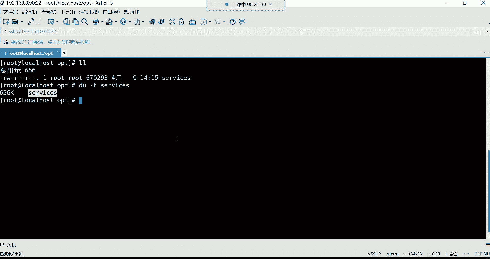
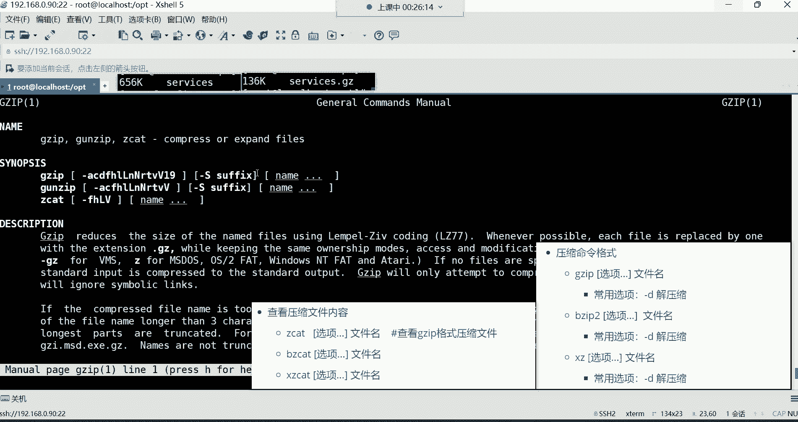
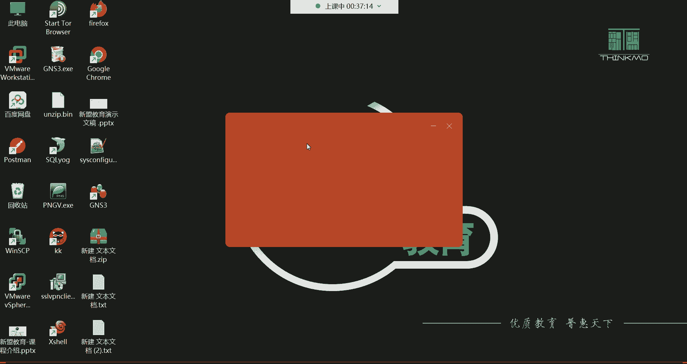
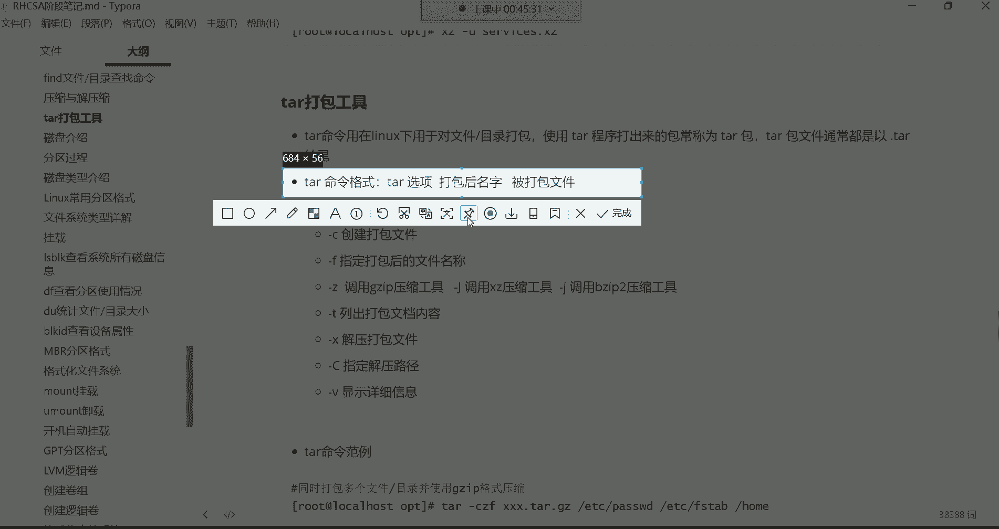

# 0基础小白怎么入门Linux运维？看这套，Linux运维全套培训课程，保姆级教学视频 - P22：红帽RHCSA-22.gzip、bzip2、xz压缩、tar打包 - 小方脸不方- - BV138411B7p5

听到我这边声音的同学给我刷波，一，我们开始上课有问题吗，没有问题是吧，好我们是好久都没有见了，主要是一个清明节放的是吧，感觉哎哟我们这个啊是时间过得很快是吗，好其实我觉得这清明节放了呀。

我这特别的怀念大家哈啊特别的怀念大家，这真的是感觉一日不见如隔三秋，这种感觉马上要五一了是吧，哎呦那我们这个真的是前半年呢过的，他真就是快，所以说这个我们说这个干大事儿呢，一般都是在后半年，为什么呀。

因为前半年假期太多了，你看从过完年开始，什么三八妇女节，然后这个清明节，接下来呢马上就就要这个五一劳动节了，然后六一儿童节嗯，剩下的就是这个七夕啊，情人节之类的，你发现这个前半年呢。

真的是你想这个好好去干点什么事儿啊，这有很多假期阻挠着你啊，因为你一到假期，你就按捺不住你自己内心的那种这个那种，我们说这个呃本性啊，因为这个一到春天嘛，我们说叫万物交配的季节啊，不是不是。

sorry哈，是这个春天是这个万物生长的季节，不是这个说错了哈哈，对万物生长的季节，你就想出去去看一看外面的花花世界是吧，所以说你这有有的时候这一放假呀，你就不想学习，一放假你就不想学习。

你说这怎么办吧，这怎么，所以干大事都是在这个后半年哈啊哈哈，我们不能暴露本性是吧，什么万物交配什么，我们说这什么虎狼之词啊，哈哈好了，那接下来呢我们这个就这个开始这个讲课吧。

哈咱们这个上上节课我们是讲了哪些内容呢，我们简单带领大家这个回顾回顾哈哈，人与自然是吧，别看人与自然啊，我们学技术了，我们这个上节课呢是给大家讲解了，常用的特殊符号。

这个常用的特殊符号呢主要是以这个星号啊，大家是必须要掌握，因为它可以结合很多的过滤的命令，或者说文件的搜索命令，是有非常大的作用以及功能的，group这个呢是一个文件内容过滤的一条命令。

这个命令啊是我们今后在没有讲之前，你看我没有怎么用是吧，但是讲了之后我会频繁用GRIVER这条命令，它功能强大之时，就是从文件里面问我们过滤啊，某些关键词，Fd。

这条命FD的话呢是也是一个非常强大的命令，比如说你把一个文件放在系统的一个路径了，但是呢你记不住，那怎么办呢，犯的命令啊，可以帮你去从这个系统当中去搜索啊，搜索这个文件的所在位置。

那今天呢我们要给大家讲讲这个文件的压缩，还有这个磁盘管理，我们今天啊争取把这个磁盘管理，以及这个逻辑卷给大家讲完就可以，我们今天是准备从这个压缩开始，一直到哪呢，一直到这个逻辑卷到逻辑圈的删除。

能够讲完，我们今天这课就算是完美的收官好，那咱们先来看看这个压缩呃，对于压缩来讲啊，其实比较好理解，我们经常用windows，windows里边呢大家会经常做一些文件的压缩与解压。

这个就没有什么太多可介绍的了哈，那为什么要压缩。

这压缩的功能是什么，这个大家应该比较清楚，压缩呀，你比如说我现在有一堆文件，我们新建了很多的文件，那这些文件呢我想发给别人，那最好的方法是比如这文件比较大哈，我们建这文件是空的是吧，没关系哈。

啊咱们就假设这两个文件呢特别大好几个G，然后我想发给别人，发给别人呢，你怎么样才能让他的传输速度变快呀，注意啊，我们说这个压缩它可以把这个文件变小，是让文件的内容变小，变小以后呢。

你再把这个压缩包发给别人诶，那这个传输速度是不是就快了呀，所以压缩，主要就是可以节约我们系统的磁盘空间，那对于一些这个文件的传输来讲呢，也可以提高文件的传输速度，文件哈。

我们生活中有哪些文件是压缩格式呢，比如说那些mp3的，这是音，这是音频文件，还有那些mp4的，还有那些点JPG的，点拼机的，还有什么点GGF的，还有什么那个啊，就这些吧哈就这些呢其实都是压缩格式。

像什么mp3mp4，他呢为什么要压缩呢，因为它太大了，动不动就好几个G，最少也得是这个几百兆是吧，那你说你去看这个视频的时候，你的浏览器在访问那个网站，你点这视频为什么瞬间就能打开呢，速度特别快呢。

因为这个文件是经过压缩的，就是你在点击这个视频的时候啊，那个服务器啊，他得把这视频传给你，你能理解吗，他他得把这个视频传给你哈，传到你的这个浏览器的时候，你的浏览器还有一个解压缩的功能。

这浏览器呢就直接把这个压缩格式的文件，给你解压了，解压以后你在本地打开速度就非常快，唉，所以说这压缩呢是在互联网当中，非常重要的一个手段啊，可以提高数据的传输速度，包括图片也一样。

你去访问一些图片也嗯啊M3U8，这个M3U8是什么呀，就是我们在这个网络当中，在浏览一些图片的时候，这图片也都是压缩格式，你打开快是因为它传传递的速度比较快，传到你的手里面的时候，你直接就打开了啊。

流媒体啊，对都得压缩哈，都得压缩好，所以压缩的好处呢，一是一是节约我的磁盘空间。

比如说我这个电脑里面的磁盘呢不够用了，有很多的文件呢非常大，占用我的磁盘空间，但是这些文件呢我还不经常使用，怎么办呢，哎你就可以把它给它压缩一下，压缩一下哈，所以这就是压缩的好处，其实如果通俗点来理解。

就是把一个我们说就是一个那种丰满的馒头，唉你给它捏小了一样啊，当然我说这馒头一般也不丰满是吧，但这就类似于这种感觉哈，啊让它变实了啊。

就这意思哈，你们自己体会就好，就压缩哈好，那我们来说说这个在LINUX里边。

它压缩格式都有哪些，windows没有什么太多可解释的吧，在windows里面压缩格式，那windows你直接下载一个压缩工具，你看一下哈，比如拿这个7Z来说，为了添加到压缩包。

那这压缩格式都有哪些，有ZIP的，还有这个T的啊，他这里边还有7Z格式的比较少哈，还有像什么压缩等级，压缩等级的话，那这里边你看有急速压缩，快速压缩标准压缩，这里边就压缩等级，它主要体现在哪里呢。

就是速度快与慢，如果我们那个比如说等级比较低，比如就像这种这个急速压缩，那这种速度肯定是最快的是吧，那你说速度快好不好呢，好但是啊速度快，它的这个我们说叫压缩的比例，他肯定会相对的差一点。

什么叫压缩比例呢，比如我现在有一个文件，这个文件大小是多大的呢，我现在有一个五个G的文件好，我现在要对这个文件进行压缩，如果我选择这个极速压缩，那它的速度肯定是最快的，它是以它会在最短的时间。

把这个文件呢给你压缩一下，但是由于压缩压缩速度快，但是比例肯定是相对较差，压缩以后呢，可能这个文件它的大小能够变多少呢，能够变成比如说三个G，压啊压缩了两个G的空间，那如果我选择这种。

比如说这种那个极限压缩呢，我们就拿这个极限压缩来做个对比哈，这极限压缩你看它都已经达到极限了，是什么意思呢，就是我能够把你这个文件的大小给它，争取压缩到极限，比如我能够把五个G的大小给你压缩成一个G。

可不可以呢，哎我们就假设哈他非常极限的啊，变成一个G了，但是他速度上来讲呢，肯定没有这个极速的快，你比如说这个极速我用多少，我用一秒钟E我用一秒钟，那这个这个极速哈跟极限哈，这个极速比如说我用一秒钟。

那这个极限呢我有可能得用三秒钟，这个得用三秒钟才能把它给它压缩完成，所以说我们说这个压缩速度跟压缩比例，其实这两个东西啊都息息相关，如果我希望把这些东西压得精致一些啊，体积变小一些，那速度就慢一些。

但如果说我希望啊速度快一些，但是它的这个体积呢，肯定就没有我们想象的那么小啊，这就是我们所说的这个压缩的等级，为什么会有压缩等级，就取决于说这个东西你到底是要求速度，还是要求它的体积，能理解吧。

好压缩方法呢，这有很多种压缩格式啊，这是他自带的压缩格式哈，然后有比如说什么b z IP two的，这里面压缩格式并不是很多哈，有windows里面有很多的压缩工具，你比如说像什么呃。

12345那种专门压缩的那种公寓，他们呢像什么压缩的格式啊，都非常的多，而像我用这个7zip，它呢它这个压缩格式那种压缩方法哈，一般都比较少一些，还有压缩格式，你发现也并不是很多，并不是很多哈。

那这是windows我们就不过多介绍了，我们主要就是带领大家了解一下，像什么压缩等级是什么意思，还有压缩方法是什么意思哈。

大家了解一下，那我们接下来这主要以这个LINUX下边的这个压缩，来给大家讲讲，在LINUX下边呢它也有很多种压缩方法，有哪些呢，有这种叫GZB的压缩方法啊，当然我们叫做压缩格式。

还有这种BZIP2的压缩格式，还有XZ的压缩格式，那像这每种压缩格式呢，它们压缩以后的文件的大小不一样，但是压缩的速度也不一样，我们就拿这个什么呢，拿这三种压缩格式来讲，我们来演示演示。

他们到底哪种压缩格式速度比较快。

哪种压缩格式压缩的比例比较高一些，我们进到系统的OPT目录，来到这目录以后，能把这个目录清空一下，RM跟RF星删除目录下的所有好阿拉斯，看一下这目录干净了是吧，我们拷贝一个文件过来，拷贝哪个文件呢。

etc有个service这个文件，这个文件是不是很大呀，拷贝到我们的当前目录是不点就可以了，代表当前回车好，这个文件拷贝过来，拷贝过来以后呢，我们来看看这个文件的大小，这样哈有一条命令叫做杜杠H。

这个命令是专门统计文件的大小的，我们来后边跟上那个文件名，这个文件的大小呢它是656K，但是这条命令我们会讲，大家没有必要去记哈，我们在讲磁盘管理的时候就会讲这条命令，你看这个文件大小是656K是吧。

在没压缩之前，它就以普通文件吧。

好那我现在用这三种压缩格式去压缩它，那这三种压缩格式怎么用。

非常简单，命令格式啊，非常的简单，我们先来说第一种压缩格式，这个GZIP的压缩格式，调一下啊，OK像这种GZIP的压缩格式呢，它的命令格式是JZ吧，可以跟选项，这选项在压缩的时候呢，一般的没有必要指。

我们后面直接跟文件名就可以，那这个时候就这样哈，JZIP跟上文件名service回车。

它压缩完了以后啊，它压缩完了，这个文件它是以这种点GZ作为结尾。

所以我们看这个文件的时候呢，你发现它就自动有一个扩展名点JZ，看到了吧，好那这个时候我们来做个对比，压缩以后跟没压缩之前，他们俩的区别到底差了多少，你看我们我们记一下啊，咱没在没压缩之前。

大小是不是656K啊，咱们把这个截个图啊，没有压缩之前哈是656K放到这，咱们就拿这个文件来做对比哈，那压缩完了之后呢，首先这个文件啊就直接变成一个压缩格式了，那现在我们来看它的大小。

我们度杠H统计一下，哎哟你们看一下哈，有有没有注意到这个大小，看到了吗，变成多少了呀，是不是变成136K了呀，这种格式是GZ把它压缩格式啊，这是GZ的压缩格式，我们来拿过来压缩以后，我们放到哪儿呢。

哎呦我感觉他无处安放了哈，放到这儿吧哈放到这，好这是GZB的压缩格式，点击Z结尾，这样我们就能够明显的认出，这个文件是用哪种格式压缩的是吧，你看这大小差了多少呢，656跟136，是不是差了将近五倍啊。

五倍的大小，嘿嘿这就是那你说像这种文件也并不是很大，如果要是好几个G的文件呢，如果是好几个G的文件，我们就能够明显看出差别了啊，如果这文件你传给别人，你发现这传输速度它也不一样对吧，你现在在企业里面。

为什么那些开发人员他们开发好一个项目了，他为什么要把这个文件给它压缩一下，然后再交给运维呢，哼为什么呀，因为不压缩那一个项目文件非常的大，有可能是几十个G的，一个有可能是加到一起是几十个G。

但他得压缩啊，压缩以后呢，这个项目可能就变成几个G了，那到时候他把这项目直接传给运维人员，运维人员拿到本地再解压缩的时候，哎这就非常的速度就非常的快，能理解吧，好这是第一种压缩格式，好，那压缩完以后呢。

我们怎么看压缩文件里的内容啊，这时候你不能用cat了，如果这时候你用cat看这个压缩文件的内容，来看哈，就乱码了，看到了吗，乱码了吧，为什么呀，因为压缩格式的文件，你得用它独有的方式去查看。

不能用普通命令，那这要怎么看呢。

我我记得我有这个选项哈。

在这儿哈，查看压缩文件的内容。

这三种格式啊命令都不太一样，如果是这个GZB的压缩格式呢，我们用的是这个叫z cat这条命令，这条命令可以查看JZIP的压缩格式的文件，那这时候我们就这样，z cat后面的跟上文件名就可以了。

回车你看这时候是不是帮我们打开这个文件来，由于这个文件内容非常多，所以说呢这我们一平A显示不下，因为这个文件我记得哈是好几万行，这里边，但是不是打开了呀，没有乱码吧，啊这如何查看这种压缩格式的文件内容。

不能用普通命令看哈，好那这是第一种压缩格式，那接下来想解压缩怎么办呢，想解压缩它有一个选项叫杠D这个选项，这个选项呢，可以帮我们把这个压缩文件给它解压，然后对于这条命令我们可以卖一下。

卖一下这个GZIP他有很多的帮助，看到了吗，那这时候呢你说老师这英文都看不懂啊，没关系啊，咱们不是有翻译吗，这你英英语水平不好呢。

咱们可以借助一些翻译工具，我们就比如这个网易有道词典，这个网页道词典呢，它有个功能，什么功能呢，我给你们说一下这一个非常牛逼的功能哈，在这里边呢，你看啊找找到设置，这设置里面呢它有一个功能叫做滑。

它叫曲词跟滑瓷，什么叫曲词跟华词呢，啊当然这属于课外的，这属于课外知识点了哈，这我就不是很专业了哈，但是呢非常实用，所以呢你们呢就这主要是很实用哈，它有一个功能看到了吗，叫做启用复制查词。

什么叫复制查词啊，就是选取内容以后，你一复制他就给你翻译了，你把这个选项一勾上，接下来呢这在x shell里面还有一个功能，当然这个就给它最小化就可以了。

叉烧里面有哪些功能呢，有工具在工具里面有个选项，这个选项里面呢有一个叫做键盘跟鼠标，这个里边你看它也有一个非常牛逼的功能，这儿呢将选定的选定的文本自动复制到剪贴板，就说白了你把这个功能一勾选的话。

这个时候你看我这个是不是翻译也开了呀，比如说我现在我读不懂，我读不懂这个什么呢，它的这个英英英文的含义了，好你就划就行了，划看到吗，划完以后，看到了吗，这波操作是不可以啊，直接给你翻译了吧。

告诉你这压缩或扩展文件的就这条命令是吧，那接下来呢这是这英文是什么意思，你说看不懂啊，告诉你这叫简介啊，这是介绍你的介绍它的命令格式了，这我也看不懂，好划一下，告诉你这是一些描述，看到了吗，描述什么呀。

描述一下他这个命令的一些介绍，华，告诉你是使用什么编码减少命名文件的大小的，只要可能每个文件都能替换成一个文件，扩展名为JZ的，看到了吗，告诉你是不是就一些介绍吧，没有什么太多这玩意，就跟我们说。

这玩意儿就跟大马路上的那个英文广告一样，那你有必要翻译吗，那大马路上的英文广告，你还得必须翻译翻译去看一看吗，没有必要了吧，这介绍吗，不就是所以说这就略过就行了哈，你可以看看它的选项。

你比如说哪个选项呢。

我们就前面不是说有个叫杠D选项是吧，杠D这里边我们可以看。

这杠D选项是干什么用的，啊你看叫解压缩看了吗，就是告诉你这个选项是解压缩用的呀，然后别的选项呢，你比如说像这个杠AD选项啊，你都可以，如果感兴趣都可以看一看啊，什么使用本地的什么转换行为的。

此选项在一些什么非UNIX系统支持啊，就是转换它的，这个转可能是转换它的这个扩展名的哈，但是没有必要哈，没有必要，还有获取帮助等等等等，杠L选项好了哈，我们就就给大家演示一下。

如果说你想具体了解这个命令，它的其他的功能的话。

我就是把方法教给大家，了解方法以后呢，这种东西你们就自己去应用就可以了好吧。

因为毕竟我给大家讲，我只会给你们讲我们常用的一些就是功能啊，选项啊，就是这样的，你们只要有了方法之后，你们自己再去自己去查，这样我觉得比我直接这样教，你们可能帮助会更好一些好吧。

那下面呢我们就来说这个杠D哈，杠D是解压缩怎么用，那你就直接GZP，然后杠D后边跟上文件名回车，你再看的话，这个文件就又恢复到一个普通的文件格式了，就不是压缩格式了，那这时候你再看大小的话呢。

那肯定又恢复到最初的那个大小了，又是656K啊。

这个大小哈又恢复去了，我刚刚那几个啊，在这儿呢，656k，然后这个G这波我们得说一说哈。

他是压缩完以后是不是这个136K啊，从156K变成了136K，那接下来我们再换再换第二种压缩格式，这个叫b z IP two的压缩格式，那这个压缩格式呢用法都一样。

b z IP to就是压缩格式为什么叫这个名儿，你别纠结这名字是人家开发者，人家人家在开发的时候，人家就说白了就是一般就是他们取的名字，你就不要去纠结这名字，你就知道它的功能就可以。

然后后面直接跟文件名对它进行压缩，嗯没有这个b z i b two这条命令吗，啊那确实就没有了，那没有怎么办呢，没有我们自己搜一下吧，嗯叫BZIP2，看看这条命令哈有哪个包提供，对我们自己下。

如果没有的话，咱们自己下，这条命令说这条命令是不是讲过呀，前面干什么用的来着，叫搜索一个命令的软件包，我敲的这条命令在我的系统里面没有，我想搜一搜是有哪个包提供的，好告诉你了，就是由这个包看到没。

叫b z IP two的这个包提供的吧，好那接下来我们是不是就安踏不就可以了吗，YM杠y in套报名呢叫B在b to b zip安装，好安装好了之后呢，我们就再压缩，把这个命令翻上来回车，阿拉斯看一下。

那像这个b z IP two的压缩格式。

压缩以后，这文件名啊，它的后缀就是以这种点BZ2结尾的。

来看一下是不是点b z to结尾啊，那这并不是什么，我们所关注的，我们要关注什么呢，我们要关注它大小。

杜杠H看一下它的大小好124K，我们跟前面对比一下。

对比一下哈，前边的那个GZ的压缩格式，压缩完以后是136K是吧，然后这个B在b two呢，压缩完以后是124K，那这两个压缩格式大家是不是能够明显感受到，其实这个BZIP2的压缩格式。

它压缩后的文件会更加的小一些，就是我们所说叫压缩比例更高一些，而这个GZIP呢，它的压缩比例呢没有，这个B在a b two的压缩比例要高，但是从速度上来讲，你不用想，肯定是它要比它快，速度会快。

因为是因为压缩比例没有那么精细化，所以说呢速度就快一些好，这是第二种压缩格式，那压缩完以后，我想看压缩文件怎么办，也不能用cat，用这条命令叫bz cat，后面跟文件名，这时候叫bz cat。

跟上这个文件名，这也一样哈，就是看文件里的内容好，那我想解压缩怎么办，想解压缩也是那个杠D选项，他这个所有的解压缩选项都一样，看到了吧，常用的选项杠D这时候呢我们就这样bz IP to。

然后杠D跟上文件名，回头再看一下，好解压缩了吧啊，这就是我们所说的这个怎么压缩，怎么查看压缩文件内容，怎么解压缩，当然这是b z IP two的压缩格式，那接下来我们再讲第三种，这个叫做XZ的压缩格式。

这个压缩格式来吧，看一下哈，它们到底区别在哪里，XZ跟上文件名回车，注意啊，你们有没有你们有没有发现一个细节，他在压缩文件的时候好像稍稍停顿了一下，有注意到吗，注意到的给我刷个一没有注意到就算了哈。

有注意到了，是吧，唉只感就感觉稍稍卡了一下好，那没关系，我们看一下它为什么会卡一下哈，我们度杠H统计一下。

你发现它压缩完的文，它压缩后的这个文件的大小啊。

最小看到了吗，它压缩以后，这文件直接变成100K了，从最初到多少呢，从最初的655K直接压缩到100K的，正翻翻了六倍，还要多一些，是不是啊哈对应该是更小了，但是呢虽然说压缩的体积是最小的。

我们这压缩比例比较高了是吧，非常的细致了，但是呢速度是不是相对就较慢了呀，没错哈，速度就相对的较慢一些，所以这压这三种压缩格式，现在大家应该心里都清楚，哪种压缩格式压缩比例比较高。

哪种压缩格式压缩速度比较快了吧，GZB呢压缩速度最快，但是比例最差，XZ呢压缩速度最慢，但是比例最高，他压完以后文件最小，是不是它压缩完它压缩以后呢，文件呢呃只能说是一般吧啊体积没有变得最小。

但是速度是最快的，那在企业里边，那比如说你们公司嗯在做一些文件备份的时候，你如果希望啊，让这个文件更加节约磁盘空间的话，那是不是我们可以选择一个压缩比例最高的呀，XZ但如果我希望什么呢。

这个东西压缩以后啊，我要什么呢，把这个东西呢传给别人，传给别人，其实那就不要没有必要去考虑什么呢，没有必要考啊，或者说让别人访问了一些格式的文件，就没有必要考虑比例太高的，为什么呢。

咱们就拿这个视频文件来说，这种点mp4的这种文件来说，这种格式文件它需要压缩比例非常高吗，不需要，为什么呢，你想想你访问一个网站服务器，这个视频是在人家网站服务器上面的，点mp4，这在人家服务器上面的。

而我们作为一个用户来讲，我们在嗯我这图啊，这图我这个不用它画了哈，这图画不好。

我们来说一下啊，你看啊，就这服务器，这服务器啊是人家公司的服务器，那我们作为一个用户来讲，我们是要防人家服务器，我我们去看一些，比如说这个视频，那比如说这就是一个视频文件点mp4的，mp4的视频。

好这个文件哈，你想想我们用户访问这个服务器，我是为了来看这个视频，是不是啊，那是不是这服务器是不是得把视频它给我呀，我要打开这个视频的时候，我是不是在我们用户的浏览器，我们就能够看到这个视频呢。

好那这时候这个服务器啊，他会把这个视频干嘛呀，传给你传给你，把这文件得传给你，他传给你呢是得传给你的，他得把这个文件传传传传到你的浏览器上边，有人说，这时候你的浏览器它本身有个功能，什么功能呢。

叫解压缩的功能，浏览器啊，你是通过浏览器去访问人家，然后这时候呢，他得把这文件呢通过浏览器再传给你，那这文件是不是得来来回回传输啊，是不是得传输啊，得传输哈，那这时候你想他把文件传输给你，怎么样。

我怎么样才能保证我这个文件在传输的时候，速度会更快一些呢，怎么样才能保证呢，你说是更小吗，不是如果更小的话，我告诉你哈，这个文件传到浏览器的时候，浏览器是不是得解压缩，他得解压缩解压缩。

比如说我压一个视频的时候，我需要多久呢，比如我需要一分钟好，然后他再把这个视频再传给你，你解压缩再需要一分钟，来来回回啊，可能你再加上传输速度，这你点开一个视频得需要耗费个3分钟左右。

那我们访问一个网站，你得点个视频，3分钟，连视频的这个影还没看着呢，你说对用户来讲，他能等得起吗，他等不起，是不是，所以一般对于那个有些文件格式来讲，它不要求压求压缩的特别的精细，你反我好。

我简单压一下，然后传给你，传给你的时候呢，唉只要你的带宽别太慢，只要网络别受影响，这文件传输速度呢不会受到太大影响，然后传到这个用户手里面的时候呢，我解压缩速度快一些，这视频看的就快，是这么回事。

而有的文件呢，如果不需要被用户访问的一些文件，就没有必要，咱们说这个压的特别粗糙，你比如我们做备份的时候啊，你可以选择压得精细一些啊，所以这种压缩格式呢大家搞清楚，每种压缩格式一般应用场景不一样啊。

好那这三种压缩格式的话呢，他们都可以对文件进行压缩，让大文件变小，但是呢它有一个缺陷，什么缺陷呢，就他呀没有办法对目录进行压缩。

你比如我现在有很多文件都在一个目录里面，咱们就拿这OPT来说吧，啊我们先先把这个给它解压缩哈，咱们现在这个命令呢还没有讲完，解压缩的话呢也是杠D选项XZ，然后杠D跟上文件名这几。

啊XZXZXZ当地就解压缩了，这就嗯都一样哈，选项都一样，然后我们来说说啊，现在比如我有些文件我把ETC下的，pass wd给他，还有etc下的f s table都给他拷贝过来。

好现在这里面有三个文件是吧，好那我现在想干嘛呢，我现在想同时对我这个目录做个压缩，OT目录，或者说这个目录里面有非常多的文件，我进去再建100个文件出来，我在他是个test一点点100点log，老公好。

比如现在我要对这么多文件压缩，那怎么办呢，你不能说一个一个压吧，这些文件都在一个目录里面好，那这个时候我们怎么办呢，我们是不是对目录压缩最省事儿啊，啊那接下来我想对目录压缩，那我就这样呗。

那个比如说JZ后面呢跟上那个OPT的目录，我们看这样可以吗哈，诶你发现，报道什么，我看一下哈，是不是这个，他说这是一个目录啊，他这个目录不上。

应该是不让你压缩，可能说格式不是很支持。

被忽略了是吧，被忽略了，那像这种情况下。

它就不允许我们对这个目录进行压缩的话，那怎么办呢，那你说我这目录里那么多的文件，我不能一个一个手动去压缩吧，这也太浪费时间了呀。

那怎么办呢，像这种情况下呢，就。

等一下哈，我把这个取消掉，我觉得这个鼠标键盘。

就是这个程序有的时候，出一下啊，那如果他不让我对这个目录进行压缩，那我就没有办法把那些文件给它压缩到一起了，这肯定不行啊，那在企业里边，人家在做项目的时候，人家一个项目。

可能他很多文件都会放在同一个目录，好那你说别的格式应该可以吧，比如说那个b z IP two的格式可不可以呢，那也是被忽略了，也不允许是吧，这就让我们有些尴尬了，你说这是一个目录被忽略了。

那XZ呢再跟上那个OT，好跳过了，看了吗，告诉你说这是一个目录，我呢直接给你跳过了，这就不合理，这就不合理哈，所以说对于这种压缩格式。

他们不支持对目录做压缩，那怎么办，所以接下来啊，这个塔这个工具就变得非常的实用了，踏踏是什么呢，踏它本身是一个打包工具，你看tar命令是用在LINUX下边，用于对文件目录做打包的。

我们在使用tar程序打包出来的这个包，我们称之为踏包，然后踏包文件通常是以种点ta作为结尾。

他怎么玩的tr呀。

我们把这个命令格式呢拿过来给大家演示一下。

这样记zip是吧，然后OPT下的，然后test这样一点点100是吧啊，我就是说我要对这个所有的文件，做一个压缩是吧，啊没有这样的文件和目录是吧，我们来看一下OP t可啊，这个目录有没有。

那文件有没有被压缩哈，没有吧，是不是是不是不行啊，也不允许，所以说呢像这种压缩格式啊，它还是有一些只能适合那种，比如说单个文件的压缩，所以这个套这个东西呢它就很好用。

怎么用呢，我们把这个选项给大家拿过来哈。

它有一个，它的选项非常多。

当然有有些是常用的，有些它就不是常用的，我现在可以用它结合他这个杠C跟这个F，这个选项C是什么呢，叫做创建打包文件，就是你要把一个文件打包的话，你得必须指定这个杠C这个选项创建的意思。

而杠F呢这也是必须要指定的一个选项，叫指定打包以后，这个文件叫什么名字，这杠F也是必须要加的选项，就这两个选项哈，在创建的时候，我要上一个压缩包，那这时候呢我们指定一个OP。

但是他这个格式啊有些反人类哈，他这条命令啊，你得先指定压缩以后，这压缩包叫什么名字，能理解吧，嗯得先指定压缩以后，这个叫什么名字，比如说我要呃，我压缩以后，我让他叫什么呢，让他叫这个。

OP t第二套可以啊，再把你要打包的这个目录，最后呢给他指定上啊，注意啊，先指定打包以后叫什么名，然后再指定你要对谁打包回车，这时候他提示一个说什么，从成员名中删除开头的根啊，这个我们一会再解释哈。

那打包好了吗，打包好了，只有你看啊，这是不是有一个什么呢，有一个叫OP t点差的，好这个是打包以后啊，他叫OPT点差，那你知道他现在是一个什么格式吗，我们来看一下哈，你发现这OPT点它它变成什么格式。

这个小横杠还认识吗，这小横杠代表什么意思啊，还记得吗，哎文件是吧，对文件哈，对文件哈，你看他把一个目录打包成一个什么格式的，文件的格式了，没错，那一旦打包成文件格式了，那接下来我们是不是。

就可以调用那个压缩工具了呀，比如说GDP我可以对这个OP t点踏做一个压缩，回车好，那你看现在是不是就可以了呀，也就是说它呢它是一个打包工具，但他打包以后，这他这个注意啊，大小是并没有实际改变的。

就原先这个目录下的文件是多大，他只是给你打一个包，就给你归纳到一起了，但是对文件大小没有实际的改变呢，但是我想什么呢，我想压缩，怕它本身是不具备压缩功能的，它就是一打包的，所以你想压缩的话呢。

那它一旦变成文件格式的话，那我们说这各种压缩工具，是不是就可以对他们进行压缩了呀，对啊打包大小不变啊，我们再演示一下哈，我现在给他这个什么呢，咱们给它删掉哈，直接把这个给他删删掉。

我们还是这个把没有用的都给它删掉哈，我觉得我这里面怎么这么多什么test test2test星啊，都删掉，test的星，还有这个什么新建这个也给他删掉，那就点zip的吧，新点ZIP删掉哈。

好OK然后我们再来演示一遍哈，我们现在先统计一下，我杜杠HO统计OPT目录的文件大小好，总共是668K是吧，你看在没打包之前，这个目录的大小是668K，我现在打包TGCF，我直接把OPT目录给他打个包。

但是叫什么名字呢，就让他叫OP t点T，C啊C打包好了是吧，然后看看打包以后它的大小有没有变化啊，我们还是do杠是统计这个OPT点它诶，你看这怎么变大了呢，哈哈你看这个很奇怪哈，没打包之前。

你发现他是668K是吧，打包以后呢，怎么变成712K了呀，所以这个还有一个核心的思想是什么呢，就甭管是打包还是压缩小文件，就别打包。

也别压缩了，为什么呢，在windows里面我给你们举一个最简单的例子，我们就拿着一个普通的文件来说，我们来看它的属性，你看看它大小哈，在没有压缩之前，它大小是多大呢，是零个字节，占用空间，零字节是吧。

就一个空文件嘛，好我现在对它做一个压缩的操作，压缩为zip文件压缩了吧，本身呢这个文件呢是占用零字节，压缩以后我们再看它的属性的时候，好大小变成132字节了，所以这小文件呢就别压缩，越压越大。

他们理解吧，因为它毕竟里边会有一些这个压缩的属性，这属性也会占一些空间，对属性哈，它里面是只有一些它的格式的属性的，所以这小文件呢它会明显的感觉到他大文件啊，人家那属性就感觉不到了。

大文件呢压缩是很正常的好，所以说这个小文件就被压缩了哈。

所以这为什么说我们这个打包以后，它这个大小变得更大了，这应该能理解了是吧啊，也就是因为我们这个文件有些小，你至少咱说打包压缩得得是个，1024K以上的，你才有必要对他做一个打包跟压缩啊。

如果是要是1024K以下的，就没有必要了，就一一照，我们说这个最起码得是一个兆以上的文件，才能有必要对他做个压缩和打包好，那现在明显感觉到是不是大小没有变化呀，它并没有变小啊。

那这时候呢我们再压一下就可以了啊，压一下，用这个JIP对这个OPT点T做一个压缩好，变成压缩格式了吧，好那这时候我们再看大小，它就变小了，啊变成136K了，这时候应该明显能够感受到。

是不是就是他踏这个工具啊，可以帮我们把一个目录给你，打包成一个文件的格式，一旦变成文件格式了，我再调用其他的压缩工具，我对它做压缩就可以了，所以tr这个东西呢是不是就非常的实用了呀。

那以后你比如说我们对什么呢，我要对我这个系统的某些文件做一个备份，哪些文件呢，咱们就拿一个系统的VLOG，这个路径下边的这些文件做一个备份，你看这些什么点log作为结尾的，还有什么带有日期的这些东西。

其实都是日志文件好，我想对他们做一个备份的话，那怎么办，那是不是打包压缩就可以了呀，正常来讲，我们先统计一下这个路径下的文件现在是多大，我们再加个S哈，统计一个总数，总共是3。4兆好。

那现在我们就拿这个目录来讲，我现在用T杠cf指定以后，打包以后叫什么名字呢，就让他叫这个log点，踏好啊，sorry哈，Sorry，打包好了，统计一下大小呢应该没什么变化，啊还是3。6兆。

没有什么变化是吧，那这时候呢我再压缩，比如说用这个GZIP在指定这个log点塔压缩，压缩以后呢，我们再看到大小的时候，就别调用了哈，杜杠H就tab键补齐啊，变成396K了，看到了吗。

各位你发现这变化还是蛮大的，原先是3。6兆，但压缩以后呢变成396K了是吧，这差了多少啊，这差了将近十倍啊，差了近十倍的大小，所以说这是不是还是蛮有必要的呀，没有必要的哈。

这大的话呢你压缩能够感受到明显是变小了吧，好，那以后这个压缩包里面放的，是不是就是我的系统的日志的备份文件了呀，并且他也没有占用我系统的多少磁盘空间吧，非常的实用哈，非常的实用。

好那下面呢我们再给大家讲讲其他的选项哈，其实他呀你在打包的时候，如果说我既希望打包，又希望压缩的话，没有像没有必要像我们刚刚那样费事，我来给大家演示一下，把这个给删掉哈，删掉，我们可以直接在打包的时候。

就调用它众多的压缩工具，它格式呢也是用这个C跟F哈，杠CCF，然后你在这个后面可以直接加加一个选项，但是这选项呢得看你要调用哪种压缩格式，解包能调用吗，能能调用，我们一会再讲解。

杠Z呢叫做调用这种GZ压缩格式，然后杠大写的Z可以不加，杠不行啊，杠C是创建的时候必须得加的哈，不能不加，然后杠大写的J呢，这是调用这种XZ的压缩格式，然后这个小写的Z也是调用B。

在a b two的压缩格式好，那我们现在想调用哪种呢，我想调用这种GZIP，我就cf z这样，然后后面再指定我对谁打包，当然你也先指定名字，就让它叫log点踏，自己补一个点GZ好，然后下边呢注意啊。

这位置这个后缀名给谁看的呀，是不是给我们自己看的呀，我们可以不加杠分，不行哈，我一会儿给你们演示一下，这F啊，它非常重要，我们来说一下哈，这个后缀名是不是给我们自己看的呀。

我一看这个文件的后缀名是点差点GZ结尾的，我这样就知道了，这个，是他的压缩格式啊，是他的打包格式，用GZIP的压缩格式，这不一看就知道是什么含义了呀，所以这名字你自己指定一下就可以了。

最后再指定我要对V下的log，整个目录做打包并压缩回车嗯，我看一下哈，那什么这时候他报错了，他报错了哈，我们看有没有成功，你发现这怎么没成功呢，那他说什么这个无无法start是吧。

没有那个文件和目录什么前字错误是吧，哎呦这报了一系列错误，那我们这是我们格式不对吗，我们这格式应该也对应，你看压缩以后的名字，然后对谁进行压缩是吧，这没什么毛病啊，没毛病哈，差在哪儿呢。

看哈把命令翻上来，把这个F这个选项放到后边，你看这就没报错，成功了吗，是不是成功了，是不是啊，所以说F这个选项呢，你比如说我们再拿过来，我不加他，可不可以，咱们再把这个给他删掉哈，延伸一下。

还有一个Z也给他删掉啊，比如说我把这个命令翻上来，我这个F选项我都不加了，就C跟Z口可以，是不是还是刚刚那个报错，你看他的这个提示，主要提示的是，他说G呃，压缩后的数据不写入终端，使用杠F来强制压缩。

就是你没有加那个杠F，没有加杠F它不允许，而让你这个获取这个帮助的信息，获取这个GDP的帮助信息，对那F呢它是改名的，改名的，他在压缩的时候是帮你指定名称的，你说你不加，他怎么知道要叫这个名字呢。

是不是还有这个C，你说我不加C可以吗，我这样Z跟F可不可以呢，又报错了是吧，也也没有打包压缩成功，因为C是创建，你们他没有办法帮你创建，你说你怎么打包压缩呀，所以这选项哈对他没创建呀，没创建打包。

所以这时候呢这三个选项你一个都不能少啊，Tg cz f，而且F顺序是不是还得有个要求，这个F你还不能放到中间，也不也不能放到开头，只能放到结尾，注意哈，对于这个tar命令来讲，所有的选项都要加F。

是指定你那个压缩包文件名的，你甭管是压缩还是解压，你都得要加这个F选项，呵呵你不加的话，他不知道应该对哪个文件进行操作，你甭管是是压缩还是解压哈，所以这F而且必须得放在所有的选项的右，最右侧才可以。

所以这时候我们在指定让它叫log，点它点GZ，对Rush的log这个目录进行打包变压缩诶，这样就可以了，能理了吧，这样就可以了哈，好那接下来呢我们打包压缩成功以后呢。

我们说我想看这个压缩包里的内容怎么办，也不能用普通命令看你，比如我用log可不可以可不可以乱码哈，不允许哈，不允许，不允许这样看，所以说呢你在看这个压缩包的时候，你就可以这样，你说我可以。

我可以用这个z cat吗，z cat跟上这个log点点JZ也乱码也乱码，看到了吗，他也不容易，你直接用那个压缩的命令去看它，那怎么办呢，用它它可以帮你把这个压缩包给你打开，这时候呢它有个杠T。

这个选项杠T是帮我们列出打包文档，当然你不要忘了哈，你也得加个F，如果你不加F，你比如直接log点差点GZ，它卡到这儿了，但为什么卡在这儿呢，你不加F，他不知道你应该对谁进行列出啊。

他也不知道你要查看哪个压缩文件看了吗，所以这是不是就卡到这儿，这他不知道该干嘛了，所以这时候呢F也不能少回车，这样就可以了，这样就把这个压缩包里的文件呢，给我们列出来了，那这是这个查看压缩包里的内容。

那还有一个就是解压啊，当然还有一个档位给大家说说，当V的话呢，这是一个可选的岗位，就是你在压缩的时候，你可以这样，我们这样哈，我们给它删掉，把这个文件给它删掉，删了以后呢，这个杠V选项是这样的。

踏杠你可以加上这个一个V叫VCZF，这个V就没有位置要求了啊，当然你只要别把F调整位置就可以，前面的这些都没有，都没有，没有严格的位置要求，只有这个F，所以前三个顺序呢没有什么顺序可言。

然后后边的话呢你再指定让它叫log，点踏点GZ啊，文件名字，最后在只能对WAH的log这个目录打包变压缩，你看这个区别啊，主要是加了杠V以后回车诶，哪些不太一样呢，注意到了吗。

就是他告诉你我对哪些文件做了打包压缩，而你如果不加杠V的话，他直接就不会给你显示这些文件名字的，删掉哈，你看我们再把那个V给他去掉，你看他会告诉你，我到底对哪些东西进行了打包压缩吗。

没有直接就显示这么一个信息是吧，呵呵没错吧，这就是一个杠V啊，就是显示详细信息的，然后我们再来给大家说这个什么，从从成员名中删除开头的根，这时候你在列出打包文件的时候，你可以看得到有个问题看看。

这时候我们把这个mar下的log这个压缩包啊，给它打开，你发现啊这个每个这个压缩后的文件格式，它前面少了一个什么呀，是不是少了一个那个绝对路径呢，有没有发现那个根目录，并没有被记录在这个压缩文件里面。

看到了吗，就这你看这个路径前面没有这根斜线，没有这根斜线，没错吧，是不是没有这根斜线呢，所以说这个它的提示就是什么呢，就是说他帮你把你这个他帮你在打包的时候，把你这个打包文件前面的那个根目录。

给你去掉了，给你删掉了，为什么会删呢，因为你在解压缩的时候，你想想，如果说咱们就拿这个文件来说，我们后期想给它解压缩，如果它的一个加速的这个在这个里边，它的文件名是这样的，挖下的log一下子叫这个名字。

那大家有没有想过你解压的时候，是不是就直接解压到你系统的这个根下的VLOG，这个路径下面来，没错吧，但是我不想给他解解，压到这个我系统的这个路径啊，我想给我想给他解了我系统的OP t目录，怎么办呢。

没用啊，因为人家这个文件里面的名字就是从根开始啊，你想加到OPT没用，他不会去帮你把这个文件夹到OPT目录的，那怎么办呢，唉他会帮你把这个压缩以后的文件，根目录给你删掉，能理解吧，他把这根目录一删以后。

哎我指定我要把它给它加到OPT那甲以后，那是不是他就在OP t下边就变成这个路径啊，然后前面是个OPT，是不是这个意思，能理解吗，能理解有什么意思吗，它所以说为什么会有那个提示哈，那接下来咱说说加速嗯。

我们把OPT目录给他，清空一下RM杠RFOPT下的性，然后呢我们踏杠X这个X呢是解压缩的意思，然后解压缩的时候也不要忘了跟名字这个F哈，指定这个名字，我要对这个log点点也得做加速，然后在夹的时候呢。

如果说你不指定路径，你直接回车，它就夹在你当前的路径了，夹在你当前目录，你看这半目录，是不是直接生成在我的当前目录了，没错吧，哼那如果要不删除开头的根的话，在这个位置，如果不把你每个路径前面那根删掉。

那你知道这个路径解压以后，他是不是又回到自己原先的那个根下的，Rush的那个路径下面去了，这样就没有办法解压到指定路径了，它是这么回事好，那这时候呢夹以后呢，你再打开这个万目录。

这万目录就在你的家目录了，看到了吗，这里面有众多的目录了，log这里面有你打包的文件啊，他是这么回事好，这是解压到自己当前的路径了，那如果说我想给他解到别的路径怎么办呢，tr杠XF还是选项不变。

但是后边要加一个杠，大写的C叫指定指定解压路径，这时候我就杠大写的C指定，我要给它加到哪里呢，加到我的OP t目录回撤，这时候你直接看OP t的时候，你发现OP t下面多了一个Y，这个时候呢。

哎我们再看这个画目录里面的内容的时候，看到了吗，这里边是不是就夹过去了，所以你它只有在帮你把这个目录前面的那个根，删掉的时候，你才能够指定我要给它剪到哪个路径下面去啊，不到这个位置，大家能不能理解啊。

因为他说这个删除开头的根那个信息，他不是报错，他是一个就一个提示而已，能理解吗，能理解，给我刷个二上来，就刚刚那个提示哈，理解是吧哦，好，那以上就是我们所说的那个通过tar命令，怎么去创建打包文件。

但这两个选这个F选项，甭管你是创建打包还是查看压缩文件，还是解压缩，都要有这个选项吗，而且是不是都得在所有选项的最后边呢，而剩下就看你自己的情况，调用哪种压缩格式，那你就结合选项不就可以了吗。

反正就是看你的需求，因为每种压缩格式压缩的比例不一样，就结合这个这几个选项去调用就可以，然后我给大家演示的是不是杠Z这个选项啊，调用一个g zip的压缩工具啊，它是属于它压缩比例比较偏中等一些。

速度呢也是偏重的，那以上呢就是这个他这个打包工具啊，解压缩不用哈，解压缩不用解压缩，你看我是不是并没有调用啊，没有哈，直接我就差F就是他甭管是哪种压缩格式，你比如不管是这个点GZ的。

还是那个点b z two的，别to的，而那个点XZ的，在解压的时候都用这杠X就可以了。

通用的通用哈，那这是，没什么问题了吧，因为这种压压缩的话呢，我们通过命运的话，那大家主要是得去记它的这个选项，小小的命令三个字母没有什么难度系数，包括选项的话呢，你只需要记一下它这个顺序啊。

跟我们平时使用的命令不太一样，就是你得先指定这个文件打包以后它叫什么名，然后你再告诉他对谁进行打包，或者说压缩，这样才可以就这顺序颠倒了，能理解吧啊就是因为老外嘛，老外的习惯跟我们中国人他不一样。

好下面我们就给大家讲讲磁盘管理，然后下面大家可以去多多去呃这个练习哈。

休息一下，休息一下，我们一会儿一会儿回来讲讲这个磁盘的管理，好吧，休息一下吧，把录屏也停一下。

