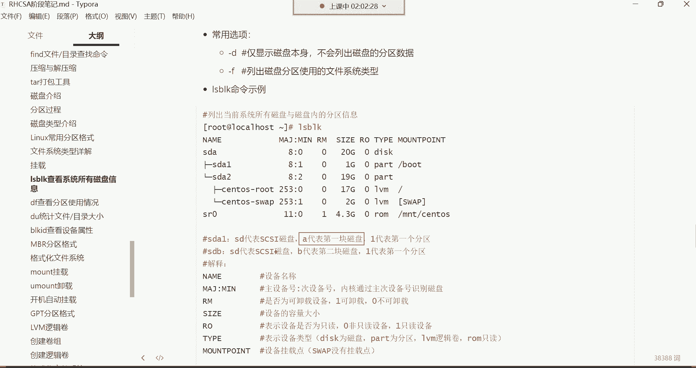
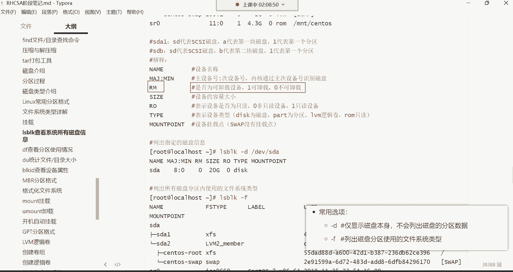
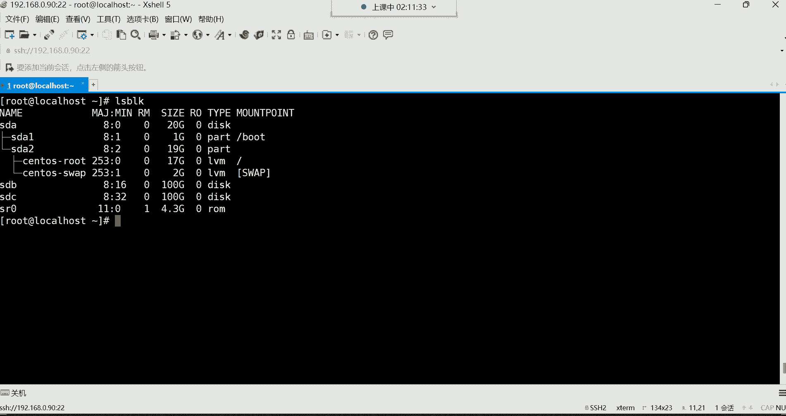
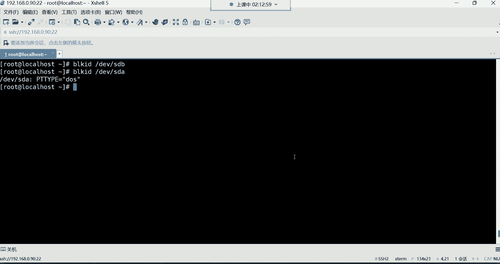
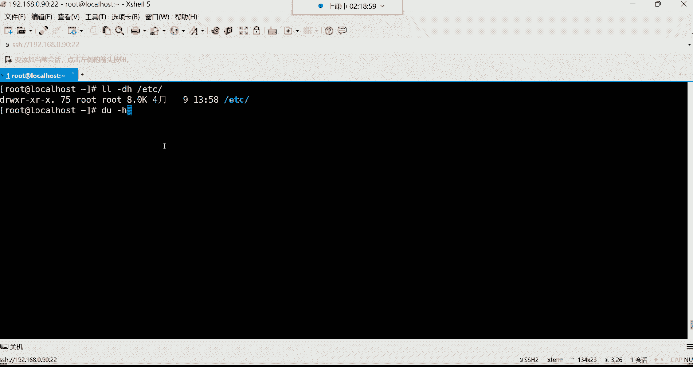

# 0基础小白怎么入门Linux运维？看这套，Linux运维全套培训课程，保姆级教学视频 - P23：红帽RHCSA-23.磁盘管理、分区格式介绍、磁盘管理常用命令 - 小方脸不方- - BV138411B7p5

继续哈，接下来呢我们这个来讲讲这个磁盘管理，其实对于磁盘呢，现在在企业当中啊，如果要是你们公司用的是这个云主机的话。

一般这个，怎么说呢。

对于这种硬盘你都看，你都不知道它长什么样子，这硬盘的长相在传统物理服务器上面呢。

我给大家去搜一个服务器的图哈，我给你们找找。

这个服务器，服务器硬盘，找这种图片，图片，来看一下啊，这个这个呢就是这个服务器的硬盘图片，就长这个样子哈，就就长这样子，就长这样子哈，然后这服务器硬盘我们说这就像一个，这就像一块砖头一样，看到了吧。

跟一块板砖一样，然后对于这种硬盘的话呢，现在在物理服务器上面哈，它在哪儿放着呢，你看这不是服务器吗，看了吗，哎这就是它的一块一块硬盘的插口，看到了吧，这些都是硬盘插口哈，你像一个服务器。

像这种服务器的话，一个服务器上面的硬盘插口，有可能有这个好好几十个插口啊，有12个的，还有这个16个的插口的，当然这要取决于不同的服务器非常多，而像这种，你看他们都是相互匹配的。

这硬盘直接能够插到这个插口上面，当然你得他这有一个什么有个开关，你一按小按钮，它扒下就给你弹出一个什么呢，一个这个小开关，然后你把这个硬盘给它插进去，然后把把这东西给它关上就可以了，这就是插硬盘的。

然后对于现在很多硬盘呢啊是支持热插拔哈，嗯热插拔什么叫热插拔呀，这热插拔就是我们拿这个U盘来说吧，这U盘应该都知道吧，就是你这电脑正开机呢，你把你的U盘插到你的电脑上面，你电脑马上就识别了，这叫热插拔。

就不需要关机啊，现在这个热插拔就跟我们平时用那个U盘一样，U盘不就热插拔吗，是不是叫在线插拔，所以在以前的服务器哈，以前的服务器这想换硬盘，它确实不支持这种，比如我服务器正在开机呢。

我想把硬盘给它添加一块新的服务器，识别不出来，你想让它识别，你得把这个机器关机，然后再开机它就能识别到有新的硬盘了，而现在很多硬盘就不用了哈，就跟插U盘一样，一插进去它就能够识别出来了，这角就是插拔好。

然后这长相的话呢，里边长它这个硬盘里边的结构是什么样子呢，我们来看一下啊，这里边它这里边的结构就是大体组成，有这个这这我们叫主轴马达，叫主轴马达哈，嗯对啊，这服务器用不用固态，一般看情况啊，得看情况啊。

对这就是应这就对对对，就这样哈啊就这个如如梦苏醒发这图哈，就把这硬盘直接插进去就可以了，然后我们说一说啊，像这种这个就像那个它里边的内部结构呢，这个我们叫做主轴，这叫主轴哈，就主轴马达干嘛的呢，转的。

然后这个硬盘里面呢有盘片啊，有盘片现场拍照是吧，这就是这个硬盘里的盘片，那数据往哪存呢，数据就往这个盘片上面存，就这盘配啊，就跟光盘一样好，然后呢他这个是什么呢，这个我们叫机械手臂，看到了吧。

这个机械手臂，然后机械手臂上面这叫读写磁头，那当硬盘，就当你的电脑一开机，首先这主轴马达它就开始嗡嗡的转起来了，他一转的话呢，那这个机械臂上面的这个读写磁头，你看它一转，这盘片不就跟着转起来了吗。

那这个当你在往硬盘里面存储数据的时候，他这个上面这个读写磁头啊，就开始摩擦这个盘片啊，就那种摩擦摩擦摩擦就往里边就开始写数据了，或者说读数据啊，就开始动起来了哈，它就是大体这么一个过程，这内部结构。

然后这种硬盘呢我给大家说啊，呃它这是里边是真空的硬盘呢，呃拆开可学习学习是吧，这硬盘你一旦拆开了，你就比如像这硬盘拆开了吧，我跟你讲，这硬盘呢就用不了了，为什么呀，它里边是真空的真空，就不能进空气。

不能进灰尘，能理解吧，一旦进灰尘了，他这个什么呢，一旦说进了灰尘了，就有可能导致这个盘片受损，一受损数据就丢失了，所以对于这种硬盘来讲呢，它都是这种真空的，一拆开进控器好用不了了，能理解吧。

就这种非常非常的这个怎么说怎么说呢，就非常矫情这种东西，因为毕竟这里面放的都是数据嘛，这盘片上面存的都是数据，都是企业里面的重要数据啊，像银行里边，比如你的银行卡号。

银这个银行卡的余额都存在这个盘片里面的，能列吧，当然这数据哈存到这盘片里面的，中国造不出来是吧啊，这不有吗，联想的吗，这不联想的吗，当然联联想他这也不是他自己造的，他贴标，联想最擅长干的事不就贴标吗。

是别人别人生产，他贴个标，这东西就变成他的了是吧，我们说那叫柳传志是吧，这是柳传志，我们说叫柳大师最适合干的事情，就我们说就是这各种组合，然后贴个标啊，这是磁盘的大体组成，然后这个磁盘呢我们给大家说说。

这个有一些概念哈，这个概念就是这个扇区这个概念嗯，他这个扇区的概念就是怎么存数据呢，你看这一块硬盘，他这一块硬盘我们是不是得分区啊，在这一块硬盘上面是划分一片一片的小区域啊。

然后数据呢就往这一个一个的小区域里面去存，你比如说我要在这个硬盘上面，我划分一个十个G的空间好，那这十个G的空间呢，硬盘在划分的时候它怎么划分的啊，它以扇区为单位帮你去划分，就类似于这个一个小空格。

这一个小格哈，你就把它列成是一个扇区，然后数据呢就往这一个一个的扇区里面存，所以说这个扇区，它是磁盘在存储数据的一个最小的单元，那这个东西你现在没有必要去了解它哈，你简单知道一下就行。

那默认一个扇区可以存多少数据呢，512个字节，也就是说比如这就是一个扇区好，那在这一个扇区里面，可以存储512个字节的数据，那我现在，比如说我想划分一个十个G的空间出来啊，一个十个G的分区。

那计算机它在帮你划分这十个G的空间的时候，它可不是说哎像我们人的思想一样啊，我直接给你划分十个G啊，这一片空间就是十个G了，不是他在干嘛呀，他得这样去计算唉，这十个G的空间由多少个扇区组成的。

他是这样帮你算的，那对于扇区它怎么计算呢，啊就是我是512个字节组成一个扇区，然后多少个扇区能够，组成十个G的空间计算机它是这样给你计算的，那这对于我们来讲，我们可能说我在划分分区的时候，我得算一下。

哎呦这十个G的分区得有多少个扇区组成呢，那你是不是还得计算一下，这多少个字节才能组成十个十，这么十个G的空间呢，然后你再去做各种换算呢，这就非常麻烦吧，啊没有人这样算哈，如果这样算。

那运维估计也就早都死光了，所以我们一般在画对磁盘划分分区的时候，我们就自己指定我要划分一个十个G，我要划分20个G，100个G啊，柱面是啥是吧，呃柱面在其实在就是支撑光盘的那个叫柱面啊。

就是你们现在看到这个什么，这个我们说这个柱面现在看到这个面就叫柱面，他这个分两面，磁盘分两面，这这它分正反面，正面也能存出，正面也能存数据，反面也能存数据啊，这就叫柱面儿，哈哈哈啊。

但是对于这个内部结构，大家没有必要去深入研究的，你说你又你又不是这个发烧友，你研你研究它也没有用，因为这种东西你研究不了这种东西，你就花钱买就可以了啊，买现成的，然后对于买磁盘的话呢。

现在有很多种磁盘的类型了，你像早期的有这种IDE接口的磁盘，对D接口的磁盘，注意，我们说就是这个，你在往服务器里面插着硬盘的时候，注意啊，这服务器的硬盘它有不同的接口型号能理解吧。

这服务器哈它分它这个插硬盘的时候，它对它这个接口分不同种型号的，有ID型号的，还有哪些型号的呢，还有像这种啊什么sci型号的接口，所以这每种接口你就得去买，它能够对得上的那种硬盘。

你不能说我服务器的接口是这种接口的，你买硬盘是IDE接口的，但对不上也驴唇不对马嘴，能理解吧，而现在服务器里边你看不到这种ID接口磁盘，这ID接口磁盘，那在多少年前，那可以说在嗯在09年的时候。

这种在服务器领域就已经淘汰了，为什么呢，数据传输速度慢，但是呢价格便宜，所以说这种接口啊不适合对XP年代，09年的时候，你想那时候哎呦，那时候就已经在服务器领域淘汰了，所以那时候就已经。

主要因为个人的家庭计算机领域了，但注意是在那个年代应用在家庭计算机领域，哎还可以，因为我们个人电脑呢也不是对外提供服务是吧，也没有什么对这个数据的读取速度啊，或者说存储速度啊要求特别苛刻啊。

必须得非常的快，那没有自己用嘛，无所谓，那像早期呢还有像这种SCOTT接口的，那是这COTT接口的，是从2013年的时候到201几年的，是到2016到17年的时候，是非常流行的SRC接口啊。

这早期主要用在服务器领域，优点呢数据传输速度快，然后从那个时候哎，从那个时候是，从2013年到201617年的时候，那时候scarce那个接口的磁盘就已经支持，我们叫热插拔了。

就你服务器你想你想添加硬盘，你不需要关机，直接把硬盘怼进去，它就能识别啊，但是现在你说这服务器还用SKT的吗，现在这卡现在你也看不到他的身影了，现在什么呢，哎对我们叫这种SARS，这SARS接口的。

这SARS呢他现在是比较在服务器领域比较流行的，对还有什么这个SATA接口的啊，这种的话呢啊，这个SA接口，现在主要是个人家庭，计算机领域用的比较多一些，但服务器呢偶尔也用，主要都是什么呢。

数据传输速度快啊，数据传输速度快，还有这种SSD接口的，这种是固态的，你像我们现在个人买电脑，你发现对哈，我们这个个人买电脑呢，现在普遍都是那种SSD这种这种类型的硬盘，为什么固态呀，价格贵。

价格贵的话呢，一般它数据传输速度快，为什么快呀，它的特点是利用内存去帮你存储数据的，这内存，你想想他这个我们说在计算机硬件里边的，最快的是CPU，这CPU就像火箭一样，而其次呢就是内存。

这内存就像飞机一样，最慢的呢硬盘是吧，硬盘就像绿皮火车一样，那你想想现在我们个人家用电脑，就比如说在我的硬盘里边，我的电脑都是固态，硬盘是五啊，500多个G固态硬盘。

它其实就是利用内存的机制去帮学存储数据，或者说读取数据的，所以速度要比那种那种那个像这种哈，我们叫传统硬盘，它比机械硬盘也快，比机械的还要快，这种固态的，因为内存嘛啊，还有这种像那个嗯哈哈哈。

还有这种这个NVME的，这种是一个协议哈啊这是协议，像这种协议的话呢，一般都是固态硬盘的一个协议啊，就是你的硬盘是固态硬盘，那成人速度可以走这种协议NAME的啊，这是新流行的协议，数据传输速度快。

都是利用内存帮你去承受数据，然后很多硬盘他就遵循这个协议，遵循这个协议的话呢，数据传输，但是这种一般都是固态硬盘哈，遵循这种NAME接口的这种协议，然后他呢传输速度就非常快啊，那以上对于这种东西呢。

你现在去买硬盘，你也看不到这种什么啊，sci跟ID的，如果是服务器领域哈，你看不到嗯，你卖硬盘的时候，他就告诉你了，哎哪个接口比较好，总之你这么去理解吧，你说这个王思聪，人家有一台服务器。

王思聪的那个服务器的配置是上百万，就王思聪打游戏的时候，人家是用服务器打，人家不是用我们个人家用电脑能理解吧，人家是用服务器，花100多万自己配了一台服务器，你看他玩什么吃鸡什么的。

那从从来不会不会出现什么卡顿的情况是吧，为什么人家配置高啊，所以说这个王思聪最经典的一句话是什么呢，他说我对于我的服务器的要求，就是所有的硬件都买最好的啊，对所有的硬件我都买最好的，为什么呢。

就是都买最贵的，他说最贵的就证明它是有价值，他最好的有钱人嘛，人家就以贵来评判这个东西的好是吧，不差钱对吧，所以人家配台服务器上百万啊，打游戏用啊，打游戏用各种博主上门安装是吧，没错啊。

确实是上门安装哈，那确实是非常非常的给力，哈哈没你启动快是吧啊，这是那个我们所说的这个硬件，只要你舍得花钱，你们公司舍得花钱，你放心，这硬件他肯定能够上得去，这玩意就跟你自己去外外边组装电脑一样。

你自己去外面组装电脑，你只要把这钱花到位了，你这电脑性能肯定不带差的，所以这个东西不是你能决定的了的哈，公司只要舍得花钱，那速度肯定就快好，那这是硬盘的类型，那下面呢给大家讲讲这个分区格式。

这个分区格式啊就是有了硬盘以后，你甭管是哪种硬盘，你都得对它分区才可以，你不分区这东西他用不了啊哈，他没有办法帮你存储数据啊，好那接下来分区的话呢，我们来说说用什么格式去对它进行分区。

那分区格式呢像比较古老的，有这种MVR的分区格式，MBR的分区格式，它最初只能划分四个主分区，注意这个分区格式就我有了硬，我有了一块硬盘了，这块硬盘呢你甭管它是个什么类型的，我现在得对他做分区吧。

这一块硬盘，那我们假设把这块硬盘它的大小是多大的呢，啊它的空间，它的空间是，一个T的一个T的一个T的空间的硬盘好，那接下来我就得对它去分区，那分区的话，如果说我选择的是MBR的分区格式，分区格式。

叫做MBR，这是非常古老的一种分区格式了，非常的古老哈，好那古老的话呢，它的特点就是分区的数量会有限制，它允许我们划分多少个分区呢，它允许我们对这一块硬盘啊，只能划分四个主分区。

这一个分区啊往上点往上点，好这是一个分区啊，这是两个分区，这是三个分区，再往上点，对我windows电脑就是MBR哈，三个分区了吧，再来一个哈啊，这是四个分区，一个两个三个啊，四个空白的分区。

那这我们来说一下哈，这MBR它为什么只能划分四个分区呢，还有一个问题就是，这四个分区到底够用不够用啊，到底够不够用呢，这是个问题是吧，这四个分区呢如果换做我们个人，那他肯定够用了，你像我的电脑。

我电脑里边他总共也没有多少个分区，所以我对于我来讲，我电脑就俩分区，所以我我是够用哈，但是你像很多的这个，我们说这个人现在每个人的需求不一样，有的人呢可能说这个爱好比较多，一般呢搞一个分区放一些。

比如说我的C盘啊，这这就是你的windows c盘，比如说我放什么呢，放一些学习资料啊，这C盘一般不放学习资料，放什么，放你的系统相关的数据，因为你在安装系统的时候，你所有的数据都在你的C盘。

那一般的C盘就放系统了，别的也不放了，因为你的C盘如果说空间被占满了以后，你在启动系统的时候，你的速度会非常的慢，因为毕竟你想你系统所有的启动的文件，都在你的C盘装着呢，就你的整个系统都在你的C盘里。

所以这C盘呢一般呢我们一般就装系统，那别的盘呢，比如我这个C盘，还有我的这个E盘，哎，那E盘呢一般放点什么学习的资料是吧啊，学习资料，比如说这个上课的视频学习的工具啊，放在E盘了。

那你这可能说连如果说没有别的爱好的同学，这两个就够用了，两个分区其实就是啊直接其实就是两个分区哈，但有的同学呢他不一样啊，有的同学他爱好比较广泛呢，你比如说他喜欢打游戏，听歌看电影，诶。

这时候呢还得搞一个盘，比如我的这个F盘，存一些F盘，存一些什么娱乐相关的软件是吧，对还有一些盘呢，那比如说还有同学，你像单身的空虚寂寞冷的，比较喜欢看一些视频的一些同学，那还得专门搞一个盘。

放一些老师的相关资料是吧，比如什么那个波多老师，什么那个小泽老师，还有什么这个最近比较流行的，那些什么老师来着啊，那叫忘了哈哈哈哈哈哈哈，是不是比较流行的老师哈，那叫什么来着啊，具体这个忘了哈哈哈哈。

放我的视频啊，那你看这四个分区就没了是吧，这四个分区够用吗，可能对于个人来讲啊也不太够用，那对于企业来讲呢，企业它放的数据呢它也有不同的分类，也也也也也是有不同的分类的，你比如一些备份数据的话。

那这个时候好变态是吧，呵呵那这时候呢四个分就不够用，不够用的话呢，一般我们就得什么呢，想办法再去划分更多的分区吧，你说你这一块硬盘，你这一个T空间的，你这一个T的空间，咱们就划分四个分区。

那感觉满足不了我的需求，是不是满足不了，非满满足不了需求，那不行，我们就得继续去想办法，所以这个MBR它后期啊，他就觉得确实是分区数量有些少，唉那我们就干嘛呀，增加扩展分区吧，这什么叫扩展分区呢。

这扩展分区啊，它叫一个容器，我把它比喻成一个容器，那什么叫容器，这个容器啊也不难理解，这锅碗瓢盆，瓶瓶罐罐的这些都属于容器，就装东西的嘛，你每天用的什么呃，杯子碗装东西的，这都叫容器哈，所以也不陌生。

那这个扩展分区它就是装东西的，装什么的呢，我们就可以在这个扩展分区里面去划分，更多的叫逻辑分区，那这个逻辑分区跟我们前面所说，这个主分区是一样的，就是存数据的，而扩展分区它不是诶，他是装东西的。

装逻辑分区的，所以他们之间的关系是什么呢，就是他现在允许你划分更多的分区了，但是现在你这个你如果想要划分更多的分区，我这个数量还是只能划分四个，注意哈，它数量没变，还是只能划分四个，但是呢什么变了呢。

你的这个第四个分区就不要划分成主分区的，这前三个都是主分区，都是主主一主二主三都可以去用来存储数据啊，这主分区都是用来存储数据的好，那第四个分区咱们划分什么叫扩展，就一容器扩展，分区扩展。

那它是不是编号是四啊，因为你它最终数量没变哈，总共就还是四个分区，但是但一旦有了这个扩展分区这个容器了，那这个容器里边可以让你干嘛呢，容器里边可以让我们去划分更多的分区，它这个容器123。

你在这个容器里边，你再去，比如说我还需要划分多少个分区呢，啊我需要很多的分区，那这时候咱们就在这个容器里面就划分了啊，这个容器换个颜色，不能跟主分区是一个颜色，换个蓝色吧，然后这个呢我们换成这个颜色啊。

这个就是唉扩展扩展了哈，扩展几呢扩展五了，这就扩展五了哈，然后那这个呢因为它这个编号哈，它的编号是不允许重复的，能理解吧，不允许重复的哈，对123，然后扩展是四，然后这是五啊，这就不是扩展，这叫什么。

这叫逻辑，这叫逻辑分区逻辑啊，逻辑哈哈哈哈，喊口号呢是吧，我这个我们这叫什么，这叫精神食粮，懂不懂什么叫精神食粮呢，好逻辑六，然后逻辑N，逻辑N哈，我把这个给他拿走，放到这，啊这是扩展分区了哈。

嗯对磁盘空间，磁盘空间一个T，那这样我们来看一下啊，这时候就是说有了这种功能以后，我们就可以继续去划分更多的分析，去存储数据了啊，逻辑多少，逻辑N啊，那这个N到底N到多少个呢。

也就是说最多它允许你划分多少个，这个逻辑分区啊，这个呢看磁盘类型，最终它这个特点就是这样子的，你看我现在可以有多少个分区去存储数据了，这个你要搞清楚，主分区和逻辑分区都是用来去存，帮你存储数据的。

就是现在它允许你拥有更多的分区了，允许你划分更多分区了啊，只不过这个更多的分区是从扩展之上划分的，那首先你得明白是不是扩展分区空间越多，逻辑分区划分区越多呀，没错吧，唉因为它是容器嘛，你容器越大。

在里面装的东西不就越多吗，好那接下来那到底可以划分多少个逻辑分区，有没有数量限制，有这一般呢看磁盘类型，磁盘类型，这里面我写了啊，如果是IDE的，当然这个已经是非常古老的了，我们现在已经淘汰了。

最多可以划分59和逻辑分区，如果是sci的，那像这种的最多可以划分11个，那如果你说老师如果是别的接口的呢，差不多也是11个，差不多差不多也是11个哈，啊，那这个呢，总之现在它允许你划分的更多的分区了。

这一块硬盘其实11个分区足够你用了，你想注意我们说的是一块硬盘，咱们说的是一块硬盘哈，而在企业服务器上面，他不可能说只有一块硬盘吧，没错吧，咱可能说是很多块硬盘哈，哈是很多块硬盘哈。

而我前面给大家讲的是一块硬盘，它允许你划分非常多的分区，能列吧啊一块硬盘现在允许你划分十多个，十多个，那也够用了吧，好好那接下来呢我们再来说什么呢，再说说它这个空间，现在分区现在数量可能是变多了。

但是它有个致命缺点，致命缺点是什么呢，就在这这个致命的缺点，最大支持2。2T以内的一个磁盘容量，也就是说，我如果用MBR这个分区格式，去划分这块硬盘的话，你的这块硬盘的空间一定要是在多少呢，在2。

2T以内，2。2T以内的话，我才能够支持对它划分能列吧，啊是这样子，那你说那在企业里边，那企业服务器硬盘有可能是比如说我三个T的，五个T的，八个T的，怎么办呢，咱们就拿右边这个硬盘来说。

比如我右边的硬盘，我是八个T的，八个T的，八个T硬盘，那你用MB2，你分区格式它就不支持，他没有那个能力，你你就这么想，他没有那个能力，主要是那怎么办呢，那难道说我这买买一块大硬盘。

我还没有办法对他进行分区了呢，这也不行是吧，那怎么办，哎这个时候我们可以用什么呢，用叫GPT的分区格式GP，它比较适合划分大容量的磁盘啊，这个扩展容器K8S是吧，这今天不行啊。

我们这这K8S跟容器不能放在基础阶段库去，给大家说这些事情的同学都懵了哈，你你如果说想了解容器跟KPS，这个宅帅同学啊，你可以干嘛呢，咱们这边这样就是我们这个机构呢，现在正在准备一些什么呢。

就是对学生做一些这个一对一辅导的内容，你们知道什么叫一对一辅导吗，就比如说你说老师啊，哎我想这个了解了解哪一部分的内容，但是呢我想让老师给我做一个一对一的辅导，你说看咱们机构现在能不能啊，一般呢。

这个现在我们正在规划这种一对一的辅导，你说老师这个阶段技术点我没有掌握得太明白，到时候你可以跟谁呢，跟对应的班主任，你去问问，你说老师，我这个嗯这个这块位置的技术点，我没有理解的太明白啊，能不能啊。

这个老师给我做一节一对一的辅导啊，不花钱啊，不花钱补课哈，这不都交学费了吗，你们不都交学费了吗，交学费还花什么钱补课呀，就是只要是这个老师，在这个有这个时间的范围内哈啊都可以哈啊。

都可以给大家做这种辅导啊，但是现在还没落实呢，这个具体还没落实到，你们得去咨询这个木木老师嗯，好行了哈，这当然这个具体能不能实行啊，这个是我们昨天经过开会呀探讨了一下啊，准备要尝试一下啊。

啊对非常银性上准备要尝试一下，主要目前没时间是好，那咱们继续啊，我们继续说，那这时候我们怎么办，我们如果说有一块八个T的硬盘，这个就得用GPT的这个分区格式，这个gt的分区格式它的特点是什么呢。

可划分128个主分区，128个主分区，也就是说如果你用GPT去划分一块硬盘的话，就这样玩儿哈，就这样玩儿，这是不是都是主分区啊，这都是主分区吧，好你就这样，这主分区N了哈，主分区N了哈，就这样。

就是总之就是网上以此类推去划分就可以了，能列了吧，准备去N划分多少，刚才看你的需求吧，只要你有这种需求，你就划分就可以了，所以说这个GPT的话对啊，可以任性划分，你想划分多少个，这个呢看你自己的需求。

所以说这个对于此，你也不需要像左边的这个MBR一样啊，你说我还得去搞什么扩展分区，然后在扩展分区里面再去搞什么逻辑分区，这听名字就不适合人类去理解的名字，是不是这什么名字，这适合人类去听吗啊。

所以说像这个GBT呢就比较简单粗暴一些，你就划分就可以了啊，我支持你这么划分，简单粗暴一些，所以对于这个GP分区格式呢还是蛮不错的，蛮不错哈，对于GBT呢，它也是除了这个空。

这个分区可以划分的非常多以外，容量呢也非常的给力哈，对绕头哈，什么还有什么逻逻辑卷哈，哎这个我们再说说这个空间，像这个GPT这个分区格式啊，它最大支持1800000000B的磁盘容量。

哎呦这1800000000B的磁盘容量，我们说这到底多大呀，磁盘空间18硬币我得给大家来说一说哈，哎呦他这个空间是这样换算的，首先呢是1024个字节字节哈，等于多少呢啊待会我就简写哈。

字节是等于这个1K10，就1000多个字节是等于1K的，那下边是还有什么呢，还有就是那个1024K，如果是1024K的话啊，但是这个我们用中文吧哈字节，我觉得我写的好像不是很准确哈，那个这个哈啊等于K。

然后1024K呢等于多少呢，等于一兆一兆，然后1024兆呢，1024兆等于一个G，1024兆等于一个G的空间，一个G的空间，那接下来以此类推的话，那如果是1024个G呢，好如果是1024个G的话。

等于是一个T1个T，那如果是1024T呢，那要是1024T的话，这中间还有一个单位呢叫P有叫PB的单位，Tb gb，它是这样子的哈，你看也就是说在这个EB这个单位之间，比我这个磁盘空间啊。

1800000000B的话，18EB的话，那你想这空间得多恐怖啊，得多么的恐怖啊，你想象一下是不是哎呦，你看这一个就1000多个T才等于1PB，那你说这EB的单位怎么怎么换算呢，是1024PB。

1024PB等于1亿比哎呦，你想想这个空间我们就我们说就这空间啊，你如果真是有一块1800000000B的磁盘，我可以这么说吧哈能放好多视频是吧，呃咱甭说能放好啊，这放好多视频，那得放多少视频呢。

你就这就比如说你这人可能说你爱好比较广泛，那他可以帮你把这个有什么这个全球，那都得是各个国家，各个地区，那都是各个种族各种肤色的那些老师啊，你想这十八一B就非常恐怖了吧是吧。

当然我们说这虽然说我们不会去存那些啊，但是我们就简单就是给大家这个形容一下，就这空间非常的恐怖，但如果你真的是能把这些视频都给他收集过来，那我相信对于你来讲，那你这哈我想你的经验哈。

那可以说是非常之丰富了哈，对你这你的经验我可以说是，那不是那什么这个姿势，什么那个动作的是吧，我相信对于你来讲，那都不算什么，呵呵因为你懂得太多了是吧，对知识非常的广泛啊，知识非常渊博，恐怖是吧对啊。

这哈好了，这样我们就简单描述一下啊，这对于我们来讲呢，我说这简单形容一下啊，那这空间非常之恐怖哈，但是呢他可以帮你去划分啊，哈哈哈能划分啊，是不是啊，哈哈哈好了，那两种分区格式啊。

所以说对于这两种分区格式，我们就得说一说到底用哪种呢，咱们两种都学啊，我们这两种都学啊，然后最终呢你在企业里边，如果说哎咱磁盘容量比较小的话，哎你就可以选择用这种MBR的分区格式，但如果遇到大磁盘。

咱们看咱们就选择这种GPT的分区格式，不就可以了是吧，哎这就看看个看一个具体情况就好了哈，这东西没有什么绝对性可言好了，那下面呢我们就来这个再来给大家讲讲什么呢，再来讲讲这个。

我们知道用哪种分区格式去划分了是吧，那分区格式怎么用啊。

怎么用，咱们呢来给这个机器添加一块硬盘哈，我们添加一块硬盘。

但我们这添加硬盘得关机，这虚拟机啊好像不支持这种什么呃什么，在开机的时候添加硬盘，我试试哈，我看看允不允许吧。

如果允许的话，就最好。

等一下啊，啊对我看过，我这个机器能不能实现一个热插拔的功能，在虚拟机有的时候好像不太支持这个功能。

右击，设置，啊111聊这种事情就都不困了是吧，医疗这种事情倍儿兴奋。

为什么不兴奋呢，就感觉好像跟我有什么关系一样是吧，呵呵我们添加一块哈设置啊，不支持是吧，添加硬盘，下一步sci啊，S a t a，但我得给大家说一下，你看咱们虚拟机里边是不是很多种磁盘类型啊。

这很多种磁盘类型啊，这个我们当初啊注意啊，是不是默认就是sky类型的呀，那你这时候就不要再选择这种SA类型的了，如果你再选择SA类型的，他可能说就是出现一些不兼容的情况，我们来试一下哈。

啊它提示只有在虚拟机电源处于关闭状态，才能添加这种磁盘，ID的啊，那我们填SA的SA看cookie啊，下一步创建虚拟硬盘是吧，嗯下一步多少G呢，100个G100哈，就写100就可以了。

然后将磁盘存储为单个文件，下一步名字啊，就叫这名字，完成确定，正在还原虚拟机状态。

好诶好像可以了哈，好像是可以了，我上去看一眼瞄一眼哈，用这条命令叫阿拉斯block回车，唉，同学们哈来看一下哈，可以哈，可以呃，而且我们添加的类型好像也不太一样。

是不是咱们说一下，我刚刚敲这条命令叫l s bk这条命令。

这条命令干什么用的呢，这条命令来看一下哈。

他的全名对热插拔是吧，可以了哈，它的全名叫做list block，这例子就列出block就块的意思，用于列出当前系统所有的磁盘信息的，列出来了吧。

就是我们刚刚添加一块硬盘，是不是就直接热插拔，就没有关机，就添加上去了，你看识别上了吧。

磁盘名字叫SZB，这SDP怎么由来的呢，SDB啊是磁盘的名字，磁盘名字，我给大家讲讲他这个名字怎么个由来法，我这边写了这个S呢，它这个前面哈它既代表是这个sci啊，又代表SA这种类型的。

所以S呢这得看你当因为你当初买四方时，你自己应该知道你买的是什么类型的，所以这个S呢他如果是死的呢，它也是用S来表示SA，它也是用S来表示的，所以这个S就代表着你的磁盘的接口类型，是什么类型的啊。

磁盘类型，那后边你看我们这个磁盘，你发现这后面什么什么什么SD，这到底是什么东西啊，这D是什么呀。

这D啊代表你的这个第几块磁盘，如果是A的话，就代表你这是你的这个第一块磁盘，如果是B的话。

那就代表是第二块盘，但是我们这种我觉得我这机器啊啊SDA，SDB是不是，那你看一下这个A的话呢，就是第一块盘，这个B就是第二块盘啊，等会儿啊这D啊D啊。

我们说这D哈，这D这SD他代表是这个SCTT的哈，这前面两个字母啊，少说一个SD哈，代表是它的磁盘类型是接口类型啊，它也不是卡，就是它的那个接口类型SD，那后边那个A呢就代表你是第几块盘了。

然后你看我们现在看到这个事没有，是不是SDSD就是我这个磁盘类型啊啊，但有可能是SARA，也有可能是，但这个肯定是第一块盘是sci的，我们第二盘是SA自己添加的是吧，然后后边这个A我们就可以清楚的看到。

这个A就是你的第几块盘，我的第一块盘，那这个呢B呢就是第二块盘，那如果再添加一块呢，你比如我们现在再添加一块哈，咱们把这机器再来一块，右击设置，我们看到这顺序，它是怎么怎么排序的。

然后选择你看我们的硬盘是SA类型的好，然后我们再选择添加一块硬盘，好下一步啊，SA类型的，这时候呢下一步注意啊，这ID他告诉你了，IDE的不能，热插拔哈，只能关机，然后下一步啊，这呃是啊，这不用管啊。

就新建虚拟磁盘，我们是不是得选择，我们是不是得选择新建磁盘呢，不能使用现有磁盘吧，哎下一步，然后接下来呢存储为单个文件就行了，再来100个G空间，100，下一步完成，确定啊。

不会变哈，你删除的话，名字它不会变，没事儿，我们到时候都可以试一试，因为我这个虚拟机啊，我还真是我以前净添加斯卡去了，SA的话呢，我还没添加，所以这还真是我们这大姑娘上轿头一次啊。

那我们就看看在使用方面到底有没有区别好吧，反正都是头一次，这时候我们再来看有没有识别IOS变了，K变成多少了，是不是变成C了呀，所以他这个顺序就是什么呢，就是ABC就代表第几块盘，A就是第一块。

B就第二块，C就是第三块，然后他这个SDSD就代表你的磁盘类型啊，有可能是TTED，也有可能是SU啊，这S哈SD只要是S开头的，那这就得看你自己啊，因为因为你在花钱买硬盘的时候，你自己心里还没数吗。

然后其实哪种接口类型啊，其实也不是很重要。

别的话呢我们再说说像早期的那种IDE接口的，那像早期IDE接口的磁盘啊，它是什么开头的呢，有有人知道吗，以前那个IDE接口磁盘，我去搜一搜哈。

我也忘了，因为真的是你想09年就在服务器里面淘汰了，我都哎呀。

我都我都几乎没用过那个IDE的磁盘，我们搜这个叫磁盘名称，09年你还在玩玩泥巴是吧，啊你是你是NVME，是不是，不是哈，你那个你那个NVMENVNVME，他想什么呀，SD啊，然后分区编号啊，这SDSD。

他这个，唉以前以前早算了。

我们不搜了哈，他爱叫什么叫什么，根本也没有太大关系了啊。

总之你就知道他这个S代表什么意思就行，能理解吧啊，SD开头的代表你这个磁盘的类型啊，就你的磁盘类型，后边就是你的磁盘的一个编号好。

那这个编号里面的一是什么意思呢，这下面这怎么还有个一啊，是不是一和二啊，这代表分区，这是分区编号，这个分区编号就是你这个硬盘上面有几个分区，你看然后它是以此类推，1234，那我们看我们这个机器里面。

这个SDA这块盘有几个分区啊，有两个分区，是不是两个分区哈，SDB跟SDC这两块盘呢没有分区。

没有分区，然后接下来呢，这个对于这个阿拉斯block这个命令啊。

它还有一些选项，把这长的选项。

我们把这个选项拿过来，第一个杠D，那么阿拉斯block杠D你跟上，当然这磁盘我们添加好以后，你知道他在哪个路径吗，在系统DV下边，DV这个路径就是存放所有的硬件的一个路径。

在这里边你就直接输入s dB就可以了，回车看到了吗，这个时候他就给你显示出来了，这个SDB它本身的信息，然后这个里边呢这是磁盘的名字吧，然后这size size是磁盘的大小。

100个G类型DISK代表着磁盘，DSK它类型是磁盘类型。

那前面这些是什么东西呢，我这笔记里面也写了，但是没有必要去研究它哈啊，这是什么主设备号跟次设备号，但这种东西呢你就没有必要去深入研究它了，内核识别的内核，通过这个设备号去识别这块硬盘。

然后这个RM RM呢代表是否为可卸载的设备，一是可以卸载。

零是不可以卸载，能不能卸载，我们这个不可以卸载，因为你还没用呢，你还没用，你还你卸个毛啊，是不是。

我这个零零是一是可卸载。

零是不可卸载哈，在这不可卸载。

然后这个RO代表是他的一个权限啊，权限的话在这里边表示设备是否为只读零，是非只读设备，一是只读设备，像这种硬件设备的话呢，我们说这个非只读跟只读的话，你像这个它对应的是零是吧。

这非只读设备，就这东西你可以往里面去嗯，非只读啊，这个词汇怎么去，怎么给你们解释这个词汇呢，非只读，就是除了赌以外，可能说啊你还可以往里面存储数据啊，可能是应该能能这样去解释哈。

但你没有必要去理会这些东西哈，这些东西的话呢，对我们来讲也不是什么重要的信息啊，你就对哈，就是你可以往里面存，对于这种类型的话呢，你就看它是磁盘类型的，然后下边的话呢F呢我们再加F哈，再用F去看一看。

这F现在它没有文件系统啊，但是这这是分区是列分区的，这你得比如我们拿这个SDA1来说啊，我看这个SDA1SDA1，你想看看它唉，这个时候呢我们可以清楚的看得到，他的一些什么SD1这个什么呢。

它的一个文件系统类型，这个叫fs type，就是它的文件系统，我们一会再给大家讲讲什么叫文件系统是吧，然后这个UUID，这UUID就是这个设备的一个身份的一个，id号唯一标识，然后这就是它的一个挂载点。

就是这个分区在给哪个目录在存储数据，我们叫挂载点，我一会也会给你讲什么叫挂载好吧，先知道这个alice block这条命令的功能，主要我们最常用的就是直接这样，Alex block。

直接看看我当前系统里面有多少块硬盘，还有多少个分区，这是看硬盘，然后看分区能理解吧，然后每个分区他在为哪个目录在存储数据，可以看到有根分区，有boot分区啊，分别是用哪一个这个根目录跟不同目录啊。

分别是为是用哪一个分区在存储的这个数据，那其他的话呢我们到时候再讲啊，然后接下来我们再来说说这个叫DF这条命令。

DF命令用于查看文件系统的一个使用情况，哎呦这文件系统我们现在还没有涉及，是不是没关系啊，这条命令呢主要就是看我正在使用中的分区。

DF直接敲回车，他现在可以帮我们看我正在使用中的这个分区，而没有使用的那个磁盘信息，他列不出来，你看它并你他并没有告诉你，这个系统里面有多少块硬盘吧，所以它这里面呢可以帮你列出。

就是你这个不同的分区在用的文件系统，类型是什么类型的文件系统，但是文件系统我现在还没有讲，所以这个位置呢大家先简单知道一下，DF这条命令，它主要是看文件系统的啊，可以看到这个根分区他在用哪个文件系统。

在存储数据是别的分区，它具体的文件系统类型是什么啊，这一会再说哈，你先不用，现在先不用去管了。

DF命令，然后我们再说这个，叫BLOKID这个名字叫查看设备的属性，哎呦这个看不lock d这命令怎么用呢，这个你直接跟上设备的名字就可以。

Vlocd，我要看DV下的SDD，SDA吧。

那它这个属性的话我们说一下哈，它能够列出设备的名字，设备UID还有这个文件系统类型，但是我们现在看的是什么呢。

是这个硬盘，但是如果你要看分区的话，SDA1哈，你看它的功能啊，跟前边的那个什么呢。

呃我前面讲一个那个叫做这个IOS，它加一个这个杠F，这个选项的功能其实是一样的啊。

alice block是杠F跟上DV下的SDSDAE，你看这效果好像一样是吧，都有哪些呢，呃block id呢它列出这个分区的，首先它的UID，那这UID呢我们用这个选项杠F也可以列出来。

是不是一模一样的呀啊，然后以及它的文件系统类型，这儿呢文件系统类型，还有这个分区的名字，但是呢他唯一没有列出来，就是它的挂载点，就是这个分区在给哪个目录存储数据，这是他的唯一的区别了，所以在这个里面呢。

大家在记的话呢。

嗯我告诉你们这几条命令我们怎么记哈，如果说你想看你系统里面总共有多少块硬盘，有多少块硬盘，就敲这条命令，你一敲好清楚地看到我系统里面总共多少块盘。

包括没有分区的硬盘，它都给你列出来了，看到了吗，这是不是没有分区的两块硬盘呢，以及已经分区了，正在使用的，包括分区的信息，是不是都给都都是不是都给我们列出来了呀，好所以说想看所有的硬盘就敲这条命令。

那我想看具体的每个分区它的空间的大小。

给大家补充一下哈，在这这条命令，我们说这个通俗通俗的解释啊，或者通俗啊，通常的用法吧，通常的用法这样可以哈，通常用法就是查看系统中，硬盘的信息啊，包括有多少块硬盘，以及每个硬盘的分区数量诶。

这时候比较好理解了呀，啊有多少块盘，以及每个硬盘有多少个分区，所以就敲这条命令alice block直接敲就行好，那这DF命令呢，它可以查看文件系统的使用情况是吧。

这个命令你这样，比如我现在我想看看我的根分区，这根分区不是在使用这根目录，不是在使用这个分区在存储数据吗，好我想看看我根分区的一个使用空间，哎DF回车看不懂啊，加个选项，DF杠，这个时候你看啊。

它会帮我们列出啊，当然也包含根分区，只要是正在使用的分区都给你列出来了，我的这个根目录正在使用这个分区，它的一个什么呢，它的一个容量总共的容量是七个G，已经使用多少容量了，1。2个G还可以使用多少容量。

16g，然后他们的一个百分比，这个是已用的百分比哈，好，那你说DF这个命令是不是就比较适合查看，我正在使用的分区的一个容量信息啊。

所以说这个命令我们说叫通俗啊，我前面是怎么标记的哈，要通常用法，通常的用法是用于查看具体的分区，的一个使用情况，这样能理解吧，每个分区它的一个空间利用率啊，我们就简称叫空间利用率吧，空间的。

一个资源使用率，这这应该是比较好理解了是吧，通常的用法，然后这个do命令的这个do命令，我们前面用了是吧，但是他现在来详细说说，叫统计磁盘下目录文件大小，我想看一个文件有多大。

那杠H这个选项，杠H这个选项。

主要是以人类一读的方式去显示文件大小，以怎么人类一读呢。

K兆记的方式就还是拿我们前面那个文件来说，etc那个service这文件如果你这样统计的话呢，他这个6656是吧，你加个杠H杠H656什么呀，哎656K，不然他不告诉你656什么没有单位，所以加H哈。

它以什么呢K招G的方式给你显示文件大小，那你知道LSLL不也可以吗，如果LL跟这个文件是不是也一样啊，再补一个H，补一个H选项，你说他是不是也可以正常显示这个文件大小啊，什么655K啊。

你说那这两个命令有什么区别吗，有区别哈，呃如果你在统计一个目录的时候，我们来看看IFL，我们杠DHD是只显示目录本身是吧，H是显人性化的显示大小，比如我统计etc这个目录，你看8。0K是不是8。0K啊。

但如果你换成do呢，度杠H但它有个选项叫SS。

是只统计每个参数的总数。

什么意思呢，就是我直接把整个etc下面的所有数据，都给我统计出来，就直接加个S就可以了，那咱们看一下啊，你看这明明都是可以看一个文件的大小，为什么LS他看到大小是8。0K，怎么这么小呢是吧，你回忆一下。

就我们刚刚看到那个service的文件，是不是都在etc目录44的文件，光淘宝大小是不是就655K，但是我现在统计整个etc目录，为什么它才8。0K啊，怎么这么小啊，而下面do统计完以后是31兆呢。

这个应该比较靠谱一些是吧，这是他统计整个etc目录的大小，所有文件哈，这个文件那如果你不加S的话呢，你不加S它就什么呢，直接把所有东西都给你显示出来了，看到吗。

你etc你这个etc目录下面的每一个文件大小，是不是都给你统计出来的呀，但是加S以后呢，主要就是只给我统计一个总数就行了，我就看总数唉，这时候你说这差在哪呢，你杠DH这就不一样，唉里面文件内容不统计吗。

没错这LS啊，他在统计一个目录的时候，它可不会统计目录里的文件的数据的，因为文件的数据他不管，那他统计是什么呢，在etc目录下边，每个文件的名，注意啊，是这个文件名，总共占我这个目录的空间是多大的。

所以这就是它的区别，能理解吧。

哈哈他不统计文件内容哈，所以你这要明白，你说老师我们前面学过阿拉斯命令，这还学do干嘛呀，这你要搞清楚哈，这度跟IOS的区别在哪里啊，这do是统计文件大小的好。

block id呢这个命令我们后期看什么呢，我们后期主要是用它看一个分区的文件，系统类型，分区的文件系统类型，其实这个你也不一定非得干嘛呢，不一定非得用它，就是alice block。

也可以查看多少和硬盘，是以及，呃分区的具体信息对杠F就可以了。

所以block呢大家可以记也可以不记，因为毕竟功能都差不多，是不是，杠F跟上DV下的SDADA1，是不是都一样啊，文件系统类型啊，所以这个呢就看情况哈，看清了，然后把这个k i d blog id跟上。

效果也是一样的啊，只不过它的类型显示在这了，显示在这了哈。

其他的就没有什么区别了，没有什么区别啊，所以在这里边再做一个小的总结，这时候你们应该能够清清楚了哈，我想看我系统中有多少块硬盘，以及每个硬盘有多少个分区，我就记这个命令，阿拉斯block好。

我想看我想看我具体的每个分区的一个，比如说它的一个使用率，分区的使用率，我用哪个DF来查看具体的分区的使用情况，我就DF啊，通常加杠H哈，翻译是杠T呢，是显示每个分区的文件系统也可以。

那我想统计文件或目录的大小，我就用do要用度，那不这个blog id那就看情况了哈，这就一个可选的了，能理解了吧，那现在我们说这条命令跟这条命令，还有这条命令就是对于磁盘管理的常用命令，现在搞清楚了吗。

OK了吗，OK给我刷个一上来这三条命令哈，现在是不是捋顺了呀，分别能干什么事了呀，好OK是吧，好行了，那接下来呢这个MBR怎么分区。

因为我们已经添加硬盘了呀，咱们这个添加是SA硬盘是吧，我们alex balice block列出来了，我们这有两块硬盘好，那这时候我要对它分区，那一会儿呢我们来说说MBR分区啊，怎么分行吧。

我觉得应该休息了啊，一个小时是吧，我们时间掐的还蛮准的是吧，我们休息一下，回来呢再讲讲怎么分区好吧。

