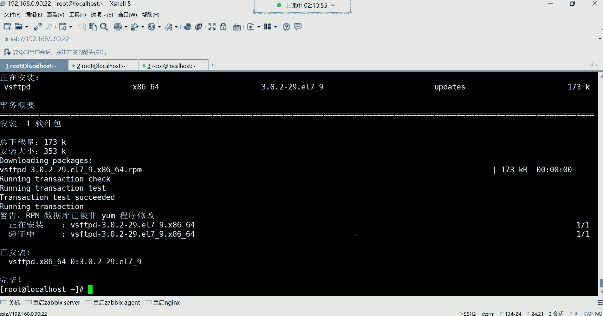
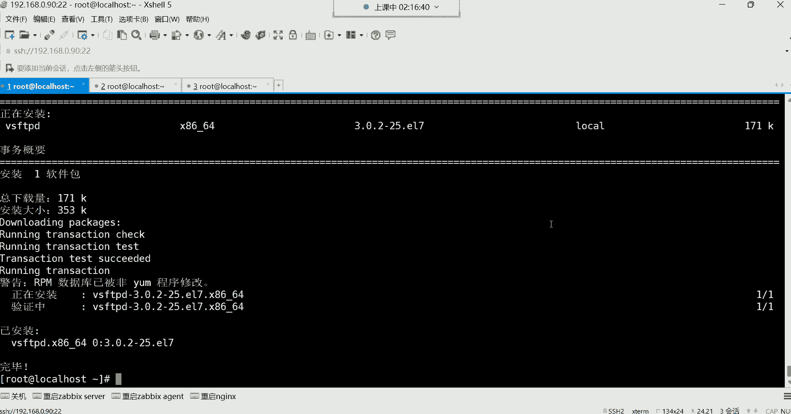

# 0基础小白怎么入门Linux运维？看这套，Linux运维全套培训课程，保姆级教学视频 - P35：红帽RHCSA-34.软件版本升级、网络YUM仓库配置、设置YUM仓库优先级 - 小方脸不方- - BV138411B7p5

哈喽哈喽都回来了吗，回来的话我们继续，我们把刚刚的那个升级啊，我给大家演示一遍啊，刚刚我那两个选项找到了，那两个选项呢有些长，所以呢我这个就没有放在这个笔记里边哈，这两个选项是非常非常的长啊。

第一个选项可以列出仓库该软件包的所有版本，所以你们来看一下这个选项，这点是这样的，结合这个list看到吗，然后跟上软件包名，然后再加上这个长选项，就可以列出这个仓库里面所有的版本了。

我刚刚是这样用的，你们来看我这个命令格式哈，命令格式在上边在这看了吗啊ym list，我呢列出我这个仓库里边，所有NDEX相关的版本都有哪些，然后后面接加上这选项就可以了，那现在在这个仓库里边。

NGX相关的版本有有看到了吗，这些都是是吧，好那我现在要下哪个呢，我现在要下这个一点啊，这是这个哈，嗯有这个1。21。1的，这些都是稳定的，我像这个1。18。1的版本哈，因为前面版本太低了啊。

前面你看还一还一还是单位数的版本太低了，现在最新版都是1。20。2的了，所以我下载这个哈，那这时候怎么下呢，就这样，我我下1。18。0有让一会做个升级哈，亚因此套后边注意啊。

还要加这个选项的，这个选项也比较长，看到了吗，这个选项不是啊，我就是为了给你们演企业里，有的时候也卡的很死哈，为什么呢，因为其对于一个软件的版本来讲，企业需要下载这种稳定版。

那用YM去指定某一个版本的话，你就得加这个选项，如果我们用YM安装一个包，我们虽然说是省事依赖都给你解决了，但是呢它默认会下载这个仓库里面，这个默认最新的版本，知道吧，最新的。

但是你企业比如说比如说我们就喜欢哪个呢，1。16。0呢，我觉得1。116。0的稳定啊，我就不想用这种新的怎么办，你就得要去通过这种方法哈，去指定具体的版本名字，我要下11。18的这个哈。

那NGX这个名字放在这儿，你得先跟上后面的版本哈，是1。18。0的这个哈，NDEX嗯，然后在这补上1。18。0的，我们就这样哈，记不住是吧，怎么这样叫星181。18。0，后边也记不住了，不管了。

就这样哈，这样能看懂吗，我看这样好不好用哈，哎前面我指定我要下载NGX这个包，然后呢后边一点一啊，包含1。18。0就可以了，嗯因为默认他这个版本好看，下第四啊，他其实是个杠，看到后面其实是个杠哈。

行我们就这样1。18。1。18点零，然后看一下嗯，是不是1。18。0的版本呢，好这是我们想要安装的，没错吧，其实我们在安装的时候，就可以像我这种比较简洁的方法去安装，因为你不需要去干嘛，你不需要去哎呦。

把这名字都给他搞上去哈，太麻烦了，而且有的时候，你如果说像他这种方式去复制粘贴，你看他这个名字，其实还还不是你想象的那个样子，它安装这个包的名字不是你想象的样子，好，我们先按Y就行。

现在开始验证这个指纹了哈，Y，啊这是INX那个软件包，看到了吧，好那软件包现在安装好了，1。18。0的，那接下来我改它的配置文件，我先查一下杠QL，看看他帮我系统里面安装了哪些文件哈。

然后我先找到它的那个主配置文件，它的主频文件在这呢，在ETCN这个词前面有个叫康复点D，我呢现在打开etc nginx有个叫cf点D，下面有个文件叫default点cf，这是它的主题文件。

好那这个文件打开之后呢，比如我现在要改这里边的一行配置，改什么配置呢，比如我要在里面加嗯，不加吧，嗯我看一看哈，改什么，就这样吧，我们为了验证哈，我们就直接我看一下哈。

那个那官方好像被我给关掉了啊。

关掉了，那我改什么呢，我往里面加一个参数吧，我手写吧，各位好吧，手写吧，我确实是这个，如果再找的有些费劲，我们主要就是为了验证一下，就我们比如说对这个配置文件，我做了一些修改啊，就这样哈。

当然改这个是什么含义，你们先你们不用去管哈，不用管，我是不是加了一个什么呢，加了这个一段配置啊，好加完以后保存退出，保存退出之后呢，我接下来我不不做任何操作，我就升级了，注意啊，我现在就升级，升级以后。

咱们验证这个文件里的原先的那个配置，现在还在吗，到时候好吧，那升级我现在无所谓了，我在安装的时候，我用亚马鞍，我是不是可以指定一个1。20，1。20。1的，这样是不是也可以啊啊原先是1。18。0吧。

好回撤，啊这时候嗯等一下啊，NO啊NO，我得用升级的那个什么哈，卡住了卡住了，回山怎么删不了了呢，卡住了哈，那就N吧，我现在要升级哈，我用这个选项升级叫ym update yupdate。

那只需要就把这个in store换成update就可以了，升级吗，现在不是yum update，好来看一下现在版本是不是1。2，0。1的版本呢，那现在Y，好现在升级成功了，升级成功之后呢。

我现在在干嘛呢，我在看原先的配置哈，再看原先的配置，看ETC，N这个是cf点地下的那个default，点这个文件我们打开它，VM打开哈，我看下版本哈，N这个杠V，我没有起伏嘛，可能刚刚，一是吧。

我刚怎么嗯没有起伏，一，现在是1。20。1的，没关系，要把服务起来，哦语法写错了哈，我那个语法错了，语法错没关系，我这个，删掉删掉，我加两个注释还不行吗，或者说我去掉一个注释，我把这个注释给删掉。

把这个井号给它删掉哈，删掉保存退出，我在起伏啊，这没有问题了啊，浮起来之后呢，我现在在这样，我在升级，我再对它升级哈，我再对它升级，难道现在新的版本都有这种机制了吗，这新的版本来哈，再试一遍哈。

我再升级1。2，0。2的，如果有这种机制，那就太幸福了，如果他真的是只升级版本的话啊，1。20。2哈，你看它上面是会先帮我们清理，1。20。1的这个版本，你们看到了吗，是不是看到先清理了呀。

是不是显示正在更新呢，好现在变成1。20。2了吧，我看状态哈，好也是运行的状态，那这时候我再看配置文件，如果这时候这个配置文件如果再没有变化的话，那我只能说，现在这个版本已经变得非常的智能了。

好还在配置，还在配置，确实是没有给我们覆盖掉哈，那这就是由于可能说这个软件的机制吧。

啊这个软件的机制它不会覆盖原先的。

可能是有一部分配置文件，它没有被它没有被覆盖，那版本有没有变化呢，1。20。2的版本也变了啊，那就太好了，那对于你们来讲，那你们也不用担心，说哎呦，我这一升级原先的东西都没了。

怎么办呢啊早期那可真的是啊，早期的版本可没有这么智能，早期软件一升级原型的东西全都消失了，都变成新的了哈，就跟一个新安装的软件没什么区别。

而你看现在呢啊非常好啊，所以现在升级也不用怕了，但是呢我们虽然说不怕归不怕，但是最好也留个后手啊，你别上去真的直接升，万一有的软件它没有这种机制呢，没有这种机制，是不是你就哭都找不着调了呀。

嗯哼所以一般也要做备份哈，也要做备份对，这就是把它配软件做的备份就行了，嗯好那这是升级升级，现在知道怎么升了，我说简单的，这升级说白了你就只需要有高的版本就可以了，有高的版本就可以了哈。

那卸载呢，比如我后期我想给它卸掉，那这包我不想要了，ym remove跟上软件包名就行了，回车，你们看了现在卸载的时候，现在都很智能，怎么智能呢，就是我们在安装这个软件包的时候，它是有依赖的。

它有很多的依赖哈，但是在卸载的时候，你发现它只卸载了谁呢，只卸载了这个主包，前面安装的时候可不是说只安装了一个主包哈，在最初的时候安装的时候，你们来看一下哈，嗯在最初安装的时候，嗯这是安装一个吗。

这是升级的吧，这升级的我看是不是哈，这是安装的吗，呃它所需要的啊，这安装的时候他怎么没有需要依赖呢，难道说我这系统里面它所需的依赖，我都已经给他安装安装过了吗，提前这有依赖哈，还是有些依赖的。

你们看到没有依赖哈，那1。20。1就需要依赖了，这就是呃将被更新更新，有很多依赖看到了吗，正在处理依赖关系是吧啊有非常多依赖，哦你看需要这么多依赖是吧，这些是安装的包，然后下面是依赖。

但是呢你发现我们卸载的时候，他就非常的好，怎么好呢，它依赖并不会给我们卸掉，只删除这一个主包，所以这时候呢我就直接输入Y是否继续，你看它只删除了这个NDS这个主播，而别的是不是就没有被受到影响啊。

所以现在卸载的话，你发现亚么这种机制也非常非常的人性化了，在早期他会帮你卸的，早期帮你卸哈，嗯他得先问你啊，这个有一个包作为你的依赖，你要不要也一起给它卸载掉，那时候有个选项啊，如果你想卸掉的话。

你就得把依赖啊。

他会帮你把依赖也同时卸掉，但现在也不会了，所以卸载是不是也很省事儿了，升级卸载都非常省事了，但是一般我们也要留后手。

但卸载这种事情一般不会做，我们一般不会去卸载啊，这时候在岗位应该看不到版本了，看到了吗啊没了被我给卸了哈。

然后下面还有叫这个清除缓存，最后再说清除缓存这个选项，我们放到最后，然后下边呢还有这个哈，还有这个ym previous，后面跟个命令，这个呢我们前面经常用这个应该有印象吧。

这个private比如说我在敲某些命令的时候，这个命令啊他没有找到，我们这边是不是经常遇到这种事情啊，然后接下来呢我们就要PREVIS是吧，然后跟上那个我的那个命令，我那个哪个命令没有。

我们就用哪个命令是吧，比如说我们系统里面我看有没有AB命令哈，AB有吗，没有是吧，比如说我想用这个AB命令好没有，那我就要，providence跟AB，然后他就会帮你去搜索。

VAB这条命令是由哪个包提供的，看到了吗，是不是帮不帮我们搜这个AB命令啊，有哪个包呢，由这个包有这个哈，有这个叫HTTPD杠TOS这个包提供的，然后那个文件名是在系统的这个路径。

如果说你想使用这条命令，我是不是得把这个包给它安装上就可以了，所以这时候我们就这样Y是吧，然后杠y in store安装谁呀，安装这个HTTPD杠TOS，安装它回车，好安装好了之后呢。

我就这样可以用AB命令了，就可以用了。

没有报错了吧，好这个previous这个非常好用哈，这个得记住，因为很多命令你最小化安装的时候，你系统里面就是没有的，所以你想知道有哪个包提供，你就得去搜下边，还有啊，这两个我们已经讲过了。

这就不说了哈，这个都这个一般用的不多，这两个一般用的不多哈，那常用的都有哪些呢，123，还有，这五个呢是非常非常用啊，是非常非常常用的一些命令的，那上面这个清除缓存，它怎么就常用了呢。

我一会儿会给你讲一讲哈，啊缓存有错误，到时候呢会影响你进行一个排除啊，这是亚目常用命令，然后看看对这些命令有没有一些疑问，各位呃没有疑问的，给我刷个一上来，然后我们就继续往下给大家讲讲。

这个YM优先级没有疑问是吧，OK啊缓存清楚是清楚哪些啊，一会儿我不给你讲哈，我们接下来呢啊，再来给大家说说这个叫网络亚目源怎么用，网络亚目源有阿里的，有清华大学的。

还有如果我们刚开始安装系统的时候，我们系统的这个etc要么点REPORD，这个路径下边其实是有很多，渗透OS官方给我们提供的那些仓库文件的，只不过被我们给删了，只不过哈是被我们给删了，嗯删了就删了。

没关系哈，因为本来我们也不不太喜欢用，4S官方给我们提供的那些仓库文件，为什么呢，因为渗透S服务器在国外，在国外的话呢，你从国外下载软件包，这个就速度会非常的慢。

所以我们一般呢，即便说我们需要用到这种网络的仓库的话。

比如我们用网络仓库，阿里的清华大学的163的，中科大的，你都可以用，你不一定非得用渗透S官方的能理解吧，这本身还有一个就是STOS的官方的，比如说叫红帽的官方啊，当然是cs。

圣诞是官方的等等等等都可以啊，所以接下来我们讲讲网络仓库怎么用，网络仓库比本地非要要简单的多哈，网络仓库啊，你只需要知道那个仓库的地址就行，比如我想用阿里的仓库，这就是阿里的仓库地址。

我们把这个地址给大家拿过来，这是阿里的地址，然后我们去访问这个阿里的地址。

就用这个浏览器吧。

嗯怎么卡住了呢，好过来了，给大家看一下，这是阿里的仓库啊，看到了吗，呃他在里面怎么也没有个介绍呢，这里面有镜像，有什么域名解析的，这有系统镜像的，看了吗，其实是一样哈。

这个镜像就是就是所说的那个系统镜像，你比如说渗透S它有自己的镜像，那镜像里面有非常多的软件包，这个就是渗透S官方的那个镜像，里边提供的软件包，你点进去这个里边呢，他给你地址看了吗，这是SKS是过期的源。

这这里面地址啊，看相关仓库地址都在这儿呢是吧，然后下边现在这个哪个过期了呢，甚至他是六过期了，如果你说哎，我需要下载一些过期的这个不维护的软件包，可以从这个地址去下一下，看看有没有，如果能找到最好。

那我们现在用的是七的，那下边呢看它有针对于当前SL，S8的一些仓库地址，还有CTOS6的，看了吗，当然这官方语言已经下线了，建建议切换到这个圆，就如果你希望用一些过这个SD46里面，能够使用的软件包。

这里面他还给你提供了一个圆，这个圆是什么意思呢，这个圆嗯，我看一下哈，这个圆是什么含义啊，我怎么翻译，我也没翻，我也没有翻译明白呢，保险库，保险库，没太理解，算了吧哈下边我们找七的哈。

我们这是不是七的呀，那七的话我想使用官方的，因为官方的软件包多，注意啊，官方的软件包多，那这时候怎么使用官方的仓库呢，命令呢他已经给你准备好了，你就拿过来复制粘贴，复制一下，然后呢拿到我们的系统里边。

啊第三方圆是吗，再看一下哈，在这哈这w get有个杠O选项，这杠O就是他会帮我们从这个地址去下载，这个仓库文件的，这你看了不就一个点rap结尾的仓库文件吗，下载到我们的本地，放在哪儿呢。

放在我们本地的仓库路径，改个名叫渗透s gone base的rap，这base其实就是系统的意思啊，就是那个系统的基本啊，我们叫基本的仓库看到吗，就一些基本的软件包都在这个base里面啊，这叫base。

仓库里边都是一些基本常用的软件包，回车没有w get啊，这有些尴尬哈，没有w get，那么就YM杠Y因此安装一个w get，好安装好w get之后呢，我们再把这个命令翻过来，回车好。

那阿里的仓库文件就被我下载下来了，你看对于网络仓库简单吗。

网络仓库配置起来，我告诉你，你只需要知道阿里的仓库地址在哪，然后你来到这个仓库以后，你直接去下载他的仓库文件，命令也不需要你自己去背，直接来复制粘贴，下面这个命令也一样。

这两条命令都可以帮你把他这个仓库文件给你，下载到你的本机，下载到本机以后干嘛呢。

下载到本机之后，你看一下他不是给你放在这个路径了吗，不是告诉你已经给你，保存到系统的这个位置了吗，那接下来我们来看一下ETCYM，点report，Cd，下边是不是有一个叫渗透。

S杠base的这么一个文件，打开这个文件的时候，你看一下这里面是什么呢，这里边就是一堆的仓库地址，但它这里边儿啊，这是不是仓库的名字啊，这是不是也是仓库的名字啊，就这一个文件里面有很多个仓库地址。

我们来看哈，很多很多个仓库地址啊，看到了吗，很多个，因为每个名字是用来区分这个仓库的唯一性的，所以仓库的名字是唯一的，仓库的名字是唯一的，下面update什么意思呢，这里面其实非常的贱明之意哈。

啊更新的内容，比如说一些更新过的软件，到时候他会从这个地址帮你去下载，能理解吧啊一些基本的软件呢，它会从下边这个地址帮你去下载，但是它的地址非常多非常多，我们没有那么多地址他多，所以他才指定了。

他才指定了这么多，能理解吧，你看了吗，三个地址哈啊下面还有一些扩展的，看到了吗，这是扩展的意思吗，啊临时的临时的一些软件包放在那里了，然后还有这个sin头S，这是什么呢，Plus，外加的啊。

这是一些外加的软件包啊，下面这个呢the car car wrong啊，这构建的一些捐献模块啊，也是一有有一些模块它会从这个地址去下载，你发现他这一个仓库里边，一个仓库文件里面。

是不是有很多种类型的软件呢，有这种基本的软件包，还有一些用于更新的软件包，还有一些额这个额外的啊，就叫这个临时的啊，啊下边这是属于一些这个外加的额外的，那下面还有一些模块的一些下载地址。

这是很多段仓库了哈，那你说我们需要改吗，不需要改，这里面不需要你改哈，这叫优先级优先级，网络仓库为什么优先呢，是因为网络仓库仓库里边它配着这个优先级了，看到了吗，它里面是有优先级的哈。

就如果说一旦仓库设置优先级的话，那它会优先从这个文件里的仓库，去下载软件包的，所以为什么我们本地，为什么我们的本地的软件包，就是是最后去从本地仓库下载的，是因为本地仓库我们并没有设置它优先级。

啊那网络仓库需要我们改吗，不需要你改网络仓库，你说白了，你只需要把这个文件下载下来就可以了，你只需要知道怎么下载它的仓库文件以后，下载软件包，我们先列出仓库里的软件包数量，Report list。

看看网络仓库里面有多少个包，好我们来看一下它这个里边，当然啊标识是不是就是仓库的名字啊，啊然后名称是不是仓库的描述啊，状态是不是每个仓库里的软件包的数量啊，那这时候你我我们就可以看一下。

你看在这个我们直接就看这个原名称就可以哈，你看这有base的仓库，就基本的仓库里面有1万多个包，然后还有一些额外的，这里边呢都是看到有软件包的数量是吧，好然后有一些更新的都有软件包的数量。

当然这是我们自己本地的，这是我们自己本地的，也能看到我们自己建的哈，4000多个包，总共加到一起是1万8592个包，但是我告诉你，如果我们一旦用网络仓库的话，在下载软件的时候。

他是不是优先要先从网络仓库下载，那本地的呢怎么办呢，本地是最后去，如果说网络仓库他找不到的包，他会最后检查我们本地的仓库的，但是呢有的时候你比如我想安装一个包，这包明明在本地仓库里面，他就有。

本地就有那本地下载速度快，也不需要联网呢，所以我希望它优先从本地仓库去检查，可不可以呢，可以如果这样的话，就可以提高软件的下载速度了，所以我们也可以对我们的本地仓库啊，设个优先级，设个优先级哈。

待我再给大家说一下，就这个被资源跟我们本地仓库里的软件包，其实都是相同的。

注意啊都是相同的，因为毕竟阿里的我们看到的阿里的那个仓库，给大家说一下，我们从这个阿里的这个地址去下载软件包的话，他这个仓库里面的软件包，都是从STOS官方同步过来的。

他从圣达斯官方同步过来的时候，你想想我们本身用的就是SRS的官方镜像，所以我们系统的镜像文件，就是这个里边的软件包，也就是说他这里的软件包，就是四代四那个镜像文件里的软件包。

只不过它这里面的数量会多一些，这个就是cs那个镜像文件九个多G的那个系统，镜像森达斯有个镜像文件是九个多G，那九个多G里面的软件包就是1万多个，能理解吧，也就是说咱们本地找不到的一些基本的软件包。

在这个里面也就都有了，嗯行那这是网络仓库，当然这个其实对于清华大学来讲呢。

你我这里面还给大家准备一个，清华大学的仓库啊，其实这两个仓库大家用哪个都行。

就用阿里的就行哈，用阿里的就可以，然后接下来呢我们来说一说哈，我现在如果想下载软件包的话，给大家演示一下，比如我现在YM杠，我现在把那个vs FTP d先给它卸掉。

RPM杠e vs FTP d先给它卸掉，然后再看一下杠q vs FTP d好，没有了吧，我现在按亚姆杠Y，因此特vs FTP d回车，好你们看啊，你们看啊，你们看什么呢，你们看这个位置。

你们看这个位置哈，现在是不是正在安装这个软件呢，但我这手速有些慢了哈，有些慢了，现在是不是我们要安装这个软件呢，然后这是软件的相关信息，但是你看这个圆是哪个圆呢，这个圆是不是叫update那个圆啊。

一些更新的软件包的源在这个里边呢，但是这个软件包明明在我们本地就有啊，我们本地就有这个包啊，它跑到外网去下载，是不是你这速度跟本地是不一样的，可能这个明显感受不到是吧，因为刚刚我暂停了哈。

他已经下载好了，但是你从这个外边去下载，跟你在本机下载速度能一样吗，肯定不一样，在本季它也没有什么流量的支出啊，你跑到阿里仓库下载，你也是有流量支出的呀，所以我们一般干嘛呢。

一般对于这种情况，我希望从本地下载那下边这个优先级啊，就变得非常重要了，哈哈优先级，优先级就是我们可以让我们的本地仓库去，他的优先级最高，怎么才能设置优先级呢，得需要下载一个插件。

有一个叫priority这么一个插件，这个插件可以让我们去设置下面的优先级，但是插件默认系统是不存在的哈。

所以先给它安装上这个插件，我也不记，我一般什么时候用，什么时候看笔记了，先给它安装上这个插件，好安装好了之后呢，我们直接编辑我们本地的仓库文件。

etc ym的reporter d下边那个local点rap。

在下面加一行叫priority。

这个把这个加进去哈。

然后给大家说一下，这个priority代表就是优先级的一些，那这个优先级是呃，他这个数啊是从1~99这个范围之内，但是那数字越小越优先，那越小就是一注意啊，一是最小的，那就说一的优先级是最高的。

能理解吧，如果我希望我的自己本机的这个仓库，它的优先级最高的话，那它下边就改成一就可以了，嗯没没有，那网络仓库原机咋好使呢，啊没有网，没有网络仓库就不需要设置了，没有网络仓库。

它说白了你就本地直接下载了呀。

没有网络仓库就没有必要去搞这种东西了，然后保存退出好保存退出了吧，保存退出之后呢，我们再把那包给卸掉，vs FTP d卸了以后呢，我们再再下载，再看看它从哪下载哈。

em杠y install vs FTP d，唉来看啊，各位注意哈，看到这个圆了吗，有没有发现这是不是从本地的仓库下载的呀，来看到了吗，看到给我刷个一上来，是不是不是，这是我们自己配的呀，啊没错哈。

如果网络仓仓库用级最高，网络仓库配错了，那报错还是自动跳到本地仓库啊，跳跳过了跳过了哈，他就直接跳过去了，哎这就是这样下载速度就快了，而且他也没有什么所谓的流量支出，直接从本地下载能列了吧。

啊这怎么去设置这种优先级，当然这种得是在什么呢，你有网络仓库的情况下才有必要去设置。

如果你说如果我就本地仓库，但是我都没有网络仓库，咱就本地的，你有必要去搞这种东西吗，是不是咱本地说白了软软件包在哪，咱们本地的软件包就是镜像里边的，你没有其他地方有有有这些软件包的，都是镜像里面的。

所以我们也没有那么多仓库可配，就一个，所以你就一个的话，他是不是就直接从这个仓库里面去下来呀，啊如果跳过了，而本地就没有那个软件包，就安装失败了，你比如我现在给你安一个包。

ym guy in安装一个叉叉O有这包吗，没有吧，那没有这个包，它就安装失败，你看是不是就没有这个包，就没有给你做任何处理，那没有的话。

他怎么给你按的，没有办法哈，然后上面还有一个嗯，还有一个我们这个一些选项哈，亚目的管理命令里面都有一些选项，清除缓存的啊，清除缓存的，呃呃他不是地址配置，压根儿就没有那个包嗯，压根儿就没有那个包哈。

然后下面呢我们来说这个清除缓存这个选项，什么时候能够用得到哈，清除缓存跟生成缓存这两条命令，我们先说生成缓存。

生成缓存这条命令啊，就是我们在用网络仓库的时候，由于这个网络仓库呢谁需要联网，我们想提高下载速度，可以生成一个缓存，就这样叫亚，嗯要make擦车，好像是make擦车，max擦车哈。

给mix擦车代表是生成个缓存，生成缓存是什么意思呢，就是它会帮我们记录哪些软件包在哪个仓库啊，在火就他会把这信息给给我们，放到系统的缓存里面，你看叫原数据缓存已经建立了，把这个一些这个软件包。

就是我当前系统有多少个仓库，然后哪些软件包在哪个仓库里边，那他会给我放到先记录到缓存里面，那以后我在下载的时候，他就不需要再去挨个仓库去加载了，可以提高下载速度，比我下载某些包的时候，然后下载哪些包呢。

比如说这个，下载什么呢，随便吧哈，下载一个，我想想哈，那个叫什么来着，叫night TOS，这往下滚啊，就往下滚啊，下一个net杠SNLP吧，Slp，下一个em in4套，当然了，由于我们已经是呃。

由于我们已经是设置这种这个，啊由于我们已经是设置了本地仓库优先了，所以它也现在下也没什么意义，下也没什么意义啊，它也会从本地去帮我们去下载的，嗯嗯感受不到是吧啊感感嗯，但这种情况下呢。

如果是我们先先不下哈，如果是我们没有搞这种优先级的话呢，我们生成缓存其实有必要，就是如果在本地找不到这个包，它会从网络当中去帮我去下载，那如果从网络当中去下载这个包的话。

你比如说我下载一个tom cat，Ym guy in，下载一个tom cat，这tm cat不知道有没有，有啊还真有，先下吧，看到了吗，你们看一下一个软件包加48个依赖，这多恐怖啊，多恐怖啊。

但这包在本地可就这包在本地好像是没有，对如果你用网上，你就不用自己搭建了，就不用自己搭建了哈，阿帕奇HTTPD办的是，唉这么多依赖，我看着头皮都发麻，头皮都麻了啊呵，哇塞哇塞，你们你们自己看一下。

你们自己看一下，这这依赖头皮麻不麻哈哈，但是我想看看他从哪个仓库下的啊，都是在我们本地，都是在本机，也不是啊，这些包都在本地，你看到吗，都从本地下的，哎呦算了算了算了哈算了哈。

没关系啊，你就知道这个缓存的可以帮我们去干嘛呢，去记录网络仓库的一些软件包的所在的位置啊，可以加速软件包的一个下载速度，而这个清除缓存呢。

就是有时候缓存在本地会有一些什么呢，会有一些这个影响，比如我现在这样，我给你们做波操作，你们就知道了，他这个缓存缓存，它是不是已经记录了这个我有多少个仓库了呀，然后那个仓库里面有多少个包啊，注意啊。

这缓存它主要是记录我有多少个仓库，以及仓库里面的软件包的数量，那这时候我们本地的软件包是不是在在这儿啊，在local点ripple，这个仓库文件里面指向的那个是什么呢，是这个mt的sn s blue啊。

我现在这样，我给你们把他的，把这个mt since4下边的这些给它卸载掉，我用you want you want，把mt渗透S目录下面的内容给它卸载掉，卸了卸了以后，这个目录已经空了，空了之后。

我这边来看看，我再这样，要么report list的时候，你仍然能够看到那个仓库里的软件包的数量呢，你们看看在我本地的这个local，这个仓库里边有多少个包呢，4020一个包，4020一个哈。

那你说这真实吗，这个数据这数据不真实，我如果现在把把这个电脑哈，我把这个路径下的一些额外的文件给他删掉，比如说渗透S，还有N这个这是外网的仓库文件哈，N这个，Etc ya repord index。

我把这两个文件给他删掉，删掉以后呢，只留一个本地的好，然后这时候我再这样，要么report list，你看我本地是不是还有4000多个软件包啊，那你说这里面有包吗，然后我先把这个卸掉一个，然后我再补。

然后我们再按卸了，我再按YM杠y int vs FTP d，诶你们看哈你们看，首先他帮我们去下载是吧，但是你看下面这提示错误了，错误下载包，哪儿错误了，哎在这儿说了，在这说了啊，什么不用再试镜子了。

这翻译的什么鬼东西啊，这是，下载失败了，那这种失败呢，你发现它提示的信息也也好，像对我们来讲帮助也不是很大，你们看到了吗，就你经过翻译，你发现这些信信息你大多数你也看不懂，什么不用在什么镜子之类的是吧。

这总之就是下载失败了，这包肯定是没有下载成功的，没有，但是呢你说诶为什么没有呢，我本地仓库里面有这个包啊，明明有啊，你看我本地仓库这里面还有软光软件包的数量，4000多个呢，为什么就下载失败呢。

这时候你就会开始纳了闷了，你说的原因在哪儿呢，是吧，我告诉你缓存真哈，啊这个本地原没有这个包，请我请我再试一次，是这意思吗，哼来看哈，现在我这样哈，要么我清空一下，叫clean all，清空缓存。

把我的亚么缓存给它清空清空哈，完了清空之后，我们看这个提示是什么哈，清理最快的哈，他他他就把那个列表给清空了，清空之后的话呢，我再这样叫ym rapport list的时候，你发现没了，状态变成零了。

为什么呢，因为前边我们看到的这个都是缓存里的数据，缓存里的数据它会记录一段时间的，它会记录一段时间的哈，然后呢在这一段时间内，他不会再去干嘛呢，他不会再去，比如我每次我想下载软件包。

我想下载某些包的时候，他先干嘛呀，他按照缓存里边指定的那个什么呢，那个路径哪个路径啊，就是那个base url指向的那个路径，就这个那个mt的四段字目录，去帮我去下载这个包诶，缓存里面就告诉你了。

这个包就在这个路径，你可以去下载缓存吗，因为前面已经给你缓存了，说这里面有4000多个包，你可以你可以去下，但是呢当我当这个亚目，他真的来到这个目录的时候，他发现这个目录里面什么都没有。

就是他发现这目录是空的，看到了吗，因为什么呢，因为这里面没有数据了，那空的话，你想他怎么帮你下呀，所以前面就会出现这个报错了，就这报错了，说什么看什么error error哈，说错误的下载。

但是错误下载它并不告诉你说哪里错误了，他就告诉你没有下载成功，没有下载成功哈，但是这时候你可能就会纳了闷了，这到底哪哪里的问题呢，缓存的问题，有的时候我们这样随便一个亚目report list的时候。

我跟你讲，有的时候我们随便这样ym report list的时候，它都有可能生成缓存，我再给你们挂一下，再给你们演，再给你们演示一下哦，这样啊mt再给他挂一下，把CDROM挂载到这个路径，挂载完了之后。

我们再来看一遍哈，我在yle list，你看这时候他是不是得重新去读那个文件呢，这时候其实它又生成一个缓存了，它已经生成缓存了哈，这是我这边如果我再卸掉的话，U m，我又卸了，这目录是不是又空了呀。

好那就是我在亚马report list，你看你发现它怎么还是4021呢，为什么呀，有缓存，有说YMREPOLICE这条命令它也会帮你缓存，也会帮你缓存的，所以一旦缓存了，但是呢这个挂载点它掉了。

你在下载包的时候就会出现，我刚刚说的这个情况，看不到软件包下载失败了是怎么回事啊，所以为什么要清除缓存，你是不是现在就明白了，YM可能要你清空，清空以后，你再这样看的话，哎这个数据就是真实的了。

这是真实的。

能理解吗，你翻翻译软件上翻译软件就他就他网易有道哈，网易有道哈，但是这个网易有道这个翻译你得配配配什么呢，他这里面是这样子的，就是它有个叫华瓷华瓷哈，对华瓷你得勾选上，在这个里边有个滑瓷的功能。

哎翻译不精准是吧，我觉得他翻译不精准，我觉得这个网易有点问题，网易但所有产品就跟那个网易云音乐一样，那个网易云音乐他妈的就感觉跟别的音乐平台，他就有点他妈的什么呢叫反常规，但是呢这种东西没有办法。

没有更好的翻译工具。

没有杠的翻译工具啊，它功能上还还算是不错的，但你说用百度工具，用百度翻译吗，百度也不行啊，百度还没有它啊，有不是，这不就是网易有道吗，这本身不就是有道吗，这本身就是有道哈，金山词霸是吗，没有用过哈。

没有用过什么金山词霸，好这是对。

没有办法啊，网易一很多东西让人用起来就感觉不，其实不是那么很人性化，就是他不懂你，他不懂你哈，你可以你你可以这么去理解，这什么呀，发一个什么链接啊，这是，不是他很多的翻译工具。

是我们是需要它能够帮我们划磁的，你像对于我们来讲，咱们所需要的翻译工具。

就是还带有滑磁功能是吧，所以你们发的这些得具备华瓷的这种功能才行。

而且还要具备这种叫很多，就是要有那种翻译什么翻译的是MKVLOG，啊谷歌反应是吧啊，这网页版的呀。

网页版的不行哈，网页版不行，我们我们需要那种什么呢。

我们需要那种就是，得有一个小的应用的话就可以了，比如说谷歌翻译，翻译，但谷歌翻译如果你用的话，它服务器在国外，如果服务器在国外的话，这就不行，简易的桌面版算了，我们先不研究了。

这种东西大家自己下去去研究就行哈，你们自己下去研究哈，OK这我们就不说了，这个事情好，我们就继续往下讲，看这三感觉不咋地是吗，好亚目优先级对，跑偏了哈，亚目优先级我们也说了是吧。

然后这个这些是不是所有的内容，我们说都给大家讲了一遍了，这个软件包缓存可以理解为本地cookie吗，啊软件包缓存理解为本地的，可以啊，可以理解为本地的一个cookie，有一有一定的时间周期好，那歇会儿。

接下来给大家讲讲源码包吧，OK吧，我们休呃，休息一下之后回来给大家讲源码包。

