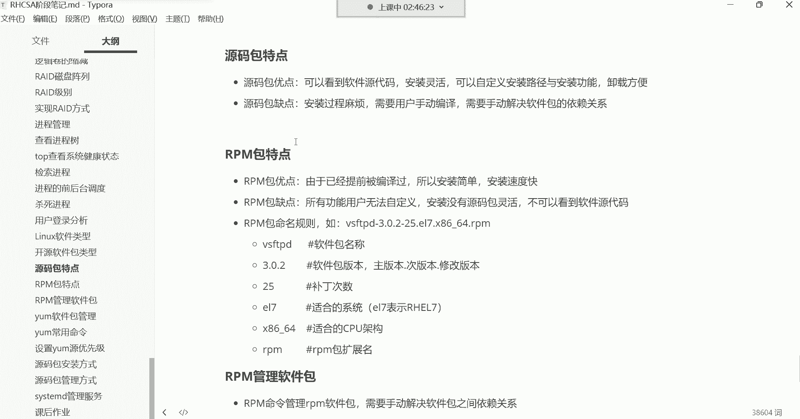
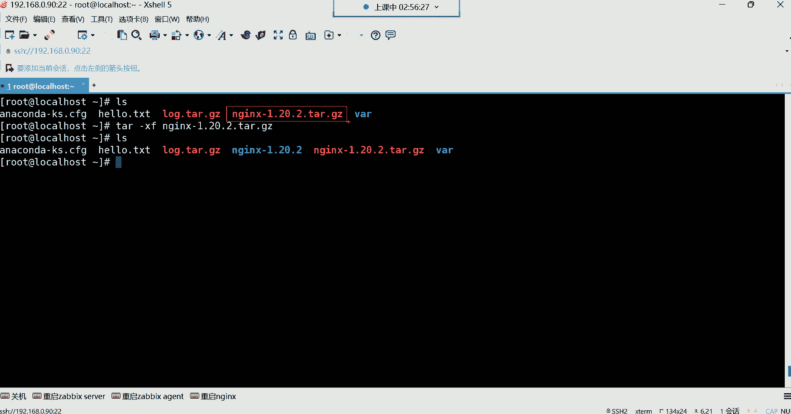
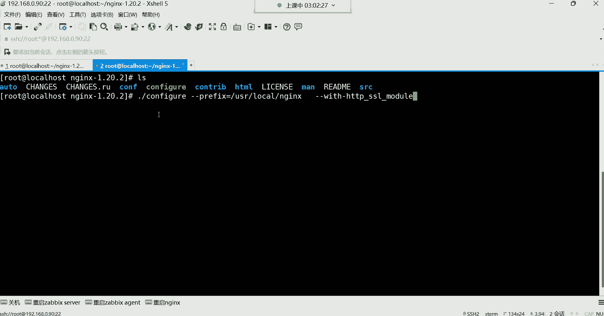
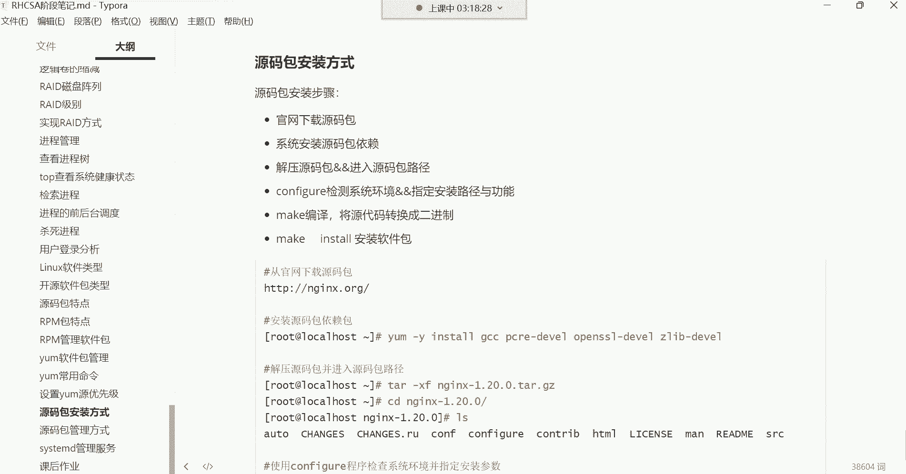
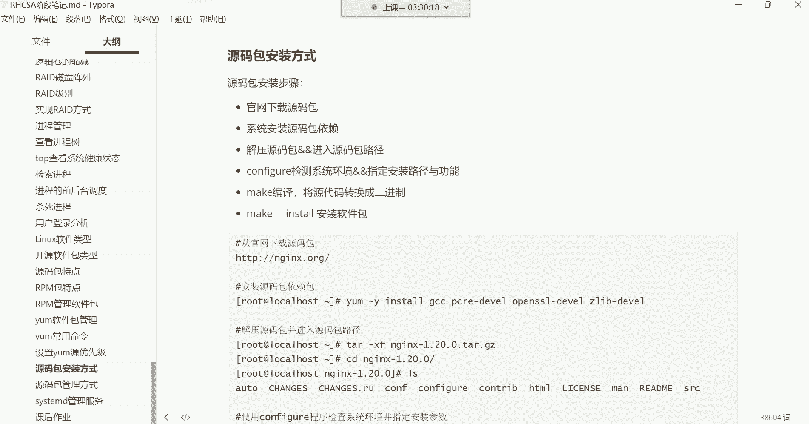

# 0基础小白怎么入门Linux运维？看这套，Linux运维全套培训课程，保姆级教学视频 - P36：红帽RHCSA-35.源码包管理方式、systemd管理服务 - 小方脸不方- - BV138411B7p5

好那我们继续吧哈，我们接下来给大家讲讲，这个源码包的一个安装方式，源码包呢在整个的学习阶段呢，用的不是很多，没有那个rpm应用场景广泛，所以呢我们是把它放在最后了，但是原料包呢有的企业呢。

它确实需要你这种自定义的方式去安装，优化软件，我们就拿了一个哪款软件包来说呢，就是这个NGX来说啊，这X的话呢有的企业它就需要什么，需要我们自己去自定义，安装路径与这个安装功能。

如果一旦遇到这种需求的话，当然我说的不是说只有一款软件，就是你们在企业当中遇到任何的，比如说这种需求，就是需要你自定义安装软件的路径，还有这个功能的话，我们都可以通过这种源码的方式去安装。

毕竟前面我们安装的这个软件包啊，我们安装了很多软件包有哪些呢，我们嗯我们就拿这个，我们最熟悉的那个VSFTPD，那那个vs FTP d啊，我们安装完了之后啊，我们无法控制这个软件。

它相关的文件在我系统的哪个路径存放，或者说我无法控制，把这个软件安装在系统的哪个位置，就这就让我们显得有些就是不是很什么的，不是很好管理，我这个是不是看一下哈，重新挂载一下，但是我记得我开机挂载了个梦。

他杠一吧，安装一下，我们来说一下呃，就像这个软件来讲，你看安装完以后啊，我想管理它，你发现这个软件相关的文件，它是分散存储在系统的不同位置，看到了吧，你看有这个VR下边的有一些文件和目录。

还有其他路径的，还有etc下边可以看到吧，其实这就让我们有些什么呢，有些不知所措的感觉，就是我想管理这个软件，哎呦这个相关的文件呢在这个路径也有，在那个路径也有，我记不住，我是不是记不住。

所以说如果一款软件我能够限制它，比如说我要给它安装在我系统的哪儿呢，呃安装完安装在我系统的这个OT目录，或者说user这个目录下边，这些呢都是用用于用户自定义软件的安装路径，那以后我管理这款软件。

是不是就直接来到这个路径，那这个软件相关四个文件我都能找得到啊，不需要这个路径去找一找，那个路径找一找了呀。

唉没错，就是这样子，所以源码包呢在企业里面呢，如果一旦遇到这种啊，如果在企里面一旦让你自定义安装的话，那我们就得用源码的安装方式，那源码包安装的话呢，它大体需要以下这么个流程，第一呢你想安装什么软件。

你得先有它的源码包，源码包呢一般从官方网站去下载即可，这个呢我们后期在学习一些服务的时候，比如我们嗯需要大家源码安装哪些包的时候，到时候呢会带领大家去认识对应的官方网站啊。

那我们就拿这个哪个软件来说，我们就拿这个NGX来说，NGX呢是在企业里面，非常非常常用的一款软件包，比如我现在就希望安装它，并且是源码安装，我们刚刚是不是知道怎么用，要么去安装啊。

我们前面演示过安装升级啊。

都给大家演示过，那我现在让你源码安装它怎么办呢，官方也给你提供语码包了，我们去到它的官方。

嗯用谷歌浏览器吧，N这个词点ORG关啊，这些地址大家不用记啊，这些地址后面我们都会讲，我现在只带领大家先什么先熟悉一下，就是我们如果说想源码安装一个软件包，我们大体啊走的一个流程是什么。

第一步呢你得先来到它的官方网站，然后呢官方网站呢都会有对应的文档，毕竟你想想一款产品连个手册都没有，这别人怎么用呢是吧，所以官方网站的，但是一般都是英文的哈，你可以翻译一下，你看不懂没关系。

像谷歌浏览器自带这种翻译，所以你可以直接翻译一下啊，在文档里边大部分的软件都有阅读文档，在文档里面会对这个软件的相关的介绍，还有功能安装方式等等等等，都在都有文档，这里边呢你看啊拿NG来说。

它就有一个什么呢，叫做从源代码构建的这么一个选项，你点进去，点进来之后呢，这个里边就是具体告诉你这个软件包，它的相关的源代源码安装的这种，你我们可以指定的一些参数看一下哈，但是前提是我们得下载它的包吧。

所以第一步先退回去，先把包给它下载下来哈，那包这有个叫download，这个download就是软件包的下载位置，点进去，那当然这个软件的版本呢，我们由于不同的软件呢，它版本也不太一样。

但大体的话呢这个咱别翻译了哈，这个我们，你看对于软件的版本呢，如果在英文里面一般有这种主线版本的，这翻译过来就是主线的意思，然后这种呢就是稳定的意思，看到了吗，这种就属于稳定版本，然后下面还有一种啊。

这种就是旧的了，看到了吗，这就是什么遗产啊，什么遗产遗物诶，我觉得这翻译的，简直有些不适合人类去理解了哈，这叫旧旧版本的意思啊，呵呵旧版本哈，仪器的版本，你可以把它理解成是仪器的吗。

其实离仪器的也不是很准确啊，下边好像这个翻译的好像还可以啊，已过时的啊，如果是在计算机里面，如果是软件或硬件就代表已过时的啊，但因为使用范围广而难以替代的啊，可以这样去理解哈。

因为这里面有些这个计算机的专业翻译词汇，以过时的版本其实就是旧的意思啊，过时的版本，所以你这时候你可以看到软件有主版本，稳定版本跟旧版本，然后软件包就在这儿呢看到吗，主版本的软件包，稳定版本的软件包。

旧的软件包版本，那你比如说我我想下载这个当前的稳定版，这就是它的源码包，右边是适合安装在windows系统里面的，左边是适合安装在windows里面的，因为windows它有标识嘛。

好那这时候我们就可以去点击什么呢，点击下载，但是通过浏览器直接点就可以下了，看到吗，这就下了哈，就是还有一种方法浏览器下的，如果用浏览器下的也行，还有一种方法右击叫复制链接地址。

软件包不是有具体的链接嘛，然后呢我们干嘛呀。

我们直接来到系统里边，不一样哈，不一样嗯，不一样哈，直接w get哈哈哈w get哈，哎看这哈把链接粘过来张过来哈，对这翻翻译工具有些让我摸不摸不到头脑是吧，然后接下来呢直接回车这个软件包。

当然w get这条命令就是一个下载文件的命令，从互联网当中帮你把一个文件下载到本地，跟windows里的迅雷是一样的，那你看这个包就直接下到虚拟机里面了，如果你不想下载到虚拟机里面。

那这时候你可以看一下，就直接在浏览器里面的，浏览器不是有个下载吗，下载内容你看到时候你就直接可以干嘛呀，你是不是就直接可以在文件夹中显示，然后把这个东西保存到你的某一个文件夹里面，能理解吧，看到了吗。

就这意思哈，直接可以保存了哈，然后我就不保存了哈，我就保存了，我主要是跟你们说一下，这个下载方式很多种吧，接下来呢我们来说它的文档包有了之后怎么安，这个包，有了之后啊，一般的官方有文档。

在官方文档里面呢，对于这种官方文档，这个可以翻译一下哈，翻译一下，官方文档大多数你如果细心找的话呢，都有一些具体的详细的信息告诉你哈哈，然后这里边什么安装从如果我们是源代码安装。

我们就得选择这个选择这个，然后点进去，这里边呢是具体的，就是我们可以使用的指定的参数了，因为源码安装我们是可以手动指定的，那指定的参数这里面他已经告诉你了，翻译一下我们可以指定哪些呢。

首先告诉你你可以使用哪个命令去配置它，然后这个命令可以定义系统的各个方面，就是你可以使用这条命令，去指定这个软件的各个功能，下边可以支持哪些参数呢，首先你可以使用杠杠help去打印他的帮助信息。

像这种东西就比较简单来看一下哈。

这个包啊，它首先是一个压缩包，对这种包你看到了吗，是不是压缩包啊，啊当然我们已经下过了是吧，哦三个版本了，现在呀删两个哈，这搞这么多干嘛呀，嗯318。0的，再删，20。1的啊，现在只留一个哈，只留一个。

我们留了个20。2的，他这个压缩包压缩包你得先解压，但是前面那个NGX那个目录，我们也给它删掉哈，那个，index1。18。0的目录啊，删了已经哈没了已经没了，第一步呢得先解压它这个压缩包。

因为源码包嘛，源码包就是它的源代码都在这个压缩包里面的，源代码都在这边呢，所以你假以后呢它会生成一个目录，唉其实这个就有点类似于什么呢，这个就有点类似于如果在企业当中。

你比如说在企业里面，咱们说这个很多个部门有开发，有测试，有运维，你在企业里边啊，如果说开发人员他开发好一款产品了。

一个项目呢它已经开发完毕了，这时候他也会把这个项目呢给我们打一个包，这是开发，这是运维啊，当中间还有个测试，我就不说了哈，开发运维，开发他开发好一款软件之后，它你要那一个软件那里边的文件。

还有相关的东西，多了去了，他不可能一个一个的传给你，他怎么给你呢。

哎一般他打个包，打个压缩包，打个压缩包，他直接他们是把这个压缩包交给你，然后你能拿到本地解压，一解压以后，你就能够看到开发人员的项目，相关的所有文件了啊，都在这个压缩包里面啊，但是呢我们这种方式哈。

是不是就可以直接看到这个这个项目的一些，源代码的呀，进去啊，进去在企业里面做项目，就是这样子，开发人员直接把它开发好的项目，打个包直接传给你，你传传输速度快呀，哼哼超声速度快哈。

这里边的就是所有的项目了，其实这就是一个项目嗯，能理解吧，这其实这就是一个项目，这个项目你拿过来，你想给他呃部署，让它运行起来，那你就经过一系列的配置就可以了，那接下来这里面官方有文档。

当然如果在企业里面开发人员开发一个项目，他也会给你文档的，他告诉你这个项目，这个项目，哪些是我的这个什么一些这个页面文件，哪些是我的源啊，源代码一般不给你啊，哪些是我的相关的配置文件的目录等等等等。

它都会有详细的文档的，就跟我们刚刚看的官方文档是一样的，所以你要参与他的文档啊，具体怎么去部署就可以了，那对于这种你看文档你就得知道官方文档呢。

一般我们说比较官方，相对来讲呢这个不太好理解，但大体来讲，如果你是看多了，你其实你就明白这个很多，这个老外的一个什么呢，一个套路了，或者说一个思路，首先这里面他告诉你这里面有叫CONFIG。

这个命令可以配置一些什么呢，呃系统的各个方面，说白了就是你可以使用这个命令去什么呢，去安装这款软件，然后这款软，然后这个命令有个帮助，就刚刚help这里边你回过来你看一下你怎么用呢。

当然他这个脚本哈就得点杠，当前路径执行，当前路径执行这个脚本上杠杠help也可以，这时候就把他的帮助呢打印出来了，然后它这里面的帮助你看非常多非常多哈，这帮助这叫什么呢，这叫参数，这就叫参数哈。

左边是参数的名字，你看这个hip这个参数，可以帮我们实现什么功能呢，叫打印此消息，就帮你打印我这个脚本支持的一些消息啊，这这这翻译的不是很准确了哈，你帮你获取帮助的，说白了就是help不就获取帮助的吗。

那这个参数可以帮我们干嘛呢，设置安装的前缀，其实就是设置安装路径的安装路径，你比如说我希望把NGX这个包，安装在我系统的哪个目录呢，安装系统的这个user local这个目录下边，我取个名啊。

放到这个N6X这个目录里面，那你怎么样才能指定这个软件包，能够安装在这个位置呢，唉你就得在什么呢，在这个脚本的后边干嘛呀，就这样，我要是这点杠点杠是你执行这个脚本，然后呢，哎你CONFIG的时候。

等一下我们再开一个终端哈，我再开一个终端，然后我们进到那个index那个目录，我们左边终端看帮助右边终端，那咱们然后咱们就直接用哈，就是我可以这样，我在使用这个脚本的时候，他不是可以，这个脚本。

不是可以让我去指定一些这个配置参数吗，那我就可以通过这个叫杠杠perfect，拿过来就可以指定什么呢，指定我要给它安装在我系统的user，local下的NINX目录，那这个目录存在吗，不存在。

压根儿就没有，那没有怎么办呢，没关系，它会帮你创建的，它能帮你创建出来，所以这你就不用管，看到了吧，然后下边还有哪些参数，这以此类推啊，当然啊我今天是给你们讲方法，我并没有教你们怎么去安装这个软件啊。

怎么指定它的相关的功能的，我是在教你们方法，任何的源码包里面都有什么呢，都有这种配置脚本，所有的脚本都可以用help去获取它的帮助，获取到帮助之后，你就可以基于他的这个提示去干嘛呀。

唉去指定一些安装路径，在这里边你可以指定它的安装路径，然后用什么功能呢，一般软件呢有模块，当大家学到这个软件的时候，自然会告诉大家这个模块能够干什么用的，到时候你指定就行了。

你比如说我希望再安装一些模块，安装在这个路径以后呢，我还希望安装一些模块，那这时候你就可以直接把模块给它写进去，就行了，比如像这种模块名字，你说这模块干嘛用的呀，哎一般呢你还可以去翻译一下，叫启用啊。

叫使用NGX的一个什么呢啊，叫做SSL，这是一个加密的功能，就这样子的哈，就是呃你要明白什么呢，就是你们要明白不是怎么去安装它。

你们是要明白它具体的流程，具体的流程就是第一从官方下载源码包，第二呢当然还有一些依赖这里边哈，其实下载源码包以后呢，我们解压之后，或者说这个这一步跟这一步，他们两个最好是应该先干嘛呢。

先执行这一步叫安装源码包的依赖，因为这个原宝宝也需要依赖的依赖哈，安装依赖以后呢，解压，然后进到源码路径。

我们现在是处于什么呢，处于解压了，也进到这个路径了，然后也指定了安装路径和安装功能了，安什么呀，按这个模块安在哪儿，把这个软件给我安装在这个路径，然后这个软件里边给我安装一个这个模块，可不可以呢。

这就是自定义，这叫自定义哈，那很多企业就是什么啊，除了这个模块以外的功能，我不要不要，我就不安不安，就可以节约我服务器的资源，提升这个软件的运行效率，能理解吧，然后。

我们还没有我我们现在这一步没做好，就是没有安装它的依赖，但没关系不冲突，毕竟我们现在还没有什么呢，还没有执行这个脚本的，如果说你前面在什么呢，比如说我忘了安装依赖了。

我这时候直接回车，我直接回车了啊，就指定安装路径跟指定的那个模块，后期报错啥时候讲完啊，六点了六点哈，我们今天不是02：30上课的吗，连02：30上课的晚上半小时吗，啊他并没有提示错误，你们看到了吗。

这并没有提示错误，为什么呢，因为啊我们这个系统里面它所需的依赖都有，它所需要依赖，我们前面都已经给它安装上了，因为前面在练习的时候，他就已经安装了它相关的依赖了，那这时候你们就开始有疑问了。

我怎么知道他需要哪些依赖呢是吧。

我告诉你哈一个软件的依赖呢从哪儿看呢，在这个里边在文档里面一般有一个，但只有这个里面有针对于管理员的指南哈，但一般软件文档里面也会告诉你，我需要哪些依赖，你想源码安装这个包，得先安装它的依赖。

NINX里面呢它是专门设一个叫管理员指南，在这个里边你点进去，因为毕竟不同的软件，它的官方文档设计是不一样的，因为就是每个人的思路他不一样，所以你不能把所有的软件的文档。

都按照我今天给你们讲解的这个什么呢，NGX这个文档的套路去看，能理解吧，每个文档都不一样，但是大体肯定会告诉你这个软件怎么安装，怎么使用，有哪些功能，具体怎么配，能理解吧，然后在这里面呢。

安装LINUX哈，点这个，这不是安装NINX这个软件吗，看了吗，安装LINUX跟nx plus它有不同的版本，然后点进来之后呢，右边那叫open source，就是开源的意思，开源的意思哈，好了吗。

因为那个open source就是开源的意思，安装NX开源看到了吗，然后点进去点进来之后呢，开源的话安装哪个版本，看到了吗，这里面是不是有具体的主线版本，稳定版本好，你要按哪个啊，当然具体按钮呢。

它这边它里面就是简单介绍一下哈，这边简单介绍一下，就是这个版本里面包含什么，包含包含最新的特性跟错误的修复啊，下面这个这个版本里面一些介绍啊，不包含有最新的特性，那有些错误修复嗯等等等等。

而下面这个具体的安装好了吗，这是上面这个安装方式，就作为一个叫预购件的二进制包，这是一个安装NG开源软件的快速检测方法，这句话就比较好理解了，是二进制包的安装方式，就是我们前面用亚M1键安装的那种方式。

YM杠Y，max这种方式就是二进制非常简单，一键安装了，但是我现在要源码安装啊，那下面那个下面这就是源代码安装，看到，那如果说我们作为源代码编译的去安装的话，编译它的这种这个什么呢，这个源代码。

那这时候，这种方法就更加灵活一些，怎么灵活呢啊这种方法你可以添加特定的模块，包括什么第三方，就是你自己第三方开发的模块都可以，然后有关详细信息请参阅源代码编译安装，看到了吧，是不是让你参。

是不是让你参与这个呀，这个就是源代码的安装吗，你看因此让你参与这个，那我们就点点那个参阅好，这个时候你发现，这叫什么，这叫安装NUX的依赖，就是说这个软件它需要依赖，但是你不知道有哪些依赖的时候。

你是不是得从官方文档去找一找啊，因为源码安装就是比较麻烦，你没有办法，就是麻烦他缺什么依赖，他不告诉你的，你得自己去参考官方文档，那这时候你就得先安装它的依赖啊。

但是我们为什么一下就能安装成功了呢，是因为我们前面在安装的时候，我们搞了很多个依赖包，我们在练习的时候都安装上了。

你可以看一下它需要哪些依赖的时候，你看一下哈，他需要哪些依赖，就PCRE这个依赖，这个依赖具体的功能也可以翻译一下，这里边帮我们实现什么功能的，什么支持正则表达式的啊，也是他的一些什么啊，核心模块啊。

一些模块所需要的好吧，是我告诉你说缺这么一个包啊，点一下看有没有什么其他提示，然后对这个包怎么下载，这个包在哪下呢，在这GITHUB看了吗，他说你可以从这去下载这个包。

你可以从GITHUB官方去下载当前的版本，这是PPCRER的一个库啊，PCRE就是众多的这个库，那那这个大仓库啊，PCRE里面有很多的这个模块，那里面非常麻烦吧，非常的麻烦哈，非常麻烦，那具体怎么安。

没关系啊，下面有地址啊，下面有具体的命令看了吗，这里边哈有具体的安装方法，就是从这个地址下载相关的包，然后呢解压这套路一样，先下载包解压，然后进到这个路径，你发这个路径里面也有一个什么呢。

也有一个对应的一个叫CONFIG这么一个脚本，然后接下来呢执行它，然后make make install，一步一步的就可以把这包给它装上了，然后下面这个也一样，还需要这个叫z lab的一个包，看到了吗。

也需要这个z lab哈，然后这包干什么用的呢，这里面也可以看，你具体看是什么支持什么头压缩的，然后怎么安装啊啊下先去下载他的包，然后解压，看到了是不是套路都一样，先下载包解压，然后进到这个目录。

然后开始去直接执行就行了，有说这种东西你不要去，不需要去做任何的配置，只需要去执行就可以，然后其他的话呢还需要这个叫open sl，需要这三个依赖，也是第一步下载包啊，第二步呢解压进到路径。

指定一些相关的参数好到此为止呢，我们再去安装NGINX，这时候你再去下载NGINX的那个源码包，然后再去解压它，然后再进到NUX的路径，当然这里面由于版本不太一样，看到了吗。

因为毕竟这里边第一个是什么版本呢，你看第一个下载的是它的主线版本，上面的例子啊，你要下载并解压最新的主线版本，那你就得从这个地址去下载，但是我不想用主线版本的，我想用稳定的呢啊，你想用稳定的。

你就下载最新的稳定版本的源文件，请运行下边的这一段命令，就是这个地址，可以帮你下载一个最新的稳定版的，看到了吗，接下来呢怎么办呢，接下来都，这里面是不是都有一个叫CONFIG这个脚本啊。

然后你就可以去通过各种参数去指定它的，比如安装路径等等等等等等等等，一系列的东西都可以去指定的，那这种东西具体怎么指，是不是就得由于不同的程序它不一样。

你就得去参考他的官方文档了呀，但是你说老师我这一个依赖包，我也需要搞那么麻烦吗，源码包最烦的就是依赖，我跟你讲，源码包最烦的就是依赖，因为依赖包你如果也需要这种编译安装的话，那是最痛苦的，非常的痛苦啊。

所以我们一般怎么办呢，我们一般对他的依赖呀，我们选择用亚麻装，亚曼装也好用，注意哈就是你要明白啊，就是最终你他有一个我们说有一个核心思想。

什么核心思想呢，一般呢就是作为一个依赖包，依赖包，我们一般就没有必要去源代码编译，源代码编译安装能列吧，我们不是一个软件包给我们提供，给我们提供很多种类型吗，你看一个软件包。

一个软件包它既给我们提供什么呢，这种源码包又给我们提供这种二进制包，二进制的rpm包是不是啊，但最终这两个包的功能是不是都一样的，功能都一样，注意哈，叫功能都一样，那依赖包的话。

你有必要去下载什么它的源代码再去编译它吗，有这个必要吗，没有必要吧，是不是怎么省事，怎么来，因为功能都一样啊，所以对于依赖包来讲，没有必要去源码去安装哈。

所以依赖包一般呢就用YM去下载就行了，要么下载，那么我用压么下载，我怎么知道那个依赖包，它要么那个包叫什么名啊，这你要明白它的源码包如果叫NGX，那他的E他他的那个二进制包也叫NINX。

知道吧，你就比如说我们拿这个NUX。

它所需的这几个依赖来说，他修的这几个依赖啊，你看看有什么PCRE是吧，这个包它的那种你看他的源码包也叫PCIE，但是他的二进制包也叫同同一个名字，都叫同一个名字是吧，只不过我们说二进制包比源码包。

它的名字呢结构上不太一样，但是前面的名字可都叫同一个名字的。

所以这时候你怎么办呢，这时候我们一般啊在本地干嘛呢，先看一看有没有他的那个二进制包，所以先ym list干嘛，过滤grape，过滤PCR这种类型的软件包有吗，是不是有是不是有哈。

然后呢你看这里边有一个这个叫DEVT类型的，什么开发包，什么开发包是吧啊，其实就是这个这种DVT类型的软件包，就是他的这种，这个我们说就是跟那个元宝宝其实是一样的，或者说就这种PCRE。

你直接安装整个整个PCRE也行，但一般对依赖的话，我们只需安装这个delete就行，这DVD它在它代表是开发的意思叫development，全名叫DIORPERMENT，叫开发的意思，开发包开发包哈。

所以我们安装的时候，你甭管什么开发不开发的，你看我们系统里面有没有这包杠，QA管道给grape，然后PCRE，啊有哈，其实就这包就这包，你直接把这包一安装，基本上它的依赖已安装上了，这是主包。

这是依赖到了吗，就你安装这个依赖，你安装它的话，它也会跟一起安装上的，所以对于这种我们说它所需的依赖，我们是不是就既然是已经有这种rpm包了，我们还有必要去源码编译吗，这不属于增加我们的工作呢。

呃给我们的工作增加这种什么呢，增加这个工作量嘛，没有必要吧，总之你甭管什么包，它是不是都提供同一个功能的呀，所以依赖包比源码编译了哈，一般依赖包我们一般都是YM1键安装，一见钟薛缺什么依赖好。

我也不知道它这个它所缺缺的依赖，到底是什么底位了，还是别的，我就直接YM杠y in top c r e安装就行，有的话就可以哈，今天脑袋不够用是吧，好这就是我们所说的这个依赖。

还需要哪个依赖呢，看一下它还需要这个叫什么z lab。

Z lab，这包我们有没有啊，看一下看一下杠，QA管道给grab z y，看到了吗，也都是一个主包，再加上这种DVT加，再加上这种低位了，这种类型的开发包，这种就是他的所这种这种就是它所依赖的主包。

开发包里面一般放的是什么呢，就是一些所需的工具，那这两包呢一般都得同时存在才行，所以你一般安装的时候，你也甭管什么地位了不啊，什么地位了不低位了，你直接就YM杠Y因此他缺什么包，他缺z lab。

我就按z lab跟GABA相关的。

他都给你安装上，所以这种依赖直接按就行，还需要哪个，你说open SSL好。

缺这种是吧，那我也给你按，你看先看你先看有没有，有啊他缺open SSL这种包，有没有看到我们系统里面本身就有，open SSL这个包，这是它的主包，1。0。2版本的，嗯嗯哼哼。

所以这些依赖你发现就是如果一个源码包哈哈。

你在安装的时候，首先你必须得先安装源码包的依赖的，那这个依赖，到时候官方文档会告诉你需要哪些依赖，接下来依赖包用压满状，注意啊，依赖包用YM安装就行，别源码编译太麻烦了哈。

然后接下来就用源码包里面自带的，这这种程序啊，或者说脚本去检测环境就行了，所以你看我们如果我们自己已经减我们前面哈。

我们是不是已经干完了，我们是不是已经这个通过这个CONFIG这个脚本，指定了安装路径和安装工安装的这个模块了，那接下来环境如果没有问题，他就不会出现什么error的关，如果说环境没有问题。

他就不会出现什么error的关键字没有报错，他就会告诉你啊，我这个NGX这个软件，它的一些相关的文件的安装路径，这些都是相关文件的安装路径的，知道吧，安装路径都在这个里边，到时候你想去管理它。

你看index ph perfect，这就是安装路径，到时候你就直接去这个目录下边去什么呢，去管理它，就可以，所有的文件都在这一个目录里面，不需要跑到别的路径去找，这叫自定义了自定义安装路径。

嗯那接下来呢接下来应该干嘛。

接下来我们都已经指定完了，安装路径，安装功能都指完了，那接下来唉编译它了，这个所谓的编译，就是将源代码转换二进制的一个过程，因为毕竟我们说源代码最终它是零一，它这个ABCD的英文字母计算机也不认识。

所以啊转换成二进制就行了，怎么转换呢。

唉make make可以帮我们去做编译，所以这时候直接make回车，这时候他就会去，你看去这个什么呢，去各种路径帮我们去编译这款软件，它都是在编译谁呢，编译SRC这个目录下面的那个源代码。

你看这个目录啊，你看他进的是哪个目录，是不是都是SRC这个目录啊，因为他所有的源代码都在SRC目录里边的，所以他要去帮我们去编译源代码，啊再编一各种点C的文件，你看这些再帮我们做各种编译点C的文件。

他得把这个所有的源文件给它转换成二进制，转换以后，计算机就认识了，你不转换计算机就不认识，今天这脑袋确实有些不太够用了，是吧啊，因为今天我们这个命令讲的有些多，我们今天除了命令以外。

相关的概念讲的也非常多，但是没有办法这软件包管理啊，你想是你在整个运维的基础阶段，可以说是非常重要的一个技能，软件包，如果都不知道怎么安的话，那你说这还怎么去什么所谓的维护什么，这企业的项目，人家说啊。

我们做项目需要安装一些软件包，你说啊，那怎么安装软件包啊，哼是不是不能这样是吧啊，接下来你看他是不是把所有的SRC，下边的那些源代码文件都给我们编了个辫了呀，好编辑完了之后能放到后台执行吗，可以啊。

可以放到后台，编译完了之后的话呢，我们接下来就要最后安装了。

最后make in store就可以安装了。

因为它一旦变成二进制了，计算机认识的认识了以后，你就可以给它安装上make，因此套固定的格式啊，固定的命令回车安装就快了，安装速度很快哈，安装好了，安装好了之后，其实无非就是把什么呢。

把我们当前这个目录，下面的这些一些文件拷贝到哪了呢，拷贝到他的那个安装路径了，USLOCALN这个词这个目录下面，因为一旦对所有的源代码文件编译了之后，这时候计算机可以把这个软件安装上之后。

他要把一些相关的文件给你，拷贝到你指定的那个安装路径去，看到了吗，什么相关的配置文件呢，拷贝在哪个目录这里边，或者说在你的这个具体的目录下面，再去创建一些目录，看了吗，创建一些目录，这些就是他做的事情。

所以这个安装的过程呢，这个安装的过程就是把当前这个目录下的一些，这个一些项目文件给你做一些拷贝拷贝过去，好那接下来我们安装好了，安装好了之后呢，我们就直接看一下us local这个目录。

这里面是不是有一个NINX目录啊，这就是这个软件相关的安装目录了，所以你打开的时候你看一下哎，这里边就是NGINX这个软件相关的一些配置，都在这里面，或者说一些数据都在这个目录里面。

那到此为止就安装好了，安装好之后如果怎么管理啊，我怎么去管理它呀，那对的，具体学习你想管理，你得学习NG4这个软件，你学完以后，你就知道怎么去管理了，比如说对这个软件来讲，我应该怎么去修改它的配置。

以及这些目录到底是存放的是哪些数据的，后边要要要后边如果要用其他功能，新增模块要重新编译嘛啊，重新编译它不要安装，只需要重新编译就行，比如我后期我还需要还需要一些这个模块。

随便搞一个哈，随便搞一模块，比如这个嗯，就这个，比如说我后期我我还想往里面增加一个模块，那怎么玩呢。

哈哈还是进到他的那个相关的路径，进到这个路径哈，当然了，进到这个路径的时候呢，我先，这样我先给你们演示一下，没关系，给你们演示一下，我先进到user local下边，然后呢自然进到那个注意啊。

很多东西是你们现在不需要去学习的哈，很多同学是你们现在不需要学习的，我只是就是为了让你们知道一下呃，这这种东西后期我们可以灵活的去配它嗯，那这时候我可以这样，我先把这个软件给它起来。

源码包它有专门的程序文件，一般都在这个频下边有一个绿色的脚本，直接就执行死spin下的NGINX，好，这个软件就运行了，然后呢你可以这样，这个一般这个程序脚本会带很多命令，你直接用杠V。

杠大V就可以看我们当初安装的时候，指定的路径与模块了，哎那后期你说我想再往里面增加模块怎么办呢，再增加模块，这时候干嘛呀，在CONFIG的时候注意哈，我是不是要增加一个新的这个模块啊。

那原先的东西也要给它加上注意啊，就原先的配置也要给它写进去哈，不然原先的配置就没了，所以这时候你把原先的配置也要加进去，这是不是我原先指定的路径啊，以及安装的功能啊，不覆盖哈，不会覆盖的哈。

这时候你再编一编，检测一下，模块这种东西注意啊，模块这种东西没有什么覆盖不覆盖的，好没有问题，接下来呢make一下，就是再重新编译一下，你编的时候它就能它就能够识别了，但这些你们看不懂啊。

这些你们可以给他忽略掉，因为这个有有的人可能多少有点基础啊，所以他能思考到这一步，如果你们没有基础的，就不要去思考这些问题，因为这些不是你们现在所需要思考的，好没问题，一般注意啊，到这一步就可以了。

一般就不make install了，如果你make in，如果你make install原先的内容就覆盖了，如果你最后再make a因子到，那原先的内容就真的覆盖了哈，所以现在只需要干嘛呢。

就完事了就已经可以了哈，这个时候你如果再重新加载一下，或者说我重新什么呢，呃重新把服务给它关掉啊，杠s pop，然后再重新启动一下，或者重新加载一下就可以reload一下，好，然后再看，没有识别吗。

那得那就关掉吧，如果不识别就关掉，然后再再起来，然后再看，看看诶，怎么没有识别呢，刚刚那个模块，一个啊JZ的模块，它怎么没有识别呢，不应该是这样子的啊，不应该是这样子，把符再重新起一下。

哦哦弄错了弄错了，注意啊，这一步不执行哈，这波不执行不执行干嘛呢，其实我这个好久没有做这种源码包的，这种那什么的这种那个这种工作了哈，后期只需要把它把它在OBJS里边呢，有一个程序文件啊，OBJS里边。

把这个新的程序给它重新拷贝一遍就可以了，拿新的程序替换掉原先旧的程序就可以了，一替换就能够识别到了哈，啊这一步呢啊当然先有个印象，后期这种东西会详细讲，好久不做了都忘了，但是肯定是不能执行。

最后那个安装啊，安装就覆盖了啊，那以上你说源码安装，我捋捋一下哈，捋一下别混哈，第一下载源码包去，第二呢去安装它的依赖，这依赖啊，一般官方文档它会告诉你，如果不告诉你怎么办，你说不知道，就百度也可以。

可以百度搜一搜，比如我要我要安装这个软件，它的依赖是哪些包，然后你用app安装哈，接下来呢安装完依赖之后就解压源码包呗，解压以后进到路径就开始去指定安装功能，或者说安装路径了，那你说老师。

那如果说我不指定安装路径怎么办呢，如果不指定安装路径，如果你不指定安装路径，它有默认的路径的，注意你放心，你不指定他有安装的路径，它有默认的，rpm安装不能加模块，rpm所有的模块已经都有了。

这些东西你不止你说老师。

那不止我怎么知道呢，如果不指的话，如果你不止啊，我告诉你啊，你在这个，获取帮助的时候，我们看看能不能从帮助里面查找得到哈。

啊从这里面查找不到，那就得去官方了，一般官方会有。

一般官方呢他会告诉你，因为对于源码安装，你想你想自定义你就得要了，你要了解它的官方文档，毕竟官方文档内容还是很多的哈，这里面你看你，比如说对这种指定安装路径的时候，如果不止怎么办。

这里面有叫default，默认他说我不指定安装路径，默认它会给你安装在系统的这个位置，看到了吗，如果你不止哈，这就是有它的默认的一些安装位置，那如果功能也不止呢，功能模块我都不止呢。

你不指它也有默认的模块，但是具体这个得根根据不同的服务区什么呢。

去阅读了，这这不是绝对的这种东西。

这种东西不是绝对的哈，但具体源码安装大体流程现在搞清楚了吧，对RPM安装方便的安装方面呢，所以很多人喜欢RPM，毕竟原原版安装对于很多初学者来讲，就是我们说不友好，他就是不要好。

这种东西可能第一次你刚开始接触的时候，你觉得这种东西太难了，很多东西就是什么呢，很多东西你刚开始的时候觉得难，但是一旦用习惯了，其实它也就没有那么难，嗯用多了就不会觉得它有多难了哈。

啊这是原版装安装方式，要么删除跟r pm删除没区别，你删除的时候就都一样了哈，删除的时候就没有就没有什么区别，对YM方便rpm，你要手动解决依赖关系，然后对于源码包括管理啊，这一般这个不是绝对了啊。

怎么管理，这一般我们就不应该放在这儿了哈，不应该放在这儿讲，好然后下边呢还有还有还有几条命令啊，这几条命令的讲，我们今天就结束了这条命令，这几条命令角我们就结束了哈，呃这几条命令呢是用来什么。

是用来控制，服务的啊，C4D是管理系统服务的，什么叫服务呢，就是我们前面安装的那些软件包，我想去对它，比如说我要启动它，运行它，或者说再给它关闭掉，那这些你得知道怎么去管理它啊。

所以这些命令都是由什么呢，cs tmd给我们提供的，因为本身CMD就是系统内核加载的，第一个进程。

PAD是一的，我们前面就给大家讲过，在讲那个什么呢，在讲进程的时候，PS退的时候看进程数，加个P哈，加个P，是不是这个C4，他们D他的是系统的一个叫天赋进程啊，然后天赋建成它的id号是一这个进程。

它有很多的命令，然后呢，这些命令呢，可以让我们去管理系统里面的众多的服务，那这个服务就比如说像启动服务，重启服务，关闭服务，查看状态是服务随机自启，这些都可以都可以哈，啊啊49分钟，然后接下来呢嗯。

接下来我们来这个说一说怎么用哈，先来给大家讲讲这个服务的启动呢，有两个阶段嗯，第一个阶段呢是系统开机时，随着系统的启动而启动。

这叫随机自启的服务，哪些服务随机自启了呢，哪些服务在随机自己呢啊这时候你，怎么看呢，比如top，top呢可以让我们看，哪些服务是属于正在运行的状态，往下翻一翻，但是这样看就有些费事了哈，这样看有些费事。

有个非事啊，我们看服务一般可以看它的这个看进程。

或者说看端口。

但这个东西呢怎么看呢，有一条命令啊，我应该放到哪呢，应该放到放到这个这个系统服务管理这边来，看来来说，我前边等一下哈，啊把这个命令说一下哈，这个命令呢后面会经常用到，唉这个也难追女生也难。

哎呀这个世界上哪有不难的事情啊，哎呀你们要知道这个世界上没有容易的事情，干啥不难呢，是不是，我这卡了哈，我这个笔记卡了，你们等一下哈，好像是缓过来了啊，好点了，唉没有孩子，没有孩子，哪有孩子，连个。

对于我对于我们这种连对象都不需要的人，我们是不是还需要孩子吗，然后来说一下哈，我们来说一下这个命令哈。

都难呐，唉你想想现在这个社会，这个社会就是钱难挣啊，然后妞男炮啊，钱也难挣，是妞也难炮，是心也难交，是不是啊，然后特别是你再看看现在这个经济，你发现这个连个依靠也都没有啊。

你就知道这个现在学习啊才是最简单的事情啊，我跟你讲啊，这个这个学习真的是提升自己最最简单的。

成本最低的事情了，你你可以这么去理解吧，哈这条命令呢用于查看系统当中，查看系统中启动一些端口信息啊，端口信息这个端口信息哈怎么用的。

这玩意儿有两条命令，一个是S。

一个是net start，哈哈对呀，上海现在连吃都是问题，对呀，你看你看你连吃都是问题，你说你还还有心情去考虑别的吗，是不是有精神是吧，这两条命令功能是一样的哈，但这不是说找这，这不是说找不到找不到。

这不是说找到找不到的问题，能毕业吗，没见过米跟菜了是吧，对哪哪有时间呢，你说对我们来讲没有时间哈，我们而且我们也不需要，说白了不需要这个命令，用于查看系统当中启动的端口信息，怎么用呢。

这这一堆选项放在一起直接用就行了，然后这两个命令功能一样的，只不过在sentence46里面用的是这个命令，在sentence47里面呢，这meaning啊，它变得简洁了。

两个S就可以查看你系统里面起的那些服务了。

直接就这样用SS杠NPTUL回车，这时候就看，可以看到我们当前系统里面，启用的所有的端口信息，注意它主要是看端口，你先从里面起了哪个端口，那这个端口代表什么呢，端口代表的就是服务。

注意端口代表的就是服务，因为这个端口是被服务所占用的，是被服务所占用的，那这时候你就可以怎么看呢，你说八零这个端口是被哪个服务所所占用的呀，你可以去过滤过滤哈，grape80回车。

八零端口是被N这个字缩，是被NDSD服务所占用的啊，22呢，你看我想看看22，22倍SSHD这个服务所占用的端口，25呢，25是这个啊，什么master是吧，这个master是谁。

master是这个ENDIX啊，是NINX的哈啊下面还有二十二二十五啊，这个就这么几个，一个是NINX，一个是SH没了，我们系统里面就起了这两种服务就起了这两行，这怎么看当前系统启动的服务嗯。

我记得这个SS有个选项，我看看net start可不可以啊，S t s t a net，我没有敲错呀，没有这条命令吗，那我得安个包，要搜一下啊，呃没有找到net start，不是啊，这这这这这。

这怎么可能没有这条命令，是不是NT兔子看是不是这包，还真是还真是哈，但刚刚没搜到，你们看到了吗，那我刚刚执行这个命令，是不是提示说没有啊，没有找到吧，然后刚刚我又要么缩没搜到，我再搜一遍哈。

有时候会出现这种情况，啊现在搜到了，现在才搜到了，看到了，所以你发现这这选项，是不是有时候它也不是很灵光啊，是不是有时候也不是很灵啊，不能说百分百吧，为啥就不是那么特别的灵验，你就这么去理解吧。

不是那么特别的灵哈，就在本地没搜到，那说说那老师，那我以后我要是遇到这个记不住的命令，我怎么办呢，哼百度吧就百度吧，就只能百度了，这不能说玄学，但确实可能说他有的时候可能也有失效的时候。

嗯然后接下来呢我们来看一下哈，这个net start呢，这条命令呢，它比SS如果在用这些选项的时候呢，它会帮我们显示出来什么呢，就是呃这个端口看到吗，这是不是可以看到端口啊，而是哪一个进程在占用。

看到了吗，是哪个进程在占用一个端口啊，你看了吗，这个八零端口是谁呢，是NGX这个服务的master的进程在占用啊，这后面是进程master，然后下边呢那这些都是你看SSHD这个进程。

22号这个端口被SHD这个进程在再占用好，下面这都是SSHD的，然后具体这个SSHD有哪些终端，好了吗，这个显示的比SS会更加的详细一些，详细一些，所以这样你可以直接就列出来，其实这还有些麻烦。

你把A给它去掉，这个选项怎么结合用用看啊，UDUDP也得用NP不行，P如果不加P的话不行，那就都加上吧，都加上吧，看得更加呃，这个什么呢，就是一般不用加A，一般我们不用加A，就是A加上也没事。

其实大体也没有太大的区别，看了吗，你加这个A的话，跟不加A，你发现也没有什么太大区别，那一般主要就是看看这个端口被哪个进程，或者说哪个服务在占用着，可以使用这个命令，后面会经常用到哈。

因为但是这样用不常用，怎么样才算常用呢，结合group，我们是结合grape用，比如我想看NINX这个服务，占用的这个进程以及端口，但你发这样看，好像就没有那个什么呢。

好像又没有这个SS看起来更加的什么呢，就是简洁一些，好像差不多吧，我们只能说差不多，这是PID进程名PID，然后这个进程是以哪个用户的身份在运行，啊这sorry哈说错了，这个是这个这个master啊。

这代表进程的类型，代表进程的类型，在这里面呢。

你们先不用去纠结这些，你就知道这两条命令，可以显示我当前系统的某些服务的端口号，后期呢可以通过它结合去，通过这个。

它再配合group命令去过滤某一个服务启用的端口，以及相应的进程。

啊然后下面那个system这条命令的话呢，我们，也给大家说一说在启动服务的时候呢，比如我想启动一个服务，那这时候呢我们把这个只要5分钟。

5分钟就能够演示完了。

第一呢我想启动一个程序的话呢，就这样，当然啊注意这条命令不适合源码安装的，注意啊，不适合源码安装的哈，只适合rpm包，能理解吧，原版安装有自己的程序，那这时候呢我们可以这样啊。

system start起谁呢，vs f t v d起来了吗，不知道，反正没有任何提示是吧，看状态很好，TTS跟程序名是查看服务状态的，这个是start是启动服务的，服务起来以后呢。

我想看他到底真的起来了吗，换TT如果这位置是running的状态，running不代表运行吗，好就代表起来了，几点运行的，看到了吗，时间也有，然后下面是它的相关的配置文件，看了吗，就是说首先它启动服务。

它启动服务的时候，它会检测这个服务的相关的配置文件啊，这也是他这个程序所在的路径，啊这启动一个服务，那服务启动之后呢，它有个问题，就是如果这个机器一关机，下次它又它又关闭了，它不会随着机器的启动而启动。

那如果我希望它随着我的机器的启动而自，动起来，可不可以呢，可以叫enable，有个enable，enable就是设置服务随机自启的，所以这时候你可以这样给他ENNENABLE一下。

随时写了随机自己就是在系统这个什么呢，这个位置这叫什么呢，叫系统启动的路径啊，系统服务的启动路径，会帮我们去生成一个启动的文件啊，叫服务的启动文件或者说控制文件吧，那我们可以打开这个文件。

来看一眼这个这个文件里的内容，哎哟非常多是吧，呃vs FTP d点service哈，来看这个啊，来看一下，非常简单，这里面这里面非常简单，首先这些描这这就是一些描述信息，这个文件看了吗。

就先描述描述什么呢，啊当然就是描述一下这个服务，它是干他是它的一些功能吧，这个随便写的哈，这系统它自动生成的呢，那么VSFTP的什么手术进程，接下来呢给他配个网络，这里面啊啊一些这个网络给他分。

到时候会到时候会给这服务分配网络的，那你说这个怎么指的呀，啊这网络的对象，这个是固定格式，任何的服务，如果需要网络的话，这都是固定格式啊，然后下面44，这里面就代表服务的相关参数了，类型啊。

这个类型都是系统自动创建的，你不用管，这里面主要是指谁呢，主要就是指向了他的这个配置文件，跟那个程序路径，在启动服务的时候呢，他首先要去这个路径找这个程序文件，然后还要去检测它的配置文件的语法。

如果有错误，服务起不来能理解吧，所以对这个里边大家没有必要去，没有你需要改的，这里面没有任何事，你需要改的，你只需要知道这是一个系统在启动服务的时候，一个叫做启动文件啊，它启动一个服务。

它会按照这个文件的格式先找他的程序，然后再去读这个服务的相关的配置文件，检测语法，如果没有问题，这个服务就起来了，所以这是一旦设置了服务的随机资起，那以后你的机器一开机，它就跟着机器的起多少起来了。

那我怎么知道我这个服务是随机字写的呢，啊叫看看用这个命令哈，叫is enable跟程序名，这里面多个D哈，后面多个D，而你在设置随机自启的时候，这后面没有D，这没有D啊。

要意思enable跟从一名vs FTP d，如果你看是以内部的状态，这就是启动的，看了吗，就启用了哈，而且是随机自启的哈，那如果我说我想取消它的随机字体，可不可以呢，有。

取消随机自启嗯。

就就这个哈，你直接就用这个选项就可以了，就这个叫呃disable设置服务不属于自己，就等于说取消了，给他抵ZO一下，Disable，然后再跟上啊，vs FTP这所谓的取消就删除了那个服务文件，看到吗。

remove嘛，就把那个服务的启动文件给删了，对那就改配置文件，就改配置文件就可以了哈，但是你要知道你要指，你要还要指定它的程序文件，还要指定它的配置文件就可以了，然后下面还有什么呢，还有这个。

这时候你再看我们再看这意思，你发现它变成DEZABLE状态了，DEZB就是这个服务，它不是一个随机自己的状态，它不是一个随机自己的服务，这是怎么取消，其实就等于说设置服务不随机自起，啊下边还有什么呢。

没了那没什么了，其实这个还有一个重启重启呢，首先啊就是它包含启动，注意raise，他叫重启服务，但它也包含启动，就比如我这个服务压根就没起，那我可以这样瑞斯塔跟上一个服务名好，它就起来了。

但如果你这个服务已经启动了，你比如说我对它的配置做了一些修改，想要那个配置生效，就一定要什么的，一定要重启一下，就这时候就不能这样死他的了，有的服务你如果你接如有的服务，如果已经起来了。

你再死它呢就报错，所以一般呢我们对于这个服务做过更改的话，一般就raise a一下，让它重启一下，让配置生效，这以上就是常用的服务的管理命令。

然后下面呢有一些这个课后作业，大家下去做一做啊，做一做哈啊这里面作业看做一做哈，这就是我们IHCC1阶段的内容，可以说这个今天的内容对于你们来讲哈，呃可以说是有些吃不消了是吧，因为软件包管理很重要哈。

软件包管理很重要，所以这个大家一定要下去多练习哈，多练习行。

那今天就讲这么多，然后后期啊我们就换课堂了哈，我们后期要开始从RJCE了哈，啊都在笔记里边，我笔记会更新哈，在笔记里面哈，对作业都在百度网盘，到时候会更新，OK吧行了，各位，对网盘是QQ群公告里的。

在QQ群公告里面啊，还可以称得上是吧，行关power off关机。

对今天更新笔记哈行，各位看看还有什么问题吗，没有什么问题，给我刷个六。

