# 0基础小白怎么入门Linux运维？看这套，Linux运维全套培训课程，保姆级教学视频 - P38：红帽RHCE-2.编写脚本、脚本执行方式 - 小方脸不方- - BV138411B7p5

好，各位都回来了吗，回来的话我们继续开始哈，回来的话给我刷波一，我们继续沿着上节课的内容去讲解，让我们去分享好。

那接下来呢我们来说说这个，继续说这个CEO脚本，这个CEO脚本，好喂喂喂，OK这个是有脚本呢，我们这个前面已经实现了一个。

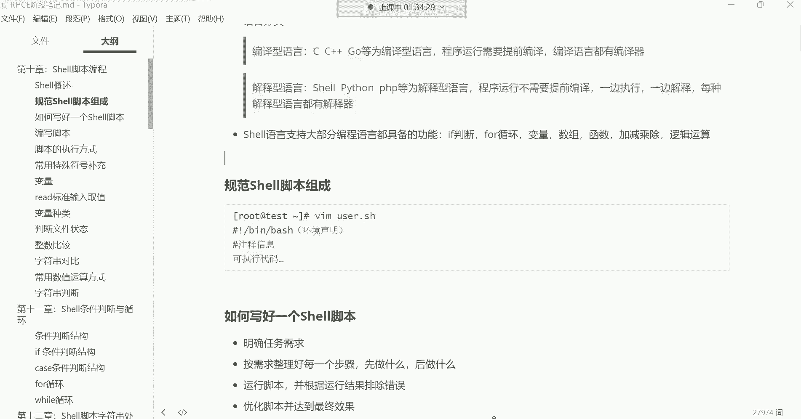

非常非常可以说是简单的脚本的功能，就是通过脚本我们输出一个hello world，简单吧，所以把命令往脚本里面写，然后给脚本加上执行权限，一执行就可以了呀，啊非常的简单哈啊没有什么难度系数可言。

你只要知道这个命令怎么用就行了，那我们为什么要写一个这么简单的脚本呢，因为这个主要就是，如果是第一次接触室友的同学，如果你是第一次接触show的，那其实我们的这个入门的脚本啊。

就是hello world，这个大家必须要什么呢，啊必须要我们说要走个过程，为什么呢，因为这个编程始于hello world啊，如果大家学学啊，学习过计算机专业的话，它是这样子的。

比如说你在学习C语言的时候，那你在C语言里边干的第一件事就是什么呢，请用C语言在屏幕给我输出一个hello word，那你说你要是学习Python呢啊，那你如果是学习Python的也一样啊。

请用Python语言给我在屏幕输出一个hello world好，那你说我是学习java啊，你学习java也不例外啊，请java语言给我在屏幕输出一句hello word啊，那我们学习SHI。

那我们也不能坏了，人家的规矩是吧，我们用shell语言在屏幕输出一句hello world嗯，hello word哈，对，这是一种仪式，叫做编程始于hello world，这个仪式是谁流传下来的呢。

这个仪式啊是C语言的老祖宗，就是那个叫丹尼斯里奇，丹尼斯里奇，他呢哎给我们就是流传下来的这种仪式啊，你只要是学习编程的，干了第一件事儿啊，咱们就输出一个hello world，能理解吧。

当然如果你你如果想用C语言输出一句hello world，哼，可没有这么简单，你想用C语言输出一个hello word，哼，你自己写一个echo的命令去，你自己写一个EQ命令去。

然后你再用IO命令给我输出一个hello world，哼，能比奖吗，那接下来我们这个对于cl语言，我们没有必要搞得那么麻烦，直接就用别人现成的就行了。

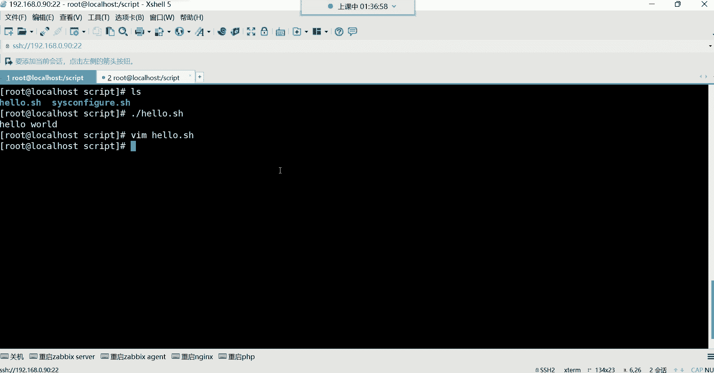

好用，echo输出一个hello world好，那基本的流程大家了解了之后呢，下边我们对于脚本呢，就是怎么样才能写好一个脚本，想写好脚本呢，你像我们前面的那个没有，没有任何的难度系数哈。

你就像如果我们真的是遇到一些复杂的脚本。

需要写的话，非常复杂哈，你比如说我给大家看一个哈。

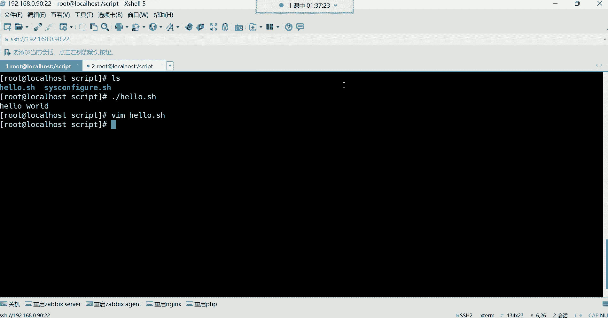

脚本呢有很多的这个思维逻辑，这个大家就是一定要什么呢。

一定要掌握它的规律，你要把它的规律给他摸透了，这种东西啊，你写的时候就不会被逻辑搞得特别的混乱，我在讲讲什么的时候呢，这儿有一个，在讲java的时候啊，在讲java的时候会用到很多脚本。

这里边啊大家可以看一下嗯，有Python脚本，看看这里边有涉及到Python脚本，你看你看点PY结尾的好，Python脚本好点，SA是结尾的好，shell脚本，那就有很多脚本，还有这种。

大家可以看一下哈。

很多脚本呢你们看一下哈，就是对这种东西上来井号叹号做个环境的说明，然后下边像这种事情哈，就是你说如果一旦涉及到我们这个脚本里边，你看大家看一下这里边多少行代码啊，看到了吗，非常多吧，上百行看到没有啊。

七十七十多行没了，下边啊70多行差不多吧，那你想想这一堆代码，如果你的逻辑稍微混乱的话，比如说你在写着写着，突然间这是逻辑乱了啊，这行代码可能说跟接下来的所做的那些代码，他这个逻辑上说不过去了。

好那接下来就报错就报错哈，所以想写这种脚本，你就得明白它的逻辑先干什么再干什么，他们之间不能冲突，能理解吧，这都是啥，这这个你们现在没有必要去研究它，你就知道这种东西唉，逻辑很重要。

我们刚刚写的那个脚本，那需要逻辑吗，你只需要知道echo命令就可以了。

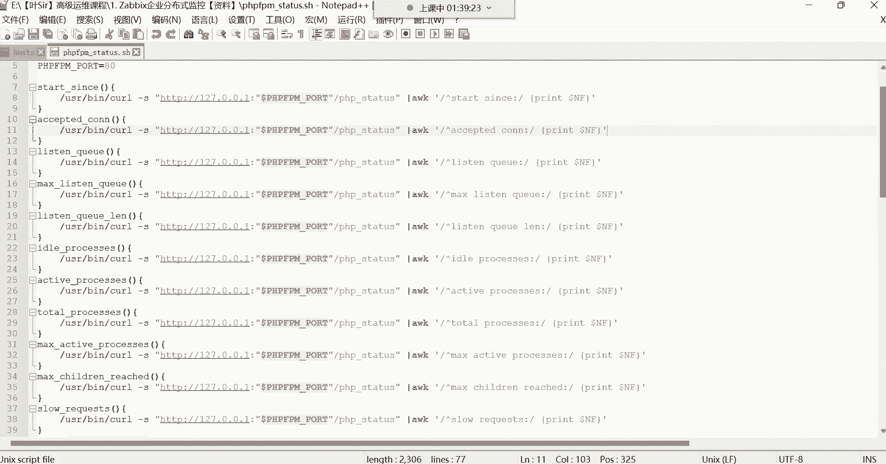

是不是啊，但这个呢你发现啊，除了这个以外，还有像一些其他的脚本。

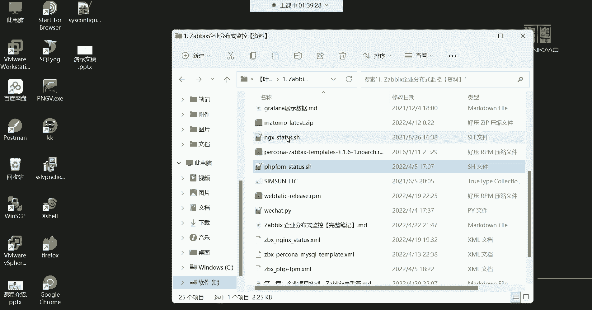

比如像这个脚本，这脚本也一样，都得需要有逻辑，看到了吗，看到这个甲板里面我是加注释了，我加注释了哈，那每一行都加注释了，但这甲板也内容也非常多，看到吗，内容非常多哈，看到吧，那将近70多行。

所以这种东西如果你一旦有一行逻辑混乱好，那你这脚本就就我们说就全都完蛋啊。

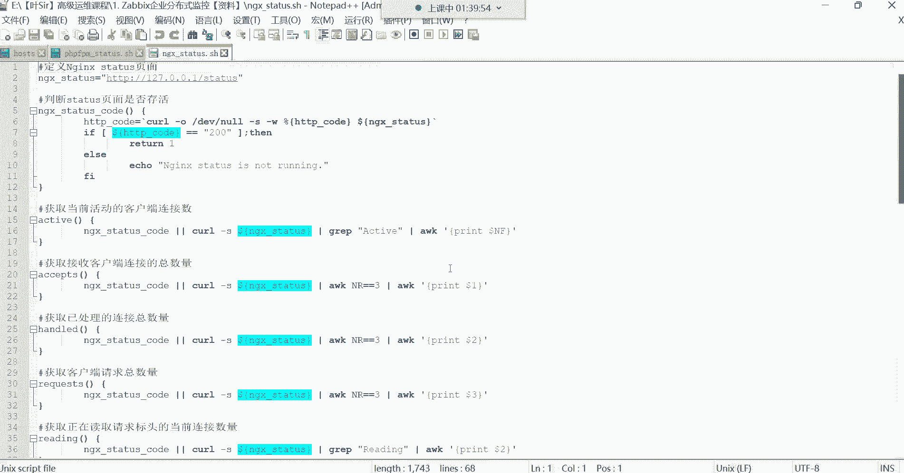

全能玩的没关系啊，后期你们也可以洗，其实这种东西你们也不用没有必要去洗，对于现在的运维来讲啊，你们知道吗，一个在运维在这个行业当中，可不是说这个一年两年了，好多的这个现成的东西呢，唉好多的现成东西。

大家是可以直接拿过来借鉴的啊，我们是直接拿过来别人写好的，你拿过来借鉴就可以了，不需要你能够像这个这个牛逼的大神一样，能噼里啪啦的能够自己写出这么一个脚本，但是你只要能够看懂别人的脚本。

能够改一改就可以，唉这是我们我们现在学脚本的一个目的，能理解吧，你看我这个脚本，你说我们怎么样才能写出像人家那样的一个，好的脚本呢。

你看人家这个啊，当然这脚本也是我自己写的哈，当然你就像这种脚本的话呢，你说我们怎么样才能使这个写出来，这样的脚本呢，而且最终功能能够帮我们实现呢，啊哈哈哈哈啊，并没有自夸，其实这脚本非常简单。

这个脚本非常非常的简单啊，只要如果大家学到后边，那你们学到，你看这里面有很多mini什么GRAPAWK，如果大家后期学到的时候，哎其实你们再看这个脚本，就没有任何的难度系数了，可能现在你会觉得你说哎呦。

老师这脚本，我看起来简直就是非常的高大上是吧，这个也非常的规整等等等等之类的，那只是现在你们刚开始接触，等你们接触时间长了，你们就会觉得哎这种东西真的很简单啊，非常的简单嗯。

但是怎么样才能写出来呢，这这种东西它有一个思维逻辑。

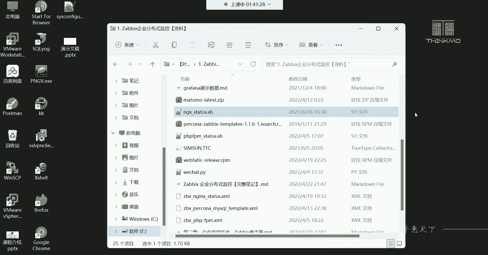

这个思维逻辑就是你像我下面给大家准备了，一些这个啊如何编写也好，一个shell脚本的一个一个流程啊，这个流程非常的简单，就是第一步我们得明确一个任务的需求，就最终我想干嘛。

你比如说最终我想是呃我想搭建一个lamp平台，叫LNLP的一个主流的网站平台好，这是你最终的一个需求，好这边就跟做项目一样，做项目，我们这个项目最终要达成一个什么样的目的，一个目的哎，得先有这个什么呢。

得先有这个需求，那接下来呢有了需求之后呢，咱们就开始去干嘛呀，去整理好每个步骤啊，我们应该呃这个想达成这个目标，我们应该先干什么，就我的第一步哎，我的第一步我应该先干什么，然后我的第二步在干什么。

我的第三步哎，第三步，第四步，第五步，第六步等等等，我应该怎么实现这个功能，能理解吧，那那一旦这个脚本写好了，那你要对你的脚本做一个什么呢，做一个测试啊，要运行它看看啊，这里边有些报错，如果有报错。

你得去看看到底是哪里不对劲，得去修改好，最后呢再经过一系列的优化，达成最终的一个效果，这是一个写脚本的一个最简单的思维逻辑，这种逻辑非常的嗯，非常跟我们的生活中的一些事情非常相似，那生活中哪些事情呢。

你比如说你在生活中，你遇到一个女孩子，你看到一个女孩子长得特别漂亮，你说这女孩子啊，唉特别符合你的择偶标准，嗯就是我们说肤白貌美，大长腿的啊，反正呢特别符合你的审美标准，你然后你就起反应了。

那接下来你的需求不就上来了吗，好你的需求上来之后，你不能上去就去这个去这个抱人家去，上去就亲人家，你这这是肯定不行的，你得干嘛呢，你是不是得开始去想一想，我应该先做什么事情，我第一步我应该去。

比如说要个联系方式是吧，第二步我再去跟人家，比如说这个做一些这个情感上的沟通啊，做一些情感上的沟通，然后这个聊着聊着呢，可能说哎觉得他确实是我的那个心中所想的，那个他。

然后接下来你是不是就开始跟人家约出来，吃饭呢，吃饭看电影，然后看电影呢还不能看太早的电影，你如果看太早的电影，一般七八点钟结束，人家可以正常回宿舍啊，那一般你这个最终可能你的目标还达不成呢。

所以一般得看那种完完整的电影，一般12点以后的宿舍也关门了，这时候呢哎你说这个哎呀宿舍也回不去了，是不是啊啊，这时候你就开始谋划谋划，你说哎呦，这附近有一家什么小宾馆，这小宾馆呢非常的不错啊。

里面有什么这个主题的大床房啊，里边怎么各种什么鞭子，什么手铐什么呃，什么这个那个的这个工具非常的齐全啊，这个这个这女孩子一听哇塞这么刺激吗，是不是哈哈哈啊哈对，非常刺激，说那行了，那宿舍也不回了是吧。

我们就去外面去住一宿吧是吧，那你这最终不就你的目标就不要打，不就达到了吗，所以我说对于这种一个非常简单的思维逻辑啊，一个非常简单的思维逻辑，就是你你先有需求，然后你再整理你的美，不需求你不能上去。

就是不是啊，这就是我们所说的一个简单的思维逻辑哈，好那接下来呢咱们继续编写脚本哈，第一个脚本没有任何的难度可言，哈哈哈哈哈哈哈啊。

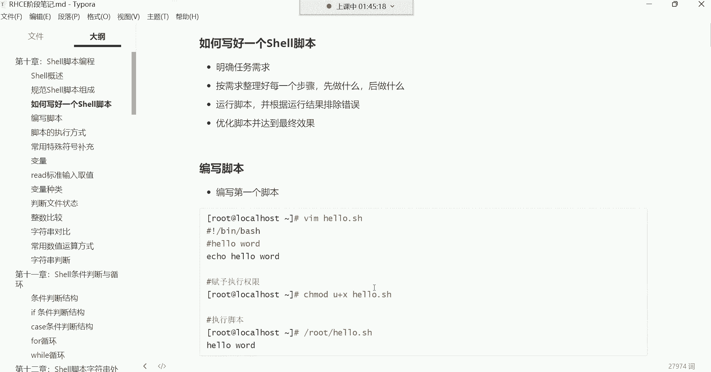

怕解释不清楚吗，嗯那接下来呢我们这个脚本开始写哈，我们开始写，再写一个入门级别的脚本，比如说我想创建个账号啊，创建账号的话，账号在运行里面怎么创建呢，USI的，比如创建个us。

那这个账号是不是就创建好了呀，然后再给他设置个密码，密码一一好声好了，这时候那接下来换个脚本怎么写，看看各位换做脚本是不是打开一个文件，比如说叫USI的点SH，然后在里边井号叹号做个环境的声明。

我的解释器是B下的BH，那要不要写注释呢，注释看情况，你想写就写，不想写就算了是吧，创建系统账号是不是可以嗯，然后接下来呵呵呵呵呵呵呵，万花丛中过片叶不沾身是吧，然后那个命令呗。

那UI的在命令行里面怎么写的，是不是就UI的给我建一个US2，然后接下来给他设置个密码，Pass wd u s2，那我问一下大家，那你即便是把命令写到文件里面了，你能这样吗。

你比如说我能直接都给它命令写在一行吗，嗯多了个D是吧，注意即便是我们往文件里面写，你也不能写到一行，能理解吧，这玩意儿在文件里面的每一行，就像命令行是一样的啊，就像就像命令行是一样的，能理解吧。

你能在命令行里面，比如你能在命令行里面这样吗，比如USI的，然后建个U32，然后再这样pass wd u32，你能这样玩吗，你肯定不行吧，是不是，所以写脚本也一样，每一行就是你的一条命令，知道吧。

每一行就是你的一条命令，如果你说我就不想折行，你这样写到时候就报错了，知道吧，就这样就报错啊，就没有这样干的，所以接下来我们一般就是这样啊，在这折个行就可以了啊，这时候创建用户设置密码。

给U32设置密码是吧，对就是把顺序的命令放到一个文档里，那接下来呢我们保存退出，这时候我们是不是可以执行的，去尝试试看看能不能去创建用户设置密码了呀，好那称之mod，加个X，加个直行权限。

好有了执行权限之后，我们就点杠当前路径，执行这个脚本，注意看啊，回车，这问题出来了，你们有没有发现他现在这个问题是什么问题呢，就是我当前的终端呢卡住了卡住了哈，这个终端卡住的原因。

好像是得需要我给这个账号设置密码，看到了吗，更改账号的密码，那如果说我不更改，我如果我不输入密码呢，是不是我当前的终端，也就是说这个脚本就无法正常去执行结束啊，没错吧，我不输密码，是不是就一直卡在这啊。

那这个用户是不是，就一直没有正常的创建出来呀，脚本并没有真正的结束，那也就是说最终目标无法达成，那这脚本就不治呢，为什么呢，如果这个脚本我们想一下换，换成这个备份的脚本怎么办呢，如果他是一个备份的脚本。

那大家想象一下好，凌晨三点备份是吧啊，凌晨三点备份，然后脚本呢执行着突然间卡住了，唉这脚本执行一半的时候，比如这个脚本里边哈有一个几十行命令啊，1234567好，突然间执行到第几条了。

执行到第四条的时候，诶卡住了，那这脚本还能正常往下执行吗，你说他会跳过第四条命令吗，不会那你这个备份脚本，等你第二天早上你到公司里边，你看啊，我想看看我昨天晚上的备份数据，好一看发现诶这没有啊。

为什么呢，唉这脚本还在这卡着呢，能理解吧，这脚本一直卡在这了，不执行了，为什么呢，他得需要我们给他输入一些参数，对就完犊子了，这脚本就需要你往得必须像这种，得需要我们用户给他输入参数才行。

它才能正常继续再往下执行，呵呵是不是啊，不能不能哈，没关系，只不过这个进程一直什么呢，这个脚本会起起个进程，只不过这个进程一直在什么呢，在运行着呗，你一占不了多少，占不了多少资源的，那像这种情况。

关键他没结束啊，没结束，你不能啊，那我等到第二天早上去，我再给他收一个参数，然后他再去帮我备份吧，有这么干的吗，没有这么干的是吧，那这时候我就得必须得给他输入参数了，比如一回车一。

这样脚本才正常的结束了，这脚本就不智能不智能，是不是，那你也不能说好啊，这个我回家里边，我这个定个闹钟啊，这脚本三点执行，我打车去公司啊，我再给脚本输入个参数，说完参数呢，脚本执行成功了。

我再怎么再打个车回家继续睡觉，是不是，所以这脚本里边大家有些注意事项，什么注意事项呢，就是很多在命令行里边，我们可以正常使用的命令，就比如像这种设置密码的命令，在命令行里没有任何问题啊。

我们设置密码是吧，然后给他输入密码，这没有没有任何问题，但是一旦写到脚本里面了，它就不适合啊，我们只能说它就不适合，为什么不适合呢，因为脚本我们是希望脚本他在自己执行的时候，你就该干嘛干嘛去了。

我不能在这看着脚本再给脚本输入一些参数，那你这脚本就不智能啊，就不叫就不叫什么呢，这个人工智能了，这就半叫半智能，是不是，所以像有些命令，比如说像pass wd这种命令，你看一下对这种命令。

比如我给一个账号设密码回车，你就得给他输入参数才行，你不输参数，好不好意思，我就不执行，是不是，所以有的命令啊，你还不能直接往脚本里面写，对这种叫交互式的命令了，他得需要用户跟他交互。

这种就这种就是我们所说的叫交互式，得需要我跟他交互才行啊，我得我得告诉他密码是多少啊，他再继续执行，所以脚本能量要避免非交互啊，就不要让我去参与，你自己能够执行，独立执行成功就可以了，而有的命运是。

而有的命令在这个系统里面，就是确实是这种交互式的命令，而有的命令就不是交互式命令，比如创建用户这个命令它是交互吗，你比如说我建一个账号U3，这个账号不存在，是不是直接创建出来了呀，跟你交互了吗，没有。

是不是你给他个用户名创建什么，他就给你创建的，那如果用户已经存在了，没关系，存在也不影响啊是吧，他就告诉你用户已存在呗，但也不需要你给他输入什么参数啊，也不需要跟你交互，他自己能够独立的执行成功。

而像pass wd这些，还有一个VMVMVIM这种命令，我跟你讲也不能往脚本里面写，比如我比如说我我我想去啊这个脚本里边啊，我想通过脚本去改一些文件，你想通过脚本改文件，那怎么改，你说我用VM改好。

VM打开一个文件，你看什么效果，etc的f s table回车，如果你把vim写到脚本里边了，他就这样看了吗，他就这样哈，嗯课堂直接给你提的，看到了吗，那VM如果说你这样直接写。

那你想一下我们是不是对VM各种操作，是不是得需要我们手动去参与，没错吧，啊得需要我们手动去参与哈，啊多次违规发送啊，你这看到了吗啊课堂被强势推出，以累计多次违规发送，哈哈哈哈哈哈啊，你这是被检测出来了。

是不是啊，嗯啊所以说对对对啊，对对于这种东西啊，看到吗，就是VM也不能写到脚本里面，VM也不行，知道吧，也不允许的，所以像这种情况下，你想解决其实比较简单啊，你得了解怎么样才能实现非交互设置密码。

那比较简单，比如建个用户优设计啊，优势四给U4设置密码是吧，那怎么样才能实现非交互式式的设置密码呢，这是不EQ啊，EQ和密码，比如1234，然后管道给pass w d，再加个那个选项。

杠杠STDIN是吧，这我不打字啊，我我我我不打字，它检测不出来，再说了呵呵呵呵，再说我也没做什么违法乱纪的事情，是不是哈哈哈哈哈哈哈哈，看到了吗，是不是这样可以啊，然后保存退出。

这时候我们点杠再执行这个脚本，看一下回车，这样可以吧，这样是不是可以，用户也创建成功了，密码也设置成功了，唉这样可以，这样就可以了，所以脚本有个核心思想叫什么呢。

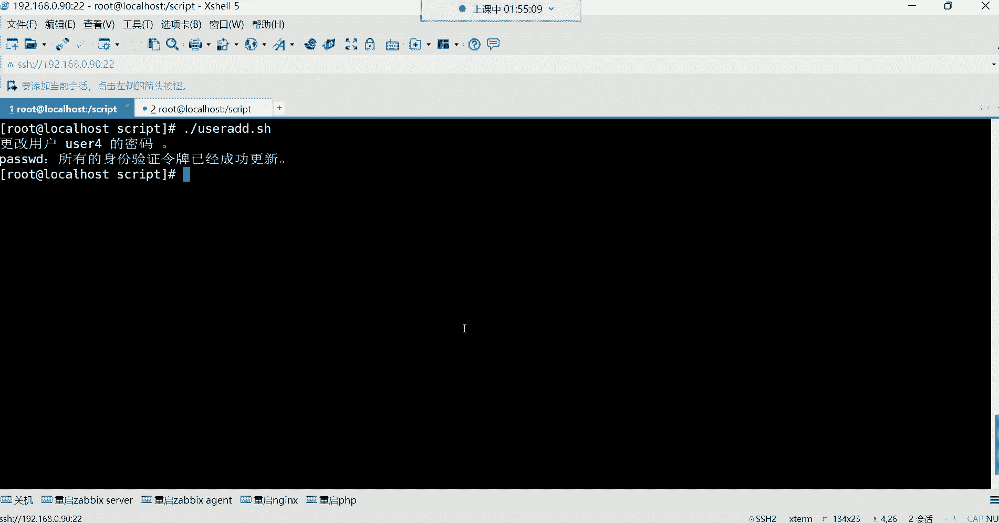

不能出现这种交互式的命令，不能出现交互声啊，啊在里面有些例子哈，接下来下面还有一些，就是查看系统信息的一个脚本呃，查看系统信息的脚本的话呢，在这个里边，比如说我想通过脚本去查看系统的版本。

查看内核的版本，查看内存，查看网卡，查看磁盘，查看主机名，这时候如果说通过脚本的话。

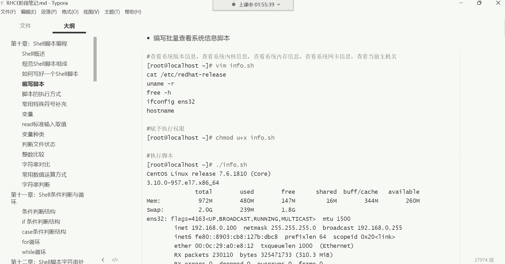

我们怎么实现，这非常简单，你说我们原先在命令行里边，比如我我要看什么，我要看我的操作系统是不是cat看文件呢，etc渗透s release，看系统的版本信息啊。

我要看内核是不是u name杠rs看内核好，我想看我的内存福瑞杠H是吧，这里边总的内存也使用的内存，然后剩余的内存好都可以看啊，我想看我的根分区的磁盘空间的利用率，DF杠H后面加个根啊。

这是我的根分区总容量，已使用容量还可以用的容量，挂载点是根目录是吧，好我还想看什么呢，我还想看我的网卡，那if config看ENS32这块网卡好，网卡名字IP地址是吧，然后网卡的入口流量。

网卡的出口流量是不是都可以看，我还想看我的主机名字，host name好，再加个control信息会更多一些啊，加个CTRL直接连内核也给你显示出来了，看了你的主机名字叫什么。

然后你的内核你的操作系统看到了吧，嗯你的系统的版本啊，这个是你的虚拟机，威尔威尔的虚拟机，这里面哈显显示信息会更加详细一些好，那现在我想看这些信息怎么办，亚目下的软件包也不是。

亚马逊的软件包跟脚本没什么关系哈，没什么关系好，那接下来我要干嘛呢，我要把这些命令写到脚本里面，那就VM，比如说让他叫sese info，点ISH，这前面叫什么名字重要吗，各位这叫什么名字重要吗。

不重要，只要你自己看懂，只要你自己知道这里边的命令是啥就行，这也不是给别人看的，脚本怎么写，完全是我们自己用，你也不是为了给别人写，我们又不是做慈善的，是不是噼里啪啦的写了好几百行脚本，熬夜加班。

头发都他妈的这个掉了这个好几十根，然后呢，这脚本是为了给别人用，是吧，让别人去干嘛呢，让别人去获取你的享受你的劳动成果，这不现实是吧，所以这种东西叫啥都行，我让他叫叉叉O啊，我也不是为了给别人看。

我以后我自己知道啊，这个脚本里边是什么，我就可以了，然后接下来呢井号叹号杠定下的BH，然后接下来呢这里面就写呗，看看系统的版本，etc渗透S杠release，看这个文件，但这里面就没有tab键了哈。

如果你说老师，那我这没有tab键，我非常痛苦啊，你可以在命令行里面先这样etc渗透s release，然后复制，没关系，拿过来复制，这是不是也也是一种比较笨的方法呀，是不是啊，你说我想看内核啊，U内。

杠rs是不是也行对，然后我还想看什么，我还想看那个磁盘，那DF杠H跟我还想看我的网卡，E config e n s32，感觉会是个常用的方法是吧啊，可以哈，然后这个我还想看别的信息。

看我的主机名host name啊，加个control信息会更加详细一些，然后还想看别的是是不是都可以啊，保存退出，那接下来TMD加个执行权限，然后呢执行点杠当前路径执行这个脚本回撤。

那是不是就直接干嘛呀，直接把脚本里的命令都给我们输出了一遍呢，主要是他把脚本里的命令都给我们执行了一遍，看到了吗，你看他做了哪些事情，是不是帮我们查看了系统的版本呢，然后查看了内核，查看了根分区。

它的一个磁盘利用率，查看了网卡的名字，这一部分是查查看网卡名字的是吧，没有任何问题，看到了吗，下面是查看主机名以及更加详细的信息了，都可以都可以啊，所以像这种东西是不是就比较不错呀。

啊写脚本在那个文件夹在哪对，在哪个文件夹都行，这也没有严格要求哈，因为毕竟这种东西就是他那个。

我们写写这种东西啊，你如果你是超级管理员的话，你写在哪个文件夹都行。

但是如果这个脚本，你想让别的普通用户也可以用的话，如果这个脚本，你想让比如说你系统里面还有一些普通账号，普通账号的话，你想让他们也可以用这个脚本，那你能把这个脚本放在root管理员的加目录吗，肯定不能。

为什么呢，如果你放到管理员的加目录，管理员的加目录别人能进得去吗，管理员的加目录，其他人有权限吗，是不是连进都进不去，所以你把所以你到时候你是写一个脚本，然后你告诉你们公司的这个其他的人员了啊。

我给你们写了一个脚本，这脚本呢这个可以做什么什么事情，然后呢，你们到时候到服务器里面可以直接用了啊，然后那个你告诉别人了，然后别人呢到时候登录服务器，说诶那这脚本在哪放着。

你说啊在在我的家目录里面放着呢，你自己去执行吧，啊你自己去执行吧，然后别人说啊，在你的家目录里边，是不是啊，那别人说那我能进得去你的root的加目录吗，是不是这不太现实啊，所以对我们一般脚本。

如果你希望别人也可以执行，就给他单独在根目录创建个目录就行了，你像我们自己建的那个script，这个目录我们自己建一个目录，是不是它的权限对于这个其他用户来讲，是不是他们也能够也能够查看，也能够进去啊。

啊他们进去，如果你希望他们可以执行，你在给这些脚本权限的时候，是不是就是给其他人也加一个执行权限呢，但是他们可以改嘛，说不可以改，唉我们也不希望他改嘛，对这就比较简单比较简单哈。

所以你看我们这个前面这个脚本，是不是能够感受到本质就是一个命令的堆积呀，然后脚本里面避免出现这种非交互式的命令，一旦出现交互了哈，这脚本就卡住了好，然后还有一个核心思想，就是这脚本是给自己用的啊。

你怎么写，只要功能能够实现就行好了，接下来我们再写个脚本，什么脚本呢，比如说我现在想通过脚本干嘛呀，嗯把我们前面的那个亚目仓库什么的，我想给它通过脚本来搭建一下，通过脚本哈搭建一个仓库。

那这个怎么来实现呢，这时候啊，我们先把这个我们仓库路径的文件给他删掉哈，etc ym点report CD，这里边呢是这个有我刚刚跑的那个脚本呢，有一些文件给它删掉，然后呢我记得我还做了开机自动挂载了啊。

开机自动挂载嗯，这个先不用管啊，开机开机自动挂载，我是前咱们前面学软件包管理的时候，是不是在etc的f s table这个文件里面，我们是写了这个开机自动挂载的这个配置了呀。

那第一位的CDROM挂载到mt的SNS啊，好那这个就不用管了啊，这一步我们先不用去管它，那接下来比如我现在就想通过脚本啊，做一些这个什么呢，要比如说搭建个软件仓库，注意是搭建本地仓库哈。

然后呢再安装一些软件包，那这个功能通过脚本怎么实现呢，嗯对功能非常简单，配个仓库，安安一些常用的软件，就像我我写的这个脚本一样是吧，就是对服务器做初始化的，只不过这这个脚本现在你们有很多的这个呃。

技术点还没学，所以呢我们不能参考这个脚本，这个这个脚本里面会涉及到很多的一些什么呢，这个我看一下哈，其实也没啥，这个脚本也没啥啊，我们就拿这个脚本为例，来给大家说一说这个脚本啊。

这个脚本其实还有很多我们现在没有设计的，比如像这种C的这种东西啊，没有涉及C的这种东西，后期可以替代什么呢，VMVIM不能往脚本里面写是吧，因为你用把VM往脚本里面写，VM1打开一个文件好卡住了。

所以这种东西不能往脚本里面写，所以后面呢我们会学习这个seed啊，seed在shell脚本里边，我们称之为叫做shell的四剑客，这四节课有group啊，有grape做对文件内容进行过滤的。

还有饭的对文件或目录进行一个查找的，还有seed，seed就是可以替代VMVM是交互式的命令，而C的是非交互的，可以对文件的内容进行增删改查，还有一个叫AWK，它跟它跟这个group是一样的功能。

干嘛呀，对文件内容进行过滤的，他们俩干的事是一样的事过滤，但是AWK会更加的精确一些，它支持列过滤，比如说这一行里边我只想过滤某一列，过滤某一列这一行里边啊，比如说它是我们就拿哪个文件来说呢。

嗯换个文件哈，etc下的pass wd啊，这个文件比如说我就想过滤每一行的，每个账号的解释器是哪一个，注意啊，这个文件是不是存放系统用户信息的呀，然后这里边看如果以冒号作为分隔，是不是每一行有七列呀。

是不是以冒号罪分割有七列，第一列用户的名字，第二列密码占位符，第三列用户的UIDJID描述信息加目录，然后解释器啊，好我想过滤这个文件里面每一个用户的解释器，但是别的列我不想看。

我就想看他的最后一列group不行，group直接把整个这每一行都给你显示出来，能理解吧，但是AWK非常牛逼，Grape，你说我想过滤包含什么呢，包含BH的这个解释器的用户都有哪些。

你从这个文件里面过滤，你发现前面这些信息我不想要AWK，可不可以呢，可以，AWK哎我这样当然很多操作，你们先不用去管哈，看到了吗，诶你看了吗，他只看什么呢啊，但是这个我们还可以匹配一下。

还可以匹配一下哈，看到了吗，这就是区别group可以实现吗，不可以，Grp，你说我就想看哪些账号用的是BH节器，用的是半音器，gl app直接就干嘛呀，只要包含BBT这一行都给你列出来了。

看到前面我不想要啊，我不想要这东西，我就想看有多少个数，我就想看这个数，最后我想统计一下多少个，是不是这个好是吧，没错哈，所以很多东西呢后期随着不断的学习啊。

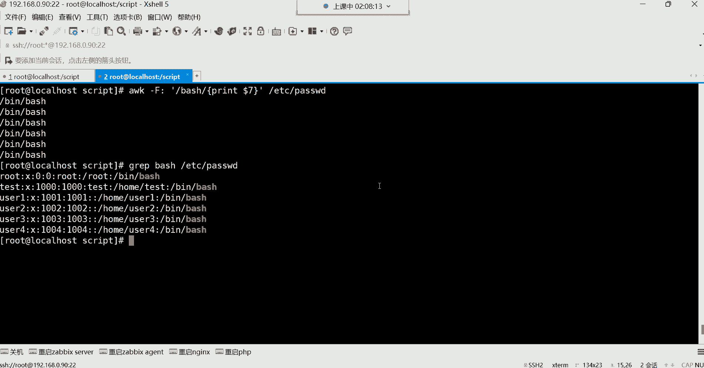

唉你们在看这种脚本的时候就不难了哈。

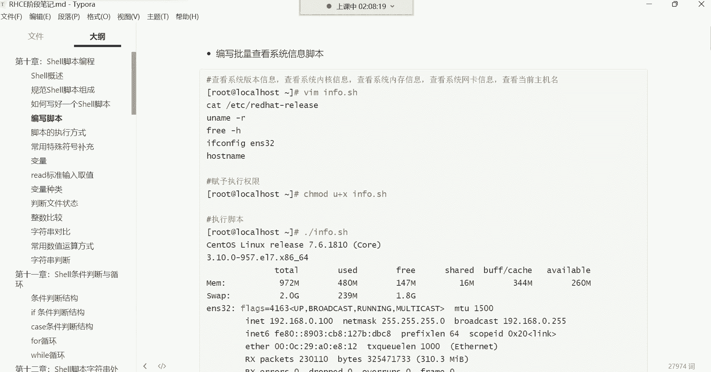

就不难了，像这种东西就这些，那就没什么了，Echo echo，这种东西大家能看懂吗，这种东西应该能看懂吧，因为什么呢，你EQ什么他就输出什么呀，就比如说我们前面那个自己写的脚本，我们写的这个哪个脚本呢。

比如这个插头，我们自己EQ点东西，比如上来我能不能这样就EQ一个，当然用引号引起来哈，引号引起来代表一个整体啊，我后期会讲这个引号这样的，你里边怎么写，随便我为了它的美观，我想怎么写就怎么写。

是不是哎等号也行，比如说第一步是查看什么呢，写中文啊，查看系统版本信息，可不可以，12345好可以，那下面这条命令是不是就看系统版本的呀，那接下来这块留几个空格哈，为了让我们自己看echo。

五个好查看内核信息，可不可以，12345，是不是下面这个命令就是查看内核的呀，好那下边这条命令干嘛呢，12345查看根分区使用情况，可不可以是不可以，然后再来个A口，查看，32网卡信息是不是可以。

然后echo，这是查看主机名，主机名信息，能看懂吗，接下来再执行的话，看到了吗，这玩意是什么呢，在执行上来呢，他就先执行IO里的命令呗，你EQ什么就输出什么呀，是不是你让他EQ啥，他就给你。

你EQ后面跟什么，他给你输出什么呀，没错吧，哎就这样哈，第一步查看系统信息，第二步呢查看内存信息，查看根本区下面查看网卡，是不是可以，所以这种东西我们效果不就一样了吗是吧，第一步我先告诉别人。

这个先做了一个什么呢啊，就这个脚本是做系统环境初始化的，然后呢这sleep3什么意思，这就是这脚本呢它执行太快了，执行太快，对于别人来讲，可能说哎呦，看起来有些刷一下子，给人的感觉就是没有体验感啊。

没有体验感，我们可以这样让它变慢一些，比如第一步看到吗，先EQ查看系统版本信息，然后执行这条命令是吧，那就在这，你让他就这条命令执行完以后，干嘛让他歇会儿，sleep歇几秒呢，比如说歇三秒可不可以啊。

接下来歇三秒之后再执行这个命令，那sleep不就休眠吗，执行完这条命令，过休眠三秒钟，然后再去执行下面的这条命令，再休眠三秒钟，是不是可以，这sleep再休眠三秒钟，Sleep，再熄灭四秒钟。

那下面就需要了，再执行来看哈，诶看第一步查看系统版本，接下来查看内核，诶你看这就点体验感了是吧，那查看跟分区是吧，哎查看网卡，看来查看主机名，所以这种东西是什么呢。

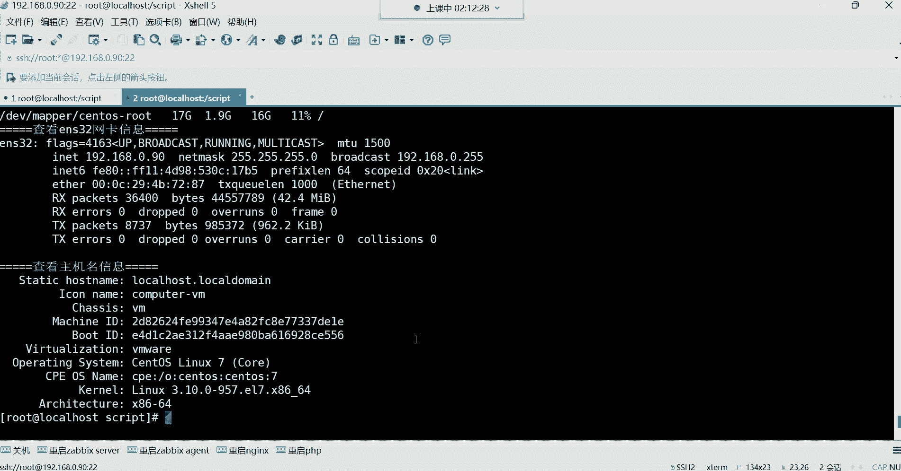