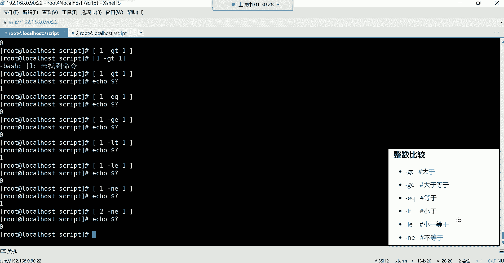
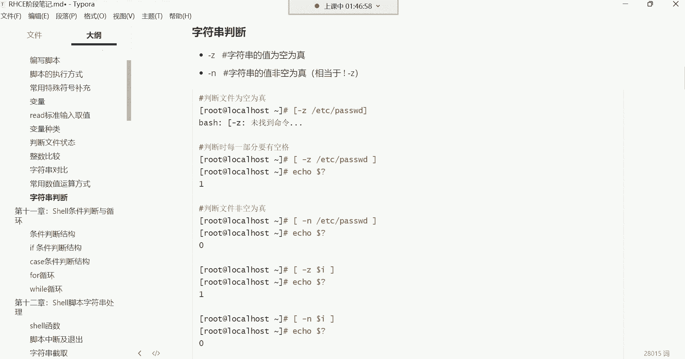

# 0基础小白怎么入门Linux运维？看这套，Linux运维全套培训课程，保姆级教学视频 - P41：红帽RHCE-5.判断文件状态、整数比较、字符串对比、常用数值运算方式、字符串判断 - 小方脸不方- - BV138411B7p5

那接下来呢我们给大家讲讲，这个判断文件状态的几条命令，那这些命令呢非常的好记，大家可以看一下，都是单个字母，什么杠一杠D杠F杠R杠W之类的，这些东西的话呢就是比较有意思哈。

它是判断文件的状态的这种东西。

它怎么用它的格式来看一下哈，首先要在中括号里面判断哈。

在中括号里面判断，好来第一个，嗯好第一个哈，我现在想判断一个文件是否存在啊，然后这里边就这样中括号，然后这时候呢跟上杠一杠E哈，后边空格跟上etc的pass wd回车，你发现他怎么报错了呢。

什么杠E说未找到命令是吧，空格啊，空格这样就可以了，这样的话我就可以判断etc下载pass wd，这个文件存不存在了，那存不存在呢，他也不告诉你，那怎么办呢，你得问他echo每刀问啊。

上一条命令的执行结果啊，如果是零的话，就证明它存在好吧，就是他执行完以后，他不告诉你的，所以你看这美到问号是不是就蛮实用的呀，哎你执行完以后好，你没有任何的返回信息，没关系，我自己问一下你就可以了啊。

这样我就知道啊，这个文件是存在的，能理解吧，所以杠一就是判断它是否存在的，甭管是文件还是目录，只要存在它就是真的啊，或者说就是对的好，那如果说我只想判断目录呢，杠D啊。

d directory就是目录的意思，所以这时候我想判断一个目录的话，你用杠D你发现你再问他，那这个时候他就返回值不是零，为什么呢，因为它不是一个目录，是不是它是文件啊，那如果你换一换，哎。

我就放放etc就行了，那这时候你再问，你发现这就是对的，没错吧，为什么呢，因为它确实是个目录，这个etc确实是个目录啊，那还有F嗯，如果我想判断文件的话，那就用F啊，这个文件存在吗，回车。

那这时候如果你再问的话，你发现它怎么返回值不是零呢，是因为它压根儿也不是一个文件，是不是它是个目录，那如果你这样的话，你跟上一个pass wd，你让他去判断这个文件的话，那这时候它的返回值就是零。

因为它确实是个文件啊，这是判断文件是否存在的，然后那我想看看这个文件我可以读吗，我能读吗，我具有具备这个读权限吗，好杠R，那你还得问他能读吗，好可以读，如果是返回值是零，就是可以读啊，录屏了。

然后接下来那我能不能写呢，那就W就我对这个文件有没有写权限，然后你再问他啊，如果是零就可以写，然后那我可以执行这个文件吗，X那这时候你再问他，哎你不能执行，他看到了吗，哎一那一没有忘哈，录录着呢。

录着呢看到了吗，这录屏哈开着呢啊，已经3分钟了，OK这就是判断文件状态的。

先有个印象吧，好吧，这种东西就是我们现在只是什么呢，只是对他有一个大概的了解，现在还没有这个应用的话，你现在就知道我们可以怎么判断这个什么杠一，杠D这些之类的，那你说有没有必要给他记住呢。

其实啊你可能说让你现在记这些东西，你肯定记不住，其实我也不会去记它啊，我也不会去记它，但是呢我看到它的时候，我能够认识他就可以了，注意哈对，只要我知道它代表什么含义就可以了，我以后看到别人的脚本里面诶。

如果有一个杠一，我就知道啊，原来他想判断这个文件是否存在，能理解吧，如果看见别人的脚本里边哎有一个杠X啊，我原来是呃，原来他是想判断他可以执行这个文件吗，能理解吧，所以这里边就是干嘛呢啊。

就是我们所说的就是你先认识的，不需要你能够给他记得住好，那嗯接下来呢我们还有一些整数的比较。

整数的比较，这里边就有点这个什么呢。

反人类了哈，怎么反人类呢，它比较的这些东西啊，整数比较它比较这些东西就做这个数字对比嘛，比如说啊我想判断一下这个呃一等于一嘛，那这时候怎么比呢，就这样，那他是怎么比呢，得这样哈。

你用echo比echo dollar符中括号在这里边。

不用，那你也这样问他也行。

这样问他哈，直接在中国号里面比中括号，跟前面那个判断一样，中括号，然后比如说我想判断一等于一嘛，那你不能这样不能用等于号能理解吧，你也你比如说我这样看看，中括号里边一等于一吗，他认为这是一条命令。

看到了吗，那这样的话，如果你这样空格隔开，每一部分都要加空格，诶这样好像可以，然后你再echo干嘛，还问他一等于一吗，返回值是零是吧，一等于一没错吧，但是我告诉你，你这样的话。

系统不会认为它是一个数字系统，是认为它是字符，能理解吧，就等于像A等于A吗，比如说A等于A吗，看了吗，这是不是都是返回值为零啊，因为系统认为这个一是一个字符，对他不会认为它是个数字的。

它把它当成一个字符去做对比，因为你想在这个阿拉伯里边，这个123456789，都包含在字符里边的啊，都包含在ABCD这些字符里面的，但有的时候我想做一些计算的话，那你就得用什么呢。

你就得或者说我就是做数字对比的话，你得用这种方法才可以啊，你等于号啊，稍后后我们会讲到哈，我们会讲到，如果我想就是想让系统知道，我这是在做数字对比，不是在做字符对比，那这时候你就得这样啊。

一空格杠gt这个代表是数字对比，而且是整数对比，那gt呢是大于的意思，比如说一大于一吗，注意如果你不加每一部分，你不加空格的话，系统认为这是一条命令，能理解吧，但是我们系统里面又没有一条命令。

是长得这么奇葩，是不是，所以你得让系统识别我是在做一些什么呢，哎做一些对比啊，实验一些特殊功能，所以这时候echo每到问，这返回不太一样啊是吧，你看它返回的是什么呀，他返回的怎么是一呀。

也就是说在这里边你看它返回的值是一，那这个一是什么意思呢，就是假的，是不是就是这一啊它不大于一，那一和一之间的关系是什么呀，一跟一之间的关系，它们是相等的关系，没错吧，你这一它不能大于一啊。

哈哈它是相等的关系哈，所以你如果想判断等于的话，你不能用gt用什么呢，用EQ啊，EQ在那边是等于的意思，对回车，那这时候你再问唉，这时候就是真的了，一确实等于一，这是真的啊，一不大于一，一等于一好。

那这是那个什么呢，这是大于跟等于看到了吗，用分别用这个哪些字母来表示，然后那还有一个大于等于呢，那这里边我们再来比一个啊，我如果把它换成什么呢，换成GE呢，一大于等于一吗，回车。

那这时候哎它返回的也是零啊，那个零是什么意思呢，是真的是吧，一大于等于一吗，啊这里面包含就算它不大于，但是它等于因为它这里面包含一个等于，是不是啊，那也可以啊，也是真的啊，这是判断大于等于的。

那小于的话呢，比如说我再判断一个判断什么呢，比如说一小于一吗，那LT代表小于回车小于吗，啊问一下，好诶假的，是不是，你看它返回值是一假的，就是一不小于一，那没错，一确实不小于一，一是跟一是相等的关系。

所以这时候你比如说我想看看小于等于一吗，这样啊，如果小于等于一的话，你看看他对不对啊，这是对，这是真的，为什么呢，因为这里面也包含一个叫做等于啊，这做数字对比，你就得用这种啊。

他给你指定的这些这个特殊的，这些这个奇奇怪怪的这些这个功能啊，或者说这个字母你去什么呢去使用才可以，还有不等于，比如说一不等于一吗，唉那你说我如果这样判断，他给我返回的到底是零还是一啊。

你们觉得是零还是一啊，嗯你们可以发到讨论区，如果我这样判断，我说一不等于一吗，零，是吧，好看结果哈，唉一不等于一吗，是不是啊，一不等于一啊，对哈，你看有人蒙了，是不是哎他返回的肯定是非零。

因为一不等于不是，因为一是等于一的，你不等于，那是不是就不对了呀，啊这不对了哈，所以在这里边一是等于一的，所以你搞个不等于，那它肯定是什么呀非零，但如果你换一个二，你比如说二不等于一吗。

那这个肯定是返回值是零，没错，那二就是不等于一啊，是不是，嘿嘿嘿嘿好对，这里边，你发现我们这个现在还没涉及到这个一以外的，这些那个什么呢，这些对比呢，我们都是在这个一在一和二之间在什么呢，再再再玩儿。

对我说这都是小学的十以内的加减法，是不是。

啊这是做一些对比是吧啊，后期会用得到哈，你先先不要觉得这些东西啊，这个有些杂啊，没事现在就是学一些杂乱无序的东西，智商受到了侮辱好那接下来就像你们所问的，那你说等于号在系统里边，它干嘛用呢。

是不是哎做字符串对比的，注意哈，他是做字符对比的。

这个字符对比可以用这两个。

它这里边字符对比方法都一样，注意啊，中括号里面做对比，比如A，两个等于号代表是相等的意思，等于B吗，这肯定是假的，A不等于B是不是，那A等于A吗，这肯定是真的，A等于A是吧，或者说我想判断一下哎。

这个这里面可以放变量啊，比如当前我登录的这个用户哎，用环境变量来代表是我当前登录的用户是吧，等于谁呢，等于root吗，诶你看就是零，是不是，是不是是不是真的呀，就是我当前的用户确实是等于root。

不行哈，那样不能啊，那个等于等于是做字符对比的啊，它不是数字对比，但是呢咱们阿拉伯里面，12345678也在字符里面也是包含的，它也算字符，好那这个时候我们怎么这个那这种东西啊，我们后期用的时候再说。

你先了解它的语法，这个然后不等于啊，或者说我们再来一个，比如说不等于，怎么不等于呢，就就这个哈，root root root root呢，诶怎么没了呢，这哈这个比如说每到US。

每到user他如果说我想判断不等于的话，就这个叹号叹号加等号不等于root吗，那肯定是假的，是不是因为它等于root，所以这个叹号跟等于是代表不相等的意思啊，那其实如果在数字里边就是什么呀。

就是NE是不是就是杠NE不等于，然后那这就是做一些简单的字符串对比，大家先了解一下哈，这种东西，你现在你只需要知道它有这个功能就行了。

你现在只需要认识这些东西可以干嘛用，你就现在你肯定记不住，因为东西太多了是吧，你现在看到这个东西，哎呦这GTG什么之类的干嘛用的呀，啊做整数对比的整数比较的啊，然后那你再看到这些什么等于等于啊。

这个是做字符对比的啊，叹号等于这是啊，也是做字符对比的，它判断的是不相等啊，然后下面还有一些这个常用的数值运算，这个数值运算我们前面已经讲过了，在这个常用特殊符号里边。

我们讲过一个美刀中括号做加减乘除取的是吧，那这个位置还有一些常用的运算方法，每到中括号只是其中的一个而已啊，还有下边什么每刀两个小括号。

这也是常用的数值运算，只需要换个符号而已，看我们前面做数值运算，加减乘除echo是不是每到中括号在里边，比如说1+1回车等于二是吧，然后那如果说我换另外一种方法，那就是每到小括号，但这个小括号你要多套。

多套一个再来一个再来一个，回车阵容也可以，然后比如说那5+1得六啊，然后5-1得四，5×1，5×1得五是吧，五然后10÷3得啊得三，这个就是我们所说的这个，那个那个叫做加减乘除。

你看你用中括号也可以实现，用这种每刀两个小括号也可以实现，但这种是什么风格的呢，这种是C语言风格的，做加减乘除运算的这种哈，这比较麻烦一些，是不是啊啊，而这个呢是是有风格的，就比较简洁一些，简洁一些。

然后那除了这个以外，还有一个叫EXPR，这个ESPR它也是做数值运算的。

这个东西怎么用呢，Echo e x p r，然后后边比如说1+1回车，你发现这不对劲啊，看到了吗，你看他不对，他直接给你EO一个什么11，是不是啊，那你说这东西是放到这个每到中国号里面，是吗。

你发这也不对啊，语法不对啊，是不是啊，那这玩意咋用啊，这玩意然后非常奇葩哈，你发现我跟你讲，shell里面很多东西都非常奇葩，你得怎么玩的呢，空格空格啊。

这空格也不行啊，嘿嘿嘿，我也忘了哈，我也忘了啊，这取结果啊，我记我记得是取得取结果哈。

这样得取结果，取命令结果这ESPR他这样反撇啊，取它的结果啊，回车这样可以，如果你取结果，你中间不加空格，你看哈，你如果不加空格诶，你发现不对劲儿，是不是还不行，所以你这位置你得用空格，这样才可以啊。

1+1啊，或者说这个5+15加一啊，这样可以啊，5-1减号可以啊，5×5乘以一诶，等会儿啊啊5×1空格回车诶，你发现这怎么还又报语法错了呢，我刚刚是我这个确实有一个减号加一个星，这个乘法的符号。

它报我语法错，这可以理解是我多敲了一个是吧，那为什么我现在一个星，这是乘法的运算符啊，为什么他也报错了呢，你看是不是语法错误，这啥意思啊，唉这个就是你得给他转移一下，加个左撇儿，加个左撇儿看了吗。

这种啊得转移一下，因为这个星号在系统里面它有很多的特殊含义，所以你如果这样的话，用反撇儿给它引起来的时候，其实系统它无法理解，你这个型号到底想表达什么意思，知道吧，想表达什么意思。

所以这样你看如果你用这样运算的话，还不行呢，啊就这样可以在转移才可以哈，啊就是告诉这个esp2，我这个东西就是一个乘法的符号，你帮我去以乘法的功能去什么呢，去执行就行了哈哈。

然后那除法呢除法是不是就是5÷1啊，啊这样啊，不是哈，20÷3回车，这样可以啊，就信号需要转移，取余呢就都一样了，百分号取余，这样可以啊，十取十对，三取余余一，这样可以啊。

还有吗，还有还有一个叫light light这种数值运算。

它用起来也非常的奇葩，Echo let，然后比如说1+1回车，你发现也不太也不太对劲，是吧嗯，那怎么办，转移就是干嘛呢，就是把它的额外的功能给它屏蔽掉啊，转眼就屏蔽的意思，屏蔽信号的一些特殊功能啊。

因为这个星号在系统里边呃，它代表的特殊含义非常的多，就其实转移就是屏蔽的意思好，那或者说转变它的含义都可以啊，转移嘛转变含义好，那这个light你看回车，那我们加个反撇，看可不可以哈，回车诶，不对呀。

你看我们echo let，那你说难道他也是像ESPR一样，需要有空格吗，然有空格以语法不对。

你看它跟esp好像用起来不太一样是吧。

那这玩意儿怎么用呢，这个light非常的奇葩，怎么奇葩呢，就是light如果你想用的话，你得搞个变量，你得搞个变量，比如说A等于light，后边1+1啊，这也不对是吧。

这light老难用了，我告诉你啊，啊哈哈，这样啊，是这样的啊，这light看到了吗，搞一个变量，这个变量叫什么名字，然后这样在里面再做运算。

这老奇葩了，也就是说这个你是是这样用的，就是light，然后变量名啊运算，那运算以后，这里边你想取值怎么取，你说我能这样echo，然后这样吗，Let，这样吗，你发现那不行，你说我引起来呢。

啊这又啥都没有了，是不是啊，啥都没有了，所以他这东西怎么用呢，就是你得像我刚刚那样的let，然后定一个变量名，然后你把所有的运算在这个变量里面去，做什么呢，做你的运算就可以了，light就知道了啊。

这是我把我的这个运算的结果，存到这个变量里面的啊，所以接下来我想取它的值，你想他把运算的结果存到变量里面了是吧，那就每到A啊，看到了吗，没到A然后那如果我还想做，还想继续做运算，那你就还是这样。

你比如说哎呦5+1，等会啊，点错了哈啊，light 5+1，然后echo dollar a，这样可以啊，5-1，好好echo得到了A是echo51，Echo dota1，再算上五二十，我们用十除。

Echo dola，这样可以取啊，十对三取余去。

EQ到了A余一，这样可以，你发这怎么我就做个加减乘除运算，怎么就这么难呢，是不是搞这么多有必要吗，啊，其实你记哪个呢，记第一个跟最难用的这个light，那你说这light这么难用，我们还用它呀。

还记得呀，let它不是难，它不是难用，是怎么说呢，他有些简写，它在脚本里边。

你想想他把你运算的结果存到变量里面了，我们在脚本里面是不是可以调用变量啊，是不是啊，我们可以调用变量。

所以这个light在后期写脚本的时候，用的比较多一些，然后它有一些简写。

这些简写的话我们来演示一下，你如果觉得前面那种比较麻烦的话，那你可以这样啊，正常来讲，比如说light，加一好，那简写我可以怎么写呢，啊就是light，嗯啊当然这个A加加是不行的，light嗯A啊。

是这个A等于嗯啊，不是是这个A加一，这样可以echo dollar a啊，这就等于六了，看到了吧，这样其实你也可以不用直接呃，但这种方法如果你不定义的话，那上来这里面的A的值是几是一是吧。

你比如说我这样let i加一，那是不是就是看看效果哈刀了，唉，light i加不对劲是吧，它不太哎，I加加，这样可以啊，这样可以，那你比如说我现在I加几，I加十，可以吗，这样不行，语法不对哈。

你看它这里边的表达式，比如说我这个light i等于I加一，是不是就等于说我对自己本身加一啊，那这种加以后是不是就是二啊，简写就是A加加，对自身加一就行了，嗯light i加加嗯。

apple它的值就等于二，然后那减法呢啊对自身减1A减减很好，如果是减法，我想对自自身的值减一，那你就减减，因为这种东西你可以上来先定一个变量啊，比如说I等于五，是不是这里面有有一个值是五啊。

那接下来我再想去做运算的话，我就light啊，比如说I加加IOI每到I那它的值就是六啊，我再做减法，I减减，那就对自身减一，那他现在就是四啊，就是啊I减减啊六啊，加加完以后变六，然后再减就是五。

那么现在比如说乘呢，那就I，乘几啊啊乘以二。

这乘法是这么玩的吗，这种东西这简写老奇葩了哈，啊是是这样玩的哈，是这样玩的啊，不是I乘等于二。

老奇葩了哈，A乘A乘等于二，这样可以，那就是5×2呗，等于十，是不是这里面啊老奇葩了。

然后他这个简写，如果你一旦数字不是对自身，比如说加1-1的话，那它这个格式就是啊，比如我想对自身的值加一以上的，那就A加等于二，那其实就是I等于I加二，我发现这种东西啊，看你们自己的情况哈。

如果你说老师，我觉得这简写呀我有点无法理解是吧，那你就记完整的表达式，这种完整的表达式，可能说更加适合这个初学者一些是吧，但是以后你可能看到别人脚本的时候，可能会出现这种什么I加加。

那你就知道他是对自身加一的啊，对自身加一，那你说这东西用在哪啊，哎等后期哎在有脚本的时候，我们会用得到啊，等到时候你先我们先过一下，到时候我们写脚本的时候，把这些东西给它结合起来，用的时候我们再回过。

回过头来再去什么呢，在回顾一下你就知道了啊，接下来字符串判断嗯，这种东西呢一就是它可以判断变量。

可以判断文件，这玩意儿。

前面是对比哈，注意我们前面是对比，你们别搞错了，前面叫做字符对比，是不是比如说这个A等于A吗，这是不是字符对比，是吧，这叫判断判断什么呢，啊，判断一个变量或者说一个文件到底是不是空的。

那这样我可以这样啊，杠Z我判断etc下的pass w d文件是空的吗，那他也不告诉你问他假的假的是什么意思呢，就不是空的，是不是你看它只有是空的时候才是真的，所以说如果它返回的零的话，就证明它是空的。

如果不是零呢，就这文件它不是空的啊，这杠Z是只有是空的时候才会返回零，那如果你换个杠N它就不一样了，唉杠N杠N就是非空啊，如果是有数据的，那就是真的，那这时候它的返回值就是零，看到了吗。

那我可以判断变量吗，可以哦，我们刚刚是不是定一个变量啊，哎那个刀了，I回车，那你再问他，哎哎这这变量是非空有，这里面有值是不是啊，没错有值哈，所以它返回值是零。

这是做判断的判断啊，那做完判断了，接下来我们再来给大家说说这个啊，我们前面学的东的那些东西就可以用得到了啊，前面噼里啪啦的，我们强制灌输了一堆那些这个比较杂乱无序的，一些这个诡异的符号是吧。

那接下来那些东西怎么用啊，好来在这个判断里边，我们可以用一点点啊，这个什么叫条件判断呢，来看一下在show里边，这个条件判断就是当条件满足的时候，我们执行什么样的操作，当条件不满足的时候。

执行什么样的操作，那这里边我下面给你们举了一些例子啊，比如说我现在想去干嘛呢，想建一些文件啊，或者想安装一些软件包，这个吧比较典型一些，这个比较典型一些，比如我现在我想安装一些软件包。

但是我不知道这个软件包，它有没有在系统里面安装过，那这时候怎么办呢，我是不是可以判断一下呀，是不是啊，条件判断一下这个包如果安装上了，如果已经在系统里面存在了，就不要再重复安装了，是不是如果不存在呢。

再给我安装它，是不是可以啊，那这就这就是我们所说的，叫条件满足的时候执行什么操作，条件不满足的时候再执行什么操作，那接下来这位置那条件判断这个东西啊，它有很多种，第一种两个and符叫并且的意思叫并且嗯。

这个逻辑语的话不太好理解，你就知道这两个and的符它叫并且什么叫并且呢，并且啊比如说拿A跟B这两条命令来说啊，我们把它列成两条命令啊，如果是并且的话，就是当A命令执行成功以后，才会执行B这个命令。

这就是并且那A并且B那如果换，或者呢是不是啊，或者就不一样了吧，或者如果说你看看A命令执行失败以后，那我再去执行B这是或者关系了啊，他们之间他逻辑不太一样啊，逻辑货嘛啊。

这或者那接下来我们来演示一下这个。

并且它怎么用这东西啊，比如我现在就想安装软件包，那我也不知道这包到底在系统里面有没有啊，是吧，哎我先这样RPM杠Q我先干嘛查一下，查谁呢，Vs ftp，啊查他，那查完之后呢，他是不是给我返回结果呀。

啊看一下是不是这包有啊，那有的话，这时候我如果用并且这样YM杠YD，看效果很好，啊不是啊，V vs ftp，你看啊，我看一下rpm刚Q，然后并且em install，这是先。

逻辑对不对哈。

不是这个逻辑不行，这个逻辑不行啊，这个逻辑有些有些冲突，或者说这个从逻辑上说不过去。

从逻辑上说不过去哈，它是这不，这不需要判断这里边这东西不需要。

它没有什么判断可言哈，我现在我想查这个包啊，插了个包，这条命令前面命令执行成功了是吧，让我看一下这个哈，前面命令如果执行成功，如果这包存在，给我安装这个包，然后给我启动服务嗯。

这个我应该怎么应该怎么样呢哈ym install，就是rpm杠Q，然后vs FTP d先查这个包，这包如果在的话，然后后边就不要安了啊，我看看哈，vs ftvb不行啊，这个判断不是很准确。

但是他可以怎么玩呢，可以这样玩儿，我们不是安的，这样system control啊，然后start vs FTP d，我们这样试试哈，你看我这个条件是什么呢，就是如果说我的这个前边查的查询的这条命令。

如果查出来了有这个包，那后面这个命令就给我起伏，这样是不是可以看哈，来试试效果哈，回车查出来了，是不是啊，那服务器没起呢，起来了看到了吧，唉那现在我把它卸掉，卸掉哈，rpm杠e vs FTP，卸了之后。

我再这样玩，再这样前边查这个包是吧，查完以后给我启动服务，那这个时候如果我们在执行的话，回车诶，你看他现在是什么呢，就是前边命令执行失败了，看到了吗，他没有查询，他没有查到这个包，那没有查询的话。

那并且就不会执行了，就后面这个就不会执行了，所以你们可以这样去理解，这个就是A命令啊，这个呢就是B命令，所以他们之间的关系就是并且的关系，只有前边命令能够执行成功，然后那后边的命令才可以执行。

那前面问题一查询，哎呦，没有包，那后边命令就不要执行了，因为你想想这种东西你包都不存在，你说你起什么服务啊，是不是，那我后边是不是就可以这样啊，如果包不存在，你给我安装这个包可以吗。

vs ftvt是不是回车，你发现诶不执行，为什么呢，因为前面失败了，没错吧，失败了，那怎么办呢，那这时候我还可以换成或者把这个并且换，或者或者他就是你前面命令，如果执行失败了，我才能轮到后边去执行。

如果前面执行成功了，后面就不执行了，这样可以回车哎，前面直接失败了好，你看他查询没有这个包好，接下来马上给我安这个包，能列吧，你看这样可以啊。

所以说像这种条件判断我就是什么呢，就是当我的条件满足的时候，我去做什么事情，条件不满足的时候做什么事情，你看只有条件满足的时候干嘛呀，你去干嘛去，比如说我前面如果前面的条件满足了这哈，这前面是安装。

是安装一个包哈，那这个应该上来先干嘛呢，先查一下rpm杠Q查询一下vs FTP，这如果这个位置失败了是吧，你再去给我执行后边的安保，是不是安完包以后并且启动服务是吧，并且把服务设置成随机自启。

并且看服务状态没错吧，那如果第一条命令执行成功了呢，执行成功的话，后边所有命令都不执行，因为你成功的话，就证明这个包已经有了，是不是已经有了，那后面就不要执行了。

好那这时候来看一下效果哈，我们现在再演示一下，给它卸掉RPM杠e vs FTP t啊，然后这时候我们再这样，RPM杠Q卸了的时候啊，然后先查vs FTP，如果前面命令查询的时候发现这包不存在。

你给我1arm杠Y，因此套vs FTP好，那这时候我就得并且了是吧，你包安装完之后干嘛起服务，start vs FTP t起完服务以后给我设置成随机字起，这样可以是吧啊，最后呢再给我看服务状态。

看一下哈，这噼里啪啦的是吧，敲了好多命令，我跟你讲，这都是有关联的，你不要以为这个非常简单哈，你得了解啊，如果我的因为他们之间的关系，你得知道对什么条件下，它才会执行后边的这一堆命令。

什么条件下它不会执行后边那一堆命令，能理解吧，嗯如果这包现在已经存在了，我现在我干嘛呢，我给这个位置换成，并且你看，啊并且啊并且啊那那这不行啊，这个并且他就是因为前面命令查出来有，那后边才执行。

是不是啊，他这逻辑也对，因为前面他查了查出来啊，这包存在，那那存在的话，并且干嘛呢啊并且执行后边的命令是吧，那这时候你就不应该去安了，我们这时候应该干嘛，应该就起服务了，是不是啊，如果查询出来了。

咱就起服务呗，是不是啊，如果查询出来，咱就起服务，如果没查出来，那这个命令后面就不要执行了，所以他这个就是我们可以干嘛呢，预判一些，就是有些命令之间是可以相互关联的，你看这个就是是不是就相互关联了呀。

就是如果说前面一步错，后边你如果再执行，是不是也没有意义啊，啊就不要执行了啊，只有前面这一步成功的情况下，哎后边执行才有意义，所以我们说这并且就是，并且的关系啊，只有前面执行成功了，后面才能继续执行。

而或者是不是或者就是只有前面执行失败了，后面的执行。

所以它这个就是可以让我们做一些什么呢，叫做逻辑性的判断啊，判断你的命令，那还有一个还有一个叫做分号分号啊，它就比较有意思了，它是没有任何的逻辑关系的，这个你怎么玩都行。

你比如说我现在我想在这个命令行里面。

同时执行很多条命令啊，touch在OPT下面建一个叉叉点，TT好，接下来分号隔开后边那我rpm杠q vs f TV d啊，分号隔开，然后接下来IOS看root目录分号隔开好。

接下来这个CD切换到OT目录回车，你看了吗，他这玩意儿就给你干了好多事儿，就在一个什么呢，在一个不换行的情况下，我可以敲很多条命，可以敲很多条命令，所以他现在就是帮我在OPT建了一个什么呢。

那个叉叉的TT吧，叉叉的TT文件呢啊这叉叉点TT，这这怎么有时间呢，是这不是我们建的哈啊，我现在在OPD吗，叉叉点TT呢，啊这儿呢哈我说怎么感觉不太对劲呢，啊叉叉的贴贴是不是出来了，然后rpm刚Q。

是不是也给你查询这个软件包了呀，然后用IOS看root的目录啊，这是root，这是内容是root目录的哈，然后又CD到OPP了，C o p d，你再给我干嘛，再给我来一个IOS，回头啊。

这样看的就是OPT看到吗。

所以他这个嗯他这个就是什么呢，就是没有任何关系，你的前面命令跟你的后面命令没有什么逻辑，而上面这个不是，上面这个都是前面命令跟后面命令都是可以，什么呢具有关系的，前面命令执行成功。

然后后面命令应该怎么办，前面命令执行失败，后边命令应该怎么办，这就是我们所说的条件判断，然后这里边啊，这种东西不是说只可以应用于命令哈，你像前面，比如说我们前面学的那些杠F。

我判断这个路径下边的文件在不在啊，如果你看GF是判断文件的呀，存在就为真吧，是不是啊，如果存在的话，后面干嘛给我拷贝，给我拷贝，拷贝到哪里呢，拷贝到某一个目录，所以你看前面加一个判断之后哎。

后面做什么事情，比如我现在想拷贝一些文件。

但是我不知道这文件在不在呀，我们就拿了一个哦那个etc的pass w d哈，我现在上上来先判断一下啊，杠F这个文件在不在啊，如果存在的话，是不是就为真呢，那如果为真的话，干嘛拷贝啊，拷贝到哪OPT目录。

拷贝谁呀，拷贝etc下的pass wd到OPT回车，直接看OPP是不是拷贝过来了，没错吧，那如果你下判断你判断一个不存在的文件，叉叉叉叉叉，那你看OP的时候他能有，是吧，因为什么呢。

因为后面命令压根就没执行，这个CP压根就没执行啊，我们换一个哈，不考虑这个pass wd的f s table，你再看OPP是不是没有，那文件是不是没有那个fs table，为什么呢。

因为前面就直接失败了，看到了吗，嗯我先判断一下，然后再做什么事情，先判断一下再做什么事情。

它是这样玩的，这是并且还有或者还有这个没有任何关系，这些特殊符号，那前面的判断其实好用吗，嗯一般般吧，简单的逻简单的逻辑可以用那一些复杂的话呢，这个就得用这个if判断了啊。

那这个if判断我看一下需不需要休息一下哈，44分钟啊，我们可以先稍稍休息一下，然后我们再回过头来讲讲这个if判断行吗，不然我们这个可能说这个时间太长啊，大家hold不住啊。

