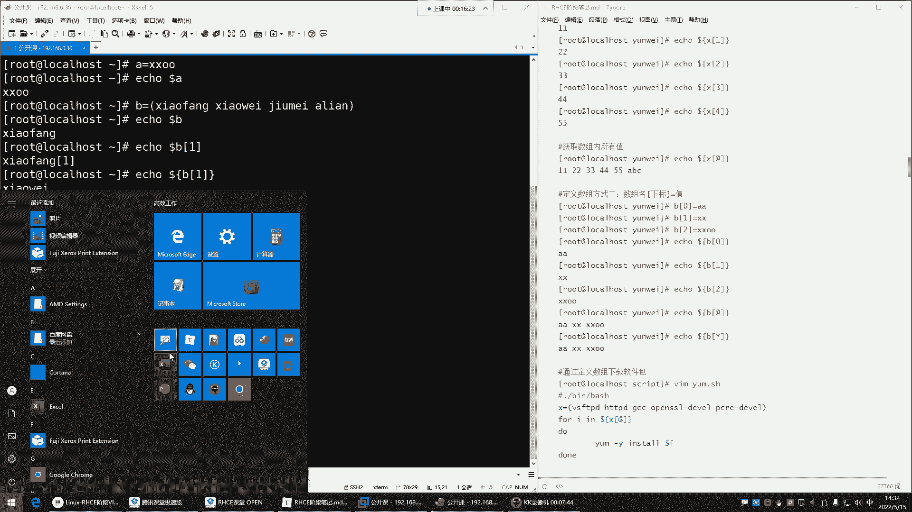
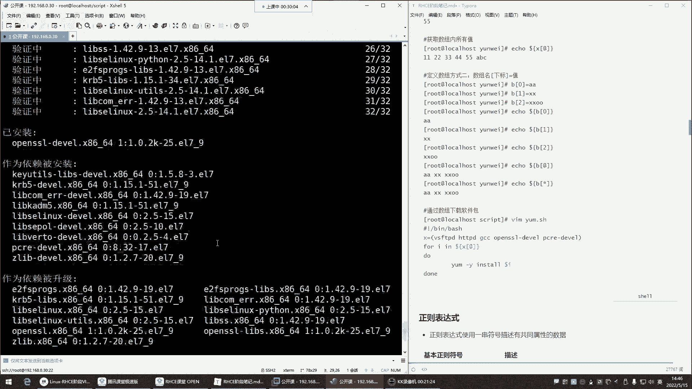

# 0基础小白怎么入门Linux运维？看这套，Linux运维全套培训课程，保姆级教学视频 - P48：红帽RHCE-12.Shell数组、正则表达式 - 小方脸不方- - BV138411B7p5

喂喂喂，OK啊，我们来这个读一遍上课前呃，这个读一读一遍上课前的一个励志短句，啊哈没啊，等一下啊，我把这个哎打开一下，好，来看一下哈，看这句话，没有一个冬天不可逾越，没有一个春天不会来临。

最慢的步伐不是跬步，而是你在那儿无尽的徘徊，所以说最快的脚步不是冲刺，而是坚持是吧，同学们，所以我们呢现在也一样，唉我们每天进步一点点，那在未来都会变成我们人生中的一个什么呢。

啊哈哈哈，你都记不住是吧，未来都会变成我们人生中的一个这个，让我们一个美好的回忆啊，这是我们这个开始上课了哈，然后那我们那个上节课上节课讲到哪儿了，我们上节课是讲到了，来看一下哈。

我们上节课是不是讲到了，这个把这一部分给他讲完了呀，这一部分包括这个字符串啊，不是啊，在这哎这哈，我说呢在这哈，我们把这把这部分给讲完了，是不是对，那接下来呢我们这个就正式开始。

正式开始这个讲这个正则表达式，跟这个室友四验课里面的这些内容了啊，这些的话那也是后期比较常用的，我把这个给它关掉哈，那我们先来看看试用数组吧，这个数组的话呢是今后你在看别人脚本的时候。

你会经常去这个遇到是有数的这个数组，那什么叫数组呢，在这里面我并没有给一个具体的解释，是不是啊，那这个数组啊，其实啊他就是那个那一个变量的另外一种形式，什么意思呢，就是这个数组这个东西。

它是可以就是在一个变量名里边定义很多个值，我们前面在学习变量的时候，是不是A等于叉叉O然后回车好，这样我们就把这个变量里的值给它输出出来，是不是啊，哎这一个变量里面定义一个值。

但是如果说我现在呀有些需求，这一个变量里面一个值啊无法满足了，那接下来怎么办呢，接下来我们就不能用变量了，用什么用数组这玩意儿，它比变量的功能啊要强大一些，看定义数组的方法，我们来看一眼哈。

第一就是你看它跟变量的方式是一样的啊，数组名你可以把它理解成这个变量名好，然后等于号，你看是不是格式是一样的呀，没错那里边的值，这时候因为数组是允许你定义很多个值的，如果你定义一个值，它不叫数组。

它叫变量，那如果我想定义很多个值，它就叫数组哎，那这个时候哎你看你定义多个值的时候，用小号括起来，然后里边写了很多个值，那你看方法跟变量一样啊，B等于等于什么呢，哎小括号里面比如说这个小方。

然后空格隔开第二个值，小V空格隔开，然后九妹空格隔开，阿联啊，我们中国四大村花回车定好了，Echo，每到B回车，哎，这输出的时候它不一样了，哈哈他取值的时候怎么取呢，它取值的时候。

你发现他并不是把这里的所有值给你取出来了，它是取了谁呢，他是取了这个里面的第一个值了，能理解吧，那为什么只取第一个呢，因为啊它这里边你看好几个值，他也不知道你到底想取哪个值，所以在这里面他就默认给你。

只取这里面的第一个值，那你如果想取后面的值怎么取啊，哎那这个数组啊，它是按照下标去指定的，那什么叫下标，下标就是数组里的值啊，我们称之为叫下标啊，然后这时候呢在数组里边。

这第一个值我们称之为是第一个下标，第二个值是第二个下标，但是他这个下标在数组里边，注意啊，是以零起始，哎这零就是你的里边的第一个下标，第一就是第二个下标啊，其实说白了就是值啊，然后二就是第三个值。

然后三就是第四个值，所以你明白哈，它这个它里边取值的时候是从零开始取啊，零就是里面的第一个值，一就是第二个值，二，第三个值是这样玩的，所以这时候你想取值的时候，你就得echo，然后啥呀。

哎每到书名说个名哈，但你取值的时候，你后边中括号跟个下标几呢，看一回车不对劲啊，这怎么多个一，是不是啊，把小方取出来还多了一个一，所以数组取值不量取，注意啊，数组取值是要套个大括号哈哈。

你发现这玩意真的不太适合人类学习了是吧，哎这样就可以了，校微取出来了，看了吧啊，你套个大问号，这样就把小V给取出来了，这是取第几个值，注意啊，这一就是数组里的第二个值，二呢就是第三个值，你就记住哎。

你在取值的时候，你想取第几个，它是从零开始的好，那我想取1234，第四个值，那是不是就是三呢，所以你在取值的时候，你记住哎，永远比你要取得那个值干嘛呢，哎少写一位就行了，他在这个数组里面的值是第四位。

你就输入三好，取出来了，是阿联取出来了嗯，那这个就是我们所说的数组，那现在我问一下大家，这个数组理解了吗，数组是什么呀，是不是就是就是它也是一种变量啊，然后呢就是里边可以定义多个值了。

然后你想取哪个值哎，看情况能列了吗，列的话给我刷个一上来嗯，能明白这个数组它含义了吗，这个数组能理解是吧，所以他这玩意儿就跟变量没啥差别，哎，你就知道他这玩意就是呃，比变量功能会强大一些。

这里面可以存很多个值了，哎变量是一个里面一个值，是不是哎那有了这玩意了，那你想想这个时候嗯我们可以用它干嘛呀，哎这玩意儿就跟变量一样，变量怎么用，数组就怎么用啊，我们一会再说。

那接下来呢我们再来说它另外一种形式啊，偶尔有回音是吧，偶尔有回音啊，喂喂喂，看见啊，喂喂喂，这声音声音还是蛮清晰的是吧，这声音调不大嗯，对让你的可操作性它变高了，嗯嘿嘿然在这儿看一眼哈。

这声音还可以，是不是声音还是非常清晰的。

其实就调这，好O，喂喂喂喂喂喂喂喂喂喂喂好，那接下来呢我们再来哈，我们再来，所以说第二种定义方法，这取值你看按照下标去取值，下标从零起始，零就是数字里的第一个值，那接下来嗯。

我们呢如果想取里面的所有值来怎么取啊，艾特符at符是取所有的值得来看一眼哈，我想把你的所有值取出来，就不要输入数字了，哎at符艾德夫回车，你看把所有值取出来，那这时候大家肯定会产生疑问了。

说这玩意它用在哪。

是不是用在哪，那我给大家来看一个，我昨天刚刚讲过的一个K8S的一个脚本。

这个脚本大家应该都能看得懂，所以呢我来给大家来说一说。

这玩意儿它可以用在哪啊，昨天在讲K8S的时候。

在，昨天在讲K8的时候呢，我其中就用到了数组，在在这儿往下翻看哈，我昨天呢用数组干嘛了呢，哎定义了一堆叫做镜像列表，这个镜像列表可能大家现在也没接触过啊，嗯嗯这个呢星可以吗，不行用不了星号。

它不支持这玩意儿，它可以干嘛，用来看一下哈，你们看哈，对这个这玩意可以放在脚本里面，在脚本里面怎么玩呢，看这玩意儿，我先比如我现在需要下载很多的东西，哪些呢，哎就下载这些东西，你可以把它列成软件包。

我现在想下载非常多的软件，1234567个软件啊，我想下载这七个软件包，那这七个软件包啊，可以可以放命令哈，可以放命令，那但一般我们不放命令，就像你会啊，这个一般我们放命令也也会取得的结果，能理解吧。

就像变量一样，你说我们不是直接在变量里面放命令干嘛呢，哎我如果真的是需要的话，我是变量里面把命令引起来啊，比如说莱斯等等等等啊等等等，叉叉叉给它取它的结果可以哈。

可以你看我这里边我需要下载非常多的软件包，那这时候这包太多了，然后怎么办呢，哎我通过数组的方式给它定义了一下，你看数组名，然后呢等于号是不是刚刚格式是一样的呀，然后进来的小括号，小括号开头，小括号结尾。

这里边是我定义了一个什么呢，一个数组，那这时候我定义了这些就是里边的东西，就是我要下载的，那接下来怎么下哎，用for循环去帮我循环去下载啊，我不想手动一个一个去下了哎，for循环去帮我下载for循环。

我们昨天讲的这个for循环的时候是否，然后呢，这时候这叫什么，这叫变量名，是变量名，变量名是不是我们可以随便写啊，啊我可以让它是叉叉，是不是啊，哎变量名就是你随便定义变量名。

然后接下来的in in后面是什么呀，in后面的值从哪来，从数组里边来，从数组里面取值，那这时候你怎么取数组里的这些所有的值呢，怎么取呀，哎在这美刀花括号画框里边是什么呀，是数组名。

这个数组名是不是对应了上面那个EMAGE哎，一模一样的是吧，数组名，但是我想取所有at符代表是数组里的所有值，取所有值，你看它取所有值就是每取一次，是不是这个值就放到变量里面了呀，放到变量里面干嘛。

开始循环do跟道理的语句了，那这时候我风循环是在命令行里面用的，执行度跟道理的语句能理解吧，那这玩意你是可以放在脚本里的啊，直接粘贴到脚本里就可以了，不在名单行里面好，接下来我们就干嘛呢。

开始帮我去执行里面的语句了，那这里面的语句做什么操作，那是不是就看具体情况啊，给我去下载是吧，给我下载数组里的这些定义的这些软件包，是不是啊，哎帮我去下载看了吗啊，pro就是拉取的意思，给我去这个位置。

去这个地址给我拉取什么呢，拉取这个变量名里面的那个软件包，这个变量名是不是就它呀，哎这里的软件包给我拉取下来，那他就给我拉取到本地诶，他是把你看每取一个值放到变量里面，他就给我执行这里面的语句是拉取。

然后循环完了以后呢，再把第二个值就是数组里的第二个值，它不以此类推嘛，第一个值第二个值再给我放到变量里面，再去给我干嘛呢，哎再去给我执行这里面的语句啊，这个我问一下大家能看懂吗，哎就这一部分能不能看懂。

能看懂的来给我刷个医生来，是不是我们昨天都学过来复循环，然后再加上今天的数组，好能看懂是吧，那你看这玩意它用在哪，你现在知道了吧，哎这玩意儿怎么用都行，怎么用都行啊，下载一些东西都可以创建一些文件。

创建目录什么的，哎你都可以用数字来实现你定义什么啊，看懂三成，看懂三成啊，那你得去看看前面的负循环了，主要你我觉得你是看不懂for循环的语法，再加上数组的这种方式啊，数组取值就是固定的，就是每刀花括号。

然后里边数组名啊，然后里边数个名你取什么值，这就是看里边的具体的下标，大大概意思能明白是吧。

那就可以了，所以你知道现在你能明白就行，我也不是要求说哎。

大家必须得什么呢，得给我记下来，熟练掌握，不是你只要能看懂就行，这种东西以后一旦出现的话，你看懂它是啥啊，以妹子变量名自己起的名，自己起的名哈，好那这玩意儿我们怎么用，你想想我们怎么用啊。

这玩意儿你想怎么用就怎么用啊，比如我要安装一些软件包来看一下啊，安包啊，我们通过定义数，我们通过数组去下载软件包，那就跟我前面的那个是一样的，比如说我现在来个数组啊，当然我们可以写在脚本里面哈。

我们当然这个机器呢是一个，昨天那个机器我给删了，我昨天不是创了个虚拟机吗，然后我给删了，我今天又用一个新的机器，因为昨天那个机器我觉得他有问题啊，拼一下3W点百度点com，哎你看这个没有问题。

昨天那机器有毛病给删了哈，然后我又重新建个目录，这里边是空的是吧，VM知道什么哎，我就让他叫什么呢，叫for，然后数组点SH是不是数据数组点ICH，然后在这里边井号叹号杠并下的batch。

比如我现在想下载一些软件包，哎我干嘛呢，对at是全部的意思，没错，是全部啊，我现在想下载一些软件包，但包比较多干嘛呢，唉我就这样定一个数组啊，soft soft soft soft是怎么拼的呀。

嗯soft软件，是不是soft的威尔算了，翻一下吧，靠你们也不行啊，软件软件啊，这个soft威尔哈哈对对对还好，soft等于等于什么呢，等于这是我的数组名，是数组名叫什么都可以，是不是啊。

然后小括号里边我要下载哪些包呢，比如说GCC啊，vs FTP d啊，HTTPD还有什么呢，还有这些软件包，再来一把等等等等啊，这些软件包，这个软件包现在还没有学是吧，没关系，先甭管它是干嘛用的。

就是我我现在就要下载它，定义一下，是这样写的吗，我看一下哈，哎没错，就这玩意儿，就他这就是数组哈，看name等于这不是数组吗，数组里边干嘛呀，哎你说他这数组怎么这样玩的呀是吧，怎么这样定义呢，注意啊。

它这里边是直接给下他这玩意儿定义的，有点啰嗦了有点啰嗦了哈，其实你不用指定数组面，你不用去什么呢，不用指啊，我看他啊，他是这样可以可以哈，他这样玩也行啊，数组里边定义了什么呢，哎定了一个名字跟下标。

我这个下下下标里面存的是这个同学的名称，好吧，这这是第几个下标，是不是零代表数组里的第一个下标啊，那其实就是第一个值零代表数组里的第一个值，一代表数组里的第二个值啊，那这个名字叫什么呀。

哎这个数组里面的名字啊，叫内蒙，叫内蒙啊，Name0，或者你你稍后取值的时候取的是谁呢，取这个名字啊，这个内幕一里的值是他张三啊，李四马五这样取值的嗯，就就这样取值，然后像这种东西的话呢。

到时候它调用的时候它就怎么说呢，比较方便了，怎么调用呢，你看他这样，那echo echo谁啊，EO每刀数组名是吧，这是不是一个数组名啊，那这个数组名里边还有什么呢，还有这个哎里边的内幕名字。

那name0是谁啊，name0到时候就给你echo这个这个同学的名称，啊然后，他这玩意你看其实就是通过数组方式定义的，这我相信大家应该多多少能看懂点，能看懂点，下标不也是吗是吧。

数组里面的定义的一个名字，然后这个零代表是第一个下标，下标里面存的是15是吧，然后这是十二十九，那这玩意我觉得还比较简单，比较简单，那我们自己来演示一下，选的更离谱吗，没错有点离谱哈。

好那接下来咱们来看一眼哈，我现在也是定了一个数组，这里面有非常多的软件包是吧，那这么多软件包我想下载的话，我用for循环去给我下载for，然后变量名叫什么都行，叉叉O哎in后面是跟谁呀，后面跟数组名。

每到花括号里边，数组名，数组名拿过来。

啊把这个复制翻译给它关掉。

不然每次我一划它就开始给我翻译了，好接下来哈software，然后接下来呢干嘛呢，中括号取值取谁呢，取所有符代表所有值好，然后do done干嘛呀，那是不是只要是这个数组里面的值，注意啊。

我这艾特符是不是取里的所有值啊，那这时候第一次循环的时候，这里面的值是谁呢，是他就是它，它就会放到这个叉叉O里边，那接下来他会干嘛呢，哎我就要么给我去安踏YM杠y install，安谁呢，哎就安软件包。

哪个软件包啊，哎美刀叉叉O叉叉O是谁叉，DOL福美刀叉叉O叉叉是谁插头，是不是就是这数组里的第一个值是不是循环，第一次的时候就按这个包，第二次就按它，然后按完以后还干嘛呢啊，这就别起伏了哈。

不用起伏不用起伏，那这时候就是给我安装它，安装它，开启录屏了，开启了哈，看到吗，已经18分钟了哈，OK然后接下来呢保存退出，保存退出以后，我们来执行一下，看效果是吧，哎batch，执行这个脚本回车。

echo后面的这个根号啥意思，哪个根号，Echo，啊他那张图里边是吧，他那张图里边echo，最后那个跟转义符转义符哈，啊不是这它这是一个转移符，就是因为他什么呢，他是敲了很多条命令。

这玩意就是比如我想在命令行里敲很多呃，输入很多个值，echo好，那这时候值比较多，叉烧O是吧好，但是我这个值呢我不想放在一行哎，左斜线回车ABCD好，然后左斜线回车1234啊，左斜线回车看了吗啊。

噼里啪啦的回车哎，这时候就这样放在一行了，看到了吗，这玩意儿啊悟了，是不是啊啊就是这条命令我不想放在一行，那接下来你看我给你们讲的多通俗啊，是不是是不是是不是太清晰了，然后突然间发现诶这玩意能看懂了。

是不是哈，哎感觉啊写的是比较高大上，但是呢哎经过我们这一拆解，你发现哎呀其实也没啥是啊，到时候不就把你的这个名字，给你们输出出来了吗，是不是好，那接下来我们就这个执行一下哈。

执行这个for数组点SH哎回车，你看他干嘛呢，给我下载软件包，你看开始下了哈，开始下载这个软件包，现在进门了。

都是手打的，没错都是手打的啊，你看是不是就把这些软件包给下载下来了呀，已安装没错吧，啊作为依赖的其他包呢，其他包也安上了，其他包断了哈。

其他包呢作为依赖，哎我看一眼哈啊，其他包都有啊，你看这包都有，是不是啊，嗯杠q vs FTP d啊，都安装上了，是不是HTPDAHTTPD好，都安装上了，嗯嗯好，那接下来那我们这个是不是啊对就能跟得上。

嘿嘿嘿嘿嘿嘿一顿好，那接下来呢我们这个这个数组这玩意儿，你发现它是不是就跟变量一样啊，哎它就是变量，你把你你你需要存多少值，你就往里面存就行了，这样比较简单，而下面还有一个定义数组方式。

第二种方式是什么呢，第二种方式是直接就是我这个数组已经存在了，我想再往里面去再增加值可不可以啊，但是这种一般很少用，很少用哈，哎像这种，你看它是这样玩的，比如说我们在命令行里面那个哪个数组呢。

这个是那个A是不是A，这里面就一个值吗，是B啊，你看我刚刚alpha的时候，是不是也把这里的值取出来了，啊信号不行哈，你把里边放星号，你看行回车，诶，这星号这怎么又好用了呢，嘿这星号怎么又可以了呢。

我曾经我曾经用的是我试验过呀，他不行啊，但为什么这就可以了呢，嘿嘿过诡异了是吧，诡异了哈，你也试了，可以是吧，哎我原先试过不行，那可能是有点说不清了是吧，哈哈对，有点说不清了哈，这玩意可能是版本的问题。

没错有可能啊，但这玩意儿尽量不用星号，尽量不用星号嗯，尽量用at符，因为这玩意儿他有的时候真的是，因为我曾经试过，放心他，你想你们想的问题我肯定都想过呀是吧，我曾经试验过他不行，所以呢尽量不用醒。

那我们现在来给大家说一说啊，你看我现在把数组里的所有值，都给它输出出来了是吧，那我现在我觉得这里的值有点少，我想再往里面增加一个啊，再增加两个人啊，现在什么小V小方，我觉得现在有点忙不过来了啊。

我再往里面增加两个人啊，增加什么呢，增加一个波多，那怎么办呢，哎这时候你最笨的方法就是重新定义一下啊，B等于重新定义一下，那定一下他就把原原先的值给你重新覆盖了，但是你不用这样不用哈。

如果你这里面值比较多，你在向往里面增加，你就可以向第二种方法啊，把这个名字拿过来指定下标就行了，然后等于多少支这样玩啊，这个B好，那你要数一下下标，这里的下标，你看这是0123是吧。

那我现在哎再往里面增加的话，那是不是应该第四个了呀，哎第四哎下标，第四就往我要往第四个下标里面增加个值值，等于多少值，等于哎不多啊，不多回车，那这时候我们再echo回车，你看是不是就增加进去了呀。

就是怎么再往数组里面赋值啊，对这时候那我再想往里面增加怎么办，那这时候你如果是如果再往第四个下标赋值，那是不是波多就会被覆盖了呀，是不是啊，你比如说啊这波多比较累了，换成小方啊，不是小芳了，是谁呢。

小苍老师，小苍好回车，那这时候你看上线别变成小仓了，是不是哎对比较累，那那如果你说我再往里面再增加一个人呢，哎五是吧，那这时候这时候谁呢，这时候增加一个小泽，小泽回车，那这时候你看是不是啊。

哎就是怎么往数组里面去增加值啊，前面是定义啊，这词儿用的是吧，我这词用的比较隐晦是吧，呵呵好，那这是怎么再往数组里面复制，然后下边怎么用这玩意儿，是不是啊，他这个玩意儿就是一个变量，就是变量。

对提神这玩意儿，OK那接下来呢我们说的是一个正则表达式吧，啊数组现在其实就是变量的一个什么呢，一个高级版，一个高级版哈，所以你们呢就知道一下啊，它里面可以存很多个值，取值的时候怎么取就可以了。

OK那下面呢我们来说正则表达式，这个正则表达式呢，对于大家来讲也是一个比较痛苦的一个什么呢，一个技术内容，为什么呢，因为这玩意儿就一堆符号啊，就一堆符号，这就是正则表达式，那这玩意儿你看他是嗯。

他既然是叫正则表达式，他就是想通过这些符号想表达一些什么呢，唉想表达一些具体的功能，嗯这玩意就是通过这些特殊符号哎，想表达一些功能，那这些特殊符号是几乎在任何一个编程语言，语言里面都有的。

你比如说这个什么C语言，还有这个java啊，Python等等等等，这些都有，这些玩意儿都有正则表达式的符号，然后他们在任何一个编程语言里面，这个符号的功能都类似，比如说这个符号在show语言里边。

是用来帮你匹配行首的，那在c java Python里面也是匹配行首的，啊所以像这种东西的话呢，它是一个通用的符号啊，在任何一个编程语言里面都比较通用，那以后你看到这个其他的编程语言里面。

如果发现这些符号的话，那这玩意它都是类似功能类似，所以什么叫正则正则表达式，就使用一串让我们无法理解的符号，去描述一些我们无法理解的事情啊，这叫正则表达式，那来演示一下这玩意怎么用，第一个金角号呃。

他是干嘛的呢，它是匹配行首的，怎么匹配，我想过滤一个文件啊，Grape，我想过滤文件的root好，那这个时候你看看这个过滤的时候，发现唉过滤出了两行，因为这两行里面都包含root，是不是啊。

只要有一个你搜索的关键词，他都给你过滤出来了，那接下来大家想象一下，我就想要什么呢，就想要开头包含root的行，注意啊，这行里面只有开头包含root，才是我想过滤的那个数据。

中间包含末尾包含都不是我想要的，那这个时候你就加个尖角号，注意一定要在前面加，再加后边啊，加到前面代表开头开头这个尖角号怎么打出来，知道吗，按住你键盘的shift，再按你的这个键盘的那个几呢。

六啊数字六回车，那你看是不是有区别了呀，就是只把开头包含root的，给我匹配到了啊，那这一行是不是就没有显示出来呀，哎这就是用来匹配什么的，哎以什么什么开头，其实我们前面也学了。

前面就学过这种声学grab的时候，我前面就给大家讲过匹匹配什么什么开头，还记得吧，corrupt的时候啊，没有在这个笔记里面是吧，在那个笔记里面的，对用多了就好了，对rh cs里IHCC里面。

那这玩意就是用于干嘛呢，其实主要还是用的数据过滤，数据过滤哈，你需要过滤的时候，你就可以去什么啊，去匹配匹配，然后，还有这个美刀，美刀是什么呢，美刀是以什么什么结尾。

是不是哎那我们试试把它放到这儿可不可以，嘿你看放到这儿不行，是不是他无法理解的，这以什么开头啊，是不是这以什么开头啊，一空啊，你这啥都没有，是不是已空啊，所以这不行哈呵呵这不行。

那接下来我们说说以什么结尾刀乐福啊，当乐福如果你结合group用的话，那他就不是帮你去过滤变量了啊，你前面给他一个，比如说啊，我想看看我系统里面有哪些用户，用的是这个BH解释器的，那这时候直接BH结尾。

啊以败事结尾的给我过滤出来诶，就两个看到没，我这系统里面就两个用户，说白了可以登录系统，是不是，那其他用户呢啊，那么我想看看哪些用户是以NO log in，就那个不能登录系统的NO，log in啊。

这些用户都是无法登录系统的，用户看到了吧，只要以什么开头，然后以什么结尾就过滤啊，用于数据过滤的这块，那中括号哎，这个中括号我们前面用过是吧，哎再讲一些什么条件判断啊。

杠F判断文件是不是这玩意儿是文件吧，看看问他是吧哈，杠FGF在中括号里面做条件判断的，我问他这个etc下的pass w d它是文件吗，然后echo每到问号啊是吗，是返回是零，就是代表是结果是正确的。

没错吧，哎做条件判断，那在正则里边它的功能啊还可以干嘛呢，还可以去帮你做一个匹配，啊叫匹配中括号里的任意单个字符，什么意思呢，就是我呀有很多个字符嗯，我可以给他什么呢，唉放到中括号里面要过滤。

就我要过滤，那这时候，但是我不确定这个字符，在这个文件里面存不存在，那我就这样过滤rap，然后唉中括号里边随便写123，a b CD root叉叉O啊，这是我要过滤的内容哈，哎那在这里边注意哈。

它叫什么呢，它叫任意单个什么意思呢，这任意就是你是什么都行啊，单个注意啊，这里面主要是以单个为重点，就是这里面注意啊，一是单个字符A也是单个字符，能理解吧，就是他们之间啊，你就这么理解。

这一个英文字母就是单个的意思啊，一个一也是单个的意思，它们之间没有任何关系啊，不是连续的哈啊这不是一个单词，所以他们之间没有任何关系，过去什么呢，哎从etc下的HANSWD过滤。

那你看这时候他给你过滤了什么呢，你发现怎么这么多东西啊，也就是说你看他给你过滤了，只要是你这里边有的东西，我在这个文件里面给你找到了，我就给你显示出来就匹配了，看了吗，你看一有没有。

是不是它并不是说必须得匹配这一个连续的哈，他们之间没有没有任何关系，这不是连续的哎，一也行二也行，三也行，只要有的话，我都给你找出来，都符合我的条件，这样做数据过滤，做出过滤哈，这玩意儿哎。

那你说这玩意它后期可以用在哪里呢，这玩意儿后期啊，大家如果学习ANCIABLE的时候，哎ANCIABLE我给大家安个包哈，YM杠YINSPENSABLE，大家在学习answer的时候呢。

ENCI边会用会用到这个东西啊，unstable杠杠version，看一下版本啊，然后在啊这个其实其实你们不用管哈，它在哪儿呢，在etc有个ENSER目录，在目录里面有一个叫host文件。

就这个哈这文件，然后我们干嘛呢，打开这个文件，打开文件以后，他这里边就用到了这个正则表达式的这个符号，在这儿这个中括号，这个中括号它干嘛用的呢，来我们来分析一下哈，他是这样子，就是在这个文件里面。

你看001冒号006啊，他的冒号呢是做了一个分隔符，分隔符哈，然后在这里边，他是就是用的这个中括号去匹配了啊，是匹配了什么呢，匹配了主机名，就是这个主机名前面是3W开头，而中间这个主机名包含。

主要是001或者006，但是它这个它这里面是匹配连续的，冒号代表是就是0011直到006的意思啊，这就是正则表达式在里边，然后就是这个主机名是3W001，然后后边以这个结尾。

所以他的名字可以用可以匹配到，可以在这边做一个匹配，怎么匹配呢，就是哎3W，然后001。1个散步点com啊，第二个3W哎，002。1个赞，不点看过，但是呢他想同时匹配六台，他把这个0011直到006哎。

我就放到中括号里面了啊，代表0011直到006啊，匹配了六台机器，这玩意儿你看就是它可以放到配置文件里面，那我们呢也可以用来做数据过滤，你把那个东西放在这个里边，然后呢你是想过滤还是想干嘛。

这就看你的情况，看你的需求啊，下边哈这是中括号啊，认识一下就行哈，认识一下就行，你就是到时候你看到一些文件里面，如果有这种中括号，你就知道他是去匹配的，匹配中括号里的内容啊。

这个就是先知道一下他干嘛用的啊，可以做匹配，然后下边还有什么呢，还有这些这个点，还有这个中括号里面，如果你放个尖角号，要对集合取反，这个尖角号是匹配行首是吧，但是如果你放在这个中括号里了。

那他这玩意儿就叫对齐和去反，什么叫对集合取反呢，就是我现在还是过滤grave，但是我现在想过滤的时候，是想叫做排除某些内容，那肩井号这里面放个减号，你不放是不是就直接给你过滤了，比如root冒号啊。

太惨，E t c pass w d，你看这里连冒号也给你过滤出来了是吧，那我们这种过滤没办法，只要你这里面有什么，他都给你过滤，那这时候如果我们把冒号去掉啊，就是什么root这些都过过滤，这哈快来吧。

什么root，root这里面还可以放什么，放一根竖线，Test，etc的还是打不掉啊，不行不知出现了两根诶，这也不支持了啊，不匹配是吧，他说不行，那算了，就这样吧，那他这里边这样过滤的话，你发现哎呦。

这只要是包含的都已经过滤出来了，是不是啊，那我现在我不想看什么呢，不想看包含这些字符的区范，肩颈后肩颈后肩颈号回车，那你看你发现这些给你排除了，你看是不是root呀，它没有加一个高亮显示给你排除了啊。

root排除了test，问问你在这看，你发现test也排除了是吧，只要在这里边的都给你排除掉了，在这个位置这叫取反取反，其实说白就是排除啊，我不想看到这些东西，不要给我显示，啊需要杠加杠E是吧。

对需要加杠E哈，嘿嘿嗯，加杠一那一会儿再说啊，不加钢也行啊，叫1gram ee rap也可以，中括号root或者test，这样也可以啊，哎这也不行啊，哎这不对哈，对对，小括号可以，小号可以啊。

但是你们诶奇怪了哈，算了先先不管他了，这玩意儿不好用不好用啊，这是对集合取反，就是中括号里边哎我们干嘛呢，想排除某些数据啊，可以用尖角号来表示，然后点点的话，这个我们前面讲过干嘛用的呢，啊这个点啊。

阿拉斯点回车看当前目录啊，这点永远代表你当前在哪个目录，是不是啊啊我拷贝文件拷贝把etc下的fs tb啊，或者pass wd拷贝到我当前的目录，怎么实现呢，点回车哎，拷贝回来了。

这点儿代表是当前路径的意思啊，那这个点儿看看它还可以去帮你匹配呢啊，如果你结合grab用的话，这个点就可以帮你去匹配一些什么呢，唉匹配一些字符，GRP我现在要看匹配什么呢，点儿代表单个单个任意字符。

任意就是你这东西是ABCD，还有1234都行，任意啊，不管是数字还是字母，我都可以帮你匹配，单个就是它只能匹配一个嗯，点OOT，etc的pass wd哈哈点OT是什么意思，就OT前边是什么都行。

你是R也行，是啥都行，但是呢只帮你匹配一个，就这玩意儿看了吗，星星匹配前一个字符出现的任意次数，这玩意儿干嘛用的，换个星回车，不对劲儿是吧，啥都没有呢，好看到这箱回车，嘿嘿这样可以这样可以啊。

你看给你匹配的前一个字符啊，这里边匹配了什么呢，OTOT在这个文件里面出现了多少次呢，任意次都行，其实就是这个文件里面有多少个OT，都给我显示出来，这星要放到你要过滤的这个单词的右侧，放到左侧。

放到左侧，它以为你要匹配空呢，放到这儿，他以为这前面啥都没有啊，我帮你匹配啥呀，是不是，所以要放到后边，这玩意儿做数据过滤，用数据过滤，我想看这个文件里边这个OT的。

其实你发现那这玩意儿我直接这样不可以吗，O o t，是不是哼这怎么感觉有点多此一举了呢，是不是啊，是不是可以，但是它不太一样，你发现这O它给你匹配，这是OA给你匹配，看到吗。

OAT你这种话只给你匹配OT，所以他这个就是你这里边是OO也行，T也行，都可以，等你匹配做数据过滤啊，赵老师，如果你需要过滤一个文一些文件的话，我还那个我要过滤文件过滤什么呢。

比如过滤一个80从哪个文件呢，从etc的service过滤，这不是80吗是吧，只要包含80的都给你过滤出来了，那如果说哎我的要求比较苛刻了，加个点儿诶，好像也没太大差别是吧。

其实还是有还是确实没啥差别啊，因为它也只要有八零就给你显示出来了，没有太大差别，就是数据过滤哈，这玩意儿数据过滤，然后这玩意儿大括号里面什么NM，这玩意儿叫匹配前一个字符N到M4，这玩意我们用不到。

我们几乎用不到啊，做运维正东西，其实你都不用去什么的，不用去浪费自己的脑细胞，所以在正则里边，就这玩意儿完全没有必要去浪费时间去讲它，表格删除删除，我们学就学一些能够常用的就可以，那为什么把那删了呢。

因为下边有一种更简洁的方法，什么叫N到M4嗯，还有什么加号，还有问号这些东西大家简单过一遍就行了，这个因为我们平时几乎用用不到这玩意儿，先说这个N到M4干嘛用的，我现在过，我现在就想过滤了啊。

因为这些符号到这主要还是因为在过滤哈，就是就是做数据过滤，是啊，我现在想过滤过滤什么呢，嗯过滤一个文件，过滤，过滤一些这个关键字在文件里面出现的次数，比如说这个八零啊。

那这时候从etc的service文件里面过滤非常多，是不是啊，那这时候嗯OK的大括号，这个八零逗号嗯穿多少次呢，啊不是啊，这玩意，八零在外面哈，要过680啊，这里面穿上多次出现一逗号。

二大号是不是在玩的，我看啊，你看啊，但这时候得引起来，代表是个整体，回车那不对呀，1~21嗯，没有效果，是为啥呢，因为少了个E，少了个E哈，加个E1逗号二回车诶，这玩意儿，还不能有括号。

不是还不能有空格，看到了吗，这不是我前面这个八零跟大括号加空格，它无法识别五二识别，那这样干嘛呢，什么一逗号二啊，就是在这个文件里面，如果说这个80出现过一到两次都可以，那这里边你看都是八零是不是。

但这玩意也看不出啥效果来，我发现看不出效果哈，这太多了太多了哈，所以这玩意儿不太好掩饰，就是不太好掩饰，大家掌握也没也没有啥意义，我觉得这种东西表格删掉肯定什么，最多匹配一次，这玩意儿哎呀。

我觉得真的是没啥哈，很少用这玩意，嗯这个小括号的话呢，我们可以给大家说一说这玩意干嘛用的呢，还有刚刚我加的那个E是干嘛用的，呃，这个我们前面讲的叫基本正则正则表达式，中文表示这些符号啊是属于基本政策。

后期呢这个开发者觉得哎这些符号啊不好用啊，然后这个语法也复杂，人们也不好记忆，然后他们又搞了一个叫扩展政策，这些属于扩展政策，扩展政策其实就是你用前面的符号也可以，但是你如果使用有些符号的话。

你得加叫异国rap，加个E异国IP，这是可以使用一些，就是如果你发现就像我前面那样，诶你看我不加E的时候，附加一的时候你发现怎么没有效果呢，但是这个符号是因为它不识别吗，也不是是因为他呀就是不识别啊。

加个E回车，这就可以了，呵呵看到了吗，这样就可以了哈，所以说这玩意就是有的时候你发现诶我过滤了，为什么没有效果呢，可能是这个符号，你用普通的grip，他真的是不认识，还有你可能会看到别人会干嘛呢。

这样rap加一个杠，大意啊，其实也是同一个效果，是同一个意思，就是，我们把这个刚大一我不想写，就给他改成big rap就行了，能理解吧，1rap啊都是扩展正则的意思啊。

啊快装的里面这个小括号这玩意儿用的也不多，简单了解一下什么组合为整体，这玩意儿也是做数据过滤的，比如我现在要过滤了，但是它是要加个EGRIA，那我叫过滤文件里面的root跟什么呢。

test那这时候是你我们前面无法实现中括号的话，你发现过滤完以后成什么了，什么root test etc的pass wd，这不能有空格，你看它是，只要是这里面的单个字符都给你匹配到了，是不是看到了吧。

单个字符，但是我就想过滤的是一个什么呢，是一个整体，注意啊，是一个整体，root跟test这种整体，那这时候就不能用中括号了，用小括号小括号，回车诶，什么啊，腹泻语法有误是吧，为什么呢，不太对劲儿啊。

我看看哈，你，哈哈要加个引号吗，这车还真是他得需要引号看了吗，不加引号不行，那组合整体为什么没有显示呢，因为没有一个整体叫这个名字的，你可以加个竖线，竖线啥意思呢。

叫或者叫或者什么叫或者啊就root或者pet都行啊，但是他们是个整体，只要有的话给我过滤一下，就告诉这个命令，有的话给我过滤一下，是不是就已经过滤出来了呀，那root test过滤出来了。

然后这个其他的也没了啊，就是主要常用的就是这个如果你想做数据过滤，就是这个小括号跟中括号是比较常用的，中括号就是你里面写啥呢，给你过滤啥啊，但是它是单个字符的过滤，不是整体，像整体就是小括号诶。

小括号给你P过滤，整体这个整体如果内容比较多的话，就加根竖线，竖线代表，或者这儿呢或者啊这是比较常用的，我前面删掉那些是有点不太适合人类学习了，所以那些东西也不常用，能理解吧啊那这些呢是算是比较常用的。

但是什么这个匹配任意单个字符，这些啊也不是很常用，说白了不是很常用吗，然后当然这个正则表达式，普遍还是应用在数据过滤，所以大家搞清楚这玩意儿，结合grape是用的最多的啊。

还有后期我们会学的那个一些这个AWK，AWK也是也是做数据过滤的，但是它比GRP要强大一些啊，这个主要是结合这些特殊符号会用得到保留，有复制复制哈，这它还有一个除了这个整合为整体以外。

还可以复制组合为整体，还可以复制。

那这个复制怎么用呢，我忘了我忘了哈，我们去看看百度，正则表达式，小括号唉，小括号复制功能，正则表达式嗯哎对，需要直接来复制啊，不是啊，那就这些符号哈，不太适合不太适合人类去理解了这些嗯，你想好你。

看了吗，真看是不是不太适合人类利益，啥意思啊，这些能看懂吗，能你们能看懂吗，这玩意儿，这玩意尖角号能看懂什么，开头是不是到Z这是什么意思呢，A到Z就是ABCDE，这个英文小写的26个字母。

A到Z啊啊那这个大A到Z什么意思啊，就是对大写的A到ZABCD啊，就是26个英文字母，大写的就是他这里面过滤的就是小写的，加大写的26英文字母，然后对这个0~9呢，0~9这个数字零一直到九。

123456789，那你说他这个中括号里面匹配的就是什么呢，就是26个字母，26个字母加这个数字，但是字母是大写，小写都包含了啊啊加号艾福艾福艾福代表所有，然后这个又是是不是啊，还有一些特殊字符。

你看了吗，这里面特殊字符没啥没啥，这玩意不太适合人类去学习哈，嗯啊这个或者看或者了那边受限，小括号里边是吧，或者或者这个问号问号代表三个字符，加号加号代表是诶前面给删了是吧，被我给删了啊。

加号代表是这个上一个字符出现一次，又给删了啊，但是这种东西我们用不到，谁会用到呢，就是那些搞数据挖掘的，数据分析的会用，会用这玩意儿，哎，这玩意儿对，这玩意儿对于他们来讲还是非常重要的哈，为啥呢。

因为啊他们搞数据分析，他就是得从数文件里面去过滤，他想分析的那些数据，如果它过滤不出来，他就没有办法分析，是不是啊，所以说他这玩意儿就搞一些数据分析师，他们会用到的东西，哎这小括号小括号怎么用来着。

小括号正则表达式的小括号看看啊，正则表达式它这里边有小括号用法，小括号，小括号呢对，如果你们想，如果你们后期如果真的能，这个真的是用到这玩意了，你可以去这个菜鸟教程。

就你看我刚刚搜的是不是这个菜鸟教程啊，哎他这玩意儿写的还是这个，比较适合初学者学的，它里边哎正则表达式的简介啊，你可以看一看什么是正则表达式啊，除非你以前使用过正则表达式，否则您可能不熟悉一些术语。

但是毫无疑问你已经使用过啊，不涉及什么脚本的这些啊啊这些跳出符号啊，具体的你看看这边给这些啊，这些语法是语法等等一系列的东西哈，可以看一看，但是这小括号呢，这儿呢标记一个子表达式的开始和结束啊。

他这个他这个他这解释的有点专业了哈，有点专业了，有点听不懂了，看了吧，你看没有，我这通俗是吧，就组合为整体，还有一个复制功能，那复制这玩意儿咋用呢，复制粘贴他那玩意儿就是嗯这里边，诶没有没有。

算了吧哈也用不到，其实我跟你讲。

这玩意功能可强大了，就这种符号，你以为他就光可以组合为整体，可以复制吗，也不是还有其他功能的功能可强大了，然后还有这个杠B杠B叫单词链接嗯，写写过个笔记。

哪玩意儿，if来发，O的order boy，Order boy，然后the boy1GRAPP过滤old boy，old boy嗯，小括号，不是它是过滤了，它是过滤了叹号，过滤叹号或者加波浪号是吧。

你看这里不就是过滤叹号或者波浪号嘛是吧，然后加了一条命令，System control，System control，包含波浪号或者叹号的，然后从那个文件里面去过滤，然后就过滤了。

是c tm control，叹号也匹配了，公众号也匹配了啊。

一个是小括号，加一个是中括号，这玩意儿你看都是做数据过滤的。

你们能理解吗，这玩意儿，那这玩意我们用用的不多，你知道一下就行了。

用的不多，所以这个表达式是一个比较痛苦的东西，我们用不到就别折磨自己啊，就你折磨自己，后期还用不到，这就是一个怎么说呢，就是一个自虐的一种行为，我们不要有这种行为，然后接下来单词边界杠B杠B干嘛用呢。

这玩意就是他这玩意儿，就是去匹配单词边界的啊，单词边界什么叫单词边界呢，我们来搞一个文件，打开一个这个什么呢，哪个文件呢，呃哎cat，好我们就拿这个文件来说啊，就拿这个脚本来说。

我们过滤一下这个用e rap，E rap，然后什么叫单词边界，我想过滤这个文件的什么呢，有没有包含em的，那这时候我们可以怎么过滤啊，啊当然啊，这个一般你看这里面都得放引放引号啊，你不管是双引还是单引。

你不放他告报你语法错，你看我如果不放的话，就像我们前面那样啊，过滤要么或者是这个什么呢，叉叉O的从哪个文件呢，从这个for这个文件里面过滤，你看他说你附近语法有误，为什么呢，因为你没有放引号里面。

他这些特殊符号计算机无法理解，所以你放个引号，他就理解了，看到了吧，他就理解了哈，那这时候好，我过去的时候，我希望这个希望这个亚目它的右侧啊，我来演示一下这玩意哈，单词边界可奇葩了，也用不到。

其实所谓的啊加一个杠B回车，回车不能放，这加个钢笔回车，嗯不行，这玩意也是不穿，就拿这个来说吧，这个可以演出来，啊什么叫单词链接，嘿这么奇怪这么奇怪的东西来啊，我要过滤这个文件里的啥呢。

这个这个文件什么AABB是吧，我要过滤这个文件里的蓝，咱那你就E过来，把过滤这个THETHE是这样，没有给文件哈，哪个文件呢，叉叉在贴贴，那是不是是不是每一行里面都有一个人呢，是不是过滤出来了呀。

但是我希望这个我顾虑这个单词，它的左边是不能有数据的，而这个左边是挨着一个ABC，是不是，也就是说我希望这个栏的左侧是个空，这叫边界啊，左侧的边界是个空，那你就杠B杠B回车。

是不是左侧没有数据匹配出来了是吧，那这个栏左侧没有数据也匹配出来，它符合，但是这个就不符合，为什么呢，因为它的左侧有ABC贴上了，贴上不行，只要有数据，就是我的边界是不能有数据的，看到了吗。

那你这为啥符合呀，因为它左侧没有数据啊，顶头也顶，顶头也算，然后那我希望它右侧不能有数据，那你就把杠B放到右侧，倒闭，比如说你看是不是啊，唉这个就匹配了谁呢，这个匹配了这个右侧没有数据吧，是不是啊。

这叫单词连接匹配数据的过滤数据，但是我们用不到，是不是用不到，讲了半天是吧，干嘛呀，这是折磨自己嘛，这不是，所以说简单聊一下就行了，下面这个我们用得到这个呢，我们到时候呢好好讲讲前面那个。

歇会儿一小时了是吧。

