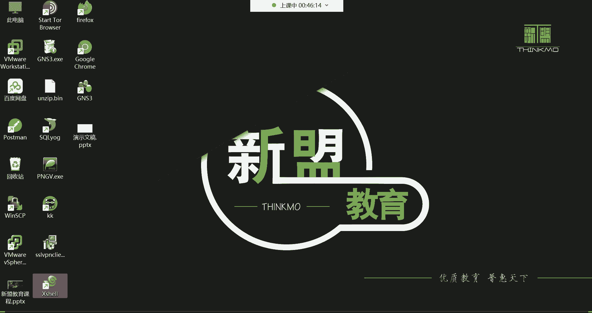
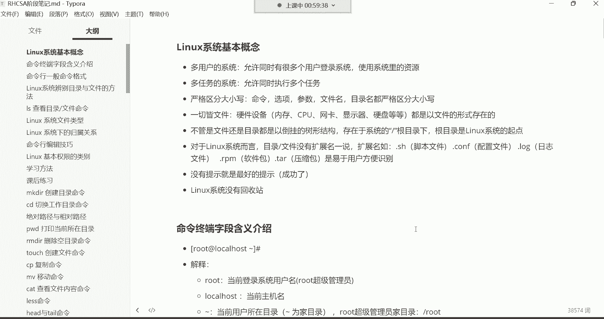
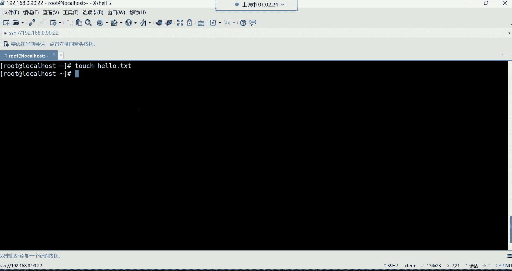

# 0基础小白怎么入门Linux运维？看这套，Linux运维全套培训课程，保姆级教学视频 - P4：红帽RHCSA-4.Linux系统基本概念、命令终端字段含义介绍、命令行格式介绍 - 小方脸不方- - BV138411B7p5

嗯能听到我这边声音的讨论区，刷个一上来开始我们今天下午的课程好，OK是吧，好都没有问题，那我们就开始讲课了哈，呃我看到有很多同学是新进班的是吧，好，那在这里面呢，还是啊欢迎你们这些这个新晋班的同学哈。

然后也都是从这个公开课，然后这个进的班是吧，然后也都知道我是谁，我呢也不给你们做这个啰嗦的自我介绍了哈，我相信我相信我们都已经很熟悉了是吧，有的同学已经甚至听了好几十节公开课，然后才进的这个系统班里面。

那我们就继续按照我们上周的课程进度，给大家讲解，然后你们这些新进班的同学哈，可能说嗯，没有一些这个什么学习资料之类的是吧，还有这个系统的安装工具之类的，这个我再给大家说一下哈。

就是咱们所有的学习中能够用到的。

比如说工具箱啊，软件包啊，嗯我都给你们发到这个群公告里边了啊，在群公告里面有一个VIP大礼包啊，我这个虚拟机装上了，用不上，用自己的身子，可以可以哈，可以可以，我们用渗透七哈，不用八。

因为八的话呢已经过期了，你学的话呢也没有用好，然后在这里面你们看到了吗，这有一个什么呀，这有一个我给你们VIP大礼包在这儿哈，就在第一个哈，在第一个公告，在第一个公告里面，这有一个VIP大礼包。

这里面有什么呢，这里面有我们学习这个LINUX系统的时候，我们会用到的一些，比如说这个虚拟机软件系统的镜像，还有这个系统的安装的教程等等等等，都在这里边，然后在这个大礼包里边哈，我给大家重新更新一下哈。

为什么要重新更新一下呢，因为有些东西其实我觉得就没有放，没有必要放在这个大礼包里面，啊circle circle什么呀，啊SKYG是吧啊SKYG没有哈，SKYG在这儿呢。

哈哈在这呢你们如果说也需要的话呢，没关系哈，到时候来私聊我，我私发给你好吧，因为毕竟这个软件有的人能够用得上，有的人用不上啊，但没关系啊，我也上传上去吧，啊我相信大家今后也肯定能用得到是吧。

嗯安是不可以吗，嗯安安利这个我没有听说过你这个东西啊，这里边有个VIP大礼包，看了吗，这里边有一个你看系统的一些，就是你看这个正好是我们这个本期30期，我讲过的呃，VIVR如何安装渗透S系统是吧。

还有虚拟机的网络配置，远程连接，然后这里面还附带一个什么呢，sent os7的一个系统形象，呃，但是呢有很多同学可能说是为了考认证，考认证的话呢，它会用到什么呀，啊红帽的八系统，那没关系啊。

对于红帽的八系统呢，咱们也有，但是呢你别去学习那个渗透OS8哈，因为渗透S8现在已经不维护了，所以你学的话呢也没有那个必要啊，你们到时候如果真的想练习的话，那你们可以练习那个六八啊。

我给你们找一找六八系统班学习工具啊，这里边有个sin啊，红色号看这有一个叫红帽的real吧，我把这个也给你们拿到这个哪呢，拿到这个我们的VIP大礼包里面，好吧好，拿过来了。

看看这里面有一个红包的RIO吧，然后呢还有一个这个我们在这个我不放，这就放这儿吧，哈这个放到这儿了哈，放到这儿，然后大家在安装系统的时候安装什么呢，呃还是正常安装，我们在教学当中用到的那个系统哈。

就是这个cent os7哈，然后这个位置我给大家说清楚了是吧，然后下边虚拟机软件啊，虚拟机的激活码，远程连接工具都在这里边放着呢，然后还有什么呢，还有这个像今后你们能够用得到。

你看这里面我包括Python入门到实战的这个内容，我都给你们放到这个上面，这个这个虽然说不是我们的哈，但是呢是我淘来的，看到了吗，啊这以前也有一个叫图灵程序的啊，从那儿给你们逃过来的，然后这是一本书啊。

这本书的话呢是而且是一个PDF版，这种PDF版对于你们来讲它的好处是什么呢，就是你可以放到手机里面啊，你可以放到手机里边，没事的时候呢，闲着无聊可以看一看啊。

如果后期你打算想往这个Python方向去学习，学习入门入门，是不是啊啊然后可以去看一看，还有像这个还有一个我给大家说一下哈，我们一会儿在讲课用到的这个笔记，我呢也给你们导成一个PDF版。

这个导成PDF版以后，那U好处就是你也可以放到手机里边的，因为我们这里边有这个什么呢，像你看比如说命令的，这都是基础的命令学习，所以这些东西都需要你去背啊，去记它，所以你肯定一次性记不住啊，是不是啊。

那没事的时候呢啊有了PDF，有了这个PDF版以后，放到手机里边，就跟看那个电子书一样，是不是啊，可以自己去阅读，自己去复习，OK吧啊到时候我再给你们导哈，我们在课后呢我再给你们导。

剩下的还有这里面有一个叫鸟哥的私房菜啊，这个鸟哥私房菜对于大家来讲呢，就是一个基础的啊，就是怎么说呢，那你们没事的时候可以看一看，因为他这个呃里边讲的内容，有的已经在企业当中淘汰了。

所以说呢如果你想了解了解啊，就是这个像早期啊，大家在学习这门这个LINUX相关运维技术的时候啊，都需要涉及到哪些技能啊，你们也没事可以看一看好吧，反正没有坏处，毕竟嘛我们说这个知识嘛，是不是啊。

他肯定是啊，你怎么学都没事啊，只要是你愿意学知识，不嫌多，技多不压身是吧，OK然后其他的话呢也就没什么了啊，这里面还有一个就是华为的网络课程，这个没有网络基础的，到时候自己去他们看前十集哈。

那我们这个在课程嗯，在这个前十集，当然这种是没有一点啊，就一点网络基础都没有的啊，这里面看录播综合文件看什么，看123456789十，看前十节课就可以了啊，主要是了解一些什么呢。

就是我们这个网络相关的一些呃概念啊，以及这种知识，比如说什么IP地址，OSI的网络模型等等等等哈，传输协议这些你得了解OK吧，然后到时候大家有时间再去看一看行了，这就是VIP大礼包啊。

其实也没有什么是不是啊，但是呢不能说没有什么是现在啊，你们用不到。

等后期呢你们才能用得到啊，内容还是非常非常宝贵的，好了，因为你想想很多东西都是需要经过什么呢，经过这个海淘啊，才能给它收集过来，然后呢，而你们呢也不知道去哪儿去淘，也没有这个渠道是不是。

所以到时候我是逃过了就给你们啊，就直接发给你们了，好那接下来呢咱们就正式开始我们课程哈，我们这个课程该讲这个命令的学习了。

先把这个我们上节课安装好的这个系统，给它安装上，我们那个机器是这个机器啊，37的，那这个呢如果说我们这个虚拟机啊，你不想要了，右机点击一下哈，点击完了以后呢，右击这儿有个管理啊，管理以后呢。

这里面有叫从磁盘中删除，这就是把这个虚拟机给它，从你的电脑当中给它删掉了，看到了吗，就是你不想要的话，直接给它删掉，OK好那接下来呢我们把这个机器啊开机。

我们上次系统也安装好了，然后呢也能够远程的登录了，那点击进去回车啊开机。

然后我们打开XCEL，我们要远程去连接它。

然后连上去我们是IP是多少来着啊。

忘了九零是吧，你看看看看能看到是吧。

你看九零，那接下来呢咱们就直接连九零。

OK还没开机呢啊，开机这么慢啊。

已经开机了，连到这个九零，OK然后输入账号root回车密码，我们上次设置的密码是一是吧，好那密码一回车，OK连上了好，那连连上来以后呢，我要上来。

我就先来给大家讲一个什么呀，这个命令行的编辑技巧里面有一个叫做CTRL啊，在哪儿呢，在这儿哈，CTRLL或者说clear。

那就把这个我们先给他讲一下。

因为什么呢，因为我们通过这种远程工具连上来以后，你们有没有发现，我们当前这个就是命令提示符是吧，这个呃他现在是属于一个什么状态呢，那好像有点偏下偏下哈，而且上面这些东西呢，其实对于我们来讲没什么意义。

没什么意义哈，那怎么办呢，我要给他清屏，怎么清呢，看CTRL加L先按住CTRL键，然后再按L，注意啊，不是说按加号，是按住CTRL的时候再按个L好，你看这个屏幕就变得干净了是吧。

那还有一个是通过命令去倾听，叫clear，clear的话，那也一样，你比如说我嗯，你看我这样啪啪啪啪是吧，我现在想清平，那我想清平的话呢，我输入clear回车好，那也可以清屏。

反正呢你觉得哪个用起来比较习惯，你就用哪个啊，反正都是功能都一样，清屏哈，注意哈，这个记住哈，清屏以后呢，我在比如说你们看我的屏幕特别乱的时候，我就会这样诶，就清屏了，就CTRL加L就清屏了。

因为特别乱的时候，你们也不好看，因为这中段一直在最下边，是不是啊，所以咱们就CTRLL清屏，OK啊。

这我们就是用到哪呢，咱们讲到哪儿，然后接下来呢给大家我们上节课，这些基本概念讲了吗，没有讲吧，上节课就是把这个系统给它安装好了是吧，然后像基本概念，还有像这个命令行的终端。

我们呢并没有给大家解释啊，那接下来呢咱们解释解释哈。

首先呢对于这个入门的必备概念，我们先说说这个系统呢是一个多用户的系统，那多用户是什么意思呢，就是允许同时有很多个用户登录系统，来使用系统里的资源啊，这个你你登不上去，我看一下哈啊，192。168。12。

1，那你的IP地址可能发生变化了，课后在课课后再说哈，然后呢我们来看哈多用户的系统，这个怎么去理解。

就是在这同一个系统里边，是允许有很多个用户去登录的，注意啊，是很多个用户登录这同一台机器啊，这叫多用户的系统，你像早期LINUX这个系统啊，那以前在这个企业里边，那都是一台服务器，然后呢有什么呀啊。

有不同的这个接口，每个接口呢可以让用户去插一个键盘，哈哈啊，就那种USB的键盘接口哈，哎每个接口可以让用户插一个键盘，这是早期的计算机了哈，然后呢插键盘干嘛呀，插键盘。

就是可以让不同的用户登录这一台机器啊，每个人呢啊去使用自己的账号登录这个机器，然后呢对于这个系统做一些操作啊，这是最早期的时候了，哈哈OK好，那这就代表说是一个多用户的系统，那允许有多少个用户呢。

允许有在这个系统里面，是允许有6万5535个用户的啊，这个你们了解一下就行哈，啊允许有这么多个用户存在，但是我们不可能去建这么多账号的，没有那个需求哈，没有那个需求好。

然后我们再来说第二个叫多任务的系统，允许同时执行多个任务，这个怎么去理解呢，多任务拿windows来说吧。

啊就像我们平时在windows这个系统里面干嘛呀，我一边听歌，一边看电影，一边比如说这个娱乐啊，什么这个打游戏之类的哈，聊天等等等等等等哈，那同时呢执行了很多个程序，这就所谓的多任务啊，是不是一个端口。

一个用户还是一个接口啊，一个用户好，那多多任务的话，那就是在这一个系统当中同时执行多个程序啊。

后期我们在学习这个系统的时候，在企业里边都是干嘛呀，都是可以跑网站，跑数据库，跑监控啊，在这一台机器里面同时去运行这个程序，也是没有任何问题的啊。

这叫做多任务的系统，然后严格区分大小写，这个严格区分大小写比较好理解，就是我们在这个系统里面。

比如说我们建了一个文件，建了一个小写的A，我再建一个文件，大写的A好，那这就是两个文件，看到了吗啊，一个小写的A，一个大写的A啊，严格区分大小写，以及我们后期学习命令的时候也是哈，小写的就是小写的。

大写的就是大写的，你看到了吗，哎这小写跟大写他不一样是吧，你敲大写的时候，他就提示了说未找到命令啊，要严格区分大小写，也就是说我们在学习命令的时候，我在笔记里面给你们记录的是小写的。

那你就得去小写去干嘛，去执行的，你不能通过大写去执行啊，严格区分大小写，然后像我们后期学习的命令命令里的选项，命令当中的参数，还有在这个系统当中的文件目录，都是严格区分大小写的。

我一会再给大家详细讲讲什么叫目录，好吧好，然后下面这个概念叫一切皆文件，这个怎么去解释一切接文件呢这个概念哈，就是硬件设备呢硬件设备你像内存条，还有这个CPU，还有网卡，显卡鼠标键盘，硬盘风扇等等等等。

是我们计算机里的一堆硬件是吧啊，一堆硬件，那这一堆硬件呢，他们也都是以文件的形式存，在于这个系统当中的，以文件的形式存在，也也就是说后期，比如说我想看我系统里边的内存信息的时候，你就得看内存的相关文件。

我想看我的CPU信息，我就得看CPU相关的文件，想看我的网卡信息，就得看网卡的相关的文件，所以这就叫做一切皆文件，那下边这个概念不管是文件还是目录，都是以倒挂的树形结构，存在于系统的根目录下边，然后呢。

根目录又有人称之为是LINUX系统的一个起点，我们先说说这个右斜线啊，为什么要叫做根目录，正常来讲啊，你说大树它是怎么长的，大树是根儿在下边，然后呢往上涨是吧，而这个系统的结构呢是这个样子的，看到了吗。

是根在上边，然后呢下边呢是它一个一个的小分叉，然后每个小分叉呢就是一个什么呀，目录啊，这个目录就是windows里的文件夹，我们稍后再说好吧，然后呢在这个系统里面，所有的数据都存在于这个根目录的下边。

就像大树的根一样啊，如果你把根拔了，那是不是连根带叶的就全都没了呀，是不是啊，所以说这个系统也一样，如果你有一天把这个根目录给删了，那你系统里的所有数据也全都跟着，他就一起走了，好这就是根目录的概念。

所以呢我们以后在学习这个系统，比如我用任何一个账号登录系统的话，我都会进到这个系统当中的根目录，下边的某一个目录里面去啊，这样我们管理这个系统啊，你得需要进到某一个目录里面才能去管理它，没错吧啊。

所以说我们首次登录系统，就会进入到根目录下面的某一个目录啊，哪一个呢，我们一会儿再说，OK这是根目录的这个概念，其实这就是这个系统一个大体的结构，就像一个大树的分叉一样跟在上边。

然后呢下面一个一个的目录啊，我们就称之为叫子目录好，然后我们再来看这个下面这个概念，对于这个LINUX系统而言，目录跟文件没有扩展名一说啊，我们先说什么叫扩展名哈。

在windows里面的扩展名的话，你看我新建一个文件的话呢，这个文件呢它有一个点TXT作为结尾是吧，那这个点TXT作为结尾，其实就是这个文件的扩展名，这个扩展名是用来标记什么呢，标记它的类型的。

你看你点进去看到了吗，有个类型看到下面是不是有个类型，类型是什么呢，哎这个类型是文本文档，没事吧，然后你再把鼠标放到这儿，你看它的类型是什么呀，唉它的类型是PDF，那叫PDF哈，OK然后你像这些啊。

这些的话你可能看不出来是吧，看不出来它的类型，因为它是你看叫快捷方式，看到了百度网盘的快捷方式，OK那像这些都是windows，去认识这个文件的一个什么呢，一个唯一的一种方式吧。

你比如说我在建这个文件的时候，并不是说是windows这个系统，他帮我把这个文件给创建出来的，不是哈，而是什么呢，而是windows调用这个记事本，记事本帮我把这个文件给它创建出来了。

那以后我再想打开这个文件，我一双击好。

那windows呢他一看啊，这个文件好是点TXT作为结尾的，那这时候呢windows就会调用这个记事本，这个程序帮我去打开这个文件，能理解吧，那他windows怎么知道会调用记事本呢。

是因为他看到了这个文件的扩展名是TT结尾的，所以他就知道啊，TT结尾的是记事本创建的文件，我用记事本再去打开它。

那如果我现在把这个文件的扩展名，给你们一删的话，哈哈删除掉啊，然后你看系统就直接问我了，说如果你要改变文件的扩展名，可能会导致文件不可用，确定要更改吗，我选择是的话，那你看这个文件我在双击。

你发现windows就不认识了，windows为什么不认识这个文件了呢，因为他没有看到这个文件的扩展名，所以windows不知道用哪个程序去打开它，所以这时候他让我们自己说，你要如何打开这个文件。

那时我们得自己选择了，看到这，如果是我自己手动选择记事本，那我就用记事本打开它啊，是这么回事，所以说你看windows是不是严格区分扩展名，如果这个文件没有扩展名的话。

那你说对于windows来讲是不是就无法去识别它呀，你就用不了这个文件，说白了好，但是对于这个LINUX这个系统而言呢。

这句话我相信大家现在也应该能够理解了是吧，没有扩展名一说，就是他这个文件有没有扩展名，LINUX都能识别它，都能识别它，所以今后呢大家在学习这个系统的时候。

不要去纠结，因为我们在学习这个系统的时候，我给你们打开一个目录哈，啊那这时候你们看就是这些那文件的话，你发现它后面都没有这个扩展名，没错吧，你看像这种文件，你看他后面有扩展名吗，没有都没有扩展名是吧。

我跟你讲，如果这些文件拿到windows里面，windows是不认识他的，这不认识啊，因为他没有看到它的扩展名啊，他就不认识啊，不知道用哪个程序去打开的能力了吧，但是有的时候我们又能够看到这个系统当中。

还有一些文件是以这种什么点康复结尾的，没错吧啊还有一些什么点CFG结尾的。

还有像后期随着不断的学习，我们还会学习一种点SH结尾的文件，还有呢这种嗯这个点康复结尾的点，log结尾的点RPM结尾的点ta结尾的，那这些文件为什么会有这些扩展名呢，注意啊。

这些扩展名是给我们用户自己去识别的，就是我们在学习这个系统的时候，系统对于这个文件来讲有没有扩展名，他认识的啊，他认识这个文件可以正常去调用它，但是我们有的时候在系统当中，如果说发现这个文件。

就是比如说他这个压缩包，那个压缩包的话呢，去告诉你，说我是一个压缩包的话，你根本就没有办法去辨别这到底是不是压缩包。

能列吧，它不像windows windows什么呀。

windows里边你说你建一个压缩包，你比如说我要对它进行一个压缩右击，那windows的特点就是给你来一个小图标，是不是啊，你看这小图标你就知道了啊，这是一个压缩包啊，点zip结尾的是不是压缩文件。

但是你看我们学习这个系统，你发现没有那个图标，为什么都是文件，这里面都是文件哈，没有所谓的那个图标，让你去用鼠标去双击，或者说给你来个小图标，让你一看就知道他是一个什么类型的文件，没有呃。

所以说哎我们后期在学习的时候，看到系统有些文件带扩展名的话，你像点ISH的就是事有脚本，点cf结尾的就是服务的配置文件，点log结尾的呢就是这种啊相关的日志文件，点rpm结尾的就是软件包。

tar结尾的就是压缩包等等等等，随着不断的学习呢，我们还会接触到很多的扩展名啊，那还有最典型的应该大家都知道了，什么点mp4的，是不是啊，这是什么视频啊，点mp3的音频，点JPG的，或者说点PNG的。

这些都是图片，还有这种点GIF的动图之类的，是点TIT的普通的文件等等等等吧，你想想这些东西啊，在windows里边啊，它就是区分这个文件类型的，唉，还有这种点P2P的啊，点PY的啊。

Python的脚本，还有这点C的C语言的文件，点JSP的java的文件等等等等哈，这就非常的多了，OK后后期得是在不断的学习的时候呢，我们会接触到这些哈，我会再告诉你们啊，这个比什么点P2P结尾的。

点PY结尾的，点JSP结尾的分别代表是什么类型的文件啊，现在你先知道一下，这所有的扩展名，都是方便我们用户去识别这个文件的类型的，OK好还有这个下面这个特点叫没有提示。

就是最好的提示，这句话是什么意思呢，就是我们在学习这个系统的时候啊，我们一般90%都是通过命令，去管理这个系统，那你比如说我在这个系统里面，我建了个文件叫hello，点TIT啊。

那这个文件有没有创建成功呢，首先它不像windows似的啊。

你创建一个文件，他给你生成一个这种小图标，让你一看啊，这是一个文件是吧。

首先呢没有图标哈，没有图标，那这文件而且创建成功以后，他也不告诉你，这个文件创建成功，他不会告诉你的，没有一些返回的信息，那没有返回信息，你说我们怎么辨别，这个文件到底有没有创建成功啊。

一般就命令啊，大多数命令有一个特点，这个系统什么特点呢，就是它没有提示你命令执行以后，他没有提示，但是呢没有提示，通常就是最好的提示，什么叫的提示呢，就是你的命令呢执行成功了，能理解吧。

所以说这个呢你们以后在学习的时候，你执行一条命令，你发现哎命令执行完以后没有任何的反馈信息，大多数都是成功了，如果是报错的话，他就直接告诉你了，OK然后下面这个概念LINUX系统没有回收站啊。

没有回收站这个概念就变得非常重要了啊。

为什么非常重要呢，在windows里边，比如说我们对一些文件不小心删除了。

比如这两个我右击不小心给他删除了，但是呢我又后悔了啊，这两个文件呢可能说对于我来讲呢，还呃还挺重要的。

那怎么办呢，回收站里边是不是可以给他恢复回来呀，没错吧，从回收站里面呢，你可以还原，这其实就是一个什么呢，给你准备的一个后悔药，但是你别太大的文件啊，你说好几个G的文件，那回收站也装不下。

但你像一个文件来讲，你比如说这个几十甚至是几兆的文件，他都能够放到回收站里面，看到了吗，你看这些都是我曾经删过的，哎呦，那你说这这这这这这我删除了这么多的东西，如果我后悔了。

我说都可以从我的回收站里面去，把这个东西给它干嘛，给它还原呢是吧。

右击还原，你看又回来了，没事吧，这不就回收站吗，给你一个后摇，但是我告诉你哈，这个LINUX这个系统压根他就没有这个回收站一说。

比如说我不小心在这个系统里面啊，我把这个文件给删了啊，把A啊，还有A还有hello，点TT不小心给删了啊，没了吧，你看原先还能看到这两个文件夹，这个文件是吧，但是现在你看不到了，只有这一个文件了。

被我给删了，删了以后我后悔了啊，这个文件我可能说我还能用得到，这里面还有一些数据是我所需要的，怎么办，没了就是没了，所以你像我们嗯，以前在企业里面做一些删除的时候，都非常的小心谨慎啊。

因为真的是没有办法恢复，哼，如果能够轻松恢复的话，这个行业里面也不会就是有一个非常调侃的话，什么话，那叫山库跑路，知道什么叫删库跑路吗，头段时间那个没看那个京东发布了一个新闻吗，什么新闻呢。

就是京东的一个程序员嗯，是这个把这个什么呢，把项目的一些这个数据给删了，然后跑路了，跑路以后呢被京东给起诉了，然后抓回来了，抓回来以后赔了好几万块钱，然后拘留十个月，而且这就属于山库跑路，为什么呢。

因为这个删了以后，这个数据恢复不会来能理解吧，对公司来讲是一笔非常大的损失啊，所以说像这个系统它就没有回收站啊。

没有回收站啊，OK行了。

那这些概念都是大家在入门的时候，你需要掌握的一些基本概念，当然我这说是在入门的时候，你得了解这个系统的特点，咱们既然是学习这个系统，那最起码入门的时候，这个系统它的风格，它的特点是什么。

这个我们得知道是不是啊啊你不能说上去，咱们就来吧，学命令吧啊这不行啊不行啊，理论呢虽然说啊没有实操过瘾，但是呢他却非常的重要好，那下边呢咱们就来给大家讲讲这个命令终端，字段含义的介绍。

命令终端，什么叫命令终端啊，我告诉你这个就叫做命令的终端啊。

就是我们现在所看到的这个左侧这个哈，我们我刚刚一直在这敲命令的这个地方，就叫做命令终端嗯，留后门是吗，这个命令终端哈是让我们去敲命令的地方，然后我现在我再给大家补充一个概念，什么概念呢。

就是对于这个LINUX这个系统而言，鼠标呢几乎没什么太大的用处，如果我要是不给你们教学的话，我在管理这个系统的时候，其实我几乎用不到鼠标，真的我所有的操作都是通过什么呀，通过键盘去敲命令去管理这些系统。

而鼠标真就是一个摆设而已，它不像windows，那windows没有鼠标的话，你发现那个windows系统就是个摆设是吧，因为你用什么得鼠标点点点的，而这个系统呢啊几乎用不到这个鼠标好。

那接下来呢咱们说说这个命令，终端字段的含义介绍，那接下来呢我们说一些说现在这个中括号，注意哈，没有什么实际的作用，它就是为了美观而已啊，没有什么任何的实际作用哈，但是在这个中括号里边。

从左往右说左侧这个ROOT，这是root是吧，这root是什么呢，就是我们当前登录系统的用户名，你用谁登录的这个位置就是显示谁的名字，那我们上节课安装好系统的时候，我们是不是还创建了一个账号啊。

我们再用注意啊，我们现在在用另外一个账号登录这个系统，输入IP回车，那个账号的名字如果我没记错，我们创建的时候应该是叫test是吧，对test，然后确定密码确定啊，CTRLCTRL清屏O啊，看到了吗。

我们现在是不是登录到这个使用test的这个账号，也成功登录系统了呀，唉两个账号都在登录同一台机器好，那这时候呢你们再看左边这个终端啊，我们这个左边是左边这个叫命令终端啊，右边这个呢也叫命令终端。

所以说呢啊，都是让你敲命令的一个地方叫命令终端，那你看这个我们这个终端显示的是root，这个终端呢显示的是test，没错吧，那也就是说你当前用谁登录的，它就显示谁的名字，所以这就叫当前登录的系统用户名。

那root是谁呢，root呢我们前面简单给大家介绍过，是系统里的超级管理员呃，超级管理员特点是什么呀，就是系统里面权限最大的一个账号，那它的权限大到什么地步呢，其实就是只有超级管理员才能够去做那个。

什么操作呢，叫删库跑路的操作，哈哈你们后后边也会这个，或者说你们嗯已经对这个这个LINUX啊，比如说自己已经那个了解了一段时间了，那这时候呢你可能会经常看别人说，一条命令叫RM rf啊，斜线星啊。

这条命令呢也只有root超级管理员才可以使用，这条命令，这条命令是干什么用的呢，就是删库跑路的命令，能理解吧，这条命令是直接能够把整个系统给删掉的，系统都没了啊，就把根都给删了。

所以这就是叫超级管理员系，是系统里面权限最大的一个账号，啊对跟下面所有目录哈啊山库跑路什么后果哈，山库跑路什么后果，就是别千万别被抓到哈，千万千万别被抓到呃，不被抓到的，你可以一直跑，但一旦被抓到的话。

那你可能你的后果就非常严重啊，从入门到入狱啊，这就有些得不偿失是吧好然后普通用户呢，那注意啊，只要是不叫root的这个账号，它不叫root的，这些呢你都可以把它统称为叫，什么叫普通用户呃。

普通用户的特点就是权限比较小一些，你想超级管理员吗，系统里面权限最大的一个账号，普通用户呢肯定是没有超级管理员的权限大啊，所以它的特点就是权限不同好，这是普通用户，然后接下来呢我们再来说这个艾特符。

at符的话呢，这是一个分隔符，它分隔的什么呢，分隔的这个当前的用户名跟当前的主机的名字，那后面这个local host就是你当前这个机器的名字啊，在这local host叫当前主机名。

那这个主机名的话呢，我们后期是可以改的哈，因为后期咱们呃在学随着不断的学习，你比如说我们用到很多机器的话，一般呢比如我非常多的机器，我需要去对它进行一个管理啊，那这个时候呢你想想我们一般怎么去一眼。

就知道这个机器是提供什么业务的呀，或者这个机器里面跑的是哪些业务啊，比如说这个机器呢我是用来运行网站的，这个机器呢我是用来运行数据库的，那么一般就取个贱名之一的名字啊。

跟网站相关的名字或者跟数据库相关的名字，如果我们刚安装完系统的话，那默认的名字就叫做local host啊，代表是本地主机的意思，能列吧啊，本地主机好，那我们再来说这个波浪线啊，这个波浪线是什么意思呢。

波浪线叫当前用户的所在目录啊，这个所在目录这个波浪线代表的是家目录，注意波浪线代表的是加，也就是说只有这个用户在自己家的时候，这个位置采用波浪号来表示，那我们先说什么叫做加目录吧，这个家目录啊。

就是像我们每个人的自己的家一样，而是你自己私有的，别人不能随便进出的一个地方，别人也不能随便跑到你的家里面去，拿你们家的东西，是不是啊，这不就是家吗，你想想这个系统当中啊，你看我们会创建不同的账号是吧。

那这个系统呢它也这个风格啊，就有点类似于我们的生活当中就是一样，系统当中的这个账号也都有一个自己的家，只不过这个家呢，是以一个文件夹的形式存在的啊，但是这个文件夹我们叫目录啊，不同的系统名字不太一样。

我们叫目录啊，其实这个目录就是windows里的文件夹，用来存储数据的，之所以说呢，每个账号在这个系统当中，都会有一个属于自己的目录啊，这个我们就叫做用户的家目录，然后他在自己家的时候呢。

他呃对于自己家目录的东西，是都属于他自己私有的，别人也不能随便跑到他的家目录里面，比如说我去这些创建文件的删除文件呢，这些都是不允许的，能理解吧，比如现在有两个目录啊，其实这不就是两个文件夹嘛是吧。

比如左边这个是谁呢，左边这个是张三的嗯，右边的这个是李四的，张三呢啊他不能跑到李四的家里边去，比如说我创建个文件或者说删除个文件，这是不行的，而李四也不能跑到张三的家里边去，创建文件或者说删除文件。

修改文件，这些都不允许啊，因为是他自己私有的哈一个场所，这就叫做家目录，然后通常用户在自己家的时候，拨浪号啊，就代表在家里边随便浪，因为你就是在家里面权限最大嘛，OK然后你看test也一样。

它的这个位置是不是也是波浪号来表示啊，那其实也就是说明这个用户，他首次登录系统的时候，就在自己的家里边啊，首次登录系统都会进到自己的家目录，那后期如果说他要切换目录的话，比如我要进到OPT目录。

你看那这个位置就是显示OPT的名字，知道吧，我们稍后会给大家介绍这个各种目录结构的话，你先不用管，包括命令，你现在也不要纠结，我们后面都会学啊，我只是为了给你们演示一下好。

那现在你看他进到了这个OPT目录，他这位置是就不是用拨浪号来表示的吧，那如果他再进到别的目录呢，那你看这个位置是吧，我进到etc，那这位置就显示etc，那如果回家的话呢。

那就是波浪号了诶啊所以这位置表什么呀，是不是就是当前用户的所在目录，如果是波浪号才是自己的家啊，如果不是波浪号呢，就是当前所在的目录的名字，OK然后我们再来说这个超级管理员，他的家目录在哪啊。

我在这里面呢给大家是画的这个目录结构啊，还是非常非常重要的啊，那首先超级管理员的加制，在根目录下边有一个同名的目录，看超级管理员叫root，是不是啊，那root在这个系统当中也有一个自己的家目录。

那也叫root，注意这个目录的名字跟用户名同名，跟用户名同名哈，OK然后这就是超级管理员的家，在这我写了啊，root超级管理员的加目录就是根下的root好，那普通用户也有自己的家。

你比如说这个test test呢，它是作为一个系统当中的普通账号，那普通账号他也在自己家里面的时候，那他的家在哪儿啊，啊普通用户的家目录在根下的home下边。

跟用户名同名，那也就是说在这个位置在这个图里边看，在根下面有非常多的什么呢，我们叫子目录啊，一个一个小分叉，每个分叉就是一个目录，那其中有一个目录就叫做home目录。

然后呢在后面目录下边就是那些普通用户的，是大多数普通用户的家目录都在这儿，在这个下边就还有一个叫做test，这还有一个目录的名字叫做test，那这个test这个目录就是作为谁呢。

就是作为系统当中的这个啊test账号，他的家啊，稍后我们学习命令的时候，我会带领大家看啊。

会带着你们看哈，你先知道一下，就是它大体的结构，反正呢所有的数据都在根目录下面存着呢，你甭管是超级管理员的加目录，还是普通用户的家目录啊，都在根目录里边儿，OK好。

那接下来呢我们再来给大家讲最后一个结尾啊。

你们可以看到哈，在结尾的时候，这个root作为系统里的超级管理员，他的命令提示符的结尾是井号，结尾是吧啊，那是井号，就代表当前的身份是超级管理员的身份，我们再看右边这个test呢，它作为一个普通的账号。

你看它的结尾符可不是井号是什么呀，是刀乐福啊，美刀，而这个美刀的话呢，就代表当前用户的身份是普通用户，所以以上你看这一个命令终端啊，我给你们解释起来，你发现哎呦，这里边还确实是有非常多的含义在里边。

是不是类似可以tb补全吗，可以补全，OK行了，那了解了命令终端制造的含义，解释了，那下边呢嗯看看再总结一下当前登录的用户名，当前主机名，当前用户所在的目录的名字，当前用户的身份井号是超级管理员。

然后每刀呢啊dollar符代表是普通用户，普通用户的权限呢就是非常的小。

超级管理员的权限呢就是非常的大O好，那了解了这个命令提示符了，接下来咱们开始学习命令嗯，那学习命令的话呢。

我们先给大家讲讲命令行的一般格式。

命令行的一般格式。

然后呢在讲格式的时候呢，我们要拿一条命令来给大家做演示。

行就这样吧，哈这样我是为了让你们能够看得更加清晰一些，咱们先来看命令行的一般格式啊，什么意思呢，就是我想敲命令了，那这个命令怎么敲，因为这个命令不是说你想怎么敲就怎么敲的，这个是有一个什么呢。

具体的格式的，你比如说我这样敲没有问题，是不是啊啊那我在什么呢，我再这样敲可以吗，你看不行，是不是啊，那接下来呢咱们说说命令行一般格式，首先呢是这个命令字，这个命令字代表什么意思呢，代表是命令的本身。

那命令是什么呀，命令就是帮我们实现功能的这个指令，你比如说我想建个文件，我想拷贝个文件，那这个时候我想给文件改个名儿，那这些都得通过命令来实现啊，比如说往我要往这个系统里面，安装一些软件包啊。

都得通过命令来实现，所以什么叫命令啊，命令就是帮我们实现功能的指令，那在这个系统当中，命令有多少条呢，这个没有人详细的计算过，因为命令太多了啊，粗略的统计过啊，就是在很多年以前哈，粗略的统计过啊。

大约是3000多条吧，3000多条命令，呃可能很多人一听哈，那这么多命令怎么学呀，呵呵是不是啊，没关系啊，呃大家现在是属于一个入门阶段，所以入门阶段呢就学入门阶段，应该掌握的命令就可以啊，别晕啊。

因为很多的时候呢，这个命令啊，都是在不同的阶段拥有不同的场景嘛，所以你在入门阶段咱们就掌握一些入门的时候，我们应该学习的命令就行了，所以大家不要担心入门的时候呢，几十条这几十条命令啊，你一天记一条。

我相信啊，这个一个月下来，你也把这些命令都给他记住了啊，不用你多记一天，就记一条就行啊，所以长此以往下来呢，这个命令自然二啊，就都给他记住了，用多了，其实你形成这个记录记忆的话呢，啊自然而然也记住了啊。

这是命令，然后我们再来说这个选项，选项的话呢是什么呢，这个选项是用来调整命令的功能的啊，我们先说LS这条命令，它帮我们实现的功能，用于查看目录下的内容，及目录和文件的详细属性，好这条命令啊。

来看前面这个功能哈，嗯用于查看目录下的内容，那接下来我敲一个S的话，注意哈，你看哈这个命令我敲我一回车，它就执行了，注意啊，我想你看我敲S，我想让这条命令去执行的话，我拍个回车，他就执行了。

好执行了以后，他帮我干什么事情了呢，叫用于查看目录下的内容了。

其实这波操作有点像windows里的哪个操作呢，就是我双击打开了一个文件夹，你看我现在呢在这儿给你们新建一个文件夹，那我在windows里面我想看这个文件夹里的数据。

我双击打开，没错吧。

啊打开了文件夹啊，但是呢在LINUX里面咱们说他鼠标就是个摆设呀，没有地方让你去双击，那我现在我想在windows里面，我想打开一个文件夹，怎么打开呀，IOS干的事。

就是我刚刚的那个对文件夹的双击的那个事儿，能理解吧哈哈所以由此可见，阿拉斯这条命令的重要性，就类似于windows里的双击的重要性了，可能是我们平时感觉不到诶，这windows里的双击有那么重要吗。

我磕死你，如果对于windows系统你不能双击的话，你发现你这个系统好像没有太大的功能。

为什么呀，你比如我想用浏览器访问一个网站，你发现诶这鼠标不能双击了，没有双击功能了，我怎么运行的呀，是不是哎你发现这双击非常的重要。

所以说LS就类似于windows里的那个双击，来帮你去查看一个目录下的内容啊，那我一敲他就打开了目录了，但是打开哪个目录了呢，这时候我们感觉诶打开哪个目录了呢，啊这个主要看什么呢，主要看你当前在哪。

看你当前在哪哈，如果你当前在自己的家里边，我一敲S，那它打开的就是我家目录下载内容能列了吧，啊是这么回事，那你看阿拉斯，不就是帮我们实现功能的这个指令了吗，OK那接下来我们说这选项是什么意思啊。

这选项调整命令的功能的是吧，怎么调整啊，怎么调整呢，比如说我现在我想看这个文件的详细信息，注意哈，我想看文件的详细属性信息了，什么叫详细属性啊。

那在windows里边我们说详细属性，比如说啊我们建一个文件哈，现在新建一个，啊就拿它来说吧，右击啊，我要看它的详细属性，那这个就是它的一个详细属性，有哪些详细属性呢。

啊在这里面呢我们来看一眼有哪些呢，嗯能看清是吧，首先呢它的类型啊，类型是一个什么呢，啊PPT的类型，然后呢打开方式啊，用这个什么呢，呃用这个程序去打开的，然后在我电脑的哪个位置啊，在我的桌面。

然后这个文件的大小是多大的，占用我的磁盘空间是多少，没错吧，什么时候创建的，什么时候被修改过，什么时候被访问过，以及在安全里边你还可以看到什么呀，这个文件属于哪一个组，属于哪一个用户啊。

这带两个小人儿的就代表是组啊，就这个文件属于这个组，然后呢这一个小儿子就代表着一个用户啊，那这个文件是属于哪一个用户的，什么意思呢，叫做归属关系啊，就一样了，就是所有者和所属组，所有者是什么意思呢。

就是这个文件的拥有者是谁啊，那这个呢其实就是他的所属组了，就是这个文件属于哪一个组能列吧，好，那你看那对于这个你比如说啊这个所有者，他的权限是一个什么样的权限，看到了吗。

以及这个组对于这个文件是一个什么样的权限。

这都是它的什么呀，叫详细的属性，哼这都是详细属性，可能大家平时也没有太关注，是不是啊。

这都是都叫做详细的属性好，那现在那现在，我们来说一说，那现在我要干嘛呀，我要看这个文件的详细属性，我怎么看呢，那阿拉斯也可以帮我们，去看一个文件的详细属性，那这个时候注意哈，什么叫做选项。

选项就是调整这个命令的功能的，怎么调整呢，那这时候这一个命令啊，不是说只能帮你完成一种功能，有的命令呢它功能非常强大，唉可以帮你实现不同的功能，但是呢我想实现不同的功能的话，我怎么办呢。

这时候你就不能光使用命令本身了，就不能光使用命令本身了哈，啊就得加他的选项，你比如说啊其中有一个杠L这个选项，这个选项的功能是什么呢，你看叫以长格式的形式，显示目录下的内容及详细属性。

这时候你先甭管什么长长格式，它就是显示目录下内容的详细属性的，你就直接LS注意哈，这时候你刚开始在入门的时候注意啊，如果命令后边我们加这个选项的话，那你命令跟选项之间这个位置要保留什么呢。

要至少保留一个空格作为分隔符，看到了吗，这个位置我是敲了一个空格了，那如果敲俩空格可以吗，可以发空格，那也行，但是至少要保留一个空格，然后再加一个选项杠嗯，杠主要是显示目录下的内容的详细属性。

这时候我再回车啊，这时候我再回车，你们再看哈，跟前边我只执行LS这条命令，它显示出来的信息也不太一样了，怎么不太一样呢，你看名字呢还是这个名字啊，文件名呢没变好，但是呢你发现我加了杠这个选项之后呢。

这左边呢就有一堆什么呢信息，这个信息就是这个文件的详细属性信息，看到了吗，这详细属性我们稍后再解读它好吧，那接下来我们再来说什么叫选项啊，你们现在能够感受到选项了吗，调整命令的功能的啊，就是所谓的选项。

但这个选项呢又分为短选项跟这个长选项啊，我们先说这个短选项，我刚刚使用的这个杠L啊，它就是短选项，短选项的特点就是前面一个小横杠，一个小横杠，后面呢单个字符，单个字符哈，那常选项特点是什么呢。

这个长选项它的特点通常是前边两个小横杠，后边跟一个单词能理解吧，哎对前面两个小横杠啊，所以这种属于叫长选项好，那短选项呢可以合并到一起去使用，什么意思呢啊合并到一起去使用，就是有的时候啊。

你看啊我们想实现的功能比较多一些啊，比如说我们有了杠以后，可以显示这个文件的详细信息了是吧，但是呢这个详细信息对于我来讲，感觉还不是什么呢，还不是我所理想的这个响应信息，怎么不是理想的呢。

我先给你们简单介绍一下啊，你看这个还是那个文件名字是吧，没变，然后你看这叫三月六号16。24分，这个属于什么呢，这属于这个文件的修改时间啊，这个文件就在这个时间被修改过，被修改过啊。

所以呢啊这个叫最后一次的修改时间好，那左边这个是什么呀，左边这个是文件的大小，这个大小，那你说这个1516这个大小，我们怎么去理解呀，注意哈字节自己或者说字符就1516，1516个字符，那什么叫字符啊。

我前面在讲选项的时候，我就跟你们讲什么叫单个字符是吧，嗯L是一个字符，A是个字符啊，这些都属于字符哈，嗯字符，那这里面有1000多个字符，但是对于我们来讲，我们可不太习惯啊。

说啊通过字符去判断文件的大小很少吧，我们习惯用什么呀，比如说这个文件多少K，这个文件多少兆，这文件多少G是不是啊，K照记的方式去比喻这个文件的大小，那如果我们遇到一个大文件的话，比如这文件特别特别大。

你说我们怎么可能去通过自己，去判断这个文件的大小啊，我给你们找一个文件啊，LS杠，我后面再跟上一个文件名哈，你看来看这个文件，这个文件大小多大呢，这个文件多少个字节，你们自己数一数吧，个十百千万。

10万67万个字符已经非常大了吧，这文件，咱们这个系统里面已经非常大了啊，67万个字符懵逼了，那换算成这个，比如说我们比较容易理解到这些单位什么K啊，造啊G啊，那这到底怎么去换算呢，你得这样换算啊。

就是1024个字节等于1K，然后呢1024K就是1024K等于一兆，然后呢1024兆等于一个G啊，然后是1024个G呢等于一个T，然后1024个T等于1PB是1024，PB等于1EB啊，你自己算吧。

你自己去算吧，哪个大肯定1B大呀，1B大呀，但是这67万个字节它到底是多少K啊，或者多少兆啊是吧，你想这1000多个T，1000多个G才等于一个T，就等于说现在人买硬盘，你发现啊我要一个T的硬盘。

我要两个T的硬盘是吧，对于我们来讲都已经感觉很大了，它几个T几个T去衡量，你像现在的硬盘确实已经很大了，你像我们早期嗯，我当年接触计算机的时候，那时候你知道吗，那个计算机它不是用硬盘去什么呢。

去存储数据，叫什么叫软盘，那时候的软盘就几兆啊，什么2。2兆的软盘，你看现在的计算机，我们个人家用电脑动不动就几个T了是吧，但是对于这个对于这个这个这个不太不太好，不太好换，算是吧，嗯那怎么办呢。

所以这时候咱们说这选项啊就得合并使用了，怎么合并呢，看哈，这时候这个杠不是可以显示它的详细属性吗，是不是主要是显示显示这个详细属性，那接下来呢有个还有一个选项，这杠H什么意思呢。

叫人性化的显示目录下的内容大小，我先说说什么叫人性化，而所谓的人性化，就是我们人类容易理解的这种方式，叫人性化的方式，嘿我跟你讲这个系统啊，这个系统这个很多的专业词汇，对于我们来讲都是很不友好的。

很不友好哈，所以说这个人性化就是对，哎我们能够看得懂的这种方式，那杠H可以帮你实现，那这时候阿拉斯杠什么呢，LH这种就属于什么呢，叫做短选项合并使用了嗯，我想调整不同的功能。

或者我想实现更多的更强大的功能，那多个选项合并到一起，每个选项都给你干嘛呢，调整一个功能，每个选项调整一个功能啊，最终满足你的需求，跟上这个文件名看，那这时候你再看到大小的时候，唉。

655K是不是655K了吧，现在就是没错啊，就是650K，那这样我们在看的话，你是不是非常清晰了呀，没错吧，你自己判断呗，那咱咱们说这个是1024K等于一兆，那这个文件还没有达到一兆呢。

是不是嗯对好行了，那这就是我们所说的选项啊，短选项合并使用了，是不是啊，好那接下来呃如果你还有别的需求呢，当然我们一会儿在学习这个选项的时候，我们再继续去讲解其他的选项。

OK吧啊因为这条命令呢也是我们要什么呢，主要是先给大家讲讲这个命令格式，让大家了解一下这个系统啊，这命令不是说你想怎么敲就怎么敲的，那接下来我们再来给大家讲讲，这个常选项是不能合并到一企业使用的。

就是你看这种怎么合并的，合并的话就是我前边是用一个小横杠，然后接了两个短选项，这叫合并，如果你不合并的话啊，我们按上键，可以把刚刚执行过的命令再给他翻回来哈，按键盘的上键翻回来了。

然后你就说按你按你键盘的左右键呢，可以移动你的光标，那我把光标移动到哪呢，移动到这个H这个位置拍个什么呢，空格键，这时候我再在前面补一个小杠，这种是属于没有合并使用，注意哈，这种就是没有合并到一起。

所以什么叫不能合并呢，唉这种就属于不能合并哎，长选项，你比如我现在有两个长选项，哪两个长选项呢，比如一个杠杠help，还有一个什么呢，还有一个杠杠version啊，你先甭管这两个常选项干嘛用的。

这都是它的常选项，但是长选项你就不能像短选项一样，你说我前面就用两个小横杠，然后给它贴到一起可以吗，这样就不行，能理解吧，你看他说无法识别的选项，他认为这是一个选项，但是你又没有一个选项叫这个名字。

能理解吧，所以就没有识别，但是如果你这样呢，我们再给他翻上来啊，再给它翻上来，你这样唉我们空格这样不合并使用。

你发现唉就没有出现那个报错，是不是啊，并没有出现报错吧，你看唉它确实是发挥了它的功能了，是不是啊啊两个选项的功能呢，哎都帮我们什么呢实现了，所以说常选项是不能合并到一起去使用的。

你啊你们先甭管那两个选项干什么用的，我们后面会会给会会会给你们去讲很多东西呢，就是你们现在可能会带着很多的疑问，那就是我在给你们演示一些实验的时候，你们会有各种各样的疑问哈。

但是你们这些疑问呢也可以理解，但是你们可以先把这些疑问呢先什么呢，先不要急啊，不要急，我们随着不断的学习，都能给你们把这个疑问一一的给你们干嘛呢，给你们解开啊，因为很多东西都是需要在后边啊才会干嘛呢。

把我们今天所遗留的一些问题呢啊，在在将来某一个阶段给你讲得清清楚楚，明明白白的好了，那这就是选项啊，短选项跟长选项，现在知道这个为为什么要合并啊，以及哪些东西不能合并了是吧，还有选项是干什么用的了。

那接下来再来说这个参数，参数是干什么用的呢，参数就是命令的执行对象，那刚刚我们执行了哪个命令呢，往上翻一翻这个命令，这个命令你看IOS是我们的命令，那杠LH呢是命令的选项，然后后边这个是什么呀。

这是一个路径下的一个文件啊，这个文件名叫service，也先甭管这个文件是干什么用的，那这个文件就是我这个命令的参数，就是说我这条命令的执行对象可以是文件，可以是目录，也可以是程序的，什么叫程序呢啊。

就程序文件，好那你看现在这命令选项以及参数啊，是不是就全都说清楚了呀，什么叫命令，什么叫选项，什么叫参数，就解释清楚，OK那下面还有一个什么比较偏细节的地方哈，这个偏细节的地方，你看这个中括号。

这个中括号呢，可能你们在看我这个命令格式的时候，你们可能会有这种疑惑，你说选项为什么要放到中括号里边呢，没错吧，还有这个参数为什么要放到这个中括号里面呢，为什么呢，那是因为啊如果放到中括号里边。

就是代表它是可选的，什么叫可选的呀，可选的就是可以选也可以不选，你就我们我们就拿这个选项来说，这个命令呢有的时候我不想干嘛呢，不想调整它的功能，你比如说对于IOS来讲。

我就想单纯的看我当前目录下的内容是不是，你看啊，我就想看我当前目录下的内容，那这时候我就不需要加选项，没错吧，就是这个选项里你看情况啊，你想需要的时候你再去加，不需要的时候你也可以不加。

我就用命令本身的功能，能列吧，所以这叫可选的啊，你可以选也可以不选好，那这个参数也一样，那你看这个参数呢，我也是放到这个中括号里边，是不是，那就说对于参数来讲也是可选的啊，你也可以加参数。

也可以不加参数，你就比如说我这条命令，那我这样是不是单独执行啊，没错吧，那我在干嘛，比如我在后边跟个参数，跟个OPT跟下的OPT，那你发现我跟OT我打开的就是OT目录，啊打开的就是OPT目录。

如果不加这个OPT呢，那我打开的就是我当前的所在目录，所以你看这参数是不是也可以加，也可以不加呀，啊所以放到中框里面的代表是可选的，那三个点是什么意思呢，这还有三个点。

你看我在选项后面又给你们啊放了三个点，这三个点代表的含义，就是可以同时有多个选项或参数啊，这又不太好理解了，其实这也很好理解，前面都用过，我给你们往上翻一翻哈，哪条命令呢。

这个这个你看这条命令呢比较典型，怎么典型呢，这条命令就是我用了两个选项，两个选项就代表多个了啊，多个一个以上都属于多个，所以说呢有的命令你在用选项的时候，你是可以根据你不同的需求去干嘛。

要去使用多个选项的，那参数的话，那也一样啊，你根据你不同的需求，你也可以干嘛指定不同的参数，比如我现在还要看别的文件，那你后面再跟上一个可以不可以啊，你看那这就同时干嘛呀，针对两个参数去执行了唉。

一条命令针对两个参数，所以说这三个点叫可以同时有多个啊，同时有多个，看到了吗啊，这点跟点的含义好，这就是我们一个命令行的一般格式讲清楚了吧，第一次接触LINUX迷迷糊糊的说，没关系啊，没关系啊。

谁还没有个第一次，是不是第一次不都是这样子吗，稀里糊涂就过去了是吧，哼也没啥感觉，反正稀里糊涂的好行哈，那这个接下来呢我们歇会儿吧。

好吧，歇会儿歇会儿呢，我们再来给大家讲讲这个阿拉斯这条命令，OK吧啊现在听着迷迷糊糊不影响吧，不影响哈，很多东西呢就是你第一次接触的时候啊，就确实是很多东西不太理解，但是呢你得随着不断的学习呢。

就是你会发现哎呀这个前面的这东西呢，瞬间就豁然开朗，不知不觉中是吧，行歇会儿哈，歇会儿。

