# 0基础小白怎么入门Linux运维？看这套，Linux运维全套培训课程，保姆级教学视频 - P52：红帽RHCE-16.常见协议及端口介绍、firewalld防火墙 - 小方脸不方- - BV138411B7p5

喂喂喂喂喂喂好，Ok，那接下来呢咱们再给大家讲讲，在互联网当中常见的协议和端口号，这个呢是一些概念性的东西，我们由于啊我们是在跟计算机打交道，在跟网络打交道，那它不像我们平时在生活中。

跟我们的社会上的人在打交道，他不一样，我们的生活在这个社会当中，我们每天要遵守这个社会当中的什么呢，那些哎呀啰里吧嗦的规则，什么你出去这个骑个自行车，可能说你都得要遵守交通规则，不然这交警他也抓你是吧。

然后呢你呢干什么事情啊，都得要遵纪守法啊，你不可能说看见那种长得漂亮的女孩子，你就上去撩人家裙子，摸人家屁股，这种你就属于叫违法乱纪耍流氓，这种是不行的，哎呀，所以说生活中呢。

我们是被各种各样的规则所什么呢，呃所约束着，那这样也可以理解是吧，没有规则不乱了，套了吗，那网络当中它不叫规则，它叫什么呢，它叫协议，在互联网当中，一个网络社会当中，它叫协议。

那这个协议它最终干嘛用的呢，注意就是规定在这个庞大的网络当中，数据的传输的好，你想想数据，比如说你去访问一个淘宝，你打开你的浏览器，你去访问淘宝的时候，那这个时候你跟淘宝之间是注意啊。

看淘宝给你返回的这个页面，就是把它的数据传给你了，能理解吧，那这个时候你们之间的数据传输是基于什么呢，就是基于我们所说的叫做网络协议啊，那这个协议在我们这个互联网当中常见的，比较典型的，像网站里边。

就是你访问网站的时候，他走的要么就是HTTP协议，要么就是HTTPS这种协议啊，就是网站之间的协议，你看淘宝，你发现我刚刚输入的是域名，但是呢这个位置他给我补了一个什么叫HTTPS，冒号两个斜杠。

那这个就是告诉我们，淘宝跟我就是我们两个之间的数据传输，走的是这个HTTPS协议啊，经过这个协议进行所有的数据传输好，那这个时候我们就得说说那HTTP呢，它跟HTTPS这两个之间一个叫超文本传输协议。

超文本就是超越文本了，像什么阿克斯码都可以帮你传输，然后那这个啊但是这个你不用去管哈，因为这种东西它里边怎么实现的，你是看不到的，你就知道他基于什么样的协议去传输数据，最终他都要以什么呢。

一个我们能够看得懂的方式来展示给我们，能理解了吧，好，那这个时候这个协议就是用于数据传输的那HTTP，他们叫明文协议，然后这个安全的超文本传输协议，HTTPS它是一个什么呢，叫做加密协议。

加密协议这个呢其实不适合放在今天讲，但是呢我们也得讲啊，这两个之间它关系在哪里呢，他们两个之间呢就是说一个是铭文，一个是加密这段关系，铭文啊，对铭文的话就是如果说我们假设淘宝淘宝。

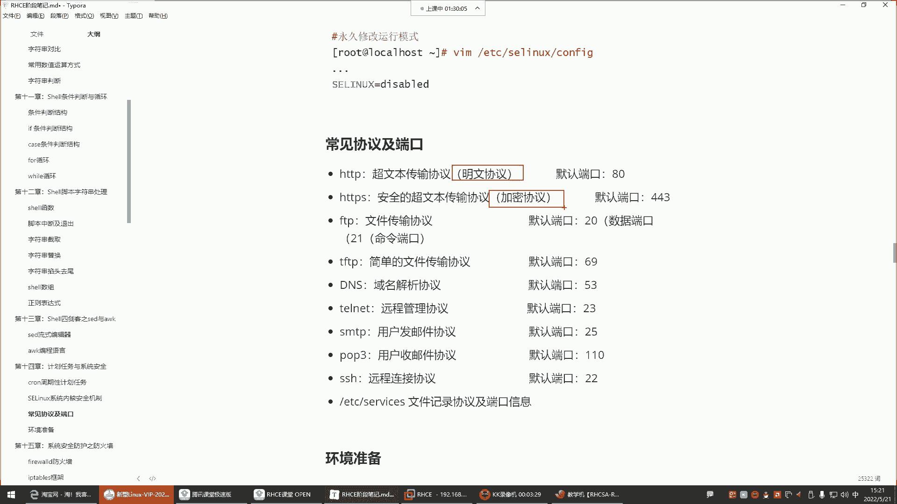

他如果不是用的是HTTPS这个协议的话，他用的是HTTP协议，那我访问淘宝，我跟淘宝之间所有的数据传输，如果说下边有一个人在干嘛呢，在抓取我的数据包啊，抓取我跟淘宝之间的数据传输的那个包。

注意这个明文协议是能够被别人给分析出来的，这个抓包的这个人他能够分析的出来，我跟淘宝的所有的数据传输都传输了哪些数据，能理解吧，对呃所以说很多的网站一般用什么呢，叫HTTPS。

HTTPS这个后边他多了一个S是什么呢，就是那个SSL，这个SSL我们是简称叫HTTPS，然后它是可以实现什么呢，实现一个数据的加密传输的好，如果淘宝他这个网站用的是HTTPS，这个协议加密协议好。

那我跟淘宝之间的所有传输，是有那种加密算法的，这种加密算法，注意是只有你们两个之间才能什么的才能破解，那如果有人他抓取你的数据包，那这个时候他想分析你的数据包，我告诉你他打不开这个包。

即便打开了也是乱码乱码，这个乱码就像你看什么呢，你看一个那个二进制文件一样，比如说我看一个CB一下的一个二进制文件，比如IOS啊，就这样看到了吗，这叫乱码，所以说他是没有办法分析你的包的。

能理解什么意思吧。

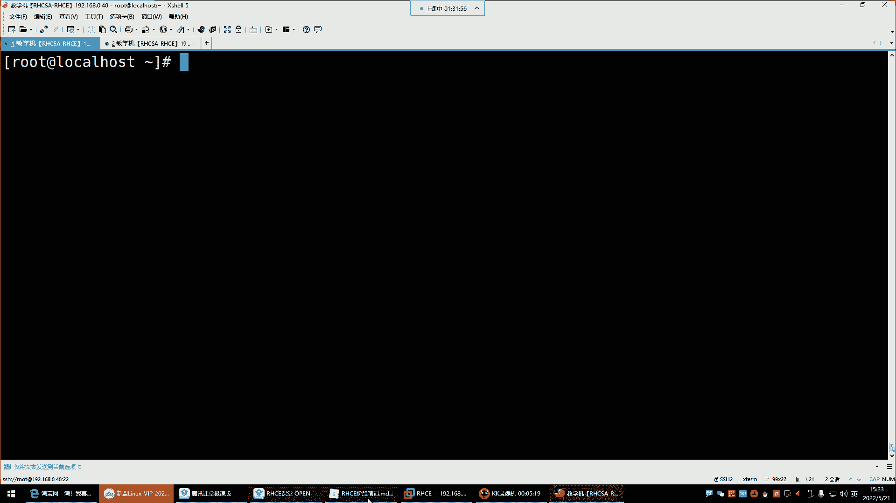

啊那如果他走的是明文协议好，你访问淘宝，你一输入用户名密码，人家一抓包，他就知道你淘宝的账户了，知道吧，所以一般呢你发现大多数的网站都是，H t t p s，为了安全起见啊，这种是应用于什么呢。

叫网站是网站这个领域的数据传输，他们走的协议，那HTTP呢它端口是80，HT v s8端口443，这个东西就是在企业当中。

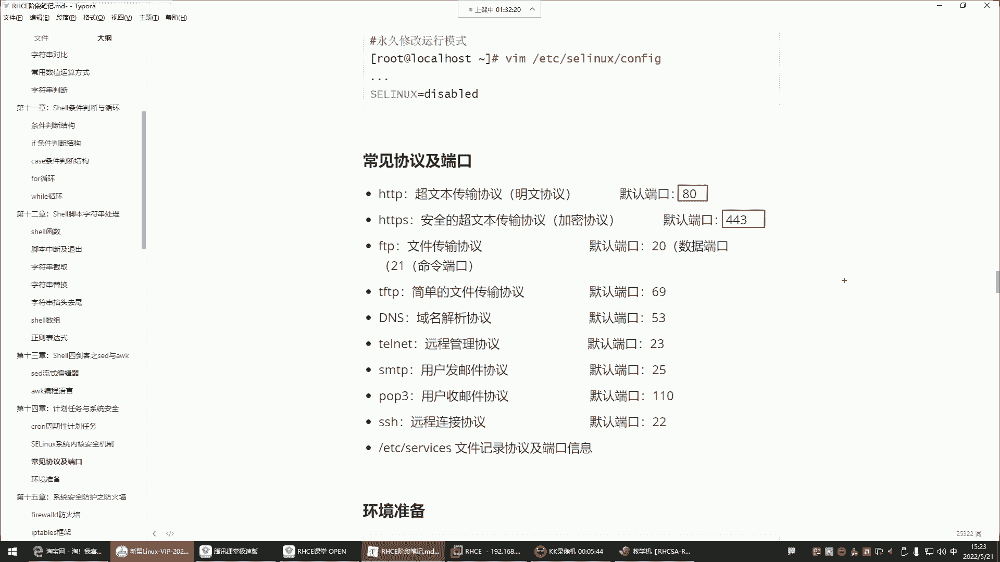

你要明白一台服务器，企业里面的服务器啊，它可不是说只有一个应用程序。

这个应用程序就是我们所说的软件，在一台服务器里边，对于企业来讲，企业里边这是一台服务器好，那他的这台服务器，它里边有可能装了很多个软件啊，我们简称叫应用，它是一台服务器，比如说我部署了什么呢。

我部署了一个网站，网站，这字儿也太大了，好一个网站，那还有什么呢，比如说还有一个其他的服务叫做什么呢，叫做那个FTP FTP，就类似于百度网盘一样，FTP好，我有两个应用程序在运行着。

那这个时候我这两个应用啊，都可以让用户去访问好，那让用户访问的话，那一个用户来了之后，他访问这台服务器，比如说好，我想访问谁呢，我想访问你这个服务器的这个谁呢，网站好，那他首先得先连到这个服务器。

注意他得先连到这台服务器哈，好那他连到这个服务器以后，那一般在建立链接的时候，它跟这台机器建立链接的时候，一般走的是TCP和UDP的协议啊，UDP这种协议叫建立链接，跟服务器去建立链接，通过什么呢。

通过IP啊去找到这台服务器，然后跟它建立链接，建立链接以后，那一旦链接成功了，那用户他说我想访问的是你这个服务器里的，这个网站，那怎么办呢，好那服务器怎么知道他想访问网站呢，是因为在他的这个数据包里面。

注意是会有一个什么，会有一个那个编号的编号，比如说跟一个八零好，那这个时候这个服务器就知道啊，你想访问我的这个服务器的，这个八零编号的这个应用程序，所以这个我们就叫端口。

这个端口是注意某些应用是或者说某些协议，它默认的端口，我的网站走的是HT，如果我的网站走的是HTTP协议，那我的默认端口就是八零，如果我的网站走的是HTTPS协议，那我的端口就是443。

所以一般就是默认端口哈哈，如果他说好，我想访问你这个网站，但是一般这个端口不由用户决定，能理解吧，不由用户决定，因为用户访问这个网站的时候，我们可从来没有输入过什么端口，你访问淘宝，你输入端口吗。

没有是不是啊，你看我访问淘宝的时候，我没有输入端口吧，那这个端口一般不是你输入，而什么呢，而是服务器你访问淘宝的时候，你通过域名访问他，这个域名里面会有很多个操作的域名，就直接把你的请求转给谁啊。

转给这个服务器的，他那个端口了，哎443知道吧，这个过程不用你管，甚至连前面的HT v s你都不用输，你就只需输入TP域名就行了，这些东西前面这个东西浏览器是帮你补全了，后面这东西服务器知道啊。

你通过域名访问我就给你干嘛呢，就给你用我服务器里的443端口，去接收你的请求，所以它是这样子的，所以这些端口对于来讲，对于我们来讲，你就知道它是一个什么呢，是某些协议的默认的一个入口，端口就是入口啊。

我这个应用我走的是HTTP协议，如果是HTTP协议好，那我这个协议或者说我这个应用，你想通过这个协议访问我，你得通过这个协议的入口才能访问到我，所以他们之间是这个关系，所以用户他是怎么回事呢。

他就是基于这个端口啊，我们叫端口，就可以访问到这个服务器的这个网站了啊，那我现在用户说我不想返网站，我想反FTP那FTP的端口哎，二十一二十一就可以让你访问到我的FTP服务。

所以这一个服务器有很多应用的时候，那这个时候还不同的端口来区别不同的应用，你想访问哪个应用，那由不同的端口进去就可以了啊，这玩意就像一个小区一样，一个小区你要这么大一个小区，你进到这个小区以后。

那这个小区里边那可或者说你进到一个大商场，你进到这个大商场的时候，那这商场给你提供的有卖家电的，有卖儿童玩具的是吧，有卖衣服的，你想想那这么大一个商场，你一从从你一进来，就像我们用户访问一台服务器一样。

这个服务器里面是提供很多个什么呢，很多个业务的，那这个时候你想访问什么业务，你是不是得找对应的那个门店才行啊，那就像我们访问服务器的时候，你想访问谁，那你就得找对应的应用一样。

那每个应用在或者说每个店铺在商城里面，是不是都有一个自己的门牌号啊，比如我这个门牌号是11好，那应用在服务器里边也有自己的一个门牌号啊，他走什么协议，他就是什么门号，比如我这个应用走的是HTTP。

我的门牌号就是八零，唉能理解了吗，各位知道什么叫端口了吗，现在这端口就是应用的一个什么一个入口啊，但是它是一个数字哈，好那下面这些你们要自己去背，因为这些的话呢没有，为什么就是哪个协议对应的什么端口。

拍个照片，截个图，然后放到手机的屏保里面，没事的时候一打开手机，你可以看一看，记不住看一看，记不住看一看，HTTP默认的是八零端口，然后HTTPS是443，FTP二十二十一。

那FTP这个东西类似于网盘网盘哈，给别人共享数据的，我们稍后会给大家讲FTP，然后下边TFTPFTP叫文件传输协议啊，其实就是给你共享文件的那文件就多了去了，什么内容点mp4的点mp3的点JPG的点。

点pg的这些都是文件，所以说那个FTP这个协议是在企业内部，自己搭建一个文件共享服务器，去给别人共享文件用的，就类似于内部的网盘，然后TFTP叫简单的文件传输协议，这两个之间的区别就是FTP是干嘛呢。

走的是TCP协议，需要建立三次握手，而TFTPTFTP他走的是UDP协议，他不需要建立握手，直接就跟他建立链接，然后把文件传给他就可以了，所以这是它们的区别，这种比较简单。

下边DS域名解析的协议端口53啊，我告诉你在这里面大家需要记哪些，记这两个就行了，记这两个就可以了哈，下边什么的几乎已经很少用了，FTP的话也很少用了，主要就是TFTP这些跟你的没啥关系。

还有一个这个把这三个记下来就行了，其他的作为了解什么TNT远程管理协议端口，23，TNT以前干的事是是是现在的SH。

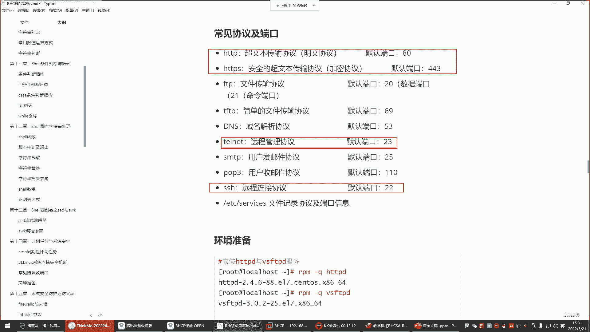

他干的事就是我们通过这种终端，想连接服务器SSH，那以前用TNT，以前是用tan net访问哈，但是TNT它不安全。

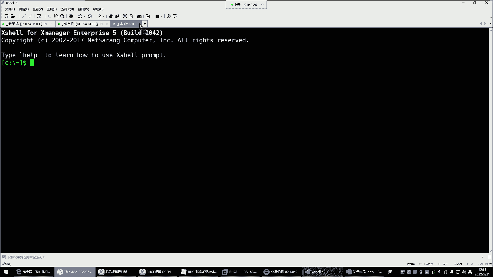

所以现在已经没人用了，所以在这里边了解下就行，我们现在用的是什么呢，就是HTTPHTTPS，还有SHSH，它的端口号就是一台服务器，我们之所以能够用这种远程的连接工具，SSH去连接它。

是因为我们对于服务器来讲，它有一个什么呢，叫SHD的这么一个应用，然后这个应用的话呢，它起的一个端口是22，然后我们就是连到这个22的端口，才能连到这个服务器上去管理它，程序啊配对配置文件。

自定义端口也可以，但是客户访问的话，客户得去什么手动指定端口，啊所以这里边记三个，我是不是就给大家说清楚了，还有一个文件，如果这些端口跟协议。

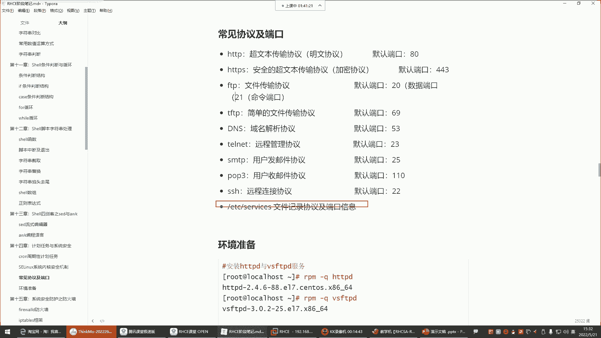

你记不明白，etc的service这个文件打开看一眼VM，etc的service这个文件里边看到了吗，哪些服务，你看哈上边这个位置，Sername，这叫服务的名字，服务名称P叫端口，看端口到端口的协议。

哈哈看到了吗，也就是说这个端口啊，它是从一开始一直到多少呢，一直到6万5535这么大这个范围内，然后这个文件就记录了在这个网络当中，哪些协议占用的哪些端口，这里边从一开始看到吗，1579你就往往下翻。

包括我让你们记得那个你往下翻，80看到了吗，80这个端口是谁的，HTTP的，看到了吗啊还有还有这个80看到了吗，HTTP的，然后那这个HTTP既可以走TCP，又可以走UDP，好好下边是建立链接的时候。

可以通过TCP和UDP建立链接，什么pop2pop3，看到了吗，这里边，然后什么SNMP，这些端口都可以从文件里面去看，443，我给你们找那个443443，你看这443是谁。

44443是不是HTTPS啊，没错吧，记不住就看这个文件，但是看的话有点费劲，rap过滤过滤八零，从这个文件里面，但是这个不行，包含八零的太多了哈，这过滤也不精准。

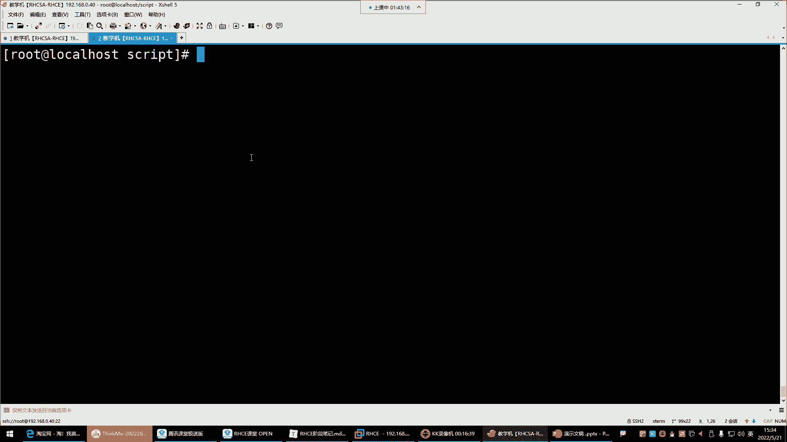

你就知道那个文件是存放一些协议和端口的，协议名称以及对应的端口，都在这文件里面放着呢，好好下边来我们开始讲什么呢，讲防火墙，讲防火墙之前把这两包安上，安谁呢，就安装HTTPD就行了，按照HTMD。

安装HTTPD，我们接下来要讲防火墙啊，然后讲防火墙的话，那我们现在需要什么呢。

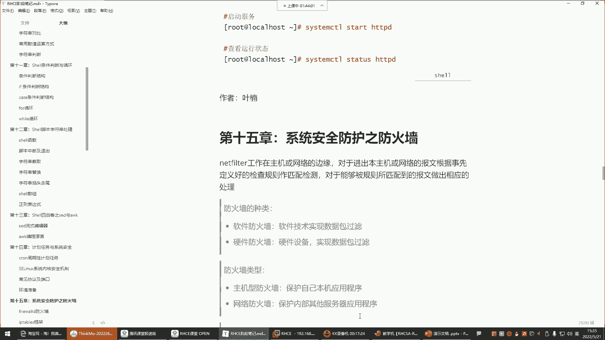

需要一些应用来给大家演示，这个防火墙现在用不了两个终端了，一个终端就行，YM杠y install HTTP t，这前面是不是安过来呀，如果没有，按照你们按一下哈，就这样好，安装好以后把它服务起来。

start服务名叫HTTPT，这个玩意儿干嘛的呢，这玩意儿是后边你们在学三阶段的时候，会给大家讲啊，只会简单介绍啊，就是一个搭建网站的一个软件，起来以后看状态，tt running的状态好。

running状态了，那接下来我注意他给你提供一个端口，哪个端口呢。

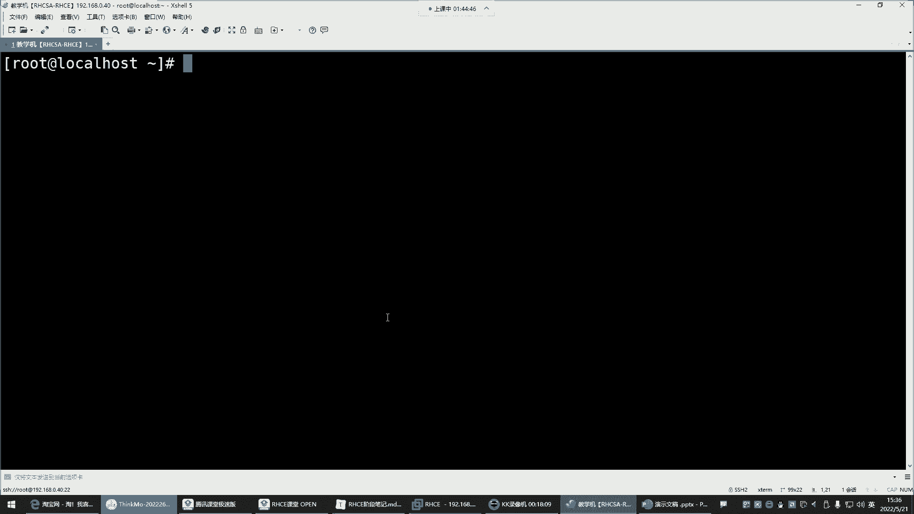

这个HTD默认走的就是HTTP协议，搭建网站的，然后它的端口就是八零好，那这个你先不用去管这些。

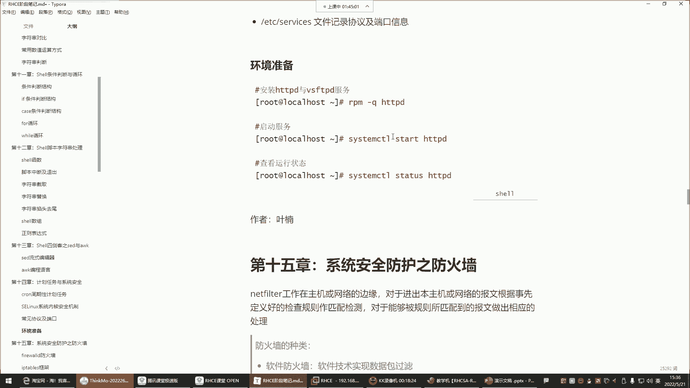

那有一条命令可以直接看，叫SSSS这条命令我前面给大家呃，我记住我前面给大家讲过这条命令，他们有很多选项，什么杠NTLP这是比较常用的，这里面呢它有一些帮助可以看一眼嗯，S你看它的选项非常多。

是不是这里边什么N，N是不要解析服务名什么算了吧，这个我记得我前面笔记里面给大家介绍过。

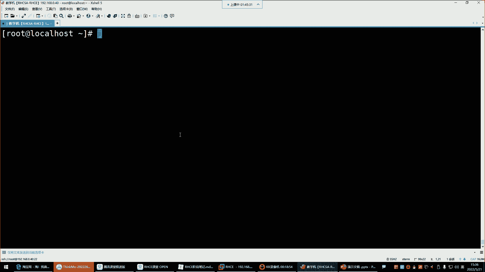

但是没有在这个笔记，是HCSA的笔记里面介绍过。

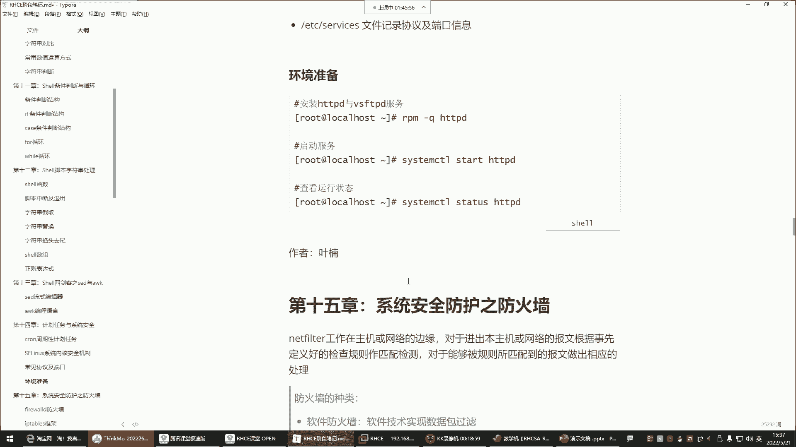

然后就是主要是看服务的走的协议跟端口，对他说阿帕奇哈S杠NTLP啊，T就是看他走的协议啊，TCP协议，这个P就是看这个呃这个应用这样的端口，L就是以这种长格式给我列出来嗯，N就是再加上它的具体的名字。

就管道给grape谁呢，HTTPT回去看，我现在过滤HTTPD这个应用程序，它的进程的信息的时候，他就告诉你了，listen监听端口八零看到了吗，就是他监听的端口是八零，那有了八零以后。

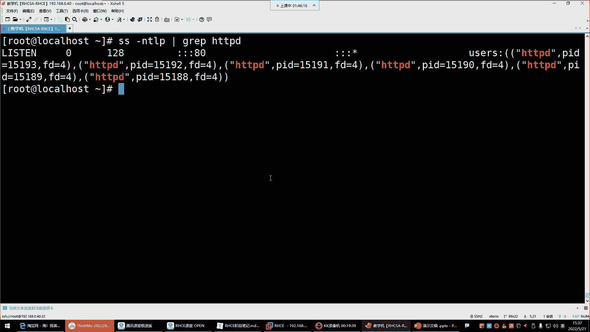

注意你不用管，默认端口是八零，那接下来访问它，在这边用浏览器打开，打开哈访问我那个机器的IP就行了，1。2。168。0点多少呢，我那个机器是40，然后回车，中间件就是软件，中间件就是软件。

没啥就是软件中间件，中间件就是软件，好它可以它可以干嘛呢，它可以为某一个应用程序提供一些额外的功能，我们叫中间件，好那这时候你发现防防半天怎么一直转圈呢，没有防上哈。

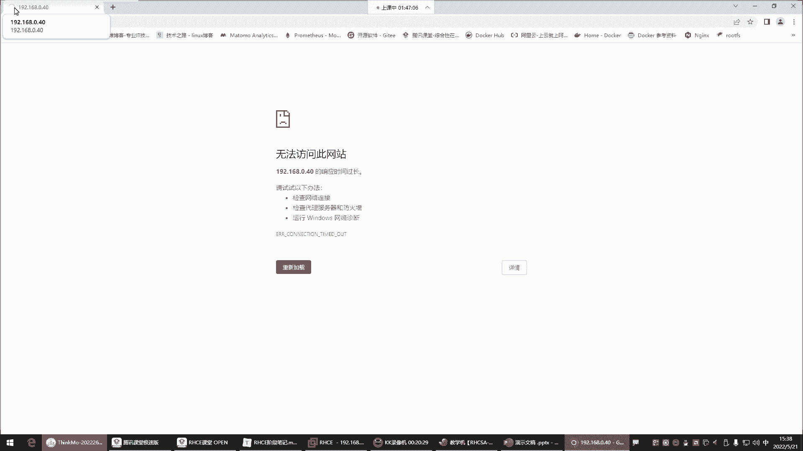

为什么呢，是因为我们当前这个机器开着防火墙的，开着防火墙的哈，不是什么高级东西，就是软件哈啊，那接下来我来给大家先把防火墙停掉，system stop菲尔沃回车。

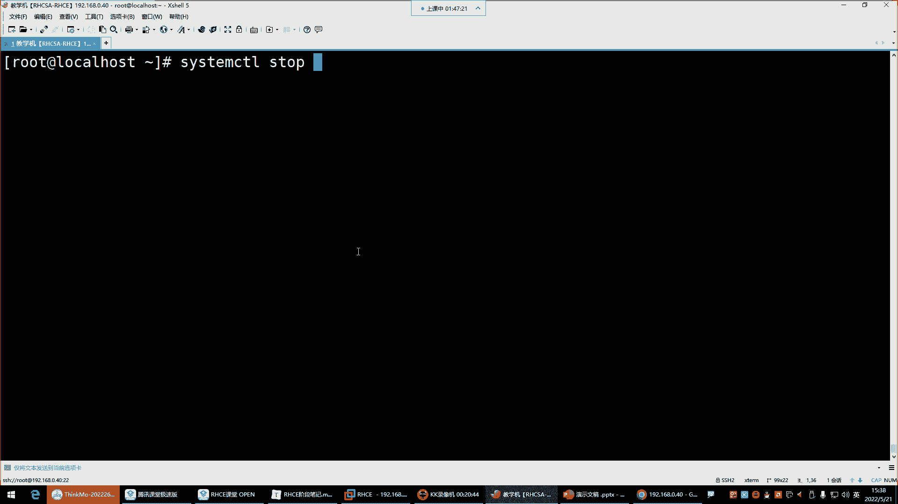

我把防火墙停掉，大家看直接看到页面了，这个页面就是我刚刚安装的那个HTTPD，给我提供的这个页面，就这个页面哈，好那对于这个页面，我们现在不用去管它乱码七糟的搭建网站的嘛，你往里面拖一个东西。

那别人就可以访问了，好那现在这个这个页面的话呢。

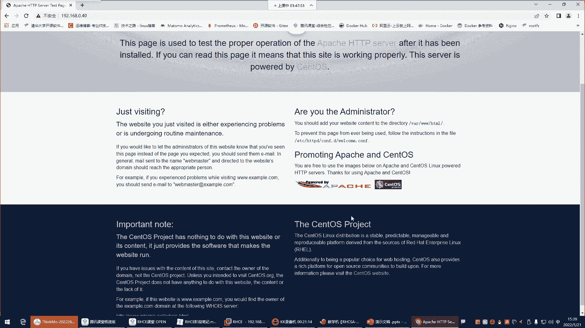

我们可以这个先说一说，为什么刚刚不能访问呢，因为刚刚有防火墙，有防火墙，我们刚刚安装这个HTTPD，就是为了给大家讲接下来的防火墙，那防火墙的话呢看看什么叫防火墙，防火墙工作在主机或网络的边缘。

对于进出本主机或网络的报文，根据事先定义好的检查规则做匹配检测，对于能够被规则所匹配到的报文做相应的处理，这句话我给大家详细的解释一下，防火墙这东西。

啊我这有张图来哈，防火墙。

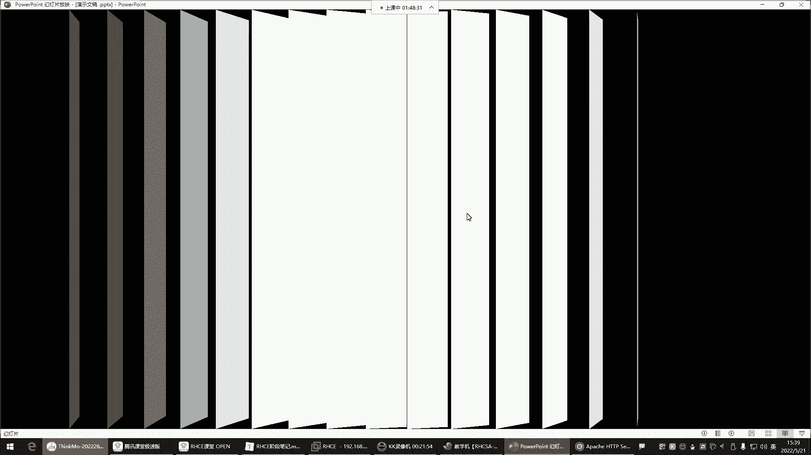

防火墙概念来，先把这句话再读一遍，工作在主机或网络的边缘，我现在有一台计算机，我这台计算机我安装了一个网站，这是我的服务器安装了一个网站好，那这个网站最终是不是得让用户访问呢，好用户访问你的网站。

那接下来我们说什么叫主机或网络的边缘，这个主机或网络的边缘到底是哪里，这个就像什么呢，就像你进地铁站一样，你进地铁站，地铁地铁站的边缘是哪里呀，地铁站的边缘就是安检安检那个位置。

安检得检测你有没有一些危险物品，如果没有危险物品，对人家才给你放进去，那叫边缘，所以说防火墙它呢就是在主机或网络的边缘，那主机或网络边缘就是在你防火墙设备的外网，网卡的前边，在这儿干嘛呢。

去对用户的数据做过滤的，嗯知道吧，这就是叫边缘，别人想访问我这个服务器里面的这个网站应用，那你要明白我这个服务器里边的这个网站，不是说谁访问都能访问的，所以我得过滤数据包，万一这个人他攻击呢，是不是啊。

所以这就是在边缘去对数据做过滤，所以这句话现在能力了吧，那他对于进出本主义或网络的报文，根据事先定义好的检查规则做匹配检测，那这个不就是说白了，我防火墙里边不就是得配规则吗，是不是啊啊，但是一会儿哈。

我们再说这个我防火墙里面其实就是配规则的，搞了一堆规则，一堆规则，第一条规则，第二条规则是吧，要么就是那第一条规则，允许所有客户端访问本机的网站应用，第二条规则，拒绝所有客户端访问本机的网站应用。

那这时候防火墙我配的规则了，你反问我，我得按照规则去过滤你这个数据包，知道吧，那一旦用户他的访问，他的这个数据包被我的规则所匹配到了，那怎么办，按照规则处理，嗯按照规则处理哈，所以这就是防火墙。

就是做数据过滤的，但是防火墙它的种类又分为什么呢，叫做软件防火墙跟硬件防火墙，那软件防火墙是通过软件技术实现数据包过滤，什么意思呢，就是我们要安装软件包，然后软件包给你提供诸多的命令。

然后你通过命令去配规则，这种叫软件防火墙，那硬件防火墙呢你不用去安什么包了，你们公司花钱买一个硬件设备，你像像什么深信服那种厂商专门搞安全的，他们家就卖防火墙设备，那个一台防火墙设备的话，那百八十万的。

然后你们公司也不差钱，就买一台防火墙设备，然后这防火墙你不用去敲命令，那玩意就是有点像云主机的安全组一样，云主机的安全组哎，鼠标点点点配规则能理解吧，所以他给你提供一个页面，那个页面你用鼠标点点点唉。

就可以配规则了嗯好然后，呃接下来这个叫防火墙的种类分为软件和硬件，那我们学的话以软件为主哈，硬件的话呢那有有的公司他不舍得花钱呢，他不舍得花钱，你想想那你还没有办法去鼠标点点点的，为了省钱。

那只能什么呢，只能是哎我们安装一个软件软件，一般不花钱呢，免费的你就配规则就可以了，然后接下来防火墙的类型分为主机，防火墙跟网络防火墙好，那这时候主机防火墙保护自己本机的应用，这一般小企业。

小企业就是他们家呢就一台服务器，一台服务器的话呢也没有多少用户去访问，然后在一台服务器里面安装个网站，配个数据库，用户访问网站数据存到数据库里边好，那这一台服务器对外接收请求的话，那一般情况下。

这个时候你要对这个服务器配规则，所以就像我这个里边啊，就就就像我这个图里面主机防火墙，就是我这服务器就一台，然后呢接收用户访问，那用户访问我的网站，我得通过防火墙去什么的去过滤他的数据包。

这种叫主机防火墙，一般小企业这样干，那如果是这个那些大企业呢，大企业他得用这种网络防火墙了，网络防火墙是什么意思呢，就是说我企业内部有一个集群啊，所有的网站都运行在我的集群服务器里边，一群机器。

那我这一群机器干嘛呢，我不是每个机器都配防火墙，而是什么呢，而是我单独准备一台服务器，去安装一个防火墙的工具，然后呢，我就单独让这台服务器去接收用户的请求，用户的请求经由这个服务器去做数据过滤。

然后如果说这个数据过滤没有任何问题，再通过你们企业的一些什么交换机，再把流量再给他，转给你们的内部的网站服务器是这样子的，所以这种的话呢是大企业都是专门去买，那种硬件防火墙设备，大企业百八十万的。

人家不差，那钱直接干嘛，自己买个硬件防火墙设备，然后点点点配规则就行了，小企业小企业就一般就比较什么呢，就比较抠门，他也没钱，关键是啊主要是没主要是没钱，所以一般就没有什么集群，也就一两台服务器。

这就是我们所说的那个什么呢，我们所说的这个防火墙好，那这个防火墙我们现在下面还有一些概念哈，这个概念先给大家说清楚哪个概念呢，就是我们学习的是软件型的防火墙，那软件防火墙在sin头S7里边。

默认使用的防火墙管理工具叫做fr，然后在cs6里边默认使用防火墙管理工具，叫IPTP，那对于注意哈，我们是我们现在学的是4047这个系统，是不是啊，那默认的防火墙管理工具叫菲尔沃。

这是一个防火墙的管理工具，但是真正实现防火墙功能的是叫net filter，是LINUX系统内核自带的一个模块，这个模块翻译过来叫网络过滤器，通过这个模块实现数据过滤的，但是这个模块在内核里面。

内核我们人无法直接跟他打交道，所以就可以通过这个菲尔沃这个管理工具，去操控这个内核去配规则，那下边SX6里面默认使用的防火墙管理工具，叫IP tables，那这两款工具一般的话呢。

我们还是比较喜欢用IP tables，因为都是从S6过来的，然后感觉IPTPS比fr要好用一些啊，只不过这些官方官方说啊，我这个菲尔沃啊在各个方面比IPTP优秀了啊，建议大家使用费尔沃。

就像我们现在用win11样，然后呢微软又升级到win11的，微软说啊，我的win11系统从效率上已经什么呢，已经这个比win10提升了多少多少多少，但是当我们升级到win11以后。

发现这他妈的都是bug，也不好用，是不是，所以说基于我们用户使用的角度来讲，我们是不参考官方的啊，我们什么呢，我们啊考试不得用八门，考试，没有防火墙题，考试没有考试没有防火墙的题。

好然后我们呢也给大家讲，也给大家讲哈，费尔沃先给大家讲菲尔沃，再给大家讲IP tab啊，但是我得给你们说一下，在企业里面IP tips用的比farewell要多，能理解吧。

嗯好那接下来我们说这个菲尔沃这防火墙，firework防火墙，它的管理工具叫菲尔沃杠CMD，这是它的命令哈，它的命令，然后这个防火墙呢它的这个名字叫菲尔沃，我们一会儿说一说这玩意儿，它们之间的关系看哈。

然后这个管理工具的话呢。

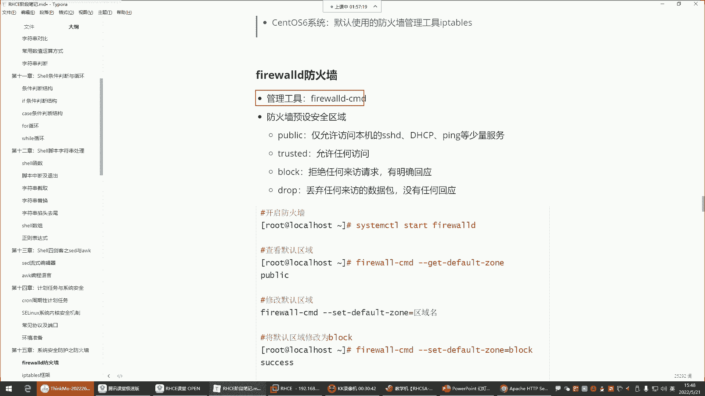

你在使用的时候使用的时候，杠CMD，我刚刚注意我是把这个防火墙给它停掉了是吧，我是把这个firework这个防火墙给它停掉了，然后我得先给它开起来，不然这工具啊没啥用，给他start的起来。

start开启哈好，那开启了之后，我现在配规则了，用firework杠CMD可以听不见哈，Cmd，那这个是针对于这个规则配置的一个命令，而前面你想停止或者说开启它的服务名叫fall。

这是它的服务的管理工具，这是他们之间的关系好，那接下来啊。

还有几个区域在这个菲尔沃的防火墙里边，它呢这是一个大的防火墙体系，它里面有非常多的区域好，那不同的区域实现的功能是不一样的，那我们说说这几个区域啊，先说第一个叫public的区域。

仅允许访问本机的SSHD等等等等，我现在先看一下这个区域里面都有什么东西，好吧，怎么看呢啊先看哈，这样查看区域，firework got semd啊，杠杠get杠default。

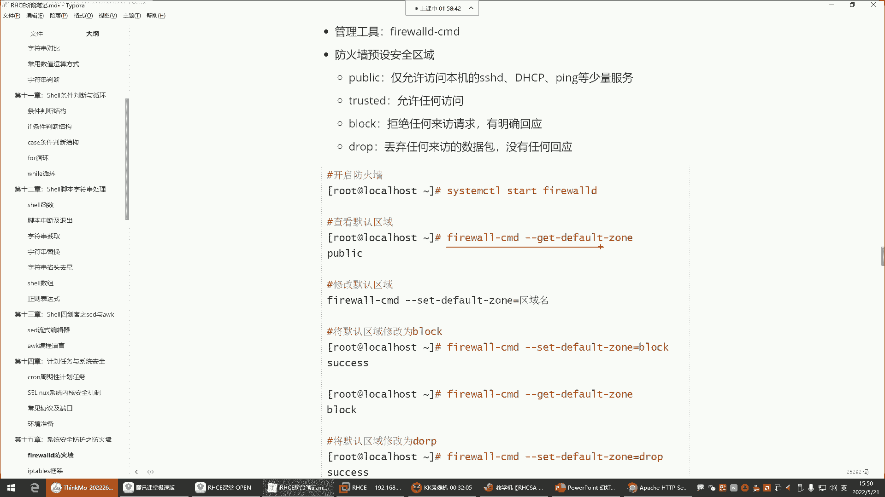

杠纵啊，这命令太长了，呵呵是吧，记不住杠杠help hp的时候看看，这也非常多，好杠杠get，这太多了，这帮助我的天呐，我的天呐，我的天呐，我后悔了，我这敲了一个帮助，呵呵我敲了一个帮助。

这这帮助也太多了，算了哈，对还不如不帮了，这样哈，firework杠，CVT杠杠什么呢。

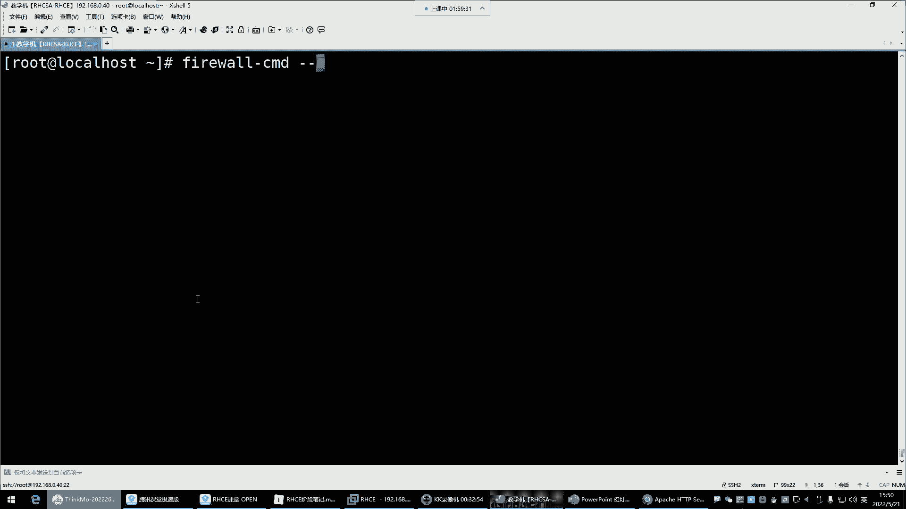

这叫查看default，叫默认，纵叫区域，所以这三个放在一起就是查看默认区域。

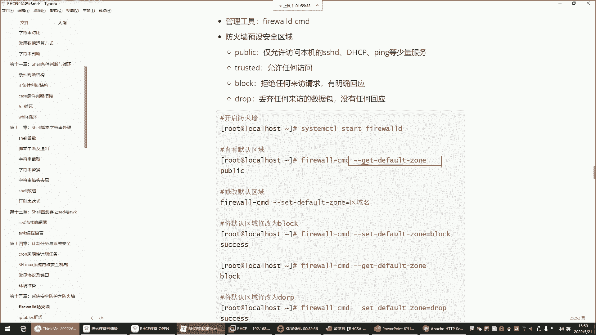

那这个命令我们得什么呢，我们不能盲敲了哈，盲敲有的时候也记不住命令，这种东西时间长不敲都忘了，包括外我也一样，我时间长不敲外望，所以有的时候这种东西还得参考笔记哈，参考笔记，笔记这种东西。

我们说有的时候就是你好记性不如烂笔头，你再好的记性，你真的是你时间长，不用它就是忘啊，来敲这条命令，杠杠get查看杠default，比fold on，然后杠重回车，这条命令是查看当前的防火墙的默认区域。

那他这几个区域，也就是说当前用的是这个public，作为它的一个叫做什么呢，叫做默认的区域，那在这个区域里边注意，那也是我当前的防火墙的状态是什么呢，当前我的防火墙。

它看它采用的默认区域是这个public好，那这个区域就是仅允许访问本机的，什么SSHDRCP是分配IP地址的。

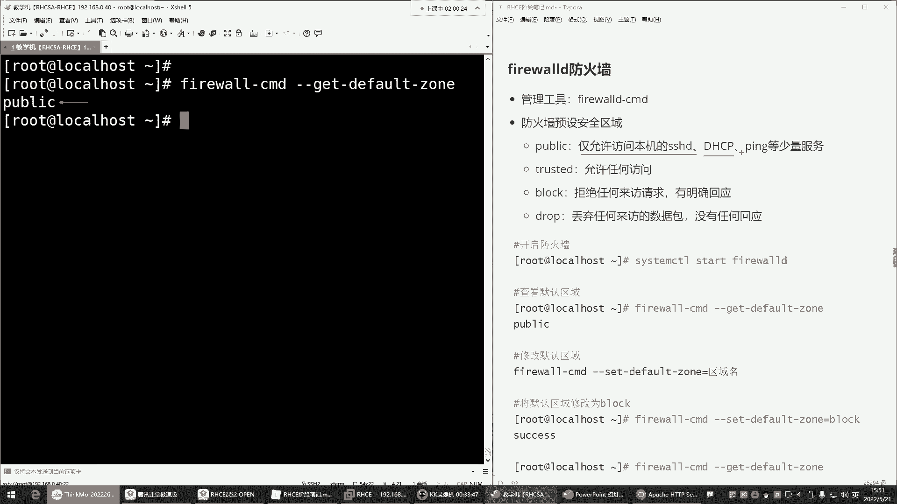

然后拼等少量的服务，所以说如果有防火墙，现在是开启状态，你访问HTTPD这个web服务的话，它是访问不到的，你看浏览器一直在转圈哈，为什么反不到呢，因为防火墙压根儿也没有允许你访问我的那个。

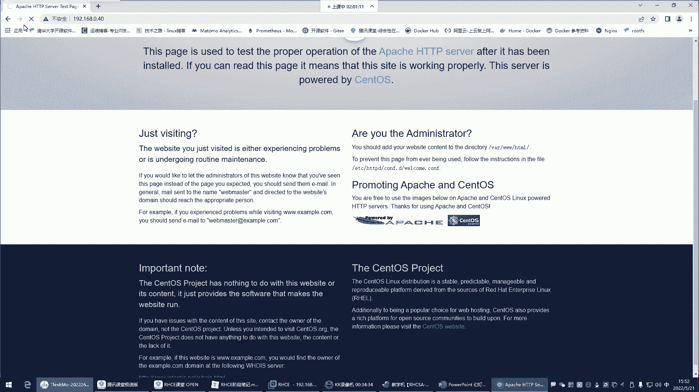

他是走的是基于HTTP，所以我没有放行HTTPTHTTP，所以它防不了，那这时候我们要干嘛呢。

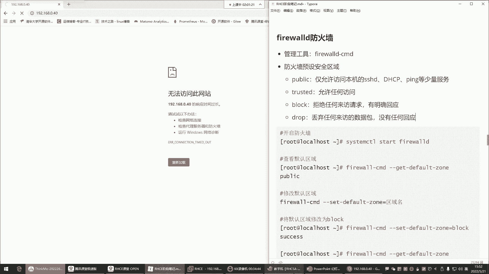

我们就一会儿啊，没关系，我现在先知道怎么查看这个默认区域，就是杠杠get杠底fold杠纵，然后下边如果看我想希望大家访问的话，我可以把它我可以干嘛呢，可以对我的区域做一个修改。

我让我的区域变成叫TRICITY，允许任何访问，那现在怎么修改呢，也是这条命令翻过来，然后这时候把get给它换成set，set default区域等于谁呢，Translate。

回车然后再看区域变成TRACY了是吧，那一旦变成trans的。

现在你再刷新好，可以访问了，为什么呢，因为我现在的防火墙。

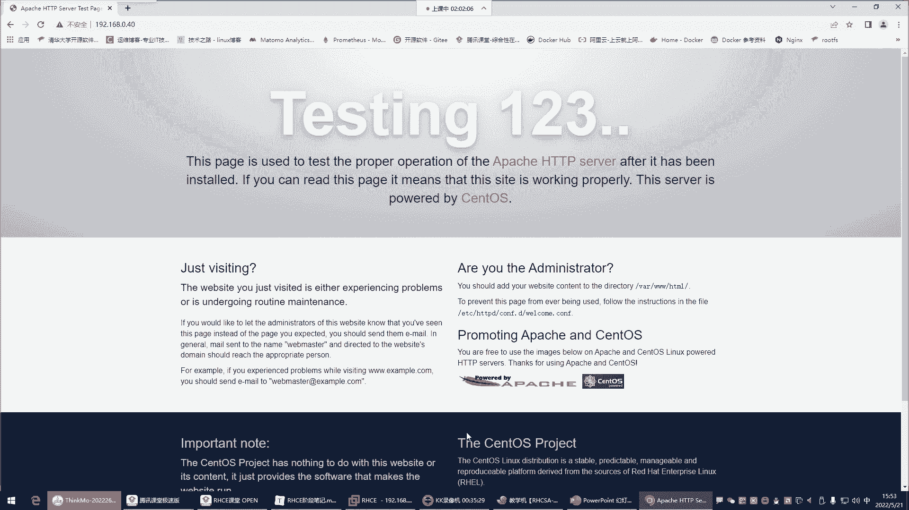

我开启的默认的区域是translate，translate叫允许任何访问，好对，然后这是TRACY哈，允许任何访问，现在知道怎么去改它的默认区域了吗啊，set是设置的意思，get是查看的意思。

后边默认区域都一样，你改区域名就行了，OK然后那我们再看看其他区域，block block叫拒绝任何来访请求，有明确回应好，没关系，来改改成set等于叫block b l o c k回车好。

那block的话，那现在他告诉你success成功了是吧，再看一下get一下哈，get好，那当前变成block了block。

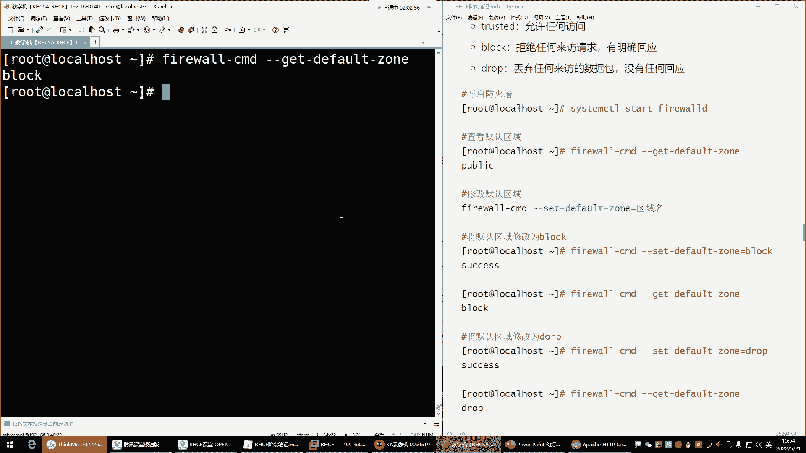

你现在如果再刷新我们这个页面，他又开始转圈了，看到吗，为什么呢，因为我当前的防火墙的默认区域变成block了，那block这个区域的特点就是拒绝任何来访请求，谁访问都拒绝，知道吧。

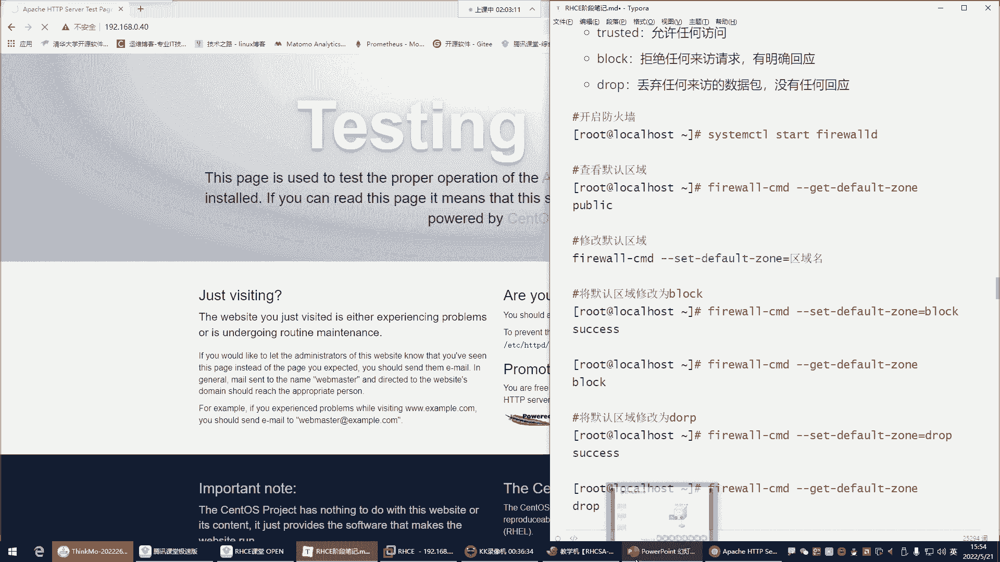

谁访问，多学学。

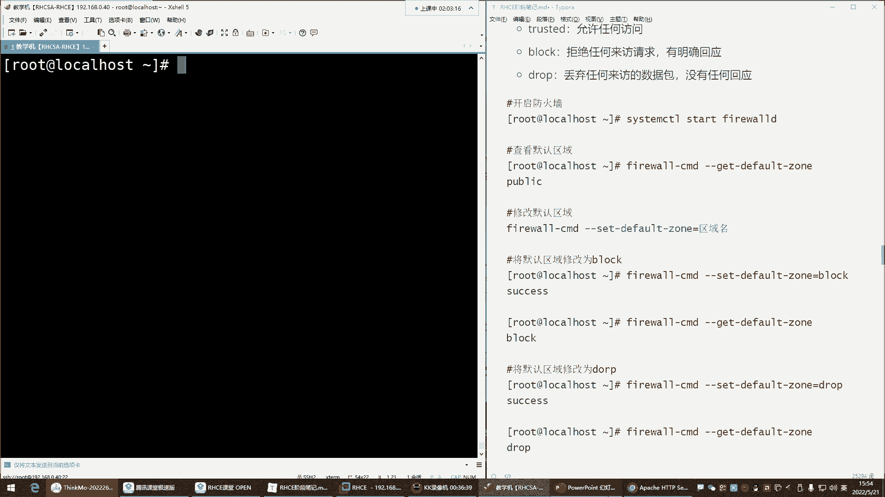

所以现在你发现我的浏览器又转圈了，嗯卡了吗，我看一眼哈，没有卡呀。

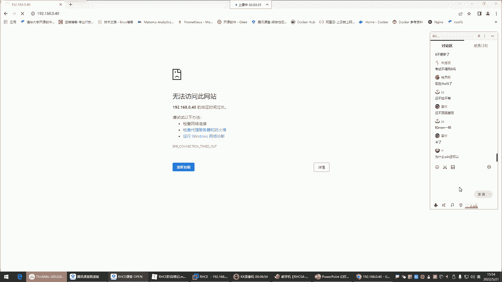

为什么SSH还可以是吧，为什么SSH还可以拒绝任何来访请求，有明确回应，那他这个区域里面我们看一看，为什么SH可以啊，这样呃我想看区里的规则，这样这条命令哈，来菲尔沃杠杠CMD，然后指定区域哪个区呢。

我当前的区域等于block b到OCK，然后杠杠list，然后杠out回车，嗯这里边是，嗯这个区域有点问题，这个区域有点问题哈。

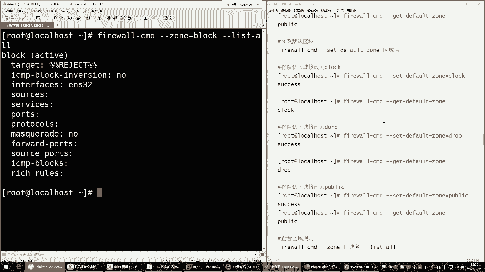

对他拒绝任何应该我们再开一个机器，再搞一个谁呢，这个随便搞一个机器哈。

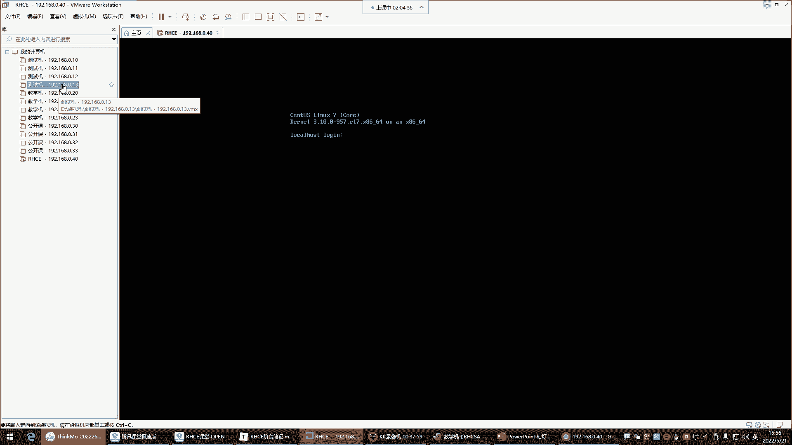

就这个测试机，我给他回复个快照。

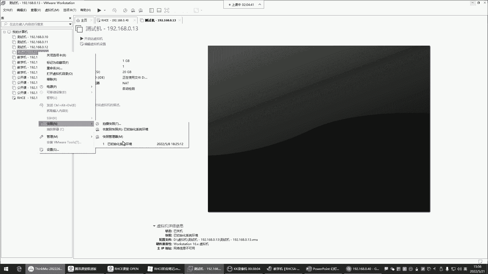

我看能不能拼哈，得测试一下，这个菲尔沃有有的时候让你研究起来，真的是摸不着头脑的啊，那再说说别的区域，这个区域叫丢弃任何来往的数据包，没有任何回应啊，这时候我现在是无法访问是吧，这样的话还有点看不出来。

再开另外一个是多少呢，测试机13，在测试机里边，我先拼拼那个IP地址，192。168。0。40回车啊，这时候看拼都拼不了了，但是SH怎么没断呢，我也纳了闷呢，他说目标端口。

目标主机叫目标主机被强制禁止好了吗，是不是就告诉你不允许访问的呀，那这个机器我先退出，我看还能登录吗，那有可能是不不不不我退出我再登录，我觉得有有有可能不行了，上不去了上不去了哈，上不去了哈。

就是你当时的状态，他没给你断，现在就已经连不上去了哈，所以原因现在找出来了，什么原因呢，对原因就是你得退出以后再登录就上不去了，上不去了哈，断开就不行了，所以这个时候你看这个区域的特点是什么。

是不是你任何的访问都拒绝呀。

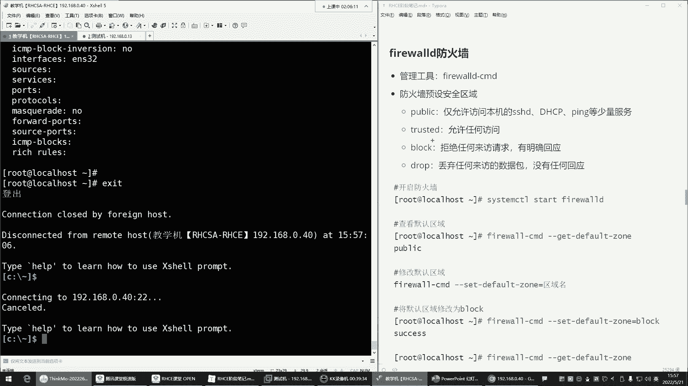

好那下边那这时候怎么办呢，Root1，所以这时候你就得FW杠C杠CMD，然后杠杠这时候来看看哈，那这个规则我们先先干嘛呢，先嗯先设置吧哈设置设置成set杠，default杠等于谁呢，DPDROP回车。

好事成功了，set一下，杠CMD，然后杠杠get杠default defaul，杠纵看默认区域变成job了，job的话呢，我们可以访问吗，来连一下，再连一下DP，重新连接也不行。

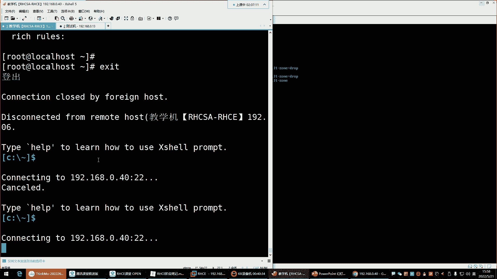

job好像也防不了呢，是不是。

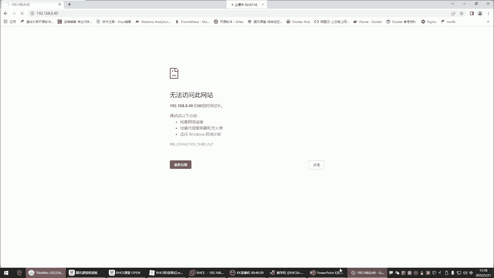

那我们这边拼一下，我防火墙，现在改成照B了，这边拼回车看效果哈，这个位置你发现他一直没动，我一直在拼这个机器是吧，但是他没动，为什么呢，他跟前面不一样，前面他告诉你了，说目标主机强被强制禁止。

说白就是拒绝访问了目标主机，但是这个位置为什么没有任何提示呢，因为它的特点就是这两个区域，首先呢都是拒绝注意哈，都是拒绝，你看block是拒绝任何来往请求，那JB也是，我们说叫拒绝任何来访的请求。

来来访的来访请求，但是他是没有任何回应的，他没有人回应，因为他把帮他把那包给丢弃了，丢弃了。

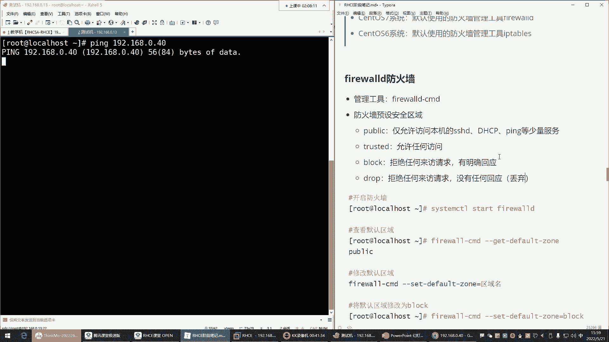

这个主机拼他一个包，他接收到这个包了，但是呢他把这包给扔了。

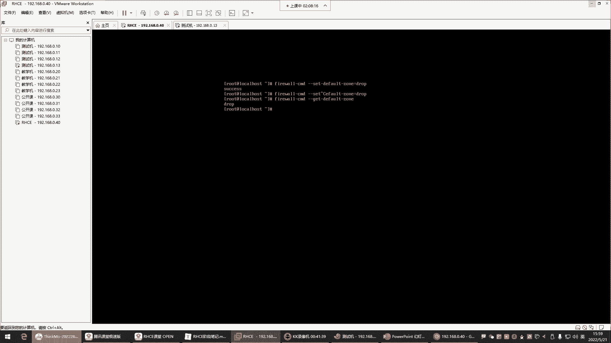

不会给他回应，能理解吧，这是他们之间的区别，那你说这个一般怎么用啊，这玩意儿就是你想拒绝一个人，但是什么样的拒绝呢，就只要你想救一个人，一般别来block了，干嘛呢，给他照不掉，一般对于攻击者来讲。

一般对于攻击者，如果他想攻击你，你不能给它改成拒绝，为什么呢，因为拒绝的话，我们再设置一下。

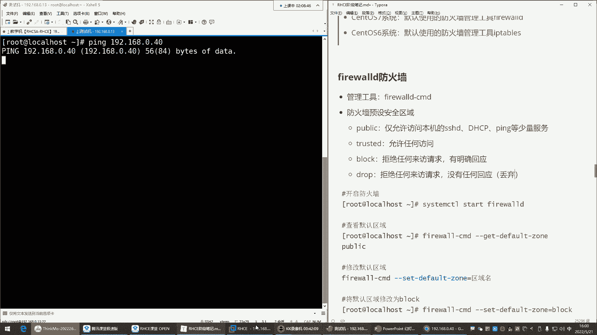

给它设置回设置回去，在这设置成block b l o c k回车，我一旦给它改成这样的话，这边再拼，你看是不是变成这样子了呀，那我告诉你嗯。

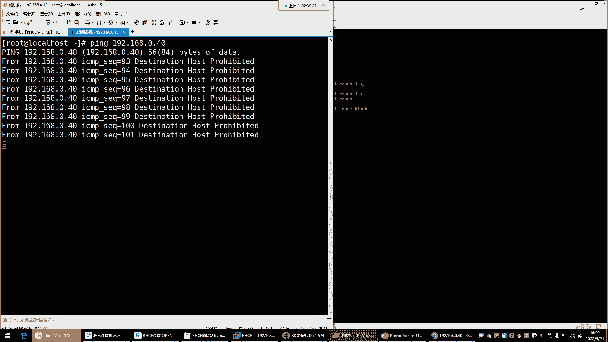

哈哈在这里边你发现别人拼，我是不是也是不是也能拼通啊，看他从这个192。18。0。40，这个机器得到了什么呢，得到了回应，说目标主机被禁止是吧，其实就是拒绝访问了，但是你要搞清楚。

如果别人想用流量攻击你，那你他拼你，你是不是也给他，你也得给人家有一个明确回应啊，告诉他明确拒绝，所以你是有流量支出的，一般你如果真想拒绝一个人，一般啊你连流量支出都不需要有，我就拒绝他了。

所以来一个包我就给它丢掉，来一个包丢掉这种，这是他们之间的区别啊，一般对于攻击者来讲就是丢弃就行了啊，不拒绝，对于正常的用户来讲，我们可以明确拒绝他啊。

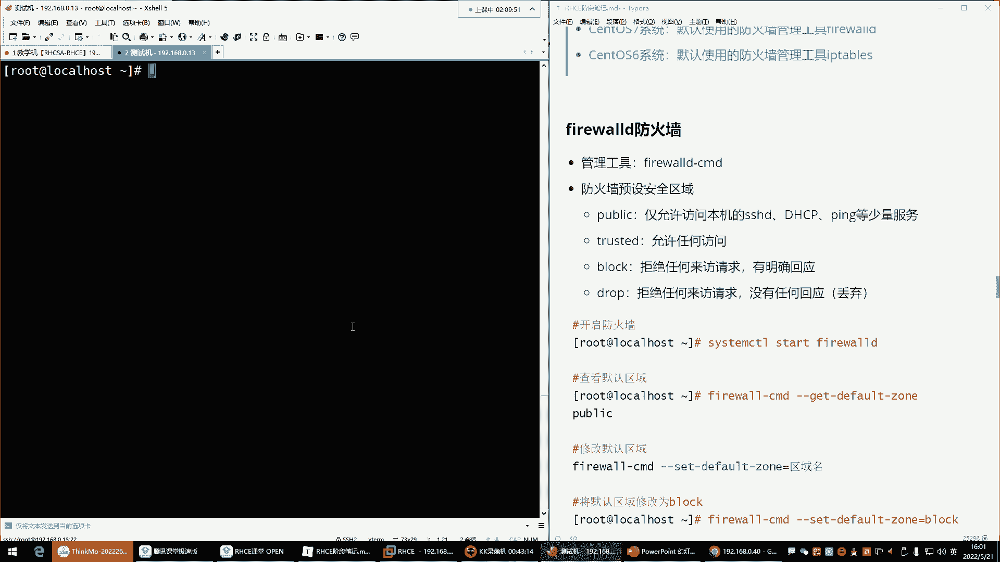

他就知道是什么意思了，好那这是他们两个的区别。

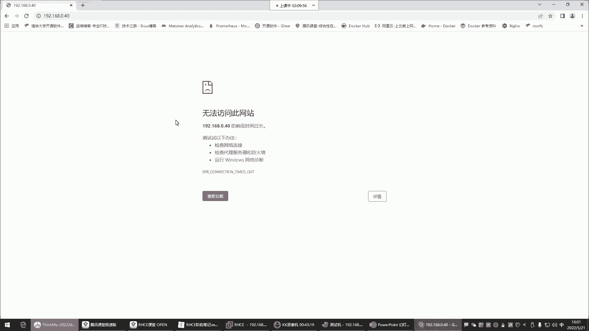

那我们呢这边再给他重新设置回来啊，设置什么呢。

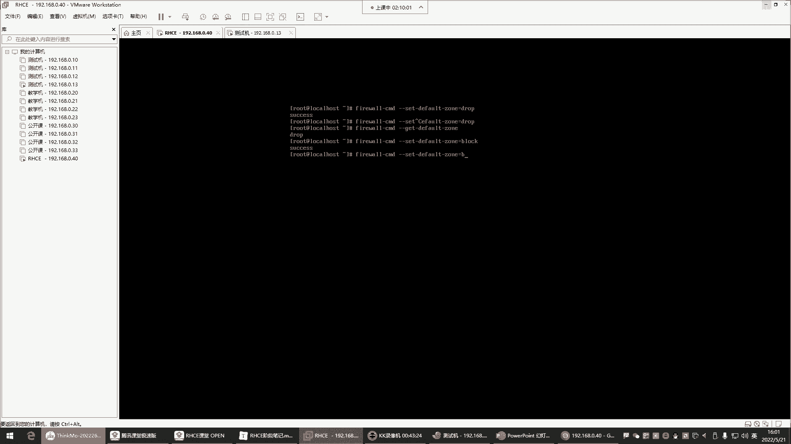

呃设置成设置成啊。

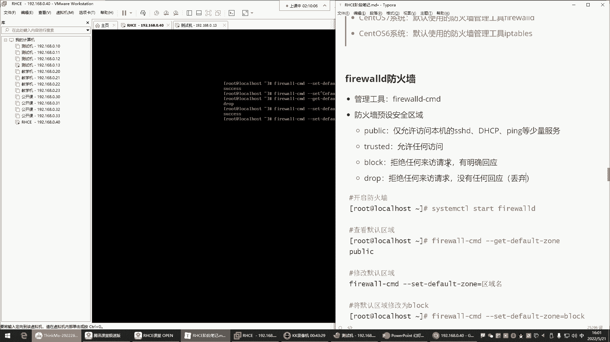

public public好，然后这时候再连接一下哈，再连接一下哎，这边连接哈，连接一下哈，文件重新链接好，OK重新链接了。

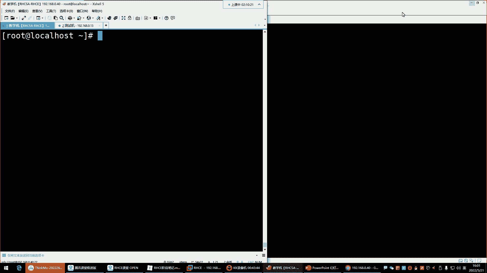

然后接下来那这是防火墙这几个区域，现在感现在感受到了吧，就是如果是public，这里边呢是允许你有少量的服务去访问我，那这时候我们可以看这每个区域的一些规则啊，它每个区里面都有些规则哈。

这个时候我们就fr杠SAMD，然后杠杠区域还是杠纵等于哪个区域呢，看看blog，好那我敲错了，是杠杠啊，不是没有加选项，杠杠list杠二诶，那个是吧，两个横杠这位置哈，他输了。

你看你这个杠纵等于public看了吗，有问题，什么无法识别的参数，他说你这参数不对，少一个杠回车，这样就可以了，那现在我们来看这个区域，这个区域这是区的名称叫public好，那这个区域是什么状态呢。

active叫活跃的状态，看到了吧，活跃的，然后它这里边啊什么这个目标啊，针对的目标啊，default默认这些的话呢，你不用去管看什么呢，看这个service服务这位置，服务这个位置告诉你。

我现在这个public这个区域允许哪些服务访问，因为这个区域注意这个区域是一个允许的区域，它不像下面这两个是拒绝的区域，前面这两个都是允许区域，只不过这个区域默认只允许少量的服务访问。

而这个呢是允许所有好，那这个区域你想看哪些少量服务可以访问，就在这儿看这个区域，看service服务就可以了，SSH服务可以访问，DCP可以访问，那还有拼也可以访问，看到了吗，就是看这个区域的一些规则。

而这个区域的interface，他的网卡是ES32用的网卡好，然后那我再看TRCTRC，这时候，呃奥，往后退退看叉子电脑啊，是，回车，那在TRANSER里面，你发现这怎么什么都没有呢，是吧啊。

这个叫允许所有啊，那允许所有看哈，这就是接受的意思，我的target target就要默认的规则，注意我这个区的默认规则就是accept，就是允许前面public public区域的默认规则啊。

就是默认这些可以访问了吗，啊那这时候的话在这个里边，就是它没有任何规则就都放行，谁访问我都放行啊，那这个block如果你防火墙，你的区域直接改成block了好，那一旦变成一个区域，我就直接拒绝了。

能理解了吧，BLOCK这里面什么都没有，什么都没有，没关系，你改成这个区域我就拒绝，全都拒绝，你改成这个区域我就全都丢弃，它是这样子的，可以让两个区域允许远远程登录啊，可以让两个区域允许领，不是防火墙。

只会攻，只会在一个区域里面去工作，知道吧，你的默认区域只能选一个哈，啊这是费尔沃，那对于FO来讲，我们一般呢呃你想试试规则也行啊，你比如说我要为public添加一个什么HTTP的规则。

这样的话呢怎么填呢，我们现在的默认区域是，这个我看MER区哈，杠杠get杠default杠纵，我们现在默认区域是public，允许少量访问，那我现在给它添加个规则，给它添加规则，往哪贴呢。

就往他的service那添加前面service哈，掉了吗，怎么service呢，这往service service这个位置是代表什么呢，代表服务的意思啊，代表服务其实就是协议。

它里面是指定的是协议哈协议，那这个时候你就怎么填呢，fire work杠SEMD，然后给哪个区域呢，指定杠杠zone等于public这个区域，然后我要给它添加规则好，那添加规则ADDADD是添加规则。

杠杠ADD杠service service代表的是服务的意思，哪个服务啊，H t t p，但是其实指的是协议，注意啊，你添加服务他不认识，你得添加协议，那这里面我要给它添加一个HTTP协议回车。

那这时候我们再看firework杠CMD，然后杠杠啊，杠杠纵等于public，然后杠杠list杠和二回车，你看这里边是不是在service这个位置，是不是多了一个什么HTTP啊，你看他这叫服务。

其实我们往里面添加的是协议哈啊，只不过只要是有服务走这个协议，我都什么呢都允许访问，所以这里边它叫服务，其实它指的就是只要是有任何的服务，是走HTTP协议都可以都可以，但是我们在往里面添加的时候。

你不能添加那个服务名。

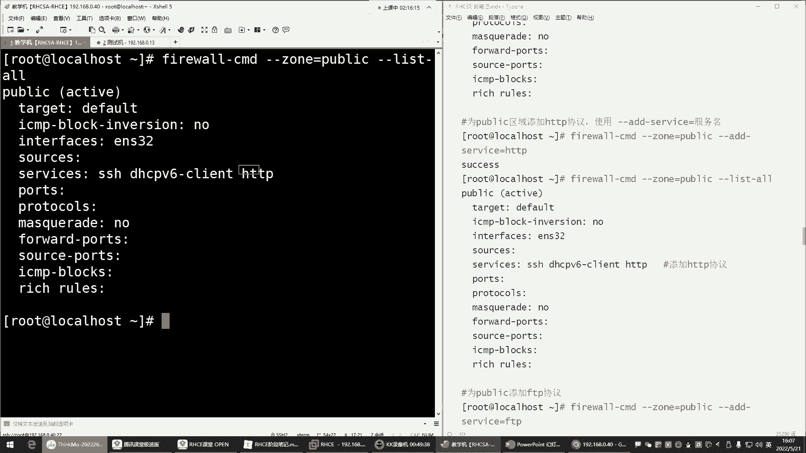

是添加协议的名字，那这时候刷新就可以了，看到了吗，这时候就可以了哈，因为允许访问了呀。

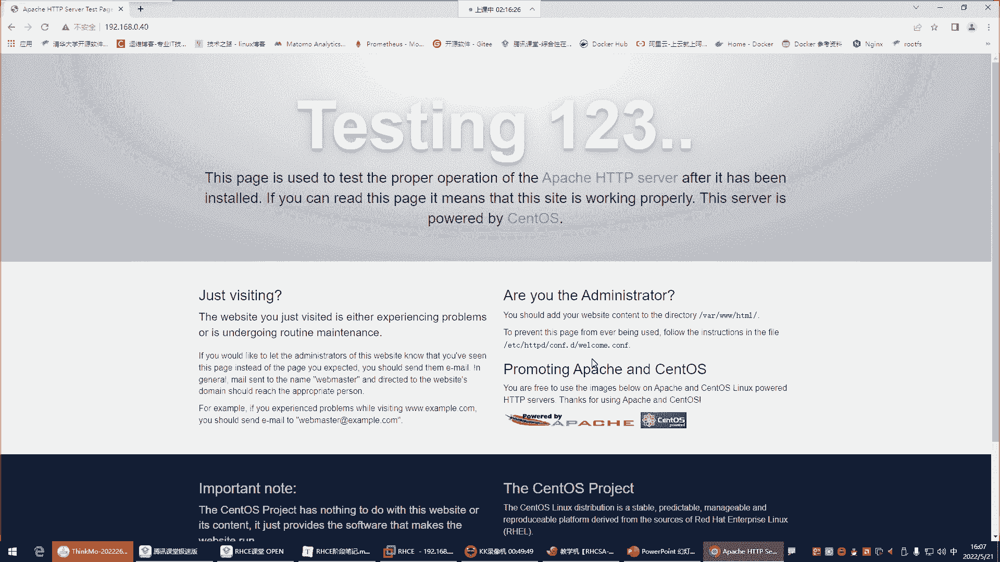

那你说我再给它添加一个什么HTT，PS之类的，都可以，再加一个加一个HTTP回车，这时候你再看回车，这里面又多了一个HTTPS，看到了吧啊，那如果说你的这个服务器里面的网站是加密的。

那HTTPS也可以访问，如果要同时添加多条协议啊，我看看啊，FTP到号隔开行不行，逗号隔开，我记得我好像这么干过，我是怎么干的呢，Ftp，多条协议怎么添加的了，FTP还有什么呢。

比如说再来一个啊啊再来一个DNS啊，不行啊，DS可以吗，嗯TFTP吧，Tf tp t f t p，这样好像不行啊，他不行哈，它不行，它不支持啊，不支持，只能一个一个添加，不行添加不了啊，一个一个添加啊。

但是这个用用的不是很多哈，用的不是很多啊，想删除怎么删呢，这样杠杠remove杠south在这source，如果你想删的话，就把ADD换成REMO杠杠r e m o v e remove杠杠。

remove杠，Source，删谁删HTTP回车，杠杠纵删除规则，北幕杠source facebook杠SAMD刚刚重，public杠杠r r e m o v e remove on source，诶。

呃什么情况呢，Http，啊少了个E是吧，敲错了是吧，没有啊，有E哈，s source吗，没错啊，呃，诶删除删除，啊这个不是哈，service service服务加服务名HTTPHTTPS好。

我说的呢嗯不是source了，对service service哈，对杠SAMD，这时候你在干嘛呢，在看的时候，杠杠纵等于public往上翻命令吧，哈这看是不是没了呀，对就是你删谁，你要看对应前面的名字。

删服务就跟service，但是没有那S哈，没有S你要删地址，source代表是原IP，这是原P想删端口来指定port端口，它里边永远都是没有S，注意它是指指令，它这里面是是有个S。

但是你在用的时候是没有S的，能解吧，OK呃，然后下面我们再来说说，对这个威尔沃的防火墙呢，对大家掌握来讲，对于这个菲尔沃防火墙，你们掌握的话呢，不用掌握太多，因为他用的属实是不少啊，不属实是不多。

所以下边呢还有一些操作呢，你们可以自己去看一看这里边哈，但是这个呢也呃也没也没去什么呢，也没去准备太多菲尔沃的技术点，因为菲尔沃对于我们这个平时工作中用的少，我们工作中主要用什么呢，Ip tables。

IP tables是我们工作中，你需要掌握到一个防火墙的内容，所以这个呢是我们要学习的重点哈，fever简单了解了解就行，我都不用它好，这是IP tables，然后我们呢休息一下。

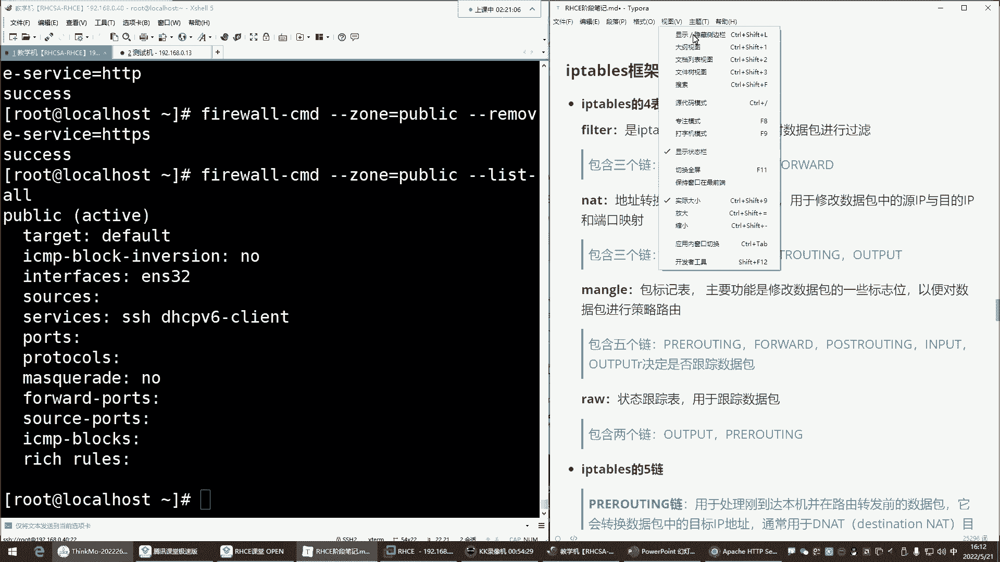

一会回来给大家讲讲IP tables。

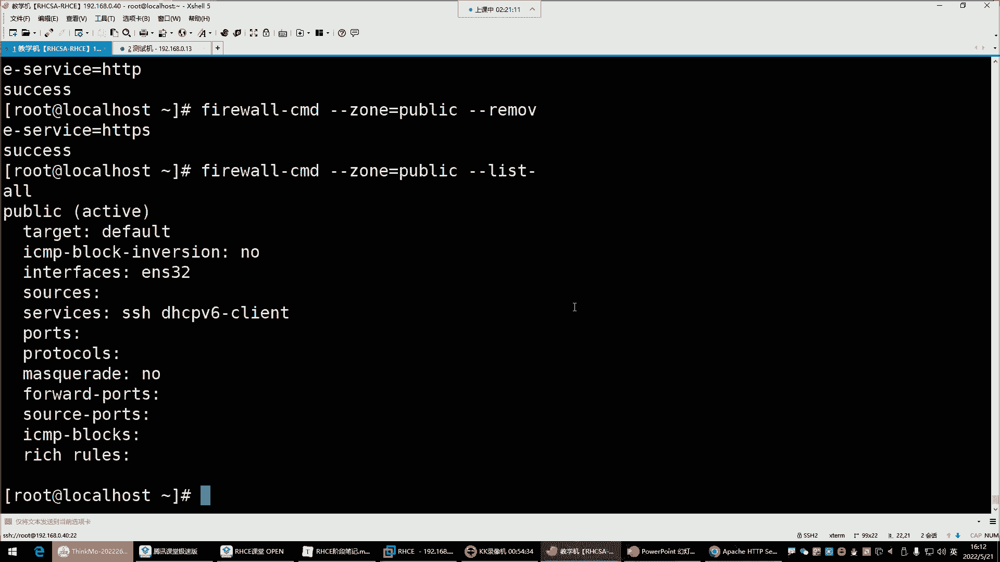

这玩意儿这玩意用的比较多哈，Ip tables，对休息一会儿休息会儿哈。

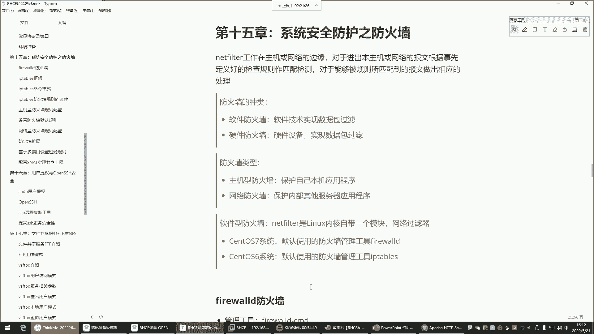