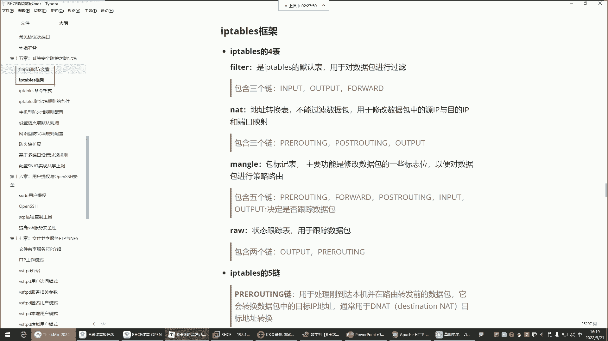
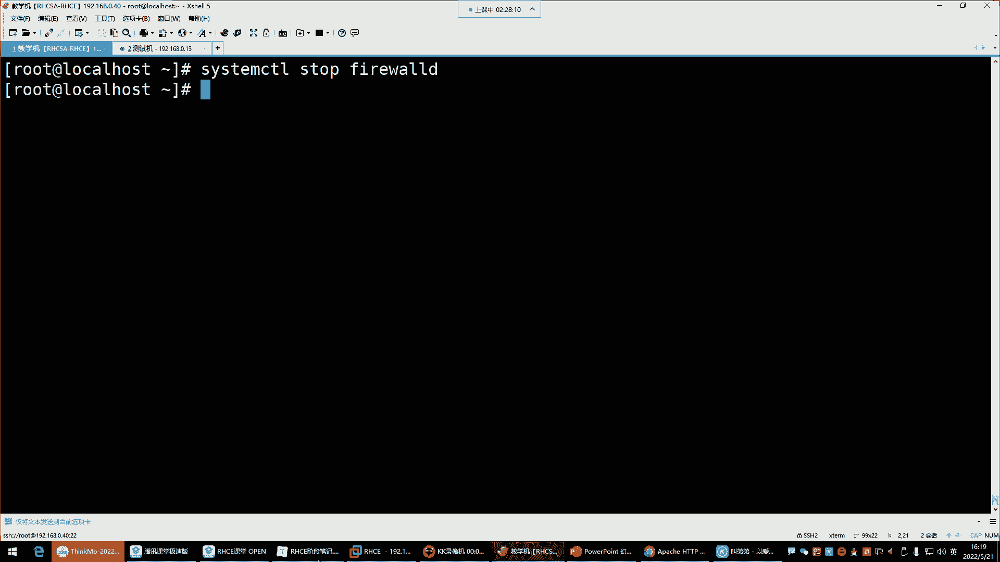
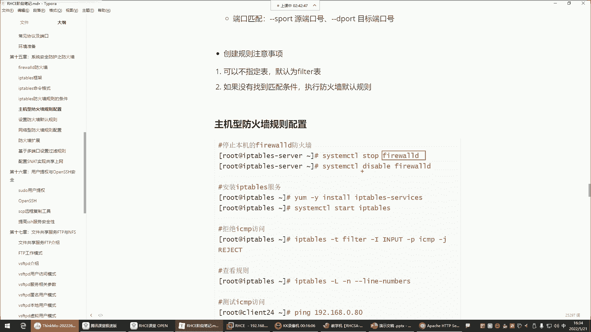
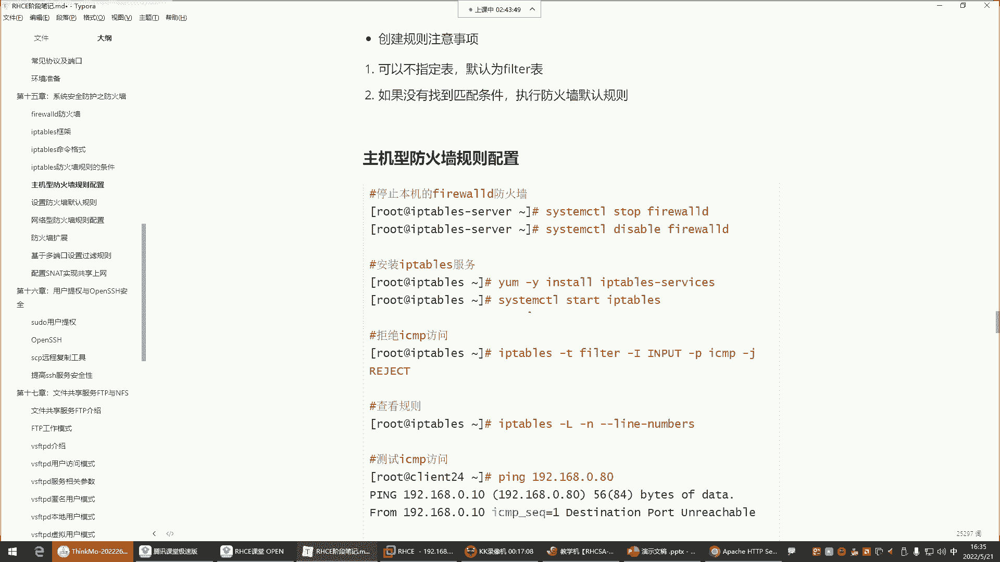
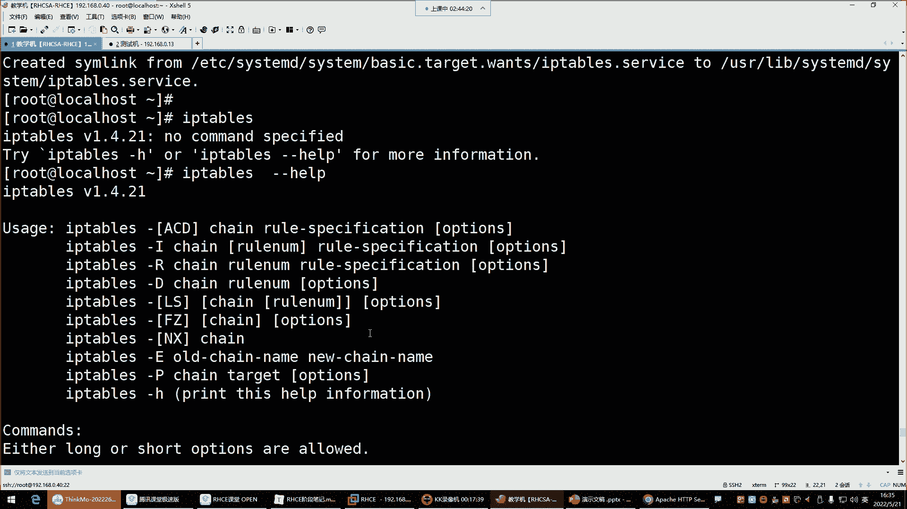
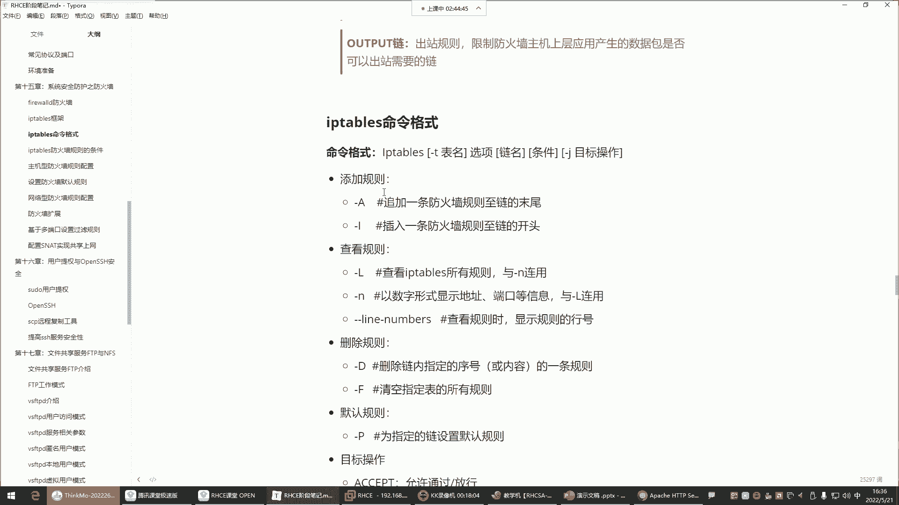
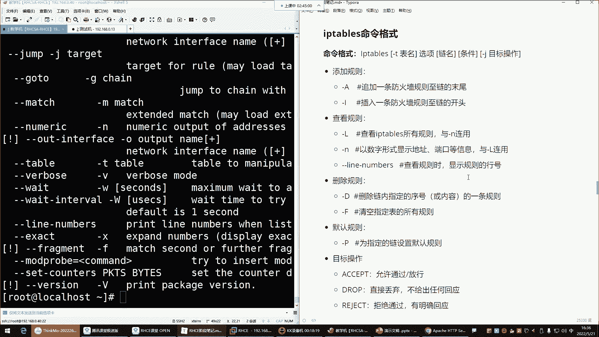

# 0基础小白怎么入门Linux运维？看这套，Linux运维全套培训课程，保姆级教学视频 - P53：红帽RHCE-17.iptables防火墙四表五链 - 小方脸不方- - BV138411B7p5

哎呀喂喂喂，都回来了吗，回来的话给我刷波一，我们来学习这个IP tables哈，那IP tables确实比那个菲尔沃有难度，这个毋庸置疑啊，这也是怎么说呢，对于大家来讲也是这个一个挑战。

但是有什么说什么啊，IP tables对于大家掌握的内容呢，就是没有没有，就是说把所有的防火墙都可以都得需要掌握哈，不是就是我们只掌握我们用得到的，也是比较常用的那部分就可以了。

那后期你比如说你们企业里边，有一些额外的需求，那大家呢可以在基于我们现有的基础上，你自己呢再去什么呢，再去挖掘挖掘啊，这个就有你先入门，后期呢什么都不看好，那接下来呢来IPTP呢。

他跟FAREWORK呢同样都是防火墙的管理工具，这两个工具都是用来管理谁的呢，都是管理那个net filter这个内核的模块的啊，所以这两个工具用哪个呀，也都差不多能理解吧。

所以我们现在呢要讲IP tables，你想想这两款工具都是操控着同一个模块，那是不是这两个工具你用一个就行了呀。

他们没有办法同时存在吧，所以关掉一个，把firework给它关掉吧，FIREWOR把firework停掉了之后呢，然后我们再来说说IP tables。

那IP tables他呢你看前面那个firework是分区域，他那个叫区域，但在IP table里面它不叫区域，它叫什么呢，它叫四个表跟五个链，IP tables的四个表跟IP table的五个链。

哎哎它这里面叫表跟链叫法不一样，但我们说说这个表格链之间，他们的关系是什么啊，首先这个表里边是存放诸多的链的，然后这个链里面是干嘛的呢，这链里面是让我们配规则的好，那表的功能，每种表呢它功能不一样。

我们先说说这个四个表都有哪四个，第一个叫felt，felt是IP tips的默认表，用于对数据包进行过滤的，那也就是说felt，它就像那个地铁站的那个安检口一样，安检口好，这个安检口就是干嘛呢。

去检测你每个人是否携带一些安全物品啊，有没有一些危险行为之类的啊，所以felt在IP tables这个防火墙里面，就是那个什么呢，那个数据过滤的那个安检口好，那既然是安检口。

在安检口里面是不是有人是搜身的，有人是检测你携带的物品啊，比如说检测你的饮品什么的，你得喝一口，是不是啊，唉不同的这个什么呢，不同的安检有很多种，或者说有很多种安检方式啊，所以说对于这个安检来讲。

那felt它既然是一个数据过滤的这个表，那里边它也有很多种数据过滤的方式，那这个数据的过滤方式有什么呢，有这些我们稍后再介绍，这里面就是链了，这链的话呢，我们一会儿要往这个不同的链里面配规则好。

先知道一下，在这个felt表里边，他注意你们注意这个IPTX一个规律哈，什么规律呢，就是只要是这个表是对数据包进行过滤的，那在这个表里边的这个链儿，就全都是对数据包过滤的啊。

所以这个要记住它的规则就行了，那下面那个表这个表是做地址转换的，它不是过滤数据包的，然后用于修改数据包中的什么原IP和目的IP，跟端口映射好，那这个时候你看这个表，它既然是叫地址转换的表，我告诉你。

那这里边的链全都是给你什么呢，做地址转换的链能理解吧，这个表是数据过滤的，那这个表里的这些链全都是数据过滤的链，所以这是它的一个规律，好那这个地址转换我们稍后呢用的时候再说，先有个印象。

mango叫包标记标，主要的功能是修改什么数据包的一些标志位，以便于对数据包进行策略路由，这个的话呢啊一般用的比较少，策略路由对于这个防火墙设备来讲，就是这个策略路由啊，如果我这个防火墙设备。

比如说接到这个包以后啊，我们这个可以选择有哪块网卡去接收，有哪块网卡去发送这个数据包，因为这个防火墙设备，有有的企业可能说这一个服务器啊，好几块网卡，好几块网卡啊，那我有哪个网卡去接受这个请求啊。

啊或者说我我在给用户返回数据的时候，我通过哪块网卡去把数据发送给客户啊，可以选择叫策略路由啊，嗯然后这四个表里边有一样的链，配置一个表里的链，别的表不会同步不同步啊，然后下边这里边就是因为策略路由的。

一般我们用不到，然后下边肉叫状态跟踪表，用于跟踪数据包好，那这个跟踪数据包更用不到了，为什么呢，消耗资源在企业里面，比如说一个用户，他的请求到达了我们这个防火墙设备以后，那我允许他访问的情况下。

那这个时候你如果全程跟踪它，就是这个数据包，它从访问你以后，然后在你的整个的这个什么呢，整个服务器里面做了哪些访问操作，你都要全程跟踪，特别消耗服务器的资源，能理解吧，消耗资源的事一般在企业里面。

他不干，所以一般像这种情况下呢，我们也不会去关注这种什么状态跟踪，最主要的是我只要是在这felt，我对你的数据包做了过滤了，我觉得你这个数据包是安全的，数据包我就放行就行了。

其他的你在我的这个服务器里面做任何的访问，我就不管了，就像我们去地铁站，主要是人家安检口给你做了安检了，你一进去，人家还关心你在我的地铁站里面上几趟厕所吗，或者说你坐到哪个站点吗，我还派个人跟踪你吗。

不会是不是啊，唉没有那功夫去跟踪你，所以安检口你没什么危险物品，你在进到里面以后，你爱坐哪一站就坐哪一站，你爱上哪儿就上哪儿，是不是，所以说对防火墙也一样，最主要的就是这个大门儿，他就是防火墙的大门。

把大门看好了，其他的什么修改数据包的标志位，什么肉状态跟踪，这都不用管，所以对IP tips来讲，大家主要学习的是谁啊，felt数据过滤啊，那AT呢我们也会讲啊。

因为在企业里面也会有一些NT的一些应用场景，那到时候用了再说好吧，所以我们对于这个felt表是非常重要的表，因为它这个表里的这些链都是对数据过滤的好，那接下来来看这五个量，那这五个链里边我们先说什么呢。

先说input链跟output链，这两个链它首先都存在于felt表里边，filter value file标里面是包含三个点，一个是input，input叫入站链，output叫出站链。

forward叫转发链，好，那这个我们先说input和output，这两个链怎么工作的，来看这个图就行了，首先注意防火墙，我给大家讲过分为主机防火墙跟网络防火墙好，那如果做的是主机防火墙的话。

这个时候用的是哪两个链呢，叫input链，input入站链，用户请求注意它到达我这个防火墙设备的时候，首先得先经由谁去对这个数据去处理呢，首先就是felt表的这个input链，这个input链里边。

比如说我配了两条规则，第一条允许所有客户端访问本机的网站，第二条拒绝所有客户端访问本地的网站，注意我的规则配到input链里面了，那这个链里的规则只保护我这台服务器的应用，我的网站应用，我的其他的应用。

所以这叫主机型的防火墙，我会用到input作为我的入站链，入站的数据包过滤的啊，这个位置，然后你的规则就配到这个input链里面，OK比如不染链，那output呢它叫出站链，出站链就是用户访问你。

那你网站要不要给用户返回页面呢，要返回是不是，或者说人家从你的网站下载一些东西，你要不要把数据传递给人家的，要那这个output的它是干嘛的，他就是决定我的这个主机里边的这些应用。

它产生的数据包能否出去，这叫出站链，但是这个链一般不配，为什么呢，就像你进地铁站一样，你进地铁站，人家前面给你做安检了，那你在出地铁口的时候，人家还会再安检吗，不会的，是不是啊。

就是我只要是允许你访问我，那我就允许我的应用给你返回数据，如果我觉得你这个你这个数据包压根儿有危险，我就直接给你拒绝就完事了，是不是我进都不让你进来，所以出去的一般我们是不会配规则的，在这里边。

那你看我们现在又什么呢，又提取了一些精华的部分，就是对于IP tables来讲，我们看看，如果说想保护自己本机的一些应用的话，那这时候规则是配在那个数据过滤表的，input链里面的。

那你说如果我想做网络防火墙呢，我想保护的是谁呀，是我企业内部的其他的服务器呢，那这个时候你要用谁呢，叫forward的，叫流量转发量了，但这个流量转发量也在哪儿呢，也在这个file表里面。

因为它是做数据过滤的，它既然是做数据过滤，我说过只要这个表它的功能是数据过滤的，那在这个表里的所有的链都是数据过滤的，第一个过滤入站的数据包的链，第二个过滤出站的数据包的链，第三个过滤转发的数据包。

所以这个时候我们在这个图里面，forward的叫流量转发，也在那个filter表里面，那转发的话，就是我想我后面有个集群用户的请求，到达我这个防火墙设备，我就专门去干嘛呢，去过滤他的数据包，然后呢。

如果这个数据包没有任何问题，我就可以干嘛呢，在否认的这里边，把这个数据包转发到我企业的其他的服务器了，所以说这个流量转发里面，是可以被允许和拒绝的，如果我这个里面是允许用户访问我的网站的话。

那这时候用户的请求就会什么呢，被转发到你的这个集群的内部的网站服务器，如果我这个FD里面配的是拒绝好，那这个用户的请求就进不来，能理解吧，啊就是我到底是转发还是不转发，全看我的。

否则在这儿的规则到底是允许还是拒绝了，OK那注意，那现在大家记住input入站规则，是看看限制客户端数据包的目的地址，是防火墙主机的，你就记住它是干嘛呢，只去过滤防火墙主机的什么叫上层应用。

或者说本机内的应用，防火墙主机的内部应用都可以，就在这个图里面，我防火墙主机里面这个应用，但是我在我的内部其他服务器的应用呢，那这个input line是管不了的啊，你就得用fold链了。

所以主机型防火墙用input链保护其他的机器，用fold链，这个已经给大家啰嗦好几遍了哈，应该都听明白了好，那接下来再来说上边的这个什么，pua routine跟post routing。

这两个链分别干嘛的呢，这两个链是做转发的，他是在NET这个表里边的好，那NET表里边AT在网络里边叫做地址转换，那既然它叫做地址转换表好，那在这个表里面的链都可以帮你实现，叫做地址转换。

但为什么output也在也在这里面呢，啊这个我们一会再说，因为转换的话会涉及到一些出口的数据包，所以这时候也会有一个output的，那这个时候来看啊，在这个里边我们先说这个pre ring。

Pre ring，它是在这个里边角色，他的角色pre rout叫做客户端目标地址转化链，这一般什么时候用呢，一般啊在学容器的时候，在学容器的时候，我们会用到这东西做一些什么呢。

做一些叫做这个端口映射的时候啊，一般我们会干嘛呢啊，就是把客户端的那个什么呢，那个请求，把客户端的请求直接给它映射到干嘛呢，映射到我的内部去，但这个现在我们还没有应用，所以大家也没有什么印象。

那另外一个叫做post rout，这个呢在企业里边呢也有它的应用场景，叫内部原地址转换啊，这个一般什么时候会用得到呢，这个就不太适合放在我们这个企业的集群里面，用了，企业集群其实不会用到这两个东西哈。

不会用到这两个嗯，那这个这两个里边一般用在公司的内网，想要去访问互联网的时候，会用到这玩意儿哪个呢，就比如说你们公司有一群PC机，有有有一群办公电脑，这些办公电脑想访问淘宝，想访问百度。

那这时候看你们公司内部啊，它是一个什么呢，都是私有地址的那些PC机，那些电脑，但是呢你发现你你插上你们公司的网线，为什么你就可以访问互联网了呢，但是你的地址明明是私有地址啊，是因为你们公司就有一个设备。

有可能是路由器，大多数都是路由器，那个路由器上边它自带一个什么呢，叫做路由转发啊，那个叫做SNET叫地址转换的功能，这个SATS是source叫圆，谁是圆呢，就是你的内部服务器的IP就是原。

那谁是目标呢，他们想访问谁，谁就是目标，他们想访问淘宝，淘宝就是他的目标，所以SAT就是source叫原地址转换，转换什么呢，就是把这些原地址转换成外网的地址，你只有有了外网地址才可以去访问外部的网络。

所以这叫把他们的原地址转换成我的，这个什么呢，转换成我这个外网网卡的地址去访问互联网，所以叫原地转换，那还有一种叫目标地址转换，目标地址转换一般就是干嘛呢，就是啊这个用用的比较少。

一般就是别人访问你的时候，别人访问你的时候，你可以把他的地址给他，转换成我的企业内部的地址，这一般比较少哈，一般都是怎么说呢，主要是这个在企业里面，用一些内部网络相访问外网的时候。

一般在路由器里面网购会配啊，这种功能一般网工干不是不是我们干的嗯，所以我们在防火墙里边，那两个链也几乎不怎么用，所以这里边我们对于防火墙来讲，学主要学什么呢，哎input跟forward转发点。

其他的用不到，用不到哈，所以这两个链都在哪个表里面呢，都在这个表里面，fail表其他的你能用得到吗，用不到是不是啊啊就这两个保护我本机的，保护我其他的机器的就可以了，那接下来对。

接下来的话呢咱们来说说IP TP IP tips呢，它有一个他呃，这个我们来说说他这个命令格式怎么玩哈，啊他的这个命令格式，我们第一呢要安装这个IPTPS的服务，IPTX软件包叫什么。

叫IP tips杠service，把它安装上，然后停掉你本机的fir，然后再给它设置成随机不自启，他是一个注意啊，菲尔沃是一个随机自启的服务，所以给它停掉。

停掉以后呢，给它设置成disable一下，Disable，然后接下来呢再安装一个IPTPS，会冲突啊，他们两个都是啊，Net filter，注意那两个工具都是操控同一个内核，所以两个工具操控同一个内核。

这内核不知道听谁的，会冲突哈。

那一般只用一个，那接下来的话呢，我们是不是就给大家已经说明白了，我们学防火墙学谁啊，是不是就是filter表里的input跟forward的这两个链，其他的都几乎用不到啊，然后下边来安装好以后。

把服务给他起来，Starter ip tps。

start IP tables回车设置成随机字起，好enable项，OK然后对IP ti p tabsmeeting是IP tables，然后回车，杠杠杠杠help回车，这是它的命令的帮助。

那对命令帮助的话呢，你看他的命令格式非常多，是不是啊，这么多命令格式没关系，一点点学啊。

在学习命令之前，还有一些内容给大家说一说，对IP table来讲，它的命令格式非常的复杂哈，然后这里边我们一步一步拆解，我现在想看规则，就是我对IPTP来讲，我们是用它配规则的，是不是啊。

那他配规则的时候啊，我们是IPTP是命令本身，然后呢命令格式杠T指定表名，我们来把这个东西啊。

这样哈不行，这个防火墙讲的时候必须得这样了，不然很多东西在这儿哈，很多东西你们看看不到就忘了。

