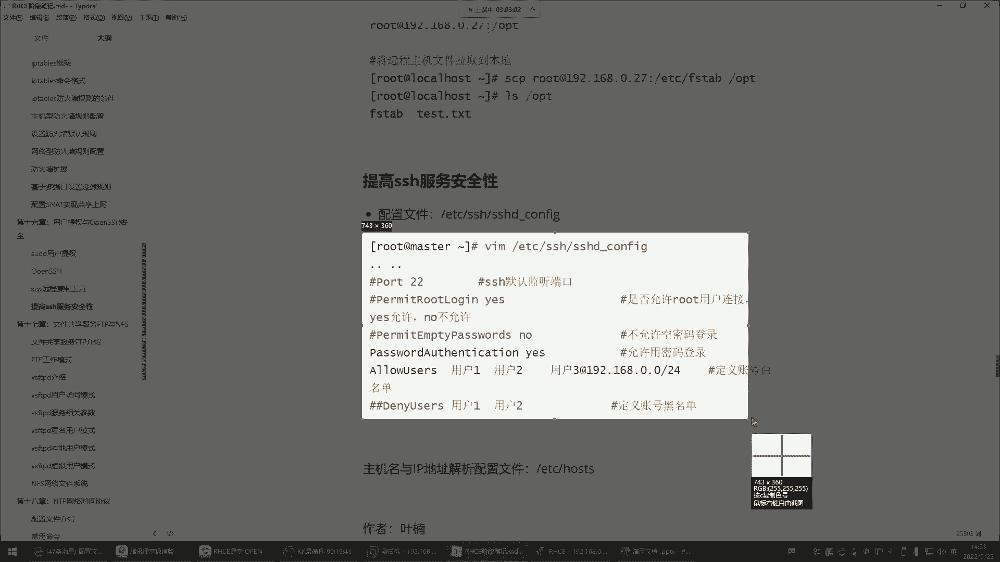
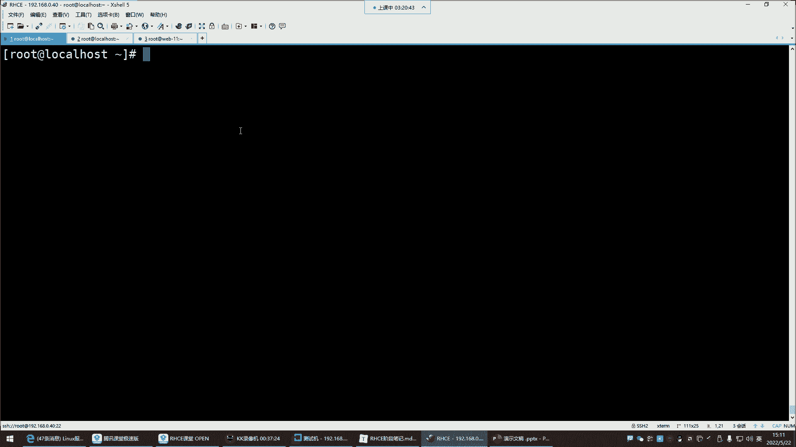

# 0基础小白怎么入门Linux运维？看这套，Linux运维全套培训课程，保姆级教学视频 - P56：红帽RHCE-20.用户提权与OpenSSH安全 - 小方脸不方- - BV138411B7p5

喂喂喂喂喂好，OK那我们就开始哈，开始继续，前面的是实现了什么呢，实现了这个相同系统之间的一个密钥认证，注意啊，这种是LINUX与LINUX之间的这种密钥认证方式，那接下来呢。

接下来我们要实现windows与LINUX之间的一种认证方式。

那这种的话怎么认证啊。

我们平时用windows跟LINUX之间，如果你想认证啊。

得通过叉烧这种工具来实现叉叉这个工具啊，它本身呢你看在工具里面工具，然后有很多功能是吧，什么发送发送件书的所有规划，然后这玩意儿怎么玩的呢，就是你看你点这个点一下，你发现他这有提示说什么发送键盘。

输入所有回话，那也就是说我再把这个终端给大家展示一下啊，叫水平排列，那现在我清个屏，你们注意看，我清屏了诶，你发现这个是我在我的上面这个终端清和平，他们是两台机器哈，我敲个IOS。

你发现诶下面也同步看到了吗，也同步了，这是什么意思呢，就是这种啊，叫做你在任何一个终端去敲命令，其他终端也都同步啊，这种事，一个终端可以对很多个终端去执行命令啊，但这种事呃，前提是。

你的所有操作得需要在这些主机同时执行，就是这些主机执行相同命令的时候，唉你才可以这样玩，这个指导一下工具再取消掉哈，然后这个呢不是我们今天主要讲的哈，再给它合并一下，合并所有选项，我们主要讲什么。

我们主要讲这里面有个叫做呃，用户密钥管理者啊，还有下边什么新建用户密钥生成向导之类的，我们注意啊，在这里边有一个主机密钥管理者，在这里面可以看到，我们当前这个主机有哪些密钥，看吧，这是我曾经生成的啊。

当然这些庙是跟谁的呢，这妙就是跟我这个经常连接的这些机器的妙，看到吗，就是手册连接的时候，它会有一个认证，你们还记不记得，就是我们先安装好一个机器手册链接，它有一个那种认证啊。

那个认证就是给你保留下来了啊，你曾经连过哪些机器好啊，这是还有什么呢，还有这个下边什么用户密钥管理者，这里边就是如果你跟哪个机器啊，建立过这种密钥认证，那这个时候他会给你保存下来，但他俩不一样哈。

这个管理者你比如说我把那个删了呢，我把这个一二给他删除，删除了吧，删除以后，我现在呢退出，我再连接这个机器，112哈，回车，你看他出什么提示呢，他说这个就出这个提示了哈，什么未知的主机密钥。

就是他们俩之间是由于第一次建立链接，所以说他们之间也有一种这种密钥认证的方式，他问你接受此主机的密钥吗，如果你说接受并保存，它就给你保存起来了，如果一次性接受，它就不保存，如果你经常连这个机器。

他每次都会有这个提示，能理解吧啊一次性接受就每次都有这个提示，所以说呢你就直接接受保存，保存到哪了，就保存到刚刚那个工具里面了，所以这时候你输入root密码二就可以了，然后他就把那个刚刚我们的那个密钥。

放到这里边了，给你保存下来了啊，当然这个包怎么没有看到呢，112是吧，这呢这呢一二，那下面这个叫新建用户密钥生成向导，这是什么意思呢，这个我们点击以后看一下哈，就是他就像我们前面在这个主机里面。

敲的那个命令一样，敲到哪个命令呢，敲到这个命令SSH杠K帧一样生成一个什么呢，密钥对，只不过是插射帮你生成一个密钥对。

然后这个密度的话呢，他也是告诉你了，我的密钥类型是RC的类型，这是密钥的算法，然后密钥的长度2048倍，2000多位的一个密钥，其实我们刚刚那也是2000多位，都是2048，然后你点下一步。

这时候呢是2048位，看了吗，正在帮你生成的，然后告诉你公钥对已经生成了，注意是公钥对已经生成了，然后请单击下一步，输入用户密码，下一步，然后这是你的什么，你的私钥文件，私钥文件。

他问你要不要给这个加个密，输入密码吗，不用密码就是空的，下一步密码是空，那是没错，仍要继续，刚刚是私钥，没有设密码，接下来这公钥公钥的格式谁给你生成的呢，open s4H给你生成的也是一样。

这个公钥要保留下来，保留下来哈，你可以给它保存为文件，放到你的桌面保留下来啊，然后接下来呢这儿复制一下，右击复制，为什么要复制呢，你不在这复制也行，你从你的保存的文件里面复制也行，然后他给你生成了哈。

生成以后注意这个公钥文件要放在哪儿呢，你想跟谁建立免密连接，你就放到哪个主机的公交文件里面，你比如我想跟这个机器去免密连接，S杠AVM点SSH下的公钥文件id rs点，看到吗。

我想跟这个机器建立免密链接啊，O进入输入模式粘贴进去，注意哈，把把我们刚刚那个公钥，粘贴到这个对方的公钥文件里面，然后保存退出，保存退出以后以后我再想连接这个机器哈哈，SH192。168。0。40回车。

用户名root，确定密码，注意现在密码用谁啊，public这是我的私钥，看到了吗，你的私钥有密码吗，没有密码啊，确定，啊这个啊确定确定确定，public public在哪啊，文件桌面public打开。

确定诶，这是我的私钥，这个文件名不太对劲啊，他这个他这个文件的名字不应该叫这个名字，他应该叫这个名字，点SH应该应该叫这个名字哈，呃叫这个名字。

那怎么办呢。

嗯改个名别改了，改个名也行，那就改个名儿吧，嗯或者说咱们再去建一个文件，建一个叫这个名字的文件，然后把它的功效给它粘起来，VM在这个路径路径哈建一个叫这个名字的文件，建完以后把这个公钥给它粘贴进去。

刚刚那个公钥在我的桌面啊。

这是我的私钥文件哈。

IDRC点pub公钥，不是一个了，这这公钥一般得保存好啊，你再往回找，你发现还挺麻烦的，保存好哈，杠A点ISCHIDRAC点pop，dd删掉，那这时候再试一试啊，Root，好选择public，确定哈。

看了，就是这样搞的。

怎么搞啊，就是这是你的私钥，这是你的私钥，私钥是你是你要保留好的，保留好以后。

然后呢他不是给你生成一个还有一个公钥吗，公钥在这里边，用户密钥管理者DRC啊，看到时候从从这里面找你的公钥就行，把这个公钥复制到哪呢，复制到对方的主机的那个，他得必须要叫那个名字，能理解吧。

你看他这名字就是认识，叫这样名字的这种认证文件，然后你如果没有的话，建一个，然后把内容给它粘进去就行了，粘进去以后以后再想连这个机器就直接什么呢，直接是不是通过这种密钥文件去连接呀，哎这个位置看懂了吗。

这是windows之间哈，windows之间这种，嗯是什么意思，客户机可以拼通防火墙的内外网，卡，内网评不同，外包服务器，客户机可以拼通方形的，内内外都可以拼通是吧，内外都可以拼通。

路由转发没开路由转发哈，你的那可能请求没给你转进去的，看六六法啊，这是open SSH，就是我们刚刚给大家演示就是什么呢，就是这种密钥认证的登录方式，怎么通过密钥去跟对方建立这种这种连接好。

然后这个open SSH啊，它呢还有一个小功能叫SCPSCP跟CP一样。

CP是什么呢，CP是拷贝文件，把etc的pass w d拷贝到OPT，它是拷贝给谁呢，它是叫远程拷贝，他不是本机拷贝了，这种拷贝是在本机之间，是在你的同一台机器里边可以进行相互拷贝。

比如说我这个机器有一个文件。

我想拷贝给这个主机，那怎么拷贝呀，就得用SCPSCP指定文件好，我把etc下载，或者说啊我建一个文件随便搞文件哈，touch一个hello hello，点TT，拷贝root下的hello点TT。

以root的身份拷贝给谁，192。168。0。112，拷贝到哪个路径呢，这个必须要指注意在这个位置啊，我要说把这个文件就直接拷贝给这个主机的话，来回车啊，好像没有什么提示是吧，诶你看怎么没有这个文件呢。

那拷贝到哪了呢，跟不漏好像也没有是吧，看哈这样的拷贝他没成功，他虽然说没有提示，但是他没成为什么没成呢，因为你没有指定，要把那个文件拷贝到对方的哪个位置，所以英文的冒号非常重要。

在指定拷贝的root目录，他现在他现在的root目录，你看有那个文件吗，没有吧，这时候你指定root目录回车，唉如果成了，他会有这个提示的百分百，所以这时候你再看的话。

在他的节目中就多了一个哈喽的天体了，能理解吧，但为什么我们拷贝直接这么顺利就考过去了呢，因为我们做了免密了，免密了哈，就没有输入密码，如果没有做免密，还得输入对方的密码，这种叫远程拷贝。

那还可以远程拉取，远程拉取，我现在是把我本机的文件拷贝给他了，那我能不能把他的机器里的文件给他，拉到我的本机呢也行，拉到本机的哪个位置指定。

啊这拉取远程主机这个格式开始。

还有CP连谁连以root身份连这个机器，192。168，注意啊，现在远程拉取的话，就是先别指定你本地的那个路径，先指定我要连谁啊，你要拷贝的话是先指定本地的文件，然后拷贝到这个机器的哪个位置。

OP这个root目录拉取呢，就是哎我先连到这个机器指定拉去那个文件，然后再指定拉取到我本地的哪个位置，先指定拉取这个机器的哪个文件，1。168。0。112，冒号拉取他etc下的fs tb文件。

到我本地的OPT回车拉过来了，看OP t是不是，拉取过来，这叫远程拉取，所以远程拉取就是你先连上去，然后再指定拉取它的哪个文件啊，再到我的本地的哪个位置，远程拷贝的，事先指定我要把本地的文件啊。

拷贝给这个主机到哪个位置。

哪个路径，但是这样子这样远程拷贝远程拉取啊，这是一个比较实用的小功能哈，做远程拷贝的，然后下边呢这个提高SSH服务的安全，SSH这个服务怎么提，提高它的安全呢，啊在这里面呢没有什么需要我们改的。

就是需要大家了解一下它的配置文件，前面那个open SSH他有自己的主配置文件，它的主配置文件是在etc下边有一个SSH的目录。

etc s h目录，这个目录里面你发现有非常多的文件看了吗，但是都是这种什么，都是这种带什么ISA的算法的文件，它之所以能够帮你生成那种认证，都是基于这里的文件给你生成的，所以这个别动啊，别动。

它的主配文件就是这个SSHD下划线cf，这是它的主频软件，所以打开这个路径的SHD点康复，但不是点哈下划线cf啊，这些文件的话，有哪些东西是对于我们来讲需要知道的呢，第一就是它的端口。

SSH的端口看了吗，默认22在这里，这里边默认的port端口。

我这我记得里面写了哈，如果说你们公司里边说让你改S车的端口。

怎么改，就把这个22改掉就行了，但一般也不用去改，然后这个IP地址，看这嗯IP地址，安妮代表所有就所有的IP地址写我。

这里面我写了写。

拿过来找一找，这配置文件一般没有人去记它。

这里边，其实对于这个配置文件呢。

如果大家后期你们公司里面需要你去对SH呢，做一些这个啊这个一些防控的话，你可以去网上搜一搜，搜什么呢，搜s s hd cf，配置文件详解，很多人就愿意去翻译这种配置文件给你，翻译的非常的什么呢。

非常的清晰。

看这个，啊在公司当中，由于一些服务器的权限需要进行严格的管控，常常会涉及到关于登录呀，密钥呀一些管理配置，因此详细了解SSH的配置文件，一些配置项就显得非常重要啊。

它的默认的配置文件从这个位置啊可以看啊，配置文件由指令值组成，这里边，看了吗，这里面看看他说的对不对哈。

没毛病没毛病哈，这IP地址啊，列出IP地址什么意思。

指定SH监听的网络地址。

默认监听所有地址可以使用下面的格式，这里边，所以说我们这个你看它监听的地址。

四个零就代表所有，那上面呢什么意思呢，看不懂是吧，嗯上边，好像没写是吧，都差不多。

就是所有地址安静就代表所有。

然后包括那对于我们来讲，我们今天给大家介绍哪些呢，就是对于你们来讲。

你们现在这些现在没有必要去深入研究它，你就知道在这个里边呢。

很多东西呢是到时候公司用的时候，找配置文件详解。

人家让你怎么改就怎么改就行，你比如说他说咱们公司啊，这服务器啊，为了安全起见，咱们别让root登录了，那怎么办呢，唉你就去找一找，怎么禁止root登录，当然我这里边给大家一个什么呢，给你们写了哈。

因为很配置太多，没有必要挨个去去什么呢，去这个了解然笔记里面呢。

比如说你说公司说不让已root用户登录了，那这个如果你说你看笔记你也记不住，因为看笔记你还得翻笔记，是不是一般干嘛呢，就快速搜索快乐厕所这个配置文件叫禁止root，直接来搜唉这个文件如何禁止注册登录。

这个写的不规整啊，这边他告诉你第一步打开这个配置文件是吧，找到hot，把22注释改成22，再加上一行啊，这是改端口了吗，这是改端口哈，就是如果说这个东西人家让你改端口，你就把按照他的这种方法去改。

然后重启以后，你的端口就变成这个端口了，如果有防火墙，防火墙里面开放这个端口，别人就可以连接了，然后下边禁止注册登录，禁止root登录，这种改哪儿嗯，你改了默认的端口之后，我们还要进入注册登录。

这样保险一些，那这时候你看它它改的是哪呢，添加了一个用户设了密码了，然后就有你看你们看哈，他禁止住它，登录以后注意位置啊，它你看它这是禁止注册登录，他禁止root登录，他为什么要添加来一个用户呢。

再给他设置密码呢，是因为root不能登录，你得让那些普通用户可以登录，知道吧，普通用户如果你不给他授权的话，那root也不能登录了，普通用户就没权限，你这服务器就没法管理了，所以下边他是先建了个账号啊。

建了账号以后呢，再给这个账号提了一些权，他改了这个文件给他提权了，提什么权呢，嗯给他提了一个这个，什么权限啊，啊所有啊让他具备一个root一样的权限啊，看到了吗，他你看他这么玩的。

就是说呀他不让root登录，但是呢他又新建了一个账号，为什么，因为root呢大家都知道是系统默认的超级管理员，那别人想获得你这个服务器想破解你，他一般都是用root去破解root的密码，能理解吧。

对所以呢他直接干嘛呢，他直接就是把root给他干嘛呢，嗯不让root登录，然后呢我再换了一个账号，这个账号呢我给它开放所有权限啊，以后呢用这个账号去管理这些系统，那别人也不知道是不是。

那这个是你自己建的，你自己建的叫什么名字，只有你自己知道，而root的是任何的LINUX服务器都有这么一个账号，但是我给他禁掉啊，怕别人暴力破解，所以这样你看他是这样玩的是吧，哎把root呢不让登录。

那怎么进呢，就改这个文件，改这个文件在哪啊，找到这个啊，root login复制。

我们也搜索一下搜索啊，这个这儿呢多少行呢，大约在38行啊。

38行怎么做呢，他说他说啊，这是yes是吧。

你把这个改成NO就可以了，把这个的注释删掉哈，改成NO，然后呢退出退出，现在你登录的时候没事，这个你现在可以正常的去管理啊，但是退出以后我们再开一个终端，你再登录SSH，192。168。0。40。

这时候你再用root登录看看，有点慢啊，有点慢，好密码一确定诶。

我是不是没有加载配置文件呢。

啊对没有重启啊，重启服务哈，我说总感觉慢了一步呢，重启一下，嗯重启一下real s4HD，重启的话，那这个终端没掉哈，因为你是一直连着的，但是如果你一旦退出再连哈哈，输入root确定密码吗。

确定上不去了，看到吧，上上不去了哈，是不是啊，你看我输入密码了，确定什么去了，是不是，这就是以后root不能登了，那root不能登。

那一般企业里面呢就像他那个一样干嘛呀，建个账号。

建一个其他账号，建一个其他账号以后，他们用其他账号去登录服务器去管理，这样也可以也可以哈，反正就是方法比较多，嗯人家如果让你说咱们不允许root，咱们是不允许root登录系统了。

那你知道怎么去那么怎么去配。

就方法很重要，能理解吧，这方法很重要，它就禁止住它远程登录了，看了吗，哎这样就登录不上去了，是不是还有不允许空密码登录，那这个呢默认也不用改，默认它就是不允许空密码登录来看啊。

在这边，当然咱们我是我是给你们演示一下啊，咱们别禁止root登录哈，E t c s h d s4 hd，咱们别禁止root啊，我们把这个还是改回去哈，Yes，改成yes。

那还有就是不允许账号使用空密码在这儿呢，这儿哈，哎不是这个下边空密码password，这非常长哈，其实这个你不用改这儿呢哈这个，叫做禁止空密码，看到了吧，禁止空密码登录，禁止密码认证，他这里面这一行哈。

就是上面那一行哈，他们俩不一样哈，就是不允许空密码登录，下面是允许使用密码登录，注意哈，就是有的企业它不让你输入密码登录，你就比如说如果企业说好，我们为了提高服务器安全，咱们呢大家都使用密钥去连接的。

连接咱们的服务器啊，别使用什么呢，别使用密码了，那怎么办，这个位置要改成NO，默认情况下这个位置是什么呢，叫做这个禁止密码认证吗，是不是这个哈，Password ocation，是哈，翻译的有点问题啊。

叫禁止隧道名密码在这里改变，NO诶这句话是不是已经很通俗了呀，这个哈他俩是一样的，这个是注释了，这是注释了哈，但是对一模一样的哈，就是说他告诉你了，你如果要禁用这种明文密码的话。

你就把这里改为NO就行了，那就把yes改为NO，改为NO，以后保存退出重启服务，好，重启服务，这边root是可以登录的，因为我们改了可以让他登录了是吧，让他登录没关系，它输入用户名，输入密码诶。

你看没有密码的配置了嗯，是吧，就他想输入密码，不好意思，我这压根儿就没有密码，5G压根就没给你提供这种密码登录的方式，你得通关密钥去登录，你有必要你就能登录上来，没有必要你登录不上来，嘿看了吧。

那这也是一种提高服务器安全的一种方法啊，主要是对于登录的安全啊，啊把它给它弄成NO就行了，咱们再给他换回去啊，然后这个空密码空密码的话，那这个一般也是哈用户不让他使用空密码登录，不让使用空密码哈。

默认也是不允许空密码登录，这个就不用改了，如果你把这个改成yes，那那些没有密码的账号都可以登录了，所以这个就不用动，主要我们我们主要保证谁的安全的，就是保证root在起来，一般就是不让root去连接。

然后呢也不让使用密码去连接，保障服务安全，所以这个大家知道怎么玩就行，还有一些这个就是你不允许哪些账号登录，也可以定义它的名单，怎么定义呢，这个哈这个allow users，这里边USA在哪呢。

俄罗users好像没有，这里边，没有这里面没有那配置啊。

我搜一下哈，呃这是你得收得自己往里面收写。

啊没有没有呢，就自己往里面手写，allow users写谁呢，比如test写个test啊，写个test是什么意思呢，嗯叫定义账号的白名单，白名单是什么，叫白名单就可以登录的，叫白名单啊。

它可以从哪登陆啊，如果你只写用户名，就是他从哪都能登录，他用什么IP都可以连接服务器，如果你想指定固定IP就是好，你可以使用这个账号，但是你这个账号必须得什么呢，在一个固定的地址连接我，我才允许。

那就用户名at说有啊，beauty在我们公司内部环境的网络，192。168。0。0啊，斜杠24，BD在这个网络才可以连接我唉，那就是它只有在这个网网段的时候才可以连接，我们这台服务器，能理解吧。

那如果你说他从哪都能连啊，那就直接用户名，然后保存退出，重新加载一下，然后这边我们再退出啊，但test好像test好像没有没，好像没有认证吧啊重启服务了哈，那test可以连了，test确定。

好密码一是不是他现在可以正常登录啊，好那现在你看啊，我再把这个文件改改，改成什么呢，改成抵赖，注意哈，改成DNE。

这个。

迪奈叫黑名单，如果我这个变成DNA，后面test保存退出啊，再重启一下服务，那test呢他退出退出哈，他再登录test回车，密码回车，诶你看他输入密码了，看了吗，回车他上不去，是不是，你看回车。

为什么呢，因为这叫黑名单，黑名单哈，就是我们这台服务器你不希望谁登录，你可以定义它的白名单，也可以定义它的黑名单，能列吧，这他现在不能登录了哈，但如果我们把配平线给它改了。

给他换成允许它就可以登录。

可以登录，但是一般我们设置什么呀，就是我们如果设的话，咱们是不是一般就设置黑名单的，一般就是黑名单啊，所以说我不希望直接登录，就给他加到黑名单里面就行了，但如果你希望登能登录，那就压根就就别定义了。

是不是，那你黑名单里面如果设置root，那root就真的不能登录了，好所以这个知道一下哈，保存退出，所以在这里面这些是比较常用的，就是我想禁止哪些人不能登录啊，给他放到黑名单里面，然后啊。

如果你们公司里面真的是说，咱们不允许root远程连接了，那就把root禁掉啊，改成NO就行了，改成NO，然后也是啊，这个允不允许用密码登录，那就看情况看情况哈，以上就是对SH的一些安全性的一些内容。

比较常用的啊，我跟你们说的这些都是比较常用的，然后再给大家去说一个文件。

后期会用得到哪个文件呢，就是这个etc有一个post文件，这个文件干嘛用的呢，这个文件大家看一下它的格式哈，前面是IP地址，后面是主机名，看了吗，后边是主机名好，那我们再开终端，那前面是IP地址。

后面是主机名，那这个主机名对应了好几个是吧，local host什么local host，local domain等等等等等等，是不是，那你现在拿任何一个主机名都可以干嘛。

都可以去解析到这个IP地址上面去，所以在这你比如说我拼拼这个主机名，回车通了，拼谁了，拼这个IP去了，看了吗啊，我拼3W点百度点com好，拼谁去了，啊我是通过百度的域名。

能够什么能够解析到对应的IP地址，能理解吧，这是他的名字，这是百度的域名啊，但是他做了别名了，通过名字解析到对应的IP，所以说呢，我们给大家所说的这个ETC的host文件，就是一个IP地址和主机名之间。

相互解析的一个文件，在这里边我们另起一行，当然下面另起一行哈，另起一行，比如我想跟这个之间，跟这个主机之间通过名字去进行相互的访问，可不可以呢，可以你就把他的IP168。0。112。

主机名web杠幺幺前，前面这套的IP，后面是它的主机名保存，退出以后，我再想连这个机器我们之间也做了免密了，我就web杠11推车手册链接是吧，诶我们之前做过免密啊，啊可能密钥被我们给删了是吧。

好现在是可以的，可以的哈，看到了吗，我想拼这个主机，拼主机名回车，这叫相互解析，这是它的原理，就是DNS的原理，DS就是把IP解析到对应的名字，而我们这本地体现的就是，也是IP解析到对应的名称。

这是一个解析哈，那这个呢后面也会经常用到。

所以大家知道一下有这个功能在本地，你别到时候后边学后边阶段的时候，老师说啊，我们改我们做一个本地解析吧，然后你说啊，前面我我我我们怎么没有学过这个这个什么呢，这个本地解析呢，你别出现这种幻觉啊。

那它的格式对这个文件的格式格式是IP，然后呢再加上对应的主机名，不一定是主机名，什么名都行，名称不一定是主机名哈，这个名你瞎写都行，写什么到时候你就去什么呢，去指定名称，到时候他给你解析到对应的IP去。

它是一个相互解析，相互解析啊，写这个网站的域名解析是不是在这里做的对，就在这里做。

但是我们你在这写不行，你在这写你瞎写的名字。

浏览器不认识网站解析网站的域名啊，人家是花钱注册的。

我们的只能是如果自己测试哎，在我的本机里边，我想自己测试，那可以，你比如说我们这个机器，咱们是不是这个搭建了一个HTTPTTT，然后那个HTTPT然后我们可以自己访问自己，访问自己啊，Q访问自己2。

168。0。40，是不是可以看到，呵呵哒，那这时候这个机器他访问我，如果我们在同一个这个什么呢，在同一个网络之间，他访问我192。168。0。40也可以，但是他如果想通过名字访问我可不可以呢。

通过名字比较简单是吧啊也行也行，这个机器做个解析就行了，就是你看他想访问这个地址，那它想简单点，那它在它的本集做个解析，etc的host，他把他想访问的那个IP写进去，192。168。0。40。

这是他想访问的解析，是谁呢都行，随便写3W保存退出，那以后他再想访问这个机器，3W也一样，看到，不是那个SSH，它不是记录你的执行操作的，SSH是不记录用户的操作的，SSH只记录用户的登录，注意哈。

用户的操作是由那个谁记录的呢，是由那个速度去记录的，而SH它可不具备那个功能哈，所以你别搞混了，好那这是相同系统之间的解析，注意哈，这叫相同系统之间的解析，就是LINUX与LINUX之间的解析。

那windows我通过浏览器访问的时候，它管用吗，你windows访问一二访问3W好用吗，不好用是吧，那浏览器它只认识花钱的域名，你输入一个什么那些什么京东点com，人家是花钱注册了可以。

但是我们3W他不认识，能理解吧，那不然怎么办呢，啊到时候你得改windows的那个本地解析文件哈，windows有一个本地解析文件。

在windows c盘，windows文件夹有一个C是怎么32C4M，32里面有一个，Device，这个device有个etc，有一个host，看到这个东西了吗，嗯打开用这个notepad打开，确定唉。

看了吗，格式是不一样，你发现这怎么跟我们刚刚那个一模一样啊，没错他也是windows的本地解析，然后你在里面写192点，就是当168。0。40，后边对应的是3W可不可以可以，你这样保存保存save啊。

你这样保存以后，你再去访问的时候，那windows它首先会看自己的这个文件，windows他在给你解析域名的时候，浏览器首先要看本地文件，所以这时候输3W就可以了啊，3w，回车，这怎么没有解析呢。

3W点叉叉叉叉点，看不0192。168。0。40，文件保存没啥毛病啊，3W点叉叉叉叉点com，啊可以了可以了，太简单了，你太简单，浏览一些不认识，看了吗就可以了哈，是不是瞎写的，这是我们自己瞎写的域名。

瞎写的哈，但是你瞎写的，你写什么无所谓，最终你写的这个东西，只要是他的IP地址能够什么呢，能够被别人访问，没关系，这个位置瞎写，最终他给你解析的是这个地址，知道吧，瞎写哈，别瞎写。

这玩意显得我们好像没有文化一样，总是叉叉叉叉是吧，不是叉叉叉叉就是叉叉O第一天哼，显得我们特别的特别的啥特别的流氓，保存，啊已经保存了，这是windows哈windows的解析，那路路径记着了吗。

你们电脑也是那个路径，哪个路径啊，windows windows文件夹system32路径都一样，WIETC就这个路径，就这路径哈你们也一样，都是这路径哈。

这是windows的问题解析文件，这是LINUX本地解析，本地，解析文件，这个呢是不是叫本地解析文件，本地文件，这是LINUX的，LINUX系统的，这是windows系统的，格式，IP名称，好。

就是我们讲的这个一个提高SH的一些安全，然后呢我们稍作的休息一下，休息休息哈，休息休息。

