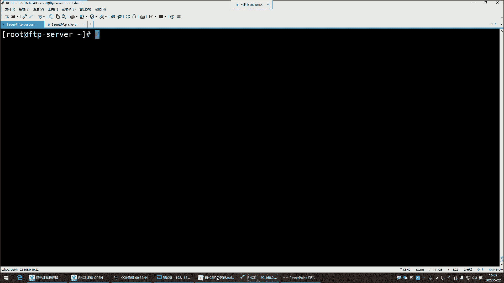

# 0基础小白怎么入门Linux运维？看这套，Linux运维全套培训课程，保姆级教学视频 - P58：红帽RHCE-21.文件共享服务FTP、vsftpd安装与使用 - 小方脸不方- - BV138411B7p5

喂喂喂好，这样就可以了哈，这声音就变大了，刚刚声音确实有点小了嗯，你今天就是上课晚了是吧，不到12点开课，我昨天就发群里通知了，想干饭是吧，你这么一说，你这么一说，我也有点饿了，其实但是饿归饿。

那我们现在这现在也不是吃饭的点儿啊，关键是你现在吃饭那一会儿你是不是得坚持哈，我们就是干嘛呢，叫苦其心志，劳其筋骨，对这得克服一下什么困难，我们得就是要什么，要咬牙坚持，你什么东西，你矫情吧唧的啊。

今天头疼，明天屁股疼，后天天太热，是不是啊，那你这还能学习吗，所以呢我们要什么，要克服我们一切在学习的阶段，我们所遇到的问题对，就像这个这位同学讲课间泡个面啊，我们把这问题给它解决掉，是不是。

来接下来呢继续讲讲FTP文件共享好，那文件共享服务，FTP跟NFS这个呢是比较什么呢，比较古老的一种文件的传输的一种方式了，注意啊，它叫做文件共享，它就是像我们平时生活中用的什么的呢。

用的那个百度网盘没啥区别，百度网盘我们用了，平时自己用来给别人共享一些文件啊，共享录屏等等等等，这个感觉个人比较方便是吧，那在企业里面的企业里边不会用网盘，为什么呢。

因为这个网盘这东西啊，你像我们其实可能会觉得，这网盘对于我们来讲多方便呐，啊传输数据什么的挺好是吧，共享数据，但是你们要知道网盘这东西啊，就拿百度来说，就这百度网盘你用的时候。

它是最终啊数据是存在了百度的服务器了，而企业里边呢有些数据啊，它不适合放在公网环境下，他呢比较保密好吗，这时候怎么办呢，这时候我们就自己在企业里边搭建一个叫做，企业内部的一个文件共享服务器。

其实功能就是跟这个百度网盘没啥区别，唉就是在企业内部的共享数据，你把这个东西他搭建到企业里边了，然后呢那这个服务器是你们企业的内部服务器，也就是说这个数据是存在自己家里面的，没有存在别人家能理解吧。

那这个呢是企业里面现在所需要的啊，内部共享，所以这是FTP了解了它的功能之后呢。

我们对FTP啊，它是什么呢，再给大家说一说FTP，它的全名叫做file transfer protocol，这个英文呢大家也不用去记它，你就知道它是一个文件的传输协议，这个文件传输协议就帮你传文件。

哪些文件呢，只要是文件都能帮你传，什么mp3这种音乐文件，mp4这种视频，还有脚本，还有JPG图片，还有这种拼接图片，还有GIF动图等等等等，什么点TT的文本文件。

还有什么这个一些java类型的GSP的，什么插ml的，插ml的这些文件，什么JASON的这种格式的文件，它都能帮你传对，什么HTML的，什么PP的啊，PY的都能帮你传，所以说这不就是传文件的吗。

是不是啊，那传文件呢就跟百度网盘一样，所以这就是企业内部的一个百度网盘啊，那接下来呢就是注意哈，为什么说FTP它叫一个文件传输协议呢，因为呀就是我们在企业内部想传文件，传文件的话，这个是走这个协议的。

就像我们访问网站，你访问网站它不走FTP，他走的是HTTP，能理解吧，HTTP看到了吗，你甭管是HTTPSHHTTP，这个协议是用于访问网站走的一个协议，而你想数据传输。

注意想数据传输就不适合用这个协议了，用什么呢，就用FTP在企业内部，所以他们之间都是协议，只不过不同的协议它给你实现的功能，或者说它的应用场景它不一样，这个协议的应用场景，就在企业内部做数据传输的。

所以说FTP呢它是一种在互联网当中，基于TCP协议进行端到端的数据传输协议，什么叫TCP协议呢，就是这种底层的链接，客户端跟服务端之间建立链接的时候，它是需要经过TCP这种握手，这种机制去建立链接的啊。

TTP里面有三次握手，四次断开，所以说呢它底层链接是走TCP，那数据传输呢数据传输上层就是FTP了，知道吧，通过FTP来来回回传文件，然后底层建立链接是TCP，是这么回事，所以对于FTP的话呢。

我们了解了解它的架构跟端口，它本身是这种cs架构，C是什么呢，C就是client的这个什么，这个首字母client就是客户端的意思，那S是什么呢，S就是server的缩写，它的全名叫server。

就是服务的意思啊，其实说的就是这个服务器服务端，这个服务端干嘛的呢，服务端是给别人共享数据的，客户端呢是来我这儿下载数据的，所以这就是叫CS架构，那这个cs架构里边它有这个对于FTP这个协议。

它有两个端口，默认使用20跟21这两个端口，那这两个端口怎么工作呢，就这一个服务，就这一个协议，他走两个端口，这两个端口20端口呢叫数据端口，用于数据传输好，21号呢是命令端口，用于接收客户端的命令。

来看这图，在服务端有两个端口，服务端是20跟21，这两个端口一个是数据端口，一个是命令端口好，那客户端它也会起端口，注意哈，他这个位置也要起命令端口跟数据端口干嘛呢，说说就是这个客户机。

注意我们说在企业里面，这玩意他是在企业内部给谁用啊，给LINUX服务器用，所以说甭管是客户端还是服务端，它们之间都是相同的系统，那相同的系统之间我们想要去建立链接干嘛呀，我们一般得下载那些工具啊。

通过命令去访问这个服务器能理解吧，是通过命令去访问的哈，那通过命令访问呢，我们一般这个一些工具呢它会干嘛呢，给你提供一些端口，然后呢你去访问的时候，他也给你起这种命令端口。

那命令端口就跟命令端口去建立链接，能理解吧，然后数据传输的时候，那就是数据端口跟数据端口之间去建立链接，进行数据传输，它是这么回事，所以说对FTP来讲，他这种cs架构就是你服务端有服务端的端口。

客户端的有客户端的端口哎，不同的端口呢就干不同的活，命令端口我就向你发送信，比如说我要干嘛呢，我要下载文件，我要get一个叉叉O点TT唉，那我的命令就交给你的命令端口去接收好，那我要get一个文件。

那文件你传给我的时候，就得通过数据端口发给我，知道吧，发给我，那你的你是通过数据端口给我发送数据，那我也得通过我的数据端口，去接收你的数据请求，而不是通过命令请求，不是不是通过命令端口的，但是这样的。

所以接下来呢我们说说他这个端口啊哈哈，如果想详细说他这个端口，得说说他的工作模式啊，FTP这个协议呢它有两种工作模式，第一种叫主动模式，第二种呢叫被动模式，这工作模式呢我就直接通过图形给大家说哈。

这样呢就别读那些字了，读字的话呢有点不太好理解啊，我们说说more这个主动模式是什么意思，这个有能有可能会被问到哈，就是有些人呢他可能说闲得比较赞同啊，他就想看你到底懂不懂这种，它的一些底层的原理。

他问你啊，FTP的工作模式都有哪些呀，能说一说吗，啊就这种这个就吃饱了撑的会问你这些东西，其实这种东西对于我们来讲呢，也没有太大的必要，那如果他问你，你怎么说呢，那主动模式是怎么工作的呢。

主动模式是看看客户端，用自己的命令端口发送命令请求，注意是命令端口连接命令端口向他发送指令了，那发送指令这个指令有可能是下载文件，下载文件也有可能是什么呢，唉上传文件push上传文件啊。

那这个时候命令呢我们一会再说，你就知道命令端口向命令端口发起请求，而主动模式下就是客户端，他发送的这个命令请求里边呢也会干嘛呢，也会告诉这个服务端本机的数据端口是多少，然后呢。

当这个服务端接收到客户端的请求以后啊，他还得给客户端回应一个包，回应包就是告诉这个客户端啊，我已经接收到你的指令了啊，比如说你我们告诉这个服务端，我要下载一个文件，那服务端也得给他回应一个包好。

我知道了，我已经收到你的指令了，告诉他啊，他们这一种应答机制，一问一答的机制，那回应包以后呢，这个时候啊，这个服务端，它就获取到了客户端的数据端口是多少了，那这个时候数据端口是怎么来的呢。

为什么是101321跟1024呢，随机起，注意哈，这种端口是随机起，你比如说我们下载一些工具的话，那个工具会随机起端口，这个范围你也不用管，一般都是1023，还有1023以上的端口。

一般就是没有被其他应用所占用的，没有被占用的啊，它就随机起，因为端口的话呢，一般是你想想那从一一直到多少呢，一直到6万5535呢啊，他只要看你这个机器哪些端口没有被占用，他就起哪个端口随机起，能理解吧。

然后呢这个时候服务端他就知道了啊，在这个客户端有个端口是1024，是作为数据传输的啊，那这时候主动模式就体现在这个数据传输，数据传输是由服务端主动向客户端发起，这个数据传输是谁呢。

哎服务端用自己的数据端口主动去干嘛呢，连接客户端的数据端口，连接成功，就是告诉你我要给你发送数据了，你准备好了吗啊，如果说这个数据请求能够成功建立，那客户端就能够给他回应一个包，告诉他啊。

我已经接收到你的数据传输请求了，接下来咱俩可以进行数据传输了，能理解吧，所以说主动模式体现在是数据传输，是由谁主动发起，由谁呢，服务端主动发起，并不是说命令请求由谁主动发起，命令请求。

永远都是客户端主动向服务端发起命令请求，就像我们平时访问淘宝一样，你可以这样去理解，我们是客户端，淘宝服务器是服务端，我们永远都是主动去向淘宝，服务器去发送什么呢，指令啊，我要点这个页面是吧。

你给我打开，你啥时候见过淘宝主动给你推个页面，到你的机器里面呢，没有吧啊，所以说命令请求永远都是客户端向服务端发起，然后服务端的接受你的指令，就帮你去实现这个功能，而这个它不一样，我们说的是数据请求唉。

甭管是主动模式还是被动模式，是数据传输是由谁发起，主动模式就是数据传输式由服务端主动发起，那这个有什么关系吗，有关系啊，有的时候你这个客户机如果起防火墙，你这请求就被防火墙拦截，能力吧，为什么呢。

我们前面是不是学过防火墙啊，啊那个特别是那个菲尔沃防火墙啊，如果是菲尔沃防火墙哈，那默认是不是只允许少量服务访问呢，firework杠SAMD杠杠get杠default啊，就直接看区域吧。

杠杠纵等于public，杠杠list，杠host啊，这防火墙关掉了是吧嗯，杠杠list啊，杠杠二啊，防火墙关掉了啊，没关系，我们把它开启看看哈，IPTP把IP tips给它停掉，Top。

IPTV再给它设置成随机不自启，下抵制我一下，因为我们前面给它设置成随机字起了，再给它取消掉，取消取消，就是他给你REMO删除了他的那个什么呢，那个随机自启的文件，就把这个路径下的文件给它删掉了。

删掉以后它就不会随机自启了，好然后接下来呢把费尔沃给他起来，15起来以后再看它的区域，啊，你看这区域默认是不是只允许少量服务访问的，没有FTP，没有FTP哈，那我们接下来把这个机器环境给他搞一下。

让这个机器当客户端，它当客户端，那我们这样对于这个机器来讲啊，嗯他的IP地址我们就就让它是这个IP，就是就是这个IP，但是名字改改，set杠，让它叫什么呢，让他叫client client杠112。

这是它的IP地址，现在它的IP地址现在是112了，密码，我觉得这个机器啊，现在他有点毛病，什么毛病呢，哼我们前面噼里啪啦搞了很多实，搞了一大堆实验，是不是我们给它还原一下吧，还原一下。

还原的话就是搞了一堆实验，没有必要，嗯接下来的实验的话呢，我们把这个机恢复一下。

测试机，让它恢复到它最初的那个状态，快照以初始化系统环境。

1011也一样，快照，这个机器这个机器的话，那无所谓了，也恢复一下吧，拍照就行，基础环境开启。

嗯然后从一零开始。

就拿这鸡做实验哈，就直接给他恢复快照。

重新连接，连这是这时候得连连连是下连一零了，唉然后咱们做个规划，主机名改一改，然后他叫FTP gm server啊，我的FTP服务器重新连接一下，这个呢让它当客户端。

让他叫FTP杠client client，也是重新连接一下，好那接下来两台机器见名之意了吧，见名之意之后这样水平排列。

好下边啊，我们刚刚是给大家讲解的这种主动模式是吧，然后又给大家来直接看防火墙。

你就知道了，防火墙他不允许FTP访问的，就是说我们主要是说客户端哈，就谁起防火墙，是客户端起防火墙，客户端如果它开防火墙的话，你想想那防火墙菲尔沃杠SAMD杠杠纵。

然后等于public杠杠杠杠list杠，啊这防火墙被我关了啊。

那我们说一下啊，如果你这个在企业内部环境下，防火墙关闭的状态，如果是防火墙没有起哈，那这位置不会受到影响，所以这个呢这个还是看情况，就是它主要会问你原理，问的原理，你就是说如果是主动模式是数据传输请求。

是由服务端向我客户端发起就行了，能理解吧就可以了，那那他有可能还问你，那如果主动门下，那会不会存在一些问题呢，那其实它指的就是这个防火墙，你就说啊，那如果说这个客这个客户机开防火墙的话。

这个这个要把这个什么，要把FTP的这个规则给他放行就可以了啊。

这样可以哈，所以在这里边默认情况下，你可以要么把防火墙关掉，要么就放行FTP也行，能理解吧啊那你如果但是我们是关闭状态，是不是啊，那如果是开启状态，那你就，start呃，你比如说我们把防火墙开启。

开启以后，我们是不是就直接设置防火墙规则不就行了吗，啊，public p u b l i c是不是啊，我们就直接往往里边firework杠SEVD，然后呢set，是杠杠，set杠default，然后杠。

设置什么呢，纵等于啊p public p是PUBLIC，然后杠杠ADD，添加一个杠杠ADD杠service等于FTP好哦，我估计我是命，我是命令敲错了，是不是service，四杠杠ADD。

回顾一下吧哈，这firework，ADD添加规则，firework on就直接没有那个set了哈。

直接送，看到了就是杠杠纵等于public bdd啊，回车就可以了，然后再看，那如果说我们这个主机注意这是客户机啊，你们要注意看这是客户机，如果客户机我放行了FTP的话，唉那这个请求是不会被拦截的。

所以说在这里边就是担心它起防火墙，那起防火墙默认你也知道public区域，那就是允许不允许FTP访问，所以解决方法要么放行防火墙。

要么就是把防火墙直接给它关掉，关掉就可以了，四套，关掉关掉省事儿，是不是停掉就可以了。

管他那些呢啊，这主动模式主要存在的问题就是怕起防火墙，那还有一种就是被动模式，被动模式你防火墙不用管，防火墙跟客户端没啥关系，被动模式是怎么回事呢，第一客户端还是向服务端发送指令。

但是呢这个指令里面呢啊，是有一个叫帕斯文的指令，这个指令呢就是进入被动模式啊，这个如果一旦进入被动模式好，那这个时候，他这个指令要获取服务端的数据端口，这个端口就不是20了，原先是20，现在变成随机的。

这是是多少，他随机起，比如说起了一个5000，那这时候服务端就把自己的本机的这个，数据端口告诉客户端，那客户端现在知道了啊，你的端口是5000啊，是数据端口，那这时候呢他主动去注意，他。

主动去连接服务端的数据端口，那服务端一般我们作为一个FTP的服务器。

我们也是放行FTP，要么就把防火墙关掉都可以都能解决。

总之这两这两个节点你的防火墙要么就关掉，要么就是放行规则都可以能理解吧，啊如果对于服务端来讲，你把FTP的规则给他放行了，唉那这个数据传输就没有任何问题啊，就是有就是怕防火墙拦截哈。

所以这问题呢默认情况下FTP是被动模式，是被动模式啊，所以针对于服务端来讲，一般就是改方向规则，客户端不用动，这是主动与被动，你就知道这个被动模式数据传输请求是由谁呢，由客户端主动向服务端发起。

那它是不是就被动了呀，它是主动方，我是被动方，这是我们所说的这个叫做这个被动模式，一些简单的原理哈，大家知道一下，然后接下来呢我们就来说说这个FTP嗯，就是我们了解了工作模式以后的话呢，接下来我们说说。

可以实现FTP功能的软件都有哪些，我们想在企业里边搭建这么一台FTP服务器，就给别人共享数据啊，那这时候你可以用这，用以下这些软件去搭建什么w FTP，这非常古老的一款软件了。

pro FTP d叫专业的FTP软件，QFTP纯粹的VSFTT非常安全的FTP啊，那以上这些都是安装在LINUX系统里面的，对这些哈，包括下面的vs FTP t也都是安装在LINUX系统里面的。

就是我们如果想在LINUX里面搭建一个文件共享，那就选择这个软件好，那下面这两个server u fizer，这两个4RU呢就是在windows里面去搭建的，搭建FTP的一款软件。

那我们跟我们没啥关系啊，菲尔Z了也是windows里面的一款FTP软件，但是它在LINUX里面也有，也有LINUX类型的软件包也可以用啊，那我们今天给大家讲这个非常安全的，这在切里面用的比较多一些。

然后下边呢对于这个FTP的客户端访问工具，在这里边访问工具呢就是注意啊，上面这些软件是，就是说我们一会儿给大家主要讲，这个这个软件要安装在服务端，这个软件就是基于FTP的协议，去进行数据传输的啊。

那客户端他想访问我这个服务端，他得需要一些访问工具啊，那这时候下边这个部分的工具，是安装在这个客户端的，它安装客户客户端的访问工具，然后通过工具呢访问网去下载文件，能理解吧。

所以这个时候这一部分是客户端的访问工具，最古老的FTP升级版l o FTP l TP get，这些都是什么，w get这些windows里的迅雷，从互联网当中下载文件的Q命令行浏览器，File za。

这windows客户端工具，这也可以直接从软件商店里面下载这file d了，在windows的软件商店里面就有，你跑到软件商店嗯，软件省省电，你搜FY了，看到了吗，告诉你一款免费的FTP客户端软件。

但是别从这下，为啥呢，这里边有一些病毒，因为我曾经想从那下，后来被检被检测出它那个里面有病毒，所以呢我就没没从他那下哈，你可以从这里面直接找到它的官方，你直接去它的官方去下载，看了吗，官方下载就行了。

这是服务端下载的包，这是客户端下载的包，当然这是在windows里面的安装方式，好这是file z了，知道一下就行了，我们用不到用不到，然后，我们接下来呢给大家详细的讲讲，vs FTP d这款软件。

因为我不是准备用它来搭建一个FTP服务器吗，所以这个软件的话呢，它的全名叫very security FTP demo叫非常安全的FTP守护进程。

我们前面安装过这个软件，我们前面拿这个软件做过好多个练习，我不知道你们还记不记得，我们前面说是在学习YM软件包管理的时候，YM杠Y因此道竟用这个vs FTP t去练习了。

然后这个包我可以用rpm gun qi，看它的详细信息，它的服务名就叫vs FTP t，跟包名一样，回车，然后这里面有他的一些介绍告诉你了，我这个东西是一个是一个非常安全的FTP，守护进程。

他完全是从头编写的，然后这是它的全名叫very security FTP demo，全名是什么，运行效率也很高啊，这是它的官方地址，看到了吗，官网前面都讲过是吧，嗯这个包就比较好记。

它就不像前面那个SSH，你看我们前面那个那个open SSH那个包，它的服务名叫SSCHDSSHD，你看人家这个vs FTP d包名叫这个名，浮名也叫vs FTP d，是不是就比较好记啊，就是差别哈。

有的包就是比较奇葩，好那接下来呢我们就来对于这个。

软件是不是有一个简单的介绍呀，一款运行在LINUX操作系统上面，开源免费的FTP服务程序，那这个软件的话呢，它有三种用户访问模式，这个访问模式呢，我们嗯简单给大家介绍一下三种防模式，第一种叫本地用户。

第二种叫匿名用户，第三种叫虚拟用户，来看看防模式，本地用户访问模式，我靠怎么自动切换了呢，还好，他的这个访问模式啊，三种第一种呢叫做本地用户，本地用户是什么意思呢，就是这个比如说我这个FTP服务器啊。

有人想连接我，想要去从我这下载一些东西，那连接者就是这个客户机，他想连接我，他得输入我本本地的用户名，跟那个用户的密码才行，这是什么意思呢，就是说本地用户你连接我可以，但是你得输入在我本地服务器里面。

存在的一个账号的名字，才可以输入正确的密码才能够连接。

这个比较好理解，就是比如说别人想连接你这个FTP服务器，你给他建个账号，user ADD用户名叫FTP user，给这个账号设个密码，密码一一好，那这个账号以后，别人就可以用这个账号连接到你这个机器的。

那个FTP那个服务上，是这么回事，哎就是用户得在这个本机存在才行。

第二种呢匿名用户，匿名用户比较好理解，无需用户认证，直接访问，如果我这个启用的是匿名用户的话，你就直接连就可以了啊，没有什么认证方式，第三种呢叫虚拟用户，虚拟用户的话。

这里边啊它有一些难度得需要安装数据库，安装数据库的话呢，什么mysql ma DB图形哈，你安装数据库以后，那到时候呢这个用户啊。

并不是在我们的这个服务器里面去给他建账号，不是这样建哈，你这样建，这叫系统账号，能理解吧，系统里边建出来账号。

那如果是虚拟用户呢，是你安装一个数据库，在数据库里面给他去创建一个用户，注意这用户是在数据库里面的，然后呢，这个客户端输入数据库里的用户名跟密码，然后呢才可以连接到你这个FTP服务。

去一种映射方式访问数据库，我呢再把它给你映射到FTP服务，这样就是增加了一层数据库的认证，能理解吧，这种安全性是相对较高一些，但是在企业内部呢也用不到，企业内部的话呢，哪个比比较多一些呢。

哎匿名用户比较多一些，其次就是本地本地太局限了，你希望谁可以连接啊，你这个账号还得在本地给他建一个，这个比较太局限性，所以匿名用户是用的比较多一些，OK那这三种用户访问模式。

了解了三种访问模式呢，接下来咱们就来开始去安装了哈。

安装的话主机名咱们给它改成FTP server，好，下面呢我们啊这些搭建仓库啊，这些操作，这些前面咱们都讲了，这就在这里边就没什么太多可说的了哈，检测什么仓库之类的，什么关防火墙这些。

什么SLINUX临时关闭这些，我觉得这个就没有什么太多需要介绍的了，就直接安装包就行了，改个名安个包，改个名，安个包以后呢。

接下来呢当然哈我们说说啊，就是作为服务端来讲，这防火墙开与不开，这个都无所谓，如果说你要是开防火墙，咱就添加规则了，能理解吧，如果咱不开防火墙，那你就这个直接就是什么都不用管了。

咱直接安包，直接去这个起伏就行了，别人就可以直接访问，然后接下来呢我们这个包安装好了之后呢。

那直接给他服务起来，还没有起伏哈，start vs FTP t好看状态，好看状态呢在企业里面给它设置成随机字体哈，如果是企业里面以内部相OK，学习环境呢这无所谓哈，学习环境不用起，不用随机自启。

不然你每次虚拟机还占用你的资源，能理解吧，学习环境你就什么时候用，什么时候自己手洗就行了，所以再给它disable一下，把它的随机日期给它删掉，你发现没随机自己，他就给你干嘛呢，给你link了一个文件。

这link就是链接的意思，给你链接了一个文件啊，叫链接，他是把这个路径下的，他那个什么呢，他那个服务文件给你吐到了这个路径，这个路径就是一个系统的，叫做随机自启的一个路径，任何的文件在这个路径下。

系统都会去帮他什么呢，自动去执行文件里的那些指令，那这些指令就是启动服务的指令，所以在这里边他这个看你一旦设置enable，它就帮你create创建了一个链接文件，那你一旦DECABLE的话呢。

他就帮你干嘛呢，remove删除了一个这个链接文件，其实就这意思，然后接下来呢我们这个位置安装包起服务。

然后呢看状态，接下来呢就可以了。

就可以用了，那对于客户端来讲，这个客户机哈他现在可以做什么事情呢，瓷砖排列一下，他现在这个节点哈，它就可以直接去安装一个访问工具，FTP安两个l FTP回车，是有点饿了是吧，我们这12。12点开奖的。

12点到现在四个小时了，我们连续干了四个小时了是吧，也挺猛的哈哈，安装好了，安装好了之后，两个工具，那接下来干嘛呢，接下来就访问了哈，这工具没什么服务哈，直接第一个FTP访问，怎么访问呢。

就输入IP就行了，那个机器的IP，我觉得这样排列命令行有点短，这样哈ftp192。168。0点，那是多少呢，给它往上调一调哈，因为这个我们的客户端的操作用的比较多一些，客户端的放大一些啊。

F t p 192。168。0。40，这是他的P地址回车啊，没有到主页的路由，192。168。0。40，是不是他没有配不拼，192。168。0。40，推出X等拼192。168。0。40。

Ftp ftp 192。168。0。40，神奇了哈，诶你们看哈，是不是，呵呵这个有点意思哈，L f tp2。10，是不是防火墙的问题啊，看看应该样，防火墙我都给关掉了，再说就算是防火墙，我们也放行了呀。

放行了哈，哦看到了吗，看到了吗，不是没有IPTP，关了IPTP里面没有规则的，我们试试把favor关掉，再来一下哈，再来一下，可以了可以了啊，服务端防火墙拦了，为什么呢，因为我们防火墙没有配规则。

服务端防火墙我们没有配规则哈，没有放行FTP吧，刚刚是在客户端配的，客户端没用，对服务端防火墙也得关，要么就要么就给他放行，那接下来呢我们就现在可以连了哈，连上来之后我是用这个工具啊。

FTP这个工具最古老的这个非常古老这个。

然后我们又下载了一个这个升级版。

那接下来对这种工具我们连了以后，现在真正的连接上去了吗，没有现在他跟你要用户名，这用户名看我们现在要连接，192192。168。0。40，就是它让你输入这个是谁呢，是root的这个用户吗，不是这个位置。

FTP是不允许root登录的，root你输入root没用，看到了吗，你输入root是登录不上去的，它默认就是禁止root登录，所以这位置X的推出好，那这个用户名是谁，那你说那这个位置难道他要的是密码吗。

不是密码，注意哈，不是密码，看到了吗，他以为你说这一是用户名呢，所以这个位置干嘛呢，退出，不对了哈，也不对劲，所以退出，现在这个连接用谁连呢，FTP回车，FTP密码没有回车，FTP是允许空密码登录的。

那现在才提示说什么，log ins success叫登录成功了吗，那这个FTP是谁呢，FTP是在服务端有一个账号，看一下grape FTP etc pass，在服务端是默认哈，这是我们自己建的，不用管。

你看上面那个FTP这怎么来的呀，这个用户就是系统自动创建的，专门就是给FTP这个服务运行的时候，所准备的一个用户，你看这个用户lol gin不能登录系统，所以FTP在运行的时候，看一下它的进程。

Grapss，看服务的端口跟进程，看谁呢，FTP你看，但是这样看不是很清楚，PSAUX过滤过滤谁过滤FTP，好这时候你看FTP这个应用程序，其中有一个用户名就是FTP，看到吗，所以他在运行的时候。

在接收请求的时候，是以FTP的用户去接受用户请求的，那管理的时候是用谁管理呢，是用root去管理root，管理什么呀，比如说去起服务关服务，这里都有，因为root权限大，唉。

得用root去控制它的服务的一些这个维护，而接收请求是FTP去接收请求，所以这个用户我们在连的时候，这个位置是用FTP登录的，FTP呢它没有密码，所以就空密码就登录成功了，那登成功以后没关系。

连上了是吧，敲天命令，那敲个命令，这时候大家看一下，你看我敲命令以后呢，我可以获得获取到哪些信息哈，获取到的这些信息呢，就是首先他告诉你了，我启用的模式啊，就是进入了被动模式了。

就默认情况下它是进入了被动模式，被动模式就是服务端主动把数据干嘛呢，可以说是服务端主动去向客户端去连接请求，发送数据，你就知道默认启用的是别的模式，然后还有什么呢，什么下面是目录列表。

就告诉你你敲的这条命令，然后它的这个慕容列表叫pub，下面这提示太多了是吧，这提示什么目录发送好了，我跟你讲这些提示都不是什么，很不是什么重要的提示，那这个时候我告诉你对于这个工具啊。

我们不用这个工具访问啊，退出用谁呢，LFTP这个工具好用，回车莱斯，你看它还有颜色，因为这个工具啊它非常古老，而这个工具呢是它的升级版，而且你在用这个工具的时候，你也不用输。

你你你都不用输入这个什么FTP的用户名，这个工具太老了，这个工具是它的升级版哈，你发现你用这个工具就得输入用户名，而这个工具不用输入用户名，为什么呢，因为这个工具默认就是以FTP的用户去连接的。

去登录的，所以这个时候不要省事儿啊，这也是一个非常不错的地方，然后接下来呢接下来我们要说什么呢，接下来我们要说就是这个这个工具，大家了解一下，我为什么，那我为什么还要给大家演示这个工具呢。

因为就是为了让你们看看它的工作模式，默认就是被动的啊，其他的呢还有什么呢，还有一个就是为什么在这位置需要输入用户呢。

就是它不是有三种模式吗，这三种模式那对于vs FTP d来讲，它到底是本地用户还是匿名用户，还是新用户的访问模式，这种反模式是一种认证机制，就别人访问你，我提供一种认证机制。

这种认证机制可以是输入用户名和密码的，也可以说什么认证都没有，这种机制，能理解吧，IPTP怎么放心服务，放心服务，就是加协议也一样，加协议加端口都一样。

那这边哈在在这个位置，默认情况下注意哈。

我输入用户名，那可能给我们的感觉应该是本地用户是吧，输入用户名才能连上去，但是呢由于换了个工具以后，我们又觉得这没有输入用户名也可以连接啊。

所以接下来呢我们现在要搞清楚，搞清楚的事情是，它到底是启用的哪种访问模式，用户访问模式，我告你啊，默认情况下呢它是叫做这个匿名的访问模式。

匿名用户访问模式哈，那你怎么知道它是匿名的呢。

就是FTP啊，他这个有个特点，他的特点就是呃那个用户就这个FTP这个账号，这个账号他是就是给所有的那个用户，如果说他没有输入用户名和密码的话，默认是以这个FTP这个账号去访问的FTP服务。

所以这时候我们要涉及到它的配置文件，它的配置文件在哪儿呢，在这儿大多数配文件都在etc vs FTP t。

这个目录，这个目录的话呢，我们打开march的是etc vs FTP啊，这个目录大家看一下，有一些文件是吧，其中有一个文件叫vs FTP d点cos啊，其他文件先不用管，这个文件呢，打开这些文件里面。

会告诉你它启用了哪些模式啊，这里面连个VF都没有吗，算了，那就VI吧，我们也不在乎什么体验感，来看一下这个文件啊，这文件在多少行呢啊，但是不行，如果这个文件哈，我们要不用VM。

你发现这看起来真的是一点毫无体验。

啊接下来VM打开文件啊，这样就可以看到哪些是没有被注释的，看了吗，上来多少行呢，这第12行，允许匿名FTP吗，yes是允许，就是允许匿名用户访问FTP吗，那个那叫an marina enable。

等于yes，就是匿名用户已经启用了访问了，yes就是允许的意思，那么如果注释掉，如果注释掉，它默认是允许的，就是这东西默认就是允许匿名用户访问，那匿名用户访问的话，这个文件看一眼就行了。

你知道默认他请的是匿名用户，所以说我们现在通过这种方式访问，我没有输入用户名，就是以匿名的身份在访问他匿名的身份，那匿名的身份在访问这个FTP的话，那我现在敲的命令，你看我敲了LS。

我现在看到这个目录是在哪啊，首先你看的这个目录肯定不是你本机的，而谁的呢，而是你连接的这个服务端的以后，看到的是这个机器里边的目录，那这个目录在这个机，在那个服务端哪存在的呢。

在他的这个共享，它有一个叫共享目录，而且是匿名用户的共享目录vs的FTP。

这个brunch的FTP严格意义上来讲是谁的呢，是FTP这个用户的家目录下的FTP，其实啊这种匿名用户，他以FTP这个账号的身份，登录到我这个服务器的FTP里边以后，他其实就是进到了自己的家目录了。

所以你看在他的家目录里面，就有一个叫pop的目录，这个POB目录，就是我现在在客户端看到这个POB，他们一模一样的能列吧，所以这就是我们所说的什么呢，就是匿名用户，他在访问服务端的时候。

是以这个FTP的账号身份访问的，然后他访问进来以后是进到了自己的家，那经过这个结论，我们就可以得出以后，我想给那些匿名账号共享数据，我就把文件扔到这就行了，Hello，点TT建个文件，建个文件之后呢。

那他现在看看不了，退出再重新登录看了吗，是不是文件就进来了呀，啊所以这不就是你想给这些匿名账号共享什么，你就把文件放到这个路径就可以了，mars的FTP就可以了，就这么简单，就这么简单。

然后呢还有什么呢啊，还有就是就是嗯对于它的权限啊，还有这些访问工具的命令，我们来给大家说一说，我们现在要学习的是什么呢，就是命令对这个LFTP，就是我们使用这个工具的时候，我们可以执行哪些规定呢。

你可以这样获取它的帮助，怎么获取帮助呢，就是杠啊，一般就是啊什么杠杠help可不可以呢，未知的命令，那就杠H未知的命令，那叫Harp回车，可以挨个试，那这时候我们来看一下，这时候他告诉你了。

叫做shell的命令，什么意思呢，就是你在你现在使用我这个工具，我这个工具支持的show命令有这么多，看到了吗，这一排是show命令，那show命令我们常用的什么cat iOS，你都可以用MIDR好吗。

都可以用都可以哈，那这一部分呢就是他自己的内部命令了啊，其实也使用命令里面也有什么CD，是不是PWD，这不都有吗，反正这些命令都可以用，你就知道就行，什么杀进程的软链接的MV移动改名的。

这里边RM删除的都可以啊，都支持，所以你想获取帮助呢，就help获取和帮助，那在这里边呢，我们说几个那简单的命令就不说了，我说几个我们常用的，我们说白了用这个东西干嘛，不就是下载跟上传吗。

啊这时候他的问题啊，他说这个就是IP怎么放行服务是吧，IP也一样，IPTP杠大，i input杠P杠P，然后指定什么呢，指定我的FTP能理解吧，FTP不一定非得是TCP FTP，然后杠，他我看看啊。

杠P杠PTCP，然后杠杠depot，我想一下哈啊，这个是20号端口，21可能是方形的，然后，还有一个啊，他那个数据端口随机起，是不是啊，你的意思就是说他那个随机的端口是不是啊，对没放晴，那怎么办。

那我们这样，咱们把这个防火墙给他起来试试行吗，把IP给他起来，Starter ip tables，啊我们没有安装IP tips，这个被我恢复快照了，YM杠y install IP tables。

杠server，S e r v v i c e s，Vs，table4杠vs EV i CES，呵呵好，安装好了，服务起来，Start ip tables，然后接下来呢王宝强起了是吧。

嗯其实IP tips如果是IP tips，这个问题你都不用关心，因为它是默认放行，就是firework的话，fair work的话，它默认是不允许那种什么访问的FTP，你默认你看它的规则。

你就知道上面这些的话呢，基本上都是什么呢，都是这个允许放行，但是如果说别人访问你的FTP，那没有跟这个规则匹配到是吧，那就默认就这个规则能理解吧，你如果直接把这个规则一清空，杠大F哎，你清空以后。

如果是IP tips，你都不用关心这个事情，那IPTX我们一起，你看这边你退出，你再连他不影响看了吗，不影响哈，就非WOR不行，你如果用菲尔沃，你看我把IP地址给你关掉，四套吧，IPTX啊。

把最弱前是他的，你fire起的话，那如果你没有放行，看了吗，能立了吧，飞肉不行，但是它默认那默认这个机器它并不是用IPTX，它默认是菲尔沃，所以这里面指的就是对费沃来讲，你得处理它的规则。

IPTP说不用能列，所以菲尔沃方向你就把它的要不给它关掉，要不就是不用它停掉就可以了，然后再连连啊，这样就可以了，那接下来呢我们，诶那我问一下这位置说清楚了吗，这个防火墙这个位置能就是对IPTP来讲。

你用的话，你就不用只不用去针对FTP做一些什么策略了，默认就是允许，好。

那接下来呢我们就再继续说说他的这个命令行。

这样help，我们说说常用命令啊，长命令哪个呢，无非就是下载，下载的话get下载文件，然后上传，上传的话，那是put这个put上传，然后在这里面呢还有一些这个批量的操作，你比如还有一个是叫M盖。

MK跑哪去了，这呢m gem get加一些选项，可以就是同时上传很多个文件，还有m foot啊，不是同时下载很多文件哈啊，m put是叫做同时上传很多文件，这里好，那我们用到哪讲到哪。

反正me工具这东西呢我们主要还是用于下载，因为一般就是我们连它，就是为了从他那下载东西，所以现在呢我们先演示第一个什么呢，查看什么都不用说了，没有任何问题，演示下载get。

我把这个hello点TT给它下载下来，这里面可以退文件啊，看了吗，我现在用tab键补齐了啊，除了tab键以外呢，还可以干嘛呢，就是我如果想下载的话，你直接回车就行了，下载到哪了呢，我再开终端啊。

客户端开终端下段，你得加目录了，看到了吗，下载你加目录了哈，我们再删掉哈，默认这不是刚刚下载过来的吗，删了没了吧，你再来一遍，回头你再看你的家目录好看了吗，是不是hello的TT，所以这就是怎么下载。

用get就行了啊，这下载没有任何问题，那除了下载以外还能干嘛呢，我现在想上传可不可以呢，比如说我现在想把我自己本地的这个什么，Cs config，点SH这个脚本上传给服务端，可不可以呢，哎put上传。

然后如果这个文件直接在加目录，你也直接tab键好，它默认就能够识别到上传加目录的文件到哪啊，你看对FTP来讲，这个就是它的根，你连上以后，这个位置是显示的根，就是你在它的根目录。

它的根目录就是服务端的那个共享目录，就这VR下的FTP只只不过对于客户端来讲，他没有办法看到它的一个完整的路径啊，它的根就是腕下FTP，然后在这就显示一个根上传，但在上传的时候，你发现他提示了。

他说啊失败了啊，他说file d失败了，怎么失败了呢，他说这报错叫做什么拒绝访问，看到了吗，主要是你权限不足，权限不足了哈，那权限不足是什么原因呢，这个我要说一说。

如果说我们想把自己本机的文件上传到服务端，那他的这个上传位置是上传在哪了呢，是服务端的这个mars的FTP目录，而这个bug的FTP目录我们得看看它的权限，让d vs下的FTP。

你看Rush的FTP这个目录是属于谁的呀，属于root的是吧，然后呢root的权限是能读能写，能执行，但是我们这个客户端我们在连接FTP的时候，我们是以谁的身份连接呀。

是不是以这个FTP那个身份来连接它，也就是说我们现在连到服务端，我是以FTP的身份在做这些操作，那FTP这个用户，他对这个目录的身份是什么身份呢，那首先不是所有者，所有者是root。

那FTP在root组里面的吗，没有root组里面也没有用户，那FTP就属于谁了呢，属于其他人的权限了，是不是能独能执行，那也就是说为什么我们能够查看能够下载呢，是因为人家压根对目录的权限。

你就是可以具备R跟X的权限的，所以我们可以在这里面执行一些查看的操作，什么阿拉s cat之类的，看文件都可以，只不过文件是空的吗，但是你想做一些，比如说我想MADR接个目录可以吗，你发现不行。

我想删除可以吗，RM和rf hello，点TT回车，诶，这怎么删除的时候好像成功了呢，啊并没有没有哈，文件还在，大家还在哈，因为你压根没有那个权限，你想你对目录你就是一个能读能执行的权限。

你怎么可能具备一些什么修改删除啊，创建的操作呢，所以我们说在这个里边是差在哪儿呢，就是目录的权限不对，那目录权限我们一般啊怎么办呢，就是要要么你就给这个VT的FTP，这个目录加个W就可以了。

但是一般呢对于这种共享目录呢，我们不能直接对这个共享目录操作，在企业里面怎么玩呢，就是你看人家已经给你准备好了一个叫pub，pub的目录了，就是public公共的意思，所以呢你想给别人共享什么。

你把这文件放到pop里面，然后对于泡泡公路呢，你给他开判个权限，那泡泡木是不是所有者是root呀啊，你把这所有者给它改成FTP就行了，对啊，不用别直接改这个共享目录哈。

在这个目录下去用这个pub目录去给别人共享，趁着mod哎，把这个777或者不用change mode直接干嘛呢，趁着O呢称之O呢，改它的归属，FTP FTP所有者所有组都是FTP对泡泡目录诶。

你再看这个目录是不是啊，我直接把它的所有者，所有组给他改成FTP这个账号，那是不是权限就自然而然就跑到FTP，这个账号身上去了呀，那以后那些匿名用户，再连到我这个服务端的时候。

他们所有的操作在这个目录里面去，什么下载之类的不就行了吗，是吧，别动我这个共享目录，这个我给你用，那这时候呢他们就可以干嘛了，当然得退出，再重新连，连了以后按CD的POBPOB。

这时候的话呢所有的操作在这里面做就行了，权限也给了，主要是他拥有什么呢，拥有这个W权限了，现在W就可以创建修改删除，好那接下来呢我们来验证一下哈，他可不可以做这些操作，怎么验证呢，我现在就这样。

比如说啊现在上传put，诶为什么上传这个文件的时候，你发现怎么又是刚刚那个提示啊，什么拒绝访问没有权限的，但是我目录权限已经给了呀，给了W，不行，光给W还不行，他需要什么呢。

他需要配置文件的权限也要打开，所以接下来你要去找它的配置文件，etc v i s f p d vs FTP d点com，它的主配文件打开，然后接下来说说跟这种匿名用户相关的权限，打开行号。

看这个看这个哈，看上边的这个解释就行了，他说取消注释已允许匿名FTP用户上传文件，理解了吧，如果上面的全局嗯，这个不用管哈，你就知道他现在这段配置，是不允许匿名用户什么的，upload让你取消注释。

取消谁啊，就这个井号删掉，删掉以后，你看它叫安内，upload enable等于yes，就是匿名上传，启用保存退出，保存退出要重启服务哈，Vs ftd，好这边他刚刚是不能上传授权以后回车。

啊他又说什么呢，什么没有创建权限吗，无法创建文件，退出一下，再连一下CD的POB，那权限已经给打开了哈，阿克load10，Put put size config，对啊，没有创建权限，看看目录选项到底。

Rw x，没有这种创建权限，这个创建权这该给的都给了呀。

这么诡异呢，是因为没有写权限吗，那我给他个写权限哈。

哎呀试试一下，或者说我先开开一个其他选，先试试，先开个其他选项啊，哪个呢，下面那个MCDR这Mac电影看一眼，他说如果你希望匿名FTP用户能够创建，请取消注释，取消了吧，好取消就等于yes啊。

叫创建目录啊，新加加入新文件和新目录，加入新文件跟新目录都可以，然后重启服务，如果这样不行，那我就觉得这真是有问题了哈，Make dr test，比如说啊不行，他说你没有创建的权限。

读写执行FTP FTP没毛病，然后这边那我再加个权限哈，没有创建权限，我真的是见了鬼了。

跑到最后另起一行加一个。

难道我下的版本比较新吗，再重启服务，再试一下，我靠，厉害了哈，我告诉你们这种操作是史无前例的啊，Mic dl put，他说没有创建权限，看到了这边该给的都给了，Top f，我，邪了门儿了。

这给我整不会了呀，这没有出现过这种情况啊，呃以内部而上传创建。

嗯这从来没有出现过这种情况啊，我看一下rpm杠q vs FTP d，3。0版本也没变啊，一模一样的邪了门了哈，这种歇会儿可能他有点累了。

