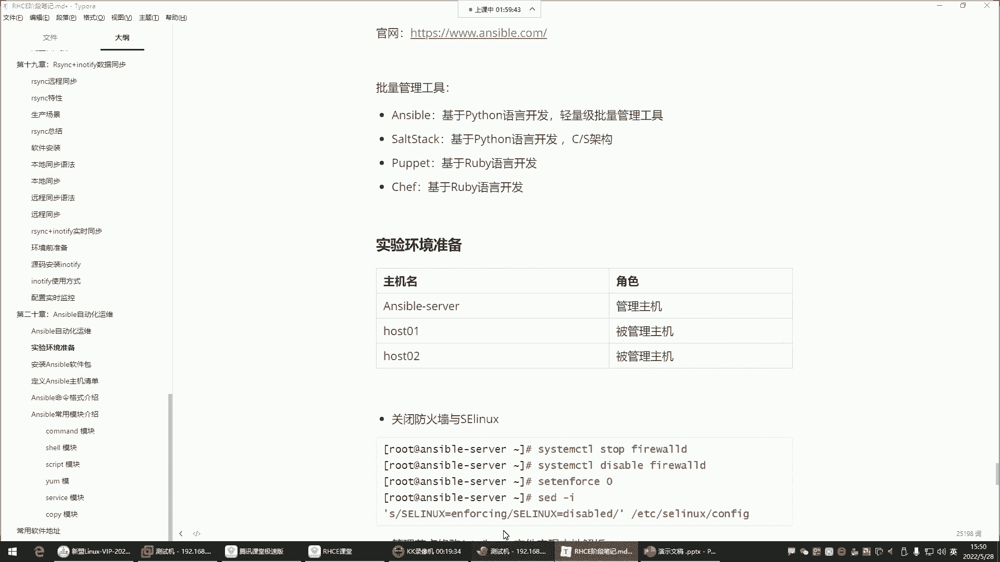

# 0基础小白怎么入门Linux运维？看这套，Linux运维全套培训课程，保姆级教学视频 - P62：红帽RHCE-25.Ansible批量运维工具介绍及安装 - 小方脸不方- - BV138411B7p5

好录屏也OK，那接下来呢我们就讲这个answerable，answerable是个啥呢，Answer able，是2013年推出的一款it自动化BIOS软件。

这个divers呢后期呢会给大家详细的去讲解，什么叫divers，它是一个什么呢，符合自动化思想的注意哈，叫符合自动化思想的这么一款软件，基于Python语言开发出来的。

这个后期的DAVIS也是大家在今后的学习过程中，这个里边有非常多的自动化工具，是我们在第四阶段的时候就开始学习了，能够让我们的工作变得幸福啊，这是这个DEBU。

然后那answer呢也是在这个divers里边，一个非常出色的一个什么呢，叫做批量的管理工具，注意哈，ANSPORT是批量管理工具，现在是属于红帽公司right hand。

因为他被这个red red hand给收购了，那对安SP来讲，它是一个批量的管理工具，我先给你讲讲这个批量管理工具，它应用场景在哪，OK吧，比如说啊，现在企业里面呢是有非常多的服务器，让你去维护他啊。

那那么多的服务器，大家来思考一下，就是我现在有这么一群服务器去管理去管理哈，就比如说就刚刚我要对他们做一些备份啊，或者说我要给这机器安装个包，这么一群机器，我怎么去同时去批量管理啊，大家有没有想过呀。

同时管理哈，我可不是说一台一台的去连接，然后一台一台去去对他们进行，比如说配置啊，管理啊，不是我想实现批量的管理，因为你一台一台去连接在企业里边，一个运维负责个几百台服务器，这很正常。

啊写个脚本发给这些服务器，那你一台，那你也是一台一台去发，你写个脚本，你传给这些服务器，也是一台一台去传，你也也不行，跟不上现在的效率了，那怎么办呢，好批量管理工具就可以帮你，很好的解决这个问题。

所以现在企业里面叫批量运维，批量运维就通过这些诸多的工具帮你实现，answer就是其中一个，安斯的话呢，它目前来讲是应用或者说占有率最多的，这么一款软件，那我们先给大家说说，就是除了安以外。

咱们这行业里边还有哪些批量的管理软件呢，像chef，还有PARTITI，这些也都是批量的管理工具，我们都可以基于这些工具去，对这些服务器做批量的维护，那有了这些批量管理工具。

我比如说我想同时看这些服务器的一个资源，利用率，看什么，我看它的内存，我只需要在我的管理主机敲一个什么呢，free杠H这个命令，那所有的节点的内存信息全都反馈给我，给力不，我想给这一群服务器安个包。

我只需要在我的管理主机敲个亚目杠，y in stor啊，后边包名所有的节点把这个包全都自动安装上，是不是非常给力啊，唉这就是批量管理工具，我想给这个主机拷贝个文件过去，我敲一个拷贝的命令。

一个文件同时拷贝到上百台服务器，给力不给力哈哈这就是批量管理工具啊，但是呢party跟chief这种工具呢，现在在行业里面已经淘汰了，为什么淘汰呢，是因为他们不好用好，基于ruby语言写的也比较冷门。

所以这个这两款工具呢，现在你就不需要去了解它了，你就知道它是一个管理工具就行了，而且是一个批量的管理工具，现在在企业里面已经淘汰了哈，所以没有必要去对他深入有任何的了解好。

那下面呢我们给大家说说answer跟south suk，这两款管理工具，我们先给大家说这个SDSARK，Salt，Sark gansport，它们之间的差异在哪里呢，因为salt sark它是cs架构。

so sag可以简称叫salt s a LT，叫salt salt呢是cs架构，这个cs架构我给大家说一下啊，就是叫服务端跟客户端的一个架构，就如果说我这个节点是用salt来搭建的，一个管理服务器。

Sa，那这个管理服务器，想要对这些机器进行管理的话，注意我得在这个机器安装salt的管理软件，能理解吧，架构具体是什么啊，架构的话你可以把它理解成这个结构，是一个结构哈，就是在公司里边。

我们呢有一款产品想让用户访问，就比如淘宝，淘宝他想让用户访问，你要知道一个淘宝的电商平台，它的整体我们称之为叫架构，他的那个架构里边要有什么呢，要有网站服务器，要有数据库服务器，要有负载均衡服务器。

还有一些其他类型的服务器，缓存服务器等等等等，诸多的什么呢，诸多的服务器，或者说诸多的服务组成了一个完整的淘宝网站，能理解吧，所以什么叫架构呢，其实就是一个结构啊，在这个结构里边有很多很多很多个服务。

有提供网站访问的，有提供数据库数据存储的，它是这样子的，这叫架构，那现在在我的企业里面，我想用这个salt去管理这些机器的话，你这个管理节点安装管理节点的软件包，被管理节点还得安装什么呢。

被管理节点的软件包，所以这种cs架构就是你服务端，我们称为就是管理节点安包，可能说比较省事儿，就一台机器嘛，我就找一台机器当我的管理节点就行了，这节点就是机器的意思哈，而这些被管理的节点呢。

那它的数量太多了呀，我每个机器都得安装软件包，是不是啊，你有500台机器，这500台机器都得安装软件包，那个软件包是能够让salt，能够连接到这个机器的那个软件包，所以这叫CS架构。

我们称为叫客户端软件，而这个呢叫服务端的软件，所以这种的话你要搞清楚，它的前期的环境部署是非常麻烦的，工作量比较大好，所以这是salt sark它的一些特点，对于前期的环境部署啊比较麻烦一些。

而answer就不一样了，answer不轻量级的批量管理工具，这个轻量级体现在哪里呢，我如果用unstable去管理那个机器，我告诉你answer ver它的特点就走SSH，我找一台机器安装好安斯波。

那安斯波就可以干嘛呢，通过34H这个协议，注意他通过SSH协议是连去连接每个机器，就像我们平时用x shell连接我们这个虚拟机一样，走S3H协议，只要是这个机器开启SSH安素就能连到。

能理解吧，就等于说只要我这个虚拟机一开机，咱们叉shell用SH是不是直接连呢，为什么能直接连呢，因为我们这个虚拟机里面默认就有SH，这个服务。

默认是不是随机自起，所以对于安兹来讲，它比较轻量，轻量体现在你只需要去干嘛，前期的环境准备的时候，只需要去部署一个管理主机就行了，而这些你要管理的主机呢，他们默认都有SSH，你就不用管了，就比较省事了。

啊这就是ANCIL，那是不是对我们的工作来讲就比较幸福了啊，部署一个节点就行了，所以说现在answer的占有率是要远远超过SSAG，这是以上常见的管理工具的一个介绍，大家有一个概念啊。

好那接下来对于安卓来讲呢，它的特点，其实我觉得这个我们简单了解一下就行哈，对于这种批量的管理工具，我们主要还是重于实操，理论的话呢，简单说一说就行，answer呢它是Python语言写的。

那Python语言里边会有分流的模块，其中有一个叫premium的模块，就是实现SSH协议的链接的uncle，通过PRIMO能够基于SSH协议连接那些主机，这个你了解一下就行，没有什么需要你背的。

所以默认只要被管理节点开启SSH服务，server就可以去管理他，不要省事，所以使用answer，不需要在客户端主机安装那个叫agent agent，就是什么呢，叫客户端程序。

这客户端主机我们也称之为叫被管理主机，A着呢就是客户端的程序，这个程序是让管理主机能够连上它的那个程序，安踏板模块化车解，并且模块丰富啊，这个我什么叫模块，给大家说说，模块就是帮你实现功能的这个。

比如说我想用USP给我的这些主机去安个包，那这时候呢他给你提供一个专门的压缩模块，这个yo模块，它就是用于专门帮你去安装软件包的，这么一个功能模块，所以你就直接调用这个yo模块。

去给这些被管理主机安包就行了，好那我现在还想干嘛呢，我现在还想给这些主机拷贝一个文件过去，那他给你提供专门的拷贝文件的模块，copy模块，你到时候去调用copy模块去做文件的拷贝，好。

我想给我想对这些主机，执行一些系统的管理命令，比如看个内存啥的，用设模块，税务模块帮你执行系统里的常用的管理命令，所以什么叫模块呢，这就叫模块，就是安四部的一条一条的命令。

只不过在Python里面叫模块，在java里面叫L在show里面就命令，叫法不一样，那接下来呢我们对于模块来讲呢，按什么呢，提供非常多的模块让我们去使用，而且它还允许你自定义，什么叫自定义呢。

自定义就是允许你自己开发，你觉得你有些需求，unstable本身自带的模块，它并没有给你提供自己开发就行了，而这个自定义模块可以用任何语言去写，也包括是有缘好，这是模块啊。

到时候我们主要学的就是安SP的模块，就像我们学习的系统命令一样，我们学这个系统，我们就要就要就是要学习他的命令，没有命令，这系统你管理不了，answer也一样，我们学ANSERVER学的是啥呀。

它的模块没有模块，我们啥也干不了，安斯巴呢还有一些其他的额外的功能，是不基于py yo这个模块，这个py yo也是Python语言里边的一个功能模块，这个模块能够让ENSABLE支持play book。

什么叫play部分呢，叫剧本，这个剧本干嘛用的呢，可以通过play book完成一些复杂的重复的工作，这剧本我告诉你，就是我们在show言里面叫什么呀，我们在show言里面叫脚本。

那个叉叉叉叉点S车的那个脚本，unstable里边人家不叫脚本，安边叫什么呢，安思不叫剧本，知道吧，那个剧本是基于YM的语法去写的，也是把安师傅的模块往文件里面去堆积就行了，就是你想用安柏执行什么操作。

比如我想用安去这个安装一些软件包啊，部署一些系统环境啊，好你把你的模，把你把它的模块按照顺序，就往这个文件里面写就可以了，然后到时候呢你执行这个文件，从上到下帮你去执行这个文件里的模块。

最终帮你实现这个功能，所以什么叫做模块啊，不是什么叫普雷布啊，就是安踏的脚本，比较好理解了吧，现在，那接下来呢也是完成一些重复的复杂工作，跟脚本的功能是一样的，只不过这book基于的是YM的语法。

亚马语法的话呢，我们在这个阶段不讲，为什么呢，这阶段讲也没有用，这个阶段讲answer主要是为了什么呢，主要就是为了有些人呢考试，有些同学考试考试的话呢，所以给大家融入了一些安四部的内容。

给大家讲讲安斯基础的使用，到时候你在考试的时候，不至于说对安柏你感觉非常的陌生，能理解吧，所以这个阶段不细讲，后面再给大家细讲，所以这个阶段对于安斯普来讲，大家就熟悉它的使用就可以了啊。

那接下来呢对于他的这个图标的话，我们可以去他的官网看一眼，这是他的官方网站。

好这就是暗色的图标，呃查看cookie首选项，算了吧，我们在表文章使用cookie了，同意。

好接下来呢说一说啊，红现在是属于红帽公司了，然后安斯宝啊，这里边的话呢我们可以翻一下。

然后它里边嗯，什么自自动化平台是任何人都可以使用的，IT自动化技术，ENZO自动化平台过去几年不断发展，提供强大的自动化的解决方案，看到了吗，哎这个等等等等。

什么工作原理自动化，你的用力这里边哈，ens的工作原理这里面开始使用啊，这里面可以看到的文档学到更多。

开始使用嗯，下边那么客户成功的案例，可以看一看客户成功案例，这里面看看有有哪些企业用他的东西成功了呢。

这些企业我也没见过呀，非常多的企业看了吗，后面还有讲的看一下吧，再来看看他们家的这种成功的案例，算了别研究了哈，这种东西哎，语言有中文的吗，简体中文哇，那太好了，成功案例，这里面都是中文文档了，看到吗。

中文文档，那你看起来那可以说是非常的给力了，是不是产品，然后现在其实其实我跟你们讲啊，现在大多数的这个开源软件，现在都给我们提供中文文档了，所以大家今后的软件学习遇到一些新的基础，真的就不难了。

因为有中文的文档，我们说曾经啊你去阅读官方文档，那真的是没有中文的，对于那个英文不好的同学来讲，那简直就是我们说就如同读天书一样看不懂，而现在你看大多数的软件，给你来一个这么清晰明了的中文。

那你还有什么看不懂的呢，是不是就像你看书一样呗，哈哈哈啊，看看这个红红帽安是否自动化平台，这次的产品哈想实现什么自动化网，是应用自动化还是网络自动化，你的安装升级点一下，唉这个文档为什么没有中文的呢。

刚夸他一下，我刚夸完他，这这个页面就没有中文的了哈，那确实没有办法了，算了吧，嗯我们就这个，行了，那咱就来说说实验环境吧，哈我们今天的实验环境，三台机器来给大家演示这个N4P的用法，三台机器的话呢。

这个主机名跟角色我都已经给大家分配好了，主机名呢选择一台机器当unsp server的管理主机。

那谁呢，我们就拿这个机器当安司的管理主机，然后哈哈把名字改改，host name很臭，Segun，Host name，来个大写的名字，answer杠server，加个选项，杠杠STATIC回车，好回车。

为什么要加这个选项呢，好退出，重新连接一下，因为这个选项它可以让你的主机名支持大写，看到了吗，这个选项哈，这个选项我们前面没有讲，是不是啊，哎给大家补充一下这个杠杠。

加这个选项就行了，啊TAK。

然后那另外还有两台机器。

一个是host的13，这个主机名啊，host0102行。

那就后后43吧，然后还有一台机器再连一下这个，这个机器呢也是我刚刚准备好的，改个名就行了，让它叫host的12退出，重新连接host的12host13，我要去用它管理这两台机器。

注意我们说那管理两台机器，大家以后到企业里面管理个几十台的话，其实这个方法都是一样的，都一样哈，所以接下来呢我们就来开始说说环境准备，防火墙啥都能给它停掉，这个在企业里面也就是给它停掉。

这个不用太不用再介绍了哈，然后下边管理节点修改etc的host文件，实现一个本地解析，这一步就变得尤为重要，我们是十几了，12跟十三十三。

注意我们接下来的所有操作，都在user管理节点去做，这两台机器推出，只要开机就可以了，能能明白吗，只要开机就行，我们现在就是演示批量运维。

我就在安这边一个管理节点，去对这一群机器操作，我都不需要去看他们的终端。

也不需要去登录上去知道吧，所以你看我们是不是就退出了，这所有的操作都有安置主机操作，所以接下来第一步打开本地的etc的host文件，本地解析文件在文件里面增加什么呢。

对方的你要管理的那个主机的IP主机名，192。168。0。12，它的主机名是host的12，第二台192。168。0。13，host13保存退出，拼一下host12，这叫本地解析，什么呢。

在本地我可以通过名称干嘛呢去访问这个地址，这叫本地解析，IP跟主机名称的解析跟DS的这种本质是一样的，再拼host的13也是通的，看到了吗，通过主机名解析到了对方的IP好，那接下来解析以后呢。

我们为什么要解析，后面再说好，第二步呢，做SH的没有认证，为什么要做SSH都没有认证，那现在呢可以讲就是安SER，他管理这一群机器的时候，他是不是走的是SSH协议啊，那他光走SSH协议可以吗。

就假设我现在开个终端，我可以通过SSH协议连接到某个机器，192。168。0点，这个12我是不是可以连呢，那你看他跟我要啥呀，他是不是跟我要用户名跟密码啊，那我如果说光走SH能够连这个机器。

我不知道这个机器的用户名和密码，是不是也不行啊，所以要对安斯来讲也一样，我们用安连接这些机器管理它的时候。

我们他是走SH协议，让你能够连接它，但是它得跟你要这个机器的用户跟密码才行，能理解吧，你没有用户密码，他也没有办法真正的对他去执行命令啊，所以的话呢你提前做好免密。

ENSIMPLE呢就不需要去连接每个机器的时候，再去输入这个机器的密码了，默认可以root的身份去连接。

能理解吧，所以就直接给他做好免密就行了，你想跟谁去实现一个什么呢，就是这种这个你想去管理谁，你就跟谁做免密啊，那我们现在s h host的13的时候，是不是，我们前面做过没有认证吧，我再退出哈。

因为我前面在讲那个RC的时候，我们做过SSH host13，是不是直接免密登录上了host13，然后你看我现在SH这个机器的时候，是不是也可以通过名字去S去连接了呀，为什么呢，因为我通过主机名。

它能够自动给我解析到他的IP上面去，他的IP哈，那现在我SH谁呢，后续的12的时候首次连接输入yes，是不是他们两个之间没有实现一个没有认证啊，所以我得干嘛呢，我得把密钥再给拷贝到这个机器上面。

SH杠KY杠id以root的身份拷贝给谁呢，host的12以后，我对这个机器的所有操作，都可以通过主机名去实现了方便，这叫解析，本地解析好退出，输入它的密码，一回车OK了。

那接下来在s h host12的时候，好绵密的看到吗，退出明明了哈，那接下来呢我们就可以干嘛了，那么接下来就可以这个，继续往下走了。

免密登录，这里面我用for循环做的，For i in，就是再跟上主机名，然后呢再执行密钥的远程拷贝，那对于你们来讲，机器多的话，可以通过for循环写个脚本，看了吗，也可以啊。

所以我们这里边的是12跟13，主机名是谁呢，Host12，后期的13，你们下去以后试试，这个负循环怎么拷贝在命令行里面哈，在命令行里敲这个命令for循环，然后去验证SSH的验证，Host12。

host13啊，那接下来我们就可以安装UNCI包了，Unstable，unstable包在哪呢，UNCI包在一炮园里面好，我给大家说说啊，UNS需要一破源，这一破源的话呢，我们用阿里的一破源。

这个易破源，我前面在给大家讲软件管理的时候，说过，易破源里面放的一些额外的软件包，扩展的是在哪儿呢，是在这个阿里的贝斯源里面是没有的，所以说呢你想按照ENERABLE就得提前配个一元去。

那我们本地有一元吗，好像没有，我们本地没有的话，那我们去阿里巴巴，阿里巴巴开源软件仓库，这个地址是不是你们也有啊，然后前面笔记里面的哈，接下来呢点渗透S这是基础的软件仓库，一炮源是扩展的软件仓库。

我们先配个基础的，为什么基础的也要用呢，因为基础的需要一些依赖在基础的仓库里面。

所以把人命令拿过来，这些在这拷贝就行了，点这就拷贝了，拿到系统里面执行一下，没有w get安一个，然后再执行这个命令啊，下载下来了，已经告诉你保存到你本地的这个路径了。

然后叫这个名字，那下边再来，这是被资源基础的软件仓库，那一炮源呢点一炮源易破源里边找到real7，然后呢我们是干嘛呢，复制REO7的这个仓库地址来这再执行一遍好。

也保存到这个路径了，那现在系统的E破源跟被资源都有了之后呢，我们在ym guy inspensable回车，好，开始安装了哈，我们今天的课讲完以后啊，你们下次的课知道上课时间吗，你们下次就不是周6日了。

你们以后的课就是变成，你们以后就变成135的晚上了，从第三阶段开始啊，变成135的晚上课了，晚上07：30，到时候你去这个，等到时候老师会在群里通知你们的，通知你们具体的上课时间，上课链接。

然后上课老师到时候他会告诉你们，但是你们得做好准备是什么准备呢，就是不是哪个老师讲的都像我一样的通俗易懂，知道吧，所以你们得做好这种什么呢，这种听不懂的准备。

安装好了，安装好了之后呢，接下来我们就来哈敲一下这个命令。

叫查看安斯的版本，下条命令哈，Answer，然后杠杠version回车，我们当前安装的是2。9。27的版本，这版本也挺新的哈，也也非常新了，听不懂咋办啊，听不懂就自己去网上多查查资料，听不懂。

不有的时候你听不懂的话，不是说多听的事儿，你就得自己去网上去搜一搜了，知道吧，然后接下来呢我们看哈，看到版本了是吧，看到版本它除了版本还有什么，你看下面还有一些信息，这些信息是什么呢，唉这些信息啊。

你看啊，他告诉你有个叫config file，这个config file是什么，是他的主配置文件，这是它的主配软件啊，在这儿，然后还有什么，还有它的叫做config model，它的模块在哪呢。

告诉你模块的搜索路径是在你的root目录，有个叫点encil plugins models这么一个目录点，有没有一个answer able是吧，阿拉斯点ENSABLE有type目录，开放目录没了是吧。

但是现在还没有呢哈现在还没有，那这是它的搜索路径，然后但是除了搜索路径行，还有user share s好多搜索路径哈，你看还有它的这个拍调用Python的路径，他得调用Python去执行它的模块。

因为它的模块都是Python写出来的，啊USB下PANSWERVER，这是它的一个程序程序的路径，就可以提供那个enable命令的，我每次敲到ENSUPER命令就在这个路径。

然后还有我们当前的Python脚本，是2。7。5的版本没了，你看他这里的路径什么模块，搜索路径，它第一呢是注意他这里面有顺序，他首先是从你的家目录去搜索，看看这个路径有没有模块，没有怎么办呢。

没有就来到这个路径去搜了，这个路径就可能有模块了，唉啊这是开了吗，这哈这里面有非常多的模块，但是你不用去管啊，这些东西你了解一下就行，那对于我们来讲呢，现在安踏板安装好了之后干嘛呀，系统自带的哈，2。

7的非常经典的版本。

渗透S7的Python就是默认2。7的，好那接下来咱们说说user的配置文件，刚刚也给大家介绍了，还有一个文件叫清单文件，这个清单文件干嘛的呢，来说说安是不是有一个文件，它的这个文件是什么文件呢。

叫做定义被管理主机的，定义被管理主机的一个文件，这个文件我们称为叫清单文件，有一个文件，这是一个文件哈，那这个文件里面就是你比如说我想干嘛呢，我想管理这个机器，它的IP地址是多少呢，192。168。

0点多少呢，12，那这是我要管理那个机器的IP，那这个IP地址你是你是知道我要管理他没错，那我问你安不知道吗啊，我要管理这个机器的IP是1。2。10，8。0。12，安斯不知道这个机器的地址是谁吗。

他不知道，他肯定不知道，那你怎么才能让他知道呢，就是你把你要管理的机器的那个IP地址给他，写到这个文件里面就行了，知道吧，你写了文件以后，是不是就读这个文件，他一读这个文件他就知道啊。

原来我应该去连接这个IP去，是这样子的，啊那如果我还要管理另外一个机器，比如说我还要管理192。16，8。0。13这个机器，那你也一样，你把这个IP值也给他，写到他的这个文件里面就可以了。

然后他就自己他就你每次执行命令的时候，ENSABLE呢，他自己就去读这个文件了，他自己去读这个文件，他读这个文件，他看这文件里的IP地址，然后就连接这个IP就行了。

那他只有知道这个机器的IP才能够知道哦，原来我应该去连这个机器啊，连他然后对他去执行这些模块，知道吧，所以这个定义被管理主机的文件，我们就称之为什么呢，叫做清单，就像就像一个列清单列表一样。

是不是这个清单里面不就是你要管理谁，你给我按照顺序往下写，我就读就可以了，要清单文件哈，好那现在知道这个清单了吧，是不是很重要，没有清单文件，安斯波不到连谁啊。

所以接下来呢清单文件我们现在在哪儿呢啊，清单文件呢是载也是那个路径，etc enerable下边，但是我们先看看这个目录都有什么哈，来四你发现就俩文件，一个是unstable，点CFG，一个是host。

还有一个叫rose，这个rose是什么呢。

再给大家补充一个an，是否还有一个功能，看answer able，还可以通过叫rose。

这个rose啊。

ROLEE哈，这个rose呢叫做角色，这个角色他干嘛呢，他比普雷布还强大，比book它更加的强大，适合去什么呢，叫做，部署那些，非常复杂的环境，例如我去搭建一个这个open平台，我们三个云平台。

可以通过这个决策来实现，但是强大的东西往往肯定是难度系数也高，所以大家先知道一下就行了啊，这rose叫角色，好所以你现在看到这个目录是按错。

给你提供一个定义角色的一个目录，然后这里面是它的主配文件，这是它的清单文件，那对于主片文件打开看看，主配文件多少行呢，跑到最后400米，人行往上翻。

全都是注释，看到吗，井号开头的全都是注释。

都是注释的话呢，就是说都是无效的，那他真的是无效吗，不是默认的默认的配置，你看有一些这种default，这种叫叫默认的意思，所以这呢他告诉你唉一些基本的默认值，从这往从这个在default这一部分。

就是它的一些基本的默认值了，看到了吗，你别看是注释的哈，但是默认的值。

你到时候可以改，从这儿往下，全都是默认的。

改什么呢啊现在先不说改什么哈啊，但是呢有一个要给大家讲一下哪个呢。

你看啊，在这儿有一个叫REMT，这个remt pot就是远程端口的意思，这个远程端口等于22，这个22是谁的端口啊，是不是SSH的端口啊，所以说ENERABLE，默认是连接那些被管理主机的22号端口。

这是我要管理的机器，它基于SSH连接SSH是不是起端口啊，用22端口就让你连接我呀，所以它默认就是通过22端口去连接它，那如果SSH端口改了呢，如果改成我改成这个端口了呢，222的好。

那你就得干嘛呢，把配置文件的端口给它改成2222，知道吧，还有默认ANSPORT速度，user是以root的身份去连接那些主机，因为只有root权限最大，所以很多功能呢只有root才可以用。

所以默认就以root的身份去连接它们，能理解吧，所以在这里边一是USP用root的身份连接他们，二就是连接它的34H的22端口修改吗，如果你的环境SSH的端口你没有发生过修改的话。

你就不用动它啊，还有一个inventory，inventory就是清单的意思，他也告诉你了，我默认的清单文件在EECETCENER下面，有个叫host，看到了吗，所以这个你在主配置文件。

也可以获取到他的信息，包括一些模块的所在位置，好好它也会在你家里面会生成一些临时的目录，存储一些临时的文件，啊这是它的插件的所在位置啊，这些都不用管哈，不用管，我们主要就是找他的清单文件。

好清单文件是不是知道了，在他的这个配置文件的同一个目录里面有个host，打开这个清单文件，host好清单文件内容就比较少了，多少行呢，44行总共44行，我现在跑到最后了，好那这44行的文件呢。

我们看哈说说怎么定义啊，我们不是说了吗。

这个清单文件就是让你定义，被管理主机的清单啊，那怎么定义呢，就这样定义，把IP写进去就可以了，非常简单，写IP哈，那我现在就直接把你要管理的机器的IP写进去。

就可以了，我们要管理的机器，那这个这个文件里面，难道就没有一些其他的含义吗，哎也有你看啊，这里边他这很多注释啊，就是给你一些提示，比如说像这个他说可以输入主机名或IP地址。

就说你想定义那些背包的主机的话，你可以用对方的名字，或者说对方的IP都行。

那你如果想用对方的名字的话，那前提是你得做这一步，叫实现一个本地解析，这样我们才能通过名字解析到对方的IP去。

所以那我们前面做的这一步，就是为了你在定义这些被关联主机的时候，你是可以直接干嘛，通过名字去定义的，好那怎么定义呢，哎他告诉你了，这有个例子看到吗，EXEX就是example的意思。

example就是例子的意思，那第一个例子，他说你就直接把主机的名名称或IP，就这样写就行了，看到了吗，他这个就是主机名，下面就是直接主机的IP都行，做解析，如果你做了解析，就通过名字定义。

如果没做解析，直接通过IP都可以，那我们来试试，第一种方法，咱们用host12跟host13，这是我要管理的两台机器保存退出，那定好了，就这么简单哈，这定义清单哈，你个往哪写都行，对配置文件来讲。

你说哎呀，那我这个位置我必须得写的这个例子一的，或者这IP下面不是你往哪写都行，这个文件都是注释，你觉得哪哪哪个部位比较舒服，你就往哪个部位写，能理解吧，洗澡都行，写到最下面也可以。

我们就给大家演示一下怎么定义保存退出，然后呢，我们接下来说说怎么用哈，an ser不是命令吗，是不是好，你想获取他的命令帮助，刚刚help回车，这是获取命令帮助了，那这个命令的帮助有点多了哈。

这字体有点大了，主要是20，啊这也不行，22号就就这样吧哈就这样杠个号吧，我们现在获取的这个命令，帮助你可以看到它这个命令非常多，包括前面啊，从这开始安可以使用的选项看了吗，什么杠H2看版本。

杠杠version，看版本，杠V也看版本的啊，下边非常多的选项是吧啊，下面还是他的选项，具体这时候他就告诉你了，我支持的这些选项是可以帮你实现什么功能的，小编非常多哈啊，看到了吗。

什么c tax check是检测语法的啊，干个version去看版本的嗯，然后当然啊我们一般就是用什么呢，一般就是它这个有有你们你们发现了吗，有的时候他这个有什么呢，有短选项又有长选项。

能尽量用短选项的，就用短选项，不用长选项哈，暴击非常多啊，所以说呢这个就大体了解一下就行，因为你们也不知道怎么用，所以接下来呢我们给大家说一个选项，unstable叫杠杠list。

杠host这个选项干嘛的呢，这非常的贱明之意，list是不是列出host，是不是主机叫列出主机回车报语法错了，为什么呢，为什么要报一下错误呢，因为列出哪个主机啊，你得告诉他在USP后面加个all。

列出所有主机回车，all代表所有，这样的话呢他就去读那个清单文件，然后列出清单文件里面你定义的那些主机，看到host就是主机几台呢，二就是两台，就是在那个清单文件里面，总共就是两台主机。

然后呢具体的信息就是你定义的时候，你写的那个主机名看到了吧，那我现在是不是列出了一个清单文件里的，这两台机器的呀，列出来以后，我现在是不是要去管理它呀，那接下来来看啊。

怎么管理unstable命令格式呢。

是这样子的，命令格式在这来看一眼。

unstable可以跟组名诶，这组是什么呢，我们并没有说是吧，好那先不用去管它啊，也可以跟具体的主机名，那你要管理谁，我要管理host的12跟host13好，Host12，那还有host13呢。

逗号host13是吧。

那这就两台机器是吧，那如果我在企业里面，我的机器比较多，怎么办呢，我有个100台，我需要用安斯本。

往那100台机器去拷贝一个文件过去，那我走了，我在命令行里面写一直host14，host15是吗，host16一直到host100吗，这好像有点儿什么呢，这好像有点low了，是不是啊。

所以这种定义方式有问题，我给你们演示，就是这种定义方式有问题，所以再打开那个文件，etc的answer，下载host的字，打开以后，这种定义方式只适合干嘛呢，叫管理单台主机。

那单台主机我还要用UNSERVER干嘛呀，就不用UNSERVER了哈，所以这种定义方式很少用，所以他又给你列举了第二个例子，Ex2，他说你可以这样，他这个属于web server的组的主机集合。

唉那也就是说它支持组的方式定义怎么定义呢，你看例子上面是一个组名，放在中括号里面，名字叫web service，这名字随便取叫什么都行，然后下面呢就是你要管理的机器，放到组里面就行了。

像他这种方式定义看哈，我们写个组名Y吧，S 2vs，接下来我想管理的机器都写到组里边，我要管理的机器是host12，Host13，我要管理的是这两台好，那定好了之后，我以后想管理这机器怎么怎么管理呢。

ASSER在命令格式里面是不是有个组名啊，唉这个组名就比较给力了，你写组名web service，然后再指定你执行的具体操作就行了，那我一定要用这个组名的话，就等同于这个组下边的所有主机。

我这个组下面比如说我有多少台机器呢，我有100台机器，一个组里边订了100台机器，那我告诉你，那你没关系，你只需要输入一个组名，自动帮你去干嘛，去调用组下面的100台机器。

是不是比你像前面这种输入100个主机名，要要给力得多呀，输入主机名，输入10分钟是吧，别的不用干了，所以分组定义哈，分组，那这个组的方式分批管理多个组呢，好可以，比如我还有一批机器是数据库。

那下边看他又给你举个例子，他说这个组啊，你不是说只能定义一个，你如果还有一群其他的机器的话呢，哎你也可以继续定义看了吧，不是说只能定一个哈，下面还可以继续定义的，那就把你的数据库再放到一个组里面。

叫dB service，名字的人都给你想好了，那你就按照他的这种方式自己写，唉我有一个叫dd叫dbs r vs，但这里面名字随便取，你让他叫叉叉O也行，知道吧，只要你知道这个组里的机器是干嘛用的就行。

但是我们这太没文化了哈，Dbs r vs，然后组内的主机就写就行了，一个一个写写，写上去能力了吧，那以后我想管理我的数据库，就是调用这个组名，我想管理我的web服务器。

网站服务器就调用上面这个组名就可以了，说非常给力啊，把这两个删掉哈，我没有数据库服务器保存退出，那它能识别吗，Unstable，这时候你指定具体的组名就行了。

web s r vs杠杠list杠post回车，看到了吗，有时候我现在是只看这个组内的主机了，看到了吧，几台两台是不是也可以啊，那还有一种方式，你看它上面又给你什么呢，他又给你一个建议，什么建议呢。

但如果你有多个主机，他们遵循你可以指定的模式的话，你就可以这样玩了啊，怎么能凑到一块儿，他说怎么能凑到一块儿呢，这样可以凑到一块儿，怎么凑的呢，你的名字如果有规律，你看他这名字是3W零一点。

一个赞不点看不，第二台呢是3W02点，一个三步点看不懂，第三台是3W03点，一个三步点看不懂，以此类推，一直到多少呢，一直到063W06。2，第三步点com也就是说它是有六台机器的，知道吧。

那它有六台机器，它怎么样才能什么呢，哎就是比较方便的去定义呢，他这样玩了，用中括号匹配了一下，它有六台机器，你看名字是不是非常有规律啊，都是3W开头的，结尾呢都是这种点一个三点com结尾的。

那它就这样玩了，就这样了，哎3W然后呢中括号中括号001啊，当然其他的主机名是我少写了一个零哈，是001，一直到006001，冒号006，一个弹幕条看过，那是不是一行就定了六台呀，那如果你有100台呢。

你有100台，是不是这一行可以定100个主机啊，只要有只要他们有规律不就可以了呀，那我们也可以这样玩，哎我定义分组的时候，我就直接干嘛呢，我机器有点多了，我不想一个一个写了，host中括号11。

冒号12，保存退出，列出一下，列出一下，看能不能识别回车，看到了吧一样，是不是非常的给力啊，啊这定义分组是不是怎么定义都行了，现在我们各种方法，各种姿势都给你们演示了吧。

所以这分组到此为止就结束了哈，那建模块学习模块了，学习模块休息一下吧，我们休息一下，再回过头来学习它的模块吧，好吧，大家缓解一下脑，恢复一下脑细胞吧。

休息一会儿。