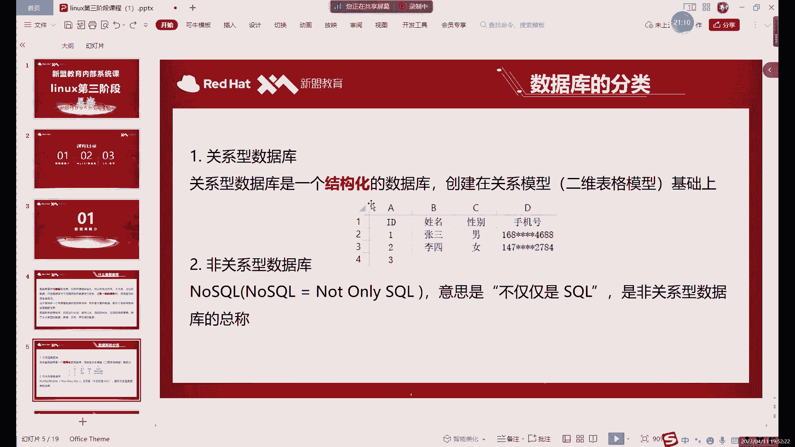
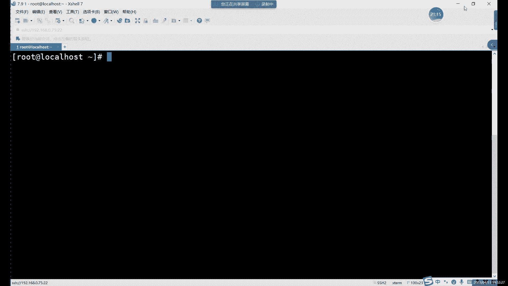
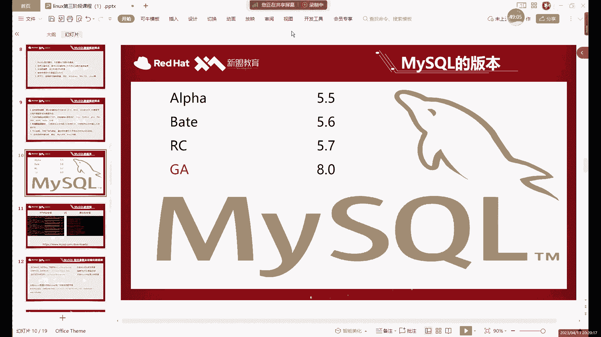
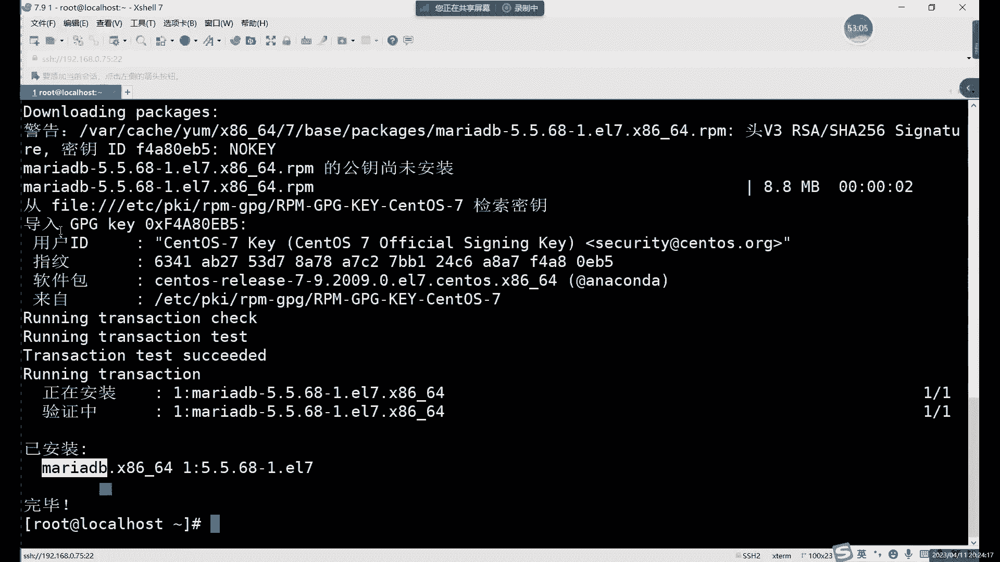
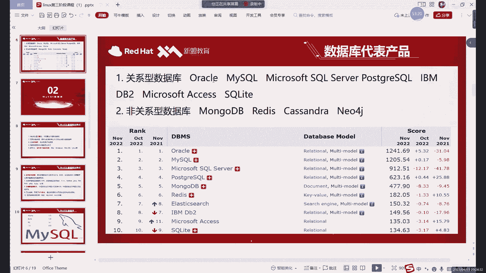

# 0基础小白怎么入门Linux运维？看这套，Linux运维全套培训课程，保姆级教学视频 - P64：中级运维-1.MySQL介绍及安装-上 - 小方脸不方- - BV138411B7p5

好今天的话是我们LINUX的第三阶段的课，好吧，大家应该是上周的对吧，刚学完这个RC过来的啊，后边的话其实不管哪个阶段啊，其实后边大家都有都有可能遇到我啊，都有可能是我的啊。

我现在的话主要是那先简单做个自我介绍对吧，大家有可能有的同学可能还不认识我啊，我是星海老师啊，后边的话其实从第一阶段到第六阶段的话，这六个阶段的课呢都有可能是我带，现在的话我们是第三阶段。

大家平时在平时在学习或者说生活当中，遇到什么问题的话，可以直接在群里面问啊，我有时间的话肯定会第一时间给大家看的啊，不过晚上的话这个时间段就算了啊，因为晚上我每天都有课，每天都有课，然后呢课上的话。

其实大家啊有什么不懂的就可以直接问啊，但我一般只回答什么，我只回答和本节课相关的问题，如果是没有关系的，没有关的问题的话，其实大家可以下课下课私聊，或者说是在群里问都行啊，都可以好。

我们今天的话是LINUX的第三阶段的第一节课，第三阶段的话就从第三页开始，就已经不能算是基础阶段了啊，我们已经开始要学习些什么，学习一些具体的服务啊，第三阶段其实包括主要是包括两部分。

前半部分是什么呢啊，前半部分是我们这个数据库，把数据库相关的，当然我们讲数据库呢主要还是讲MYSQL啊，第二部分的话就是网站的架构包括什么，包括NGX啊，主要内容就是nines。

以及围绕NGX展开的LMP啊啊，网站平台的一个架构，以及我们的一个高可用的集群，负载均衡集群等等等等，哎我们主要这些的话，就是就是我们第三阶段主要内容，那今天的第一节课的话，咱啊先来介绍什么。

先来介绍数据库啊，先来介绍数据库，大家在之前应该都听过数据库对吧，啊这肯定都听过啊，就是常说的这个删库跑路，那指的就是数据库对吧，主要指的就是数据库了，然后呢这里的话首先啊当然了。

我肯定不建议大家去删库啊，啊这个肯定不建议大家去删库，因为毕竟怎么说呢，虽然说现在的话其实也不至于跑路吧，因为什么，因为现在其实作为一个，如果一个企业里面有数据库的话，反正肯定是做了什么。

做了一个很完善的一个备份的啊，所以说你就是删库了，在这个操作呢它其实并不致命，但是也千万不要去做，因为如果说你删了库啊，它可能恢复数据库呢需要很长的时间啊，这个这个其实就不太好哎。

所以说呢啊3Q这个操作大家知道就行了，不要千万不要去尝试啊，这个其实，怎么说这个是一个底线啊，绝对不能去尝试，然后呢，接下来的话我们首先来介绍什么呢，我们首先来介绍数据库，对吧啊，再来看一下数据库。

数据库啊，从名字上来看，它它就是个存放数据的仓库，是这定义很简单，他就是用来放数据的啊，这当然它的存储空间是很大的，一个数据库的话可以存百万条千万条的数据啊，甚至说啊。

在理论上呢其实是没有什么太大的限制啊，啊当然呢它其实受限于什么呢，还是受限于这个次方向大小，你磁盘一共也就那么大，你肯定不能存放的数据，肯定不能超过磁盘的大小啊，理论上呢如果磁盘无限大呢。

哎就可以什么就可以直接增加数据，当然了，我们这个数据库呢，它并不是把数据随意的放在那里啊，如果说你把比如说拿一些图片啊，拿一些文档啊对吧，拿一些这些数据之类的，直接堆放在某个地方哎，直接放在磁盘里面。

对这是不是存放数据呢，其实也算存放数据对吧，就比如说对吧，我们打开一个我们的文件管理，文件的这个文件管理器吧，啊打开之后呢，我们可以看到，比如我们打开一个文件里面，就会有什么有很多的这些目录也好。

对吧啊，还有一些什么还有一些文件，这些目录文件呢，他其实也是直接存放在我们磁盘里面的啊，它就是直接存放在磁盘里面的，但是这个肯定不能叫数据库，或者说呢啊再换一种说法，其实在数据库就是在数据库诞生之前啊。

就是在最初的时候有计算机的时候，其实当时呢数据库它并没有，直接就是数据库没有立刻产生啊，一开始是没有数据库的，一开始我们存数据怎么存的啊，就是这样存放在文件系统里面啊，简单说就是直接放在磁盘里。

就是像我们唉大家所看到的这些啊，就是放在这个磁盘里面的，但是呢这样放有个什么问题呢，唉其实这样存放的话，其实数据肯定不会丢，对吧啊，也能找到，只不过呢其实你早起数据来说，那就没有那么的容易吧。

啊没有那么容易，就比如说你看啊，如果说你想想在这个我们的四环里边啊，去搜个什么呢啊，去搜购，比如说啊这个插件啊，这个这个软件啊，大家经常有同学也跟我要对吧，因为这个啊有的可能，因为他在咱们这个破解版啊。

破解版，他叫他这个可能不一定所有系统都兼容啊，当然我这里有很多个版本的插件啊，那如果说有什么啊，需求可以直接有什么，如果说材料不能用的话，对这里有很多版本，大家都可以去试一下，你看比如说搜个插件对吧。

哎就是一个咱们目的，就是想搜到他这个软件嘛对吧，但是大家可以看到左边这个进度条很慢，为什么这么慢呢，就是因为其实我们搜索之后呢，它其实呢就是在系统里边啊，当然这个其实不能算系统。

它只是在单个的磁盘分区里面去找诶，包含插下的这个文件，虽然这里大部分都还是什么，都是这个压缩包对吧啊，大小的压缩包，还有这种情况下呢，你可以看到这个查找速度很慢，哎我们全部查出来之后。

大概花了将近都快一分钟时间了对吧，这个效率就很低啊，这就是为什么数据库它诞生的原因，就是，如果你直接用文件系统去存放一些数据的话，它有一个很大的弊端，就是查找起来呢非常的缓慢。

因为文件系统找数据他怎么找呢，啊当然你如果知道这个数据具体在哪个目录下，这个倒无所谓，那你直接一级一级的双击打开啊，查找就行了，如果你不知道的情况下，直接用这里的查找会速度会非常慢。

因为它是相当于是把我们每一个磁盘当中的，文件都看一下，满足不满足我们查询的条件啊，他在把我们这个列出来啊，就是把我们的数据列出来啊，这个就是在数据库之前啊，我们存放一些东西就很麻烦，有了数据库之后呢。

啊数据库的优势呢就是在这里啊，就是在大量的数据情况下啊，在你有数据库里面有大量的数据情况下呢，查询我们的这个一些数据，或者说是搜索啊，删除哎，简称了管理数据唉，总之就是管理数据。

在管理数据上的话就非常的方便啊，因为查询一个数据的话，其实数据库速度非常快啊，这个的话具体到后边的话，我们哎装好之后呢，我们可以我们可以就可以看出效果啊，这个不用着急，具体有多快呢啊。

在数量不是特别大的情况下呢，就像我们装好一个数据库之后呢，嗯它其实本身库里面就自带了很多的数据啊，查到这些数据的情况下，一般就是0。01秒，甚至连0。01秒都不到啊，也就是什么概念呢。

也就是大概10ms甚至不到10ms的速度啊，查询速率是非常快的，啊这个的话就是数据库的一个优势，因为它呢它的存放数据啊，它有一定的规则啊，它有一定的规则，这个规则的话具体就是我们后边的一些啊。

一些这个具体的一些语句啊，SQL语句啊，啊我们的一些字段啊，创建数据库的一些方式啊，这些的话我们后面就会继续讲啊，大家就先首先先知道啊，数据库呢它存放数据呢它不是随意存放啊，有一定的规则。

所以说呢在查询数据上呢，它的效率就远远高于什么呢，高于我们这个文件系统，因为文件系统里面我放，总体其实是没有任何规则啊，没有任何规则限制，而数据库不一样啊，相当于我们是啊这数据库有很多的条条框框哎。

就有很多规则限制啊，就比如说你不能啊，不能把一个数据放在这里，或者说呢比如说嗯我们创建一个类似于什么呢，啊比如说我们直接切到下一页啊，我们来看一下这个类似于这个的表格，比如说呢我们来看第一列。

第一列的话啊，我们这是个id对吧，这个是我的表头嘛对吧，第一行是表头，第一列这里是ID也是它能插入的数据，只有什么呢，哎只能插入id，就1234往下按，哎你说他这里能不能插入汉字呢啊。

或者能不能插入其他字符呢，我们这里数据库这里啊，MYSQL这里我们就可以设置规则，那我们就可以不允许它什么了，不允许它插入数字啊，不不允许它插入这个啊汉字啊，英文字母啊，那就只允许它要插入数字。

那么这一列呢就所有的数据呢它只有数字了啊，这个就是一个规则啊，或者说限制啊，这个的话就是什么，这个就是数据库里面它是有一定规则啊，它并不是并不是这种随意存放数据啊，并不是随意存放数据。

那数据库的话其实目前来看啊，就是目前市面上就是其实是种的分类的话，是能分成两种的啊，它并不是说所有数据库都一样啊，所有种类的所有牌子的数据库呢啊它的存放啊，或者说处理数据啊，或者存放数据都一样。

这个不是啊，并不是这样的，我们这个其实数据库也和我们的系统一样对吧，你系统有linux windows对吧，Mac那数据库呢自然也有什么也有不同的种类，比如说怎么呢，比如说这个唉这里的两种的话。

这个定义可能看起来不是特别好理解对吧，这个定义看起来不是特别好理解，就是关系和非关系，关系型是什么意思呢，哎关系型的话就是一个结构化的数据库，那结构是什么意思，就是我们刚才所看到的这个表格啊，有类似用。

我们这是这这里就是我们excel的表格吗，大家可以按照这个去看啊，按照这个去理解什么意思呢，就是我们这个关系数据库的话，基本上都是什么，都是在二维表格的模型上基础上去创建的，什么意思啊。

就是类似于我们的excel2维的话就是行和列啊，由行和列组成一个表格，那每一行的话其实就是我刚才说的要表头对吧，那在我们的数据库里面，我们一般叫什么，一般叫字段，而每一行的数据，而从第二行开始。

下面每一行的数据我们叫什么呢，我们叫我们就叫数据啊，就下下面每一行的这个哎，比如123它是数据对吧，张三李四他也算数据，也就是由行和列组成的，共同组成了我们这个什么的啊。

共同组成了我们这个表格结构化的话，其实就主要是什么呢，就是每行每列呢唉都有固定的什么固定的格式，就比如说第一行呢我们就在数据库里面，我们第一行这里就可以规定什么呢啊，规定这一行只能插入，只能看数字。

这一行呢只能插入哎我们的姓名啊，就姓名这个数就应该叫字符啊，或者说就理解成汉字，英文字母都可以啊，那第三行性别，那我们也可以规定哎我们只能插入一个啊，或者说呢就只能插入男。

或者说女能不能有第三种呢啊当然是可以的啊，只要你规则里边啊能写啊，规则里面允许他写第三种，那就是可以的，啊当然这里的话其实，一般情况下呢，我们这里性别这里的话就是两种嘛，第三种的话确实有点过分啊。

然后呢后边手机号的话，手机号一般我们都是11位嘛对吧，11位如果说你超过11位的可以吗，啊，我们可以限制一个范围，不能不让他超过11位啊，可以限制一个不让他超过11位的范围。

那这些的话其实就是一个结构化的啊，它不仅有结构啊，更重要的是有什么，更重要的是有规则啊，这就是一个关系数据库，由行和列组成的啊，由行和列组成啊，那有同学可能有疑问，就是如果说啊。

那不可能我们这一个数据库里面就一个表格，对吧啊，那当然是啊，我们这一个数据库里面，我们可以创建很多个表格的啊，很多的表格，那每个表格之间呢啊它可能有不同的字段啊，哎有不同的这个数据啊。

不同的表格之间呢其实也是可以有联系的啊，就比如说我们这个数据库呢，是存放我们哎同学信息的一个数据库里面，包括有什么有这个信息表，哎，有这些我们的这个信息表有成绩的表格啊，有基本信息表，有成绩表格对吧。

哎有这什么啊，比如说如果还有什么员工信息表的话，还可以有什么还可以有这个工资表啊对吧，出勤率啊啊出勤率表格，这些表格之间呢其实都可以是吗，哎都是可以选择让它联系在一起，哎什么意思呢，这里这个关系的话。

其实除了这个二维表格以外呢，还有一个就是多个表格之间呢啊可以有联系啊，就比如说员工信息表吧，员工信息表，这里我们有可以有一个基本信息表啊，还可以有什么呢，还可以有一个，比如说，啊可以给大家稍微画一下。

比如说员工信息表对吧，第一个表格呢是员工信息，第二个表格是什么，第二个表格我们可以写这个嗯，这个叫新字啊，新字的表格，那这两个表格之间呢啊它可以有联系吗，他那肯定有联系啊，为什么呢。

因为它至少这里边会有什么呢，会有员工的姓名对吧，每个表格里边啊，不管说它后面内容具体是什么，肯定都要有什么有员工的姓名啊，或者说什么，或者说可能会有这个员工的什么这个id，或者说工号。

啊大家的话现在稍微稍微等等几分钟啊，这这边机架有点有点问题啊，大家可以稍等一下啊，稍等一下啊，大家可以先看一下，我们这个网盘里面给大家发的这个，笔记什么的啊，大家可以先看一下啊，大家稍等一下，稍等一。

好我们继续开始啊，继续讲讲刚才内容，刚才那个机甲那边出了点问题，我去帮忙看了一下，刚才高斯直接把把我揪出去，哈哈啊，好我们继续来说啊，啊我们刚才说到哪说到这个啊，就是我们的关系数据库嘛，关于数据库的话。

这个这里这里的话其实嗯我这里直接说的话，其实大家看的其实不明显啊，或者说体会的其实并不是特别的这个。

没有那么直观啊，看起来没有那么直观。

其实呢我们数据库，尤其像MYSQLMYSL，在存储上的话，它其实就是怎么存数据的，我们可以直接啊直接来看后面这一页了啊，在一个数据库当中呢，啊就在我们一个MYSQL数据库当中，它其实就是由一个。

首先我们可以先创建一个一整个库啊，先装一整个库，这个库的里边呢我们可以创建很多个表格，但是这些表格里面我们就可以直接去插入什么，插入数据啊，这个是存放我们这个MYSQL里面，存放数据的这种方式啊。

也是关系数据库啊，MYSQL它就是一个典型的关系数据库啊，那我们的关系数据库的话，其实，存放数据的方式呢其实就这样啊，就这样的，然后这里的话是命令，我们后面会讲啊，这些大家不用着急。

整体上来说呢就是一个库里边有很多个表啊，每个表之间呢每个表里面有很多个数据，那这些数据呢啊这可以是没有联系的，但也可以有关系啊，就比如说刚才像我刚才举的那个例子啊，员工信息表，我们库里边全入员工的信息。

每个表格里边至少有哪一个是相同的呢，就是员工信息或者员工的名字，或者说员员工的这个id，那这些肯定是一样的啊，因为你需要啊，就比如说你这个还是刚才那个图那里啊啊，像我们这个，对吧，比如说第一个啊。

你是阳光信息，啊这些可能是一些什么，比如说啊入职的日期啊，啊员工的一些基本信息啊，年龄啊等等等等对吧，第二还可以写什么，就是啊一些出勤率啊，包括还有什么有一些可以写什么，可以写薪资。

那这些表格里面肯定唯一的联系就是什么呢，啊不能说唯一联系肯定要有联系的是什么，是我们的员工的名字，或者说是员工的工号对吧，那这些的话其实就是什么呢，就是我们这个多个表格之间的一个联系啊。

就可以通过某一个字段或者某一列啊，就比如说我们是通过姓名这一列啊，来把每一个表格联系在一起的，然后这个方便于什么呢，方便于其实分开存储数据的话，其实就比较好整理一些啊，或者说比较好这个修改一些。

然后呢你在查询的时候哎，比如查询某些数据的时候，比如说你在啊员工信息这里哎，看到了一个员工信息，然后呢想在这个员工信息这里呢去找到一个啊，找到一个什么呢，找到一个我们想找呃，就查他哎。

就是可以或者说可以通过出勤率啊，看一下和他的一个工资啊，来看一下之间的关系，我们可以将多个表格联合在一起进行查询啊，这个表可以联合在一起参与，当然这个已经是后边内容，大家就提前先知道一下这个关系。

数据库的话，哎主要的一个作用或者它的一个特点啊，就是它是由多个表格构成的，每个表格之间呢都有一定的规则，一定的联系，而非关系数据库呢啊就是非嘛，就是和它是相当于相反的，当然也不是说，它完全没有规则。

而是什么呢，更多的它的存放数据的方式呢是什么，就是一个键值对的形式存储哎，就比如说它里边，就比如说很多这里就关系非关系数据库能啊，一个典型的例子，就是我们第三阶段的课程里边啊，我们是讲两个数据库。

主要是MYSQL，其次还有一个就是非关系数据库的REDIS，REDIS的话，这个数据库它是怎么存数据的呢，它就是我们这里写的这个，啊他的名字我们后面会讲到REDIS，REDIS这个数据库呢。

它是怎么存数据呢，它就是类似于我们上面这个等于二，这里写的什么意思呢，唉就是比如说A等于三，这个数据库的特点是什么，它里面没有表格啊，这个数据库的话就准确的来说，它其实没有什么表格，主要是什么。

它里面就是A等于三啊，还可以有什么呢啊B等于四，啊就比如说啊再来一个C等于什么，什么什么什么，也就是他在这里边的话，它不是用表格来存储去的啊，它是以主要是以键值对的形式存储，它没有那么多的规则。

啊没有那么多限制啊，就是存储数据上传的数据上的话相对自由一些，更多的用在哪呢，更多用在缓存的领域啊，缓存大家应该都应该能理解对吧，缓存的话和我们这个数据库的存储呢，其实是有点区别的啊，同样都作为数据库。

我们的关系数据库的话，这边更多的用在哪，用于存数据，存在硬盘里面，而非关系数据库呢啊很多都是在哪呢，很多都是跑在内存里边的啊，跑到内存里边，我们当做什么呢，啊当做一个缓存来用啊。

我们不是说哎把数据存在哪，而是什么呢，而是帮助我们的关系数据库呢，更好的去处理数据啊，这个是非关系数据库，这个的话我们后边还会具体讲啊，非关系数据库的后面也有具体的内容啊。

我们现在今天的主要内容的话还是关系数据库，不理解也没有关系啊，这个我们后来还要详细去介绍啊，非关系数据库这里这样的一个特点，关系数据库的话，这个大家一定要先理解一下啊。

先理解这个关系数据库的一个结构对吧，首先我们是由什么由库和表组成的啊，一个库里面有很多个表，那个表里有很多数据啊，这个关系数据库这里的概念的话，大家应该都理解了，理解的话给老师扣个一啊啊，没有理解的话。

可以啊，可以提出来啊，刚才讲的就是中间突然中断一下啊，确实确实这个是啊，那边机甲确实出了点问题啊，啊如果没有什么问题的话，我们就接下来继续往下说啊，继续往下说啊，有的话就可以及时问啊，这个不用害羞啊。

有的话可以及时问，我们一开始讲的不能不能太快啊，啊非关系型的话，这个其实它里面东西很多啊，这个我们在后边还会讲，微观性的话其实有很多种啊，我刚才只说了，其实介绍的只是其中的一种啊。

这节课主要我们还是讲什么，主要还是讲关系数据库，非关系型的话，你就暂时先简单的怎么理解呢，惯性的话我刚才说了，它有结构对吧，有很多规则，那非关系型呢，它最大的和关系最大的区别是在哪呢。

啊就是在它没有那么多固定的结构，唉，不需要固定存储在表格里边啊，以及什么，以及没有太多的这些啊，比如说你必须得存数字，或者说必须得存存这个字母啊，汉字啊什么的，没有这些这么多的要求。

也就是非关系那边的话更自由一些哎，就存数据的话自由度更高一些啊，这个是关系啊最关心的主要区别好吧，具体的具体的话非关系这边，因为其实还有好几种，还有一种分类，这个的话我们在后边讲完数据库啊。

讲完关键性的MYSQL之后呢，我们在后面会讲具体去讲REDIS啊，这时候会更具体去介绍好吧，那这个的话就是我们的数据库的分类，那我们今天的话主要内容的话先讲什么，先讲惯性的啊。

也就是MYSQL关系型的数据库的话，种类有很多啊，种类也很多，更长，最常用的几个的话有oracle对吧，MYSQL啊，这两话是其实是一家公司的啊，现在他俩其实算一家公司，一个是主要，一个是付费版的。

一个是免费版的，两个呢啊现在市面上都都很常用啊，都很常用呃，中小型的公司啊，就比如说小公司啊，几十个人的对吧，一两百人的公司的话，更多的会用在哪，他一般都会用用，用数据库的话肯定都是MYSQL。

而这些大型的公司啊，上千人的公司啊，或者说什么呢，就是不差钱的，像银行啊，政府机关oracle是一定会用的啊，是一定会用这个oracle，唉，总之的话它俩的性能差异不是特别大。

哎总之性能差异不是特别大啊，在处理数据能力上呢啊，在存储数据能力上的话都差不太多，所以说呢唉如果说嗯可能公司规模小一点的话，肯定还是选择免费的，用公司稍微大一点的话，会选择oracle。

因为oracle呢你既然花钱了，其实付费和付费版，就是其实可以说成企业版或者社区版对吧，你付费的话，其实哎我们这个你就会有什么有专属的客服啊，对吧啊，有专属客服可以帮你去处理一些问题呀，啊包括这些啊。

相当于是有了售后，还有售后支持，而MYSQL这边的话，因为我们是免费的，所以说你出了什么问题就只能自己解决啊，这个是主要的一个主要的一个区别吧，唉主要一个区别点，然后的话还有一些常用的。

比如说windows系统的对吧，一般是装什么的，windows系统一般就装个SQL server啊，一般就是LINUX系统的话，更多的是装的是oracle mysql这两种，包括这里的这个。

这里其实常用的几个，大家可以看到这个排名啊，但这个排名我已经截图，是我截的是去年的啊，去年年底的一个截图，这个的话是大家可以看就是oracle，MYSQL这两个有明显啊用的比较多。

然后呢还包括下面的这些啊，Mysql，SQL server啊，Progresql，然后呢下面这些的话，其实大家可以看到排名的话，其实大部分都是什么，都是关系的啊。

relational这个就是关系型数据库的意思啊，当然了，非关系的话也有对吧，就像这个猫GODBREDIS，他俩的话就是什么，就是非关系数据库里面比较常用的啊，其实大部分这个排行榜上都是什么。

都是这个关系型数据库，嗯然后这里的话其实关键是库里边呢，总体上来说呢原理上差不多啊，原理上基本上差不多，区别是在哪，区别在一起，就不同的数据库的命令其实肯定是不一样的啊，就是说其实大家学这个数据库的话。

嗯主要说其实你主要是学MYSQL和oracle这两种啊，其他的数据库呢啊，因因为用的其实没有这两种更多是吧，用的没有这两种多啊，原理上差不多啊，你可以先学这个常用啊，不管说啊，其实不管是在运维行业吧。

其实就是最好的，最好先学什么的啊，先学常用的那些不常用的，如果说哎临时要用的话，它其实就是什么，就是命令上的区别，反之只要知道，我们只要你熟悉某一个数据库的使用，如果说换其他数据库的话。

那他顶多就是换一下命，在思维逻辑上呢，在我们的这个原理上，其实是没什么太大区别的，然后呢我们接下来来看一下什么呢，啊接下来就具体来看一下这个MYSQL啊，接下来就是我们的主要内容还是讲MYSQL啊。

主要讲MYSQL，每次我首先LINUX大部分软件都有特点啊，绝大多数软件都是开源的，而且呢我们啊当然MYSL它也当然也有一个，也有什么呢，它也有一个企业版啊，当然正常我们用的话一般都是用什么。

都是用这个社区版的啊，MYSQL社区版开源，而且免费支持大型系统，这个其实就是从大家从排名上其实能看出来，对吧，你排的都排前第一第二了啊，那在这个处理数据能力上肯定是非常强的啊，支持多线程的话。

这个其实就是啊你如果说你不支持多线程CPU啊，相当于可能就会浪费很多的CPU资源，大家都知道CPU的话对吧，你一个CPU里面可能有很多个核对吧啊，也可以有很多线程啊，有的有很多这个逻辑处理器对吧。

放在我们这个windows电脑里边对吧，那其实就可以说什么都可以，就可以说是这个啊有内核对吧，有很多内核有很多逻辑处理器，这里支持多线程的话，就相当于是可以同时利用多个CPU啊，同时去工作啊，同学工作。

然后呢SQL语言啊，它其实也可以算是一个算是一个什么，算是一种编程语言啊，当然了，我们并不需要用这个SQL语言去写数据库啊，或者编数据库什么的啊，我们是用SQL语言去做什么的啊，去管理数据库啊。

管理数据库的这个命令呢就叫SQL语言啊，我们接下来第三阶段前半啊，前半个大部分学的命令都是什么呢，啊就是这个SQL语言啊，就是和我们之前啊，前两个阶段学的那些LINUX系统里面的命令，就不太一样的啊。

大家这个就稍微得啊，就是不能说按照那个之前的写法去写啊，要我们现在要学的什么，学的是SQL语言，SQL语言的话，其实，先给大家看几个啊，看几个就是类似于这几个啊，德构言的话。

其实嗯命令的话就是不是特别多啊，命令不是特别多，创建数据库啊，create啊，英文翻译它是创建的意思啊，这是一个创建数据库，创建表格的一个，然后呢像这些啊，insert你说的是插入的意思对吧。

插入的意思，插入往哪插呢啊我们要往数据库里面去插入，因为什么，因为我们创建好数据库啊，创建好表格之后呢，它里面是空的，来空的，没有数据怎么行对吧，那我们需要什么需要给它插入数据啊。

insert就是插入的意思啊，插入的意思啊，这个也和这个是比较常用的一个啊，很常用对吧，你每天啊不管说是这个插入数据，当然其实它其实就是对于我们表格的一个更新，类似于什么呢。

就是你在excel表格里边对吧，你写数据对吧啊写数据的时候，那其实就是什么，就是放在我们的MYSQL里面，它就是一个插入的操作啊，它就相当于插入啊，好吧，这个的话就是唉常用的几个SQL语言，说白了啊。

说好听点它叫语言，它其实是其他其实就是命令啊，就是我们家就是这个嗯，这里的话我们MYSQL使用标准的SQL语言啊，就是大部分的这个什么呢，嗯其他的可能会有一些差别吧，和MYSQL其实最像的一个是哪个呢。

是SQL server，SQL server这里的语言和MYSL其实是非常像的，也就是其实你学完MYSQL之后呢，啊，SQL server命令基本上没什么问题啊，以及什么。

以及这个还有一个MYSQL的一个，可以说是MYSQL的一个分支了啊，或者说MYSQL的一个孩子啊，MYSQL他儿子买2db数据库，数据命令也是一样的，比如说学MYSQL的话。

至少可以基本上就相当于是学了三个数据库啊，基本上因为命令的话基本上差不多，跨平台的话，这个其实很正常啊，一个大众化的一个软件啊，或者说是不能说大众化吧，就是国际化软件对吧。

你windows Mac linux肯定都得支持啊，都要支持，然后呢下边的话这个就是唉这是多种语言啊，这个是需要注意的，这个这里一定要强调，大家一定要记好啊，就是多种语言，这里呢我们后面会涉及到一些啊。

比如说你如果说大家安装数据库之后啊，如果说在安装数据库之后，出现了什么呢，出现了一些乱码的问题，就比如说啊比如说我们写中文这个乱跑的话，大家可能在之前前两阶段，另外系统里面可能也遇到过啊，可能也遇到过。

就是可能会遇到一些这个中文乱码的问题啊，在数据库里边怎么去解决呢，啊因为我们MYSQL它是支持多种语言的啊，这是多种语言的，一般情况下我们会用什么呢，都会用一个叫UTF8的一种字符编码啊。

UTF8的字符编码，尽量大部分表格都用这种啊，它会支持世界上绝大多数语言啊，他就不会去乱码了啊，因为默认的MYSQL里面它是拉丁文的，拉丁文的编码啊，那你们那个编码的话，中文它就会乱码啊。

中文会乱码的啊，所以说呢，如果说大家后边啊遇到了乱码的问题呢，记得改什么呢，改编码就行了啊，现在改编码这个我后边也会强调一下啊，后边具体安装好之后呢，我也会强调一下这个编码问题，支持多种语言。

但是呢并不是说你装好之后他就支持啊，这个尤其是不同的安装方式，不同安装方式它可能装出来编码是不一样的啊，就是在支持语言呢它就不一样，然后呢啊当然这个啊各种编程语言呢，其实都是MYSQL。

这些都是支持的啊，就是其实SQL语言它也算是一种编程语言啊，他也同相当于同时支持了其他的，不同的编程语言，当然这里大家了解一下就可以啊，因为咱们主要不是学这个编程的，主要不是学编程的，然后呢存储数据量。

这里呢其实就现在的话，基本上都是用64位系统的，因为你32位系统，大家可以看到，这个支持的这个容量就不是很大啊，四个GB啊，虽然说是文件就是四个机位，但其实他这个其实也是有一些限制啊。

你看64位系统的话，这个知识量就非常大啊，是这个的几千倍了，都，然后呢因为是开源的，所以说呢唉有能力的公司啊，是可以的吗，可以进行二次开发的，但是一般情况下呢用买SQL的公司呢，嗯怎么说呢。

如果说指数据库只使用MYSQL的话，那说明这个工资它的规模不是特别大啊，肯定不是特别大，一般情况下呢也就是大家都了解一下就行啊，就因为其实只要是开源的一些软件，开源的系统啊，都可以自己去修改啊。

当然只要是当然这个必须要懂的吧，主要还是要懂这个C语言对吧，C语言的话，因为是我们主要是用来写系统的啊，嗯包括C语言啊，这边就是像我们MYSQL也是主要是C语言写的啊，MYSQL主要我们也是C语言写的。

你想要去二次开发，MYSQL的话，必须要主要是要懂得C语言才行啊，嗯如果是windows上系统的话啊，对我们刚才说了一个windows和Mac以及LINUX对吧，我们MYSQL是支持什么呢。

还支持多个系统对吧，支持多个系统，嗯可以说是如果是一个版本的MYSQL的话，在不同的系统上命令基本上没什么区别啊，因为它其实并不是说什么呢，它并不是说不同的软件啊，啊它其实并不是它只是系统不一样啊。

你看像windows里面其实也可以什么装好之后呢，你也可以通过什么通过CMD对吧，咱们windows也有命令行业啊，也可以通过自然地去进行一些操作，或者说是通过一些远程软件去管理的话。

其实SQL语言的话基本上是一致的啊，SQL语言是一样的，所以说呢你管理MYSQL命令它也是不会变的啊，然后呢最后一个是存储引擎啊，存储引擎的话，这个相当于是呃MYSQL的一个大脑，一个核心啊。

就类似于MYSQL的CPU啊，你可以理解成MYSL的CPU，这个的话我们现在常用的是这种啊，这个我们后面会具体介绍啊，我们后边有一节课会具体介绍存储引擎啊，这个存储引擎就是我们MYSQL的大脑啊。

MYSL的大脑，然后我们这里是介绍了很多买到的一些概念啊，这些的话其实大家了解就可以啊，只需要了解可以，这些没必要挤，因为这些的话其实嗯如果你记了的话，也不能说没用吧，它其实对于你学MYSQL。

它其实没有太多实际上实际意义上的作用啊，但是但是这个至少要了解啊，了解一下就可以，那我们接下来的话就继续来看一下什么呢，看一下我们数据库这里的一个关于MYSQL，的一个问题啊，就是MYSL的版本问题啊。

现在的话MYSQL其实嗯正在什么呢，正在生命周期的版本呢是这两个啊，5。7和8。0之前，那两个呢其实啊生命周期已经结束了，但是并不代表他们不用好吧，那就是生命周期结束，他也不是不用了。

因为你像3DOWSSL系统的话，就是说你生的是六，现在有用的吗，其实还还是有公司在用的，只不过是比较少了啊，像这个数据库的话，5。5。6呢啊现在满足官方已经不维护了，但是呢哎可能年头比较早的公司啊。

可能你数据库装了这个系统之后呢，没有做升级的话，正常用的话其实也是没问题的啊，虽然说官方不支持的，但是并不是说这个呃这个版本就不能用了，好吧，5。5。6其实还是可以用的，但基本上市面上更多的是什么呢。

其实现在目前市场占比最高的还是5。7啊，8。0呢，现在已经陆陆续续已经有很多公司在用了，当然了用的数量肯定是没有5。7更多啊，对5。7更常用一些，那8。0现在已经已经有了，命令上面怎么说呢。

命令上确实是有点区别的啊，不同版本之间命令上稍微有点区别，但是呢它是一个软件面向区别的话，你就可以类比于什么呢，你就可以类比于这个，347和3648的区别是吧，它有有改变，它改的不多。

大部分命令基本上不会开的，不变化啊，然后的话前面这几个版本是什么呢，啊前面这几个的话是这个，这个版本其实大家了解就可以啊，主要的话我们看的是什么，我们主要还是看这个版本号。

一般情况下我们看版本都看版本号，然后呢前面这几个版本的话是什么呢，就是测试版啊，前面几个都是用作测试的版本，然后JA的话是什么呢，JA就是主要的稳定版啊，可能在其他软件上，可能大家有可能会见过这样。

不过一般把这些写在这个版本的，这个写在这个软件包的名字上的话很少啊很少，但是是有的有几个软件系统的话，会把这些写在这个版本号里面啊，写这些的就代表什么，它就是正式版啊，这个是正式版，上面的话就是统一。

你都看成怎么看，都看成测试版就行了啊，因为他们其实都不能算，都能算是正式上线的啊，你可以理解成内测对吧啊，第一次内测，第二次内测，第三次内测啊，可以这么理解啊，这一话就是正式版正式版，但是一般情况下呢。

我们在MYSQL的这个软件里面呢，他们其实看不到什么的，看不到这个成本号好看啊，然后的话这个MYSQL的包的话，我已经放在什么，放在这个网盘里了，就比如说这个就是我们买收的一个包，它里面并没有什么。

并没有JA对吧，它就是个主要就是我们的5。7点对吧，后边是小版本号，小标本的话买车跟的还是很勤的，那基本上半个月一个月肯定会更新一次，但是只要是5。7的话，后面小版本是什么，其实无所谓啊。

最新的话其实已经不是三期了，三期的话是去年的，三期是去年的，然后的话当然了，5。7整个的安装方法或者或者说命令什么的，都是一样的啊，都是一样的，然后这里还有这个rpm包啊，rpm包的名字的话。

rpm包的名字的话会长一点啊，他这里是community server，community什么意思，就是社区版，社区版也是免费版的意思，然后呢它这里还有系统啊，EL7的话就是我们的分组七啊。

还有红帽七都能用啊，都能用，然后这两我包的话，已经是放在我们这个网盘里面，已经放在网盘里面，是在群公告里面，群公告里，我看熊猫的网盘能不能正常打开，应该是啊，应该是大家如果是想跟着一起装的话。

可以点进来下载一下这个元宝包好吧，下载一下，包不大啊，包不大，就50兆而已，包很小啊很小，然后呢下载安装的步骤的话，我已经提前把笔记发上去了，因为命令比较多，也啊命运比较多啊。

就在第一公告里面展开展开就行，我看一下展开上课链接啊，资料这个，啊没问题是这个没问题，是这个啊，大家把这个可以先下载一下啊，笔记的话我后面也会发在里面，录屏也会发在里面啊，笔记其实已经提前上传了啊。

这个话就是这节课的这几个笔记啊，因为我第三阶段笔记的话，我是之前是写在什么写在one note里面的，所以说导出的话，我只是导出one note和PDF两种格式的啊。

然后的话接下来看一下这个具体的安装步骤，安装这个服务软件，大家应该在前两个阶段学过对吧，应该是学过的啊，不管你是用YM安装啊，啊对吧，还是用rpm包去安装，大家肯定都多少装过一些软件对吧。

就比如说啊net tools啊对吧，这些这个因为有很多命令的模式没有对吧，像这个VM命令啊，都是需要什么都需要这样样貌安装的对吧。

这些大家应该都安装过一些，所以说呢啊这个，安装方式的话，首先我们其实LINUX系统里啊，不能说LINUX不是LINUX，是CENTOS呃，不能说LINUX，因为不同的系统啊，他这个安装这个方式不一样。

源码包其实都有，就是所有利用系统都可以原版安装，但是不同的利用系统的话，它的包的叫法不一样啊，我们windows里面是叫什么，windows里面叫rpm，登录系统里面我们这个软件包啊。

就是已经编译好的软件包，它一般就是以rpm后缀结尾的，要么安装呢对吧，大家用的应该很方便，大家应该之前用过不少样安装的是吧啊，用样本安装的，它其实本质上装的也是什么呢，也是rpm啊。

就是为什么我这里没有写YM呢，就是因为亚安装和r pm装它本质一样啊，它本质上是一样的，也就是说，你只需要什么呢，唉这只需要绘制rpm安装就行了，因为亚马安装呢其实不需要你去操作对吧。

亚麻装都不用你操作呀，亚麻装你直接亚马安装杠y install就可以了，但是呢有一个问题是什么呢，大家注意啊，就是并不是所有软件都是可以都是用样么，都是能用亚M装的，这个是需要注意一个点啊。

大家不要说你你遇到一个软件，想装就压杠完音字啊，就装上了，那肯定不能啊，肯定不能够啊，因为什么呢，因为你不管说用的是本地亚目仓库也好啊，还是用的是一些网络样员也好啊，包肯定不全啊，包肯定是不全的。

因为你本地就是几个G的资源而已对吧，你那个镜像就几个G，如果是小一点的镜像的话，就基本版的镜像的话，其实里边都没有多少命令啊，就是亚马安装呢，其实啊总体上来说呢，其实算说好用吧，但是你得有包才能用。

还是你得提前有样rpm包，那用样板安装，那确实没有问题对吧，那非常方便非常方便，但是没有的，没有的情况下呢，下盘安装安一安装就会报错啊，安装提示就会报错，就比如说我给大家演示一个吧。

就比如说我如果说我们想要安装一个什么呢，想安装一个MYSQL对吧，如果大家都都在刷，写了好几个同学都在说YM是吧，如果我想要M安装版SL行不行呢，哎就是YM杠y install，大家可以看一下唉。

他这里正常走着对吧，正常走着，要么刚刚亚文，刚刚install mysql，然后呢唉大家可以看到它是正在下载对吧，是正在下载啊，也正在安装啊，其实这样的话其实可以，它其实可以做到同时下载并且安装的。

因为如果你用的是网络亚源的话，其实这样很方便啊，这样是很方便的，但是大家可以看啊，你看他这里其实是加载一下什么，加载一下我们的项目源，加载之后呢，你看最后下载的包对吧，他结果是L2DB。

它呢是内置在我们还不能说内置，就是我们机箱里面有啊，这个版本很旧啊，还是5。5的，这个是我们本地经比本地经销仓库里边啊，就有的这个数据库他是MYSQL吗。

你也不能说它不是它的命令和MYSQL是一模一样的，但是呢他其实并不算MYSQL啊，我刚才说了。

这个之前对，我之前说了一个关于就是mysql oracle这里的问题对吧，mysql oracle是一家公司的，但是啊其实MYSL是后来被oracle这边给收购了啊。

大家给给收购了，收购之前呢。