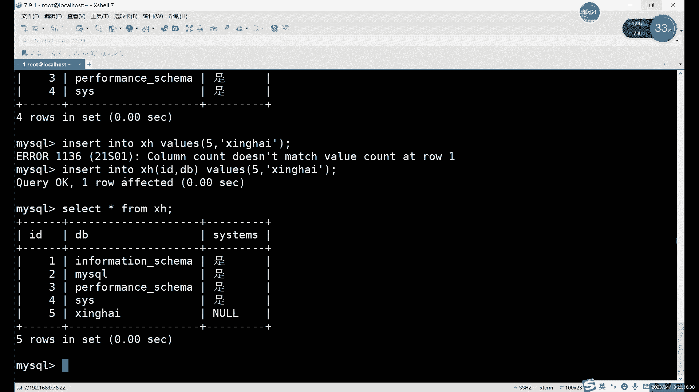

# 0基础小白怎么入门Linux运维？看这套，Linux运维全套培训课程，保姆级教学视频 - P67：中级运维-4.SQL语句，数据类型，约束-上 - 小方脸不方- - BV138411B7p5

好我们这节课呢继续讲MYSQL啊，讲MYSQL内容，那首先上节课我们最后讲到哪，最后讲到这个进到数据库当中修改密码的问题，对吧啊，群群里小月是吧，修改密码的话，这个你看你是用的是哪种方式安装的啊。

用rpm安装的话，你在这个文件里去找密码啊，源码安装你是这个文件里去找啊，文件是不一样的，然后呢你进入之前呢，首先先启动启动之后才能进入啊，如果说啊连接报什么，比如说报一些这个连接不到吗。

这种一般就是没启动啊，或者说什么，或者说还有可能是什么，就是MLGB杠left那个文件没有删除啊，这个其实是一个很容易犯的错，就是MD啊，MDB如果说不完全卸载的话，是否影响到MYSQL的启动的啊。

会影响到MYSQL启动啊，连接啊这些，所以一定要注意啊，一定要先把MLGB卸掉，哎，卸掉之后呢，我们在去按再去安装这个MYSQL，或者说再去启动MYSQL好吧，那现在的话我们。

目前啊就是数据库的话已经装好了对吧，我们先进到数据库里面啊，我们这节课主要就是讲什么，主要就是讲我们MYSQL里面的一些简单的命令啊，以及它的一些数据类型的约束这些，首先我先看一下。

目前的话原来是恢复了一块照啊，数据库还没有创建啊，这个不用着急啊，不着急，首先我们先回到这里啊。

我们先来看一下我们SQL语句的主要类型，一般就是分为四种，这种的话它的功能啊，或者说他管理的方式啊，都是有点区别的，就比如说第一个唉简单来说呢，它其实就是管理四种不同的东西，有什么有表格。

有数据权限和事物这四种啊，管理这四个方面呢，其实就用了四种不同的SQL语句，那第一种其实我们前面已经稍微讲了一点啊，就是管理表格的，或者说除了表格以外呢，还有什么，还其实还有数据库啊。

主要的话更多的是用在管理表格上，因为数据库的话，你最多也就也就创建几个吧对吧，你一个MYSQL里面也就最多也就创建几个数据库，主播的数据存放呢还是在哪呢，还是在在我们这个表格里对吧，所以说一般情况下呢。

第一种一般是叫它管理表格啊，其实说数据库表格其实它相当于是一起管的啊，用一种类型的命令是同时管两个东西嘛，当然了，对于数据库操作，其实我们是非常少，一般只有什么，只有创建和删除，没有其他的啊。

一般我们很少修改数据库的名字啊，数据库名字就是不能随便改的，一般情况下呢我们的第一种啊，我们先来说第一种吧。

啊管理表格的管理表格的话，其实就是什么创建修改删除对吧，就是这三个命令，第一种类型的最后一句就三个命令啊，或者说三种用法可以管理表格，也可以管理国库，我刚才说了很少动啊，我们一般很少动，创建好之后呢。

我们剩余的操作呢其实都是在哪，都是在我们的数据库当中的，对表格的操作，我们很少说对数据库直接进行嗯，来回一直改数据库是真不会啊，不会再这样做啊，对数据库来说，一般就是创建和删除这两个。

然后表格上的话其实是alt命运用的比较多，就是修改上啊，这三个英文单词的，就是翻译过来就是这三个意思，然后呢我们来看一下啊，首先啊我这里是恢复了一个比较纯净的拍照啊，就是连数据库还没有创建。

数据库还没有创建，所以说我们就先来创建一下啊，create命令呢就是第一种啊，DDL的SQL语句里面的第一种啊。

叫什么呢，我们的名字叫数据定义语言，也就是定义什么呢，就是其实准确来说其实定义什么，定义我们存放数据的一个表格唉，就是我们的数据呢如何存放，由我们这个dd l语言说了算。

其实主要就是什么呢，主要就是create和arter million，你创建一个什么样的表格，或者说修改了什么样的字段，修改之后呢，我们里面的数据就必须要按照我的规则来存放，如果违反规则呢。

那插入的话我们一般会省，一般的话一般会报错啊，就是你插入失败了，哎如果说你不不符合我们这个表格的规则啊，最后你就会插入失败啊，这个就属于定义元的意思，当然删除这个啊，删除这个怎么说呢啊删了之后就没了啊。

删了就没了，所以说我们对于数据定义就是创建和修改啊。

这两个删除的话，大家知道知道就行了，创建的话啊，DATABSE对吧，首先我们先创建一个我们自己啊，自己的数据库系统里面呢，我们一般不随意做修改，一般我们最多改一改，也就是改这个库。

改这个库里面的用户表啊，因为用户表的话，如果我们创建用户啊，或者修改密码，修改权限这些的话，还是会用到这个这个库的，其他三库呢，我们不会主动去修改啊，我们不主动去修改，创建好这个数据库之后呢。

我们切换进去啊，你得先进到这个数据库里边，因为我们现在呢其实是是什么，其实现在我们相当于处于唉就比如说你这MYSQL啊，我们用MYSQL命令呢，进入到了我们这个MYSL整个库房里边啊。

你可以看成一个仓库，仓库里面有很多个唉分开的几个小的库房，如果说想在里面去具体创建创建数据，插入数据，你必须得具体进入到每一个库房里面对吧，你不能说站在站在什么，站在我们这个库房的大门口对吧。

你看这几个数据库，你想插入数据，你如果说不指定某一个数据库的话啊，它是它就会报错啊，很简单它就会报错，所以说呢哎我们必须要什么，必须要先切换到某一个库里面，比如说我们进我们自己的库里，进去之后呢。

我们就可以对里面已经操作了，依然我们还是先用query的命令，先创建一个什么呢，创建一个表格，对啊，create这里我们就是创建表格的，创建表格的一个作用，创建表格的话，create table啊。

固定用法，然后后边加上表格的名称，然后这里需要注意的是什么，我们上节课其实也创建了一个非常简单的表格，对吧啊，就是用了一个id啊，因为这个id创建一个非常简单的表格，如果说前面创建多类的情况下呢。

怎么办呢，哎你看我们这个表格，如果把它变成一个表格的话，它其实就是只有database这一列，对吧啊，只有database这一列啊，就比如说我们想把这个真正做成一个表格的话，那怎么办呢。

啊是除了id以外，我们想把这个写成这个一个真正的一列呢，我们就可以继续在逗号后面啊，create的用法呢其实就是创建就创建库里，没有后边后边什么都要跟啊，你也是且也没有其他用法，创建表格也不一样了。

因为我们表格呢它有列啊，还有很多列，那这些列呢我们就需要什么呢，哎就需要手动在后面添加，那在添加的时候呢，我们就需要用什么，就用这个，比如说呢我如果说想把我们MYSQL里面的唉。

所有的库的信息做一个表格，做个表格出来，平行的也可以啊，你就在后边逗号后面加什么，先写的是表头或者说是字段的名字啊，你可以先写表格，表头或者字段的名字，然后空格后面写什么，后面写它的一个限制条件啊。

它的一个限制条件对吧啊，它这里我们是什么，这里都是一些字母五对吧，字母它字母的话啊，你不能用整数了啊，INT我们之前介绍过对吧，上节课介绍过是它是整数，比如他其实只能插入12345啊。

所以说呢第二个我们这一列呢，它就不能用整数了，得用什么，得用字符啊，字符里面最简单的一个呢就是CHAR啊，他这个字符的话，我们数据类型的话，我们后面会继续讲啊，大家就先记住它是什么，它是代表字符的啊。

或者说是VRCJR都可以啊，两种都行，然后呢唉我们这里括号里面写什么呢，啊括号里面这里是需要这里需要写一下，为什么呢，算了，我们还是用VRVRCHAR吧，这样的话其实两个其实都可以啊。

都可以有什么区别呢，就是一个它会确定长度，一个是相当于比较自由一些啊，更自由一些，因为这里的话它比较长，我们现在数一下一共几倍啊，56789十十一十二十，三十四十五十六十七十八。

我们这里至少得写个18倍，为什么要这样写呢，这个就是规则啊，这是规则，18在这里的意思是什么呢，它不是代表18个字节啊，或者说十八十八B18比特呀啊不是这些，它代表的是18个长度啊。

我们这个数据库里边啊，你插入字符类型的东西的话，我们是要数长度的，我们不是说数这个哎，就比如说18个串字，18个英文是一样的吗，其实在数据库里面，在规则这里是一样的，就是你这个18呢它既可以是18个字。

英文字母，也可以是18个汉字，我们考虑的不是大小啊，就不是说占比特啊，占多少比特对吧，而是考虑的是它的长度有多长啊，所以说这个这个括号里面写的是长度啊，长度，如果说你这个插入的数据呢超出了长度。

会发生什么呢，啊它就会报错，因为这个是我们学的一个硬限制啊，就是限制这一这一列呢只能写18位的数据啊，超过我们就不允许他加入了，这个的话就是一个什么，这就是一个创建数据库的时候，我们只变了一些东西。

当然后边的话还会指定一些约束类型啊，啊后边一些特殊的规则啊，这个其实这些其实只是普通规则啊，哎呀比如说INT啊，CHAR啊，这些只是普通规则啊，限制你是个数字啊，还是个字母呀对吧。

但是后面我们还竟然还有日期啊啊限制这些的，后面的话我们还会讲到这个不同的约束类型啊，那就是一个特殊的规则啊，那我们后面再具体去讲，我们一开始先简单的先创建一个表格，创建表格命令化。

create table啊，加上我们表格名称，后边加字段名字啊，这字段的数量啊，数量的话，这个用如果是多个的话，用逗号隔开啊，我们之前是创建了一个嘛对吧，现在这些我们是如果说。

比如说你还想再来一遍呢也行是吧，但是这个数据库你再来一遍，我叫什么呢，用id对吧，第一个，然后data base，然后呢第二个数据库啊，不是第三列，第三列的话我们叫一个，是否为系统库吧啊，是否为系统库。

哎上面三个的话它是系统库对吧，那我们自己创建的这个呢啊，是我们就是非系统库，看我们就这样随便写一个啊，随便写一个啊，比如说这个的话，我们可以写一个，三位就行了对吧，我们就是或不是啊，是或不是。

Yes or no，然后就限制个三位，那这样的话我们就相当于创建一个简单的表格，给谁创建的表格呢，给我们的系统里面的数据库啊，就是MYSQL里面的数据库呢啊那这是一个信息，我们创建了一个简单的表格。

我们这里的话就可以什么可以回车创建啊，大家注意后边加引号啊，SQL语句的话我们都要加引号的啊，唯一一个比较特殊的是use啊，use其实可以不用加，还是为了大家这个好记一些，然后说为大家养成习惯了。

就是use命令也加上这个封号，use命令是MYSQL里面比较特殊的一个，他是不用加分号的啊，可以不加括号啊，然后的话我们这里可以检查一下对吧啊，三部分三个不同的这个字段啊，就是三个不同的列。

现在它相当于是一列对吧，我们这个命表格创建出来什么是三列啊，我们创建出来是一个三列的表格啊，然后他这里报错，我们可以看一下，看一下哪有问题啊，create table加上表格名字诶，他的报错是在。

从这段贝斯这里开始，data base啊，这是AR，现在位置是我们这个，看一下这都是base d a t a b s EV r c h a r，Grade table，加上我们表格名称。

我们加上后边一个字段，两个字段，三个字段，这里我看一下。

我是哪里少了点东西，Bread table，加上表格名称对吧，我们正常创建字段的时候，用逗号隔开就可以。

这里我是哪个符号打成中文的啊，或者说是大家注意啊，这里的话符号之类的这些东西需要达成，都要打成英文的，Grad r c r e a t，表格的后边呢。

我们括号里面加上IDING一个字段database空格，加上我们的18位的VRCHAR，加上system，我来看一下这儿哪有问题，还是逗号，啊这个是中文的话，这个是是英文逗号，没问题，这个是中文逗号。

看下create table，Great table，加上表格名称，加上这一段的话，Testing data，hr括号里面加上这个数字，这里的话报错啊，报错确实有点奇怪。

Sisting i n t database，对不起，我们切换到这个库里面之后，我们创建这么一个表格，我们现在应该是受这个现代库里边。

应该是没有表格啊，目前没有表格，创建表格的query table，加上一个名称，I d n t data base，V r r c h a r。

data base这个位置对fter base v r c h a r。

字段名字的话，这里我改了一下，其实也没什么影响，他报的措施，在这个附近，这里括号是没问题的，你看这个是这个括号，然后CHR的括号是在这里，然后下面这个括号呢是我们整个表格的，括号也是符号。

这里也没什么问题，这爆头其实有点奇怪啊，data basis通过了。

我们就先简单点，我们就dB吧，AGEB好，database数据库对吧，好数据库名字的话，这个确实，啊data base data base的问题，database是我们数据库，数据库，这个的话。

其实这个大部分字段其实都是没问题的，你看偶尔像有一些这个看系统里面，它有一些内容的话，它是不允许我们作为这个字段啊，不允许我们作为字段，然后括号里面的话这个就是长度DSC，我们看一下我们创建的这个表格。

还是这个名字的问题啊，名字的话其实和系统里面的数据库的名字，如果你是一样的话，它就是它就会报错了，然后括号里面的话，这个就是长度啊，就是可以填几位的，就比如说你是如果是字符的话，就是18位的字符。

如果是数字的话，就是11位的数字，啊这个的话就是，就比如说呢为什么这里我们写这么长呢，其实就是因为我们这个数据库，它名字确实比较长对吧，看这里的话有六九十一十二十三，啊这是几位来着，369十十一十二十。

三十四十五十六十七十八十八位，正好对吧，他因为有18位，所以说我们这里如果说想把这个数据差，正常插入的话，必须要什么呢。

必须要让他能够插入18位的这个程度啊，这个就是限制长度，然后下面的这个CHAR的话，它是什么，它是这个也是一个长度啊，为什么这个世界这么短呢，啊就因为这个我们的数据其实没必要太长啊。

就比如说呢现在的话其实我们就已经创建好了，创建好了这么三个，还有三列的一个表格啊，用的是create mini啊，一般情况下的话，这些其实自带的话，它一般还是有限制啊，像这个database的话。

我之前其实一直都确实没用过啊，database这个的话因为是和数据相，当于是和谁呢，和我们的这个数据库当中啊，一定有的命令有冲突，所以说他这里不让我们设置这个database，我们说我们就简写dB吧。

Db，整数的话默认是11位的啊，我们是没有指定啊，这里的话可以指定啊，这里可以指定整数的话，默认它是指的11位啊，是一个，但是呢其实整数，因为什么我一直没有说是整数的，我一直在强调这个字符这里啊。

你是18位，就最多只能18位，是三位呢，只能是三位啊，就因为字字符不对，这应该是整数啊，整数这里其实没有限制，没有限制它，这个限制其实没有意义，就是你这里写多少都无所谓，你想怎么插怎么插就行啊。

讲出这里呢，它只是一个提醒作用吧，它没有限制啊，但是字符这个是绝对的限制，你就不允许超出这个范围啊，字符就可以超出这个范围，当然了，这个AABA字符，这个整数整数是可以超出括号里面的范围啊。

等等我们接下来继续来看一下什么呢，啊来看一下这个下面的啊，修改命令的话，这个其实包括很多内容啊，修改内容的话包括很多，主要是我们修改系统的话，其实都还没有讲alt命令修改的是什么呢。

我们先提前说一下啊，他修改的是我们表格的格式啊。

他修改的是表格的格式，具体包括什么呢啊从头到尾其实都能改，比如说名字能不能改，可以改，AUTOMON是可以改什么的，可以不改表格的名字可以改什么，可以改这个字段的名字，也可以改这个整数啊，这个叫字符。

这些类型甚至也可以改后面的这四种啊，这四种的话就是我们没有讲的特殊的约束啊，我们在后边一会儿会讲啊，就这节课会讲，这些约束的话啊，这些约束呢怎么说，就是特殊的规则啊，就是在这些规则以外呢。

我们的对于数据的一个限制啊，对于数据的一个限制，也就是说alter命令呢，就是可以改整个表格里面的所有内容啊，就是他可以从头改到尾啊，可以从头改到尾，然后这里的话我们可以用这个alter命令的啊。

我们当然现在我们先简单改一个，比如说我们可以改一个什么呢，我们改一个，表格的名字吧，啊我们先改一个表格的名字啊，后边的其他的内容的话，我们在讲完这个这些约束之后呢，我们再去具体去演示啊。

因为这里的话如果说我们讲的话，直接演示，其实大家不太明白其中的意思，就是说我们先改什么，我们只能先改一个表格名字吧，表格名字改起来的话其实比较啊方便一些啊。

改改个名字的话用的是什么呢，啊用的是我们奥特命令里面的这个，rename啊，包alter里面有alter命令里面有很多子命令啊，我们这里的话，其他前面几个的话应该还没有讲，所以我们先改一个什么。

先改一个啊，rename重新啊，就更改表格的名称啊，先改表格的名称，但具体怎么改呢啊就是alt加上这个表格，table旧表格名称，然后rename to新表格名称啊，这个就是automate的第一种啊。

一种比较简单的用法，我们先说一下，首先呢alt加上table加上什么旧表格名称，比如说我们先填进表格名称，然后呢rename改成什么呢，哎比如随便改一个，其实就行啊，随便改一个。

那这样的话就表格就改掉了，现在的话我们用show tables只能来查看，那如果名字变了，就是XH啊，这句话就是什么呢，这个就是alt命令的一个作用，它的作用是修改，从头到尾都可以修改。

只不过我们表格里面具体的内容的话，我们还没有说，所以说我们这个在具体讲完之后呢，我们再来具体的说一下aut in的其他用法啊，现在的话我们先介绍一个什么比RELAME啊，准确来说的话是reno to。

命令的话就是rem rem to就是改名字啊，这个可以随意改啊，表格名字可以随意改的啊，只不过只不过你改了，改了之后呢啊，你得注意你后面去查看表格的话，或者修改表格的话，你就得换名字了啊，换了个名字嘛。

相当于这个是可以随便改随便改，然后像那些MOTIFY呀，彻底，这些命令主要是用来修改这个里边的内容啊，我们讲完这个里面的东西之后再说啊，这个不用着急啊，不要着急，然后呢这个命令呢是吧。

这个就我就不演示了，top命令就不演示，大家自己想想看的话就看一眼，就是想用的话用一下就DP table或者说什么呢，或者说是这个嗯，还有一种的话就找个对象的位置，啊这个就是删库。

当然这个的话是删除一个数据库啊，删除一个数据库啊，Drop table，或者说job with，删除单个的表格，或者删除单个的数据库，啊三大家注意啊，就像三库的话，准确的三数据库呢其实它既不是RM命令。

它也不是delete命令啊，它其实是job命啊，这真正的删库命令，其实这个才叫真正的删库的命令啊，虽然说RM gf一直说删除跑路什么的，但其实并不是啊，那个它只是删除我们整个系统上的文件，当然了。

我们的数据库呢也是属于系统的文件，但是如果说仅仅只说一个三数据库的话啊，准确的命令是job the job啊，job命令DP data ra啊，这个才是真正的删库命令，删库命令好吧，这个我就不演示了。

大家可以自己去尝试一下啊，你删除之后，你再创建回来，因为我们接下来的命令的话，还要在这个数据库里面，已经在这个表格里面去做啊，我这就不删了好吧，因为不太提倡这种做法。

不太提倡这种做法，所以说我这就不演示不演示了，然后呢我们接下来呢继续来看啊，下边的第二种，第一种命令的话，其实就三个创建删除和修改对吧，就是三个，而且只能是针对于什么，只针对于表格的数据定义。

它定义的是表格啊，注意定义的定义是表格，那我们接下来看第二种DML数据操作，注意操作这个的哎，就具体的去管理什么，就是具体管理数，管理数据啊，管理数据啊，不是管理数据啊，管理数据的话。

那就是所谓的什么呢，大家应该都听过增删改查，第二种呢就是我们所谓的增删改查，数据操作语言啊，就是在你创建好表格之后呢，啊在表格里边啊去做这些插入啊，删除啊，更新啊，查询啊，这四种操作啊。

这个也是这四个家伙呢，也是我们SQL语句里面最常用的啊，CSQL里面最常用的，首先呢啊insert这里，就是插入我们上节课演示过对吧，上节课就演示过这个insert啊，就是往我们数据库里面去插入内容啊。

delete自然就删除啊，大家注意啊，我们的delete命令呢，或者在数据库里面的delete命令，它它只是用来删什么，只是用来删数据的啊，它不能用来删库，删库是照顾命令，好吧啊。

delete命令只是用来删数据的，而且是删单个表格当中数据，它甚至不能删多个表格啊，删表格的话也是用dB，也就说说delete呢在SQL语句里面，它其实功能是比较弱一点，它只能是删表格中的数据。

然后拿出来的就是更新啊，和或者说你可以可以称作修改它呢，其实和alter命令是一个意思对吧，都是修改的意思，只不过呢alter改的是什么呢，他改的是表格啊，数据库啊，哎主要改的是表格的格式。

W的命令呢更新或者说修改的是什么，修改的是表格当中的数据，就修改的是具体的数据，那select这个不用多说了吧，查询查询啊，这个其实是SQL语句里面最复杂的一个啊，最后语音呢最复杂的一个啊，没有之一啊。

其他的其实都都不能跟他比啊，他是所有搜索流行员最复杂的一个啊，那首先呢我们先来介绍一下什么。

先来介绍这个insert，insert是上节课我们只是稍微演示了一下，只插入一个数据而已，但是insert他还有用法，不止之前改，首先呢insert into对吧，这个格式还记得吗啊。

insert into向哪插入呢，这样我们创建的表格啊，就插入X现在改成ZH了是吧，嗯有点短，但打起来也方便啊，Values insert into values，不像我像我们这个表格当中插入数据啊。

具体的数据是什么呢，我们的表格一共是三部分，大家注意啊，就是在插入数据的时候，一定要跟看表格啊，看表格里的规则，一定要注意这个规则问题，如果说你违反了规则，那你的数据呢不能说数据吧。

就是插入的过程呢就直接会报错，所以说首先的话我们先来看一下，一共是三个数据对吧，正常一般啊，如果说想要插入三个数据的话，其实就是什么，就是在括号里面分别写上什么，分别写上三个数据的一个，比如说第一个。

那我们就写个一啊，第二个呢叫什么呢，dB呢就是我们数据库的名字嘛，我们看一下数据库名字，你就按顺序来吧啊，Information sem，这个数据库的名字，然后呢第三个是什么呢，第三个是是否为系统库啊。

那我们就yes啊，或者说什么呢，哎不要验证yes，感觉是啊，是，啊是不是系统库呢，我们说嗯应该说是系统，或者说，啊我们限制的因为是限制三位，所以你不能写太长，你为字母的话也只能写三个啊。

四个字的话也只能写，不是按字的话也只能写三个，那就试试吧，啊是不是系统库呢，是系统库啊，这样的话就可以啊，注意的话呢符号的话都要用什么，都要用英文的啊，你不要说数据里面如果有中文，一定要记得及时切换啊。

及时切换，而这个命令的话其实就是什么，就是像我们这个现在现在当前这个表格里边，插入三个命啊，或者说插入三个数据啊，用一个命令去插入三个数据，那这三个数据呢，分别就是插入到了对应的列里面，i id这一列。

dB这一列和CVT啊这一列里面，然后这里的话我们回车执行啊，OK就没有报错的话就是正常的啊正常，然后我们可以来查看查看呢，大家都用的是什么呢。

那我觉得用select select查询我们上节课说的寿命是吧，show的话它是用来展示什么，展示一些，数据库表格以及后边呢，我们会讲很多额外的一些用法啊，这些的一些信息啊，查看信息的。

它不是用来看数据啊，准确的说，他并不是直接来看我们表格当中的数据。

想看数据的话，用的就是我们增强改造里的查啊，select对我们来看一下的话，首先啊select我们具体用法我们先不着急讲啊，在新就是代表什么呢啊我们现在是新号的话，就通配符的意思对吧。

这个之前大家在前两个阶段应该也遇到过对吧，你用坏的去查询的时候，比如说你看你用five的命令啊，比如说你想查一些，这个台下以某个以某个字母开头的，或者以某个字母结尾的一些命令时对吧，你可以用什么呢。

可以用星号对吧，作为通配符，去代替啊，代替什么，代替很多位的这个数据，当然了，在select里的话，星号代表什么，代表就是所有所有种的所有数据的意思啊，这里信号代表所有数据的意思。

它不并不代表数量或者一个两个什么，它只是在它是代表所有的数据，selly info后面加上什么，具体加表格名称就行了，然后就这个是最简单的一个SELLY例句啊，这就是最简单的自然的一句。

数据库是一定要有的，就注意这个四命令，然后前面的话具体查询的内容，最简单的就是用新号，用新号呢就是看一个完整的数据库啊，看一个完整的数据库啊，现在不是数据库吧，应该是应该叫表格啊，看一个完整的数据啊。

一个表格分钟完整的数据，你看三个表头一个啊，然后每一个里面都有一行一行数据，那这个就是insert的命令啊，这是insert的一种用法，然后呢我们接下来呢INTEL不仅仅是这样。

他这样的话是可以插入的啊，或者说是什么，就是如果说你数据量，那就是你如果说有好几个好几列的，或者说好几行吧，这个要好几行的数据，好几行的数据想要去插入的话啊，可以怎么插入呢，两种方法吧。

一种呢就是你复制，就是这个可以复制很多个insert命令出来，然后呢改一下后面的内容啊，这是一种方法，当然如果说想浓缩一下的话，怎么办呢啊你可以把多个，数据库啊，或者说这个多个数据吧。

多层数据分别写在这里，比如说我们写个二第二个数据或者什么MYSQL吧，我记得是啊，Mysql，第三个呢啊依然是市，对吧，这是一个数据，如果说想要再来个数据的啊，当然前面这个我们就删了吧，因为已经有了。

已经有，我们就不插入了，二逗号MYSQL，然后呢第三个的话我们用什么呢，唉我们用这个三逗号，第三个是啊promise dem，我顺便的话就把这几个都都插进去吧，啊都插进去，这是两个对吧，第三个，自动化。

sensing对吧，然后这office它这个他们不是全写，啊这里的话怎么说呢，没讨厌命令，如果说你删了的话，它其实和命令行里面是一样的，如果没保存的话，它就没了，看没保存它就没了，Mysql。

二刚才我不小心那么一些上下键啊，三逗号，依然是四，最后一个的话就1234逗号XYS，啊这样的话就是同时插入多行啊，就要这样写，就是每一个结束之后呢，用逗号隔开，然后里面记得加括号啊，括号就行了啊。

大家注意一下，就是我这里为什么没有加引号呢，对吧，你这大家注意到234，我没有加引号，为什么不加引号呢，啊当然这个就是因为这个原因，在插入数据的时候，字符呢需要加引号，数值的话，整数也好。

或者其他的数据也好啊，只要是你是数字，那就不用加引号啊，可以不加，当然加上也不错啊，加上也不错，加上他也不会插入冒号啊，就不会插入引号一的，它只会插入一啊，它只会插入一，反正它也会自它。

这个是会自动识别的感觉，加VR引号都可以，不影响你就为了，如果说哎一个数据里边它有有这个数值，有字符的话，你插入起来，如果说怕类型弄错了，你可以什么，你可以直接的全部用引号也可以啊，全部用引号就可以。

然后这里的话就是三行对吧，已经插入了三行，23号呢，我们再来查看，再变成1234啊，1234啊，这个就是什么，这个就是，insert键用法，插入单行数据，或者说呢同时还有多行都可以啊。

都可以insert，其实还有一个用法啊，这只是什么，这只是插入全部的数据对吧，不知道大家有没有想过，就是比如说我这里如果说只一共是三列对吧，那我能不能只插入两列，或者说只插入一列呢，那也是可以的。

这个是这个也是允许的啊，这个是允许，就比如说你最后一列不想写行不行啊，可以啊，可以不写，那怎么办呢啊能不能直接写上insert input values，然后1145逗号XH呃，星海对吧，嗯五星海对吧。

这个数据这个形状啊，那不行啊，为什么不行呢，因为数据库呢，他并不知道你这两个数据到底是给谁发的，因为我们一共是三个数据对吧，insert into啊，像我们的诶，不对啊，对，是这个表格。

如果说你这样写啊，五逗号，这样的话两个数据，但是呢我们这个表格有三例啊，也就是我们的这个应该叫表格上，他并不知道你这个具体下来插入在哪，就是你们指定的不明确吧，这个错的话其实就是指定不明确啊。

他就不能匹配，那就无法匹配数值啊，一共三列，你给我两个数据，让你让我怎么插呢，对吧，它没有那么聪明啊，没有那么聪明，我们得告诉他我们插入的是谁啊，就把六的名字写在这里就行，哎。

就是在表格的后边呢加上这个括号，括号里写上具体的对应的什么，对应的这个列就可以，这样的话就是插入一部分数据的一个做法啊，比如说你这个不想插入，或者说确实没有数据啊，没有数据的时候呢，你可以不插。

不插的话就正常这样执行，啊它又显示了一个控制，控制是什么意思呢，就NUML指的是控制啊，它并不是一个值啊，它并不是一个数据，它代表的是我们这个是没有插入过数据的啊，没有插入过数据，所以他就标了一个空啊。

就代表什么代表没有数据的意思啊，这个NN的话就代表没有数据好吧，这就是没有数据的意思，那如果说想要继续继续修改的话啊，当然后面也可以继续去改啊，继续去改，这里的话就是insert插入一部分数据啊。

就比如说如果说有一部分有一列的数据没有，或者说是啊有问题啊，我暂时不插入，我们只插入两个啊，三列只插入两个数据呢，就是在我们的表格后边呢，加上具体要插入的内容就可以了，啊这个话就是什么，这就是我们。

insert啊这个用法啊，insert insert的用法就这么多了啊，没有了啊，就这就这么两三个啊，就是它其实就是一个插入的一个作用，所以说用法呢不是很多啊，用法不是很多。

然后呢我们接下来继续看下一个单独的话，这个嗯怎么说呢，给大家演示一下啊，演示一下，因为这个删除呢它不致命啊，没有那么致命，那不像刚才的job job，我刚才你如果说你执行一次正规的话。

你还得再create，再重新创建对吧，有点浪费时间，但这个比例得到没什么事，它只能删什么，它只能删数据，怎么删的啊，用delete命令，然后呢form form就是你删哪个表格当中的数据啊。

