# 0基础小白怎么入门Linux运维？看这套，Linux运维全套培训课程，保姆级教学视频 - P68：中级运维-5.SQL语句，数据类型，约束-中 - 小方脸不方- - BV138411B7p5

啊，虽然说不是那么致命啊，但是迪ele的命令还是可以什么呢？它可以直接删掉整个表格当中的数据。什么意思呢？就是比如说大家可以看这个命令对吧？这个命令是什么呢？d form啊从这表当中删除。但是之后呢。

他还给他四行啊，上了四行。为什么为什么三个四行呢？😡。

因为所有的就一共就有4行，当然我们这里是五行了啊，当然我这里也不太想全删了，全删的话，你再重新添加。哎，我们可以把最后一行删对吧？我们可以删最后一行，就是第一个form我们加上什么，加上这个表格的名字。

它代表什么？它代表就删掉这个表格当中的所有数。😊，所以这个命令也慎用啊少用。我们这里就演在演示一个什么呢？演示一个删除指定的命令的一个或者指定数据吧。删除指定数据的一个delete的用法，对吧？

delete form就是删除所有啊，记住就行了。我们接下接下面主要演示什么？以显示删除一部分。

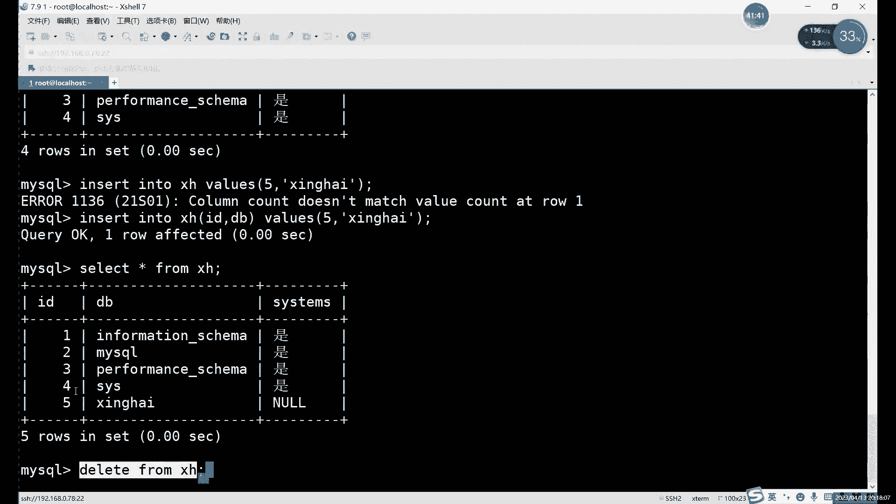

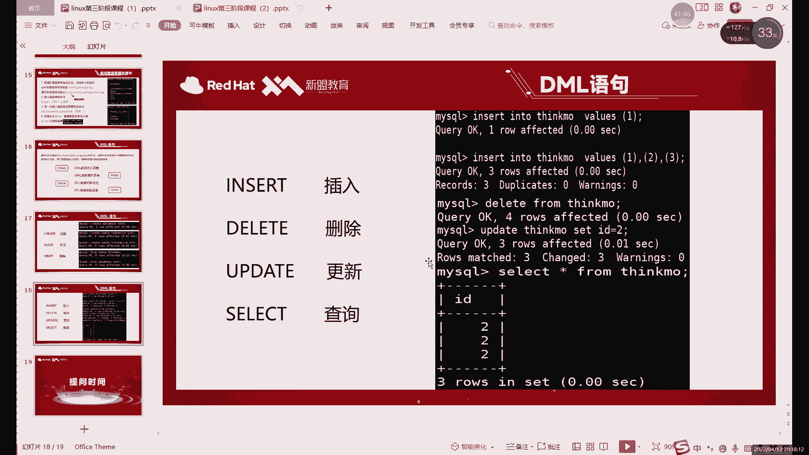

比如说删成哪部分呢？但我们这里啊有一个空值，对吧？有个空值感觉看起来不是很好看。那怎么办呢？我能不能删掉它呢？那那就删呗啊，我们就用dte命令。加一个where。啊。

就是在这个表格的后边呢加一个wherewhere是什么意思呢？啊，where的话在我们。😡，买思的搜cle语句里边的话，它起到的作用就是什么？就是限制条件。这个不仅仅是在删除delete里边。

还有这个阿way的更新啊，以及什么，以及这个slalect查询的时候，这三个命令都会用到这个ware。威的作用的话其实就是限制一个范围。因为deleteform我加上我们表格名称的话。

这样会会删掉我们表格当中所有数据的。😡，啊，一般我们肯定不会这样做那这样和三库其实也没什么太大区别啊，只不过是范围小一点三表吧，对吧？所以说这里呢。一般情况下，你删的时候啊，我们都会指定一个啊就是。

有问题的数据对吧？啊，或者说插入错了啊，我想跟直接给它删掉行不行呢？啊，就直接用dit命令怎么删呢？必须要限制范围。因为你直接这样删的话哎，相当于。😊，清了整个表格，那和删掉这个表格也没有什么太大区别。

所以说这里的话我们就需要么需要。加上一个限制条件。那怎么限制呢？😡，买了可以先思考一下，那怎么限制这个范围，就是哎怎么能告诉他，我们告诉delete的命令，那你要具体去删哪个呢？

其实呢我们就可以从字段上进行预入手。😡，哎，进行限制条件。什么意思呢？啊，delete这里。😡，我们正常的话相当于delete form，就是从一到5全删掉了。😡，那怎么限制呢？😡，比如说ID。

怎么才能告诉他，哎，我想删的是这个叫星海的库。😡，其实呢有三种方法啊，就是这个表格的话，它有三种方法可以先。第一ID等于几？ID等于5是不是星海，对吧？那就可以删DB等于星海，那是不是这个库呢？也是。

还有一种呢sensitive。😡，等于no。是不是是不是这个户呢？也是也就是这里的话，其实我们有三种不同的方法能够出。对吧一般常用的呢更多的会用一些这个比较独特的一些数字。比如说像这个ID号ID号的话。

正常我们一般不会让它重复，对吧？只要它不重复，那每一个数据库对应的ID就是么呢ID就是唯一的啊。所以说呢我们一般就可以用这种哎有唯一性的一些字段，或者说这个列啊，应该就是这一列。

用来标识这一个具体的这个值。这个意思就是什么？就是删除ID等于5的这一行。😡，大家注意啊，DV的命令呢，我刚才说的就是DV的 form是删除整个表格，对吧？如果说限制它能限最大能限制到什么程度呢？

它只能一行一行的删。😡，啊，他只能一行一行的删除。啊，这个是deleingdelete面的一个限制。它不是说你想删某一个格的数据行不行？不行啊，它只能删一行。😡，这个就是什么？

这个就是deleing deeleing deleteelete me删除。你今今天有个嘴瓢，delete这单词怎么这么难念呢？delete啊删除的一个特点。A等于5对吧？啊，就对应的这一行啊。

如果说有重复的怎么办呢？😡，再加硬。再加一个限制。哎，如果说你这里ID啊不小心写重复了啊，写了两个5。那怎么办呢？你还可以再去找其他的，比如说sinste。或者说是DB。对吧，比如说如果是DB的话。

是and。1D等于。这样的话就是什么？就是你如果一个条件不够。😡，没关系，我们来两位。两个包裹怎么办？来三个。啊，如果说你所有的条件都写上了，它还重复的话。😡，啊。

那那这个威尔命令它确实就没办法没办法直接去过滤某一个值了啊，某一行啊某一行。然后一般情况下，我们会一般不会允许这种情况出现，我们都会怎么都是每一个表当中呢，我们都会设置一个什么呢？都会设置一个。

比如说唯一的。唯一的值。啊，唯一的。什么意思呢？哎，就比如说。😡，这个的话其是我们后边需要讲的一个后面会讲的一个更。特殊的限制条件。什么意思？就是嗯我们看一下是哪一个啊嗯DIC啊，是这一个啊。

这个K这里K这里我们是可以设置一个唯一值的。什么意思？就是你这一列的数据呢不能重复。设置这个值之后呢，这个列的数据不能重复了。所以说你删东西的时候，你就用这个去作为标准。啊，这个就可以用这个作为标准。

用这个去算。啊，系统不会创建自动的这个序列号的，但是我们可以自己去创建一个序列号。对吧我们自己创建一个序列号呢，给它设置成一个唯一的值，设置成唯一的值的话，你后面插入的数据呢，它就不会再去重复。

这一列呢就肯定就是独一无二的，每一个数据都是独一无二的那这样的话啊你后面插数的其实很很很方便了。啊，后面删除就很方便了，你看一下它是哪一列，就是哪一个哪一行的ID是几。

那直接就delewhere IDD就行了。啊，我们一般的表格上都会设置一个什么。有唯一值的一列。不设置行不行也行啊，这样的话你找起数据来的话，就不是很方便。这个其实。你个一个怎么一个做的比较好的表白上。

肯定至少。有一列呢，它的值是绝对唯一的。就比如说你身份信息吧，对吧？你身份信息的表，其实你即使你不创建，它也绝对是唯一的。因为什么呢？身份证号、手机号是不是唯一的。对吧如果说有这些信息的话。

其实你就不用再创建了。啊你身份证号呢是绝对唯一的，手机号也是绝对唯一的。啊，这个出生年月这些可能会重复吧啊，年龄啊、性别这些都会重复。其身份证号、手机号是两个绝对唯一的东西啊，这些的话都是可以作为什么？

就是你删除的时候的一个标准。对吧。方法很多啊，那么其实方法就删数据啊，找数据啊方法是很多的。这个具体我们后边对吧？你查询数据的时候呢，我们会具体去说啊。自动添加一个数字的话，我们后面也有是哪一个呢？

这个。啊，功能都有啊，就是你能想到的，其实数据库里面其实都有，对吧？这个可以限制什么？限制唯一性。这个家伙呢他可以里面可以写一个什么自动添加数数字。啊，他确实是可以自动添加数字的。就是你只插入数语。

它会自动一添加12345自动去加。あはい。好，这个的话就是delete命令啊，这里我们没有删，对吧？啊，我们可以删一下，删完之后呢，d。听号from。Exage。对，就剩下4个了。啊，这个就是什么？

这个就是嗯。给率的命令。但是我这里还是再插入回来啊，一时候还有用啊，insert intovalue。你35给个叫什么ASXH对吧？ID。给弟。😊，胡道客。你行者嘛。好，那这个就是。你再插回去好。

你插回去。因为一会儿这个delete命令呢用反了，就这么多没了。啊，就是dele form加上表名字，删所有。像一行一行两行，像三一行或者说删几行的话，怎么删呢？就这样删。啊，加威尔加线的条件。

如果只是删一行的话，你就去找那什么找有独特的。有独一无二的数据的记行啊，应该叫一列啊，不能叫数着是列嘛，对吧？独一无二的一列去找这一个值就行。如果说你是呃不是说只删除一列，就是删除带有某些值的数据的话。

那这个就无所谓了啊，你就找到这个数据呢，限制一下就可以。啊，这个是删除的话，这个很灵活，删一行也行啊，删几行也可以。这个其实就完全看后面限制了，你限制的是几行，那三个就是几。😡，啊。

如果说你是有目的性的，只删指定一行的话，就是需要找这种唯一性的数据，好吧。然后呢，接下来的话我们来看一些什么呢？来看一下没有插入的一个对吧？有插入的一个数据。

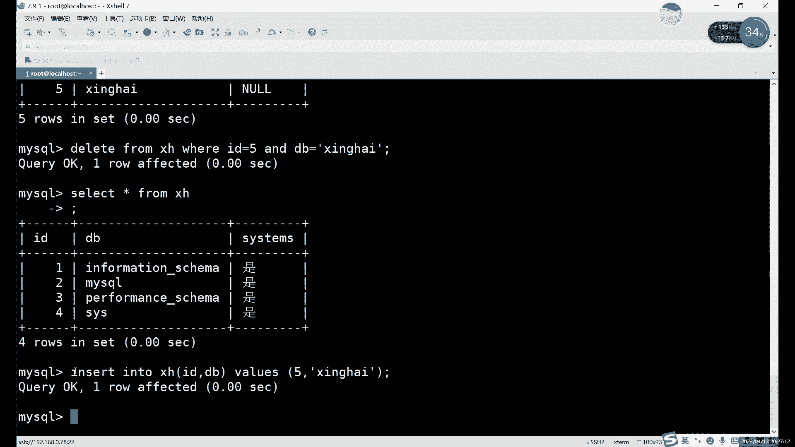

接下来我们来看。再一个更新。对吧更新呢。他其实就是修改意思。作用啊或者说U法的话和delete呢啊怎么说呢？有相似之处。不过呢更新它不用加from啊，好的是更新它不需要加from，就直接update。

加上表格名字就行了。啊，省略了一个from。加上整个名字之后呢，你后面就要就需要写具体需要修改的东西。啊，就用set命令去设置啊，set命令是设置的意思嘛？啊，或者说修改啊，准确的说是设计啊。

在我们这里，因为前面有update，所以说呢就可以理解成修改意思。这是一个值啊，比如说呢这里的话，它其实和第一次有一个相同的地方，就是。

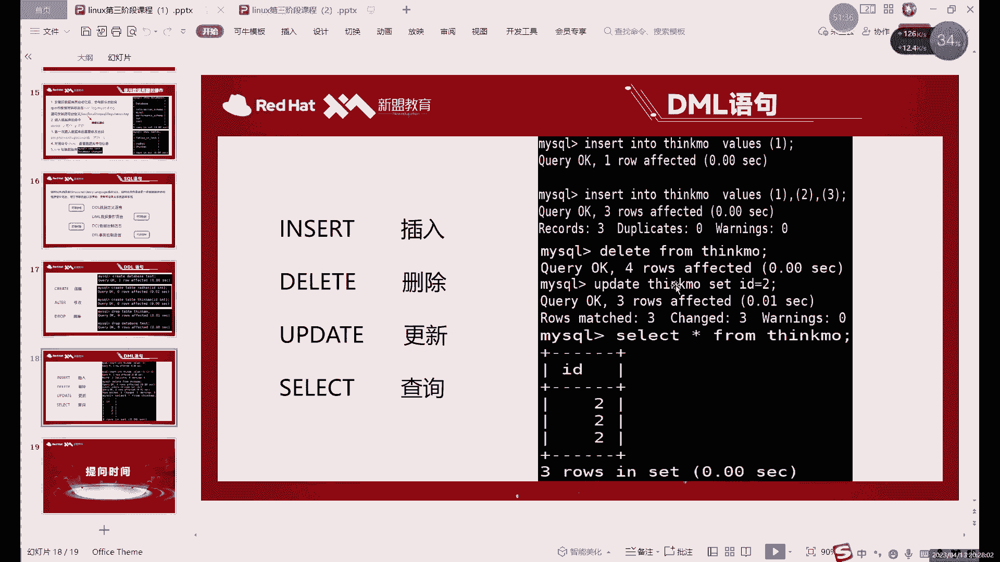

如果说你直接这样执行DELETE啊，不是不W update。别梯update。这里面就没有prome了，直接上直接加上什么，直接加上表名，然后set。比如说sst teamem。我们改这个字段对吧？

等于什么呢？等于。是吧。因为现在呢它我们的表格里呢。这个没有值，对吧？没有值。所以说呢我这里如果说想改一下这个值怎么办呢？这里的话就不用什么呢？这里就不能用insert了。因为我们这一行已经有数据了。

只是修只是这一个东西的话，我们只能用修改命令，不能用insert命。然后怎么修改呢？就是up加上我们表格名字，加上set。加上这个字段名字，就是设置一下这个。但是如果说你这样写的话。😡。

比如说引号里面我们写个左狐。这样写行不行呢？可以，但是呢它就类比于类比于什么呢？类比于这个delete呢。delete form加上这个表格名称的话，就删除所有。而阿V的这里加上表格名字。

修改这个东西的话，也是什么？也是修改所有。就是这个命令一旦执行的话，就所有的事ing都变成否。那这个东西肯定这个不是我的目的，对吧？我们只是添加着一个修改这一个吧，或者说是。

所以说呢我们这里也用什么也用whereware的话，这个东西我们后不面会用很多啊，会有很多，大家就奇怪就行，对吧？eleate命令需要用upupate命令也需要用后边的这个最重要的登删改查里没查呢。

where命令用的那就是更多了。啊，这个的话就是where尔加上什么呢？比如说我们这次还用什么，还用ID吧啊，就用1个ID指定就行了。ID等于5个。对吧这样的话就是什么？就是更新那更新之后呢。睇俾一个。

啊，也是where尔的话就是delete以及up的一个关键的地方。就是你不管说是用delete也好，用up也好，就where呢，就尽量加上。因为你如果不加的话，容易误伤。啊，什么意思呢？

就比如说你delete的话，如果不加的话，你会删掉所有upbit不会不加这个where的话，会更新掉改掉所有内容。所以说这个的话就需要注意一下啊，这个就需要注意。where的一个作用就是限制范围好吧。

限制范围。啊，这个的话就是我们这个插入也好，更新也好，删除也好啊，这几个命令的作用啊，大家有什么问题的话，可以直接发在讨论区里边啊。就是关于这几个命令呢，还有什么疑问啊，没有问题的话，我们刷波一。

我们可以下一个休息几分钟。好吧，大家可以看一下，就这几个命令呢还有问题啊，你先看前面这个只查询不不急啊，查询不急，先看前三个。

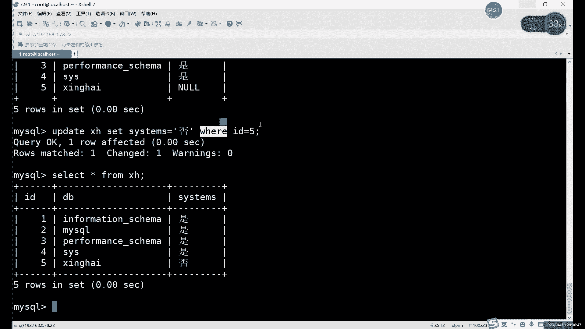

好，我们继续来讲下一个slack啊sack。上边三种的用法就一两，其实也就一两种。你要真说其实它其实原一两种都不够，它其实就算一种用法啊，其实就算一种用法。那slaag下边就不太一样。

slaag这边涉及的东西非常多。我们刚才呢查询这里呢用的是什么呢？就是slaag新 from。

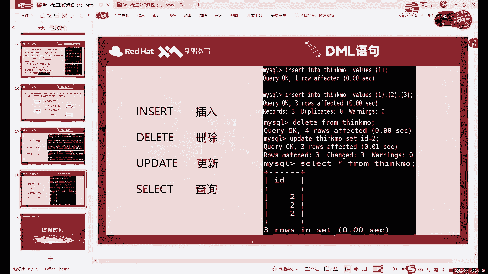

加上什么呢？加上我们表格的名字，对吧？这就是查询的最基本用法。就是由什么呢？最少的话。😡，它必须要有这个表格以及什么以及查询的内容。那这里我们用的是星号，对吧？星号代表代表是整个表格里面所有东西。

那他这里还能用什么呢？就是信号可以用什么代替呢？啊，它能代替的只有什么？就是主要就是用字段来代替。啊，一般就是用字段来进行。比如说如果说你讲只看ID呢，那我们就可以把星号呢换成ID。啊。

我们可以把进化换成ID什么意思呢？我就简单演示一下。其实呢在命令整体上。至少是两部分，一般是三部分组成的啊，就是fag加上from，加上什么，加上一个where。

就是我们上边update以及delete用到这个where。slack呢用的其实是最多的。啊，前面的话是一个限制什么？就比如说你看什么slect，你就是看的是什么，你看完ID就直接显示ID对吧？

如果说我们只换成什么呢？只换成DB，那跟我们s databaseb。这个命令呢就是完全一致的了啊，除了上面这个，因为这里它有已经这个dabbase，我们不能设置，因为是相当于端系统里面这个冲突了。

所以说呢我们只能是换换1个DB啊，换1个DB。你看这里的话其实你有看什么，他就给你什么。对吧看什么就给你。就比如说如果说就是看一个看一列内容。那如果说我想看多列内容呢，就是。艾丽逗号。d b。啊。

这就是看多列内容，它后面那个也可以，对吧？你像如果看DB加上这个sstem。啊，就是啊这里能看出什么？这个表格能看出这些库哪个是系统户，哪个不是系统库，对吧？最后一个不是系统库，其他前端上其实都是。

那这个就是。slaag这个其实用法呢非常多，我们后面会继续讲。主要前面这个的话就是。看的内容。后面是看的是表格。那最重要的是其实是第三部分where啊第三部分we因为内容太多，我们这这个需要大概在。

下节课我们会着重去讲啊着重去讲。那首先的话我们这节课的话主要内容先介绍一下这几种不同的语句啊，是介绍一下整体的circle语句。

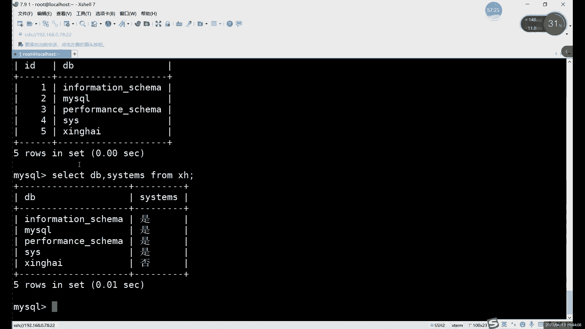

然后这里其实aler命令我还没有讲aler命令一会儿我们说完这些具体的数据类型啊，约束之后呢，我们再具体去讲。然后呢，这个DML这些数据的操作语言呢。前三种用法已经没了，已经说完了啊。

然后sideide因为用法比较多，我们就先在暂时这里先不说啊，暂时先在不说啊，放到下一个。然后呢，CQ语言呢还有两种，对吧？我们应要说。第三种呢是数据控制语言。它控制的是什么？它控制的是权限。

权限权限问题呢，这个其实啊你系统我们那个系统里面有很多权限，对吧？啊，读写执行对吧？这些是权限。那在数据库里面，它的权限是什么呢？😡，有读写之行吗？其实执行没有啊，但是主写是有的啊，读写是有的。啊。

像读的话，那你就是。s肯面就是读对吧？写是什么呢？写其实包括了insert，对吧？upate其实也算写，应该算改嘛，对吧？insert update包括dit其实也算写吧。如果他是把数据给删掉了。😊。

啊，就是对于数据的修改啊，这些的话它就是权限。😊，权限这里的话。一般是用来干的，其实权限分为两部分，一部分呢是限制用户。啊，对数据操数据库操作的一个权限。就比如说你是否允许这用户创建表格啊，插入数据啊。

删除数据啊，对吧？这是一种权限。还有一种权限是什么呢？就是允许是否允许连接。什么叫连接呢？就是是否允许其他的主机去连接。因为我们正常对吧？我们现在是。做了一台数据库，对吧？装了一台数据库。

那这台数据库呢？😡，能不能让其他的主机呀，或者说其他的这个。啊，电脑啊去访问啊，这个当然是可以的。但是呢默认默认它是不允许，需要什么？需要我们用这个数据控制语言去授予什么授予权限啊，这个是第三种。啊。

授理权限的这个问题我们也是后边去说。今天我们只是简单介绍一下这种这几种语言。然后呢，第四种。啊，第四种是什么？第四种是。事物控制语言啊，这个是事物了啊，这个事物的话。一两句话其实就已经说不清楚了啊。

事故的话，这个其实就是。控制我们啊数据库里边。数据操作语言的一种语言，就是我用来控制它的，就是它呢。这个事5控制的是谁呢？控制是这种语言啊，控制是DML。也就是第四个，它是控制第二个。

第二个我们还没有讲完，对吧？我们现不着不着急讲第四个啊，这里的话我们可以其实不可以把第三个先说一下吧。第三个的话，这个管理权限其实嗯也是蛮重要的。后边的话我们会经常用啊管理权限，然我们暂时其实用不到啊。

暂时用不到。但是我们先说一下，因为这个命令不难啊，这管理权限的命令不难。我们先说一下。😊，管理权限呢它用到的是什么呢？用到的是。

这里给大家看一下笔记吧，笔记里面是有的，笔例里面有。

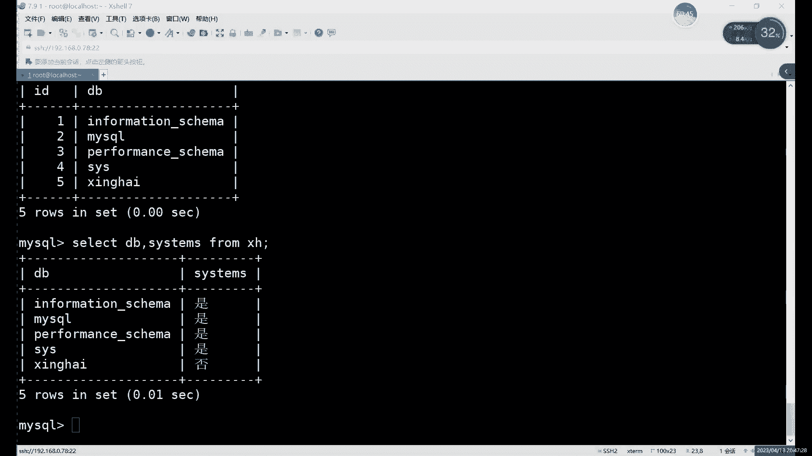

然后我们这个。他其实就是一个授权。啊，他觉得是一个授权。命令呢只有两个。grant和rework啊，这个这种语言的命令非常少。那，其实这点来说呢，你说这个语言里面就这一个面其也行啊。

因为授权的话只用就是他来做的brandmin。授权授权的是什么权限呢？第一，我刚才说了访问权限。好。现在的话我们。就比如说当前。

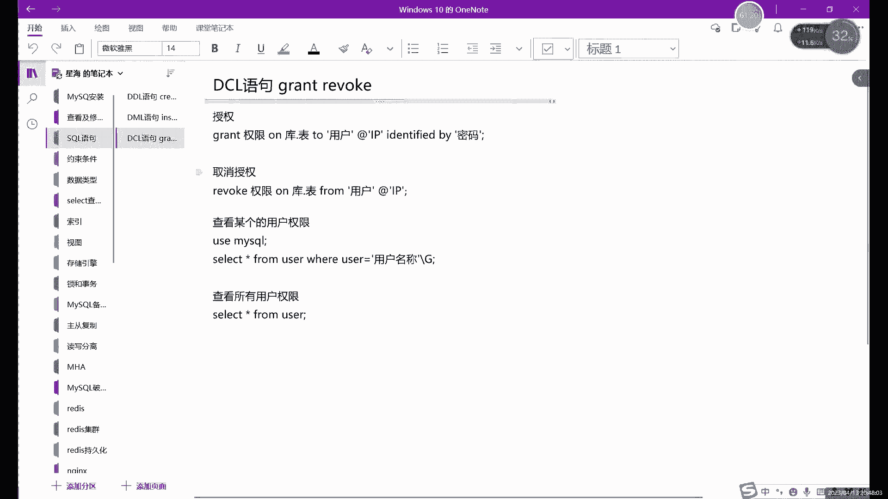

我们现在用什么用户登录的myci口？root用户对吧？是不是没毛病啊，入子无。为什么是用入途入灯呢？这个是因为我们在最开始安装好数据库的时候呢，系统第一次初始化的时候。为我们生成的这个密码呢，就是什么？

就是root用户的密码啊，就是让root用户呢去登录到数据库里边去修改一下密码，创建一些允许访问的用户，然后呢才能其他用户才可以去访问。啊，其他用户在可以方。啊，ESIT。然后呢。

这里的话我们看一下什么呢？我们用sg命令去看一下。买scle库对吧？这个第一节课我们其实也看过这个表格，就是myscle库里边的这个user表。哎，这种语法是什么意思的？啊，这种是库点表是什么意思？

就是嗯刚才正常的话，我们查看的话，必须要在哪呢？必须要在当前库里边去查看，对吧？你在青海库里边才能看XH这个表格。那如果说你想在。这我们在青海这库里面去看user表。他不能直接看他必须要加上什么。

加上库的名字。啊，这个。这一这两这一句话的意思其实就是。查看mys库里的user表。然后呢，我们这里执行。还是很乱，对吧？我们加上杠大剂。大家记的话，比如说候它的作用就是这样。😡，啊。

把很乱的东西呢用行一行一行的形式显示出来，哎，相当于是把数据呢。

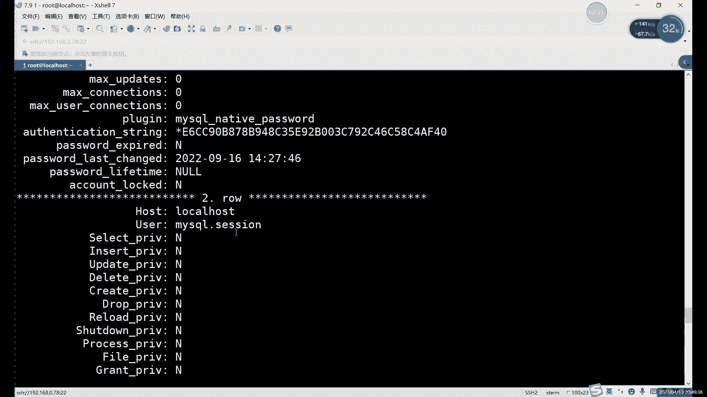

以行的形式显示之前是用表格的形式显示啊，默认的话，我们是以表格的形式显示数。但是呢如果说你的这个。

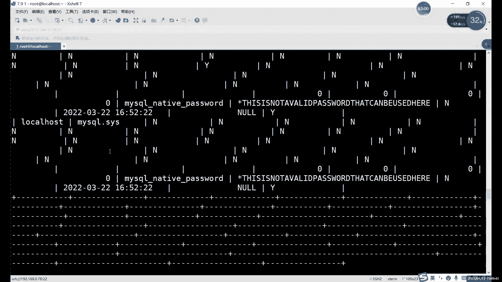

表格的列数太宽啊，我们这个linux命令行里面是显示不出来的啊，就只能用什么，只能用这个刚大地来切换一下。😊，然后这里的话我们用户的话就是root用户嘛啊root用户。然后包括两个系统用户。

然后这里的话我们正常想要让其他，比如说我们一开始不是创建了买serv个用户嘛？不知道大家记还记得吗？就是我们在安装数据库的时候，我们是给这个数据库对吧？创建了一个管理用户，但是我们一直还没用，对吧？

一直还没用。😊，因为默认我们只能介入入存用户啊，其实你是个管理用户，我们把它设置成管理用户了。但是你没有最开始不是说没有权限嘛，主要是没有密码。啊，密码的话可以在授权的时候去指定啊。

密码是可以在授权的时候去指定的。现在的话我们可以什么呢？如果说想要让我们的mysql，哎就管理用户呢能录登录到我们的数据库当中，怎么办呢？我们就需要用到第三种语言。

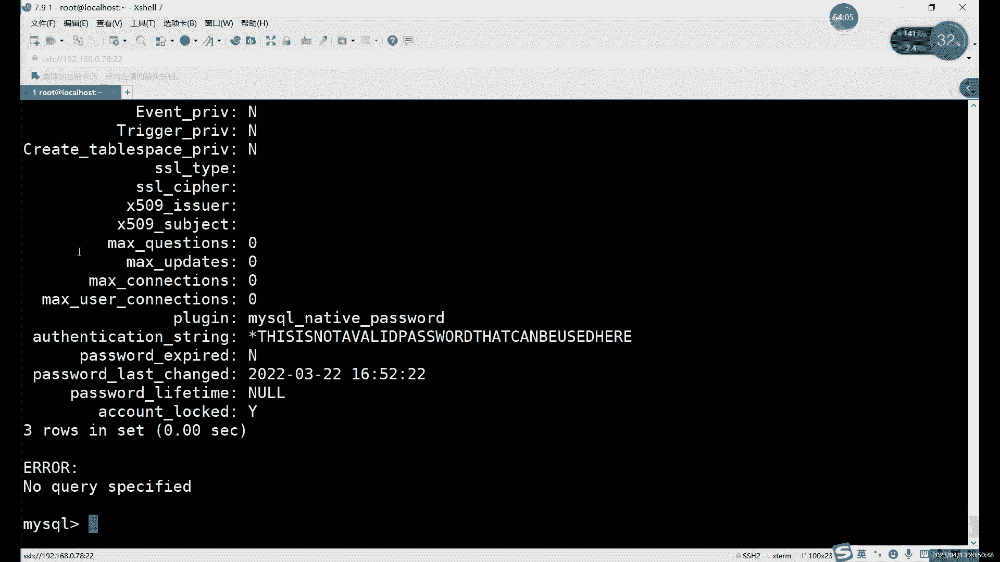

就是这个数据控制语言，就是管理权限的。

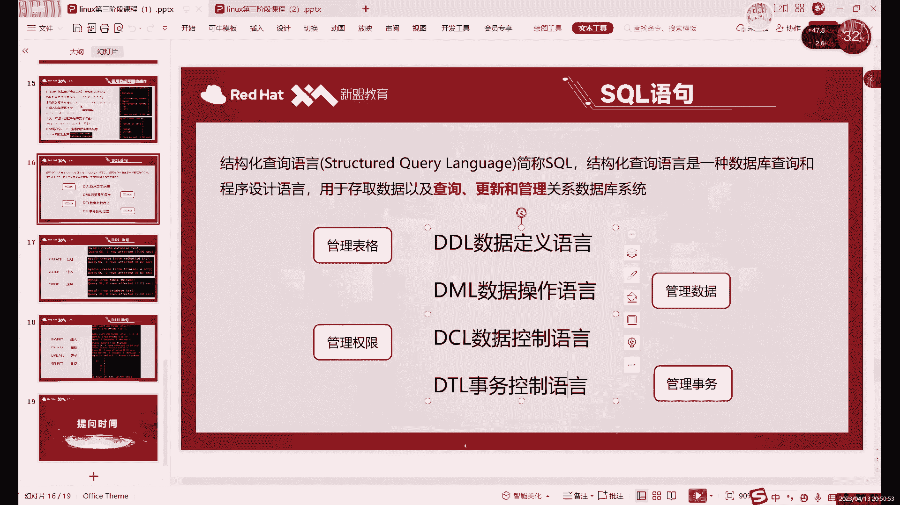

啊，具体用法呢就是gant meaning。用法很简单，它就就一就一句话，大家记住就行啊，就一句话记住就可以。就是什么呢？啊groundrant命令加上么加权限啊，加上库和表的名字，这个什么意思呢？

就是。权限的话就在我们买搜库里面授予权限的，它并不是说一给权限就是给整个库的权限，那不至于啊，我们是可以指定单个的表格啊，或者说粘指定单个的库作为啊作为它的一个授权的对象。

后边加上这个用户的名字以及IP。什么意思呢？就是这个授权呢可以允许本地用户登录，也可以允许谁呢？也可以允许其他主机上的用户去登录到我们数据课的数据库当中。

最后一个identify find加上什么加密码。啊，就这么几部分组成啊，这个minrs。怎么说呢？是固定的用吧啊，那既先着记这个结构，因为中间东西可以换啊，需要换的。那权限也好啊，库口表也好。

用户IP密码这些都是都是要求更换的。啊，每次授权肯定都不一不一样。所以说大家记的话，就是间主要记住个格式啊，多打几遍其实就能记住啊，就是几个英文单词啊啊就几个英用单词而已啊，多打几遍，其实就记住了。

授权这里的话权限呢？很多。具体有多少呢？我们这里先。

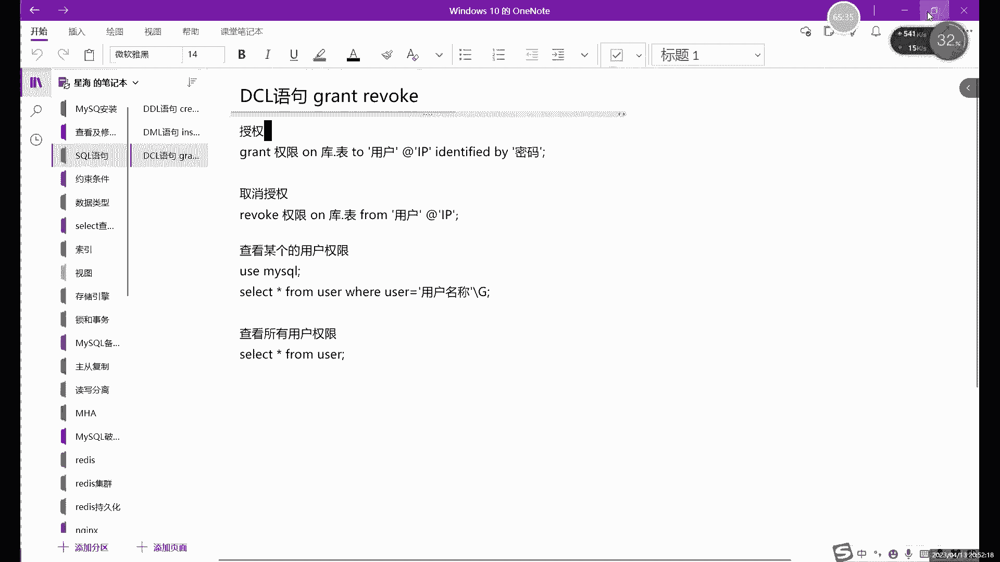

也没办法解释，因为这些命令都还没讲。啊，已经讲过的也就是啊讲过几个对吧？select insert， update， deleteelete，create job。啊，下面就没了是吧？

上面我们就讲过这么几个面。啊，这个每个命令呢就是我们讲过的每个命令，或者说每个circle语句呢其实都可以看作什么呢。都可以看成一个不用说看什么，就是它都是有权限的。就对于用户来说呢。

执行这些命令呢能不能执行呢？就完全取决于。我们这个my circle在us侧这个表格里边是否允许它执行？就比如说这个用户有没是否允许呢？不允许N的话，就是no意思，对吧？如果说我们看到这个root用户。

对吧？全部都是Y，为什么呢他用root用户嘛，管理员拥有最高权限啊，拥有最高权限。所以说这里呢我们就啊前面几个才讲过，后边的话还没有说呢啊，都都没有说过。所以说呢我们权限具体的话，我们先不着急看。

那如果说我想要授权啊，授权一个管理用户，哎，拥有这个root用户的权限行不行呢？其实可以啊，但是呢怎么说呢？你即使这个用户的权限再高，那你也不是root啊，你也不是root。就比如说关命令。

如果说我想要给一个用户，你比如说我们给买sql对吧？我们买sq是我们一开始安装数据库的时候，创建的管理用户，对吧？甚至我们这个数据库的这个目录，整个目录的话，输入都是买sl，对吧？

那我们给到所有权限其实也没什么问题，对吧？那所有权限怎么给呢？两种鞋吧。我一般建议就写第一种2。第二种是什么呢？😡，第二种的话不太建议大家写。Qu外就是策略意思。所有的策略，也就是所有权限。

所以说一般我写什么，我写这个。啊，你想记那个pri也行，单词太长了，没必要记啊，两个作用是一样的啊，作用是一样的。grant all啊就代表着所有权限。那后边呢权限的后面加什么呢？加的是具体的数据库。

什么意思呢？我们现在是一共有5个库，对吧？你可以是把5个库都授权给他，也可以只授权一个库两个库的。这个是我们在权限里面是可以随意设置的。就比如说如果说你只要只想给他一个库的话，你就写这一个库的名字。

那如果说你想要给他全所所有的库怎么办呢？新号啊，新号的话，我们在买书库里面非常常用。对吧就代表的是所有。他就是代表所有的意思。信号，然后呢艾后边加什么I呃，不不不是艾。应该是星点儿，我们呢后面加表格。

其实你前面的心嘛，后边。怎么说呢？你数据库都没有限制，对吧？你原然也不会限制表格了。😡，一般情况下呢，如果要设置表格的话。这里写的就是什么同样也是表格的名字。不过你如果是前面的数据库没有限制的话。

表格我们一般这里也不会限制啊，也不会限制。比正常这样写就可以，这就代表的是什么呢？星点星代表的就是所有的库和所有的表。前面的二呢代表所有的权限。也这个的话基本上是基本上就是什么，就属于最高权限。啊。

准确的说是应该是要。root用户之下的最高权限。啊，为什么这么说呢？入ot用户其实它是拥有绝对的最高权限。其他用户在买scle里边呢，其他用户呢。权限再高，也不能超过my circleqcle啊。

甚至也达不到mysl那个水平。为什么这么说呢？我们可以先授权啊，授权之后呢给大家看一下效果，g on on心点心，对吧？😊，然后呢，加上什么，加上这个用户的名字，比如说我们用户名字叫mycirl，对吧？

然后呢，IP。我们因为我们这个属于本地嘛，本地我们就IP其实就相当于是local host。啊，只电路后子就可以。当然呢你如果写个所有行期呢，也可以写所有啊，也可以写所有。

只不过这里的所有的话不是百分号，是啊不是不是新号，是百分号。这个就代表所有的IP啊，本文化代表所有的IP我们这里就先只写一个本地吧啊，只写一个本地，然后最后写identified。这个就是这个是密码啊。

这个是密码。密码这里的你你随意随意啊，这个的话是属于什么？这个其实是属于mycircle这个用户的密码。啊，他是属于摆这个用户的。啊，这个授权密码呢其实就是用户的密码。

因为这个用户呢我们想要登录数据库的话，就是通过这个密码去登录的。就是说他这个虽然说是授权的命密，对吧？但是呢他其实也算是给这个用户呢设置这个密码。甚至。他也有创建用户的作用。啊，关键它也有创建用户作用。

如果说你系统里面没有这个用户呢。执行啊执行这个比如说我系统这个如果没有买这个用户的也是没问题的，它会自动创建一个用户出来。啊，这个就是什么呢？这个就是grant命令。啊。

breread命令的一个用法哎有点长，对吧？比之前那些但是间改啥都长。所以说这个呢大家可以。嗯，十遍以上，我觉得你挑个十遍以上应该就差不多去术啊，这个说命也不难啊，它是固定的嘛，因为用法是固定的。

没有太灵活啊。因为这个grant are two。at identifyent by这几个连接词是不会变的，它变了是值其中的内容。啊，变的只是其 name容。好，我们这里的话这个就是授权啊授理权限。

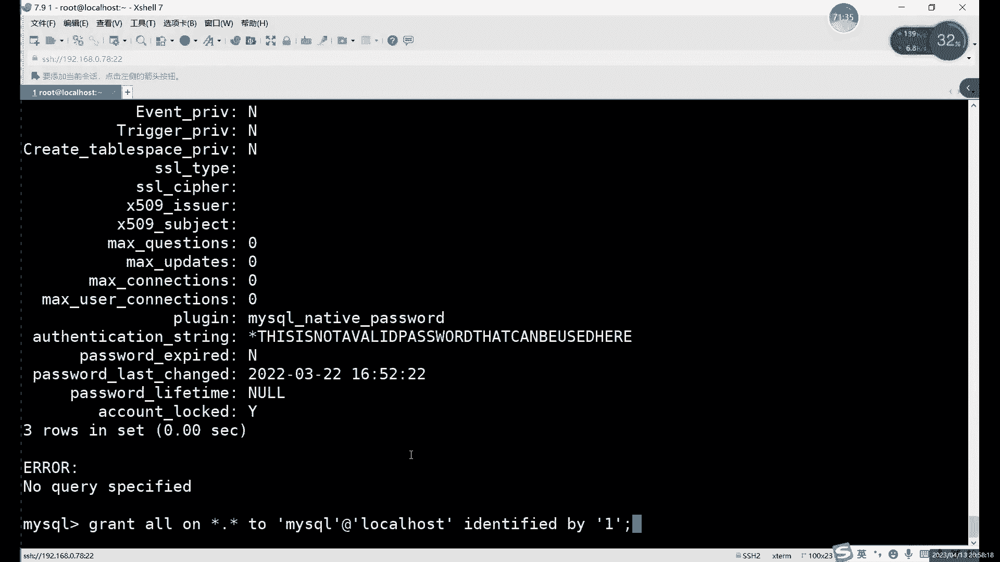

授权之后呢，我们再连再开一个终端嘛，这里再开一个终端，我就不退出数据库了。

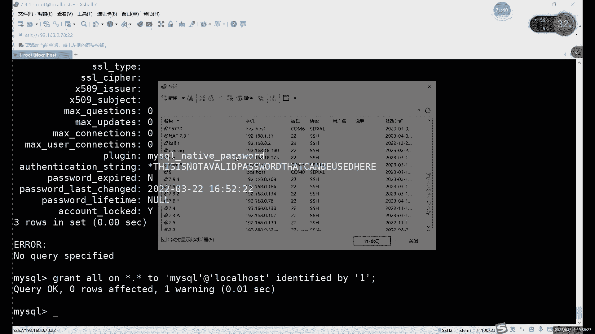

嗯再连一个东西。my circlecle。我买个密码是什么？

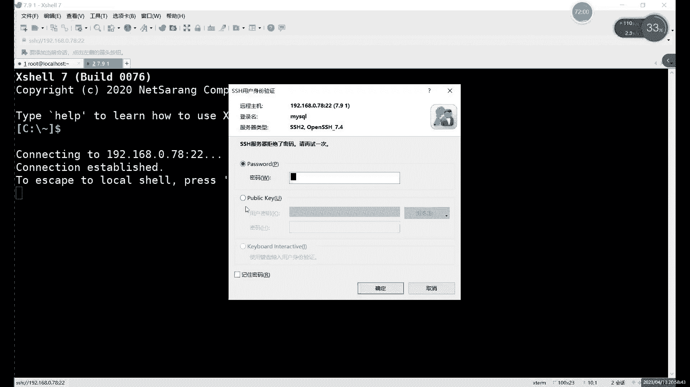

哎呦，反正得退这些，哎，不用退，我们连这个什么吧，连入性用户吧啊，买这个用户没有忘忘记设置密码了。passwordword的。系收括。好，我们设置一个密码啊，刚才没有设置密码。

然后我们切换到my circleqcle里。这里我们再断开，就重新连一下。买 circle口。哦，对我们一开始设置一个什么啊，对，我们设置过那个什么东西，想起来。我们最开始的时候连接。

买这个的时候设置过一个叫。不允许他登录的一个设置啊，这是一个不允许他登录。还是。😊，对啊，所以说呢。我们直接直直接直接用mysq名令登录就行了啊。我们用入用户也一样啊，我们不用登用户，我们是用什么？

我们是登录mysqcle啊，我们不是用这mysl登录系统，我们是用mys用户呢去登录mysql这个软件啊服务。比如说呢我们用mycil杠Umycircle，我们就不用root了。这是我们用普通用户好吧。

我们进入到我们的这个。屏红里遍，那时也用一就行啊，进来。啊，这次呢我们就是以什么呢？以买circle用户的身份进入到数据库当中呢。对吧，然后呢我们可以来现在来看一下这个什么看一下这个策略吧。

或者说是看一下user表格，现在是长什么样。看到没有啊？第四行出来了，刚开始三行数据出就是三个用户默认只有三个用户。然后呢，现在我们创建了第四个。😡，my circlecle对吧？

名字是mysrqcle，然后我们可以看权限。😊，yes， yes，对吧？全部都是Y。😡，还有多少万？这里的话就相当于什么？就是我们的买思库拥有了什么，拥有了root用户下的最高权限。

它永远不能等于root，为什么呢？就是因为少一个。二里边呢找一个权限是谁呢？就是这个grant yY。grant呢就是我们刚才用的那个授权命密，对吧？啊，也就是普通用户呢，即使你拥有最高的权限。

但你永远没办法做到，像mycyclq呃像root用户那样去给其他人分配权限，也就是。也就是这里这个关用权限呢就只有入灯户有。啊，其他用户呢啊其他用户不配啊，其他用户不配。啊。

就是其实这个也是为了安全性嘛，就除了用ro以外呢，其他用户的。不允许他拥有brand权限。啊，也就是不允许他有授权的权。啊，这个就是什么？这个就是。

买那就国rerant命令的一个用法啊国rerant命令的一用法。然后这里的话嗯。授权的话，偶尔的你呢可以改其他权限。其他权限名字叫什么呢？就是就是这个就写这一部分就行了。这就是那个权限的名字。

如果说只想授予单个权限的话，就这样改就可以。然后呢，关于这个。

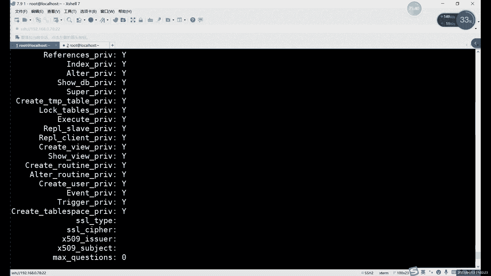

不表呢你是根据需求去改，用户呢也一样，就IP也是一样的，密码你就随意这都可以随便改。啊，这个就是授权的命密。那取消授权呢啊，你比如说我后悔了啊，这买这个用户，我不想给他这么多权限了，我想把权限给取消掉。

怎么办呢？直接用什么？直接用bwork命令去取消授权。

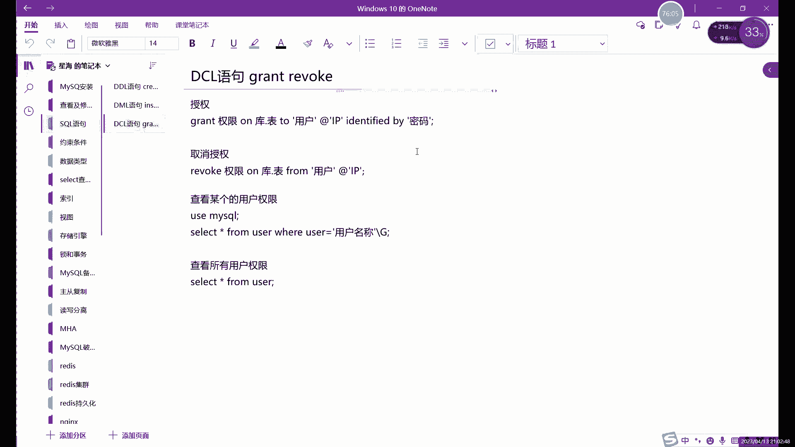

你比如说REVOKE。嗯。rework2。

然后加什么呢？然后后边加上的是。

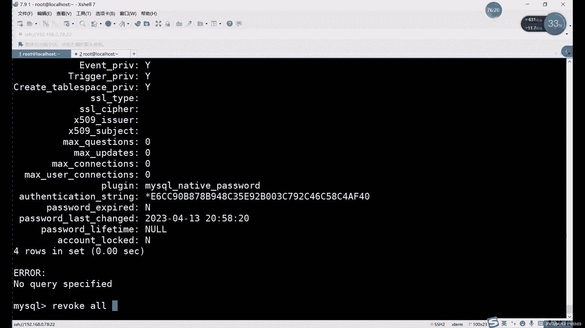

还是库点表，然后呢from用户和IP少了怎么少了密码，就取消数点的时候不要加密码，而且呢是从to换成了from。因为授权呢相当于是给这个用户权限，而取消授权呢相当于是把权限呢从这个用户拿回来。

所以说呢就是介词变了一个，从tto变成个from。然后的话我们这里rework权限取消。R后边加上汇点表，然后我们刚才应该是星点星，对吧？

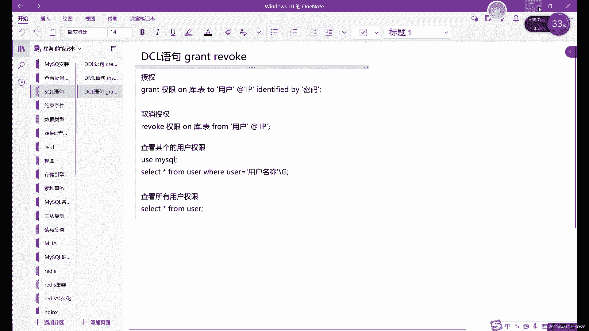

2。听点心。从我们的用户里边把权限给拿回来，怎么拿呢？from加上这个。用户叫什么来着？啊？我们是买ci后用户，对吧？我们给买ci用户一个权限，我后悔了，想拿回来，这样就行。这个就相当于把权线拿回来。

发回来之后呢，相当于取消了满税用户的一个登录权限。就比如说呢我们这里EXIT先退一下吧。哎，比如我们来来先看先看看表格，看看表格吧。哎，看到没有？买C用户就没有了，是吧？他呢他这个你的这个内容很在啊。

就是什么呢？他是把权限给去掉了，看把Y变成no。😡，啊，它就相当于把外边人弄。这个就是什么呢？这个就是啊取消权限的一个用法。当然这个取消权限呢，我说呢。进来之后呢，其实你之前的话其实没有演示啊。

没有看这个。没有看他的一个。那怎么说呢？你这边叫。功能吧啊，比如我们这里受。看一下PAATPAABSES看一下这个数据库。啊，大家可以看到。怎么说呢？他有权限，但是不足。啊，因为受这个命令。

他也其实也不也不能说他不主要是说明他不在权限里面。啊，说不定他不在权限里面，比如说用其他的吧。比如我们看一个use my circle，哎，这是什么？就没有权限，就像看过去。

估计切换的话就只能切换这个in方没能看到的。这个的话我估计是你看啊inform demo。啊，切过去了，s tables。啊，这个表格是可以看的。然后呢。比如说slack具体某一个表格的话。啊。

再二个呢就是我们。信号 from。嗯。啊，他也是也是没有权限。啊，也就是什么呢？呃，寿命令它没有完全限制，因为受的话，它不在我们这个权限的个范围里面。啊，但是呢啊而而use命令也是啊受命令啊。

use命令啊，这两个其实没有完全限制啊没有完全限制。因为这个。奥里边是不包括这两个。嗯，但是呢通过对其他的一些查看啊，修改的一些限制的话，就导致哎我们这里。

看不了其他数据库的一些不是看不了其他表格的这些数据啊，你无法看到数据啊，这就是权限的限制。因为现在我们权限都没了，对吧？你看看一个表格都看一看一下都不行。对吧这个权限我都不给啊。😊，这就是什么？

这个是授权的作用。

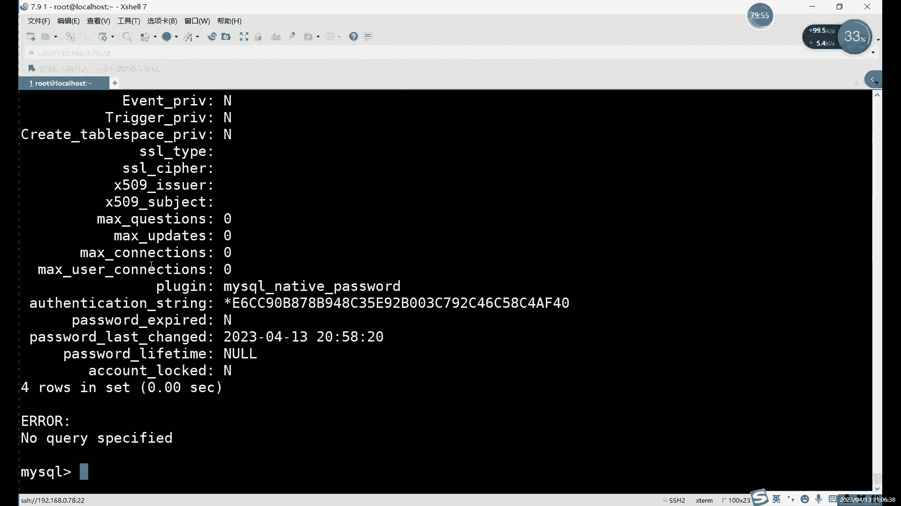

也就是我们的数据控制语言，主要是用来控制谁呢？控制我们用户的一个访问。或者是控制其他用户命令的一个执行，包括什么命令啊啊，包括这个。

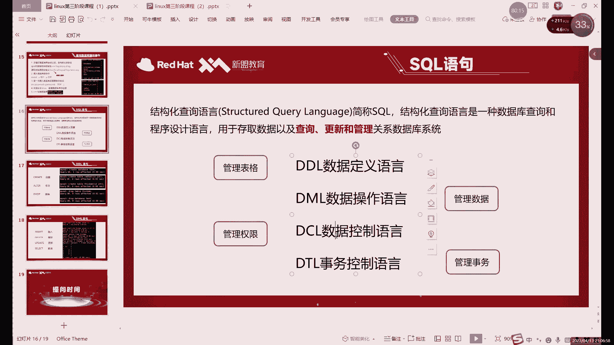

正山改查。对吧包括创建删除，也就是这些命令都可以做限制。啊，只要是我们那个右侧表格里有的啊，其实都可以限制。啊，当然呢因为use和s没有。哎，所以说呢啊这两个相当于是有点有点漏洞，但是呢不影响啊。

因为其他的命令一旦限制住的话，这两个命令只用这两个命令其实也看不到啊，他只能看一些基本的信息而已。啊，这个的话就是我们那个权限的问题。说完这些的话，我们接下来来具体介绍一些什么呢？我接下来具体。

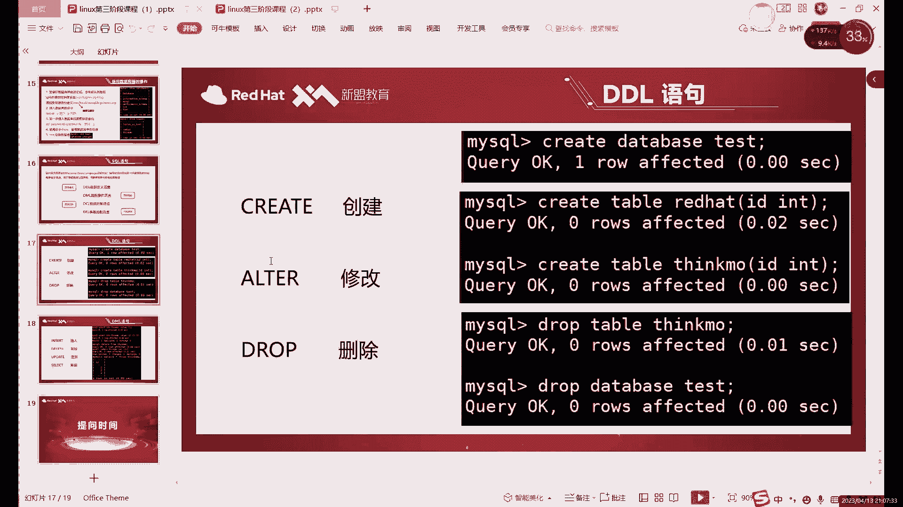

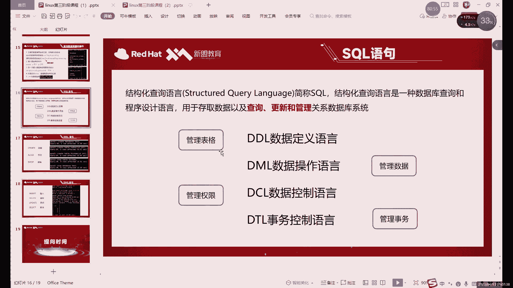

讲接下来的这些内容的话，具体我的目的是想要讲什么？讲aler。啊，因为alterimate我刚才说了，它的里面修改内容很多，但是我们都没有讲过。

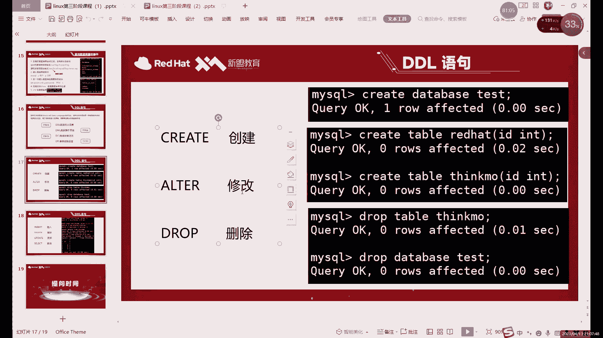

有哪些内容呢？我们的数据类型。啊，接下来我们就来介绍一下买足里面的数据类型。😊，以及什么以及这个约束条件啊，这个是我们接下来具体要说的。啊，因为说完这两个之后呢，我们才能具体再去讲奥特面修改。啊。

因为奥特曼修改的改的就是这些。改的就是数值，改的就是什么，改的就是约束条件。好，我们接下来来看一下。首先呢。整数型。和小数啊统称什么？统称数值，也就是大家看到的数字。但是这个呢不能从数据上来看。

要从哪看呢？要从DESC这面义来看。DSC这个命令呢就是用来查看我们一个表格的基本一些信息的。其中包括。啊，其中最重要最准确的一些信息的话，就是包括这个数值啊，或者说是准确的来说应该叫数据类型，对吧？

数据类型数值型呢。两部分一种整数，整数我们用的最多就是这个INT啊，这个不是这个不是命令啊，这个是它的一个全拼啊，这个是它的全拼，这个是我们。数据类型里面最常用的。前面我已经对吧？

创建表格已经用过好几次了。那这个INT的作用是什么呢？啊，INT作用其实。很简单，就是整数。但是为什么有这么多IND呢？对吧？一共有9个一个、2个、3个、4个、5个IND。他们有什么不同呢？

还看名字上其就能看出来，心理就是非常小的。迷你的那种对吧？smart呢就是小的medl就是中等的，big是大。啊，就是几个简单的英文单词嘛。然加在NNT的前边代表的就是什么呢？代表的是INT的范围。

也就是整数的范围。我们在。这里的话用什么表来表示呢？啊，用二的几次方来表示啊用二的几次方来表示。比如说。

我们来看一下。这个数级数执行啊，具体的来说呢。今年IT呢它代表的就是。二的多少次方呢？8次方。也他这里是最小就是2的8次方，很少，对吧？就是说存存储的很小，所以一般就不怎么用。那经理这个实在太小了范围。

对要存接数据二的8次方。是256对吧？0到255嘛256。准确的范围是负的128到127，一共只有多少个呢？一共是从0到255是256个数字。啊，一共是有256个数字，但是呢。它正常的取值范围啊。

就是我们竖直形，这里整数形这里的取值范围是从正到负啊，应该叫从负到正，一共256，什么意思呢？这里当然也包括0啊包括0，也就是0，那就是应该叫负的128到-1，128个数字，对吧？

0到127也是128个数字，也就是加起来等于什么？加起来等于256。啊，也就是2的8次方，也就是T你安全器，这，也就是2的8次方的一个取值范围。然后smart的话就开始翻倍了。二的16次方。

二的24次方2的32次。到最后一个翻倍的有点严重啊，翻倍的有点严重。啊，这个已经呃怎么说呢？计算器其实都不太好算。😊，什么意思？其实这里它应该是二的32次方乘以2的32次方。也就两个。这家伙撑起来。

可能计算器这里位速度不太够。对吧比如说。这里这个计算器好像不能用不能用次方，对吧？歌曲。二的。三十啊我哋。啊。你算出来这个。这个长度我都不太想数啊，反正总之就很长，基本上怎么说呢？基本上就没有上限了。

对吧？非常长。😡，也是他俩就是他。他俩加起来应该是42亿，对吧？对，42亿接近43亿，也就4243亿的平方。有那么大一个数字。啊，这这么大一个数字。哎，这这个最后一个一般很少用，因为实在是。

我想不到什么场景能用这么大的数字来。😡，啊。一般的话，LT就够了。啊，21个亿了，还不够你造嘛，对吧？而且是正负21个亿。😡，INT啊这边的话存储大小当然是不一样的。12348啊12348。

当然这个已经很小了，这个这个这个其实没不用不用记啊，这主要是什么呢？主要我们要了解的是INT的里边的这些个范围。啊，I的范围。什么意思呢？啊，IIT这里呢就是除了这个范围的以。

你就记住8次方、16、24、32就行。

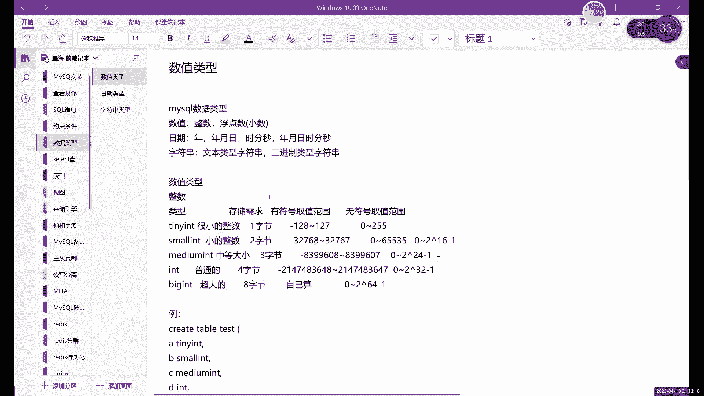

我们主要说的范围是什么呢？😡。

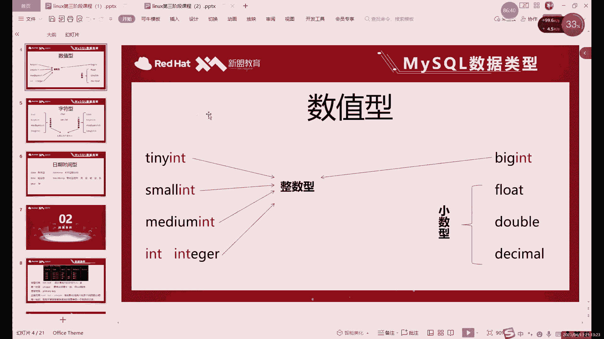

Great。这R e a。INT我们这个表格哎，不不能这么讲，这样的话名字有点太转述吧。讲数。啊，这个整数啊，第二个啊亏的整数。然后出现这整部这么一个表格呢，我可以写一个。IDING。啊。

当然我们先试范围，先来看范围DNAging。我们用钉P来示范围，因为它比较小，容易容易到容易到头啊，容易到头。🎼对吧我们来看一下DSC。政府。大家可以看到它的范围默认是个死的。

但是呢这个四呢其实意义不大。为什么说意义不大呢？我们可以来看一下mon insert into。Values。表格叫来着啊表格叫整数。插入一个叫127的。没问题，对吧？128就报错了。

也就是他这个字没有任何意义。😡，啊，虽然说默认写这个字没有什么意义啊，他因为他的上限就到128了。啊，127呢确数就是负的128到127，就是它的范围。也就是他呢其实我们的整数类型的括号里边的。

其实根本就没有用。我们遵循的是自己的一个范围，就听力的范围，自己就是负的128到127，超过了就不行。跟括号里面的没关系啊，跟括号里面没关系。比如说呢我这里创建一个。嗯，这里用起来好麻烦。我现在。

没有没有加update的命令，对吧？可能直接改，嗯，我们就直接再创建一个吧。假后说不创建了，我们看一下。呢部。哎，你I这为名字有也不太好。啊，我们有最小的整数吧。最小整数里边我们还是用什么？还是用ID。

TID这次不一样的是候，我们给他指定一个范围啊。它的范围不是-128到127吗？呃指的范围叫2。😡，你这什么意思呢？😡，嗯。DIC。最小。我们这个范围指定2，对吧？我之前说了二或者是括号里边的是什么？

指的是宽度，对吧？😡，他这个四呢因为到了自己的上限了，所以说没有办法，对吧？没办法，我们只能到128了，所以说四也没办法验证，我们可以把它缩小一点验证一下。我们比如说2。二的话在这个里边呢，其实我们。

直接插入一个数据就能验证啊。因3 two。最小啊最小的。然后呢，这个框里面我们写什么？比如说99行题的，那肯定没问题，因为它是两位数嘛。100对吧？100我们首先在这个范围内，对吧？

但是呢它超出了这个二了，那可以吗？可以。大星pro我们来看最小。那这个限制有什么意义呢？哎呀，好像这个二对吧？你限制到跟没限制似的啊。😡，在整数型里边的话，我们这个括号里边的这个内容，我们仅用于什么呢？

仅供参考。你可以成仅供参考，或者说是一个提示的作用。真正的范围。是谁呢？是它自身的范围，也就是负的100。28到127这个范围呢它是它我们插入数据的这策范围，而括号里面这个只能算是一个提示作用啊。

就是你插入数据的时候不要超过这个范围，超过了怎么办呢？我也没办法，我只是一个提示作用，我没有限制哎，我没有限制。它就类似于什么呢？类似于我们。这个叫。磁盘配额的软限制，对吧？

前两节大家应该都做过那个关于磁盘分区的内容嘛，里边有一个磁盘配额啊，就是可以限制磁盘里面文件的个数啊，限制磁盘文件的大小。里面有一个软线制和硬限制。整数型这里呢我们括号里面东西，这个就叫什么？叫软线值。

比如它的限值呢呃不致命。就是他只是告诉你写两位，但是呢你写三位行一行，那也行。那谁是硬限制呢？就是我们刚才讲的。制服。字符刚才讲那两个对吧？我们演示了一两个A个HR他们就是什么？就是硬线。

什么意思就是它里面括号里面写几就是几，你不能超出这个范围。啊，这就叫硬鉴。因为字符它本身自带不是字符，就数值的，或者这准确的说叫整数整数它本身自带一个范围啊，它是自带范围的。自带范围的话。

我们后边其实就它本身就已经有范围了，所以说没必要再去限，这里只是提示作用啊，这个二的话。就是代表的是两位的意子。但是呢在整数领域呢。因为他们不是硬限制，所以说呢它这个限制其实没有作用啊。

它这个限制没有作用好吧，这个就是什么呢？这个就是整数里面，当然常用的话，我们应该用INT对吧？IT这个的话，它的范围啊我平时正常写的话，它默认是个11位，对吧？11位11位我们可以数一下。

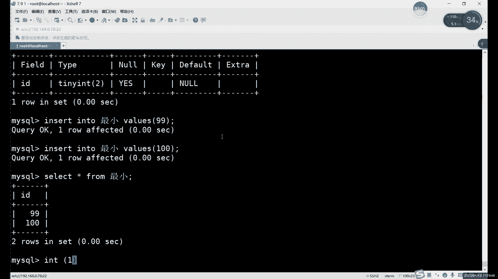

1234567850。啊，他根本就到不了。虽然说它限制了11位，但他本身自己呢只有多大呢？它只有10位，对吧？21利亿，它只有10位。

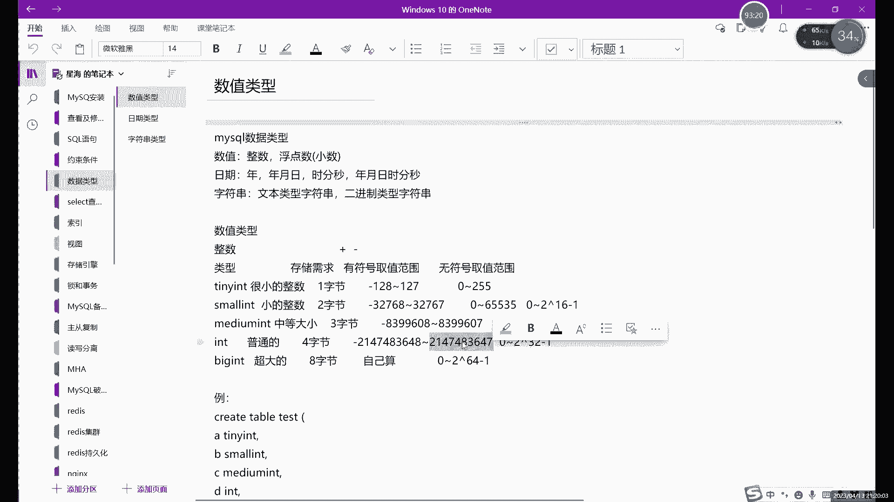

所以说呢其实IND这个范围呢，其实也。怎么说呢？它就是限制的一空范围。啊，因为它的上限呢其实是21个亿。他再怎么多，他也超不过。11位数字啊，所以说呢。减数型这里的括号的话，你就看看就好了，不用管它啊。

它不管是里面写几其都无所谓啊，就是你按照你自己的想法来，想该插入什么数据，去插什么数据。对吧需要用到多少范围呢？你看一下你这个需要用的数据的范围啊，你如果说一般的情况下，你用INT就行了。

很少有数据能超过INT的。如果真的有啊，那就换成B改INT。好吧，如果有的就换一下。对吧这个就是灵活去用啊，这几种的话怎么说呢？它其实就是范围不一样。作用上呢就是怎么说呢？

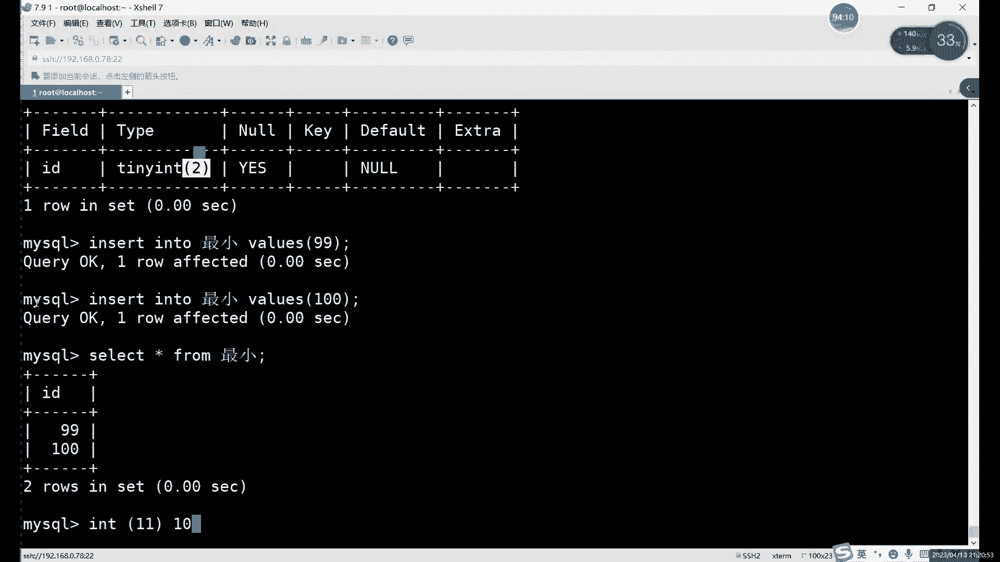

完全一致。啊，作用上完全一致。哎，除了整数型的那数值这里呢，你肯定不能说只有整数吧。啊，当然我这里没有分数啊，没有分数啊，是小数小数。因为你分数你可以除除。用除法能除成小数呗，对吧？啊。

有数值这里我们就分为整数小数两部两部分。那小数这里呢它是怎么表示的呢？

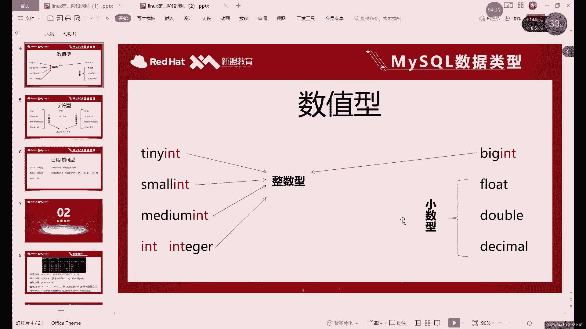

它和整数就不太一样啊它和整数就不太一样。总体上来说呢。小数的话还有一种叫法叫浮点。啊，因为它中间有点嘛，对吧？中间有有点。哎，就比如说呢。他其实就是。它限制范围是怎么限制的？它就有这么两部分。啊。

有这么两部分。就是由XY组成啊，前面都可以XY都可以写数字啊，都可以写数字。就比如说呢你看啊第一种这个。这叫X对吧？X它就是什么？表示。总呃整数和小数的这个总位数。它这个呢它并不是限制大小。

它这个是限制是位数啊，它这个是准确限制位数。Y的话什么呢？就是第二个数字呢代表的是小数位，有几个。啊，可以有几个。然后呢，我们可以来。啊，看一下这个。比如说我们拿这个f做一下演示啊。

我们创建一个5点数的表格吧。

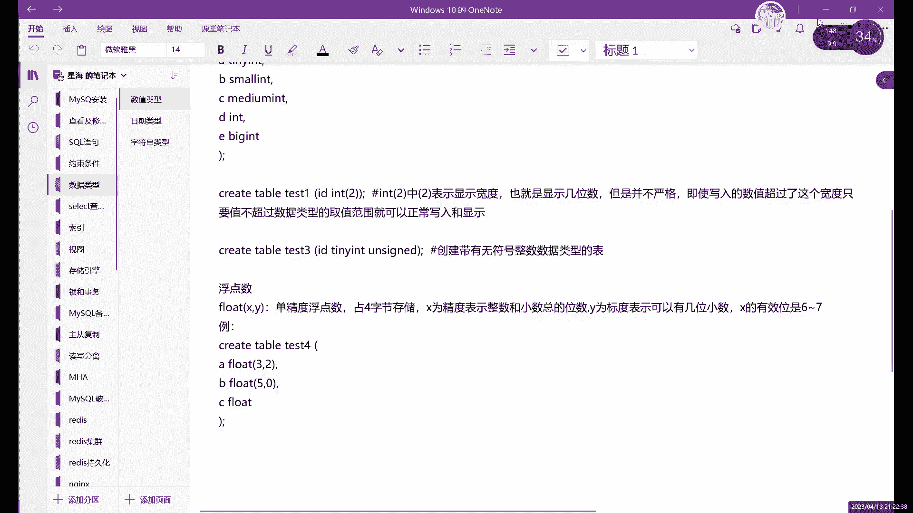

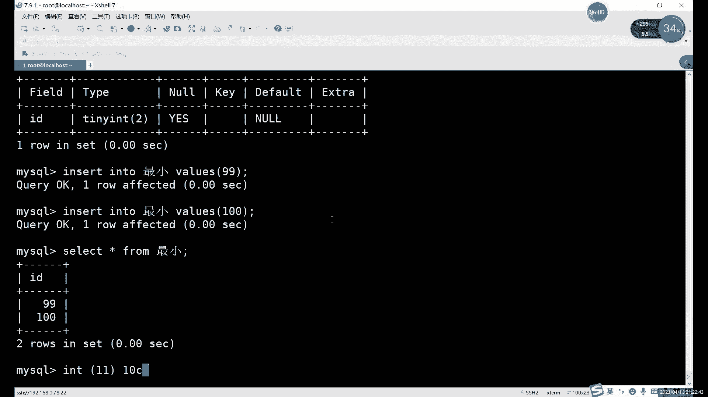

啊，或者说我可这里可以直接粘贴这个也行。

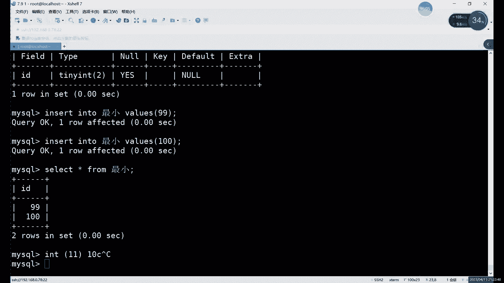

对吧这个面你可以直接粘贴的吗？

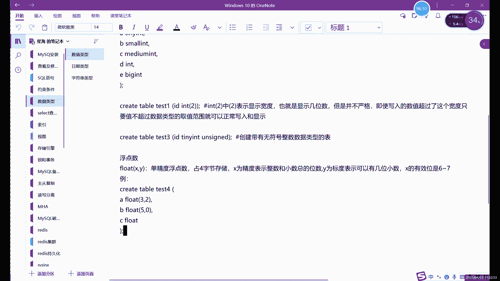

这我们粘贴进来啊，它就相当于什么呢？就插入插入一个表格。然后呢，哎这个表格里面有三个三列啊，三列当然都是浮点数都是浮点数。啊，三面都是浮点。插入的时候，比如说我们就啊因为啊当然这里的话其实也不太好插。

我们就一个一个插吧。我们先查A。A的话我们插一个。嗯。然后value。5点数这差的时候，我看一下括号。现在是几点几？我们插一个。打123。12312。1。23吧，我也懒得想数字啊，就1。23吧。啊。

插入这么一个数字。嗯。啊，1。23。我们是往A里面插，对吧？他这里报错是我看YVLUE啊，打错了。AL。有异。你 v a l 都二啊。啊，单词打做。啊真系我插兴象。对，这样的话，他其实就是什么呢？

但这里他的是第一个，对吧？他的是第一个。SELECTs信号from。那t4对吧？这表白叫这个。啊，当然后边因为两个没有差，所以说空值了啊，所以说空值了。好后呢，我们可以再查第二个对吧？啊，或者DIC呢。

我们可以看一下这个test4的一个格式。它的格式呢。嗯，因为前面两个我们是有的吧。第三个的话，因为我们是用了个默认的啊，用了个默认的clo，就是没有加这个范围啊，没有加范。然后的话我们来看第二个哎。

第二个的话我们插入一个。B这里的话，我们插入1。23。啊，他其实也是一样的。然后呢，C这里还有一个float，对吧？啊，还有一个float。

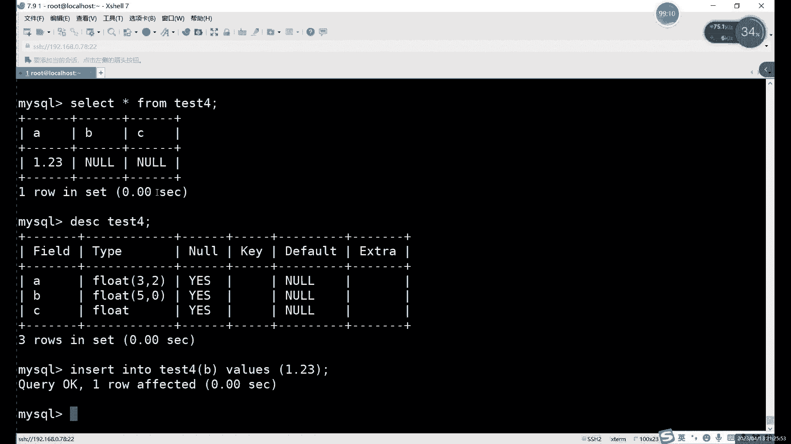

proro这里头默认是有一个限制啊，就是X有效位是6到7位啊，X有效位是6到7位。比如前面这个就是。6到7位的一个数字啊，6到7位的一个数字。

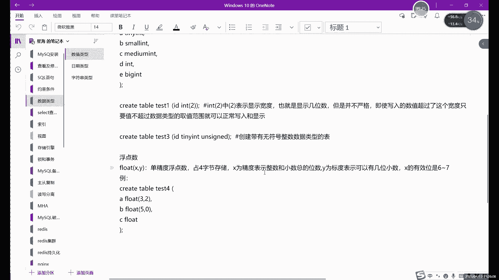

啊，这个它不用引起来，就是我们这个其实将来它是个小数中间有点，对吧？啊，它中间有点。有点的话，它其实也是什么呢？它也是个数字，所以说是不需要什么，不需要引号的。啊，不需要引号。

然后比如说呢我们这里如果要插入一些，比如说像我们往C里面。

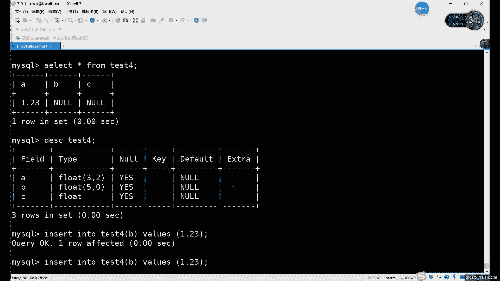