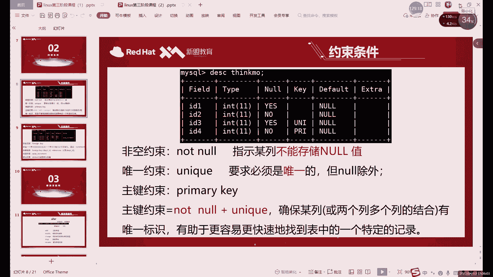

# 0基础小白怎么入门Linux运维？看这套，Linux运维全套培训课程，保姆级教学视频 - P69：中级运维-6.SQL语句，数据类型，约束-下 - 小方脸不方- - BV138411B7p5

插入这里面，如果插入的话，像我们后面多写几个，1234561234567123456，数一下1234567，这是几位的啊，这是六位对吧，六位还不能是七，啊六位七位。

啊这类型符号我们可以来看一下test4，对吧，大家可以看到哎我这里有点问题，唉有个问题，我刚才上面插入了，其实根本就没有看到规则，我是没有看规则，我就随便写了一个字。

但是它的结果有点和我们插入的不太一样是吧，第一次差的A到无所谓了，1。23我们是遵循它的规，一共三位小数点两位对吧，正常那第二个就不一样了，第二个我们是五和零，五和零，什么意思呢，就是整数可以有五位。

但小数是零位对吧，我们插入的1。23，他就只剩一了，然后在它后面两个哎，我又插入了，又多插入了几位，你看我当时数了一下数字12345，然后我数了一下数字啊，主页数字默认是什么，默认是六啊。

就是flow的这个默认它是默认总长是六位，包括前面加上这个数字一共是六位，所以说大家可以看到它是相当于是，到这个是做了个四舍五入，然后把七放到这儿就变成了1。23457啊，就是你后边不管有多少未动。

都会相当于是做了一个四舍五入啊，这个就是它这个限制的方法啊，限制的范围呢主要看括号里面啊，主要看括号里面默认没有的话，他这集就是只限制这个X16啊，默认没有的话，它就会限制X6，比如说呢我们再换一个吧。

12点我们再换一个，换一个插入方法，啊就如果说你只写float啊，它是不设不限制后面的小数位了，它只限制总长就是六根啊，它只限制总长六位，啊所以说这里的话就是什么呢，这里就是我们的这个。

小数点里面的注意事项啊，主要它是它的括号里面限制的是显示的东西，他这个倒不会报错，哎比较像什么呢，也比较像这个整数嘛，整数的话，你INT里边你后边不管是写多少，你随便查无所谓啊。

当然小数呢也是随便查无所谓，但是小数呢因为他要遵循自己的一个范围，他会给你插入之后的数据呢做一个四舍五入啊，当然他不会报错，他只是做做一个四舍五入啊，这个就是什么，这就是小数的一个用法啊。

小数和整数呢哎其实就区别于谁呢，区别于我们后面要讲一个字符，字符有有什么特点呢，就是我刚才说了，它有一定限制，印陷阱硬硬线啊，这个硬件的就是你写多少就是多少，而小数和整数的话其实就没有太多的限制吧。

就你想怎么差怎么差，我都不报错，只要你不要不要触及我的底线，我就不报错，他的底线是谁呢，怎么说呢，小数这边呢其实嗯，小说里面可以说是没什么底线啊，可以说没什么底线，他的小说里面他不能说底线嘛。

它其实就是一个限制的一个宽度，还是限制宽度，而整数它有底线，底线就是他自己的几次方几次方这个理解啊。

所以说呢小数整数的话，你插入相对来说宽松一些，宽松一些，而我们一会儿要说这个字符呢，还需要考虑的东西比较多了啊，需要考虑的东西比较多啊，主要的话其实我们都不用，最多是中间那两个，中间两个用的更多问题。

好我们接下来的话就继续的来说这个字符型，字符型的话它的区别是什么呢，啊或者它的一个特点，就是我刚才说的硬限制啊，是其一，其二的话就是我们首先来看一下这个PPT里边啊。

我们是分三种类型的啊，我们分三种类型，AR和VRCHR这两种的话，比较常用一些，唉或者说呢，这两个呢它的这个是比较典型的字符串啊，比较典型的两个字符串，那首先呢第一个CHAR类型的话。

它是比较固定长度字符串啊，当然它的长度呢不是很长，只有255，什么意思，它就只能唉不说长度吧，不能说长度，准确来说叫字节啊，它的字节数呢只能容纳255字节对吧，其实对于这个数据来说呢。

如果说你做一些哎短一点的数据的话，要比如说信你啊，对吧啊，或者说这个信息呢籍贯啊，基本信息啊其实倒也够用，255字节勉强够用，但是如果说哎出现一些比较长，需要记录一些比较长的数据的话。

可以用下面这个VR的VR的话，这个叫可变长度的字符串，它的最大长度是6万5，就是65535啊，6万5535个字节啊，这个还是比较大的，然后稍微大一些的，唉但是这两个呢啊它有什么区别呢。

啊或者说它的一个特点是什么呢，就是第一绝对的要遵循什么呢。

遵循括号里面的内容对吧，这个其实我们之前已经演示过了，如果超过的话，他就会报错对吧，就比如说insert into，像这个XH表里边插入，像我们就往这个cs team里面插入，因为它这个比较短一些对吧。

我们往system这一个这一列去插入数据，比如他无几呢啊，是几无所谓，数字也行，字母其实也可以，只要什么只要模拟一下，超过四位啊，不超过三位，哎，我们模拟一个超过三位，它就会报错，他说什么。

他说数据太长了，对于我们这一行来说，也就是SETM这里的啊，这个题目这个字段我们允许的只有什么，只是三位，已超出了三位，那是什么呢，我们就会报错，那这个就是什么，这个就是in限制啊。

就是绝对的要服从我这个括号里面的，这个设置的值，哎市级就是几级不能超过对吧，这个和他自身本来本身的容量大小无关啊，就是一个限制，这个是CHAR和VRCHAR啊，两个呢它的容量更大。

所以说呢唉如果说哎考虑到这个容量问题的话，你可以直接用这个VRCHAR来算啊，VRCHAR来用，然后这两个呢哪个更好一些呢，其实我更推荐这个后者啊，嗯虽然说这个它字母短一些对吧，你打起来快一些。

但是呢容纳的这个长度啊，或者说容纳的这个容量小呢只是一个缺点，那个缺点是什么呢，就比如说啊这个是它的存储问题啊，这是它的存储问题，他我们每一个字段啊，他肯定要存数据对吧，存储数据。

那我们如果说啊作为数字的话，上面的数字的话，其实就是你如果是软硬1。23，那我们就记录1。23，如果是1。2，如果是这个的话，就记住这个是什么，就记录什么，但是呢这俩就不一样了。

因为他俩是包括有这个范围的啊，有范围在，就比如说你CHAR我们是个三对吧，这个美版的给大家看效果啊，只是告诉大家这个概念就是CHR的话，他这里如果是三的话，我们如果只插入一个一行不行啊，当然不会报错。

但是呢我们SELECT当然select，其实也看不出来啊，SH对吧，他是个一，它存储的时候会怎么存，它不是存一啊，大家注意就是字符型呢，它存储的或者说不能说字符型，就是CHAR和V，这只是CHR啊。

只是他这个这一个数据类型的一个单独的特点，就是如果说我们只插入一，那它记录的数据是什么呢，是一空格空格，啊它一定要填够三个才行啊。

这个就叫什么，这就是它为什么叫固定字符串啊，它的定义是什么，它的定义是固定字符串，固定长度的文本字符串也是，不管说你有几个数字或者有几个字符，括号里边，比如写三，你永远是三个字字补不够的，用空格补齐。

所以说呢他呢会浪费一点点，浪费的不多，但是会浪费一部分这个空间对吧，因为空格呢它也是一个，它也会占用，也会占用我们的空间，空格是算什么呢，空格其实也算一个字符吗，或者你可以说空格是一个符号也可以。

总之呢它会占用一个空，占用一个位置，而VR的话就是不定长度，不定长度指的是什么意思呢，如果说，不够的话，超出法当然都会报错啊，超出都会报错，不够的话，它会额外占用什么呢。

额外占用一到两个字节去记录什么的，记录数据的实际长度啊，实际长度什么意思呢，就是比如说他这里如果是个十，只占用了五位，那它一般就是什么呢，是一般就会记录五位的数据，然后第六位呢再记录一下。

相当于把后边就截断了啊，就不再记录了，也就相当于这里呢，他呢如果说不够这个括号里面的内容的话，他浪费的空间呢它只能费一点点啊，它只会浪费一点点，而他呢少多少个，用多少个空格补齐啊。

可以理解成自适应长度吧，这个就是自适应的，这个的话就永远是你不够，就用空格补齐少多少空格，不少多少个字符呢，就用多少个空格去，就是他这个能稍微稍微浪费一点资源啊，稍微浪费一点空间，就是更建议大家用这个。

更建议大家用这个，当然如果说你能确保这一列的值，就绝对都是一样的，就比如说性别能确定吗，应该能确定吗对吧，性别应该是能确定的对吧，性别比如说一位吧，就是CHAR1，这样的话其实没什么问题对吧。

CHR1就每一个数据呢都是不是男的，就是女的，这样的话就能确保什么呢，这样的话就能保证这个占用的数据，或者占用的空间是最小化的啊，这样的空间是最小的，哎这就是这个CHR，如果说不能确定长度的话。

那你就用这个，如果说你这一列数据的话，你也不知道具体多长，那就用VRCHARVR的吧，这个VR这个能更节省一些空间啊，因为相当于是自适应的长度好吧，然后呢还有两种类型的话，就是两种啊，它分别叫什么呢啊。

它分别叫这个文本和二进制，就是文本字符串里面放什么呢，就是放一些大量的字符，这两个它的它是有范围的，而且范围不是很大对吧，你即使说255字节就很小嘛对吧，二五字也非常小。

这个的话6万字节呢其实也不是很大的，对吧，6万字也不大，所以说呢一般情况下，如果说存储一些大的文本文件的话，啊，文本字符的话，用这些，啊用这些他们也是二的八次方啊。

16次方呀怎么去算的啊，具体来看的话就是最小的是28次方，它相当于是他和CCAR是一样的啊，他和CCAR的季节是不是一样的，然后呢text这里呢16次方二的四次方，分之二次方啊，总之就越来越大啊。

他们能存的比较多一些，然后呢TT这里是什么，TT这里是谁和谁一样的，和VR是一样的，而这个呢，而这一点最后这两个的话会有更大一些吧，更大一些，你这个算吧，这个前面应该数值，这里应该算过吧。

啊这两个嘛就是800万，800万或者不对，这里其实不是800万，800万+8000000，因为什么呢，因为我们这里这个呢，他没有什么他没有范围啊，字符它不包括正负啊，大家注意字符的话，他没有正负。

所以说呢，他这里其实就是刚才的800万+8000000，应该是1600啊，这个字我1600万就可能了，然后最后这个浪的话就是二二十一亿加20亿，大概42个亿啊，就非常大，也就是如果是大文本的话。

就用这些小一些文本的话，就尽量用CHARVRCHAR，为什么呢，你看这俩和他是一样的，刚才说了，就CHR的话上限是255，然后呢VRCHR上限是65535，它对应它，它对应它也就是小于。

只要小于6万五千65535的啊，你就用这个它就行啊，就是非常好用啊，就非常好用，除非大于它了，你再去考虑下面这几个。

这个是文本字符串，当然呢数据呢对吧啊，作为我们这个第三件有限的数据，你的文本只是一部分对吧，字符只是一部分对吧，你文本包括什么，包括这些各种语言的，你看英文啊，英文肯定更多一些嘛，输入英文的话。

你肯定如果说哎一些信息信息的一些数据的话，肯定要包括这个数字啊，中文呢对吧，或者其他的一些语言啊，这些的话可以统一都用文本，统一都有文本，还有一种数据是什么数据呢，就是二进制的数据。

二进制大家应该都理解对吧，01010101就叫二进制的，二进制的数据呢也要也是要存的呀，你不能说二进制数据你就是当做当做一个什么，当做数数字直接去当做数值形成可以吗，其实不行，为什么呢，数值型的话。

我们是什么，我们是十进制啊，数值型我们都是十统一，是十进制的算法，二进制字符串呢，那它只有0101，所以说呢他不能和数值放在一起去存，它只能是再新开一个字符串，它叫二进制字符串二行程。

不知道字符串串的特点是什么呢，啊总之呢范围啊和这边是一样的，两边范围是一模一样，就是一个对一个啊，一个对一个啊，就是从二的八次方，16次方，32次方开始，那会二十四三十二次方啊。

都是也都是也是以这边是以啊，那这个范围都两边是对应的，但是不一样的是什么，左边是字符，右边什么，右边是一个二进制数字，2年数字还有01017啊，这就是两种不同的一个什么呢，不同的字符啊。

当然中间还有一种看中间还有两个，中间还有两个，啊这个的话就是字符型，字符型的关键是在哪啊，有个问题啊，就是再强调一下字符型要加引号啊，数值可以不加字符一定要加啊，一定要加。

然后呢再看一下第三种日期时间型，日期时间型是什么意思呢，它其实也是类似于数值型的，只不过呢它有特殊的格式，它是加上了特殊格式的数值，哎，比如说年月日时分秒对吧，你说他说数字吗，是数字。

但是他是中学十进制吗，它不是十进制啊，咱们这个有好多个定制，你十分秒是60进制对吧，年月日是，那进制都不确定对吧，日到月是多少，就30进制，三十一二十八二十九，28293十三十一四种啊。

到月到年都是一样的，12位零十二年12星之，啊这里的话这个怎么说呢，其实年月日日期这边不能按进制来算，不能按进度来算，然后呢年这里也是单独的，有这有这个数据类型。

当然还有这个this time和time step，一般比较常用的是这个，那可能比较这个就是这个年月日食的鸟，就比较全了啊，再严谨一点的话，就带个时区嘛，带个时区啊，time sad啊。

这两种这几种的话，其实啊我们挑哪个呢，我们挑这个吧，你挑这个来演示吧，因为这个对吧，你因为既包括了年月日，又包括了13元，不是持续呢，我们一般都不一定带啊，不一定带，当然如果带上的话。

其实也就是也是加个时序而已啊，加个时序而已，比如呢我们来看一下日期时间型，这边的格式呢呢好多种好多好多种啊，好多种，大家可以去了解一下啊，可以了解一下，而是笔记的话后面会发给他们看啊。

就比如说我们可以看一下你这里的，我们演示的话，我们就用这个daytime去演示啊，然后呢这个格式的话我们可以简单看一下，比如说这些，因为这个日期它比较特殊，它既可以以数值型表示。

又可以以字符型表示什么意思呢，你可以加引号还是算字符，不加引号呢，那又算什么，啊这就算这个，数值啊，数字数值，然后呢这里呢嗯嗯到目前的话，因为其实呢从我们这个系统诞生，其实是1970年吗，1970年。

1970年，这里呢，我们这里有简写吗，因为有简写，0~99，但是0~99的话，它并不是说00年到2099年，它代表的是什么呢，从70~99能代表一段，然后呢从00~69。

也就是我们这个来表示表示在2069年哎，只能表示到2069年，所以说如果说你要超过2069年的话，你就得写全一阶了啊，最多的话是19011215，啊需要注意这个，然后下面的话就是时间time啊。

对time这边就是十分秒吗，日期就是年月日，格式的话一般就是两两到三种啊，最多是四种啊，这边是三种格式，包括这个时序也是一样的，时区它就无非就是多加一层的，多加一个你的时区的这个代号，RUS7的代号啊。

我们这里主要看一下这个日期吧，约记余时间，Better time，this time的话，这个呢也是三种表示方式啊。

三种表示方式我们可以来看，你来看一下。

好我们来看一下这个日期时间情况。

首先呢我们先创建一个表格呢，叫它什么呢，d r e a t e table就叫它the time啊，很多可以练习的时候，可以把名字就记成你这个啊，具体练习内容的一个表格的名字啊，这样练起来好认一些。

Good time，然后呢，日期啊，日期的话就出生日期吧，出生日期对吧，生日或者生日都行啊，生日，然后呢，后边写什么呢，This time，我们这个their time这几个范围它没有这个括号。

括号里面不需要解范围，因为什么呢，因为它相当于是它这个范围已经是默认的啊，就是你怎么写再怎么写也不能写出，是太离谱了对吧，一般我们就是四位嘛，年年的话就四位月是两位日，也是两位对吧，这都是固定的位数。

所以说呢这个也不会超出，那只要你不超出这个范围就行啊，就是按照正常你平时他这个也就相当于什么呢，相当于是按照正常的一个逻辑来看，你看他这里的范围是多少呢，就是这个，当然这个99其实不太合理啊，99。

这其实本来不太合理，没99怎么说呢，哪来的九十九九十九点对吧啊，没有这么多啊，没有那么多，所以一般情况下呢，我们我们就先写一个先创建表格吧，然后我们插入数据啊，或者我们先来看一下DSC它是长什么样啊。

C time，啊他的类型就是这time，他没有括号，大家看到没有，他说我没有办法，我觉得日期这个东西呢它不规定范围，就是在德国里面，它不规定具体的这个，取值范围是哪些啊，但是我插入的时候呢。

你需要遵循这个是正常的一个逻辑啊，birthday啊，不对，是daytime，啊因为只有一个字段，我们就不用写那个BOSE，这种就直接写什么呢，直接写这个年月日，比如说我们就写现在的时间。

给你写个时间唉，比如说二等，我们先用第一种啊，引号就大概就是这也不能说大概字符，这其实也和字符不一样，大家可以看到我们里面其实有很多符号对吧，有很多符号，所以说呢也不能说字符吧。

日日日期时间形态是一个比较特殊的，比较特殊的一个字符，对他没有说多么，没有说特别正规的一个表示的方式吧，总之就是你按照什么，按照正常时间来写就行对吧，比如说呢我们可以写一个这些的话，年月日写完了对吧。

那就是时分秒时滞留，用冒号隔开就可以啊，用冒号隔开就可以，描述的话59了啊，59，然后看一眼刚好59，然后呢我们再来下一个，这是一种写法对吧，还能怎么写呢，因为是十多秒，刚才其实我们是正规的一个写法啊。

如果说换成什么呢，换成这个呃，比如说，取一半啊，就写一半，年月日写一半，那就是怎么写的，就是把Y的取值写减少啊，把Y的取值变成这前面就不要了啊，前面不要了，啊这样的话相当于这个其实怎么说呢。

只是去了一部分，还是大概还是做了一些字符来看啊，还是作为字符来看，就是加引号，其实可以算字符，不加引号就算次数值啊，这样这样理解就可以，然后还有一种写法的话就比较自由一些，或者说是不能说自由吧，就是。

比较随意，比较随意，有多随意呢，你不仔细看，甚至有可能看不出来是多少对吧，你能看出来这期是多少吗，其实不太好看，网页盯着看，把剩下的这种其实没什么太大区别了，我这里写出来给大家看看效果吧。

我直接来看select，不要看那个字符了，这个怎么说呢，几种插入方式呢都一个意思啊，一个意思，D i m e time，不管你怎么插入，它就会显示出来是一样的，因为什么，因为我们叫daytime字符啊。

这个叫字数据类型啊，daytime数据类型，比如这个数据类型呢，它没有什么限制范围啊，也没有什么特殊的规定，但是它们显示出来的东西呢是完全一致的啊，一模一样是吧，你看见了什么呢，是看见了吗。

你想展出来都一样，所以说呢你插入数据的，插入这个日期时间型的时候呢，就是，这种看起来肯定第一种肯定看起来最好看对吧，这种人最好看，然后边的话就怎么说呢，第二种也还好，就少了一个201块。

然后后面的话就完全堆在一块儿啊，这这一块呢，但是呢它不影响最终它的一个识别啊，就对他们这四种都可以识别到哎，都可以给你展示出来数据啊，这也是我说的比较智能一点吧，然后呢这里的话我们来看一下这个。

select啊。

这里的话就是我们daytime这个数据类啊，日期时间剩下几种的话，一个道理就是几种不同的格式啊，他们有不同的几种格式，这就是我们MYSQL里面常用的，什么常用的数据类型啊。

他的数据类型，那说数据类型的话，其实我们已经把DS这里这部分，这一部分终于说完了对吧，这个名字的没什么好说的是吧，就起个名字而已啊，这个名字type这里这部分呢就是什么呢。

啊type这里的话其实就是你看我们讲了什么，讲了整数小数字符啊，字符这里主要是文本字符和二进制，然后呢第三种呢就是日期时间型啊，三种不同的数据类型，也就是tab，这里。

这里tab这里主要注意的是与前面的数据类型和，后面括号中这个范围啊，注意一下这个就可以了，这个就是前面这部分啊，前面这部分，然后呢我们接下来看什么呢，接下来看一些这个约束啊。

接下来看约束时间不是特别够啊，那我们继续走啊，继续往前走，约束是什么意思，就是我们后面这几个特殊规则，前面这个类型它只是一个普通位置了啊，他只能说是普通规则，然后后面约束的话，这里其实不是四种啊。

不是四种，我们满打满算，一共是六种啊，是六种呃，这里是一种，然后这里有两种诶，不对啊，这里是一种，这里有三种，然后这个分别是一种是1311，一共是六种，六种约束类型好了，我们一个一个来看，不着急啊。

我们一来看他具体约束什么呢，这个就是很重要，这个约束其实非常重要，为什么说它重要的啊，就是还是提起我们前面我们讲delete的时候对吧，有些同学说到了，如果说哎看到的如果数据很多对吧。

很多这个可能也会出现很多个相同的数据，那delete删的时候是不是很不方便的，对，确实确实不太方便。

那为了防止这种事情的发生呢，我们就需要去让约束去限制，限制什么呢，第一，我们先来介绍一下前两个约束啊，不是先来一个来说吧，就一个第一个非空约束指某列不能存储now值，也就是空值，什么意思呢，峰值是什么。

我们前面插入档位的时候看到我空值呢，就是在插入。

那个哪个表格来着，SELECT信号brown，啊是这个表格对吧，一开始这里我们就控制，然后后来的话我们又插入一下，前面又变成控制了对吧，空值是什么意思，就是没有这个数据，但是呢这一列里面他肯定是有个数。

有个数据有，但其他列呢可能会有一部分数据没有，但这种情况呢可能会对查询的，不会对查询造成一些影响啊，控制空值的数据的话，其实怎么说呢，一呢有可能是什么，有可能在插入的时候遗漏了，遗漏了一部分数据。

这样的话你在后期啊数据维护啊，或者查询数据的时候，其实都会比如说你查询一个东西的时候，哎，突然发现一查它是空的，为什么，他可能就是当时查的时候呢，他当时插入数据的时候呢，你没有插入进去。

就造成了控制这种空值呢，其实这种控制很不好，这种控制很不好，尤其是在你后面做查询啊，修改啊。

删除的时候呢对吧，影响很大，所以说呢怎么才能避免这种啊忘记插入啊，或者说是啊故意差故意忘记啊，故意忘记差肯定不至于，一般情况下是可是大意了啊，可能是大意了，没有插进去，没有差距的话，它就变成空的。

它这个空值呢怎么才能避免这种充值的产生呢。

就是我们可以通过第一种非空约束来限制，什么意思呢，现在啊那这一部分我们是写的是yes对吧，Yes，yes的意思就是我可以为空，就默认是没有非空约束的，那怎么添加呢，Create table。

我们就叫飞空，啊就叫飞空，这样的话我们一早起表格来说，好比比较好找对非空，然后呢括号里边写什么，I d i n t，我看DIT，然后，嗯飞空123，学这个，别人写在这儿啊，我们就用一个就行。

我们就演示非空约束好吧，I d i n t moon，这就是非空约束约束是写在哪个地方呢，就是写在我们创建表格的时候，如果说你有多列多列，比如说IDNT1列对吧，name c h a r1列。

比如我们就按就按两列先来说，看两列，约束的话都是写在这个数据类型的后边啊，这个写的数据类型后面之后呢，再用多少隔开啊，我直接跟在数据类型后面就行哎，就相当于跟这个顺序也是一样的，IDING然后出道。

然后边再有其他约束能拿得出，那我们先加一个什么，先加一个not enough，非空约束，那加了之后呢有个什么效果呢，首先DC它看起来就不一样了，首先呢你看结构啊，它长得就不一样啊，叫飞空对吧。

一个是NO，一个yes，就是这一列呢它能空，但这一列它不能空，什么意思，比如说我们insert into，们，用插入数据来验证一下，这个非空约束的一个效果好吧，insert into哎，我们在插的时候。

表格啊，我们目标是飞空，然后呢VALU，括号里面写什么呢，括号里面写，我们先验证哪个呢，我们先来写id，我们一个一个查啊，一查不着急不着急，一，给我们看的是哪个这个id，Insert into。

好解错位置了这个位置，啊插进去了，再加个金form对空，一闹对吧，第二个空了，也就是只要它是yes，你只要看看这个DC里面他写的是yes，就是你可以不插入数据，还可以补偿。

但如果说我们想name里面加东西，啊这个是字符对吧，字符的话我们得用引号，啊一位是一位，那我们就张也行啊，然后呢唉这里呢他报了个错，他报错的原因呢就是因为这个非空的约束啊，非空的约束。

但是他的报错信息的话，你翻译过来的话，他其实他并没有说被封，也说他只是说的什么，就是id呢没有默认值啊，这其实涉及到我们后面另一个约束了，什么意思呢，大家看啊，默认值默认是谁。

看这后面这个约束默认它是空的，什么意思呢，就是如果说我们是允许为空，它其实就是什么呢，就是默认值这里的问题，所以你不插入数据，默认就行，默认就是道，就是不插二数据，默认就是道，然后呢可以为空。

那我们就可以把当前的，那如果说我们不允许为空，不插入数据默认值声道，但我不允许声道就报错了，啊就是说它所以说它是报错，就没有默认值，因为默认值默认它是根号，它不算值，它只是唉让我们认为它是一个空的啊。

空，这个就是什么，这个就是海非空元素的作用，就是你想要你想漏你都不能漏对吧，你漏都漏不掉，说的就是啊你不想给他插出去行不行，那不行，你不你不插入，你不给我插入，我就报错啊，这就是not now啊。

非空约束的一个作用，就能保证这一列的一定是有数据的啊，没有数据的就发个警告啊，你不给我数据我就警告了啊，警告啊，当然这里应该不能说警告了，你这err报错了啊，我就直接报错，啊很强对吧，看他会报错。

你不给我数据，我我就生气了，好生气，这个就是非公约数据，然后呢，接下来我们看什么呢，接下来我们看这个第二种啊，唯一性约束，唯一性约束的话，我们这里，还有作用啊，或者说目的就是要求必须是唯一的啊。

公职除外啊，控制除外，我们先不谈公子，唯一就是不能重复的意思对吧，就是数据不能重复，这个就是很好的解决了什么，很好的解决的，如果说你第一次删除的时候对吧，你如果怕有重复的数据对吧。

那肯定删起来确实有点问题啊，delete哎，如果说哎我们是通过什么，我们用有唯一性约束的这一列去删的话，用这一列作为条件去删，那就不用担心这个问题啊，那就绝对是没问题，这个的话就是什么，这个就是。

啊这个就是这个微型约束的作用，只能确保什么，比如说我现在啊，现在这个是个非空约束对吧，非公约数我经常查工具的时候，然后我们重新创建一个表格吧，Create table，唯一啊，我们要唯一，Id。

Unico，然后第二个的话还是name吧，就简单一点啊，我我多写点多写点，不然的话都不能打字了，j r mt那边无所谓啊，反正我们一般到不了上限啊，C这样的话你就得自己写一个范围，不然你不写的话。

它默认是一啊，但是你只能写一个字母，很难受啊，所以说呢我们先啊先放这么一个，你看如果UNICO放在哪，我还是放在id这里啊，为什么放在这里了，id的话这个东西你可以就类比于什么，就是可以当成这个学号啊。

公号啊，身份证号啊，这种类型啊，它就可以是唯一的那姓名呢你可以为一吗，那肯定不行啊，姓名这个绝对不可能唯一的对吧，你这个可能哎即使你的名字带特殊，可能可能最近没有和你同名的，但是过一段时间。

说明就有跟你和你同名的出身了对吧，这个就是什么，这个就是唯一性，名字不适合做唯一的啊，名字不适合作为一，所以说呢我们用ID这里ID这里的话，比如说我们我们先来看一下效果，DSC唯一性原理。

啊为契约这里我们看到一个什么问题，哎你看N这里呢我们还是yes啊，注意啊，我们now没有变，还是yes，也就是说维持约数是可以为空，可以为空，但是呢哎我们这个K这里多了个东西。

Union union unique，UNICO的缩写啊，UNICO的缩写啊，U n i m，你就代表我们id一定要唯一没有四零注，唯一value从后往里面插入了一个，比如说唉像什么呢。

像这个1231逗号，一张三行不行呢，换成英文的可以对吧，没问题，我们再来一个二可以吗，也没问题，我们来看一下，select from为一，哎我插入两次，一个张三的话，我们一直在插入啊，因为什么。

因为我没有唯一性对吧，第二个没有微信，但如果说你再查一次，再差也是二，张三不给报错，它就报错了，为什么他就说哎二呢，二这个呢它这里面有什么，有一个唯一性约束，IHID呢还有个K啊，他这个K的话叫什么。

它叫唯一性啊，你违反了什么，违反了这个二就相当于说他意思是二，他意思是二呢，这个值重复了对吧，二这个值重复了，那你那就报错了呗，啊唯一性嘛啊唯一性这边肯定不能啊，不能这个违反的啊。

如果说我们换一种像我们这里插入name吧，插入三个name一样都是张三，我们再来看一下效果，now3个空格哎现在的啊，那肯定有朋友有疑问了，这个不是说唯一吗对吧，那这空值了都是一样的，三个空值了。

那这有什么唯一性的，当然这个唯一呢啊它不限制谁呢。

它不限制到，因为now呢它在根本上它根本就不是一个值。

还不是个数据，它只是什么什么意思，他其实只是，这一行因为没有，就这一个这一格里面不能说这样话，这一格里面没有数据，他只用道来代替啊，用工具来代替，我告诉你这里没有值，它并不是说什么呢。

并不是说什么都没有对吧，没有说什么都没有啊，所以说这个东西呢就是，啊，这个的话就是我们的这个唯一性因素的特点啊，NN的话它不会限制空值的话，他不能控制它，不能限制唯一，因为它我说他其实都找不到值啊。

这里他基本找不到，所以没没无从限制，所以说我们唯一性限制是什么呢，现在的就是，有的数据啊一定要唯一啊，所以说这里的话就暴露出什么，暴露出唯一信约，唯一性约束的一个缺点，就是那空值它无法约束，那怎么办呢。

R2为一，非空加，微信等于组件，啊就是非公价唯一性能与组件，什么意思呢，就是一个不行的，你们两个一起来干什么，可以，这个约束呢，他俩加起来就生成了一个新的约束啊，叫主键约束，主键约束的特点。

就是这个月的数据呢非空且为一，就是既有非空的特点，又有唯一性的特点，就是你既不能重复，又不能写控制，这样的话就能保证什么，保证我们一定有一列，就是有主见，这一列呢所有数据都不一样，而且没有控制。

这样的话你得意的找起来，是不是就一点问题没有对吧，这肯定没有什么问题，因为都是唯一的，而且是非空的，每一个数据对应的这个比如说用id吧，id我们用组件，每一个后面的数据，你不管是想想找谁。

用id都能找到，那想删谁呢，用id也做成三更新也自然也一样对吧，因为这个更新啊，删除啊都是需要用VR限制条件的，你只要有这么一个独一无二的存在啊，那你这个条件你随便写啊。

包括后面我们会讲的select select查询对吧，你有了这个条件，你查询不也随便查吗对吧。

这个就是什么，这个就是，主键约束的一个优势啊，加约束的约束，比如说啊直接来写，table组件，比如说我们这里写个什么，写个，这种id吧啊你等也可以随便写这个字段的话，你随便起名字啊。

而且字段名字也可以随便改动，我们前面已经改过了啊，因为automate是可以随便改这些字段的名字的，所以说我们关键在哪，关键其实都不在名字上，关键在哪，发现在我跟他约束上，Primary。

这就是主键的那个约束的名字啊，PROMK哎，就主要的啊主键，然后后边的话name啊，就这个就不用内幕，INT还不是内蒙内幕CJR，咱们就写个NO NO，对上线之后呢，DSC我们来看一下组件，不能赢啊。

两个都是NO对吧，因为一个是主键的，也就是主键，它其实肯定是有这个NAL的特点对吧，我们都是NO，然后呢，另一个就是当然这里他不能不能写UNICO了啊，UNICO的话还是唯一性，就是他这里就写了什么。

写了这个GRANGRY，然prime是包括唯一性的，所以说其实你这里写哪个都行啊，但是他这个默认写的是主键，因为主键呢怎么说呢，它更大一些，它比唯一性更大对吧，好这个的话就是什么，这个就是我们这个。

组件啊，主键约束验证一下，其实是这个就怎么说呢，他就是两种特点都有，就比如说呢我们插入一个insert into，insert into像就不写括号了，直接Y60，一逗号啊，后边也有个对空。

所以说我们肯定都要写这个数据对吧，是一张单，再来一次就报错了对吧，他报的什么，这次又报错又不一样，他又报了个primary prime，就是主键的报错，啊一包这个错误的信息你能知道对吧。

你插入的这个一这里呢还有主见啊，它有个主键啊，它报错和唯一性还不一样啊，他报错和微信竟然有点不一样，然后呢非公的话当然也一样啊，对空的报错我们可以来看一下insert input组件name。

啊name它也是它，当然这个和飞控是一样的，没有默认值啊，那个唯一性那边报错不太一样，NICO那边的话就是这种报错啊，长得稍微有点区别，可以理解成什么呢，也可以理解成这个UNICO呢。

它只是一个普通的键啊，普通的K，然后呢组建这边呢已经升级成primary了啊，primary级别的就是他这里有个独特的名字啊，独有的名字，这边的话，我们是以这个字段的名字为为剑的名字。

啊这个的话就是什么，这就是我们这个组件这里啊组建的特点。

约束条件，这里呢，除了这个not NO啊，以及就是非空啊，唯一啊组件这三个以外还有什么呢，还有这个还有三个，还有三个，一共六个盲，刚才不是说吗，啊这个位置一个这个位置K这里有三个的，这里有三个。

那除了主线以外呢，还有一个什么，还有一个外键，外键的作用，外线有什么用呢，它其实是什么，他其实就是保证什么，保证一个表中的数据呢啊，匹配另一个表中的值啊，相当于是一个同步的作用啊。

就外界的作用就是同步数据，同步谁呢，同步的组件的数据，所以说呢外键和主键呢它不在一个表当中啊，大家注意啊，就是不是说啊一个表里边互相同步啊，那没什么意义，那就相当于是同一个同样的两列了吧对吧。

所以说呢外键和主键呢这里是什么呢，这里相当于是两个表中的不同数据，什么意思呢，外键这里呢首先我们先要创建组件啊，现在有组件，有了组件之后呢，我们再来创建外键，外键的使用呢。

外接的这个命令呢啊就相对来说比较长一些啊，相对来说比较长一些，啊很长对吧很长啊，总体上来说呢其实就是一个外键啊，外界的关键词加上我们加上这个表格名称，那咱就不能说了，名称吧。

先写什么，先写外界名称啊，不知道表格名称，表格的话就是我们本地的表格啊，文字表格确实今天时间不太够啊，我们先介绍一下啊，先简单介绍一下这个外键约束以及自增默认啊，我们可以下节课再说啊。

这个默认这个约束条件还是很重要的啊，因为每一个不同的表格啊，字段啊其实都是需要什么都需要这个，有不同的这个情况啊，有不同的这个朋友说情况嘛就是不同的场景啊，使用不同场景。

关键的话它是相当于一个数据同步的作用，类似于什么呢，它类似于那些软链接对吧，软链接大家应该都知道，他在我们这个LINUX里面，它就作为一个相当于是同步数据嘛，啊软链接可以同步数据，当然硬链接也是对吧。

软链接，硬链接它就相当于是一个软硬链接的一个特性，同步数据啊，就是从我们的组件的表里边去同步，到我们从呃外键的表里啊，这个句子的话，我们下节课会具体做一下啊，这个时间可能不太够了啊，一会儿的话我还要去。

还要去弄弄一下服务器服务器，然后呢下面这两个自增和默认的话啊，自动和默认的话也是两个，就是后面这两个默认和自增啊，默认其实刚才我们已经提到了，报错里面他报的就是默认啊，自增的话就是最后一个Y键。

它其实就相当于是，你可以列成附表啊，就是这两个表它一定是有关系的，就是有外外键和主键的表呢，它两个是一定那个字段的一定是一样的啊，就是里面的值，而不能说值吧，就是里面的数据呢肯定是一样的啊。

如果一个修改呢，另一个也会跟着改，当然是主键改呃，就是外界跟着改啊，大家注意啊，就是我们这个主键外键是单向的，就是主键改外键跟着改唉，主键删除呢外界跟着删除，但是呢外键是不能改的，就一旦设置了外键。

外键就不能动了，那一列的数据就不能动了啊，这个就是外界的一个作用吧，同步数据，而且相当于是把自己给锁死啊，还是这个桌子就是一切就跟着我们的主表啊，一切跟着主角一起做一起走啊，它就相当于经失去控制权。

就是完全把控制权交给了我们的主键，那里主键怎么变呢，那么外界跟着怎么变，就是一个同步数据的作用啊，就是同步数据作用，就比如说你按照这id来说对吧，因为外键是一定要绑定组件的或者绑定组件。

所以说呢啊比如我们的id是主键对吧，id是主键，我们可以用这个外界绑定组件之后呢，绑定什么，绑定我们其他表的一些数据绑定到，比如说，绑定一个其他主，有其他表里面的一个一列id2对吧。

然后呢只要是主线那边跟着走啊，跟着变，那外界这边的数据也就一起更新，相当于是同步更新数据啊，就相当于如果是你不设置这个主键外键的话，更新数据倒也可以对吧，但是你更新多少容易改错。

你有了这个主键和外键的话，你只需要改一个表，那同样另一个表就一起跟着改，这样的话提能提升提高一些效率，而且不容易出错啊，除非你是改主主表的时候改错了，那没办法，那就一起错了，相当于是要搓一次要错一起错。

速度确实是快了一啊，效率肯定是提高了啊，你缺点就可能要一直一错就一起错了，而且呢呃附表就是我们的外键表，就没有自主的修改权啊，没有自主修改权，就只能是完全按照主键来怎么说呢，有好处也有坏处啊。

好处主要就是数据同步比较方便，坏处就是额外外键，这个表呢当然只有外界那一列啊，不是说整个表就废了啊，只有那一列它就不能动啊，清内一列不能动，然后后面的自增和约，默认的话也是也是非常好用的两个啊。

非常好用的两个啊，默认的话就是我们刚才看到这个now，这里默认都是now，但是我们可以自己去修改，以及一个自增，自增什么意思呢，自动增长解释就是自动增长，就是数字的自动增长啊，字符不行啊。

它只能是数字自动增长啊，数字自动增长好吧，今天的话呢我们就先到这里，然后呢明天的话那不是周六啊，周六晚上我们继续啊。

