# 0基础小白怎么入门Linux运维？看这套，Linux运维全套培训课程，保姆级教学视频 - P70：中级运维-7.约束，ALTER命令，索引，SELECT查询-上 - 小方脸不方- - BV138411B7p5

我们今天呢继续来讲这个约束条件，约束条件，首先呢上节课我们讲到哪，上节课我们讲到了这个非空约束，唯一性约束，主键约束，对吧啊，讲了这三个，这三个的话就是前面这几个对吧，NB这个位置呢是什么呢。

是非空的对吧，NO就是非空，yes呢就是没有设置非空约束的意思啊，然后呢第二个位置K这里的话能写什么呢，写唯一性约束啊，union unico就是一型约束组件的话就是primary，当然还有第三种。

K这位置还有第三种，那就是我们接下来要说的什么呢，啊Y键Y键它有什么用呢，啊它其实它的作用我们这节课简单介绍了一下，对吧啊，我们回顾一下外电的话，它主要就是用做一个什么做什么做数据同步的。

就两个表格之间啊，两个不同的表格之间是可以做数据同步，就比如说如果说两个表格里面有一列数据呢，哎他这一列数据呢是完全一样的啊，一样的这个含义，就比如说唉可能是什么呢，可能都是一个id啊。

都是一个id号啊，或者说都是什么，都是姓名啊，碰到这种情况呢，哎我们就可以什么，我们就可以做这个两个表格之间的，更准确的来说是两个表格当中的，分别抽一列出来，大家注意啊，就是我们这个外键约束啊。

我们只是做一列对吧，这个和我们前面讲的也一样，我们每次设置约束的时候都是一列一列设置，对吧啊，就是一列一列来的啊，它并不是整个表格啊，我们这个约束类型啊，就是在我们MYSQL当中的约束，它并不是什么。

它并不是说哎整个表格哎一设置约束，整个表格就被约束了或者被限制了，并不是我们的所有约束都是一列一列去设置，就比如说如果说我们想设置主键和外键的话，我们也是什么，我们这也是将其中的一列唉联系在一块儿。

绑定在一起，逐渐更改数据，外界也就跟着一起改，哎就相当于一个数据同步，类似于什么呢，类似于这个准确点说应该叫类似于软链接吧，啊和软链接当然不太一样，只是类似啊，类似软链接啊。

就是主键那边一改Y键就跟着改组件，一删掉呢啊Y键也就跟着删掉了，啊这个其实是比较类似的啊，比较类似，但是呢有一个限制就是什么，就是外键这里不能主动更改啊，就是如果说一旦设置了主键外键。

就比如说你这一列呢，唉绑定另一个表格当中的一列，那么它就不能什么，他就不能自己擅自修改啊，可以添加数据，但是不能再修改，也不能删除，那只能添加啊，这是一个外界的一个限制，就一定添加的话。

就相当于是哎你就必须要和你的主键啊，保持同步啊，你和你的主表呢表示同步保持同步哈，然后呢啊当然后面两个我们后面再说，我们先来说这个外键好吧，先来说外界，外界的一格式呢比较长，相对于其他的这个约束来说呢。

稍微长一些啊，这个需要稍微记一下啊，稍微记一下外线，这里的话就是什么呢，就是创建好一个一列之后呢，这个外界呢它创建的时候比较特殊啊，它和前面几个不太一样，前面的话我们是加在哪。

直接直接加在这个数据类型的后面对吧，我们字段数据类型加约束，我们前面三个都是对吧，然后呢外键的话就不太一样了。

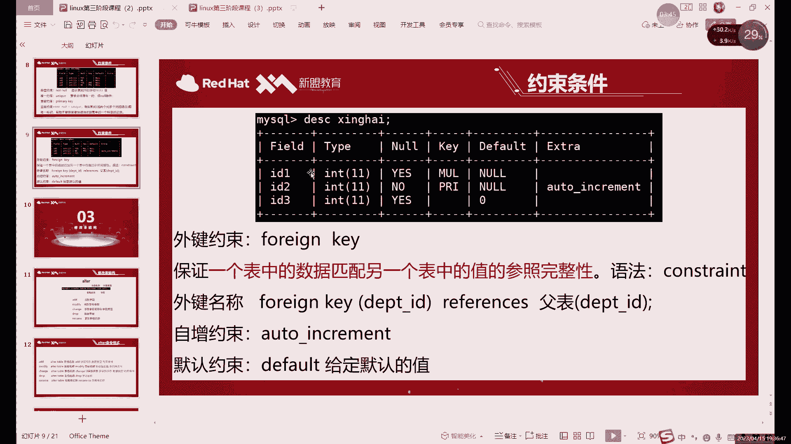

比如说我们这里来哎，接下来拿一个外键来举个例子，组件的话我们已经创建好了啊，组件已经创建好了，外界呢一定是什么，一定是连接了一个组件，所以说呢，我们这里是你IP是哪个啊，0。78这个。

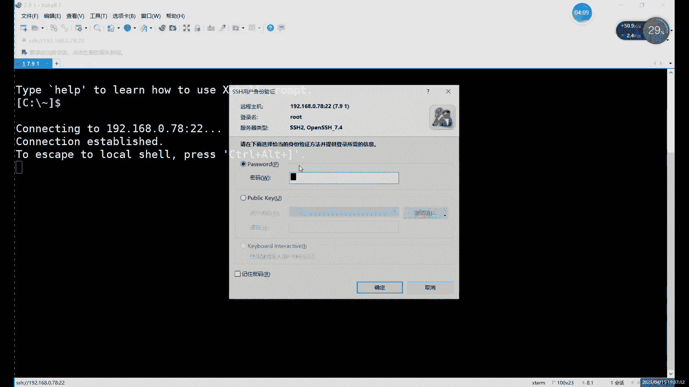

啊组件我们已经有了对吧，主线已经有了，就是那个叫主键的表格，那个叫主键的表格，就是我们的主键，PROTOOS对吧，我们已经有主见了，主键这个表格的话，我们可以来看一下它目前的一个形式啊。

目前长什么样组件，首先这里的话我们是用了两有两列对吧，有两列一列的是HD，一列是name i d这一类呢我们设置成什么呢，设置成组件了对吧，那我们做外键的话就是基于哪个呢，基于它来做，基于这个组件来做。

哎就是把这个表呢唉当成我们的这个主表了，然后呢外键的话，当然我现在还没有创建，没有创建啊，我们就创建一个吧啊，创建一个fate table t a b l e，创建一个外键，我们就叫外键啊。

叫外键的表格，然后表格当中呢，现场还是去写你的这个id也好啊对吧，name也好啊，这些东西可以正常写啊，正常写，对吧，还可以写其他的一些像年龄呀对吧，性别了呀，随便写写什么都可以。

这个表格的话自己随意创建就行啊，随意创建，就比如我们创建这么一个表格对吧，其他约束我们都是加在哪，就比如说IDINT后面我们会加一些什么，会加一种像PRIMV呀，然后now呀对吧，unique啊。

这些约束可以直接加在后面，外界的话稍微特殊一点，他这个呢我们一般加在哪，一般加在最后哎，就是你所有字段都写完之后呢，我们再加Y键哎，再去加Y键，那这个外界就比如说这个。

这里我们可以直接在就是写完所有的列之后呢，在最后写上我们的就开始创建外键啊，这个的话相当于是创建外键的步骤啊，Concentrate，然后呢后边加上我们的先给外建起个名字啊，首先我们是先写外界的名字啊。

格式的话我先给大家看一下。

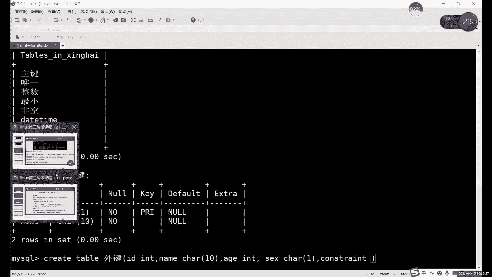

格式的话就是这个啊。

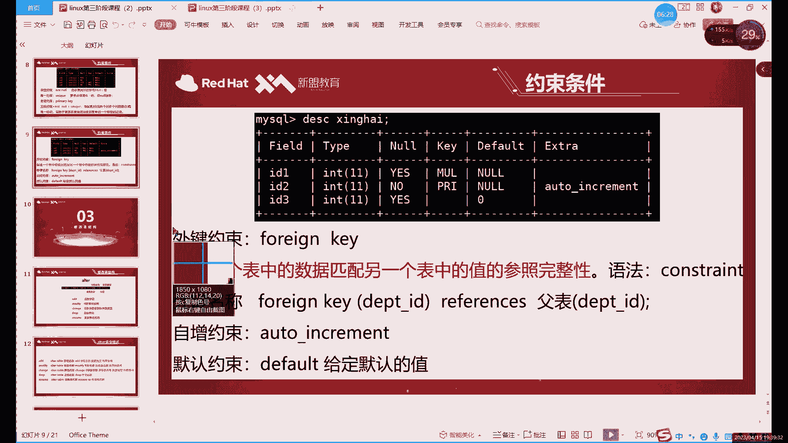

这就是外界约束这个格式，首先呢先写什么，先写外界名称，这个名字的话你随意随意随意定就行啊，这个名字没有什么特殊规范啊，一般情况下呢你可以写一下这个外键的作用啊，它是干什么的。

或者说它具体连接的是哪两个表格对吧，我们这里其实就是连接的主键和外键嗯，就比如说当然了，我们这个这一列啊，或者说这个Y键呢它的作用是连接打开的，比如说因为组件的话，我们是ID这个。

所以说呢我们也不能连内啊，这个外键的话只能连主键啊，就是其他的这个其他的链它不能用，不能用了，就只能用，只能连接是组建的这一列，然后呢这里呢我们就是一个，比如说我们随便起个名字吧，就叫id。

两个id嘛对吧，两个id的一个主键和外键的关系，唯一加非空的话对吧，我们这里是个非空，唯一加非空，它是主键，不是外键，是主键，主键是唯一加倍空，外键的话，Y键它里面的数据其实是根据谁变的。

是跟着主线走哎设置好主线之后，其实是跟着主线走，然后我们这里创建的话，你看啊就是concentrate，然后加上外界名称，然后后面加上什么呢，就是外界的名字啊，bing king啊。

这句话就是外界的名字啊，然后的话后边加什么呢，就是我们外界的这个字段，你想给哪个键字段添加外键呢，就需要在这里写，比如说我们这里是，你看上面我们用id这一列的话。

那我们相当于下面最好也绑定什么的主键外键，你绑定的时候一定要是什么呢，一定要保证你这里面的数据啊是同一类型的啊，不是说数据一定要相同，而是你数据要同一类型的东西，唉，就比如说如果你一个组件是你的主键。

是ID对吧，你的Y键是name，这行不行，那不行，为什么呢，一个是数字，一个是字符啊，你在什么呢，你在这个，就相当于是就应该叫你在这个数据类型上，其实不一样啊，那你能跟着那个表一起更新吗，肯定不行对吧。

因为字符和数值这两种是不同的，什么不同的数据类型啊，你如果插入这个插入数据的时候，它就会报错啊，你如果像字符里面直接插入数值的话，是会报错的，所以说呢我们外键和主键之间啊，一定要注意什么呢。

一定要注意这个字段的数据类型必须要一致啊，数据类型一定要一样，这类型就是这一位就是type，这里一定要一样啊，不一样肯定是不行的，好吧，一定要注意这个就是主键和外键之间呢。

主键和外界之间呢一定要注意这个，注意类型的一致性一致性，这是一个提前的限制条件，限制条件，然后呢接下来的话这个I就是这个Y键，这里呢我们现限制哪个呢，我们就写这个id吧，啊就写这个id，括号里面写什么。

括号里面写这个Y键的一个字段，把小Y变成字段，然后呢后边写上这个这个也是固定的啊，最后跟什么呢，最后跟上我们的附表啊，最后跟副表附表的话，我们是什么呢，附表的话就是这个我名字叫什么，名称叫主键对吧。

这就是附表的名字，然后主键的括号后面的话我们加什么呢，啊后面加上这个关联的主键的这个id啊，关联的主键的字段啊，当然我们字段的名字是一样的，所以说相当于什么呢，就是这个命令总体上来说呢。

需要改的地方就是主键和外键，这里啊主键和外键，这里后边呢是主键所在的表格啊，当然不是说写主键啊，我们因为表格的名字就叫主见，后边呢写着写的是主键这个表格的一个名称，加上这个组件的字段，前面写什么。

前面写外键这个字段啊，前面写外键的字段，然后外界的这个表格名称就不用写了，因为我们本身这个表格呢它就是我们当前的，我们因为我们的外界就是创建在当前表格的，所以说呢本表的这个名字不用写啊。

只需要在里面需要注意一下，这个组件的表格名称加上主键的，还需要指定的主键的一个字段就可以了，这个是需要就是创建外键的时候需要注意的啊，创建外键的时候需要注意的，然后呢这里的话我们这个。

这个就是正常的创建这个外键的一个步骤，当然主键和外键呢我刚才也说了啊，组件创建之后呢，组件一旦更新，这个数据有外线就要跟着改啊，但是呢跟着改的话也需要写什么，还要需要再写两个限制的条件，比如说什么呢。

就是这个，但是还需要在后面继续加啊，on update啊，cap这个是什么意思呢，这就是同步更新的意思啊，同步更新，当然了，还有一个什么，还有个删除，哎这两个的这两句话的作用是什么。

就是同步更新和同步删除哎，就是主键，如果说更新了数据，外界呢跟着一起改，删除的，注意点好，外界也跟着一起删，当然了，我们这个主键和外键之间呢，如果说组件创建数据，外界会创建吗，这个不会，这个不会啊。

这个呢因为我们这个组件外界的话，就只是更新数据以及删除数据的时候，可以同步啊，创建数据的话，这个是主键和外键是需要它是单独创建的啊，创建数据之间是没有关系的啊，就是主键能限制外界的只有什么呢，更新啊。

以及删除啊，限制根系统删除就是个on update和on delete啊，这个的话就是，创建正常创建一个外界的一个语句，对比确实比较长，你前面的这些约束确实比较长一点，因为前面约束的话。

它无非就是一个是not now对吧，UNICO加上primary，那这个的话就稍微长一些，从这儿到这儿对吧，这么长，这个就需要记一下啊，需要记一下，那你就多敲几遍了啊。

前面的话需要注意的就是这个外接的字段啊，这一段的话是外界的名字啊，这个是可以随随便起的啊，外界名字可以随便起，然后呢字段这里呢就是Y先写外键字段，然后呢再写主键字段，就先写外键，再先主键。

然后呢写都写完之后呢，最后还要加一个什么，加一个同步跟新和同步删除，如果不加的话，某股价其实没什么意义啊，没有不加的话呢，你这个外界主键之间的话就没办法更新数据，没有更新数据的话。

其实你做个标线没有意义，所以说呢正常的话，这个就是我们正常创建一个什么呢，创建一个外键的一个语句啊，比较长啊，确实比较长，你可以来执行一下啊，执行一下，还有一个特殊点，其实就是刚才也说了对吧。

外线创建的时候就是所有字段写完之后，你再写这个语句啊，你不要插在插在中间，其实不太好啊，它的空间不好，然后这里我们创建好之后呢，我们可以来看一下这个新的这个表格啊，它叫什么，它叫外界啊，它叫外键外键。

这个表格呢，这里的话啊用什么用英文的括号，用英文的分号，其他的其实都一样对吧，其他都一样，主要是什么，主要看这第一第一行对吧，第一行这里呢K这里又不一样了对吧，MULMUL的话，它这个值代表什么呢。

你暂时把它理解成外界好吧，暂时理解成外界，你看其实前面这个唯一性是要什么，唯一性是UNICO对吧，U n i，然后组件的话是PRI对吧，gram y的缩写，然后这当然这个的话。

当然我们现在的话我们也知道对吧，它是个外键啊，这一列里面我插进了外界，当然呢它其实它的含义不仅仅是外界，外界只是它其它的一部分，那另一部的话，我们后面会介绍啊，后面还会接受啊，首先呢看到这个。

如果你这里插入了Y键，这里只要显示了ml，说明这个外键至少插入成功了啊，这要插入成功了，所以说呢这里的话这个就是什么，这就是外界的一个啊创建，然后验证的话，其实你就是什么。

就是在两个表之间修改一下数据啊，这两个表之间修改一下，比如说呢然后看一下组件现在有没有数据，但应该还没有没有数据，select inform组件，啊有一个外界没有，啊外界还没数据啊，不着急。

我们可以先在哪儿，可以先在insert，我们先往外界里面插一点数据啊，不然的话没办法验证这个更新删除什么对吧，我们在这里，我们比如说我们写一个啊，这关键还比较多一点啊，不过没关系，Id，Name。

啊包括年龄，还有一个性别啊，这里的话是两种，有数值有字符哈，如果懒得区分，那就全加引号啊，懒得区分就全加引号，这里的话因为我们就写了一个是吧嗯，好就用英文吧，用英文也行对吧，这样这样的话我们这里插入看。

IO数据从一这里好，我们第一个是INTCHAR，I n t c h a r，value没有写，插入之后的话呢，正常我们就可以看到，我们可以看到数据就是正常插入的话，就主键和外键之间是没有关系。

那就是我们主键和外键的话，它限制的不是说写入数据，写入数据都可以自己自由，是随意写入，我们这个主键和外键主要限制的是什么呢，主要限制的是这个ID啊，主要现在这个id i的一个更新和删除。

因为我们主键外键的话只是针对于什么，只是针对于这两个id做的啊，这个表格里面主要看这个ID吧，它是什么，它是主键，第二个表格呢它是什么，它是Y键，也是指它是外主键和外键的关系。

其实就是组件这边更新删除外键就跟着一起动，就比如说呢我们来更新一下啊，更新一个数据，Update，我们更新哪个表格的，根据主键表格当中的数据好吧，根据主键表格当中数据，阿贝的主键，然后后边加上什么。

id对吧，我们就更新id，就把id改成二对，我就稍微改一下id啊，改完id之后呢，我们可以先对吧，主键的话就是id等于一变成A等于二了，那Y键Y电YY电，而且也就跟着一起改了啊，Y键就跟着一起改了。

这个就是什么，这个就是这个外交组建的一个，更新了一个就是逐渐跟着跟组件更新的话啊，Y就跟着一起更新了啊，这就相当于是数据同步，但看这里现在数据还比较少，如果说数据比较多的情况下的话。

整个i id这一列哎，主要主要是主线这边一改啊，那外线就跟着一起动啊，外线就跟着一起改啊，这个就是主键就是外界的作用啊，主要就是做什么做数据同步的啊，做数据同步的，组件，嗯这里删的话，其实。

删的话也一起删了对吧，大家可以看到删的话也一起删了，因为只有一行数据，我们就直接delete form组件了对吧，相当于把这个组件一删，哎这边也是整个没有在插入数据，这个不影响啊。

插入数据我们可以来看一下，insert into组件，Value，比如说还是一吧，一逗号，对吧，插入数据的话不影响啊，主线这边正常插入了AA，你就删，我们再插一次，组件里面插入了外界没有对外界没有。

我们看一下组件吧，哎逐渐有啊，也就是插入数据的话，这个是不影响的啊，主键外键之间做的数据同步呢，他只做什么，只做更新和删除的数据同步啊，外界不能更新数据啊，外线不能更新数据。

这个是主键和外键的一个关系吧，主线外线的话，当然了，他三数据或者更新数据，他是看的什么，看他看的是id一样不一样，什么意思呢，就是那如果说主键I8组件，这里的话添加ID是一，Y键的，ID是二。

如果id不一样的话，你修改那是不会变啊，那肯定是不会变的，这个是看什么呢，这个主要是看两个数据之间的一个同步嘛，啊两个数据同步，刚才我们其实插入数据比较少啊，插入数据比较少，主键外键之间呢。

其实就是就是你就就理解成什么，就理解成这个软链接啊，就是唯一不同的就是软链接，这里的话软链接的一个文件的话，里面你怎么修改，肯定都会跟着一起走啊，不过呢外键和主键的一个区别，就是和外和软链接的区别。

就是主键呢只有更新和删除的时候，才会影响到外界，其他时候不会啊，然后外键的话一旦设置的话，外面就不能再改数据了啊，他只能插入数据啊，它只能插入数据，对吧这里我还问了好多啊，问了好多啊。

外界的话关键是不能更新的，一定要记住，就是现在不用记，你随便更新一下，你就知道了，它就会报错啊，他会绝对会报错，然后呢插入数据的时候呢，唉只有两个数据，就主线和外线当中啊，数据相同的，它它都会影响。

如果说你两个表格里面数据都完全不一样，那会影响它不会影响啊，它不会影响这两个表格是主键和外键之间呢，它并不是说数据的一定要保持一致啊，不是的，因为什么，因为插入数据我们之间是不影响的啊，超有数据不影响。

只有什么只有在更新的时候啊，这是在更新组件的时候，外界才会跟着一起更新对吧，然后呢这个啊那还有什么问题，唯一加非公啊，唯一加非公就是主键啊，直接创建组件和设置飞飞空加V1是一样的啊，中加V1是一样。

没有区别的话就没有区别，这个非公加个一就是就是两个加起来，它就是主线好吧，主线影响的是外界对吧，你怎么删外键其实不会影响啊，怎么删外键它不会影响主键的啊，主键的话它始终是个独立的表。

它和外界没有任何联系啊，是Y键啊，你可以这么理解。

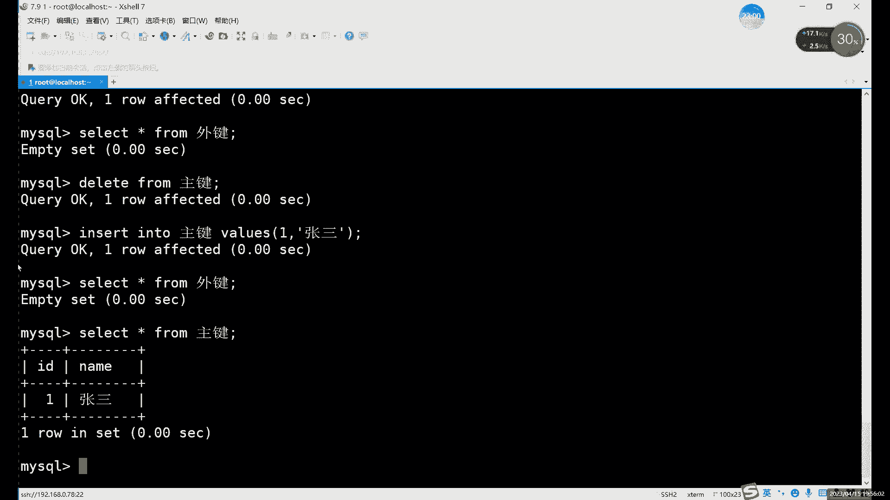

我们组件的话，主键的表的话，它是一个独立的表，而外键如果是创建之后呢，它相当于是他自己，啊它就类似于什么类似于这副表啊，它就是组建的一个主键那个表的副表啊，也就是你外界怎么变都不会影响到主线的啊。

它不会影响到主线，啊这个就是主键和外界之间的区别，哎主键的话，你相当于是它就是一个完全独立的一个东西，即使设计了Y键啊，它外键和主键一点关系都没有啊，大家都记住，就是外键和主键一点关系都没有啊。

永远都是逐渐变外界变外界跟着变，外界是永远不会影响到主见，好吧，你要记住这个就行，然后这里的话我们可以来，接下来继续看一下这个自增约束啊，再看下一个约束啊，你创建不了表，创建表的话肯定是什么。

肯定是你创建表格的时候格式有米啊，虽然说我看不到，但应该是你格式出问题了，嗯应该是格式出问题啊，你看一下哪儿的格语法有错，他报错在哪呢，你就看一下附近哪里少了什么符号啊对吧，用了什么中文的符号啊什么的。

你不行，把把报错截，把报错复制出来也行，截图怎么说呢，腾讯会议因为他的问题还是很大，我们这里现在都用的都是腾讯会议VIP的一个号，然后推荐VIP的号啊，没有切换库呀对吧，No data base。

就是没有切换库，大家注意在创建表或者对表进行操作的时候，你一定要在某一个数据库当中啊，就比如说你想你，你就得切换到你自己的数据库里对吧，你之前不是咱们不是创建了数据库嘛对吧，统一都创建了自己的数据库。

你切换到自己数据库里面再去创建表好吗，然后呢我们接下来继续诶，继续这个自增约束，自增约束的话，他是最后一个啊，默认约束这个啊，就先先先先说啊，都行啊，都一样啊，没什么太大区别。

自动约束呢它是一个自动增长的意思，它自动增长，它长的是什么，他只能找数字，它就可以强调了啊。

如果你是字符的话，比如说你的c hr的或者是VR的那种对吧，这些字符的话它不能增长对吧，你比如说你原来是ABC对吧，能让它自动增长DEF呢，它不行啊，因为自动增长的话，这个AUTO对吧。

AUTO自动增长的and equipment，它只能涨涨什么呢，他只能只你今天这个平翘小一点不分，它只能增长数字啊，数字就比如说呢我们看一下，当然这里没有嗯，我们直接来吧，直接给大家演示吧。

啊增增增长数字是什么概念啊，就是嗯就比如说之前我们不是一直是id嘛对吧，id这种列啊，这种列的话才能设置什么呢，设置一种自动增长，哎这种约束这个约束的话，它其实呢这种规则它比较特殊，对称比较特殊呢。

就是在我们一旦执行之后，哎，或者说是设置好之后呢，以后就不用再也不用咱们管了，还是基本上不需要我们去管啊，它就会自动自动运行啊，自动运行这个自动增长还是比较好用的，什么意思呢。

比如说你像现在我们id是一对吧，正常情况下我们一般id都是按着往下排，对不对对，你不管说你这个id是序号也好啊对吧，序号你也可以跟着往下排对吧，按照顺序排是吧，或者说是你的工号啊对吧。

这些东西都可以一个一个往下排下去对吧，都能排下去，那这种id的话，其实就如果说你的列里面有这种形式啊，或者说这种属性的这种列啊，这种id号的列我们就可以什么呢，其实就可以完全不用人为的去管啊。

不需要我们自己去管，可以设置一个什么，就设置一个自动约束，就在每次我们插入数据的时候呢，它会自动增长一个，就比如我们第一次插入数据，它是一第二的插入呢，它就变成二了，第三次就是345，就往下排。

这里就是自动约束的作用，具体的话我们还得什么，其实还得再演示一下，自己看看效果好吧，它自身的意思就是我们我们插入数据，他那边自动给我们填写，相当于是自动填充对吧，这个自动增长的话。

其实就是它有自动填充的作用啊，自动填充作用好，我们这里就直接insert into，Insert into，我们看一下，不是insert，可以啊，我们用表格创建个表格吧，先，REAT啊。

Create table，我们表格名字就叫自证吧啊，就叫自，比如说呢我们把这个create table，自从这里，写一个什么呢，我们就id吧，就用id啊，因为一般情况下呢它能自动增长呢，按照顺序走的。

它就只有i id是种力，其他的话基本上很少啊，很少会有其他列用到自动了，自动页数的话一般就是ID这种列，对吧，比如说呢我们写一个IDIT诶，我可以诶，对打的还挺快啊，如果这样创建行不行呢。

啊如果说我们只放在一列啊，不行，不能去换成一列啊，大家注意啊，听如果说想那个什么不能只创建一列啊，啊你预习了预习了它也不对呀，啊我们不能只创建一列，还得再加啊，还是家内容对吧，那为什么不能只推荐一列呢。

因为它自身约束吧，如果只是双眼一列的话，怎么说呢，他没有把没办法自动填充，什么意思呢，就是比如说像这个表格啊，我们是在插入名字，比如插入张三，他就给你填个一对，插入李四呢，他会给你填个二。

这个叫自动自动增长嗯，或者说这个就是这个，准确的说是这个叫自动填充的意思啊，自动填充的作用是吧啊，所以说不能有不能只有一列啊，不能只有一列，那这样行不行呢，啊这样的话其实啊两列行不行，那就两列至少还够。

但是呢按你这样创建表格的话，像INTIDINT啊，它会报错，为什么会报错呢，因为啊他这里报了什么，你可以翻译一下，有错啊，就是我们什么呢，这个自增约束这一列呢必须要有什么。

必须要有一个其他的约束来帮忙啊，准确的说的话叫什么叫K这是哪一列呢，这一类啊，就是意思是必须要有一个K什么意思呢，啊其实K的话，这里的话我们就是两个哪两个呢，唯一性的约束和主键约束为什么需要这两个呢。

大家可以，思考一下啊，为什么我们自动约束，我们自动填充，为什么需要这个唯一性啊，或者主键呢，其实很简单，因为你如果说没有主见，就是如果说这一列呢可以重复对吧，那你就没办法就一个一个往下走对吧。

只有在这一列呢一定要有唯一性，或者说有主见的时候，比如说呢我们就写主键吧，啊必须要有主键或者说唯一约束的时候，你的数字它不会重复对吧，数字不会重复的话，就只能就是他就只能往下排了，1234自动填充对吧。

所以说呢这里的话一定要加什么，一定要加一个约束啊，唯一性和组件质量都可以啊，这点都是可以的，你不用担心是否非空啊，为什么这里这个主键和唯一性都能用呢，就是它和飞空没什么关系啊。

这跟not now没有什么关系，为什么呢，因为它会自动填充它，就是它怎么都不会是空置的啊，就是你怎么写怎么写都不会空，所以说呢这个非空约束是无所谓的，所以说呢也能写UNICO。

也能写主键primary都可以啊，都可以，我们这样先创建对吧，DSC呢我们来看一下这个自增长什么样啊，啊，它就会在这个扩展这里写上一个outer increment啊，这个自增约束。

然后呢他前面还有他前面还有什么，还有这个组件，当然你写这个UNICO也行啊，写UNO也可以，有创建的时候创建UNICO也是可以的啊，允许，然后呢你怎么去添加呢，就很简单。

就是insert into的时候，讲自增率表格里，怎么加呢，我们就直接那个就行了，唉就不用管了啊，有了自动约束呢，我们就插入数据就会怎么说，能节省节省一列的内容，就是有一列的话，我们就永远就不用管了。

比如说i name对吧，name得是带引号啊，单引号，唉插入多张三，然后呢我们直接来看一下啊，select in from什么呢，四增对他是一张三对吧，那再插入一张三行不行啊，再插入几个也行。

因为那张三这一列的话，我没有什么没有这个这个叫什么，没有这个唯一性约束，所以说差几个都可以，但是呢前边就不一样了，你不管你后边插的是什么，它不会影响到前面的这个自增。

就是123就永远一直往下一直加下去了，唉这个就是什么，这个就是自增的一个特点啊，或者自动约束的一个作用吧，就是只要你这一列设置了自动约束，你后边的话就插入任何数据，就不用管它了，那就不用管了。

你后边你不管插入是什么啊，后边内容就不重要了，只要你插入的数据，他在会会在第一列里面给你补上什么呢，会给我们补上这个自动啊，自己的东西，默认的话都是从一开始的啊，默认从一开始增长一个啊。

当然这个增长量啊，或者说呢默认的这个值是可以改的对吧，就比如说这里的话，默认它就是1234往上加啊，6N子往上加，如果说呢你如果想改的话就可以改啊，只不过设置这个的话，其实啊其实没什么意义哈。

其实没什么意义，因为什么呢，自动增长，如果说你把一改成二对吧，他就是2468这么长对吧，一般24岁说话这么涨的也比较少，基本上id的话基本上就是1234567，12561234567啊，这个可以改。

怎么改呢啊大家知道就行，一般很少改啊，就是改什么就改这个，这个我们先看一下啊，先看一下啊，有auto increment，有这么一个，有这么两个吧，首先来说叫两个啊，他这里不止一个选项。

它这里是两个选项，哪两个呢就是自动增长啊，这一个初始值啊，这个offset是初始值啊，就是从一开始的，然后呢上面这个是每次增增增长的数字，就是这里写一的话，就每次增长一啊，你如果说想要改的话。

就是改这两个东西啊，下面这个是初始值啊，下面是初始值来，比如说初始值的话，你就用set命令就可以设置啊，直接直接set它等于多少就行了，这个也一样，你set这个值就是每次如果改成二的话。

它就相当于是他就1357都没这么去写了啊，这两个的话准确来说呢，呃改的比较少，因为自增的话，一般情况下都是1234567嘛，这样增长肯定是最最合理的是吧，你跳着走一般很少见啊，一般很少有这种情况出现。

然后这个的话就是这个自动约束啊，自动约束这里的一个特点。

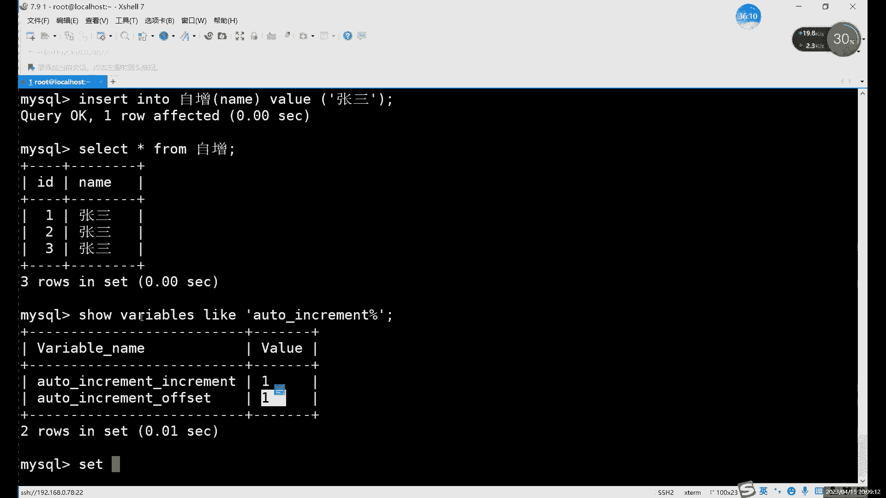

啊就是就是我们1231234，第四个这里啊，第四这里的自增，自身约束做完的话，我们下一个是什么，下一个是默认约束哎，默认约束，默认约束，这里的话，这个之前其实我们稍微提到过一点对吧。

你看默认那里他写的是一个N空值啊，大家看这个图片的表格，在NN这里写了个空值，为什么它是空值呢，啊就这他们因为这相当于什么，这个就相当于一个默认的值，就如果你不填的话对吧，我们之前都遇到过几次了对吧。

我们就用一段插入的时候，如果说我们只插入一部分数据的话，那其他数据它会默认显示一个NL空值啊，控制的话其实不算什么数据啊，控制其实不算什么数据啊，它就是默认填了一个，因为它存它存储的时候啊。

你存一列它我们存数据是一列一列去啊，你中间不能有空，所以说他这相当于是暂时用什么，暂时用now应该补上了，好像在这个段来补上，所以说呢这个默认呢就所有的列，它默认都有一个默认值，就是N。

但是呢如果说我们想要调用这个默认约束的话，肯定要改成默认值啊，改成默认值，改默认值的话，那就每一列每一列它都有默认值啊，就是你每一列其实都可以设置默认值啊，一旦设置了默认的话，它会有什么效果呢。

它会有一个自增一样的效果，就是在你不填的时候，那在不写那一列举的时候，会给你自动填充这个default和，就是和你自动约束和默认约束这两个约束的话，就是相当于他俩其实都是自动填充的作用啊。

都是自动填充的作用，四张这边是相当于开始按照顺序，12345动作，而默认呢它是什么。

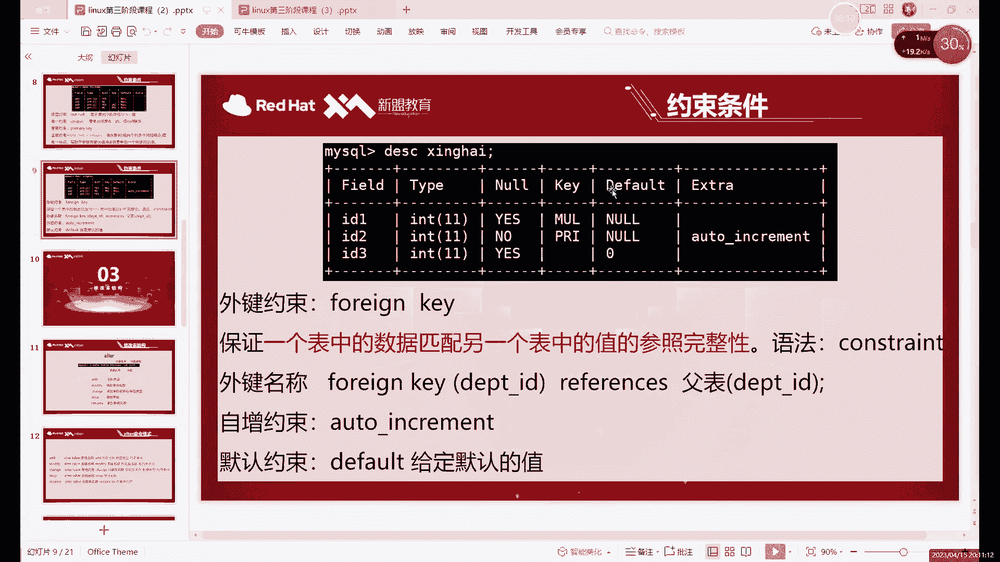

它就是一个值啊，默认它永远都是一个值，怎么设置呢啊，就是在添加我们在添加字段的时候，哎我们在添加字段的时候，那现在字段的时候呢，我们可以直接用set命令啊，同样的智力其实我们也是set命令对吧。

也是set命令，比如说呢之前对吧，set这个初始值是吧，如果说相等于零的话对吧，我们可以来看一下是吧，嗯为什么他系统这里设置的什么呢，我们看一下这个对吧，它有效果吗，它没效果，那改个二行不行呢。

啊改了它就变了，什么意思呢，就是不支持零啊，默认是不支持零的，就是基本上大部分数据库啊，它的自身约束的数值它不能设置成零啊，它不能设置成零，默认值都是一，最低呢只能是一啊，这里指的是一。

啊所以说的话我们这个需要注意啊，这个也是要注意一点，不过一般的话不会改，一般都是不会改，这两个家伙对吧，那默认最低是一看CCP1，然后呢接下来的话我们说一下这个智能啊，不是不是是默认啊。

默认它也是set命令对吧，也是用它需要用到set命令啊，set的话其实就是设置的意思，在MD里面set我们一般都是设置的意思，就是尤其像MYSQL里面有很多这些规则呀，有一些默认的规则。

就像这个这个它其实就算是一个规则嗯，设置规则的时候呢，包括不知道还记不记得我们设置密码的时候，也用的是这个密码对吧，set password也是用设置，就是修改我们MYSQL里面那些默认设置的时候。

都用什么，都用这个，set命令就行了，也就是修改我MYSQ当中设计来就是set命令，然后set命令这里呢，比如说我们在一个，这是一个什么呢，设置一个默认值啊，当然设置默认值的时候呢。

我们还是创建一个表格吧，啊创建个角格吧，网默认，Id，这里的话我们写一个什么，写一个比较适合默认值的是什么列呢，一般就是这种力，情况比较少啊，情况比较少的情况，什么意思呢，咱应该认得这个单词吧。

sex这个单词，我设置什么链，我设置了一个叫性别的例，id这种链或者name这种链能不能设置默认值呢，哎呦我刚才忘记忘记设置了哈，啊这里我们就先不用修改的命令，另外这边还没有这些讲。

我们就直接再重新创建一下啊，还没有创建完，直接回车了啊，这个里边的话就比较适合你，看id的话内默认值合适吗，其实不合适，为什么呢，id一直在变，那你即使不设置自增约束对吧，id你即使不设置自动约束。

那我肯定1234567对吧啊，或者说你从从哪开始都行，而name这里还有名字是吧，名字哪有默认指数对吧，哪有默认的这个问题，所以说呢这个这些都不合适，那什么最合适呢，性别是其中一个比较合适。

这个默认约束，而这个默认约束呢嗯，一般情况下哈这个默认约束最好是设置一个啊，这一列里边出现频率最高的一个啊，就这一列里边哪个数据出现频率最高呢，哎就比如说这得看什么情况啊，性别这里自己看情况设置。

然后看情况设置，比如说嗯，如果这个表格我们是什么呢，我们是，唉咱们的学员信息表哎，这样的话好好好说一点啊，如果是咱们这个学员信息表的话，其实这里这个性别这里就好设置一下默认值嗯，还是好设置默认值的。

就比如说我们直接写什么呢，啊虽然也设置一个默认值，嗯比如说，在我们这里可以设置一个，引号不开队伍，好没问题，默认值哎，比如说我们是学院信息表啊，这当然是咱们机构的学员信息表是吧。

男男男同学应该更多一点对吧，男生应该更多一点，那这个的话就是什么，这个就是默认值啊，设置一个默认值啊，当然我这里倒不用set，不需要直接用写set，如果是设置一个默认值，这个默认值呢。

那这里有什么作用呢，我们可以直接执行吧，直接执行，直接看一下，看一下这个DIC大家都知道什么意思了，DC默认，对吧，这下就很明显了嘛，main值的作用呢其实就是把now给改了，这里如果什么都不写的话。

就是你正常设置一个字段，什么都不写，他会给我默认补一个none，就是默认值就是控制，那如果说你喜改的话，这就是它有值了呗，啊有值的有值了，自然在插入数据的时候就很方便，也是零二。

我们呢我们讲默认里面插入点数据，比如说，或者我们先只插一个id，就看看效果啊，就看他这个id吧，先，这比我们插入一啊，没问题，它没有报错，然后呢，我们来看一下lain from默认。

看这就是不设置默认值的一个作用啊，设置默认值的作用，id是一对吧，我们插只插入一，然后呢name这里我没有写对吧，他们不是空了，第三个性别，我们写了个难，它就补了个难啊，也是自动填充。

就和相当于和自动一样，它作用都是自动填充，就是你不写的话，默认都是男，啊而且呢他这也不用写，跟这个非空是不是非空其实无关，唉是不是非空其实无关，因为什么，因为有了默认值之后呢，你就是你不写的话。

它就默认值这个啊，非空设置的是什么，非空针对的是它，它就叫空啊，它就是空，所以说呢正常的非空其实就是唉，默认值如果是空的情况下呢，不插入数据就会报错啊，如果默认值它是其他的，你换了默认值了。

其实飞不飞空的其实就不重要啊，非空其实不重要啊，这个的话就是什么，这个就是我们这个默认约束的作用，当然了啊，你这常我们正常插入的话，肯定如果是id name啊，这样就写id name对吧。

value的话一逗号，张三对吧，正常这样写啊，如果说对吧，我们这里默认是个人的，默认他又是男的，但是呢肯定有例外啊，我知道肯定有例外，如果是想要把性别换成女怎么办呢，很简单，就下面有个插入的时候呢。

你们写全就行对吧，写全就行，而这个啊看，nu对吧对，那它就正常啊，就是什么就是默认约束呢，它是在你不写的情况下默认填充的，如果说你要写啊，不管说你写的是什么，你这里写难行不行也行啊，写难也可以。

不写也行，不写的话就是什么不写的话就慢慢默认值走，写了的话就优先什么的优先，你写的是哎，所以说默认值它并不是说你设置之后它不变啊，只是在你不写的时候，他永远是固定的那个唉，不写的话就是默认都是难啊。

你写了的话就写什么是什么对吧，那如果说你写一个不写，男不写女行不行的也行对吧，那那就属于什么呢，就是第三种了呗，对吧，那是属于第三种也可以啊，这个是默认值的一个作用，它并不是说你设置之后它就不能变啊。

一定要注意啊，就设置默认值，它只是什么，只是在只是提供一个自动填充的一个作用，而不是设置之后就一成不变，啊这个就是这个默认值的作用，或者说可以叫默认约束啊。

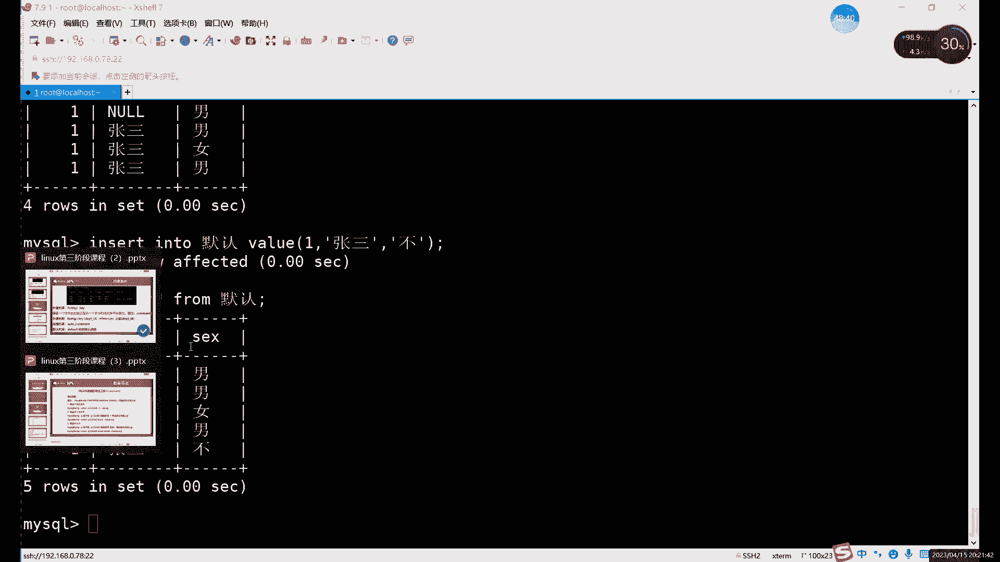

叫他默认约束吧，总之他两个都是什么，都是自动填充哎，就是自动填充的意思，他俩都是自动填充空，数据不一样的是自增，这边填的是什么呢，填的是数字，而且是自动增长的，默认这边的话就数字啊，字符啊，什么都能加。

但是呢它不会变啊，但是它就是一成不变的，一个是固定的一个东西啊，固定的一个数据啊，这是他俩的区别啊，相同点都是自动填充的作用，不同的就是填充的对象不一样啊，这个的话就是我们的一共六个约束啊。

六个约束这六个约束的话，你说呢灵活使用，因为什么，因为它的每个的功能不一样啊，什么功能其实就不一样，所以说呢你在设置字段的时候呢，就有设置约束的时候，一定要看你根据字段的一个需求来。

因为你一旦设置了约束啊，你如果说不允，如果违背这个约束的话，你插入数据是会报错的，哎所以说呢一定要确保什么，确保你这个约束呢合理，就比如说name字段能不能设置唯一性。

就是姓名这个姓名这一点能不能设置为一，能不能是主见的啊，不能好吧，这一列肯定是不能设置这个唯一性对吧，有很多列都是不能设置这个唯一性组件的对吧，只有什么，只有是唉。

只有那些百分百确定肯定不会重复的东西了，才能试这两种，要不然的话你如果说你换个姓名对吧，这是个唯一约束主键，你想杀出去都插不进去是吧，碰到一个重名的对吧，同名同姓的名字都插不进去。

那你这个就是肯定是不合理的对吧，肯定是不合理的，所以说呢一定要注意，尤其像这个唯一组件是最需要注意的啊，飞空其实这个所有字段的都可以设置非空啊，所有资料都可以设置为空，但唯一和主键的话就怎么说呢。

维修的组件这边一定要注意啊，不能随便写啊，很唯一的组件可不能随便设计，啊像外界的话，外界这个其实它它都不属于我们呃，他说他这个其实已经不属于一个表格了，他这相当于是两个表格，一旦设置半年的话。

他已经涉及到了两个表格啊，这个外线这里设置的话，唯一需要注意的就是啊，主键和外键的数据类型一定要一致就行了啊，就是要注意这个其他的没有什么太多限制，然后自动默认的话，默认呢就是设置一些。

比如说某个值比较固定的情况啊，某个值比较固定的情况下，可以设置默认自增的话就是什么自增，就是唉自尊其实是最条件最苛刻的一个，它比唯一性和它比唯一性约束和主键约束，还要条件更苛刻，因为你唯一性组件的话。

它只是不重复嘛啊自增的话不仅不重复，而且还要按顺序走，而且还是必须得是数字啊，而且默认还是从一开始的，所以说这个智能的受受众对象哎，就设置自动的对象呢就只有一列，就是D类型的id号类型的这种编号编号。

这个的话就是几种约束条件啊，几种约束条件啊，我说完这个约束条件了对吧，上节课我们也说了什么也讲了，这个上节课我们主要讲的是这个数据类型对吧，包括前几个约束，这节课我们把这三个约束又输完之后呢。

我们就能说什么呢，哎就终于到了我们这个art m，啊终于把这个二层秘密补上，第二次命令不是我们这个第一节课对吧，第一节课我们在这一部分啊。

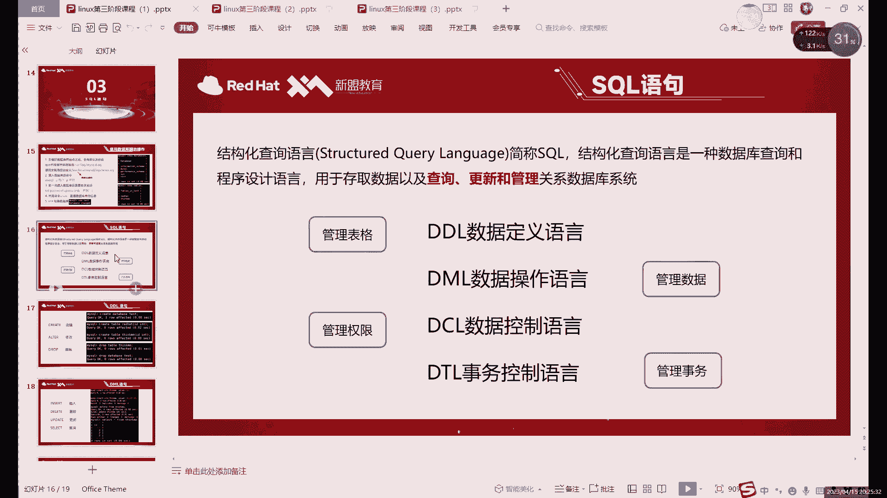

没有说的，就是我们的dd l数据定义语言，这里创建修改我们都说了，创建删除都说了，alt命令呢，因为之前就只是改了一个什么，只是改了一个表格的名字啊，alt我们还没讲。

alt我们就是改了一个表格的名字呀对吧。

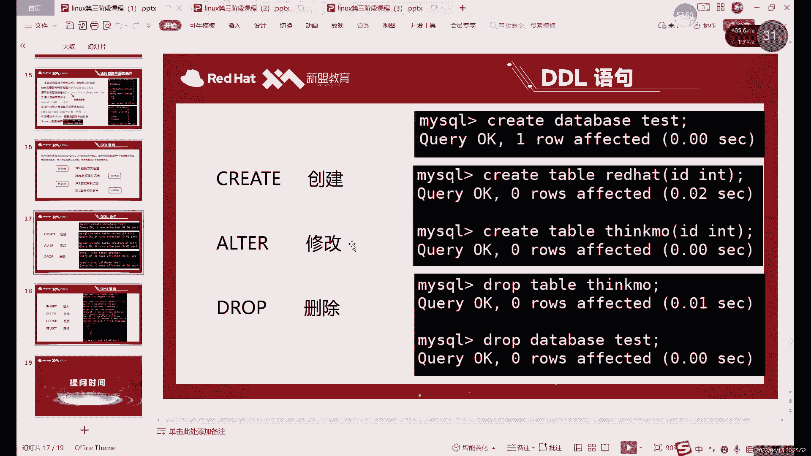

其他的命令还没讲呢，你是已经预习了吧，预习了吧，啊二三我们就只讲了什么，只讲了个REA，前面几个都还没说，为什么我是我。

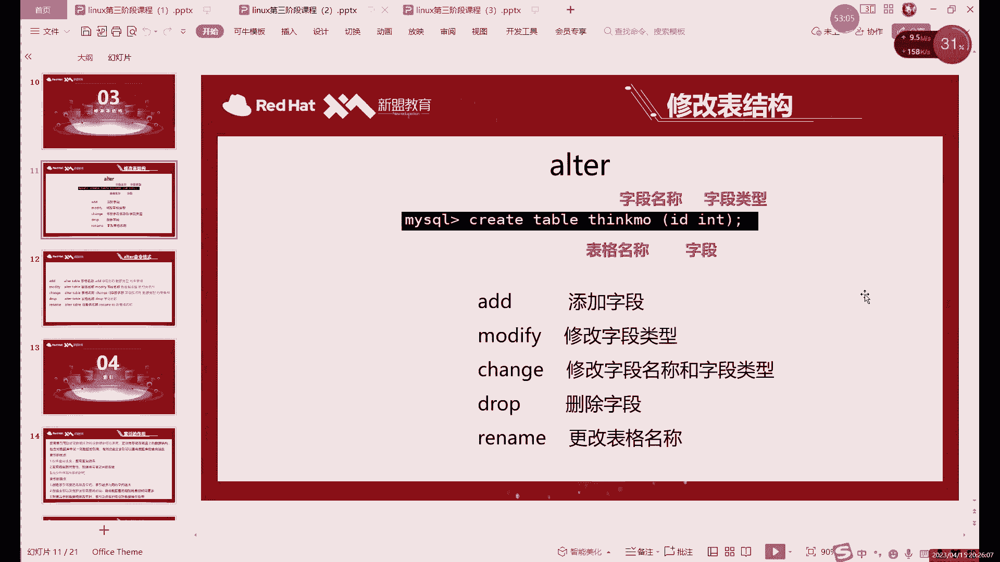

为什么刚才一直演示我们这个演示这些默认啊，默认和或者说自身的话，我都是一直在一直在一直在重新创建表格啊，为什么一直在创建表，因就是因为修改没有讲，所以我才一直创建啊。

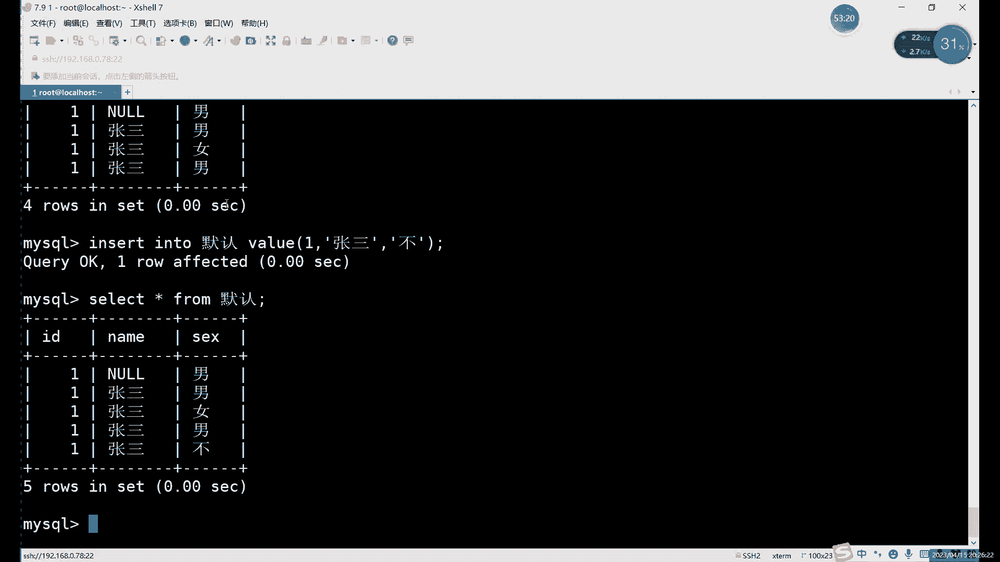

alter命令呢就是我们修改什么呢，修改表格的一个命令，有修改表结构，那库能不能修改呢也行，但是那alter呢只能改一个库的名字啊，只能改一个库的名字，但是呢不名字呢不建议改啊，不建议改，为什么。

因为改库名字非常麻烦啊，你不要以为说outer peter base啊，什么什么，改一下名字就行了，那不一样啊。

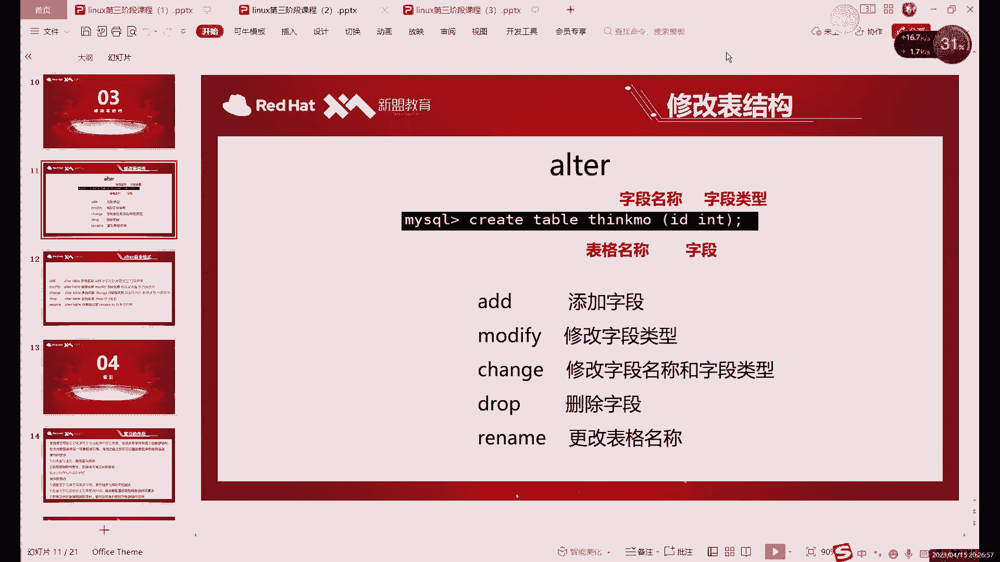