# 0基础小白怎么入门Linux运维？看这套，Linux运维全套培训课程，保姆级教学视频 - P71：中级运维-8.约束，ALTER命令，索引，SELECT查询-中 - 小方脸不方- - BV138411B7p5

表是不一样的，表名字之前我们是被再改，已经改过了对吧，那我是改过的，改表名字的话其实很简单，就是把name to哎，改个名字就行了，那不行之间的call不行，为什么，因为库涉及到的东西太多了。

每一个表格呢它的名字，它的完整名字其实都是什么呢，都是库点表。

就比如说我之前不是在当前当前我们是在哪，是在这个数据库对吧，天海的吧，这个数据库里，如果说在在这个在这个数据库，想要看其他数据库的一些表格，可以啊，是可以的对吧，我们最开始是看过一个什么呢。

看过一个叫嗯MYSQL的表格，MYSQL库，然后里面有user表对吧，这是我们用户的权限表，没毛病对吧，那这个表，有个什么问题呢，啊他的问题就是，我们每次要看的时候呢，一定要加人们这个是库名字。

点后边是表明字，也就是跨表查看，跨库查看的时候呢，可以看都必须要加上这个完整的名字，那这个呢其实才是我们这个表格的一个完整名，也就是说每个表格和完整名词，都是库加的表层啊。

who who的话基本上都是固定的对吧，固点表，也就是如果说你想改库的名字的话，你故事改了，但是你那些表都没了啊，你一旦改库的名字，表的名字就全都没了，所以说库库的话怎么说呢，总体上来说呢。

不建议大家改啊，不建议改名字啊，库名字不建议改，因为这个改起来特别麻烦，你想要改一个库的名字，你意味着你要把所有表格的名字都改了，而且这个就不是什么呢，而且这个也不是那么不是那么简单的啊，不是那么简单。

改名字对，改目录名字可以，但是改了目录名字，表格里面的名字他改不了，表格里面的名字都改不了，所以说AUTUMIN呢我们一般啊这里就强调一下。

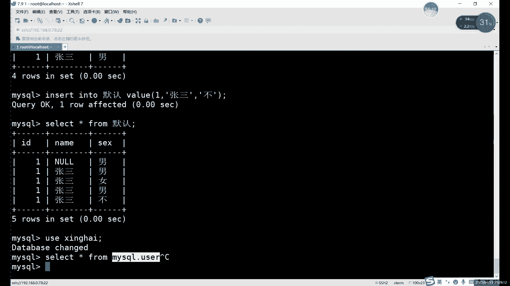

不要用AUTUMIN改的，改数据库的，我们只用来改什么，我们只用来改，表格名字而且用，而且是alter加上什么加上RELITO啊，这个组合来看看这个组合来改，然后呢除了resume以外呢。

其他的修改引表结构的话，包括我包括添加修改和删除啊，他这个命令的话就是，alter对于表修改的话，其实它并不是说直接用alter来改，而是在后面还需要加上其他的一些辅助的，一些选项啊，这几个的话。

这五个都可以理解成alter的一个选项啊，alter的选项，alter table加上我们的表名称，后面就可以具体的去改这些内容啊，能改的是包括什么呢，其实我们创建的表的每一部分都能改。

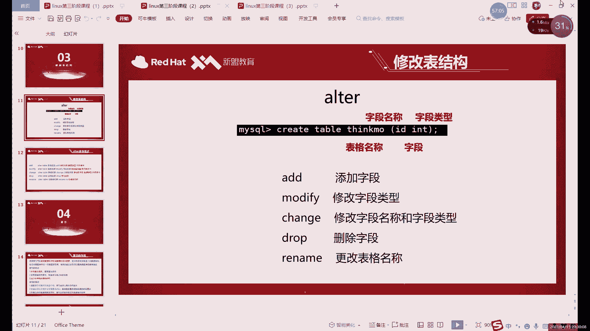

就比如说看第一页，看个DSM啊，啊就这个我在创建表的时候包括什么，包括字段的名字，字段数据类型，字段的约束对吧，包括这三部分，这三部分的话其实都是什么，都是属于表结构对吧，就是默认这个表的表结构。

autumn能改的是什么呢，就是，这些内容他都能改，也就是我们如果说你第一次创建表格的时候呢，创建了一个这么一个表格对吧，哎你创建好之后呢，哎发现这个表格有哪些地方不太完善，哎，就比如说呢。

唉如果说你这个字符限制的宽度太小了，想要改一改新地方可以用什么，用AUTUMING改，还约束设置的不合适了，能不能改呢，也可以用AUTUMIN改，想改个名字行不行呢，啊想改个字段的名字。

还有就是改一列的名字，不是说改个表格名字，是改这些名字行不行，也可以改，还是奥特名，哎，总之alt in的修改呢就是针对于我们整个表格啊。

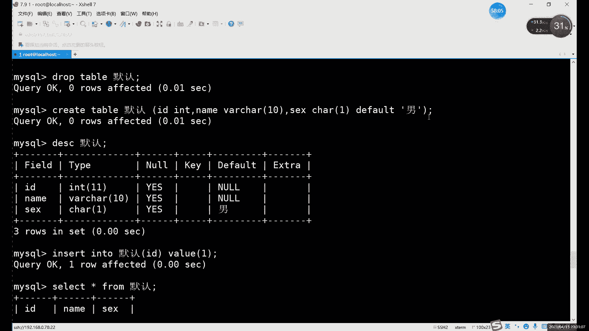

针对整个表格啊，如果用法的话，就是这几个啊，这个就是它的一个具体用法啊，包括这个添加修改删除这这四种啊，改名字的话，这个rename是改表格名字啊，不是说改字段名啊，不是改字段名字，改字段名字是哪个呢。

是change这个啊，就是改字段名字啊，这就是奥特曼的一个一个选项啊，一个选项。

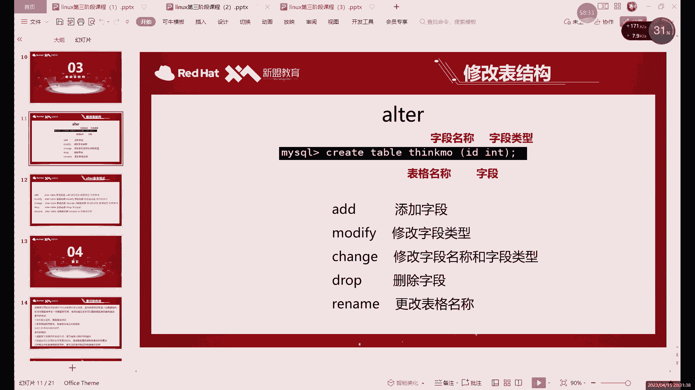

啊如果说大家出现这个rpm安装啊，当然这个仅限于rpm的亚M安装，肯定没，不，是不是亚盘中或还是平安盘安装，都会出现这个问题啊，嗯源码安装无所谓啊，源码安装，我们在默认配置文件里面已经设置好了啊。

已经设置好了啊，如果你是亚马安装或rpm安装的都乱码，问题呢，其实最好其实解决方案很多，首先呢其实我们可以看一个，还有个什么吧，我们看一个，我们创建表格，创建默认吧，默认这个表格。

啊create table，默认我们发现有个show的话，就是查看这我们之前说过了，就是用来查看各种各种各种各种信息的，什么信息都能看对吧，比如说我们创建表格信息能不能看也可以看。

所以我们可以看到这里边有一个什么，有个叫depx set ut f8的啊这么一个表格，这个名这个表格是什么意思，就比如说他这里这就是默认了什么默认字符集，设置的是UTF八一个，听说8G的话就不会乱码。

如果你乱码的话，你这样一看的话，这里这里一定写的是什么，一定写的是拉丁文的啊，一定写的是拉丁文的，所以说呢这里的话，你可以在创建表格的时候改一下啊，创建表格的时候改一下。

或者说什么创建数据库的时候也可以，嗯嗯就这几个，大家看啊，这个我上面这个是创建表格的这个命令啊，它里面有什么，这些都是默认的，这些都是默认的啊，就是你在创建表的时候，他如果什么都不写的话。

就默认按照这个写，然后呢创建库也一样，如果不写的话，也会加个邮件，也会加字库集，你可以在创建数据库的时候呢，就在后面加上这一段啊，创建表的时候也可以加上这一段，这就不会乱了啊，这是在你创建的时候。

如果说你需要用到多种字符集的话，其实也没必要啊，可以这样设计啊，不改配置文件的话，可以这样设置，因为你改配置文件，改完之后还得重启数据库对吧，他们数据库，然后已经创建了，也没办法变了啊。

已经创建好的数据，就已经创建好的，这表格它不会变了，原来是什么就是什么，啊所以说方法很多啊，你可以随便挑一种，在配置文件里去改的话，就是，哪一个呢是看好，这一个嘛对吧。

这个的话也就是我们设置这个默认字符集的地，方对吧，这个如果你是源码或rpm安装的，你可以修改配置文件啊，也可以发发很多哈，发发很多，主要他其实就是个字符集的问题啊，字符集的，好我们接下来继续啊继续。

alter命令对吧，我们刚才说的outer命令，outer命令的话，首先呢我们先回到库里边，过里边现在的默认的这个表格还挺多的哈，默认还表格很多，你随便改啊，你想改哪个改哪个啊，强调改哪改哪个。

当然我们这里这里是P1般改什么，一般改的是不是一般改什么，就是我们不改数据啊，alt命令来修改它。

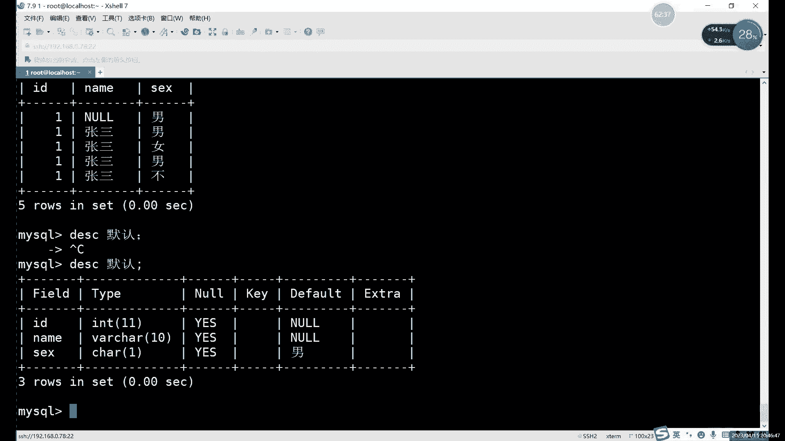

修改它不是数据，它是什么呢，啊他修改的是表格结构，对吧啊，包括这一部分，这一部分这一部表格的这个名称啊，字段名称啊，字段类型啊，约束啊，整个字段啊都可以改。

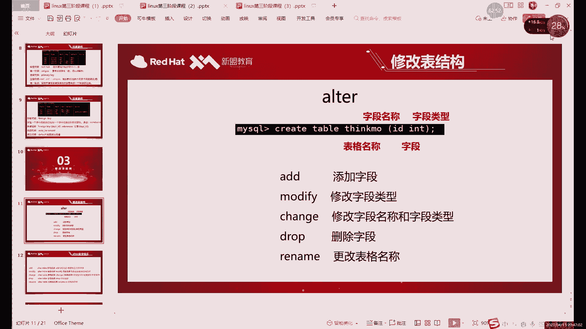

怎么改呢，唉就用alt命令alter加上什么呢，加上具体的这个表格的名字啊，加上具体表格的名字，然后后边继续写什么呢，后面继续写这个，alt加上什么呢，加上这个表格名称，然后再继续写什么。

写我们需要的啊，不能说需要吧，就是嗯需要用的功能吧，因为什么，因为这个alter这里呢挺多的，还有好多种，比如说添加ADD对吧，修改呢modify change，删除呢是job，还有什么呢，还有这。

还有个叫什么来着，rename啊，rem rem单是remage to啊，一共这么多个，这些话都是什么，都是用来哎，就是都是相当于都是我们的一个选项啊，都是选项，比如说首先呢我们先用一下这个添加。

不添加的话就添加剂整个字段啊，啊添加一整个字段，那其实就是什么，就是添加一列，那就创建好表格之后呢，哎我们想要再增加一些其他的数据形成的，可以对吧，那就是添加一列，添加这一类的话。

你看啊id name那就有可以加个年龄对吧，想加什么都可以啊，添加后边直接写这个字段的一个名称，然后呢后边直接跟什么跟数据类型啊，数据类型必必须的啊，就是type这一页就是大家可以看。

其实就是按照这DESC，你跟着写就行啊，添加哎免年龄对吧，年龄后边可以用INT对吧，INT没有什么不用写什么范围啊，什么整数没有什么范围，啊不是说没有范围就是长度啊，整数其实不限制长度。

所以说呢平时我这个写ING的时候，我括号里边什么都不行对吧，我觉得也是在CHARX的时候，或者VX的时候会写一下这种宽度啊，你的这个整数的话就不需要写宽度了，没必要写，也没什么意义，添加一个年龄对吧。

比如说添加一年龄，然后后边如果说要写这个约束的话，其实嗯怎么说呢，你要找约束的话，你就得得从我们之前讲过的六个里面去找，合适的对吧，自责默认行不行呢，那没什么用对吧，Y键行不行呢，你现在没有年龄的组件。

所以说加Y键也没有什么意义，那主键可以吗，或者唯一性可以吗，他其实也不对啊，就放到这里，年龄只能加一个约束对吧，年龄其实我们这里只能加一个约束是什么，就是对空的，大家想加什么，想加其他的其实都不能加。

因为加上一来没什么用，二来可能还会限制我们，可能还会影响到我们的数据的修改插入什么的，所以一定要这个设置约束的时候一定要注意啊，就是一定要设置这个适合我们这一列的约束啊。

你要去想你设置这个约束有没有用啊，没用，那么就不设置了呗，啊没用就不要设置啊，只设置有用的，就像这个飞空对吧，飞空年龄肯定是不能为空的，对不对啊，你什么能年龄，你即使是刚出生对吧。

那你年龄其实也有的写对吧，几个小时几天把自己都能写啊，你不能是写了空的，那那可能就是已经走了对吧，已经走了，那写了空的，那这个确实没没没毛病啊，没毛病啊，其他正常情况下的话。

正常我们年龄都肯定不能为空的，我们不能为空，啊这样的话这个就是添加啊，添加字段，当然添加的话就至少是这两个啊，就是约束可以不行，就是你实在是想不到写什么约束好，你可以不写约束啊，后边也可以去修改啊。

并不是说你加完一次以后就固定了啊，约束什么的呀，日约束什么的，这就是数据类型，什么都可以改的都可以改，这个只是我们的添加命令啊，只是添加命令对我们就加了这么一行，那我们是个非空的，那如果是想修改呢。

唉就用的是修改是有两个AUTUMIN的修改选项。

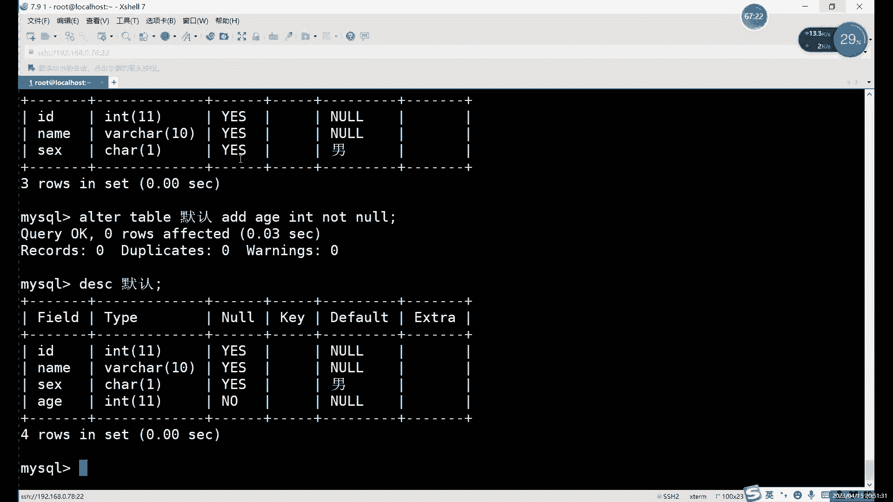

有两个，一个叫MOTIFY，一个是change，Multiple train，这里的话唉他这里是什么呢，这两个有什么区别，都是修改对吧，一个是修改什么呢，一个是修改字段类型，另一个是修改什么。

另一个是修改字段名称和字段类型，你是什么意思呢，其实嗯总体上来说呢，它的功能，呃它的功能比它其实少一点啊，他其实比他功能就少一个就少改名字啊，就是MODEFY不能改个名字，然后趁机的话可以改名字哈。

可以改名字，所以说这种情况下，一般情况就是你改名字的话，你就用change，不改的话用MODEBU啊，这两个你用一下其实都可以啊，哪个都可以，具体用法的话其实就是。

后边呢就是mod y后面加什么加四段名字，然后呢新的改数据类型也行啊，啊改约束条件也可以，如果是change的话，这里就不太一样了，因为涉及到改名字的话，你就要先写什么呢，先写旧的字段名字。

然后呢再写新的字段名字啊，因为你涉及到这个改名字了啊，因为改名字的话就先写旧字，再写新的，写完之后呢，再去写这个数据类型，预设条件，这个可以改60条件和数据类型也可以改啊。

就是你这里的话也可以是注意数据，数据类型也可以修改，当然也可以不改啊，这个是这个随意啊，随意，总体来说，这两个命令的话，就是修改已存在的字段的一个具体的属性啊，修改字段一个具体属性。

比如说呢如果说想改个什么呢，啊，比如说刚才其实我们的表格里面，前面那一列都是什么，其实都用的是默认的对吧，什么字段都没有加啊，我们就可以什么我们就可以写这个，比如说第一列如果想改一个，想加个约束对吧。

I d z live，如果说我们想加约束呢，可以加一个什么，可以加一个组件对吧，那就是在什么呢，那就是在修改类型的时候呢，就是加上这个数据类型，这里呢可以换成什么呢，可以换成数据类型，可以拨动啊。

就是我们修改的话，总之这个修改其实很灵活，就是我们这个M1其实非常灵活，什么意思，就是总体上来说呢，可以只改一个，也可以改两个，也可以改单个，也就是具体要改什么，就是看情况啊，具体看情况。

然后呢这里的话我们先来看一下mobile称职。

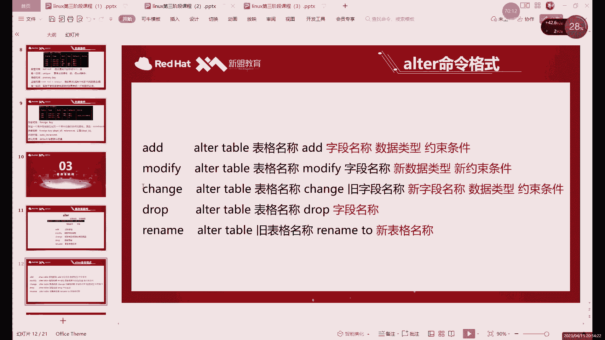

你看MODEWEB啊，自段类型他们都能改，唯一不同的话就涉及到一个名字的问题，就比如说第一类ID如果我们想改的话，就是other table，前面还是一样的默认，然后呢id，modefi id啊。

这就修改，然后后面加什么，后面C写字段名字其实和这个添加一样对吧，看起来就是和天一样足够的，添加的话，一定要添加的是新的字段啊，添加新的字段，然后这里的话要看啊，嗯修改这个，添加一个什么呢。

添加一个INT就不改了吧，id的话，NT这个没必要改，现在的话默认是默认就是主键吧，改个组件还没有主键，对我们的表格里面，primary k对吧，这样就行了，就相当于什么，就是不管你原来有没有。

你加上就完事了对吧，你IDINT这里什么都没有，对我们写个pk，那这样的话就是修改一个字段的一个名字，看啊GRAMMARYKE啊，还不能改，为什么不能改pro mk呢，其实还是有点问题。

我们这个表格有点问题啊，表格有点问题，我们就不用发MK了，为什么不能写PRIMARK呢，还要对云课也不能写，只能写什么，只能写个男同，为什么呢，因为我们以表格里有数据啊，有个零有数据嗯。

大家注意这个修改字段类型的时候呢，如果说你看我们这里有数据，而且数据全是一全是一有这个字段的话，如果这里面已经有重复数据，你就不能写主键，也不能写这个唯一性约束啊，这个的话就是修改的时候需要注意的。

就是你有数据的话，需要就要尊重你的已有数据啊，你不能说我要设置一个唯一啊，但是呢你原有数据都是都是重复的啊，那这这就有点过分了，别看这个有点过分了啊，这个是修改啊，当然刚才添加的话，其实正常的话。

我们一般添加就是接添到最后了对吧，默认添加到最后了，那如果说你想要让这个表格，就是想要让这个，添加到前面怎么办呢，哎呀或者添加到这个，就比如说我想要中间插个队，你看id name，性性别，姓名对吧不对。

这叫性别和年龄，我想比如说想要写一个，想写个生日对吧，alter table默认ADD对吧，添加到添加一个，比如说生日，生日的话就反正就是日期吧，因为那个日期时间型比较好一点，数值和数据。

数值和数字都不好，就用data，daytime其实没必要就对吧，因为，因time时间短的日期，出生日期，你怎么可能你只知道你准确出了内心呢，这个不太现实啊，这个不太行，就这就这啊，就这来添加这么一个。

然后呢我们可以添加在哪呢，AFAFTER添加在sex中，这样的话就是重新插队啊，我们是允许插队的，就是正常添加的话就添加到最后了，如果想插队的话，添加到指定位置呢啊用什么，用这个这个准确来说应该叫。

介词对吧，你英文里的这个介词啊，after是什么意思呢，after在什么之后的意思嘛对吧，所以说呢这个如果说我们刚才添加的birth对吧，生日，添加生日的话，这个就是啊，当然这里其实是两个两个两个单词。

有after呢，自然也就有什么就有before，啊有offer也有比before after的话，就是你添加到某个字段之后，我们刚才写的是after sex对吧，那添加到之前的话就是啊。

比如说你想要听到第一个心里的那个是b before，什么比before i d啊，这个时候添加到指定位置，他不能说写这个某一列的某一列，这个列没有这个列的列数，就这么一说，它就是什么。

就是用before after来锁定一个位置，用一个就行了，因为他这个是相当于是嗯在哪呢，在哪个之后的话，就是跟着他后边，在哪个之前呢，就是跟他放在它前边，所以说如果说啊出现了一些像这个。

比如说你想让某一列放在中间的话，当你用before after都行啊，你随便吧，用哪个都可以，那你就注意这个就行啊，注意这个就行，before after before的话也一样啊，就一个一个是在之前。

一个人在之后的意思好吧，那这个就是添加的时候啊，就添加来说，如果你需要指定列的话，before after对吧，然后接下来的话我们来看下一个change的话，这个，change这个这个其实怎么说呢。

这是N对一啊，改变，改变的话，我看a six，如果要改名字的话，就是什么，就是，这单词应该没问题吧，Birthday，哎其实无所谓啊，这个单词直接写个错单词都没事，这里先每一列的名字，你写的不行。

写中文都可以对吧，写中文都可以对吧，改个名字的话，这样改就行了啊，这样改就可以了，然后后边呢给我看名字，我们写的是date对吧啊写的是D啊，如果只是只改名字，这样行不行呢，啊我们这样的话对吧。

你现在只是改名字，但是呢他报错了对吧，大宝座，哦after alter啊，Alt e r，Arma，但是alter他也没要也报错，为什么alter也报错呢，啊因为我后面没有加什么的。

没有加这个具体的约束以及什么呢，以及这个数据类型就是我们正常这个chain命令，他不是说你改个名字就行了，你后边如果说只是改名字的话，相当于这个字段在他理解上来说呢，因为CHEN他才能既改名字又改什么。

又改这个数据类型又改约束它的功能比较多，所以说呢你这里就得写全啊，只改名字的话，你后边数据类型都不要了，那就相当于是这个表格是没有数据，就是这一类没有数据类型的，那肯定不行啊，所以说呢这里他就会报错。

正常的话，后边我们当然也可以再加约束啊，也可以加约束，当然这没什date，没什么好加的约束啊。

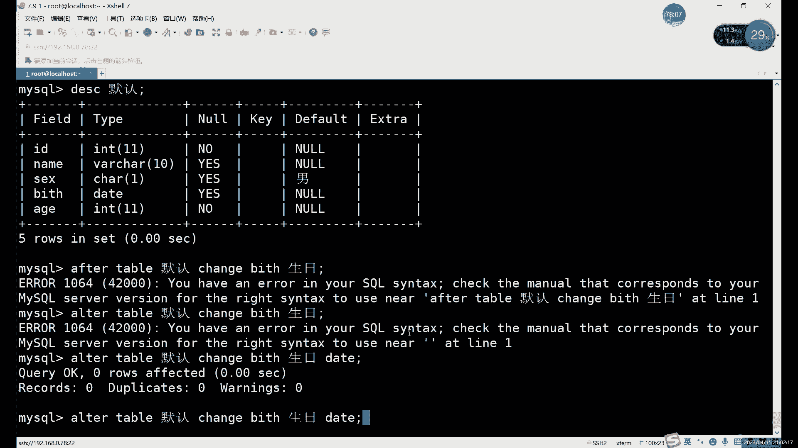

对吧它就变成生日了啊，要注意啊，就是change改的时候不能只改名字啊，不能只改名字后边的这个。

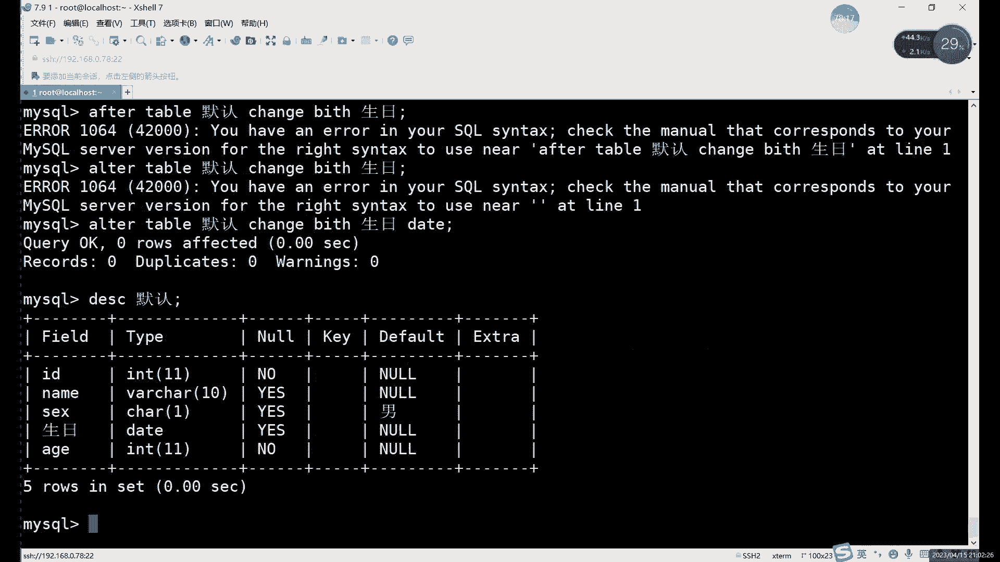

啊是吧，后面的这个约束类型和数据类型，如果要改的话也行，可以跟着一起改，不改的话，就要把默认的原来的抄下来，那就把原来默认的抄下来就行啊，这个是需要注意的，然后后面的job就删除啊。

就是删除我们表格这个名称不是标准问题，删除我们这个字段名称啊，删除字段名称就是密码，哪一个字段不想要了，你就照我这个删就行啊，用法的话和前面一样啊，大家可以可以尝试一下。

rename的话就是改什么改表格名称，这之前我们改过了对吧，用的是reem to啊，这改了个名字的话，那就写个名字就行了，后边不用，后边不用加字，写字段啊，直接表个名字就可以啊。

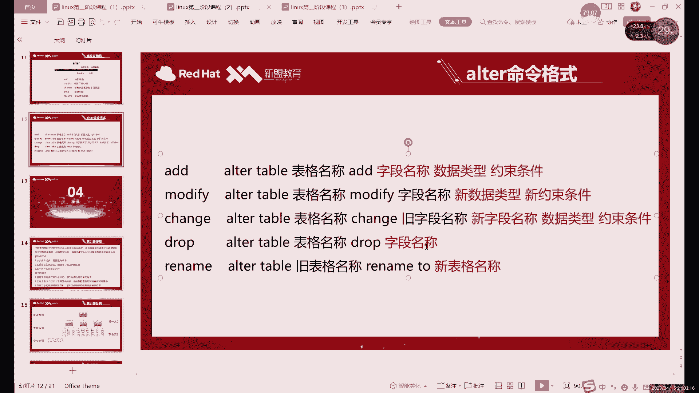

包括job也一样，你删除的话只写名字就行，比如说你我们把这个把A子删了吧对吧，有生日了，要A纸干什么呢对吧，Alter table，默认job加什么呢，加上AJA啊，很方便，删的话真的是痛快。

删除命令永远是最方便，不是最方便最痛快的命令啊，就是不需要加一些额外的东西嘛，啊不需要加额外的东西，这个的话就是我们的alter修改名修改。

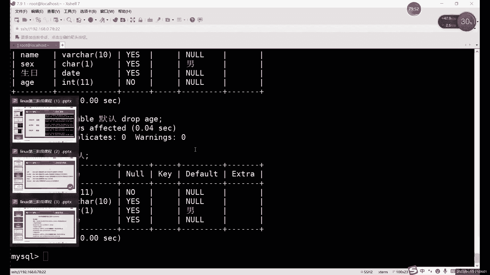

总体上来说，就是改一下表格的格式啊，改格式的话，一般其实就是哎主要一般就是改约束吧，改改约束，改数据类型，名字其实很少动的，设置好之后一般就很少用，一般就是可能是啊，你比如说某一列的数据。

他可能一开始呢限这个宽度为十就可以了啊，但是后来发现可能会有一些十一十二宽度的，一些数据想插入它就报错了啊，那你可以适当调整一些宽度是吧，调整数据类型的你的一个宽度啊，以及约束的话。

唉可能一开始还正常啊，一开始还怎么说呢，就是那个一些有唯一性的呀对吧，有一些需要设置唯一性的，一开始忘记设置的话，也可以用这AUTOM去改，唉总之的话其实就是修改作用，就是改一下这个约束类型啊。

啊约束条件啊，数据类型这些东西啊，这就alt命的一个主要的功能啊，主要作用当然还包括两个改名字啊，改名字改名字这个其实已经是四要的东西啊，主要还是什么，主要还是这个数据类型，约束条件。

这就是AUTUMMY，用法的话就是这五个选项啊，五个选项无选项怎么说呢，就前四个用法都是一样的对吧，当然其实第五也差不多，就是第五个是改表格名称的，就是relime to稍微特殊一点啊，多了个to。

啊这个的话就是alter命令的一个用法啊，接下来的话我们就，再来介绍一个MYSQL里面一个比较重要的内容，我们前面是讲了个约束对吧，约束它是用来限制什么的，限制我们表格当中的数据是否能够插入啊对吧。

让我们让它重复呀，以及限制线默认的默认填充的数据对吧，那这个是约束条件的一个约束，应该叫约束的作用啊，默认约束的作用，这几个默认这不是默认约束吧，就是这几个约束的作用，那有约束，那自然呢就是。

其实下面的跟约束呢主要是和约束有点关系啊，就下面介绍的内容啊，和约束是有点关系的，是什么呢，它叫索引啊，所以的话合约有一部分约束是有关系的，这个其实就提到什么。

就提到我们最开始最开始介绍MYSQL数据库啊，或者说介绍数据库的时候就不仅仅是MYSQL了，就是我们在介绍数据库的时候呢，就提到了这个东西，它叫什么，它叫索引，然后当时我们没有具体说索引对吧。

我们当时说的是他查询速度很快，还有数据库的查询某些数据啊，查询文件啊，他数据很速度很快，为什么速度很快呢，啊就是因为他的这个索引索引是什么玩意儿呢，啊索引的话，这个其实所以这个单词index啊。

所以单词叫index，其实类似于什么呢，类似于我们的目录，对吧，你正常你在平时嗯，当然现在其实很少，十几年前吧，大概十几年前的时候，对手机还没有那么普遍的时候，而且尤其是如果是大家还在上，如果10年前。

如果大家还在上学的话，字典这个东西大家应该用的很多对吧，那字典这个东西，我们平时找的时候，如果是一个不认识的汉字，你找起来一般速度会比较慢一些，对吧啊，速度会慢一些，为什么会慢一些呢。

因为我们需要花时间去找什么呢，去找它的目录所在的位置，啊当然了，找到位置之后呢，哎就在你的目录里面，一旦找到了这个东西啊，找到了这个汉字的话，那你翻到翻字连起来翻译就比较快了对吧，如果说你不找不找目录。

而是一页一页的去翻这个，字典的话是不是数据很慢，对吧，那这个的过程其实就是什么呢，就是我们的文件系统之前，我之前我不是演示过吗对吧，文件系统里面你用这个搜索功能搜东西的时候，它其实就类似于什么呢。

它其实就是类似于我们翻字典，一页一页去翻对吧，那如果说有了目录，当然放在数据库里面，我们其实用的是什么用的索引啊，就类似于目录的东西，有了目录之后呢，我们通过目录去找对吧，效率速度不是不是就会很高啊。

速度就会很快，因为这个就是为什么啊，这个数据库速度快的原因啊，数据库比这个索引数据快的原因，而不是索引，就是数据库比这个文件系统，对比文件系统这个速度快的一个原因就是索引，索引的话它是一种特殊通过录啊。

他你可以理解成目录，但是它和目录是有一点区别的啊，他目是有点区别的，但如果说哎怎么说呢，如果是后边说的，大家不太好理解的话，其实你就把它看成目录就行啊，你就叫它中，你就可以叫它目录。

所以你的一个特点的话，其实就是什么，就是加快查询速度啊，提高我们查询的效率，总体上来说呢，其实不管你用什么，你用这些insert命令也好啊，用Upset命令也好啊。

尤其是用这update delete命令啊，这些查询啊，这些更改的命令，修更改修改的命令，这些命令呢其实都是会用到什么，都会都是会用到查询这一步的，这边就是我们所谓的select查询。

然后到了查询这一步，啊你不管说你删除也好啊，更新也好啊对吧，都用到查询，那用到了查询，那自然，正常的话，我们一般是在数据库里面查找数据的话，如果说没有索引的话，那也并不是所有情况下都有索引。

大家注意不是所有情况下都有索引，所以这个东西它是怎么来的呢，或者说它是怎么出现的呢，啊或者说怎么设置呢，其实我们前面已经用过索引啊，只是没跟大家说，正常的话其实一个普通的表格啊。

但是我们用索引肯定是在表格里面用啊，跟数据库没啥关系，就是在表格里面用这个索引啊，或者用这个目录，其实呢是在什么时候用过呢，是在，约束条件的时候就用过哪个约束条件呢，啊就是这个，唯一性约束。

这里有主键约束，这里也有外键约束，也有。

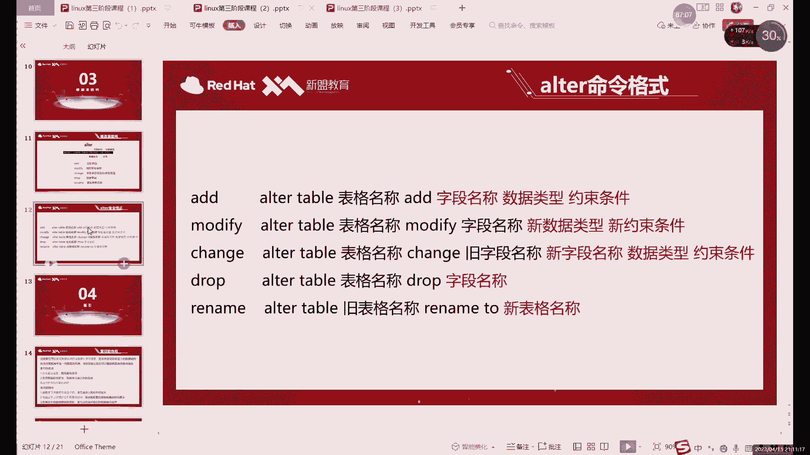

当然我们没有具体去查询，我们只是设置这几个约束对吧，查询的时候呢，其实会用到索引，具体是哪一部分，就是那个will，之前我们update举例子的时候用过这个VR对吧，flag的时候其实也用过VR是吧。

就这三个命令插入无所谓，插入，其实一点插入它不需要用到索引，因为插入的话它是插入到数，就是整个表格的最后啊，插入插入表格表到最后，所以说他和索引无关啊。

正常的话我们就是什么D的update和select都会用到。

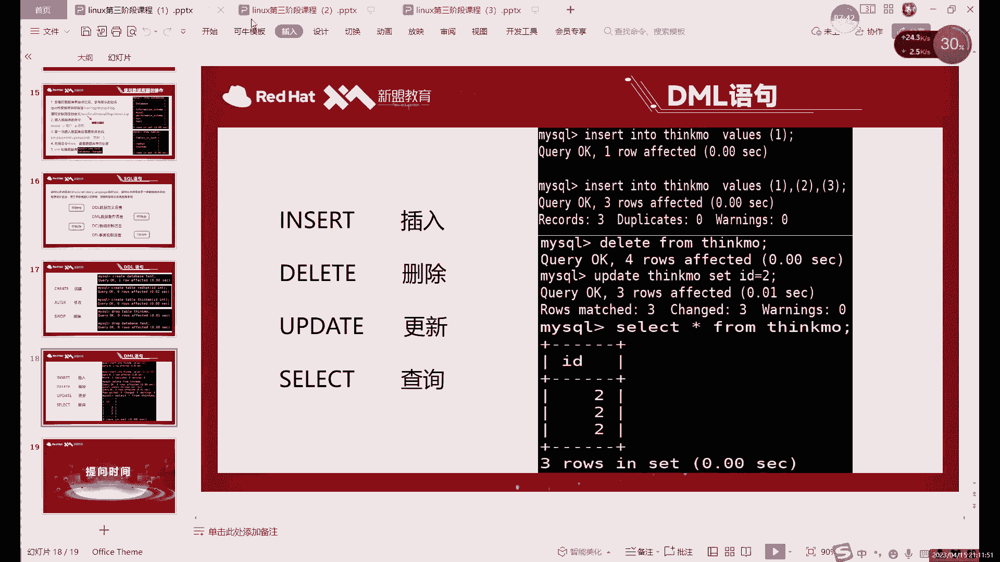

什么都会用到查询对吧，查询里面有一个条件，他叫威尔，但这个where呢它是限制条件对吧，那限制条件的时候呢，我们在查找的时候就会用到什么，会用到这个索引，啊只要用到，所以呢的话它其实这个速度会很快啊。

速度很快，当然如果说你没直接不加where的话，其实也无所谓啊，它就是显示什么，显示所有的数据了啊，显示的所有数据了，只要用到了where，而且呢同时呢还要有什么，还要有这个，唯一性约束。

主键约束和外键约束这三种，有了这三个家伙呢啊，你在用VR的时候呢，就相当于是自带索引的啊，也就是说呢，所以它并不是说并不是数据库自带的，而是什么，而是我们自己去创建的啊，其实我们前面已经创建过索引。

只不过没有跟大家说而已，因为这个索引的概念的话，他和约束其实是两两种概念吧，两种概念约束的话，它的作用是限制我们的数据，而索引呢是用来提高我们查询速度，唉提高查询速度。

就比如说我们这里的这个整体上来说呢，这个索引这个目录啊，它长什么样，它就长这个样子啊，它是长这个样子，它其实和什么，它和这个我们正常用字典里面的索引一样嘛，其实呃和字典里目录一样吧，其实差不太多对吧。

他也是什么，他也是，我们这个其实就是什么，这个就是，就是你说的这个数啊，B tra，正常的查询如果说没有查询的话，它就是便利啊，就是一个去找啊，就是一个去找，如果有了什么，有了索引之后呢。

MYSQL里面的索引类型是哪个的啊，索引类型就是这个啊。

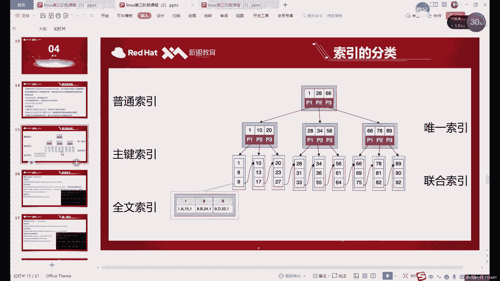

就这个你先给咱先给大家看一下吧，MYSQL里面的所有类型，就是这个如果要查看索引的话，就是show index啊，show index就可以，其实我们之前已经创建过索引，尤其是哪些呢。

尤其是这几个表里面都有索引，我们看主电表，啊所以类型的话就是B税啊，没错就是B数啊，主页的表格里面其实我已经创建过索引了，只不过是啊，所以名字的话自然也是primary ke。

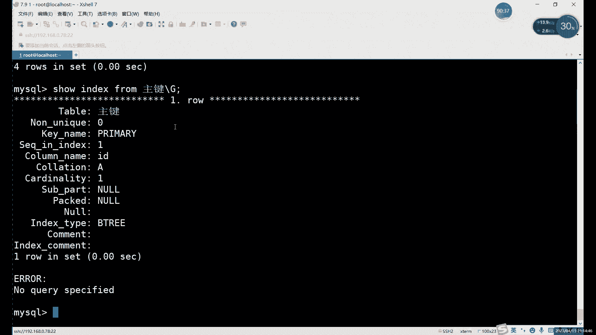

为什么说之前之前我们没有用过创建索引命令，为什么还有啊，这个就是索引和约束，这里有交集，有什么交集，就是唯一性约束，唯一性应该叫唯一性约束和主键约束，以及外键约束，它创建的时候呢会同时创建索引啊。

是其实是一个东西，就是你创建的时候呢，你创建这几个约束的时候，自然也会创建你的索引，创建索引的时候自然也有约束，因为我刚才说了，这个约束和索引呢它是两种概念，它是两种概念，约束的话只是限制限制数据。

限制数据用的，而索引呢是用来查询数据用的，所以说他俩并不冲突啊，所以说创建这个组件啊，唯一性和通过索引的时候呢，它也会创建约束，啊当然普通索引这里不一定啊，普通索引这里如果你是外键索引的话。

如果是外键约束的话，当然会有约束啊，唉准确来说应该是创建外键约束的时候，会创建这么一个普通索引啊，就是我看给大家看一下图片吧，在这里啊一个普通的索引呢，它的K这里写的是MUL是吧。

这就是为什么我刚才不知道大家还记不记得，这个我讲外键的时候，我给大家看的时候，K他也写了两个月，也是外界约束的话，在创建的时候会自动加一个普通的索引啊，当然了，普通索引那并不是并不一定是外界约束啊。

啊它并不一定是外界约束，啊总之呢前三种嘛，其实我们前面已经见过了对吧，MULUNIUNICO以及什么，以及primary，他们三个呢它既有约束的功能呢，又有索引的功能，你就什么意思呢，就是。

主键约束它自带索引啊，唯一性约束也是自带索引的，包括外线约束也自带索引啊，就这个意思就是索隐藏约束它不冲突，它不是一个类型，它本来就不是一个类型的东西，但是呢有几个特殊的约束啊。

就是这个主键外键和唯一性约束，他们这三个约束比较特殊啊，他们在创建的时候会自带，这个会自带这个普通的会自带一个索引，索引的作用呢，其实就是目录啊，就是我们这棵树这个数的话。

就是就是我们的这个索引的这个形状啊，索引就长这样，那如果是其他的一些普通的这个，字段啊，或者说没有这些索引的字段的话，它查询速率会比较低啊，他除查询速度会比较低，所以说呢这个约束啊，不管是约束也好啊。

索引也好呀，主要就是说约束吧，啊大家这个在创建表格的时候呢，一定要就是根据什么呢，根据这个表格的特点啊，或者说必须根据这个尤其是根据字段的特点吧，尽量去多去创建什么，多去创建这个唯一性约束啊。

当然也当然了，怎么说呢，也不可能不可能特别多，因为什么呢啊一呢就是什么呢，一呢就是索引呢不能太多啊，分析不能太多，主要我们是针对于什么，主要还是最好是针对于关键的部分，就比如说这个主键索引。

也就其实也就可以可以叫它主键约束啊，组件约束的话，当然一个表格当中刚才说了，只能有一个对吧，只能有一个，所以说这个主线索引你选择的时候呢，就需要注意，啊或者主要约束选择的时候需要注意啊，就哪一列呢。

我们用来查询做的最频繁啊，这哪一页的查询最频繁的，就给他做个索引啊，查询不平凡的力量，其实可以不需要做索引，因为索引的话它能加快查询速度，但是呢索引多了，它也会占用很多空间啊，他也会算占用很多空间。

所以索引这个东西呢，它并不是说多用多用肯定就好啊，不是这样的，就是其它主要作用就是查询，就是提高查询速度。

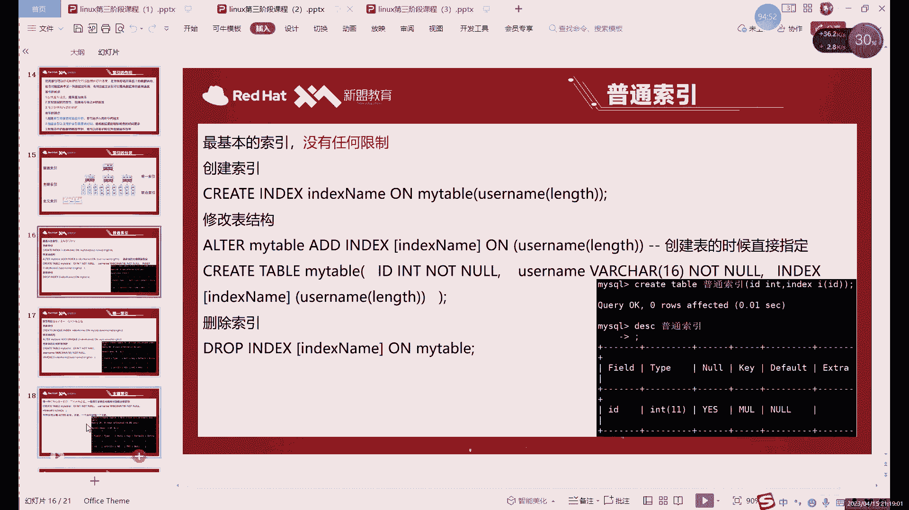

但是不能太多，所以最好的方式就是就是，哪一列经常用于查询啊，就用哪一列就行，就比如说我们正常查询的时候呢，用的是什么命令，就select对吧，用select命令去查询。

你select from加上表格名称啊，比如我们查询过程的默认表格吧，你这么去查的话，这样会用到这个索引吗，他就是他其实不会用的啊，它是并不会利用到我们，所以，啊性能最优的是哪个呢，性能最好的是主变啊。

尾翼也唯一，也没有主见好啊，主键的话是性能最好的，因为什么，因为它不仅为一，而且还有个非空对吧，它是两个嘛，唯一且非空嘛，这里的话这个比如我们在正常看的话，其实这样执行命令的话，他其实用不到索引啊。

这样的话其实没用到索引，因为这种的话其实嗯我们正常看的话对吧，我们这个命令是干什么用的，它就是查看我们这个默认表格的所有内容，需要索引吗，它其实不需要索引，为什么，因为我们这个表格内容。

整个它就是一个整体对吧，他就是一个整体，那么这正常看那个就就错了，不要读号啊对吧，这个其实用不到索引，怎么看能不能用到索引呢，我们有个命令啊，就是就是查看我们这个查询的一个信息吧，啊查一查询信息的命令。

你就比如说你在查询的时候啊，这样看啊，正常呢这样是我们看一个表格对吧，如果说你想看看这个表这个命用不用到索引，怎么看呢，就是前面加个x plan x链的话，不是X就不能这么用EXP哦，对我就写错了。

我就说嘛怎么念都不对，x plan就是这个这个就用来查看是否用到索引，要是字体还是有点大，我不要紧张不要紧，我们看哪个呢，看type这个啊，就plan后边加上我们这个查询的语句。

后边我们里面会有一个type，这一列type是什么呢，type就是查询的类型啊，他不会查询类型，弹性类型，这里是个二对吧，alt代表什么呢，二它代表的是这个所有啊，二代表就是所有。

所有的意思其实就是什么就是没用什么没用，这个，叫什么没有这个索引啊，没有索引这种的话，其实它的效率是最低的啊，效率是最低的，只要他不用投影的效率比较低，但是呢我们其实这个还好啊。

还好就是因为表格也比较小啊，不太影响正常的话，如果说你想要什么，你想要这个，如果表格的数量很大的情况下呢，如果你这里type是一个二的话，他查询是查查询起来速度就会非常慢啊。

正常的话呢我们看一个能用到索引的方法吧，怎么能用索引呢，就是在查询的时候用where就行，where r的话是我们查询条件对吧，我们之前说过啊，只要你用到了where，那他在查询的时候呢，就会去找什么。

会找我们的索引啊，或者我们索引去帮忙去查询啊，查找，那这个where的话，比如说我们这里YL什么呢，嗯我们哪一个是有建，有点不太强，默认这个表格不太好，为什么呢，默认这表格上来说，ID等于一吧对吧。

ID等于一，这个就是命令，就是用来查询什么的，用来查询id等于一的，这个这一列啊，还有I等于DE的这个数据啊，不是这一列还是等于A等于E的行当，这样查出来的话，其实和之前没什么区别啊，为什么没区别呢。

因为这个，这样查出来的话其实对吧，所有都是一，当然加上V之后，为什么这里还是二呢，就因为我没有什么没有索引啊，因为这个哦我突然发现这个默认这个表格啊，我们这里是没有索引的，所以他长什么样呢。

它其实就可以在哪在K这里看的啊，在K这里是可以是可以看到你是否为索引的，K这里的MULUNIPRI这几种对吧，我们之前是讲的是约束对吧，有主键约束，外键约束和唯一性约束，它还有一个作用。

就是只要你在K这里，你只要你的约束呢是在K这里的，和他们三个约束没关系啊，他们三个约束没有所隐瞒，大家注意，就default自增和飞空，他俩他们是没有索引的，是K这三个约束他们可以有。

他们是默认是在索引，但我们这里的话，我可以换一个表格吧，换一个表格，主键吧主键这个肯定是没问题的，组件表格里的这个I等于一等，我们这么长啊，路上啊，有数据有数据可以，你前面加上X等XPLA。

哎他这就变了哎不一样，那这个时候呢这个CONST，这个呢就他这个代表的是什么呢，它代表的就是我们这个，他其实可以说整中管啊，他可以说是整数，这个其实是最快的一个索引啊，常数对对不是不是整数啊。

常数对是常数常数，这里这个的话就是什么，这个就是代表是什么呢，这个代表就是索引哎，如果不加这个呢啊，不加这个V的话，其实我们再看一看一个效果，就是如果不加where的话，就直接看这个组件表格成型的对吧。

我们这个表格里面有有一个组件，但是呢你如果说不加V的话，我们这里有哪几个来着，好name和id对吧，Name id，你看我们两个这次的话，第一次我们是用where id去查的啊，他是有索引的。

还是用到了索引，而我们第二次如果说把VRID去了，就直接看这表格就没有啊，也就是什么呢，就是什么时候能用到索引呢，就是你在查询的时候，是否涉及到了这个有索引的这一列啊，只要是有索引的这一列的话。

只要你在查的时候有索引的这一列呢，就可以什么呢，他就会用到索引，当然如果说你换其他列，比如说你where r name等于什么呢，name等于什么来着啊，张三对吧，这样我们来看一下。

大家可以看到name等于装在这里没有，你看内容等于站在这里是没有的，为什么没有呢，因为张三这一列呢，它是一个它里面没有什么约束啊，也没有什么这个这个溶液这类应该叫索引啊，没有那几个特殊的约束。

也自然就没有索引，那这种情况下的话，我们在查询的时候就不会用到什么，就会用到索引啊，他这个速度就会慢一些，当然我们当然我们这里是感觉不到的，因为它本来也就只有一点数据而已啊，本来就只有一行数据。

所以我们现在当然是感觉不到，但是呢这个其实是非常怎么说呢，这个，在你的这个数据量或者表格，比较大的情况下的话。

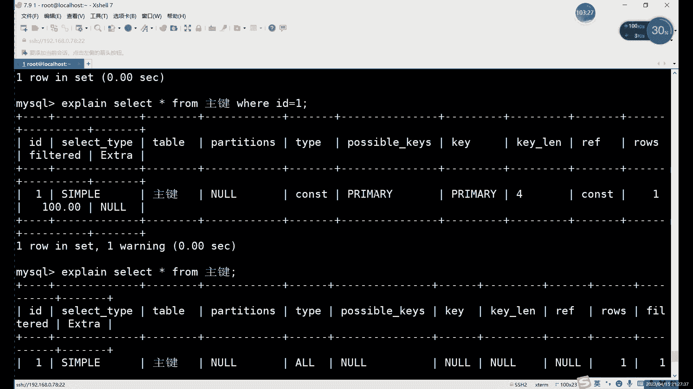

如果说没有索引的话，他参与起来那会确实会浪费一点时间啊。

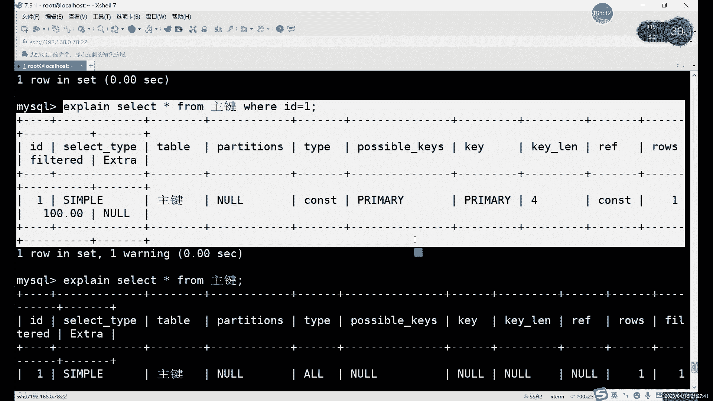

稍微浪费一点时间，所以说呢就是这个索引呢，一呢就是每个表格至少都要创建一个索引对吧，哪个哪一列作为索引最好呢，就是或者说哪一列作为主键最好办，因为你创建组件的时候，就自动就给你带了个索引啊。

一个主键就自动带索引，所以说哪一个作为组件最好呢，就是你去找什么，找能唯一的啊，能唯一的就行，飞不飞弓，其实无所谓啊，就是非攻的话还相当于就强制背弓了吗，啊这个一定要找一个，就是这一列一定是唯一的啊。

姓名这些就不要想了对吧，年龄这些，因为很多数据里边呢他都会可能会有重复对吧，很多数据都有可能会重复，那什么不重什么不重复呢，id id号编号这种东西呢肯定是不会重复的，所以说呢这种东西其实是最好的。

作为组件的东西啊，做好作为主键，啊这个的话就是这个索引的查询的时候，怎么能看到他用是否用到索引呢，就是x plan这个命令对面也需要大家需要记一下，因为这个的话就是啊。

你如果说想要看一下你的索引有没有生效的话，用这个给你看一下，all的话，二也不能说完全没有生效了，就是二其实是，不管它声明称叫二神，永远是查询效率最低的啊，它的查询效率是最低的。

因为二这里的话就相当于是用了什么的啊，其实从我们查询命令上来看就能看出来对吧，第一次on的话，我们是什么，就是直接看整个表格上没有on，这个倒还好，没有什么太大影响。

但第二次呢这个如果说你用内部去查看的话，唉如果用name去查看，Name，这里的话其实其实相当于什么呢，就是，没有我没有设置索引，也没有设置约束啊，它就是相当于没有自带任何东西啊，没有带任何约束。

所以说差距来就比较慢，报的话其实就是一般显示出二的话，它都是扫描什么，扫描整个表，二的话一般就是扫描整个表，这小表无所谓，但是代表的话，其实这个这种肯定是最不好的啊，这种肯定最不好的。

然后CONST的话，这是什么，它是，主键和唯一性啊，主键和唯一性呢，会如果是通过主键索引和唯一性索引的话，会查出来这个啊会查出来这种，啊就是我们刚才看到的那个啊，就是主键或者唯一性索引的时候。

就会出现这种通过这种查询的话，它是速度是最快的啊，速度是最快的。

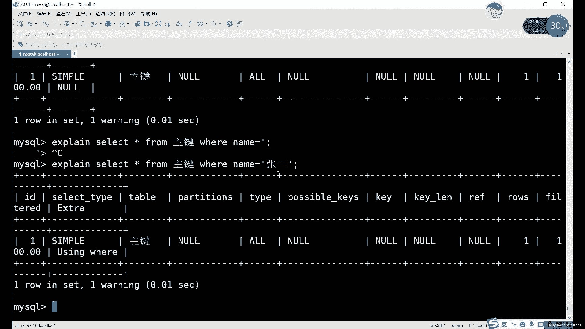

然后的话创建索引的话，命令呢其实我们一会儿来说一下啊，一会儿来说一下这些命令点名的话，其实用到什么用create或者说用altering都行。

quit和alter就可以，quit就是创建索引的意思，alter的话就是修改表结构了，alter修改表结构啊，create就是创建一个索引过来，就这两种用法啊，删除的话还是job，这个没什么区别。

查看呢查看用数啊，因为它其实不属于数据，其实在数据库里面就不属于数据的东西，查看就用show，那是数据呢，用什么用select啊，你记住这两个查看命令就行了，就是就用用在不同的场景上面啊。

select是用来查数据的，数据用来查这个除了数据以外其他东西啊，一些设置啊，啊包括这个索引索引也是用我们用show来看，接下来的话我们来具体先来看一下，创建一个普通索引吧，我们先来创建普通索引。

因为这个普通索引的话，他没有任何什么，他没有任何约束，啊大家注意啊，就是普通索引呢，我们是没有任何约束的，如果说，啊你想要让一列如果说有新，比如说有一列吧，有一列数据呢啊。

他虽然说哎不太适合设置一些这个唯一性，唯一性的约束啊，也不适合设置主键约束，那这种情况下呢，我们还是需要经常用能用到它来进行查询，那这种情况下的话，还是要给他个索引的啊，不能设置约束，但是要有索引。

那怎么办呢，那就设置一个普通约束app，普通索引啊，不用总你不用，总体就是用在哪，就是用在这个啊，不适合设置约束的情况下，但是呢还是要有索引啊，因为他要经常用来查询的话，需要有需要有索引，有索引的话。

那就需要什么呢，需要这个只能用普通索引啊，普通索引呢创建，首先第一种的话就是create index，唉，创建一个索引就在哪呢，在某个表格当中，然后后面加上什么。

