# 0基础小白怎么入门Linux运维？看这套，Linux运维全套培训课程，保姆级教学视频 - P73：中级运维-10.SELECT单表查询，嵌套查询-上 - 小方脸不方- - BV138411B7p5

好我们本节课的话就继续讲这个select查询啊，select查询，上节课的话，最后我们讲到了这个比较符对吧，比较符这个位置，这个的话主要是比较什么比较数值对吧，比较竖直字符呢。

我们主要用等于号和不等于号就行了，其他的用的少啊，字符主要是等于号，就是指定某一个某一列啊，是某一个值的时候啊，这样去限制条件啊，这样会用到字符，其他的其他符号的话更多的是用数字啊。

也就是我们的整数小数什么的，然后下一个的话我们讲了van的指定范围啊，这个范围也一样，它呢其实实质上就是大于等于某一个值，小于等于某一个值，这个就是between and这一用法，然后呢下面这个啊。

下面这个还没有说对吧，上节课我们最后就说到了这个叫范围对吧，指定范围，然后范围比较类似的一个呢，就是我们今天啊第一个要说的它是叫集合，那这个集合是什么意思呢，啊它和范围有什么区别呢，啊范围的话它是什么。

它主要是比较比较一个数值啊，比如说大于等于某个数值，小于等于某个数值来集合的话，集合这里的话它其实是是什么呢，就是包括某些值啊，包括某些值，那什么具体什么叫集合呢。

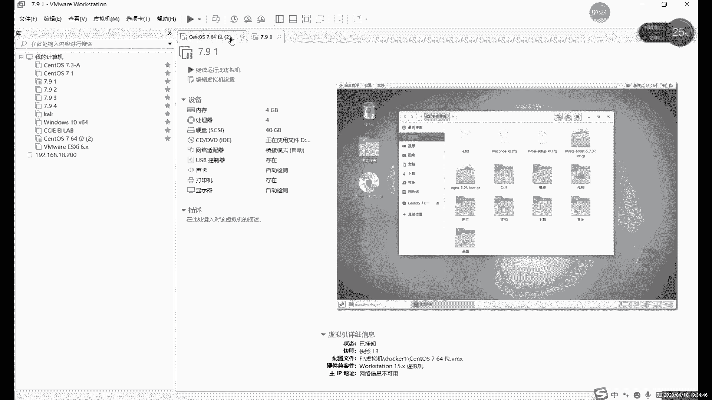

其实就简单来说其实就是一组数据，那集合简单来说就是一组数据。

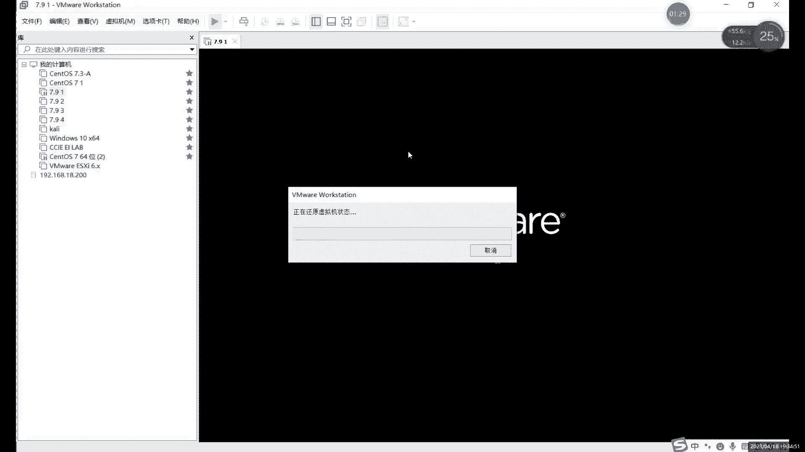

就比如说啊我这里先开一下。

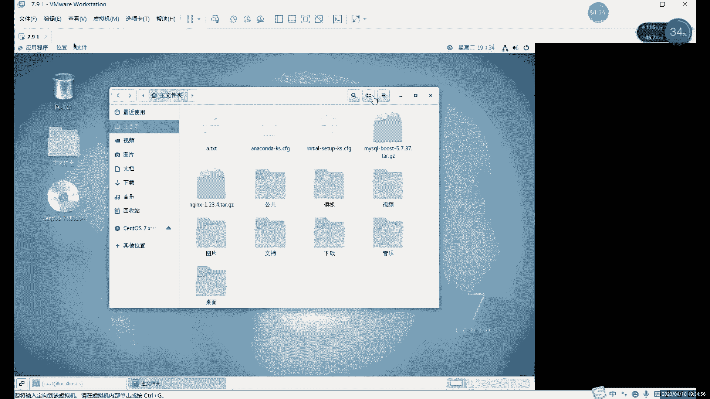

连一下这个虚拟机啊，连虚拟机，0。78啊，0。78的IP7正常的一个集合的话，其实就是什么呢，就是你看我们的范围的话。

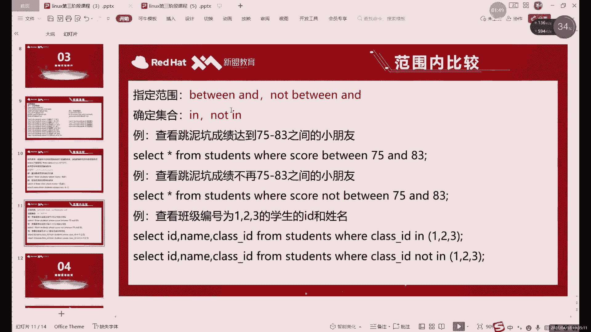

其实比如说你从60~80对吧，那集合能不能表示60~80呢，其实也可以，那具体怎么表示呢，它其实就是60，然后六十一六十二，63一直写到80，那这种的话就叫什么，这种叫集合啊。

这个就是集合和范围的一个区别，范围的话，它相当于是你只需要写一个头和尾唉，他就能把我们这个整个的所有的内容，都包括进来，就比如说啊我们先进入到这个数据库里边啊，我们来看一下这个集合和范围的一个区别。

我们切换到我们自己的库当中啊，看一下这两个表格应该还在应该没有删啊，啊students和class啊，主要是用students更多一些，students的话，我们首先来看什么呢，如果是结合的话。

SELECT啊，我们先来看一下我目前的所有数据，对吧啊我们有这么多数据啊，我们就还是拿成绩来说啊，还是拿成绩来说啊，就拿成绩来个这个来对比，因为字符的话他不能用什么，他不能用那个范围哎。

就是不between and的这个用法的话，字符它不能用，所以说呢我们就拿直接拿数值来对比一下，字符和就是范围和结合好吧，你看啊B推荐的话，其实就是我们之前限制一个范围，不是上节课。

是用的是60~80的成绩对吧，60~80的同学的成绩，那他那他会给我们提取出来的，其实就是什么，就80对吧，六十七十五哎，正好就这三个，其实对吧，正好就是三个唉，这个就是60~80。

我们只需要写一个什么呢，只需要写一个，我们select吧，我们写一下吧，select from students where啊，我们限制条件先写什么，先写我们字段的名字，然后呢写我们的这个关键词。

between什么什么and对吧，这里的这个范围的话，我们就60~80吧，如果是60~80的话，大家可以看到啊，正好就斜置，正好是1236，正好123啊，这种话是范围，只要写头和尾啊。

它相当于是大于等于60，小于等于80，那集合就是将这些全部都列出来，什么意思呢，哎如果说我们想要看到这个这种，就是想要看到这种结果啊，用范围的话，这种很方便对吧，60~80，那如果用集合怎么写呢。

selecting from students啊，我们这次用集合，我们还是显示出第三个结果啊，就用什么就用in啊，in具体怎么用呢啊集合的话就是用in啊，这个是范围between an的关键词。

in的话就是集合，那集合具体怎么用它呢，其实就是包括什么，包括一组东西，一组一组数字，这一组的话包括什么呢，包括这个哎，就比如说这里的话，这里举例的话，用123举例啊，如果说啊我们想要看到什么。

看到这个结果，我们用集合怎么去写呢，那就这样至少要写成什么，至少要写成，然后我们六十七十五八十唉，就写成这样啊，这样结果还是一样的对吧，还是一样的，那如果再写的多一点呢，啊再写个90哎。

他就能把我们是90同学给加进来，也就是什么，也就是集合的话，他和范围呢啊它其实不太一样，范围的话其实就是这一段范围内的，所有都拿出来，而集合就是什么，就是在只有在这个括号里面的啊，之后呢，我们用in。

然后加上一个括号来表示，只有在括号里边呢，我们才会什么呢啊才会去查找，就比如说呢我们找60对吧，唉找个七十五八十什么的，找90的话，我们就额外又加进来两位90的同学啊，这就是集合和范围的区别啊。

这个范围区别，这里的话我们是用什么用数值来对比啊，或者说用整数来对比吧，啊用的是整数来对比，对不对啊，但其实呢硬的话它不仅仅能用于整数，还能用于什么呢，还能用于字符，你看between and。

这里因为有大于等于小于等于的原因，所以说字符呢不能用，那如果说我们想要哎批量的获取一些信息的话，那这个如果不能用范围，其实确实很不方便对吧，但是还好哎我们还有一种用法，就是叫这个集合啊。

这个集合呢就是主要用来帮助我，帮助我们的字符哎，有多个想要获取多个字符的信息啊，就比如说想要这里的话，我们就是这个表格，我们就想要获取什么，可以获取多个同学的信息对吧，唉多个同学的信息我们就怎么写呢。

我们就换成什么，这里可以换成什么，换成name啊，Name in，然后括号里面加上具体的一个集合，就比如说呢，我们想要看前三名同学的一个成绩啊，用name怎么看呢啊或者用name加集合怎么看呢。

我们就可以怎么写呢，select唉，总之集合的话，其实就是将我们括号里面的所有的数据啊，全部都查询一遍啊，这个就是集合的用法啊，比如说如果换成name的话，那我们就只能写什么，只能写名字了对吧。

只能写名字了，哎比如说我们随便把前三位同学的名字，写在这里啊，不过大家要注意啊，一定要用什么用这个英文啊，用英文，啊这个的话就是什么，就是前三位同学的成绩对吧，也是一样的对吧，这个就是什么。

这个就是集合的用法，和B站呢类似对吧，都是选相当于选一个范围，但是呢集合的话它是更具体的数，具体的值集合这里是具体的值，而范围呢它是一个相当于是嗯一块啊，一片纸啊，一线是吧。

就比如说这三个值是不是60~80里面呢，它是60~80啊，但是呢他这个其实就和我们这范围呢，相当于是嗯两种方式，这个主要就是用来补补足什么的，补足我们的字符啊，就是因为字符没办法用范围。

所以说呢你如果你不如果不给字符加一个哎，同时长询多个啊，图中是查询多个条件的一种用法的话，其实哎字符这里面查询就会比较困难啊，字符查询就比较困难，用这个也可以啊，就用是in的话。

字符所有的所有的字段都可以用啊，这不像between啊，以及我们之前讲的那个大于号，小于号字符它不能用对吧，如果说换成性别的话也可以，如果我们性别这里是只有两种嘛对吧，只有两种。

还就比如说我们可以怎么写呢，如果说我们想要看一下select from students，唉这里的话我们用什么用字符也行，让你讲用id也可以对吧，用class id也可以，用性别也行啊，查询的话。

这个其实我们方法很多，对吧，比如说in in什么呢，in比如我们加F吧，我们这里因为是字符啊，所以说要加上引号啊，这是什么，这是F是女同学的一个这个信息对吧，女同学的信息啊，可以用这个。

如果说你如果说F和M这两个都写上的话，那其实就是就是整个表格了啊，因为我们只有两种性别嘛对吧，这里的话用性别，这里如果说你只有一个值的话，集合的话一般就是什么，一般就是多个值，多个值的时候用。

当然一个字也行对吧，现在我们不就是一个值吗对吧，一般情况下一个值的时候呢，我们更多的还是用等于号啊，还是用等于号，那等于多其实更好一些啊，有等于号更好，因为你用等于号其实少打一点，少打几个字。

少打几个符号嘛，对吧啊，一般一个一个值的话，你就用等于号啊，两个值三个值的时候呢，值比较多的情况下呢，我们就换什么换集合，集合的话就相当于是同时什么呢，同时写了几个等于，比如说他其实拆分开来来看的话。

就是name等于配齐，name等于调制内等于初期哎，就是这么三个对吧，它其实就是什么，就是它和等级是一样的，只不过它是我们的这个字符啊，它不能指定范围，就不能指定范围的话，我们就只能是就只能用集合。

去同时指定多个不同的值啊，这个就和等于号是一个道理，in这里的话其实就是等于号啊，in这里就是等于号，主要需要注意的就是注意一下字符的问题啊，你看大家如果是数值的话，我们是可以可以不用加的。

就是多个值之间可以直接用什么，直接写就行了，哎数值不用加引号，如果你是字符的话，就加G1定要记得加引号，不加的话，比如说我们可以给大家演示一个不加，你看比如说F如果不加的话，我们就这样写，那它就是什么。

它就无法识别这个值啊，也就是其实呢，我们这个表格里面根本就没有F这个值，而是真正它存储是以什么方式存储，它就是用引号F再加引号这样去存的，所以说我们查询的时候也得这么去查，所有字符的话。

它存储都是用什么，都是都需要都需要加引号啊，哪怕你是什么呢，双引号也行啊，双引号单引号其实呃在数据库里面没什么，没什么区别，没什么区别，单双都可以，对单的话方便一点嘛，单不用不用按shift是吧。

你是双引号还得按shift，所以一般情况下我习惯用单引号啊，这个单双都可以，无所谓，这个是没有限制的，唉这个的话就是什么，这个就是集合印，那反过来啊，就是我们vs这边后边的用法的话。

基本上都有都有取反的功能，基本上都有取反的功能，就比如说not in not in f是什么意思呢，那其实就是in m的意思对吧，因为我们只有两种嘛，那如果说你有多种情况的话，其实就是不属于这个F的。

就是性别不是女生的，唉同学那就是M对吧，这就是区分not的话，就是不属于这个啊，这个取版的话方式其实有很多种啊，就是在这个where语句里面取反的方式有很多种，就是每一个方式他用的可能都不一样。

哎所以说这个的话需要注意一下啊，需要注意一下，就比如说我们的be between and用的是什么呢，啊对，其实我们也可以用什么，之前我们看一下BTN在这里，section from where啊。

这一个，对吧也可以用not啊，and这里也可以用not啊，以及in这两个用not都可以唉，就是不属于什么不在哪个范围内，或者说不在我们集合当中的对吧，这个not in就不在不属于我们的集合的对吧。

比如说这个名字这里对吧，因为我可以找一下名字那条啊，在这条对吧，不属于啊，就是not in，就是我们不属于这几个呃，就是名字不是这几位同学的啊，这一个详细信息啊，那就是加上note。

那就是不属于这个集合当中的，我们就显示出来啊，这个就是取版的一个作用啊，取版的作用，我们来看一下啊。

接下来的话我们其实范围的话，我们说了这么多对吧，我们接下来看什么，接下来看这个PPT，因为内容比较多，PPT里面就不太好放，放的其实也不好看，所以说呢我们就直接看笔记吧，啊直接看笔记。

我找一下select在这啊，select在这，首先的话我们的比较符，我们看过了对吧，刚才又说了一下这个集合和范围啊，取反的话都是note，大家可以看一下，取反的话都是not好吧啊，等比较符。

这里取反呢它是用什么用感叹号取反，用感叹号啊，不过一般就是其实就是等于和不等于感叹号嘛，然后接下来的话我们先来看这个模糊查询，模糊查询，模糊查询的话，这里呢总体上来说类似于什么呢，类似于我们在哎。

你平时在我们的命令行里面查询一些，这个还在文件里面查询一些值的时候，就比如说green和命令，就是gr u p对吧，green命令大家应该还记得吧，啊这个命令的话我们可以过滤什么呢。

啊JIUP对，我们可以过滤文件当中的一些信息啊，你只需要写什么，只需要写一部分啊，就是你如果说不确定你这个数据啊，你这个字符具体是哪些，具体是什么的时候可以用，我们可以用一些通配符啊。

可以去用通配符去代表。

就比如说呢我们在数据库里面啊，我们就直接来说数据库里面的话，我们是用哪两种通配符的，百分号和下划线这两种啊，就是like命令的话是百分号下划线，这两种同配什么意思呢，其实就是一个代表什么，一个代表任意。

一个代表一个下划线呢，我们就是代表一个对吧，相当于这里的话相当于给我们留了一个空格，所以说呢啊下划线就是代表一个百分号的话，唉这里就不确定有多少个了，没有行不行呢，没有也可以啊，或者说什么呢。

可以是没有，可以是一个，可以是两个，也就是百分号，这里就是不限量哎，就是不限量，那下划线呢就是只限一位哎，只限一位，这就类似于什么呢啊，就类似于，嗯去这个相当于是下划线，这里就是买一送一对吧。

还是买一送100分号，这里呢啊更像什么呢，更像这个，有一些有些饭店对吧，主食的话是不限量的对吧，就是就是主食不限量啊，像这其实类似这个啊，这里的话就是百分号的话，其实就就是不确定的时候一般怎么用。

就是不确定有多少位，不确定有几个的时候用百分号，如果你确定了有一个啊，就只有一个对吧。

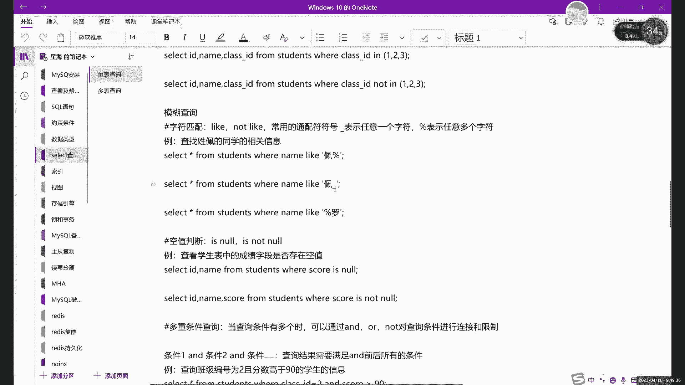

就比如说我们看名字，这里的话我们能用这个百分号查询的，模糊查询的话，其实就是名字吧，其他的没什么可查的名字，这里的话那比如说丹尼对吧，丹尼这里的话，你知道他前第一个字是单，然后呢第二个字忘了。

但是你能确定他只有一个字的话，你就可以用这个下划线，但是你如果忘了的话，就比如说你看啊这里有佩德罗对吧，佩德罗这里的话我们有三个字啊，如果说你忘了后面到底有几个字的话，你可以用配呢，百分号怎么去写啊。

都可以啊，这两种方式的话就是其实百分号用的更多啊，百分号用的更多一些，嗯就比如说我们直接来演示一下啊，直接来演示一下，来看一下效果啊，如果说啊我们用的是什么，当然关键字的话是什么，做关键字是like啊。

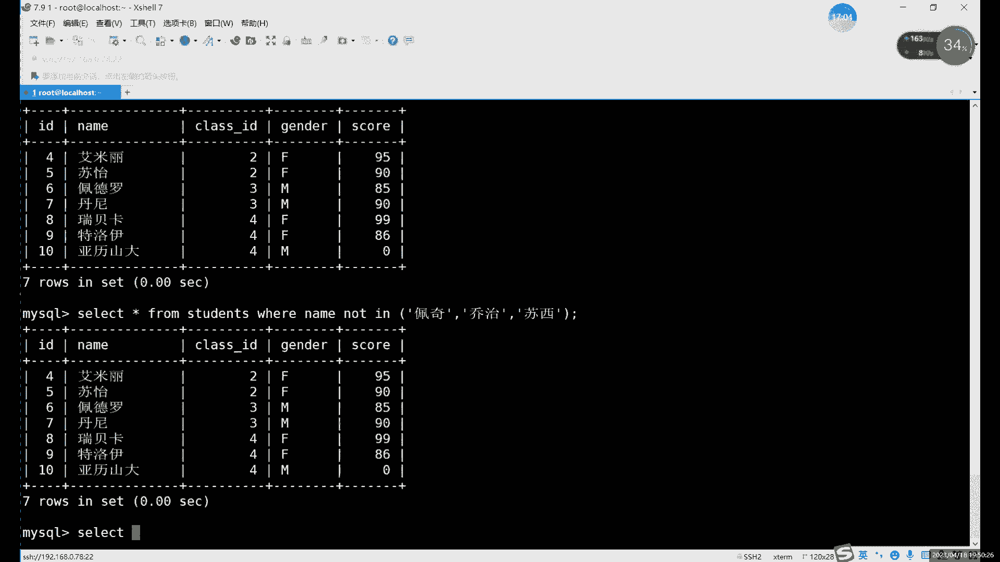

朋友说啊，不要这个要一定要先写like啊，再写这个啊，百分号或者是下划线啊，你不写like肯定不行啊，let的话就相当于是代替了谁的，代替了那些in啊，比对岸的等于号的位置，因为它这里就不是等于了对吧。

我们叫什么，我们叫模糊查询，模糊查询呢，它不叫等于啊，它只是相当于是向嘛对吧，like我们的英文翻译过来就是像的意思啊，那个就像，像什么什么对吧，长得像这个配，然后什么时候的什么对，我们就可以来看一下。

就比如说呢我们来看，select from啊。

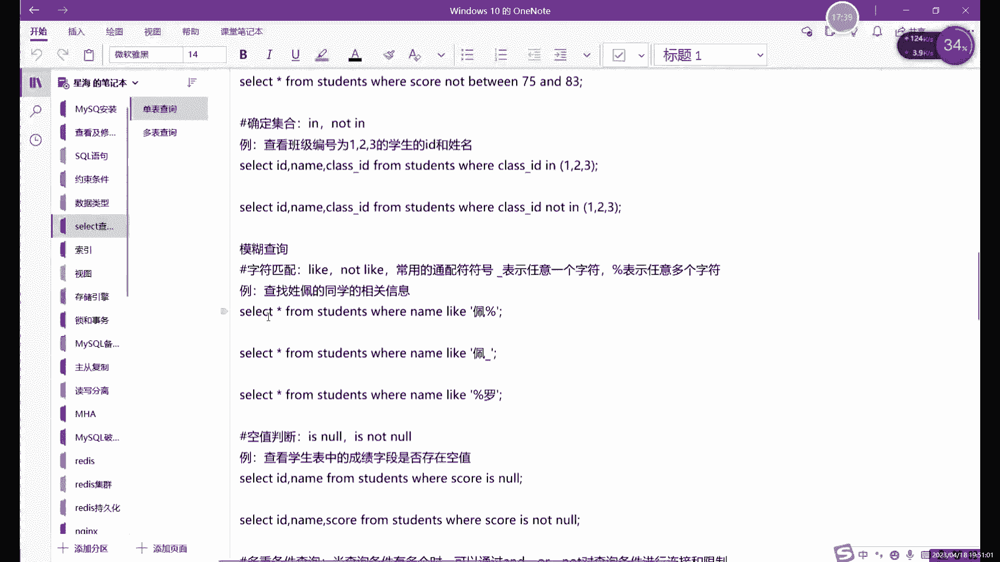

我们还是查询我找哪个名字呢，如果你想要看这个放在中间的话，我们可以找三个字的啊，找三个字或者四个字，那就佩德罗吧，哎我们来看一下这个，Selecting from students。

where我们怎么限制呢啊，用name like，然后引号这里中间我们怎么写呢，嗯可以看先写一个配置，然后呢再写一个下划线，再写一个，格子对吧，这样写，符号记得用，如果说经常要打折又打又打汉字的话。

记得切换啊，切换输入法啊，继续切换输入法，没问题对吧，没问题，因为他这个什么下划线它都有一个字啊，这只要是我们表格里边有这个配什么什么罗啊，这个同学他就能显示，那中间如果换成百分号行不行呢。

其实呢也可以，为什么刚才说了百分号呢，它代表零个零，其实它的准确来说应该叫零到正无穷大啊，就是零加上所有的正数都可以啊，因为这里没有没有负数之数，因为我们这个这个不能说负数没有负数值。

就是零和所有的正数都可以，所以说呢这个如果说你确定中间有一个字的话，那你就用什么就用这个，就比如说如果说我们用上面这个，如果说你不写罗的话，这样我们显示是什么呢，哎我们就是配齐了，那就另一个名字了。

为什么呢，因为什么，因为我们的这个下划线它代表一个字符，那你这个配置肯定显示不出来，那如果说换成什么呢，换成百分号的话，那它就能显示两个同学，也就是这个其实就是什么，就是下划线和百分号的区别。

大家这个应该能分清楚对吧，java线就是一个啊，就是一个固定的一个，然后呢百分号呢就是零个或者是多个，然后比如说我们再给大家演示一个，比如说我们直接写上这个写一个完整的名字，然而不是这个七啊，这起来啊。

这个棋如果这样写，然后我们加个下划线行不行呢，啊大家可以看一下这个行不行，如果说我们已经写了一个完整名字了，再加下划线呢，哎他就当然在我们这个表格里面呢，它是没有的，哎在我们这个表格里面他没有。

因为没有这个配齐，然后后面还有字，它就是空值啊，当然他不会报错，就select命令呢只要语法正确，是永远不会报错的，这个大家放心啊，就是这个只要是嗯语法正确是不会报错的，他只有说有结果和没结果一说啊。

因为我们这个表格里面就不存在哎，就没name这里的没有这个值，但是呢如果换成百M2，行星的M2就可以，为什么百分和也就是百分，我刚才说了0~0和所有的正数啊，就是你如果说在不确定的时候。

在查找一些值的时候呢，蘑菇查询的话尽量还是用百分号更多一些，因为百分号的话他其实已经包括什么，包括下划线了，如果百分号可以，可能查出来的东西内容比较多一些啊，没有那个下划线那么准确啊。

因为因为它其实相当于是你多少个啊，中间有多少个字，省略多少个字都可以显示啊，省了多少字都行，都可以显示，啊这个是叫什么，这个叫字符啊，这个是我们用的用字符演示对吧，我们还没有演示数值对吧。

我们可以演示一下数值，就比如说我们用哪个吧，用这个成绩吧，成绩这边是两位数啊，两位数还好看一点，因为id就是一位数，唉比如说我们来看一下select新from成绩，啊自带星from seasons。

然后威尔成绩，嗯成绩那对吧，我们用那，比如说我们这里写了什么呢，啊88吧，但这里如果你写下划线啊，或者说是这个没什么太大区别啊，因为这个，只有两位嘛对吧，只有两位，所以说你这里写下划线。

或者说写这个百分号都行啊，写个下划线都可以，这个没什么太大区别啊，没什么太大区别，然后like这里的话大家注意啊，啊我们这里给大家演示了一个什么啊，where成绩，然后呢like我们写了什么，写了个八。

然后呢下划线这个有什么问题呢，啊他就会报错啊，他说找不到什么，找不到八下完成这一行，为什么呢，因为我们这个下划线啊，或者说是这个百分号，那如果说换版本号也是一样的啊，不管是下划线也好啊，2%也好。

其实它都是什么呢，它是类似于字符的对吧，他应该参与他这个符号吧对吧，我们整数这里只包括什么，只包括这个123456789没了，就这一个对吧，组成的一些数字嘛，用那就0~9吧，0~90个数字组成的嘛。

所以说呢其他的符号呢它也算字符like，这里他因为比较特殊，我们如果要想进行某个查询的话，那肯定要加这个下划线啊，或者说号的对吧，那加这个的话，自然这需要什么呢，唉就需要这个，应该叫叫什么来着。

加上这个的话就相当于它就变成字符了啊，如果你不加引号，他就会报错啊，这个需要注意一下，就是用某查询去查一些数字的时候，查数值的时候也要加引号啊，因为你加上之后，它其实就不属于一个纯粹的数字了。

那你就不相当于哎有没有那么纯粹啊，没那么干净了对吧，然后呢，如果说当然我们这里之前一直演示在后面对吧，前面也可以，这个的话其实没有什么限制，就是百分号这个东西呢，你如果写在前面呢也可以对吧。

只不过我们还没有这个以八结尾的数字啊，我们放一个零吧，对就是整数八十六十九十的同学，那好像还有个零，大家看到零也一样对吧，零的话你前面有根号，相当于没有了嘛对吧，就相当于没有了。

剩下的几个的话就是8699对吧，如果这里换成下划线呢也一样啊，那就没有这个零了呗对吧，因为零的话前面相当于没有东西，这个的话嗯这个的话就相当于什么，这相当于这个，前面也行啊，后边也可以啊。

百分号也可以啊，下划线也行都行，都可以随意用，因为它其它这个是不会报错的啊，这些命令他不会报错，只要语法正确了就行，这个查询命令呢唉它不像什么，它不像那些唉插入啊，删除和更新那样限制那么多。

只要是没有语法错误呢啊，就所有的查询命令都是可以正常运行的啊，所有都是可以正常运行啊，就是无非就是如果说你查询条件太过苛刻，或者说呢你查询这个东西表里没有，那他就返回什么，返回一个空值。

返回一个mt空的就行了啊，空的就完事了，正常情况下呢，如果说只有的话，我们肯定是会返回一些信息的对吧，这个就是模糊查询like，当然它也有什么哼，它当然也有取反。

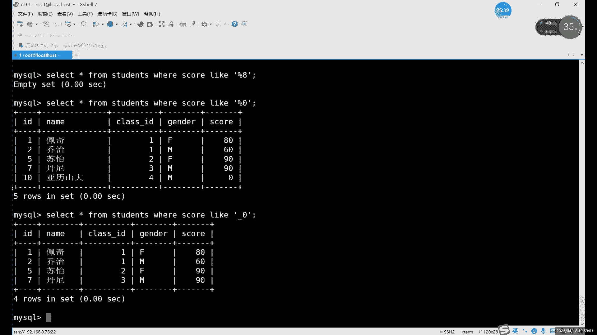

我们这里基本上就是一个正常的用法，加一个什么加一个取反的用法，上面也是嘛对吧，In not in turn，not like也一样。

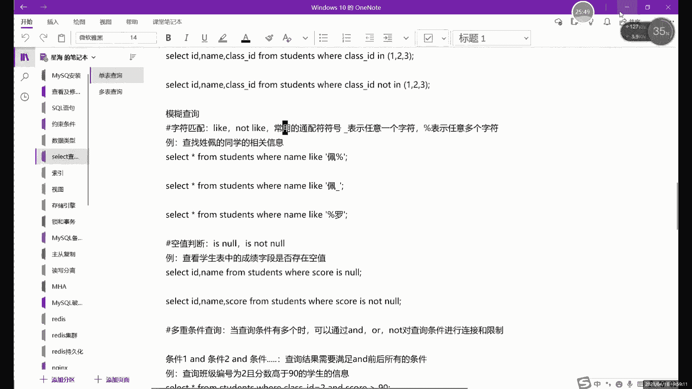

那这个就不用多演示了啊，我们直接not，那么这里它显示出来就显示了什么呢，就相当于是还要取反的意思嘛，就是我们这一列就乘积这一列呢包括零的，有这么多，有四个对吧，那不包括零的呢，就是剩下的六个哎。

这就是取反的一个作用，就是把相反的值啊，不能说相反的值，就是把这个，嗯不属于，这其实就是把这一列里面，所有数据呢分成两部分吧，like是一部分，not like是一部分，它俩加起来呢就是我们成绩的所有。

那就是我们的所有成绩啊，这就取反取反。

然后这个就是模糊查询啊，就两个符号，模糊查询进两个符号，当然千万不要把lion啊，你不能说你直接写个name，然后写个啊name，然后写个字符百分号，这样不行啊，这样不行，要一定要加like啊。

leg的话是我们模糊查询的一个关键词，当然这也是一种用法，我们之前其实也用过一次like，不知道大家还记不记得啊，就是这里翻一下上面的笔记啊，就是查看什么查看密码策略的时候，那我们也用过一次来。

当时是怎么用的呢，用的是寿命啊，也就like这个模糊查询呢，它不不仅仅能用到C里面啊，show命令也可以用，因为show它和select一样都是查询的意思对吧，都是查询的意思。

只不过呢select查数据，而show呢是查看我们的系统当中的一些设置，而show啊，show加上什么，这个是查询的什么，查询它的策略啊，查询我们系统当中的策略，like啊，like就是项目对吧。

百分号password的版号什么意思呢，就是包含百分号的所有内容，前边也可以有对吧，后边也可以有，大家看到PUZO是在中间的位置，前面有内容，后面有内容啊，都可以显示出来。

是这个之前我们其实已经用过一次这个like啊，用过一次like就show命令的话，也可以用like就用来查询一些系统中的一些设置，哎有可能你比如说这个确实挺长的对吧，你设置一个密码策略的长度对吧。

这么长没必要记啊，你直接用什么like模糊查询password就完事儿了，哎这个是模拟查询的用法，就是遇到一些长的数据啊，或者说长的一些这个啊，其实这里其实就相当于是一些长的数据啊。

遇到一些长的数据没必要去啊，记住它啊，你要知道它具体是什么，你就知道它的一部分，你就可以用魔法去查出来，这就是魔法20的主要作用啊，我们接下来继续往下看了啊啊模糊查询like，接下来呢就是空值的问题啊。

空值的问题，空值的话在这个数据里面，他就是比较特殊的一个对吧，之前我们也说过了，你在不插入数据的时候呢，默认为什么默认就为空啊，默认值为空，空值的话其实怎么说呢，其实有点占用什么。

占用还占用我们空间对吧，你还不如正常的去，而且呢如果说你插入空值的话，可能是什么呢，啊如果插入空值，可能这一个值哎，这一行的话还可能信息就无效了，唉可能性已经无效了啊，他不一定无效吧。

就比如说看一下我们这个表格里边吧。

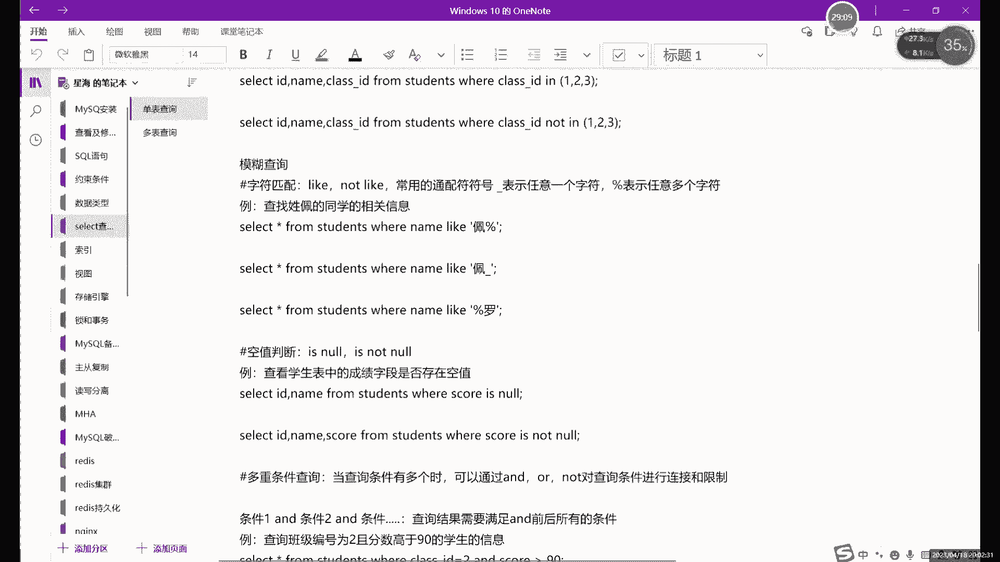

你看我们这个表格里边每一个值都是有的对吧，哪怕是什么，哪怕是你没考试，哎他有一个零分对吧啊，它也是有一个零分啊，他有可能准备考试或者什么，或者说哎就没考试了，作弊不好啊，作弊不好，不说作弊。

我们就没没考试，没考试，还有一个零分对吧，有个零分唉，他也不会啊，他如果你写空值的话，我们在查询的时候唉如果说我们想查一个，比如说啊零分的同学有哪有哪些，如果说你这里不写，换成了空值，那其实就查不到了。

因为零和空是不一样的，零是一个数据，空的话指的是没有没有呢，他是这里用什么用now来填充了一下啊，相当于说要N来填充一下我们这部分，所以说呢我们这个空值，其实在我们这个数据库里面其实是不太好啊。

有空值其实不好，所以说呢我们怎么去找到快速的找到控制，以及哎怎么去删除也好啊，再去更新也好，更新一些数据，插入一些数据也好，这个就是后话啊，我们首先要什么，首先要找到控制啊，首先要找到控制。

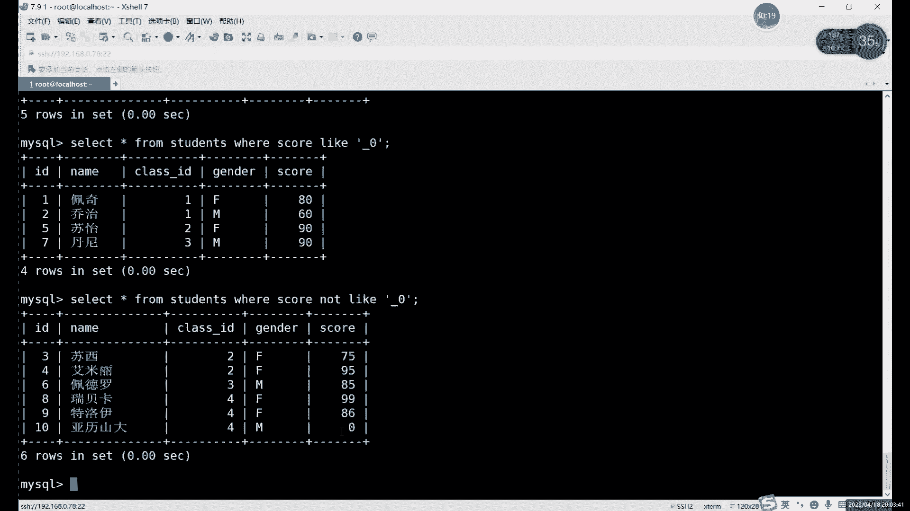

那找控制的话，我们这里可以看一下，空值的判断呢其实就是什么呢，就是通过is now，这里的话我们用不用等于号啊，因为它其实不能算是一个值，所以说我们不用等于号，而是我们用了is啊。

意思当然也是是和等于号是一个作用，是一样的啊，只不过我们不是一个值，我们就哎不写等于号了，用这个命令的话，我们就可以查看什么，查看我们表格当中的哪个字段是空的，哎有没有空字段啊。

这些内容就比如说嗯我们来看一个。

我们当然现在表格里没有空值对吧，我们可以插入一个吧，插入一个，Id name class id，啊我们插入四个对吧，插入四个字的话，我会留出一个来对吧，就留出一个来，就一个是空值嘛，value这里的话。

后边我们写123456789十十一啊，都排到11了，11，然后呢继续写这个嗯，Plus id12345，清洁字符，唉注意留意一些符号的问题，一定要全部都是英文的啊，正常插入。

哎就是说又新新创建了一个班级对吧，哎这个班级还没有参加考试啊，里面也只有一位新加入的同学，哎那我们看出来这个效果呢就是什么，他这里会出现一个空值，感觉做成绩这里的话我们会出现一个空值，DSC嗯。

就这样吃哦，是自增的约束啊，之前之前没注意啊，自增约束的话，这id都不用查啊，只需要插入name就行啊，然后呢我们可以看一下，这里的话我们是有多了一个空值对吧，多了一个控制，那怎么去查询呢。

我们先来有有空值就能查了对吧，其实其实直接查也能查，哎这只是握什么。

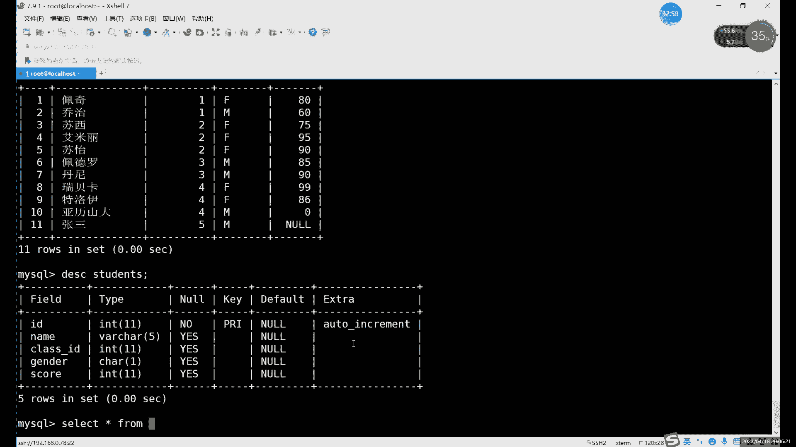

就是如果你直接执行这个命令行也可以对吧，就比如说你执行where but is now，就是成绩是否为空，可以查，但是我们这个表格里没有控制啊，所以看看效果的话，我们还是添加一个，先添加一个哈。

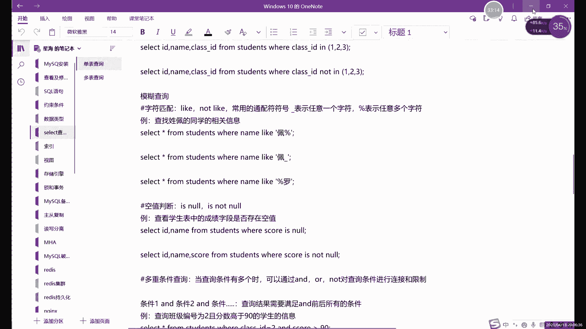

唉就比如说我们可以直接select新form加什么的，加上students，S c o r e is not，嗯嗯这是我们的成绩为空的同学啊，成绩为空的同学啊，的一个详细信息就列出来了对吧。

这个就是什么，这个就是查询是否为空的，不为空的，也就是正常的数据呢，也就是我们原来那个表格啊，原来那个表格啊，这个NT的话它不加在一前面啊，这个就是这个其实就是英语的语法啊。

is not表示否定嘛啊它不不能，这个是不能加在这个not not是不能加在is前面的，这就是啊一人称道啊。

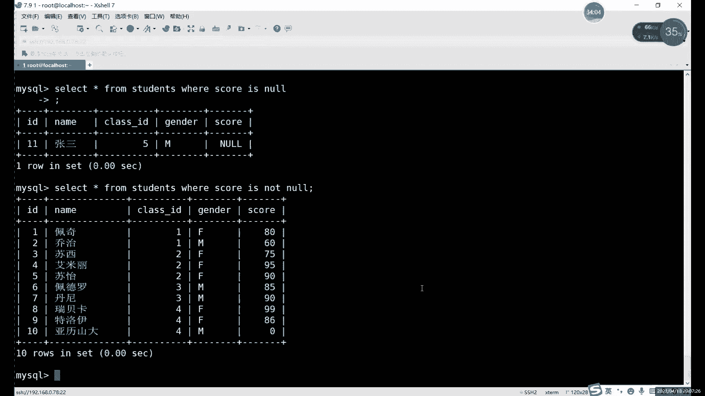

然后这里的话我们可以就其实空值的话，就这么多没了啊，空值其实不这么多，因为这个空值判断的话，其实就是用来检查一下我们这一列呢啊，有没有出现没有插入啊，或者漏插入的一些问题，哎如果有的话。

就可以什么就可以用更新的命令啊，用update命令直接去更新啊，啊用命令up update命令直接去更新就可以了，啊这个的话就是什么，这个就是我们的哎，判断就快，这是相当于是一个判断的作用。

是判断的作用啊，is not是空的，然后in not on就是非空的啊，有空值和没有空值的意思，啊这个就是空值的判断，这个取法其实还是not对吧，还是not，如果这个not就不太一样了。

前面的not它就加在他们关键词的前面对吧，in也是not in对吧，Not like，这个的话就是not因为有意思有意义的存在啊，所以说要加在is后面，然后接下来的话我们来看怎么来看一下。

这个多重条件的问题，哎，多重条件，多层条件是什么意思呢，哎我们前面是讲过什么，我们前面讲过这个，我们前面前面讲了这个集合范围对吧，我们前面讲了一个能查询多个条件的，有集合范围，比同样的也好啊。

印也好对吧，这两个都能查询一就是一片啊，一部分数据印的话就是查询结合里面的几个，而BN就是查询几到几对吧，几到几啊，这个也是他们是可以查询多个数值的啊，都可以查询多个值，这个没有问题对吧，没有问题。

那我们这里这个多重条件查询是什么意思呢，对吧有必要吗对吧，我之前不是都能查多个条件了吗，之前的多个条件大家注意啊，我们都是什么，不知道大家发现没有，我们都是只用一个字段，就你不听BTI的也好对吧。

我们是数值的成绩字段in啊，用成绩啊，内蒙呀对吧，这些它也是一个字段，就是你这两个命令它都是一次查询的，只有一个字段的，只能通过一个字段去查询，而我们的多重条件查询，它指的是什么呢，可以是一个字段吗。

其实也可以多重多重查询，这里的话也可以是相同的一个字段啊，一个字段查多次是没问题的，而且更多的更多的我们这里一般用什么，一般用不同的字段，比如说什么意思呢，哎就比如说我想要看一些什么呢，唉看一下这个。

啊班级是一般的嗯，然后呢班级是一般的成绩大于多少多少的，就比如说成一班里面成绩及格的同学哎，或者说一般里面成绩大于80的同学对吧，这种说法的话就是我们这里这里有多少个条件，就是两个条件嘛对吧。

一个是班级，一个是成绩啊，如果说想这么去获取的话，其实就是两个条件的对吧，两个条件，那如果这两个条件的话，你正常的用我们之前所讲的这些，其实都做不到对吧，你比如说你看。

比如说我们想班级是一般的成绩大于80的，用什么呢，用等于号和什么，有等于号大于号就可以做到对吧，但是呢你这两个怎么写呢对吧，一个是内，一个是什么，一个是斯摩尔成绩对吧，它俩是不同的字段。

你就不能写在一起，所以说怎么办呢，那就是我们下面的这个多重条件查询两个方式，两种方式，一种是那一种叫二啊，一种叫an的一种啊，不是一种叫an的，一种叫all啊，note那个note不着急。

not还是取反的意思啊，note还是取法，我们就先说and和or的问题啊，如果说像我刚才说的啊，就是一般里边成绩唉大于什么，大于80的同学称的一个信息，你想看的话，用哪个呢，还有海盗二呢。

啊那就是肯定怎么，就是因为我们刚才说的是一般并且什么呢，一般并且成绩大于80的，and它的名字，其它的英文翻译过来就是合并起的意思吗，对吧，and就是合并解的例子，所以说这里这个如果说想要看啊。

这里这个例子也一样对吧，哎查看二班的对吧，分数高于90的同学，你看他怎么写呢，首先先写班级的等于二了对吧，然后呢成绩要大于90，然后中间用什么连呢，用and连起来就是什么，就是我们想要看的这个呢。

就是相当于告诉我们的数据库，我想要看这个数据一定要同时满足什么呢，同时满足这个班级和成绩这两个条件，我们就用什么用，And，那on呢它不是相反啊，大家注意啊，就是and or它并不是相反的意思啊。

反之啊二呢它的范围其实更大，那就or能获取到的数据更多啊，为什么这么说呢，取反是not它跟or无关啊，二的话它是叫什么，它叫并且and是合并且的意思对吧，off是或者的意思。

或者如果说我们把这个中间这个id换成了，就是and换成二，然后又什么会有什么，就是会发生什么情况呢，对吧，它的这个数据会变多，什么意思呢，就是all的话就是或者的意思，如果说你的or前有一个数据啊。

就out的前面有一个条件out，后面有一个条件哎，中间out连起来，那where他查询的是什么呢啊，就select where查询的就是ID等于二的，或者乘积大于90的，也就是说只要你的id等于二。

你就能被我们显示出来，唉只要你的成绩大于90，就也能被显示出来啊，所以说为什么我说二的范围要比and更大，an的话相当于是取了什么，取了这两个的一个交集啊，不知道大家能不能明白这个意思。

就是and取相当于取前后条件的交集，而二呢取前后条件的一个B级啊。

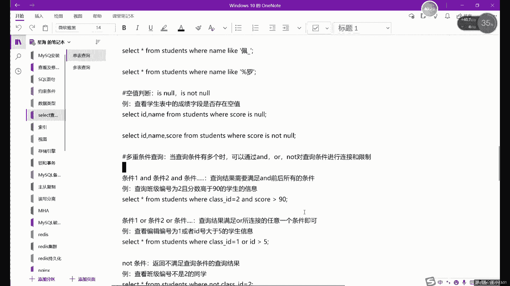

就是交交集并集的问题嘛，哎就比如说我们来直接来演示一下flag的，新from students，where啊成绩，好我们先写id也行啊，Class id，比如成绩是一般的，对吧，并且并且什么呢。

呃啊不先写I不是plus plus c l a x i m，并且成绩比如大于等于80吧，哎大于等于80同学对吧，and呢它显示出的是什么，就是我刚才说了它叫什么，它就相当于交集啊。

你就既要ID大于等于一，又要乘积大于80对吧，这两天他都满足了，如果完成二等，那相当于取了这个B组啊，有交集并集不好理解，那你就看效果就行了对吧，东西很多，为什么返回这么多消息呢。

首先第一我们这个查询出的结果呢，他首先满足什么呢，有几个是满足我们的ID等于一的对吧，这两个满足就等于一了，但是呢它这里又不满足在80，那无所谓啊，就只要满足一个就可以，那大大于等于80的是哪些呢。

就下面这些大家看到都是大于等于80的，大家知道他们的ID这边呢，其实都都都不是一唉，所以说什么呢，就是你看这边其实12456，我们这里有八个同学都满足条件，满足这个条件。

因为它这里呢你看我们这里第一个都是一样的，对吧，相当于这个二呢，为什么我说二的范围其实更大呢，就相当于是只要满足一个条件就行了，有前后只要满足一个条件，而and的话相当于要满足两个条件。

那就是相当于我们从这里呢去找一下，怎么找一下，就同时满足这两个只有一位啊，也是二范围，肯定一般要比这个and的要大的，啊只是一般啊，有时候特殊情况呢可能他们俩的值是一样的啊，就按的话二可能考回去值一样。

把这些就是这些就是少数情况，一般情况下还是二的值会更多一些，二返回的值更多，这个就是什么，这就是我们的，and和or的一个多重条件的查询，那如果说我想再再加第三个条件行不行呢，其实也可以啊。

再加第三个也没问题，可以继续往下加，只不过呢如果你条件加的越多，会出什么问题呢，啊他不会报错，你返回的肯定是空值啊，比如说你这是写十个条件，那基本上不可能很少，比如说你的表格写十个限制条件。

基本上也不会基本要获取不到数据，所以一般这里肯定不会数量不会太多的啊，数量不会太多的，两三个就已经够了啊，两三个就足够了，唉再多其实就有点过分啊，这都其实有点过分，那就条件太多了啊，腾讯多的话。

一来其实影响查询，二来呢肯定查了半天又没有对吧，很有可能就你查了半天又没有啊，所以说呢这个，多种条件查询呢，一般人家两三个就可以，两三个就可以，当然这个是什么，这条这个我们演示的是不同的条件对吧。

我刚才说了，其实相同条件也可以，主要是什么呢，比如说class id等于一，然后class id等于多少呢，等于二，这样行为呢，我看2class id啊，等于二，这也可以是吧，也可以啊。

那给我换成N行不行呢，啊and就不行了啊，当然这个是报错，and它就没有，为什么没有呢，啊因为同一个条件它不可能又等于一等于二，对吧，啊这个就是啊一般情况下这样用的也比较少啊，就是同样条件的话。

一般情况下我们用集合啊，范围什么都可以啊，当然了你用and其实也没问题啊，用and也没问题，只不过呢就相当于是这个话相当于什么呢，这其实其实可以换成class i d in12。

或者说是between and12，w between1and二对吧。

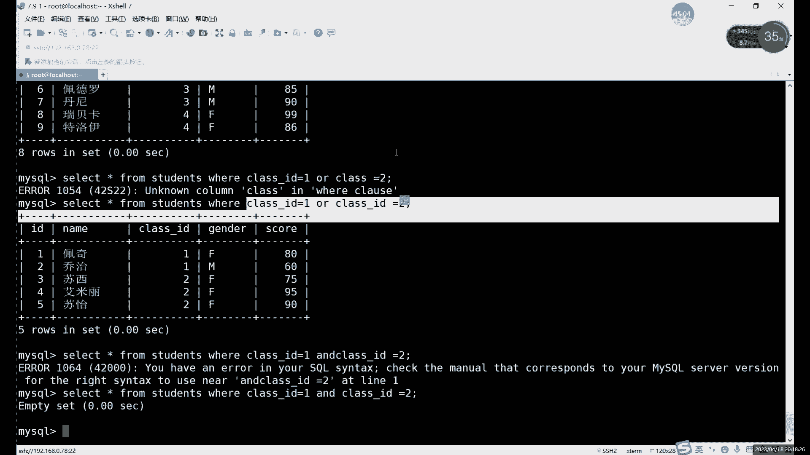

效果都一样啊。