# 0基础小白怎么入门Linux运维？看这套，Linux运维全套培训课程，保姆级教学视频 - P75：中级运维-12.SELECT单表查询，嵌套查询-下 - 小方脸不方- - BV138411B7p5

目前讲过的四种写法对吧，星号代表所有信息，就是不管说你后边查询出来的是什么内容，我就显示所有的信息，所有内容啊，这是一种，第二个是特殊，就是单独的字段，或者说是一部分字段，因为所有信息的话。

它是相当于将我们查询出来的，就过滤出来，整个表格的信息全部显示了，每个表格可能都会都会有很多列，如果说只想是如果说百合比较大的情况下的话，只想获得哎只想要这个关键的列的话，关键的信息列。

那你这里就具体写字段的名字，多个字段呢用逗号隔开啊，多个字段用逗号隔开啊，包括后边的这个函数和group on contact contact也是一样的，都用逗号隔开，首先cod字段这里的话啊。

这个就是我们的计数的函数，他如果要用的话，必须要和什么呢，哎必须要和我们这个，那当然也不是说必须了，一般都会和分组一起用啊，当然也可以他自己用啊对吧，最开始我们其实演示过了。

come acro c o u c o u t c o n t cut计数函数啊，可以自己单独使用对吧，比如说我们计算一下，我们这里获得的数据一共有多少列啊，用cos就可以。

然后呢group group contact这个就绝对要和分组一起用了，因为它就是显示分组里边的，具体的每一个组的一个详细信息啊，得用group group contact。

就是分组之后想要看组里面的信息的话，就用这个啊，就目前我们只讲过四个对吧，就这四个就select这里可以写的from呢，就是表明没了它最关键也最简单，因为你slide这里就是form。

这里其实就是确定我们查询的是哪个表格，我们现在是单表查询，所以说只写一个就行了，后边如果是涉及到了多表查询的情况下呢，那form这里怎么写呢，也是写多个表格名字，然后用什么隔开呢。

用逗号隔开和前面的字段的话也一样啊，就用逗号隔开就行了，唉如果暂时目前还用不到对吧，还没有讲到这个漏网查询，然后下一部分呢是where条件语句，这一部分呢它也不是必须的啊，它也不是说必须的。

加上的话就只是给我们的查询呢限制一下范围，限制一些条件，哎这个的话是什么，这个就是where的条件语句，然后下一个呢是group by goodby的话是分组的意思，对吧啊分组。

当然这里的和分组类似的还有哪两个，哪有哪有哪几个呢，就是order吧啊，Grow by order by，还有什么，还有limit，这些啊都是加在哪呢，加在where后面啊，大家注意就是分组也好。

排序也好，这个分类也好，都要排在哪，都要分析在我们的where条件语句之后，就是整体限制好条件，得出了结果之后呢，再用这个grow bye呢，然后排序啊这些去再次进行处理啊，进行二次处理吧。

可以理解成前面的话是其实算一部分到where，这里算一部分啊，就是一个正常的普通的一个语句，执行好之后呢，如果说想要给他排序啊，分组啊进行二次处理的话，因为这些的话，其实不会对数据的本身造成任何影响。

它只是改变我们的显示的形式啊，我们的分组也好，分一二也好，排序也好，都是改变一下你的显示形式，它不会改变数据本身就是说前面的话，这个这个是我们产生数据的一个第一段啊，就是第一句，这里就是第一行吧。

第一行这里我们是先得出一部分数据，然后呢用葫芦by呀，这些呢去进行二次处理，那进行二次处理，然后呢还有一个我还没有讲对吧，Having，还有in的话也是什么也，它也是条件语句，类似于谁呢。

类似于where用法和VR差不多的，只不过呢他俩是什么呢，他俩位置不一样，大家可以看到他俩的位置不一样啊，从位置上的话，其实就能区分出他俩的一个区别啊，说出他俩的区别。

首先呢第一where这里呢我们刚才说了，整体第一句执行好之后呢，再用group by进行分组对吧，我们这里用group by了啊，就用GROUBYE来代替那两个代替那两个啊，当然了，其实呃。

grow by其实和order by其实是相当于是一类型的啊，limit那个它其实也不算limit，你可以理解成这个嗯，另外的分页可以理解成这个排序的一个，排序里边的一个用法啊，排序里面的用法。

然后这里的话分好组之后对吧，我们查询好之后，然后分组分组之后呢，然后就查询出一个结果对吧，查询出的这个结果呢，如果没有having in的话，它就已经是最终结果对吧。

那如果说有了having in having in的作用是什么呢，就是在我们前面所有内容查询完成之后，再次进行限制哎，就二次的限制，就第一次限制在哪，第一次限制范围的话。

限制我们的数据范围是在where这里，它是在group分组之前，或者说是在排序之前进行限制的，那排序或者说分组之后，如果还要限制一些条件的话，where就不能再限制了，因为where已经用过了。

而且where它是在中间部分吧，想要最后再限制一次的话，怎么办呢，就只能用什么，只能用heaven语句，having in的话，就相当于是在唉就是在goodbye处理好内容之后，或者说是分页处理好之后。

再用heaven进行一个什么呢，再用heaven进行一个二次的去限制，就比如说如果说我们按照分组来说，我们分了五个组，用班级分组吧，用班级分组，我们一共分多少组，多少个组能用分五组对吧。

按照我们这个表格来说，问题是分五组，分出五组之后呢，我们得出这么一个哎，不管说你是五组同学的成绩也好啊，五组同学的这个名字也好呀，都可以分好之后呢，一共是五行对吧，那五行数据呢还可以再限制啊。

用怎么限制，用heaven对吧，就比如说五行数据出来了，我们再限制一次，我只要钱，我只要这个前三个班级的成绩行不行呢，也可以对吧，只要前三个班级的成绩啊，后面两个就不要了啊，我知道前三个。

那还可以用heavy限制啊，用heavy就限制啊，这个就是什么，这就是having in的用法，它呢具体的一些条件的话，它和where是差不多的，不一样的地方，就是它就是在它的一个生效的位置。

或者说在使用的位置啊，where呢相当于是在分组之前啊，在分页分组这些操作之前进行的，然后还有你在之后啊，这就是我们select单表查询的一个详细，就是所有内容对吧，我们可以最后再演示一个啊。

最后再演示一个单表查询这边的，首先第一啊我们就用还是用分组，用分组还是用分页的，其实都可以啊，刚才是分组，我们必须再换个分页吧，还用分页是查询，分页查询，分页查询的话其实也用不到，用不到函数了。

就用不到函数了，我们可以来先来一个分页查询对吧，select星号对吧，我们不用星号了，新号感觉我用几个字段吧，name成绩，就那么成绩吧啊然后呢姓名啊，成绩from students，Students。

表格后边where限制条件，建设什么条件呢，现在id的话就有点太少了，性别的话还好对吧，性别有56个，主要是我们这条件也太少，没有什么可以限制的，就用性别吧，性别对吧，现在这个条件。

然后呢再来一个排序和分页，Order by，for对吧，用牌用程序进行分组，然后呢我们再可以分页查询，前三名的啊，我们来看看前三名对吧，这个的话就是什么，就是我们用了一个fly。

这里我们用两个字段from表格，where呢我们先限制你先限制性别，然后呢用成绩分组，然后显示前三名对吧，我们后面还能在还能不能再加呢，可以再加heavy，啊还有VING啊，限制出前三名之后呢。

看123，然后再限制一个class id，看一下是哪个班级的，因为这里限制条件太多了，我们也没什么好改，没有什么能限制了。

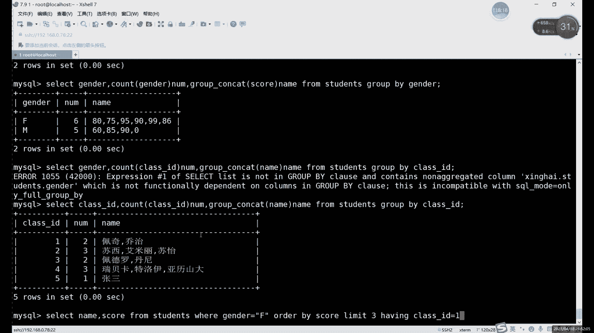

其实看看这样有没有结果哈，哎呦，limit等于三，Order by limit，还有这里报错。

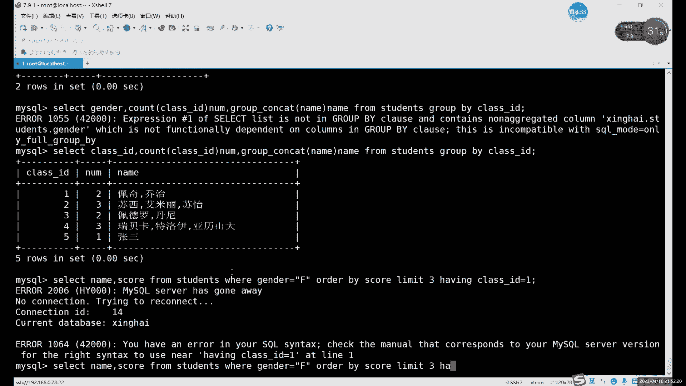

在heaven这里哦，对没有成绩啊，没有成绩，没有成绩的话，我们得加一下什么呢，加一下这个name class id，我们加一个字段吧，不然没有成绩的话，having不能再限制了。

having限制的是谁呢，就是我们现在不得出这么一个结果了对吧，我们用分页得出这么个结果，那这三个结果呢timing要去查的话，它只能在name和sport两个字段里面有限制，我们cos1由于这里没有。

所以说他就不能限制了啊，就不能限制，所以说这里会报错嗯，加个class id，然后逗号，然后最后再加heavy，heavy的用法和什么，和where一样，但是呢heavy能一般的话。

其实heavy虽然说用法也很多，但是呢一般很少能用到，为什么呢，因为前面已经限制了很多个条件了对吧，由于我们这个表格也不是很大，你看前面已经限制这么多条件啊，你最后再用heavy的话。

其实能改能限制的东西其实已经非常少了，这里的话呢我们可以来看一下，还有I1等于一吧，应该有一般的吧，还有in class id。

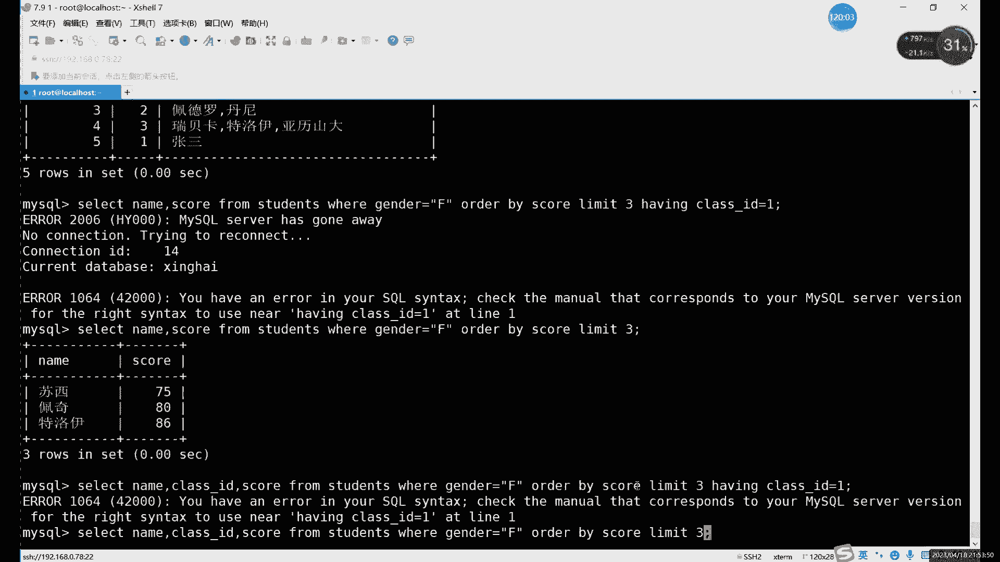

大SD等于一。

最后这里的话我们加heavy的话，其实，加了这么多，我看一下啊，还有你的条件依据，这里经常加HIN的话。

成绩限制，性别排序，分组，最后限制一个class id，这个后边我们如果说要再加这个having in的话，看下plus id等于字段，倒是有字段已经有了，看一下400X400的内力。

现在是用了这么多限制的话，看DC哦对还有一个需要注意点啊。

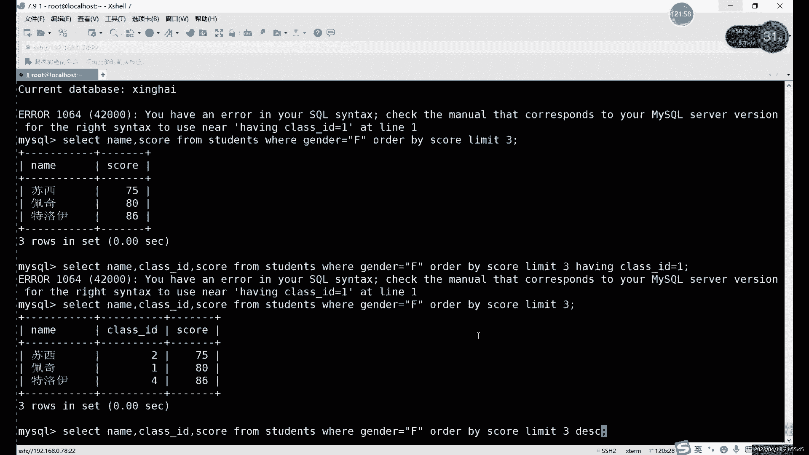

刚才没有强调，就是这个heavy的话一般是用在哪，一般是用在有聚合函数的时候啊，他再去对结果进行限制啊，他还是和威尔有点区别，区别就在这where的话，他对象没有什么没有什么太大没有要求啊。

还有的话他需要什么，它是对在聚合环收后边进行限制啊，就有集合函数后面再进行限制好，我们这里能再加一个函数进行啊。

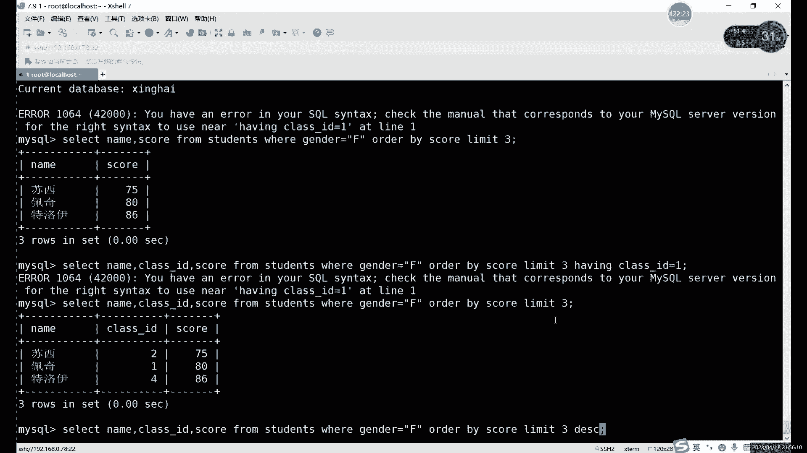

看一下，但其实已经很长了对吧，limit3DC再加这个位置，在这个在这个位置啊对吧。

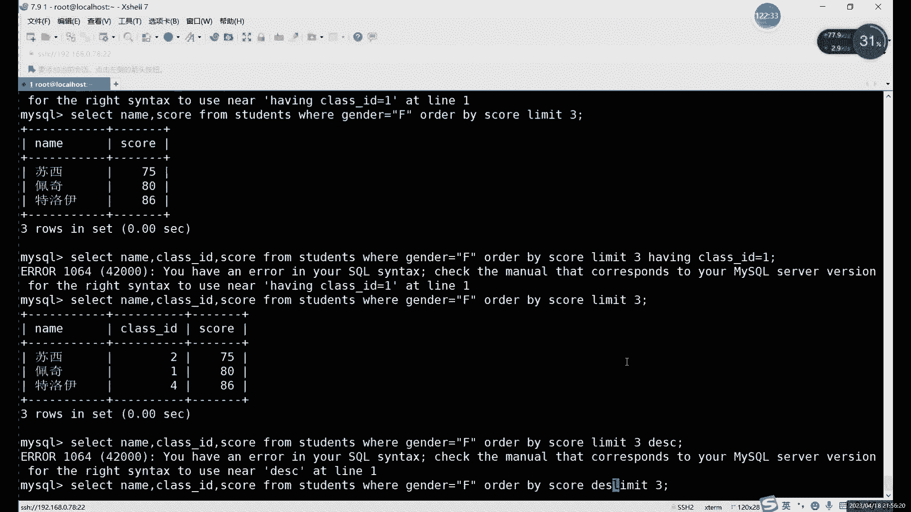

这个是前三名，刚才是倒数三名，命名前三名，加函数的话，那老3D，零，这里基本上把基本上把所有的用法，基本都加在一块，叠在一块了，我看一下，如果这样分组的话，那现在的分组用COSD分组的话。

用卡尔达利分组，我们最后能得出来的结果是，这里肯定不能用，还是不能用，成绩分组，分成绩分组的话，其实就是把和其实还是他们三个数据，用class1分组统计一下class id以及class id里面的。

Group cocat。

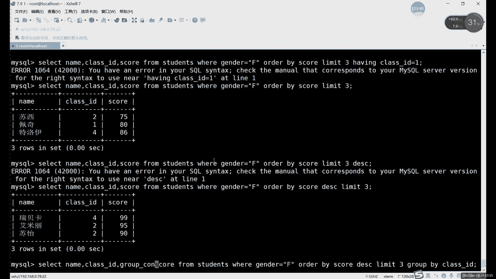

Name class id，这里我们前面就把内幕给去掉了，内部就去掉，D l u p goby，ruby的分组，那如果是以克拉载B分组的话，这里的话不能再加这么多了，再加这么多的话。

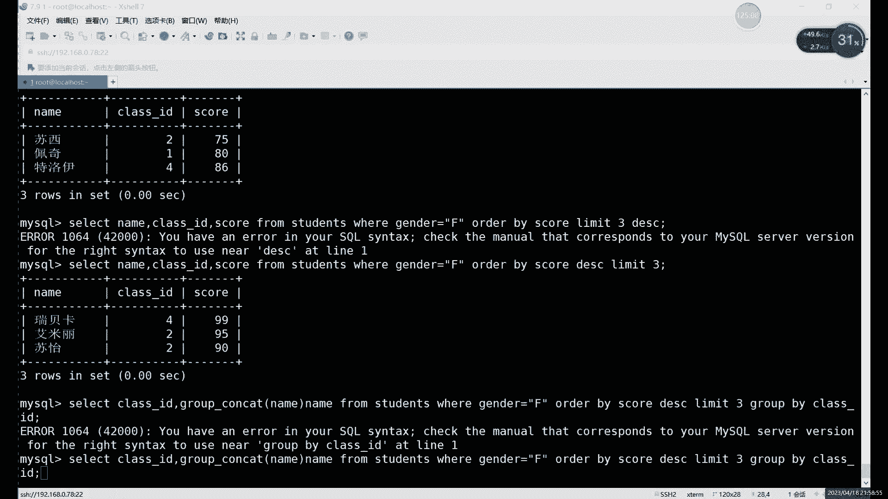

它这个功能用法上的话其实就有点丰富了，那我们就先目前先这样啊。

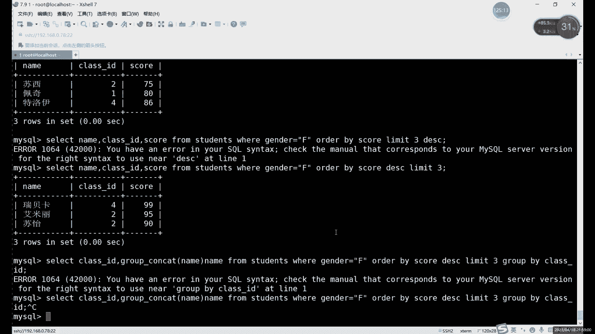

先先先就写到这儿啊，先写到这儿，前三名的成绩对吧，前三名成绩再加，不能往后加一了，不能往后再加了，如果说要用那个having in的话，我这里换一个吧啊这个话我们就先写到写，写这么多，我还是换成什么。

换成这个group by分组的啊，用分组的这个的话口感加heaven比较好一点，就比如说select型号from啊，select分组的话，我们用FCD分组，class id分组。

然后分组之后显示每一组的名字吧，显示每一组的名字，然后呢from从students表格里看，Where，限制一下这个性别吧，然后呢BBY啊，不用order by，用blue b go by。

用class d分组，分好组之后，这里就这里我们不用limit来，分组之后也可以用limit，这没什么意义，Roby class id，我们来看一下，目前是啊，124为什么没有三和五呢。

因为三和五里面可能没有女生啊，没有女生所说的话，这里就是，目前是这样一个数据，然后呢在这个后边呢就可以再加加什么，加上我们还有如果说你只想看什么呢，只想看一下，Class id，等于几的，想看二啊。

这直线程二班级对吧，支线是四的话，全是四班级，也就是heaven的话，其实就是在不by后面，还有这里需要注意，就是它是一般会用在聚合函数的后面，去进行一个再次限制，啊前面一定要有聚合函数。

我们后面才能用才能用，这个还有in啊，就再次限制啊，这个就是heavy的用法，然后限制的话，其实你其他的一些的话其实也可以用，只不过我们这里因为数据实在是太少了啊，数据已经没有了。

所以说呢没有在限制其他的一个必要啊，这里就是我们这个having in，那像刚才我们说的那个能不能继续往下走，就是到这里对吧，我们刚才是用了个order by排序和limit的一个分页。

能不能继续往下再执行呢，也可以，但是一个语句的话其实已经不够了，一个语句已经不够了，啊如果说想要再继续写的话啊，也是可以的啊，也是可以的，啊比如说再往下写的话，它其实我们的这个语句就就叫什么。

就叫嵌套语句啊，不知道听说过没有，就是嵌套语句就是一个语句的话，如果说啊，它能够实现的这个功能已经到极限了啊，如果说一个语句已经到极限了，我们就可以用什么呢，可以用嵌套语句啊，把两个语句拼接在一起用啊。

把两个语句拼接在一起，什么意思呢，我们可以看啊，目前我们是写了这么多了对吧，写这么多了，然后这个这种基础上我们已经不能再等了，这种情况因为我们已经显示出这么多内容，他已经是一个成熟的表格了。

我们如果说在在在它的基础上再进行分组的话，它会对我们前面这个字段会有影响，所以说我们这里就不会就不能再进行分了啊，就不能再进行分组了，再分的话它前因为前面我们这些字段也都没了，所以说呢我们正常情况下呢。

如果说你想唉再再继续做的话，再继续往下搜索的话对吧，因为我现在其实还可以继续往下走对吧。

那怎么办呢，就可以用这个嵌套查询，嵌套查询的话，在我们这个，我这里写在这个，这个是写在多表查询，这呢在多表查询这啊，嵌套查询的话是什么意思呢，它其实就是用两种，啊我写在哪呢。

现在常用的话其实就是两个select语句啊，拼在一起啊，拼在一起用，然后我现在这个例子里面，这里其实还是比较简单的啊，还是这样比较简单，我们直接来看什么，直接来看我们现在这个线条差啊。

比如说我们先看一下，先简单看一下这些例子，对吧，如果说想要查询成绩跟丹尼佩奇瑞啊，瑞贝卡一样的，还学生的一个名字和分数，在这种情况下呢，我们就可以用这个嵌套的，我们可以先查询出来这三个同学的成绩。

然后呢再用什么再用再来一个slide语句呢，把这个查询，把这个第一个查询语句的一个结果，作为第二次查询的一个条件对吧，这个这句话是不是很熟悉管道服务那边对吧，我们命令行里面管道服务。

也就是也就是这个用法也是这么描述的啊，我们这里也是一样的，就是将一个语句的一个查询结果，作为第二个查询语句的一个条件啊，这一个结果作为第二个的条件来进行使用，这里的话我们可以看一下啊。

select加上我们的这个，首先这里的话是先搜这里的话，它结果是什么呢，它的结果就是三个成绩，然后呢把这三个成绩放在我们这里，继续继续去执行，哎这样就是嵌套语句的用法啊，嵌套语句的用法。

那像我们当前这个情况怎么办呢。

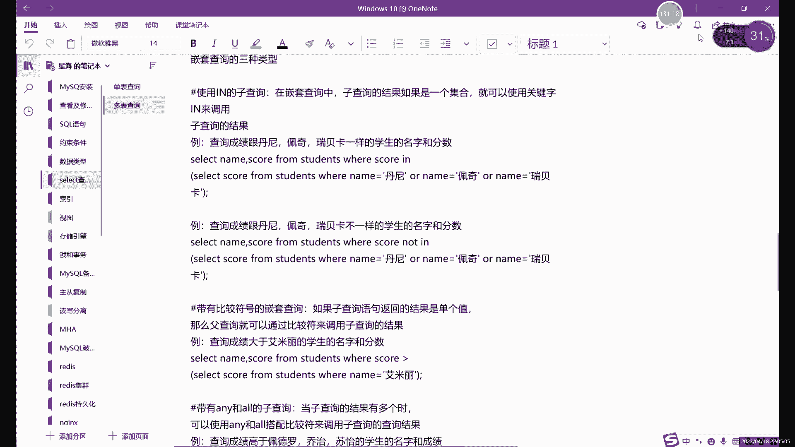

我们现在的结果是谁呢，现在结果是他它是一个什么，它是一个表格对吧，它其实还算一个表格嘛对吧，他虽然说这个表格我们其实不存在，但是呢对吧，你看起来是三行三列嘛，刚好是三行三列，其实看起来是个表格。

那是个表格的话，其实也可以用用于什么，用于嵌套查询，听到详情的话，其实主要就是两种类型，一种的话就是将嵌套语句的结果作为，就是将一个语句的结果作为第二个语句的条件，这是一种对吧，就是放在VR那一部分。

第二种呢，就是将一次执行的结果，作为第二次执行的一个表格啊，什么意思，就是form这里，除了写只写表格的名字以外呢，还可以写什么，还可以写一个嵌套语句进来，什么意思呢。

如果说我们想要对这个这个现在这个语句，继续再继续写，想要给它分个组，想再继续过滤一下啊，因为我们这现在不能直接加heaven了啊，不能直接加heaven分组的话，因为前面那个字段也比较多啊。

分组其实也不太好分，所以人呢最好的方式是什么呢。

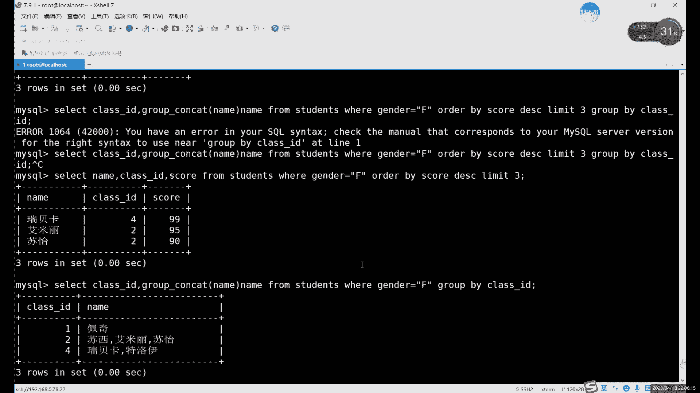

是把这一个我们先复制下来好吧，先复制下来哎。

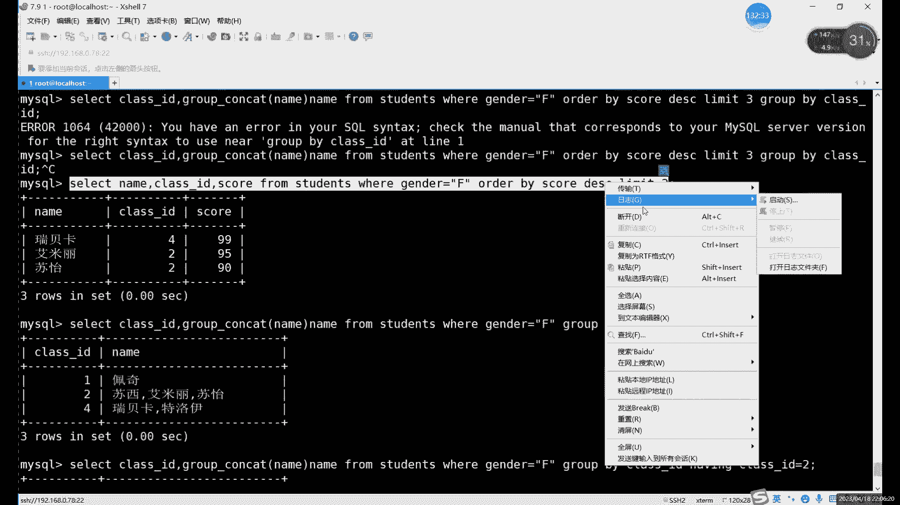

复制就了，然后呢他现在是哪个表格，他现在其实代表这个表格对吧，代表这个表格，那我现在怎么能把这个表格利用起来呢，我们先给他们加个括号啊，先给你们加个括号，诶不对，先给它加个括号啊，诶不对啊，是这个是吧。

先给它加上一个括号，把它当成一个表格当成表格了，他要写在哪，它就写在from后边对吧，那就是在from后面没毛病啊，然后呢，现在我们再来进行再进行一次查询啊，我们现在把它当做表格了，他就是一个表格。

就是3×3那个表格啊，现在如果说我们想要再进行一次分组的查询，怎么办，就select我们用class d层板，用class d分组，然后显示cos id里面的具体的一个，组内成员的名称。

group杠contact，一边加上class id，CSD逗号group contact，然后cos i d，然后form这个表格，这个表格叫什么呢，我们这里需要一定要起个名字。

大家注意在签到查询的时候呢，如果说将一个表格作为一个，将一个查询结果作为第二次查询，查询的一个表格的话，需要再给它起一个名字啊，它不能没有名字啊，这个名字当然只是临时的啊，只是一个临时名字。

相当于类似于可以稍微给它起个别名啊，简单来说你就写随便写就行，这个名字没有什么特殊含义，每次你都写A行不行啊也行，因为他是临时的，用完一次它就没了，所以说你每次写A都有也可以啊，没写都可以。

然后呢唉然后现在的话我们先写完之后呢，继续写什么呢，继续写就写groove bye了吧啊，不要WRWR，我也没什么好好过滤的，直接groove bye，Class id，对吧，这个就是。

好class id是吧，怎么感觉有点不对劲，我换成内膜，对吧，就是把我们上面那个结果又过滤了一次，过滤了这么两个同学的名字对吧，然后再加什么呢，还可以再加having啊，我这已经是能把我们能加的。

基本上都加进来了啊，基本上把我们之前讲过的主要内容，关键内容啊，基本上都加在我们这个语句里的，这已经没什么好限制，咱们就没什么信息了，基本上咱信息那么大一个表格。

现在我们过滤的已经只剩下有一个class，杂D和两个名字了，哎就是总体上来说的话确实比较长对吧，大家一次肯定记不住，这个肯定记不住，有些理解我也理解，大家可以看一下。

我们这个这个语句整体的一个组成部分啊，哪里有不理解的可以直接说啊，哪里有可理解可以直接说，其实也很长对吧，主要关键我刚才刚才又加了一个什么，又加了一个嵌套语句的概念对吧，嵌套语句呢怎么说呢。

总体上来说呢，嵌套语句就是，将两个SELLY语句呢一起来用啊，有时候呢一个语句确实很难解决问题啊，有时候复杂的一些查询的话，一个语句其实很难查出结果啊，如果说一个语句查不出结果的话，那么就用什么。

现在就用两个呗，两个不行，可以用三个啊，最多也就三个了事，不过三嘛，你再多的话就太过分了，其实他这个可以确实可以无限嵌套的，但是呢你嵌套的多了，那就没意思了对吧，嵌套多了就没意思了。

所以说呢一般其实两个其实已经差不多了啊，尽量不要太多了，就是两个语句，三个三个就到头了，再多就太过分了啊，就是我们这个嵌套语句呢，总体上来说呢就是两种用法，对我现在展示的是，其中一种。

就是将我们的这个SELLY语句呢加在from后边，另一种的话就是将sly语句加在哪，加在这个where里面，或者加在heaven里面，行不行也行啊，也可以加在heaven里边。

也就是我们这个嵌套语句呢两种用法，一种的话就是让谁来限制呢，那不是说谁被限制，就是携带from当做一个表格来用，第二种的话就当做条件来用，写在where的限制条件里，或者说HEAVIN的限制条件里。

就是我们的嵌套语句的用法，总体上来说，嵌套语句的话其实就是，就像我们刚才对吧，你后边我们排序之后再去分组也好啊，再去这个heaven也好，都会报错啊，那没办法，我们就再来一次吧。

啊因为一个语句已经到极限了，我们就再重新相当于重新创建了一个语句，哎我们就一次执行到头了，它已经成形成一个表格了，就可以将它作为一个表格继续的执行，继续限制啊，直到我们拿到想要的结果。

这个结果其实是什么呢，这个结果是，哇这个题应该怎么说来着，我看看我从从答案我说一下题目啊，从答案回推一下题目，女生里边，好女生，成绩前三名的同学里面，然后是班级啊，我们班级分了个组。

其实这个班级分组没什么，其实只是强行分组啊，强行分组啊，就是女生里面成绩前三名的同学，并且啊并且这个，这个应该叫什么，应该叫，并且是二班的同学的一个班级以及名称啊，班级以及姓名啊。

总体上来说就是啊就是你这个语句太长，提的不好圆啊，都圆不回去了，这东西啊，总体上来说呢，就是一些，大家如果遇到一些比较复杂的一些语句的话，就复杂一些问题，你说什么呢，你就先思考啊。

一个语句能写到什么程度，如果说一个句能写完呢，就要用一个语句写就行了，如果说一个语句写有难度，那你先写一个先写一半，然后再用嵌套呢补另外一半对吧。

就比如说我们直接来说我们嵌套语句了啊，就接着说嵌套语句了啊，嵌套语句的话我们还是在一个表格里说，因为多表查询的话没有讲啊，多角上还没有讲，这个的话我估计要放在下节课了。

我们现在的话说了一下我们的嵌套查询，嵌套查询呢，我们这里是什么，我们这里是，刚才我们演示那个嵌套呢是把什么呢，是把子茶饮几句当做一个表格了对吧，当做一个表格来看，还有一种的话就是就是我们这种。

笔记里面写的这个，将什么呢，将一个查询块嵌套在另一个查询块的，where语句当中，或者说having语句当中，或者是什么from表格当中，第一个查询就叫做嵌套，查询，其实就分为两种。

一种的话就是where和having的条件语句，一种的话就是form表格里面啊，我刚才演示的其实就是第二种，这种嵌套的话需要给嵌套表格加上别名，别名无所谓，因为它是临时的，所以一般我写A啊，一般我写A。

然后前面的这两个呢就是啊没有说对吧，前面两个是加上在where和heavy里面，就比如说我们拿一个来举例子吧，啊，我们嵌套的话也有很多种，不同的子查询的类型对吧，首先可以用硬来查询，用硬来比较。

首先第一个，刚才其实也简单看了一下对吧，就是查询和某几个同学成绩一样的，同学的一个分数啊，就比如说和A同学成绩一样的，同学的一个名字和分数，这首先呢他题目里面并没有告诉我们，这个分数是多少对吧。

题目没有告诉分数数多少的话，我们肯定是没办法直接得出这个分数的对吧，那这种情况下的话，你一个语句其实是一次性得不到结果的啊，这种情况下一句肯定是得不到结果，因为什么呢，因为如果说想要得到名字的分数的话。

首先你得知道分数是什么对吧，现在的话我们分数是未知项是未知的，我们已知的只有什么，已知的，只有学生的名字，我们得通过什么，首先先通过学生的名字呢去查询我们的成绩啊，用到的就是一个where的条件语句。

那我们先来看一下这个，就比如说和这三位同学一样的，学生的名字和分数怎么去找呢，先用VR呢，然后判断不是不是判断是限制一下啊，这三个同学的名字对吧啊，你问我得出三个名字来，第三个名字呢。

它其实分别就对应了对应了三个成绩，而这三个成绩呢啊能用and吗，它不能用and，大家注意啊，这里就不能用and，就只能用or，因为三个成绩他不一样的啊，即使有一样的话，那另外一个不一样，它也就没了。

而不是说不就是它只有什么，只有三个必须相，如果想and的话，只有三个都一样了，他这and才能生效，不然的话它就相当于没有啊，有没有是空值，所以说呢这里的话我们只能用二得出三个乘积，得出三个成绩的话。

最后呢我们select大家注意，这里select一定只能写一个成绩啊，一定只能写一个SCR，为什么呢，为什么这里只能写一个呢，其实原因很简单，就是如果说你想要作为一个条件来说的话。

那你就只能有单独的值几个值，而不能啊，不能说啊，你如果说有姓名，有成绩行不行呢，那不行，为什么呢，幸运加成绩又有字符，也有数字啊，那就不能作为什么，它不能作为一个普通的条件了，它是什么。

它就是一个小的表格，如果是一个小度表格的话，那又要又回到我们上刚才演示的那种，就是符合我们家表格了对吧，如果说你想要把这个一次查询的结果，作为第二次，有条件的话，这里我们只能写一个字段。

大家一定要注意这里的select只能写一个字段，那这一个字段得出的结果就是什么，就是几个成绩啊，几十分呢我们也不知道啊，我们现在不知道他一共几十分啊，这具体是多少分，但是呢我们这三个成绩都放在哪了。

放在我们的印的集合当中了啊，这里因为你有多个，所以说肯定不能用等于号啊，尤其是成绩，而且你不知道你这个成绩的范围，所以说呢北这样的也不行对吧，而且呢所以说呢这里就我们只能用只能用一，然后用硬来判。

就是将这三个成绩呢加入到一个集合当中，然后呢外边这个语句呢啊，就通过这个集合呢去查找，满足这个集合当中学生的一个成绩啊，成绩满足了，那我们就显示出来啊，那我们可以具体来演示一下。

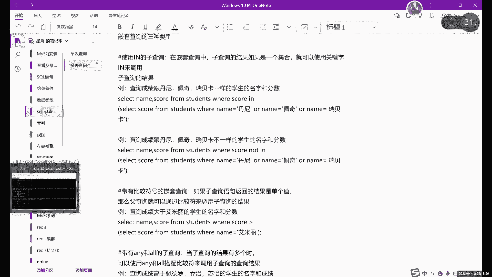

就比如说啊我们来看一下这里我们哪三位同学。

丹尼佩奇RBC对吧，select信号from，首先呢这个嵌套查询大家写的时候啊，大家注意啊，我教大家怎么洗啊，嵌套查询呢你不要说从头往后写啊，你可能一下可能脑子转不过来，你怎么写呢，你先写第二个语句。

就先写那个条件的语句，就比如说先写那个成绩的SORE对吧，写成绩的查出来之后呢，啊在这成绩的基础上再去写这个什么，写这个这个叫，过滤这个名字和成绩的嘛对吧，那我们先把成绩拿出来，怎么拿呢。

就是name等于，配齐对吧，一个二两个，然后第三个二。

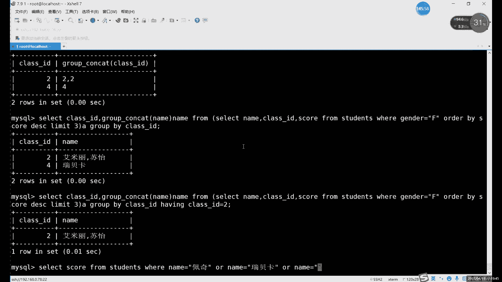

三个是什么来着。

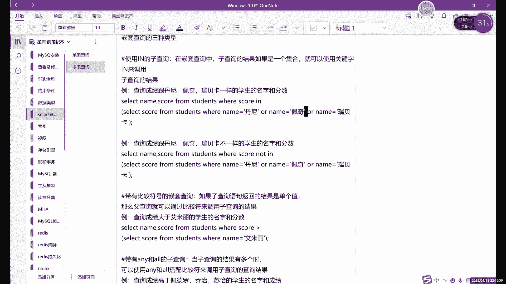

啊丹尼，对吧，这个就是什么，这个就先我们先把成绩查出来，查出成绩之后呢，我们把这个用括号括起来，括号括起来之后呢，诶中文吧，快快来之后呢，他就是一个什么，它就是一个条件了，它就是一个集合了对吧。

那集合的话我们就可以倒着写嘛对吧，SCORE这个的话就是一个条件了啊，就是一个完整的条件，包括这几个成绩的一个同学，这个成绩的集合就在这里，然后呢where去限制条件对吧，前面的from呢加上什么。

加上这个具体函数，表格名称啊，还是表格名称对吧，前面最后呢就是select我们具体要显示的内容，可以直接slicing from，诶这里的话我们写了几分，嗯哦我们最后这里，我们是没有单一。

这个同学应该是啊，我们这个表格里好像没有担心这个同学好。

啊没有没有的话，那就不用管了对吧，那这个就是查询一下什么的，这里的话如果说你换成and这里的话，其实你一点东西都没了，因为因为甚至我们这里还有一个什么，有一个没有成绩的啊，没有成绩的。

不是说就是不在我们表格当中的，所以最后最后查出来的啊，因为没有相同的成绩吧，我看一下这里咱们哪个成绩是一样的，八十九十唉，90的这个是一样的哦，但是你写错了，啊这下就多了对吧，佩奇和这个瑞贝卡这里的话。

他俩他俩的这个成绩是独一无二的对吧，但是呢丹尼这里的话有一个哎数一的话，它也是这个成绩对，也是这个成绩，所以这个的话就能查出来什么，就是和这三位同学同学成绩相同的，同学的一个成绩对吧，有点绕口。

但是呢这个话这个确实是一个语句，才是查不出来的啊，这种情况下我们就用两个语句啊。

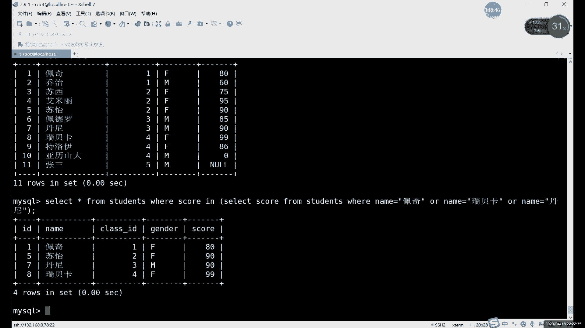

两个语句，然后下面的话我们查询什么，查询成绩和单元配齐啊，瑞贝卡，不一样的学生的一个名字和分数查询不一样的，不一样的话就是什么。

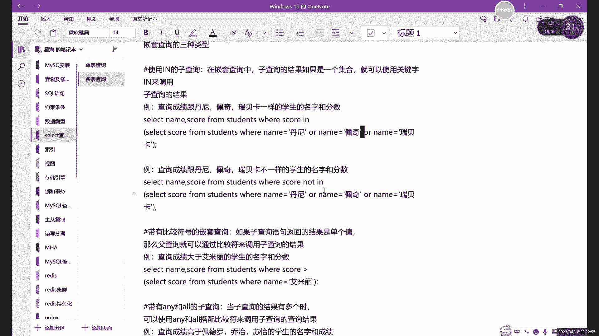

就是用not in是吧，用not，就是这个嵌套查询的话，其实除了我们用了两个语句之外呢，其他的用法呢和我们之前讲的那些语句的用法，其实是完全一样的啊，他们就是其实是，在这个普通的基础上。

就是把一个语句相当于是变成两个语句使用啊，两个一起用，这个话是什么，这个就是我们的这个签到查询啊，用硬用印象上去，就像长期留言，其实并不是所有的条件都能用啊，因为什么呢。

因为我们这里呢就比如说你的模糊查询能用，那不能用，因为我们这里这根本就不是一个什么，它就不是一个像我们之前是一样的一些值了。

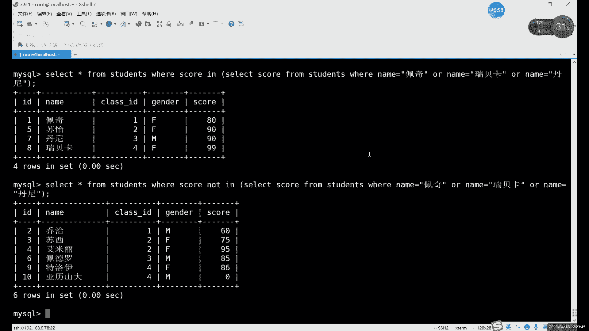

它其实是一个语句的一个结果啊，因为它是一个语句的结果，所以说呢我们能用的其实就包括in，还有什么呢，比赛也不能用了，因为比赛呢它里面需要有两个结果，所以说我们这里就是in，还有什么呢，还有这个比较符号。

还有any2这几个any和all，这里的话唉他和an和二呢就有怎么说呢，其实呢有点区别啊，你可以说有点区别，但其实呢是一个道理啊，这里的any和all呢，和我们的and or是一个一个道理的一个道理。

就比如说我们来看一下这里啊，最后来看一下这部分啊，这是我们先到查询的这个mm和二两个特殊用法，也是在比较的时候，在比较的时候，当子查询结果有多个的时候，你就可以用any和二进行比较对吧。

刚才我们是等于号嘛对吧，in是相当于等于号啊，如果说不想让它等于二，是需要去比较大小的时候呢，比如大于二大于小于二，小于E呢，其实就是两种用法哎，就是几种不同的用法，那首先我们先来看第一个啊。

我们这里其实演示其实不重要，大家只要理解这部分其实就好，因为这个的话其实就是大于所有的啊，你从字面上意义理解大于所有的什么意思呢，就是大于最大的啊，我们这几个城这里的这个这些值的话，其实也是什么。

也是数值，也是数字，所以说大于最大的就是大于所有呢，其实是大于最大的意思，那大于这个any any是任意的意思对吧，就任意一个结果都行，他的意思就是大于大于AI的，就是大于任何的，那其实就是大于最小的。

那就是大于ANNA的意思，那反过来说呢，大家可以思考一下，小于二，小于二呢其实就是什么，就小于我们子查询当中的所有结果，那就小于谁呢，小于最小，那小于你，啊小于你就是小于最大啊，这就是按钮二。

它和and和or其实挺像的，大家可以思考一下，其实挺像他的，and和and和or的话，它是在查询条件里面进行一个限制吗，啊在条件条件里面进行一个限制，这个这个大于零啊，大于二呀，这几个是什么呢。

这个它是在，它其实也是查询结果哎，不一样的就是什么呢，就是啊这个二呢就是大于，就是不管是大于还是小于，就是需要D要大于，大于的话就大于所有大于最大的，小于就是小于最小的啊。

这就是2D的话其实就是和它就是相反，大于利呢就是大于最小的小于哎，就是小于最大的就是反过来就行啊，这个只要你知道一个另一个你反过来说就行啊，反过来说就行，这个是判断语句啊，这个是嵌套语句里面的一种。

特殊的叫判断的语句啊，判断语句，判断语句的话，两个语句呢没有人没有这个绝对联系啊，就判断语句里其实两个语句没有绝对的联系啊，可以说是啊，可以有联系，当然也可以没有什么意思呢，就是判断语句的话。

就是括号里面的子的查询语句，如果成立的话，或者说有结果，就是这个的话，就是它其实是判断一个世界，返回结果是否为空啊，这is判断的内容就是返回结果是否为空，如果返回结果为空，那我们的这个查询的话就不执行。

如果返回结果有内容，那我们就执行哎这个就是什么，这就是X判断语句啊，这里我们可以给大家演示一下这个吧，演示一下这个啊，上面的any all的话，其实和and on一个倒数。

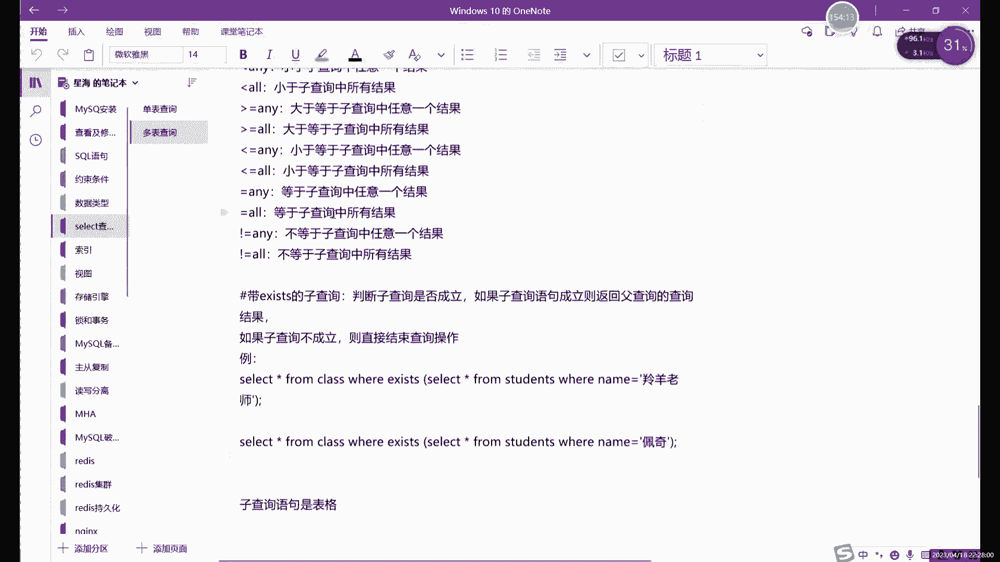

我们这个先就先来说一下这个access啊，首先的话判断的是谁呢，判断是括号里面的，就比如说select型号from students，Where，class id米六这个语句它有没有呢。

不是这个语句它有没有结果呢，它其实没有，为什么呢，因为没有六班对吧，我们现在没有六班，他就是返回一个空值啊，他不会报错，但是返回空值，那这active的作用就是判断它是否为空，哎就少了一个字母啊。

判断它是否为空。

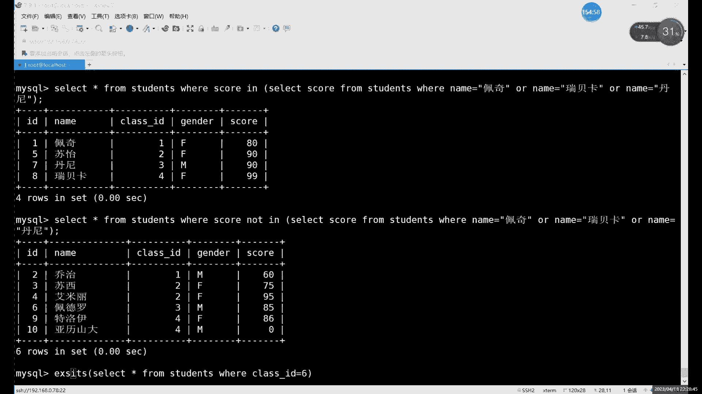

比如说哎如果说我们后边呢它是什么，它没有啊。

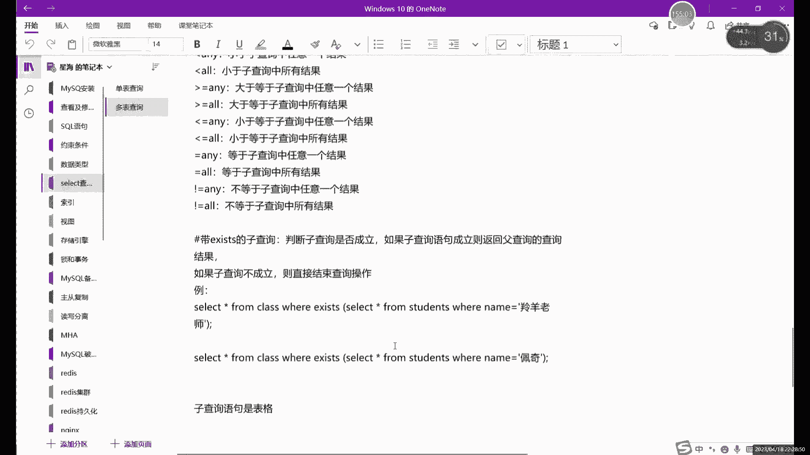

他前面就不会执行啊，前面写什么呢，其实写什么都无所谓，因为前面这个语句呢，前面这个语句呢不重要啊，前面这个语句不重要，看一下啊，嗯flag，新from pass is alex。

然后select的新form dw，他告诉在select前面。

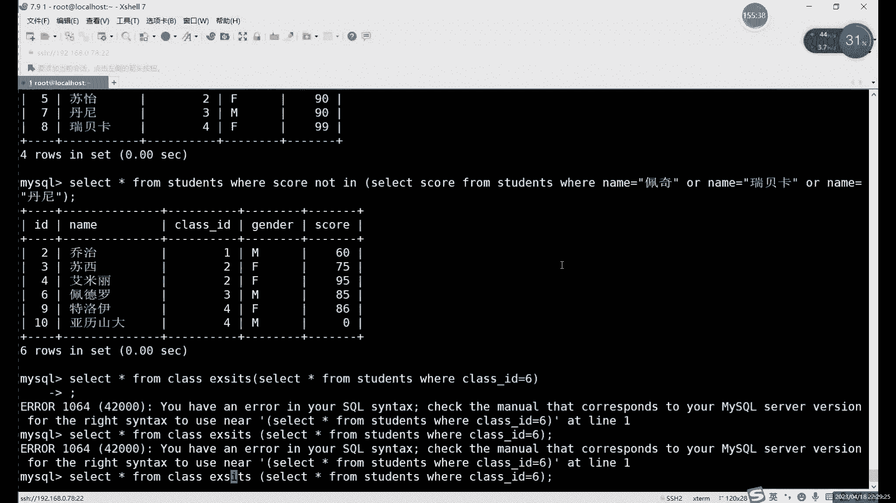

还少了一个什么来着。

哦对这个都这个在WR这里啊，因为它是相当于一个什么呢，嗯它相当于一个限制条件的这个限制条件，它比较特殊一点啊，就access它这个限制条件，它是属于一个判断的限制条件。

就是你如果说我们后面的结果呢是成立的，他就执行前面的语句，如果不成立，那它就不执行，诶，这里怎么还有问题啊，SELLY信号，students wear class id等于六，单词错了，啊X。

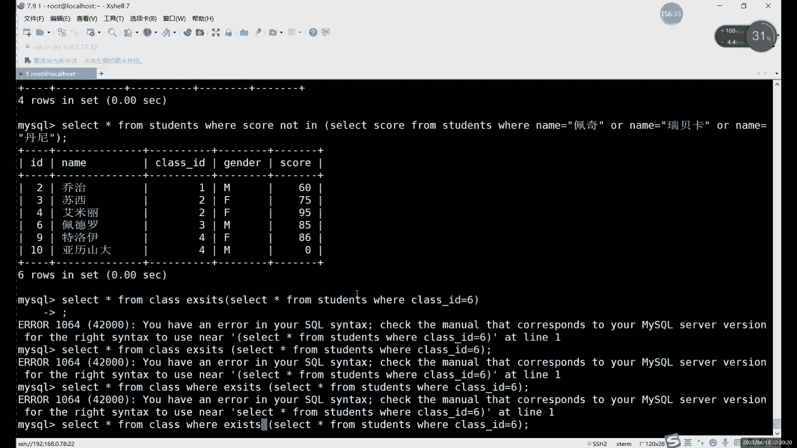

然后呢这里就显示什么，它就显示一个空值啊，它就显示一个空值，就是判断一下后边的是否正确，它其实是判断后面是否为空，它为空的话，那我们就不执行了，它就是空了，那如果他是正常的话，比如说我们换成一个什么。

换成一个五五。

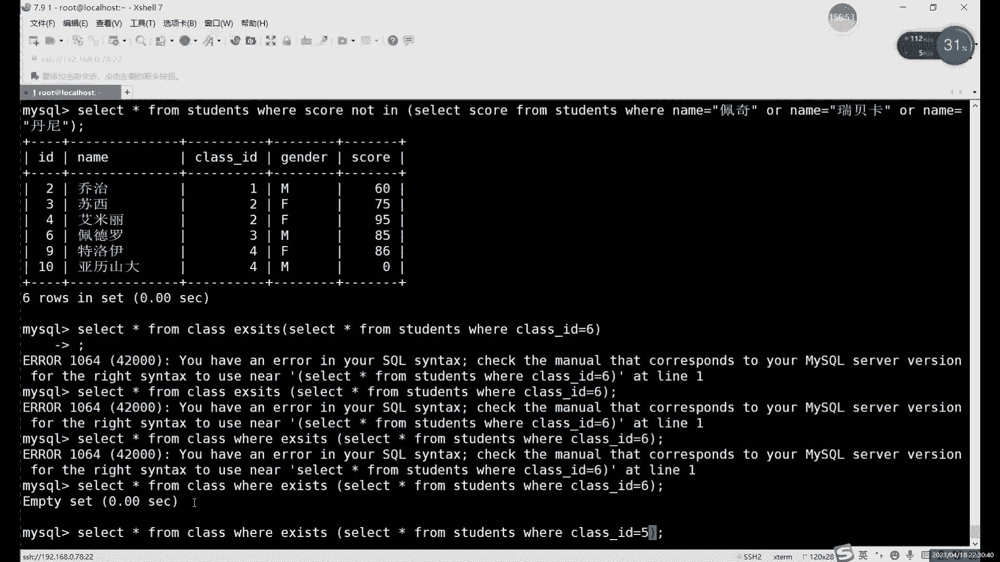

我们是有的对吧，虽然说呢只有一条信息，但是呢它有对吧，它有它有的话就是指引前面的，就是后边前面的语句呢，它没有必然的联系，就只用来只是用来判断的，还是用来判断的，啊这里的话就是你前面啊。

前面这个其实就是用来看一下它是否生效啊，也是否有有这个具体的值啊，有具体的值，啊这个的话就是什么，这个就是我们这个嵌套查询的用法线查询的话，主要还是注意什么呢，啊注意一下，我们第一次讲那个签到查询。

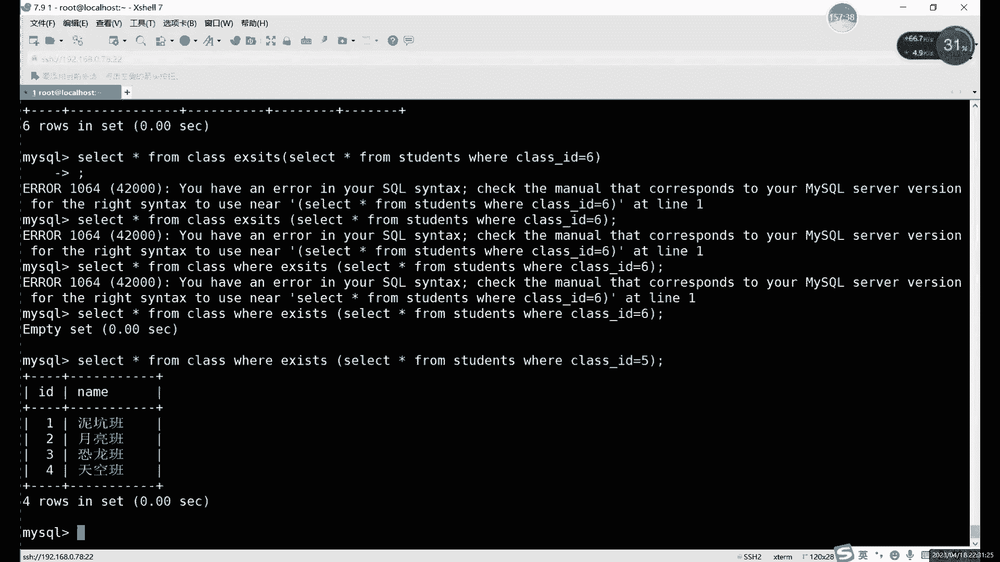

就是，from表格，这里这种嵌套的话，需要给嵌套的这个里面的子的查询语句呢，加一个表格的别名啊，请后面前面的两种其实还好，因为前面两种的话，其实就是两个语句套在一起了啊，第二个语句的话。

它是第一语句的一个条件对吧，一般就是in呀，in就是等于嘛，然后是比较符号大于号小于号，然后呢如果比较只有多个的话，用按钮啊，以最后一个判断的access，啊是表格的那个，我们前面其实就已经试过了对吧。

是表格那个其实主要注意记得要加别名啊，就加别名以及什么，以及你执行的时候，其实可以先执行一下那个表格，看一下表格现在目前长什么样子，知道那个表格长什么样子之后呢，继续再对这个表格进行二次的一个限制。

二次的一个啊排序也好啊，你再想分组也好都可以啊，这个的话就是我们的一个嵌套啥嗯，总之呢其实这个签到查询的话，其实怎么说用的材料还挺多的，因为一些就比如说像这些内容对吧，你看到这个题呢，其实你。

嗯怎么说呢，因为你没有什么呢，因为你没有分数吗，没有分数的话，你就肯定是不能直接写这个的对吧，肯定是不能写这个的，就只能不能直接写in，后面加分数1万1，因为你不知道吗，不知道的情况下的话，就只能什么。

只能是先查一下啊，先把这个结果呢放到这里对吧，唉后边的也是一样的对吧，比如说查成绩，高于这三个同学的成绩的名字对吧，这三个成同学的成绩又不知道，那怎么办呢，那就先再查一下这三个同学的成绩。

然后呢再去比较，这里比较的时候呢，多个比较呢用啊，或者说你这个的话就需要看什么，看你具体的一个使用的场景对吧，具体的几种不同的这个你就可以看这个啊，如果说能分清楚的话就还好啊，如果分不清楚。

你可以看一下这个啊，看一下这个你记的话就只记时态，分不清楚，只记一个R就行了，any就是相反的啊，你就永远知道你行，二是相反的，它有一个查询结果啊，这个话就是我们这个嵌套查询啊，然后下节课的话。

我们继续把最后啊我们查询的话，现在就最后剩下一小部分，哪一部分就是多表查询对吧，我们现在之前对这节课一直讲的是什么，一直是单调啊，不管是前面这些各种用法也好啊，还是会给我们讲这个特殊的嵌套查询。

这其实都算是单表查询对吧，你哪怕你是这个嵌套对吧，嵌套这里其实你也算什么，它其实归根到底还是一个表晚嵌套，它其实这还是仪表，那我们接下来的话就下节课的话，我们讲一下这个多表查询，多表查询。

多表查询的话呢，顾名思义其实就是什么，就是同时呢对多张表进行查询啊，这个答案可以有时间可以预习一下啊，对多少表现常用同时进行查询，这种查询的话，还有就是一般就是有一有两个啊，它有联系的表。

它里面有两有两部分不同的数据，你想要同时去看这些数据的话啊，同时看这些数据，同时去对比这些数据，那就只能用到这个多角差行了，因为你一个表的话，没网将两个表的数据联系在一起啊。

就是这个的话就是我们的哎坐标查询啊，多表查询好，下节课的话我们先来讲多表查询。

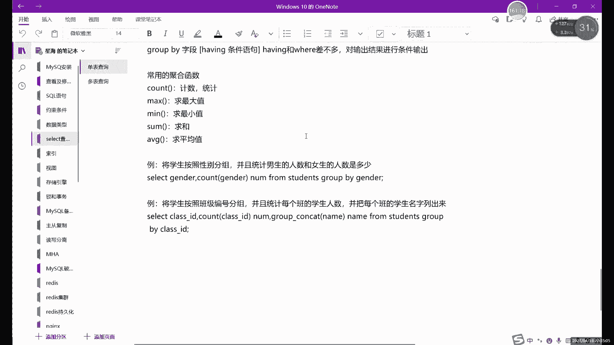